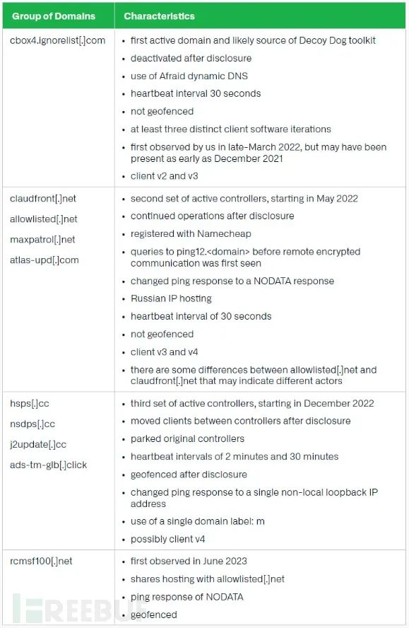

安全厂商 Infoblox 的调查研究显示，一个名为 DecoyDog（诱饵狗）的复杂恶意工具包通过域名系统（DNS），从事网络间谍活动已达1年以上。

目前尚不清楚该恶意软件的幕后黑手是谁，但 Infoblox 的研究人员认为，有4个参与者正在利用和开发该恶意软件来进行具有高度针对性的操作。由于观察到的范围仅限于俄罗斯和东欧地区，似乎该活动与俄乌战争有关。

## 

**DecoyDog仍在活跃**

虽然 Infoblox 只分析了 DecoyDog 的 DNS 和网络流量，但由于它基于 Pupy，因此它很可能是在受感染的设备上下载恶意软件负载并执行攻击者发送的命令。

4 月初，Infoblox 专家在6个存在异常 DNS 信标活动的域中发现了DecoyDog，这些域充当该恶意软件的命令和控制 (C2) 服务器：

-   cbox4\[.\]ignorelist\[.\]com
    
-   claudfront\[.\]net
    
-   hsdps\[.\]cc
    
-   ads-tm-glb\[.\]click
    
-   atlas-upd\[.\]com
    
-   allowlisted\[.\]net
    

当时，研究人员表示，他们发现企业网络中出现了相同的 DNS 查询模式，无法与消费设备联系起来，并确认查询源自数量非常有限的客户网络中的设备。

在 Infoblox 宣布发现并发布技术分析报告后，DecoyDog并没有停止活动，分析报告显示，DecoyDog 在很大程度上是基于 Pupy 开源漏洞后远程访问木马（RAT）。最新的报告表明，DecoyDog是 Pupy 的重大升级，使用了公共存储库中没有的命令和配置。具体观察到的差异包括：

-   使用 Python 3.8，而 Pupy 是用 Python 2.7 编写的；
    
-   许多改进，包括 Windows 兼容性和更好的内存操作；
    
-   通过添加多个通信模块显著扩展了 Pupy 中的通信词汇量；
    
-   会响应先前 DNS 查询的重播，而 Pupy 则不会；
    
-   能响应通配符 DNS 请求，使被动 DNS 中的解析数量增加了一倍；
    
-   能响应与客户端有效通信结构不匹配的 DNS 请求；
    
-   能将任意 Java 代码注入 JVM 线程来增加运行任意 Java 代码的能力，并添加在受害设备上维持持久性的方法。
    

Infoblox 威胁情报主管 Renée Burton 透露，目前DecoyDog 域名服务器、控制器和域的数量已超过20个。

【DecoyDog控制器列表】

## 

**目标明确的恶意软件**

根据被动 DNS 流量分析，很难确定DecoyDog客户端的准确数量，这将表明受影响设备的数量，但 Infoblox 在任何一个控制器上观察到的最大活跃并发连接数不到 50 个，最小的只有 4 个。Burton预估，目前被入侵设备的数量仅有几百台，表明目标非常小，是典型的情报行动。

在Infoblox披露DecoyDog后，该恶意软件开始增加地理围栏机制，限制控制器域对来自特定地区 IP 地址的 DNS 查询响应。

Infoblox发现其中一些服务器只有通过俄罗斯 IP 地址DNS 查询时才会响应，而其他服务器则会响应来自任何地点的任何格式良好的查询。这可能意味着受害者位于俄罗斯，但攻击者也可能选择将受害者流量路由到该地区作为诱饵或将查询限制为相关查询。Burton 倾向于前者，认为DecoyDog 的行为类似于 Pupy，并使用默认的递归解析器连接到 DNS。由于在现代网络中改变这一系统相当具有挑战性，因此这些受害者很可能在俄罗斯或邻近国家（也可能通过俄罗斯路由数据）。

## 

**TTP 指向多个参与者**

Infoblox 根据观察到的战术、技术和程序 (TTP) 来区分操作DecoyDog的4个参与者。然而，他们似乎都会响应与DecoyDog或 Pupy 格式匹配正确的查询。

Burton指出，这种奇怪的行为可能是有意为之，但即使作为密码学家、情报人员和数据科学家，拥有丰富的经验，她也无法归结清楚具体的原因。如果有多个 DecoyDog参与者的理论属实，那么可能有两个参与者用新功能对其进行了改进。

根据 Burton 的说法，4个参与者中有一个拥有公共存储库中最先进的 DecoyDog 版本 ，其客户端连接到控制器 claudfront\[.\]net。该参与者中的另一个控制器为maxpatrol\[.\]net，但没有观察到连接行为，这可能与 Positive Technologies 的漏洞和合规管理系统类似。Positive Technologies 是一家俄罗斯网络安全公司，因贩卖国家支持的黑客组织使用的黑客工具和漏洞利用程序在 2021 年受到美国制裁。

Infoblox 指出，DecoyDog的新版本附带了域名生成算法 (DGA)充当紧急模块，如果恶意软件长时间无法与其 C2 服务器通信，则允许受感染的计算机使用第三方 DNS 服务器。从第三个版本开始，DecoyDog提供了广泛的持久性机制，表明其目的是以窃取情报为主，而非出于经济动机或者是红队工具。

## 

**DecoyDog尚存诸多疑点**

目前，DecoyDog仍然比较神秘，需要进行额外的研究来确定目标、初始入侵方法（例如供应链、已知漏洞、目标设备中的零日漏洞）以及是如何进入网络的。

尽管 Infoblox 得到了信息安全社区（来自主要英特尔供应商、政府机构、威胁研究小组和金融组织）的支持，但该恶意软件的检测结果或其全部范围尚未公开披露。

Infoblox 建议防御者注意，Decoy Dog 和 Pupy 中的 IP 地址代表加密数据，而不是用于通信的真实地址，并关注 DNS 查询和响应，因为它们可以帮助跟踪恶意软件活动。

该公司还创建了一条 YARA 规则，可以检测研究人员自 7 月以来观察到的 DecoyDog 样本，并与公共版本的 Pupy进行区分。

_文章转自“关键基础设施安全应急响应中心”，如涉及版权问题，请联系删除。_