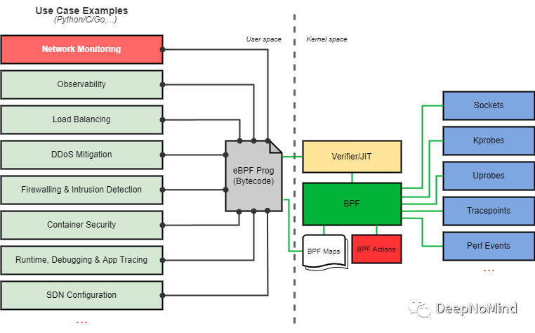

> _eBPF可以灵活扩展Linux内核机制，本文通过实现一个DNS监控工具为例，介绍了怎样开发实际的eBPF应用。原文: A Deep Dive into eBPF: Writing an Efficient DNS Monitoring_

eBPF<sup>[1]</sup>是内核内置的虚拟机，在Linux内核内部提供了高层库、指令集以及执行环境，被用于诸多Linux内核子系统，特别是网络、跟踪、调试和安全领域。其功能即支持改变内核对数据包的处理，也允许对网络设备(如智能网卡)进行编程。



eBPF实现的用例。

已经有大量各种语言的关于eBPF的介绍文章<sup>[2]</sup>，所以本文不会过多涉及eBPF的细节。尽管许多文章都提供了相当多的信息，但都没有回答最重要的问题: eBPF是如何处理数据包并监视从主机发送给用户的数据包的？本文将从头开始创建一个实际的应用程序，逐步丰富其功能，特别是监控DNS请求、响应及其过程，并提供所有这些过程的解释、评论以及源代码链接。因为想多举几个例子，而不仅仅只是单一问题的解决方案，因此有时候我们会稍微有点偏题。最终希望那些想要熟悉eBPF的人可以花更少的时间研究有用的材料，并更快的开始编程。

##### 简介

假设主机可以发送合法的DNS请求，但发送这些请求的IP地址是未知的。在网络过滤器日志中，可以看到不断受到请求，但不清楚这是合法请求，还是信息已经泄露给了攻击者？如果发送数据的服务器所在的域是已知的，那就容易了。不幸的是，PTR已经过时，SecurityTrails显示这个IP要么什么都没有，要么有太多乱七八糟的东西。

我们可以执行\*tcpdump\*<sup>[3]</sup>命令，但是谁愿意一直盯着显示器呢？如果有多个服务器又怎么办呢？ELK技术栈里有\*packetbeat\*<sup>[4]</sup>，这是一个可以吃掉服务器上所有处理器处理能力的怪物。\*Osquery\*<sup>[5]</sup>也是一个很好的工具，它非常了解网络连接，但不了解DNS查询，相关支持已经不再提供了。\*Zeek\*<sup>[6]</sup>是一个我在寻找如何跟踪DNS查询时了解到的工具，看起来还不错，但有两点让人感到困惑: 它不仅仅监视DNS，这意味着资源还将花在我不需要的工作上(也许尽管可以在设置中选择协议)，它也不知道是哪个进程发送了请求。

我们将用Python并从最简单的部分开始编写代码，从而理解Python是如何与eBPF交互的。首先安装这些包:

```
#apt install python3-bpfcc bpfcc-tools libbpfcc linux-headers-$(uname -r)
```

这是在Ubuntu下的命令，但是如果想要深入内核，为其他发行版找到必要的包应该也不是问题。现在让我们开始吧:

```
#!/usr/bin/env python3from bcc import BPFFIRST_BPF = r"""int first(void *ctx) {  bpf_trace_printk("Hello world! execve() is calling\n");  return 0;}"""bpf = BPF(text=FIRST_BPF)bpf.attach_kprobe(event=bpf.get_syscall_fnname("execve"), fn_name="first")while True:    try:        (_, _, _, _, _, event_b) = bpf.trace_fields()        events = event_b.decode('utf8')        if 'Hello world' in events:            print(events)    except ValueError:        continue    except KeyboardInterrupt:        break
```

> _**注意:** 在Ubuntu 20.04 LTS和18.04 LTS中，默认情况下允许无特权用户加载eBPF程序，但在最近的Ubuntu版本(21.10和22.04 LTS)中，出于安全考虑，默认禁用了这一功能。通过以下命令可以重启此能力:_
> 
> _$ sudo sysctl kernel.unprivileged\_bpf\_disabled=0_

与所有hello-world示例一样，它没有做任何有用的事情，只是向我们介绍了基础知识。当主机上的任何程序调用execve()系统调用时，`first()`函数就会被执行。可以在另一个控制台上运行命令`ls|cat|grep|clear`或任何包含`execve()`的命令来触发，然后执行我们的代码。也可以在内核中发生的各种事件时调用eBPF程序，`attach_kprobe()`表示在调用特定内核函数时触发。但我们更习惯于处理系统调用，谁会知道对应函数的名字呢？因此，助手函数`get_syscall_fnname()`可以帮助我们将系统调用名转换为内核函数名。

eBPF中最简单的输出选项是函数`bpf_trace_printk()`，但这只是用于调试的输出。传递给这个函数的所有东西都可以通过 _/sys/kernel/debug/tracing/trace\_pipe_ 文件获得。为了避免在另一个控制台中读取这个文件，我们使用函数`trace_fields()`，它可以读取这个文件，并在程序中为我们提供其内容。

代码的其余部分比较明确，在一个能够被Ctrl-C中断的无限循环中，读取调试输出，如果出现"Hello world"字符串，就将其完整输出。

> _**注意:** `bpf_trace_printk()`可以实现类似`printf()`的格式化文本，但有重要限制: 不能超过3个参数，并且只有一个参数是`%s`。_

现在我们已经大致了解了如何使用eBPF，接下来我们开始构建一个实际的应用程序，监视所有DNS请求和响应，并记录谁问了什么以及收到了什么响应。

##### 开始

我们从eBPF开始，处理数据包最简单的方法是将它们附加到网络套接字上。在本例中，每个包都将触发我们的程序。稍后我们将详细说明这是如何完成的，但现在我们需要在所有数据包中捕获端口为53的UDP包。要做到这一点，必须自己拆解包结构，并在C中分离所有嵌套的协议。`cursor_advance`宏可以在包的范围内移动光标(指针)，返回其当前位置并移动到指定位置，从而帮助我们做到这一点:

```
#include <linux/if_ether.h>#include <linux/in.h>#include <bcc/proto.h>int dns_matching(struct __sk_buff *skb) { u8 *cursor = 0;// Checking the IP protocol:: struct ethernet_t *ethernet = cursor_advance(cursor, sizeof(*ethernet));if (ethernet->type == ETH_P_IP) { …
```

`proto.h`文件中描述的结构`ethernet_t`:

```
struct ethernet_t {  unsigned long long  dst:48;  unsigned long long  src:48;  unsigned int        type:16;} BPF_PACKET_HEADER;
```

以太帧格式本身非常简单，包含6个字节(48位)的目地地址，相同大小的源地址，然后是两个字节(16位)的负载类型。

负载类型由一个等于0x0800的常量`ETH_P_IP`编码，定义在文件\`\`\`if\_ether.h\`\`\`<sup>[7]</sup>中，确保下一层协议是IP(该代码以及其他可能的值都由IEEE<sup>[8]</sup>描述)。

我们继续检查IP内部是否是端口为53的UDP:

```
// Checking the UDP protocol:struct ip_t *ip = cursor_advance(cursor, sizeof(*ip));if (ip->nextp == IPPROTO_UDP) {    // Checking port 53:    struct udp_t *udp = cursor_advance(cursor, sizeof(*udp));    if (udp->dport == 53) {        // Request        return -1;    }    if (udp->sport == 53) {        // Respose        return -1;    }}
```

`ip_t`和`udp_t`仍然定义在`proto.h`中，但`IPPROTO_UDP`来自于\`\`\`in.h\`\`\`<sup>[9]</sup>。一般来说，这个例子并不完全正确。IP结构已经有点复杂了，它有可选字段，因此头部长度有可能不一样。正确做法是首先从头部获取其长度值，然后执行偏移，但我们才刚刚开始，不需要搞得太复杂。

这就很简单的找到了DNS包，接下来需要分析它的结构。为了简单起见，我们把包传递给用户空间(为此返回-1，而返回码0意味着不需要复制包)。

回到Python，我们首先仍然将程序附加到套接字上:

```
#!/usr/bin/env python3import dnslibimport sysfrom bcc import BPF...bpf = BPF(text=BPF_PROGRAM)function_dns_matching = bpf.load_func("dns_matching", BPF.SOCKET_FILTER)BPF.attach_raw_socket(function_dns_matching, '')
```

与上一个例子不同，现在程序不是在调用任何函数时被调用，而是被每个包调用。`attach_raw_socket`中的空参数意味着"所有网络接口"，如果我们需要监控特定网络接口，那么就填入对应的名字。

将socket设置为阻塞模式:

```
import fcntlimport ossocket_fd = function_dns_matching.sockfl = fcntl.fcntl(socket_fd, fcntl.F_GETFL)fcntl.fcntl(socket_fd, fcntl.F_SETFL, fl & ~os.O_NONBLOCK)
```

剩下的就很简单了，使用类似的无限循环，从套接字读取数据，去掉所有头域，直接获得DNS包并解码。

完整代码如下:

```
#!/usr/bin/env python3import dnslibimport fcntlimport osimport sysfrom bcc import BPFBPF_APP = r'''#include <linux/if_ether.h>#include <linux/in.h>#include <bcc/proto.h>int dns_matching(struct __sk_buff *skb) {    u8 *cursor = 0;     // Checking the IP protocol:    struct ethernet_t *ethernet = cursor_advance(cursor, sizeof(*ethernet));    if (ethernet->type == ETH_P_IP) {         // Checking the UDP protocol:        struct ip_t *ip = cursor_advance(cursor, sizeof(*ip));        if (ip->nextp == IPPROTO_UDP) {             // Check the port 53:            struct udp_t *udp = cursor_advance(cursor, sizeof(*udp));            if (udp->dport == 53 || udp->sport == 53) {                return -1;            }        }    }    return 0;}'''bpf = BPF(text=BPF_APP)function_dns_matching = bpf.load_func("dns_matching", BPF.SOCKET_FILTER)BPF.attach_raw_socket(function_dns_matching, '')socket_fd = function_dns_matching.sockfl = fcntl.fcntl(socket_fd, fcntl.F_GETFL)fcntl.fcntl(socket_fd, fcntl.F_SETFL, fl & ~os.O_NONBLOCK)while True:    try:        packet_str = os.read(socket_fd, 2048)    except KeyboardInterrupt:        sys.exit(0)    packet_bytearray = bytearray(packet_str)    ETH_HLEN = 14    UDP_HLEN = 8    # IP header length    ip_header_length = packet_bytearray[ETH_HLEN]    ip_header_length = ip_header_length & 0x0F    ip_header_length = ip_header_length << 2    # Starting the DNS packet    payload_offset = ETH_HLEN + ip_header_length + UDP_HLEN    payload = packet_bytearray[payload_offset:]    dnsrec = dnslib.DNSRecord.parse(payload)    # If it’s the response:    if dnsrec.rr:        print(f'Resp: {dnsrec.rr[0].rname} {dnslib.QTYPE.get(dnsrec.rr[0].rtype)} {", ".join([repr(dnsrec.rr[i].rdata) for i in range(0, len(dnsrec.rr))])}')    # If it’s the request:    else:        print(f'Request: {dnsrec.questions[0].qname} {dnslib.QTYPE.get(dnsrec.questions[0].qtype)}')
```

该示例展示了哪些DNS请求/响应会通过我们的网络接口，但通过这种方式，我们还是不知道是什么进程在处理。也就是说，只有有限的信息，由于缺乏信息，我没有选择Zeek。

##### 从数据包到进程

要获取关于eBPF中的进程信息，可以使用以下函数: `bpf_get_current_pid_tgid()`、`bpf_get_current_uid_gid()`、`bpf_get_current_comm(char *buf, int size_of_buf)`。当程序被绑定到对某个内核函数调用时(如第一个示例所示)，就可以使用它们。_UID/GID_应该比较明确，但对于那些以前没有接触过内核操作细节的人来说，还是需要解释一下。在内核中被视为PID的东西在用户空间中显示为进程的_thread ID_。内核认为用户空间中的_thread group ID_是PID。类似的，`bpf_get_current_comm()`返回的不是通常的进程名(可以通过`ps`命令查看)，而是线程名。

好吧，我们总归会拿到进程数据，那怎么将数据传递到用户空间？Table就是用于此目的，通过`BPF_PERF_OUTPUT(event)`创建，通过方法`event.perf_submit(ctx, data, data_size)`传递，并通过`b.perf_buffer_poll()`轮询接收。在此之后，只要数据可用，就会调用`callback()`函数，即`b["event"].open_perf_buffer(callback)`。

下面将详细介绍这一机制，但现在，我们继续从理论上进行分析。我们既可以传输数据，也可以传输数据包本身。但要做到这一点，必须为传输的数据选择一个特定长度的变量。怎么选？直接回答是_512字节_，但并不正确。这一长度并没有考虑EDNS，而且我们还想正确跟踪基于TCP的DNS报文。因此我们不得不分配大量的预留空间，而更大的包将会被丢弃，大多数情况下，我们将分配比所需更多的内存。我不喜欢这种方法，幸运的是，还有另一个方法: `perf_submit_skb()`。除了数据外，它还从缓冲区传输指定字节的数据包。但需要注意，该方法仅适用于网络程序eBPF: 套接字，XDP。也就是说，我们无法获得有关进程的信息。

幸运的是，可以使用多个eBPF程序并互相交换数据！这也可以通过Table来实现。声明如下:

```
BPF_TABLE_PUBLIC("hash", key, val, name, max_elements);
```

这是为了使其对其他eBPF程序可用。在另一个程序中，通过如下代码访问:

```
BPF_TABLE("extern", key, val, name, max_elements);
```

因此，即使5元组(协议、源地址、源端口、目的地址和目的端口)都一样，也不会丢失数据包，键将是以下结构:

```
struct port_key {     u8 proto;     u32 saddr;     u32 daddr;     u16 sport;     u16 dport; };
```

值是我们想知道的关于这个进程的所有信息:

```
struct port_val {     u32 ifindex;     u32 pid;     u32 tgid;     u32 uid;     u32 gid;     char comm[64]; };
```

`ifindex`是网络设备，我们将在套接字上运行的另一个程序中填充这个值。在这里，我们用它来将整个结构转移到未来的用户空间。

总结: 当调用内核函数发送数据包时，存储涉及到的进程信息。当数据包出现在网络接口上时(不管是传出的还是传入)，检查是否在目的地之间通过这样或那样的协议传输包的任何信息。如果有，就将其与包一起传递给Python，在那里完成其余工作。

好了，我们已经讨论程序的基本逻辑，接下来开始编程吧！

##### 我的名字是进程

我们从获取相关进程的信息开始。\`\`\`udp\_sendmsg()\`\`\`<sup>[10]</sup>和\`\`\`tcp\_sendmsg()\`\`\`<sup>[11]</sup>函数用于发送数据包，两者都将\`\`\`sock\`\`\`<sup>[12]</sup>结构作为第一个参数。在eBPF中有两种方法可以访问所研究函数的实参: 将其指定为函数的形参，或者使用宏`PT_REGS_PARMx`，其中x是实参号。下面将展示这两个选项，这是第一个程序，`C_BPF_KPROBE`:

```
// The structure that will be used as the key for // eBPF table 'proc_ports':struct port_key {    u8 proto;    u32 saddr;    u32 daddr;    u16 sport;    u16 dport;};// The structure that will be stored in the eBPF table 'proc_ports' // contains information about the process:struct port_val {    u32 ifindex;    u32 pid;    u32 tgid;    u32 uid;    u32 gid;    char comm[64];};// Public (accessible from other eBPF programs) eBPF table in which // information about the process is written. // It's read when a packet appears on the socket:BPF_TABLE_PUBLIC("hash", struct port_key, struct port_val, proc_ports, 20480);// These are two ways to get access to the function arguments://int trace_udp_sendmsg(struct pt_regs *ctx) {// struct sock *sk = (struct sock *)PT_REGS_PARM1(ctx);int trace_udp_sendmsg(struct pt_regs *ctx, struct sock *sk) {    u16 sport = sk->sk_num;    u16 dport = sk->sk_dport;      // Processing packets only on port 53.    // 13568 = ntohs(53);    if (sport == 13568 || dport == 13568) {        // Preparing the data:        u32 saddr = sk->sk_rcv_saddr;        u32 daddr = sk->sk_daddr;        u64 pid_tgid = bpf_get_current_pid_tgid();        u64 uid_gid = bpf_get_current_uid_gid();        // Forming the key structure.        // These strange transformations will be explained below.        struct port_key key = {.proto = 17};        key.saddr = htonl(saddr);        key.daddr = htonl(daddr);        key.sport = sport;        key.dport = htons(dport);        // Forming a structure with the process properties:        struct port_val val = {};        val.pid = pid_tgid >> 32;        val.tgid = (u32)pid_tgid;        val.uid = (u32)uid_gid;        val.gid = uid_gid >> 32;        bpf_get_current_comm(val.comm, 64);        //Writing the value into the eBPF table:        proc_ports.update(&key, &val);    }    return 0;}
```

使用`tcp_sendmsg`也完全一样，唯一的区别是，在结构`port_key`中，字段`proto`将等于6，这两个值(17和6)分别是UDP和TCP的协议号，可以在`/etc/protocols`文件中查看这些值。

两个`bpf_get_current_*`函数都返回64比特，因此我们分别获取高低32比特来提取数据。此外，对于PID/TGID，我们可以立即以常见的形式获取(例如，对于PID，写入字段的高32位，其中包含内核认为是TGID的内容)。

我们接下来看看关键数据结构的转换。在下一节中，我们将在程序中创建一个类似的结构。但我们不是从原子结构`sock`中获取数据，而是从eBPF的\`\`\`\_\_sk\_buff\`\`\`<sup>[13]</sup>中，数据的存储形式为:

```
__u32 remote_ip4; /* Stored in network byte order */__u32 local_ip4; /* Stored in network byte order */__u32 remote_port; /* Stored in network byte order */__u32 local_port; /* stored in host byte order */
```

##### 提取到用户空间

我们的第二个程序`BPF_SOCK_TEXT`将"挂起(hang)"在套接字上，为每个包检查对应进程的信息，并将其和包本身一起传输到用户空间:

```
// The structure that will be used as the key for// eBPF table 'proc_ports':struct port_key {    u8 proto;    u32 saddr;    u32 daddr;    u16 sport;    u16 dport;};// The structure that will be stored in the eBPF table 'proc_ports',// Contains information about the process:struct port_val {    u32 ifindex;    u32 pid;    u32 tgid;    u32 uid;    u32 gid;    char comm[64];};// eBPF table from which information about the process is extracted.// Filled when calling kernel functions udp_sendmsg()/tcp_sendmsg():BPF_TABLE("extern", struct port_key, struct port_val, proc_ports, 20480);// Table for transferring data to the user space:BPF_PERF_OUTPUT(dns_events);// Look for DNS packets among the data passing through the socket and // check if there is any information about the process:int dns_matching(struct __sk_buff *skb) {    u8 *cursor = 0;// Checking the IP protocol:struct ethernet_t *ethernet = cursor_advance(cursor, sizeof(*ethernet));     if (ethernet->type == ETH_P_IP) {        struct ip_t *ip = cursor_advance(cursor, sizeof(*ip));        u8 proto;        u16 sport;        u16 dport;        // Checking the transport layer protocol:        if (ip->nextp == IPPROTO_UDP) {            struct udp_t *udp = cursor_advance(cursor, sizeof(*udp));            proto = 17;            // Getting the data about the ports:            sport = udp->sport;            dport = udp->dport;        } else if (ip->nextp == IPPROTO_TCP) {            struct tcp_t *tcp = cursor_advance(cursor, sizeof(*tcp));            // We don't need packets where no data is transmitted:            if (!tcp->flag_psh) {                return 0;            }            proto = 6;            // Getting the data about the ports:            sport = tcp->src_port;            dport = tcp->dst_port;        } else {            return 0;        }        // If it's a DNS query:        if (dport == 53 || sport == 53) {            // Form a key structure:            struct port_key key = {};            key.proto = proto;            if (skb->ingress_ifindex == 0) {                key.saddr = ip->src;                key.daddr = ip->dst;                key.sport = sport;                key.dport = dport;            } else {                key.saddr = ip->dst;                key.daddr = ip->src;                key.sport = dport;                key.dport = sport;            }            // By the key, look for a value in the eBPF table:            struct port_val *p_val;            p_val = proc_ports.lookup(&key);            // If no value is found, then we have no information about the             // process and there is no point in continuing:            if (!p_val) {                return 0;            }            // Network device index:            p_val->ifindex = skb->ifindex;            // Transmit the structure with the process information along with             // skb->len bytes sent to the socket:            dns_events.perf_submit_skb(skb, skb->len, p_val,                                       sizeof(struct port_val));            return 0;        } //dport == 53 || sport == 53    } //ethernet->type == ETH_P_IPreturn 0;}
```

该程序的启动方式与第一个示例相同。我们在数据包中移动指针，从不同级别的协议中收集信息。当前仍然不考虑IP头的实际长度，但还是添加了一些新的东西，对于TCP包，我们将检查其标志，过滤掉不携带数据的包(_SYN_、_ACK_等)。

但我们必须恢复键，从而从`proc_ports`表中获取数据。同时，必须区分流量的方向，毕竟，当我们在表中输入数据时，意味着我们是源。但是对于传入的数据包，源将是远程服务器。为了理解数据包的移动方向，我将`ingress_ifindex`标识为0用于标识输出流量。

##### 提供服务

我们需要通过Python做三件事: 将程序加载到内核中，从内核中获取数据，并对其进行处理。

前两个任务很简单。此外，我们已经在第一个例子中考虑了使用eBPF的两种方法:

```
# BPF initialization:bpf_kprobe = BPF(text=C_BPF_KPROBE)bpf_sock = BPF(text=BPF_SOCK_TEXT)# Send UDP:bpf_kprobe.attach_kprobe(event="udp_sendmsg", fn_name="trace_udp_sendmsg")# Send TCP:bpf_kprobe.attach_kprobe(event="tcp_sendmsg", fn_name="trace_tcp_sendmsg")# Socket:function_dns_matching = bpf_sock.load_func("dns_matching", BPF.SOCKET_FILTER)BPF.attach_raw_socket(function_dns_matching, '')
```

获取数据的代码甚至更短:

```
bpf_sock["dns_events"].open_perf_buffer(print_dns)while True:    try:        bpf_sock.perf_buffer_poll()    except KeyboardInterrupt:        exit()
```

但数据处理将更加繁琐。尽管有现成模块，我们还是决定自己解析协议头。首先，我想自己弄清楚这是如何发生的(最后，尽管在当前情况下正确处理IP包头的长度没有意义，因为头域有额外选项的包将在eBPF中被丢弃)，其次是减少对模块的依赖。然而，对于直接解析DNS，我仍然（到目前为止）使用现成模块，DNS结构比IP/TCP稍微复杂一些，需要另一个模块(_ctypes_)来处理C数据类型。

```
def print_dns(cpu, data, size):    import ctypes as ct    class SkbEvent(ct.Structure):        _fields_ = [            ("ifindex", ct.c_uint32),            ("pid", ct.c_uint32),            ("tgid", ct.c_uint32),            ("uid", ct.c_uint32),            ("gid", ct.c_uint32),            ("comm", ct.c_char * 64),            ("raw", ct.c_ubyte * (size - ct.sizeof(ct.c_uint32 * 5) - ct.sizeof(ct.c_char * 64)))        ]    # We get our 'port_val' structure and also the packet itself in the 'raw' field:    sk = ct.cast(data, ct.POINTER(SkbEvent)).contents    # Protocols:    NET_PROTO = {6: "TCP", 17: "UDP"}    # eBPF operates on thread names.    # Sometimes they coincide with process names, but often not.    # So we try to get the process name by its PID:    try:        with open(f'/proc/{sk.pid}/comm', 'r') as proc_comm:            proc_name = proc_comm.read().rstrip()    except:        proc_name = sk.comm.decode()    # Get the name of the network interface by index:    ifname = if_indextoname(sk.ifindex)    # The length of the Ethernet frame header is 14 bytes:    ip_packet = bytes(sk.raw[14:])    # The length of the IP packet header is not fixed due to the arbitrary    # number of parameters.    # Of all the possible IP header we are only interested in 20 bytes:    (length, _, _, _, _, proto, _, saddr, daddr) = unpack('!BBHLBBHLL', ip_packet[:20])    # The direct length is written in the second half of the first byte (0b00001111 = 15):    # len_iph = length & 15    # Length is written in 32-bit words, convert it to bytes:    # len_iph = len_iph * 4    # Convert addresses from numbers into IPs, assembling it into octets:    saddr = ".".join(map(str, [saddr >> 24 & 0xff, saddr >> 16 & 0xff, saddr >> 8 & 0xff, saddr & 0xff]))    daddr = ".".join(map(map(str, [daddr >> 24 & 0xff, daddr >> 16 & 0xff, daddr >> 8 & 0xff, daddr & 0xff]))    # If the transport layer protocol is UDP:    if proto == 17:        udp_packet = ip_packet[len_iph:]        (sport, dport) = unpack('!HH', udp_packet[:4])        # UDP datagram header length is 8 bytes:        dns_packet = udp_packet[8:]    # If the transport layer protocol is TCP:    elif proto == 6:        tcp_packet = ip_packet[len_iph:]        # TCP packet header length is also not fixed due to the optional        # options. Of the entire TCP header, we are only interested in the data up to the 13th        # byte (header length):        (sport, dport, _, length) = unpack('!HHQB', tcp_packet[:13])        # The direct length is written in the first half (4 bits):        len_tcph = length >> 4        # Length is written in 32-bit words, converted to bytes:        len_tcph = len_tcph * 4        # That's the tricky part.        # I don't know where I went wrong or why I need a 2 byte offset,        # but it's necessary because the DNS packet doesn't start until after it:        dns_packet = tcp_packet[len_tcph + 2:]    # other protocols are not handled:    else:        return    # DNS data decoding:    dns_data = dnslib.DNSRecord.parse(dns_packet)    # Resource record types:    DNS_QTYPE = {1: "A", 28: "AAAA"}    # Query:    If dns_data.header.qr == 0:        # We are only interested in A (1) and AAAA (28) records:        for q in dns_data.questions:            If q.qtype == 1 or q.qtype == 28:                print(f'COMM={proc_name} PID={sk.pid} TGID={sk.tgid} DEV={ifname} PROTO={NET_PROTO[proto]} SRC={saddr} DST={daddr} SPT={sport} DPT={dport} UID={sk.uid} GID={sk.gid} DNS_QR=0 DNS_NAME={q.qname} DNS_TYPE={DNS_QTYPE[q.qtype]}')    # Response:    elif dns_data.header.qr == 1:        # We are only interested in A (1) and AAAA (28) records:        For rr in dns_data.rr:            If rr.rtype == 1 or rr.rtype == 28:                print(f'COMM={proc_name} PID={sk.pid} TGID={sk.tgid} DEV={ifname} PROTO={NET_PROTO[proto]} SRC={saddr} DST={daddr} SPT={sport} DPT={dport} UID={sk.uid} GID={sk.gid} DNS_QR=1 DNS_NAME={rr.rname} DNS_TYPE={DNS_QTYPE[rr.rtype]} DNS_DATA={rr.rdata}')    else:        print('Invalid DNS query type.')
```

##### 最后

启动应用程序Python代码，在另一个控制台中用\`\`\`dig\`\`\`<sup>[14]</sup>工具发起请求。

```
# dig @1.1.1.1 google.com +tcp
```

如果正确执行，程序输出应该是这样的:

```
# python3 final_code_eBPF_dns.pyThe program is running. Press Ctrl-C to abort.COMM=dig PID=10738 TGID=10739 DEV=ens18 PROTO=TCP SRC=192.168.44.3 DST=1.1.1.1 SPT=57915 DPT=53 UID=0 GID=0 DNS_QR=0 DNS_NAME=google.com. DNS_TYPE=ACOMM=dig PID=10738 TGID=10739 DEV=ens18 PROTO=TCP SRC=1.1.1.1 DST=192.168.44.3 SPT=53 DPT=57915 UID=0 GID=0 DNS_QR=1 DNS_NAME=google.com. DNS_TYPE=A DNS_DATA=142.251.12.101COMM=dig PID=10738 TGID=10739 DEV=ens18 PROTO=TCP SRC=1.1.1.1 DST=192.168.44.3 SPT=53 DPT=57915 UID=0 GID=0 DNS_QR=1 DNS_NAME=google.com. DNS_TYPE=A DNS_DATA=142.251.12.113COMM=dig PID=10738 TGID=10739 DEV=ens18 PROTO=TCP SRC=1.1.1.1 DST=192.168.44.3 SPT=53 DPT=57915 UID=0 GID=0 DNS_QR=1 DNS_NAME=google.com. DNS_TYPE=A DNS_DATA=142.251.12.102COMM=dig PID=10738 TGID=10739 DEV=ens18 PROTO=TCP SRC=1.1.1.1 DST=192.168.44.3 SPT=53 DPT=57915 UID=0 GID=0 DNS_QR=1 DNS_NAME=google.com. DNS_TYPE=A DNS_DATA=142.251.12.139COMM=dig PID=10738 TGID=10739 DEV=ens18 PROTO=TCP SRC=1.1.1.1 DST=192.168.44.3 SPT=53 DPT=57915 UID=0 GID=0 DNS_QR=1 DNS_NAME=google.com. DNS_TYPE=A DNS_DATA=142.251.12.100COMM=dig PID=10738 TGID=10739 DEV=ens18 PROTO=TCP SRC=1.1.1.1 DST=192.168.44.3 SPT=53 DPT=57915 UID=0 GID=0 DNS_QR=1 DNS_NAME=google.com. DNS_TYPE=A DNS_DATA=142.251.12.138
```

到此为止，我们已经创建了一个有用的应用程序，可以显示系统中所有的DNS查询。希望上面的解释足够详细，这样如果你对编写eBPF程序感兴趣，可以更容易开始。这段代码已经帮助我更好的了解服务器上发生的事情，以下链接可以获取完整代码。

完整代码<sup>[15]</sup>

##### 结论

这段代码还可以做得更好吗？当然可以！首先，应该增加对IPv6的支持。其次，不要再依赖IP头的固定长度，而是要对其进行解析。我拒绝使用Python库来处理数据包，不是没有原因的，在C语言中，仍然需要手动操作。第三，用C语言重写代码也很好，可以完全放弃Python，当然还要增加几行JSON输出的代码，这样在以后开发UI仪表盘时会更方便。这将导致第四点，对DNS数据包的手动分析。最后，最诱人的一点是停止查看端口(因为也许DNS数据包并不总是通过53端口)，并尝试分析每个数据包，在其中寻找那些符合DNS格式的数据包，这将使我们即使在非标准的端口上也能检测到数据包。

> 你好，我是俞凡，在Motorola做过研发，现在在Mavenir做技术工作，对通信、网络、后端架构、云原生、DevOps、CICD、区块链、AI等技术始终保持着浓厚的兴趣，平时喜欢阅读、思考，相信持续学习、终身成长，欢迎一起交流学习。  
> 
> 微信公众号：DeepNoMind

### 参考资料

\[1\]

eBPF: _https://docs.kernel.org/bpf/classic\_vs\_extended.html_

\[2\]

Awesome eBPF: _https://github.com/zoidbergwill/awesome-ebpf_

\[3\]

_tcpdump_: _https://www.tcpdump.org_

\[4\]

_packetbeat_: _https://www.elastic.co/beats/packetbeat_

\[5\]

_Osquery_: _https://osquery.io_

\[6\]

_Zeek_: _https://zeek.org_

\[7\]

`if_ether.h`: _https://kernel.googlesource.com/pub/scm/linux/kernel/git/nico/archive/+/d9cc76127bcc137e3214b9166c439e02d2060cda/include/linux/if\_ether.h#32_

\[8\]

IEEE: _https://standards-oui.ieee.org/ethertype/eth.txt_

\[9\]

`in.h`: _https://github.com/torvalds/linux/blob/master/include/uapi/linux/in.h#L43_

\[10\]

`udp_sendmsg()`: _https://github.com/torvalds/linux/blob/master/net/ipv4/udp.c#L1045_

\[11\]

`tcp_sendmsg()`: _https://github.com/torvalds/linux/blob/master/net/ipv4/tcp.c#L1478_

\[12\]

`sock`: _https://github.com/torvalds/linux/blob/master/include/net/sock.h#L352_

\[13\]

`__sk_buff`: _https://github.com/iovisor/bcc/blob/master/src/cc/compat/linux/virtual\_bpf.h#L5746_

\[14\]

`dig`: _https://linux.die.net/man/1/dig_

\[15\]

final\_code\_eBPF\_dns.py: _https://gist.github.com/oghie/b4e3accf1f87afcb939f884723e2b462_

\- END -
