前阵子有那么亿点点忙，好久没有写文章了。最近也深入做了很多 LLM Agent 应用开发方面的研究与实践，内容有些庞杂不知从何处下笔，所以打算先写篇轻松的小短文，恢复一下博客写作能力。

最近恰逢 1024 程序员节，感觉挺适合来聊聊程序员生产力工具的话题。之前在 我的生产力工具[1] 一文中介绍了很多我日常使用的工具产品。这次更新主要来自于两方面：

-   时隔两年多，我又从 Windows 阵营回到了 MacOS 的怀抱。切换过程中也发现 Windows 上有一些挺好用的小功能，也能在 Mac 上通过一些工具软件来实现。
    
-   自从去年的 LLM 浪潮开始，市面上也出现了一大波 AI 赋能的工具，也正好来谈谈我目前高频使用的一些。
    

## 原则

跟很多追求大而全的工具介绍文章不同，我在挑选工具时会有一些自己的原则：

-   遵循奥卡姆剃刀原则，工具箱应该尽量精简。每多安装一个软件，无论对于系统还是对于个人认知来说都是额外的负担。如无必要，勿增实体。
    
-   通过具体的场景或者一些方法论来寻找对应的工具。例如通过了解我们神经系统分心的一些原理，来有意识地寻找一些打造专注工作环境的工具。
    
-   倾向于符合 Unix 哲学“do one thing and do it well”的软件工具，而不是一味追求复杂而全面。
    
-   在同等条件下选择原生自带/开源/干净安装的软件产品。一般也是那些可以通过 brew 命令完成安装的软件。
    
-   有较好的数据备份/迁移支持，一般也就是那些基于靠谱的云服务，或者可以通过 git 来托管本地文件的方式留存数据。
    
-   美观。本来还想黑一下 Windows，但想想前两年用 Windows 过程中绝大多数的软件也都已经做得非常好看了。不管开发者品味如何，起码尊重一下各个操作系统推荐的设计规范和语言应该不算过分要求。
    

有了这些原则，可以帮助我们更好地管理自己的工具箱，而不是舍本逐末成了每天追求新奇软件的“收藏家”。

## 日常应用

首先来看一下不限于程序员职业属性的一些通用工具。注意在本文中我并不会介绍很多非常普遍应用的软件，例如微信，Office 等。

**1\. hidden bar[2]**

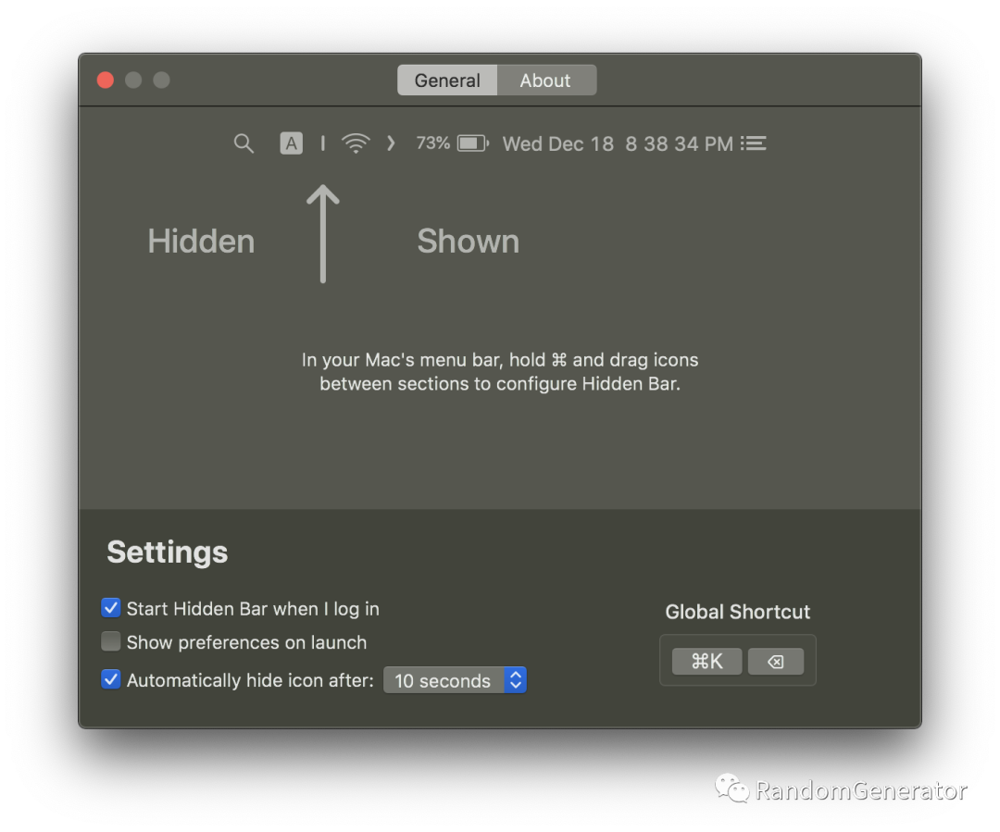

hidden bar

故名思义，这个软件主要用来管理 Mac 系统顶部菜单栏的各种图标。之所以要做这个管理，也是看了很多关于专注力相关的书籍、播客，例如《不可打扰[3]》中就提到，在你的工作空间中任何跳出来的提示，图标变化等，都会很容易造成注意力的分散。所以我默认在电脑端跟手机端都会把绝大多数的推送通知都关闭。但即使如此，如果你在专心工作时，突然余光瞄到了菜单栏的微信图标上跳了个数字出来，这时候很难抵御诱惑去点开看下到底有什么新消息进来。

利用 hidden bar 这个工具，就可以非常简单地把菜单栏里大多数图标都默认“折叠”起来，仅留下必要的比如网络标识，时间等内容。与其类似且名气更大的产品还有 Bartender[4]，功能更加丰富强大。不过对我来说基础的功能已经足够了，加上 hidden bar 也是个开源软件，因此选择了它。

**2\. rectangle[5]**

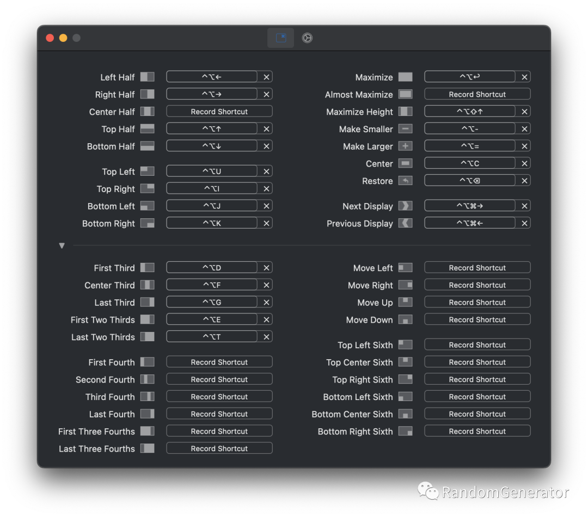

快捷窗口布局

可能是多年 Windows 的使用习惯先入为主，我一直很不习惯 Mac 上的窗口管理方式和效率。比如没法一键最大化窗口，虽然可以进入全屏模式，但这个切换的动效有点浪费时间。这个软件基本上就是模仿了 Windows 中自带的窗口管理功能，同样也是开源免费。如果是使用外接大屏的用户，这个工具就更加实用了，比如可以快速布局成左右两边分别打开 terminal 和 IDE，并行观察和开发工作。类似的工具还有 magnet[6] 等。

**3\. Maccy[7]**

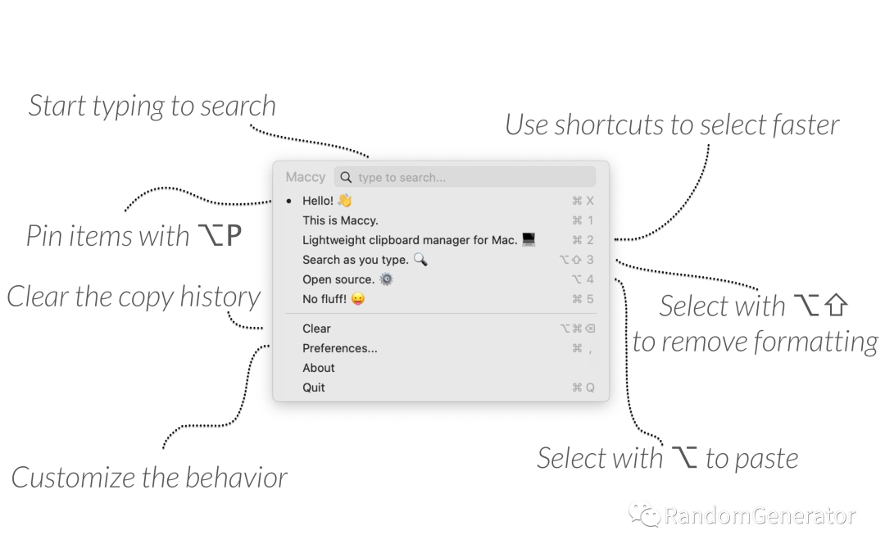

简单够用的剪贴板增强

同样也是 Windows 下默认有的剪贴板历史功能，在 Mac 下还是需要第三方软件来支持。无论是写文档，做 PPT 还是做开发调试，过程中都会有大量场景需要调出各种历史剪贴板内容，比如前面 copy 的 id 要贴到新 copy 的代码里之类。这个软件可以帮助我们快速调出剪贴板历史，而且还支持搜索、固定常用内容等，非常简洁实用。当然还有更强大的 Paste[8]，支持多端同步，颜值也要高很多。对于我们穷人来说，Maccy 也基本够用了。

**4\. stats[9]**

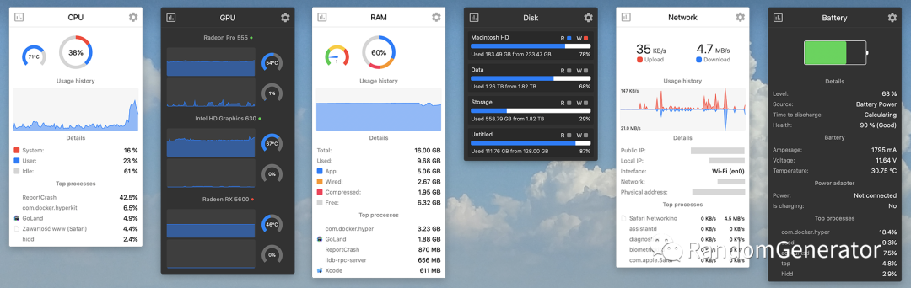

系统状态监控

简单来说就是一个在任务栏显示系统状态的工具，包括 CPU、内存、网络、电池等，而不用一直挂着 Activity Monitor 了。因为是 16G 内存 Mac，所以我主要用它来监控一下内存的使用量，确保整体系统使用体验的流畅。顺带也瞅一眼有没有特别耗 CPU 的进程（比如一些 IDE，云服务的后台任务），避免快速掉电。

**5\. EasyDict[10]**

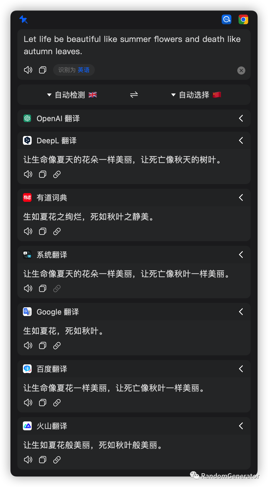

多平台翻译对比

之前需要用翻译的场景不多，所以大多数时候我都是直接在浏览器里去打开有道或者 Google Translate 做翻译。但今年以来需要写英文 prompt 的情况越来越频繁，加上有时候需要对比不同软件的翻译输出，所以就安装了这个神器 EasyDict。用下来感觉这个快捷键呼出，划词翻译等体验都非常不错。

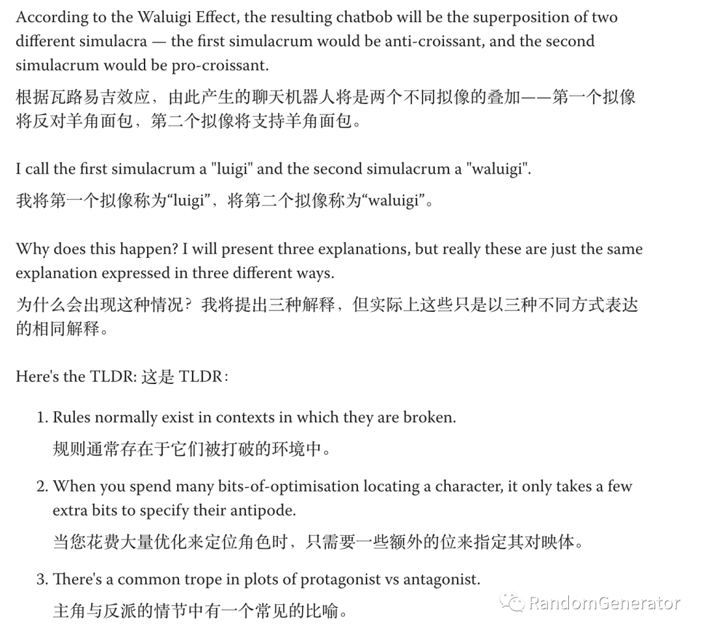

沉浸式翻译

另外在浏览器中看一些英文长文或者 PDF 时，也可以使用 immersive translate[11] 这个插件。我之前基本上都是直接读英文文章，但毕竟不是 native speaker，尝试了这个插件之后，发现有个中文对照着读还是比读原文效率上高了不少。这种一键“沉浸式翻译”的体验也的确比很多浏览器自带的全文翻译体验会更好，值得推荐。

**6\. Lofi Girl[12]**

Lofi Girl

很多人习惯在工作时听音乐，以此来提升专注。对此我也做了一些调研，尤其是 Huberman Lab 有一集也介绍了音乐对专注力的影响的很多研究。主要的结论是：

-   对于需要高专注力的工作来说，最好的状态是安静的氛围。
    
-   不过现代流行的开放式办公环境，很难有绝对安静的环境。所以通过耳机来降噪是一个可行的选择。
    
-   如果要听音乐，推荐**没有歌词**，且节奏较为舒缓的纯音乐。绝大多数流行音乐反而会对专注力有负面影响。
    
-   在进入工作前或者间隙休息时听音乐也是不错的选择，这时候选择任意喜欢的音乐一般都可以。
    

综合上述结论，我平时在工作中听音乐比较少。偶尔要听也会选择 Lo-Fi，氛围音乐或者自然界白噪音。上面推荐的这个非常知名的 Lofi Girl 是我的最爱。还有在很多文献中出现过的 40Hz binaural beats[13] 据说也对提升专注很有帮助。

**一些移除项**

之前我都会默认装上 Alfred，Raycast 之类的快速启动器，不过后来观察发现我使用它们的场景也非常浅，很多时候只是搜索个应用打开。所以目前我又切换回了只使用原生的 Spotlight。

另外像 TODO，日历管理之类也都直接使用原生应用。对于用苹果全家桶的同学来说还是挺方便也基本够用了。

## 阅读与笔记

**7\. 微信读书[14]**

原版的 PDF，EPUB 之类的书籍，用系统自带的 Books 和 Preview 就搞定了。绝大多数的中文书我都是在微信读书上看的。除了 AI 阅读的语音还是没啥进步外，其它感觉已经非常方便好用了，包括简单的标注笔记，分享，多端同步等，新出版的书一般也都能找到。对于阅读量比较大的朋友来说，微信读书的会员还是很值的。

**8\. Snipd[15]**

给播客做笔记

这是一个手机端的播客软件，我主要用它来听一些英文播客，中文的用 小宇宙[16] 搞定。它的一个突出特点是其 AI 能力，例如语音转文本，自动的段落划分和摘要生成，给播客做“笔记”（也就是 snipd 名字的由来），还可以听通过其他用户笔记生成的热门合辑等。最近 AI 功能需要付费了，不过整体来说即使只用基础功能也还挺 OK 的。

**9\. Notion[17]**

之前也折腾过所谓的“个人笔记系统”，尝试过很多 app 和复杂的流程（LogSeq，Obsidian，Notability，MarginNote，Pocket，Readwise 等等），最终还是化繁为简。现在我的日常零碎笔记基本就用苹果原生的 Notes 或者微信上发给自己（也可以考虑用 flomo[18]）。后续做笔记的整理归纳时，再放到 Notion 里。

在做一些写作输出时，当然也可以选择在 Notion 里写，但是我没有买 Notion AI 所以效率不高。可能很多同学不知道，其实 GitHub Copilot 加上 VSCode[19] 用来写文章的体验也挺好的，即时的补全提示非常丝滑。我现在基本所有的专栏文章都是在 VSCode 里写的，具体也可以参考这篇 如何写技术博客[20]。

**10\. Excalidraw[21]**

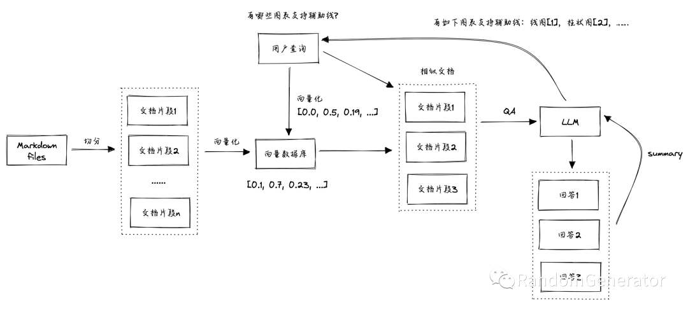

简单好用的画图工具

这是一个很神奇的画图软件，基本上每个看到我用这个产品画图的同学被安利后都会深深喜欢上它。用它来画一些简单的流程图，架构图，思维导图，甚至是一些简单的 UI 原型，都非常方便。它最大的优势可能就是自由和快捷，配合快捷键几乎可以想到哪画到哪，跟用纸笔的感觉很接近。

## AI 工具

**11\. GitHub Copilot[22]**

目前日常使用频率最高的 AI 工具，要是突然不能用会焦躁不安，浑身不舒服。除了写代码外，我现在写文章也经常依赖它来给一些提示和灵感。另外如果想用好它，其实也可以去了解一下它背后的一些原理（例如如何做的 retrieval 补全 prompt 之类），应该能达到更好的效果。

**12\. Claude[23]**

作为通用 chatbot，其实 ChatGPT，Bard，poe.com 等都挺好用的。这里简单对比一下：

-   ChatGPT[24]，如果你是付费用户，那么可以首选它。GPT-4 的能力还是独一档，而且各种插件，语音聊天，DALL-E 3 作图等能力也是让人眼花缭乱，非常强大。
    
-   Bard[25]，生成效果也不错，而且可以直接体验 GPT-4V 的识图能力。另外在生成结果后还可以利用 Google 搜索引擎来自动检查事实性如何，挺有意思。
    
-   Claude[26]，对于程序员来说可能比较有用，一方面是支持超长 context length，另一方面其代码和推理方面的能力应该是仅次于 GPT-4 的存在。如果你经常阅读学术论文，也可以尝试用它来辅助（可以直接上传 PDF 提问），效果比 ChatPDF 之类的要更好。所以我目前使用它的频率也是最高的。
    
-   Perplexity.ai[27]，算是比较强大的“问答引擎”，需要“有联网能力”的 chatbot 的用户可以尝试。我个人没有找到特别有用的场景。
    
-   浏览器插件，此外也有很多浏览器插件，我之前也尝试了很多例如 Glarity[28], Monica[29] 等。但使用频率不高，现在就干脆用 Edge 自带的了。
    

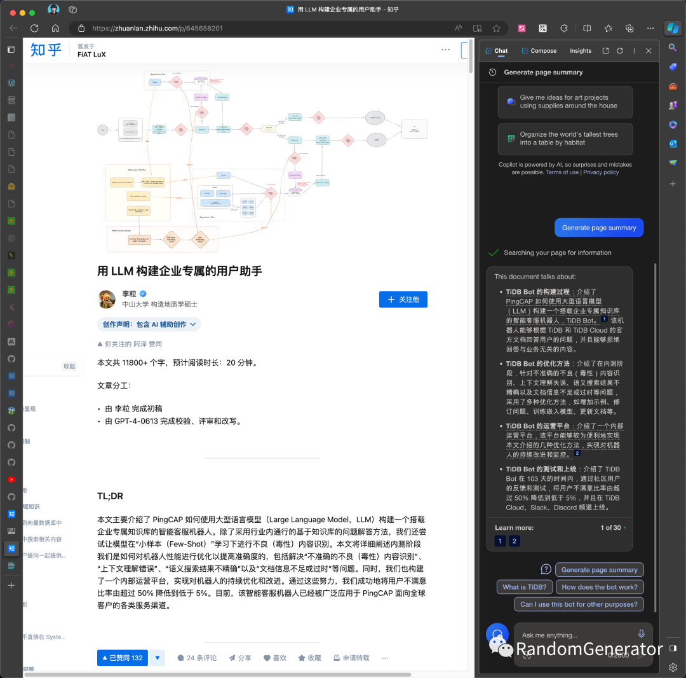

Edge 内置的 Chat 能力

## 开发工具

**13\. OrbStack[30]**

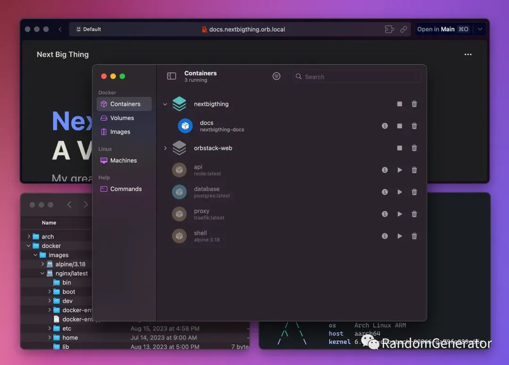

Docker 神器

前面也提到我的 Mac 只有 16G 内存，平时工作中吃内存的大户除了 IDE 就主要是 Docker 服务了。因为我主要也就是做点简单的打包和容器运行操作，所以搜了一下有没有更轻量级的产品可以替代 Docker Desktop，于是就发现了这款神器。整体体验下来无论是速度还是资源占用方面都是优势明显，不知道用了什么黑科技。从 Twitter 上看貌似作者还是个高中生，可怕……

**14\. Alacritty[31]**

之前用了好多年的 iTerm 2 + Oh-My-Zsh，后来切换到了 warp[32] + zsh，体验了下 AI 智能生成命令行的功能。不过 warp 的 block 我一直没用习惯，时不时还会出现遮挡内容的问题。再加上内容量多的时候，其整体性能也不太好，所以又折腾了一番找了找替代品。

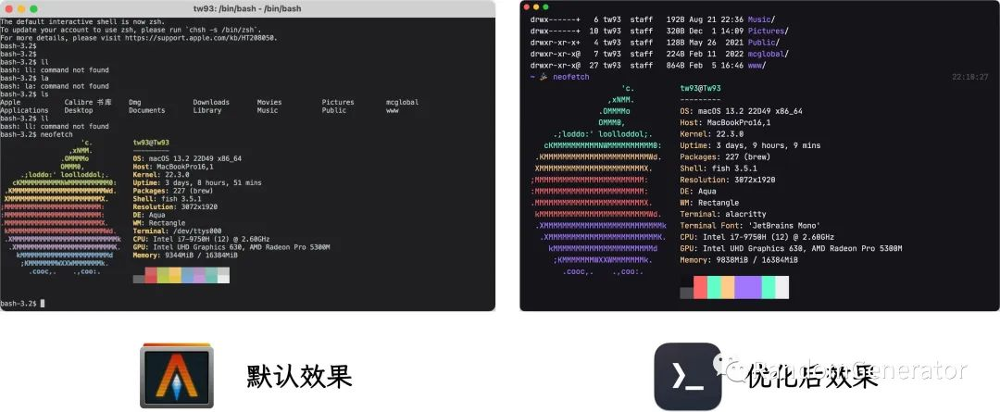

Alacritty + fish

目前主要使用的是号称最快的 terminal：Alacritty。速度的确是飞快，但功能也是极简，需要折腾配置一下。我主要参考了 这篇文章[33]，配置下来感觉还是蛮简洁美观易用的。另外也发现 fish[34] 这个 shell 的性能貌似比 zsh 更好，也一并做了切换。

如果要体验 terminal 中的 AI 能力，可以考虑安装 fig[35]。不过我体验了下，感觉安装过程还是挺重的，而且还有不少报错的小问题，后来也没继续使用。可以期待一下后续 GitHub Copilot X[36] 中类似功能的推出。

**15\. JetBrains[37]**

如果不想折腾的话，JetBrains 仍然是这个星球上最好的 IDE。不过今年我没有续费 license，用回了社区版，把省下的钱都贡献给 Copilot 了……

如果愿意折腾的话，VSCode 也是个很好的选择。今年尝试用它来做 Python 开发已经很接近 PyCharm 的体验了，没有之前那么多没法忍受的小毛病。未来可以考虑持续关注一下像 Cursor[38] 这样的 AI-first IDE。

**16\. bruno[39]**

最后是两个实用小工具，一个是 postman 的开源替代 bruno，其实我就是想要个简单的 API 调试工具，postman，insomnia 这些都纷纷搞了复杂的登陆，项目管理以及各种高级付费功能，也是难顶。类似的选择还有 hoppscotch[40]（之前叫 postwoman）。

**17\. DevToysMac[41]**

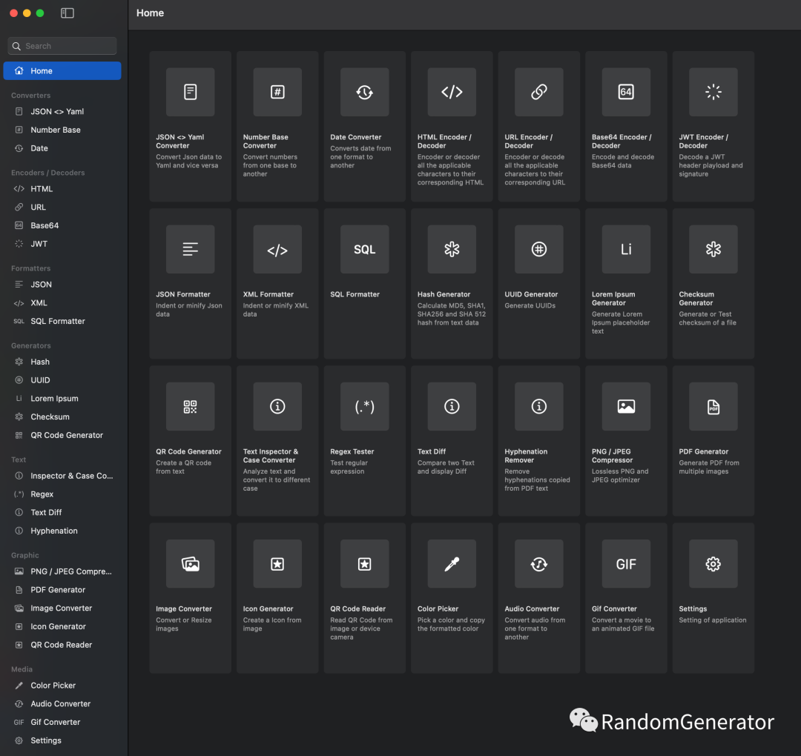

小工具集合

如果你日常工作中需要高频打开“站长工具”做类似 URL encode，JSON 格式化，正则表达测试之类的工作，那么可以考虑在本地装个 DevToys，也可以提升不少效率。

## 手机软件

最后是彩蛋环节！来介绍下手机上大幅度提升生产力的神器，那就是：

**飞行模式！！！**

即使是正常使用，个人也建议尽可能不要安装社交媒体 app（抖音，微博，小红书这类）。如果不得不安装，也不要开任何推送通知。起码我是很难跟这么多天才大佬精心打造的推荐算法抗衡的，最好的做法就是不要碰他们。

### 参考资料

\[1\]

我的生产力工具: _https://zhuanlan.zhihu.com/p/366187306_

\[2\]

hidden bar: _https://github.com/dwarvesf/hidden_

\[3\]

不可打扰: _https://book.douban.com/subject/35826855//_

\[4\]

Bartender: _https://www.macbartender.com/_

\[5\]

rectangle: _https://github.com/rxhanson/Rectangle_

\[6\]

magnet: _https://magnet.crowdcafe.com/_

\[7\]

Maccy: _https://github.com/p0deje/Maccy_

\[8\]

Paste: _https://pasteapp.io/_

\[9\]

stats: _https://github.com/exelban/stats_

\[10\]

EasyDict: _https://github.com/tisfeng/Easydict_

\[11\]

immersive translate: _https://github.com/immersive-translate/immersive-translate/_

\[12\]

Lofi Girl: _https://www.youtube.com/@LofiGirl_

\[13\]

40Hz Binaural Beats: _https://www.youtube.com/watch?v=Z8ANihFXlgU_

\[14\]

微信读书: _https://weread.qq.com/_

\[15\]

Snipd: _https://www.snipd.com/_

\[16\]

小宇宙: _https://www.xiaoyuzhoufm.com/_

\[17\]

Notion: _https://www.notion.so/_

\[18\]

flomo: _https://flomoapp.com/_

\[19\]

VSCode: _https://code.visualstudio.com/_

\[20\]

如何写技术博客: _https://zhuanlan.zhihu.com/p/465669759_

\[21\]

Excalidraw: _https://excalidraw.com/_

\[22\]

GitHub Copilot: _https://github.com/features/copilot_

\[23\]

Claude: _https://claude.ai/_

\[24\]

ChatGPT: _https://chat.openai.com/_

\[25\]

Bard: _https://bard.google.com/chat_

\[26\]

Claude: _https://claude.ai/chats_

\[27\]

Perplexity.ai: _https://www.perplexity.ai/_

\[28\]

Glarity: _https://glarity.app/zh-CN_

\[29\]

Monica: _https://monica.im/_

\[30\]

OrbStack: _https://orbstack.dev/_

\[31\]

Alacritty: _https://github.com/alacritty/alacritty_

\[32\]

warp: _https://warp.dev/_

\[33\]

这篇文章: _https://zhuanlan.zhihu.com/p/605838860_

\[34\]

fish: _https://fishshell.com/_

\[35\]

fig: _https://fig.io/_

\[36\]

GitHub Copilot X: _https://github.com/features/preview/copilot-x_

\[37\]

JetBrains: _https://www.jetbrains.com/_

\[38\]

Cursor: _https://cursor.sh/_

\[39\]

bruno: _https://github.com/usebruno/bruno_

\[40\]

hoppscotch: _https://github.com/hoppscotch/hoppscotch_

\[41\]

DevToysMac: _https://github.com/ObuchiYuki/DevToysMac_
