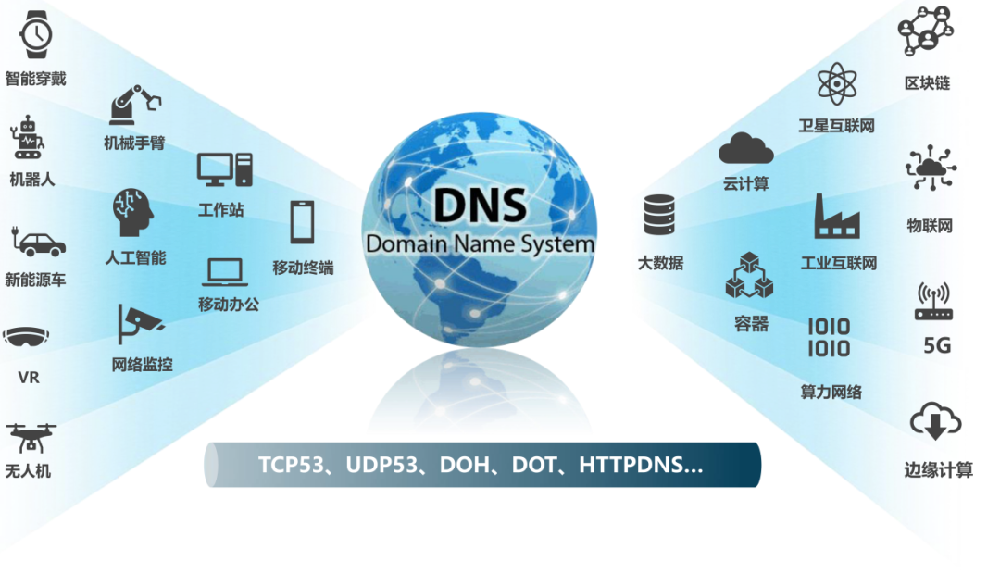
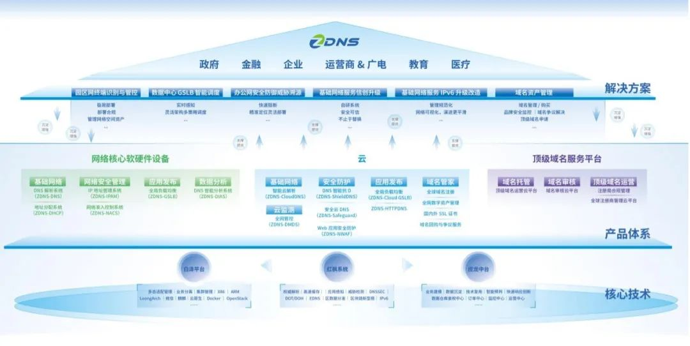

世界像是旋转舞台，每一个时代都有不同的主角。在互联网搭建戏台的光辉岁月，无数“小鲜肉”你方唱罢我登场，再回首却已成云烟。

那时，域名系统（DNS）是整个网络的“超级入口”，它把网址解析为对应的IP地址赋予终端，让光怪陆离的互联网时空拥有类似GPS的导航系统。

斗转星移，此刻的舞台已“城头变幻大王旗”，新时代的主角正渐次登场。**一方面，**终端的数量和种类急速膨胀，预计到2025年IoT设备总量将达173.4亿台，智能家居、可穿戴设备、新能源汽车、机械手臂等新型终端纷至沓来；**另一方面，**人工智能和数据要素带来的变革浪潮波涛汹涌，以网络底座为重要构成的ICT基础设施迎来蜕变的时间窗。

面对时代风口的变迁，曾经长袖善舞的DNS尚能饭否？从多个维度分析，得出的答案可谓喜忧参半。

**其一，**由“人-物”迈向“物-物”的万物互联阶段，海量终端均需通过DNS链接到网络中，实现数据的访问交互，其间蕴藏的机遇颇为可观，但对DNS支撑更多场景的能力提出前所未有的挑战。

**其二，**5G、IPv6、卫星互联网驱动的网络基础设施升级如火如荼，百亿级别连接的背后是每秒万亿的DNS查询，需求固然旺盛，却也意味着任务重责任大。

**其三，**千行百业的数字化转型催生纷繁应用，AI大模型的进化更加剧了算力和数据的军备竞赛，而DNS对海量算力的快速调度不可或缺，能否胜任新角色尚待考察。

显而易见，DNS不会缺席大时代的饕餮盛宴，但固守于过往能力圈的DNS又难以应对拾级而上的崭新需求。正是在这样的背景下，下一代DNS的成长路径成为业界关注的焦点。在近日举办的2023年世界互联网大会上，展示了全球互联网科技最新成果，下一代互联网基础资源寻址关键技术更是备受关注。

对下一代DNS而言，“超级入口”并不足以容纳其全部理想，从传统的基础解析转变为承载万物互联的“智能网络中枢”，进而推动数字经济的底层根基持续进化，才不负大时代的光荣使命。

下一代DNS的进化方向

克莱顿•克里斯坦森在其著作《创新者的窘境》中指出，延续性技术与破坏性技术存在迥异的发展路径，特别是对既有技术的再度创新来说，只有寻找更多组合型因素、建立广泛的联接，才有望实现蜕变。

DNS要想“老树开新花”，也需要找到“得道者多助”的最优路径。互联网域名系统国家地方联合工程研究中心（ZDNS）总经理邢志杰认为，下一代DNS涵盖网络空间治理、互联网关键基础资源和网络核心技术，其中网络核心技术的演进具有决定性意义，更安全、更智能、更高效是值得深耕的方向。

**各种安全技术与DNS技术紧密结合是构筑安全防御体系的基石。**根据IDC咨询发布的《2022 年全球DNS威胁报告》，88%的组织遭到DNS相关的网络安全威胁，网络钓鱼、DDoS攻击、恶意软件和DNS劫持等现象层出不穷。

面对诸多安全挑战，下一代DNS需要与各种安全技术联袂出击：与加密技术结合，实现DNS的安全传输、分发同步，突破UDP传输协议限制，提升传统DNS系统传输安全可控能力；与威胁情报技术结合，达成态势可视、主动处置、快速溯源及主动识别防护；基于深度学习和大数据技术，通过DNS隧道、DGA、域名窥探防护等方式，解决数据泄露等安全问题。

**智能调度能力向网络、云上云下延伸是下一代DNS的必由之路。**传统DNS存在应用检测维度单一、机制被动、反馈效果滞后等短板，无法适应应用从数据中心双活到全面上云的发展趋势，对业务连续性和可靠性都造成不利影响。

更智能的下一代DNS有助于建立保障应用多活、实现云化调度、提升应用体验的能力体系。应用健康检测打通“上下游”，与网络分析器、控制平台联动，未拥塞先调度，提前规避业务风险；智能调度以应用为中心，与各类云原生架构或管理系统集成，达成跨云、跨数据中心的统一调度和管控；更重要的是，从“尽力而为”向“主动推送”演进，基于有状态DNS订阅关键应用域名，服务变化即时推送，保障业务交易的高可靠。

**性能更高、部署更快、管理更简单是下一代DNS高效突围的利器。**传统DNS很难应对网络及应用架构的快速变化，解析性能低、部署繁琐且无法统一管理，故障迁移似比登天。

值得关注的是，更高效的下一代DNS能适应业务峰值更高、应用发布更快、纪录变更更频繁的复杂需求。基于全新设计的解析引擎，下一代DNS能同时达到更低时延的要求和海量配置加载，可支持万亿级设备寻址；借助虚拟化容器技术与云平台融合，以及DNS系统自身的云化，实现弹性扩缩容，部署和迁移成本显著降低；此外，下一代DNS还可通过开放性可编程接口和模块设计，增加多种场景的运维能力。

探索下一代DNS的中国方案

在DNS不断进化的过程中，还有一个绕不开的话题——如何摆脱“卡脖子”的困扰，实现自主创新的突破？下一代DNS的中国方案能否在全球竞争中脱颖而出？

由于历史及现实原因，全球13台根服务器，主要位于美国、欧洲等国家和地区，在中国部署的都是镜像根服务器；全球约1500个顶级域名，中国境内拥有管理权的不足3%；国内运行的域名系统软件及设备有数千万套，九成都是国外产品。

关键技术国产化替代提速的宏观背景，叠加下一代DNS技术基本处于同一起跑线的难得契机，使得中国厂商的弯道超车成为可能。基于自主研发的核心技术，下一代DNS系统将与国产操作系统、芯片等多样化软硬件信创平台达成生态融合，在数据赋能、全面感知、可靠传输、智能分析、精准决策等方面实现创新能力的全方位升级。

作为领先的互联网关键基础资源服务商，ZDNS积极探索核心技术及相关应用的突破口，为构建下一代DNS的中国方案树立起新的标杆。为了顺应行业发展趋势，ZDNS近日重磅发布“云边协同”的全新产品体系，在智能、安全、高效等维度多管齐下，将综合竞争力从原来的网络基础层面延伸到更广泛的业务场景。

**“云边协同”的智能安全调度是整个方案最突出的优势。**据互联网域名系统国家地方联合工程研究中心（ZDNS）总工程师张绍峰透露，方案包括云端ZDNS ShieldDNS和数据中心ZDNS GSLB2.0——前者可快速将DNS请求全部迁移到云端，实现100%的互联网权威DNS防攻击效果；后者基于自主可控的解析引擎适配各类云平台，能快捷热迁移目前主流的GSLB产品配置，降低国产化改造的难度和风险。

**“面向两端”的安全上网管控开创了安全管理的新思路。**该方案由IP资产管理系统ZDNS-IPAM、ZDNS-Safeguard和网络准入产品ZDNS-NACS组成。ZDNS-IPAM可帮助企业在IPv6的建设中按照组织架构的顶层设计，了解IP在网络中的位置；ZDNS-Safeguard是轻量化的安全云DNS，能高效、低成本地解决DNS的服务和数据安全问题；ZDNS-NACS能识别各类物理终端，还可通过云边协同形成面向终端、云端的新安全体系。

**“可视可控”的域名资源管理是高效运维的根本保障。**该方案包含域名智能监测系统ZDNS-DMDS和域名智能分析系统ZDNS-DIAS。ZDNS-DMDS改变了“救火式”的运维方式，通过全链路监测和全网管控，可防止域名掉线，提前发现风险以及恶意侵权行为；ZDNS-DIAS对域名数据进行输入和分析，形成域名空间画像，基于对基础网络的数据综合分析，帮助企业管理和优化域名资源。

下一代DNS的场景化落地与未来图景

站在更开阔的视角，会发现下一代DNS仍处于各种不确定性因素交织的复杂系统中，在场景化落地与技术创新等方面依然需要进一步打开格局。

从应用场景的角度看，金融、政府、教育、制造、运营商等行业的数字化升级已进入深水区，下一代DNS需要结合场景创新持续开疆扩土。例如：以最新的DNS成果支撑园区网智能互联的演进，通过DNS联动网络实现业务调度的自动驾驶，借助应用域名大数据保护企业数字品牌，尝试DNS与SDP联合建立零信任安全增强模型，依托DNS在算力网络中为海量数据定位算力等。

在技术创新领域，下一代DNS在云边融合、云边协同、软件定义DNS以及有状态DNS的深入应用等方面还有巨大的改善空间。以软件定义DNS为例：通过虚拟化和集中管理，软件定义DNS将为域名系统带来更好的灵活性、安全性和智能化，并伴随大数据分析、多云集成和边缘计算的发展不断创新，进而催生更强大、高效的下一代DNS。

据了解，ZDNS已助力中国80%Top100金融机构、68%中央和国家级政务用户、70%中国五百强企业、80%省级广电运营商和500+智慧校园进行数字化转型。下一代DNS的中国方案已展现出令人信服的能力，在全球市场做出中国贡献的日子并不遥远。🖋

作者关健，《IT创事记》合伙人、主笔：曾任《电脑商报》常务副社长兼执行总编、《中国计算机报》助理总编，媒体从业时间超过10年。

关健长期关注科技产业动态及趋势，与逾百位高科技公司领导者进行过对话，亦在众多科技会议与论坛中担任嘉宾主持。
