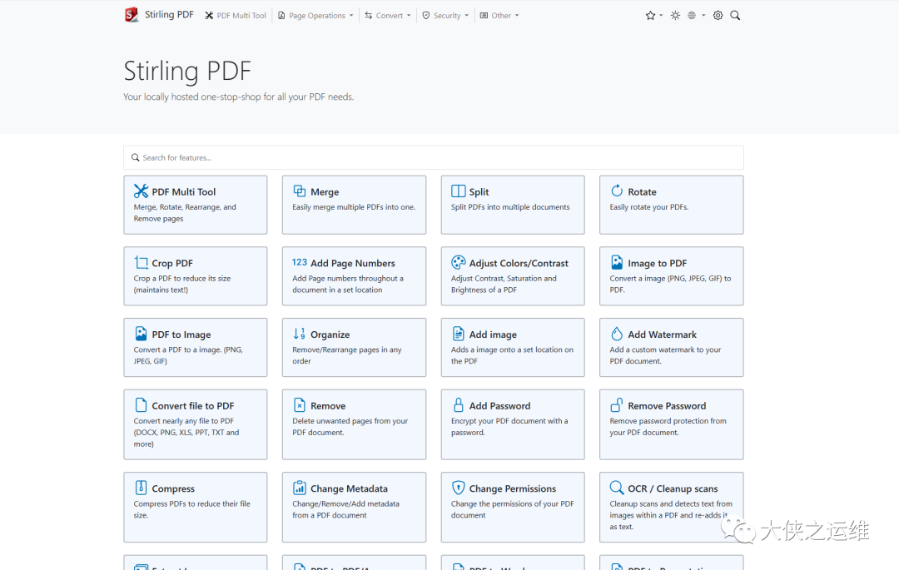

先来看下这款软件支持的功能，更多**实用工具文末获取**

**Stirling PDF：您的本地PDF操作专家**

在当今数字化时代，PDF文件已经成为个人和企业日常生活中不可或缺的一部分。无论是在工作中创建报告，还是在学习中阅读教材，我们都会频繁地使用PDF文档。

然而，PDF文件的处理常常会带来一系列挑战，例如**合并、拆分、转换格式、加密等**操作。在这种情况下，一款高效、安全且功能强大的PDF操作工具就显得尤为重要。

今天，我将向您介绍一款强大的本地PDF操作工具——Stirling PDF。

**Stirling PDF的特色功能**

1.  **本地托管与隐私保护**: Stirling PDF是一款本地托管的Web应用程序，它将您的数据隐私和安全性放在首位。与在线PDF工具不同，Stirling PDF保证您的文件和PDF操作都在本地进行，不进行任何外部调用或跟踪。您可以放心地处理敏感数据，而无需担心隐私泄露的风险。
    
2.  **PDF页面操作**: Stirling PDF提供了全面的PDF页面操作功能。不论是合并、拆分、旋转还是移动PDF及其页面，Stirling PDF都提供了直观的图形用户界面，让操作变得轻松而便捷。
    
    您还可以重新组织PDF页面的顺序，删除不需要的页面，甚至调整页面内容的大小和对比度。
    
3.  **PDF格式转换**: 除了PDF页面操作，Stirling PDF还支持多种格式的转换。它可以将PDF文件转换为图像，将常见文件（如Word、Powerpoint）转换为PDF。
    
    而且，它还支持HTML转PDF、URL转PDF、Markdown转PDF等功能。这种多样的格式转换功能，使得您能够轻松地处理不同类型的文件。
    
4.  **安全与权限控制**: 在数字文件传输中，安全性至关重要。Stirling PDF提供了多种安全功能，包括为PDF文件添加和删除密码、设置PDF权限、添加水印、对PDF文件进行认证/签名、清除PDF敏感信息等。您的文件将得到最完善的保护，确保不被未授权人员访问。
    
5.  **其他强大功能**: Stirling PDF不仅限于基本的PDF操作。它还提供了一系列高级功能，包括修复PDF文件、检测并删除空白页面、比较两个PDF文件的文本差异、向PDF中添加图像、压缩PDF文件大小、从PDF中提取图像和扫描图片、添加页码、通过检测PDF页眉文本自动重命名文件等。
    
    这些功能的加入，使得Stirling PDF成为一款多功能的PDF处理工具。
    
6.  **用户友好的界面和多语言支持**: Stirling PDF拥有直观友好的用户界面，使得即使是初学者也能够轻松上手。
    
    同时，它支持22种语言，确保全球用户能够流畅使用，无论语言环境如何。
    

**结语**

总的来说，Stirling PDF不仅仅是一款PDF操作工具，更是您的本地PDF操作专家。它的本地托管特性确保了您的数据安全，而丰富多样的功能则让您能够轻松处理各种PDF需求。

无论您是个人用户还是企业用户，Stirling PDF都能够满足您对PDF操作的一切期待。让Stirling PDF成为您数字化生活的得力助手，让您的PDF处理变得更加高效、安全、便捷！
