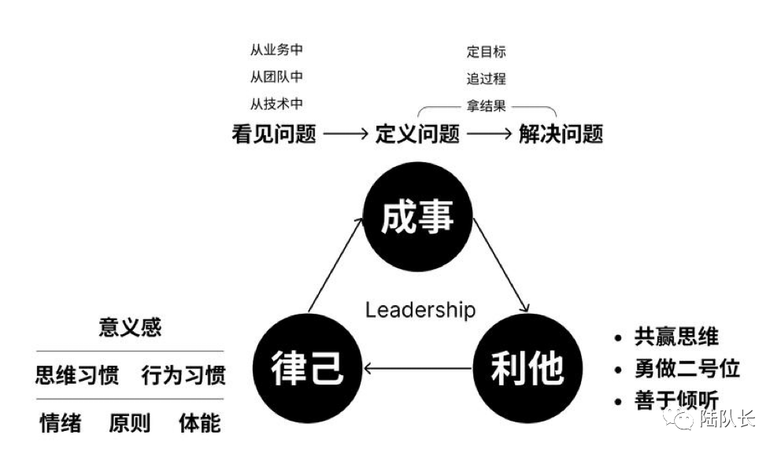

**01 | 为什么写这篇文章**  

最近刷到阿里前端No.1玉伯（语雀创始人）从阿里离职，选择一个人前行，内心大受触动。

笔者18年决定转行，其实第一个选择的方向是前端工程师，原因就是看到了当时玉伯在知乎的一些很有见地的回答，让自己愿意负重前行，坚信只要愿意走下去，就可以走到转行之路的最后，只不过，最终成为了一名Java架构师，而不是前端工程师，哈哈，人生不如意者十之八九，或许这件事情就属于其一吧。

同时，这篇文章实际上也是使用语雀进行编辑书写的，从阿里19年将语雀作为一款产品推出，我就一直在使用，其良好的设计，非常适合于我这种有总结书写文章习惯的程序员，同时，对于玉伯的动向我也是比较关注，毕竟属于自己的技术偶像。

昨天正好刷到了群友分享的一篇玉伯同事关于“为什么大家会这么舍不得他”的一篇文章，最近自己也恰巧遇到了职场上的一次碰撞，于是在群里发起了一个关于管理者与员工工作时间不协调以及抱怨的不明智，从而有了自己的一些想法和思路，这也是这篇文章的由来。

文中提到了玉伯对于Leadership的定义：能成事，严律己，并为他人创造意义感。

下文会多次引用原文，并增加笔者的一些思考，第一次写这种职场的文章，会很生疏，万望谅解。

## **02 | 玉伯的Leadership**

本文先对原文进行一定的梳理，并结合笔者和微信群其他老师的建议进行书写，其他加粗的红色字体是原文内容。

## **021 | 成事与抱怨**

文中说，**成事就是：要能看到问题+准确定义问题+成功解决问题。作为Leader最核心的能力之一就是成事，团队的价值就在于解决的问题有多大。**

笔者是一位技术研发人员，很多时候认为，成事就是把手里的事情做好，并且通过自己的技术积累，及时发现项目存在的风险点，尽早给出优化思路，防患于未然，以为雇主节省了很多的线上事故处理成本沾沾自喜。

但是笔者有一个很大的缺陷，就是在工作中会偶尔抱怨，同时，可能会因为自己是转行的不自信，导致在汇报时往往大篇幅着重描写了问题，而忘记给出当前的解决思路和方向，从而并没有获取好的汇报效果。

**小乔姐姐（****花名:小乔,是一位很漂亮的小姐姐，简称小乔姐姐****）的几句话十分受用，这样直接进行引用“少抱怨是人生智慧，不给解决方案的抱怨非常不明智，我们都喜欢遇到问题可以解决问题的人，而不是闲来一张嘴的人”**。

自己在工作中也会习惯性的将问题直接抛出来，想要听一下其他的想法，但是却不怎么习惯给出自己的解决方式，甚至是已经验证可行的方案，这个实际上和抱怨也是类似的。并且笔者发现，类似笔者的人大有人在，很多人会因为内向或者是不自信，在高级管理者在场时只抛出问题，却没有给出解决方案或者可行方向，导致白白浪费了汇报的机会，却没有得到想要的资源投入。

遇到问题并且可以解决问题的人，才是企业需要的人。

## **022 | 利他**

**文中关于利他提到了三个点：勇做二号位、放权以及倾听。**

**在公司团队合作中，愿意做二号位并且把二号位做好，那么愿意合作的团队才会更多；适当放权，才能让团队快速进步成长；学会倾听，才能知道每个人的诉求。**

可惜的是，这样的管理者太少了，至少我没有遇到过，甚至听说过在这三点上完全相反的管理者，但是既然抱怨无用，我们应该怎么解决类似的问题呢？

学习和模仿似乎是最为有效的方式。

**股神巴菲特建议投资初学者最好的学习方法就是模仿大师，****“我一直认为，对于刚开始起步的投资人来说，应该寻找已经被证明长期成功有效的投资方法，然后依葫芦画瓢照着做就行了。令人吃惊的是，这样做的人实在少之又少。”**

在项目组或者公司内容挑选一个你认为最值得学习的人，最好是能经常一起讨论问题的人，然后分析他在每次问题分析或者问题决议时的背后逻辑，这个也会在下面的“换位思考”篇进行展开。

## **023 | 律己**

**别人愿意跟随你，除了能成事，还有就是个人魅力。成为Leader就要严于律己，坚持一些原则，培养自己的思维和行为习惯，并尝试往上寻找意义感，包括给自己给团队创造意义感。**

**要做到打胜仗后分胜果，做错事后有担当。**

这个笔者不用多说，题目实际上就是本章节的核心。 

## **03 | 群友大智慧**

下面的内容是笔者发起的群友讨论的一些总结思考，笔者大为受用，三人行必有我师。

## **031 跨级汇报与换位思考**

越级汇报中笔者认为最为重要的一个问题点就是信息不互通，假设有如下一个场景：。

小明半路要求加入项目B并且在一天内将项目A的内容全部交接给其他同事。小明平时喜欢写一些总结，所以，项目A的交接非常顺畅，按照之前的版本总结、技术方案以及需求文档等大体一说，同事基本就可以独自承担业务。

项目B一两百人多的团队，一方面是几乎没有什么文档，同时从小明加入后就是饱和式甚至超负荷的工作，这也就导致了项目的背景、前期摸索等等认知不足，同时团队缺少分享气氛，大多数的项目请教，也往往也会被“在忙”、“你不需要知道”、“慢慢你就清楚了”、“你不需要深入了解，先把这个做完再说”之类的话搪塞了过去。

项目例会汇报，大领导在场，小明汇报时被一顿KO，其中最主要的点就在于，“为什么我上次提到的问题点还没有解决，为什么没有从全局去考虑你做事的意义”。

实际上，这里并不属于跨级汇报的范畴，但是很有代表性，这里也就用了这个例子了。

**小乔姐姐对于跨级汇报有如下三个观点：**

-   **想和老板的老板交流，提前和自己老板打声招呼，一般也都是鼓励交流的，而不要暗搓搓汇报；**
    
-   **跨级汇报的前提是“你们有一定程度的共同认知可以交流”**
    
-   **千万不要只是抱怨**
    

“可以交流的共同认知”如果是一个比较和谐的团队，笔者认为是挺顺畅的，以笔者合作某个团队为例，他们的风格就是比较开放共享，整个团队氛围融洽，成员在各个团队内认可度非常高。但是如果是“上车后把车门焊死，甚至还要加装密封条隔音”的团队，或者是透明度不高的团队，这时候，可能就需要换位思考了。

换位思考需要站在leader的角度去思考问题，尤其是想要有所提升，去分析好的管理者以及当前项目组内你认可的管理者的处理风格，以及给出问题解决思路的依据，以及做某些决定的深层原因，这样，才能够让自己不再局限于一亩三分地。

**股神巴菲特建议投资初学者最好的学习方法就是模仿大师，****“我一直认为，对于刚开始起步的投资人来说，应该寻找已经被证明长期成功有效的投资方法，然后依葫芦画瓢照着做就行了。令人吃惊的是，这样做的人实在少之又少。”**

以笔者自身为例，在近两年参与的某个项目中会主动承担部分技术架构师的职责，从商务对接、CP对接、产品需求讨论、项目OKR制定、项目技术研发测试及上线等等都有参与，也就很清晰的知道了为什么一个良好运行的项目突然间宣布架构重构甚至是项目停止运营的原因和考量，而这个过程中，笔者就是模仿者项目组内的两位同事，学习他们的产品思考模式，从而在项目组内站稳脚跟。

## **032 | 时间冲突问题**

对于企业来说，我们实际上都是劳动力，抽象来看，公司花钱购买的就是我们的劳动力或者说时间，并且要求这个劳动力有最好的配合和产出，当然，这里的时间也包括你的加班时间。

如果时间上存在冲突并且自己无法接受，就需要考虑自己的选择。

-   如果不满意当前的直接上级，但是对于企业文化认同，可以选择更换班组或者更换部门；
    
-   如果对于整个企业文化都不认同，那可能就要考虑，如果自己能力很强，那么就选择其他公司高就；
    
-   你的能力和行业机遇决定了你的选择权，没有选择，可能只能选择配合。
    

**总结起来就是生物学的一个重要理论：适者生存。**

毕竟直接上级是决定了自己一年绩效的那个人，特别喜欢群友Guan的一句比喻：“你把领导看成来洗脚的，你是技师，领导选你服务，你服务好就行，只要不伤及人格”，哈哈。

这也让我想到了《让子弹飞》汤师爷的那句名言“挣钱吗，生意，不寒碜”，换着换句话说：跪着挣钱，不寒碜。

虽然我们经常说，“能受多大委屈，就能成多大的事”，但是如果自己能够有更多的选择权，那就去选择站着把钱挣到的地方也不错。  

