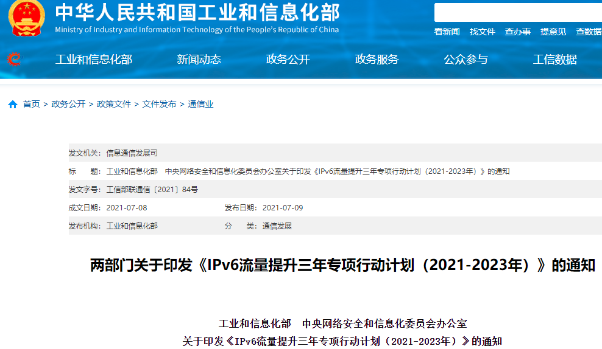

如果以2003年中国下一代互联网示范工程CNGI的启动为标志，中国IPv6已经走过20年发展历程。CNGI示范工程经过技术试验、试商用到规模商用，取得累累硕果，为我国下一代互联网更大范围的规模部署打下了坚实的基础。

2017年，《推进互联网协议第六版（IPv6）规模部署行动计划》印发，被认为是一个具有划时代意义的历史性文件。自此，推动IPv6的规模部署和应用已经成为坚定的国家意志。

20年来，我国IPv6用户数量快速增长，IPv6流量占比持续提升，IPv6应用不断拓展。IPv6已成为网络强国建设的重要契机，成为数字中国建设的有力支撑。

以下我们从国家层面梳理中国IPv6 20多年来的重要发展节点，回顾历史并展望未来。

_**2001年**_

57名院士致信国务院，提出应利用好下一代互联网发展的难得机遇，尽快推出我国的下一代互联网项目，加快下一代互联网研究与建设，占领下一代互联网的制高点。

_**2002年**_

根据党中央对57位院士建议的批示，国家发展改革委会同科技部、原信息产业部、原国信办、教育部、中科院、工程院和自然科学基金委等部委组建“下一代互联网发展战略研究专家委员会”，开展我国下一代互联网发展战略、规划和实施方案的研究。  

_**2003年**_

国务院批复同意国家发展改革委等八部委“关于推动我国下一代互联网发展有关工作的请示”，正式启动“中国下一代互联网示范工程CNGI”，标志着我国IPv6的发展征程进入新元年。

_**2006年**_

全球规模最大的纯IPv6互联网主干网“CNGI示范网络核心网CNGI-CERNET2/6IX”建成，获得一系列重大创新成果。

“下一代互联网技术获重大成果”被评为2006年中国十大科技进展。

_**2008年**_

国家发展改革委启动“下一代互联网业务试商用及设备产业化”专项“教育科研基础设施IPv6技术升级和应用示范”项目。

“CNGI阶段总结和成果汇报大会”召开。“下一代互联网研究与产业化获得重大突破”入选2008年中国十大科技进展。

_**2012年**_

国家发展改革委等七部委联合发布《关于印发下一代互联网“十二五”发展建设的意见的通知》，提出“十二五”期间IPv6发展目标、路线图和时间表。

国家发展改革委启动下一代互联网技术研发、产业化和规模商用专项。

_**2013年**_

国家发展改革委、工业和信息化部、科技部、国家新闻出版广电总局联合印发《关于开展国家下一代互联网示范城市建设工作的通知》，提出支持建设一批具有典型带动作用的示范城市。  

_**2014年**_

中国互联网协会发布了“纪念中国全功能接入互联网20年十大事件”评选结果。“国务院正式启动中国下一代互联网示范工程CNGI”入选。  

_**2017年**_

中共中央办公厅、国务院办公厅印发《推进互联网协议第六版（IPv6）规模部署行动计划》，全面推进以IPv6协议为基础的下一代互联网发展，实现我国从“互联网大国”向“互联网强国”的迈进。  

_**2018年**_

中央网信办、工业和信息化部等有关部门指导成立“推进IPv6规模部署专家委员会”。  

_**2019年**_

-   “推进IPv6规模部署专家委员会”成立“IPv6+技术创新工作组”，提出“IPv6+”产业理念。  
    
-   “国家IPv6发展监测平台”（www.china-ipv6.cn）上线发布。
    

_**2020年**_

工业和信息化部印发《关于开展2020年IPv6端到端贯通能力提升专项行动的通知》，提出网络接入、CDN、云服务、数据中心、终端设备、行业应用等多方面协同开展IPv6优化提升的工作任务。  

_**2013年**_

中央网信办、国家发展改革委、工业和信息化部印发《关于加快推进互联网协议第六版（IPv6）规模部署和应用工作的通知》，明确了“十四五”时期深入推进IPv6规模部署和应用的主要目标、重点任务和时间表。  

工业和信息化部、中央网信办印发《IPv6流量提升三年专项行动计划（2021-2023年）》，提出到2023年底，移动网络IPv6流量占比超过50%，固定网络IPv6流量规模达到2020年底的3倍以上等目标任务。

中央网信办、国家发展改革委、工业和信息化部、教育部等12部门联合印发《关于开展IPv6技术创新和融合应用试点工作的通知》，明确提出在IPv6技术创新与产业发展、IPv6单栈部署等9个方面开展试点工作。

教育部等六部门发布《关于推进教育新型基础设施建设构建高质量教育支撑体系的指导意见》，提出深入推进IPv6等新一代网络技术的规模部署和应用。

在工业和信息化部、中央网信办、国家发展改革委、国家市场监管总局指导下，中国通信标准化协会牵头成立“IPv6标准工作组”。

_**2023年**_

移动网络IPv6流量占比首次突破50%，成为IPv6规模部署和应用工作的里程碑。  

工业和信息化部、中央网信办、国家发展改革委、教育部、交通运输部、人民银行、国务院国资委、国家能源局等八部门联合印发《关于推进IPv6技术演进和应用创新发展的实施意见》，提出到2025年底，IPv6网络技术创新能力明显增强，重点行业“IPv6+”融合应用水平大幅提升。

全国通信标准化技术委员会（TC485）组织成功立项38项IPv6国家标准。

来源：《中国教育网络》2023年7月刊

责编：项阳
