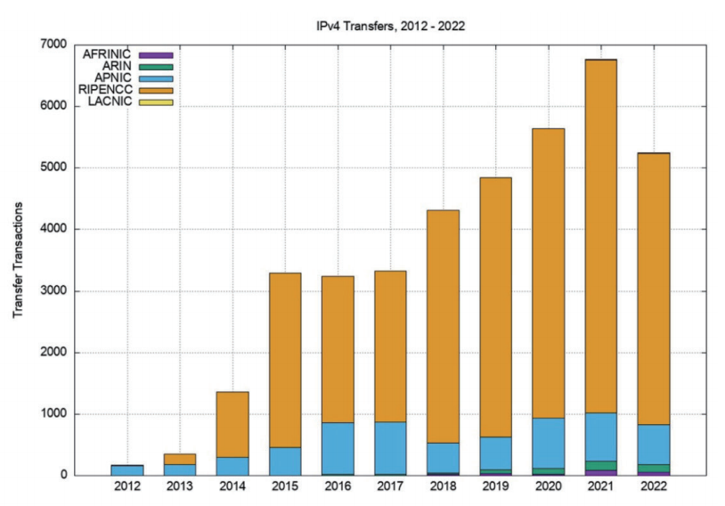

**编者按**

近日，APNIC首席科学家杰夫·休斯顿（Geoff Huston）发文回顾了2022年全球IP地址发展情况，分析了2022年IPv4和IPv6的部署现状，并对未来互联网的发展形势作出判断。本期将刊登第一部分，回顾2022年IPv4地址空间状况。

是时候再进行一次IP地址的年度综述了。让我们来看看过去的一年中互联网寻址方面的变化，并探究IP地址分配信息是否能够反映网络变化的现状。

早在1992年左右，互联网工程任务组（IETF）就尝试预测互联网的发展，并努力理解有关“下一代IP地址”的研究对地址寻址系统提出的要求。如今，我们可以看到连接设备的数量已经远远超出了当时研究预测的范围，且设备规模无疑将继续增长。人们在持续增加芯片的生产量，同时不断完善生产过程。

当时，我们推断能够让互联网在庞大的连接设备池中运行的唯一方式，是部署具有更大地址空间的新IP协议。因此，IPv6应运而生，其首要目的是解决丰富的芯片世界中的地址分配问题。IPv6拥有庞大的地址空间，无论设备规模大小如何，都可以为每个设备分配一个独立的公网IPv6地址。然而，随着互联网的飞速发展，IPv6的部署速度相对缓慢。尽管人们已经意识到IPv4的局限性，但是对于部署IPv6协议仍然没有紧迫感。

IPv4互联网规划中的设备规模与实际数量之间相差甚远，其中一个重要原因是互联网从P2P网络架构迅速转变为客户端/服务器（C/S）模式。客户端可以向服务器发起网络请求，但不能与其他客户端建立网络连接。网络地址转换器（NAT）天然适用于这种C/S模型，其允许大量客户端共享较小规模的公网地址池，并且只在与远程服务器建立连接时需要使用地址。NAT是将超过200亿连接设备压缩到大约20亿IPv4地址的主要原因，而无法在NAT后运行的应用程序也不会再被使用。

然而，互联网中已部署设备数量仍在不断增长，这意味着即使使用NAT也无法承担如此大的增长压力。NAT最多可以扩展32个“额外”的比特位[1]，从而扩大可寻址空间，并允许实现基于时间的地址共享。这两种措施均可以有效地扩展IPv4地址空间以涵盖更大的客户端设备池，但它们无法对IP地址资源进行无限扩展。

这难免会导致IPv4网络被分裂成许多不相连的部分，可能是基于内容分发网络各接入点形成的“锥形”服务结构，所以在单一连贯的数据包传输领域上形成全局统一且连贯地址池的概念将被废弃。或者，我们可能也会看到设备规模的增长压力促进了IPv6的进一步部署，且网络本身试图保持整体的凝聚力和连通性将导致“纯IPv6（IPv6-only）”的互联网实体逐渐涌现。目前，商业压力将网络同时向这两个方向驱动，互联网将在未来几年走哪条路完全不清楚，但我个人的看法是，未来的网络将高度碎片化。

IP地址分配数据能否帮助我们了解互联网正在发生什么？让我们看看2022年发生了什么。

**01**

**2022年的IPv4地址空间**

到2021年底，随着各区域互联网注册机构（RIRs）剩余地址池的耗尽，过去的分配模式即将告终。但事实证明，将剩余IPv4地址空间耗尽和迁移至IPv6的过程同样漫长。

现在越来越难谈论在当今互联网中的“地址分配”一事。目前RIR仍然会将其管理的剩余IP地址分配给网络运营商，同时也存在不同实体之间关于IP地址的买卖交易。这些地址转移必然涉及到注册详细信息的更改，因此注册机构也会根据分配（allocation）和指定（assignment）等方式记录地址转移或销售的结果。

_Allocation和Assignment的区别：当网络运营商或子注册局获得IP地址空间的“allocation”时，可以进一步通过他们的互联网基础设施将对应地址授权给其客户使用。当网络运营商获得“assignment”时，已分得的IP地址只能被用于他们自己的内部基础设施。本文将使用分配（allocation）来描述这两层含义。_

如果想了解IPv4地址空间的总体情况，即互联网运营商已使用或可用的IPv4地址总量，也许最好的衡量标准是看已分配或指定地址的总体跨度及其每年的变化。

在2021年初，已分配的IPv4地址总量为36.85亿个，且在该年增加了约150万个新分配的IPv4地址。这表明IPv4公网地址分配的年增长率为0.04%，低于2010年（IPv4地址耗尽前的最后一个完整年份）的增长率的1/20（表1）。

表1 每年分配的IPv4地址

这些所谓的“新”地址是从哪里来的呢？过去的模式是互联网数字分配机构（IANA）将未分配的地址存放在单独的地址池中，将地址块传递给区域互联网注册机构（RIRs），然后由它们分配给各种实体，供它们自己使用或允许其进一步分配。但是，IANA几年前已经耗尽了所有可用的地址池，如今只保留了三个/24地址前缀。因为将这个微小的地址池分成拥有153.6个单独地址的五个相等块是不可行的，所以这些地址可能会在IANA的地址注册表中保留一段时间（也就是只有当RIR将更多前缀返还时，IANA才能均等地划分地址池并将其分配给五个RIR，但这种情况不太可能发生）。

IANA还将一些IP地址标记为保留地址，其中一些地址块留给多播通信使用，还有部分顶端的地址空间留给“未来”使用。后者是一个相对较大的地址池，包含2.68亿个地址（原来的“ClassE”地址空间），如果IPv4有“未来”的话，那么应该就是指“现在”了。然而如何解锁这个地址空间并将其返回到通用地址池中是一个问题，尽管互联网社区在不断尝试，但到目前为止还没有一个普遍可行的解决方案。

由于IANA无法提供“新”的IP地址，因此我们需要通过RIR的实践策略来找出2022年新增150万个地址的原因。当IP地址段根据RIR的政策被归还或收回时，RIR通常会将其在保留地址池中放置一段时间，标记为“被RIR保留”的状态。该隔离期的设置可以允许相关服务在后续地址分配前，记录该前缀当前状态的停止时间和路由记录等。而在几个月或几年的隔离期之后，被保留的地址池可被释放并允许重新申请试用，这就是我们在2022年看到的分配地址池扩展的地址空间。

每个RIR分配的地址数量年度记录如表2所示。个别年份中有些RIR分配的地址数量会有所缩减，这通常是由于政策变更或其他交易，导致IP地址会跨RIR迁移。

表2 按RIR分配的IPv4地址年度变化（百万）

每个RIR都将面临IPv4地址耗尽的问题。2021年，一些RIR尝试回收IPv4地址以及重新分配以前的“保留”地址，特别是APNIC（亚太互联网络信息中心）和LACNIC（拉丁美洲和加勒比海地区互联网络信息中心）。

在2022年底，整个RIR系统中可用地址池仅有大约440万个地址，主要由APNIC（约250万个）和AFRINIC（非洲互联网络信息中心，约190万个）持有。共有约1000万个地址被标记为保留，其中ARIN（北美互联网注册中心）持有约530万个，AFRINIC持有约410万个。从表3可以看出，APNIC在2022年对处于“隔离期”的保留地址池进行了大量回收工作。APNIC（160万个），LACNIC（7.6万个）和RIPENCC（欧洲网络协调中心，2.4万个）的保留地址池有所减少，而ARIN的保留池增加了约7万个地址，AFRINIC增加了约4万个地址。

表3 2022年12月可分配和保留状态的IPv4地址分布

图1展示了RIR每年分配的IPv4地址规模，但要准确理解整个RIR系统中分配的含义是具有挑战性的，因为RIR之间存在一些微小但重要的差异，特别是在处理IPv4地址转移方面。

例如，以ARIN为例，将地址从一个由ARIN提供服务的实体转移至另一个实体被视为两个不同的交易——首先是将地址退回ARIN注册表，然后是从ARIN获得新的分配，其转移日期被记录为RIR发布记录中的新分配日期。

而其他RIR则将地址转移视为对已分配地址持有人的更改，在处理转移时，RIR的记录会保留转移地址的原始分配日期。因此，在按年份查看RIR发布的交易记录时，ARIN的数据会包括该年处理的地址转移情况，而其他RIR仅包括在该年执行的分配。

图1 各RIR每年IPv4地址分配数量

为了解全局分配情况，需要采取措施弥补RIR在地址转移数据方面存在的差异。在本研究中，我们将“一次分配”定义为在注册表记录中，从保留或可用状态转变为已分配状态的一次状态转换。这意味着我们要将与“地址转移”相关的各种操作与“地址分配”区分开，因为转移的地址块在转移期间持续为已分配状态。

图1是根据RIR发布的数据生成的，通过比较每年结束时的地址池状态和该年开始时的状态来确定当年的分配情况。一个地址块只有在年初未被标记为“已分配”状态时才会被记录为一次分配。

图2是使用与图1相同的数据分析技术生成的每年RIRIPv4分配数量。从图1和图2中可以清楚地看出，近年来IPv4地址分配的平均规模已经显著缩小，这与每个RIR的各种IPv4地址耗尽政策相对应。

图2 各RIR每年IPv4分配操作的数量

**02**

**IPv4地址转移**

近年来，各个RIR允许地址持有者相互转移IPv4地址，作为将未使用的地址退回到注册表的替代方法。这是为应对IPv4地址枯竭问题而采取的措施，其根本动机在于通过激励措施鼓励对未使用或未经常使用的地址块进行再利用，并确保此类地址转移行为能够被公开记录在注册表系统中。

表4展示了过去11年已注册的地址转移次数，包括了不同RIR间和RIR内部转移，还包括基于合并和收购等原因发起的地址转移。每次转移被视为一项单独的交易，跨RIR的转移会被纳入接收方RIR的总数中。

表4 每年IPv4地址转移次数

不同RIR报告的数字差异很有趣。AFRINIC和LACNIC服务区域的地址持有者似乎并未广泛实施地址转移相关的政策，而在RIPENCC服务区域中的采用比例很高！

一个稍微不同的视角是每年转移的IPv4地址数量（表5）。

表5 每年转移的IPv4地址数量（百万）

图3和图4展示了这些数值的统计图。

图3 2012~2022年的地址转移次数

图4 2012~2022年的地址转移规模

自2012年以来，在这些转移日志中列出的地址总数达到了约2.52亿个地址，相当于12.5个/8的地址，占据37亿个IPv4地址空间总数的7%。但是，这个数字可能是被高估的，因为在此期间有许多地址被多次转移。

**03**

**地址转移**

**实现了回收未使用地址的目标吗？**

这些数据引发了一些关于转移本质的问题。第一个问题是：地址转移是否有效清理了已分配但未宣告的公共IPv4地址池，并将它们回收再利用？

人们认为如果能够让地址变现，可以激励地址持有者转售其管理的公网IP地址，转而使用私有地址。换言之，地址市场的开放可以激励大家将未投入生产使用的地址资产放到市场中，让需要使用地址的提供商出价购买这些地址。在传统的市场理论中，最有效的地址利用方式是通过市场为其定价。理论上只要IP地址供不应求，市场便会刺激地址的高效使用。

然而，地址转移的实践经验并不明确。与地址回收相关的数据并不确定，在2011年至2017年底未宣告的地址数量大约为38到40个/8地址段。未宣告地址池规模自2018年开始上升，截至2020年初期，公共互联网中未宣告的地址接近于50个/8地址段。从宏观的统计数据推测，那两年似乎是IPv4地址被囤积的时期。

在2021年期间，未被宣告地址数显著减少，这是因为2021年在互联网的路由系统中公布了大约7个/8的地址段。这些地址空间在阿帕网（ARPANET）的早期被分配给了美国国防部。在2021年末，AS749比其他网络宣告了更多的IPv4地址，即大约211,581,184个地址，相当于/4.34的前缀长度或IPv4地址总数的5%。而在2022年，未被宣告的地址池恢复了其上升趋势（图5）。

图5 未被宣告的IPv4地址池规模

图6a展示了自2000年开始已分配的、已宣告的和未宣告的IPv4地址池规模。更加严格的地址（分配）政策的出台与2011年初IANA未分配地址的耗尽相吻合，自那以后，各RIR的地址池都在减少。

图6a 2000至2022年的IPv4地址池

通过图6b，我们可以观察到自2022年初IPv4地址池的变化。在这一年，已宣告的地址数下降了约50万个。RIR还记录了全年200万个分配地址，这导致全年未宣告的地址池增长了250万个地址。

图6b 2022年全年的IPv4地址池变化

相对而言，根据分配的IP地址池的比例情况来看，未宣告的地址池从2011年占总分配地址池的28%下降到2016年初的24%，随后在2020年底上升到29%。在2022年期间，这一数字下降到20%，主要是由于美国国防部允许宣告其地址空间。这表明，在过去12个月里，地址转移活动并没有使地址利用效率的总体情况发生实质性变化。

这组数据表明转移市场有些低迷。转移交易的数量在上升，而转移地址的总量在下降。尽管如此，地址交易市场对于利用闲置地址而言还是有效果的。

然而，与所有其他商品市场一样，商品的市场价格反映了供求关系的平衡以及对未来供求关系的预期。从过去8年的IPv4地址的交易价格中我们可以看出什么？

地址经销商HilcoStreambank公布了交易的历史价格信息（如果所有的地址经销商都这样做就好了，因为一个有公开交易价格信息的市场比价格信息被隐藏的市场能更有效和公平地运作）。2016年之前的初始数据反映了相对较低的交易量，价格稳定，每个地址单价略低于10美元。在之后的四年里，直到2019年年初，价格翻了一番，一些小地址块（/24s和/23as）出现了溢价。在接下来的18个月里，价格稳定在每个地址20至25美元之间，大地址块和小地址块的交易单价相似。

到2021年底每个地址提升到45美元至60美元，直到2022年初的18个月里，价格呈指数规模上升。2022年全年的市场平均价格下降，但价格在不停波动，年底的交易记录为每个地址40美元至60美元之间。对于一个没有区别的商品市场来说，一个地址的价值与其他任何地址的价值都没有区别，这种50%的价格差异让人出乎意料且有些不寻常。

如果价格反映了供需关系，那么需求的增长似乎远远超过了供应量，2022年的价格反映了最近一段时间地址呈现了某种形式的稀缺性溢价。

可交易的IPv4地址的供应是否在减少？回答这个问题的一个方法是分析转移地址的注册年限：这些地址主要是最近分配的地址，还是持有人想要实现某些未用资产的内在价值的长期持有的地址？这个问题涉及到转移地址的年限分布，其中地址的注册年限反映了它自首次被RIR系统分配或指定到现在的时间。

在按交易划分的转移地址注册年限的累积分布上，2022年所有转移地址中约有15%来自地址持有人。看起来回收遗留地址库的任务基本结束，转移的地址数量已经急剧下降。

地址持有者似乎在政策规定的最短持有期（两年）内稳定持有最新分配的地址，但两年后会有明显比例的地址在市场中被转移。在几年前，约有8%的地址是在被转移前五年内分配的。在2022年，这个数字下降到4%，这可能与2022年的地址分配总量较少有关，而并非由地址持有者的行为决定。

在转移交易的累积年限分布上，2022年的分布差距表明，最近的分配规模要小得多，但仍然处在交易状态中。在2022年记录的转移交易中，约有20%是在过去五年内分配的地址前缀，这些交易不足2022年转移地址库存的2%。约30%的转移地址最初是在20年前或更早以前分配的，而这些交易只占据2022年转移记录的12%。

在2022年，有许多因素会推动地址转移。一是地址资源供不应求，难以避免导致价格上涨。这可能会促使一些网络运营商提前购买地址，因为他们预计进一步拖延会面临更高的价格。该因素也可能促使一些地址持有者延迟出售地址，以获取更高的收益。这些动机会损害市场的流动性，并导致价格进入持续上涨的（恶性）反馈循环。2022年似乎就是这种情况。

第二个因素是IPv6的部署。许多应用倾向于使用IPv6而不是IPv4（由于所谓的“Happy Eyeball”协议选择策略）。对于双栈接入网络而言，通过双栈配置的服务越多，使用IPv4的流量就越少，IPv4运营商级网络地址转换器（CGNAT）的消耗压力就越低，从而降低了对IPv4地址空间的需求。这种对额外IPv4地址需求的减少也会影响市场价格，因为市场价格的下降会促使卖家将其未使用的地址库存尽快投入市场，而进一步拖延只会导致价格下降。

地址市场的首要特征是市场内对IPv6过渡状态的不确定性程度，以及网络进一步增长的不确定性。这种高度不确定性可能是导致2022年转移交易单价差异很大的原因。

地址转移是否有效地回收和循环利用了已经废弃的地址块，并将其重新投入使用？现有数据表明，这不是当前地址转移的主要原因。目前更普遍的行为是，从RIPENCC获得地址分配，在政策规定的最短持有时间内持有它，然后通过在转移市场中交易地址来盈利。这正是社区内许多人在最初考虑地址转移市场时的担忧，即IP地址成为投机市场的交易对象，而对于为互联网提供服务而言毫无意义。

注：\[1\]用于复用IPv4地址传输层端口号只有16位。虽然，源端口和目标端口各有16位，但通常无法选择。译者就此对Geoff进行了询问，他的答案是：服务器可以跨所有端口侦听，在这种情况下，可以使用整个源和目标端口号范围。它还需要在DNS中提供额外的支持，以表明服务器与目的端口无关。坦率地说，IPv6在这一点上可能会简单得多，但它是可行的。这就是我使用32位数字的原因。

来源：APNIC

翻译：张明明

作者：Geoff Huston

责编：项阳

投稿或合作，请联系：eduinfo@cernet.com