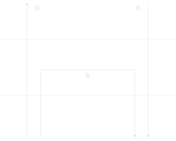
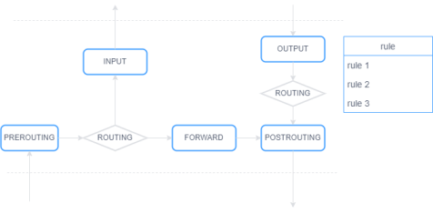
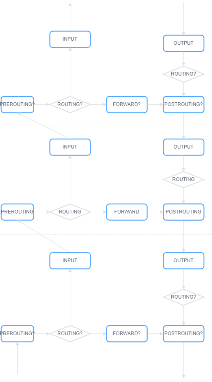

本文为 iptables 学习笔记，主要学习资料为下方的博客，加入了自己的思考。实验环境为Ubuntu 18.04 64bit。重要提示：请使用测试环境学习本章，切勿使用生产环境。

```
https://www.zsythink.net/archives/category/%e8%bf%90%e7%bb%b4%e7%9b%b8%e5%85%b3/iptables。
```

## 1. iptables介绍

目前，有两种常用的网络模型：OSI七层网络模型与TCP/IP网络模型。前者没有被实现过，模型却广为流传，常用于教学及学术探讨；后者模型本身没有多大用途，其实现却广为流传。

<table><tbody><tr><td><p><span>OSI七层网络模型</span></p></td><td><p><span>TCP/IP四层概念模型</span></p></td></tr><tr><td><span>应用层<br></span></td><td rowspan="3" colspan="1"><span>应用层<br></span></td></tr><tr><td><span>表示层<br></span></td></tr><tr><td><span>会话层<br></span></td></tr><tr><td><span>传输层<br></span></td><td><span>传输层<br></span></td></tr><tr><td><span>网络层<br></span></td><td><span>网络层<br></span></td></tr><tr><td><span>数据链路层<br></span></td><td rowspan="2" colspan="1"><span>数据链路层<br></span></td></tr><tr><td><span>物理层<br></span></td></tr></tbody></table>

计算机在接收、发送数据包时，数据包会流经每一层，示意图如下：


网络包流经各层时，有本地接收、转发、本地发送三种典型路径，下图为数据包流经网络层时的典型路径：

 

-   路径①，网络包由数据链路层进入网络层，经过路由选择，该包被送入传输层，以实现本地接收。
    
-   路径②，网络包由数据链路层进入网络层，经过路由选择，该包被送回数据链路层，以实现转发。
    
-   路径③，网络包由传输层进入网络层，该包被送入数据链路层，以实现本地发送。
    

内核网络框架netfilter在网络包典型路径上添加了5个关卡，以对网络包进行处理。每个关卡都有若干rule（规则），网络包在流经关卡时，netfilter依据rule对包进行处理，典型的处理方式包括：放行包、丢弃包、修改包。用户通过设置rule定制netfilter的行为，用户修改这些rule的工具叫做iptables。

 

各关卡的说明如下：

<table><tbody><tr><td><span>关卡<br></span></td><td><span>说明<br></span></td></tr><tr><td><p><span>PREROUTING</span></p></td><td><p><span>数据包进入网络层，路由前</span></p></td></tr><tr><td><p><span>INPUT</span></p></td><td><p><span>路由后，数据包目标ip是本机，送入传输层之前</span></p></td></tr><tr><td><span>FORWARD<br></span></td><td><p><span>路由后，数据包目标ip不是本机，进行转发</span></p></td></tr><tr><td><span>OUTPUT<br></span></td><td><p><span>数据包进入网络层，路由前</span></p></td></tr><tr><td><span>POSTROUTING<br></span></td><td><p><span>路由后，送入数据链路层之前</span></p></td></tr></tbody></table>

理论上，netfilter可以在协议栈的各层（传输层、网络层、数据链路层）设置关卡并提供配置配置rule的工具以实现对网络包的定制。不过用的最多的就是网络层。



在netfilter中，PREROUTING、INPUT、OUTPUT、FORWARD、POSTROUTING五个关卡称做chain，每个chain持有一条rule chain（rule链，这也是关卡被称作chain的原因）。每个rule描述了对match xx条件的包执行xx 动作，动作可以是放行包、丢弃包、修改包等。

与netfilter配套的还有一些用户态的工具：iptables、arptable、ebtables等。iptables是最常见的一个，可用于增、删、改、查网络层某chain上的rule。

要理解rule的增、删、改、查，需了解rule是如何存储的。此处，以购物车系统作为类比，一个账户拥有N个收货地址、N个订单、N个电子发票，那怎么设计SQL表格呢？

方案一：为每个账户建立一张表格，里面存储了该账户全部的收货地址、订单、电子发票。这种方案简单、易理解，但显然不正确。收货地址、订单、电子发票包含的信息不同，此方案需将这些信息在一个表格中全部列出，浪费空间，对该表格进行处理也很困难。

方案二：为收货地址、订单、电子发票各创建一张表格，每一条数据关联owner账户。此种方案对程序开发非常友好。

iptables中rule的存储没有采用方案一，为每一个chain（类比购物车系统中的账户）创建一张表，里面存放其所有的rule。

而是采用方案二，为不同类型的rule（不同类型的rule数据结构不同，可类比购物车系统中的收货地址、订单、电子发票）各创建一张表，表中每条rule关联一个chain。

iptables将rule按其功能分为如下五类，每类存储一张表格。

<table><tbody><tr><td><p><span>rule类型</span></p></td><td><p><span>说明</span></p></td><td><p><span>用途</span></p></td></tr><tr><td><p><span>filter</span></p></td><td><span>过滤<br></span></td><td><p><span>用来控制让哪些数据可以通过，哪些数据不能通过</span></p></td></tr><tr><td><span>nat</span></td><td><p><span>网络地址转换</span></p></td><td><p><span>用来控制要不要进行地址转换，以及怎样修改源地址、目标地址，从而影响数据包的路由，达到连通的目的</span></p></td></tr><tr><td><span>mangle<br></span></td><td><span>粉碎<br></span></td><td><p><span>用于专门的数据包更改，本教程不涉及该类型的使用</span></p></td></tr><tr><td><span>raw<br></span></td><td><span>关闭数据包连接追踪<br></span></td><td><p><span>用于取消数据包的连接追踪，本教程不涉及该类型的使用</span></p></td></tr><tr><td><span>security</span></td><td><span>安全<br></span></td><td><p><span>本教程忽略该类型</span></p></td></tr></tbody></table>

chain是包路径上的一个关卡，该关卡可对包做何种处理是固定的，也就是说chain上可包含何种类型的rule是固定的，不可调整。当一个chain上包含多种类型的rule时，各类型的优先级也是固定的：raw>mangle>nat>filter。因此chain和table的关系如下：

<table><tbody><tr><td><span>chain<br></span></td><td><span>table<br></span></td></tr><tr><td><p><span>PREROUTING</span></p></td><td><p><span>raw</span></p><p><span>mangle</span></p><p><span>nat</span></p></td></tr><tr><td><p><span>INPUT</span></p></td><td><p><span>mangle</span></p><p><span>filter</span></p></td></tr><tr><td><p><span>FORWARD</span></p></td><td><p><span>mangle</span></p><p><span>filter</span></p></td></tr><tr><td><p><span>OUTPUT</span></p></td><td><p><span>raw</span></p><p><span>mangle</span></p><p><span>nat</span></p><p><span>filter</span></p></td></tr><tr><td><p><span>POSTROUTING</span></p></td><td><p><span>mangle</span></p><p><span>nat</span></p></td></tr></tbody></table>

上表说明在PREROUTING上可配置3种类型的rule，分别是raw、mangle、nat。网络包在流经PREROUTING时，netfilter依次使用raw、mangle、nat表中的规则对包进行处理。用户无法通过iptables为PREROUTING配置filter规则，也无法将nat放在raw表之前。

同类型的rule也是有顺序的，从1开始编号，依次递增，netfilter按顺序进行匹配。该编号是用户创建rule时指定的。

当在某个表中匹配到一条rule后，该怎么办呢？这取决于匹配成功后执行的处理动作（见后文），主要有三种做法：

-   继续匹配当前chain下一条rule，如LOG
    
-   中止当前chain的匹配，转到一下个表，如ACCEPT
    
-   中止所有chain的匹配，如DROP
    

rule包含匹配条件与动作两方面内容，netfilter使用rule的伪代码如下：

```
if (match(匹配条件, packet)) {
```

匹配条件分为基本匹配条件与扩展匹配条件。基本匹配条件可以直接使用；扩展匹配条件以模块形式存在，需指定相应模块（通过-m选项指定）。下表列出了几个常见的匹配条件：

-   源地址
    
-   目标地址
    
-   源端口号
    
-   目的端口号
    
-   包协议
    
-   流入网卡
    
-   流出网卡
    

netfilter将对包的处理动作称为target，分为基础动作与扩展动作。基础动作与扩展动作均可直接使用。下表列出了几个常见的target：

-   ACCEPT
    
-   DROP
    
-   REJECT
    
-   LOG
    
-   SNAT
    
-   DNAT
    
-   MASQUERADE
    

## 2. iptables命令

下面以rule的增、删、改、查为例对iptables进行讲解。查看rule命令如下：

```
iptables -t filter --line-number -n -v -L INPUT
```

各选项的含义如下：

-   \-t：指定表
    
-   \--line-number：显示行号，也就是rule的匹配顺序
    
-   \-v：显示详细信息
    
-   \-n：直接显示ip地址而非域名
    
-   \-L：list命令；指定chain，默认为所有chain
    

该命令输出如下：

```
Chain INPUT (policy ACCEPT 274 packets, 24465 bytes)
```

第一行的ACCEPT为默认策略（target）。如果chain中的rule均无法匹配当前包，则使用链的默认策略，链的默认策略通常设置为ACCEPT或DROP。修改默认策略命令如下：

```
iptables -t filter -P INPUT DROP
```

各选项含义如下：

-   \-t：指定表
    
-   \-P：policy命令；指定chain和默认target
    

第二行为列标题，各列的含义如下：

<table><tbody><tr><td><span>列<br></span></td><td><span>说明<br></span></td></tr><tr><td><span>num<br></span></td><td><p><span>rule编号（从1开始）</span></p></td></tr><tr><td><span>pkts<br></span></td><td><p><span>rule匹配到的包个数</span></p></td></tr><tr><td><span>bytes<br></span></td><td><p><span>rule匹配到的包总大小</span></p></td></tr><tr><td><span>target</span></td><td><p><span>匹配成功后执行的动作</span></p></td></tr><tr><td><span>prot<br></span></td><td><p><span>rule匹配的协议</span></p></td></tr><tr><td><span>opt<br></span></td><td><p><span>rule匹配的选项</span></p></td></tr><tr><td colspan="1" rowspan="1"><span>in<br></span></td><td colspan="1" rowspan="1"><p><span>rule匹配的流入网卡</span></p></td></tr><tr><td colspan="1" rowspan="1"><span>out<br></span></td><td colspan="1" rowspan="1"><p><span>rule匹配的流出网卡</span></p></td></tr><tr><td colspan="1" rowspan="1"><span>source<br></span></td><td colspan="1" rowspan="1"><p><span>rule匹配的源地址</span></p></td></tr><tr><td colspan="1" rowspan="1"><p><span>destination</span></p></td><td colspan="1" rowspan="1"><p><span>rule匹配的目标地址</span></p></td></tr></tbody></table>

新增rule分作如下两种：

-   追加：在表尾新增一条rule
    
-   插入：在指定的行n新增一条rule；新增前，表中行号≥n的rule，行号自动加一
    

追加示例如下：

```
iptables -t nat -A PREROUTING -m tcp -p tcp --dport 80 -j REDIRECT --to-ports 8080
```

各选项含义如下：

-   \-t：指定表
    
-   \-A：append命令；指定chain
    
-   \-m：指定模块；--dport为扩展匹配条件
    
-   \-p：匹配条件：此处为包协议
    
-   \--dport：匹配条件：此处为包目标端口号
    
-   \-j：指定target
    

插入例如下：

```
iptables -t filter -I INPUT 2 -s 192.168.111.1 -j DROP
```

各选项含义如下：

-   \-t：指定表
    
-   \-I：insert命令；指定chain与行号
    
-   \-s：匹配条件：此处为包源IP地址
    
-   \-j：指定target
    

删除rule分作如下两种：

-   根据行号删除
    
-   清空某table某chain上的所有rule
    

根据行号删除示例如下：

```
iptables -t filter -D INPUT 3
```

各项含义如下：

-   \-t：指定表
    
-   \-D：delete命令；指定chain与行号
    

清空示例如下：

```
iptables -t filter -F INPUT
```

各项含义如下：

-   \-t：指定表
    
-   \-F：flush命令；指定chain
    

修改rule可通过删除再插入来实现。

通过iptables实现的增删改查是在内存中进行的，那如何实现持久化呢？iptables提供了iptables-save和iptables-restore命令用于rule的存储与加载：

```
iptables-save > ipv4.rules # 将rules保存到ipv4.rules文件
```

修改rule后，可通过iptables-save将rule保存到文件中；计算机重启后，可通过iptables-restore加载文件中的rule。可将iptables-restore加入启动脚本中以实现rule的自动加载。

Ubuntu提供了iptables-persistent软件包以简化上述过程。

## 3. iptables典型用法

下面介绍几种典型的使用方法。笔者的宿主机ip地址为192.168.111.1，虚拟机ip地址为192.168.111.138。

（一）-s是指包源ip地址。首先，从宿主机ping虚拟机，这是可以ping通的。

```
ping 192.168.111.138
```

在虚拟机中添加如下rule，包在流经INPUT时会丢弃源ip为192.168.111.1的包。

```
sudo iptables -t filter -I INPUT 1 -s 192.168.111.1 -j DROP
```

此时，从宿主机ping虚拟机，是ping不通的。实验完毕，删除该rule：

```
sudo iptables -t filter -D INPUT 1
```

（二）-d是指包目标ip地址。首先，从虚拟机ping 8.8.8.8，这是可以ping通的。

```
ping 8.8.8.8
```

在虚拟机中添加如下rule，包在流经OUTPUT时会丢弃目标ip为8.8.8.8的包。

```
sudo iptables -t filter -I OUTPUT 1 -d 8.8.8.8 -j DROP
```

此时，从虚拟机再ping 8.8.8.8，是ping不通的。实验完毕，删除该rule：

```
sudo iptables -t filter -D OUTPUT 1
```

（三）-p是指包协议。首先，在虚拟机中启动一个udp服务。

```
sudo netcat -u -l 192.168.111.138 10000
```

在宿主机启动一个udp客户端，连接虚拟机中的udp服务。

```
.\nc64.exe -u 192.168.111.138 10000
```

客户端输入helloworld，udp服务的终端也输出helloworld。

在虚拟机中添加如下rule，包在流经INPUT时会丢弃协议为udp的包。

```
sudo iptables -t filter -I INPUT 1 -p udp -j DROP
```

此时，客户端的输入，udp服务无法接收到客户端的输入。实验完毕，删除该rule：

```
sudo iptables -t filter -D INPUT 1
```

（四）--dport是指包目标端口号。首先，在虚拟机中启动一个tcp服务。

```
sudo netcat -l 192.168.111.138 10000
```

在宿主机启动一个tcp客户端，连接虚拟机中的tcp服务。

```
.\nc64.exe 192.168.111.138 10000
```

客户端输入helloworld，tcp服务的终端也输出helloworld。

在虚拟机中添加如下rule，包在流经INPUT时会丢弃目标端口为10000的包。

```
sudo iptables -t filter -I INPUT 1 -p tcp -m tcp --dport 10000 -j DROP
```

此时，客户端的输入，tcp服务无法接收到客户端的输入。实验完毕，删除该rule：

```
sudo iptables -t filter -D INPUT 1
```

（五）--sport是指包源端口号。首先，在虚拟机中启动一个tcp服务。

```
sudo netcat -l 192.168.111.138 10000
```

在宿主机启动一个tcp客户端，连接虚拟机中的tcp服务。

```
.\nc64.exe -p 9999 192.168.111.138 10000
```

客户端输入helloworld，tcp服务的终端也输出helloworld。

在虚拟机中添加如下rule，包在流经INPUT时会丢弃源端口为9999的包。

```
sudo iptables -t filter -I INPUT 1 -p tcp -m tcp --sport 9999 -j DROP
```

此时，客户端的输入，tcp服务无法接收到客户端的输入。实验完毕，删除该rule：

```
sudo iptables -t filter -D INPUT 1
```

DROP指丢弃包。以上示例均使用DROP动作，不再赘述。

（六）ACCEPT是指允许包通过。首先，在虚拟机中设置INPUT的默认策略：

```
sudo iptables -t filter -P INPUT DROP
```

使用ssh从宿主机登录虚拟机，会登录失败。在虚拟机中添加如下rule：

```
sudo iptables -t filter -I INPUT 1 -s 192.168.111.1 -j ACCEPT
```

此时，使用ssh从宿主机登录虚拟机，会登录成功。实验完毕，删除该rule并恢复默认策略：

```
sudo iptables -t filter -D INPUT 1
```

（七）REJECT是指丢弃包并告知对方原因。首先，从宿主机ping虚拟机，这是可以ping通的。

```
ping 192.168.111.138
```

在虚拟机中添加如下rule，包在流经INPUT时会拒绝源地址为192.168.111.1的包。

```
sudo iptables -t filter -I INPUT 1 -s 192.168.111.1 -j REJECT
```

此时，从宿主机再ping虚拟机，是ping不通的。

```
ping 192.168.111.138
```

实验完毕，删除该rule：

```
sudo iptables -t filter -D INPUT 1
```

（八）LOG是指记录包信息。LOG仅对匹配到的包记录日志，不做放行、丢弃等动作，因此，包需继续匹配其他规则。首先，在在虚拟机中添加如下rule，包在流经INPUT时会记录该包信息。

```
sudo iptables -t filter -I INPUT 1 -s 192.168.111.1 -j LOG
```

此时，从宿主机ping虚拟机，/var/log/kern.log会记录如下日志：

```
May 15 07:49:24 scratchlab kernel: [ 3844.551051] IN=ens33 OUT= MAC=00:0c:29:63:e6:a3:c8:ff:28:b5:d1:5d:08:00 SRC=192.168.111.1 DST=192.168.111.138 LEN=60 TOS=0x00 PREC=0x00 TTL=128 ID=38882 PROTO=ICMP TYPE=8 CODE=0 ID=1 SEQ=33
```

实验完毕，删除该rule：

```
sudo iptables -t filter -D INPUT 1
```

（九）REDIRECT是指重定向。首先，在虚拟机中启动一个tcp服务。

```
sudo netcat -l 192.168.111.138 10000
```

在虚拟机中添加如下rule，包在流经INPUT时会丢弃目标端口为10000的包。

```
sudo iptables -t nat -I PREROUTING 1 -p tcp -m tcp --dport 9999 -j REDIRECT --to-ports 10000
```

在宿主机启动一个tcp客户端，连接虚拟机中的tcp服务。

```
.\nc64.exe 192.168.111.138 9999
```

客户端输入helloworld，tcp服务的终端也输出helloworld。实验完毕，删除该rule。

```
sudo iptables -t nat -D PREROUTING 1
```

## 4. 自定义chain

设想一台内网服务器运行了ftp、ssh等服务，管理员要在INPUT中设置两份白名单，当这两份白名单很长时，其管理上会非常混乱。通过自定义chain可解决该问题。

自定义chain是一个rule片段，以上述为例，可将INPUT中关于ssh的rule放在自定义chain SSH\_WHITELIST中。创建自定义chain的方法如下：

```
iptables -t filter -N SSH_WHITELIST
```

各选项含义如下：

-   \-t：指定表，也就是rule的类型
    
-   \-N：new命令；指定自定义chain名称
    

创建自定义chain SSH\_WHITELIST并向SSH\_WHITELIST中添加rule，命令如下：

```
sudo iptables -t filter -N SSH_WHITELIST
```

之前提到过自定义chain是rule片段，需要链接到默认chain上才可使用。链接很简单，只需将自定义chain作为默认chain的rule的target即可：

```
sudo iptables -t filter -I INPUT 1 -p tcp -m tcp --dport 22 -j SSH_WHITELIST
```

当客户端通过ssh连接该服务器时，包交由SSH\_WHITELIST处理。此时，宿主机是可以ssh登录虚拟机的；从另一台IP地址为192.168.111.129的虚拟机就无法ssh登录138虚拟机。

向SSH\_WHITELIST中添加一条新rule，命令如下：

```
sudo iptables -t filter -I SSH_WHITELIST 1 -s 192.168.111.129 -j ACCEPT
```

此时，从192.168.111.129的虚拟机也可以ssh登录138虚拟机了。

删除自定义chain命令如下：

```
sudo iptables -X SSH_WHITELIST
```

删除自定义chain需满足如下条件：

-   自定义chain未被任何默认chain引用
    
-   自定义chain中无规则
    

自定义chain支持RETURN target，RETURN是指返回父chain进行处理。例如：

```
sudo iptables -t filter -I SSH_WHITELIST 1 -s 192.168.111.110 -j RETURN
```

添加上述规则后，当192.168.111.110想要ssh登录138虚拟机时，SSH\_WHITELIST将该包交由INPUT chain处理。INPUT chain从rule SSH的下一条rule开始对该包进行匹配。
