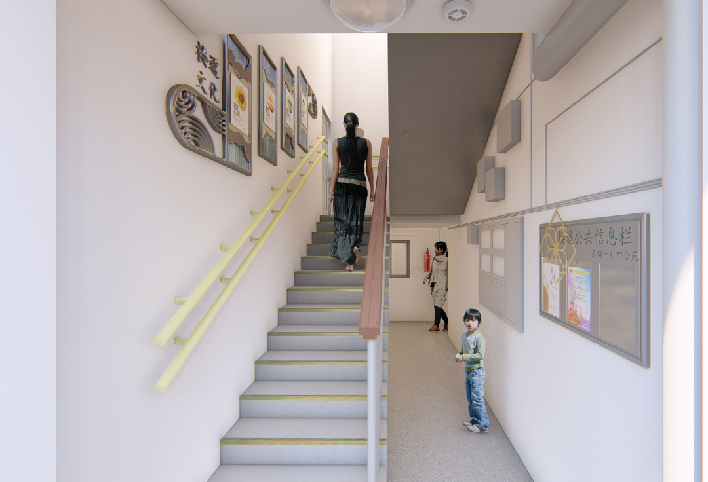
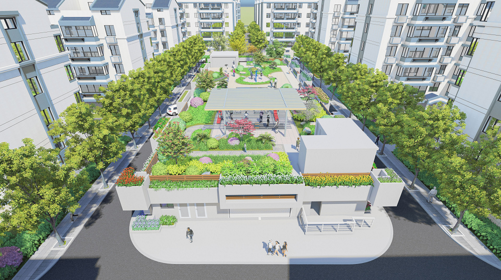

文明，是一座城市最亮的“底色”，也是最暖的“名片”。

6月27日，姑苏区召开全区创建全国文明典范城市推进会，会议明确部署，姑苏区将开展小区环境、街巷环境、市场秩序、交通秩序、理论武装、宣传舆论、静态指标七大提升行动，以“首创必成”的信心和决心加压奋进，为苏州争创全国文明典范城市贡献姑苏力量。

新一轮创建的“任务书”“时间表”已经明确，锚定目标、紧盯任务，姑苏区迅速掀起全域创建热潮。即日起，姑苏发布正式推出**“文明新风‘润’古城”专栏**，聚焦姑苏区争创全国文明典范城市的常态化长效建设工作，报道推介全区创建工作的好经验、好做法，展现姑苏文明风尚，营造浓厚创建氛围，推动文明在古城绽放最绚丽的光彩。

**编者按**

近日

姑苏区苏锦街道

**苏锦一村（四合苑）老旧小区改造**

正式启动

(效果图)

苏锦一村（四合苑）始建于1997年，由“四苑”组成，分别为：海棠苑、白兰苑、丹桂苑以及百合苑，共41栋建筑1368户居民，总建筑面积为14.33万平方米。

由于建造年代久远，小区存在建筑外立面脱落、景观绿化破坏、道路破损断裂、雨水管网老旧等问题。据悉，本次改造将从建筑、市政、零星配套、社区服务中心等**基础设施改造**、**景观绿化改造**、**公共设施品质提升**等方面展开，“改”出居民新生活。整体改造工程预计**今年11月**完工。

(社区服务中心效果图)

**楼宇内外齐齐翻新**

走进四合苑，脚手架已经搭建起来，戴着安全帽的工人正在忙碌施工，地上堆放着水泥、涂料等各种施工材料。不少居民站在不远处观望，对改造后的小区充满期待。

本次改造将对建筑外立面存在的油污、灰尘、青苔等杂物进行集中清理，并**重新粉刷喷漆**；针对楼道内粉刷层掉落、楼梯扶手锈蚀、照明不足等现状，将开展**墙面出新、楼道天棚出新**等工作，并及时**更换缺失地砖，刷新栏杆扶手，更换节能灯具，补全消防设施**，并按小区风貌特点重新设计楼道公共信息栏，**增设美化宣传栏**，结合现有楼道空间**增添折叠休息椅**等适老设施。

（外立面效果图）

（楼道效果图）

此外，为进一步美化小区外立面视觉效果，改造还将统一更换墙面防盗窗、外墙立管、雨棚等设施。

**景观绿化增添亮点**

绿化是居住空间质量的重要标志，不仅有着净化空气、丰富景观的作用，同时也是居民的交往空间和活动场所。本次改造将**重新规划四合苑小区中心原有广场**，结合小区景观风格定位，提升公共核心空间环境品质。引入生态海绵理念及花镜组合设计，对场地进行功能划分，以“南部廊架+中部景亭+中心草地+北部景墙”的景观组合，丰富整体空间的层次感。

（景观绿化改造效果图）

同时，小区内部还将新增三处景观节点，既布置景观绿地，又设置休闲设施，满足小区内基本的公共活动需求，让每个居民都能拥有轻松自在的公共生活空间。

**安全防范全面升级**

以保证小区居民出入安全为目的，本次改造还将优化道路停车布局，**对小区出入道路进行重新铺装**，并结合现有路线增设停车位，预计可**新建车位578个**；同时将**新建小区雨水管道**，结合“海绵城市”进行设计布管，提升小区居住品质。

（小区道路现状）

针对小区现有的监控设施布点不足、照明系统不完善、智能门禁缺失等问题，改造将**在小区出入口、视线盲区及重要节点布置高清监控摄像机**，并**对小区出入门禁进行升级**，居民刷卡开门时，系统可自动抓拍图片上传至门禁综合管理平台，更好地守护居民安全。

**党员监督 施工改造不扰民**

随着改造的启动，一些新问题随之而来：小区楼下施工材料的堆积，让本就狭窄的道路更加难以通行；施工现场不时传出的噪音，一定程度上也影响了小区居民日常生活。

针对噪音扰民、施工车辆乱停放等问题，苏锦一社区与居民代表充分协商沟通，成立了一个党员监督小组，成员均为住在四合苑的党员骨干。小组成员将**全程监督四合苑改造施工过程**，实时反馈居民意见，定期与施工单位沟通，推动改造顺利完工。

**姑苏发布出品**

  
来源：区委宣传部 苏锦街道 顾婧

编辑：王秋倩