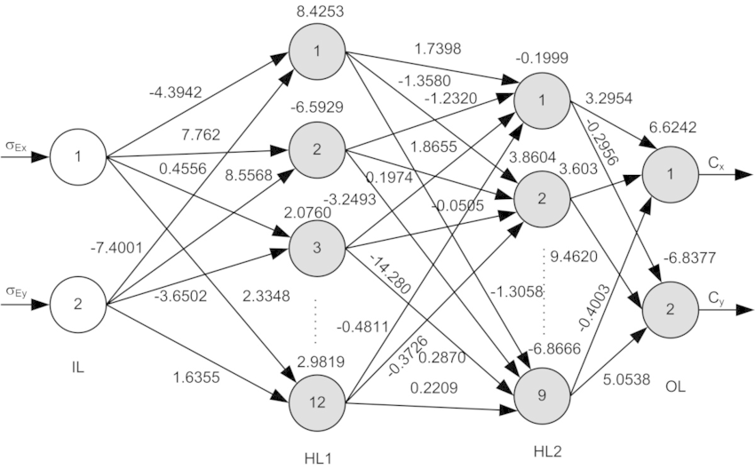
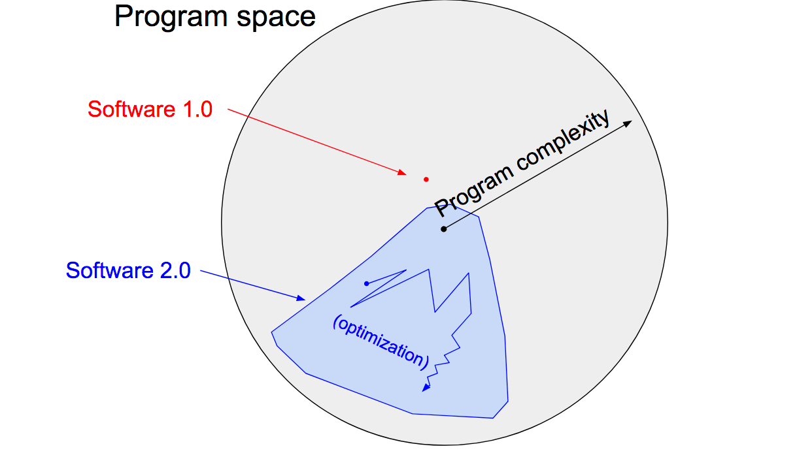
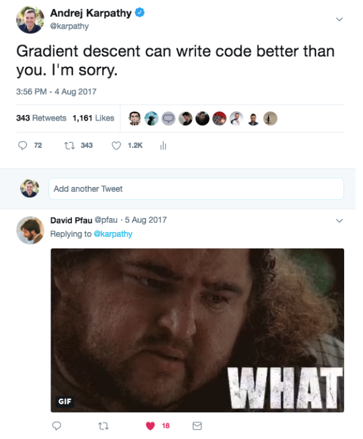

I sometimes see people refer to neural networks as just “another tool in your machine learning toolbox”. They have some pros and cons, they work here or there, and sometimes you can use them to win Kaggle competitions. Unfortunately, this interpretation completely misses the forest for the trees. Neural networks are not just another classifier, they represent the beginning of a fundamental shift in how we develop software. They are Software 2.0.  

我有时看到人们将神经网络称为“机器学习工具箱中的另一个工具”。它们有一些优点和缺点，它们可以在这里或那里工作，有时你可以用它们来赢得 Kaggle 比赛。不幸的是，这种解释完全只见树木不见森林。神经网络不仅仅是另一个分类器，它们代表了我们开发软件方式根本性转变的开始。它们是软件2.0。

The “classical stack” of **Software 1.0** is what we’re all familiar with — it is written in languages such as Python, C++, etc. It consists of explicit instructions to the computer written by a programmer. By writing each line of code, the programmer identifies a specific point in program space with some desirable behavior.  

软件1.0的“经典堆栈”是我们都熟悉的——它是用Python、C++等语言编写的。它由程序员编写的对计算机的显式指令组成。通过编写每一行代码，程序员可以识别程序空间中具有某些所需行为的特定点。

In contrast, **Software 2.0** is written in much more abstract, human unfriendly language, such as the weights of a neural network. No human is involved in writing this code because there are a lot of weights (typical networks might have millions), and coding directly in weights is kind of hard (I tried).  

相比之下，软件 2.0 是用更加抽象、对人类不友好的语言编写的，例如神经网络的权重。没有人参与编写这段代码，因为权重很多（典型的网络可能有数百万），并且直接在权重中编码有点困难（我尝试过）。

Instead, our approach is to specify some goal on the behavior of a desirable program (e.g., “satisfy a dataset of input output pairs of examples”, or “win a game of Go”), write a rough skeleton of the code (i.e. a neural net architecture) that identifies a subset of program space to search, and use the computational resources at our disposal to search this space for a program that works. In the case of neural networks, we restrict the search to a continuous subset of the program space where the search process can be made (somewhat surprisingly) efficient with backpropagation and stochastic gradient descent.  

相反，我们的方法是指定所需程序的行为目标（例如，“满足输入输出示例对的数据集”，或“赢得围棋游戏”），编写代码的粗略框架（即神经网络架构），它识别要搜索的程序空间的子集，并使用我们可以使用的计算资源在该空间中搜索有效的程序。在神经网络的情况下，我们将搜索限制在程序空间的连续子集中，其中通过反向传播和随机梯度下降可以使搜索过程（有点令人惊讶）高效。

To make the analogy explicit, in Software 1.0, human-engineered source code (e.g. some .cpp files) is compiled into a binary that does useful work. In Software 2.0 most often the source code comprises 1) the dataset that defines the desirable behavior and 2) the neural net architecture that gives the rough skeleton of the code, but with many details (the weights) to be filled in. The process of training the neural network compiles the dataset into the binary — the final neural network. In most practical applications today, the neural net architectures and the training systems are increasingly standardized into a commodity, so most of the active “software development” takes the form of curating, growing, massaging and cleaning labeled datasets. This is fundamentally altering the programming paradigm by which we iterate on our software, as the teams split in two: the 2.0 programmers (data labelers) edit and grow the datasets, while a few 1.0 programmers maintain and iterate on the surrounding training code infrastructure, analytics, visualizations and labeling interfaces.  

为了使类比更明确，在软件 1.0 中，人工设计的源代码（例如一些 .cpp 文件）被编译成可执行有用工作的二进制文件。在软件 2.0 中，源代码通常包含 1）定义所需行为的数据集和 2）给出代码粗略骨架的神经网络架构，但需要填充许多细节（权重）。训练神经网络将数据集编译成二进制文件——最终的神经网络。在当今的大多数实际应用中，神经网络架构和训练系统越来越标准化为商品，因此大多数活跃的“软件开发”都采取策划、增长、整理和清理标记数据集的形式。这从根本上改变了我们迭代软件的编程范式，因为团队分成两部分：2.0 程序员（数据标签人员）编辑和增长数据集，而一些 1.0 程序员维护和迭代周围的训练代码基础设施，分析、可视化和标签界面。

It turns out that a large portion of real-world problems have the property that it is significantly easier to collect the data (or more generally, identify a desirable behavior) than to explicitly write the program. Because of this and many other benefits of Software 2.0 programs that I will go into below, we are witnessing a massive transition across the industry where of a lot of 1.0 code is being ported into 2.0 code. Software (1.0) is eating the world, and now AI (Software 2.0) is eating software.  

事实证明，现实世界中的大部分问题都具有这样的特性：收集数据（或者更一般地说，识别所需的行为）比显式编写程序要容易得多。由于软件 2.0 程序的这一优势以及我将在下面介绍的许多其他优势，我们正在见证整个行业的巨大转变，其中许多 1.0 代码正在被移植到 2.0 代码中。软件（1.0）正在吞噬世界，而现在人工智能（软件2.0）正在吞噬软件。

## Ongoing transition 正在进行的过渡

Let’s briefly examine some concrete examples of this ongoing transition. In each of these areas we’ve seen improvements over the last few years when we give up on trying to address a complex problem by writing explicit code and instead transition the code into the 2.0 stack.  

让我们简要回顾一下这种正在进行的转变的一些具体例子。在过去几年中，当我们放弃尝试通过编写显式代码来解决复杂问题，而是将代码转换到 2.0 堆栈时，我们在每个领域都看到了改进。

**Visual Recognition** used to consist of engineered features with a bit of machine learning sprinkled on top at the end (e.g., an SVM). Since then, we discovered much more powerful visual features by obtaining large datasets (e.g. ImageNet) and searching in the space of Convolutional Neural Network architectures. More recently, we don’t even trust ourselves to hand-code the architectures and we’ve begun [searching over those](https://arxiv.org/abs/1703.01041) as well.  

视觉识别过去由工程特征组成，最后在顶部撒上一些机器学习（例如支持向量机）。从那时起，我们通过获取大型数据集（例如 ImageNet）并在卷积神经网络架构的空间中进行搜索，发现了更强大的视觉特征。最近，我们甚至不相信自己能够手动编写架构，并且我们也开始搜索这些架构。

**Speech recognition** used to involve a lot of preprocessing, gaussian mixture models and hidden markov models, but [today](https://github.com/syhw/wer_are_we) consist almost entirely of neural net stuff. A very related, often cited humorous quote attributed to Fred Jelinek from 1985 reads “Every time I fire a linguist, the performance of our speech recognition system goes up”.  

语音识别过去涉及大量预处理、高斯混合模型和隐马尔可夫模型，但如今几乎完全由神经网络组成。 Fred Jelinek 在 1985 年引用了一句非常相关且经常被引用的幽默名言：“每次我解雇一名语言学家，我们的语音识别系统的性能都会提高”。

**Speech synthesis** has historically been approached with various stitching mechanisms, but today the state of the art models are large ConvNets (e.g. [WaveNet](https://deepmind.com/blog/wavenet-launches-google-assistant/)) that produce raw audio signal outputs.  

语音合成历来都是通过各种拼接机制来实现的，但如今最先进的模型是产生原始音频信号输出的大型 ConvNet（例如 WaveNet）。

**Machine Translation** has usually been approaches with phrase-based statistical techniques, but neural networks are quickly becoming dominant. My favorite architectures are trained in the [multilingual setting](https://arxiv.org/abs/1611.04558), where a single model translates from any source language to any target language, and in weakly supervised (or entirely [unsupervised](https://arxiv.org/abs/1710.11041)) settings.  

机器翻译通常采用基于短语的统计技术，但神经网络正在迅速占据主导地位。我最喜欢的架构是在多语言环境中进行训练的，其中单个模型可以从任何源语言翻译为任何目标语言，并且是在弱监督（或完全无监督）的环境中进行的。

**Games.** Explicitly hand-coded Go playing programs have been developed for a long while, but [AlphaGo Zero](https://deepmind.com/blog/alphago-zero-learning-scratch/) (a ConvNet that looks at the raw state of the board and plays a move) has now become by far the strongest player of the game. I expect we’re going to see very similar results in other areas, e.g. [DOTA 2](https://blog.openai.com/more-on-dota-2/), or [StarCraft](https://deepmind.com/blog/deepmind-and-blizzard-open-starcraft-ii-ai-research-environment/).  

游戏。明确的手工编码围棋程序已经开发了很长一段时间，但 AlphaGo Zero（一种查看棋盘原始状态并下棋的 ConvNet）现已成为迄今为止该游戏中最强的玩家。我预计我们会在其他领域看到非常相似的结果，例如DOTA 2，或者星际争霸。

**Databases**. More traditional systems outside of Artificial Intelligence are also seeing early hints of a transition. For instance, “[The Case for Learned Index Structures](https://arxiv.org/abs/1712.01208)” replaces core components of a data management system with a neural network, outperforming cache-optimized B-Trees by up to 70% in speed while saving an order-of-magnitude in memory.  

数据库。人工智能之外的更多传统系统也看到了转型的早期迹象。例如，“学习索引结构案例”用神经网络取代了数据管理系统的核心组件，速度比缓存优化的 B 树高出 70%，同时节省了一个数量级的内存。

You’ll notice that many of my links above involve work done at Google. This is because Google is currently at the forefront of re-writing large chunks of itself into Software 2.0 code. “[One model to rule them all](https://arxiv.org/abs/1706.05137)” provides an early sketch of what this might look like, where the statistical strength of the individual domains is amalgamated into one consistent understanding of the world.  

您会注意到我上面的许多链接都涉及在 Google 完成的工作。这是因为 Google 目前处于将自身大部分内容重写为 Software 2.0 代码的最前沿。 “一个模型可以统治所有领域”提供了一个早期的草图，其中各个领域的统计强度被合并为对世界的一致理解。

## The benefits of Software 2.0  

软件2.0的好处

Why should we prefer to port complex programs into Software 2.0? Clearly, one easy answer is that they work better in practice. However, there are a lot of other convenient reasons to prefer this stack. Let’s take a look at some of the benefits of Software 2.0 (think: a ConvNet) compared to Software 1.0 (think: a production-level C++ code base). Software 2.0 is:  

为什么我们更愿意将复杂的程序移植到软件 2.0 中？显然，一个简单的答案是它们在实践中效果更好。然而，还有很多其他方便的理由来选择这个堆栈。让我们看一下软件 2.0（想想：ConvNet）相对于软件 1.0（想想：生产级 C++ 代码库）的一些好处。软件2.0是：

**Computationally homogeneous**. A typical neural network is, to the first order, made up of a sandwich of only two operations: matrix multiplication and thresholding at zero (ReLU). Compare that with the instruction set of classical software, which is significantly more heterogenous and complex. Because you only have to provide Software 1.0 implementation for a small number of the core computational primitives (e.g. matrix multiply), it is much easier to make various correctness/performance guarantees.  

计算同质。就一阶而言，典型的神经网络由仅包含两个操作的三明治组成：矩阵乘法和零阈值化 (ReLU)。与经典软件的指令集相比，其异构性和复杂性明显更高。因为您只需为少量核心计算原语（例如矩阵乘法）提供软件 1.0 实现，所以更容易做出各种正确性/性能保证。

**Simple to bake into silicon**. As a corollary, since the instruction set of a neural network is relatively small, it is significantly easier to implement these networks much closer to silicon, e.g. with custom [ASICs](https://www.forbes.com/sites/moorinsights/2017/08/04/will-asic-chips-become-the-next-big-thing-in-ai/#7d6d7c0511d9), [neuromorphic chips](https://spectrum.ieee.org/semiconductors/design/neuromorphic-chips-are-destined-for-deep-learningor-obscurity), and so on. The world will change when low-powered intelligence becomes pervasive around us. E.g., small, inexpensive chips could come with a pretrained ConvNet, a speech recognizer, and a WaveNet speech synthesis network all integrated in a small protobrain that you can attach to stuff.  

易于烘烤成硅。由此推论，由于神经网络的指令集相对较小，因此更容易实现这些更接近硅的网络，例如具有定制 ASIC、神经形态芯片等。当低能力智能在我们周围普遍存在时，世界将会改变。例如，小型、廉价的芯片可以配备预训练的 ConvNet、语音识别器和 WaveNet 语音合成网络，所有这些都集成在一个可以附加到东西上的小型原脑中。

**Constant running time**. Every iteration of a typical neural net forward pass takes exactly the same amount of FLOPS. There is zero variability based on the different execution paths your code could take through some sprawling C++ code base. Of course, you could have dynamic compute graphs but the execution flow is normally still significantly constrained. This way we are also almost guaranteed to never find ourselves in unintended infinite loops.  

恒定的运行时间。典型神经网络前向传递的每次迭代都需要完全相同的 FLOPS 量。根据代码在某些庞大的 C++ 代码库中可能采用的不同执行路径，可变性为零。当然，您可以拥有动态计算图，但执行流程通常仍然受到很大限制。这样我们也几乎可以保证永远不会陷入意外的无限循环。

**Constant memory use**. Related to the above, there is no dynamically allocated memory anywhere so there is also little possibility of swapping to disk, or memory leaks that you have to hunt down in your code.  

持续的内存使用。与上述相关的是，任何地方都没有动态分配的内存，因此交换到磁盘的可能性也很小，或者您必须在代码中查找内存泄漏。

**It is highly portable**. A sequence of matrix multiplies is significantly easier to run on arbitrary computational configurations compared to classical binaries or scripts.  

它非常便携。与传统的二进制文件或脚本相比，矩阵乘法序列在任意计算配置上运行要容易得多。

**It is very agile**. If you had a C++ code and someone wanted you to make it twice as fast (at cost of performance if needed), it would be highly non-trivial to tune the system for the new spec. However, in Software 2.0 we can take our network, remove half of the channels, retrain, and there — it runs exactly at twice the speed and works a bit worse. It’s magic. Conversely, if you happen to get more data/compute, you can immediately make your program work better just by adding more channels and retraining.  

它非常敏捷。如果您有一个 C++ 代码，并且有人希望您将其速度提高两倍（如果需要，则以性能为代价），那么针对新规范调整系统将非常重要。然而，在软件 2.0 中，我们可以采用我们的网络，删除一半的通道，重新训练，然后它就以两倍的速度运行，并且工作得更差。这是魔法。相反，如果您碰巧获得更多数据/计算，只需添加更多通道和重新训练，您就可以立即使您的程序运行得更好。

**Modules can meld into an optimal whole**. Our software is often decomposed into modules that communicate through public functions, APIs, or endpoints. However, if two Software 2.0 modules that were originally trained separately interact, we can easily backpropagate through the whole. Think about how amazing it could be if your web browser could automatically re-design the low-level system instructions 10 stacks down to achieve a higher efficiency in loading web pages. Or if the computer vision library (e.g. OpenCV) you imported could be auto-tuned on your specific data. With 2.0, this is the default behavior.  

模块可以融合成一个最佳整体。我们的软件通常被分解为通过公共函数、API 或端点进行通信的模块。然而，如果最初单独训练的两个 Software 2.0 模块进行交互，我们可以轻松地在整个过程中进行反向传播。想象一下，如果您的网络浏览器能够自动重新设计 10 层以下的低级系统指令，以实现更高的网页加载效率，那该是多么令人惊奇。或者，如果您导入的计算机视觉库（例如 OpenCV）可以根据您的特定数据进行自动调整。对于 2.0，这是默认行为。

**It is better than you**. Finally, and most importantly, a neural network is a better piece of code than anything you or I can come up with in a large fraction of valuable verticals, which currently at the very least involve anything to do with images/video and sound/speech.  

它比你好。最后，也是最重要的是，神经网络是比你或我在大部分有价值的垂直领域中所能想到的任何代码都更好的代码，这些垂直领域目前至少涉及与图像/视频和声音/语音有关的任何内容。

## The limitations of Software 2.0  

软件2.0的局限性

The 2.0 stack also has some of its own disadvantages. At the end of the optimization we’re left with large networks that work well, but it’s very hard to tell how. Across many applications areas, we’ll be left with a choice of using a 90% accurate model we understand, or 99% accurate model we don’t.  

2.0 堆栈也有一些自身的缺点。优化结束后，我们留下了运行良好的大型网络，但很难说如何运行。在许多应用领域，我们可以选择使用我们理解的 90% 准确率的模型，或者我们不理解的 99% 准确率的模型。

The 2.0 stack can [fail in unintuitive and embarrassing ways](https://motherboard.vice.com/en_us/article/nz7798/weve-already-taught-artificial-intelligence-to-be-racist-sexist) ,or worse, they can “silently fail”, e.g., by silently adopting biases in their training data, which are very difficult to properly analyze and examine when their sizes are easily in the millions in most cases.  

2.0 堆栈可能会以不直观和令人尴尬的方式失败，或者更糟糕的是，它们可能会“默默地失败”，例如，通过在训练数据中默默地采用偏差，当它们的规模轻松达到数百万时，很难正确分析和检查。在大多数情况下。

Finally, we’re still discovering some of the peculiar properties of this stack. For instance, the existence of [adversarial examples](https://blog.openai.com/adversarial-example-research/) and [attacks](https://github.com/yenchenlin/awesome-adversarial-machine-learning) highlights the unintuitive nature of this stack.  

最后，我们仍在发现这个堆栈的一些特殊属性。例如，对抗性示例和攻击的存在凸显了该堆栈的不直观本质。

## Programming in the 2.0 stack  

在2.0堆栈中编程

Software 1.0 is code we write. Software 2.0 is code written by the optimization based on an evaluation criterion (such as “classify this training data correctly”). It is likely that any setting where the program is not obvious but one can repeatedly evaluate the performance of it (e.g. — did you classify some images correctly? do you win games of Go?) will be subject to this transition, because the optimization can find much better code than what a human can write.  

软件1.0是我们编写的代码。软件2.0是根据评估标准（例如“正确分类此训练数据”）优化编写的代码。程序不明显但可以重复评估其性能的任何设置（例如，您是否正确分类了一些图像？您赢得了围棋比赛吗？）都可能会受到这种转变的影响，因为优化可以找到比人类编写的更好的代码。

The lens through which we view trends matters. If you recognize Software 2.0 as a new and emerging programming paradigm instead of simply treating neural networks as a pretty good classifier in the class of machine learning techniques, the extrapolations become more obvious, and it’s clear that there is much more work to do.  

我们看待趋势的视角很重要。如果您将软件 2.0 视为一种新兴的编程范式，而不是简单地将神经网络视为机器学习技术类别中的一个相当好的分类器，那么推断就会变得更加明显，并且显然还有更多的工作要做。

In particular, we’ve built up a vast amount of tooling that assists humans in writing 1.0 code, such as powerful IDEs with features like syntax highlighting, debuggers, profilers, go to def, git integration, etc. In the 2.0 stack, the programming is done by accumulating, massaging and cleaning datasets. For example, when the network fails in some hard or rare cases, we do not fix those predictions by writing code, but by including more labeled examples of those cases. Who is going to develop the first Software 2.0 IDEs, which help with all of the workflows in accumulating, visualizing, cleaning, labeling, and sourcing datasets? Perhaps the IDE bubbles up images that the network suspects are mislabeled based on the per-example loss, or assists in labeling by seeding labels with predictions, or suggests useful examples to label based on the uncertainty of the network’s predictions.  

特别是，我们构建了大量的工具来帮助人们编写 1.0 代码，例如功能强大的 IDE，具有语法突出显示、调试器、分析器、go to def、git 集成等功能。在 2.0 堆栈中，编程是通过积累、整理和清理数据集来完成的。例如，当网络在某些困难或罕见的情况下失败时，我们不会通过编写代码来修复这些预测，而是通过包含这些情况的更多标记示例来修复这些预测。谁将开发第一个 Software 2.0 IDE，以帮助完成积累、可视化、清理、标记和采购数据集等所有工作流程？也许 IDE 会根据每个示例的损失来冒泡网络怀疑被错误标记的图像，或者通过用预测播种标签来帮助标记，或者根据网络预测的不确定性建议有用的标记示例。

Similarly, Github is a very successful home for Software 1.0 code. Is there space for a Software 2.0 Github? In this case repositories are datasets and commits are made up of additions and edits of the labels.  

同样，Github 也是非常成功的 Software 1.0 代码之家。有软件 2.0 Github 的空间吗？在这种情况下，存储库是数据集，提交由标签的添加和编辑组成。

Traditional package managers and related serving infrastructure like pip, conda, docker, etc. help us more easily deploy and compose binaries. How do we effectively deploy, share, import and work with Software 2.0 binaries? What is the conda equivalent for neural networks?  

传统的包管理器和相关的服务基础设施（如 pip、conda、docker 等）帮助我们更轻松地部署和编写二进制文件。我们如何有效地部署、共享、导入和使用 Software 2.0 二进制文件？神经网络的 conda 等价物是什么？

In the short term, Software 2.0 will become increasingly prevalent in any domain where repeated evaluation is possible and cheap, and where the algorithm itself is difficult to design explicitly. There are many exciting opportunities to consider the entire software development ecosystem and how it can be adapted to this new programming paradigm. And in the long run, the future of this paradigm is bright because it is increasingly clear that when we develop AGI, it will certainly be written in Software 2.0.  

短期内，软件 2.0 将在任何可以进行重复评估且成本低廉且算法本身难以明确设计的领域中变得越来越普遍。有许多令人兴奋的机会来考虑整个软件开发生态系统以及它如何适应这种新的编程范式。从长远来看，这种范式的未来是光明的，因为越来越清楚的是，当我们开发AGI时，它肯定会用软件2.0来编写。
