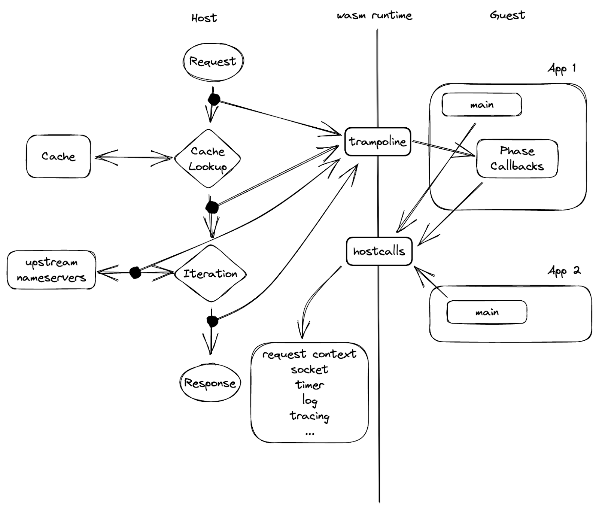

≈

2018 年 4 月 1 日，Cloudflare [发布了](https://blog.cloudflare.com/dns-resolver-1-1-1-1/) 1.1.1.1 公共 DNS 解析器。过去几年来，我们在平台上不断添砖加瓦，包括用于故障排除的[调试页面](https://1.1.1.1/help)，[缓存清除](https://1.1.1.1/purge-cache/)，Cloudflare 区域的 0 TTL，[上游 TLS](https://blog.cloudflare.com/encrypting-dns-end-to-end/)，以及 [1.1.1.1 for Families](https://blog.cloudflare.com/zh-cn/introducing-1-1-1-1-for-families-zh-cn/)。本文想分享一些幕后的细节和变化。

项目启动时，[Knot Resolver](https://www.knot-resolver.cz/) 被选定为 DNS 解析器。我们开始在其基础上构建一个完整的系统，以便它适合 Cloudflare 的用例。拥有一个经过实战考验的 DNS 递归解析器，以及一个 DNSSEC 验证器非常棒，这样我们可以把精力花在其他地方，而不用担心 DNS 协议的实现。

就其基于 Lua 的插件系统而言，Knot Resolver 非常灵活。它允许我们快速扩展核心功能，以支持各种产品特性，如 DoH/DoT、日志记录、基于 bpf 的攻击缓解、缓存共享和迭代逻辑覆盖。随着[流量增长](https://mobile.twitter.com/eastdakota/status/1103800276102729729)， 我们达到了一定的限制。

## 我们吸取的教训

在深入讨论之前，让我们先鸟瞰一下简化的 Cloudflare 数据中心设置，这可以帮助我们理解后面将要讨论的内容。Cloudflare 的每台服务器都是相同的：运行在一台服务器上的软件栈与另一台服务器上的软件栈完全相同，仅配置可能不同。这种设置大大降低了维护的复杂性。


图 1：数据中心布局

解析器以后台进程 kresd 的形式运行，而且它并不是单独工作的。请求，特别是 DNS 请求，由 [Unimog](https://blog.cloudflare.com/unimog-cloudflares-edge-load-balancer/) 进行负载平衡后分配给数据中心内的服务器。DoH 请求在我们的 TLS 终止器终止。配置和其他小块数据可以通过 [Quicksilver](https://blog.cloudflare.com/introducing-quicksilver-configuration-distribution-at-internet-scale/) 在几秒钟内传递到世界各地。凭借以上所有帮助，解析器可以专注于自己的目标——解析 DNS 查询，而不用担心传输协议的细节。现在让我们来谈谈我们想要改进的 3 个关键领域：插件阻塞 I/O，更有效地使用缓存空间，以及插件隔离。

### 阻塞事件循环的回调函数

Knot Resolver 有一个非常灵活的插件系统来扩展它的核心功能。这些插件被称为模块，它们是基于回调的。在请求处理期间的某些点，这些回调将通过当前查询上下文调用。这为某个模块提供检查、修改和甚至生成请求/响应的能力。从设计来看，这些回调应该是简单的，以避免阻塞底层的事件循环。这一点很重要，因为服务是单线程的，而事件循环负责同时处理多个请求。因此，即使只有一个请求在回调中被搁置，也意味着在回调完成之前，其他并发请求也无法被处理。

这种设置一直工作得足够好，直到我们需要进行阻塞操作，例如，在响应客户端前从 Quicksilver 拉取数据。

### 缓存效率

由于对一个域的请求可能落在数据中心内的任何节点上，在另一个节点已经有答案的情况下重复解析查询将是一种浪费。根据直觉，如果缓存可以在服务器之间共享，则延迟可以得到改善，因此我们创建了一个缓存模块，该模块对新添加的缓存条目进行组播。然后，同一数据中心内的节点可以订阅事件并更新其本地缓存。

Knot Resolver 的默认缓存实现是 [LMDB](https://www.symas.com/lmdb)。对于中小型部署来说，它快速又可靠。但是在我们的例子中，缓存清除很快成为一个问题。缓存本身不跟踪任何 TTL、流行度等。缓存填满时，它会清除所有条目并重新开始。像分区枚举这样的场景可能会用以后不太可能被检索的数据填充缓存。

此外，我们的组播缓存模块导致情况进一步恶化，将不太有用的数据放大到所有节点，并使它们同时达到缓存高水位。然后我们看到了一个延迟峰值，因为所有的节点都放弃了缓存，并在同一时间重新开始。

### 模块隔离

随着 Lua 模块列表增加，调试问题变得越来越困难。这是因为单个 Lua 状态在所有模块之间共享，因此一个行为不当的模块可能会影响另一个模块。例如，当 Lua 状态内部出现问题时，例如有太多的协程，或者内存不足，程序崩溃已经算是幸运了，但是所产生的堆栈跟踪很难读取。强制拆除或升级运行中的模块也很困难，因为它在 Lua 运行时中不仅有状态，还有 FFI，因此内存安全无法保证。

## BigPineapple 应运而生

我们找不到任何现有软件能满足我们这个有点小众的要求，因此最终我们自己动手打造了一个。第一个尝试是用 Rust 编写的一个瘦服务[包裹 Knot Resolver 的核心](https://github.com/vavrusa/rust-kres) (修改版 [edgedns](https://github.com/jedisct1/edgedns))。

由于必须不断地在存储和 C/FFI 类型之间进行转换，以及一些其他的问题(例如，从缓存中查找记录的 ABI 期望返回的记录在下一次调用或读事务结束之前是不可变的)，这样做证明是很困难的。但是，从尝试实现这种分离功能——其中主机(服务)向客机(解析器核心库)提供一些资源，以及如何使接口变得更好，但我们学到了很多。

在之后的迭代中，我们用一个基于异步运行时的新库替换了整个递归库；并添加了一个重新设计的模块系统，随着时间的推移，随着我们换出越来越多的组件，逐渐将服务重写为 Rust。异步运行时就是 [tokio](https://tokio.rs/)，其提供了简洁的线程池接口，用于运行非阻塞和阻塞任务，以及一个与其他部件(Rust 库)一起工作的良好生态系统。

在那以后，随着 futures combinators 变得繁琐，我们开始将一切转换为 async/await。这是 async/await 特性通过 Rust 1.39 提供以前，导致我们使用了一段时间的 nightly (Rust 测试版) ，遇到了[一些问题](https://areweasyncyet.rs/)。当 async/await 稳定后，它让我们能够高效地编写请求处理例程，类似于 Go。

所有的任务都可以并发运行，某些 I/O 繁重的任务可以被分解成更小的部分，从而受益于更细粒度的调度。由于运行时在线程池(而不是单个线程)上执行任务，它还可以受益于工作窃取(work stealing)。这避免了我们之前遇到的一个问题，即单个请求需要花费大量时间来处理，阻塞事件循环中的所有其他请求。


图 2：组件概览

最后，我们打造了一个自己满意的平台，称之为 **BigPineapple**。上图显示了平台的主要组件及组件之间数据流的概览。在 BigPineapple 内部，服务器模块从客户端获取入站请求，验证并将其转换为统一的帧流，然后由 worker 模块处理。worker 模块有一组 worker，它们的任务是为请求中的问题找到答案。每个 worker 与缓存模块交互，以检查答案是否存在并且仍然有效，否则将驱动递归模块进行递归迭代查询。递归器不做任何 I/O，当它需要任何东西时，它将子任务委托给 conductor 模块。然后，conductor 使用出站查询从上游名称服务器获取信息。在整个过程中，一些模块可以与沙盒模块交互，通过运行里面的插件来扩展它的功能。

让我们更详细地看看其中的一些模块，看看它们是如何帮助我们克服以前遇到的问题的。

### 更新的 I/O 架构

DNS 解析器可以看作是客户端和几个权威名称服务器之间的代理：它从客户端接收请求，递归地从上游名称服务器获取数据，然后组合响应并将它们发送回客户端。因此，它同时有入站和出站流量，分别由服务器和 conductor 组件处理。

服务器使用不同传输协议侦听一个接口列表。这些随后被抽象为“帧”流。每一帧都是一个 DNS 消息的高级表示，带有一些额外的元数据。在底层，它可以是 UDP 包、TCP 流的一段或 HTTP 请求的有效载荷，但它们都以相同的方式处理。然后，帧被转换成一个异步任务，接着由一组负责解析这些任务的 worker 接收。完成的任务被转换回响应，并发送回客户端。

这种对协议及其编码的“帧”抽象简化了用于规范帧源的逻辑，例如加强公平性以防止“饿死”，并控制节奏以保护服务器不被压垮。我们从以前的实现中了解到的一件事是，对于一个向公众开放的服务，I/O 峰值性能的重要性低于公平调度客户端的能力。这主要是因为每个递归请求的时间和计算成本有很大的不同(例如缓存命中/不命中)，并且很难事先猜测。递归服务中的缓存不命中不仅消耗 Cloudflare 的资源，还消耗被查询的权威名称服务器的资源，因此我们需要注意这一点。

服务器的另一方面是 conductor，其管理所有出站连接。它帮助在向上游连接之前回答一些问题：就延迟而言，连接到哪个名称服务器最快？如果所有的名称服务器都不可达该怎么办？连接使用什么协议，以及是否有[更好的选项](https://engineering.fb.com/2018/12/21/security/dns-over-tls/)？ conductor 能够通过跟踪上游服务器的指标(例如 RTT、QoS 等)来做出这些决策。了解这些情况，它也可以猜测像上游容量、UDP 包丢失等信息，并进行必要的操作，例如，在认为此前的 UDP 包没有到达上游时进行重试。


图 3：I/O conductor

图 3 显示了关于 conductor 的简化数据流。它被上面提到的交换器调用，以上游请求作为输入。这些请求将首先进行去重：这意味着在一个小窗口中，如果有很多请求来到这个 conductor 并询问相同的问题，只有一个会通过，其他请求被放入一个等待队列中。这在缓存条目过期时很常见，可以减少不必要的网络流量。然后，根据请求和上游指标，连接 instructor 要么选择一个可用的已打开连接，要么生成一组参数。使用这些参数，I/O 执行器就可以直接连接到上游，甚至可以使用我们的 [Argo Smart Routing 技术](https://blog.cloudflare.com/argo/)，采取一条经另一个 Cloudflare 数据中心的路线。

### 缓存

在递归服务中进行缓存是非常关键的，因为服务器可以在 1 毫秒内返回缓存的响应，而缓存不命中时则需要数百毫秒来进行响应。由于内存是有限的资源(在 Cloudflare 的架构中也是共享资源)，更有效地使用缓存空间是我们想要改进的关键领域之一。新的缓存使用一种缓存替代数据结构 ([ARC](https://en.wikipedia.org/wiki/Adaptive_replacement_cache))，而非 KV 存储。这样可以很好地利用单个节点上的空间，因为热门程度较低的条目会逐步被剔除，而且该数据结构可抗扫描。

此外，与我们之前使用组播在整个数据中心复制缓存不同，BigPineapple 知道它在同一个数据中心中的对等节点，如果它在自己的缓存中找不到条目，就将查询从一个节点转发给另一个节点。这是通过将查询一致地散列到每个数据中心的健康节点来实现的。例如，针对相同注册域的查询将通过相同的节点子集，这不仅提高了缓存命中率，而且有助于基础架构缓存，后者存储有关名称服务器性能和特性的信息。


图 4：更新的数据中心布局

### 异步递归库

递归库是 BigPineapple 的 DNS 大脑，它知道如何为查询中的问题找到答案。它从根开始，将客户端查询分解为子查询，并使用它们从互联网上的各种权威名称服务器中递归地收集知识。这个过程的结果就是答案。得益于 async/await，它可以被抽象为这样的函数：

```
async fn resolve(Request, Exchanger) → Result<Response>;
```

该函数包含对给定请求生成响应需要的所有逻辑，但它自己不做任何 I/O。相反，我们传递一个 Exchanger trait (Rust 接口)，它知道如何与上游权威名称服务器异步交换 DNS 消息。exchanger 通常在不同的 await 被调用——例如，当递归开始时，它最初做的事情之一就是为该域查找最近的缓存委托。如果它在缓存中没有最终的委托，则需要询问哪些名称服务器负责这个域，并等待响应，然后才能继续进行下去。

得益于这种设计，将“等待某些响应”部分从递归 DNS 逻辑中分离出来，通过提供 exchanger 的模拟实现，测试起来就容易得多。此外，它使递归迭代代码(以及，特别是 DNSSEC 验证逻辑)更具可读性，因为它是按顺序编写的，而不是分散在许多回调中。

有趣的事实：从头开始写一个 DNS 递归解析器一点都不好玩！

不仅因为 DNSSEC 验证的复杂性，还因为各种不兼容 RFC 的服务器、转发器、防火墙等提供必须的“变通方法”。因此，我们将 [deckard](https://github.com/CZ-NIC/deckard) 移植到 Rust 中来帮助测试它。此外，当我们开始迁移到这个新的异步递归库时，我们首先在“影子”模式下运行它：处理来自生产服务的真实世界查询样本，并比较差异。我们过去在 Cloudflare 的权威 DNS 服务上也这样做过。递归服务要稍微困难一些，因为递归服务必须在互联网上查找所有数据，而且，由于本地化、负载平衡等原因，权威名称服务器通常会对相同的查询给出不同的答案，导致许多误报。

2019 年 12 月，我们终于在一个公共测试端点上启用了新服务(查看[公告](https://community.cloudflare.com/t/help-us-test-a-new-version-of-1-1-1-1-public-dns-resolver/137078))以解决剩余的问题，然后慢慢将生产端点迁移到新服务。即使做了所有这些工作之后，我们继续发现 DNS 递归(特别是 DNSSEC 验证)的边缘情况，但由于库的新架构，修复和再现这些问题变得更容易了。

### 沙盒中的插件

动态扩展核心 DNS 功能的能力对我们来说很重要，因此 BigPineapple 重新设计了它的插件系统。以前，Lua 插件运行在与服务本身相同的内存空间中，通常可以自由地做它们想做的事情。这很方便，因为我们可以使用 C/FFI 在服务和模块之间自由传递内存引用。例如，直接从缓存读取响应，而不必先复制到缓冲区。但这也很危险，因为模块可以读取未初始化的内存、使用错误的函数签名调用主机 ABI、阻塞本地套接字或做其他不希望做的事情，此外，服务没有办法限制这些行为。

所以我们考虑用 JavaScript 或原生模块替换嵌入式的 Lua 运行时，但与此同时，WebAssembly (简称 Wasm)的嵌入式运行时开始出现。WebAssembly 程序的两个优点是，它允许我们用与服务其他部分相同的语言编写程序，以及它们在一个隔离的内存空间中运行。因此，我们开始围绕 WebAssembly 模块的限制对客机/主机接口进行建模，以了解其工作原理。

BigPineapple 的 Wasm 运行时目前由 [Wasmer](https://wasmer.io/) 驱动。开始时，我们尝试了几种不同的运行时，例如 [Wasmtime](https://wasmtime.dev/) 和 [WAVM](https://wavm.github.io/)，发现对我们的用例而言，使用 Wasmer 更简单。该运行时允许每个模块在其自己的实例中运行，具有隔离的内存和信号陷阱，这自然解决了我们前面描述的模块隔离问题。除此之外，我们还可以同时运行同一个模块的多个实例。通过仔细控制，应用可以从一个实例热交换到另一个，而不会错过任何一个请求！这很好，因为应用程序可以在不重启服务器的情况下进行动态升级。由于 Wasm 程序是通过 Quicksilver 分发的，BigPineapple 的功能几秒钟内就能在全球范围内安全地改变！

要更好地理解 WebAssembly 沙盒，首先需要介绍几个术语：

-   主机：运行 Wasm 运行时的程序。与内核类似，它可以通过该运行时完全控制客机应用程序。
-   客机应用程序：沙盒内的 Wasm 程序。在一个受限环境中，它只能访问由运行时提供的自有内存空间，并调用导入的主机调用。我们将其简称为“应用”。
-   主机调用：在主机中定义、可被客机调用的函数。与系统调用类似，这是客机应用访问沙盒之外资源的唯一方式。
-   客机运行时：一个让客机应用程序轻松与主机交互的库。它实现了一些常见的接口，以便应用可以只使用异步、套接字、日志和跟踪，而不知道底层的细节。

现在我们可以深入介绍一下沙盒了。首先，让我们从客机侧开始，看看一个普通应用的生命周期是什么样子的。在客机运行时的帮助下，可以编写与常规程序类似的客机应用。因此，像其他可执行文件一样，应用以 start 函数作为入口点开始，在加载时由主机调用。它还会被提供一些参数，如同来自命令行。此时，该实例通常会进行一些初始化，更重要的是，为不同的查询阶段注册回调函数。这是因为，在递归解析器中，查询必须经过几个阶段，才能收集足够的信息来产生响应，例如，缓存查找，或生成子请求来解析域的委托链，因此能够连接到这些阶段是应用在不同用例中发挥作用的必要条件。start 函数还可以运行一些后台任务来补充阶段回调，并存储全局状态。例如——报告指标，或者从外部数据源预取共享数据，等等。同样，一如我们写一个普通程序。

但是程序参数来自何处呢？客机应用如何发送日志和指标呢？答案是外部函数。



图 5：基于 Wasm 的沙盒

在图 5 中，我们可以看到中间有一个屏障，即沙盒边界，它将客机与主机分开。一侧要到达另一侧，唯一途径是通过由对方预先导出的一组函数。如图所示，“hostcalls” (主机调用)由主机导出，由客机导入和调用；而“trampoline”是主机知道的客机函数。

后者称为 [trampoline](https://en.wikipedia.org/wiki/Trampoline_(computing))，是因为它用于调用客机实例中未导出的函数或闭包。阶段回调是我们为什么需要 trampoline 函数的一个例子：每个回调返回一个闭包，因此不能在实例化时导出。客机应用要注册一个回调，调用一个带有回调地址 “`hostcall_register_callback(pre_cache, #30987)`” 的主机调用，当需要调用回调时，主机不能直接调用该指针，因为它指向客机的内存空间。取而代之，它利用前面提到的 trampoline 之一， 并提供回调闭包的地址：“`trampoline_call(#30987)`”。

**隔离开销**  

就像硬币有两面一样，新的沙盒确实会带来一些额外的开销。WebAssembly 提供的可移植性和隔离性带来了额外代价。这里，我们将列出两个例子。

首先，客机应用不允许读取主机内存。其工作的方式是，客机通过一个主机调用提供一个内存区域，然后主机将数据写入客机内存空间。这会引入一个内存副本，如果我们在沙盒之外，则不需要该内存副本。坏消息是，在我们的用例中，客户应用程序应该对查询和/或响应进行一些操作，因此它们几乎总是需要在每次请求时从主机读取数据。另一方面，好消息是在请求的生命周期中，数据不会改变。因此，我们在客机应用实例化后立即在客机内存空间中预分配大量内存。分配的内存并不会被使用，而是用于在地址空间中占一个坑。一旦主机获得了地址的详细信息，它就会将一个包含客机所需公共数据的共享内存区域映射到客户空间中。当客机代码开始执行时，它只需要访问共享内存覆盖层中的数据，而不需要复制。

我们遇到的另一个问题是，我们想在 BigPineapple 中添加对现代协议 [oDoH](https://blog.cloudflare.com/oblivious-dns/) 的支持。它的主要工作是解密客户端查询，解析它，然后在发送回之前加密答案。从设计上讲，它不属于核心 DNS，应该使用 Wasm 应用进行扩展。然而，WebAssembly 指令集没有提供一些密码学原语， 例如 AES 和 SHA-2，这使得它无法获得主机硬件的好处。有一些进行中的工作通过 [WASI-crypto](https://github.com/WebAssembly/wasi-crypto) 将这一功能引入 Wasm。在那以前，我们对此的解决方案是简单地通过主机调用将 [HPKE](https://blog.cloudflare.com/hybrid-public-key-encryption/) 委托给主机，与在 Wasm 中执行相比，我们已经看到了 4 倍的性能提升。

**Wasm 中的异步**  

还记得我们之前讨论过的回调函数可能阻塞事件循环的问题吗？本质上，问题在于如何异步运行沙盒中的代码。因为无论请求处理回调函数有多复杂，只要它能返回结果，我们就可以设定允许阻塞的时间上限。幸运的是，Rust 的异步框架既优雅又轻量。它让我们有机会使用一组客机调用来实现“Future”。

在 Rust 中，Future 是异步计算的基础组件。从用户的角度来看，为了创建一个异步程序，必须考虑两件事：实现一个驱动状态转换的可轮询函数，并放置一个 waker 作为回调函数，当可轮询函数因某些外部事件(例如时间经过，套接字变得可读，等等)而应被再次调用时，用来唤醒自己。前者是为了能够逐步推进程序，例如从 I/O 读取缓冲的数据，并返回一个表示任务状态的新状态：finished 或 yielded。后者在任务放弃的情况下很有用，因为当任务等待的条件满足时，它会触发 Future 被轮询，而不是一直忙着循环直到任务完成。

让我们看看这是如何在我们的沙盒中实现的。对于客机需要执行一些 I/O 操作的场景，它必须通过主机调用来完成，因为它处于一个受限制的环境中。假设主机提供了一组简化的主机调用，它们反映了基本的套接字操作：打开、读取、写入和关闭，那么客户可按如下定义其伪轮询器：

```
fn poll(&mut self, wake: fn()) -> Poll {
match hostcall_socket_read(self.sock, self.buffer) {
        HostOk  => Poll::Ready,
        HostEof => Poll::Pending,
}
}
```

在这里，主机调用从套接字读取数据到缓冲区，根据其返回值，函数可以将自己移动到我们前面提到的状态之一：finished (就绪)或 yielded (等待)。神奇的事情发生在主机调用中。还记得在图 5 中，这是访问资源的唯一方法吗？客机应用并不拥有套接字，但它可以通过“`hostcall_socket_open`” 获得一个“句柄”，这将在主机侧创建一个套接字，并返回一个句柄。理论上，句柄可以是任何东西，但实际上，使用整数套接字句柄可以很好地映射到主机侧的文件描述符，或 vector 或 slab 中的索引。通过引用返回的句柄，客机应用能够远程控制真正的套接字。由于主机侧是完全异步的，它可以简单地将套接字状态转发给客户端。如果您注意到上面没有使用 waker 函数，非常棒！这是因为当调用主机调用时，它不仅开始打开一个套接字，还注册了当前的 waker，以便在套接字打开时调用(或者不调用)。因此，当套接字就绪时，主机任务将被唤醒，它将从其上下文中找到相应的客机任务，并使用 trampoline 函数将其唤醒，如图 5 所示。在其他情况下，客机任务需要等待另一个客机任务，例如一个异步互斥。这里的机制类似：使用主机调用来注册 waker。

以上复杂操作都封装在我们的客户异步运行时中，提供易于使用的 API，以便客机应用可以访问常规的异步函数，而不必考虑底层的细节。

## (非)结束

希望本文能让您对支持 1.1.1.1 的创新平台有一个大致的了解。这个平台仍在发展。截至今天，我们的几个产品都是由 BigPineapple 上运行的客机应用支持，例如 [1.1.1.1 for Families](https://blog.cloudflare.com/zh-cn/introducing-1-1-1-1-for-families-zh-cn/)、[AS112](https://blog.cloudflare.com/the-as112-project/) 和 [Gateway DNS](https://www.cloudflare.com/products/zero-trust/gateway/)。