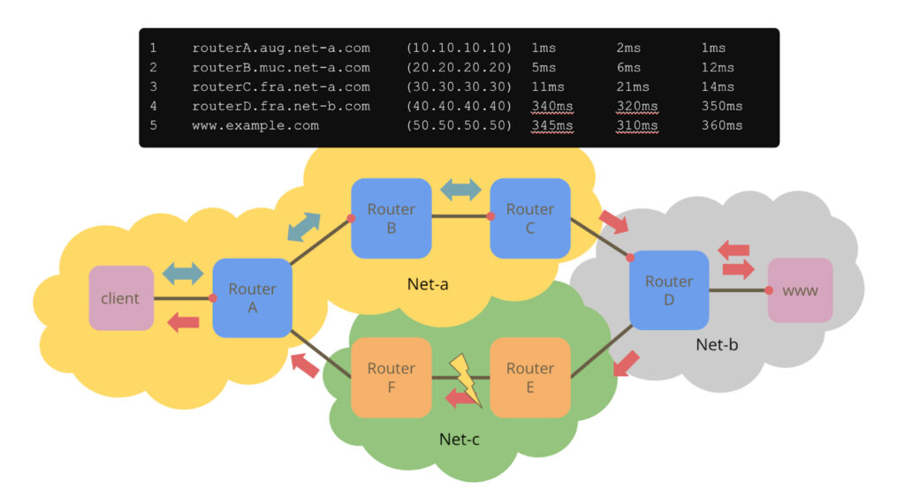

Altered from Karla Hernandez' orginal at [Unsplash](https://unsplash.com/photos/n9P3wE-jwSk).  

改编自卡拉·埃尔南德斯 (Karla Hernandez) 在 Unsplash 上的原作。

You should know the operational state of your network because there really is no reason why you should not. The [IETF](https://datatracker.ietf.org/wg/#ops) and your hardware vendor of choice have worked hard to give you a whole fleet of protocols and machinery to assess all aspects of the pieces of the Internet that are under your direct control. But once you leave your own network and enter the public Internet, there is hardly anything you can do to pinpoint potential problems. And you might argue that nobody other than the network operator in question should actually be able to do that. Well, people using vital infrastructure hosted in the cloud might disagree.   

您应该了解网络的运行状态，因为确实没有理由不了解。 IETF 和您选择的硬件供应商努力为您提供一整套协议和机器，以评估您直接控制下的互联网各个部分的各个方面。但是，一旦离开自己的网络并进入公共互联网，您几乎无法采取任何措施来查明潜在问题。您可能会争辩说，除了相关网络运营商之外，没有人能够真正做到这一点。那么，使用云中托管的重要基础设施的人们可能会不同意。

While the Operations, Administration, and Management (OAM) superpowers you are accustomed to in your own network are not available on the public Internet, there are two tools everyone can use: [ping and traceroute](https://blog.apnic.net/2021/06/21/what-are-ping-and-traceroute-really/). Ping does not give you an awful lot of information. It provides you with boolean information about interface reachability and it estimates the respective round-trip time (RTT). Traceroute extends Ping’s functionality by also enumerating the routers on the path towards a destination and providing an estimate of their respective RTT. That doesn’t sound so bad. But traceroute output can be difficult to interpret correctly — even for network [professionals](https://www.youtube.com/watch?v=L0RUI5kHzEQ).  

虽然您在自己的网络中习惯使用的操作、管理和管理 (OAM) 超级功能在公共 Internet 上不可用，但每个人都可以使用两种工具： ping 和 traceroute . Ping 不会给您提供太多信息。它为您提供有关接口可达性的布尔信息，并估计相应的往返时间 (RTT)。 Traceroute 通过枚举通往目的地的路径上的路由器并提供其各自 RTT 的估计来扩展 Ping 的功能。听起来不错。但跟踪路由输出可能很难正确解释——即使对于网络专业人员来说也是如此。

One of the ‘problems’ that traceroute has, is that it can only discover the forward path between you and a destination on the Internet. At first glance, that might not seem like a big problem, but on today’s Internet, most paths are asymmetric, that is the forward and return paths differ. Traceroute output might therefore suggest a problem in the forward direction, whereas the real problem in the network is on the reverse path.  

traceroute 的“问题”之一是它只能发现您与互联网上的目的地之间的转发路径。乍一看，这似乎不是一个大问题，但在当今的互联网上，大多数路径都是不对称的，即前向和返回路径不同。因此， Traceroute 输出可能表明前向存在问题，而网络中的真正问题是在反向路径上。

Figure 1 – Most paths are asymmetric in today’s Internet.  

图 1 – 当今互联网中的大多数路径都是不对称的。  

Figure 1 above illustrates this point. A client in network A is running a traceroute towards www.example.com, which is in network B. Traceroute’s output at the client is shown at the top of the figure. Network A keeps the traceroute packets as long as possible inside its own network until router C hands those packets off to router D, which is in network B. All Internet Control Message Protocol (ICMP) messages generated by routers A, B and C will take a return path through network A. Routers in network B operate in accordance with its own policy, which prefers to deliver packets addressed to the client through network C. So starting at router D, all ICMP messages will travel back to the client through network C.  

上图 1 说明了这一点。网络 A 中的客户端正在向网络 B 中的 www.example.com 运行 traceroute 。 Traceroute 在客户端的输出显示在页面的顶部数字。网络 A 将跟踪路由数据包尽可能长时间地保留在其自己的网络内，直到路由器 C 将这些数据包交给位于网络 B 中的路由器 D。路由器 A、B 和 C 生成的所有 Internet 控制消息协议 (ICMP) 消息都将被接收。通过网络 A 的返回路径。网络 B 中的路由器按照自己的策略运行，优先通过网络 C 传送发送至客户端的数据包。因此，从路由器 D 开始，所有 ICMP 消息都将通过网络 C 返回客户端。

Now, in Figure 1, there is a problem between routers E and F. These routers are not part of the traceroute output above, as traceroute does not ‘see’ the reverse path. But the problem is clearly visible as the latency in the traceroute output jumps from a few milliseconds to over 300 ms even though the router names suggest that both of those routers are in Frankfurt. From the perspective of the client, the problem is between routers C and D, whereas in reality, it is somewhere completely different.  

现在，在图 1 中，路由器 E 和 F 之间存在问题。这些路由器不是上面 traceroute 输出的一部分，因为 traceroute 无法“看到”反向路径。但问题是显而易见的，因为尽管路由器名称表明这两个路由器都位于法兰克福，但跟踪路由输出中的延迟从几毫秒跃升至超过 300 毫秒。从客户端的角度来看，问题出在路由器 C 和 D 之间，而实际上，问题出在完全不同的地方。

Interestingly, there is a ‘solution’ today. Network professionals often subscribe to mailing lists where they discuss issues, report problems and ask for favours. On these lists, it is not uncommon to present traceroute output and ask people to traceroute back. Why? Because, as we have seen in the example, their traceroute output suggests that there is something wrong, they suspect they know what it is, but given traceroute’s output alone, they cannot really tell. A traceroute in the other direction would allow them to be certain. These communities are usually extremely helpful and often somebody will eventually come up with the information, but that ‘mechanism’ is not quite real-time, reliable or universally available. We should be able to do better. We need an actual ‘reverse traceroute’ tool.  

有趣的是，今天有一个“解决方案”。网络专业人士经常订阅邮件列表，他们在其中讨论问题、报告问题和寻求帮助。在这些列表中，显示跟踪路由输出并要求人们 traceroute 返回的情况并不少见。为什么？因为，正如我们在示例中所看到的，他们的 traceroute 输出表明存在问题，他们怀疑自己知道它是什么，但仅考虑 traceroute 的输出，他们无法真的告诉。另一个方向的 traceroute 可以让他们确定。这些社区通常非常有帮助，通常有人最终会提供信息，但这种“机制”并不十分实时、可靠或普遍可用。我们应该能够做得更好。我们需要一个实际的“ reverse traceroute ”工具。

We have proposed a reverse traceroute mechanism to the IETF, more specifically, we have submitted an [Internet draft](https://datatracker.ietf.org/doc/html/draft-heiwin-intarea-reverse-traceroute) to the Internet Area Working Group of the IETF. We have also [implemented](https://github.com/HSAnet/reverse-traceroute/) that mechanism as an eBPF program (server) and in Python (client). There are even a few [endpoints](https://github.com/HSAnet/reverse-traceroute/blob/main/ENDPOINTS) (servers) already online, so everybody can play around with it. And it works for both IPv4 and IPv6.  

我们向IETF提出了一个 reverse traceroute 机制，更具体地说，我们向IETF的互联网领域工作组提交了一份互联网草案。我们还将该机制实现为 eBPF 程序（服务器）和 Python（客户端）。甚至有一些端点（服务器）已经在线，因此每个人都可以使用它。它适用于 IPv4 和 IPv6。

The protocol is pretty straightforward. We are using a new ICMP message to trigger a single packet being sent by a remote host towards the requestor. You can specify which protocol to use (UDP, TPC or ICMP), what time-to-live (TTL) value to set in that packet and a few other things. That packet sent by the remote host will look like any ordinary packet part of an attempt at traceroute today. It would also give you exactly the same kind of information, the IP address of the router at which the packet expired and an RTT estimate. That information is reported back to the client.  

该协议非常简单。我们正在使用新的 ICMP 消息来触发远程主机向请求者发送单个数据包。您可以指定要使用的协议（UDP、TPC 或 ICMP）、要在该数据包中设置的生存时间 (TTL) 值以及其他一些内容。远程主机发送的数据包看起来就像今天尝试跟踪路由的任何普通数据包部分。它还会为您提供完全相同的信息，即数据包过期的路由器的 IP 地址和 RTT 估计。该信息将报告回客户。

We have designed the protocol with a number of design goals in mind such as safety and security, lessons learned from past attempts (attempts at reverse traceroute go back at least as far as 1993 with [RFC1393](https://www.rfc-editor.org/rfc/rfc1393)), and common wisdom (for example, should not require router changes).  

我们在设计该协议时考虑到了许多设计目标，例如安全性和保密性、从过去的尝试中吸取的经验教训（反向跟踪路由的尝试至少可以追溯到 1993 年的 RFC1393）以及常识（例如，不应该需要更改路由器）。

A blog post is probably not the right place to go into too much detail, but if you are interested, there is a [project website](https://net.hs-augsburg.de/en/project/reverse-traceroute/), information about the implementation and its use can be found on [GitHub](https://github.com/HSAnet/reverse-traceroute/) and of course, there is a [document](https://datatracker.ietf.org/doc/html/draft-heiwin-intarea-reverse-traceroute) describing the protocol in detail. 

We asked potential ‘customers’ of this work: Network operators, or more precisely, the people that operate networks. We went to [DENOG14](https://www.denog.de/de/meetings/denog14/), the German Network Operators Group’s annual conference in November 2022. The talk is in English and you can find it [online](https://youtu.be/Y7NtqLEtgjU).

The feedback was phenomenal. Clearly, people running production networks understand the problem, they know a solution better than mailing lists would be a great addition to their operational tool belt and the public instances of reverse traceroute today are all hosted by participants from DENOG14. So when can you expect widespread adoption?

The ultimate goal is that such a mechanism will eventually be available in every operating system, just as ping and traceroute are today. The key ingredient to achieve this is an Internet standard. We have, as previously mentioned, suggested the protocol to the IETF and here’s the catch: The people that operate networks like it, but they usually do not participate in the IETF. A lot of people in the IETF usually have something very specific they work on and do not pick up on new work. If a new draft does not overlap with their specific interests inside the IETF, the chances are high that it won’t be discussed.

‘If you build it, it will come’ won’t work here. We’ve received some feedback in private but the discussion must take place in public, specifically, on the IntArea [mailing list](https://www.ietf.org/mailman/listinfo/int-area). Take this as a call to action if you would like to see reverse traceroute become available on your console and help us develop a tool for the Internet to measure the other half!

_Dr Rolf Winter is the Professor of Data Communications at Augsburg University of Applied Sciences, where he teaches and researches computer networks, especially the Internet._

_Valentin Heinrich is a Research Assistant at the University of Applied Sciences Augsburg, working mainly on network measurements and network protocol design._

<table data-immersive-translate-effect="1" data-immersive_translate_walked="e40e1d3e-c480-43ec-b9c0-68db9266ee48"><tbody data-immersive-translate-effect="1" data-immersive_translate_walked="e40e1d3e-c480-43ec-b9c0-68db9266ee48"><tr data-immersive-translate-effect="1" data-immersive_translate_walked="e40e1d3e-c480-43ec-b9c0-68db9266ee48"><td data-immersive-translate-effect="1" data-immersive_translate_walked="e40e1d3e-c480-43ec-b9c0-68db9266ee48"><nobr data-immersive-translate-effect="1" data-immersive_translate_walked="e40e1d3e-c480-43ec-b9c0-68db9266ee48">Rate this article</nobr></td><td data-immersive-translate-effect="1" data-immersive_translate_walked="e40e1d3e-c480-43ec-b9c0-68db9266ee48"></td></tr></tbody></table>

___

The views expressed by the authors of this blog are their own and do not necessarily reflect the views of APNIC. Please note a [Code of Conduct](https://blog.apnic.net/?p=395) applies to this blog.
