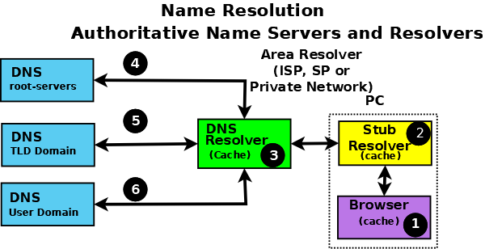
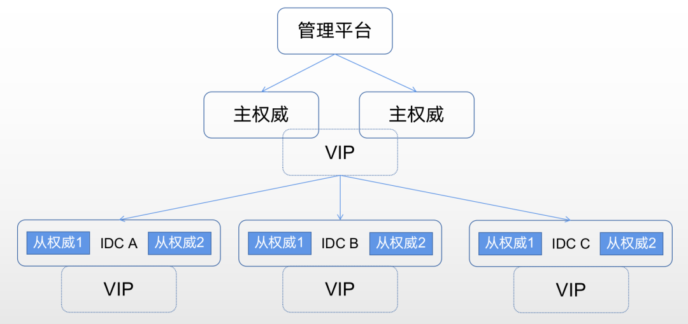
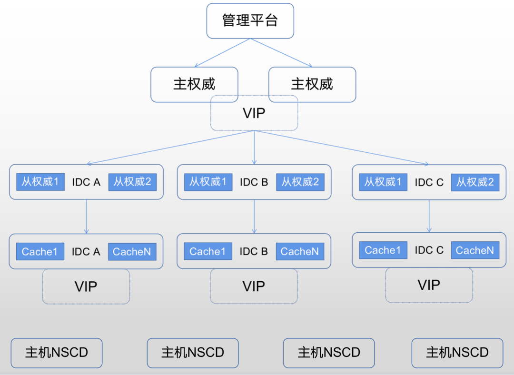

**下一代DNS优秀实践案例**

    以数据赋能、全面感知、可靠传输、智能分析、精准决策为特点的下一代DNS，正深入各行业领域，助力数字技术与应用场景的深度融合。

     “下一代DNS行动计划”办公室聚焦互联网基础技术的进步与发展，持续征集在互联网基础设施领域具有典型示范意义的下一代DNS应用实践。探讨技术趋势，探索更佳实践，共同建设更安全、更高效、更智能的网络根基。

以下是哔哩哔哩对内网DNS的探索与研究：

**01 引言**

域名系统(DNS)就像是互联网的地址簿，通过将一个或多个复杂难记的IP地址映射到容易识别和记忆的域名上，便于人们通过简单的域名比如 bilibili.com 访问互联网资源。在此基础上，DNS 还提供了负载均衡等重要服务。是极为关键的互联网基础设施。

以 DNS 为基础的内网 DNS 服务则提供了一些额外的好处：

1\. 私有域名

-   方便内网服务互联互通
    
-   外界无法感知和探测到，满足了安全性和隐私方面的需求
    

2\. DNS 劫持

-   拦截特定公网域名到内网 ip，降低公网带宽和访问延迟。如某核心服务 A 早期只有公网域名，随着业务发展，内部非常多其他服务调用 A 服务，此时内部调用产生的公网带宽成本已非常高。而推动其他服务更换内网域名成本不低，DNS 劫持则能轻松帮我们解决问题。
    
-   拦截恶意公网域名，降低安全隐患
    

3\. 特定业务逻辑支持

-   内部调用 API，方便管理与运维
    
-   主机名管理和私有ip反向解析支持
    
-   支持特定域转发
    

4\. 极低的解析延迟以及极高的吞吐量

因此本文将分享 B 站内网 DNS 服务建设相关实践。

**02 架构演进**

考虑到基础设施的稳定性，我们选择了知名度最高、普及范围最广的 DNS 实现 BIND9 作为 DNS Server。

在介绍架构之前，我们简单了解一下内网 DNS Server 中最常用的两种角色：

-   权威 Name Server
    

权威 Name Server 是实际持有并负责特定域资源记录的服务器，通常是解析器查找 IP 地址过程中的最后一步，拥有这些域的最终解释权。

权威 Name Server 在软件层的实现又可以分为主权威和从权威。对 DNS 查询来说主从权威完成是对等的，但是它在软件架构上提供了必要的故障灾备和横向扩容能力。

-   解析器（Caching Name Servers）
    

解析器通常是 DNS 查询中的第一站，处理用户的递归查询，并提供完整的答案。当收到请求时，解析器向DNS层次结构发出一个或多个迭代查询。在获得一个完整的答案（或一个错误）后，解析器将答案传递给用户，并将记录放入其缓存。用户对同一查询的后续请求将从解析器的缓存中得到回答，直到缓存记录的TTL过期，那时它将从缓存中被刷新；请求相同信息的下一个用户查询将导致对DNS层次结构的一系列新的查询。

解析器在不同的使用场景下常被称为各种令人困惑的名字，如缓存名称服务器、递归名称服务器、转发解析器、区域解析器和全面服务解析器等。

典型域名解析过程图：

**1\. 第一代 DNS 架构**

B 站内网 DNS 服务早期第一代架构相对比较简单，核心关注高可用和稳定性，采用了主从模式，保障每个核心 IDC 有独立的从权威集群，通过 VIP 提供负载均衡，并通过 VIP 健康检查机制自动踢掉故障节点。同时各 IDC 机房内网互通，互为备份。

随着业务的发展，在高 QPS 场景中，主从权威 Zone 配置同步时存在解析时长突增，响应时延不稳定的问题。其次从权威的可扩展性也相对较弱。因此我们衍生出第二代 DNS 架构。

**2\. 第二代 DNS 架构**

第二代 DNS 架构主要引入了多级缓存。

首先是引入了 Caching Name Servers，可扩展性得到了非常大的提升。同时也避免了权威节点配置/Zone变更带来的抖动。

其次是针对大数据、AI 等 QPS 极高的业务，引入 NSCD 作为 Client 缓存服务。既降低了响应延迟也提高了整体服务吞吐。

在此基础上，第二代架构还对 BIND9 Server 进行了升级和优化。BIND9 虽然支持多线程，但是在我们早期使用的 9.11 版本中，最高只能利用 400% 的 CPU，单实例 QPS 峰值在 10 万左右，为了提高服务器利用率，我们进行了单机多实例部署，但这也给运维带来了复杂度。在新的版本中，因为支持 reuseport、日志写缓存等新特性，对性能有非常大提升，单实例可以充分利用多核 CPU，在生产环境压测中单机 QPS 超过 150 万，因此我们也在线上进行了升级。

**03 DNS 服务监控建设**

DNS 服务监控告警主要分为三个层面：

1\. 主机层

2\. 业务层

3\. Client 端

**1\. 主机层**

主机层通常都会有 CPU、内存、网络、磁盘等资源的使用率、饱和度、错误监控告警。这里主要强调两点容易忽略或者对 DNS 服务比较重要的监控告警。

-   单核CPU/单网卡的使用率告警
    
    现代 IT 服务架构中，从交换机到服务器网卡到服务器CPU，各个路径几乎都是多 Pipeline 负载均衡，因为错误配置或使用不当，可能会出现单核CPU/单网卡负载不均衡，引发服务异常的情况。
    
-   网络层面
    
    1\. 网卡收发包异常告警
    
    2\. TCP、UDP errors 告警
    

**2\. 业务层**

-   BIND 内部指标采集
    
    BIND 通过 statistics-channels 暴露了丰富的内部监控指标。早期我们通过 bind\_exporter 采集，但是遇到两个比较明显的问题：一是 bind\_exporter 默认会采集 /xml/v3/tasks 数据，这个路径下的数据即无用，又会严重影响解析时延；二是部分比较重要的指标 bind\_exporter 没有采集。因此我们重新开发了采集程序。
    
-   Zone 记录值变化率/变化量告警
    
    监测每个 Zone 的记录值变化量，防止内部 API 等异常变更导致大量记录值被删除。
    
-   BIND 错误日志监控告警
    
    错误日志能更详细的反应 BIND 内部的异常情况，帮助我们及时排障。
    

**3\. Client 端探测告警**

服务内部的监控并不总能真实反映用户到服务端的访问质量，因此我们在各个机房部署多个探针，模拟真实用户请求，多Zone多域名高频率监测每个 Server 的可用性、内容正确性和响应时延。Client 探针多次帮助我们及时发现网络设备小概率BUG、网络拥塞等业务方还感知不到的异常。

同时增加 Client 到 Server 的网络 Ping 时延和丢包率监控，在异常时做辅助判断。

这里补充一点，公网公共 DNS 也并不是稳定的，需要对其进行监测和告警。目前我们的实践经验是阿里云公共 DNS 稳定性相对更好一些。

**04 踩坑经验**

一个复杂系统总会有很多细节是我们在使用初期没能了解或掌握的，因此这里分享一些我们踩过的坑帮助你走好自己的路。同时推荐阅读**《常见DNS操作和配置错误》[3]**。

**1\. 保障 UDP 和 TCP 端口用户皆可访问**

通常 DNS 默认使用 UDP 传输，同时在 rfc 中约定 DNS 使用 UDP 传输时，包体需小于等于 512 字节(不包括 IP 或 UDP 包头)。512 字节的限制在大部分场景都能满足需求，但当记录值过长超过限制时，Server 端需置 TC 位为 1，告知 Client 响应被截断。Client 在收到 TC 位为 1 的响应时，需用 TCP 重新发起请求。这就要求 TCP 端口也必须可达。

根据以上信息，也额外提醒大家，在选域名时应尽量短小，记录值尽量简单，以便提高解析速度。

**2\. Zone 配置变更后必须增大序列号**

主从权威的同步过程如下：

① 主节点 Zone 配置变更，向从节点发送 NOTIFY 通知

② 从节点返回 NOTIFY Respons，并向主节点发起 SOA 查询

③ 主节点返回 SOA Respons

④ 从节点对比 SOA Respons 中的序列号是否比自身序列号大，仅当 SOA Respons 序列号大于自身序列号时才发起 Zone transfer request，并利用 TCP 53 端口进行数据传输

因此 Zone 配置变更后必须增大序列号，否则会导致主从节点数据不一致。

**3\. 慎用 rndc flush 刷新全量缓存**

线上难免会遇到刷新缓存的需求，如果直接用 rndc flush 刷新全量缓存，在有客户端缓存如 NSCD 的情况下，在每一次客户端缓存过期的时间都可能会产生极高的 QPS 。

因此，尽量使用 flushname 或 flushtree 来刷新指定域名或 Zone。

**4\. 慎用泛域名解析**

泛域名解析是指利用通配符 \* 将所有的子域名都指向相同的解析记录，实现灵活配置。然而当某个子域名需要独立配置时，容易忽略泛域名的配置，引发故障。

举个例子(以真实故障为蓝本)，方便大家理解：

① 业务上线初期为了方便配置使用泛域名解析: \*.example.com CNAME .com

② 发展一段时间后 a.example.com 有了新需求，需要加个 TXT 做验证

③ 运维同学添加解析 a.example.com TXT xxx

④ 此时因为 a.example.com 只有 TXT 记录，没有 A/AAAA 或 CNAME，直接导致 a 站点无法访问

**05 结语**

基础设施服务具有杠杆作用，良好的基础设施服务可以帮助业务提高效率，降低开发运维成本。作为基础设施的一部分内网 DNS 亦是如此。我们始终以业务需求为基础，不断演进与迭代，致力于提供稳定、可靠、易用、好用的服务。

参考文献：

\[1\] BIND 9 管理员参考手册（https://bind9.readthedocs.io/en/latest/index.html）

\[2\] 域名——实施和规范（https://www.ietf.org/rfc/rfc1035.txt）

\[3\] 常见DNS操作和配置错误（https://www.ietf.org/rfc/rfc1912.txt）

\[4\] ISC 知识库中关于 BIND 及 DNS 的一系列文章（https://kb.isc.org/docs/monitoring-recommendations-for-bind-9）

**作者：卫智雄，哔哩哔哩基础架构部高级运维工程师；文章版权归原作者及其单位所有**