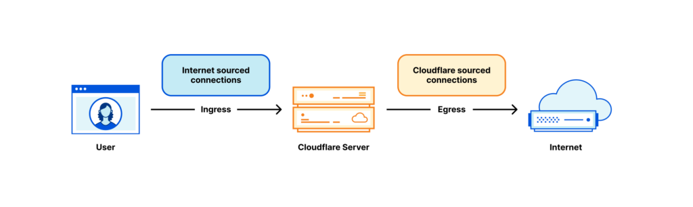
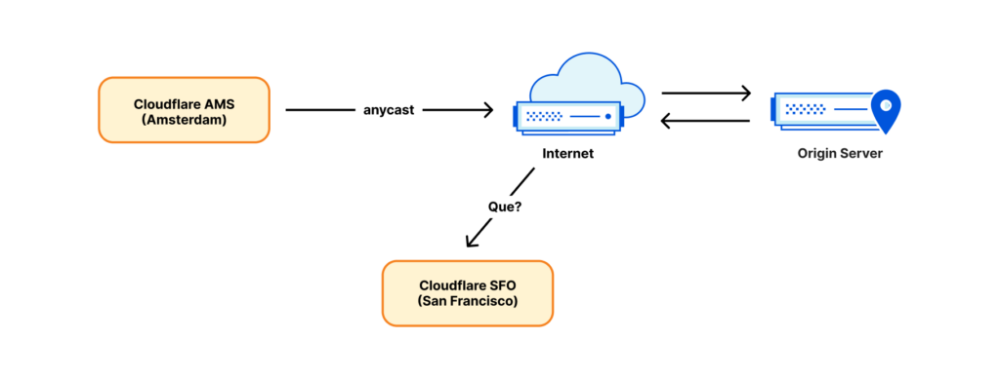

A lot of Cloudflare’s technology is well documented. For example, how we handle traffic between the eyeballs (clients) and our servers has been discussed many times on the Cloudflare blog: ‘[A brief primer on anycast (2011)](https://blog.cloudflare.com/a-brief-anycast-primer/)‘, ‘[Load Balancing without Load Balancers (2013)](https://blog.cloudflare.com/cloudflares-architecture-eliminating-single-p/)‘, ‘[Path MTU discovery in practice (2015)](https://blog.cloudflare.com/path-mtu-discovery-in-practice/)‘,  ’[Cloudflare’s edge load balancer (2020)](https://blog.cloudflare.com/unimog-cloudflares-edge-load-balancer/)‘, ‘[How we fixed the BSD socket API (2022)](https://blog.cloudflare.com/tubular-fixing-the-socket-api-with-ebpf/)‘.  

Cloudflare 的许多技术都有详细记录。例如，我们如何处理眼球（客户端）和服务器之间的流量已在 Cloudflare 博客上多次讨论：“任播简介 (2011)”、“没有负载均衡器的负载均衡 (2013)”、“路径实践中的 MTU 发现 (2015)'、'Cloudflare 的边缘负载均衡器 (2020)'、'我们如何修复 BSD 套接字 API (2022)'。

However, we have rarely talked about the second part of our networking setup — how our servers fetch the content from the Internet. In this blog post, we’re going to cover this gap. We’ll discuss how we manage Cloudflare IP addresses used to retrieve the data from the Internet, how our egress network design has evolved and how we optimized it for the best use of available IP space.  

然而，我们很少谈论网络设置的第二部分——我们的服务器如何从互联网获取内容。在这篇博文中，我们将弥补这一差距。我们将讨论如何管理用于从互联网检索数据的 Cloudflare IP 地址、我们的出口网络设计如何发展以及我们如何对其进行优化以充分利用可用 IP 空间。

Brace yourself. We have a lot to cover.  

振作起来。我们有很多事情要讲。

## Terminology first! 首先是术语！

[](https://blog.apnic.net/wp-content/uploads/2023/01/Figure-1-%E2%80%94-Ingress-and-egress-connections-at-Cloudflare..png)

Figure 1 — Ingress and egress connections at Cloudflare.  

图 1 — Cloudflare 的入口和出口连接。

Each Cloudflare server deals with many kinds of networking traffic, but two rough categories stand out:  

每个 Cloudflare 服务器都会处理多种网络流量，但有两个粗略类别较为突出：

-   _Internet sourced traffic_ — Inbound connections initiated by eyeball to our servers. In the context of this blog post, we’ll call these ‘**ingress** connections’.  
    
    互联网来源的流量 — 由 Eyeball 发起到我们服务器的入站连接。在这篇博文中，我们将这些称为“入口连接”。
-   _Cloudflare sourced traffic_ — Outgoing connections initiated by our servers to other hosts on the Internet. For brevity, we’ll call these ‘**egress** connections’.  
    
    Cloudflare 来源流量 — 由我们的服务器发起到互联网上其他主机的传出连接。为了简洁起见，我们将这些称为“出口连接”。

The egress part, while rarely discussed in this blog post, is critical for our operation. Our servers must initiate outgoing connections to get their jobs done! For example:  

出口部分虽然在本博文中很少讨论，但对于我们的操作至关重要。我们的服务器必须启动传出连接才能完成工作！例如：

-   In our Content Delivery Network (CDN) product, before the content is cached, it’s fetched from the origin servers. See ‘[Pingora, the proxy that connects Cloudflare to the Internet (2022)](https://blog.cloudflare.com/how-we-built-pingora-the-proxy-that-connects-cloudflare-to-the-internet/)‘, [Argo](https://blog.cloudflare.com/argo-v2/) and [Tiered Cache](https://blog.cloudflare.com/tiered-cache-smart-topology/).  
    
    在我们的内容交付网络 (CDN) 产品中，在缓存内容之前，会从源服务器获取内容。请参阅‘Pingora，将 Cloudflare 连接到互联网的代理 (2022)’、Argo 和分层缓存。
-   For the [Spectrum](https://www.cloudflare.com/products/cloudflare-spectrum/) product, each ingress TCP connection results in one egress connection.  
    
    对于 Spectrum 产品，每个入口 TCP 连接都会产生一个出口连接。
-   [Workers](https://workers.cloudflare.com/) often run multiple subrequests to construct an HTTP response. Some of them might be querying servers to the Internet.  
    
    Workers 通常运行多个子请求来构建 HTTP 响应。其中一些可能正在向互联网查询服务器。
-   We also operate client-facing forward proxy products — like WARP and Cloudflare Gateway. These proxies deal with eyeball connections destined to the Internet. Our servers need to establish connections to the Internet on behalf of our users.  
    
    我们还运营面向客户的转发代理产品，例如 WARP 和 Cloudflare Gateway。这些代理处理发往互联网的眼球连接。我们的服务器需要代表我们的用户建立与互联网的连接。

And so on. 等等。

## Anycast on ingress, unicast on egress  

入口选播，出口单播

[](https://blog.apnic.net/wp-content/uploads/2023/01/Figure-2-%E2%80%94-Anycast-on-ingress-unicast-on-egress..png)

Figure 2 — Anycast on ingress, unicast on egress.  

图 2 — 入口上任播，出口上单播。

Our ingress network architecture is very different from the egress one. On ingress, the connections sourced from the Internet are handled exclusively by our anycast IP ranges. Anycast is a technology where each of our data centres ‘announces’ and can handle the same IP ranges. With many destinations possible, how does the Internet know where to route the packets? Well, the eyeball packets are routed towards the closest data centre based on Internet BGP metrics, often it’s also geographically the closest one. Usually, the Border Gateway Policy (BGP) routes don’t change much, and each eyeball IP can be expected to be routed to a single data centre.  

我们的入口网络架构与出口网络架构非常不同。在入口处，来自互联网的连接由我们的任播 IP 范围专门处理。任播是我们的每个数据中心“宣布”并可以处理相同 IP 范围的技术。由于有许多可能的目的地，互联网如何知道将数据包路由到哪里？嗯，眼球数据包根据互联网 BGP 指标路由到最近的数据中心，通常也是地理位置上最近的数据中心。通常，边界网关策略 (BGP) 路由不会发生太大变化，并且每个眼球 IP 都可以路由到单个数据中心。

[](https://blog.apnic.net/wp-content/uploads/2023/01/Figure-3-%E2%80%94-Eyeball-packets-are-routed-towards-the-closest-data-centre-based-on-BGP-metrics-often-the-closest-one-geographically..png)

Figure 3 — Eyeball packets are routed towards the closest data centre based on BGP metrics, often the closest one geographically.  

图 3 — Eyeball 数据包根据 BGP 指标路由到最近的数据中心，通常是地理位置上最近的数据中心。

However, while anycast works well in the ingress direction, it can’t operate on egress. Establishing an outgoing connection from an anycast IP won’t work. Consider the response packet. It’s likely to be routed back to the wrong place — a data centre geographically closest to the sender, not necessarily the source data centre!  

然而，虽然任播在入口方向运行良好，但它无法在出口方向运行。从任播 IP 建立传出连接将不起作用。考虑响应数据包。它很可能被路由回错误的位置 - 地理位置最接近发送者的数据中心，不一定是源数据中心！

For this reason, until recently, we established outgoing connections in a straightforward and conventional way — each server was given its own unicast IP address. ‘Unicast IP’ means there is only one server using that address in the world. Return packets will work just fine and get back exactly to the right server identified by the unicast IP.  

出于这个原因，直到最近，我们还是以一种简单且传统的方式建立传出连接——每个服务器都有自己的单播 IP 地址。 “单播 IP”意味着世界上只有一台服务器使用该地址。返回数据包将正常工作并准确返回到由单播 IP 标识的正确服务器。

[](https://blog.apnic.net/wp-content/uploads/2023/01/Figure-4-%E2%80%94-Until-recently-each-server-was-given-its-own-unicast-IP-address..png)

Figure 4 — Until recently, each server was given its own unicast IP address.  

图 4 — 直到最近，每台服务器都被赋予了自己的单播 IP 地址。

## Segmenting traffic based on egress IP  

根据出口 IP 分段流量

Originally connections sourced by Cloudflare were mostly HTTP fetches going to origin servers on the Internet. As our product line grew, so did the variety of traffic. The most notable example is [our WARP app](https://blog.cloudflare.com/1111-warp-better-vpn/). For WARP, our servers operate a forward proxy and handle the traffic sourced by end-user devices. It’s done without the same degree of intermediation as in our CDN product. This creates a problem. Third-party servers on the Internet — like the origin servers — must be able to distinguish between connections coming from Cloudflare services and our WARP users. Such traffic segmentation is traditionally done by using different IP ranges for different traffic types (although recently we introduced more robust techniques like [Authenticated Origin Pulls](https://developers.cloudflare.com/ssl/origin-configuration/authenticated-origin-pull/)).  

最初，Cloudflare 来源的连接主要是前往 Internet 上的源服务器的 HTTP 获取。随着我们产品线的增长，流量的种类也在增加。最显着的例子是我们的 WARP 应用程序。对于 WARP，我们的服务器运行转发代理并处理来自最终用户设备的流量。它的完成无需与我们的 CDN 产品相同程度的中介。这就产生了一个问题。互联网上的第三方服务器（例如源服务器）必须能够区分来自 Cloudflare 服务和我们的 WARP 用户的连接。这种流量分段传统上是通过针对不同流量类型使用不同的 IP 范围来完成的（尽管最近我们引入了更强大的技术，例如经过身份验证的源拉取）。

To work around the trusted vs untrusted traffic pool differentiation problem, we added an untrusted WARP IP address to each of our servers:  

为了解决可信与不可信流量池区分问题，我们向每台服务器添加了一个不可信的 WARP IP 地址：

[](https://blog.apnic.net/wp-content/uploads/2023/01/Figure-5-%E2%80%94-Added-an-untrusted-WARP-IP-address-to-each-server..png)

Figure 5 — Added an untrusted WARP IP address to each server.  

图 5 — 向每台服务器添加了不受信任的 WARP IP 地址。

## Country code tagged egress IP addresses  

国家/地区代码标记的出口 IP 地址

It quickly became apparent that trusted vs untrusted weren’t the only tags needed. For WARP service we also need country code tags. For example, United Kingdom-based WARP users expect the bbc.com website to just work. However, the BBC restricts many of its services to people just in the UK.  

很快我们就发现，可信与不可信并不是唯一需要的标签。对于 WARP 服务，我们还需要国家代码标签。例如，英国的 WARP 用户希望 bbc.com 网站能够正常运行。然而，BBC 的许多服务仅限于英国境内的人士。

It does this by _geofencing_ — using a database mapping public IP addresses to economies, and allowing only the UK ones. Geofencing is widespread on today’s Internet. To avoid geofencing issues, we need to choose specific egress addresses tagged with an appropriate country code, depending on the WARP user location. Like many other parties on the Internet, we tag our egress IP space with country codes and publish it as a geofeed (like [this one](https://mask-api.icloud.com/egress-ip-ranges.csv)). Notice, the published geofeed is just data. The fact that an IP is tagged as say UK does not mean it is served from the UK, it just means the operator wants it to be geolocated to the UK. Like many things on the Internet, it is based on trust.  

它通过地理围栏来实现这一点——使用将公共 IP 地址映射到经济体的数据库，并且只允许英国的 IP 地址。地理围栏在当今的互联网上非常普遍。为了避免地理围栏问题，我们需要根据 WARP 用户位置选择标有适当国家/地区代码的特定出口地址。与互联网上的许多其他各方一样，我们用国家/地区代码标记我们的出口 IP 空间，并将其发布为地理源（如本例）。请注意，发布的地理信息流只是数据。事实上，IP 被标记为 UK 并不意味着它是从英国提供服务的，而只是意味着运营商希望将其地理定位到英国。与互联网上的许多事物一样，它基于信任。

Notice, at this point we have three independent geographical tags:  

请注意，此时我们有三个独立的地理标签：

-   The country code tag of the WARP user — the eyeball connecting IP.  
    
    WARP用户的国家代码标签——眼球连接IP。
-   The location of the data centre the eyeball connected to.  
    
    眼球连接的数据中心的位置。
-   The country code tag of the egressing IP.  
    
    出口IP的国家代码标签。

For the best service, we want to choose the egressing IP so that its country code tag matches the economy from the eyeball IP. But egressing from a specific country code tagged IP is challenging — our data centres serve users from all over the world, potentially from many economies! Remember, due to anycast, we don’t directly control the ingress routing. Internet geography doesn’t always match physical geography. For example, our London data centre receives traffic not only from users in the United Kingdom, but also from Ireland and Saudi Arabia. As a result, our servers in London need many WARP egress addresses associated with many economies:  

为了获得最好的服务，我们希望选择出口IP，使其国家代码标签与眼球IP的经济相匹配。但从带有特定国家代码标记的 IP 的传出具有挑战性 - 我们的数据中心为来自世界各地（可能来自许多经济体）的用户提供服务！请记住，由于任播，我们不直接控制入口路由。互联网地理并不总是与自然地理相匹配。例如，我们的伦敦数据中心不仅接收来自英国用户的流量，还接收来自爱尔兰和沙特阿拉伯的流量。因此，我们在伦敦的服务器需要与许多经济体相关的许多 WARP 出口地址：

[](https://blog.apnic.net/wp-content/uploads/2023/01/Figure-6-%E2%80%94-Servers-need-multiple-WARP-egress-addresses-associated-with-economies..png)

Figure 6 — Servers need multiple WARP egress addresses associated with economies.  

图 6 — 服务器需要多个与经济体相关的 WARP 出口地址。

Can you see where this is going? The problem space just explodes! Instead of having one or two egress IP addresses for each server, now we require dozens, and IPv4 addresses aren’t cheap. With this design, we need many addresses per server, and we operate thousands of servers. This architecture becomes very expensive.  

你能看出这是怎么回事吗？问题空间简直爆炸了！现在我们需要数十个，而不是每台服务器拥有一两个出口 IP 地址，而且 IPv4 地址并不便宜。通过这种设计，我们需要每台服务器许多地址，并且我们运行数千台服务器。这种架构变得非常昂贵。

## Is anycast a problem?  

任播有问题吗？

Let me recap: With anycast ingress, we don’t control which data centre the user is routed to. Therefore, each of our data centres must be able to egress from an address with any conceivable tag. Inside the data centre, we also don’t control which server the connection is routed to. There are potentially many tags, many data centres, and many servers inside a data centre.  

让我回顾一下：通过选播入口，我们无法控制用户路由到哪个数据中心。因此，我们的每个数据中心都必须能够从带有任何可以想象的标签的地址出去。在数据中心内部，我们也不控制连接路由到哪个服务器。数据中心内可能有许多标签、许多数据中心和许多服务器。

Maybe the problem is the ingress architecture? Perhaps it’s better to use a traditional networking design where a specific eyeball is routed with DNS to a specific data centre or even a server?  

也许问题是入口架构？也许使用传统的网络设计更好，其中特定的眼球通过 DNS 路由到特定的数据中心甚至服务器？

That’s one way of thinking, but we decided against it. We like our anycast on ingress. It brings us many advantages:  

这是一种思考方式，但我们决定反对。我们喜欢 Ingress 上的选播。它给我们带来了很多好处：

-   **Performance**: With anycast, by definition, the eyeball is routed to the closest (by BGP metrics) data centre. This is usually the fastest data centre for a given user.  
    
    性能：根据定义，通过选播，眼球会被路由到最近的（根据 BGP 指标）数据中心。对于给定用户来说，这通常是最快的数据中心。
-   **Automatic failover**: If one of our data centres becomes unavailable, the traffic will be instantly, automatically rerouted to the next best place.  
    
    自动故障转移：如果我们的一个数据中心不可用，流量将立即自动重新路由到下一个最佳位置。
-   **DDoS resilience**: During a denial-of-service attack or a traffic spike, the load is automatically balanced across many data centres, significantly reducing the impact.  
    
    DDoS 弹性：在拒绝服务攻击或流量高峰期间，负载会在多个数据中心之间自动平衡，从而显着减少影响。
-   **Uniform software**: The functionality of every data centre and of every server inside a data centre is identical. We use the same software stack on all the servers around the world. Each machine can perform any action, for any product. This enables easy debugging and good scalability.  
    
    统一软件：每个数据中心以及数据中心内每个服务器的功能都是相同的。我们在世界各地的所有服务器上使用相同的软件堆栈。每台机器都可以对任何产品执行任何操作。这使得调试变得容易并且具有良好的可扩展性。

For these reasons, we’d like to keep the anycast on ingress. We decided to solve the issue of egress address cardinality in some other way.  

出于这些原因，我们希望保持选播的入口。我们决定以其他方式解决出口地址基数问题。

## Solving a million-dollar problem  

解决价值百万美元的问题

Out of the thousands of servers we operate, every single one should be able to use an egress IP with any of the possible tags. It’s easiest to explain our solution by first showing two extreme designs.  

在我们运营的数千台服务器中，每台服务器都应该能够使用带有任何可能标签的出口 IP。首先展示两种极端的设计来解释我们的解决方案是最简单的。

[](https://blog.apnic.net/wp-content/uploads/2023/01/Figure-7-%E2%80%94-Each-server-owns-all-the-needed-IPs-Each-server-has-all-the-specialized-egress-IPs-with-the-needed-tags..png)

Figure 7 — **Each server owns all the needed IPs**: Each server has all the specialized egress IPs with the needed tags.  

图 7 — 每台服务器都拥有所有所需的 IP：每台服务器都拥有带有所需标签的所有专用出口 IP。

[](https://blog.apnic.net/wp-content/uploads/2023/01/Figure-8-%E2%80%94-One-server-owns-the-needed-IP-A-specialized-egress-IP-with-a-specific-tag-lives-in-one-place-and-other-servers-forward-traffic-to-it..png)

Figure 8 — **One server owns the needed IP:** A specialized egress IP with a specific tag lives in one place, and other servers forward traffic to it.  

图 8 — 一台服务器拥有所需的 IP：带有特定标签的专用出口 IP 位于一个位置，其他服务器将流量转发给它。

Both options have pros and cons:  

两种选择都有优点和缺点：

| **Specialized IP on every server  
每台服务器上都有专门的IP** | **Specialized IP on one server  

一台服务器上的专用IP** |
| --- | --- |
| Super expensive $$$, every server needs many IP addresses.  

超级昂贵$$$，每台服务器都需要很多IP地址。 | Cheap $, only one specialized IP needed for a tag.  

便宜$，一个标签只需要一个专门的IP。 |
| Egress always local — fast  

出口始终是本地的 — 速度快 | Egress almost always forwarded — slow  

出口几乎总是转发——速度慢 |
| Excellent reliability — every server is independent  

卓越的可靠性——每台服务器都是独立的 | Poor reliability — introduced chokepoints  

可靠性差——引入了瓶颈 |

Table 1 — The pros and cons of both options.  

表 1 — 两种选项的优缺点。

## There’s a third way  

还有第三种方法

We’ve been thinking hard about this problem. Frankly, the first extreme option of having every needed IP available locally on every Cloudflare server is not totally unworkable. This is, roughly, what we were able to pull off for IPv6. With IPv6, access to the large needed IP space is not a problem.  

我们一直在认真思考这个问题。坦率地说，第一个极端的选择是在每台 Cloudflare 服务器上本地提供所有需要的 IP，这并不是完全不可行。粗略地说，这就是我们能够为 IPv6 实现的目标。借助 IPv6，访问所需的大量 IP 空间不再是问题。

However, in IPv4 neither option is acceptable. The first offers fast and reliable egress but requires great cost — the IPv4 addresses needed are expensive. The second option uses the smallest possible IP space, so it’s cheap, but compromises on performance and reliability.  

然而，在 IPv4 中，这两种选择都不可接受。第一个提供快速可靠的出口，但需要巨大的成本 - 所需的 IPv4 地址非常昂贵。第二种选择使用尽可能小的 IP 空间，因此价格便宜，但会牺牲性能和可靠性。

The solution we devised is a compromise between the extremes. The rough idea is to change the assignment unit. Instead of assigning one /32 IPv4 address for each server, we devised a method of assigning a /32 IP per data centre, and then sharing it among physical servers.  

我们设计的解决方案是极端之间的妥协。粗略的想法是改变分配单位。我们没有为每台服务器分配一个 /32 IPv4 地址，而是设计了一种为每个数据中心分配一个 /32 IP，然后在物理服务器之间共享的方法。

| **Specialized IP on every server  
每台服务器上都有专门的IP** | **Specialized IP per data centre  

每个数据中心专用IP** | **Specialized IP on one server  

一台服务器上的专用IP** |
| --- | --- | --- |
| Super expensive $$$ 超级贵$$$ | Reasonably priced $$ 价格合理$$ | Cheap $ 便宜$ |
| Egress always local — fast  

出口始终是本地的 — 速度快 | Egress always local — fast  

出口始终是本地的 — 速度快 | Egress almost always forwarded — slow  

出口几乎总是转发——速度慢 |
| Excellent reliability — every server is independent  

卓越的可靠性——每台服务器都是独立的 | Excellent reliability — every server is independent  

卓越的可靠性——每台服务器都是独立的 | Poor reliability — many choke points  

可靠性差——许多瓶颈 |

Table 2 — The solution requires a compromise between the extremes.  

表 2 — 该解决方案需要在两个极端之间进行折衷。

## Sharing an IP inside data centre  

在数据中心内共享 IP

The idea of sharing an IP among servers is not new. Traditionally this can be achieved by source-NAT on a router. Sadly, the sheer number of egress IPs we need and the size of our operation, prevent us from relying on stateful firewall / NAT at the router level. We also dislike shared state, so we’re not fans of distributed NAT installations.  

在服务器之间共享 IP 的想法并不新鲜。传统上，这可以通过路由器上的源 NAT 来实现。遗憾的是，我们需要的出口 IP 数量之多以及我们的运营规模使得我们无法依赖路由器级别的状态防火墙/NAT。我们也不喜欢共享状态，因此我们不喜欢分布式 NAT 安装。

What we chose instead, is splitting an egress IP across servers by a port range. For a given egress IP, each server owns a small portion of available source ports — a port slice.  

相反，我们选择的是按端口范围在服务器之间拆分出口 IP。对于给定的出口 IP，每个服务器都拥有一小部分可用源端口 - 端口切片。

[](https://blog.apnic.net/wp-content/uploads/2023/01/Figure-9-%E2%80%94-Splitting-an-egress-IP-across-servers-by-a-port-range..png)

Figure 9 — Splitting an egress IP across servers by a port range.  

图 9 — 在端口范围内跨服务器拆分出口 IP。

When return packets arrive from the Internet, we have to route them back to the correct machine. For this task, we’ve customized ‘Unimog’ — our L4 XDP-based load balancer — (‘[Unimog, Cloudflare’s load balancer (2020)](https://blog.cloudflare.com/unimog-cloudflares-edge-load-balancer/)‘) and it’s working flawlessly.  

当返回数据包从互联网到达时，我们必须将它们路由回正确的机器。对于这项任务，我们定制了“Unimog”——我们基于 L4 XDP 的负载均衡器——（“Unimog，Cloudflare 的负载均衡器 (2020)”）并且它运行完美。

With a port slice of say 2,048 ports, we can share one IP among 31 servers. However, there is always a possibility of running out of ports. To address this, we’ve worked hard to be able to reuse the egress ports efficiently. See the ‘[How to stop running out of ports (2022)](https://blog.cloudflare.com/how-to-stop-running-out-of-ephemeral-ports-and-start-to-love-long-lived-connections/)‘, ‘[How to share IPv4 addresses (2022)](https://lpc.events/event/16/contributions/1349/)‘ and our [Cloudflare.TV segment](https://cloudflare.tv/event/oZKxMJg4).  

通过一个包含 2,048 个端口的端口切片，我们可以在 31 台服务器之间共享一个 IP。然而，总是有可能耗尽端口。为了解决这个问题，我们努力确保能够有效地重用出口端口。请参阅“如何停止耗尽端口 (2022)”、“如何共享 IPv4 地址 (2022)”以及我们的 Cloudflare.TV 部分。

This is pretty much it. Each server is aware of which IP addresses and port slices it owns. For inbound routing, Unimog inspects the ports and dispatches the packets to the appropriate machines.  

差不多就是这样了。每个服务器都知道它拥有哪些 IP 地址和端口片。对于入站路由，乌尼莫克检查端口并将数据包分派到适当的机器。

## Sharing a subnet between data centres  

在数据中心之间共享子网

This is not the end of the story though, we haven’t discussed how we can route a single /32 address into a data centre. Traditionally, in the public Internet, it’s only possible to route subnets with a granularity of a /24 or 256 IP addresses. In our case, this would lead to a great waste of IP space.  

但这并不是故事的结局，我们还没有讨论如何将单个 /32 地址路由到数据中心。传统上，在公共互联网中，只能以 /24 或 256 IP 地址的粒度路由子网。在我们的例子中，这会导致IP空间的极大浪费。

To solve this problem and improve the use of our IP space, we deployed our egress ranges as… anycast! With that in place, we customized Unimog and taught it to forward the packets over our [backbone network](https://blog.cloudflare.com/cloudflare-backbone-internet-fast-lane/) to the right data centre. Unimog maintains a database like this:  

为了解决这个问题并提高 IP 空间的使用，我们将出口范围部署为……任播！有了这些，我们定制了乌尼莫克，并教它通过我们的主干网络将数据包转发到正确的数据中心。 Unimog 维护一个这样的数据库：

```
198.51.100.1 — forward to LHR

198.51.100.2 — forward to CDG

198.51.100.3 — forward to MAN

...
```

With this design, it doesn’t matter to which data centre return packets are delivered. Unimog can always fix it and forward the data to the right place. Basically, while at the BGP layer, we are using anycast, due to our design, semantically an IP identifies a data centre and an IP and port range identify a specific machine. It behaves almost like a unicast.  

通过这种设计，返回数据包传递到哪个数据中心并不重要。乌尼莫克总能修复它并将数据转发到正确的地方。基本上，在 BGP 层，我们使用任播，由于我们的设计，在语义上 IP 标识数据中心，IP 和端口范围标识特定机器。它的行为几乎就像单播一样。

[](https://blog.apnic.net/wp-content/uploads/2023/01/Figure-10-%E2%80%94-This-design-behaves-almost-like-a-unicast..png)

Figure 10 — This design behaves almost like a unicast.  

图 10 — 此设计的行为几乎类似于单播。

We call this technology stack ‘soft-unicast’ and it feels magical. It’s like we did unicast in software over anycast in the BGP layer.  

我们将这种技术堆栈称为“软单播”，感觉很神奇。这就像我们在 BGP 层的任播上通过软件进行单播一样。

## Soft-unicast is indistinguishable from magic  

软单播与魔法没有什么区别

With this setup we can achieve significant benefits:  

通过这种设置，我们可以获得显着的好处：

-   We are able to share a /32 egress IP among many servers.  
    
    我们能够在许多服务器之间共享 /32 出口 IP。
-   We can spread a single subnet across many data centres, and change it easily on the fly. This allows us to fully use our egress IPv4 ranges.  
    
    我们可以将单个子网分布在多个数据中心，并可以轻松地动态更改它。这使我们能够充分利用我们的出口 IPv4 范围。
-   We can group similar IP addresses together. For example, all the IP addresses tagged with the ‘UK’ tag might form a single continuous range. This reduces the size of the published geofeed.  
    
    我们可以将相似的 IP 地址分组在一起。例如，所有标有“UK”标签的 IP 地址可能形成一个连续的范围。这会减小已发布的地理提要的大小。
-   It’s easy for us to onboard new egress IP ranges, like customer IPs. This is useful for some of our products, like [Cloudflare Zero Trust](https://www.cloudflare.com/products/zero-trust/).  
    
    我们可以轻松加入新的出口 IP 范围，例如客户 IP。这对于我们的一些产品很有用，例如 Cloudflare 零信任。

All this is done at a sensible cost, at no loss to performance and reliability:  

所有这些都是以合理的成本完成的，不会损失性能和可靠性：

-   Typically, the user is able to egress directly from the closest data centre, providing the best possible performance.  
    
    通常，用户可以直接从最近的数据中心退出，从而提供最佳性能。
-   Depending on the actual needs we can allocate or release the IP addresses. This gives us flexibility with IP cost management; we don’t need to overspend upfront.  
    
    根据实际需要，我们可以分配或释放IP地址。这为我们提供了 IP 成本管理的灵活性；我们不需要预先超支。
-   Since we operate multiple egress IP addresses in different locations, the reliability is not compromised.  
    
    由于我们在不同位置运营多个出口 IP 地址，因此可靠性不会受到影响。

## The true location of our IP addresses is ‘the cloud’  

我们的 IP 地址的真实位置是“云端”

While soft-unicast allows us to gain great efficiency, we’ve hit some issues. Sometimes we get the question ‘Where does this IP physically exist?’. But it doesn’t have an answer! Our egress IPs don’t exist physically anywhere. From a BGP standpoint, our egress ranges are anycast, so they live everywhere. Logically each address is used in one data centre at a time, but we can move it around on demand.  

虽然软单播可以让我们获得很高的效率，但我们也遇到了一些问题。有时我们会遇到这样的问题：“这个 IP 实际存在于哪里？”。但它没有答案！我们的出口 IP 物理上不存在于任何地方。从 BGP 的角度来看，我们的出口范围是任播的，因此它们无处不在。从逻辑上讲，每个地址一次在一个数据中心中使用，但我们可以根据需要移动它。

## Content Delivery Networks misdirect users  

内容交付网络误导用户

[](https://blog.apnic.net/wp-content/uploads/2023/01/Figure-11-%E2%80%94-How-CDNs-misdirect-users..png)

Figure 11 — How CDNs misdirect users.  

图 11 — CDN 如何误导用户。

As another example of problems, here’s one issue we’ve hit with third-party CDNs. As we mentioned before, there are three country code tags in our pipeline:  

作为问题的另一个例子，这是我们在第三方 CDN 中遇到的一个问题。正如我们之前提到的，我们的管道中有三个国家/地区代码标签：

-   The country code tag of IP eyeball is connecting from.  
    
    IP眼球的国家代码标签是从连接的。
-   The location of our data centre.  
    
    我们数据中心的位置。
-   The country code tag of the IP addresses we chose for the egress connections.  
    
    我们为出口连接选择的 IP 地址的国家/地区代码标签。

The fact that our egress address is tagged as ‘UK’ doesn’t always mean it actually is being used in the UK. We’ve had cases when a UK-tagged WARP user, due to the maintenance of our LHR data centre, was routed to Paris. A popular CDN performed a reverse lookup of our egress IP, found it tagged as ‘UK’, and directed the user to a London CDN server. This is generally OK… but we actually egressed from Paris at the time. This user ended up routing packets from their home in the UK, to Paris, and back to the UK. This is bad for performance.  

我们的出口地址被标记为“UK”这一事实并不总是意味着它实际上在英国使用。我们曾经遇到过这样的情况：由于 LHR 数据中心的维护，带有英国标签的 WARP 用户被路由到巴黎。一个流行的 CDN 对我们的出口 IP 进行了反向查找，发现它被标记为“UK”，并将用户定向到伦敦 CDN 服务器。这通常是好的……但我们当时实际上是从巴黎出去的。该用户最终将数据包从他们在英国的家路由到巴黎，然后返回英国。这对性能不利。

We address this issue by performing DNS requests in the egressing data centre. For DNS we use IP addresses tagged with the location of the data centre, not the intended geolocation for the user. This generally fixes the problem, but sadly, there are still some exceptions.  

我们通过在出口数据中心执行 DNS 请求来解决此问题。对于 DNS，我们使用标记有数据中心位置的 IP 地址，而不是用户的预期地理位置。这通常可以解决问题，但遗憾的是，仍然存在一些例外。

## The future is here  

未来就在这里

Our 2021 experiments with [Addressing Agility](https://blog.cloudflare.com/addressing-agility/) proved we have plenty of opportunity to innovate with the addressing of the ingress. Soft-unicast shows us we can achieve great flexibility and density on the egress side.  

我们 2021 年的寻址敏捷性实验证明，我们有很多机会在入口寻址方面进行创新。软单播向我们展示了我们可以在出口侧实现巨大的灵活性和密度。

With each new product, the number of tags we need on the egress grows — from traffic trustworthiness, and product category, to geolocation. As the pool of usable IPv4 addresses shrinks, we can be sure there will be more innovation in the space. Soft-unicast is our solution, but for sure it’s not our last development.  

随着每款新产品的推出，我们在出口上所需的标签数量都会增加——从流量可信度、产品类别到地理位置。随着可用 IPv4 地址池的缩小，我们可以确信该领域将会出现更多创新。软单播是我们的解决方案，但它肯定不是我们最后的开发。

For now though, it seems like we’re moving away from traditional unicast. Our egress IPs really don’t exist in a fixed place anymore, and some of our servers don’t even own a true unicast IP nowadays.  

但就目前而言，我们似乎正在放弃传统的单播。我们的出口IP确实不再存在于固定的地方，而且我们的一些服务器现在甚至不拥有真正的单播IP。

_After fruitful encounters with such diverse topics as programming industrial robots, distributed K/V databases and web server scalability, [Marek Majkowski](https://twitter.com/majek04) has settled on network programming as his main area of interest. Currently working at Cloudflare, Marek has authored many critical systems, most notably the DDoS mitigation pipeline.  

在对工业机器人编程、分布式 K/V 数据库和 Web 服务器可扩展性等不同主题进行了富有成效的接触后，Marek Majkowski 决定将网络编程作为他的主要兴趣领域。 Marek 目前在 Cloudflare 工作，编写了许多关键系统，其中最著名的是 DDoS 缓解管道。_

_This post was originally published on the [Cloudflare Blog](https://blog.cloudflare.com/cloudflare-servers-dont-own-ips-anymore/).  

这篇文章最初发布在 Cloudflare 博客上。_

<table data-immersive-translate-effect="1" data-immersive_translate_walked="dbc7eb85-1110-46ed-b748-c32de10eb360"><tbody data-immersive-translate-effect="1" data-immersive_translate_walked="dbc7eb85-1110-46ed-b748-c32de10eb360"><tr data-immersive-translate-effect="1" data-immersive_translate_walked="dbc7eb85-1110-46ed-b748-c32de10eb360"><td data-immersive-translate-effect="1" data-immersive_translate_walked="dbc7eb85-1110-46ed-b748-c32de10eb360"><nobr data-immersive-translate-effect="1" data-immersive_translate_walked="dbc7eb85-1110-46ed-b748-c32de10eb360">Rate this article<span lang="zh-CN" data-immersive-translate-translation-element-mark="1"><span data-immersive-translate-translation-element-mark="1">&nbsp;</span><span data-immersive-translate-translation-element-mark="1"><span data-immersive-translate-translation-element-mark="1">评价这篇文章</span></span></span></nobr></td><td data-immersive-translate-effect="1" data-immersive_translate_walked="dbc7eb85-1110-46ed-b748-c32de10eb360"><div data-img="https://blog.apnic.net/wp-content/uploads/2023/01/cloudflare2_FT.png" data-urid="686730" data-immersive-translate-effect="1" data-immersive_translate_walked="dbc7eb85-1110-46ed-b748-c32de10eb360"><p><span data-immersive-translate-effect="1" data-immersive_translate_walked="dbc7eb85-1110-46ed-b748-c32de10eb360"><span data-immersive-translate-effect="1" data-immersive_translate_walked="dbc7eb85-1110-46ed-b748-c32de10eb360"><span data-immersive-translate-effect="1" data-immersive_translate_walked="dbc7eb85-1110-46ed-b748-c32de10eb360">Rate this (17 Votes)<span lang="zh-CN" data-immersive-translate-translation-element-mark="1"><span data-immersive-translate-translation-element-mark="1">&nbsp;</span><span data-immersive-translate-translation-element-mark="1"><span data-immersive-translate-translation-element-mark="1">评价此（17 票）</span></span></span></span></span></span></p></div></td></tr></tbody></table>

___

The views expressed by the authors of this blog are their own and do not necessarily reflect the views of APNIC. Please note a [Code of Conduct](https://blog.apnic.net/?p=395) applies to this blog.  

本博客作者表达的观点仅代表他们自己的观点，并不一定反映 APNIC 的观点。请注意，行为准则适用于本博客。
