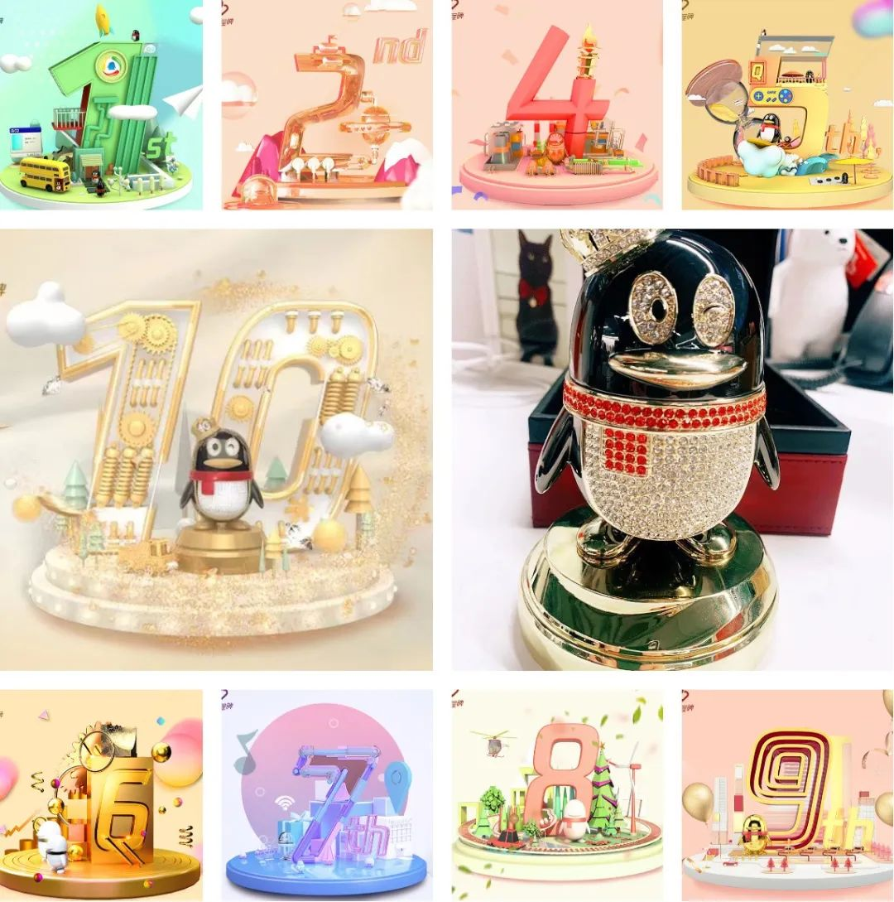

我是Summer，刚刚告别了在腾讯10多年的产品经理生涯，做个复盘。

10年是人生中很长的一段旅程。从25+到35+的这10年，是一个人生命的黄金阶段，可以说我把这个黄金周期，都献给了在腾讯的工作，献给了做产品这件事上。

回顾这10年，心里充满了感恩，感恩让我极速成长的鹅厂，感恩共同撒过热血的老领导、老战友（超爱你们），也感恩有梦想、有行动的自己。这些年一直保持着疾速奔跑，全情投入，毫无保留，可以说没什么大遗憾了。

这个过程我亲历了PC互联网、移动互联网、人工智能、产业互联网等行业的更迭变化，曾经站在风口之外，也吹拂过风口之内。

**有过新人期的稚嫩，转型期的挑战，又历经实战在一些领域成为专业老手。**

**在发展路上有过单打独斗，也陆续带了多职能团队。**

**经历过千百万级产品的增长发展，也有多次从0到1负责打造新产品的经验。**

每一次做产品都是新的历练与收获，结果也还欣慰，做过的产品拿到了公司级、BG级、部门级的各种奖项（能力、规模、体验、口碑、创新...）。

  

**除了工作本身，也不知不觉在腾讯学堂（前腾讯学院）做了7年的讲师，为2000+位同学讲过课。**工作经验0-10年均有，岗位覆盖产品、运营、设计、研发、测试、市场……大概各种职能都包括了。

算是在做产品之外，找到了另一个坚持和热爱的事情，实属难得。

如今，时机合适，做个产品人的职业道路总结，以作纪念。

**Part.1**  

**起点，职业方向选择，拿Offer**  

2011年，我研二，那时互联网产品经理这个职位还不像现在这么流行，外企和央企都有可考虑的岗位方向，我因为在实验室写代码挺开心，甚至觉得做程序员也不错。

但出于对新兴事物的好奇，在百度做了半年的产品实习，由此对产品工作有了更具体的理解。

我意识到，相对于写代码这类比较明确的工作，我更喜欢产品经理工作的未知性、不确定性和灵活性。

**它对人的思考能力、理解能力、沟通能力、心态情商都有更高的依赖，而这些恰好是自己擅长或想要的，这是一份更适合、能发挥自己的职业。**

从在学校的模糊想法，到实践后的清晰明确，我选出了自己的职业方向。

**一旦知道了想要什么，便全力以赴，是我的做事风格。**  

腾讯、阿里、百度…（那时还没美团和字节），我基本上研究了当时所有互联网公司的发展情况、各种产品，把有关产品的书籍、资料反复学习，同时加入自我思考，认真应对每场笔试和面试。

后来才发现，这也叫用产品思维准备产品求职。

最后拿到腾讯、淘宝、阿里云的OFFER后，明确会三选一，便停止了求职。选哪个？着实纠结，毕竟哪个都好，都知足。

当时选择为难，我就问自己：

-   你最想做什么？（做产品）
    
-   在哪一家更容易做好？（当时流行腾讯的产品，百度的技术，阿里的运营这句话）
    
-   在哪一家成长可能最快？（从当时面试过程来看，腾讯面试官的互动氛围很好，问题也很专业）
    

于是2012年北邮毕业，加入腾讯，正式成为一名产品人。

**一个心得：困惑时，不是求答案，而是问问题。**

**这个适用于职业选择、创业困惑、人生思考等等很多场景。**

感谢Lucas、S姐、winter、还有当时腾讯研究院的同仁们，给了我很好的交流体验，成了我的入职引路人。

**Part.2**  

**开端，产品人的挑战****、****应对和成长**

拿下工作，不是万事大吉了，而是一切刚刚开始。  

入职的时候很理想，有厉害的领导、导师、技术大咖…但没多久，变化突如其来，挑战接踵而至。

-   **挑战①**
    

组织架构大调整、原部门瓦解、导师离职、新领导接管，没来得及适应，刚上场就要面对复杂的环境变化。

当时职场白纸如我，是不懂组织关系梳理和职场关系洞察的，不了解来龙去脉，懵懵懂懂。

**紧张之余，我选择好好做事，保持初心和虚心。作为新人，比自己有经验的人，其实都是老师。**

**了解每一个人擅长什么，能师从什么，前期多观察，少说话，多做事。在做事中慢慢有了把握，再积极主动，稳扎稳打，让自己成为团队的成事分子，这才是更重要的。**

-   **挑战②**
    

当时移动互联网正热，同期朋友都投身做移动App产品，而我做的是传统PC平台产品，会不会落后了？会不会被新趋势抛下？不免担忧。

时隔多年再看，这段情景常常上演。因为这些年，频频有各大互联网公司的朋友找我解惑：要不要换到XXX行业？会不会赶不上新风口了？

**事实证明：行业总会更迭，风口总在变向。**

亚马逊的前CEO贝索斯有句经典言论，大意是：

**我关心的不是什么在变化，而是多年后不变的那些东西，重要的是在变化中找到不变。**

我发现PC产品那些打磨已久的产品思路、方法，对复杂逻辑的考量，执行落地的流程，非常体系和专业。

**所以我把精力放在用户理解中、产品打磨中、数据研究中，钻研如何深入的做好场景，如何让用户满意，如何挖掘不满意，如何平衡不同用户类型的需求，如何提升使用转化等等。**

**感谢那时候我们对产品、对工作的高要求，让我一开始就建立了专业的技能底子和多视角的产品认知。**

这些做产品的底层能力和方法，能复用在其他领域，这才是重要的。至于新趋势方向可通过学习爱好来弥补。

-   **挑战③**
    

随着产品从零做到千万级规模，作为核心产品策划，看上去发展不错，但突然被要求去做团队谁都不愿意做的苦差事☛技术性能，怎么办？

起初是很不情愿的，毕竟我当时做产品策划有收获，也有成就感。而技术性能是大家不愿意做的脏活累活，一点也不光鲜。

**但冷静下来，作为一个产品人，我也明白产品发展速度太快，规模起来后性能跟不上是大问题，影响体验，迫在眉睫。总需要有人承担这个重量。**

于是，我接受了工作调整，与咱们研发战友一起，沉下心来协作。

那个时候的性能小分队，天天泡在用户环境中，一方面面对着海量的负面情绪反馈，与用户沟通，还原问题，逐个记录、分析。一方面要从效率、工具、长久提升的角度去思考解决方法。

**最后我们研究出了一套数据监测、工具套件、提升性能的策略等，终于把这部分体验提升了起来。不仅把事搞定，也建立了深厚的革命友谊。**

**诸如这些经历，让我积累了产品规划、用户理解、体验设计、数据分析、用户运营、技术性能等扎实的基本功和务实心态。**

也获得了公司业务突破奖、BG产品体验奖、优秀员工等等激励。为下一阶段的发展打下基础。

特别感谢大屏QQBrowser各团队的老朋友们，感谢xc、超哥、炜哥、周老师、xd、fs、rw、曾哥、陈儿、tom、马哥、wenh、prog、keen、viivi、sophie、gary、huar、naif、zif、water、jason、wang、duck、junw、been、huig、xingw、bingo、lhe、fly、dan、fatboy、qian、warner、yj、xj、don、qian、fiona、yating、eric、natsu、haley、jojo、ht、xd、wii、tab、olivia、hedy、sailing、fifi、alec……

**Part.3** 

**升级，第一次从0到1做创新产品，带团队**

经过头4年积累，我感觉到成长空间趋于变小，接下来要么求变，要么可能进入瓶颈期，需要一股新力量来驱动自己。

当时很多人选择做互联网金💵、VR、AR等，我也犹豫了很久，甚至拿到了条件很不错的OFFER，差点出走。因为当时公司内部鼓励创新，思考再三，也在老大xc的鼓励下，决定跟研发同学一起，内部尝试做新项目。

万一新项目失败，大概率原有的外部和内部工作机会都没有了，这是一场无法回头的冒险。但不破不立，人生道路，要选择往前看。

新方向相当于从0开始。行业分析、用户调研、产品规划…有了前些年的积累，我在产品专业工作上还算游刃有余。

但除了这些本职工作外，想要新产品、新项目做出成果，就要有更全局的思考、责任、担当。

**从视野上，让自己切换“ceo”思维，从行动上，什么活都得自己上。因为项目只有1个产品，要1个人活成1个团队。**

**也就是从那时开始，我学会了做商业计划，渠道运营、数据分析、活动运营、用户运营、商务合作…不停地学习新东西，还要快速实践，在反馈中不断验证和优化工作效果。**

**可以说，我把自己的时间压榨到了极致，让自己的能力拓展到无边界。那时，我们的团队虽然mini，但是大家配合默契，拧成了一股绳，彼此信任。**

新产品选中的方向，正好是16年兴起的AI语音和语义领域。因为老板的高预期、高要求，算法、研发、数据同学的技术实力、产出，产品、设计同学保证场景聚焦、体验丝滑，商务同学的专业，测试同学质量保障，还有在运营上的精细与创新，一点点做出了声量。

**我仍然记得，新产品上线后第一次获得苹果编辑推荐，第一次大胆地在内部搞AI盲测活动，第一次用户量突起服务紧张，第一次在总办老板（pony、martin、mark）面前呈现产品商业计划，第一次支持员工大会，第一次做国际大会…种种激动人心的时刻，我也在一次次的新经历中实现着升级。**

后来产品持续发展，获得规模和口碑增长。我们的智能翻译和智能同传产品，也拿到了公司技术突破奖、BG创新奖、精品奖等。新产品、新项目发展成了独立的业务线，算是成功走出来了。

至此，我也从最开始的单打独斗，带起了产品和运营团队，上了一个新台阶。

这段经历，每一个参与过的人都会感叹，那高投入的热血时光。感恩每一位给予力量的战友：感谢xc、陈儿、超哥、xj、mx、yj、jq、fly、qian、dan、wenh、fx、yt、claier、water、don、sam、akira、tab、rex、serena、ruth、sophie、hw、wang、warner、yiqi、fat、炜哥、siri、hy、hw、hx、cg、zf、lz、gary、yoyo…

**Part.4** 

**拓展，从深耕ToC到深入ToB产品互联网，带业务**  

时间来到18年，那个时候整个互联网圈有了新的动向，就是焦点从从消费互联网开始转到产业互联网，公司也经历了一次大的组织变革，成了云产业BG。

我们的智能同传产品本身已经踏入了ToB领域，随着公司战略的升级变化，更多产品也开始探索ToB的可能性。

这个时候，我又迎来了一次职业挑战。因为部门希望自有的技术能力，可以应用更广泛的产业领域，发挥更大的价值。我被委以新任务，要求放下之前积累的战果，重新开始，全面转型ToB，再次探索AI+教育的结合。

**在新切入的领域里，我和团队没有行业经验、没有做ToB产品经历、没有用户基础、没有客户认知，面临很可能做不成的风险。**

在经过一番思想斗争后，我接受了这个新安排。周围的人相信我有再次突破的能力与魄力，我也相信。

进入产业之后深刻感受到，这是一个新的产品世界，不再像曾经做用户产品一样，通过技能，体系化方法论和线上的途径方式就可以施展。

**在ToB领域，技能栈、打法规则、语言体系完全不同，相当于经验归零。**

**既然如此，那心态也归零吧。**

从源头开始学习，去学校里听课，与上百位老师/家长交流，参与教研会，拜访教育管理者，仔细研究教育政策规定，与教育从业者交流……就这样一轮又一轮，慢慢摸到了教育的门道。

**做ToB是苦的，一方面要求从业者必须深入到市场里，走到一线去。ToB产品的战场，在客户那里，在生态那里，在商业那里，多元又复杂。****另一方面，给我们的时间不多，作为后来者需要快速奔跑，打造更完善和有特色的产品。**

记得我们封闭开发，给团队群名起为《教育xxx每天都冲刺版》，号召敏捷节奏，早日达成目标。没想到这个节奏一贯彻就是好几年。我们见过凌晨1、2、3、4、5、6、7点的月亮和太阳，苦并快乐着。

**虽然苦，但这些经历让人有了更大的拓展。第一次写解决方案、第一次为客户汇报、第一次做产品定价、第一次办渠道大会、第一次办论坛、第一次参与行业峰会、第一次与伙伴谈生意、第一次做交付…**

**逐渐到第N次，我在过程中，掌握了架构设计、客户方案、商业模式、产品定价、渠道管理、生态合作、交付服务一系列ToB产品生存技能…**

在刷新自我边界的同时，带领更多职能角色的伙伴，把产品打磨出来，销售出去，交付给客户，实现商业闭环。

这中间实属不易，但回头看，每次都感激自己向前的那股行动力和勇气，更感恩一起流过汗水、彼此信任、吃过苦、尝过甜、喝过酒的伙伴们！

感谢xc、lu老师、陈儿、周老师、nancy、fly、yt、mr、py、lb、ly、gary、ws、qq、ff、bz、qy、jq、haiz、duck、ruth、dan、vivi、st、jie、bg、nh、st、yy、lh、cy、cz、alex、inter、fy、xt、ky、js、yd、zh、yq、ln、cc、ym、sy、kun、yc、hz、pk、tx、yj、ss、ty、eric、mg、mj、bj、ryan、ice、roy、neo……

**Part.5** 

**敢于放下，迈向新旅程**  

**10多年的职业生涯，每一次做产品的过程、每一次踏入新领域，每一个职业阶段，充满坎坷、未知、开拓，都是一次次奔赴、放下、升级、突破的旅程。**

一些战友说：

Summer，别走，来这一块继续干。

一些伙伴惋惜：

多好的平台，放下多可惜。

我想：

扬帆10年，一直在大航海中游历，接下来的旅程，还有可能看到更不一样的风景吗？

去年读到一本《力量从哪里来》，说道：

> “真实的人生，以及职业和事业发展，都不是线性的。它们有停顿，有曲折，也有跃迁。在这下面其实有一条隐形的道路，这条隐形道路的主线，是我们对自我和世界的认知。
> 
> 所以从这个角度讲，人生最重要的是真实丰富的经历和思考。
> 
> 因此我们在做选择时，一个重要的原则就是这个选择会不会扩大视野，加深认知，如果是就选择这条路。明确了这条内在的隐形道路，我们就知道外在的快和慢其实都是暂时的。”

告别一段旅程，纵然有不舍，更多该是期待，期待更别样的探索，更未知的经历，更自我的创造。

**这些年做产品、搞攻坚、打团战、带团队的经历，慢慢发现自己在问题分析、本质洞察、人性理解、人才培养、潜能激发上的优势。**

**如果把这些与专业+职业结合，或许是我将个人价值与社会价值结合的契机。**

是否可以：

**帮一个企业、组织，解决如何打造适合产品，如何培养优秀产品人才的问题？**

**帮一个产品人、职场人，解决好如何专业成长，如何破除瓶颈，发挥自我势能的问题？**

**10多年的宝藏体验，让我成为了一个丰富的人、专业的人、值得依赖的人、有份担当的人。**

**希望我可挖掘身上的宝藏，发挥更大的价值，帮助更多的组织或个人，变得更专业、可信赖、有力量。**

如果对此你有共鸣、有需要，期待交流！

面对未来，用《瓦尔登湖》里梭罗的话，送给自己，也送给你：

> “倘若一个人能听从自己本能微弱但恒久的劝告，遵循这一真理，虽不知自己将被引向何方，那么当他增强了勇气和信心之后，就会看到自己的路。
> 
> 我从实践中认识到了这一点：如果一个人朝着他梦想的方向自信地前进，努力过一种他想象中的生活，他便会取得在通常情况下预想不到的成功。”