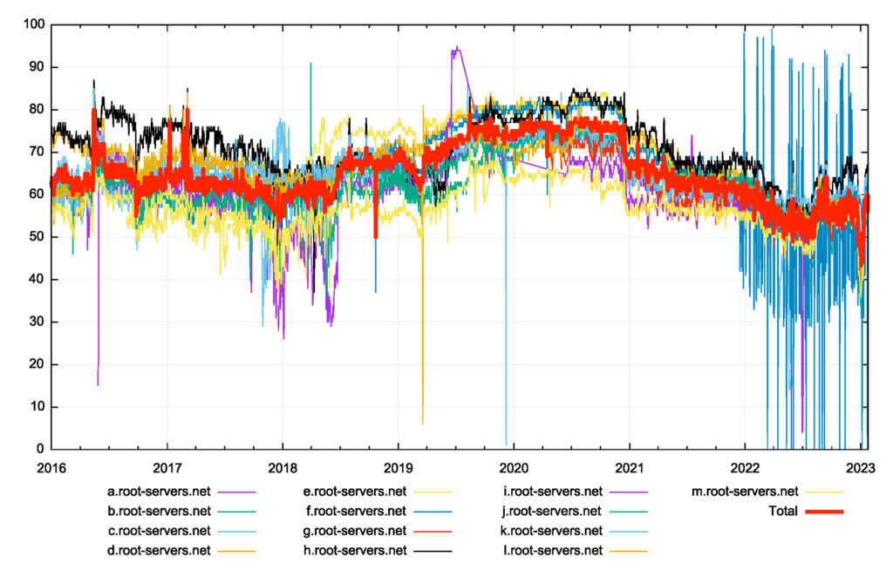

The DNS is a remarkably simple system. You send it queries and you get back answers. Within the system you see exactly the same simplicity: The DNS resolver that receives your query may not know the answer, so it, in turn, will send queries deeper into the system and collects the answers. The query/response process is the same, applied recursively. Simple.  

DNS 是一个非常简单的系统。你向它发送查询并得到答案。在系统中，您会看到完全相同的简单性：接收查询的 DNS 解析器可能不知道答案，因此它反过来会将查询发送到系统更深处并收集答案。查询/响应过程是相同的，递归应用。简单的。

However, the DNS is simple in the same way that Chess or Go are simple. They are all constrained environments governed by a small set of rigid rules, but they all possess astonishing complexity.  

然而，DNS 很简单，就像国际象棋或围棋很简单一样。它们都是由一小组严格规则控制的受限环境，但它们都具有惊人的复杂性。

Simple systems can have very deep complexity. This is a major theme in the study of Formal Systems.  

简单的系统可能具有非常深刻的复杂性。这是形式系统研究的一个重要主题。

The study of mathematics in the 19th century moved into dizzying heights of self-reflection. The question they were trying to answer was: What are the formal assumptions upon which the entire superstructure of mathematics was constructed?

  

19 世纪的数学研究进入了自我反思的令人眼花缭乱的高度。他们试图回答的问题是：整个数学上层建筑构建的形式假设是什么？

The Peano Axioms for natural numbers are a good example. If you took these axioms and only applied operations from a constrained and well-defined set, then was it possible to derive every known truth (provably correct) statement in maths? This question motivated Whitehead and Russell to labour on the landmark three-volume work Principia Mathematica in the early 20th century, which was intended to build the entire edifice of mathematics using only first principles and symbolic logic. Their work was in part brought about by an interest in logicism, the view that all mathematical truths are logical truths.

  

自然数的皮亚诺公理就是一个很好的例子。如果您采用这些公理并且仅应用受约束且定义明确的集合中的运算，那么是否有可能推导出数学中的每个已知真理（可证明正确的）陈述？这个问题促使怀特海和罗素在 20 世纪初期致力于撰写具有里程碑意义的三卷本著作《数学原理》，其目的是仅使用第一原理和符号逻辑来构建整个数学大厦。他们的工作部分源于对逻辑主义的兴趣，即所有数学真理都是逻辑真理的观点。

Mathematics was seen as a ‘pure’ form of philosophical study, whose truths were independent of any observer or any natural system. This study led to work by Kurt Gödel that probed the limits of this approach. His _Incompleteness Theorems_ are two theorems of mathematical logic that demonstrate the inherent limitations of every formal axiomatic system capable of modelling basic arithmetic.

  

数学被视为一种“纯粹”的哲学研究形式，其真理独立于任何观察者或任何自然系统。这项研究催生了库尔特·哥德尔（Kurt Gödel）的工作，探讨了这种方法的局限性。他的不完备性定理是数理逻辑的两个定理，它们证明了每个能够对基本算术建模的形式公理系统的固有局限性。

These results are important both in mathematical logic and in the philosophy of mathematics. The first incompleteness theorem states that no consistent system of axioms whose theorems can be listed by an effective procedure is capable of proving all truths about the arithmetic of natural numbers. For any such consistent formal system, there will always be statements about natural numbers that are true, but that are unprovable within the system. The second incompleteness theorem, an extension of the first, shows that the system cannot demonstrate its own consistency.

  

这些结果在数理逻辑和数学哲学中都很重要。第一个不完备性定理指出，没有一个一致的公理系统（其定理可以通过有效的程序列出）能够证明有关自然数算术的所有真理。对于任何这样一致的形式系统，总会有关于自然数的陈述是正确的，但在系统内是无法证明的。第二个不完备性定理是第一个不完备性定理的延伸，表明系统无法证明其自身的一致性。

With all our faith in rule-based automated systems that largely operate in today’s digital world, it’s sobering to realize that the limitations of such a worldview were clearly stated by Kurt Gödel 1931.

  

尽管我们对主要在当今数字世界中运行的基于规则的自动化系统充满信心，但令人清醒的是，库尔特·哥德尔 (Kurt Gödel) 1931 年明确指出了这种世界观的局限性。

Why am I talking about this? Well, the informal expression of Gödel’s work is that any formal system that is powerful enough to be useful is also powerful enough to express paradoxes. Or more informally, any constrained simple system that is sufficiently useful to express compound concepts is also capable of impenetrable complexity. And this is where the DNS comes in!

  

我为什么要讲这个？好吧，哥德尔著作的非正式表达是，任何强大到有用的正式系统也强大到足以表达悖论。或者更通俗地说，任何足以表达复合概念的受约束的简单系统也能够具有难以理解的复杂性。这就是 DNS 发挥作用的地方！

## The root zone 根区

The DNS is not a dictionary of any natural language, although these days when we use DNS names in our spoken language, we might be excused from getting the two concepts confused! The DNS is a hierarchical namespace. Individual domain names are constructed using an ordered sequence of labels. This ordered sequence of labels serves a number of functions, but perhaps most usefully it can be used as an implicit procedure to translate a domain name into an associated attribute value through the DNS name resolution protocol.  

DNS 不是任何自然语言的字典，尽管现在当我们在口语中使用 DNS 名称时，我们可能不会混淆这两个概念！ DNS 是一个分层命名空间。各个域名是使用有序的标签序列构建的。这种有序的标签序列具有多种功能，但也许最有用的是，它可以用作隐式过程，通过 DNS 名称解析协议将域名转换为关联的属性值。

For example, I operate a web server that is accessed using the DNS name

www.potaroo.net

. If you direct your browser to load the contents of this DNS name then your system first needs to resolve this DNS name to an IP address, so that your browser knows where to send the IP packets to perform a transaction with my server. This is where the structure of the name is used. In this case, the DNS system will query a root server to translate this name to a corresponding IP address and the response from any root server to such a query will be the set of resolvers that are authoritative for the

.net

zone.  

例如，我运行一个使用 DNS 名称 www.potaroo.net 访问的 Web 服务器。如果您指示浏览器加载此 DNS 名称的内容，那么您的系统首先需要将此 DNS 名称解析为 IP 地址，以便您的浏览器知道将 IP 数据包发送到何处以与我的服务器执行事务。这是使用名称结构的地方。在这种情况下，DNS 系统将查询根服务器以将此名称转换为相应的 IP 地址，并且任何根服务器对此类查询的响应将是对 .net 具有权威性的解析器集。区。

Ask any of these

.net

servers for this same name and the response will be the servers that are authoritative for the

potaroo.net

zone. Ask any of these

potaroo.net

servers for the same name and you will get back the IP address you are looking for.  

向这些 .net 服务器中的任何一个请求相同的名称，响应将是对 potaroo.net 区域具有权威的服务器。向这些 potaroo.net 服务器中的任何一个请求相同的名称，您将得到您正在查找的 IP 地址。

Every DNS name can be decomposed in the same way. The name itself defines the order of name resolution processing.

  

每个 DNS 名称都可以用相同的方式分解。名称本身定义名称解析处理的顺序。

There is one starting point for every DNS resolution operation: The root zone.  

每个 DNS 解析操作都有一个起点：根区域。

There is a school of thought that decries any exceptional treatment given to the root zone of the DNS. It’s just another zone, like any other. Its set of authoritative servers receives queries and answers them, like any other zone. There’s no magic in the root zone and all this attention on the root zone as special is entirely unwarranted.  

有一个学派谴责对 DNS 根区域的任何特殊处理。与其他区域一样，这只是另一个区域。与任何其他区域一样，它的一组权威服务器接收查询并回答它们。根区并没有什么魔力，所有对根区的特殊关注都是完全没有根据的。

However, I think this view understates the importance of the root zone in the DNS. The DNS is a massively distributed database. Indeed, it’s so massive that there is no single static map that identifies every authoritative source of information and the collection of data points about which it is authoritative. Instead, we use a process of dynamic discovery where the resolution of a DNS name firstly is directed to locating the authoritative server that has the data relating to the name we want resolved and then querying this server for the data. The beauty of this system is that these ‘discovery’ queries and the ‘ultimate’ query are precisely the same queries in every case.  

然而，我认为这种观点低估了 DNS 中根区域的重要性。 DNS 是一个大规模分布式数据库。事实上，它是如此庞大，以至于没有一个静态地图可以识别每个权威信息源以及其权威的数据点集合。相反，我们使用动态发现过程，其中 DNS 名称的解析首先定向到定位具有与我们要解析的名称相关的数据的权威服务器，然后向该服务器查询数据。该系统的优点在于，这些“发现”查询和“最终”查询在每种情况下都是完全相同的查询。

But everyone has to start somewhere. A DNS recursive resolver does not know all the DNS authoritative servers in advance and never will. But it does know one thing; it knows the IP address of at least one of the root servers in its provided configuration. From this starting point, everything can be constructed on the fly. The resolver can ask a root server for the names and IP addresses of all other root servers (the so-called _priming query_), and it can store that answer in a local cache. When the resolver is given a name to resolve it can then start with a query to a root server to find the next point in the name delegation hierarchy and go on from there in a recursive manner.  

但每个人都必须从某个地方开始。 DNS 递归解析器不会提前知道所有 DNS 权威服务器，也永远不会。但它确实知道一件事：它知道其提供的配置中至少一台根服务器的 IP 地址。从这个起点开始，一切都可以即时构建。解析器可以向根服务器询问所有其他根服务器的名称和 IP 地址（所谓的启动查询），并且可以将该答案存储在本地缓存中。当解析器被给予要解析的名称时，它可以从对根服务器的查询开始，以查找名称委托层次结构中的下一个点，并以递归方式从那里继续。

If this was how the DNS actually worked, then it’s pretty obvious that the DNS system would’ve melted down years ago. What makes this approach viable is _local caching_. A DNS resolver will store the answers in a local cache and use this locally held information to answer subsequent queries for the life of the cached entry. So perhaps a more refined statement of the role of the root servers is that every DNS resolution operation starts with a query to the cached state of the root zone. If the query cannot be answered from the local cache, then a root server is queried.  

如果这就是 DNS 的实际工作方式，那么很明显 DNS 系统几年前就已经崩溃了。使这种方法可行的是本地缓存。 DNS 解析器会将答案存储在本地缓存中，并使用此本地保存的信息来回答缓存条目生命周期内的后续查询。因此，也许对根服务器角色的更精确的表述是，每个 DNS 解析操作都从查询根区域的缓存状态开始。如果本地缓存无法回答查询，则查询根服务器。

However, behind this statement lurks an uncomfortable observation. If all of the root servers are inaccessible, the entire DNS ceases to function. This is perhaps a dramatic overstatement in some respects, as there would be no sudden collapse of the DNS and the Internet along with it. In the hypothetical situation where all the instances of the root servers were inaccessible, DNS resolvers would continue to work using locally cached information. However, as these cached entries time out, they would be discarded from these local resolvers (as they could not be refreshed by re-querying the root servers). The light of the DNS would fade to black bit by bit as these cached entries time out are are removed. The DNS root zone is the master lookup for every other zone. That’s why it deserves particular attention. For that reason, the DNS root zone is different from every other zone.  

然而，这句话的背后却隐藏着令人不安的观察。如果所有根服务器都无法访问，则整个 DNS 将停止运行。从某些方面来看，这或许有些夸张，因为 DNS 和互联网不会突然崩溃。在假设的情况下，根服务器的所有实例都无法访问，DNS 解析器将继续使用本地缓存的信息工作。然而，当这些缓存的条目超时时，它们将从这些本地解析器中被丢弃（因为它们无法通过重新查询根服务器来刷新）。随着这些超时的缓存条目被删除，DNS 的灯光会逐渐变黑。 DNS 根区域是所有其他区域的主查找。这就是为什么它值得特别关注。因此，DNS 根区域与其他区域不同。

Due to local caching, root zone servers are not used for every DNS lookup. The theory is that the root servers will only see queries as a result of cache misses. With a relatively small root zone and a relatively small set of DNS recursive resolvers, then the root zone query load should be small. Even as the Internet expands its user base the query load at the root servers does not necessarily rise in direct proportion. It’s the number of DNS resolvers that supposedly determines the root server query load if we believe in this model of the root’s function in the DNS.  

由于本地缓存，根区域服务器不会用于每次 DNS 查找。理论上，根服务器只会看到由于缓存未命中而导致的查询。如果根区域相对较小且 DNS 递归解析器集相对较小，则根区域查询负载应该较小。即使互联网扩大其用户群，根服务器上的查询负载也不一定成正比增加。如果我们相信 DNS 中的根功能模型，那么 DNS 解析器的数量应该决定了根服务器查询负载。

However, this model may not hold up under operational experience. The total volume of queries per day recorded by root servers is shown in Figure 1.  

然而，根据运营经验，这种模式可能站不住脚。根服务器每天记录的查询总量如图1所示。

[](https://blog.apnic.net/wp-content/uploads/2023/02/Figure-1-%E2%80%93-Total-root-server-queries-per-day-RSSAC002-data..jpg)

Figure 1 – Total root server queries per day (RSSAC002 data).  

图 1 – 每天的根服务器查询总数（RSSAC002 数据）。

Over the period from 2016 to 2020, the volume of queries seen by the collection of root servers has tripled. Happily, the root zone query volume came down in 2021 and stabilized during 2022. It is likely that changes to the behaviour of the Chrome browser may explain this.  

从 2016 年到 2020 年期间，根服务器集合的查询量增加了两倍。令人高兴的是，根区域查询量在 2021 年有所下降，并在 2022 年稳定下来。Chrome 浏览器行为的变化可能可以解释这一点。

Chrome used to probe the local DNS environment by making a sequence of queries to non-existent names upon startup and because the query names referred to undelegated Top-Level Domains (TLDs), these queries were a significant component of the queries seen at the root servers. Changing this behaviour in Chrome at the end of 2020 appears to have resulted in a dramatic change to the DNS query profile as seen by the root servers. However, the relative stability of query volumes at the root servers that has been observed over the past two years may not be sustained indefinitely.  

Chrome 过去在启动时通过对不存在的名称进行一系列查询来探测本地 DNS 环境，并且由于查询名称引用未授权的顶级域名 (TLD)，因此这些查询是在根目录中看到的查询的重要组成部分服务器。 2020 年底，在 Chrome 中更改此行为似乎导致了根服务器所看到的 DNS 查询配置文件发生了巨大变化。然而，过去两年观察到的根服务器查询量的相对稳定性可能不会无限期地维持。

What are we doing in response to this? How are we ensuring that the root zone service can continue to grow in capacity in response to a resumption in the growth of query rates?  

对此我们正在做什么？我们如何确保根区服务的容量能够继续增长以响应查询率的恢复增长？

## Root zone scaling 根区缩放

The original model of authoritative servers in the DNS was based on the concept of unicast routing. A server name had a single IP address, and this single server was located at a single point in the network. Augmenting server capacity entailed using a larger server and adding network capacity. However, such a model does not address the issues of a single point of vulnerability, nor does it provide an optimal service for distant clients.  

DNS 中权威服务器的原始模型基于单播路由的概念。服务器名称具有单个 IP 地址，并且该单个服务器位于网络中的单个点。增加服务器容量需要使用更大的服务器并增加网络容量。然而，这种模型并不能解决单点漏洞的问题，也不能为远程客户端提供最佳服务。

The DNS approach to this is to use multiple nameserver records. A DNS resolver was expected to retry its query with a different server if its original query did not elicit a response. That way, a collection of servers could provide a framework of mutual backup. To address the model of optimal choice, DNS resolvers were expected to maintain a record of the query/response delay for each of the root servers and prefer to direct their queries to the fastest server.  

DNS 的方法是使用多个名称服务器记录。如果 DNS 解析器的原始查询没有引起响应，则期望它使用不同的服务器重试其查询。这样，一组服务器就可以提供一个相互备份的框架。为了解决最佳选择模型，DNS 解析器需要维护每个根服务器的查询/响应延迟记录，并且更愿意将其查询定向到最快的服务器。

Why not use multiple address records for a single common server name? The two approaches (multiple server names and multiple address records for a name) look similar, but the typical DNS resolver behaviour apparently differs between these two cases. A DNS resolver is expected to prefer to use a particular server name based on query delay. On the other hand, a DNS resolver is expected to rotate its queries in round-robin order across all IP addresses for the same server name.  

为什么不对单个通用服务器名称使用多个地址记录？这两种方法（多个服务器名称和一个名称的多个地址记录）看起来很相似，但这两种情况之间的典型 DNS 解析器行为显然不同。 DNS 解析器预计会根据查询延迟优先使用特定的服务器名称。另一方面，DNS 解析器应按循环顺序在同一服务器名称的所有 IP 地址上轮换其查询。

I must admit that I’m not overly happy with this explanation, as it seems to be somewhat of an artifice. In the original model of IP, hosts with multiple network interfaces have multiple IP addresses as the IP address of a host is the address of its point of attachment to the network, and not the host itself. So, the situation of multiple addresses for a server is interpreted as a collection of addresses that represent some form of path diversity to reach the same unique host. Multiple names were supposedly used to denote different servers, I guess.  

我必须承认，我对这个解释并不太满意，因为它似乎有些诡计。在原始的 IP 模型中，具有多个网络接口的主机具有多个 IP 地址，因为主机的 IP 地址是其网络连接点的地址，而不是主机本身的地址。因此，服务器的多个地址的情况被解释为地址的集合，这些地址代表到达同一唯一主机的某种形式的路径多样性。我猜想，多个名称应该用来表示不同的服务器。

But such scenarios do not seem to match today’s experience, where single platforms may have multiple names and IP addresses, and multiple platforms may share a single name and a single IP address. The implication of this observation is that once a resolver has assembled a collection of IP addresses that represent the nameservers for a domain, then it seems to me that a resolver could be justified for treating the list of IP addresses consistently irrespective of whether the list was assembled from multiple IP addresses associated with a single name, or from multiple names.  

但这样的场景似乎与今天的经验不符，单个平台可能有多个名称和IP地址，多个平台可能共享一个名称和一个IP地址。这一观察的含义是，一旦解析器组装了代表域的名称服务器的 IP 地址集合，那么在我看来，解析器可以合理地一致地处理 IP 地址列表，无论该列表是否是由与单个名称或多个名称关联的多个 IP 地址组合而成。

The scaling issue with multiple servers is the question of completeness and the size of the nameserver response to the _priming query_.  

多个服务器的扩展问题是名称服务器对启动查询响应的完整性和大小问题。

The question here is: If a resolver asks for the nameservers of the root zone, should the resolver necessarily be informed of all such servers in the response? The size of the response will increase with the number of servers, and the size of the response may exceed the default maximal DNS over UDP payload size of 512 bytes. The choice of the number of server names for the root zone, 13, was based on the calculation that this was the largest server list that could fit into a DNS response that was under 512 bytes in size.  

这里的问题是：如果解析器请求根区域的名称服务器，是否必须在响应中告知解析器所有此类服务器？响应的大小将随着服务器数量的增加而增加，并且响应的大小可能超过默认的最大 DNS over UDP 负载大小 512 字节。选择根区域的服务器名称数量 13 是基于计算，这是可以容纳大小低于 512 字节的 DNS 响应的最大服务器列表。

This assumed that only the IPv4 address records were being used in the response, and with the addition of the IPv6 AAAA records the response size has expanded. The size of the _priming response_ for the root zone with 13 dual-stack authoritative servers is 823 bytes, or 1,097 bytes if the DNSSEC signature is included, and slightly larger if DNS cookies are added.  

假设响应中仅使用 IPv4 地址记录，并且随着 IPv6 AAAA 记录的添加，响应大小已扩大。具有 13 个双栈权威服务器的根区域的启动响应大小为 823 字节，如果包含 DNSSEC 签名则为 1,097 字节，如果添加 DNS cookie 则稍大。

In today’s DNS environment, if the query does not include an EDNS(0) indication that they can accept a DNS response over UDP larger than 512 bytes, then the root servers will provide a partial response in any case, generally listing all 13 names, but truncating the list of addresses of these services in the Additional Section to fit with a 512-byte payload.  

在当今的 DNS 环境中，如果查询不包含 EDNS(0) 指示它们可以接受大于 512 字节的 UDP 上的 DNS 响应，那么根服务器在任何情况下都会提供部分响应，通常会列出所有 13 个名称，但截断附加部分中这些服务的地址列表以适应 512 字节的有效负载。

If we can’t, or don’t want to, keep adding more root servers to the nameserver set in the root zone, then what are the other scaling options for serving the root zone?  

如果我们不能或不想继续向根区域中的名称服务器集添加更多根服务器，那么为根区域提供服务的其他扩展选项是什么？

The first set of responses to these scaling issues was in building root servers that have greater network capacity and greater processing throughput. But with just 13 servers to work with, then this was never going to scale at the pace of the Internet. We needed something more.  

对这些扩展问题的第一组响应是构建具有更大网络容量和更大处理吞吐量的根服务器。但由于只有 13 台服务器可供使用，因此永远无法按照互联网的速度进行扩展。我们需要更多的东西。

The next scaling step has been in the conversion from unicast to anycast services. There may be 26 unique IP addresses for root servers (13 in IPv4 and 13 in IPv6) but each of these service operators now uses _anycast_ to replicate the root service in different locations. The current number of root server sites is described at [root-servers.org](https://root-servers.org/) (Table 1). Now the routing system is used to optimize the choice of the ‘closest’ location for each root server.  

下一个扩展步骤是从单播服务转换为任播服务。根服务器可能有 26 个唯一的 IP 地址（IPv4 中为 13 个，IPv6 中为 13 个），但这些服务运营商现在都使用任播在不同位置复制根服务。 root-servers.org 描述了当前根服务器站点的数量（表 1）。现在，路由系统用于优化每个根服务器“最近”位置的选择。

<table data-immersive-translate-effect="1" data-immersive_translate_walked="0f280b08-45fe-4f9d-bae3-8fbaa6121797"><tbody data-immersive-translate-effect="1" data-immersive_translate_walked="0f280b08-45fe-4f9d-bae3-8fbaa6121797"><tr data-immersive-translate-effect="1" data-immersive_translate_walked="0f280b08-45fe-4f9d-bae3-8fbaa6121797"><td data-immersive-translate-effect="1" data-immersive_translate_walked="0f280b08-45fe-4f9d-bae3-8fbaa6121797"><strong data-immersive-translate-effect="1" data-immersive_translate_walked="0f280b08-45fe-4f9d-bae3-8fbaa6121797">Root<span lang="zh-CN" data-immersive-translate-translation-element-mark="1"><span data-immersive-translate-translation-element-mark="1">&nbsp;</span><span data-immersive-translate-translation-element-mark="1"><span data-immersive-translate-translation-element-mark="1">根</span></span></span></strong></td><td data-align="right" data-immersive-translate-effect="1" data-immersive_translate_walked="0f280b08-45fe-4f9d-bae3-8fbaa6121797"><strong data-immersive-translate-effect="1" data-immersive_translate_walked="0f280b08-45fe-4f9d-bae3-8fbaa6121797">Anycast</strong> <strong data-immersive-translate-effect="1" data-immersive_translate_walked="0f280b08-45fe-4f9d-bae3-8fbaa6121797">Sites</strong><span lang="zh-CN" data-immersive-translate-translation-element-mark="1"><span data-immersive-translate-translation-element-mark="1">&nbsp;</span><span data-immersive-translate-translation-element-mark="1"><span data-immersive-translate-translation-element-mark="1">选播站点</span></span></span></td></tr><tr data-immersive-translate-effect="1" data-immersive_translate_walked="0f280b08-45fe-4f9d-bae3-8fbaa6121797"><td data-immersive-translate-effect="1" data-immersive_translate_walked="0f280b08-45fe-4f9d-bae3-8fbaa6121797"><a data-immersive-translate-effect="1" data-immersive_translate_walked="0f280b08-45fe-4f9d-bae3-8fbaa6121797">A</a></td><td data-align="right" data-immersive-translate-effect="1" data-immersive_translate_walked="0f280b08-45fe-4f9d-bae3-8fbaa6121797">58</td></tr><tr data-immersive-translate-effect="1" data-immersive_translate_walked="0f280b08-45fe-4f9d-bae3-8fbaa6121797"><td data-immersive-translate-effect="1" data-immersive_translate_walked="0f280b08-45fe-4f9d-bae3-8fbaa6121797">B</td><td data-align="right" data-immersive-translate-effect="1" data-immersive_translate_walked="0f280b08-45fe-4f9d-bae3-8fbaa6121797">6</td></tr><tr data-immersive-translate-effect="1" data-immersive_translate_walked="0f280b08-45fe-4f9d-bae3-8fbaa6121797"><td data-immersive-translate-effect="1" data-immersive_translate_walked="0f280b08-45fe-4f9d-bae3-8fbaa6121797">C</td><td data-align="right" data-immersive-translate-effect="1" data-immersive_translate_walked="0f280b08-45fe-4f9d-bae3-8fbaa6121797">12</td></tr><tr data-immersive-translate-effect="1" data-immersive_translate_walked="0f280b08-45fe-4f9d-bae3-8fbaa6121797"><td data-immersive-translate-effect="1" data-immersive_translate_walked="0f280b08-45fe-4f9d-bae3-8fbaa6121797">D</td><td data-align="right" data-immersive-translate-effect="1" data-immersive_translate_walked="0f280b08-45fe-4f9d-bae3-8fbaa6121797">181</td></tr><tr data-immersive-translate-effect="1" data-immersive_translate_walked="0f280b08-45fe-4f9d-bae3-8fbaa6121797"><td data-immersive-translate-effect="1" data-immersive_translate_walked="0f280b08-45fe-4f9d-bae3-8fbaa6121797">E</td><td data-align="right" data-immersive-translate-effect="1" data-immersive_translate_walked="0f280b08-45fe-4f9d-bae3-8fbaa6121797">254</td></tr><tr data-immersive-translate-effect="1" data-immersive_translate_walked="0f280b08-45fe-4f9d-bae3-8fbaa6121797"><td data-immersive-translate-effect="1" data-immersive_translate_walked="0f280b08-45fe-4f9d-bae3-8fbaa6121797">F</td><td data-align="right" data-immersive-translate-effect="1" data-immersive_translate_walked="0f280b08-45fe-4f9d-bae3-8fbaa6121797">336</td></tr><tr data-immersive-translate-effect="1" data-immersive_translate_walked="0f280b08-45fe-4f9d-bae3-8fbaa6121797"><td data-immersive-translate-effect="1" data-immersive_translate_walked="0f280b08-45fe-4f9d-bae3-8fbaa6121797">G</td><td data-align="right" data-immersive-translate-effect="1" data-immersive_translate_walked="0f280b08-45fe-4f9d-bae3-8fbaa6121797">6</td></tr><tr data-immersive-translate-effect="1" data-immersive_translate_walked="0f280b08-45fe-4f9d-bae3-8fbaa6121797"><td data-immersive-translate-effect="1" data-immersive_translate_walked="0f280b08-45fe-4f9d-bae3-8fbaa6121797">H</td><td data-align="right" data-immersive-translate-effect="1" data-immersive_translate_walked="0f280b08-45fe-4f9d-bae3-8fbaa6121797">12</td></tr><tr data-immersive-translate-effect="1" data-immersive_translate_walked="0f280b08-45fe-4f9d-bae3-8fbaa6121797"><td data-immersive-translate-effect="1" data-immersive_translate_walked="0f280b08-45fe-4f9d-bae3-8fbaa6121797">I</td><td data-align="right" data-immersive-translate-effect="1" data-immersive_translate_walked="0f280b08-45fe-4f9d-bae3-8fbaa6121797">68</td></tr><tr data-immersive-translate-effect="1" data-immersive_translate_walked="0f280b08-45fe-4f9d-bae3-8fbaa6121797"><td data-immersive-translate-effect="1" data-immersive_translate_walked="0f280b08-45fe-4f9d-bae3-8fbaa6121797">J</td><td data-align="right" data-immersive-translate-effect="1" data-immersive_translate_walked="0f280b08-45fe-4f9d-bae3-8fbaa6121797">163</td></tr><tr data-immersive-translate-effect="1" data-immersive_translate_walked="0f280b08-45fe-4f9d-bae3-8fbaa6121797"><td data-immersive-translate-effect="1" data-immersive_translate_walked="0f280b08-45fe-4f9d-bae3-8fbaa6121797">K</td><td data-align="right" data-immersive-translate-effect="1" data-immersive_translate_walked="0f280b08-45fe-4f9d-bae3-8fbaa6121797">97</td></tr><tr data-immersive-translate-effect="1" data-immersive_translate_walked="0f280b08-45fe-4f9d-bae3-8fbaa6121797"><td data-immersive-translate-effect="1" data-immersive_translate_walked="0f280b08-45fe-4f9d-bae3-8fbaa6121797">L</td><td data-align="right" data-immersive-translate-effect="1" data-immersive_translate_walked="0f280b08-45fe-4f9d-bae3-8fbaa6121797">192</td></tr><tr data-immersive-translate-effect="1" data-immersive_translate_walked="0f280b08-45fe-4f9d-bae3-8fbaa6121797"><td data-immersive-translate-effect="1" data-immersive_translate_walked="0f280b08-45fe-4f9d-bae3-8fbaa6121797">M</td><td data-align="right" data-immersive-translate-effect="1" data-immersive_translate_walked="0f280b08-45fe-4f9d-bae3-8fbaa6121797">11</td></tr><tr data-immersive-translate-effect="1" data-immersive_translate_walked="0f280b08-45fe-4f9d-bae3-8fbaa6121797"><td data-immersive-translate-effect="1" data-immersive_translate_walked="0f280b08-45fe-4f9d-bae3-8fbaa6121797">Total<span lang="zh-CN" data-immersive-translate-translation-element-mark="1"><span data-immersive-translate-translation-element-mark="1">&nbsp;</span><span data-immersive-translate-translation-element-mark="1"><span data-immersive-translate-translation-element-mark="1">全部的</span></span></span></td><td data-align="right" data-immersive-translate-effect="1" data-immersive_translate_walked="0f280b08-45fe-4f9d-bae3-8fbaa6121797">1,396</td></tr></tbody></table>

Table 1 – Anycast site counts for root servers, January 2023.  

表 1 – 根服务器的任播站点计数，2023 年 1 月。

The root server system has enthusiastically embraced anycast. That’s a total of 1,396 sites where there are instances of root servers. Some 28 months earlier, in September 2020, the root server site count was 1,098, so that’s a 30% increase in the number of sites in a little over two years.  

根服务器系统热情地接受了选播。总共有 1,396 个站点有根服务器实例。大约 28 个月前，即 2020 年 9 月，根服务器站点数量为 1,098 个，因此在两年多一点的时间里，站点数量增加了 30%。

The number of authoritative server engines is larger than that count of the number of sites, as it’s common these days to use multiple server engines within a site and use some form of query distribution front-end to distribute the incoming query load across multiple back-end engines at each site.  

权威服务器引擎的数量大于站点的数量，因为现在在一个站点内使用多个服务器引擎并使用某种形式的查询分发前端来跨多个后端分发传入的查询负载是很常见的。每个站点的末端引擎。

However, even this form of expanding the distributed service may not be enough. If the growth profile of 2016 – 2020 resumes, then two years from now we may need to double the root service capacity from the current levels, and in a further two years, we’d need to double it again. And again, and again, and again. Exponential growth is a very harsh master.  

然而，即使是这种扩展分布式服务的形式也可能还不够。如果恢复 2016 年至 2020 年的增长态势，那么两年后我们可能需要将根服务容量从当前水平增加一倍，再过两年，我们需要再次增加一倍。一次又一次，一次又一次。指数增长是一个非常严酷的主人。

Can this anycast model of replicated root servers expand indefinitely? Or should we look elsewhere for scaling solutions? To attempt to answer this question we should look at the root service in a little more detail.  

这种复制根服务器的任播模型可以无限扩展吗？或者我们应该在其他地方寻找扩展解决方案？为了尝试回答这个问题，我们应该更详细地了解根服务。

There have been many studies of the root service and the behaviour of the DNS over the past few decades. If the root servers were simply meant to collect the cache misses of DNS resolvers, then whatever is happening at the root is not entirely consistent with a model of resolver cache misses. Indeed, it’s not clear what going on at the root!  

在过去的几十年里，人们对根服务和 DNS 的行为进行了许多研究。如果根服务器只是为了收集 DNS 解析器的缓存未命中，那么根服务器上发生的任何事情都不与解析器缓存未命中的模型完全一致。确实，根本不清楚到底发生了什么！

It has been reported that the majority of queries to the root servers result in NXDOMAIN responses. In looking at the published response code data, it appears that some 55% of root zone queries result in NXDOMAIN responses (Figure 2). The NXDOMAIN response rate was as high as 75% in 2020 and dropped, presumably when the default behaviour of the Chrome browser changed. In theory, these queries are all cache misses at the recursive resolver level, so the issue is that the DNS is not all that effective in handling cases where the name itself does not exist.  

据报道，大多数对根服务器的查询都会导致 NXDOMAIN 响应。查看已发布的响应代码数据，发现大约 55% 的根区域查询会产生 NXDOMAIN 响应（图 2）。 NXDOMAIN 响应率在 2020 年高达 75%，随后有所下降，大概是因为 Chrome 浏览器的默认行为发生了变化。理论上，这些查询都是递归解析器级别的缓存未命中，因此问题是 DNS 在处理名称本身不存在的情况时并不是那么有效。

[](https://blog.apnic.net/wp-content/uploads/2023/02/Figure-2-%E2%80%93-Proportion-of-root-zone-NXDOMAIN-responses-per-day-RSSAC002-data.5.jpg)

Figure 2 – Proportion of root zone NXDOMAIN responses per day (RSSAC002 data).  

图 2 – 根区域 NXDOMAIN 每天响应的比例（RSSAC002 数据）。

## Query deflection 查询偏转

If we want to reduce the query pressure on the root servers it appears that we need to handle the case of queries for non-existent names, and in particular names where the top-level label in the name is not delegated in the root zone. How else can we deflect these queries away from the root server system?  

如果我们想减少根服务器上的查询压力，那么我们似乎需要处理查询不存在名称的情况，特别是名称中的顶级标签未在根区域中委托的名称。我们还能如何将这些查询从根服务器系统转移出去？

There are two approaches that may help.  

有两种方法可能会有所帮助。

### NSEC caching NSEC 缓存

The first is described in [RFC 8198](https://www.rfc-editor.org/rfc/rfc8198), aggressive NSEC caching. When a top-level label does not exist in a DNSSEC-signed zone, and the query has the DNSSEC EDNS(0) flag enabled, the NXDOMAIN response from a root server includes a signed NSEC record that gives the two labels that do exist in the root zone that ‘surround’ the non-existent label. NSEC records say more than ‘this label is not in this zone’. It says that every label that is lexicographically between these two labels does not exist. If the recursive resolver caches this NSEC record it can use this same cached record to respond to all subsequent queries for names in this label range, in the same way, that it conventionally uses ‘positive’ cache records.  

第一个在 RFC 8198 中进行了描述，即积极的 NSEC 缓存。当 DNSSEC 签名区域中不存在顶级标签，并且查询启用了 DNSSEC EDNS(0) 标志时，来自根服务器的 NXDOMAIN 响应包含一个签名的 NSEC 记录，该记录给出了在 DNSSEC 签名区域中确实存在的两个标签。 “围绕”不存在的标签的根区域。 NSEC 记录中所说的不仅仅是“该标签不在该区域”。它表示按字典顺序位于这两个标签之间的每个标签都不存在。如果递归解析器缓存此 NSEC 记录，它可以使用此相同的缓存记录来响应对此标签范围内的名称的所有后续查询，就像它通常使用“正”缓存记录一样。

```
$ dig +dnssec this.is.not.a.tld @a.root-servers.net

; <<>> DiG 9.18.10 <<>> +dnssec this.is.not.a.tld @a.root-servers.net
;; global options: +cmd
;; Got answer:
;; ->>HEADER<<- opcode: QUERY, status: NXDOMAIN, id: 18390
;; flags: qr aa rd; QUERY: 1, ANSWER: 0, AUTHORITY: 6, ADDITIONAL: 1
;; WARNING: recursion requested but not available

;; OPT PSEUDOSECTION:
; EDNS: version: 0, flags: do; udp: 4096
;; QUESTION SECTION:
;this.is.not.a.tld.INA

;; AUTHORITY SECTION:
.86400INSOAa.root-servers.net. nstld.verisign-grs.com. 2023020601 1800 900 604800 86400
.86400INRRSIGSOA 8 0 86400 20230219170000 20230206160000 951 . wkTq6wKu2J5w […] STwcw==
tl.86400INNSECtm. NS DS RRSIG NSEC
tl.86400INRRSIGNSEC 8 1 86400 20230219170000 20230206160000 951 . kgQXGN5Vo […] vQHw==
.86400INNSECaaa. NS SOA RRSIG NSEC DNSKEY
.86400INRRSIGNSEC 8 0 86400 20230219170000 20230206160000 951 . LVRI […] DiIQ==

;; Query time: 127 msec
;; SERVER: 198.41.0.4#53(a.root-servers.net) (UDP)
;; WHEN: Tue Feb 07 10:12:17 AEDT 2023
;; MSG SIZE  rcvd: 1031
```

An NXDOMAIN response from a root server.  

来自根服务器的 NXDOMAIN 响应。

In the example above, a DNSSEC-enabled query for the name this.is.not.a.tld elicits a response that includes a signed NSEC record that asserts there are no delegated TLDs between .tl and .tm, and any query for a name that lies between these two labels would elicit exactly the same response. If a recursive resolver cached both the 1,481 top-level delegated labels and the 1,481 NSEC records in the root zone, then the resolver would not need to pass any queries to a root server for the lifetime of the cached entries. If all recursive resolvers performed this form of NSEC caching of the root zone, then the query volumes seen at the root from recursive resolvers would fall significantly for non-existent labels.  

在上面的示例中，对名称 this.is.not.a.tld 启用 DNSSEC 的查询会引发一个响应，其中包含一个签名的 NSEC 记录，该记录断言 .tl 和 .tm 之间不存在委托的 TLD，并且对以下名称的任何查询这两个标签之间的差异会引起完全相同的反应。如果递归解析器在根区域中缓存了 1,481 个顶级委托标签和 1,481 个 NSEC 记录，则解析器在缓存条目的生命周期内不需要将任何查询传递到根服务器。如果所有递归解析器都对根区域执行这种形式的 NSEC 缓存，则对于不存在的标签，从递归解析器在根处看到的查询量将显着下降。

### How many TLDs are in the root zone?  

根区域中有多少个 TLD？

There are 1,481 TLDs in the root zone of the DNS in February 2023. It has not always been this size. The root zone started with a small set of generic labels, and in the late 1980s expanded to include the set of two-letter country codes (CCs). There were some tentative steps to augment the number of generic TLD names, and then in the 2010s, ICANN embarked on a larger program of generic TLD expansion. Figure 3 shows the daily count of TLDs in the root zone since 2014.  

2023 年 2 月，DNS 根区域中有 1,481 个 TLD。但并不总是如此大小。根区域从一小组通用标签开始，并在 20 世纪 80 年代末扩展到包括一组两个字母的国家/地区代码 (CC)。为了增加通用 TLD 名称的数量，ICANN 采取了一些尝试性措施，然后在 2010 年代，ICANN 开始实施更大规模的通用 TLD 扩展计划。图 3 显示了自 2014 年以来根区域中 TLD 的每日数量。

[](https://blog.apnic.net/wp-content/uploads/2023/02/Figure-3-%E2%80%94-Daily-count-of-root-zone-TLDs..jpg)

 Figure 3 — Daily count of root zone TLDs.  

图 3 — 根区域 TLD 的每日计数。

What was surprising to me when I generated this data set was that TLDs are not necessarily permanent. The largest TLD count occurred in August 2017 with 1,547 TLDs, and since then the number of TLDs has been gently declining.  

当我生成此数据集时，令我惊讶的是 TLD 不一定是永久性的。 TLD 数量最多发生在 2017 年 8 月，共有 1,547 个 TLD，此后 TLD 数量一直在缓慢下降。

NSEC caching in recursive resolvers could play a valuable role in scaling the root zone. Bind supports this as of release 9.12. Unbound supports this as of release 1.7.0. Knot resolver supports this as of 2.0.0, but the queries at the root zone keep growing.  

递归解析器中的 NSEC 缓存可以在扩展根区域方面发挥重要作用。 Bind 从版本 9.12 开始支持此功能。 Unbound 从 1.7.0 版本开始支持此功能。 Knot 解析器从 2.0.0 开始支持这一点，但根区域的查询不断增长。

However, NSEC caching is a tactical response to root zone scaling concerns, as distinct from a strategic response. It’s still dependent on the root server infrastructure and uses a query-based method of promulgating the contents of the root zone. Nothing really changes in the root service model. What NSEC caching does is allow the resolver to make full use of the information in the NSEC response. Nothing else changes.  

然而，NSEC 缓存是对根区扩展问题的战术响应，与战略响应不同。它仍然依赖于根服务器基础设施，并使用基于查询的方法来发布根区域的内容。根服务模型没有任何真正的改变。 NSEC 缓存的作用是允许解析器充分利用 NSEC 响应中的信息。其他什么都没有改变。

### Local root and ZONEMD  

本地根和 ZONEMD

Another option is to jump out of the query/response model of learning the contents of the root zone and simply load the entire root zone into recursive resolvers. The idea is that if a recursive resolver is loaded with a copy of the root zone then it can operate autonomously with respect to the root servers for the period of validity of the local copy of the root zone contents. It will send no further queries to the root servers. The procedures to follow to load a local root zone are well documented in [RFC 8806](https://tools.ietf.org/html/rfc8806), and I should also note here the existence of the [LocalRoot](https://localroot.isi.edu/) service that offers DNS NOTIFY messages when the root zone changes.  

另一种选择是跳出学习根区域内容的查询/响应模型，并将整个根区域简单地加载到递归解析器中。这个想法是，如果递归解析器加载了根区域的副本，那么它可以在根区域内容的本地副本的有效期内相对于根服务器自主操作。它不会向根服务器发送进一步的查询。加载本地根区域所遵循的过程在 RFC 8806 中有详细记录，我还应该在这里指出 LocalRoot 服务的存在，该服务在根区域更改时提供 DNS NOTIFY 消息。

The root zone is not a big data set. A signed, uncompressed plain text copy of the root zone as of the start of February 2023 is 2,258,235 bytes in size.  

根区域不是一个大数据集。截至 2023 年 2 月，根区域的已签名、未压缩纯文本副本大小为 2,258,235 字节。

However, this approach has its drawbacks. How do you know that the zone you might have received via some form of zone transfer or otherwise is the current genuine root zone? Yes, the zone is signed, but not every element in the zone is signed (NS records for delegated zones are unsigned). The client is left with the task of performing validation of every digital signature in the zone, and at present, there are some 2,847 RRSIG records in the root zone. Even then the client cannot confirm that its local copy of the root zone is complete and authentic, because of these unsigned NS delegation records.  

然而，这种方法有其缺点。您如何知道您可能通过某种形式的区域传输或其他方式收到的区域是当前的真正根区域？是的，区域已签名，但并非区域中的每个元素都已签名（委派区域的 NS 记录未签名）。客户端需要对区域中的每个数字签名进行验证，目前根区域中有大约 2,847 条 RRSIG 记录。即使这样，由于这些未签名的 NS 委托记录，客户端也无法确认其根区域的本地副本是完整且真实的。

The IETF published [RFC 8976](https://www.rfc-editor.org/rfc/rfc8976.html), the specification of a _message digest_ record for DNS zones, in February 2021. This RFC defines the ZONEMD record.  

IETF 于 2021 年 2 月发布了 RFC 8976，即 DNS 区域的消息摘要记录规范。该 RFC 定义了 ZONEMD 记录。

**What’s a message digest?  

什么是消息摘要？**

A _message digest_ is a condensed form of a digital signature of a digital artefact. If the digital artefact has changed in any way, then the digest will necessarily change in value as well. If a receiver of this artefact is given the data object and its digest value then the receiver can be assured, to some extent, that the contents of the file have been unaltered since the digest was generated.

  

消息摘要是数字制品的数字签名的压缩形式。如果数字制品发生了任何变化，那么摘要的价值也必然会发生变化。如果该人工制品的接收者被给予数据对象及其摘要值，则接收者可以在某种程度上确信自生成摘要以来文件的内容没有被改变。

These digital signatures are typically generated using a cryptographic hash function. These functions have several useful properties. They are normally a fixed length function so the function value is a fixed size irrespective of the size of the data for which the hash has been generated. They are a unidirectional function, in that knowledge of the hash function value will not provide any assistance in trying to recreate the original data. They are deterministic, in that the same hash function applied to the same data will always produce the same hash value.

  

这些数字签名通常是使用加密哈希函数生成的。这些函数有几个有用的属性。它们通常是固定长度的函数，因此函数值是固定大小的，与生成散列的数据的大小无关。它们是单向函数，因为散列函数值的知识不会为尝试重新创建原始数据提供任何帮助。它们是确定性的，因为应用于相同数据的相同哈希函数将始终产生相同的哈希值。

Any form of change to the data should generate a different hash value. Hash functions do not necessarily produce a unique value for each possible data collection, but it should be exhaustively challenging (unfeasible) to synthesize or discover a data set that produces a given hash value (pre-image resistance), and equally challenging to find or generate two different data sets that have the same hash function value (collision resistance).

  

对数据的任何形式的更改都应该生成不同的哈希值。散列函数不一定会为每个可能的数据集合产生唯一的值，但合成或发现产生给定散列值（原像抵抗）的数据集应该具有极大的挑战性（不可行），并且同样具有挑战性生成两个具有相同哈希函数值（抗冲突性）的不同数据集。

This means that an adversary, malicious or otherwise, cannot replace or modify the data set without changing its digest value. Thus, if two data sets have the same digest, one can be relatively confident that they are identical. Second pre-image resistance prevents an attacker from crafting a data set with the same hash as a document the attacker cannot control, and collision resistance prevents an attacker from creating two distinct documents with the same hash.

  

这意味着对手，无论是恶意的还是其他的，都无法在不更改其摘要值的情况下替换或修改数据集。因此，如果两个数据集具有相同的摘要，则可以相对确信它们是相同的。第二个原像抵抗可以防止攻击者制作与攻击者无法控制的文档具有相同哈希值的数据集，并且碰撞抵抗可以防止攻击者创建两个具有相同哈希的不同文档。

What if the root zone included a ZONEMD record, signed with the Zone Signing Key (ZSK) of the root zone? If a client received such a root zone that included this record, then it could validate the RRSIG of the ZONEMD record in the same way that it DNSSEC-validates any other RRSIG entry in the root zone, then use the value of this record and compare it with a locally calculated message digest value of the root zone. If the digest values match, then the client has a high level of assurance that this is an authentic copy of the root zone and has not been altered in any way.  

如果根区域包含使用根区域的区域签名密钥 (ZSK) 签名的 ZONEMD 记录怎么办？如果客户端收到包含此记录的根区域，则它可以以与 DNSSEC 验证根区域中任何其他 RRSIG 条目相同的方式验证 ZONEMD 记录的 RRSIG，然后使用此记录的值并进行比较它与根区域本地计算的消息摘要值。如果摘要值匹配，则客户端可以高度保证这是根区域的真实副本并且没有以任何方式更改。

The dates in the DNSSEC signatures can indicate some level of currency of the data, but further assurance at a finer level of granularity than the built-in key validity dates that the local copy of the root zone data is indeed the current value of the root zone is a little more challenging in this context. DNSSEC does not provide any explicit concept of revocation of prior versions of data, so all ‘snapshots’ of the root zone within the DNSSEC key validity times are equally valid for a client. The root zone uses a two-week signature validity period:  

DNSSEC 签名中的日期可以指示数据的某种程度的流通性，但可以在比内置密钥有效日期更细的粒度上进一步保证根区域数据的本地副本确实是根的当前值在这种情况下，区域更具挑战性。 DNSSEC 没有提供任何撤销先前版本数据的明确概念，因此 DNSSEC 密钥有效期内根区域的所有“快照”对于客户端同样有效。根区域使用两周的签名有效期：

```
. 86400 IN SOA a.root-servers.net. nstld.verisign-grs.com. 2023020501 1800 900 604800 86400
. 86400 IN RRSIG SOA 8 0 86400 20230218170000 20230205160000 951 .  dtm […] SgQ==
```

Root zone SOA signature.  

根区 SOA 签名。

Despite this, the approach of a whole-of-zone signature has some real potential in terms of the distribution of the root zone to DNS resolvers, thereby reducing the dependency on the availability and responsiveness of the root zone servers. The use of the ZONEMD record would allow any client to use a copy of the root zone irrespective of the way in which the zone file was obtained. Within the limits of the authenticated currency of the zone file, as already noted, any party can redistribute a copy of the root zone and clients of such a redistributed zone can answer queries using this data with some level of confidence that the responses so generated are authentic.  

尽管如此，整体区域签名方法在将根区域分配给 DNS 解析器方面具有一些真正的潜力，从而减少对根区域服务器的可用性和响应能力的依赖。使用 ZONEMD 记录将允许任何客户端使用根区域的副本，无论获取区域文件的方式如何。如前所述，在区域文件的经过验证的货币限制内，任何一方都可以重新分发根区域的副本，并且此类重新分发区域的客户端可以使用此数据来回答查询，并且具有一定程度的信心，这样生成的响应是真正的。

While a local zone administrator can add a ZONEMD record to the zone or zones they administer at any time (assuming that the zone is already DNSSEC-signed), the story is somewhat different for the root zone. The risk is that if the inclusion of this new resource record in the root zone causes resolvers to reject the zone, then the consequences could be dire if this rejection is widespread. This is not unlike the issues with the roll of the KSK, although the likelihood of zone file rejection with the addition of this ZONEMD record is apparently considered to be a low-level risk at this stage.  

虽然本地区域管理员可以随时将 ZONEMD 记录添加到他们管理的一个或多个区域（假设该区域已经经过 DNSSEC 签名），但根区域的情况有所不同。风险在于，如果在根区域中包含此新资源记录导致解析器拒绝该区域，那么如果这种拒绝广泛存在，后果可能是可怕的。这与 KSK 滚动的问题没有什么不同，尽管在现阶段，添加此 ZONEMD 记录而导致区域文件被拒绝的可能性显然被认为是低级风险。

In any case, the addition of a new record to the root zone involves many interested parties, including the IANA Functions Operator, the Root Zone Maintainer, and the Root Server Operators. The approach to introducing this record into the root zone follows a practice previously used to introduce DNSSEC keys into the zone, starting with a ‘dummy’ record that presents the resource record but in a format that cannot be used to validate the data by using a private-use hash algorithm number in the first instance. The second phase of the process is then cut over to a value that can be used to verify the zone data.  

无论如何，向根区添加新记录涉及许多相关方，包括 IANA 职能运营商、根区维护者和根服务器运营商。将此记录引入根区域的方法遵循以前用于将 DNSSEC 密钥引入区域的做法，从显示资源记录的“虚拟”记录开始，但其格式不能用于通过使用首先使用私有哈希算法编号。然后，该过程的第二阶段被切换到可用于验证区域数据的值。

Recursive resolvers on the Internet are not impacted by plans to add the ZONEMD record if they interact with the root zone and its servers via standard query mechanisms. There is no expectation that resolvers will issue queries for the ZONEMD record, and there is no harm should they do so in any case.  

如果 Internet 上的递归解析器通过标准查询机制与根区域及其服务器进行交互，则它们不会受到添加 ZONEMD 记录的计划的影响。解析器不会发出对 ZONEMD 记录的查询，并且在任何情况下这样做都不会造成任何损害。

For those resolvers who elect to use a locally managed copy of the root zone, the ZONEMD record, they will benefit from a resolver implementation that supports ZONEMD and can use it to verify a received zone. Resolver implementations that perform this verification include Unbound (from v1.13.23) and PowerDNS Recursor (from v4.7.04) and Bind (v9.17.13).  

对于那些选择使用本地管理的根区域副本（ZONEMD 记录）的解析器，他们将受益于支持 ZONEMD 的解析器实现，并可以使用它来验证接收到的区域。执行此验证的解析器实现包括 Unbound（从 v1.13.23 开始）、PowerDNS Recursor（从 v4.7.04 开始）和 Bind（v9.17.13）。

Notification mechanisms that could prompt a resolver to work from a new copy of the root zone are not addressed in this framework. To me, that’s the last piece of the framework that could promote every recursive resolver into a peer root server.  

此框架中未解决可能提示解析器从根区域的新副本进行工作的通知机制。对我来说，这是框架的最后一部分，可以将每个递归解析器提升为对等根服务器。

We’ve tried a number of approaches to scalable distribution mechanisms over the years. There is a structured push mechanism where clients sign up to a distributor and the distributor pushes updated copies of the data to clients. Routing protocols use this mechanism. There is the pull approach where the client probes its feed point to see if the data has changed and pulls a new copy if it has changed. This mechanism has some scaling issues in that aggressive probing by clients may overwhelm the distributor, and we’ve also seen hybrid approaches where a change indication signal is pushed to the client, and it is up to the client to determine when to pull the new data.  

多年来，我们尝试了多种可扩展分发机制的方法。有一种结构化的推送机制，客户端向分发者注册，分发者将更新的数据副本推送给客户端。路由协议使用这种机制。有一种拉取方法，客户端探测其馈送点以查看数据是否已更改，如果已更改，则拉取新副本。这种机制存在一些扩展问题，因为客户端的积极探测可能会压垮分发者，而且我们还看到了混合方法，其中将更改指示信号推送到客户端，并由客户端决定何时拉取新的信号数据。

This model of local root zone distribution has the potential to change the nature of the DNS root service, unlike NSEC caching. If there is one thing that we’ve learned to do astonishingly well in recent times it’s the distribution of content. Indeed, we’ve concentrated on this activity to such an extent that it appears that the entire Internet is nothing more than a small set of Content Distribution Networks (CDNs). If the root zone is signed in its entirety with zone signatures that allow a recursive resolver to confirm its validity and currency and submitted into these distribution systems as just another digital object, then the CDN infrastructure is perfectly capable of feeding this zone to the entire collection of recursive resolvers with ease.  

与 NSEC 缓存不同，这种本地根区域分布模型有可能改变 DNS 根服务的性质。如果说我们最近学得做得非常好的一件事的话，那就是内容的分发。事实上，我们对这项活动的关注程度如此之高，以至于整个互联网似乎只不过是一小部分内容分发网络 (CDN)。如果根区域使用区域签名进行完整签名，允许递归解析器确认其有效性和货币，并作为另一个数字对象提交到这些分发系统中，那么 CDN 基础设施完全能够将该区域提供给整个集合轻松地使用递归解析器。

Perhaps if we changed the management regime of the root zone to generate a new zone file every 24 hours according to a strict schedule, we could eliminate the entire notification superstructure. Each iteration of the root zone contents would be published two hours in advance and is valid for precisely 24 hours, for example. At that point, the root zone will be served by millions of recursive resolvers rather than the twelve operators we use today.  

也许如果我们改变根区域的管理机制，按照严格的时间表每 24 小时生成一个新的区域文件，我们就可以消除整个通知上层结构。例如，根区域内容的每次迭代都会提前两小时发布，并且有效期恰好为 24 小时。那时，根区域将由数百万个递归解析器提供服务，而不是我们今天使用的 12 个运算符。

## Options? Pick them all!  

选项？全部选吧！

We operate the root service in its current framework because it has been functionally adequate so far. That is to say, the predominate query-based approach to root zone distribution hasn’t visibly collapsed in a screaming heap of broken DNS yet! But we don’t have to continue relying only on this query-based approach just because it hasn’t broken so far. Our need to further scale this function is still a current need, and it makes a whole lot of sense to take a broader view of available options. We have some choices as to how the root service can evolve and scale.  

我们在当前框架中运行根服务，因为到目前为止它的功能已经足够了。也就是说，基于查询的占主导地位的根区域分配方法尚未明显崩溃在一堆损坏的 DNS 中！但我们不必仅仅因为这种基于查询的方法到目前为止还没有崩溃就继续依赖它。我们当前仍需要进一步扩展此功能，并且以更广泛的视角看待可用选项非常有意义。对于根服务如何发展和扩展，我们有一些选择。

By deflecting some of the current load to delegation points lower in the domain hierarchy we can make a massive change in the current root query load, as we’ve already seen with the changes to the Chrome browser.  

通过将部分当前负载转移到域层次结构中较低的委派点，我们可以对当前根查询负载进行巨大更改，正如我们已经在 Chrome 浏览器的更改中看到的那样。

By having resolvers make better use of signed NSEC records we can stave off some of the more pressing immediate issues about further scaling of the root system.  

通过让解析器更好地利用签名的 NSEC 记录，我们可以避免一些有关进一步扩展根系统的更紧迫的直接问题。

But that’s probably not enough. We can either wait for the system to collapse and then try and salvage the DNS from the broken mess, or perhaps we could explore some alternatives now, and look at how we can break out of a query-based root content promulgation model and view the root zone as just another content ‘blob’ in the larger ecosystem of content distribution.  

但这可能还不够。我们可以等待系统崩溃，然后尝试从破碎的混乱中挽救 DNS，或者我们现在可以探索一些替代方案，看看如何突破基于查询的根内容传播模型并查看根区域只是更大的内容分发生态系统中的另一个内容“blob”。

If we can load every recursive resolver with a current copy of the root zone cost-efficiently, and these days that’s not even a remotely challenging target, then perhaps we can put aside the issues of how to scale the root server system to serve ever greater quantities of ‘NO!’ to ever more demanding clients!  

如果我们能够经济高效地为每个递归解析器加载根区域的当前副本，而且现在这甚至不是一个远程挑战性目标，那么也许我们可以抛开如何扩展根服务器系统以提供更大服务的问题对要求越来越高的客户说“不！”！

<table data-immersive-translate-effect="1" data-immersive_translate_walked="0f280b08-45fe-4f9d-bae3-8fbaa6121797"><tbody data-immersive-translate-effect="1" data-immersive_translate_walked="0f280b08-45fe-4f9d-bae3-8fbaa6121797"><tr data-immersive-translate-effect="1" data-immersive_translate_walked="0f280b08-45fe-4f9d-bae3-8fbaa6121797"><td data-immersive-translate-effect="1" data-immersive_translate_walked="0f280b08-45fe-4f9d-bae3-8fbaa6121797"><nobr data-immersive-translate-effect="1" data-immersive_translate_walked="0f280b08-45fe-4f9d-bae3-8fbaa6121797">Rate this article<span lang="zh-CN" data-immersive-translate-translation-element-mark="1"><span data-immersive-translate-translation-element-mark="1">&nbsp;</span><span data-immersive-translate-translation-element-mark="1"><span data-immersive-translate-translation-element-mark="1">评价这篇文章</span></span></span></nobr></td><td data-immersive-translate-effect="1" data-immersive_translate_walked="0f280b08-45fe-4f9d-bae3-8fbaa6121797"><div data-img="https://blog.apnic.net/wp-content/uploads/2023/02/Root-zone_FT.png" data-urid="691390" data-immersive-translate-effect="1" data-immersive_translate_walked="0f280b08-45fe-4f9d-bae3-8fbaa6121797"><p><span data-immersive-translate-effect="1" data-immersive_translate_walked="0f280b08-45fe-4f9d-bae3-8fbaa6121797"><span data-immersive-translate-effect="1" data-immersive_translate_walked="0f280b08-45fe-4f9d-bae3-8fbaa6121797"><span data-immersive-translate-effect="1" data-immersive_translate_walked="0f280b08-45fe-4f9d-bae3-8fbaa6121797">Rate this (12 Votes)<span lang="zh-CN" data-immersive-translate-translation-element-mark="1"><span data-immersive-translate-translation-element-mark="1">&nbsp;</span><span data-immersive-translate-translation-element-mark="1"><span data-immersive-translate-translation-element-mark="1">评价此（12 票）</span></span></span></span></span></span></p></div></td></tr></tbody></table>

___

The views expressed by the authors of this blog are their own and do not necessarily reflect the views of APNIC. Please note a [Code of Conduct](https://blog.apnic.net/?p=395) applies to this blog.  

本博客作者表达的观点仅代表他们自己的观点，并不一定反映 APNIC 的观点。请注意，行为准则适用于本博客。
