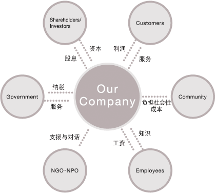

本文为首发于公众号@虹线 如您阅读后感觉有信息量，请在这里[订阅](https://1q43.blog/follow-me)。

也许在十年后回看，2021 年会是这个特殊时代中十分平凡的一年。

随着疫情第二年结束，许多悬浮的状态成为了日常，无论是从个人生活、工作，还是从国家经济、政策，亦或是在地缘政治与国际形势上。

没有人再把疫情当作一种临时性的变量，而是将其当作一种常量，去构筑未来的新常态。

在这一年里，人类社会集体作出了许多有可能会彻底改变未来，但如今看来语焉不详的决定，我们无法预测未来只能回顾过去，并在过去的纹样中找到历史的分形。

在过去一年里，我们在互联网上目睹了更多的争端，无论是个人对个人的，个人对机构的，机构对机构的，机构对机构的，国家对机构的等等。一如我在 2020 年发布的《[互联网是人类历史的一段弯路吗？](http://mp.weixin.qq.com/s?__biz=Mzg5NDY4Nzk1MQ==&mid=2247486785&idx=1&sn=92461b367d4d2ffd9a78c1444032dcaf&chksm=c01a82e1f76d0bf7dd9d8f93f4ccd001ae388a8db4506d9d97b8769779d24f8eabbf0a68efc3&scene=21#wechat_redirect)》中所提到的。互联网赐予了每一个个体舆论上的核武器，使得互联网上的舆论战争达到了白热化的阶段。

时至 2022 年，这种舆论战争已经开始影响现实世界，许多个体、公司甚至是基层政府在焦土一般的社交媒体战场上被误伤至灰飞烟灭，他们要么被封杀，要么被抵制，要么被撤职，他们中的许多原本“错不至死”，但在舆论的全面中每一次争论都意味着一批死刑。

在短暂的，瞬时的，破碎的争端中，对立的阵营却越发清晰。保守主义与进步主义的对立，社会主义与资本主义的对立，民族主义与国际主义的对立。

但实际上，中国现在面临的唯一真正的危机，是一个现代性危机。也即现代性，与后现代之间的对立。而当下社交媒体上的大部分争论，都只是这种对立的分支。

在解释什么是现代性，什么又是后现代之前，我们先来具体描摹一下现代性危机的状态。

尽管并不是所有人都对现代性危机感兴趣，但实际上我们每个人都对这个危机十分熟悉。在过去的一年里，我们看到了许多热搜，都有现代性危机典型的影子。

其一，是躺平，2021 年开年，中国大陆的年轻人开始“躺平”成为了最大的热点，随之又成了一个不可讨论的问题。这是最有代表性的，因为我们都曾在《在路上》里读到过 60-70 年代的美国年轻人是如何躺下的。也曾在 5 年前嘲笑过日本的“低欲望社会”和台湾地区的“小确幸”。

其二，是直播带货的频繁翻车，让许多人拍手称快“收智商税的终于倒了”，但另一方面也让他们咋舌：“这些收智商税的怎么能这么赚钱？”

其三，则是在短视频时代，一方面越来越多“抽象网红”崛起，另一方面越来越多的“封建文化”正在复辟。两种文化现象都让受教育良好的典型市民阶层感到困惑且不适。

其四，则是内卷，与躺平本身构成了时代上的对立，一边似乎有那么一部分人成功躺平了。而另一边，似乎有更多人卷得不可开交。这让人感到困惑，究竟是什么驱动那些内卷的人无法躺平。是什么塑造了他们的焦虑与压力。

如果抛去“现代性”与“后现代”这种不讲人话的大词，本文实际上主要描述下述四个领域的变化：

1.  直播带货的政治经济学
2.  “抽象网红”与“封建文化”的兴起，满足了什么？
3.  年轻人为何，以及为何能躺平？
4.  教育与工作内卷的实质是什么？

但描述这四个领域，只是对现代性问题的一种“举例说明”。

本文的核心目标是试图解释：**为什么作为整体性的人类社会仍在进步，而个体却越发地难以从中受益，或越发难以感受到这种受益？**

本文的最后一节“总论：中国现代性的得与失”中，我试着回答了这个问题。如果你对以上四个命题没有兴趣，也可以直接阅读这一节获得本文的概要。但这将使得那段论述变得空洞无力，因而我不建议这样做。

**本文大约 75000 字，阅读需要 188 分钟，由于存在主动或被动删稿风险，在获取全文后请先行保存。**

## **0\. 什么是现代性？**

描述问题，首先要定义问题。

但一如赤潮AKASHIO往年的年度叙事稿件一样，我们再一次选择跳过定义这个环节。

在本文定名为《中国互联网与后现代性呓语》时，本文的编写组内部也爆发了一场关于“什么是现代性”和“什么是后现代”的争论。最终，参考《垄断的困境》写作中跳过对垄断的定义的做法，我们决定放弃这种无意义的争论。

清华大学人文学院教授，博导汪民安撰写的《现代性》一书的导论第一句话如此写道：

“没有哪个词比‘现代性’这个词的解释更加纷繁多样的了。”

但实际上，本文会倾向于使用“现代性是一个历史范畴”这种说法来定义现代性，并据此来定义后现代行为。

具体来说，本文所提及的现代性指“自文艺复兴至二十世纪下半叶（大约 60、70 年代），欧洲社会的政治、经济、文化和生产关系的总和”。

我们可以将“历史范畴”通俗地比喻为“解题思路”，如果人类社会的发展是一道一步一步计算下去的数学题，那么某个历史范畴可能就是大题其中的几个步骤。

这意味着虽然我们定义现代性这个“历史范畴”时，使用了“欧洲”这个地域标签和“文艺复兴到二十世纪下半叶”这个时间范围。但实际上，这些标签仅用于定义“现代性”本身。

被定义好的，作为“历史范畴”的现代性，就像是数学中的洛必达法则一样，它可以出现在任何一道数学题中，也可以出现在没有经历过文艺复兴的美国，也可以出现在没有典型工业革命的东亚。

在这个历史范畴中，现代性伴随着现代化和资本主义而发展。因此，它通常还代指对客观真理、理性、同一性、科学技术和人类社会普遍进步的认同，后现代则代指这些名词的反面：相信主观推断、感性、个性、非科学文化和对社会整体进步正当性的质疑。

这并非选取了一个欧洲中心主义的解法，而是因为东亚现代性至今仍在形成的过程中，乃至本文都是构成东亚现代性的“中国现代性”的分析之一。因此，只有比对“已经完结”的现代性，亦或者说欧洲中心的现代性，才能更好地突出“中国现代性”的特殊之处。

不过这些学术上的定义都没有什么意义，按照赤潮年度稿件撰写的一贯风格，我们会倾向于给出更为具体的实例。

下面，我们就开始进入第一个部分。

## **1\. 直播带货与现代企业**

## **1.1 直播家族的数字孪生**

2021 年 3 月，快手头部主播辛巴在被平台封禁 90 天后，发出复出预告。

在预告视频里，辛巴带领全体徒弟在镜头前下跪，并宣誓要“接用户回家”。这种在大城市用户看来有些土的视频风格，在中国的二三线城市有着极大的市场。

然而，这其实并不是一种本土化的视频风格，而是一整套本土化的商业逻辑。一切要从辛巴是如何火起来的说起。

中国的主流舆论对快手这一短视频平台有两次祛魅的过程，第一次是自媒体人“X博士”的文章《残酷底层物语：一个视频软件的中国农村》在 2016 年让只知道抖音的城里人突然意识到，在中国的广大下沉市场，还有另一个日活已经过亿的短视频 App。

第二次祛魅，就是快手头部主播辛巴的破圈，让城里人意识到原来那个他们看不起的、农村的、甚至被称为“low”的下沉市场短视频赛道，商业价值远超于他们自己看的那个高端短视频赛道。

辛巴的破圈是在 2019 年，这一年的 8 月 18 日，这个此前从未被主流媒体关注过的快手主播，在鸟巢举办了一场“世纪婚礼”。高达 7000 万的投入，请来了成龙、王力宏、邓紫棋、张良为其演唱，胡海泉担任婚礼司仪、张柏芝亲自送上礼品，明星祝福 VCR 不计其数。

而更令媒体惊奇的是，据称婚礼当晚辛巴就借势继续搞直播活动，两小时营业额就突破了 1 亿元，真的是当天回本。

与 2016 年以前的快手一样，2019 年以前的辛巴在主流舆论中是不存在的。但其实辛巴的带货能力与早就受到媒体所热捧的薇娅和李佳琦旗鼓相当。2019 年全年，仅辛巴一人的带货收入就达到了 133 亿。而众所周知，辛巴并非单打独斗，他是有家族的。

与其他平台的主播不同，快手上的头部主播们按照“家族”、“门派”分为了几个巨大的势力阵营——辛巴818、散打家族、716牌家军、驴家班、丈门、嫂家军等。

由于缺乏系统性的追踪报道，主流商业媒体往往仅在一些节点性事件上对这些家族浮光掠影式的报道。

比如，在辛巴遭遇假燕窝带货事件之后的负面报道中我们看到，此前在直播中，辛巴的徒弟（同家族其他主播）会向辛巴下跪并管他“叫爹”。

这种看上去形如封建残余的行为，往往会让自诩属于现代社会的城里人感到极为不适。

然而，这却忽略了一个基本的问题：如果辛巴及其他类似家族仍在使用封建模式组织生产，为什么他们能够与现代化的、企业制的、理性的薇娅和李佳琦在商业上“打个平起平坐”？

受过朴素马克思主义政治经济学教育的我们都知道，生产力与生产关系相互掣肘。

如果这种主播的使徒制真的是一种落后的模式，那么为什么辛巴直到 2020 年末陷入假货风波之后才放缓了增长，而不是早早地就在市场竞争中淘汰？

现在，让我们带着理性的批判来聊聊这个话题。

## **1.2 作为商品的“人”与公司的关系**

抛开土味风格视频（内容）本身不谈，我们接下来要聊的是土味生产方式。

因为从理论上来讲，如果中国的下沉市场喜欢土味视频，而现代企业又是最为高效的生产方式，那么我们应该看到的不是辛巴 818 这样的主播家族，而是李子柒那样的由资本构建的博主——一群受过高素质现代教育的人，依照理性的数据分析和工业化的生产方式，编纂和塑造出一个又一个土味形象。

然而事实上并非如此，在土味主播的世界里，土味是完全渗入到生产关系中的——徒弟要给师傅磕头、下跪，要管师傅叫“爹”，师傅有绝对的权力，师兄又能压师弟一头……

在由市民阶层主导的主流舆论看来，这毫无疑问是一种封建糟粕。但正如我之前所说，从纯粹的数字来看，这种看上去落后的生产关系却创造了与先进生产关系相似，甚至更甚的经济成果。

这实际上是由于，这种师徒制解决了直播、短视频、甚至是明星行业一直以来存在的一个问题——人与公司的冲突。

简单描述一下这个冲突就是：当一个主播火了之后，他往往想要单飞，而公司却又留不住他。

这个问题不仅存在于中国，在外国，红人经济也面临着同样的困境。甚至在互联网诞生之前，艺人与经济公司的纠纷也是这类问题的前身。

明星/网红本身是人，但明星亦是一种商品，明星的经济价值来自可售卖的商品性，而人又是构成这一商品中最为不可控的变量。这是此类纠纷频发的浅表原因。

从深层次来剖析，如果我们真的将明星、网红或主播看作是一个“产品”，那么在这个“产品”中，各生产要素的构成是什么？

用俗话来说，面包公司要售卖一个面包，面包的生产要素有工人的劳动（劳动要素），机器的投入（生产资料要素），面粉的购买（资本要素）甚至是关于面包需要做成什么口味的调研报告（数据要素）。

那么，明星是由什么生产要素构成的呢？

大多数人往往第一时间想到的是，在明星这个产品中，最重要的要素一定是人本身。的确如此，一个主播或明星不管有多少粉丝，团队策划的内容有多么逗趣，经纪公司找来了怎样的资源支持，一旦其本人不再愿意出镜，他/她的影响力或经济权益都将无法继续维持。

但从生产的角度，人所代表的“劳动”却并非明星这一商品中最主要的生产要素。

对作为商品的明星来说，公司将明星运作进选秀、综艺节目、为明星铺稿、投放广告、与更红的明星组合、让明星带资进组等，都是劳动以外的生产要素。对作为商品的主播来说， MCN 买量，付费与其他主播互动，对接商务资源，批量策划脚本，专业的摄像也都是网红自身劳动以外的生产要素。

我们经常会听到某些明星或主播的粉丝谈他们的正主早前有多么努力（劳动），但在娱乐圈和直播行业努力打拼的人不计其数，而最终获得成功的反而是少数。

因此，我们很难衡量一个主播或一个明星在成名之后，究竟有多少要归功于这个人本身的努力，又有多少要归功于劳动以外的资本扶持。

炮制网红的 MCN 公司和培养明星的经纪公司，是在以极低的良品率生产一种“影响力节点”商品。

而网红或明星本人，只是节点中的凝结核，没有他/她/它（猫狗，虚拟偶像），作为商品的“明星”不会诞生。但作为“明星商品”的一部分，明星这个人本身只占极小一部分。

于是，张力产生了。

在现实中，主播往往认为早期的创意是自己的，策划是自己的，辛辛苦苦，起早贪黑拍视频做直播的也是自己。为什么在火了之后，MCN 公司却要为仅仅一点点的流量扶持和商务资源而侵占绝大多数的利益呢？

但从 MCN 公司的角度，公司均等地为所有签约主播提供服务，本质上是一种风险极高的投资。如果 MCN 公司同时孵化 100 个主播，只有 1 个成为了头部。那么 MCN 公司一定要从成功主播那里，索要回浪费在另外 99 个主播上的成本，才足以让这门生意勉强不亏本。

而实际情况是，没有任何一家公司只想做勉强不亏本的生意，因此当他们终于成功地孵化出一个网红时，更有可能会极尽所能地对其压榨。这也是我们看到为什么有那么多的主播仅仅红极一时就与公司冲突，然后便不欢而散。

成功出名的网红主播认为自己只获得了一分，公司要一百分，这不公平；公司认为自己投出了一百分，收回两百分，这也不违反商业道德。

这便是网红/明星与MCN/经济公司之间矛盾的根源。

为了解决这一问题，这两年直播界其实探索出了另一种经营方式：夫妻店。

即，网红火了，嫁给或娶了 MCN 老板。也即，MCN 孵化 100 个主播，1 个成为网红，然后老板娶/嫁了这个网红。

我们抛开这种模式作为社会新闻谈资的余韵不表，可以清晰地看到，在这个链条中，网红与 MCN 的经济契约，转化成了网红与老板之间的自然人社会契约。

这种关系的转化，带来了超越经济的社会契约，他使得网红这个被异化的“商品”，回归了人的属性。

MCN 公司（老板）与这个自己为之付出的个人，达成了人与人之间的社会契约，而不是“投入、生产、回报”的经济关系。在传统网红与MCN之间那种公说公有理，婆说婆有理的利益分配矛盾瞬间瓦解。

而又由于婚姻契约在一般传统意义上意味着对彼此的完全拥有，因而这甚至形成了一种合力：网红拼命直播，老板拼命跑商务，为的是共同的幸福。

不过，这种转化并不总能成功，因为它其中蕴涵着强迫的封建色彩。网红与MCN公司之间的张力，在成功转化为婚姻关系之前，某种程度上如同包办婚姻的“封建父母”，这可能给双方都带来不幸。

比如，2021 年杭州网红项思醒与其 MCN 老板的 68 页 PPT 情感纠纷，就是这种不幸的体现。MCN 老板张科峰一直以为两人是“水到渠成”即将结婚，而网红项思醒则觉得两人是纯粹的工作上下级关系，张科峰指责项思醒是女海王，项思醒指责张科峰是职场性骚扰和 PUA。

尤其是在倡导自由恋爱的现代社会，任何情感以外的，影响婚姻关系的行为都会遭到普遍地谴责。

因此，夫妻店也许是网红直播界最好的“经营模式”，但却并不是情感界最好的“经营模式”。

相比之下，辛巴及类似快手家族所使用的师徒制度可能更趋于完善。

## **1.3 辛巴的网络师徒制对在哪？**

那么，接下来我们就来看看，师徒制生产关系是如何在网络直播行业中应用的。

在直接切入之前，我们还需要绕个小路去了解一下数字孪生的概念。

数字孪生本身是一个工业互联网概念，它是指利用物联网、传感器、大数据等技术，在云端或是说在互联网上塑造出一个与物理产线对等的数字产线。通过这个数字世界的孪生镜像，我们可以更好的去观察和调整整个工厂地运转。

对于个人而言，我们的社交网站帐号亦可以被视为一种数字孪生。我们主动地分享与发布，使得我们能从社交网站帐号去观察一个人的生活。但事实上，数字孪生又与现实中的工厂或我们不完全一样。

比如我们在过去几年里，我们经常讨论“人设”和“人设崩溃”，其实就是一个人的数字孪生在后续的发展过程中，与它在现实世界中的映射发生了较大的偏差，并被人揭穿。

辛巴的师徒制，是一种数字孪生的制造机制。

一般来说，我们个人的数字孪生或者人设，尽管在发展过程中受到资本、大众互动的影响，但其最初往往与物理世界的我们自身是有着紧密联系的。

但对于辛巴的徒弟们来说，并不如此。

辛巴家族中的主播在成为辛巴的徒弟之前，他们的数字孪生几乎是不存在的，其中一些人甚至此前并非网络主播，而只是一些小地方不务正业的社会青年。

此前曾有媒体称“在辛巴的描述中，辛选家族中大部分徒弟都是没爸疼没妈爱的边缘人，这个社会没有亲人支持他们，只有辛巴认真对待他们好，离开了辛巴他们啥都不是。”<a href="https://1q43.blog/post/782#cite01">[1]</a>

这些社会青年之所以在一夜之间，拥有了几万、几十万的粉丝，并能够开始与其他大主播“平起平坐”地互动、开直播卖货，完全依赖其作为辛巴徒弟所受到的“提携”。

因此，这些人下跪、拜师、管辛巴叫爹的过程，尽管充斥着令现代人厌恶的父权与封建色彩，但在某种程度上，确实是一种“数字孪生诞生”的过程。在此之前，这些人的数字孪生完全不存在于世上，在此之后这些人的数字孪生得到了辛巴家族粉丝的认可。辛巴成为了这些人“数字孪生”在字面意义上的“父亲”，而主播之间也在一夜之间成为了“兄弟姐妹”。

与“签约-资源投入-回报”的商品生产逻辑相比，这一过程更像是“大户人家生了少爷/小姐”的家族逻辑。

在大多数辛巴徒弟的走红过程中，许多粉丝直接来自辛巴（父亲）或辛巴之前的徒弟（兄弟姐妹）。辛巴在线认徒现场，与欧洲和中国古代，封建家族子女成年时在更广泛社交场合的初露面极为相似——“这是我承认的子嗣”——是一种继承权确权的过程。

尤其是在这种师徒之下，所有的主播管观众叫“家人们”，更加加剧了观众自身对这一过程的参与感。

抛开其封建色彩本身，这带来两个非常显著的竞争优势：

**其一，是比起商品生产的资本逻辑，它显著降低了孵化一个新网红/主播的成本。**

这也是短视频平台，厌恶师徒制的原因之一。在师徒制下，影响力（流量、粉丝）在主播间的代际传播不受平台控制。除非平台主动降权斩断师徒制的传播链条，否则家族类主播孵化新主播，是不需要像其他的 MCN 公司那样购买大量平台广告的。

**其二，它在一定程度上解决了主播个人与MCN公司（家族）之间利益矛盾的问题。**

由于新生主播的影响力是由拜师、师徒互动、师兄弟互动遵循“社会关系”逻辑，而不是“公司给你买量”、“公司给你对接资源”这种资本逻辑。因此新生主播对整个家族欠下的是“情感债”而不是“资本债”。

资本债是可以精算，可以偿清的，但情感债却不可以。

与 MCN 签约的主播，可能在自身对利益的计算或公司对利益的算计下选择解约，并演变成相互指责的撕逼大战，但师徒制下的徒弟却绝无这样的机会。

受到“一日为师，终身为父”的社会风俗影响，“徒弟”离开“师傅”往往会导致其影响力一落千丈。

这是由于，在这种孵化模式下，每个主播的早期核心粉丝，都是直接从上一代主播那里继承而来。用通俗的话讲，“我是看在你师傅的面子上，才关注的你。现在，你连师傅都背叛了，我怎么还会帮你呢？”

事实上，在厘清了直播家族制的本质是数字双生的塑造这一核心之后，我们真的很难指责这种制度是一种封建残余，因为它真的比公司制更好地解决了网络直播行业最本质的矛盾。

它用一种虚拟的家庭关系，将资本方（父）、人（子）、消费者（屏幕前的家人们）圈成了一个利益共同体（我们大家族）。在利益共同体的内部，资源分配的效率没有明显下降，但利益分配的公平性却优于市场逻辑，并且利益共同体的稳健性也得到了显著的提高，得以不断壮大自己抵御外部资本（平台）的盘剥。

当然，这也不是全然没有坏处，现代企业的优势之一是风险控制。而对于师徒制来说，由于利益共同体内部关系紧密，十分容易出现一损俱损的现象。

比如说，导致辛巴元气大伤的“假燕窝”事件缘起于辛巴的一个徒弟而不是辛巴自身。但“子不教，父之过”与“一日为师，终身为父”同属师徒制的内在要求，因此辛巴在事件风波之初无法像其他网红公司那样“道歉，开除，切割”，只能为徒弟辩护（狡辩）进而也同时毁坏了自己的商誉。

但我并不觉得，这会是师徒制的根本缺陷。如果能在这种师徒制度中，引入更多现代化的治理手段，是完全可能避免这种风险出现的。我们将在下一章节谈到这一点。

如果现代性指的是我们要用工业化、世俗化、理性化的方式去推动社会的高效运转，我们就应当承认在直播这一领域，脱胎于传统封建师徒制的发展模式，远比所谓工业化、世俗化、理性化的“现代企业管理制度”更为高效。

然而，亦如李子柒，这种赛博家族制度得以存在的基础仍是高度现代化和数字化的当今世界。因此，这种赛博家族制度也是前现代性碎片在现代社会的发展，而不是简单复辟，是后现代的一部分，而不是前现代的。

## **1.4 独尊现代企业制度可能是一种迷信**

中国直播领域师徒制的发展，提示了我注意一个问题：

中国的主流舆论对师徒制、家族制等制度存在极大的偏见，又对现代企业管理制度有着极大的迷信。

在关于快手直播家族的报道中，几乎找不到任何正面的报道，甚至没有人愿意去客观地分析师徒制成功的因素。因此，尽管这些批评报道自恃是理性的，代表现代社会道德观的，但其出发点却是非理性的，不够客观的，前现代的。

与之类似的另一个更宏观的现象，是中国舆论对家族企业的污名化。

在改革开放之后，家族企业一直被认为是一个贬义词。因为它与现代企业制度几乎完全相反。

现代企业制度（modern enterprise system），是指在现代市场经济条件下，以规范和完善的法人制度为主体，以有限责任制度为核心，以股份有限公司为重点的产权清晰、权责明确、政企分开、管理科学的一种新型的企业制度。

而在家族企业中，血缘与亲情这种非科学、非理性、非权责分明的因素却占有极为重要的地位。

然而，认为家族企业组织形式并不重要，是一种现代化的骗局。

家族企业仍是这个世界上最重要的企业组织形式，美国学者克林·盖尔西克认为“即使最保守的估计，也认为家庭所有或经营的企业在全世界的企业中占 65% 和 80% 之间，全世界500强企业中有50%由家庭所有或经营”。

作为改革开放至少前 30 年重要学习对象的美国和日本市场中，家族企业都扮演极为重要的角色。根据统计，家族企业占据美国 GDP 的 64%，创造该国 62% 的就业机会<a href="https://1q43.blog/post/782#cite02">[2]</a>。在日本，家族企业占据更主要的位置，我们所熟知的松下、本田、丰田、三井等，都是家族企业。

这其实并不难理解，因为现代企业管理制度本身就是一个极为现代，仍在不断自我修缮和验证过程中的制度。现代企业管理制度存世的时间，远远短于企业存世的历史。

14 世纪起，欧洲开始出现工场手工业，这被称为是资本主义的萌芽，资本和企业正式在人类历史的舞台登场。四个世纪后的 1769 年，人类历史上的第一个现代企业由理查德·阿克莱特在英国诺丁汉创办。

但直到 20 世纪末，被称为管理学之父，现代企业制度之父的彼得·德鲁克才首次完成对现代企业管理制度的归纳和总结。而彼得·德鲁克对家族企业的看法也十分谨慎，到其非常晚年，也就是 1995 年出版的《大变革时代的企业管理》中，才提出了对家族企业的管理原则。

在这本书中，彼得·德鲁克写道：

> 世界各地的大多数企业，都是由家族控制和管理的。……然而，管理书籍和管理课程几乎完全涉及公有和专业管理的公司——它们很少提到家族管理的企业。

德鲁克给家族企业总结了三个准则：

1.  家庭成员不能在家族企业工作，除非“他们至少和任何非家族雇员一样有能力，并且至少和他们一样努力工作”。
2.  无论有多少家族成员在管理企业，一项最高职位“总是由一个不是家族成员的局外人担任”。
3.  除了小型家族企业外，公司和组织中的大多数成员“越来越需要为关键职位配备非家族专业人士”。

在本书面世的 27 年后，也是彼得·德鲁克逝世的 17 年后，并没有很好遵守这三条规则的老牌资本主义国家的家族企业，正如上文所列举的数据所描述的那样，变得更加强大了。

而相反，自以为“弯道超车”，从最初就选择了“最科学”、“最理性”、“最现代”管理方式的新中国第一代民营企业，正在面临非常令人沮丧的接班人问题。

中国在 1978 年改革开放之后逐渐有了私营经济，在 1992 年全面施行市场经济之后有了大量私营企业。

能在大浪淘沙中活到现在的第一代中国企业是非常可敬的，但无论是 1984 年成立的联想，1984 年成立的海尔，又或者是 1987 年成立的华为，都面临非常尴尬的接班人问题。

这其中又以联想最为明显，联想创始人柳传志曾在 2004 年也就是 60 岁时“准时退休”；2009 年，柳传志重回管理一线拯救困于危机中的联想；2011 年，柳传志辞任联想集团董事长一职，专注母公司联想控股的管理；2019 年 12 月 18 日，75 岁的柳传志才终于得偿所愿的正式退休。

当然，还有许多其他的例子。

整个 90 年代诞生的中国企业家，由于受到当时盛极一时的全盘西化和现代企业管理理论的影响，几乎都不曾设想过让自己的血亲接班这件事。

即便是排除那些“无能”的富二代，许多企业家也执意将自己极有天赋的子女培养成了艺术家，科学家或文学家，而没有在他们的人生规划中将“接班”作为最重要的优先事项。

这一点，在中国最成功的那些第一代、第二代民企中最为明显，因为这些民营企业之所以能在改革开放初期的激烈竞争中胜出，正是因为创办这些企业的创始人比别人更全面地吸收和运用了现代企业管理理论。

然而，这种全面的吸收，或者叫“全盘官僚制（科层制）”，也造就了他们如今的接班人尴尬。

这些企业家一心想要将自己亲手创办的企业，直接交给职业经理人管理，却忽视了职业经理人制度往往是家族企业无法正常传承时才会选择的下下策。在实践中，西方的家族企业，除非血亲无法胜任工作或没有适龄血亲，否则是不会随意启用职业经理人作为企业的第一负责人的。

因为正如主播与 MCN 之间的利益冲突一样，职业经理人也不会将任何企业当作自己终身的事业。他们的人生目标与企业的长远目标（如成为百年企业），往往并不一致。

尤其是对于大型上市公司来说，职业经理人既不是商业逻辑中的“大股东”，也不是精神上的“公司创始人的后代”，实际上是公司“完全的他者”，一个“随时可以离职的职工”。

职业经理人的基础逻辑是为自身牟利，为公司牟利只是为自身牟利的路径。而血亲继任者则承担着为家族（企业）牟利的道德责任，其次才是为自身牟利。

而将基业长青的百年愿景，寄托在一套制度上本身就是“非理性”的，因为现代企业管理制度诞生到现在甚至都还没有超过百年。

我们都记得当比尔·盖茨完全退出微软的时候，企业遭遇了怎样的阵痛，而苹果至今仍在这样的阵痛之中。彼得·德鲁克在 20 世纪末所提出的关于家族企业的管理原则，至今事实上仍在验证当中，不应被奉为圭臬。

过分地强调了经济契约在现代社会中的作用，可能是中国第一代、第二代企业家所走过的一段弯路。

毕竟，避免“任人唯亲”与倡导“举贤不避亲仇”实际上并不矛盾。

## **1.5 CSR 与儒家五伦**

事实上，我们发现，从前现代社会中寻找改良现代企业运作的方法，可能是一种非常合理的路径。

其取决于我们是基于现代性思考批判性地吸纳前现代社会的实践经验，还是试图“复辟”前现代社会实践。

在 2021 年，诸多大型公司受到了“铁拳的制裁”，而其日常的社会价值探索和企业社会责任机制也并没有起到良好的作用。这可能就是上文提到的，企业在全盘官僚化的过程中，走了一些弯路。

中国的企业并没有意识到自己在对什么样的社会负责，而只是大干快上地抄起了 CSR 和 ESG 的作业。

1924 年，美国学者 Oliver Sheldon 在其著作《管理的哲学》中，首次提出了“公司社会责任”（Corporate Social Responsibility）。这是目前业界可查的，最早的关于 CSR 的描述。

30 年后，被称为 CSR 之父的 Howaard R.Bowen 出版了《商人的社会责任》一书，CSR 理念正式进入公众视野。

企业社会责任强调企业除了为股东（Stockholder）带来利润之外，也应该考虑相关利益人（stakeholder）的利益，典型的利益相关方包括员工、管理者、供应商、政府、顾客、媒体等。股东与企业管理者仅作为内部利益相关者，是企业需要对其负责的角色之一而非全部。

图源：mbalib

利益相关方框架是没有问题的，但只对“利益相关方”会让企业在做出一些决定时忽略“利益不相关方”。

最简单的例子，网约车之于老人。

根据上面的经典利益相关方分析，老年人可能只是弱势群体中的一个子集，并且由于它与公司和业务的潜在客群过于不相关，因此很多互联网企业都在其发展中忽视，甚至侵犯了老年人的利益。

老年人难打网约车这个问题，不是由网约车公司主观恶意造成的，它只是技术应用发展的一个客观的结果。但由于老年人群体在商业领域确实不是一个高净值人群，在网约车公司的利益相关方框架里，会忽视老年人群体的存在。然而，当网约车成为主流后，在大街上扬召出租车又会变得困难，客观上侵犯了老年人的利益。

网约车提升了城市路面运输的效率，为其潜在客户（可能是总需求的大部分）带来了便利，提高了就业降低了车辆空驶。这些都是网约车这个产品形态存在的正当性，我们不应当因为它忽略了老年人的利益而苛责网约车业态。但网约车行业确实需要拥抱老年人群体，才算尽责地履行了自己的社会责任。

也许在网约车公司中，会有一些个人在发展的过程中意识到这个问题。但我们知道，依靠个体道德的驱动力对抗整个商业社会的利己性总是螳臂当车。甚至对于具体的某个公司来说，甚至会否认这种道德上的指责，因为依照传统的 CSR 框架，他们认为自己已经做得非常好了，“对社会非常负责”。

最理想的状态，是我们需要一种新的分析框架来帮助企业，或者说中国的企业判断需要向哪些主体负责。

在这个时候，中国传统社会中的“五伦”会是一个重要的参考对象，也就是花木兰里被吐槽的那个“忠、孝、悌、忍、善”。先别急着骂人，我要说的不是这五个字，而是这五个字的位置。

“忠、孝、悌、忍、善”是古代中国人用于描述当时社会五对主要人际关系的词，它对应的是“君臣、父子、兄弟、夫妇、朋友”。也就是说，“忠、孝、悌、忍、善”是“君臣、父子、兄弟、夫妇、朋友”这五对关系的理想状态，至少在古代是。

我们不必再遵循“忠、孝、悌、忍、善”，但仍应思考企业如何处理“君臣、父子、兄弟、夫妇、朋友”之间的关系。

在儒家理念中，五伦覆盖了古代中国人日常最需要关注的五个关系。你会发现，在这里面，与脱胎于启蒙运动后西方社会形态的CSR有着巨大的区别。这可能是导致CSR的利益相关方模型在中国失效的重要原因之一。

举个具体的例子，如果你看过星巴克掌门人霍华德·舒尔茨的创业自述《勇往直前》就会发现，星巴克在CSR中的一个最重要的维度是“社区”，这甚至是他创办星巴克的最初原因之一。

简单来说，曾在美国贫民窟生活成长的舒尔茨一直希望能够创办一家企业，这家企业能为美国贫民窟中受教育程度较低的年轻人，提供一个体面的、可成长的工作，斩断这些贫民窟不断扩大的宿命。

这个使命确实很伟大，如果你从头到尾读了那本书，甚至真的能理解为什么星巴克足以被称为一家伟大的企业。但问题是，星巴克所“押注”的这个“利益相关方”群体，在中国几乎从不存在。

抛开“小区”不说，“社区”一词的文化概念，是指“聚居在一定地域范围内的人们所组成的社会生活共同体”。但中国自古以来，就没有这种社区的概念，由于没有经历过美国西部淘金热、欧洲民族大迁徙和一次工业革命时的农民脱离土地等过程。在中国的土地上，传统意义上“聚居在一定范围内的人们”所构成的一般是“宗族”而不是“社区”。

如果仍不能理解，你就想想看中国地图上，那么多张屯、李村、王家坡。也就是说，中国地图上聚在一起的人，大多数都是有血脉关系的。像“社区”这种，既生活在一起，又没有紧密血缘关系的社会形态，本身在中国就不常见。

因此，许多生活在钢筋混凝土丛林里的年轻人说“中国失去了社区氛围”，这是完全错误的。

中国从来不曾存在那种西式中产阶级所向往的社区氛围，而真正本土的“社区氛围”又或者说“宗族”或“乡村式熟人社会”，又绝对不是年轻人受得了的。我们在这里，也不是想要恢复或夸耀宗族，宗族和乡村熟人社会也需要现代化改造，关于这一点，我们可以在 2.11 中谈及。

回到星巴克的例子上，在中国，一家企业，无论是现代还是过去，都没有责任为陌生的“社会底层”提供救济或工作机会。如果它做到了，那它只是锦上添花，除了被它救济的人，别人不会因此对它产生太大的好感。

然而，在五伦的作用下，中国的企业却会有另一种责任，那就是“振兴家乡”。按理说，企业是没有家乡的，但企业家有家乡，而且这种对人的道德要求也会投射到企业家所创办的企业上。我们经常会看到一些知名企业家在异地创业成功后，回家乡投资，此时整个家乡的从民间到政府都会夹道欢迎满面生光。

而那些没有，或还没来得及回馈家乡的企业，也总会被家乡政府在各种场合酸溜溜地提到“本县走出了XXX等知名企业”，仿佛在催企业家“回家看看”。

这是由中西方完全不同的社会构建过程所导致的，也是不同的前现代社会塑造了不同的现代社会。

对西式CSR框架的这种“生搬硬套”，往往会让中国企业在CSR领域花费巨大却收效甚微。

我并不认可我们要重申“五伦”所倡导的人际关系，因为正如2021版《花木兰》在国内受到的恶评一样。“忠、孝、悌、忍、善”在当代社会已经不再受到年轻人的认可，因此重点不是“忠、孝、悌、忍、善”，而是“父子、君臣、夫妇、兄弟、朋友”。

前者是中国古人认为后者五种关系的理想状态，当我们提及五伦时不是赞扬古人定下的那种理想状态，而是要重视那五种关系本身。

尽管在现代社会，我们的人际关系不再只是这五对，但事实上在前现代中国人们也会将家庭以外的关系简化为家庭关系。在夏光的《东亚现代性与西方现代性》中曾写道：

所有非家庭关系（如君臣关系和朋友关系）都可以在这五种关系中找到与其类似的关系。例如，父子关系（和君臣关系）还可以延伸到师生关系、师徒关系、上下级关系、雇主和雇员的关系以及年长者与年轻人的关系等，而兄弟关系（和朋友关系）同样可以延伸到邻居关系、同乡关系、同事关系、同学关系以及由此类推的其他形式的熟人关系。不仅如此，在儒学世界中，人们还会自然而然地把各种非家庭的社会组织村庄、行会、学校、寺庙、国家乃至黑社会等一一都看作是与家庭类似的。的确，在儒学世界中，人际关系或多或少被简化为家庭关系。

比如996这个问题，在中国就一直存在一个比较奇怪的现象，那就是痛斥996的往往都是没在996的人。因为虽然在一家公司内996是没有选择的，但总还是有不996的工作可以选择。而一个人，既然已经选择了996，他其实在很大程度上已经认可了自己是用更多工作时间换取相对高于同行的工资。

因此，996的人，与996的企业之间，实际上形成了利益协同效应。企业无论怎么在企业内调查，都会发现员工其实还是蛮喜欢996的（只要给够钱）。这在传统的CSR框架里会认为，员工这个维度首先是想要赚更多的钱，996在很大程度上实现了这一点。那下一步，就会变成“如何让员工健康的996”。所以你看到那些996公司，一般不仅工资比同行（不996）的要好一些，连一些额外的福利也更好，比如免费的早中午健康餐、健身房、淋浴服务、按摩推拿服务甚至商业二次保险等。

但无论企业如何增加福利，员工的父母、夫妻、子女、朋友，可能都不满意。而这些人，并不是企业的“利益相关方”。由于员工“自主”的选择了996，甚至可以说是员工主动帮助这些人与企业切断了“利益相关关系”。

这就是“利益相关方模型”与“社会关系模型”之间的区别，利益相关是人或企业的主动被动的选择，而中国传统社会关系则包含着大量无法剪断的缘分。

我们可以改变这些缘分的缔造机制（去封建化），但斩断缘分本身在现阶段仍是不可能，甚至不应该的。

## **2\. “文艺复兴”还是“封建复辟”？**

## **2.1 无法被对象化的郭老师**

2021 年 9 月 2 日，千万级粉丝网红郭老师的抖音账号被永久封禁。郭老师在微博小号发出抱怨，随即微博等其他账号也均被封禁。郭老师的时代正式落幕。

与其他拥有相似影响力的网红或明星被封杀引发的热度相比，郭老师的赛博死亡与她的影响力完全不般配。

在微博、知乎、微信公众号等以图文为主的平台上，郭老师的影响力非常弱。在这些平台上，有些人是在郭老师被封杀后才听说的她，以为她只是又一个资本运作下的扮丑网红被铁拳砸了，对此更是漠不关心。

更多的人表示，从来没有听说过郭老师。

但在抖音、快手、B站等视频平台上，郭老师在过去 3 年里的影响力甚至远超许多拥有亿级粉丝的公众明星。

怎么能向从不刷短视频的人，说明郭老师的影响力呢？你可能没有听说过郭老师，但一定听说过郭语。

在表示惊叹的时候说一句“耶斯莫拉”，把草莓说成“粗煤”，把姐妹们说成“集美们”。这种在过去 3 年短视频平台里最流行的一种异化汉语，正是出自郭老师之口。

如果你对这种语言的流行程度表示质疑，那么你应该去问问 00 年以后出生的年轻人，在他们那里即便是不刷短视频，不看郭老师的人，也一定听说过郭语。就像是火星文、非主流之于 80 后和 90 初，或加入、或仰慕、或鄙视，但绝无可能没听说。

郭老师创立了郭语，但不止郭老师在使用郭语，郭语广泛地被年青一代群体使用。

但郭老师的魅力，与非主流和火星文又截然不同，因为她极难被定义。

在郭老师被封杀的很长一段时间里，我都在等待一篇严肃媒体对郭老师盖棺定论式的总结报道，寻求相对官方或相对严肃语境下对郭老师的准确定义。最值得一读的是中国青年报写的《网红“郭老师”消失后》，但与以往盖棺定论式的人物报道不同，即便是这篇 6000 字的稿子，也没有说清“郭老师是什么”或“郭老师为什么红”。

因为，在极度类型化、标签化、人设化的网络时代，所谓经常扮丑的郭老师身上的标签太多了，以至于没有任何标签可以概括郭老师。

-   郭老师会扮丑，会在镜头前发出歇斯底里的怪叫配合“郭语”；
-   郭老师会在直播中突然闻袜子，因为突然就想闻了，就像很多普通人会做，但不会在镜头前做的那样；
-   郭老师会先把某个顶流明星骂一顿，然后再尖叫着跪下给对方和对方的粉丝道歉；
-   郭老师会完全没有偶像包袱的让她的大几百万粉丝帮忙在拼多多砍一刀，她可能是全网唯一通过砍价在拼多多 0 元买到 iPhone 13 的人；

有时，郭老师又会突然被理性的光辉笼罩，说出一些人生哲理，然后下一秒又恢复疯癫对你说：“死不死啊你。”

出生于 1994 年的郭蓓蓓在欠下外债之后，于 2018 年变成了网上的郭老师。

从爆红到封杀，长达三年的时间里，郭老师始终无法被贴上一个现代汉语中简洁有力的标签，以概括她的所有特征。你要研究或批判一个事物，首先要描述一个事物，但描述郭老师是什么本身可能就需要几百上千字。在她被封杀之前，甚至没有任何主流叙事的主导者认为她值得被用几千字来描述。

她除了少数极其出格的扮丑瞬间，大多数情况下，郭老师吸引人的反而是她将那些正常来说绝不可能在公众面前做的事情在公众面前做了。比如闻脚，闻袜子。

就好像是说，我们的生活由吃喝拉撒构成，但在网上我们只会看到吃喝，郭老师将剩下的两个字补全。

这种反标签化，甚至延伸到了商业层面。

尽管拥有千万粉丝，但郭老师没有走上与 MCN 签约进行资本化的道路。她赚钱的方式十分朴素，在直播里直接对粉丝说“穷死了，行行好吧”，或者像是上文提到的那样“集美们，我要换手机了，快来帮我砍一刀”。

就连她被全网封杀，似乎都找不到一个合理的，一锤定音的“缘由”。

2021 年 4 月 25 日，郭老师去南京旅游，与一贯的风格类似她像一个普通游客那样规划了自己的行程，坐火车出发抵达南京，住南京夫子庙附近最便宜的如家酒店，在南京市内出行坐的是地铁。

但失控来的十分突然，有人在酒店认出了她，然后消息迅速在南京本地的郭老师粉丝群传播，人越聚越多堵住了夫子庙附近的路，有人从南京的郊区坐地铁一个多小时前来围观。

造成交通拥堵后，郭老师和家人在警察护送下从酒店后门离开，连夜坐了 7 小时的绿皮火车，回到河北沧州的老家。事后她在直播中说：“我给大家下跪，我很害怕，（万一出了事）我这条狗命都赔不起，你们都是非常金贵。老铁们都散开好吗，咱们该吃吃该喝喝，咱们买点麻辣烫。”<a href="https://1q43.blog/post/782#cite03">[3]</a>

北京师范大学新闻传播学院副教授姜申说，“对于像郭老师这样低学历人群中的明星形象的研究和关注，在学术的语境中，或在主流媒体话语中是缺位的。”

这种缺失，极大程度上是符号学上的缺失。

你在给别人推荐、介绍、描述郭老师的时候，很难用简短的几句话来概括她。就连在中青报这篇尘埃落定式的稿子中，也没能找到这样的表述。

许多人将郭老师定义为“抽象”网红，这恰恰是不准确的，郭老师之所以无法被描述，正是由于她完全无法被抽象。郭蓓蓓没有被抽象成几个标签组成郭老师，而是包含衣食住行吃喝拉撒等人的具体元素以一个整体的形式被搬到了网上。

因而，任何一个评价网红的体系都难以评价郭老师，你永远不知道郭老师的下一个直播或视频要发什么，或突然以何种形式给出带有理性碎片的人生哲言。

因此郭老师成了一个活着的“海贼-王路飞”，一个快抖里的女尼采。

这在如此擅长贴标签的互联网时代是十分罕见的，从这个角度来说，郭老师是个成功的反标签主义者。我们都反感把人标签化，但真正在网络中有影响力，且不被标签化的人，郭老师就算不是唯一，也是极少的几位了。

因为在一个结构化的现代社会里，一个纯然的人是不被允许存在的。

## **2.2 后现代符号的李子柒**

2021 年，因为个人工作的关系，我开始关注中国的文化出海。每天至少要将一半使用社交网站的时间，从微博、抖音、快手，换到 Reddit、Twitter 和 Tiktok。

在这个过程中，我发现了一个并不全新，但确实十分值得一提的现象：墙里开花墙外香。

最典型的有三个，分别是李子柒、原神和中国三流网剧。

其中，中国三流网剧的走红，我们在另一篇文章《[中国三线网剧，正在海外大杀特杀](https://mp.weixin.qq.com/s?src=11&timestamp=1647757129&ver=3687&signature=rKiEHApt2YeZVmbfH-NaR0PlhKtEuo7uIWlfSUKlNMadrgHwSS*-orX*FIskW4cEaxrjjk-Ig9STAuHzkE*oMEWz*VxngvIooGFmhAVHCPJXQmTZyJ1BoerBRTIPN67S&new=1)》做过详细的分析。讨论原神的口碑问题又容易陷入到它是否涉及抄袭的争议中，因此我们独此来讨论一下李子柒。

李子柒在国内的首次“出圈”是在 2019 年年末，那时，中国的网民们首次意识到有一位生于中国，长于中国，并现在仍在中国的视频博主，在 YouTube 上拥有接近千万的粉丝，与美国主流媒体 CNN 类似。仅从粉丝数量来说，更是全面高于中国的整个官方英文媒体矩阵。

但随之而来的，就是微博上铺天盖地的争议。

简要概括无非就是，李子柒制作的农家视频并不能代表目前真正的中国，她迎合了西方对中国农业国的刻板印象，因而这样的外宣网红还不如不存在。

但这种说法显然忽略了，除了 Youtube，李子柒当时在微博也有 2179 万粉丝，在 B 站也有 341 万粉丝。这意味着，李子柒在任何一个平台都算得上是头部博主。与其说她迎合的是西方对中国农业国的刻板印象，不如说她迎合的是人类这个物种对田园美好生活的刻板印象。

这种田园美好生活当然是虚假的，因而她在她的身上出现了后现代的意义。

现代性的特征之一是断裂，即通过理性与科学技术，与前现代社会低效的生产力水平和其所萌发出的压迫性生产关系与蒙昧文化决裂。

而后现代思潮，则是从这种断裂中寻回一部分精神内核的过程。

李子柒满足了人们对进入现代社会前的中国美好部分的向往，但她的实现方式是现代化的，工业化的；她装扮成一个曾经的富农阶级，但只有身为一个自由的、平等的、无奴役关系的工人阶级才有可能达成这一点；她的作品浓缩了封建社会小农经济的文化精华，但这种作品仅在市场经济基础地位得到确立的当下，才得以能被人欣赏。

在 20 年前，甚至是在 10 年前，我们都难以想象李子柒或类似的人获得成功。因为只有充分现代化、工业化、经济发展的现在，李子柒这个来自四川绵阳，家境并不殷实的 90 后女孩，才有机会去实现自己成为或扮演为一个“富农”的梦想。

因此，李子柒的成功在国内引发了巨大的争论，这种争论本身就是后现代思潮与现代性的交锋。

对李子柒称赞有加的人认为，一个李子柒带来的文化传播效果超过了整个中国官媒的外宣矩阵，她为观众带来了理想中的农家之美与内心平和，团结了所有曾经重农主义的亚洲地区。但对李子柒加以否定的人，则质疑李子柒迎合了西方对中国封建社会的刻板印象，也即她本身就是一种封建落后的代表。

然而，封建制度和封建文化是两种完全不同的东西，前者专指在特定生产力条件下人与人之间的关系，这种关系往往有着压迫性。封建文化虽然诞生于封建关系之下，但我们是有能力将生活方式、文化与具体的生产关系进行“脱域”的。

我们先跳开李子柒，转而去关注另一个例子。

在北上广深等大城市，近年来流行一种全新的周边游业态。城市中的消费者，向远郊区县的农村集体农场支付一定的费用，承包一块菜地。平日会有农民来为这些菜地做日常的维护，在播种、收获等关键的时间节点，消费者可以亲自来体验种田的快乐。

如果你向身边家有小学子女的朋友询问，他们大都听说过这种业态。因为作为一种亲子活动这实在是十分完美，只需花很少的钱，就能为小朋友找到一个四季可去的游乐场所，还颇具教育意义和互动价值。

将这个活动抽象来看，消费者缴纳一部分钱，向农场这个“地主”在郊区租赁了一块地，然后还要向农场租赁耕地用的生产工具，最终获得少量的农产品。

但这是对封建农业生产关系的复兴么？显然不是。

因为这项服务被现代化包装为一个商品，一种体验式的商品。在包装之外，作为一个商品，它不存在任何压迫，消费者与农场之间是遵循市场的自由交易原则，平等、自愿、互利互惠地达成了购买与售卖的关系。

事实上，这种业态被称为“休闲农业”，是中国目前许多城市群大力鼓励的行业，因为这种业态能够更好地解决城市周边零散农田无法形成规模种植效应的问题——这些土地原本也产不出多少农作物，但当地农民又渴望赚更多的钱。

在这个业态中，城市消费者获得了归园田居的体验，农民以更高的价格售卖了农产品，当地村镇获得了发展旅游业的可能性，可以说是所有人全都受益了。

李子柒亦是如此，李子柒展现了一个中国古代富农的美好生活，但支撑这一美好生活的恰恰是我们强大的工业化体系和现代商品流通机制。在李子柒历时三个月打造一支精美的螺蛳粉制作节目的过程中的每一天，她吃的都是机械化农业生产出来的柴米油盐酱醋茶。

通过展示这种“落后手工艺”下制作螺蛳粉的过程，她唤起了人们对螺蛳粉这种食物在精神层面的好感。而李子柒所售卖的速食螺蛳粉，则在某种程度上代表着食品工业最先进的水平。

要知道，螺蛳粉的速食化是一个艰难的过程，因为一碗合格螺蛳粉中所需的辅料，比我们常吃的方便面要多得多，详细在这里不做展开，有兴趣的朋友可以自行搜索。

也因此，在李子柒所构建的富农生活中，不存在被压迫的佃户，也不存在被剥削的贫农。她只是文化符号上的富农，不是生产关系上的富农。与之相反，在生产关系上，她甚至比辛巴和其他短视频平台上的土味网红都要来的现代化，产业化。

李子柒与许多后现代符号一样，她利用一系列现代化的手段，满足了人们内心试图寻求前现代社会简单、朴素、自然、慵懒的主观体验。尽管这些体验在真正的前现代社会代表着单调、枯燥、饥饿甚至是死亡。

这种将前现代社会美好一面脱域出来的行为，当然是片面的，但它是否真的值得批判呢？

## **2.3 “封建”的脱域与再嵌入**

在过去的两三年里，舆论场上有两种非常矛盾的声音。甚至在某种程度上，两种声音来自同一批人群：

一方面，我们总是听到对来自本土的，Low的，下沉市场所孕育出的数字内容猛烈抨击；另一方面，我们又总是对出圈后的传统文化内容毫不吝惜赞美。

我曾经思索过，在大众舆论场中，什么算是传统文化，而什么又是封建残余。我并没有从中看出显著规律，但总体来说，当下大众更喜欢阳春白雪——也即曾经统治阶级——的传统文化；而更多地倾向于将下里巴人——也即曾经受压迫阶级——的那部分斥为封建残余。

这似乎与“传统文化”与“封建残余”的字面定义截然相反。

承接郭老师与李子柒，我们接下来想要讨论的问题是：封建文化的脱域与再嵌入为“传统文化”。

脱域，是英国社会学家安东尼·吉登斯提出的学术概念之一。

它是指社会实践不再受到由其所产生的地点、时间和历史背景的限制的一种状态。用知乎上一个[回答](https://www.zhihu.com/question/65413118/answer/306539653)来通俗地解释什么是脱域：[[4]](https://1q43.blog/post/782#cite04)

“在前现代社会中，泼水节是傣族人在特定的时间和空间中举行的活动。而在现代社会中，泼水节从傣族特定的日常生活中抽离出来，可以随时举行。”

其中，随时随地可以举行、不再承担其原有的生产生活意义可被视为“脱域”。而为了能够吸引到更多的游客，在旅游团到访时作为一种民俗展示而呈现，则是与脱域对应的“再嵌入”。

之所以在这里引入脱域与再嵌入的概念，实际是想说明：当我们面对社交媒体上汹涌蓬勃的“封建复辟”和“文化倒车”时，总还是要分辨一下哪些是真正的封建复辟，而哪些则是通过对封建社会文化的脱域和再嵌入实现的传统文化复兴。

如果以是否脱域和再嵌入来定义什么是封建复辟什么又是文化传承，可能会化解我们当下的很多争论。

一个典型的例子是抚鬓礼。

对清宫剧比较熟悉的人，都会对剧中诸位女性角色甩手绢的礼节有比较深刻的印象。

无论是在《还珠格格》里，还是在《甄嬛传》里，清宫之中的妃子贵人们面对女性，往往会轻轻下蹲身子，然后将手中的手帕向身后甩去。

如果你仔细想一下，会发现这个礼节有诸多不合理之处，其中最大的冲突在于它并不雅观。即便是不如“小燕子”那样大大咧咧，白色的手帕甩的稍微大力一点，都像是扫堂的伙计而不是大清的格格。

这其实是因为，这个向后甩手帕的礼节，是现代清宫剧中对原始礼节进行过大幅削减之后的原创礼节。它的原型是满族抚鬓礼或蹲安礼，敬礼的要点也不是甩帕子，而是“蹲”。

在一个对长辈或上位者的正规蹲安礼中，敬礼者需用右手指从眉上额头至鬓角，连抚三下，随后点头目视。同时，双脚平行站立，两手扶膝弓腰，膝盖略屈如半蹲状。

蹲安礼的出现与“三寸金莲”这一封建要素密不可分，是由于裹足女性在穿上高跟金莲鞋后，难以迅速做出下跪再起立的动作，才从跪礼衍生而出。

在失去“三寸金莲”这一封建制度的约束后，在文化作品中，蹲礼成了纯粹的文化符号，为了满足影视剧画面丰富的需要加上了甩手帕的动作。

你很难说，在影视剧里手帕乱甩的抚鬓礼是一种“封建文化”。因为如果这样行礼的女性若真的生在清朝，定会因为轻佻放肆而被惩罚。

因此，礼仪的变迁，甚至回潮，并不一定代表着生产关系的变迁或回潮。

举一个更没有争议的例子：在新冠时代最初的那段时间，有人提倡用作揖取代握手作为见面礼。若不是中国本土在前两年较为成功的控制了疫情，这可能会成为现实。

作揖是中国古代汉人的一种典型的礼仪，它最早大约可以追溯至周朝。但周礼中的作揖有着比较浓重的封建生产关系色彩，它依据见面双方的关系与地位，将作揖的形式分为有土揖、时揖、天揖、特揖、旅揖和旁三揖。

如果以周礼中如此复杂的原教旨主义作揖来看，它确实不如握手“现代”。因为握手虽然也有一些注意事项，比如男性与女性握手时要轻握不全握，但总体而言握手在动作上更体现了双方的平等。

但问题是，作揖礼在漫长的去封建化过程中，早已失去了其在周礼中的复杂性。对于现代中国人来说，作揖的意义与握手几乎是相当的。

而更为关键的是，握手这种接触式礼仪在现代医学崛起之后一直受到医学界的诟病。因为握手除了带来友谊的交融之外，还带来了一场充分的细菌病毒大交流。

早在 2014 年的研究中就发现，碰拳、击掌和碰肘，都比握手传染病毒和细菌的可能性更低。[[5]](https://1q43.blog/post/782#cite05)还有研究发现，甚至是贴面礼都比握手更符合现代卫生习惯，毕竟你不会用你的脸四处乱碰其他东西。

在美国的许多医院和医学院中，会要求医生和学生在大部分场所中禁止握手，并用其他礼节代替，比如碰肘或碰拳。但这些礼节的通用性不高，因此握手一直仍然大行其道。

新冠疫情在中国最严重的那段时间，部分国人想起了作揖这个早已被扫进历史档案柜里的礼仪。但遗憾的是，由于在前两年我们用其他手段基本控制了新冠疫情的大规模暴发，因此作揖没能在短暂的回潮中成为在中国取代握手的新礼仪。

但由此引发的一个值得探讨的问题是，如果我们真的用作揖取代握手，这是一次“封建复辟”么？

我认为不是，因为作揖作为一种封建礼仪加强封建生产关系的作用在现代社会已经失效。同时，作为一个高效的现代社会，我们应当理性地选择对社会更有益的社会行为。

也就是说，在对卫生安全要求越来越高的未来，我们应该认为作揖是比握手更为“现代”的礼仪方式。

但值得注意的是，我们要警惕在后现代性中试图真正复辟封建关系的那些人。比如在作揖这个例子中，如果有人拿着《周礼·秋官司仪》来要求每个人，那么这个人就是想要复辟作揖的封建生产关系意义。

同理，我们没有办法对所有的传统文化进行完美的脱域与再嵌入，比如“三寸金莲”。因为这种文化现象的存续，必须建立在对活生生的人受到压迫的基础上。

这实际上，涉及我们究竟该如何对传统文化进行扬弃，下面我们将举一些例子来说明这一点。

## **2.4 花手与汉服，谁更代表传统？**

2018 年初，快手主播牌牌琦被封杀，但这位主播所创造的社会摇，直到今天仍在短视频行业有着一定的地位。

社会摇中经典的甩手和花手两个动作，非常明显地借鉴了中国古典舞中两个最为基础的动作盘手和小五花，尤其是后者。

抛开在牌牌琦被封杀后，被解构为搞笑元素的花手不谈。在相对正统的社会摇斗舞中，花手的转法有着明确的顺序，与古典舞中的小五花几乎一模一样。

最大的区别是，在社会摇中花手可以单独存在为一个主要素撑起一整段舞蹈，但在古典舞中，小五花仅作为搭配的手部动作出现。

这种区别也使得花手在短视频平台上成为了一种“竞技项目”，人们比拼花手的速度，变成了土味短视频或社会摇中一种带有社交属性的动作。

社会摇被封杀，可能并非因为社会摇本身过于低俗。而是因为它在斗舞中所具有的社交属性，让中国本土的械斗文化有了抬头的趋势，并且有从乡镇向着城市蔓延的可能。

械斗文化起源于明清时期，其背景是根植于农村社会的宗族文化，但随着“土味系”主播在短视频平台构建了数字时代的新宗族。社会摇斗舞成为了进城务工年轻人的冲突性社交方式之一。

如果一切纷争能如《歌舞青春》电影一样在舞蹈领域解决，那自然是一件好事，但这显然是不可能的。线下的斗舞作为一种摩擦式的社交，更有可能进而引发械斗。

这便是我们提到的传统文化的扬与弃中“弃”的一例。

我们必须意识到，中国灿烂传统文化中的许多，是在当下人看来极不人道且落后的封建生产关系中产生的。再加之，中国的现代化进程是在近代史上伴随着列强的压迫而萌发的，后来又经历了轰轰烈烈的无产阶级革命。

因此**我们的很多传统文化没有经历时间的洗礼，而直接从历史上被切断了。如今想要找回这些传统文化，找回中华民族的民族性，不可避免的也会导致部分情况下封建元素的复兴。**

站在市民阶层的角度，它们中的许多或许是土味的。站在现代人的角度，它们中的许多或许是愚昧的。站在自由人的角度，它们中的许多或许是压迫的。

但这是由于它们没有经过自然的，顺畅的，现代化进程。由于中国近代史的多灾多难，它们中的许多像是文物一样被原样地深埋在了中华大地之下，又在互联网时代被原封不动地挖掘出来，没有经历中间几代不同思想程度的中国人的打磨与改造。

那么，如何打磨呢？

在这一点上，我们或许应该向日本学习，充分允许现代商业对传统文化进行解构和包装。

将传统文化放进商品流通领域，尤其是与文化相关的商品领域。只有这样，才有可能在 21 世纪，重新筛选出那些值得被真正保留到下一个时代的中国文化。

商品化是封建文化在当下这个时代“去其糟粕，取其精华”最常见，也是最自然的一种模式。

但大众往往对这一过程有偏见，主观上表现为一种两个常见的相反的大众舆论：“太可惜了，这些老手艺都要失传了”和“资本、商家真是糟蹋老祖宗留下来的东西”。

然而，在一个商业社会，商品化与大众化往往是同义词。在我们衣食住行吃穿用度都需要花钱购买的时代，一样东西只有能被购买，并且有大量的人愿意购买，才证明它是真正大众化的，深受当下人们喜爱的。

而一样古代的东西，在现代被大众化，则几乎一定是意味着“走样的”，或者说经历过脱域和再嵌入的过程。

因为一项杰出的技艺、文化、产品，必定既是时代的，又是超越时代的。一个清朝的艺术作品，必须符合清朝的封建礼教，清朝的审美文化，才能在清朝得以被创造和广泛称颂，为其流传至今奠定历史基础。但现如今我们要将它拿出来大众化的时候，又必须去除其可能会造成封建复辟的制度性内核。

汉服就是这样一个典型的矛盾的例子。

随着传统文化的复兴，汉服近年来的发展迅速。但汉服爱好者中的形制党，实际阻碍了汉服的再嵌入。

原教旨主义的汉服爱好者，一方面希望汉服能在 21 世纪的中国（甚至不只是中国）最大程度地流行，但另一方面又不愿意在汉服的形制上做出妥协，这种诉求是不合理的。

因为事实上，21 世纪的普通年轻人大多数的衣服既不是东方的，也不是西方的，既不是汉服，也不是胡服或西服，而是现代服装。

简单来说，若不是印着宝可梦联名的皮卡丘图案，你很难说一件优衣库的T恤是“日本的”，因为一件T恤的“形制”就是两片（或一片）布简单地缝在了一起。它满足了当代年轻人 1 秒穿衣，1 秒脱衣，出门凉快，洗衣省水的生活诉求。

纯色 T 恤，几乎是不带有任何地域或民族文化色彩的，甚至是与任何文化色彩互斥的，带有很浓的实用主义和现代性味道。我们生活中的大部分消费者目前消费的服装，都带有这种特质。即便是那些在小红书上的精致穿搭，无论是日系、韩系、欧系，也都与这些地区的传统服饰有着巨大的区别。

对汉服形制的改变，不是向西方文化或向日本文化妥协，它唯一需要的妥协是向现代性妥协。也就是怎么能让汉服变得好脱、好穿、不易被蹭脏、在 40 度的深圳与海南不会汗流浃背、洗起来、收纳起来都更方便。

相反，如不做出这种妥协而固守形制，那么当下的汉服热必将再次熄灭，让汉服重新回到博物馆和演出场所。

因为，我们无法再营造出符合汉服的社会运转模式了，也就是说我们的社会不可能再回到宋代。更何况在宋代，如今形制党所追求的复杂汉服也非人人皆可在劳作时穿着。

作为文化认同的一部分，本国服饰的消失、复兴与再简化，在日本几乎完整地发生过一次。

在 19 世纪末 20 世纪初，日本明治维新时期为了区分大量涌入的“洋服”，“和服”一词正式出现。

随着现代化服饰的普及，“和服”在一段时间的演进里刻意剔除了庶民、贫民等古代日本下阶层人士的衣服，力求把大众对和服的整体观感提升至庄重美、高级感的层次。并且迅速成为了仅有皇族和戏剧中才使用的服装，失去了其原本的生命力。

但在二战后的现代，为了在经济高速发展的快节奏生活情况下满足身份认同，被视为简化版和服的浴衣和甚平开始重新流行。浴衣和甚平原本都是用于当作真正的“浴衣”或者是睡衣使用的，但在重新流行的时代，它们被脱域并再嵌入到日常生活中，成为两种可以日常穿着且价格相对低廉的日本国族服饰。

因此，想要延续汉服的生命，唯一的出路就是汉服要适应现代社会，我们要考虑穿汉服时是否会卡进电梯缝隙，是否会在挤地铁的时候变形，是否在骑共享单车的时候卷入轮子，是否会满足各种安检时“脱下外衣”的要求等等。

为了满足这些诉求，汉服的形制可能会被解体，带有汉元素的现代服装可能是最好的选择。

在中国的其他消费品领域，这个过程正在以更快的速度进行。

## **2.5 商品与文化的互动：中国人早餐，喝粥还是喝牛奶？**

2020 年 4 月，COVID-19 的第一波疫情刚刚平稳，抗疫关键人物之一的复旦大学附属华山医院感染科主任张文宏的一番好心劝告却在互联网上引发了轩然大波，甚至成为了之后两年他被全网部分群体攻击的源起。

这句引起争议的原话是：“绝不要给他吃垃圾食品，一定要吃高营养、高蛋白的东西，每天早上准备充足的牛奶，充足的鸡蛋，吃了再去上学，早上不许吃粥。”

将中国数千年来普通大众最喜爱的传统食物“粥”形容为垃圾食品，还劝告国人“完全不要吃”，引发文化层面上的争议是完全可以想象的。

然而如果从垃圾食品的科学定义来说，粥，尤其是白粥确实是毫无疑问的垃圾食品。

李录在其《文明、现代化、价值投资与中国》一书从经济的角度重新梳理了文明史，并将人类文明聚类为三个版本。

文明 1.0 是采集狩猎文明；文明 2.0 是畜牧农耕文明；文明 3.0 则是以工业现代化为基础的文明。

在李录看来，促成文明3.0诞生需要两个要素，一个是科技（现代化），另一个是自由市场。

但这种文明的断代方式显然忽略了文化对文明的作用与反作用力，文明是大写的文化，但在“生产力决定生产关系，生产关系反作用于生产力”的简单模型中忽视了文化的作用性。

文化作为生产关系的一项附属品，由生产关系决定性地诞生，却不会反作用于生产关系，这就导致了我们在经济发展中一直以来存在的文化漠视现象。

笼统地讲，自中华人民共和国成立以来，无论是我们前 30 年学习苏联老大哥，还是后 40 余年学习西方和邻国日本。都是将对方生产关系带着文化属性照搬过来，这加剧了生产关系变革中的不适症状，让原本的转型阵痛又加上了一层水土不服。

比如张文宏所陷入的这种，早餐喝粥还是喝奶的歇斯底里式争论。

部分地方政府在过去几年中，作出了一些偏向保守的政策和管制措施，其中一些令人看起来匪夷所思，比如不允许商场在圣诞节和万圣节组织促销活动。

政府并不是真的想不让卖这个，不让卖那个，想毁灭这个行业，想毁灭那个行业，而是对消费品上附带的文化属性感到焦虑。

一个人早餐喝咖啡吃帕尼尼，不是一种文化，而只是一种个人消费选择。但一群人，大多数人都喝咖啡吃帕尼尼，并且会拍照发在微博、抖音、大众点评和小红书上，这就会成为一种文化现象。

但保守主义者真正的焦虑不在于晒咖啡的人太多了，而是在于没有人在互联网上愿意晒出自己的豆浆油条白米粥的早餐。这造成了一种从草根民间到顶层官员对“全盘西化”的文化焦虑。随着经济的发展，民族性的觉醒，会有越来越多的人对这种全面照搬他国文化的状态感到焦虑。

正如我们之前谈到的，中国不应该再照搬日本文化，但应当开始参考日本如何复兴自己的传统文化，以商品为载体而非纯粹的宣传制品为载体对传统文化进行筛选和复兴。勇于将传统文化再嵌入到现代社会的消费场景中让年轻人接受。

回到张文宏“劝奶”的事件上，在两年之后我发现中国的部分商家找到了这“文化”与“科学”看似无解命题中的解决方案：做蛋白粥。

在 2021 年，新消费品牌 WonderLab 曾推出了一种蛋白质含量高达 22% 的“速食米粥”，这比我们市面上能买到的蛋白质含量最高的牛奶还高了 7 倍，并且将碳水化合物的含量降低了 50%。让粥从垃圾食品一下跃升为高营养食品。

而想要实现这种效果，依靠的则是更加发达的现代食品工业。用通俗的话来解释，它的制作方法是将大米磨成粉末，添加乳清蛋白和豌豆蛋白粉后，再重塑成大米的样子。这就是几年前网上嘲讽的分子料理工艺的真正价值。

在食品领域还有一例，是伊利的植选系列植物奶，以 6% 的蛋白质（约为普通牛奶两倍）含量解决了部分中国人确实厌恶喝牛奶，而传统豆浆的蛋白质含量又远低于牛奶的问题。

更进一步的现代化，并用现代化手段顺应传统文化，或许才是我们解决许多无解争端更好的方法。

## **2.6 国潮的供给侧改革**

没有人可以忽略中国消费品市场的巨大成长。

年龄稍小的读者可能不会记得，在 6 年前，也就是这一轮消费升级起点的那一年。中国消费品领域最大的新闻，是无数中国游客到日本旅游时往回托运智能马桶圈。这在当年上了微博的热搜。

过去 6 年里，一个显著的变化是：中国市场上几乎每个消费品赛道都出现了 1~2 个国产品牌，他们要么已经替代了自己赛道中曾经的第一的外国品牌，要么正在替代的过程之中。

而另一个显著的特征是“国潮”与“国风”在这一轮消费品变革的浪潮中占据了主导的地位。

我看到过很多文章分析为何“国潮”与“国风”成为了新国货的主角，但他们的大多数完全基于消费端进行分析。这不能说错，但至少忽略了很重要的一些事实。

这个事实是，自 2016 年以来的消费升级，并不是以国风商品打头阵的。相反，而是以山寨日本品牌、产品和调性为起点。元气森林、名创优品和网易严选均在 2016 年成立，而三个品牌也均参考了日本文化。

在 2016 年已经工作的读者可能还记得，消费升级这个词当时正是伴随着网易严选的上线而出现的。而当时网易严选最出圈的一次营销，就是做了一组海报，标榜自己的产品和日本无印良品几乎一模一样，但价格却明显便宜不少。

从生产力的角度来讲，消费升级出现得恰逢其时。

到 2016 年，中国改革开放已经 38 年，全面施行社会主义市场经济 24 年。在这段时光里，中国人凭借自己的辛勤汗水和聪明才智成功的让中国成为当之无愧的“世界工厂”。尽管在高精尖产品的生产上，可能仍然有一些困难。但在毛巾、拖鞋、袜子、加湿器这样的商品上，总没有理由生产不出与进口品牌同等的水平。

事实上，世界上大部分中高端日常消费品也早已是 made in China，而中国本土市场的爆发，等待的其实是中国自己消费者消费能力的提升。在 2016 年，中国人的消费力水平终于达到了至少一部分人可以负担得起自己国家所生产的高质量商品。

但正如上文所提到的，最初的消费升级机械的选择了过去中国品牌惯用的手法——抄袭与山寨。

却忽略了在中国消费者消费能力提升的同时，中国消费者的消费伦理也在飞速的发展。尤其是对于重视个性的年轻人来说，他们要么买原版的国际品牌运动鞋，要么买独立设计师品牌的国产运动鞋，唯独对山寨国际品牌的国产运动鞋越发索然寡味。

这对于中国的生产端来说是一个难题，尽管中国在过去的一段时间里生产了世界上大多数的日常消费品。但实际上，其中由中国供应链直接设计的却少之又少。

在 2016 年最初的消费升级企业，尝试使用简单复制的方法制造商品遭到了中国城市中产阶级——他们的目标客户——的抵制之后，中国的品牌和消费品制造商们迅速的找到了一个不会侵犯任何知识产权的宝藏设计库，也就是中国的传统文化。

中国不同朝代，不同民族，不同地区的古人留下了大量精美绝伦的艺术品和文化符号，更具商业意义的是，你只要对这些元素进行简单的拆解和重构，它们就是完全免费的，不需要支付任何版权费用。

设计一个极具创意的原创纹样可能需要聘请非常昂贵的设计师进行很长期的开发，但如果是需要一张卡通化的三星堆面具图案，那么可能只需几千元甚至几百元就能在网上找到兼职画手完成。

我曾经问过一个生产国风日用品的小厂长，将一个搭扣双层保温杯印上中国传统图案是否真的能提振销量。他说并不一定，至少他们的决策逻辑不是这样的。他们之所以会在这件商品上印上中国传统文化的图案，是因为这是最低成本的制造出原创设计的方法。

这一发展策略实际上并不独特，二战后的日本也曾经历过对欧美品牌的完全抄袭，之后逐渐过渡到将自己的传统文化融入其中，直到20世纪80年代的黄金时期，日本品牌才成功调和了自己本国的民族性与实用主义之间的矛盾，形成了改革开放后中国消费者所熟知的“日系品牌”风格。

而与日本不同的是，中国的消费品崛起在互联网普及以后。这种相对廉价，并且不侵犯第三方的设计模式，又与互联网时代消费品的敏捷迭代策略相得益彰。我们曾在《垄断的困境》中介绍过这种模式，即通过大批量、低件数、设计微调的方式不断投放市场以实现设计方案的快速迭代。

名创优品实际上就是在使用这个策略，如果你持续跟踪过名创优品的具体某一款商品，会发现低价并非它的全部。

比如在加湿器这个品类，名创优品最早推出的版本与无印良品的经典款几乎一模一样，但这个版本仅售卖了几个月就下架了。因为尽管所有人都对无印良品的那个经典款奶白色超声波加湿器印象深刻，并且在日本本土市场的销售数量也证明了这款产品在特定市场的成功。但如果你在知乎、什么值得买和小红书等中国网站上搜索会发现，这个经典款的原版在中国的口碑并不好。

在这个“山寨经典款”加湿器被下架后，名创优品的加湿器品类在两年里进行了至少 5 次迭代，并最终确定了一个“适合中国市场的经典款”。

对照日本，我们当下的消费市场与我们的舆论场一样处于钟摆回调的那个阶段，因而会有许多不合时宜的，看起来像是“割韭菜”的国风商品出现。但随着消费市场的进一步发展，中国也将形成自己独特的现代商品和现代品牌调性。

这就是国潮与国风在消费品领域刮起旋风的供给侧故事。

但阻碍这一趋势的，恰恰是我们在 2.4 中提到的类似“汉服警察”的传统文化原教旨主义在各类消费品领域中的“频繁出警”。他们对原教旨传统文化的保护，“老祖宗留下的东西不能变”，实际上伤害了各类传统文化在现代商品社会重获新生的机会。

比如，我们曾经在一篇关于茶饮的文章[[6]](https://1q43.blog/post/782#cite06)中写到过“茶包”这一商品和“下午茶”这一社交活动的错位与合流。简要概括，这两个事物虽然均起源于英国，但下午茶文化源自有钱有闲无处打发时间的贵族阶层，而茶包则是被发明出来满足底层工人在工厂中没时间泡茶的力巴商品。

这两件事物的起点不仅毫无关联，甚至有形而上的冲突性。

但随着现代化进程的推进，英国的贵族阶层规模人数急剧缩小，工人阶级的空余时间多了起来，用茶包来做下午茶，成为了一种可以被接受的客观事实。以至于在中国的许多餐饮商家的“英式下午茶”团购中，甜品配立顿成为了主流。

这使得下午茶这一诞生于英国封建贵族的文化活动，在现代社会找到了自己的立足甚至发扬光大的方法。

而这一切要归功于没有一群英国的“下午茶警察”跳出来说，“你这个不符合安娜·玛丽亚夫人的敕令”。

## **2.7 拼多多是一种消费升级吗？**

读到这里，可能会有人疑惑，为什么当我谈及消费升级的时候，却谈到的是名创优品、拼多多和直播带货这些形式？

在此，我们需以拼多多的发展历程，来讲解一下这个问题。

首先，我们要思考一个问题：拼多多是消费升级，还是消费降级？

直接从结论来说，**对于绝大多数拼多多的消费者来说，拼多多是消费升级。**

拼多多之所以给人消费降级的印象，是因为所有在舆论场中评判拼多多的人，往往与拼多多的用户处在两个不同的参照系中。

如果天猫、京东、得物和其他城里人认可的高级电商平台，在某种程度替代的是城里的万达广场、凯德茂和大悦城等商业综合体。

那么拼多多替代的就是乡镇的集贸市场和小商品批发市场。

在这些乡镇大集上，拖鞋、内裤、袜子、手纸、肥皂架、锅碗瓢盆等大量生活日用品是没有牌子的白牌商品。这些商品不仅几乎无法溯源到厂商，而且可能还存在大量的劣质商品。

这些商品曾经也在淘宝大量销售，但随着在 2015 年，淘宝清理低端商家与商品，事实上是同时放弃了这部分卖家和买家。

一个值得参考的事实是，在被诸多分析师认为电商市场已经饱和的 2015 年伊始，中国的电商用户总数只有 3.6 亿[[7]](https://1q43.blog/post/782#cite07)。当年 9 月，拼多多正式上线。而到 2021 年年中，这个数字已经上升到了 8.12 亿[[8]](https://1q43.blog/post/782#cite08)。许多分析师当年认为的那些“绝对不可能学会绑定银行卡”的下沉市场消费者和老龄消费者们，在朋友圈和同学群的“砍一刀”中，学会了如何网购。

回到低价商品本身，你很难想象一个三线城市的消费者，原本在买 3 元一双的袜子，在淘宝清理了低端商家之后他们就会开始买 16 一双的焦内袜子。

因为产业链的升级需要时间，消费水平的升级也需要时间，但并非如此这般大跨步的前进。

而且，对于乡镇消费者来说，他们对消费升级的理解与城里人完全不同。城市消费者对消费品价格衡量在某种程度上与居民收入是锚定的，也就是随着工资从 5000 元上升到 10000 元，消费者会自然而然的认可周边的生活资料也有一倍左右的上涨。

但**在广大的农村和乡镇，由于他们是大多直接参与农产品和工业产品的生产，他们对价格的锚定是产品的成本价格。**

也就是说，他们对消费升级的诉求不是 10 年前买 3 元的袜子，现在买 15 元的袜子。而是 10 年前买 3 元的袜子，现在用 3 元买质量更好的袜子。因为在他们看来，随着各类生产资料的降价、生产技术的提高，同质量的袜子理应越来越便宜而不是越来越贵。

拼多多早期大量引入白牌商品生产商，说服他们注册自己的品牌，然后通过大量的流量导入让厂家对其产生依赖。随后再不断要求厂商满足某些商品的质量标准，使得这些厂商改变了“我没有牌子，出现质量问题我就跑路”的思路，从而实现在不显著升价的情况下进行有限度的消费质量升级。

这便是**拼多多之于它的用户的消费升级，我称之为通缩型消费升级**。

在传统的经济学上，一般认为通缩的危害大于通胀，这是因为通缩往往意味着失业。但从超长期来看，共产主义实际上设想了一种极限通缩的情况。

即物质生产极大丰富，每个工人为了自己的兴趣而劳动（也即全民失业或从事非必要性劳动），因为基础甚至是中等以上的生活资料都不再稀缺。在共产主义社会中，1 元钱理应可以买下你一生所需的东西，但你不再需要那么做，因为整个社会本来就属于每个人。

因此，我们需要的不是惧怕通缩，而是经济发展过程中通缩带来的经济停滞和失业等问题。在传统的经济学框架内，由于过分强调市场的作用，因此通缩带来的危害往往是不可解决的。

但在中国特色的后现代社会不一定如此，如果我们真的能将基础生活日用品的成本压到极低水平，那么全民基本工资将不再是一个梦想。而到了这一步，“躺平”的人将更多。固然，一部分人吃饱喝足之后将不再做任何劳动，但更多的人会开始追求在精神文化上的“劳动”。

这个目标可能在100年，甚至是200年后实现。但关于躺平、消费主义与工作伦理方面的问题在此刻我们就已经面临，在第三部分我们会完整论述。

回到上文，**通缩型消费升级其实更接近消费者的普遍愿望——花更少的钱，买好的商品。**

这比经济学中“赚得多了所以想买更好的商品，花了更多钱于是所有人赚得更多”的一厢情愿自循环假设更为符合真实的人性。

在短期来看，通缩型消费升级也能更好的帮助中国的轻工业体系实现转型。同时，它还为商品流通市场的分层和文化分层奠定了基础。

正如我们之前无数次铺垫的那样，商品是现代社会中文化表达的重要一环，文化与商品或者说与经济的关系，不太可能是单向传导的关系。

通缩型消费升级与下沉市场的崛起，必然引发文化领域的全新变化。而在中国，这又与后现代思潮息息相关。

## **2.8 谁在交智商税？**

社交电商的本质，是一种再嵌入。它的胜利是理性的“失败”，但这是一件好事。

我曾在朋友圈进行过一次小样本的调查，询问大家为什么有些人更愿意在直播电商购买产品，而不是目录式（信息流）电商购买产品。回收的结果数量不多，但启发了我对这一问题的思考。

在回收到的答案中，明显的分为两派。其中一派是从事互联网、媒体行业或久居大城市，早就习惯淘宝、京东等目录式电商的好友，他们的答案与我们预想的一致：冲动消费、直播刺激购物欲、限定时间场景的销售降低了人们购买商品时被干扰的可能、（那些在直播买东西的人）傻。

但另一派从事非互联网、媒体行业或久居二三线城市，在此前网购频度不高的好友，则给出了出乎意料的答案：“目录式电商看着像骗子”、“直播起码有个人，向商家买被骗了都不知道是被谁骗的”、“直播电商更可信”。

这个结果对于我的认知冲击很大，因为这意味着在电商领域，直播电商的受众和目录电商的受众事实上是双向鄙视的。在主流舆论中，惯常使用目录式电商的人对直播电商的鄙视是显而易见的。但后一种反向鄙视，却鲜有人表现出来，更很少有人剖析其背后的原因。

目录式电商，是完全脱域的产物，它充分运用了脱域机制的两大工具：符号标志与专家系统。

我们打开淘宝、京东、拼多多任何一个独立的商品页面，首先映入眼帘的往往是商品的“信息”。也就是一连串书面化的，经过市场营销包装的，突出产品特征与优点的文字。这些信息本质上是“符号标志”。

其次，在商品页里如果出现了人物，那么这个人物要么是权威专家，要么是明星代言。这些人，本质上是“专家系统”。

自诩在购物过程中一直持有理性的目录式电商消费者，实际上是通过符号标志和专家系统两个维度来作出了自己的购买决策。然而，依靠这两套系统进行购买决策也不一定就不会被骗。

比如在挑选护肤品时，许多年轻人都有“成分党”的倾向，也就是不管广告吹得多好，大家在买的时候都希望能知道护肤品里的具体成分是什么。许多化妆品揭秘、扒皮、科普也从这个角度出发，告诉你 SK-II 其实只是二裂酵母发酵物，面膜只是低分子透明质酸钠，大部分祛斑精华的主要成分是烟酰胺等。

然而，如果深究下去，尽管大多数年轻消费者都知道了面膜之所以能补水，是因为含有低分子透明质酸钠。但又有多少人知道，低分子透明质酸钠为什么能补水？它的药代动力学是什么？水分子是如何被运输进皮肤的？这些研究曾发表在哪些期刊上？这些论文的影响因子如何？做了多少样本的测试？

图为小米 12 官网的一段宣传文案，这种现代性符号标志的堆叠，显然没有主播喊一句“冷得像东北冬天的电线杆”有效

一个纯粹理性的消费者，需要在日常生活中面对无数这样的“应用题”。吃食物要查询配料表及每种配料的营养学作用，吃药要搞懂药代动力学，买空调要搞明白不同压缩机的原理和功耗，买手机要能分辨芯片与基带的好坏。

在此，我没有质疑玻尿酸补水作用的意思，只是通过这个推导来论证。并不是自诩拥有科学精神的消费者，在购物时就一定会将科学精神运用到底。在生活中的每一个场景都调动理性，是一件非常耗费精力的事情。它会在两个层面上将人逼到极限：

1.  我们需要调动大量的情绪精力，来抑制作为情感动物的各类冲动；
2.  作为一个个体，我们的知识储备永远是有限的，而我们在现代社会中每天都要面对大量的陌生事物，这意味着如果我们对每个陌生事物追本溯源，会消耗大量的时间。

直播电商和社交电商是反脱域的，它的实质是一种再嵌入。

人们在社交电商上相信一件商品好用实惠，并不依托于对商品原理的了解，也不依托于权威专家的推荐。而源自将商品链接发给你的那个人的信任，他或许是你的亲戚朋友，或者是你的同学同事。他、她对该商品的推荐，可能全无任何科学、理性或者现代性的思考，而仅仅因为他用过好用。

而由于他或她是针对你来说的可信之人，因而你在这样购物模式下也放弃了那些理性思考的复杂过程。

这种“放弃思考”的行事方式，在许多领域其实是更“理性”的选择。因为对于我们生活中的许多日用品来说，我们真的不需要，也不应该花费那么多的理性来进行判断与决策。否则反而证明了现代社会的失败。

比如袜子、挂钩、肥皂盒这样的商品，我们恰恰希望只是有一个可信的人告诉我某个品牌的某个型号好用。我们不会去深究它是不是“最好用”，或论证它好用的过程是否科学，因为这些商品即便不好用也不会对我们造成严重的损失，并且他们的价格无论如何都能让我们随时替换掉它。与之相比，我们花心思去研究这一商品背后供应链的时间可能更为昂贵。

用更通俗的话来说，如果一双拖鞋需要研究 5 分钟以上才能让人产生购买决策，那么无论它用了多么好的材料，多么美妙的人体工学设计，它的消费者都会大幅减少。因为它的对手是视频直播间里那些，被主播用双手折成 180 度，并拼命吆喝着“踩屎感！好穿！现在买一送一！”的竞品打败。

没有人愿意在这种鸡毛蒜皮的商品上，浪费自己的精力去理解人因学专业术语。即便有，也是极少数。

因此，对于商家来说，即便是确实使用了大量的现代工艺打造出了一双极为舒适的拖鞋。最佳的销售策略也不是在商品页面上堆满科学且使人信服的技术细节，而是请一个面部表情极为夸张的主播来亲自展示一下足部高潮的试穿过程。

这是理性的失败，但对于我们来说却是件好事。

因为早在“信息大爆炸”之前，我们的社会就经历了“商品大爆炸”，穷尽一切购买最优品的策略对于消费者来说本身就不是最优的购物方式。

在近年来，消费的包装正趋向于后现代，也即主观表达与科学理性的综合统一。比如最为典型的案例之一，是在健康食品领域，越来越多的广告以“热量不超过一个苹果”为文案。

一方面，这个文案的出现，意味着它的目标受众是完整接受了九年义务教育，具备一定的科学素养的新消费者。此类新消费者开始注意到热量是衡量食物健康与否的重要指标，这与前现代（老一辈）消费者的“天然的就是好”形成了鲜明的对比。

但另一方面，这条文案算准了大众并不知道苹果的单位热量事实上超过了可口可乐，并且没有人会在购买每一样产品的时候，实际去推导和详细比较不同食物之间的热值。通过苹果这一“前现代社会认定的健康食物”，来实际售卖一个“现代社会的垃圾食品”。

最终，使得一群具备一定科学知识，想要购买健康食品的人，购买了一些他们只要调动理性就能察觉的垃圾食品。

既然以何种方式产生购物决策，都不一定是最优解。我们就可以解释，为什么会有开头那个称不上研究的小调研中“消费者相互鄙视”的现象了。

## **2.9 乡镇消费者，何以反向鄙视城里人？**

由于改革开放后，中国城乡的双轨制结构，文化和市场机制形成了两个完全不同的分野。

又如上文所谈，对于大多数人来说，挑选商品的过程没有绝对理性，只有相对理性和谁比谁更理性。

因而，两个市场的“相互鄙视”，而非单方面的城市鄙视乡村，逐渐成为了可能。

“五环里市场”更偏向于使用现代性来进行包装，它更频繁的使用符号标志和专家系统，以满足都市生活的脱域和随时再嵌入。

而在下沉市场，由于生产活动从未缺席，因此它的商品销售也更加“在场”。人们将原本乡里乡亲在大集上口碑相传的方式搬到了网上，变成了土味直播带货和拼多多的社交电商。

然而，下沉市场其实从改革开放起就一直存在，只是在互联网下沉到二三线城市之前，城里人已经忘记了自己也曾是下沉市场的一部分。

在这里，可能会有些五环内市场的消费者不太服气，认为现代化的商品销售方式，无论如何都比下沉市场的要好。

在此，我们不妨先思考一个具体的问题：我们真的需要那么多运动服么？

在 21 世纪以后，城市年轻人的业余服饰基本是围绕着运动服进行的。从以前的 Nike 和 Adidas 到现在的李宁和安踏，再到如今都市中产最爱的 Lululemon、Maia Active 或 Under Armour。有多少人是在从来不打篮球，从来不踢足球，1000 米跑步不及格，压根不会做瑜伽的情况下购买了大量的运动服饰。

这些运动品牌，通过对强大服饰科技的细节介绍（符号标志）以及知名运动员充满质感的宣传片（专家系统）让城市消费者相信，穿上这些服装就拥有了某种运动员所特有的特质，比如健康、活跃、朝气蓬勃、勇往直前。

而这种脱域的影响系统对仍浸淫在熟人\\半熟人社会的中国二三线城市消费者来说几乎毫无作用。

他们更相信邻居王大爷，村口李大妈和县城里做公务员的外甥。因此，这才是逆向鄙视链得以存在的原因——在那些符号标志和专家系统不存在的地方，人们更容易识别现代的消费主义包装，进而他们认为能被这种东西骗到的城里人，“更傻”。

但“下沉市场”的思维模式意味着更反消费主义么？也并非如此。

我曾仔细观察过一些头部“土味”主播的直播间，他们的商品售价相对于乡镇或三四线城市的消费者来说不算便宜。以运动鞋为例，他们售卖的运动鞋最高单价可达 600 元左右，而均价一般在 300 元。这个价格与入门款 Nike 和经典款斯凯奇相当。

然而这些均价并不便宜的运动鞋却没有任何知名的品牌加成，大多数是莆田曾经的仿制厂转型后自建的品牌。

因而，购物这一过程似乎就没有优劣之分了。

不过是城里的消费者被知名运动员挥洒汗水的黑白升格广告片“骗”，乡下的消费者被他们所热爱的视之为家人的土味主播“骗”。

让凯撒的归凯撒，上帝的归上帝。

对网红师徒制和直播电商的夸赞，并不是说直播带货的主播卖假货就是一件值得夸耀的事情。

相反，无论是主播带货还是社交电商，如果没有一个强而有力的现代化工业体系支撑和愈发严格的质检体系是难以维系的。

直播电商和社交电商对原本专业化的现代商品流通体系进行了又一次专业化细分。它通过将对商品的检验与专业判断完全从商品流通的领域分离，减轻了一个普通消费者作出消费决策时所要付出的情感和理性代价。

但这并不意味着这一体系能够依赖常年、持续、大量的销售低质量商品维持。

一种合理的方式是，作为头部主播，必须在自己的团队内设立关键岗位甚至一个队伍的专业人士，去对自己销售的所有商品进行非常科学、严谨的筛选和研究。

许多主播都会宣称自己有很强的“选品”能力，但目前无论是主播们自己也好，还是团队内的选品团队也好，更多的是在市场和定位方面的选品，而不是在技术质量方面的选品。

没有任何一项单一的制度和技术是万能的，直播带货和社交电商解决的是人们以更直观和感性的方式进行购物决策，以节省更多决策精力的问题，它偏向于“前端”。网红的师徒制，解决的是这种新的经济业态下，公司内部的利益分配问题，它偏向于“后端”。

而传统的以现代企业方式运转的其他部门，比如每个网红直播带货所需的运营部门、摄像部门、选品部门，则仍以现代化的方式发挥自己最大的功效，充当“中台”来支撑“前端”与“后端”的顺利运行。

那些不聘请科学团队进行选品的主播会翻车，不与消费者套近乎打感情牌的品牌会凉，不与主播进行社会化契约转换的带货公司则会因为利益不均而无法长期运转。

三种不同“现代程度”的模式耦合在一起，形成了相对来说较为稳定的当代商业模式。然而既然被称为“商业模式”，它自然被包裹在更大的现代性泡泡之中，也就是市场经济。

## **2.10 危险，但无法被革除的宗族文化**

2022 年春节期间，徐州丰县“八孩母亲”事件在网上发酵。在后续一个月中，中国网民的注意力紧紧地盯着这个用铁链锁住女人的地级市。

在这个过程中，有网友挖掘到一个细节：

丰县县城西北角曾有一个烈女坊（贞节牌坊），始建于 1614 年，在 1967 年的破四旧文化中被砸毁，但在 2003 年再次重建。

在网友的描述中，这被轻松化的语言“过了几十年当地的老少爷们还念念不忘”一笔带过，成为批判丰县的无数舆论中轻描淡写的一笔。

但在我看来，这是一个非常严重也非常明显的标志，即危险的宗族文化无法通过断裂的现代性方式来完成去除。

1967 年到 2003 年之间的时间间隔有 36 年，期间中国经历了文化政治层面最大的一次断裂“文化大革命”，还经历了生产关系与生产方式上最大的一次断裂“改革开放”。两次事件不仅持续时间长，而且都具有着某种不容拒绝的强迫性。

而正是在这样两场浩浩荡荡的断裂运动中，最封建的那部分宗族文化火种在丰县至少 3~4 代人的心中被保留了下来。尤其是在“文革”期间，思想上的错误往往意味着生命受到威胁，**也即有些人即便冒着丧命的风险，也要将这份“封建文化”传承下来。**

这是一个需要警惕，也同时需要解决的问题。

如果你查阅相关理论论文与官媒报道会发现，在丰县事件之前，2017 年以后中国官方对乡绅与宗族的态度一度暧昧。

在某种程度上，宗族制度在乡村的复辟，很有可能在台面下是一种“双向拥抱”。一方面，受到断裂的现代性的影响，宗族文化成了中国广大农村心中被压迫的火种，随着乡村及县域经济水平的提升，人民消费力的提升，这一火种随时等待着反攻由工人和小资产阶级构建的城市文化。

另一方面，随着近些年精准扶贫、乡村振兴、疫情防控等重大议题在基层的落实，基层治理的难度和工作量比过去提升了许多，行政人员不足成为了基层治理的常态。基层治理何以被乡绅和宗族势力侵蚀，是因为在劳动力不足的情况下，需要这样的力量来协助维持基层治理的目标。

用最简单的防疫来说，在城市里防疫依靠的是大数据，健康码和几乎无感的温度摄像头。但在三线城市或农村，唯一可行的方法可能就是人盯人。而人盯人的前提是基层需要足够的行政力量来做到这一点。但从现实的角度考虑，基层治理的人员永远是不够的。因此，在基层治理中就更需要那种以一令百的能力，这时熟人社会，乡绅，宗族那套“封建模式”就比现代化治理有效得多。

宗族可能是中国社会中最危险的力量与文化，能否对它成功扬弃，而不是简单断裂是中国文化现代化中的重要一环。

在宗族文化领域，能否出现“蛋白粥”那样的替代品？它一方面满足了群众对某种形制的本能诉求，另一方面又其实全然是别的东西？

我们在批判宗族的时候，其中最重要的一点便是强制性，这种强制性是一种对个人意志的侵害。

但事实上，在现代社会中也充满着强制。比如最典型的，只要上班就要交社保，但很多收入较高和收入极低的人都不愿意缴纳社保，而更希望将所有的收入折算成现金。

这在宗族这里是一致的，我们如果将所有的“礼教”（仪式）从宗族中剔除，只看宗族制度本身，它具有很强的经济制度属性。

宗族本就是一种对“现代化”的适应，当然，这个现代化是要打引号的，因为它不是当下这个现代。

宗族制度的雏形出现在宋代，这是由于在宋代以前宗族是不必要的。比如在唐代，官府的封建制还比较浓重，士族门阀可以依靠血脉直接为官、世代为官，因此人们不需要为了保持自家荣耀而四处“攀亲戚”或“创造亲缘”。

但到了宋代，由于官位不再凭借直系血脉传承，因此名门望族必须扩大家族的概念以确保在自己的“大家族”中总是有人仍在官府工作，进而使自身获得庇护。

比较典型的是北宋知名政治家、文学家范仲淹，在移居颍昌后，出资开始在老家苏州建立义庄。义庄会为族内穷人提供米、钱和基础教育，并为其参加科举提供资助，但代价是如果这些人科举成功做官后也要回馈同族。

抛开宗族制度为了达成目标所产生的那些不人道、不合理和压迫性的方法，宗族试图所解决的问题，与现代保险制度几乎是相同的。可以被视为一种更适合后封建农耕社会的保险制度。

在农耕时代，资本没有被从人的劳动中抽离出来，无法独自交易。因此，涉及到利益的分配往往直接关乎人的分配，这也是宗族制度充满着对人的压迫的原因。

在古代，大多数人的一生都生活在“熟人社会”里，那时的人们甚至会认识生活半径中的每个人。而不是像生活在小区中的我们一样，只认识小隔间里的几个人。

因而，宗族是一种基于熟人关系的保险制度，它甚至会为了维持运转强制的将一些人变成熟人，又或者是将一些人强制的变为陌生人。这便是它不合理，或显得愚昧封建与血腥的部分。

并且由于当时社会制度的不完善，宗族在“业务范围”上的拓展又十分广泛，它几乎涉及到了古人生老病死、婚丧嫁娶、工作教育金融的方方面面。因此在某种程度上，宗族制度的强制力比现代保险制度的强制力更为强大。在宗族社会的“社死”往往意味着真正的死亡。

如果已经进入 21 世纪，我们还需要宗族制度来作为社会的保底，那么几乎可以说是现代制度建设完全失败。

但这并不意味着宗族并非不可能被去封建化。

正如现代企业管理制度无法很好的适应注意力经济和原子经济，宗族制度的部分设计，也许可以被用于一些社会问题的解决，一方面舒缓农村地区人们心中越烧越旺的“宗族文化”反攻火种，另一方面可能可以切实的解决一些我们所将面临的社会问题，比如养老方面。

当下，全球主要经济体都在面临老龄化危机，机器人养老又仍然仅存于科幻作品中的当下。在养老这一领域，现代社会所提倡的“核心家庭”可能会瓦解，历史的方向可能会重新回到大家庭的模式中。

因为宗族养老在某种程度上与网红夫妻店类似，它将现代社会中的一种经济契约转化成了前现代的社会关系契约，这可能会使得老人更有保障。

具体来说，即便是相对富裕的孤寡老人也面临一个问题——自己无法预估自己的寿命，因此一旦停止赚钱，就必须开始节衣缩食。因为他不知道自己究竟什么时候去世，所以实际上他是无法合理分配自己余生的月度现金流的。

再加之，当下中国老人的主要资产都是不动产资产，这意味着老人活得越久就越会出现流动性危机。比如很多人想象的，将住宅卖掉去住高级养老院其实是一个风险极大的行为，因为如果活的时间够长，一旦卖房款花光，那将面临无处居住的生存危机。

因此，一个无子女或子女经济能力不强的老人，除非他能通过非劳动所得（如理财）获得与退休前相同的现金流水平，否则他的生活水平就会大幅下降，这与其净资产数额反而没太大关系。这也是为什么我们经常会看到许多十分有钱的老人，也会因为轻信一些理财诈骗而损失大量金钱。

并且，在陌生人社会的养老机制下，护工拥有完全独立的人生路径。尽管我们要倡导护理群体对被护理对象的关爱，但这种关爱相比家庭关系仍是有限度，而且限度极低的。护工就像是一个家庭中请来的“职业经理人”，对老人，对子女，都是完全的他者。

宗族养老制度综合了几种不同的养老模式，并且这些养老模式都可以与某些现代化养老模式一一对应：家庭养老是宗族养老的主体，在旁系亲戚之间存在互助养老，对远方亲属之间则是救助养老。并且通过礼教，名门望族内部往往会形成一种养老 SOP（Standard Operating Procedure，标准化作业程序）即养老的服务化与专业化系统。

这意味着，宗族养老有可能被去封建化后嵌入到现代社会的养老机制中去。

在传统宗族制度中，对长子的经济偏向往往是现代人诟病宗族制度的原因之一，一方面“凭什么长子能理所当然的获得更多的财产与遗产”，另一方面也促生了更强的性别歧视与传宗接代的思想。

其实，这也是因为在传统宗族中长子有着更高的赡养义务。但在宗族制度此前覆灭的过程中，赡养义务被均分了——现代《婚姻法》要求子女均对老人具有赡养义务。而财产权利却以封建文化的形式保留了下来，也就是我们常见的父母更偏爱男性后代，但却同时强调女性后代的赡养义务。

这与我们社会需要的正确模式恰恰相反，也造成了诸多社会纠纷，是一种错误的去封建化。

一种将宗族理想化应用于养老的路径可能应当是对外“广结亲缘”，但对内“义务权利明晰”。

也就是说，我们应当允许孤寡老人在更广的范围内“认远房亲戚为自己的后代”，通过更自由地让渡遗产继承权来换取余生的体面生活。甚至不排除，通过开放反向的收养机制，让有能力的年轻人“收养”孤寡老人，用赡养义务交换老人的财产继承。

对于与老人有亲缘关系的群体，更不应凭传统观念来分配财产，而应当依照老人对赡养贡献来分割。也就是通过改革家族内部规训的方式，在不与宗族文化整体作对抗的情况下，将宗族转化为更适应当下或未来的家庭亲缘制度。

在这种模式下，实际造成封建压迫的宗族制度会被逐渐革除，但抚慰人心的宗族文化则得以被保留。且更容易被广大的保守主义者所接受，不易出现传统势力的反弹或反攻。

但总体而言，从当下来看，无论是 2022 年春节的丰县八孩母亲事件，还是 2021 年春节的山东集体磕大头事件。宗族制度与文化在中国农村地区，仍然处于一种封建生产关系与封建文化完全不脱钩，并且力量十分强盛的状态。在漫长的去封建化改造的过程中，需要让现代社会的基本保障体系时刻就绪，特别是需要时刻准备着对遭受迫害的弱势对象进行彻底的救济。

然而，任何认为依靠强制行政力和法律力量可以将宗族文化从农村叙事中彻底根除的人都应当记得，是有大量的人在“文革”的十年间里“不畏强权”、“不惜牺牲”的将这些封建残余保留下来。

因而再来一次依靠强制力的革除，也只会在未来埋下再一次复辟的种子。

## **2.11 大理：一个传统社会良性脱嵌的小例子**

在保留乡村文化的情况下，让其融入现代社会并不是一件简单的事情。但放眼全国，这样的例子并非不存在。

比如大理古城的变迁就是个很有意思的传统文化与现代经济融合的例子。

大多数中国的普通游客听说大理古城，是在 2008 年以后。但根据许崧在《仿佛若有光》中的回忆，最早发现云南大理古城的其实是二十世纪八十年代末的一批嬉皮士背包客。

这些厌弃现代性的西方旅行者们，试图在印度、尼泊尔、泰国等佛国寻求自己的精神原乡。在舟车劳顿的精神探索之旅后，又发现了中国云南大理这样一个风景秀美、物价低廉且治安状况远高于东南亚的休憩之所，于是便在这里停留下来。

这在当时形成了极为冲撞，但又尤为和谐的文化融合。八十年代末到整个九十年代，大理仍是经济上较为落后的少数民族（白族）原生聚集地，基本上是一个前现代社会。而这些来自西方的旅行者，又来自一个现代化过度而导致溢出的后现代社会。

这引发了某种奇妙的共鸣，并在大理当地的现代化过程中起到了至关重要的作用。

在大理，有老外开店卖三道茶、酸辣鱼和饵块等白族美食，也有卖咖啡和烤披萨饼的白族老板。

两者之所以能很好地融合在一起，是由于我们之前谈到的“后现代性”的本质就是在现代社会找回“前现代社会的遗珠”。

在八九十年代的大理这个时空中，前现代社会与后现代性直接衔接，形成了一种更好的现代化方式。它让来自后现代社会的旅行者找到了自己想要的心灵安宁，让原住于前现代社会的当地居民意识到现代化、市场化、范式变革并不是要摧毁他们的一切传统与过去的生活。

在这种模式下，被影响的两方都认为“对方是好的，我要向他们学习”，老外觉得当地的美食、手工艺品、山歌是好的，“要学习”。当地白族人则认为咖啡、现代服装、吉他民谣是好的，“要学习”。

这是非常难得一种模式，因为在经典的现代化模型中，现代化总是带着优越性与傲慢试图去摧毁前现代的一切——“你这个是低端产业”、“你这个是落后风俗”、“你们应该用坐便”、“你们应该进楼不应该住平房”。

那种现代化革命中机器取代人，商品取代手工品，打卡上班取代穷但闲适生活的张力在大理的现代化过程中不仅是不存在的，而且形成了合力。

如果你曾在 2010 年以后去过大理古城，并没有感受到上文或《仿佛若有光》中描述的融合氛围这是很正常的。

因为文化合力将大理古城塑造成了中国排名前几的旅游景区之一，并通过收割商业旅行者来反哺当地居民和早期文化旅行者的工作与生活。

现在，苍山脚下低价更便宜、游客稍少的地区接替了大理古城当年文化交融的任务，那里成了大理新移民的主要活动区域，继续完成着文化旅行者与当地居民之间的交流。

我们无法重建本就不存在的西式社区文化，只能从类似大理这样的社区中寻找中国特色的现代化社区发展路径。

而要做到这一点，首先是要放下作为一个“现代人”的偏见。

如果我们永远认为城市文化是当下唯一正确的文化，那我们就不必谈及乡村振兴，只需要不断地城镇化就好了。

但即便抛开“乡村振兴”这一带有中国特色的术语不谈，逆城镇化也是 20 世纪后下半叶主要工业国中均出现和需要应对的状况之一。

因为正如我们在李子柒的案例中所谈到的，现代人关注乡村的其实并不是在关注城镇与农村，而是在关注工业化社会中，人作为一种碳基动物对田园的心灵需求。

## **2.12 一个良善的分层社会**

文化的分层，形成了商品的分层。

又由于商品在现代社会承担文化表达的作用，商品的分层会进一步促进了文化的分层。

如果你不看土味视频，就不会买下沉市场商品，进而无法理解老家长辈群里的许多聊天内容。因为商品本身也构成了我们当下生活中社交货币的大部分，我们会在日常生活中聊买什么衣服，什么零食，哪里的娱乐设施好玩，又或者是什么电影和电视剧好看——这些文艺作品也是一种商品。

我们看到过太多关于信息茧房、过滤泡与回音室的反思，将算法与信息流创造的世界斥为狭隘的奶头乐。科幻作家郝景芳在其中篇小说《北京折叠》中讽刺的社会圈层固化与折叠也是目前大多数城市现代人所批判的。

似乎现实不可避免的，正在滑向这样的境况。

然而，对城乡两种商品包装方式和社会运转方式的辨析，让我们需要思考的另一个问题是：社会阶层间文化的沟壑，是否真的需要弥合？

当我们的总体诉求是让所有人过上美好生活的时候，我们是否要精确的定义美好生活中的每一个细节。

用更直接的话来说就是，我们究竟是要让所有的农村人都喝得起 40 元一杯的喜茶，还是要让城里人被迫接受 7 元一杯的蜜雪冰城。

尤其是当他们各自认为对方交智商税，并从自己购买的那份商品中感受到快乐和优越感的时候。

当落到具体问题的时候，我们会发现这其实是一个选择问题，只要选项存在，塑造并不是问题的关键。

蜜雪冰城的洗脑神曲并没有强迫消费者去购买它的产品，也没有欺骗消费者买蜜雪冰城就是唯一的幸福生活。

我们一定要在宣传上赤裸裸的展现出“喝蜜雪冰城的消费者就是穷”这样的观念，才算是没有欺骗消费者么？恐怕也不太对。

买蜜雪冰城的人自然知道它的价格是远低于喜茶的，但重要的是一个长期选择蜜雪冰城的消费者自身的内心是如何看待这件事的。他究竟是觉得“这个世界对我不公，凭什么我只能喝蜜雪冰城”，还是“花 40 元喝一杯喜茶的人脑子多少有点大病”。

无论是高档的喜茶还是价位稍低的蜜雪冰城，带给用户的都是来自糖和脂肪的多巴胺风暴。从口味的角度讲，有些人能感受到较大的差异，而另一些则感觉差不多。

但从健康的角度讲，即便是用了低卡糖和有机水果的奶茶也并不意味着游离糖就比奶茶粉更低，对健康的危害更小（对老年人来说，这都是糖水儿，喝多了致癌）。

喜茶和蜜雪冰城在各自的领域，面向各自的潜在消费者推出吸引力足够的广告和市场营销活动，其本质不是对消费者认知的固化，而是使得原本就选择了这一品牌的消费者有了更强的获得感。

如果我们一定要追着蜜雪冰城、拼多多、海伦司等通缩型消费升级品牌穷追猛打，只会加剧社会对经济强势群体的仇恨。因为批评甚至扼杀这类“略显低档”的品牌崛起，与“朱门酒肉臭，路有冻死骨”有极大的相似性。

另一方面，如果我们只强调喜茶、黑天鹅和精酿啤酒才算是“幸福生活”，则不免又让人陷入追求超出自身消费能力的消费主义。这与我在《弯路》中提到的，极端反转基因组织宁可让非洲贫困地区人民饿死，也不愿意给他们提供转基因粮食的行为类似，陷入了绝对主义。

消费主义的分层建构在某种程度上消除了社会矛盾中最为激烈的那个部分，它让所有人都意识到自己是社会进步的受益者，而淡化了同时产生的阶级分化矛盾。这在共产主义完全实现，也就是“阶级消失”之前，显然是有利于社会发展的，而不是社会进步的阻碍。

《美丽新世界》中的警世之状，可能已经悄然实现。然而，它却以更温柔，对社会更有益的方式成为了我们社会的一部分，并未带来反乌托邦作品式的噩梦。

在这里，我对这一趋势并不持反对或赞成的态度，只是试着描述它。

## **2.13 谁在反抗？**

奇妙的是，正在反抗折叠与分层的，不是反乌托邦中的进步主义者，而是保守主义者。

既然要用现代的、资本主义的、消费主义的运行模式去包裹尚未完成去封建化的传统文化，那么封建文化也必然会做出反抗，并试图让经济偏向保守。

在主流舆论场里，很多人并不能很好地理解逆全球化的支持者究竟是谁。因为从宏观数据来说，即便是全球化在国家与国家之间仍然有着不平等，但确实让几乎所有国家都比全球化产生以前变得更好。尤其是在 1992 年进入全球市场，2000 年得到认可的中国，更是全球化最大的受益者。

但问题在于，全球化让每个国家都变得更好的同时，让参与全球化的国家内部产生了分化。在每个国家包括中国，一部分能够直接参与全球化的人生活变得更好，而不能参与全球化的人则在经济上沦落至附属地位。

尽管他们仍是全球化的间接受益者，因为他们的国家从中受益后基础设施和社会福利有所提升，但当他们对比自己身边那些原本一样处于落后地位的同胞时，他们成为了全球化的直接受害者。

全球化使得所有人的生活都变好了，只是让有些人的生活变得更好了一些。

因而，**逆全球化主义者的真实画像是：那些在各个国家中，未能直接从本国参与全球化中获利的阶层。**

很多时候，大众之所以偏向保守、传统与落后，并不是真心认可这些东西的内核，而只是希望有一个力量能够与现代化、全球化和精英主义相抗衡。

这一点甚至不只在中国社会，在全球各国皆是如此。

美国政治哲学家迈克尔·桑德尔在其《精英的傲慢》一书中，描述了美国所有那些不同的“非精英”们是如何团结起来使得特朗普当选。保守主义阵营并非铁板一块，他们甚至有着完全不同的“保守”方向，但他们有一个共同的底层心理，就是受够了主流精英主义叙事的压迫。

这种反抗造成了特朗普的当选，英国的脱欧，以及在中国市场上的一些宏观政策的调整。具体的政策调整在这里不一一列举，但总体而言，无论是企业家还是在大型民营企业中工作的人，在过去几年都感受到了经济氛围发生的微妙变化。

然而，认为中国会放弃市场经济重新回到计划经济这一观点有一根本性错误，新加坡亚洲政治经济学家郑永年在其最新的学术著作《制内市场》一书中描述的一种新的对中国经济断代的观点值得一提：

中国事实上是在 1980 年以后才进入计划经济的，因为在此之前，受到抗美援朝、自然灾害、“文化大革命”等重大历史事件的影响，中国的五年计划几乎从未按计划执行。因此，1949 年到 1980 年之间，新中国仍然延续了新中国成立前的战时动员经济。

1987年，中共中央确定“一个中心，两个基本点”的社会主义初级阶段基本路线，才使得经济建设成为中国政治经济生活生产的中心。从这时开始，经济上的五年计划才得以贯彻和执行。而在改革开放后的第一个五年计划，也就是七五计划中，“建立社会主义市场体系”是计划的重要一步。

也就是说，**在新中国，市场从一开始就是计划的一部分，从引入市场开始，中国的计划经济才首次按计划完成目标。**这也是郑永年《制内市场》一书标题的来源。

中国的改革开放已经证明了计划经济并不等同于配给制，而如果真的要从原典中寻找答案，“大锅饭”的配给制恰恰是“粗陋的共产主义”的一部分，它并非真正的共产主义，而是私有制极大化的结果。

在《共产主义的原貌：马克思〈1844年经济学手稿〉》一书中，北京大学马克思主义学院副院长曾经对粗陋的共产主义进行过通俗化的解释：

> 我们可能会想：扬弃私有财产，财产就不能被少数人私有，那就平等享有，不能光你有，我也要有，你有我有全都有。这不就是共产主义了吗？这不就是我们想要实现的目标吗？

> “这就是粗陋的共产主义。这种共产主义看似有道理，实际上只是财产关系的普遍化和彻底完成，它把一切都变成私有财产，用强制的方法抛弃所有不能成为私有财产的一切，最终只是确立了实物财产的统治。

> 这种共产主义设想所有的人都应该是私有财产的主体，必然否定人的个性，把人人都看成是贫乏地想去占有更多物的“工人”，它设定物质的直接的占有是人的生活和存在的唯一目的，也就决定了所有的人都将为了私有财产而四处奔波，决定了整个共同体将成为物质财富的俘获物，共同体不再是人的积极的共同体，而是财产当道的物的共同体。

> 所有人共同占有私有财产，这是平均主义思维在作怪。它要满足的是一种低层次的、贫穷的、需求不高的人的忌妒和贪欲。用普遍的私有财产来反对私有财产，满足平均占有、共同占有的欲望，甚至会以一种动物的形式表现出来，向非自然的、否定整个人类文明的简单状态倒退。”

因而，当注重效率、竞争与创新的改革开放 40 年后，当我们重新提起公平的时候，绝不是要放弃基于私有制的竞争机制。

重视公平意味着机会的均等而非结果的均等。每个人的自由发展应当站在相对趋同的起跑线上。对那些由于客观原因无法劳作，或在没有触犯法律与道德情况下却意外遭受磨难的人，施与保障其生存和再次发展的保障。

当我们提及第三次分配、共同富裕，或被冠以任何名称的保障公平的社会方针时，不应是简单的慈善与捐助，而更要重视“授之以渔”。

在现代社会，一个人需要第三次分配的救助，必定首先是由于他或她在第一次分配，也就是市场机制中失利，在第二次分配中被漏网。因而，第三次分配更应该帮助一个人，补全其在第一次分配中所遭受的不公待遇与客观障碍。

比如，对于一个残疾人来说，通过慈善和捐款每月向他支付生活费就是一种错误的救济方式（除非他真的行将饿死）。因为这事实上剥夺了他通过自己的劳动，获得更大成就的权利。但捐助他一副假肢，为其提供专项技能和职业的培训，都是更为合理的救济方式。

后两者方式，实际上帮助这个客观上有肢体残疾行动不便的人补足了他自己在第一次分配，也就是市场竞争中的致命且难以凭借自身改善的弱点。让残障人有机会像健全人一样自由的发展自己的人生，这使得他们拥有自己追求并掌握幸福人生的机会，而不是等待他人的施舍成为社会的附属品。

再比如对于制造业的企业家来说，向自己的家乡贫困地区捐献柴米油盐，远没有捐建乡镇工厂有价值。

因为在已经由二次分配（财政支出倾斜）消灭了绝对贫困的当下，中国的贫困地区大多存在着生产力危机。要么是那里的土地日渐贫瘠，要么是道路不畅无法参与全国乃至全球市场的竞争，要么是没有什么特殊原因，只是单纯的在改革开放 40 年的历程中没有被城镇化、工业化等进程选中。

因而想要帮助仍然驻守在那里的同胞，最好的方法当然是给予他们启动的基础，让他们能自己把钱赚起来，把日子过得好起来。

在效率至上的过去 40 年里，资本的自由流动使得即便是中国最爱国的民族企业家，也不会去思考在有生产力危机的地方投资建设——“如果在沿海有更平整的土地，我为何要在内陆山区建厂呢？”

但随着东南沿海土地、人力、能源和配套基础设施成本的大幅上涨，投资内陆或西部在效率维度上变得“可以接受”，而“追求公平”则赋予了这种投资以契机。比如在 2022 年初国家发改委牵头的“东数西算”工程，就为互联网行业这一天生本就不应被地理空间限制的行业迁往内陆提供了良好的机会。

而这，是平均主义和狭义计划经济（配给制）无论如何都做不到的。

## **3\. 现代性压迫与消费社会**

## **3.1 无法用 OKR 规划的幸福人生**

在上两个章节中，我们实际以企业（中观）和社会（宏观）的视角描述了后现代中国将发生什么样的变化。

现在，我们将回到无论哪一种后现代定义中都最为关键的主角身上——人，也就是个体。

首先，我们要抛出一个无解的问题：幸福是什么？它与理性或说现代性的关系又是什么？

千百年来，有无数的人试图回答这个问题，但没有人给出一个完美的答案。因为人不是机器，尤其是涉及到主观感受时，它并不完全遵循任何一个我们目前为止已知的科学理论来精确运转。

让我们从一个比较直观的方面入手：身体健康。

在个体生活方式中极致的现代化生活非“量化自我”莫属。量化自我运动起源于上世纪 90 年代，最初只是利用计步器来记录步数，随着互联网、算法和可穿戴设备的崛起，越来越多的生物学体征数据被个人用户记录下来。

尽管时至今日，“量化自我运动”从公众舆论中消失，但这其实是因为在苹果推出 Apple Watch 后，量化自我运动已经完全取得胜利，数以十亿计的地球人在自己的身上安装上小型传感器（运动手表、手环）来创造自己的数字孪生，通过对自己数字孪生的反复观察和调试来试图实现“原生自我”的健康。

从表面上看，量化自我似乎塑造了一个更客观的自我，它通过将我们的生物体征完全外在化、数字化，使其能与我们所创造的专家系统和标志符号去衔接。我们可以通过 iPhone 健康 App 中12个大类的一百多种生理指标去与我们的同龄人比较，与我们的伴侣比较，与健康群体和生病群体比较，甚至是与更年轻时的自己比较，并对自己的生活做出相应的调整。

而在小红书与抖音上，一切减肥、增肌、塑型、改善睡眠甚至心理健康等方法的起点或隐含前提都是你需要有一个量化自我的设备。

然而这种客观是肤浅的，其实反而是一种主观。

我们实际上是通过主动意识抢夺了我们身体自主调节系统和潜意识负责的身体告警和情绪机制，试图用主动的选择去创造一个更健康的身体。

于是，对于那些真正留意身体数据的人，会经常发现这一现代化系统与实际情况存在偏离：你累了，但你的心率变异性（HRV）告诉你没有疲劳；你饿了，但你的卡路里摄入量和血糖告诉你已经吃饱了；你睡得很好，但你的夜间睡眠数据告诉你休息得不好。

我们的身体是主观世界与客观世界最后的交界处，而现代性则希望将我们的身体全面外在化（客观化），将“主观”赶回到最后的避难所“大脑”。但正如前所说，这种客观化本身就是一种主观的意志。

由于这种错位，量化自我作为一种工具在帮助少部分人取得成功的同时，反而成为了鼓励身体和容貌焦虑的工具。

因为在过去，当我们在社交媒体上看到更瘦，更好看的人的时候，我们事实上没有那么多的维度可以与他们比较。但现在，除了身高体重之外，身体每一处肢体的维度，脂肪和肌肉含量，蛋白质总重，基础代谢率等等都成为了我们追求的目标。

仿佛我们只要将所有的数字凑成了标准值，就能获得社交平台上的完美身材。但这就像《钢之炼金术师》里的人体炼成一样，是完全不可能的事情。

在保健品领域，也有南辕北辙的现象。比如我们经常会周期性的听到许多人嘲讽某些保健品是“智商税”，但忽略了购买保健品的人可能需要的就是“安慰剂”。

比如有些营养品宣称对熬夜有好处，另一些宣称能改善被蓝光刺伤的皮肤，还有一些能改善年轻人精力不足的问题。在这些无关痛痒，不直接致病的领域，带有一定夸大宣传性质的保健品往往能够有力的利用安慰剂效应达到实际效果。

也就是说，一个年轻人由于经常加班而吃了某种宣称可以改善精力不足的无效保健品，但由于他主观上相信药效，因此他的精神状况真的有所改善。

对于不相信这些保健品的人会说，与其花钱吃这些，不如早点睡觉。但如果这个年轻人能够早点睡觉，那他又怎么会去买这样的保健品呢？因此，在纯粹的日常保健领域，现代人其实最需要的就是安慰剂。

幸福的主观性还体现在我们之前已经讨论过的消费鄙视链里。

一个每天吃 10 元午餐的人，如果逐渐能吃得起 20 元的午餐，这毫无疑问会是一种幸福。但当他听说，在北京有一群人每天吃 1500 元一位的 fine dining 的时候，比起“我被压迫了”“这是一个格差社会”“为什么他们比我过得好”这些问题，他更有可能首先发出的感慨是：“这群人是不是脑子有病？我就算有这个钱也会在老家多盖几间房，不会拿来吃这些西式冷羹，和剩饭似的。”

社会学家和一些良知知识分子会痛心疾首的说，这是因为这个穷人没有“觉醒”，他没有意识到自己也有权利吃上这么好的食物，所以才会这么想。

但我却觉得，抱有这种看法的人才是处于一种对底层的傲慢之中。

如若不是某种生活习惯客观上极为明显的伤害了某部分群体的身心健康（比如吸毒），或致使他们丧失了自我发展的可能（比如赌博），又或者是对他人的自由造成了妨碍（比如嫖娼）。精英群体又有什么资格对他人的人生幸事加以批评或倍感同情呢？

我倒是觉得不能从肯德基疯狂星期四中获得快乐的人是可悲的，这意味着他一生注定要为了获得与别人同样的多巴胺而多付出许多成本。

被禁锢于现代性牢笼中的人往往有一种迷之自信，但实际上后现代选择恰恰不是反智，而是顺应了天性——这往往意味着更高的幸福感。

随着职场内卷和教育内卷的发生，在国内的一些专注于效率提升的网站和圈子里，开始流行使用 OKR（Objectives and Key Results）即目标与关键成果法来管理自己的人生。

OKR 原本是一套由 Intel 发明，Google 发扬光大的企业目标制定及管理方法。近些年来，在企业管理领域，它被认为是 KPI（Key Performance Indicators）关键绩效指标的更好替代品。能帮助企业更好的激发员工潜力，实现整体目标。

然而，一个人以 OKR 来规划自己的人生，无论如何都是不幸的。他的 OKR 制定得多么合理，都不太可能获得幸福。

因为使用 OKR 来规划人生首先假定了人生的幸福可以被确定为一个单向度的 O，而这种假定大多数情况下充斥着自我欺骗。

比如会有部分人认为，自己的 OKR 应为在 40 岁时提前退休，也就是说 O（目标）是“40 岁后不再需要工作来为生”，并以此来制定诸多 Kr（关键成果），比如建立人脉，长期储蓄，获得自由职业的技能等等。

但实际情况是，没有人能在个体目标实现之前准确的预测自己在实现目标后是否幸福。

简单来说，我们曾经都因为厌恶一家公司羡慕另一家公司而跳槽，但实际是我们在新的公司也会有新的烦恼。而将这一逻辑放大一些，当我们厌烦了为任何一家公司工作，决定提前退休的时候，我们实际上也不能知晓我们究竟是否喜欢提前退休的生活。

一些可能的困境是，当同龄人都主动或被动的投入工作和职业时，提前退休的人所面临的孤独感是难以被安抚的。因为，所有你能联系到的朋友，都只在有限的时间（如晚上和周末）回应你的诉求。并且，由于缺乏职场，你也难以认识新的朋友。这对于喜欢独处的人来说是件好事，但对不喜欢独处的人来说可能比上班更痛苦。

因而 ，人生 OKR 即便是实现了，也不一定能获得幸福。

而另一方面，为了这个不确定性的幸福未来，执行每一项 Kr 又是痛苦的。为了实现“40 岁提前退休”的目标，你不能像你所鄙视的其他人那样“浑浑噩噩”的度过 40 岁之前的生活。你要更勤奋的工作，去结识潜意识里并不喜欢的朋友，节省所有与目标不一致的开支等等……

而执行这些 Kr 时的痛苦，会成为一种对自身身份的构建。当 O 最终实现，但并不因此感到幸福时，你会强迫自己相信自己所付出的沉没成本没有白费，造成精神上的扭曲。

因而，一旦一个人生 OKR 被制定出来，那么执行它的过程和执行它的后果都是不幸的。

而这种不幸，并不是因为 OKR 模式有问题，而在于人类这个物种本身并不适应一个精确的系统。

理性的目标总是千篇一律，感性的人生则各有千秋。我们每个个体对幸福的认知是如此的不同、多样且难以标准化，以至于我们中大多数人主观上，都无法清晰的定义对于自身的幸福究竟是什么。

幸福是一种主观感受，这与 OKR 模式试图解决的企业管理问题完全不同。

现代社会中人们遵循趋利避害的原始规则作出人生抉择，但奇怪的是，即便是规避了所有的害追逐到了所有的利，仍有很多人是不幸福的。

这就是人之于其他动物的复杂之处。

也是当我们——中国人——在追求了 40 年的理性、效率与现代化之后，到达了某个精神拐点的原因。

## **3.2 机器的压迫还是资本的压迫？**

在继续向下讨论之前，我们必须跑题去解释一下究竟是谁让我们不幸福的问题。因为在过去的几年里，在中文互联网上对模糊的，界定不清的“大资本”的声讨到达了一个高峰。

仿佛一切社会问题的诞生都是源自大资本，而我们的一切痛苦都源自这些社会问题。

我在《垄断的困境》中，基本梳理大资本与垄断究竟带来了哪些社会问题，而哪些问题又不是源自大资本。在这里，我们将探讨一下资本与人的压迫之间的关系。

在中国知名社会学者吕途的《中国新工人：文化与命运》一书的开篇序中，有一段文字非常形象的描述了当代工作者的痛苦：

> 最近大半个世纪的雇佣劳动的一大趋势，就是要在世界各地消灭“瞿师傅式的劳动”。这消灭的主要方法，是发展一种技术，将综合复杂的劳动过程，分解为细小简单的劳动步骤，1900年代在福特汽车厂布成的那一条流水生产线，就是这技术的第一个大型的产物。

> 这东西煞是厉害，在每一个重要的方面，它都和瞿师傅式的劳动反着来：劳动不再有任何复杂的性质，它现在就是一个简单的动作；工人也不再需要了解全局，你盯着眼面前一小块空间就够了；自主是谈不上了，领班只需将流水线的传输速度扭快一秒钟，你就会紧张得放个长屁都不敢；跟创造更是不相干，你只是千百次地重复拧紧同一种部件上的同一种螺丝，时日稍久，你甚至都感觉不到自己是个活人……

> 与瞿师傅式的劳动相比，特别是在大多数单个的劳动环节上，流水线的生产效率是大幅提高了，所有以降低成本为牟利关键的企业和机构，当然热烈地拥抱它。但是，对那些被密集种植在流水线边的工人来说，这样的劳动却不是什么好事。

遗憾的是，《中国新工人》后续的论述中，落回了对劳动生产成果分配的陈旧分析框架中。即在作者和后续采访中的一些工友看来，“瞿师傅式的劳动”被拆解，带来的最大问题是瞿师傅的收入水平下降了。

但事实上，无论是资本主义国家还是社会主义国家，给工人带来直接痛苦的并不是劳动后的收入分配过程。带给他们痛苦的是具体而鲜活的流水线作业，也即大机器生产、现代化生产方式本身。

翻阅各国关于劳动工人的研究和访谈，我们会发现大量劳动者对工厂的控诉——劳动强度过大，劳动时间较长，劳动行为不自由，不能随意停歇，感觉自己像是一个机器人等等。

但传统的劳动权利相关的研究，却采用了一种极为掩耳盗铃的将这些具体问题上升为对资本主义的批判。值得注意的是，**资本主义与社会主义在对待现代化问题上的分歧，只是在于我们究竟要为流水线上的工人的痛苦支付怎样的赔偿，却从来没想过试图解决这个痛苦本身。**

而这种资与社对立的分析框架，则会带来一个原本不应存在的问题：即为了缓解工人的痛苦，加强劳工福利（痛苦赔偿），但劳工福利增强后劳动积极性会下降（大锅饭），进而导致生产力下降（经济危机或经济困难），进而劳工福利又被迫削减。

以上的循环，不断地在资本主义阵营和社会主义阵营中出现，在某种程度上侧面验证了分配问题（姓资姓社）在劳动压迫中不是根本问题。劳动方式本身（现代化生产）本身才是问题的关键。

在近几年，另一个领域可以进一步验证“劳动的痛苦来自劳动本身而不在分配“。即占据主流舆论的城市居民，尤其是互联网及互联网相关行业的就业人口对劳动权利的呼声已经高过了传统制造业。

用人话来说，就是在网上呼吁对 996 进行抵制的，恰恰是那些收入水平与劳动体验远高于平均水平的群体。劳工福利远在他们之下的流水线工人、农民和个体业者的声音却鲜有出现。

在这里，我们并非要去批判程序员和互联网大厂白领没有为自己争取劳动福利的权利。只是说，如果将各行各业的工作环境和劳动福利水平做一个客观的排行，那么在一二线城市做格子间的人，无论如何也远高于那些在工厂流水线上的工人，但前者的声音却不成比例的占据了主流。

这是因为，上文所说的流水线对生产过程的拆解，正在逐步的从物质生产拓展到非物质生产，或者说创意生产领域。这一过程给脑力劳动者带来的阵痛，远比早已习惯这种痛苦的实体生产工人要强烈。

在制造业领域，这种拆解发生于两次工业革命期间，因此在那时诞生了代表工人的社会主义思想。但在非制造业，这种拆解发生于当下，也就是现在进行时。

那些自诩从事创意和内容创作工作的人，正在感受到这种现代化拆解的过程，而非一个已经完成拆解的结果。这种拆解过程中的痛苦，才是他们发声的原因。

我们看到越来越多的广告、影视和短视频行业遵循一种可以被清晰描述的标准流程来生产日常内容，在稍微洋气一点的公司中甚至毫不掩饰的使用工程学名词 SOP 来形容自己的内容生产模式。而 SOP 恰恰来自实体生产领域的流水线。

这样的好处是不言而喻的——只有这样才能以更高的效率满足我们（全人类）所需要的物质与精神需求。

但这样的坏处，并非收入分配上的减少（事实上，白领的增多是城市居民平均收入增长的主要动力），而是剥夺了劳动的快乐。

简单来说，如果你能像瑞士的表匠一样全自主的制作一块手表，除了出售这块表本身所带来的金钱回报之外，你还享有创造这块表本身的一种快乐。这种快乐几乎是刻在智人种族基因中的某种情绪反应，因为本文不讨论生物学因此你们可以自行寻找相关的论文。

但如果你只是某个品牌手表流水线上的一个工人，你的工作只是将手表中某个零件在进入下一个工序前把齿轮摆正，你将不会获得除收入之外的任何快乐。

在这种情况下，你工作的唯一目标，是不工作。

也即，你只能寄希望于摆正足够多的齿轮赚取创业、晋升或提前退休的资本来从此告别这种工作。正是由于这个原因，才会出现上文所提到的劳工权益的增衰循环——因为我们总还是需要生产手表的，如果所有的劳动者都赚足了不用再生产表的钱，那么（无论是哪国社会）就必须想办法让他们重新回去做钟表工人。

“劳动异化”首次出现在马克思的《1844年经济学哲学手稿》里，它大致是指工人失去对自己所从事劳动的控制的状况，被异化的劳动者与它的生产活动、劳动目标和生产过程分离。这使得劳动成为被迫的非自发性活动，从而失去了对劳动的认同和兴趣。

但手稿中明确了“劳动异化”是私有制的原因，而不是反过来。私有制确实促进了劳动异化，而并非导致劳动异化的原因。

究竟是劳动异化导致了资本主义，还是资本主义导致了劳动异化，是政治经济学中的一个“鸡生蛋，还是蛋生鸡”的问题，以至于劳动异化理论一度在马克思主义研究中也成为边缘选题。

如果抛开所有制与劳动成果分配的后续步骤不谈，仅就劳动生产环节本身来说。在自工业革命至今的现代化工业里，几乎不可能不对劳动进行异化。

仍以手表作比，只要我们的目标是让世界上每个人都能使用手表和使用更好的手表，无论这个手表最终在流通环节是以“售卖-消费”的形式，还是配给制，还是按需分配，都注定有一批活生生的人要在流水线上生产手表。而一天生产 300 块手表绝非任何劳动者天然的劳动诉求。

在手工业工坊时代，确实可能存在一些工匠天生喜爱制表，他们可能会把制作手表这种工程学与数学结合的产品作为一种游戏和创造艺术品的享受。但很少有人会对把齿轮精确地卡进擒纵机构感兴趣。

这意味着，如果我们要想构建一个不带有劳动异化的手表厂，需要找到足够多对制造钟表感兴趣的人，并让他们实现自由的、自主的创造每一块手表。而不是将一块手表的齿轮、发条、表盘、表冠等零件拆开来看，分配给完全不同的工人以实现高效生产。

这与生产力的发展方向并不相符，也与社会发展的方向并不相符。

这时我们就会发现，在私有制与劳动异化的这一对“鸡生蛋还是蛋生鸡”的问题里，出现了一个“鸵鸟”。这个鸵鸟名为“现代化分工大机器大生产”。

在不考虑任何意识形态、社会制度和分配方式的情况下，仅仅是以流水线的形式组织高效生产，就已经会使得其中的工人处于劳动异化的状态。

在 2021 年的中文互联网上，大多数的反资、反压迫叙事中所描述的理想状态，都是不再需要工作。因为，除了在科幻作品中假定一种可以随意生成任何物质产品的万能机，人们几乎想不出一种完全不给人带来痛苦的现代化工作方式。

我们逃避工作，就是因为工作本身的痛苦，而不是因为为谁工作。

承认了这一点，才有可能改善这一点。

## **3.3 时间的暴政**

为了解释“现代化”本身如何带来痛苦，我们首先要将时间向前拨动一段时间——到时钟被发明出来之前。

1894 年 2 月 15 日的一个下午，英国伦敦的格林威治公园附近发生了一场恐怖袭击，一个26岁的法国男人穿过公园，来到了格林威治天文台的门口，然后引爆了他棕色手提袋中的一大盒炸药，一时间现场惨不忍睹，恐怖分子当场死亡，没有人知道他的确切动机是什么。<a href="https://1q43.blog/post/782#cite09">[9]</a>

但当时的一些评论家认为，这场恐怖袭击的目标是时间，确切地说是在 10 年前刚刚确立了全球标准时间的格林尼治天文台。

这个推测并非毫无来由，在那个精确时间体系刚刚被发明不久的年代，不少进入现代社会的国家都爆发了针对时间，或者说时钟的恐怖袭击。在英国，在法国，在孟买，都发生过这样的袭击。

理由很简单，因为群众对精确的时间感到愤怒。

作为一个 21 世纪的读者，你可能会对此感到奇怪，甚至不能理解这种愤怒。那事实上已经说明了这一点：时间已经异化了你我。

在现代时间体系被发明前的千百年间，大多数人类社会中的社会活动都不严格遵从并不存在的时间来进行，而是与自然的运转息息相关。

以农耕为例，二十四节气并不严格指导农民在什么时候做什么，事实上在幅员辽阔的古代中国，许多地区的农民从未听说过二十四节气，因为地域间的差异以及年与年之间的气候误差，使得农民必须观察真实的自然迹象而非一个固定的历法。学会看天，可能比精确的历法对务农更有用处。

但随着十四世纪精确计时工具的发明与天文测量水平的提高，大多数的社会生产和交际活动脱离了自然节律开始遵循某种由人类所定义的节奏进行。

在古代，秋季并不一定是 9 月份开始的，它是由第一片黄叶来定义的。正午的定义则是“太阳位于头顶，没有影子”的那个瞬间。

在马克思的话语体系中，时间的发明是一种“对象化”过程，它有助于我们理解、改造和利用自然，造福人类社会。我们实际上没法想象时间没有被发明的世界，我们究竟该如何实现现代化。因为自工业作为一种产业崛起以来，几乎一切的生产生活活动的底层都是一条被精确计时的流水线。

这意味着，时间本身就是一种对象化世界的工具。但这种工具被发明出来之后，最先和最广泛被对象化的就是人类自己，而对象化正是异化一词的本义。

我们几乎不可能用时间来要求客观世界，因为实际上客观世界的大部分事情并不精确的按照时间来运转。尽管天体的运转是精确的，但四季的流转并非分秒不差。相反，在发明了时间以后，我们却精确地对人进行了行为上的统治。

标准化时间的推广是一个很有意思的过程，也很具启发性。

在时钟发明之后的很长一段时间里，时间并不是统一的。各地方事实上采用了自己的时间来达到与自然界更加贴合的状态。

比如我们可以想象一下，即便是在同一个时区内每一个经度地点的落日时间都是不同的——因为地势原因。

一个山阴之处的小镇，可能与山峰另一侧的城镇在距离上并不足以导致显著的时差，但如果没有强制的划分，他们可能会遵循完全不同的时间。因为对于山阴的小镇来说，太阳在每天的正午才会出现。

在欧洲，最先使用标准化时间的是各大铁路公司，为了保证列车时刻表的高效运转，各大铁路要求铁路沿线的市镇采用国际标准化时间。随后，标准化时间随着铁路像一种病毒一样在整个欧洲大陆传播开来。随之带来的愤怒，引发了本节开头的恐怖袭击。

标准化时间的推广过程，就是一种对生活的异化过程。

最初，我们日出而作，日落而息。然后，我们有了精确的计时工具，为了协调整个社会的运转，我们开始规定每天早上 8 点应当起来劳作，无论那时的天候是否适合劳作；再之后，我们有了标准化时间表，我们开始规定人必须按照时间表到达指定的地点（赶火车）。

我们再来举两个更加贴合我们现实生活的小例子：

如果你有自己的子女，一定会对这个场景并不陌生，那就是当孩子玩游戏或看电视的时候，如果你与他们约定“再看\\玩5分钟”往往是一个无效约定。在大多数情况下，这种约定都不能很好地被履行。

我们只要稍微回想一下自己小的时候被这样约定时的实际场景就会发现，依照时间划定娱乐行为本身就是违反自然的。因为我们实际上玩游戏有“一局”之说，看动画有“一集”之说，时间实际上不能规划我们的一切生活。

另一个小例子与午餐有关，在宽松的工作环境（硅谷互联网公司）出现之前，在午饭时间之前或之后吃午饭是一种令人羞愧的职场行为。即便是公司的行政没有给出指责，但这样做的员工仍然会有一种压力。

这正是时间自身的异化作用在起效，它遵循一种奇怪的逻辑：

我们将午餐时段规定在中午的 12 点开始，是因为大多数的人会在这个时间段感到饥饿，但在实际的现代生活中，我们却以 12 点来判断是否该开始吃饭，而几乎不考虑是否会提前饥饿或错后饥饿。

自精确计时工具发明以来，人就一直是被时间（工具）主宰的客体，而定义了时间的不是另一群人，也不是统治阶级或资产阶级，而是机器与社会生产。

这种异化并不是由于谁掌握了时间，而是时间本身的诉求。

时间的暴政是一种隐喻，由于我们现代社会的一切生活都与时间紧密相连，精确时间比资本更无孔不入地渗透进我们的生活——我们掐着时间劳作，对着时间表追赶交通工具，为了自律精确地限制娱乐生活——因而精确时间与不精确的肉体（我们不是齿轮）之间的矛盾实际上会在现代生活的每一处都表现出来。

近年来，中国城市白领猝死的新闻时常引发人们的关注。但实际上，只要一个人每天花费 12 小时以上坐在电脑面前，无论做什么都会导致猝死的风险提高。

在 996 大行其道之前，我们曾经经历过这种将计算机本身带来的害处怪罪到使用计算机的意图上的另一个阶段——在 21 世纪的最初十年，媒体记者们处心积虑地找到各类长时间泡网吧或玩游戏之后然后猝死的案例，并试图将问题归咎于网吧或者游戏。

早在 1980 年，就已经有媒体注意到计算机这种设备可能会损坏我们的健康[[10]](https://1q43.blog/post/782#cite10)。因此，桌面电脑这种需要我们长期伏案的工具一经发明，就在荼毒我们的视力、听力、颈椎、脊椎和精神健康。

在移动互联网普及之后，情况可能更容易理解一些。当我们使用手机的时间越来越长，工作仅占我们使用手机的很少一部分时间。

但当青光眼、颈椎病和手机手找上门的时候，我们还是会本能地去将这些痛苦归咎于工作，这种指责似乎就失之偏颇了。

如果我们的健康问题是“使用工具”带来的，而并非“使用工具工作”。

我们就不得不承认，为我们带来痛苦的是现代化本身了。

## **3.4 工作伦理为何失效？**

既然工作本身“有害”，人们为什么而工作？

这是一个可以宏大，也可以具体的问题。

向宏大叙事方向展开，这个问题的答案可以是为了社会的进步，为了国家与民族的崛起，为了人类种族的延续。向个体人生的方向展开，这个问题的答案可以是为了过上更好的生活，为了让子女有更好的未来，为了实现个人的梦想。

在现实世界中，宏大叙事与个人动机往往似有似无地被编织在一起。然而，对于大多数现代社会中的个体来说，**上班的理由，就是维持一个稳定的现金流。**

这个现金流是我们参与现代社会各种生活方式重要的前提基础，因为我们身处一个工业化的商品社会，我们所需的吃穿用度都不太能像李子柒在其视频里展示的那样“自给自足”了（这正是李子柒视频的魅力之一）。

值得注意的是，获得一个稳定的现金流与获得一大笔资产所有相似之处，但仍有区别。现金流的重点在于每月、每季度或每年的资产增量，它提供了一种预期生活的安全感。

持有大额资产在一定程度上确实能提供安全感，但那种感觉与稳定现金流是不同的。就像我们之前所提到的老年人在资产颇丰的情况下，仍容易成为理财诈骗的受害者一样。如果手中的资产本身无法提供稳定现金流，那么实际上稳定的现代化生活也就无法期待。

比如一个人，如果持有多套无法出租的房产，从资产数额上看可能算得上富有，但如果他不工作，那么实际他产生的焦虑感与无房者的焦虑是相当的。

在多年以前，中国的互联网上曾经流传一个段子，大致是：中国和美国各有两位老人，中国老人从 18 岁参加工作开始攒钱，辛辛苦苦节衣缩食一辈子到了 70 岁才买到了属于自己的房子，没住上两天就去世了，房子只有子女享福。而美国老人在 20 岁刚工作两年就贷款买了房子，到了 70 岁贷款还清，自己享受了一辈子房产，还给子孙留下了馈赠。

显然，在多年以后，中国人也已经切换到了后一种模式。因为房价涨幅已经超过了许多人以攒钱的形式进行资本积累的速度，对大多数人来说，以攒钱的方式买房成为了一种不可能实现的路径。

讲这个段子其实是为了说明一个问题，对房地产的重视并非中国独有的特色，因此网上诸多的将中国传统文化（安土重迁与“结婚必须买房”）与中国房地产市场牵强附会的说法并不合理。

经历过资本主义原始积累跑马圈地和美国西部大开发时期的欧美人对土地与不动产（字面意义的恒产）的执着，绝不比中国人更低。不要忘记，在 21 世纪房地产泡沫破灭的首先是美国，即便是在 2021 年中国出现的局部断供潮和部分房地产公司出现经营困难，其规模和产生的影响也远不如在 2008 年引发金融危机的美国房地产泡沫。

可以说，拥有一套自己的，可以继承给自己后代的房产，是过去半个世纪里全球主要经济体最重要的个人叙事。因为正如我们之前所说，无论一个人在工作时有怎样宏大的愿景，他或她最初进入职场时的个人直接动力往往都是获得一个稳定的现金流。

而现金流则分为两方面，一方面是收入，另一方面是支出。拥有属于自己的住宅，相当于从自己和后代的人生中永久地减去了一大部分月度支出。

因而，**房地产在某种程度上构成了现代社会工作伦理的一部分。**

它的原理十分简单，**即通过让人背上一笔稳定的长期贷款，让人无法过上“三和大神”般的生活——你一旦有一笔固定的，金额较高的，月度账单要付，就不可能通过自主降低生活水平来适应随机式的工作方式。**

未还清贷款的住宅地产，对持有者来说更像是牢房而并非是家。因为它会限制你的自由，让你不敢随意辞职，不敢反抗公司的加班策略，不能轻易离婚，不可以随时休息。

而且实际上，它并不会在你最需要的时候保护你（自然界对家的定义）。即便你没有做错任何事情，当意外发生导致断供的时候，它会反过来像狱警一样惩罚你。

在许多关于 996，猝死或是职场 PUA 的个人故事中，真正隐藏的压迫者是房贷。是房贷使得广义上的工人连自由地被剥削的资格（自主选择被A剥削或被B剥削）都失去了，并最终把他们逼上了绝路。

如果你仔细观察，就会发现在如今的职场中最拼命加班的正是那些身上有房贷的人。

因为他们是最害怕“意外”的，房贷使他们不仅害怕短暂的失业，甚至使他们在工作中成为公司的利益共同体。当大环境不好的时候，公司的关闭或业绩下滑对他们来说也等同于失业。尽管没有任何公司的股份，但他们却如公司股东甚至创始人一般为公司操劳，而这一切是尚未能背上房贷或坚定地不打算背上房贷的年轻一代所完全不能理解的。

当然，这么说并不公允，因为我们不可能真正地将个人与全社会完全分割开来看。因而拜房产和房贷所赐，全球各国都获得了非常稳定的劳动力市场，而这是全球经济发展非常必要的前提。至于工人是否受到公平待遇和是否分享到了发展的成果，则是发展之后需要拷问和追究的问题。

这确实会带来一系列其他问题，当人口减少和房产继承从需求和供给两个方面使这个叙事对个人的吸引力减弱时，躺平时代将不可避免地降临。

## **3.5 中国青年躺平与转移支付的内在关联**

随着工作伦理的崩溃和工作本身的痛苦加剧，年轻人给出的答案是躺平。

躺平作为一种文化，我们并不陌生，2017 年的“丧文化”风潮实际上已经有了躺平的影子。

丧文化在网络上的流行，起源于中国上世纪电视剧《我爱我家》中葛优饰演的纪春生穿着花布衬衫瘫倒在沙发上的场景在 2016 年被作为表情包开始。丧文化流行后的不久，包括人民网，《南方日报》《光明日报》在内的一系列官媒进行了严厉的批判。

2021 年，躺平的走红与丧文化如出一辙，同样的精神内核，同样是网络蹿红，同样是在年轻人群体中引发共鸣，随后官方批判。

但唯一的不同是，比起 4 年前的“丧文化”，躺平不再是一个纯粹的文化现象，它正如字面的词性一样从一个名词变成了一个动词。许多关于年轻人辞职，年轻人不上班，年轻人回到老家低成本生活，年轻人绝不加班的报道和自述开始出现在互联网上，这在上一轮丧文化流行时是完全没有的。

关于躺平，互联网上有无数的讨论，但这些讨论与关于消费升级的讨论一样，只看到了需求侧：年轻人不想再加班了，不想再内卷了，不想再给“资本”打工了。

我们已经知道了，工作的痛苦来自于工作本身，如果有机会，大家都想少工作一点。因而，关于躺平出现，只剩下一个需要回答的问题：为什么现在出现了躺平。

在中国的近代史上，中国的青年们遭受过比当下的青年痛苦得多的阶段。即便是假定认可现在的中国存在资本压迫，那也不过是历史上中国青年曾承受过的“三座大山”中的一座而已。

为什么在三座大山压迫下的中国青年没有躺平，但仅面对一座大山的青年躺下了？

因为正如我们分析消费升级中国潮的作用一样，在供给与需求端同时变化时，供给侧的变化才起到决定性因素。

**一个群体能否躺平，不取决于他们正在承受多大的痛苦。相反，取决于他们躺平后能多大程度的规避痛苦，也就是他们是否有躺下的条件。**

具体来说，鹤岗市是个很好的例子。

2019 年，鹤岗因其“3万元一套”的低价房而受到全国的关注。但 3 万元一套的房子在广袤的中国大地上其实并不稀奇，在许多地区甚至有比这更低的房价。但**鹤岗的特别之处在于，许多曾在一线城市“漂”过的青年在亲自到鹤岗考察之后，觉得这里“能住”。**

“能住”的标准有哪些呢？

鹤岗有肯德基，有小龙坎火锅，有喜家德水饺，有沪上阿姨和蜜雪冰城，有 3 个电影院，其中一个有杜比巨幕，有近 20 个健身房。城内有公交，有共享单车，有共享电单车，有外卖，通快递。个人宽带入户最高 1000M，城区有 5G，在修高铁站。

并且，鹤岗甚至有一个三甲医院，这在很多人向往的南方城市都是个奢侈品。

简单来说，尽管绝对不可能和北上广深比较，甚至不能被拿来和新一线和二线城市比较。但鹤岗的城市生活体验可以被视为一种典型的中国现代生活体验。

甚至在某些维度上来说，对于一个不富裕的普通人来说，在 2020 年鹤岗的居住体验（不包含就业和求学）可能远远好于 2010 年的北京。

如果一个县城（鹤岗不是县城，是地级市）里，冬天有暖气，做饭有天然气，自来水里有 24 小时干净的水，几乎从不停电，有说得过去的宽带，有高速公路甚至是高铁可以随时在紧急情况下到更大的城市就医，房价几乎可以忽略不计并且生活成本极低，还没有大城市的污染和工作压力，这是不是一个理想的人类居住地？

当然是。

然而，拜“水电气热网路”基础设施六通政策所赐，这种反经济常识的县城在中国遍地都是。

比如在网红旅游路线 318 国道上，道孚县的二手房均价约为 3300 元每平米。但由于这是川西线游客的必经“歇脚地”，这个常住人口仅为 5.5 万的县城中曾有星巴克（因疫情关闭）和瑞幸。即便是不考虑县域一级，根据一财记者的报道，在 2021 年中国有 50 个城市（地级市）的房价低于每平方米 5000 元[[11]](https://1q43.blog/post/782#cite11)。

尽管在外界看来，这些城市本身可能具有很大的财政问题，当地的经济发展也存在一定困境。但**对于想要躺平的人来说，迁居到财政赤字的小地方，实际上意味着薅到了中央财政的羊毛。**

我们回到鹤岗来说明这一点。

2021 年 12 月 23 日鹤岗市人力资源和社会保障局发布通知称，因该市政府实施财政重整计划，财力情况发生重大变化，决定取消公开招聘政府基层工作人员计划。

在许多媒体口中，这被称为“鹤岗破产”。中国并没有地方政府破产制度，财务重整也与破产遵循的处理方式并不一样。但两者都有相同的原因，即某一级地方政府入不敷出。

“鹤岗破产”从侧面证明了鹤岗成为躺平青年目的地的原因——鹤岗客观上作为一个已经枯竭的前资源型城市，在过去的 10 年里尽管一直处于人口净流出状态，但它的居住体验和商业氛围正如我们上文所提到的那样并没有显著下降，甚至可以说是跟着时代在飞速进步。

这正是由于中国财政的转移支付策略造成的。

在这里我不会详细讲述转移支付的逻辑和细节，感兴趣的读者可以参阅中央财经大学副校长马海涛的专著《政府间财政转移支付制度》。但大体上，在中国的转移支付主要是在经济发达地区获得更高的财政收入，然后通过中央预算平衡，将这些钱投入到经济落后地区。

用最浅显的人话来说，你在鹤岗买一个茶叶蛋（5毛钱）的价格中，并未包含建设鹤岗城市公路的金额。但你在一线城市的便利店买一个茶叶蛋（5元钱）的价格中，大概率是包含了建设鹤岗城市公路的那部分税金的。

中国财政实施强转移支付策略的初心当然是好的，它在某种程度上可以被认为是“中国仍是社会主义国家”的铁证，亦是“先富带动后富”和“共同富裕”的重要工具。

但它带来的负面效应是，当现代基础设施的最低标准被过度提高后，必然导致一部分对生活期望不高的人选择主动躺平。

正如我们之前所说到的，并不是每个人都喜欢喝喜茶，有的人觉得此生有蜜雪冰城喝就已经是一种幸福了。而由于物流、交通、通信等基建的完善，这样的幸福太唾手可得了，那又怎么能责怪他们“躺平”呢？

还有一件事加剧了躺平趋势，即大城市户籍制度对年轻人的不友好。

在过去的 30 年里，无数的青年涌入北上广深四座超级大城，但从城市治理的客观现实角度，能被允许留在这四座城市的人一定是总体中的少数。我们根本无法想象出一种 14 亿人仅生活在 4 个城市的模式，这种假定突破了客观世界的法则。

因此，在过去的 30 年里，并且在未来的很长一段时间，政策仍然会引导让大部分来到这四座城市短暂停留的青年回到他们的家乡，或比之前家乡更高一级的县、市、省会生活。

这一政策的本意可能也是“先富带动后富”的一部分，除了北上广深确实不可能容纳中国的所有人口之外，它原初的设计似乎是为了让青年能带着财富回到家乡建设自己的城市。比如在 2022 年年初，“流调中最辛苦的中国人”岳某的经历恰恰证明了这一点，尽管他在北京的工作强度令人心疼，但他也对记者提到“40 多天赚了 1 万多块”，比她的妻子在家乡一年的收入都高。

但这种策略忽略了在过去 40 年中，北上广深四座超级城市与三线以下城市的收入差距。

我们举一个极端一点的例子，一个在字节跳动月薪税后 4 万的人，如果他足够节俭，将工作期间日常开销压缩在 1 万以内（含房租），那么他每月可以攒下 3 万元的积蓄。

以北京 10 万元每平方米的房价来算且假定房价不涨的情况下，他需要接近 20 年才有可能买到一套住宅。

然而，如果他的目标是在鹤岗度过自己的退休生活，那么他在领取到第一个月工资的时候就能买到一套鹤岗的房子。然后，由于鹤岗的人均可支配收入约为每年 2.5 万元，那么理论上这个人在字节跳动每工作一个月，就能赚出足够在鹤岗平均生活水平线以上一年的开销。

也即，如果这个人是在 30 岁拿到了这个月薪数字，那么他将在 35 岁——IT 行业“裁员线”——之前，攒够自己余生在鹤岗生活所需的所有开销。并且，他的生活质量还将比那些终生在鹤岗工作的人高。

这种躺平，与多年前媒体报道的“三和大神”有些相似，三和大神打一天零工歇三天，而躺平青年的梦想是工作 10 年歇 30 年。

这并非一种批判，我既没有批判转移支付和基础设施建设的国策，亦没有批判选择躺下的年轻人，我只是将这种可能的张力摆在这里，解释一个现象，但并没有试图给出解决方案，因为这不是我能给出答案的问题。

实际上，我认为这种形式的躺平在一定程度上对社会是有益的。

因为，原本在一二线城市工作的人，无论是在自己的本城市躺平，还是去鹤岗那种地方“降级”躺平，都客观上为鹤岗的本地孩子提供了阶级晋升的机会。

这实际上缓解了大众普遍认为越发严重的另一问题——社会上升通道逐渐狭窄。

在鹤岗房地产莫名火热的那一年，有许多想要定居鹤岗的人询问对于年轻人来说鹤岗有什么工作机会。据一位在当地开设了房产中介业务的博主在短视频里介绍，对从外省市尤其是大城市来鹤岗定居的中青年来说，从事课外教育行业是个非常不错的选择。

因为鹤岗及鹤岗周边乡镇的家长，每个人都希望自己的孩子能走出鹤岗，因此对补习班和艺术教育的诉求极大。

这形成了一种神奇的循环，鹤岗外的人来到鹤岗归园田居，而鹤岗的人依靠他们去鹤岗外发展奋斗。

从乡村及三四线城市“走出去”，一直是中国社会集体叙事中最有动力的一支。而赚了一笔小钱之后去过闲适的生活，又是几乎所有现代人心底的个人叙事。

当两者合二为一的时候，有什么不好呢？

## **3.6 消费主义足以成为新工作伦理吗？**

当旧工作伦理瓦解，工作仍需继续，我们必须找到新的工作伦理。

消费主义可能将在很大程度上取代房地产，构成下一个时代的工作伦理。

中年人需要认清一个事实，并停止批判那些炒鞋、买盲盒和盲目花钱买 NFT 头像的年轻人浪费钱，因为如果他们不在这些领域花钱，他们根本不需要为你工作。

年轻人只要不至于大规模举债导致社会危机，不会在消费主义中制造大量的浪费与环境污染。小规模的盲目消费既填补了他们自己人生中意义的缺失，又促进了社会的消费与生产，可以说是一举多得。

但随着消费主义成为新的工作伦理基石，我们将不可避免的从一个生产社会向消费社会过渡。

齐格蒙特·鲍曼在他的《工作，消费与新穷人》一书中使用了一个非常直观且浅显易懂的框架来分析一个社会是属于“生产社会”还是“消费社会”。我们将书中的文字再进行一次精简，它大致可以被理解为：

**如果我们在大多数情况下用工作去描述一个人，那么这就是一个生产社会。反之，如果我们在大多数情况下用一个人的生活方式去描述一个人，那么这就是一个消费社会。**

用更通俗的话来说，在前现代社会，我们会说一个人是鞋匠，一个人是木匠，一个人是制糖的，一个人是种稻谷的，一个人是种苹果的，一个人是养猪的。但在现代社会，我们会把前三类统称为工人，后三类统称为农民。

在现代社会，职业细分在标识人身份的作用上是模糊的，大多数非财会专业的人分不清财务、会计和出纳，非计算机互联网行业的人分不清程序员、运维和产品经理。他们都被更广泛的称为“白领”，与典型意义上的工人、农民划开界限。

因为现代化的一大神迹就是将普天之下千万种职业标准化为几个较大的类目，并尽量抹平他们之间的工作体验差异。用情商高的话说，这叫“所有的工作都值得体面”。用低情商的话说，这便是将所有人都按在枯燥无聊的流水线或格子间工作。

鲍曼对消费主义的批判是由于在西方国家，消费主义没有被“制内市场”驯服。在资产阶级革命后的欧美社会，市场一直占据支配国家的主导地位，而在中国这种情况不会发生。

事实上，中国从生产社会到消费社会的过渡，可能会探索出一种新的社会发展范式。它将与拜金主义与新自由主义完全不相关。

为了更好地说明这一点，我们需要从大众对消费社会的主要反思性概念“消费主义”入手来分析这以问题的本质。

正如我们之前所说，消费社会与生产社会的本质区别是“以生活方式”而非“生产方式”区分社会上的个体。消费主义者因此对消费主义进行批判：你想要购买的许多商品，都是“伪需求”和“智商税”，是被建构出来的。

但这种批判本身带有一种迷惑性，**如果说一切由社会建构出来的需求都是“伪需求”，那么我们似乎应该退回到猴子时代。**

我们需要用两种视角来看待广告包装和社会建构带来的需求与商品溢价，下面以一个假设的例子来说明这两种思维方式带来的结论变化。

首先，假定市面上有两个品牌的运动鞋，其中 A 品牌坚久耐用，外观朴素，价格 100 元；B 品牌质量相等，外观花哨，聘请了流量明星代言，价格 700 元。

在消费主义批判者的视角来看，A 品牌是这道选择题中的唯一答案。B 品牌是一种“伪需求”与“智商税”。在现代工艺下一双运动鞋的成本也许是 50 元，它的使用价值也大约就是 100 元，因此高于这个价格的部分是不可被接受的。

但在消费主义支持者的视角看来，B 品牌 700 元中的成本与使用价值的计算方式是完全不同的。

正如我们之前所说的，在消费社会中，人们评价他人的方式是“生活方式”而非“生产方式”。这意味着，花哨的外观和流量明星的代言费用是被视为有实际使用价值的成本，而不是“智商税”的一部分。

在实际的场景中，穿 A 品牌的运动鞋去往某些场合可能是不合适的。当然，这也会被批判消费主义的人所诟病，然而这种诟病是无力的。因为当一个场合中的人确实会因为你穿着 A 品牌的运动鞋感到不适而开始不欢迎你的时候，否定这种他人内心的不适——即便这是一种社会建构——本身是一种在智商和情商上都不够高的表现。

因而，**在消费社会中，广告不是商品的附庸，而是商品的一部分。**

在消费社会中，你的生活方式和社交圈层由你所购买的商品和服务所定义，而这些商品和服务由广告所赋予的文化和社会属性所定义。因此当你购买 700 元一双运动鞋的时候，你购买的是一双 100 元的鞋，和 600 元用于表达即便在运动鞋这种配饰上也不愿意妥协的态度。

在部分批判者看来，这种“态度”的展示本身虚无缥缈不值一文，但实际上这种标签不仅昂贵而且非常具有价值。事实上，是直到近些年，这类标签才被商品化且易于购买的。

以前两年十分流行，近两年成为网络迷因的“匠人精神”为例。

在过去，只有匠人本身持有“匠人精神”的标签，并且这种标签难以随着商品进行交易。但随着通过广告、宣传与市场包装，将“匠人标签”与匠人参与工业生产的商品相结合，这个标签被表象化得以在市场上被购买，从而在一些其他领域表现出来。

一个人购买带有“匠人精神”标签的商品，也许并不一定代表着这个人本身具有匠人精神，但至少能证明他对这一精神的认可与肯定。而这使得他更有可能在茫茫人群中识别其他具有同样偏好的人，从而促成工作、生活、社交上的可能性。

在学者王宁关于改革开放前 30 年消费制度与文化变革的著作《从苦行者社会到消费者社会》一书中，论述了消费的这种属性：

> 人们追求物，不仅仅是因为物的物理属性或使用价值可以满足自己的生理和生活需要，而更多是因为物被定义为解决个体人生幸福的手段和构建自我认同与社会认同的主要“原材料”。

在 2.9 关于社交电商一节中，我们实际上举了一个这样具体的例子。当“乡下人”与“城里人”购买两种不同渠道商品的时候，他们实际上形成了两个独立的文化氛围与社会群体。商品定位与包装的多元性，极大程度的承载了文化与认知多元性的任务。

而这本身就具有巨大的价值。

## **3.7 中国如何规训消费主义？**

2021 年 4 月 14 日，中国人民银行微信公众号发布了一篇名为《关于我国人口转型的认识和应对之策》的工作论文。在论文中的这段话引发了极大的风波：

二是重视储蓄和投资。首先要高度警惕和防止储蓄率过快下降的趋势。要清楚我国不仅肩负发展的重任、而且面临沉重的养老负担，要明白没有积累何来增长。其次要认清消费永远不是增长的源泉。要明白由俭入奢易、由奢入俭难；要清楚发达国家消费率高有历史原因，其力图改变、但回天无术，因此不要以此为学习的榜样。

论文中这句出现于结尾“建议”部分的文字之所以会引发如此巨大的关注，一方面是它迎合了近些年在中国抬头的“消费主义批判”浪潮，但另一方面则是最严厉的消费主义批判者也能感知到这一表述中逻辑的不自洽。

将这种张力抽象出来之后，我们会很容易发现，这个矛盾其实是：我们生产，难道不是为了消费么？

无论是西方国家还是东方国家，无论是资本主义国家还是社会主义国家，无论是经济发达国家还是经济落后国家。

最终衡量人民生活水平唯一直观的维度是消费而不是生产。

因为消费一词甚至不意味着购买，在百度百科中个人消费的定义是“人们把生产出来的物质资料和精神产品用于满足个人生活需要的行为和过程”。

这意味着生活在现代社会中的人，吃肉是消费，穿衣是消费，开空调是消费，玩游戏，看电视，唱KTV，都是消费。

对高消费的批判，应被解释为“与生产力水平不相匹配”的消费水平，而不是“绝对值很高”的消费水平。因为高消费本身就意味着高生活水平，而否定高生活水平本身也是反人性和反发展的。

消费主义的真正问题是伴之而来的拜金主义与新自由主义。而在具体层面上，它更大的问题是浪费、污染、贫富差距和社会不稳定。这在被市场控制而不是控制市场的西方国家确乎会带来问题，但在中国这个问题可能本就不存在。

很多人没有意识到的是，中国已经在规训消费主义了。

在 1992 年全面施行社会主义市场经济之后，中国在经济政策上几乎从未对消费品进行严厉的管制，“在经济的三驾马车中要提高消费”曾被写入高中政治课本，“扩大内需”也是二十年来如一日的政策基调。

但对待消费具体行为的态度上，却总是有些摇摆或暧昧，我们总能定期的在官方媒体上看到对拜金主义、消费主义和奢侈浪费的批判。有时，甚至会具体到某些商品、品牌或是个人。

2019 年，人民银行上海分行近日发布《警惕“炒鞋”热潮防范金融风险》的金融简报就是这样一个例子。

时值新冠前的经济鼎盛期，潮鞋与潮玩成了消费品市场中的热门话题。但最终，终结市场过热现象的这份简报来自的不是对市场进行管理的工商或物价部门，而是来自于金融系统。它警戒的是高溢价商品变成一种金融衍生品，并由此所诞生的金融投机文化对青少年价值观造成冲击。但至于有钱人想买多贵的鞋，似乎并不是政府部门优先需要处理的事情。

这种“放大抓小”的现象，在中国的政策治理中并不常见，大多数其他领域中国的政策都是抓大放小。

要理解这一点，需要重新回到消费主义的定义上。

现代消费主义至少三个特征[[12]](https://1q43.blog/post/782#cite12)：第一，消费欲望的形成不再是单纯由生物因素或经济因素决定，而是涉及社会、文化等复杂因素；第二，欲望具有不断增长和膨胀的特点；第三，消费涉及对快乐体验和享乐价值的追求，这种快乐就有短暂性和易变性，并因此而表现为人们对新奇产品和时尚体验的无尽追求。

抛开道德批判不谈，消费主义的三个特征与现代社会经济发展的诉求几乎完全吻合。因而，对消费主义的规训主要集中在两个方面：

其一，是对消费主义社会建构的管制，通常来说就是对广告与商品所形成的社交货币的管制。

正如我们之前所谈到的，在现代社会中，广告或商家赋予商品的文化符号并非是商品的附庸，而是商品本身的一部分。但这部分超出商品使用价值的东西事实上是文化的一部分而非是纯粹经济的一部分。因而，在中国对许多消费行为批判的背后，本质上其实是一种文化管制而非经济管制。在 2.5 节中关于喝牛奶还是喝粥的讨论，事实上就是这样的一个例子。

其二，是对超前消费的管制，也就是遏制人的欲望的“无限膨胀”。相比起第一点，这其实更好理解，尽管中国一直坚定的促进内需，但始终对个人消费信贷保持着谨慎且克制的态度。中国的个人消费贷款，即便是在“网贷”这一新兴业态野蛮生长的时期，也仅从 2015 年的 18.96 万亿膨胀到了 2020 年的 49.6 万亿[[13]](https://1q43.blog/post/782#cite13)。相比之下，全球经济体量比我们靠前一名的美国，在 2019 年的个人消费信贷规模约为 14 万亿美元[[14]](https://1q43.blog/post/782#cite14)。

中国在 2020 年的个人消费信贷规模与同年的日本相当[[15]](https://1q43.blog/post/782#cite15)，但要记得日本的人口是中国的 1/10，并且我们都知道日本早已进入了所谓的“低欲望”社会。

在商品文化的建构和个人消费信贷两个领域的限制，基本避免了消费主义在中国野蛮生长出新自由主义和真正的拜金主义的可能性。使得适度的消费主义与“制内市场”一样，变成了可以为经济增长和个人发展叙事带来动力的一种引擎。

抛开经济上的问题，消费主义在道德上值得批判么？

在这一点上，我的观点可能与大众存在分歧，但也许你不妨一看。

在个人层面上，消费往往带来两种快乐：

1.  如果你吃一顿好吃的饭，感觉十分满足，这是来自食品实用价值的快乐。
2.  如果你吃一顿饭，拍了许多照片，然后发布到朋友圈或小红书，然后获得了成百上千的点赞和评论，这是来自商品社会建构的快乐。

“社交货币天然不是商品，但商品天然是社交货币。”

如果你获得快乐的主要方式其实是“社交”，那么你应该意识到前半句的意义——你不应该只通过消费来获取社交货币。

如果你获得快乐的主要方式是享受消费购买到的物质生活本身，则应当注意到后半句的意义——你的消费事实上除了能给你带来感官快乐之外，还能为你带来更多社交愉悦。

因此，消费主义的道德批判其实是一个平衡问题。

消费主义批判者的问题在于，从经济维度衡量人类社会的发展会发现，人类文明的发展一直处于一个不进则退的“病态状态”。如果在某个时代经济的发展停滞，又或者换一个通俗的说法就是“人们的所有需求被满足”，这将会导致更为糟糕的历史事件，比如战争或局部的文明衰退。

因为人的需求会在物理层面回归无感，一个没有欲望的社会，或者低欲望社会，才是真正在客观上会导致社会衰退，进而世风日下的真正原因。

哪怕是追求通缩型消费升级，也比全社会进入完全不消费的状态要好。

因此，消费主义在道德上的反面不是那些在豆瓣穷组上精打细算过日子的人，而是苦行者。

苦行者否认消费能带来快乐，无论是昂贵的还是廉价的。他们为了满足某种禅修式的信仰而拒绝消费，并否定消费为人五感带来的自然快乐，并且妄图将这种苦行推广给所有人。

消费主义者（包括豆瓣穷组的“低消费主义者”）就像是在奶茶店点不同甜度奶茶的人，有的人喜欢微甜，有的人喜欢半糖，有的人喜欢全糖。而苦行者完全在另一个轨道上叙事，他们像是在奶茶店要点无糖凉茶的人，以苦代甜来作为人生目标。

然而，除非真的投身了某种宗教事业，否则大多数的世俗苦行者都是要赚钱的。只赚不花的苦行者，在行为上反而比消费主义者更像法国作家巴尔扎克短篇小说《欧也妮·葛朗台》的主角葛朗台。

他们将“积蓄”与“美好生活”的因果颠倒，错将获得更多的财富当作了人生的终极目标，而不是实现幸福生活的方法。

因此苦行者才是现代社会的敌人，我们人类进化至食物链顶点，无论如何也不是为了受苦而来的。

况且，消费是具有实际的发展意义的。

首先，从个人奋斗的层面，基础设施建设的广泛投入正在个人层面创造“躺平”的可能，同时自资产阶级革命以来的工作伦理基石“房地产”（住宅不应被视为大宗消费，而是个人现金流的投资）正在失去其激励人们工作的作用。因而，鼓励消费，鼓励适度的通过贷款获得美好生活，有助于在个人层面上给人更强的前进动力，而不是满足于现状原地踏步。

另一方面，从整体发展的层面，在基础设施充分建立后，只有消费才能发挥出基础设施投资最大的用处——修建的公路上应有汽车，高速的网络上要有游戏和视频，那些通了水电热的山区应有游客，通了高铁的地区应有工厂因地制宜的生产出其他地区喜爱的商品。

基础设施投资就像是在自然的地图上驱散迷蒙的暗雾，但一块敞亮的土地并不是我们所需要的，我们需要的是丰饶的果实。

而消费的繁荣，才是我们用现代化开垦这片土壤的目的。

## **4\. 快乐教育与快乐工作哪个是解药？**

## **4.1 教育：现代化负外部性的起点**

“内卷”这个词，在铁锤砸向教培行业之前就已经被公众用烂了。

有一个形象化解释内卷的比喻是“电影院”，即在一个电影院中，如果有一个人站了起来，那么他后面的人为了看清屏幕也需要站起来。最后，整个电影院中的人都需要站起来，然而没有任何人因此受益。

如果我们将“教育”视为这个电影院，那么，教育的目的是什么？

“为中华之崛起而读书”。

教育是为了让电影院中的每个人都看清屏幕么？不，现代教育的目的其实就是为了让每个人都站起来。

因此，教育在宏观层面上不存在内卷。

回顾现代教育的起源，它与现代化和工业化的需求直接相关。

工业革命以后，一方面当适龄的成年人从农民或手工业者转化为产业工人，他们被迫要在每天最主要的时间段远离家庭，因此他们的孩子成为了一种“麻烦”。另一方面，为了加快社会各阶层人士转化为产业工人的速度，有必要在他们成为合格的劳动力之前接受某种前序过程以获得参与社会生产必要的知识和技能。

在这两种残酷的动力下，1816 年世界上的第一所幼儿园在英国的工厂中诞生，专门收留并教育 2~6 岁的工人子女。小学、中学等后续教育机构也在这个时期转型，教育系统的“入口”与“出口”深度嵌入工业化社会之中。

从这个缘起中我们可以清晰的意识到，在中国以外的大部分地区，教育对个体的促进作用是在现代教育系统发明之后才被“发现”的。中国的科举制度在历史上有其特殊性，但科举重文轻理，与现代教育体系有些区别，我们在这里故而略过。

因此，当我们回到那个“电影院”比喻的时候会发现，“让每个人看清屏幕”从一开始就不是教育这间电影院的目标。

教育的目标是让所有人都站起来，这里的所有人，是指整个社会，也指民族国家。新中国之所以如此重视教育，甚至超过了比我们更早一步开始应试教育的韩国和日本，就是意识到了这一点。

辛苦的学习对个人来说，不一定能改变命运。但每个人的辛苦学习，必然带来国运的改变。

任何市场发生变化都至少要从供给和需求两个维度来考察，当所有人都在抱怨教育过于内卷的时候，实际上是在抱怨即便是受到良好的教育也找不到好工作了。

但这恰恰说明，在高考制度恢复 45 年后，中国这个电影院中的绝大部分青年人都“站起来”了。

2021 年，黄灯的《我的二本学生》出版后引发了强烈的共鸣。

这本书的作者黄灯是一所二本高校的老师，比起研究更像是一本札记，记录了作者 15 年来从教过程中 4500 名中国二本高校学生的困惑与迷茫。

2020 年全国高考报名人数 1071 万人，本科批次的录取率普遍不足 40%，一本平均录取率不到 10%。这意味着，二本学生不是典型意义上时代的边缘群体，而是这个时代的中流砥柱。

中国高校生的平均薪资在过去 10 年里的增长水平是超过中国居民平均可支配收入增长的。所以从最理性的数据来看，即便是在过去的 20 年里中国的大学生数量通货膨胀非常严重，但读大学仍然好于不读大学。

但究竟是什么塑造了这一代二本学生的悲观情绪呢？

我在 B 站上黄灯的演讲视频下方评论区里找到了答案，《我的二本学生》引发的不只是二本学生的共鸣，还有专科、三本、双非一本、选错专业的 985 学生和常青藤但未能找到好工作的海归的共鸣。

换个说法就是，这本书几乎让所有此代大学生受到了感召，甚至不仅仅是那些在国内完成教育的学生。

这意味着，教育的问题不出现在宏观层面，而出现在微观层面。

在谈到近些年的一些强制分流性的教育改革时，批评家总是注意到这些政策的第一性后果：无论如何，一部分资质稍平的学生被高等教育拒之门外了。

有人调侃，“看起来有的孩子，不配学习”。

很少有人意识到，这句调侃可能击中了某种客观现实。因为在最近的十年里，不断扩招的高等教育实际上已经变成了一种变相的强迫劳动。确实让许多“不配学习”的人，强制性的卷入了不必要的竞争。

在过去的 60 年里，中国城市的青少年近视率从 10% 上升到 80%[[16]](https://1q43.blog/post/782#cite16)，少年儿童总体近视率达到 52% 左右（2020 年数据）。

在过去的 40 年里，中国 7-18 岁儿童青少年的肥胖率从 1.1% [[17]](https://1q43.blog/post/782#cite17)上升至 20%[[18]](https://1q43.blog/post/782#cite18)。

两年前开始，青少年精神疾病进入相关部门的视野，中国青少年抑郁检出率已经达到 24.6%[[19]](https://1q43.blog/post/782#cite19)，其中重度抑郁的检出率为 7.4%。未成年人自杀或产生极端行为的报道愈发频繁。

我的一位因双相情感障碍从初中辍学的朋友对我说，在北京的安定医院住院，被几个留学的博士生医师会诊的时刻，是他此生中的某种价值高光。因为他可能以后再也不会有机会住在二环里了，再也不会有学历那么高的人为他服务了。

在商业领域，近些年的一个热词是“资本的负外部性”，即在投入 1 元钱后除了那些能被摆在台面之上的数字之外可能存在的成本（比如多年后治理污染的成本）。

但现代化的负外部性也早已在**现代教育领域显现出来——它是众多个体在求学过程中所受到的身心伤害与收益落空的加总。**

这种在宏观层面不易察觉，但微观层面会世代累积的负面影响，使得现代教育的边际成本在上升，而边际收益在降低。只有当这种微观层面的痛苦累积到一定程度，才会在宏观基本面上形成警示：

比如，偶发的学生自杀并不会引起公众同情以外的社会行动。但如果命题变成，每增加 100 万的大学录取名额，会同时新增 10 万身心存在疾病的成年人。那么继续扩大高等教育是否仍是一个合理的选择，就值得被讨论。

其实只要我们将上学想象成一种工作，将以上这些数据当作一种工伤，就会理解分流性教育政策是一种非常正常的劳动的保障措施。

与强制分流性政策打配合的是对公有制教育以外的培训机构的打击，这彻底断绝了部分学生（主要是家长）“过分努力”的机会。也即，这套政策实际想要达到的效果是，筛选出那些努力程度不至于导致肥胖、近视、精神失常及其他扭曲身心的地步，也能获得良好成绩的学生。

这确实是依据某些分数以外的特质，使一些未成年人失去了获得高等教育的机会。但这与操作某些危险机床，需要达到一定身高在本质上没有区别。不让这部分继续学下去“有危险”的孩子继续学习，才是保障他们自由发展的基础。

因此，“有的孩子，不配学习”，指的并不是剥夺人们选择的权利，而是应在自由选择的基础上，设置刚性的保障。就像是在奥林匹克运动会上，我们不止要对危险动作设置限制，还要对兴奋剂作出限制。

当然，言至于此仍会有很多家长并不认可这种保护，认为无论如何人应当有“再努一努”的自由。

确实，就像所有猝死的人在黑暗真正来临的那一刻之前，都觉得自己可以“再努一努”一样。

## **4.2 工作改革才是疗愈教育内卷的良药**

那么，究竟要怎么做才能解决教育内卷呢？

答案似乎只能从教育的后续，也就是工作的改革去思考。

实际上，我们很难不从工作的角度去思考教育，因为正如我们之前所谈的的，现代教育的本质就是为工作提供预科培训。即便是所谓的“非职业教育”和“非应用学科”，也绝不是像前现代社会中的许多教育那样是为了培养王公贵族的业余雅趣。

因而，东亚近代教育的一个问题是，我们在牺牲现代人一生中短暂的可以合法拥有长假的时间，去争取一个在未来也没有假期的职场（996）。

如果说从个人的角度讲，学习的目的是改变命运，那么这个目的里隐藏着一个潜台词，就是改变后命运应该比改变前更好。

在以前，这是毫无质疑的，但现在这个前提需要打一个问号。

教育的问题事实上不在教育阶段，而在职业阶段。是因为在我们当下的生产力水平和社会分工中，并没有实现让所有工作都得到尊重和体面，才导致了个人层面教育的内卷。

学而优则仕的传统文化和改革开放后学而优则商的新思潮，始终将高学历当作社会成功的唯一路径。这种成功一般指两个层面：职业生涯的上限与职业生涯的下限。

而学历在这两个目标上的作用都在减弱。

在过去，当人们惊叹于企业家的低学历时，总是会认为那是偶然现象。但当短视频时代来临，大量网红通过自己的表演或外貌取得成功，进一步动摇了人们对学历的信仰。

在短视频时代，许多网红的学历并不高，甚至有人认为高等教育是阻碍人们在视频时代取得成功的原因。这一点我们在 2.8 中给出了解释，如果一个人的脑中充满了符号标志与专家系统，他实际上失去了某种与话语体系之外的人共情的能力。

若非一个短视频博主在非自己术业的范围内发表了有关科学和知识的误导性言论，那么拿学历来衡量一个主播是非常不合理的。这个世界上许多伟大的艺术家和创作者都没有很高的学历，在拥有高学历的那部分中，还有很多是在获得了艺术成就后重新进入教育系统进修的。

艺术创作和内容创作在很多时候是一种情感表达而非观点表达，科学的系统性训练，也即“科班出身”确实能提升这种表达的效率。但当“镜头”不再是一种稀缺资源的时候，这种效率的意义大大降低了。我们在短视频平台中看到的很多碎片化的小品，短剧，段子，都是由完全没有受过系统训练的人出演和拍摄。

但没有关系，因为他们即便是演砸了，也只不过是被我们在指尖快速划过，并不会对这个社会整体造成什么资源浪费。

如果说取得成功代表着职业生涯的上限，那么许多拼命想要获得更好教育资源的人，其实只是希望自己不至于落到职业生涯的下限去。这样的下限，在大众的语境中一般是指去工厂做工，成为外卖员，去餐馆端盘子等。

但这正是问题的所在，我们为什么会认为这样的工作是职业生涯的下限？难道任何一个都市丽人的体面生活，能离得开环卫工人的工作么？

在劳动力匮乏的欧美市场，蓝领工人和服务人员的地位比国内高很多，而这种地位之高是由经济地位撑起来的。

随着二战后的产业转型和少子化浪潮，劳动力资源短缺成为了欧美市场的常态，因而那些稍懂技术的工人自然在市场中获得了竞争优势。这也是我们经常听说在欧美社会请人来装修要花多少钱和花多少时间的原因。

这回到了我们之前所提及的在分配领域“左右摇摆”的那个循环，如果体力劳动者的薪资高到咋舌的地步，那么就会有移民涌入来掘金从而导致整体薪资水平的再度下降。

在过去，这似乎是个无解的问题。**但现在，或者说在不久的未来，这个问题是有希望得到解决的——劳动者的地位不一定与其经济地位对齐，即工作体面与纯粹经济报酬的脱钩。**

部分环卫工人的工作状况改善，可能是这样的一个例证。

在上世纪环卫工人唯二典型的工作工具就是扫把与簸箕。在之后，三轮车逐渐成为城市环卫的标配。在近些年，道路清洁车成为了部分大城市中的主要工具。

根据数据显示[[20]](https://1q43.blog/post/782#cite20)，2010年到2020年，中国新增环卫车辆由 1.62 万辆/年增加到 11.39 万辆/年，复合增长 21.50%，而保有量到 2020 年则为 50 万左右。

尽管对上过大学，哪怕是上过二本大学的中国年轻人来说，成为一名司机仍不算是什么体面的工作。但相比起 20 年前，甚至 10 年前的环卫工作来说，这些能够有机会开上环卫车自动清洁路面的环卫工人是十足的体面了起来。而且客观来说，封闭式的环卫车提供了遮风挡雨以及与垃圾隔离的工作环境，对地面的自动清洁减少了这一“体力”劳动中劳累的部分，它确实使得清洁城市道路这一枯燥工作中的大部分痛苦消失了。

并且这种工作体验的提升，并未触及到影响社会创新与进步的分配层面。也就是说，它不是依靠一个突然左倾的政策或运动，让所有环卫工人的薪水涨到与博士生相同水平来实现的。因为如果真的这么做，那么对通过勤奋与天赋考上大学、研究生与博士的那些人又是显然的不公了。

既然到了这里，我们可以顺带说一下人口与劳动力问题。在一份关于中国环卫工具市场的预测报告中有一个有趣的推导，它计算了在有现代化工具和无现代化工具的情况下，中国 2025 年可能需要的环卫工人数字：

根据国务院编制的《国民经济和社会发展第十四个五年规划和 2035 年远景目标纲要（草案）》，到 2025 年，我国的城镇常住人口将达到 9.5 亿左右。据此估计，全国城镇生活年垃圾清运量将有 5% 左右的涨幅。另一方面，如果全国所需清扫的城镇道路面积亦以每年 4% 左右增长。

按照这一数字估计，在没有智能小型化环卫装置的情况下，从 2020 年到 2025 年中国需要新增 50 万环卫工人，使环卫工人的总体规模达到 500-550 万左右。

但如果半自动的清扫设备得以普及，实际的情况可能是缩减。

随着科技的发展，我们——中国乃至整个人类社会——是并不需要那么多的劳动力人口的。而人口学家和经济学家所担心的人口红利消失，重音从来都是在“红利”两个字上。**人口红利，实际上就是一种劳动力供给过剩，导致每个人都不能正常获取自己报酬的状况。**

人口红利对产业来说自然是红利，但对于个人来说，从来只会带来内卷。

## **4.3 只给工人加薪，救不了制造业**

2022 全国两会期间，全国人大代表、小康集团董事长张兴海在建议案中提到近年来由于直播、外卖、电商等行业的崛起，年轻人不愿意再进入工厂上班，政府、社会、企业等各方面应共同努力，鼓励支持年轻人争当产业工人。

从短期来看，张兴海所提到的服务业及其他灵活用工行业与制造业的用人需求冲突确实是存在的。但劳动密集型制造业早已不是撑起中国经济所需要的制造业。

在欧洲和美国，关于制造业的议题与中国完全相反，那里的人们在讨论新兴制造业因为自动化程度过高造成了产业工人的失业。

早在 10 年前的 2011 年，富士康创始人郭台铭曾宣布在五到十年内完成首批自动化的工厂。十年后来看，这一宣言并未完全兑现，但进步依然肉眼可见。以深圳的“黑灯工厂”为例，单条生产线减员接近90%，但生产效率却提升了30%，库存周期降低15%。其中，产能提升18%，人力耗用减少84%，实现每百万营收制造费用降低11%，管理费用降低8%。[[21]](https://1q43.blog/post/782#cite21)

在新世纪的第二个十年里，鼓励年轻人进入工厂流水线成为产业工人是具有道德缺陷的。因为在他们可以预见的职业生涯里，必将迎来中国制造业由劳动力驱动型向技术驱动型质变的临界点。我们现在应该做的是让尽量少的人进入低端制造业，以避免在那一刻来临的时刻造成大量的失业。

以中国制造业企业美的为例，在 2012 到 2020 年期间，由于其在数字化和自动化上的努力，美的的工人总数从 19.6 万人一度减少到 11 万人。伴随着这场数字化改革的是 1400 多起与裁员相关的劳动仲裁官司。[[22]](https://1q43.blog/post/782#cite22)如果中国所有的制造业企业都与美的一样向下一个时代的生产力转型，我们应当提早纾解这部分劳动力，而不是因为一时的用工荒“鼓励”或“建议”年轻人向制造业回流。

随着制造业的这种转型，源自工厂生产模式的 8 小时工作制也极有可能在不久的将来迎来终结。

工作时长一直是劳工权益中的一个重要部分，但随着越来越多的人脱离实体第二产业（工厂），走进第三产业或虚拟第四产业（技术与用户体验）。压缩办公时长对于劳动者幸福的提升会逐渐减少（当然，从加班地狱恢复到正常的上班时间还是有意义的）。

工时管理的理念源自于第一次工业革命所产生的“工厂”这一形态，它革命性的切割了工人用于生产活动的时间和生活休闲的时间，并在第二次工业革命中确立为工业社会的主要劳动力管理方式。马克斯·韦伯在 1904 年发表的《新教伦理与资本主义精神》引用美国第一任总统本杰明·富兰克林的话“时间就是金钱”来论证基于劳动时间的工作制度，是资本主义精神的本质。

但是，随着第三产业和第四产业的发展，消费端发生了巨大的变化。

在许多关于 996 和 007 的讨论中，我们经常听到有人抱怨无效加班——即便是没什么工作也要在工位上坐到深夜才能离开。这些深陷 996 的员工不一定真的在晚间没有工作，而是不知道工作什么时候降临。

由于互联网和全球化，我们的社会不再遵循昼夜节律产生消费行为，我们会在清晨购物，在傍晚看直播，在深夜购物。我们广义上的消费行为（包括互联网上那些没付钱的行为）分布于一天中的任何时段。当深夜你在互联网上点击一个按钮的时候，一条指令将通过一个混沌且复杂的系统，进行了一系列传导，变成了后半夜某个时刻某个打工人工作面板上的一条当日任务。

我们原本能在 8 小时内高效完成的工作，被系统拉长到了随机分布在 24 小时里，这破坏了工时制的合理性——公司认为你的工作量其实并不饱和，你认为公司占用了大量休息时间。

这种系统的不可捉摸性，除了让消费端产生了永不停业的需求，也让劳动力构成正在发生巨大的变化。

在工业革命早期的黑暗时代，资本家利用秒表计算工人产出每一个零件的精确时间，然后再用工时和产量两头衡量员工——如果你在规定的时间内没有完成足量的零件，证明你偷懒；如果你完成了足够多数量的零件却提前下班，意味着你成为了熟练工，可以领取微薄的涨薪，然后迎来更高的绩效指标。

在过去 300 年间的大部分时间段和大部分领域中，这都是“正确的”（尽管它是一种压迫），因为它有助于提高社会生产率。但随着信息时代的来临，现代职场不再完全以制造业为中心，工时与成果的正相关性正在变得越来越低。

企业仍然需要购买劳动力，但劳动时间不再是劳动要素中的一个必要元素。一个方案、一个观点、一个信息、一套方法论、一个创意、一个设计、一个关系链所产生的价值可能远高于一个员工一年的劳动时间所创造出的价值。

与制造业时代不同，这些基于信息的劳动要素是可以被复用的，更加适应于打破工时制度的永久远程办公。

一个明显的例子，在中国的新媒体行业，其实存在一个庞大且独立的渠道运营外包群体。这个群体中有小型机构企业，也有个人。他们的主要服务，就是帮助品牌或内容机构每日对公号进行排版、回复平台留言、处理不同平台的认证续期等。

这种工作一般在企业内被划为“基础性劳动”，但事实上它又没有那么基础。企业聘用一个熟练且具备学习能力的新媒体运营，需要支付较高的薪酬，但除非企业拥有很多个品牌需要运营，否则这名员工的大部分在岗时间无法被足够的工作量填充。

在远程外包模式下，一个熟练的新媒体运营者可以在同一个时期内代运营 5 到 8 个账号，并有时间学习最新的运营技巧以保持自己的竞争力。在这个过程中，这一拥有熟练技能的运营者收入会显著上升，而每个企业在获得同等运营水平的情况下，支出却大幅度减少。

远程办公与灵活用工带来的是一种整体范式的变革，它在宏观层面上影响我们的财政（社保及税收方式），在中观上影响企业应当维持何种规模甚至是企业这种形态本身是否还应当存续，在个人层面则影响我们应该如何平衡工作与生活。

回到制造业与外卖等新经济形态的具体争论上来看，劳动力选择涌入外卖平台、直播平台是因为无论从任何角度讲，逃离制造业都是这些劳动力个体在个人层面能做出的最佳选择。

尽管这些年关于外卖员生存状况的报道愈发频繁，但这恰恰是由于外卖是首个让城市居民大规模见到进城务工的农民工的行业。此前，城市吸纳农民工的主要行业是工地与工厂，两者均与真正的城市生活相隔绝。这种隔绝使得农民工失去了更好的观察和体验城市生活的机会，这才是真正的断绝了他们走上自我发展的道路。

而那些仍存于工厂与工地中的恶劣工作环境与不体面的工作方式，则很少见诸报端。

在《工作，消费与新穷人》中观察到，在 20 世纪末，人们对失业的直接联想从“死亡”变成了“无聊”。

也即是在前现代社会，一方面是劳动生产率的低下，另一方面是社会保障措施的缺乏，适龄的个体一旦停止劳动（不一定是停止上班，因为那会儿没有工厂），他们面临的往往是直接的生存危机——饿死，冻死。

但随着上述两个条件的改善，大多数经济发展水平在一定基线以上的国家都提供了一定的社会保障机制，以确保因主客观原因暂时失去劳动机会或能力的人无须直接面临死亡的威胁。

这使得许多人对失业的感受从“我会饿死”变成了“非常无聊”。

这种无聊是全方位的，你的同龄人都在上班，你的长辈和晚辈可能也在上班，整个社会都在上班，社会运转以 8 小时工作制为中心设置昼夜节律。又因为没有充足的可支配资金，也无法通过购买娱乐商品和娱乐服务来充实自己的生活。这是比较成熟的现代社会中，失业者的主要感受。

正如我们在 3.5 中所谈到的，由于转移支付和中国社会生产力的提升，中国年轻人的就业观正在发生这样的转变。无聊、无趣、没有意思，成为了辞职重要的原因。而一旦趣味性成为衡量工作的标准之一，那么工厂流水线就几乎毫无胜算。

在关于两会委员建议案的许多后续讨论中也提到了这一点，尽管流水线工人的工资并不像大家想的那么低，骑手的收入也不一定想美团和饿了么宣传的那么高，但年轻人还是义无反顾的离开工厂去做外卖员了。毕竟，在城市中飞驰电掣的驾驶本身就是一种乐趣，而在流水线上向包装盒上贴 Logo 则绝不是。

但与鲍曼写就此书的 1998 年有个巨大的区别，在那个时代失业会导致无聊，而现在失业并不会。

全球互联网在过去 10 年里提供了海量免费或价格十分低廉的娱乐活动。在 2015 年以后，以《王者荣耀》为代表的手机游戏和以抖音为代表的短视频，为全社会无论贫富之人提供了大量的欢乐。2017 年，一项中国的研究中则表明，互联网的使用行为会显著降低幸福感获取对收入的依赖。[[23]](https://1q43.blog/post/782#cite23)

不同的工作有不同的痛苦，而不工作则总能获得相似的快乐。

这进一步促进了我们前述的躺平浪潮。

## **4.4 快乐教育，还是快乐工作？**

经历了 16 年起步的痛苦求学之后，当代大学生获得的工作值得么？

黄灯教授书中的学生们，以及这本书所引发的共鸣已经给出了答案——不值得。

而且，这种不值得的，令人痛苦的工作似乎看不到尽头：

2019 年，中国的人口预期寿命达到 77.3 岁，超过了美国，这使得延迟退休几成定局。

我们必须承认的客观事实是没有人、企业或政府能从空气中变出面包，因此人口老龄化带来的必然是退休年龄的推迟。当越来越多的年轻人受教育年限从 12 年（高中、职高）变成 16 年（本科及以上），而老年人退休后不事生产的时长从 10 年上涨到 15 年的时候。

即便在保持人口规模不变的情况下，“吃饭”的人也在迅速扩大，而“做饭”的人在迅速减少。

但当退休变得遥不可及，人的一生中大部分时间都必须投入到生产工作中的时候，如何快乐的工作就成为了工作的元命题而非附庸。否则，躺平就逐渐会从社会中少数群体的选择变成大多数。

一般来说有两种方法提高工作的快乐，其一是经济方式，另一种则是非经济方式。在大众的认知中，经济方式总是第一位的，也就是“赚得越多越快乐”。

但赚钱更多的工作本身可能并不快乐，快乐的是它为人们提供了一个几年后不再工作的可能性（提前退休或财务自由）。这回到了我们之前提到的现代性陷阱中，它是一种极具不确定性的延迟满足，并且存在结构上的矛盾——如果社会创造出了许多使人在 10 年内就财富自由的岗位，难道是说 10 年后社会的运转就不再需要劳动力了么？

早在 2010 年的一份关于美国的调研报告[[24]](https://1q43.blog/post/782#cite24)中指出，收入与幸福感的关联度存在转折点。具体到美国来说，年收入超过 7.5 万美元后，收入的增长不再显著增加幸福感。

在 2021 年的一份新的研究中[[25]](https://1q43.blog/post/782#cite25)，研究者将幸福感的来源进行了细分。他们发现，收入与幸福相关性转折点并不出现在所有的人群中，在一部分视金钱如己命的人群中，收入与幸福度的关联性是其他群体的四倍，并且即便在越过收入-幸福转折点后，相关性作用依然存在。这意味着这部分人群拉高了收入与幸福度的相关性。

虽然大家口头上都说收入高一点会更好，但实际上在改革开放 40 年后进入劳动力市场的年轻一代来说，收入因素作为工作评价的决定性地位正在受到明显的动摇。

根据一财旗下塔门的一项报告显示[[26]](https://1q43.blog/post/782#cite26)，赞同“工作只是一种谋生手段”的青年仅占 54.9%，而认为“工作是维持和社会发生联系的媒介”的认同比例却超过了 75.2%，这种对待工作的态度在 10 年前的 2010 年是难以想象的。

即便是在新一代年轻人形容一份工作好的俚语“钱多，事少，离家近”中，也有至少两项与经济因素无关，但极少有企业正视这一点。

我们真正需要的其实不是快乐教育，而是快乐工作，体面工作。

正如我们之前所说的，幸福是主观的，即使到了如今的时代，个体的幸福仍然难以被数值量化。而现代社会几乎一切的宏观调控与中观的社会运转与解决方案，都仰赖于对数字的控制。直接的后果就是，我们系统性的忽视了“个体幸福”作为一种参数在各种社会运转机制（包括商业和非商业）的互动。

许多政策和企业在提升劳动者福利方面采取了大量成本巨大但收效甚微的举措，我们姑且将之称为“撒钱式”劳动福利。

在《中国新工人：文化与命运》中，吕途自己的卧底日记中有一段对外资工厂入职培训的描写，也许更能让人理解“撒钱式”的尊重工人无法做到的地方：

德资公司人力资源部的陈经理进门首先说下午好，然后对着工人 90 度鞠躬，鞠躬后稍作停顿才起身。而后他做了自我介绍，包括名字、电话和电子邮箱，说有任何问题都可以找他。在他打开投影的过程中，吕途注意到了他桌面上的一个名为《中国在梁庄》（中国作家梁鸿出版的一本关于河南县城的口述史）的文档。

陈经理的培训内容是“信息安全”，但在培训过程中他不断跑题，他用乔布斯的故事来证明生命比钱更重要，用共产党的故事来证明声誉比生命更重要，向工人讲解通货膨胀的意思，用通俗的话解释竞争与工资差异的价值与意义，在培训的尾声表示自己的讲解可能有许多不到位，请大家多原谅：“大家都是大人了，大人有大量，要原谅我。”

在离开培训之前，他重复了五遍“下班慢点走”，重复之后接着说“现在充斥人们视野的都是：更高、更强、更快。所以我要强调下班慢点儿走。这和质量管理也相关，我们下班之前要把各项工作都检查好再走。”

在培训结束后，吕途询问其他工友对陈经理看法时，一位女工说：“他给我们鞠躬的时候，我都不敢看他了，都不知道怎么办好了。”

可见，这种资方对劳方的“尊重”，至少在本书所写成的年代（2013 年）是并不常见的。

尽管在我们看来，这家德资厂员工培训的本质与其他的工厂并没有太大的区别，都是工厂基础秩序和劳动力驯化的一环。但它在细节上的处理，与那些将工人当作动物一样训练的残忍资方完全不同。陈经理在阅读《中国在梁庄》是一种象征，意味着作为一名“资方”代表，他至少愿意去了解和体察自己所面对“劳方”，把他们当作有故乡，有教育背景，有成长经历和有精神源流的人来看待，而非劳动力市场上今日来明日去的“商品”。尽管其动机可能仍是为了满足自身的本职工作，即成为一名更好的资方代表，但这依然是一种进步。

尽管在制造业中仍不流行，但企业文化与雇主品牌的建立在城市企业中已经流行了数年。但一直以来，中国企业在企业文化和雇主品牌一直是公司人事管理的附庸。在许多境况下，那些尴尬的团建与年终答谢宴加剧了员工对工作的不认可和离职的倾向。

对员工的尊重，体面的职场环境与氛围的塑造，是一系列细节的精准控制，而非撒钱式的一蹴而就。

这种细节与态度上的改善是难以用经济账算清楚的，一方面在入职培训中多加一个切实理解员工的培训所需的成本是清晰的，比如需要梳理企业文化，需要有人制作PPT和定期更新这些话术，需要调研员工对什么样的企业文化感到认同。

但另一方面，这种培训对公司的收益却是不明显的，因为员工的心理感受是难以量化，并且难以与其他更为刚性的指标形成因果关系的。

更重要的是，由于劳动力的流动性，**打工人的心理状态在某种维度上是一种“公地悲剧”——一个现代人如果在职场中感受到了太多的精神压力，那么企业的最优策略是辞退或让他“自主离职”。而当他进入下一家企业的时候，下一家企业自然不会认为疗愈员工此前积累的精神创伤是自己应有的责任。**

这就像是在工业革命后的一段时期里，由于每个企业都有权利向空气中排放污染，因为空气属于所有人，所以没有人会为糟糕的空气质量买单，于是所有人只能被迫呼吸肮脏的空气。

但随着就业心态发生改变，躺平从文化现象变成群体实践，各行各业将不得不开始重视劳动力的实际工作体验。

一些显失公平或完全无法做到体面的工作岗位，将逐渐消失，进而被机器人和人工智能替代。比如首先可能就是工厂的流水线，因为无论工厂如何善待工人，他们仍无法解决做流水线本身就是无趣的这一事实。

但在 10 年后，外卖员这个岗位可能也会消失。

因为，尽管对于目前身处其中的劳动者来说，外卖是一个比制造业流水线工人更为体面和有趣的工作。但外卖员这个岗位仍有一些客观的因素导致其无法变得真正体面和受到尊重。

具体来说，中国外卖行业的蓬勃发展，其根基是中国外卖员收入较低。2020 年，外卖单笔订单实际配送费用大约 6.5 元，2019年时大约 6.8 元[[27]](https://1q43.blog/post/782#cite27)。对于一笔单价约 30 元的外卖来说，这一比例已经偏高。

但这样的收入，不足以让外卖员在体面的工作方式下取得理想的收入，这才导致了外卖的一系列交通安全和社会保障相关的问题。

在欧美市场，食品外卖业务的发展一直不如中国，原因就是偏高的人力成本使得外卖食物看起来远没有自己出门觅食那么实惠。

外卖行业对外卖员的压迫，其根本原因不在于平台抽了多少成。而在于在一个真正公平的社会里，根本不应该存在配送费 6.5 元的上门餐饮服务，否则无论如何对送餐员来说都是一种压迫。

因而，食品外卖的终局必然是机器人送货，只是这个自动化的进程要慢于工厂。因为从技术的角度来讲，实现工厂的自动化比实现城市复杂路况下机器人送货要容易得多。这意味着，外卖行业是一个缓冲池与中转站，它将首先在当下吸纳那些来自工厂流水线的劳动力，然后在几十年后再将这些劳动力吐出。

外卖行业作为劳动力的中转站，对比工厂有一个重要的优势，它提供了一种真正的观察城市与学习城市生产生活方式的机会。这更加符合中国未来进一步城镇化的整体趋势。

一个背景数据是，中国的城镇化率从 2010 年的 49.95% 上升到了 2021 年末的 64.72%，并且这个数字仍在继续提升。同时，根据农业农村部印发《“十四五”全国农业机械化发展规划》规划，在 2025 年中国的农作物耕种收综合机械化率将达到 75%，届时第一产业也不需要那么多人了。

这意味着大部分持有“农村”户口的劳动力，在大城市中赚够钱之后，不会回到农村，只是从一线、二线城市，回到三线或四线城市。

这些仅在户籍层面上是农民的农村人，必将在其有生之年成为彻底的城市市民。城市的运作方式与农村完全不同，无论是生活还是生产，而尽早的学会这一点，将决定这些进城务工人员的“下半生”如何渡过。

用更为具体的数字来描述上面这段话的意思，可能会更好理解一些：

在 10~15 年前，在“厂子里赚够了钱回老家盖房”是那一代进城务工人员的主要奋斗叙事。但在当下一代，回到省城、县城开设自己的小买卖，成为了新一代进城务工人员的目标。根据美团研究院在 2020 年的调研显示，有 57.5% 的骑手对未来一年最大的愿望是“多赚点钱，想自己创业或做小生意”[[28]](https://1q43.blog/post/782#cite28)。

而要实现这一目标，近距离的学习与观察城市中的服务业与消费者是必要条件。将他们“关在”工厂和工地，只能让他们离自己的梦想更远。

## **5\. 总论：中国现代性的得与失**

如果你是读完了前面的所有内容后来到这里，而不是跳跃性地来到本节。那么你可能会有一个困惑：本文究竟在讲什么？

正如我们在引言里提到的，本文的整个正文，都只是这最后一节总论的“例证”。下面，就让我们一口气将本文的全部逻辑串起来。

在过去的 40 年里，普通中国人对现代性问题并不关心。但我们对这些问题也并不陌生。

许多人都读到过美国 60-70 年代《在路上》所描述的垮掉的一代所面临的那些事情。也嘲笑过日本和台湾地区的低欲望社会与小确幸。

但令人没想到的是，2021 年的中国，最大的热点便是中国的年轻人开始“躺下”或“躺平“了。

由于中国整体一直以来的阶级斗争惯性，又因为改革开放到中期出现的一些阶段性的财富分配不均等问题，导致了绝大多数的民众和少部分精英都误以为我们是重新陷入了一个阶级危机，一个意识形态问题，但实际上并非如此。

现代性所带来的后果，对人性的异化或者说后现代性的思潮其实与姓资姓社完全无关。

它的本质是人类作为一种动物的天然感性与贯彻机械理性之间的矛盾，又或者说是人作为一个有机体无法成为一个完全耦合的零件嵌入到以机器生产为代表的现代社会之中的矛盾。

尽管卓别林的影片《摩登时代》讽刺的是资产阶级，但实际影片中将工人异化的并不是拥有机器的资本，而是机器本身，也即摩登（Modern，现代）。持有机器的人可以是资产阶级，封建领主，纳粹分子等一切历史层面的邪恶反派，但同样也可以是历史中正义的主角——工人自己。

只要机器本身不发生改变，需要人以枯燥的形式操作，异化就会存在。

工作，在流水线上工作，在流水线上超时的进行简单重复的工作，本身就是一种痛苦。这种痛苦正是梭罗在《瓦尔登湖》中想要逃离的痛苦。它由琐碎的现代性细节所构成，比如早起，比如工作单调，比如精准的控制动作，比如无法看到除薪水以外的劳动反馈，比如一生的大多数时间在闭塞的工作场所中度过等等。

工作本身的痛苦，不会因为通过集体所有制或公有制掌握了工厂而改善。因为目前为止，所有的意识形态问题，都不作用于劳动本身，而只作用于劳动成果。

资本主义和共产主义的争端，只是在解决工人付出痛苦之后的利益分配问题，两阵营实际上在争吵关于究竟该为这种痛苦支付怎样的赔偿，但两者都从未试图解决工人的痛苦本身。因为在很长一段时间，解决这种痛苦会动摇现代社会的根本——生产力。

在这个大前提下，后现代性思潮和反现代性思潮诞生了，无论在资本主义国家还是在社会主义国家。躺平的本质是不工作，不参与机器大生产或类似机器大生产的生产模式。至于不为谁工作，这并不重要。选择躺平的年轻人，同时拒绝为资产、集体和自身工作。

即便是在完全公有制模式下，工人的所有产出都服务于工人群体本身，个体工人依然会因为工作感到痛苦。

但普通民众和执政者往往都难以意识到这一点，因此我们会看到在世界范围内政治在左倾和右倾之间发生摇摆。

人们寄希望于通过改变机器的所有权来解决自身的痛苦，这在某种程度上像是古代中国周期性的农民起义，通过改朝换代来释放一些被结构性留存的社会财富来暂时性的补偿痛苦；又像是被斥为虚假的美国两党制，在政党更替中给民众以幻觉，但实际上无论民主党还是共和党当选，实际都不会改变美国作为一个资产阶级民族国家的本质。

在改革开放的前 40 年里，中国的精英和大众都不太相信中国将会面对后现代性问题。这是因为，我们当时自己还没有完全的实现现代化，简单地将后现代性理解为资本主义社会发展到中后期在大资本操控和消费主义构建到极致之后人的一种病态。

从表象上看，确实如此。

美国上世纪出现的后现代思潮伴随着年轻人开始过上游民（流浪乞丐）生活，吸食大麻，过度的性解放，和与世无争但毫不上进的嬉皮士生活方式。

但实际上，并不是资本主义导致了这些，而是资本主义顺应了这些。资本主义的特性之一就是自利性，当社会出现后现代性浪潮的时候，它决不会像社会主义国家这样尝试对抗。而是会利用年轻人的后现代性浪潮巩固自身。

用更通俗的语言来说，就是如果社会上愿意吸食大麻的年轻人越来越多，那么它的政府就会帮助企业把大麻卖给年轻人然后赚一笔钱。

我们难以想象在一个社会主义国家会出现这种问题，但后现代性危机依然会以其他形式出现在这里，比如躺平。因为，正如我们全文所试图阐释的那样，现代性危机和后现代性浪潮与姓资姓社无关，它只与现代性和社会的现代化程度相关。

从这点上来说，中国在改革开放 40 年后出现了局部的现代性危机，这是一件可喜可贺的事情。证明我们在现代化建设上，终于达到了一个前所未有的高度。

这并不是阴阳怪气或是反讽，而是一种真诚的称赞。

因为我们只需回忆一下就会明白，仅仅是在十年前，你都非常难以想象“躺平”会成为一个社会热议的话题。因为在 2011 年，中国的人均年收入为 6930 元，贫困人口 1.22 亿，约占当年总人口的 9%[[29]](https://1q43.blog/post/782#cite29)。而当年的贫困标准为人均年纯收入 2300 元。

这意味着，在 2011 年，如果你敢躺平，你大概率会死。

而在“躺平”成为热议话题的 2021 年，这一话题得以成立的基础，正是一部分年轻人发现即便自己将躺平付诸行动，他们也绝不会饿死或冻死，甚至生活水平仍能保持在一个相对体面（有质量不错的衣服、日常社交和廉价娱乐）的基线之上。

我们很难将躺平定义为社会主义式的后现代浪潮，或中式后现代浪潮。因为在日本、韩国、中国的香港和台湾地区也出现了类似的思潮与行动。

因此，我们将其定义为东方式后现代浪潮可能更为合适。与欧美的放浪不羁和及时行乐相比，它的显著特征是内敛且低调。

但无论是西方式的还是东方式的，身处于后现代浪潮中的年轻人自身也都存在一个结构性矛盾。这个矛盾与现代性危机所指的矛盾（人永远无法适应机器）形似，但并不相同。

这个结构矛盾是后现代性的自反性——我们无法离开现代社会，即便由它所衍生的现代性给我们带来了许多痛苦。

现代社会的每个人无论身处于东方国家、西方国家，还是社会主义阵营、资本阵营，何种阶级，甚至是那些处于结构性剥削地位的人，都从现代化中获得了巨量的好处。

用大白话来说，如果没有疫情，在 2021 年的中国，即便是月收入 3000 的人生活质量可能也比百多年前的慈禧太后要好上不少。

这个收入偏低的当代中国人可能穿不起绫罗绸缎，但淘宝和拼多多上的基础款羽绒服也比清朝最好的棉衣要暖和轻便；慈禧兴师动众劳民伤财的在北京城的数个地点开凿了上万平米的冰窖，只是为了将冬天的冰存到夏天来祛暑。而现在每一个装有空调的家庭都能在这一点上比慈禧过的更舒服。甚至是经济条件不足以购买空调、支付电费的当代中国人，也可以去地铁站、图书馆、商场等公共场所享受这种超过老佛爷的体验。

然而，不会有任何人觉得自己比百年前的人在这种生活细节上感到幸福。相反，在后现代性浪潮中，年轻人会怀念过去，并痛恨当下。

**我们并不是痛恨我们所获得的东西，而是我们构建这一切的过程。**

我们甚至可以把东方式后后现代浪潮的主体表现，具象化为“我们都愿意在空调房里度夏，但没人愿意在流水线上生产空调”。

我们，或者说大部分真正在生产空调和其他任何工业制品的现代人，无法将自己生产空调与自己获得了冷气之间联系起来。无论这个冷气是来自他自己购买的空调，还是在计划体制下由单位分配的空调，或者是从公共场所“蹭”到的。

我们并不能因此而责怪躺平的年轻人“不够上进”“不识大体”，因为这种生产与消费（或享受）之间的完全脱离正是现代化所追求的。

现代性最大的三个推动力分别是“时-空分离”、“脱域”和“知识的反思性运用”，这导致了各种事物在时间与地点上的分离与抽象，投入与产出的分离与抽象，人的精神的分离与抽象，进而消解了我们生活与工作的直观意义。

对于在农耕社会的农民来说，他每日的劳作、每周的劳作、每年的劳作形成了一个完整的循环。他可以在主观上建立“今日下地干活，明天五谷丰登”的直接认知。

而对于工业社会来说，除了月薪能够作为我们的正向激励反馈以外，我们无法从系统中获得任何除此以外的乐趣和价值感。

在大多数情况下我们根本不知道自己交付的工作对系统整体意味着什么，而系统整体对我们的“回馈”又总是向我们“收费”（我们要购买商品，才能获得现代化的服务）。人类不擅长以十年为计算单位，衡量系统的改善及自己在其中的得利，因为这些改善往往是细枝末节的。

现代性在两个方面挑战人类作为一种动物的理性极限，一方面是受教育程度，另一方面是微观层面运用知识的程度。

受教育程度很好理解，随着义务教育的深化普及，社会整体的科学素养和使用理性的能力会得到提升。但这种提升是有极限的，它受到教育成本的限制，一方面国家无力承担过长的义务教育开支，另一方面作为个体人类我们在经济能力上也不足以一直留在校园里不去工作。

这导致我们几乎不可能迎来一个普及博士学历的义务教育时代，也同时意味着随着科技应用的转化，大部分社会中的个体成员，是无法理解自己所接触到的每一种现代事物后面的科学原理的。

另一方面，是微观层面运用知识的程度，或运用理性的程度。

理性的使用并非是一种自然而然的过程，是需要调动人的主观能动性压制自身作为动物冲动，并对所掌握知识进行组合与综合分析的过程。

这个过程的难度，不亚于我们在上学的时候去完成课后作业。学完是一回事儿，能不能会做题是另一回事儿，而愿不愿意运用知识去做题，这又是一回事儿。你也不想在每次买东西的时候，都进行一次“鸡兔同笼”的应用题，不是吗？

这方面的理性极限可以解释为什么在几乎完全普及义务教育的 90 后和 00 后里，刮起了各种“智商税”的新消费产品。

现代社会能显著提高人们的生活水平，但现代社会却并不一定能显著的提高人们的幸福感。在这一点上，理性的作用甚至不如愚昧的宗教。

作为普遍受到无神论教育并且自诩理性的当代中国年轻人来说，总体上对宗教的态度嗤之以鼻，但另一方面他们又在过去几年先后对星座和算命趋之若鹜。

这是因为，作为个体而言，投身于宗教的幸福回报是立竿见影的。任何人只要在宗教或神秘事物上投入金钱或时间，宗教都能报以足有仪式感的庆典或抚慰，这是一种直接且感官上的回报。

但投身科学却并非如此，人类的科学进展对人类个体而言总是具体而缓慢的，个体的人生回报并不总是和他投入的时间精力或金钱匹配。于是人们将个体回报与事业性相连，从对现代性的奉献中剥离出来，成为了享乐主义，这使得从事科学研究和单纯赚钱享乐都失去了意义——“你赚这个钱对社会有什么贡献”和“你做这么有意义的事情为什么赚不到钱”。

因此，解决现代性危机的方法，并非依赖全民理性应用水平的继续提高，当然这永远是需要继续努力的方向。

但更关键的是，要在尊重科学与理性的同时，找回一些有益的前现代社会元素，使之能更好的与现代社会相结合，辅助社会的运转，抚慰个体的心灵。

在这个过程中，我们会看到文化上的回潮，传统审美的兴起，保守主义的反击，国民性的觉醒，甚至一定程度上生产关系的复辟。但这并不可怕，因为这是中国在经历了百年轰轰烈烈现代化进程之后，重新审视自己数千年历史的唯一一次机会。

现代与前现代不是二分世界，两者的磨合才是下一个时代。

## **6\. 尾声：何以自处？**

2022年2月10日，上海某学校发出了一则通告，称一位教师因此前在一场考试的监考期间，被巡场老师掌掴后产生心理疾病，进而最终自杀。

在过去几年，此类新闻似乎变得多了起来。越来越多的当代都市成年人因为“一件小事”而精神崩溃，轻则大哭一场，重则无法工作生活，更不幸地则“走了极端”，选择了自我了断。

在围绕这类新闻的讨论中，引发情绪崩溃的导火索总是首当其中的受到指责然而，许多导致崩溃的直接原因看起来都是微不足道的。

成年人真的会因为一次逆行被交警罚款而崩溃么？未成年人难道真的会因为被老师一次严厉的批评而选择自我了断么？一个受过高等教育的人真的会因为一个巴掌而患上精神疾病么？

如果人类的精神真的如此脆弱，那么我们可能早在充满压迫与羞辱的原始社会或奴隶社会就已经灭绝了。

无论如何历数现代社会之恶，我们都必须承认，现代社会已经比原始社会、奴隶社会、封建社会甚至是资本主义早期社会要进步了许多。因而，在这些新闻的讨论里也总会有人发出疑惑：都已经这样了，她/他为什么不离职？为什么不离开？

显然，这些导火索事件本身，并不是这些人精神崩溃的原因。

在一次罚款，一次批评，一次掌掴背后，是整个现代社会带给人作为一种生物的精神压力。而这种精神压力的来源是内化的，是从我们接受现代教育开始就根植进我们思维方式的。

在我们的学习，工作，与日常的消费甚至是娱乐中，都被要求做一个“清醒的现代人”，换一种说法就是表现的理性一些。

忽略人的精神压力，是现代社会非常明显的一个现象。

这不完全是谁的错误，而是因为时至今日的科技发展我们仍然难以将精神压力量化和可视化。我们没有办法像衡量卡路里那样，通过一个智能手环来计量我们每日的精神状态。因而，甚至连我们自己都难以衡量究竟何时才是自己的极限。

那些被逼上绝路的人并非不知道自己可以选择退一步，或者彻底离开。但另一方面，名为理性的怪物却告诉他们，当下的人生即使有如此多的不如意，仍是“最优的选择”。

然而正如我们之前所言，理性的使用是一种极为消耗精力，并且反动物性的行为。

理性与感性的使用，就像是减肥（刻意保持身体健康）和享受美食。

前者是科学的，客观的，并且引向最终的美好结果。但在结果达成之前的一切，往往都不尽如人意，你需要极大的意志力（反直觉，反感性）来熬过前面的所有环节。

而后者给人带来的快乐是直接的，充足的，人类不需要知道任何营养学的知识，不需要知道糖和油脂如何作用于我们的大脑和神经系统，也能知道吃甜点和油炸食品是快乐的。

现代社会的总体问题是我们的一生都在被要求使用理性，并且随着社会的成熟，使用理性所带来的满足交付被不断的延期——我们的一生都处于一种大型的延迟满足里。

小初高教育时期，我们被告知考上好大学是此前一切努力的回报。但考上大学之后，我们又被告知要进入四大、互联网大厂、国际公司或政府公务员才算是好的结果。在进入这些工作单位之后，我们又被告知要全身心的投入到买房、结婚、生子和子女的教育之中，除此之外现在我们还要为退休金和老年生活去担忧。

理性运用的时间被无限期的延长，而那些重大的成果节点却并没有提供足够的正向反馈。

如此这般，从社会层面上消耗了一代人运用理性的决心与信念。当他们遇到了理性与个人努力能给人带来的极限时，躺平已经算是好的选择，至少比那些因为无法自我调节而最终崩溃的人要幸运。

更多地人本主义生活方式，关注自身，关注当下，和适度的及时行乐，会是一种维持长期理性的方法，就像是在减肥过程中的欺骗餐一样。

然而，**如何解决现代性危机，似乎是个伪命题，它永远没有标准答案。**

因为现代性的副作用会在现代社会普遍出现，并最终形成后现代浪潮，但这对于一个稳健、繁荣、现代化的社会整体来说，几乎不构成威胁。

一如像欧美社会那样，利用年轻人的后现代行为“再赚一笔”，进而使得社会制度与发展动力继续加强。又或者像中国这样，利用部分行政手段使得那些逐渐上升到社会弊端层面的问题得到修正。这两种方式的效果实际上都还不错，至少保障了“现代社会”本体的继续运转。

但这种继续运转的代价，却是个体的继续痛苦。

现代性危机出现时，确乎真正影响到的是处于现代社会中的每一个个体，而且这个个体是无法聚类、抽象和一以概之的。正如本文开篇对后现代性的定义，后现代代指那些名词的反面：相信主观推断、感性、个性、非科学文化和对社会整体进步正当性的质疑。

既然现代性危机的根源是各不相同的人，总是不能完美的嵌入千篇一律的“机器”。那么就意味着现代性危机虽然普遍存在（共性\\物性），但每个人的危机与解题思路都各不相同（个性\\人性）。

现代性危机关乎具体而差异化的个体，由于每个人都有着不同的情感体验与人生经历，因此事实上每个人的现代性危机都是不同的。当我们在社交媒体上刷到那些“成年人崩溃”的瞬间时，我们才发现现代人居然有如此多不同的崩溃方式。

但首先，要解决现代性危机，要在个体层面破除来自现代性的暴政，为嵌入机器的每个人提供可以解题的思路。

源于资本主义的现代企业制度不应被奉为圭臬，因为资本主义阵营自己都在发明 DAO、B-Crop 和原子经济来瓦解企业制度。

高等教育作为人才培养唯一方式的叙事需要被否定，作为个体的人需要有不同的获得成功的方式，当然高等教育仍是获得成功最重要的“方式之一”。

乐趣与体面的需求被认为是与收入同等重要的职业条件，因为我们的人生大部分时间都被投入在工作中，因此工资不能作为工作唯一的正反馈。

适度的非理性消费和社会行为需要被正视和尊重，这是社会发展至今人与人之间应被允许的合理差异。

当绝对贫困被消灭，大部分人足以在温饱线以上生活时，现实世界实际将从一个竞技类的“游戏”变成了一个无主线剧情的开放世界“游戏”。人们需要意识到个体幸福的多元性和什么样的事情是专属于自己的幸福，而不是遵从于现代社会主线叙事所定义的唯一路径——考学、高薪、买房、生子、鸡娃、下一代考学……

幸运的是，主线叙事唯一性的动摇，并不意味着社会形态与发展的完结，也绝非“历史的终结与最后之人”。相反，这将诞生出大量的新商业机会与增长范式。而这些新事物，可能是我们当下完全无法想象的。

用我的本行互联网行业来比喻，当下的世界仿佛 2000 年左右的互联网行业。当所有的资本都投入到了当时稚嫩的互联网行业的时候，人们很快发现自己投资里一堆泡沫。那些曾被认为是互联网行业“唯一答案”的企业在泡沫破碎的时候灰飞烟灭，而在之后的 5 到 10 年里成长出来的真正有价值的应用，实际上是此前从未被设想过的。

**如今的现代社会作为一个“整体”正处于这样一个阶段，即我们曾经无比认同的某些商业和社会运作方式上的共识逐渐被证伪。**因而我们看到事情正在逐渐发生变化。当东方的企业开始重视商业向善，顶层设计者开始关注“共同富裕”的时候。西方其实也在进行着类似的实践变革，只是在文本上存在差异，他们叫“重新发明资本主义”，“觉醒资本主义”，“资本主义2.0”。

然而，这样悄然的变化对于活在当下的个体来说，似乎意义并不大。一场温和而深刻的范式变革可能要 20 年才能产生实质性的变化。而在这样转型时代中的每一个个体的每一天，仍将重复着令他们感到痛苦的工作日。

自 2020 年年初新冠疫情暴发以来，客观历史的书写速度显著加快，瘟疫、战争、饥荒和死亡四位天启骑士的反复登台，使人对现实世界上演的末日剧都感到了麻木。

正如我在《互联网是人类历史的一段弯路吗？》中所谈到的。互联网加速了元叙事的瓦解，并且使得新的，统一的元叙事难以被建立。因而实际上，大写的历史如何走向，对个人来说变得已经不再重要，也难以改变。

我们曾经设想过当历史书里那些激荡的年代或灾难的时代，人们如何痛苦的生活，英雄如何横空出世，历史的威胁与机遇如何重塑我们的生活。

而现在，我们每天都在社交网络上见证这样的历史，甚至不必等到它尘埃落定被记载到史书里。

但我们却又仿佛只在社交网络上见证历史，尽管疫情“改变了一切”，但除了让我们上班上学时多了扫码和口罩之外别无变化。困扰我们的最大的痛苦依然是学习压力过大，找不到钱多事少离家近的工作，基金闪跌了（几天后又暴涨了）等在历史层面上毫无价值的现代性细节。连俄乌战争也只是为人们带来了几天“乌心工作”的摸鱼谈资。

因而，在这样一个历史格局似乎大幅变化，个体命运却固化得令人有些绝望的时代，更重要的是个体如何在单一叙事结束的情况下为自己所做的事情赋格。你大可选择相信本文所讲述的叙事，也可以只相信其中的一部分，又或者是全然相信与本文相反的叙事。选择你相信的故事，赋予你不得不做的工作，惯性维持的生活以意义。

现代社会的问题总是关乎于个人，也就是此时此刻正在阅读本文的你。

而关于你的问题，只有你能给出答案。

参考文献

\[1\] [熊柴柴. 「父权PUA」下的辛巴帝国\[EB/OL\]. \[2020-12-29\]. 壹娱观察.](https://mp.weixin.qq.com/s/XjioAZa9hMsniLoNM4jhjQ)

\[2\] _[Astrachan, J.H. and Shanker, M.C. (2003), Family Businesses Contribution to the U.S. Economy: A Closer Look.](http://coles.kennesaw.edu/centers/cox-family-enterprise/cox-family-documents/FB-in-US-2003.pdf)_

\[3\] [郭玉洁. “郭老师”消失后\[N\]. 中国青年报, 2021-09-29(06).](http://zqb.cyol.com/html/2021-09/29/nw.D110000zgqnb_20210929_1-06.htm)

\[4\] [奔跑氧. 吉登斯的”脱域”理论通俗一点儿的解释是什么?\[EB/OL\]. \[2018-11-12\]. 知乎.](https://www.zhihu.com/question/65413118/answer/306539653)

\[5\] [Ghareeb PA, Bourlai T, Dutton W, McClellan WT. Reducing pathogen transmission in a hospital setting. Handshake versus fist bump: a pilot study.](https://pubmed.ncbi.nlm.nih.gov/24144553/) _[J Hosp Infect](https://pubmed.ncbi.nlm.nih.gov/24144553/)_[. 2013;85(4):321-323. doi:10.1016/j.jhin.2013.08.010](https://pubmed.ncbi.nlm.nih.gov/24144553/)

\[6\] [河大弯大. 这个年轻人开始喝袋泡茶了\[EB/OL\]. \[2022-05-20\]. 赤潮AKASHIO.](https://mp.weixin.qq.com/s/KKhwh-1LlmNA_8rveo9j0g)

\[7\] CNNIC. 第37次中国互联网络发展状况统计报告\[R\]. 北京:CNNIC, 2016.

\[8\] CNNIC. 第48次中国互联网络发展状况统计报告\[R\]. 北京:CNNIC, 2021.

\[9\] [Joe Zadeh. The Tyranny Of Time\[EB/OL\]. \[2021-06-03\]. Neoma.](https://www.noemamag.com/the-tyranny-of-time)

\[10\] [Laine Nooney. How the Personal Computer Broke the Human Body\[EB/OL\]. \[2021-05-12\]. Vice.](https://www.vice.com/en/article/y3dda7/how-the-personal-computer-broke-the-human-body)

\[11\] [林小昭. 50城房价低于5000元，多个城市现“白菜价”\[EB/OL\]. \[2021-08-04\]. 第一财经网.](https://www.yicai.com/news/101130932.html)

\[12\] 周晓虹. 中国体验：全球化、社会转型与中国人社会心态的嬗变\[M\]. 1. 社会科学文献出版社, 2017-03-01 :102-103.

\[13\] [周炎炎, 唐曜华, 李览青, 等. 中国消费金融行业可持续发展报告\[R\]. 广州:21世纪资管研究院, 2021.](http://www.21jingji.com/article/20211202/herald/a49ac1c8aa967354b97118b199917705.html)

\[14\] [后歆桐. 美国人不再透支消费？消费贷款支持证券今年意外“受宠”\[EB/OL\]. \[2020-11-24\]. 第一财经网.](https://www.yicai.com/news/100850108.html)

\[15\] [武岩. 日本消费升级对中国的启示\[R\]. 北京:中国银行研究院, 2020-12-18.](https://pic.bankofchina.com/bocappd/rareport/202012/P020201218602982088427.pdf)

\[16\] [喻京英. 我国近视防控形势严峻（健康关注）\[N\]. 人民日报海外版, 2019-08-30.](http://society.people.com.cn/n1/2019/0830/c1008-31326269.html)

\[17\] [马冠生, 米杰, 马军. 陈芳芳, 等. 中国儿童肥胖报告\[R\]. 北京:联合国儿童基金会, 2017.](http://archive.unicef.cn/cn/uploadfile/2018/0423/20180423105630638.pdf)

\[18\] [姜雨薇. 中疾控：我国6-17岁儿童青少年超重肥胖率近20%\[EB/OL\]. \[2021-07-13\]. 中国新闻网.](https://www.chinanews.com.cn/jk/2021/07-13/9518645.shtml)

\[19\] [张尼. 中国青少年抑郁检出率超2成 学生健康体检要筛查！\[EB/OL\]. \[2021-11-11\]. 中国新闻网.](https://www.chinanews.com.cn/sh/2021/11-11/9607019.shtml)

\[20\] [2020年环卫工人收入现状及环卫装备替代人工发展潜力白皮书\[R\]. 深圳:盈峰环境科技集团股份有限公司, 2021.](http://static.cninfo.com.cn/finalpage/2021-05-10/1209949539.PDF)

\[21\] [工控小七. 十年后，富士康“百万机器人”计划能否实现？ \[EB/OL\]. \[2021-09-13\]. 工控网.](https://mp.weixin.qq.com/s/E5EsmA9RJxRVKIDAYOLyKQ)

\[22\] 杨国安. 数智革新：中国企业的转型升级\[M\]. 1. 中信出版集团, 2021.

\[23\] 周广肃,孙浦阳.互联网使用是否提高了居民的幸福感——基于家庭微观数据的验证\[J\].南开经济研究,2017(03):18-33.DOI:10.14116/j.nkes.2017.03.002.

\[24\] [Kahneman D, Deaton A. High income improves evaluation of life but not emotional well-being.](https://pubmed.ncbi.nlm.nih.gov/20823223/) _[Proc Natl Acad Sci U S A](https://pubmed.ncbi.nlm.nih.gov/20823223/)_[. 2010;107(38):16489-16493. doi:10.1073/pnas.1011492107](https://pubmed.ncbi.nlm.nih.gov/20823223/)

\[25\] [Killingsworth, M. A. (2021). Experienced Well-Being Rises with Income, Even above $75,000 per Year.](https://doi.org/https://doi.org/10.1073/pnas.2016976118) _[PNAS](https://doi.org/https://doi.org/10.1073/pnas.2016976118)_[,](https://doi.org/https://doi.org/10.1073/pnas.2016976118) _[118](https://doi.org/https://doi.org/10.1073/pnas.2016976118)_[(4). https://doi.org/https://doi.org/10.1073/pnas.2016976118](https://doi.org/https://doi.org/10.1073/pnas.2016976118)

\[26\] [李鱼. 后工作观：我不是不喜欢工作，我只是对工作不抱希望\[EB/OL\]. \[2022-01-20\]. 塔门.](https://mp.weixin.qq.com/s?__biz=MzIxMTY3NDQ1NQ==&mid=2247510538&idx=1&sn=f6697cd6e8fee093f9dc61670867a640&chksm=97535e32a024d724cb201df62f20c12c25fa884fdc01659ec02422586bef15ad77589c8652a5&mpshare=1&scene=1&srcid=0314woZJyXHGB8vC4C4oVD6a&sharer_sharetime=1647226255488&sharer_shareid=a061f2a93b1d3c6d52f2a33813d9872f#rd)

\[27\] [外卖平台的抽成到底有多“高”？\[EB/OL\]. \[2021-09-23\]. 走马财经.](https://mp.weixin.qq.com/s/JFeWKFc3jFO3Mv8WM5RHYA)

\[28\] [2020年上半年骑手就业报告\[R\]. 北京:美团研究院, 2020.](https://mp.weixin.qq.com/s/cMEfsTfLfvSxF88dLN8LIw)

\[29\] [梁晓敏. 改革开放以来，中国减少贫困人口的进程\[EB/OL\]. \[2020-09-14\]. 中国国际发展知识中心.](http://www.cikd.org/detail?docId=1594)
