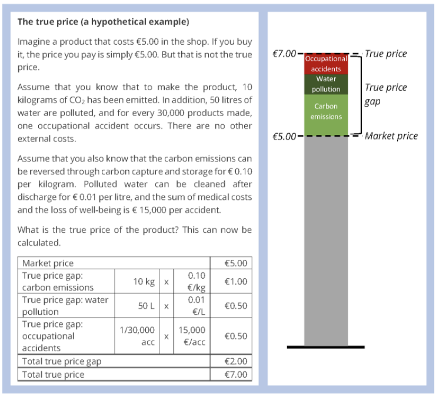

本文是首发于 2021 年 4 月的付费文章，于 2023 年全文免费放出。如您阅读后感觉有信息量，可以[订阅本站或我的公众号](https://1q43.blog/follow-me)。本文未经许可禁止转载，如有需求请与我微信联系：ifookit

___

**一个直观但所有人都刻意忽略的问题：**

**那些让我们深陷其中的互联网垄断业务，真的获得了高额利润吗？**

**当平台垄断输出了巨大的资本负外部性，却连自身的商业成功都未能自证。**

**无效垄断正在对社会透支，这甚至是戕害垄断者自身。**

**是什么，为什么，怎么办？**

___

本文大约 61000 字，阅读需要 153 分钟。

作者 | 评论尸、陈闷雷

白徵明对本文亦有贡献

### **1\. 你会垄断么？**

#### **1.1 《大富翁》与《愤怒的葡萄》**

你会垄断吗？

这似乎是个类似“你幸福吗”一样的愚蠢问题。

垄断是如此的直观，并且具有“乐趣”，以至于人类发明了一种游戏来向我们的孩子说明什么是垄断——几乎所有的人都玩过的大富翁（Monopoly）。

1903 年，美国游戏发明家 Lizzie Magie 发明了大富翁 Monopoly 的原型，用于警告人们垄断是一件多么可怕的事情——当单一市场主体掌握所有的土地，其他人将再无立锥之地。

但由于垄断的快乐和直观，这款游戏迅速走红，它没有成为警示人们反抗垄断的教科书，反而成为了无法获得垄断地位的人们假想自己成为大资本家，享受垄断精神快乐的工具。

大富翁是令人上瘾的，它通过骰子来模拟市场的随机性，通过棋盘来模拟市场的有限性，在一张狭小的书桌上高度还原了 20 世纪美国各行各业中正在发生的垄断行为。

在游戏的最后，当你扔下一次骰子，买下了城里的最后一块地，游戏结束了，你赢得了游戏。

这个游戏之所以没有起到它最初的教育意义，很可能是因为它实际上根本没有模拟垄断之后发生的事情，而只模拟了垄断形成的过程。

在这一过程中，对于渴求获得垄断地位的市场主体来说，唯一的问题是如何取得垄断。而对于它们的对手——普通消费者和市场创新者来说，唯一的问题则是反面：如何阻止垄断的形成。

但事情这真的是这样吗？

为了说明这个问题，我们需要越过游戏的终点线，看看“垄断达成”之后究竟都发生了什么。

2019 年 12 月，长达两年的中美贸易摩擦暂时落下帷幕，中美原则性达成“一期协议”。美方停止向中国商品恶意加收关税，而作为回应中方承诺购买更多美国的农产品。<a href="https://1q43.blog/post/766#cite1">[1]</a>

很多人当时并不太理解，为什么美国一个刻板印象中的工业大国要强迫中国一个刻板印象中的农业大国购买农产品，而不是相反的。

但其实原因在中国的初中地理课本里面有讲过。

如果这些年，初中地理课本的变化不大的话，那不出意外里面应该有一节会把美国的农业作为一个标杆来讲述。美国是世界上第一大农产品出口国，这是由于其农业集中程度高、大型机器生产的效率高、农产品的商品化程度高、农业附加值高等先进的农业生产方式所决定的。

尽管美国曾拥有强大的工业，但近些年来，美国的工业优势更多的体现在其农产品的产量、质量和价格上，而不是工业产品本身的出口。

随着美国的所谓“产业空心化”之后，美国的工业反而在一定程度上落后于它的农业，现如今的美国输出廉价工业制品的能力远不如输出廉价农产品。

地理课本里还会讲，美国之所以能实现利用机器大规模生产农产品，是一些地理和产业经济的原因，比如美国的平原众多，适合大机器耕种，美国的工业产业链发达，更早开始用先进的农具改造农业。

从地理上看，这是正确的，但它忽略了历史进程中经济学平原的形成。

天然平原并不是经济学平原，尤其是对于私人永久持有土地所有权的美国来说。

如果在美国的平原上，散落着无数小农，那么大机器生产则毫无意义。因为，就算一辆拖拉机能节省再多的人力，每个农户也只能耕种自己所拥有的那一小片土地。

因此，能够让拖拉机、播种机、采摘机最高效发挥作用的前提是，美国的近代农业史上真的发生过一局“大富翁游戏”。

20 世纪 20 到 30 年代，也即是美国最后一次发生印第安人大屠杀的一百年之后，另一场将人类个体从土地驱赶走的活动正在如火如荼地进行。

只是这一次，被推平房屋与家园的是美国白人自己。

美国先进的农具生产公司（如拖拉机、种子、化肥公司）向美国农民出售或出租农具。农民以为，获得了这些工具，能够显著地提升自身未来的生产效率，于是他们背上贷款买来这些商品。

但在土地尚未集约化的情况下，这些现代化工具事实上发挥不了太大的作用。同时，恰逢气候的原因导致美国部分地区的农作物连续几年欠收，他们无法偿还用于购买农业生产工具的资金。

这时，那些卖给他们商品的农业公司会带着放贷的银行家一起，开着拖拉机来将美国农户的房子推倒，将他们的土地作为抵押物没收。最终，他们在美国天然的平原上，获得了一块块经济学的平原。

这种经济意义上的平原，才让美国的农业后来得以走上专业化机器耕种的道路，让美国成为目前世界上最大的农产品出口国。

美国左翼文学作家约翰·斯坦贝克依据这段历史创作了著名小说《愤怒的葡萄》。我们的地理课本当然不会讲述美国平原成为经济学平原之前的这段故事的。因为显然，大富翁游戏是残酷的，在一门主要讲方法论的课程中讲这个故事未免会让人觉得是在鼓励垄断。

但是，“大富翁游戏”之后所发生的事情，却是我们应该学习的——如何应对业已形成的垄断，并使之能重新造福社会。

我们现今针对互联网领域垄断的话题，似乎也过多的聚焦在了业已完成或接近完成的“大富翁游戏”上。

这很大程度上是因为公众误以为垄断是一件由互联网所引发的全新事物，一旦垄断达成，我们将走入一个万劫不复的深渊。

垄断在人类历史上出现的时间并不长，但也不算短。人类社会在短短的几百年里，事实上已经驯服了大部分垄断。

19世纪下半叶，人类开始制约铁路垄断；20世纪第一个十年，我们驯服了石油和烟草的垄断；20世纪的第二个十年，我们开始着手驯服房地产与农业垄断；20世纪30年代，无线通讯、零售和银行业戴上反垄断的枷锁；在20世纪最后的十年里，反垄断甚至成功的驯服了互联网行业的前身计算机与软件行业。<a href="https://1q43.blog/post/766#cite2">[2]</a>

垄断就像是一头猛兽，在动态博弈中翩翩起舞，成为人类发展的动力。但是，互联网的出现，让垄断又短暂地从笼子里跑了出来。

在某种程度上，对于站在台下的观众来说，企业家、资本和监管均是驯兽师。驯兽师的目的从不是为了让狮子吃掉观众，而是让马戏团欣欣向荣。

当猛兽已然形成，反垄断就会出现两条道路，一条是让猛兽消失，完全肢解垄断者，这是当下许多公众反垄断中的热门流派；另一条道路是驯服猛兽，让已经形成的猛兽在鞭子之下翩翩起舞，取悦所有人。

第二条路，也是我们曾经选择过一次的道路。

#### **1.2 什么是垄断？**

什么是垄断？

先定义问题，再解决问题，似乎是一切研究的正常顺序。

但在互联网研究领域，这一正常顺序往往会导致思考走向歧途。

如果你真的是一个非常关心垄断话题的读者，你可能会注意到：**在过去几年关于中国互联网平台垄断的讨论中，精英群体或者更中立的叫专业人士群体的暧昧态度。**

许多经济学家和法学家都不太认可中国的互联网公司存在垄断或很严重的垄断，这与大众的认知完全相反。

这并不是因为这其中发生了一些大众想象的利益勾结，而是在传统的学术框架下，当下互联网行业的许多垄断行为确实不属于垄断。

传统谈及垄断与反垄断往往涉及三个领域：经济、法律和公共治理。

但这三个领域建立的“垄断-反垄断”框架均诞生在“羊毛出在猪身上”这种互联网行业的基本支付转移手法出现之前。为了方便让你读下去，我们先简单的概括一下这三个领域都是怎么定义垄断和反垄断的：

-   **在经济领域**，垄断与反垄断围绕垄断竞争对产品价格的影响进行讨论。它考量的是垄断企业能在多大程度上影响商品的价格，这种价格是否完全背离市场规律或价值规律，以及这种价格如何影响供需关系。它的博弈双方是企业与消费者。
-   **在法律领域**，垄断与反垄断围绕企业对市场竞争环境的影响进行讨论。它考量垄断者对竞争者的不正当扼杀和对创新的抑制。它的博弈双方是企业与企业。
-   **在公共治理领域**，垄断与反垄断围绕垄断企业对税收、公共福祉和政治势力的影响讨论，这里不宜做过多展开。它的博弈双方是企业与社会（或国家）。

上述三个领域对垄断企业、垄断行为、垄断边界和反垄断方法各有一些分歧和共识。

但用互联网黑话来说，传统框架甚至没有很好地在互联网领域找到好的“抓手”——**互联网服务的商品究竟是什么，价格是什么，市场是什么**。如果连这些都尚未明晰，那么套用传统的，以钱易物的商业逻辑下形成的“垄断-反垄断”框架，必然出现问题。

我曾在朋友圈里谈到，关于互联网反垄断最重要的一些书没有电子版。有人问是哪些书，出于对撰写本文的私心我没有回答。现在，我可以将这些书名列在这里，仅供读者参考：

-   《美国垄断史——帝国的缔造者和他们的敌人》
-   《平台垄断：主导21世纪经济的力量》
-   《分享经济：垄断竞争政治经济学》
-   《寡头垄断的动态模型：理论与应用经济学基础》

当然，还有一些已经有电子版的书：

-   《技术垄断：文化向技术投降》
-   《算法的陷阱：超级平台、算法垄断与场景欺诈》
-   《垄断竞争理论》

但是，**这些书不是阅读本文的前置读物，没有看过任何一本也不会影响本文的阅读。你可以在读完本文后，再回这里寻找下一步的阅读材料。**

事实上，本文与《[互联网是人类历史的一段弯路吗？](https://1q43.blog/post/673)》（下文简称《弯路》）不同，不会完整地引用任意一个领域中已有的框架或概念去套用解释互联网平台反垄断。

对于如何使用已有的学术框架，分析目前国内正在进行的互联网反垄断浪潮，已经有一批国内的一流学者产出了许多非常值得仔细阅读研究的文章。比如姜奇平、周其仁、邓峰、陈永伟、胡泳、游云庭、刘旭（绍耕）、孔祥俊、时建中、王晓晔等。

如果你有兴趣，可以用这些专家的名字与反垄断组合在一起，找到他们的著作（书、论文和公众文章）。

但已被驯服的垄断在互联网时代重新出笼，这已经意味着旧有分析框架的失效。

因此，本文将尝试着提出一种全新的，可能是非常浅薄的框架，既有效垄断和无效垄断，来重新审视企业垄断行为带来的影响，以及如何规避、引导这些影响向社会福祉有利的一面发展。

本文将跳过对垄断的定义，讨论垄断所带来的问题。因为在互联网领域，许多问题以凯文·凯利在《失控》中反复提到的“涌现”形式出现。不同的恶果，可能是由多种不同严谨定义的原因导致的。

如果试图先对“垄断”下一个严谨的学术定义，你就会发现许多大众认为的垄断所带来的问题，并不能被归因在垄断上。

也因此，**本文不会使用传统的界定相关市场的方法来判断某个主体垄断或没垄断。**

本文文本中所出现的垄断，就是大众或者说你认为的垄断，如果你认为微信垄断，本文就假定微信垄断，如果你认为淘宝垄断，本文就假定淘宝垄断，如果你认为微博垄断，本文就假定微博垄断，如果你认为抖音垄断，本文就假定抖音垄断。

如果你本身就是一个专业人士，认为以上这些公司及产品都没有垄断，那么本文也会为你解释为什么这些你认为没有垄断的产品，在不同领域产生了类似垄断的负面影响。

本文将试着在这种假定之上，展开余下的全部讨论。

### **2\. 有效垄断 VS 无效垄断**

#### **2.1 如何让滴滴多亏 10 亿？**

取这个标题，不是为了针对滴滴。

我曾在《弯路》中以滴滴为例，论述大众对网约车平台的安全诉求其实是一种苛求。

滴滴是我在写平台经济最喜欢用的例子之一，因为这家公司的业务逻辑相对简单透明，是大众认知中典型的互联网平台。

恰好滴滴在最近也被卷入了反垄断的风波之中，适合再次用作例子。

2020 年 12 月 20 日，一份名为“出租汽车产业联盟致国家市场监管总局关于继续对滴滴出行和优步中国合并案开展反垄断调查的建议函”在互联网上流传。

这份建议函的主要内容是，滴滴对快的、优步中国两家前竞争对手的兼并，涉嫌触及《反垄断法》中所规定的垄断行为。

经营者的过度集中，尤其是未经申报和批准的经营者集中确实有可能触犯《反垄断法》，但在滴滴的案例中是否构成滥用垄断地位还要补充大量的细节。

在这里，我们不讨论这种兼并是否是垄断行为。让我们再一次引用本文开篇所描述的定义：有人说这是垄断，我们就假定它是垄断。

因为我们要讨论的问题不是滴滴是否形成了垄断，而是要看看**滴滴是否形成了有效垄断**。因此，我们可以跳过“垄断”，只看是否“有效”。

这里直接引述一段投中网的报道[\[3\]](https://1q43.blog/post/766#cite3)：

> 2019 年 2 月，滴滴创始人及董事长程维在内部信中表示，2012-2018 年，公司从未盈利，6 年累计亏损 390 亿元。相关统计也显示，截至 2019 年底，7年里滴滴累计亏损超过了 500 亿。
> 
> 好消息是，2020年5月初滴滴总裁柳青在接受CNBC采访时表示，滴滴的核心业务也就是网约车业务已经盈利，或者说有些薄利了。
> 
> 但核心业务盈利并不代表滴滴整体实现了盈利。进入 2020 年以来滴滴启动了新的“扩张模式”，2 月底上线新品牌花小猪，3 月在郑州、上海、深圳等21座城市上线跑腿服务，6 月“橙心优选”开始在成都试运营社区团购，9 月出租车业务升级为“快的新出租”，年底又发布定制网约车 D1，一系列动作下来，恐怕赚的钱又要补贴进新的业务里了。

从这个财务状况来看，无论滴滴是否垄断，它到目前为止都尚未达成其资本所要形成的有效——赚钱。

当然，在互联网领域，赔钱有可能才是垄断行为。因为赔钱，意味着公司使用了更多的补贴来排挤竞争对手，一旦企业获得了 100% 的市场份额，那么接下来它和它背后的投资人就会赚的盆满钵满。

那么，滴滴的市场占有率的变化是怎样的呢？

根据易观的数据，2014 年年末滴滴打车占据市场的43.3%，其竞争对手快的打车占市场的 56.5%，形成大众口中的“寡头垄断”局面。[[4]](https://1q43.blog/post/766#cite4)

情况在一个月后发生突变，2015 年 1 月滴滴和快的启动谈判，并在一个月后的情人节宣布合并。中国网约车市场份额在 2015Q1 变成了：滴滴 78.3%、Uber 中国 10.9%、易到用车 8.4%。[[5]](https://1q43.blog/post/766#cite5)

一年之后，滴滴再把市场第二的 Uber 中国收入囊中。至此，网约车大战似乎迎来了终局，2017、2018 和 2019 年三年，滴滴的市场份额都在 90% 左右。

但是，滴滴仍在亏损，在市场份额高达 91% 的 2018 年，滴滴亏损了 110 亿人民币。

因此，我们几乎可以得出一个结论：无论是否将拥有 90% 市场份额的滴滴视作“垄断”，它都是“无效”的。

在大多数人的想象中，垄断企业获得垄断地位之后就会获得在这一市场的定价权，从而制定出偏离价值的定价策略获得高昂的垄断利润。

但滴滴却给了我们一个反例，拥有 90% 市场份额的滴滴并未将其业务优势转化为有效的利润，这是为什么呢？

原因在于，在网约车这个市场，竞争对手可以四两拨千斤地挑战占据市场主导地位的巨头。

我们做一个假设：**如果滴滴的市场份额已经达到 100%，它“完全拥有市场”，那么它的情况是否会比现在好一些呢？**

在极短的一个时间里是这样的，但当滴滴开始涨价的时候，事情会迅速发生变化：

假设，滴滴此时停止了一切补贴，实现了每个季度 10 亿元的利润，这一高利润必然会吸引新的竞争者入局。

如果我们假定一个新的入局者宣布每个季度向消费者（或司机）补贴 2 亿元。你觉得这个时候滴滴净损失是多少呢？

此时，滴滴的净损失是每个月 12 亿。

因为滴滴不得不放弃已经实现的每个季度 10 亿元利润，还要再从现金储备中拿出 2 亿才能与这位新入局者实现对等的价格竞争。

在互联网领域，仅仅凭借复制或借鉴，在几乎没有关键性壁垒的情况下就可以对已有的垄断市场进行破坏。这是传统垄断行业，或者说原子经济时代不具备的新特性。**这也导致了无效垄断的其中一种：无壁垒垄断。**

无壁垒垄断的定义很简单：即市场上某个企业拥有较高市场份额，原因是它的竞争对手不想与其竞争，而非不能与其竞争。

由于网约车市场早期激烈的竞争和持续补贴，网约车成为了一个“不赚钱”的赛道，因此很少有有企业愿意在这个时间点进入到赛道里与滴滴全面开战。

实际在北京的首汽租车，上海的曹操专车和南方一些城市的美团打车还是与滴滴形成了局部竞争，而仅仅是这些局部竞争就已经足以让滴滴交出一个非常难看的财务报表。

如果你对互联网行业有足够的关注，那应该知道滴滴和 Uber 都在大力押注自动驾驶技术。因为相比起建立一个个区域性的网约车市场，自动驾驶出租车显然是一个能构筑起垄断门槛的业务。

在方向上，这是正确的，但可能仍存在问题。

因为如果假设 20 年后自动驾驶已经完全普及，我们站在那个时间点往回看会发现：有两派商业势力在争夺自动驾驶交通业的市场，一派是代表旧生产关系的网约车平台，另一派是代表新生产工具的车企（包括特斯拉和涉足自动驾驶的传统品牌）。

在从 2020 年到 2040 年的这之中的某个时间点里，生产关系派很可能会发生内部斗争阻碍其对新生产工具的运用。

网约车平台整体是轻资产模式，其最重要的外部资源是网约车司机这种“传统运力”——它的意义就像用户之于微信。全面进军无人驾驶出租车，会在一个特定的时间点破坏平台与长期合作群体之间的友好关系，造成难以调解的冲突，就像网约车出现时出租车司机对网约车平台的抵制一样。

而对于 2040 年的车企或新诞生的以自动驾驶技术为核心的新运力平台来说，则没有这种“历史包袱”，可以轻装上路快速增长。

用人话来说就是，如果特斯拉的 L5 自动驾驶成熟了，它可以迅速地组建一个自动驾驶出租车公司。但 Uber 即便是在拥有同样成熟的自动驾驶技术情况下，也要面临如何遣散数百万网约车司机而不引社会事件的问题。

在这个时间点到来之前，网约车平台还要受到上文所提及的无壁垒垄断的困扰，现金流频频受限不足以拿出足够的现金与那些全力研发自动驾驶的企业进行竞争。

回到无壁垒垄断，现在被大家指责的几个互联网巨头的成功，或多或少都有些无壁垒垄断的影子。

产品没有持续壁垒，就主动制造壁垒，这是无壁垒垄断带来的必然之恶。但有时，这确实能在不造成明显社会价值损害的情况下，形成有效垄断市场，比如我们在下一节将要提到的例子。

#### **2.2 中文互联网上的第一起屏蔽**

2008 年 9 月 8 日下午，上线 5 年初具规模的淘宝网宣布了一项新的“消费者保障计划”<a href="https://1q43.blog/post/766#cite6">[6]</a>。

这项消费者保障计划中包括：对家电类产品要求商家提供30天保修、珠宝类商家保真、食品类商家进行资质审核、奢侈品商品延长确认收货期给消费者留足鉴定时间，以及……**“屏蔽搜索引擎对淘宝网商品、商家和淘宝除首页外页面的收录”。**

简单来说，用户从此时开始，将再也不能从搜索引擎，包括尚未退出中国的 Google、Yahoo 和本土搜索引擎百度中找到来自淘宝的绝大部分页面。其中对百度的屏蔽是最为严格的，几乎除了首页淘宝任何页面都不会出现在百度的搜索结果中。

淘宝官方给出的理由是：在一些搜索引擎上，充斥着大量模仿淘宝网页面的诈骗网站，用户通过搜索引擎找到了这些商品后被骗，给淘宝网带来巨大的声誉损失。

这个诉求有一定道理，因为中国互联网用户数字素养不高这已经是个不争的事实，时至今日八成网民学历低于大专都已经成为一个梗。在那个草莽时代，诈骗、病毒和各种网络攻击比现在只多不少。不让用户从搜索引擎找到淘宝商品，确实能避免用户将掏宝网认成淘宝网。

但是，这在当时的商业故事里是讲不通的，因为当时的百度仍是中国互联网上最大的流量入口和唯一的流量池。尽管总量不如当今的微信，但在当时中文互联网中的流量占比只可能比今天的微信高。

因此，作为“流量需求方”的淘宝来说，屏蔽百度是一个非常吊诡的决策，在当时几乎没有任何报道将这起屏蔽直接与淘宝网的商业模式联系起来。

一个网站主动屏蔽百度，就像是一个商场里的商户说：“一层的人流太多了，我要搬去地下室的角落。”

新浪网作为当时互联网上最主要的媒体之一，用独立专题报道了这件事。两家公司进行了多轮公关战——“百度谴责淘宝侵害了卖家权益”、“淘宝回应只是屏蔽有害搜索”、“百度宣布自建电商”、“淘宝称不会惩罚参与百度电商的商户”……

熟不熟？熟极了，因为这就是中国互联网历史上的第一起商业性屏蔽事件，之后中国互联网上的每一起屏蔽事件都是照着这个模子刻出来的。**这次屏蔽奠定了中国互联网公司因商业竞争原因相互屏蔽的方法、理由、舆论及法理框架。**就像该隐杀死亚伯，确定了一种谋杀范式。

在现在看，淘宝网屏蔽百度的理由已经非常显而易见——

根据中关村互动营销实验室统计的数据<a href="https://1q43.blog/post/766#cite7">[7]</a>，2020 年中国互联网公司广告收入规模排行里，阿里巴巴以超过 1000 亿的成绩稳居第一的位置。

大家认知中的“流量大师”微博仅排第九，拥有“国民App”微信的腾讯排名第三。

阿里巴巴广告业务提供主要动力的就是直通车产品，而直通车业务用通俗的话来解释就是淘宝 App 版的“竞价排名”——哪件商品能出现在搜索流的更前面，哪件商品能出现在推荐流的更前面。

而阿里体系内部的直通车业务得以成立，正是由于商品页的屏蔽，使百度失去了这块业务。

反向推演，如果中国的互联网用户延续了 PC 互联网时代“百度一下，你就知道”的惯性，使用百度来对商品进行检索，那么这 1000 亿的广告收入如今应该加在百度的财报上才对。

在当时报道这件事的专题页面上，新浪发起了一个网友投票，其中包含两个问题，其一是“你认为淘宝屏蔽百度是否会给网店造成影响”，另一个是“百度为了反击淘宝而自建的电商业务是否会成为淘宝的主要竞争对手”。

如果不是这个投票至今仍可访问，一般人可能很难想象在这次事件的舆论中，百度竟然占了“道德上风”。

但后续的发展并未如早期网民所想象的那样，彼时还代表“开放互联网”的百度并没能获得这场战争的胜利。自建电商平台“百度有啊”在上线2年后转型，然后又迅速的关闭。

2012 年 8 月，微信公众号上线，它的 Robot.txt 里屏蔽一切通用搜索引擎的抓取，百度在之后的几年中痛失中文内容来源。

2013 年 11 月，淘宝以屏蔽百度同样的理由“关闭了微信跳转通道”，用户将一条淘宝商品链接发给自己的好友时，会被淘宝自动跳转到手机淘宝的客户端下载页面。微信很快做出了回击，禁止了在微信内建浏览器打开淘宝的链接。[[8]](https://1q43.blog/post/766#cite8)

后来，微信逐渐成为中国最大的流量池，当淘宝想重新从微信的生态中分一杯羹的时候才发现，单方面的解封已经弥合不了历史的伤口。时至今日，类似“淘口令”这种奇怪的任意门，成了只有在中国网上冲浪的巫师们才懂的咒语。

再之后，中国互联网上的每一起屏蔽，几乎都遵循着相似的逻辑。都说互联网是一门“流量”的生意，但流动的量实际上并不能为互联网公司带来实际的商业价值，只有留下的量，才能真正维系互联网产品的正常发展。

因此，与上一节描述的“无壁垒垄断”相比，淘宝实际上建立了一种广告市场中的有效垄断。我们将在后续讨论这种有效垄断的驯服思路。

现在，先让我们先进入下一个无效垄断的案例。

#### **2.3 去掉微信，腾讯还能赚钱吗？**

我们不深究垄断在经济学和法学上的界定，仅以公共舆论中的一个普遍论断为前提，来说明这一点：腾讯是一家垄断互联网公司，微信是一个垄断产品。

截至去年第一季度，微信及 WeChat 的合并月活跃帐户数达 12.025 亿。

但在腾讯公司的财报中，微信并非是一个盈利部门。当然，这么比是非常不合理的，平台经济的主要价值就体现在业务之间形成协同效应，所以，我们应当将腾讯的其它部分收益归功于微信才对。

那么，哪些业务可以归功于微信呢？

腾讯的业务主要包括增值服务、金融科技及企业服务、网络广告收入 4 个部分，考虑到有的读者可能不是互联网圈的人，我们做下简单的介绍。增值服务就是会员和氪金，游戏氪金、QQ会员、腾讯视频会员、微信读书无限卡这些都应该算在这里面；金融科技是指微信支付；企业服务是指腾讯云和企业微信的大客户；网络广告就是广告，除了微信朋友圈里的广告，更大头的是腾讯视频和腾讯新闻的广告。

但事实上，腾讯所有盈利的业务中，能够与其社交网络垄断形成协同优势的业务并不是很多。

尽管腾讯迫于政治正确的压力，始终想摘掉自身游戏公司的帽子。但我们还是用大家最熟悉的游戏业务来讲解。

如果你是一位中国电子游戏玩家，那么无论你喜不喜欢腾讯，但凡你没有被感性完全占据思考的高地，你都必须要承认腾讯游戏在商业上，是无比成功的。

但腾讯游戏究竟有多强恐怕很多读者还是缺乏一个明确的概念。

2019 年中国游戏市场的规模约为 2309 亿元（可统计口径），而当期腾讯的游戏业务整体收入则高达——1411 亿元（手游端 937 亿元，端游 474 亿元）。这一数据意味着腾讯的游戏业务收入在整个行业中的占比超过了 61%，远大于其他所有游戏厂商的国内市场份额之总和。腾讯的游戏业务甚至可能是所有互联网巨头的所有业务中占据赛道整体程度最高的之一了。

但腾讯在游戏领域的“垄断”，似乎与在社交领域的“垄断”是隔离的。

微信的成功是否能够给腾讯的游戏带来优势，这个是肯定的。

在移动游戏时代，游戏宣发（或干脆称为“买量”）已经成为游戏业项目必须考虑的成本核算之一。腾讯在社交领域的优势对其游戏业务最大的贡献就是，腾讯游戏节省了外部买量的成本。

也就是说，《阴阳师》想要在上线初期让广告覆盖 1 亿人，那么可能需要投入 10 亿元现金来在各渠道打广告。但腾讯如果想让一款新游戏上线时覆盖 1 亿人，只要在自家的社交产品里分配一些广告位即可。

但是，腾讯将微信中的广告用于给自己的游戏业务导流，并不是免费的。因为，这些腾讯游戏的广告实质上占用了腾讯自己可变现的广告库存。

也就是说，假设朋友圈一天能对每个人展示 3 次广告，其中一次给了腾讯游戏，那么腾讯广告可以对外销售的广告位就变成了一天 2 次。

这种内部结算甚至有可能是亏损的，因为对于腾讯广告来说，它将这个广告位销售给外部公司，无论这个外部公司的产品是否成功，腾讯都能如期收到广告费。

但对于内部结算来说，游戏失败的机会成本却内化在了企业内。如果一个腾讯游戏在上线后营收不及预期，腾讯损失的不只是开发这款游戏所付出的费用，还有这款游戏占用腾讯广告宣发造成的广告收入抵减。

另外，即便是现在的大多数手游都有“赚一波就跑”的趋势，但在“研发与宣发哪个更重要”这个命题中，绝无任何一个游戏行业的从业者敢断言是宣发更重要。

每次大众对着腾讯的财报中高额的收入指点时，腾讯自身却在复制《王者荣耀》和《和平精英》的道路上越走越难，这与大众经常谈及的“赢者通吃”似乎是背道而驰。

而且我们也可以反过来想，网易有微信吗？米哈游呢？哔哩哔哩呢？Funplus？莉莉丝？这份名单可以很长，这些游戏厂商谁也没有大流量的社交平台，有些甚至还只有游戏业务。可我们不能因此否认《明日方舟》《阴阳师》《原神》《Fate/Grand Order》以及《碧蓝航线》在商业上的巨大成功。

以上这些手游，都被腾讯复制过，全都没成功。

微信的流量能给其它业务带来的优势是明显的，但也有极大的局限性。

中国最赚钱的互联网金融公司仍是阿里巴巴的蚂蚁金服而不是腾讯的财付通，中国最大的云服务商也不是腾讯云，企业微信正在面临钉钉和飞书的前后夹击，腾讯视频和优酷、爱奇艺一样仍在每年大幅度亏损。

甚至微信的流量并不一定对另一个社交 App 具有协同效应，在“多闪、马桶MT、聊天宝”围攻微信的那一年里，腾讯自己推出了 28 款社交软件。这些社交软件可以在微信中自由的传播链接和获取流量，但所有这些社交软件都和那三个外部竞争者一样消失了。可见流量的扶持与否，并非业务成功乃至存活的关键。

在微信“成功垄断”的 10 年里，腾讯错过了今日头条（个性化信息流）的崛起，错过了抖音快手（短视频）的崛起，错过了电商的两次崛起，错过了本地生活的崛起，还耽误了云和企业服务的布局。

因此对于游戏，乃至更多的互联网业务来说，社交垄断能起到的作用比想象的要小的多，局限性也比想象的大的多。

平台流量的边界不止在腾讯一家公司显露，如果我们将目光看向百度，发现它面临着同样的困境。

尽管正如我们前文所说，阿里在 2008 年切走了百度最具价值的一部分“内容”，并且在之后的 12 年里，百度的“内容”一直不断的被挖角。

但在相当长的一段时间里，百度仍然是中国互联网上不可忽略的流量池之一。

百度在搜索引擎市场的份额在谷歌退出后攀升至 80% 并长期保持在这一水平（之前其实也超过了60%，差不多是谷歌两倍），直到 2019 年都还保持在超过 70%，移动端的占比甚至逼近了 90%。

换言之，仅从流量角度考虑，百度至今仍比我们谈论的许多新巨头的市场地位高太多，甚至都已经逼近了绝对垄断。可与之相对的，当我们在讨论“垄断”时，又有多少人会想到百度呢？

不管究竟是因为内部管理混乱，战略方向不明亦或是时运不济，从结果上我们都知道百度从来未能非常有效的利用它自己的“私域流量”。

要知道在 2010 年前后就能拥有一台个人 PC 且会上网的显然是经济状况比较良好的消费者群体了，但如此高净值且规模可观的用户也并不能让百度自然而然的获得胜利。

当然百度“作过的恶”想必很多人也非常清楚，铺天盖地的莆田系也让用户反感，甚至还闹出了魏则西这样的恶性事件，但是这与百度的垄断地位完全无关甚至恰恰相反。

**一个真正有效垄断市场的搜索引擎，应该有足够的底气拒绝非法医疗广告，因为挑选客户本身正是垄断者的议价能力之一。**

正像当年高调宣布放弃消费者医疗广告的 360 搜索也在 2021 年因为医疗竞价排名登上了 315 晚会一样。非法医疗广告在中文搜索领域频生，正是由于在这个赛道中没有任何一个玩家形成了有效垄断。

在前 10 年里，在垄断的弊端尚未释放的时代里，“先垄断着再说”成了行业中的主流共识。但在下一个十年里，当政府、大众、学界的反垄断意识觉醒，摆在巨头面前的一个问题是：

这个赛道，值得垄断吗？

#### **2.4 什么是无效垄断？**

现在，终于可以谈谈什么是我们认为的无效垄断，什么又是有效垄断了。

简单来说，正如我之前在 1.2 中谈到的，企业创造垄断这头猛兽的唯一目的理应是赚钱（创造利润）。

因此，**被预期或证明无法盈利的垄断模式均为无效垄断。**

在上面的三节里，淘宝是一个典型的有效垄断，滴滴、微信和百度则无效得多。

滴滴建立的是无壁垒垄断，它的垄断地位一旦停止资金的投入就会被蚕食。微信建立的是无利润垄断，在整个微信单独的商业逻辑里，它无法维持自身的运转，从财务数据上又难以支撑微信对腾讯现金牛业务确有足够的协同效应的证据。

垄断是企业赚钱的手段，而不是目的。但在过去 10 年的互联网领域，有不少的企业都陷入了本末倒置的境地。

可能有人读到这里，仍不明白为什么“垄断了市场，还能不赚钱”。

因为，垄断一个并不存在的市场并不是真正的垄断。

这涉及到平台经济的本质：

平台经济是指通过创造一个平台，来撮合那些原本因为交易成本而无法达成的交易。这个平台不一定互联网，也可以是线下的交易所。但互联网技术让更多满足这一条件的平台得以出现。

在 2010 年以后，我们能接触到的大部分互联网公司都是平台型公司。

比如电商，它将身处于不同地区的买家和卖家连接在了一起，撮合此前从不存在的交易。比如社交网络，它让我们的身份在内容生产者与内容消耗者之间相互转化，促成了此前不存在的内容消费。再比如 Steam 那样的游戏平台，它通过聚合游戏发行的方式形成了一个全球游戏市场的单一入口。

在这些平台出现之前，相关市场的买方与卖方之间难以沟通、交易频度偏低、交易成本过高。因此，平台自身虽然没有生产任何商品，但却显著增加了商品流通的效率，创造了商业价值与社会价值。

在没有电商之前，A 地的人难以将自己的土特产卖到 B 地。因为他需要先运输一些土特产到 B 地，并成功的上架到 B 地商店的货架上，看看到底能不能卖出去，才能验证自己家乡的味道在 B 地到底有没有商业潜力。

但在有了电商之后，A 地的人只需要在自己家里开个网店，定向投一些面向 B 地的广告就能用最低成本验证市场。

但是，反观网约车平台，用户在 App 里叫车和路面上叫车没有对供需关系的本质改变。它似乎并没有凭空创造此前不存在的市场，也没有促成此前未能达成的交易。因为打车的最大门槛始终是费用问题，这也就使得打车平台只能不断依靠补贴来竞争，陷入了无效垄断之中。

虽然历史不能假设，但假设在网约车公司出现之前，各地的出租车公司率先上线网约服务，那么网约车这个市场是否从根本上就不存在了呢？

事实上，在中国一些三四线城市，由于网约车平台未能在发展初期就以闪电战的形式拿下市场，现在已经非常难以进入。

这些城市的人并不会因为网约车 App 的缺席而明显感觉到出行的不便，因为无论是在滴滴上、首汽约车上、曹操专车上打车，还是在市级出租车公司的小程序上打车，消费者的体验没有天差地别。

在主流舆论中，无论是国内的滴滴还是美国的 Uber，经常被当做“大众的对立面”来批判。在媒体中，你会看到这两家公司既欺负乘客（大数据杀熟）又欺负司机（不给上保险）。

这其实是个很奇怪的现象，因为从账面来说，这两家公司的投资人投入的都是真金白银，这些钱变成了优惠券，员工的 996 薪水、期权和司机的补贴。

但收获的却是一个始终不赚钱的“垄断市场”。

在国内兴起的这一轮对“大资本”的批判中，会将这种不赚钱视为一种“延迟满足”。即现在的不赚钱，是为了以后的赚钱。

然而，一个疑似垄断市场多年的企业，仍在亏损。要么是没有垄断，要么是别的地方出了什么问题——比如陷入了无效垄断的陷阱。

正如我们在 [2.1](https://1q43.blog/post/766#21_ru_he_rang_di_di_duo_kui_10_yi) 中所谈到的，这种垄断市场有可能是持续无法盈利的。

对比之下，电商确实创造了一个此前并不存在的市场，尽管实体零售业一直对电商颇有微词，但并没有证据证明电商对线下零售有很强的替代性。从消费场景来说，大多数电商上的消费（尤其是直播电商后的冲动消费），是没有电商就不可能存在的一部分消费。

而淘宝对百度的屏蔽，使得淘宝可以独享这一市场的广告收入，因此建立了有效垄断。

淘宝只有屏蔽了外部对商品的检索，才能建立起对商品排序的广告机制，进而盈利。而盈利对于商业社会下的企业来说是具有第一性的，你的企业要么在成立的第一天就盈利，要么给出一个预期盈利的承诺。如果一个企业完全不打算盈利，那它压根就不应该存在，它的创始人应该去创办一个公益组织或投身于政府公共事业。

我们先不谈及企业是否作恶或向善这种拟人化的主观问题，几乎可以确定的一点是：**企业垄断的唯一目的，是为了赚钱。**

一个没有动力在主营业务上赚钱的企业，往往隐藏着更大的道德缺陷，因为它会通过虚构的盈利预期来吸收那些“本来不应属于它的社会资本”，比如乐视。

至此**，**我们终于可以解释本文最主要，也是最显而易见的概念，有效垄断和无效垄断。

1\. 任何在短期和长期均无法赚钱的垄断，都应被视为商业上的无效垄断。

2\. 有效垄断，应当建立在一种可行的商业模式上。

值得一提的是，在经济学上一般认为存在四种市场结构，分别为完全垄断市场，寡头垄断市场，垄断竞争市场，完全竞争市场。

无效垄断看起来与垄断性竞争的市场格局相似（一些人认为互联网目前就处于垄断性竞争状态），但同时又有着明显的寡头化趋势。

无效垄断的短期均衡和长期均衡可能均是负值而不是零利润，但同时市场内的卖方数量又有可能处于寡头垄断状态甚至是独家垄断状态。

正如我在 [1.2](https://1q43.blog/post/766#12_shen_me_shi_long_duan) 中所提到的，无效垄断中的垄断并不是一种清晰的经济学定义，而是代指在当下市场格局下“涌现”而出的公众认知。

接下来，我们将主要围绕无效垄断的起因、弊端去探讨可能的解决方案。

### **3\. 无效垄断陷阱**

#### **3.1 免费：不是一种商业模式**

2009 年，《免费：商业的未来》一书同时出版了中英文版本。

这本书的作者 Chris Anderson 在 2001 年离开《经济学人》加入《连线》杂志，并于 2004 年出版了他的另一本畅销书《长尾理论》。

在《免费：商业的未来》中提出了四种看似可行的持续模型，以帮助互联网公司持续、“免费”地向用户提供商品或服务，并最终获利。

这四种模型大致分别是：

1.  通过免费商品，吸引你购买其它商品。如充话费送手机。
2.  通过免费提供服务，吸引你购买其它商品，向其它商品的生产商收费。如免费软件中增加广告。
3.  通过差异化服务内容来提供基础免费服务，并在更高质量的服务中收费。如网盘VIP、视频网站会员、手游氪金获得人物或道具。
4.  提供完全免费的服务，不寄希望于任何当前市场中回报，以其他途经或形式获得回报。

《免费：商业的未来》一书已经出版就在硅谷和中国同时引发轰动，一方面它给了许多当时仍处于大规模烧钱状态的互联网一剂定心丸——“不要急，我们能赢”；另一方面，它让习惯于免费使用互联网的用户感到未来可期——“我们所享受的一切都将继续免费下去”。

12 年之后，这本书中所描述的未来似乎并不是以作者所希望的那样原样到来。究其原因，四种“免费商业模式”其实只是一种商业模式，那就是广告。

-   比如充话费送手机，是运营商将拉新的广告投入内部化成一台台实际的手机。在实际的执行效果中，由于选择合约机的用户永远只是运营商中的小部分用户，因此这种手段不仅不能让运营商减少大规模的广告投放，还要用各种协议来绑架合约机用户以高昂的资费长期在网。
-   比如在免费软件中增加广告，这就是我们最常见的广告模式。没什么可说的，看看用户对微博的怨言就能大致判断这个模式的问题。
-   比如通过差异化的定价来提供免费的基础服务（典型的手游），这事实上是用免费服务来作为自己付费服务的广告。

在《免费：商业的未来》中所描述的四种商业模式里，排除最后的一种完全不求经济回报的免费，另外三种事实上都可以被归类于广告。无外乎是这个广告业务是服务于企业内部还是企业外部。

我们将在 [4.1-4.4](https://1q43.blog/post/766#4_jian_kong_zi_ben_zhu_yi_zui_ke_pa_de_shi_ta_bing_bu_you_yong) 详细的讨论，广告业为什么不可能撑起整个互联网。

将免费视为一种商业模式的基础前提是，在以互联网为代表的比特经济中，边际成本是不随用户的增长而明显增加的。

用数字来说，就是一个有 10 万总用户的应用，其中 1000 用户为付费用户，则这 1000 个付费用户所付出的价格，将包含该应用为另外 99000 个免费用户提基础供服务的成本。

理论上来讲，如果互联网公司是纯粹的比特经济，那这个模式是没有问题的。

但是，互联网比特经济的低边际成本特性在过去 10 年里其实在褪色。

以文字媒体平台为例。自 2012 年今日头条 App 上线以来，我们似乎已经习惯了每次下拉刷新都能展示 8 条新内容的信息流模式。以今日头条为代表的信息流业务之所以能成立，人工智能分发技术功不可没。因为它保障了用户每次刷新出来的内容，大部分是与用户相关的。

但信息流业务也一直被我们所诟病：低质量甚至是庸俗的内容占领了我们的视野，真正优质的内容被埋没。

这种批判对于平台来说多少有些不公，因为对于提供信息流业务的平台来说，也想提供更多优质的内容来更好的满足读者。**但问题是，人工智能和互联网技术仅仅降低了内容的分发门槛，并未显著降低内容的创作门槛。**

当上亿用户每天在个性化阅读 App 中停留超过 30 分钟时，他们所消费的内容数量比过去的传统媒体时代，甚至是博客时代数以千倍的提升。但能够生产优质内容的人的数量尽管也在上升，但量级却完全不同。

信息流业务的边际成本并不是简单的服务器带宽成本，而是的随着读者规模扩大后，全网的优质内容生产成本。

于是，各家自媒体平台开始推出广泛且持久的内容激励计划，向创作者补贴。

从这个角度来说，信息流业务最初所提到的“千人千面”事实上就与比特经济所代表的“低边际成本”相反。因为，要形成千人千面，就要维持足以填充个性化信息流的海量信息。

相比在传统媒体时代，一篇刊登于报纸的文章可能被成千上万人看到，如今许多自媒体文章的阅读量只有几百几千。很难说提供单位阅读时间所需的边际成本是下降了。

回到将“免费”作为一种商业模式，“羊毛出在猪身上”的问题是，当所有人都在挂羊头，猪就成了稀缺品。

如果你仔细甄别，会发现这两年许多陷入口碑危机的企业和产品都是由于无法维系其免费模式导致的。

比如长视频的优爱腾和B站，最早收紧了免费服务的口子，现在几乎任何高质量的影视剧集都不再免费提供。这背后的逻辑很简单，视频作为一种制作成本极高的媒介形态，优爱腾最早的发现了免费的不可持续性，仅凭广告是永远不可能收回平台的内容制作和服务器带宽成本的。

再比如以百度网盘为代表的网盘业务，它虽然不像视频网站那样涉及内容制作成本，但它早期无限制的滥发空间导致一旦有用户真的将那些免费空间用尽，需要几千甚至几万个付费用户才能覆盖成本。家大业大如 Google，也在 2020 年取消了其相册业务的无限额免费云存储。

因此，**与其说《免费：互联网商业模式》提出了一种理论，不如说它总结了一种尴尬**：在 2000 年互联网泡沫破裂之后，互联网行业的业务仍在高速增长，直到该书出版的 2009 年，整个互联网除少数企业外仍处于集体无法盈利的状态。时年正是美国金融危机扩散的第二年，大量资本从以房地产为代表的传统行业中逃出，互联网行业急需一个“说法”进行自我标榜，于是此书应运而生。

互联网行业和企业并不希望免费，只是受限于那个时间点的技术与用户基数的限制，他们不得不免费。在那时，互联网的支付技术还并不发达，在美国使用在线支付的人也是少数，信用卡付款抬高了支付门槛，限制了“直接付费”这种直观商业模式的发展。

在国内就不用说了，直到 2010 年，许多人还认为支付宝“只是用来在淘宝付款的工具”。苹果 App Store 在 2014 年才开始支持在中国大陆地区进行内购。也就是说，在那个时间点之前，任何一家互联网公司想要为用户提供直接收费的服务，都是难上加难。这也是为什么在腾讯创业的早期，Q币的发行被认为是浓墨重彩的一笔。

某种程度上，由于《免费：互联网商业模式》的误导，全球的互联网行业在过去 10 年里的商业化探索是失败的。

你会发现所有最终活下来的企业，最终走上了软色情打赏、高利贷、游戏氪金这样“数字黄赌毒”的商业路线。

因为正经赚钱的方法——直接向用户收费——被他们自己堵死了。

而另一方面，虽然批评这些商业模式的道德缺陷是一种苛责，但和此前的“完全免费”比起来，互联网公司现在的赚钱方式确实给人以过大的反差。大众并不会去细究这种反差背后是主观恶意还是客观被迫，这也造成了舆论层面的冲突。

《免费：互联网商业模式》试图为不赚钱但仍然指数增长的互联网行业找到一种解释，但它给出了明显错误的答案，认为互联网行业可以依赖一种名为“免费”的模式增长路径。

但显然，互联网行业长达 20 年的高速增长，完全离不开资本的助推。

是互联网整个行业的外部性，造就了长达 20 年的免费互联网。

#### **3.2 资本的无序扩张与无效垄断的关系**

为什么会形成无效垄断？

这个答案非常无聊，因为在过去一年中我们已经看到这个答案很多次了：资本的无序扩张。

但因为“大资本”三个字在中文语境下已经被抽象成了某种无所不能之恶，我们还是从头捋一捋资本的无序扩张是怎么导致无效垄断的。自认为对这一部分有所了解的人，可以直接跳过这一节。

为什么资本的无序扩张会导致无效垄断？

首先，企业的运转分为简单再生产和扩大再生产。

简单再生产就是我今天生产了 50 件商品，卖出了 300 元，我将这 300 元又买了生产 50 件商品所需的原料及我自己的吃穿用度，明天又生产了 50 件商品。

而扩大再生产则包含利润的分配，比如我今天生产了 50 件商品，卖出了 350 元，我的成本其实只有 300 元。此时，我没有将剩余的 50 元拿去享乐，而是将 350 元全部购买了新的原料，明天生产 60 件商品，实现了业务的增长。

在没有繁荣的融资渠道的情况下，企业的简单再生产一般基于自己的收入，扩大再生产则基于自己的利润。一个企业如果收入不佳，它很快就会无法维持自己的再生产规模，一段时间之后就会迎来我们所熟知的破产。一个企业如果利润不佳，它将会陷入增长危机，可能被竞争对手超越。

值得注意的是，在没有达到高级社会主义或共产主义之前，一切再生产的起点都是货币，因此资本介入生产几乎是一种必然。

比如上面的例子中，假如我卖出的 50 件商品是油条，我要想炸出第一根油条，要买一辆早餐三轮车、买个大油锅、架子、笊篱、面粉等……我就是我自己的投资人。

如果没有“大资本”的介入，接下来的故事是如果我的油条做的好吃，我就会赚不少钱，过段时间可以开个早点店（扩大再生产）。如果早点店做的足够好，不久之后这个早点店可能会变成连锁企业（再次扩大再生产），并与其它连锁早点店展开竞争。

如果有一天，我在市场竞争中成功击败了所有的竞争对手，在北京市只能买到我卖的油条。此时，我大概率达成的是有效垄断。

但资本的介入改变了这一点。

假如在我刚开设了第一家早点店，在没有任何利润的情况下就有投资人愿意投资我，故事就会变得“互联网”起来：拿到投资人钱的我，不会在意我们的早点是否做得足够好，我会开始调研周边早点店的价格，以确保在任何情况下都比他们的价格低。

然而，我周边的早点店也纷纷找到了投资人，于是在很短的一段时间内，人们惊讶的发现：油条价格免费了。

免费油条与免费油条如何竞争？答案是只能比拼速度。

如果原本我的一家免费油条店需要覆盖 3 个小区，那么我就在三个小区最方便的位置各开一家店，这样居民就不会走远路去别人家的免费油条店了。

一段时间后，我终于建立了垄断——在这个城市里再也没有其它的油条店了。

于是，我建立了一个 [2.1](https://1q43.blog/post/766#21_ru_he_rang_di_di_duo_kui_10_yi) 和 [2.3](https://1q43.blog/post/766#23_qu_diao_wei_xin_teng_xun_hai_neng_zhuan_qian_ma) 中的无壁垒、无利润垄断。理论上来讲，这个时候我需要开始向股东负责，取消免费油条，提升价格赚取超额利润。

但现实会在两个方向上不如我和资本所想：一方面，因为用户已经被教育成了“油条就是免费的”，任何提价行为都会导致巨大的舆论反噬；另一方面，尽管从报表上看，我似乎垄断了这个城市的油条市场，但我不能为了减少成本而关闭任何一家亏损的店，因为我的竞争对手并不是真正的退出了市场，他们只是退居边缘伺机而待。

而还有一个更严重的问题是，早餐赛道里又不是只有油条，还有包子和馄饨。这就像是外卖市场遇到的困境：外卖一涨价，白领们就下楼吃饭了。

在现实世界中，如果你真的是一个餐饮企业，并曾经寻求融资，会发现上面的模式会卡在第一步。

几乎所有投资餐饮行业的投资人，都很看中被投公司的收入与利润，绝不会像投互联网行业那样相信一个 5 年+ 的盈利模型。我只有证明了我的早餐店在单店模式下流水很高，利润也不错，并且复制单店能保证利润的情况下，才会有投资人愿意帮我打造连锁品牌。

这，是资本的按需扩张。

但如果你是一个互联网企业，上面的融资路程则是常规。你只要能拿出足够漂亮的用户增长曲线，哪怕没利润、不赚钱甚至成本随用户指数级上涨，依然有可能找到投资。

这，是资本的无序扩张。

互联网过大的统一市场（任何产品都是 13 亿人市场）和过强的非收入增长给了资本和企业经营者一种错觉，即非盈利性增长可以持续不断地进行下去。

中国互联网 App 月活跃用户排行榜前 65 的 App 都超过了英国的总人口数[[9]](https://1q43.blog/post/766#cite9)。但其中许多长期处于需要融资输血且无法预期盈利的状态，这就仿佛好像是创造了 65 个 GDP 为负数的国家。

资本和企业一样，第一性都是为了赚钱，长期大量投资无法盈利的企业并不符合直觉。但如果用户数仍在上涨，他们似乎就愿意等一等。考虑到互联网行业泡沫在 2000 年的美国曾经破灭过一次，这事实上是一种非常不理性的经济行为。

对于那些踩中风口的企业来说，增长速度就像是坐上了火箭。但这里面有一个显而易见的问题是：什么是风口？

用企业和资本在鼓吹创业时所说的话术是，风口就是连猪都能飞起来的时机和赛道。但问题是，风口并不应当是一种起点思维，而是一种终点思维——即当把一只猪送上天空的时候，预期的是它能在山顶平安降落。而不是，不管山是否存在，都先把猪往上吹再等它摔死。

这里讲一个许多人应该知道的小知识：中国的互联网公司之所以青睐美股，是因为美股没有太多的盈利要求，一家企业即便大幅亏损也可以在境外上市。

因此，资本是不可能无限期的“延迟满足”。资本对亏损企业点石成金的魔力，并不如同索伦的魔戒或炼金术中的贤者之石那样可以无限度的使用。

资本在中国互联网行业里可用的魔力量可以大体上通过美股中概股融资数额测得出——1440 亿美元。这个数字是彭博社[[10]](https://1q43.blog/post/766#cite10)在 2021 年 1 月给出的过去 20 年在美上市中概股的融资总额。

瑞幸的“民族之光”并不是笑话，尽管它的财务丑闻确实为所有中国公司带来了非常负面的影响，但所有瑞幸消费者享受的咖啡折扣，也确实是美股投资人的亏损所换来的。

你可能注意到了，20 年 1440 亿美元，其实是一个非常非常小的数字——和这些企业实际造成的亏损相比。

因为大多数亏损企业甚至没有撑到在美 IPO 成功，在私募股权融资阶段就已经死亡。截止到 2020 年底，中国获得过融资的公司中，仅有 0.07% 实现上市[[11]](https://1q43.blog/wp-admin/post.php?post=735&action=edit#cite11)。意味着 99.3% 的前期私募股权投资成为互联网行业的“试错成本”买了单。但可以从我们在后续 ofo 破灭案例中的描述可见一斑，我们将在 [5.3](https://1q43.blog/post/766#53_zi_ben_zi_shen_de_li_liang_bei_long_duan_xue_ruo) 中详细谈到这个例子。

在大众创业万众创新时代（2014-2017 年），有一个段子是这样说的：在咖啡馆里听到隔壁桌一个创业者在聊融资，他和对方说自己的A轮、B轮、C轮、Pre-IPO和承销商都找好了，现在就差一轮天使投资就能启动创业项目。

这个笑话中的笑点是，创业者采用了从后向前的方式找融资，也就是在 2019 年大众口中所称的“资本局模式”。而这种方式找融资，本质上是希望告诉前期投资人，无论公司本身的业务是否盈利，只要最终让二级市场中的机构和散户接盘，投资都不会打水漂。

这种在 VC、PE 和公开市场里击鼓传花似的投资回报链，逐渐成为了互联网公司的主流模式。这非常可怕，因为回溯最初，资本之所以容忍互联网公司给出一个漫无边际的盈利周期，是一种“延迟满足”的诉求，也就是所谓的长期主义——在今天种下种子，在十年后收获果实。

但现实是，大部分风险投资机构因为受到自身每期基金管理周期的影响，一旦被投企业无法在 7-10 年的长周期内实现退出，就很难向基金背后的真正出资人交代。

久而久之，击鼓传花的投资回报链成为主流，长期主义就变得不再重要，资本也不再关注自己的投资标的何时能真的赚钱，也就成了“资本无序扩张”。

而资本无序扩张，也成为了无效垄断的开始。

#### **3.3 “无限游戏”是一种计划经济**

如果在经济学范畴里讨论造成无效垄断的深层次原因，可能是计划经济与市场经济的失调。

在经过了 40 年的改革开放之后，即便是对于中国人来说，也基本认可了课本上关于无形之手与有形之手地位的描述——市场在资源配置中起决定性作用，更好发挥政府的作用。

在关于究竟是市场更有效还是计划更有效的纷争，似乎中国全面实行社会主义市场经济之后有了暂时熄火。但是，事实并非像表面看起来的那么简单。

在讨论这一问题的时候，一个常常被忽略的细节是企业内部的主导力量。

企业是市场经济中最基本、最主要的市场活动主体。在参与市场竞争的过程中，企业外部的行为往往会遵循价值规律和市场经济的逻辑。

但对于绝大多数企业来说，企业内部遵循的是计划经济。

要解释这一点，我们需要先去了解一下《公司的本质》，这是英国著名经济学家科斯在 1937 年发表的论文。科斯因发现交易成本，提出科斯定律而在经济领域成名。但在科斯定律之前，他最早试图探究的是这样一个迷思：

**在一个纯粹的市场经济中，企业应当是不复存在的，但为什么企业还是出现了。**

你可以设想一下，企业中的每一次信息与物质的交换，都可以被看做一个交易，企业本身是可以被无数次市场行为替代的。

比如你今天上午从领导那里得到梳理报表的工作，可以被视为一种劳动外包，你可以按次向你的领导收钱。你整理完的报表需要打印装订，此时你可以一次性的向一个打印店购买服务。你的领导负责对这些数据进行分析，并给出下一季度的销售建议，因此他本质是在为一群销售人员提供市场咨询服务，这也是可以按次收费的。

但现实是，对于一家正常的公司来说，上述流程只是你上午从领导那里领了任务，中午去行政那里打印，下午领导基于报表做了 PPT，预约了第二天和隔壁销售部门的目标会。整个过程不会有任何交易发生。

企业内的这个运行逻辑，其实是“反市场”的，它是“计划的”。公司有一个由管理层参与制定的统一的人力资源体系和业务架构，决定了每个人每天上班的时候应该处理什么样的工作。你在需要打印的时候，不需要自己手工挑选打印服务，因为打印机是行政系统配套的，这在很大程度上消除了许多公司内的市场竞争行为。

科斯指出，企业的本质是一种非价格的统筹机制，企业管理制度和企业家代替了更细微的交易的发生，来协调经济的生产。

而之所以这种替代会发生，是由于交易成本的存在。即每达成一次交易，除了服务与产品的实际价格之外，还要考虑促成交易本身所产生的成本。

交易成本是决定企业规模的重要因素，交易成本大抵是指使得交易成立的一种额外成本。在上述的例子中，打印机的正常运转维护、纸张、墨盒的损耗是正常交易中的显性成本，这些与打印结果直接相关。而交易成本是你“寻找打印服务的时间”，“与打印服务商沟通价格和服务内容的时间”，“去打印服务商那里的时间”和“打印服务商接不到活时的等候成本”。

由于这些交易成本的存在，对于一个稍大的企业来说，办公区里的打印机一定会是行政配套设施之一。绝无可能让自己的员工为了打印资料而每天去外面的打印店打印。

企业会将那些维持企业自身运转所必须，且交易成本过高的外部业务内部化，直到它到达一个临界规模。这一临界规模被称为科斯天花板，也即衡量企业规模极限的值。

此时，在企业外仍是市场经济，但在企业内为了抹除交易成本，它执行的是计划经济。

在了解了这个框架之后，你可能已经想到了平台经济领域的违和之处：

平台经济是企业的半开放子集，它由企业进行管理但需要大量的外部参与者（几乎是 99%）。但大多数持有平台的企业仍在遵循计划经济模式运营平台中的二级市场。

我们的商业分析类媒体似乎从来没有发现过这个矛盾点，一方面商业媒体普遍认可近年来互联网公司得以高速发展的原因之一是政府——“看得见的手”——在这一领域动作并不明显（没有太多管制性干预）。另一方面商业媒体又热衷于分析互联网企业与平台的公司战略或平台战略如何取得成功。

但企业战略和平台战略，对于平台内的“小市场”来说是“看得见的手”。看得见的手在这个领域表现的远比看不见得手要强大的多。

鼓吹“无限游戏”本身，就已经落入了计划经济学家的窠臼，因为这种分析将一个市场的繁荣完全归咎于顶层设计而非自然规律，这是一套连政治经济学派都不再相信的方向。

承认任何企业都只能进行有限游戏，并意识到无限游戏带来的并不是更高的效率而是规模不经济，是解决“无效垄断”的大前提。

### **4\. 监控资本主义最可怕的是，它并不有用**

如果你对互联网行业没那么了解，在看到这里时应该会有一个直观的质疑：

互联网企业侵犯了我们几乎所有的隐私，我们手机上的每个角落都充斥着广告，为什么互联网行业依然能“不赚钱”？

这其实基于一个一直以来被忽略的现实——数字广告和隐私并不如它看上去的那么有用。

2018 年 1 月 4 日，芝麻信用在其微博上发出一则道歉声明。在之前的一天，支付宝推出了一年一度例行的用户“个人账单”。

在账单的首页，有一行特别小的字——“我同意《芝麻服务协议》（下称《协议》）”，并且默认处于勾选状态。有网友点击协议后发现，这份协议的内容，会导致自己在支付宝中的数据被授权给芝麻信用。

这是中国互联网用户第一次对隐私滥用的觉醒，在这之前，各大互联网公司对用户隐私和数据的使用从未引发用户的关注，以至于在 2 个月之后，百度的创始人在另一个场合下说出了那句著名的“中国人愿意用隐私换便利”。

在互联网行业内部看来，支付宝年度账单事件引发的风波也有点不可思议。芝麻信用管理有限公司与支付宝（中国）网络技术有限公司同属于蚂蚁金服，这在互联网从业者眼中无外乎是左手倒右手的事情。

在那个时间点之前，类似这样的默认授权是天经地义的事情——我用我自己搜集的数据还不行了？

甚至在大多数情况下，像这样的数据内部流转都不会外显一个用户知情协议来供用户“选择”。

但，时代确实发生了变化，中国网民的隐私意识一夜之间从过去对隐私换便利的默认，到了即便是“左手倒右手”也不行的程度。

2019 年，一名用户将腾讯告上法庭，缘由是他认为微信读书中自动关注微信好友，并默认公开读书信息构成了侵权。这标志着大众对隐私的重视比支付宝账单风波时更近了一步，因为微信读书和微信不仅同属一家公司甚至同属一个部门。

2020 年，一部由 Netflix 推出的纪录片《监控资本主义：智能陷阱》将人们对互联网隐私和媒体操控问题的反抗推向了高潮。这部纪录片由哈佛大学社会心理学博士 Shoshana Zuboff 在 2019 年出版的《监控资本主义时代（The Age of Surveillance Capitalism）》改编，也是在这本书中，监控资本主义这一概念被提出。

这部纪录片以一种通俗易懂的方式，讲解了互联网公司是如何利用用户在其上产生的一切数据来构建一个操控用户的系统。这个系统要吸引用户每日打开（日活），提高用户在自己系统中停留的时间（用户使用时间），还要加强用户的参与度（评论、点赞、加入社群），而这一切都是为了让用户能够购买更多广告中推销的产品或服务。

尽管这部纪录片无论是在美国还是在中国都获得了极高的评价，但对于互联网行业内的人来说这实在不是什么新鲜事。因为构筑这一纪录片所需要的全部素材，其实在“人人都是产品经理”和“PMCaff”这种产品经理垂直社区里都能凑得七七八八。

隐私是互联网大多数服务免费的价格，这早已不是秘密而是公开的共识。随着隐私意识的觉醒，这一“价格”在这两年被频繁的挑战——我们为了这些看似免费的服务，付出了过于高昂的价格。

然而，监控资本主义最可怕的一点在于，它并没有起到应有的作用。

应有的作用是什么？是赚钱。

正如前文所述，免费产品+广告，是当今许多无效垄断得以持续数十年的遮羞布。监控资本主义实现的前提是，监控要真的具有商业价值，才得以被称之为“资本主义”。

但现实是，用户的隐私远没有用户和平台自己想的那么值钱。

#### **4.1 见证下一个大泡沫？**

在《弯路》中，我曾经谈到：

> 尽管互联网广告在大数据技术成熟之前就存在，但事实是直到互联网广告开始“侵犯”用户的隐私，主流互联网公司才开始盈利。在此之前，没有用户画像、没有个性化推荐、没有精准投放的互联网广告对于广告主来说就像是投石入海，价值极低。

这段话看似是在论述大数据广告的有效性，其实是在说明互联网广告的无效性。因为时至今日，即便是在有“侵犯隐私加成”的情况下，数字广告的商业价值依然可能被大幅夸大了。

对数字广告有效性的评价，不能仅从规模上衡量，那会导致“规模大”就是“正确”错误推论。

从市场规模来看，数字广告在过去 10 年已经对传统媒介广告有了显著的替代。大广告主不再将电视、广播、报纸和户外广告牌作为主要的投放渠道。取而代之的是 Facebook、Google、Twitter、YouTube，在国内则是百度、微博、微信、抖音和快手。

但这里面其实隐含了一个重要的问题：数字广告的本质是数字，还是广告？

“当然是广告！这算什么问题？”这可能是很多人不假思索就可以给出的回答。

显而易见，广告已经在人类文明史中存在了太长时间，可能也就比“交易”这一概念略微年轻一点点，尽管彼时的它也许都还没有一个名字。

可品牌商与网站真的还记得这一点吗？这就不一定了。

无论广告以何种形态出现，一段吆喝，一块木牌，报纸上的图片，一段模拟信号，一段数字信号，其本质仍然是要促成交易，要刺激消费者购买产品或服务。

可在如今的广告市场，展示广告本身似乎成了目的。品牌在惊慌失措中试图将广告投放到尽可能多的平台上，吸引尽可能多的注意力，却已经没有人注意到增长的广告费是否带来了与之相匹配的销售额增长——亦或仅仅是在原地踏步。

换言之，就是在数字媒体时代，如此多的人如此笃定数字广告是如此深刻的改变了营销，带来了如此惊人的增长，这一强盛的共识甚至未必是对的。数字广告带来的销量增长可能是由“内卷”驱动的——品牌方投入的大部分广告费用，其作用只是用于冲抵竞争对手所投入的广告费用。

这与数字广告最初给品牌方所带来的承诺完全不同。

正如我们之前所说，在民用互联网发展高速发展的 30 里，前 20 年互联网都是亏钱的。到 2010 年前后，世界主流的互联网公司才逐渐开始盈利。而基于大数据广告在之后几年的发展，则被认为是助推这一变化的主要动力。

可问题的关键在于那些投放广告的企业本身，很可能从没有认真思考过自身营收的增长，究竟是受益于经济增长带来的市场扩容与消费者需求强化，亦或是大数据带来的精准投放起到了作用，还是愈发先进的广告设计理念本身在吸引着消费者。

更糟的一种可能是，在乐观主义者的想象中，基于大数据与先进算法，再结合超高流量平台催生出的大数据广告理应是革命性的，可最终它从未能像传统广告那样的有效。

实际上有越来越多的研究证明，数字广告很可能是互联网吹起的又一个泡沫，只是这种观点的整体影响力还比较有限，也不为企业所重视——毕竟思维惯性的力量非常强大，而且在泡沫真正破裂前，也确实没法说它究竟有多大危害。

衡量广告到底有没有效确实一直以来都是非常复杂的一件事情，企业花费巨额资金进行广告投放是因为他们知道这有用，但却从来不知道到底多有用——几个亿的广告砸进去到底吸引了多少消费者？边际效应出现质变，收益直线下滑的“点”在哪里？

这些问题由来已久，而且在传统广告的时代就已经十分明显了。一位19世纪零售商 John Wannamaker 就曾说：“我知道我花在广告上的钱有一半是浪费的，但我永远不知道是哪一半。”

数字广告试图解决这一问题，但到头来又回到了起点。

#### **4.2 数字广告并不比传统广告先进**

让我们重新回到数字广告的有效性话题上。

实际上很多人过度夸大了大数据广告的精准性，并且忽略了传统渠道广告同样是有定位与筛选能力的。

例如在美国，媒体分左右阵营，分专业人士的严肃大报还有坊间的娱乐小报。在中国，电视台具有极强的地域属性，并且天然的分为了娱乐频道、生活频道、新闻频道等。它只是不如手机上令人厌烦的弹窗，让人感觉自己被监听了的推荐商品那么显而易见而已。

而且，**传统渠道广告建立这种对用户的定位，是“无需牺牲用户隐私的”。**

在当代数字广告投放系统中，甚至可以筛出“百度在职且想要公考的”目标受众，但这对于广告投放来说真的有意义么？

我们用一个最直观的例子来说明这一点：如果你是一个健身房的店主，你的传统宣传模式是在街头散发传单，这个渠道天然具有“地域筛选”属性。如果你对地推人员做好培训，它甚至具有对细分人群进行投放的功能——比如将传单只发给那些看起来中高收入并且身材管理不好的人。

在这种模式下，一家健身房一天可能只能散发 500 张传单，但每个传单都可以说是“精准覆盖”。这对在时尚杂志上投放的化妆品/奢侈品广告同样适用——这些传统渠道不需要知道你是谁，不需要知道你的搜索痕迹，不需要索取你的通讯录好友。但确实知道你是它的潜在受众。

但如果没有大数据精准定位的网站上——比如在 1998 年的新浪网（四通利方）上——刊登一则广告，尽管你一天的覆盖量有 300 万，但由于游客来自天南海北，广告的转化效果一定比散发传单的效果差。

也许会有人说 1998 年太遥远，技术不成熟，那么我们来说一说当下。以大众点评为例，比如我搜索健身房，位置靠前的往往是那些付费购买了推荐位的门店，但是这些健身房很有可能距离我更远。

大数据广告寄希望于通过精准且重复的展示来轻微的影响用户，并通过这种轻微影响的积累来最终改变用户的消费决策。

在健身房的案例中，大多消费者可能会因为连续一周在抖音里刷到健身 App 的广告而唤起了对健身的兴趣，但最终依据最传统的地图模式在离他最近的健身房办理了年卡。

对于健身 App 来说，这显然就是单纯的浪费钱——在这个过程中你既看不到大数据，也看不到精准，更不存在筛选。

好了，现在我们把大数据带入。App 获取了我的行程，我的消费记录，我的搜索痕迹，更精确的为我定制推送内容——然后跳出了一则我确实去过，但其实再也没打算去的省份的广告，或者只是因为偶然心血来潮随手一搜的地区的信息。为了消除这种不智能，算法进一步更新，终于能智能的为有健身需求的我推荐距离最合适的健身房广告了。

可喜可贺，在一系列复杂的操作之后，数字广告终于做到了传统广告可能在一二百年之前就学会了的事情——这比重复造轮子更糟，这是拿着一个长得像轮子，跑起来像轮子的多边形结构体宣称自己创造了一种全新的运输工具，并要求所有人使用它。

想象一下这个过程中会产生多少成本，企业要为此多付出多少广告费，特别是获取用户隐私本身也是有成本的，这导致的一个直接后果是广告内容本身的制作预算被压缩，造成广告本身质量的下降。

而广告本身的质量，似乎仍然是广告行业的核心，这与报纸、广播、电视时代相比并没有大的变化。好的广告内容本身是吸引受众成为消费者的关键，如果广告内容制作的稀烂，就算是将商品推送给再精准的用户，也只会引起用户的反感。

那么是否有企业已经发现了数字广告的问题呢？答案是肯定的。

实际上宝洁就曾减少两亿美元的数字广告支出，但却没有发现销售数据上的显著变化；摩根大通曾将广告投放范围从 40 万个网站降低到了 5000 个，覆盖范围仅有过去的 1%，但业务却完全没有受损；Uber 曾减少 1.2 亿美元、用以吸引用户安装 App 的投放，但也没有体现在 App 的安装率上——Uber 甚至还因为数字广告效果不理想和代理商直接对薄公堂[[12]](https://1q43.blog/post/766#cite12)。

目前，减少数字广告投放的趋势仍局限在巨头领域。更多的中小企业由于聘请专业的广告投放经理或第三方代理投放公司处理广告业务，这些“乙方”角色与数字广告业利益一致，以至于问题仍然还未大规模暴露。

这些真实存在的案例都向我们诉说，数字广告的效果远远没有它宣称的，很多人所相信的那样好——至少远远做不到重新定义“广告”这一古老的商业概念。

虽然我们前文曾经说过，广告，无论是什么时代的，衡量其具体作用都不容易，浪费也很普遍，但数字广告收益极其难以衡量的原因和它的前辈并不是非常一致。

不谈垃圾流量、滥竽充数的网站以及泛滥的机器人带来的无效访问，数字广告本身其实已经发展成了一种不折不扣的技术黑箱——谷歌前员工 Tim Hwang 在他所著的 _Subprime Attention Crisis_（直译为次级注意力危机）一书中直接指出，在数字广告的早期阶段，品牌会与网站所有者达成协议，从而展示付费广告。该广告所占据的展示位置，即广告库存（Ad inventory），是由发行者直接出售的。

但如今这一过程已经太复杂，不再允许迟缓的人类劳动参与其中。Hwang 直言“就像在如今的资本市场一样，自动程序主宰着当代在线广告的生态系统。”显然，在如今的信息洪流之下，以毫秒为单位，以百亿计次的广告展示行为不可能再由人类掌控，唯有高度自动化的程序方能处理这样复杂的业务。

问题在于，这种极端不透明，人类所难以理解的全自动流程让本就不易衡量的广告产出更加无法计算。品牌方所得到的往往是一个代理人给出的“解决方案”（真是高大上的词汇），至于方案如何被执行恐怕代理人本身都很难解释清楚，最终广告的效果变成了一堆令人眼花缭乱的数据，导向一个似是而非，甚至很多时候高度可疑的“积极”结果。

其实有一些商业领域的专业学者注意到了这种不协调，且也在尝试发声。例如 Sinan Aral 在他的著作_The Hype Machine_（直译为炒作机器）一书中就指出“虽说不必否认数字平台的高效信息传播能力，但这些平台和广告代理商往往会错误的把消费者购买生活必需品的行为归功于数字广告，进而导致数字广告的价值被严重高估。”

同类研究其实还有很多，只是商业机构一向不太善于倾听学者的声音，且很难扭转仍占据主流的营销思维。

#### **4.3 销量来自广告还是红利？**

数字广告的支持者能拿出无数的报表来反驳数字广告泡沫论。

毕竟，在数字广告飞速发展或说对传统广告产生替代的 10 年里，许多企业一边投着数字广告，一边实现了业务的增长。

企业往往看到的是广告投入增长的同时收入也增长了，但广告与增长究竟是因果关系，亦或只是相关关系？至少“我们的营销策略是非常有效的，因为当月广告投入很多，所以销售额顺利实现了增长”这种说法十分有问题。

为什么呢？

想象这样一家宠物食品公司，它在去年收入实现了 60% 的增长，而营销投入只增长了 40%。如此成绩让公司管理层直呼内行：天啊，一块钱的投入就能换来一块五的收入，还有比这更划算的吗？广告这么有效，今年继续保持高强度投放！照这个架势，明年咱们就去敲钟上市了！

确实，粗暴却有效的增长策略仿佛就要为 A 股带来下一匹白马，除了一件很容易被忽略的小事：去年整个宠物食品行业的行业规模也增长了40%。

这就非常尴尬了。

行业规模大幅增长就是我们常说的一种“红利”，在中国，过去 20 年被认为是“互联网乘上人口红利的 20 年”。

对于其它行业，尽管增长曲线的斜率不同，但这个红利同样存在。

中国的整体消费力在过去 20 年里飞速增长，有钱养宠物的人多了、有钱吃补品的人多了、有钱喝稍贵饮料的人多了、有钱吃十几元一袋方便面的人多了、有钱买潮流服饰和鞋子的人多了等等。

这意味着这些行业都在与互联网同样享受着中国经济增长和巨大人口基数的红利。

也就是市场自身扩容很容易就带动行业内公司实现增长——哪怕他们什么也不做，甚至做错了什么都没关系。这也是为什么当分析一些上市公司财报时，研究员会特地指出一家公司如果没能跑赢行业，哪怕当年业绩是正增长也并不喜人。因为这是顺水行舟还倒退，是在一个成长中的行业出现了相对萎缩，是在失去市场份额。

但强调广告作用的人，却往往有意无意的去忽略此种因素对销售造成的关键影响，这就好比在 2020 年二三月份宣称洗手液卖得多是因为广告打得好一样毫无道理。

更何况投 1 块赚 1.5 元的产出比其实是虚构的，营销投入产出比有这么高的企业或产品并不多见。大部分的公司与行业，特别是互联网公司，在营销上的投入/产出往往非常难看，反倒是那些相对传统的公司还好一些。

更加常见的，非上市公司的支出由于不透明暂且不表，是当前上市公司财报给出的数据中，费用提高与收入增长的严重背离。

为了避免有些读者感到迷惑，这里先做一下基础财务知识的科普。

前文所谓的费用指的是期间费用，也就是通常所说的销售费用、管理费用与财务费用这三费加总（现在也有很多企业把研发费用单独列出），它们是营业总成本的重要组成部分，有的时候在总成本中的占比甚至能超过 50%，但不直接影响公司的毛利相关指标，而是会在计算净利润时才纳入其中。

这就导致只要一家公司的神奇财务小技巧足够高明，或者足够无耻，就完全可以实现在毛利率高达百分之六七十的情况下还能亏损这么反直觉的业绩——而在对外宣传时，他们会只谈超高毛利率做“市值管理”。当前普遍存在这种现象的就是火热的在线教育行业，其背后原因就是虽然其经营成本不怎么高，但是期间费用奇高无比。

为什么要在这里突然提到这种财务知识呢？

因为本章节核心讨论的营销（广告）支出，就是计入销售费用这一项，而非严格意义上的营业成本。那么就让我们回归正题，不去聊什么巧立名目转移费用与成本的财技，不去谈一笔钱出现在某个会计科目里是不是合理，就单说营销费用与收入两者的背离。

很多上市公司其营收虽然在增长，但增速远远不及其销售费用的增速，两者差值可以高达数十乃至数百个百分点。

以哔哩哔哩为例，其在 2020 年 Q4 的营收同比增速是 91%，但营销费用（美股执行的会计准则，和销售费用差不多就是一回事儿）同比增速高达 147%，而这成绩甚至已经算不错的了。快手这个差点儿点爆了港交所的超级大热股，截至 2020 年三季度，公司的营销费用同比增长高达 254%，而收入增长则只有 49%，效率更低。前文提到的“营收增长大师”在线教育行业，以跟谁学为例，最近一个财年它的营收增长了 237%，但营销费用则暴涨 459%，非常恐怖。

反观现在很多人嗤之以鼻、不屑一顾的传统行业，比如零售业，像来伊份（一家江浙沪地区的线下零食品牌）这样被人诟病、经营状况尤其不乐观的公司销售费用增速与营收增速差值也就 5% 左右，而请记得这是一家经营实在不怎么样的公司。

当然会有人质疑这些公司的可比性很差，边际递减也完全不同，我当然也承认这一点，而且前文也说过，营销和收入相关但不是绝对的因果。

可关键在于，在大部分人，乃至很多从业者盲目的认知中，更多的营销费用“理应”带来更快的增长，可这种大放水式的营销投入才能换取这么一些增长，未来公司营收规模越来越大，营销效果越来越差怎么办？或者知道营销费用效果如此糟糕，为何不更合理的规划资金的利用？

**更进一步，如果不如此粗放的进行费用投入就不能维持增长的话，那这时候我们应当反思的究竟是数字广告好不好用，还是商业模式到底有没有问题？**

最后的问题是，如此增长模式之下，这些公司什么时候能盈利？难道靠在证券市场融资活一辈子？

这连芝诺悖论（阿喀琉斯与乌龟赛跑）都不如，这是背对终点一路狂奔。

至于越垒越高的费用的其他危害，将在其他章节做进一步讨论。

#### **4.4 一场多输的资本游戏**

Hwang 本人似乎对数字广告，以及相关的整个商业生态非常之不满，甚至将之和臭名昭著的、引发 2008 年经济危机的次级贷款相提并论。当然他的观点确实有些过于危言耸听，但数字广告存在泡沫，且其模式若执行不当非常有害这件事情本身，是有迹象的。

确实，数字广告狼入羊群般地摧毁了传统的注意力市场（报纸、广播、电视、电影院和街头广告），数字媒介肆意屠戮着那些传统媒介，只因它们传播的速度更快，展示的次数更多，覆盖的人群更广。

可是古尔丹，代价，是什么呢？

是企业的利润。

数字广告平台与传统广告媒介有一个巨大的区别是——它自己也依赖数字广告生存。

无论是短视频平台、长视频平台还是各类以广告为主要商业模式的社交媒体，他们都在以极高的成本获客和维持活跃。或者用大众熟悉的词来说：获取流量。

深信数字广告效果更佳，亦或是单纯放弃思考选了条“捷径”的企业为了保持增长，疯狂的将经费投入数字平台这个吞金巨兽的口中，试图将自身的品牌触达尽可能多的消费者群体却完全不去考量，或是无法计算这种投入是否有效。

但有一点是可以确定的，当互联网总用户数不再上升的时候（即人口红利吃尽），数字广告行业将不可避免的陷入存量战争。

**一个目标以广告为生的新平台，依赖另一以广告为生的旧平台崛起，将成为一种反逻辑，链接屏蔽和相互的广告拉黑将会变的更严重。**

快手、哔哩哔哩以及类似的内容平台，以及跟谁学所在的在线教育赛道都存在这样的问题。这些“互联网公司”为了保持公司营收的增长、将自己的故事讲下去，不得不疯狂投入营销费用，保持各项数据能持续向上，屡创新高的不只有营收，还有亏损。

而且这种“用命换增长”的数据表现不但会困扰着互联网公司，也同时纠缠着那些注重线上渠道的传统行业，比如零售业。

以三只松鼠为例，作为首个突破百亿营收的纯休闲零食品牌，公司最为人称道的地方就是其显著优于行业的增长速度：两年时间就从 50 亿成长到了 100 亿。这种成长速度与三只松鼠几乎纯走线上渠道的模式关联紧密，毕竟网店要远比线下门店这种传统零售形态更利于拓展业务。

然而代价也是沉重的。与营收背道而驰的是其越来越薄的利润：三只松鼠在 2019 年的净利润直接退回了 2016 年水平，彼时公司营收却只有 44 亿元。三只松鼠更是在 2019 年的第四季度，销售额最高的一季出现了单季亏损，完美的展示了什么叫“增收不增利”和“卖得越多亏得越狠”。

更可怕的是，这种被营销支出抽干了利润，“万花丛中过片叶不沾身”的现象，在全球范围内都普遍存在。

这就是数字广告带来的泡沫——它承诺了增长，却从没告诉你可以“盈利”。

这是一种非常可笑的商业逻辑。只要肯砸钱谁都可以增长，花钱把央视黄金档的所有广告位都承包，难道不能增长么？这显然是一种极其原始的商业模式，但为什么当传统广告被换成了大水漫灌的互联网展示时，它就仿佛成了一种截然不同的先进策略？这没有道理。

互联网广告之所以如此昂贵，是因为有太多的平台，太多的入口，而要做广域覆盖对企业来说是一种极其沉重的负担。我们很清楚地知道广告位是有限的，而深信数字广告妙用无穷的企业也不止一个。

那么结果就很简单了，企业不但要尽可能多地覆盖用户的视野，还要和秉承着同样理念的其他品牌争夺广告位，而对数字广告的深信不疑也不允许他们放弃这一增长策略，哪怕其成本企业已经难以负担。

相比之下，有多少企业忽略了传单、报纸、杂志、电台、电视和楼梯间广告。

当然，对增长的病态追求也与资本市场的偏好有关——这是一个你可以亏，但你不能不增长的时代，否则资本市场将会很快抛弃你。而对于很多企业来说，猛打广告是企业唯一敢采纳的增长策略，其他的要么执行起来太复杂，要么风险太大。

对于这些企业来说，除了说服自己数字广告就是最好的策略之外，也没有更好的解决办法。

于是在两种疯狂思想的结合之下，我们最终看到的是军备竞赛似的营销费用竞赛，是越来越惊人的获客成本。品牌商们试图利用比对手更多的资金，在广告展示机会的争夺中战胜对手，而这一过程对产品获利到底有没有用，有多少用却已经无人在意。

哦，顺便一提，作为目前零食业龙头的三只松鼠，最终在 2020 年四季度宣布公司将砍去近半的 SKU，放弃全品类的产品路线，回归曾经的坚果大单品逻辑。

显然三只松鼠被压垮了，它终于发现了营销不能支撑它长久走下去，更好的广告也不是一切的答案。那么又有多少其他公司处在同样危险的境地呢？

更进一步，这些日益攀升的资金要有一个来源，要么从企业的利润出，要么……好了，终于又走到了这一步：当企业的利润已经太过稀薄无法进一步压缩时，就只能从消费者的口袋里出了。

于是作为消费者的我们，要么发现零食又涨价了，要么发现产品的净含量越来越少。

如果你觉得零食因为广告贵了几块钱不算什么大事，那不妨类比想象一下那些客单价更贵的品类。比如根据弗若斯特沙利文报告，2019 年医美机构平均单位获客成本为 3000 元- 5000 元人民币，医疗美容行业推广及营销费用占医疗美容服务收益的平均比例约 21.9%[[13]](https://1q43.blog/post/766#cite13)。也就是说，小哥哥小姐姐往脸上注射的 1/5 是广告。

被夸大的数字广告不止对消费者、企业有危害，还会对社会有一定的影响。正如我们在 [3.3](https://1q43.blog/post/766#33_wu_xian_you_xi_shi_yi_zhong_ji_hua_jing_ji) 中提到的，当信息流形态出现时，所有的互联网公司几乎一拥而上的在自己的 App 中加入了信息流。但信息流仅解决了分发问题，但却并未对等的创造更多优质的内容——互联网公司手里的广告库存看似增加了，但广告的价值降低了。

这导致了他们的流量焦虑，也带来了流量驱动的向恶导向。

《监控资本主义》纪录片的结尾，代表“典型用户”的主角，因受到信息流中激进运动信息的影响加入了一场恐怖袭击，并最终被警察逮捕。这个戏剧化的结尾展示了数字广告行业对社会的潜在危害——数字媒介做广告并不有效，但宣扬仇恨却十分有效。

在数字媒介中用户的注意力“非常不值钱”，因此数字媒介平台必须拥有更多的用户注意力，才能创造出一点可怜的商业价值。基于大数据的内容系统尽管在广告领域效果不佳，但在其它内容推送的领域却十分有效。互联网公司为了“拉住用户”，主动加强了信息茧房和回声室效应，而这助长了谣言、仇恨信息和分裂。

简单来说，对于一个喜欢阴谋论的用户来说，网络平台不会想要去纠正它的错误观点，而是会为他推荐更多阴谋论内容和相信阴谋论的其他用户。因为只有这样，这群“阴谋论者”才会长时间使用 App，为平台产生出更多展示广告的机会。

尽管正如本章所论述的，这些针对阴谋论者的广告最后大部分没有产生任何商业价值。但 App 却实打实的将一群阴谋论者聚合在了一起，这使得他们有能力对现实世界造成影响。

这也正是美国在 2020 年大选和 COVID-19 大流行期间所遭遇到的问题。

与许多对 Facebook 批判的人不同，我更倾向于这并非 Facebook 或类似平台的主观之恶。而洽洽是由于我们之前所谈到的，“监控资本主义”并不没有想象中的那么有效所造成的。

如果扎克伯格找到了舍弃阴谋论用户及内容，依然能让其广告业务增速超过 TikTok 的办法，那他早用了。

Facebook 作为企业只是想赚钱，它又不是真的想造谣和传谣。

### **5\. 无效垄断的反噬**

#### **5.1 内卷：在双 11 抢我们 996 出来的利润**

无效垄断并不会像其他垄断形式那样显著的阻碍创新，因为无效垄断的“无效”正是源自于无法对创新的防御。

但无效确实会导致内卷。

1965 年，美国人类学家 Clifford Geertz 在一篇关于农业的论文中创造了“内卷”（Involution）这个词。

他大概做梦也想不到，这个形容岛国农业极限的词会在 2020 年成为中国互联网上最流行的热词，仿佛一夜之间所有东西都卷了起来。

人们总是会说，互联网带来了新趋势、新潮流、新形态、新问题和新矛盾。

当然不是说这不对，但太阳底下确实也没有那么多新事，有的时候我们只是需要找到正确的参照系。

全民内卷在人类历史上并不是第一次出现，也不是由互联网带来的。

第一次工业革命后，与急速增长的生产力相对应的是日益狭小的各国本土市场，“内卷”仿佛近在眼前。在那个时代，资本主义世界还有殖民这一终极解决方案。没有市场就去找市场，没有空白就去找到空白，卷是不可能卷的，世界那么大，总有空间给每一个产品和每一个人。

直到最后一块土地被列强瓜分。

当殖民者用大炮轰开了神秘东方的大门，用尺子和笔在非洲大陆画下最后的一条线后，终于没有空白的土地了，没有新大陆了。所有土地都已经被瓜分完毕，没有新的世界可供殖民，西方资本主义发展到了帝国主义阶段，重新开始内卷，而卷到最后发生了什么？

两次世界大战。

若我们将整个赛博空间视作近代史上的地球，用 Big Tech 替代殖民者，用行业替代土地，你就会发现，我们所见证的一切，意外的令人熟悉。

Big Tech 没有带来新矛盾，他们只是在复现人类在物理空间里曾经上演过的历史。

正如本文开篇所提到的，资本残酷地将美国的土地推平成经济意义上的平原，才得以使得其农业有了长足的进步。在互联网上，这样的事情也在反复而不断地发生。

中国互联网行业的一大特色是，在很长一段时间里，大部分赛道并没有真正地形成绝对垄断，而是长期处于寡头无效垄断的状态。

比如在电商领域，有淘宝、京东和拼多多。在短视频领域，有抖音和快手。在搜索领域，有百度、360、神马搜索。尽管他们在市场份额上有所差异，但从产品体验和用户粘性来说并无本质区别。

也就是说，在淘宝买东西和在京东买东西和在拼多多买东西，不会有决定性的体验差异。

但在美国，情况则完全不同，这也直接导致了美国的互联网企业看起来没有那么“内卷”。

以电商为例，在美国市场上之所以很少发生类似“要求商家2选1”这样的垄断行为，并不是因为相关法律足够健全。而是因为想在美国做网店生意的商家没有两个可以选，只有 Amazon 一个可以选。

美国确实不止 Amazon 一家电商公司，但各电商公司长期垄断了单一的细分赛道。天猫和淘宝的 B2C 赛道里，只有 Amazon 一家独大。而在 C2C 市场里，eBay 则占据了绝对优势。

在各自的细分赛道里独家垄断，反而不会出现“二选一”这种恶劣的模式。

这听起来惊世骇俗，但独家垄断有时可能确实比寡头垄断要好。因为无效垄断赛道中的寡头，长时间存在的竞争压力，这会迫使他们使用更加向恶的手段胁迫中小卖家进入自己的生态体系。

在 Amazon 之外，美国电商卖家的另一个流派是“独立电商”，即通过购买一套电商程序自己建立独立的、不被任何人抽成的电商网站，专门售卖自己的商品。

独立电商流派之所以能在欧美市场形成一席之地而在国内难以成型，是由于在欧美的电子商务市场里，电商巨头不会面临中国电商巨头那样急迫的存在性危机。

而国内电商卖家所面临的二选一，其实是电商领域无效垄断带来的内卷问题。因为各家电商平台不足以在体验上打造足够的差异留住客户，因此不得不通过促销节的方式用价格手段留住客户。

而**促销节的本质是一种支付转移，它让利来源的一部分，恰恰是整个产业链上 996 出来的剩余价值。**

在过去几年里，对 996 的批判总是指向互联网公司，但这很大程度上是由于互联网行业的员工更乐意发声。

事实上，随着一线城市生活节奏的加速和经济的增长，国内居民投入到就业工作中的时间由 2008 年的 2 小时 29 分钟增加到 2 小时 57 分钟，增长了 18.79%。与读者预期的超过 12 小时不符是因为该项统计口径应包括了非就业人口。2018 年，就业工作活动的参与者平均时间为 7 小时 41 分钟，在整个调查人群中，休息日仍有 24.5% 的人参与就业活动[[14]](https://1q43.blog/post/766#cite14)。

最终，形成了我们加着班去抢双 11 的打折商品，那些商品却是由我们加着班制造的内卷循环。996 被认为是个人的内卷，但个人的内卷实际上源自于行业的内卷。

如我们在 [4.1-4.4](https://1q43.blog/post/766#4_jian_kong_zi_ben_zhu_yi_zui_ke_pa_de_shi_ta_bing_bu_you_yong) 中对数字广告的批评一样，互联网行业内部的 996 主要作用不是创造新的价值，而是为了抹平对方的价值。换个说法就是，A 公司员工加班的目的主要是为了让 B 公司的加班无效。

尽管内卷在过去一年里很多语境下用起来不是很合适，但用在这里是恰如其分的。

反过来说，很少有熟人社交 App 公司能长期处于 996 的状态。原因很简单，微信的护城河，不是依靠人月神话就能攻破的。

除了企业的草创时期，只有那些满足 [2.1](https://1q43.blog/post/766#21_ru_he_rang_di_di_duo_kui_10_yi) 里无壁垒垄断的企业，才会出现常态化的 996 现象。

因为只有无法真正领先竞争对手的企业，才需要每天都像创业的第一天那样运转。

#### **5.2 从未败给反垄断的微软，败给更强的垄断者**

无效垄断的第二个危害，是它吸引了过多的公众和行政资源，让那些真正构成危害的垄断隐藏于幕后。

2005 年 6 月 1 日，腾讯公司董事会主席兼首席执行官马化腾在接受《南方都市报》记者采访时表示“MSN的捆绑是显而易见的”，“国内 IM 企业其实也应该加强反垄断意识，在这方面我们也希望能够得到政府的支持”。

对于现在的网民来说，腾讯以受害者身份主动谈及反垄断，听起来就像是百度也曾代表着互联网的开放与正义一样不可思议。

但在那个中国《反垄断法》尚未立法的时代，人们提起反垄断第一时间想到只有一家企业，那就是微软。

微软与世界各国政府的垄断冲突起源于 1992 年，一直延续至 2008 年才逐渐平息。在横跨 16 年的进程中，微软生态下的各类产品相继被送上反垄断的审判台，影响较大的五款产品分别是操作系统 Windows，浏览器 Internet Explorer，音视频播放器 Windows Media Player，聊天工具 MSN 和办公套件 Microsoft Office。

但现在看来，对微软的反垄断似乎是一次失败的行动。

因为，全球针对微软的反垄断浪潮既没有终结微软在核心产品上的市场龙头地位，微软的主要竞争对手也未能从微软的反垄断调查中获得救济。

然而，上面中的一些微软产品确实死了。

Windows Media Player 被流媒体取代，IE 早就在市场份额上败给了 Chrome，在 MSN 行将就木的时候微软收购了 Skype 并让两者合并，然后成功的让 Skype 也离开了大众视野。

以 MSN 为例，这款即时通信工具因在 Windows 中捆绑安装而在韩国和中国受到反垄断质疑。2005 年，仍未站稳社交脚跟的腾讯甚至主动发声呼吁对微软进行反垄断。

在当时的主流论调中认为，MSN 进军中国极有可能让腾讯退出历史舞台。

因为，对于即时通讯工具这种“大同小异”的产品来说，如果系统里已经有了一个 MSN，人们为什么还要单独用缓慢的拨号上网再去下载一个新的聊天工具 QQ 呢？

那一年，QQ 安装包的大小是 15MB，而当年中国的平均上网速度是 1.55Mbps，这意味着同样是免费注册用户和免费使用两款产品，每个新 QQ 用户要比新 MSN 用户多付出 80 分钟的实践成本。

然而，仅在 5 年之后，抨击腾讯“店大欺客”的文章《狗日的腾讯》见报。在这 5 年期间里，MSN 几乎从中国市场消失，并多次出现出售传闻。而作为 5 年前垄断受害者发声的 QQ 则一路高歌猛进突破了全网 1 亿的在线人数。

形势的逆转完全不是反垄断的功劳，因为中国的《反垄断法》直到 2008 年才正式生效，并且中国政府的相关部门从未将 MSN 作为肇端对微软采取行动。

在日本，MSN 同样未能撼动 Yahoo 即时通的市场，在韩国 MSN 败给了稍晚的 Kakaotalk 和 LINE，在欧美本土 MSN 慢慢输给 Skype。微软认清无法挽回 MSN 颓势之后收购了 Skype，但被收购的 Skype 又迅速的输给了 WhatsApp 和 Facebook Messager。

各类 IM 对 MSN 的胜利，是市场竞争的胜利，而不是反垄断的胜利。

各国机构针对 MSN 捆绑安装的反垄断调查，没有输给微软的律师，而是输给了微软的产品经理们。微软的产品经理没能让 MSN 这款产品活到反垄断案件的判决生效。正如前文所说，MSN 不是微软第一款让全球司法圈劳民伤财的无效垄断产品。

Windows Media Player、Internet Explorer、Microsoft Office、MSN 先后成为反垄断的打击对象。

数十个国家、上千名调查机构的工作人员与微软律师，在不同的法律框架下，耗费数亿甚至数十亿美元的代价进行的跨越 20 年的“垄断-反垄断”攻防战，

其结果是——在这些成为反垄断目标的产品中，产品足够出色的如 Micorosoft Office 至今以近似垄断者的角色出现。而那些产品不够好的，比如 Windows Media Player、Internet Explorer 和 MSN，则尚未等到法律的正义铁拳，自己就消失在了历史之中。

从微软的财务数据来看，反垄断从未影响微软的收入和利润，甚至在 21 世纪里，微软收入有较大影响的战略决策与垄断和反垄断呈现出反向相关（收购诺基亚）。

在关于微软反垄断案的评价中，有一派声音认为各国的反垄断机构在面对微软时过于软弱。比如美国政府在 1992 年对微软发起反垄断调查时，肇端是操作系统本身的反垄断，但他们很迅速地放弃了这个调查的方向，在 1995 年后重启的调查也将焦点聚焦在了操作系统上是否捆绑了别的不该绑的软件（如 IE 浏览器）而不是操作系统本身。

2000 年 6 月，在美国本土最重要的一个反垄断诉讼中，微软回避了被拆分的命运，自此之后一切对微软的反垄断诉讼都如同刮痧一般。与当下读者的判断相反，这一判决在当时是民心所向。根据当年盖洛普的一份报告显示，54% 的被调查者反对联邦政府的拆分计划，仅有 34% 的选择人支持。

对于微软核心的操作系统来说，垄断本身是满足用户需求的，或者说垄断是用户体验的一部分。

简单来说，微软在操作系统上的市场支配地位起源于在 1980 年代微软作为操作系统公司与硬件制造商 IBM 的捆绑销售。

在这种捆绑销售之前，市场上出售的个人电脑往往并不预装操作系统。消费者在购买计算机后，还需要选购不同的操作系统才能使用。

这种消费者自由选择的权利，实质上阻碍了计算机行业的发展也反过来伤害了消费者的体验。

因为，不同的操作系统之间有不同的文件系统和编程语言。这导致开发者不仅无法通过一次编写就让所有（或说大部分）的用户使用上相同的软件，还让不同品牌操作系统的消费者之间传递文件变得极为困难。

微软在与 IBM 合作推出 MS-DOS 之后两者采用了预装的方式进行销售，消费者购买计算机硬件的费用中包含了向微软支付的 MS-DOS 的使用费用。这种捆绑销售无论在上世纪还是现在都被视为较为严重的垄断行为，因为它显著的损害了市场上其它操作系统生产厂家的利益，可能使消费者无法做出最优的消费决策（挑最好的硬件+最好的软件）。

然而，这种不正当竞争所带来的是对市场和消费者的双重益处，因此各国将反垄断矛头指向微软的时候鲜少涉及 Windows 本身，即便是有所涉及最终也没有形成有效的判罚。

类似的，Microsoft Office 在办公领域起到的也是以“私有文件标准统一市场”的作用，这种独占经营一方面涉嫌构成垄断，另一方面却大大促进了全球电子办公文件的通用性，为文件的流通带来了巨大的好处。

用更简单的话来说，由于对微软核心垄断的反垄断会与反垄断的初衷相反（保护消费者与行业）。在全球长达 20 年的对微软的反垄断过程中，各国的反垄断机构仅在微软的边缘产品和功能发力。而那些产品最终从市场中被淘汰，也与反垄断并无关系。

针对这些“无效垄断”的反垄断诉讼除了浪费人力物力之外，没有改变市场的竞争格局。而在有效垄断领域的反垄断，则可能会因为违逆用户体验而无法达成良好的效果。

与 Windows 和 Office 反垄断相近的，是针对 Facebook 拆分的反垄断诉求。

我曾在《弯路》一文中对拆分 Facebook 的诉求表达过质疑。因为 Facebook 具有和 Windows 相似的特性——垄断是社交网络体验的一部分，只要用户的诉求仍是“在单一入口中找到自己所有的朋友”，那么即便是拆掉 Facebook 这个入口，也只是让另一个潜在的新垄断者有机可乘。

微软自己也在操作系统领域被更高级的“垄断者”打败过。

2015 年，来自诺基亚的微软高管史蒂芬·埃洛普离职，微软减记所持有的诺基亚手机品牌 76 亿美元，同时全球裁员与手机业务相关的 7800 人，微软收入较前一年有所下降。

这是微软过去 5 年试图进军移动行业所带来的反噬，它的失败并不是因为反垄断的成功，而恰恰是因为在微软入局时，移动市场上已经有了集中程度更高的垄断形式。

2010 年，微软脱胎于上世纪的 Windows Mobile 推出了名为 Windows Phone 的手机操作系统。这个起步并不比 iPhone 和 Android 晚太多，但它采用了一套现在看来“极为落后”的商业模式。

当时，iOS 操作系统与 iPhone 硬件完全捆绑销售，其软件与硬件相得益彰的协同带来了极佳的用户体验，而这正是当年微软与 IBM 捆绑销售的高级版本。另一方面，Google 则以近乎免费的方式“倾销” Android 系统，Android 不仅是免费的，甚至是开源的，任何使用它的设备生产厂商不需要与 Google 打招呼（GSM 预装不是 Android 的一部分）。

但 Windows Phone 操作系统当时采用了微软在 PC 时代一贯的销售模式——向硬件生产厂商销售预装操作系统。也就是说，虽然无需用户在购买手机的时候单独买 Windows Phone 操作系统，但实际上微软会向那些生产 Windows Phone 操作系统手机的厂商按出货量收取授权费用。

在 1990 年代，这种与厂商预装的操作系统已经被认为是捆绑销售，但它最终败给了 Google 的“倾销模式”和苹果的垄断专营模式。

**一代垄断者微软，从未败给反垄断审查，它败给的是更强大的垄断者。反垄断审查甚至帮助了这一局面的形成。**

国内的一些反垄断浪潮，也正在呈现助长垄断的趋势，懂的都懂，这部分不能明写。

#### **5.3 资本自身的力量被垄断削弱**

2017 年，高铁、手机支付、共享单车和网购，被自媒体称为中国的“新四大发明”。

一年之后，作为共享单车行业代表企业的 ofo 陷入经营危机，公司出现股权质押，用户发现押金无法退出。至今，ofo 也未能清偿所有欠款，曾经 ofo 在街上的那一抹亮黄色也被摩拜换皮之后的美团单车夺舍。

根据媒体报道，ofo 至今仍欠 900 万用户和供应商累计超过 2 亿账款。在许多报道中，ofo 的成为了批判“大资本做局”的最佳样本。

但事实上，ofo 是一个典型的企业家反抗资本导致多输的案例。

从成立到其陷入经营危机，ofo 累计完成了 10 轮融资，仅公布数额的其中 5 轮融资额加总就高达 157 亿人民币。与 ofo 用户每人亏 99，ofo 供应商每家亏几千万相比，ofo 的投资人均亏 10 个亿。

而 ofo 失败的原因，恰恰是公司和创始团队不愿意受到投资人的“操控”。

简化来说，在 2017 年共享单车行业竞争最为激烈的那一年，由于共享单车业务的烧钱速度，ofo 和摩拜均已引起投资方的警觉。ofo 的战投方滴滴和摩拜的战投方腾讯曾多次试图撮合两家公司合并。但由于 ofo 创始团队坚决的反抗，ofo 和摩拜并未达成滴滴和快的那样的合并。

从商业模型来说，并不是资本毁灭了共享单车行业，而是资本创造了本不可能独活的共享单车行业。

所有体验过共享单车的人，都不会对共享单车本身有太大的意见。除了在部分地区占用行人道之外，共享单车确实解决了城市中最后一公里的问题，显著提高了人们的出行效率。

但共享单车，不是一个可以讲通的生意。按 2017 年共享单车的单价计算，每辆共享单车的日均收入大致是 3 元，这意味着对于共享单车公司来说，需要将每辆车的日均运营成本压缩在每辆车 3 元以下，才有可能结束亏损。

但高峰时期，ofo 在北京有 200 万辆车，仅高峰时段的调度费用就有 200 万元，这完全没有将车辆的修理和新车采买和公司平台的运营成本计算在内。

在美团收购摩拜时，哈罗单车的创始人杨磊曾吐槽“一个月亏 4.5 亿，我真的做不到”。

尽管摩拜单车的创始人在多年以后辟谣，说自己从未说过那句“如果创业失败了，就当公益”。但现在看来，作为半公益的福利性服务可能是共享单车最好的归宿。

与 ofo 对比，它的老对手摩拜单车，在资方的撮合下成功的卖给了美团，形成了用户、创始人、收购方三赢的局面。

这里多说一点微观层面的逻辑：为什么无法独活的共享单车平台，成为了巨头的一部分就得以平安落地？

如果你从 2017 年开始，一直是共享单车的用户，那你会注意到幸存的共享单车的使用体验发生了两个细小的变化：

5.  基本所有的共享单车品牌都停止了对微信直接扫码用车的支持；
6.  依附于大平台（滴滴-青桔、支付宝-哈罗、美团-摩拜）的单车业务，正在推出便宜到近乎免费的包月服务，比如 12 元一个月的包月卡。

**因为单车业务本身，成为了这三家平台降低获客成本的“广告投入”。**

在 2019 年，携程的获客成本为 31.4 元，京东为 53.3 元，拼多多在 2021Q1 的估计获客成本则高达 170 元。

获客成本，顾名思义就是这些平台每获得一个新用户所需要付出的广告、营销或促销成本之和。这是大多数普通用户不能理解的客观事实——你简简单单从一个广告入口点入一个地方，注册了一个会员，就已经消耗了平台高达百元的支出。

纯互联网公司获客成本水涨船高，与此前我们在 [4.1-4.4](https://1q43.blog/post/766#4_jian_kong_zi_ben_zhu_yi_zui_ke_pa_de_shi_ta_bing_bu_you_yong) 谈及的数字广告泡沫有很大关系。但另一方面，共享单车这种线下获客方法却在成为低价增长的黑魔法。

**而对比上面列举的三个典型互联网公司的获客成本，美团在 2019 年的获客成本仅为 4.7 元**，因为美团并不是一个纯粹的线上公司。所有线下餐厅结账时的美团收款码、美团电子菜单、街上成片的摩拜单车和美团外卖小哥，都是美团的“活的线下广告”。

用户会为因为急用一辆单车而下载美团，会因为看到包月卡特别实惠而成为美团 App 的日活或者至少月活用户。

这种协同效应，只能在单车业务成为某个超级 App 的附庸时才能起效。共享单车扫码时创造的展示价值是十分低效的。比如你使用一个独立 App 扫描单车，那除非强制用户等待广告展示，否则即便是在这个 App 中投放了美团的广告，转化率也不会高。

但如果用户需要打开美团 App 扫码，结束后用美团进行支付，那么它因为单车成为美团其它业务用户的可能性就会大很多。

同样的逻辑，也适用于滴滴的青桔单车和委身支付宝的哈罗单车。这才是泡沫破灭之后，我们仍能在街上方便的扫到共享单车的原因。

在共享单车的终局里，最大的受害方是 ofo 的资方，但很少有 ofo 的投资人愿意出来谈及自己在这个案子上吃到的教训。因为在投资领域里渲染自己的失败案例并没有什么好效果。

资本是容易被抽象化、脸谱化的，对于许多大众来说，ofo 的投资方即便是在这个案例上失败也是“罪有应得”。

但这样抽象化资本是不利于“资本按需扩张”的。

因为大众所认知的资方（各种XX资本），本质上只是 GP 们所组成的实体。这些实体的钱，来自各行各业的 LP，即投资者。尽管私募股权投资的 LP 准入门槛与大众的散户不可类比，但本质都是一部分人将自己的钱交给另一部分人理财。（推荐阅读：《[“资本家”也内卷起来了](http://mp.weixin.qq.com/s?__biz=MzA5NDYwOTk4Mg==&mid=2649501040&idx=1&sn=1f5ae13367efa6a6d1482aca7a2a8508&chksm=88537a21bf24f337d6048c5d1f6e523bf34e987f6dd5368f60252b6577c50c96ac441b6dac9d&scene=21#wechat_redirect)》）

比如在比尔·盖茨推荐的《事实》一书中有一个经典的章节叫“让我们揍我们的祖母吧”。在这个章节中，作者的一名学生谈到“应当收拾那些制药公司”，因为“他们从不关注那些困扰穷人的疾病”。

但通过股权穿透分析，最终大家发现，这些被斥为资本之恶的大型医药公司背后，大股东多为各国的社保和医保基金。因为这两类长线基金更渴望投资大型医药公司这种能穿越经济周期且具有稳定现金流的企业。而社保基金与医保基金的最终受益人，显然是怒斥制药公司之人的祖父母们。

在无效垄断领域投入大量资本，本身也是一种社会资本的浪费。

尽管资本在中文语境下已被妖魔化，但不可否认的是，资本在一个成熟市场中“无形之手”的重要组成部分。在过去，“有形之手”一般指政府或政策，在有形与无形的博弈中，市场得以良性发展。

但正如我们在 [3.2](https://1q43.blog/post/766#32_zi_ben_de_wu_xu_kuo_zhang_yu_wu_xiao_long_duan_de_guan_xi) 中所谈到的那样，过度增长的平台削弱了资本作为无形之手一方的能力，市场上事实上出现了两种有形之手。

这阻碍了民间（或说私营资本）在市场中发挥有利作用的可能。民间资本原本可以用于投入其它真正能够创造价值的行业和公司里，在那些地方资方不仅可以获得本来想要获得的回报，还能促进行业的发展，这才是构成商业与社会价值双增长的前提。

### **6\. “好垄断”与垄断成本**

#### **6.1 铁塔公司：提速降费背后的垄断功臣**

无效垄断的对立面是有效垄断，有效垄断并不等同于“好垄断”。

但想要建立一个好的垄断，必须是一个有效垄断。这几乎与资本的初心无关，哪怕是以“好心”为目的的“无效垄断”也无法达成好垄断。

2014 年 7 月 18 日，中国铁塔股份有限公司挂牌成立，中国移动、中国联通、中国电信三家运营商签署《发起人协议》。

中国电信行业的基础设施，从寡头竞争时代走向垄断专营时代。这为中国民用通信行业在服务质量、服务价格和覆盖范围上赶超欧美打下了基础。

是的，走向垄断才是中国移动运营商在过去 5 年提速降费的大前提。

这家隐藏在中国三大电信运营商背后的公司，至今也仅被少数普通户知晓。大部分知道这家公司的人，也只是在“居民要求拆除手机基站”的反智新闻中见过这家公司的身影。

但事实上，在成立 5 年之后的今天，铁塔公司市值已经超过 2000 亿，2020 年全年营收超过 811 亿元，成为中国通信市场上不可忽略的鲶鱼之一。而更重要的是，中国的三大电信运营商，都需要向它租用通信行业最基础的设施——铁塔。

司如起名，铁塔公司的主营业务是铁塔，也就是用于放置通信基站的设备。

基站贵，但铁塔也并不便宜，铁塔的选址、拉线、场地租用都需要钱。如果用房地产来类比，铁塔像是盖楼，而实际用来通信的基站反而像是软装。

铁塔公司之所以诞生，是因为竞争实在太费钱了。

2005 年，非智能手机开始在中国普及，当时的“信产部”（后已并入工信部）很快注意到了中国联通、中国网通、中国电信、中国卫通、中国铁通和中国移动之间的无序竞争。

在 2008 年，尽管市场上的运营商主体有所减少，但网络基础设施的重复建设问题并未缓解。国家审计署的一份报告显示，2002 年到 2006 年，中国移动、中国电信、中国联通、中国网通、中国铁通 5 家仍在存续的运营商累计投入 11235 亿元用于基础设施建设[[15]](https://1q43.blog/post/766#cite15)。

尽管在当时，中国的所有运营商均是国字头。但独立核算的竞争策略让运营商们根本不想理会信产部关于共享基础设施的倡议。

道理很简单，3G 时代马上来临，谁能拥有更多的覆盖、提供更好的服务，谁就能在下一个时代取得胜利，成为市场上的“唯一”。

2008 年，中国进入 3G 元年，移动、联通、电信三家先后启动 3G 网络试商用。为了促进竞争，工信部为当时仅存的三家移动运营商颁发了三种不同制式的 3G 牌照。

这种做法，当然是希望让三者能够形成有效竞争。

在市场上最成功的中国移动，拿到了在技术上最为不成熟的国产 3G 技术牌照 TD-SCDMA。在市场上最为孱弱的中国联通，拿到了在国外已经商用 7 年，终端成本最便宜也最丰富的 WCDMA 牌照。在市场上位于中游的中国电信，拿到了技术最为成熟但在产业链上被专利费卡脖子的 CDMA2000 牌照。

但竞争没有带来想象中的繁荣市场，随之而来的就是中国失落的 3G 时代。

一方面，几乎没有普通用户愿意放弃基础通话和短信服务更为优质的中国移动，但另一方面中国联通和中国电信低价的数据费用和高速的上网体验又诱惑着消费者。

中国三大运营商在 21 世纪初的无序竞争，甚至深刻改变了手机产品——2005 年，酷派 728 上市，这是公开记载的第一款双模双卡双待手机，它同时支持 CDMA 和 GSM 两种格式的手机卡，就是为了应对许多人想要“一张联通卡，一张移动卡”的需求。

在 3G 时代，双卡双待飞速发展，以至于最终成为了中国手机的标配。

而想象中的提速降费也并未达到预期，2010 年 11 月底，三大运营商的总用户数为 8.23 亿，但其中 3G 用户为 7865 万户，渗透率不到 1/10。据时任工信部新闻发言人朱宏任承认，由于用户终端、网络覆盖、业务模式等问题，3G 用户发展比原来预期有一些差距[[16]](https://1q43.blog/post/766#cite16)。

对比 4G 的数据，同样是在首次开始运营后的第二年末，2015 年中国已有 3.86 亿户 4G 用户。

而大多数普通的用户开始停止或减少抱怨移动资费贵、速度慢也是从 4G 时代开始的。这其中，2014 年成立的铁塔公司功不可没，三大运营商终于在基础设施的运营领域从竞争，走向竞合。

铁塔公司作为垄断型基础设施公司，由于能够排他性的获得中国移动、中国联通和中国电信的订单，所以它自身也有非常不错的收入和极为可观的利润。

这种双层结构，既保障了创新性和健康市场价格（C端提速降费），又保障了避免陷入行业内卷（B端重复建设）。并且，这种双层结构实现了所有市场参与者（包括消费者）的利益增长，很难不被称为是一种“好的垄断”。

这种模式可能也非常值得一些内卷严重的互联网赛道参考，比如至今仍在亏损的长视频领域，优酷、腾讯、爱奇艺之间已经在为了减少亏损而进行核心自制剧的分销置换了——即优酷做的自制剧，也在腾讯和爱奇艺播出，以求获得更多的观看人数，获得更好的收入。

但唯一的问题是，促成一个像铁塔这样童话般的好垄断并不容易。

正如我们在 [5.2](https://1q43.blog/post/766#52_cong_wei_bai_gei_fan_long_duan_de_wei_ruan_bai_gei_geng_qiang_de_long_duan_zhe) 中所谈到的，目前各国的反垄断法都还在基于过去的实体经济逻辑进行反垄断。具体来说，反垄断总体上更关注禁止合谋，而不关注如何利用和驾驭合谋。因为反垄断法的立法目的与此前大众对垄断的认知一致——单一或联动的市场主体会侵犯消费者利益，同时伤害市场的长远发展。

在传统的垄断治理中，市场中的第一名与第二名的合并往往是一种大忌。因为这通常意味着绝对垄断市场的诞生，将整个行业变成一滩腐水。

但在互联网领域，对并购的判断似乎不能单从市场份额的角度出发。

一方面，从技术角度出发在一些赛道中单一或寡头控制市场才有可能创造出更大的价值，比如典型的如微软的 Windows 操作系统至今仍处于绝对垄断地位，但一个百花齐放的操作系统市场似乎只会拖累整个计算机行业的发展，因为所有软件公司的研发适配成本大幅提升，最终这些成本依旧要由消费者来承担。

另一方面，互联网业务的兼并和拆分可能是可以同时进行，比如在 [5.3](https://1q43.blog/post/766#53_zi_ben_zi_shen_de_li_liang_bei_long_duan_xue_ruo) 中提到的共享单车行业。除了 ofo 和摩拜合并这一种道路之外，还有一种可能是两家公司可以将共同的车辆运营（就是电动三轮车搬着单车四处均衡投放的那部分）的部分单独拆出为一家公司。

而在消费者市场上，ofo 和摩拜仍保持竞争，说不定亦可走出一条独活的道路。

#### **6.2 百度为什么在这个领域输给大众点评？**

垄断的稳定性，会成为平台垄断者自身的限制。

很少人会注意到，在百度地图里搜索某个营业性场所的时候，会弹出一些关于这个商家的信息。其中包括电话、营业时间、评分和一些用户对它的评价。

如果你从未注意过这个功能，可能会想当然的以为这些数据来自大众点评。因为在过去的 10 年里，大众点评一直是人们查询餐馆、KTV、旅游景点等娱乐性经营设施评价的最主要平台。

百度地图的这项评价服务业务上线于 2015 年，最初为了冷启动，百度地图从大众点评抓取了不少过去已经存在的数据，大众点评于 2016 年针对这一行为对百度发起诉讼。2017 年本案二审宣判，判决书要求百度赔偿大众点评 323 万元，并停止以不正当方式继续获取大众点评上的商家评价。

在点评上有 10000+ 评论的网红店，在百度地图上只有 3 条评价，不过百度用户的点评倒是十分耿直

在此之后，百度地图里的商家评价一直是“自营状态”，只有在百度地图里对餐馆做出了评价，才会出现在百度地图里。

而评价质量其实从用户习惯就可以看出来，这项服务的意义也仅仅是在搜索目标商家的时候提供一些辅助信息。当大家提到“查查有什么好吃的”时候不是第一时间打开百度地图而是大众点评，当大家想要给某个餐馆好评或差评的时候，也会首选大众点评、小红书，而不是百度地图。

这其实从纯粹的业务与流量上是说不通的，因为大众点评并没有形成点评这一业务的闭环——你在大众点评上找到的商家，还是要跳转到百度或高德地图进行导航。你在商家消费完毕，也不一定使用大众点评进行付款。

根据易观千帆的数据，2021 年 2 月大众点评的月活用户为 6635 万，百度地图的月活跃用户 3.91 亿。因此，无论是从“流量万能论”还是“平台万能论”的角度出发，百度地图是有机会做起自营的点评业务与大众点评进行一次正面对决。

但为什么同样是点评业务，拥有更高流量的百度地图会输给大众点评。除了微观层面上的“用户习惯”之外，这也与点评业务的重要性有关。

点评业务对于大众点评来说的重要性毋庸置疑，是刻在名字里的业务。大众点评在与美团合并前的 13 年里，整个公司只有点评一个主要业务，它永远不可能放弃点评。在这种情况下，点评的业务指标就是点评的数量、点评的质量、商家的覆盖量、用户对点评的满意度。

你永远不可能想象大众点评放弃点评业务，但你是可以想象百度地图放弃点评业务的。前者放弃点评业务之后，所有关键数据是 100% 的下跌，但可能在百度地图的某个战略 PPT 上写着，点评业务对百度地图整体关键指标的影响度只有 1-3%。

对大众点评来说，点评是不可抛弃业务，因此它会试着在点评业务上不断创新，盘活与点评相关的数据，让点评这种诞生于互联网早期的模式一直跟上时代，比如通过“霸王餐”活动来迅速累计新店评价，通过对产品大刀阔斧的改革以适应短视频和图片信息流等。

但对于百度地图来说，点评是个可选业务，它的逻辑完全基于“凑合能用就行”，服务的是在百度中的搜索结果页面，为用户提供辅助决策。

《创新者的窘境》作者、著名哈佛商学院教授克莱顿·克里斯坦森，曾在 2015 年的一篇重新审视颠覆式创新的文章中描述了这一现象：在新的赛道中，已成熟的企业的表现总是弱于新进入者[[17]](https://1q43.blog/post/766#cite17)。

表面上，“BAT 抄袭”一家创业公司，似乎能调动比创业公司更多的资源。但在颠覆式创新领域，一家企业能调动自身资源的比例，似乎与可调动资源的绝对值同样重要。也就是，一家 All in 的小公司将有机会挑战一个拿出 10% 资源进军新赛道的大公司。即便是后者的 10% 资源已经超过了小公司的 100%。

虽然很多大型企业在寻找第二成长曲线时都会在新闻稿和发布会中提到 All In，但真正能 All In 的企业是其中的极少数。

从现实来看，百度、阿里、腾讯和新三家头条、美团、滴滴，都被认为是在横向业务上是“啥都想做”的贪婪巨兽。但这种横向发展很容易让公司变成哪哪都亏钱，哪哪都失败的冤大头。

字节跳动做社交的失败，美团做专车的缓慢，腾讯做短视频的尴尬，阿里巴巴大文娱的散架，均来自这种主营业务上“稳健性”对新业务的掣肘。

克里斯坦森在文章中坦言，他并未给这种新进者与成熟者之间的对垒找到合理的相关性解释，因此仅仅将其作为一种现象描述出来。

但我觉得，这个现象的产生可能与科斯天花板以及平台经济的本质缺陷有关。

#### **6.3 平台垄断的本质与内生缺陷**

值得注意的是，当我们谈及互联网反垄断的时候，主要关注的都是那些平台型互联网公司，很少关注那些未形成平台的互联网公司。

这在很大程度上也是由于在过去互联网行业的发展过程中，平台型互联网公司是主流。

我们曾在 [2.4](https://1q43.blog/post/766#24_shen_me_shi_wu_xiao_long_duan) 中概括了平台经济的本质：

平台经济是指通过创造一个平台，来撮合那些原本因为交易成本而无法达成的交易。这个平台不一定互联网，也可以是线下的交易所。但互联网技术让更多满足这一条件的平台得以出现。

进一步，我们可以发现互联网平台经济是反线性的，它通过互联网技术抹平交易参与者之间原有的链条，来让买家重新发现卖家。

但平台经济成立的一个先决条件是，产业链条本身要足够短，或是交易链条可以被互联网技术抹平。

但现实世界中的交易行为，并不总是以短链形式存在的。

仍以电商为例，农户通过电商平台售卖橘子，可以省去产地收购商、产地批发商、销地一级批发商、销地二级批发商、超市等多个环节，甚至可以实现农户直接向消费者销售的短链结构。

但对于民航大飞机的交易来说，就没有什么电商平台可以插手的余地。

如果回到 20 年前，一个风投白给你 10 亿美元让你创建一个撮合交易的平台公司，但你必须选择在橘子和大飞机这两个领域中选择一个作为主要业务，你会选什么呢？

你肯定会选橘子，因为你知道消费者在你的平台建立之前，只能从农贸市场买到有限品种的橘子。而有了你的平台，消费者可以足不出户的买到世界上任何一个产地的任何品种的橘子，这带来了极大的附加值。

但是如果你选了大飞机，你会发现你不仅难以游说整个飞机供应链上的卖家都在你的平台上展开业务。而且，即便是你真的把它们都拉上了平台，这个平台也几乎不提供任何附加价值。因为世界上没有那么多大飞机可以选择，当航空公司登录你的网站，会发现他们依然只能购买来自波音或空客的飞机。空客公司登录你的网站想找一个合适的铆钉，发现在你列出的所有铆钉生产商中，依然只有那个已经合作了数十年的供应商能满足要求。

787 产业链分析图

整个大飞机链条上的供应商被平铺在一个平台上之后，不会促成新的交易，也就不会产生新的价值。

平台经济的这种局限性，也会成为互联网垄断的局限性。

正如我们在 [3.3](https://1q43.blog/post/766#33_wu_xian_you_xi_shi_yi_zhong_ji_hua_jing_ji) 中所谈到的，互联网公司的无限游戏是个伪命题，没有任何一家互联网公司能够真正的实现无限制的扩大自身业务，甚至即便是在没有反垄断的情况下也做不到。

平台极限有时在纵向领域出现，比如微信吃掉的就是 QQ 的平台极限剩余——2010 年，《“狗日的”腾讯》所指责的垄断产品 QQ 已经拥有超过 1 亿的 DAU，是当时地球上最为流行的即时通信软件，但其用户增长速度已经进入下滑期。1 年后推出的微信，仅用了 1 年时间，DAU 就超过了这个所谓垄断了即时通信市场十年的 QQ。

平台极限有时也会在横向领域出现，比如腾讯至今没能在电商和短视频领域取得显著的成绩，这与大众认知的“微信屏蔽竞争对手自己业务起飞”完全相反。

在微信屏蔽抖音链接，疯狂为微视导流的情况下，抖音的日活突破了 6 亿——达到了微信在 2015 年的水平，那个时候其实已经有学者在针对微信提出反垄断建议了。而根据易观的统计，反复被微信导流的腾讯自家短视频 App 微视，已跌出中国 App 月活排行榜的前 50，并且数据还在进一步下降。

这可能可以回答上一节克里斯坦森关于小公司与大公司在颠覆式创新领域对垒的描述问题。尤其是对于平台型公司来说，一个越大的平台，意味着形成了越大的用户惯性，这种用户惯性绑定了平台的行进方向。

影像巨头柯达公司也曾长时间垄断胶卷与摄影器材行业，但当真正具有突破性创新的数码技术面向市场，它迅速落败给了佳能、尼康和索尼。而后三者短暂的统治地位又败给众多智能手机厂商。

用人话来说，假设短视频这种形态最初就出现在微信里，那么短视频时代可能完全不会降临。因为谁会敢在满是长辈同事的微信里给小哥哥小姐姐跳舞点赞呢？

在很大程度上，平台经济的规模会受制于交易成本的限制，这种交易成本并不只是尚未达成的交易之间的成本，也有新交易对已达成交易的影响。

当平台经济在纵向上或横向上超过一定规模时，企业再进一步扩张带来的不仅仅是公众认知里的垄断负面影响，还会使企业自身已有的业务和业务相关方受损，这才是垄断型平台的内生弱点。

提出交易成本理论的罗纳德·科斯本人生前对反垄断议题极为反感，他曾经说：“我被反垄断法给烦透了。当价格上升的时候，法官就说这是垄断；当价格下降的时候，法官就说这是掠夺性定价或者说是倾销；当价格不变的时候，法官又说这是一种价格勾结。法官到底想怎么样呢？”

这是由于在科斯的年代，商业世界还没有发明出复杂转移的、价格长期为零的商业模式。在价格为正数的实体经济领域，市场自身的调节能力就在一定程度上能让垄断产生自反性。

但正如我们在 [3.1-3.3](https://1q43.blog/post/766#3_wu_xiao_long_duan_xian_jing) 中所提到的一系列因素，当下互联网行业内的企业都在充当着计划的角色，计划则在试图修复市场规则，科斯定律无法在没有“有形之手”的干预下自然生效。

回归科斯的交易成本理论，什么样的平台是在创造价值，或能够形成有效垄断并进一步引向“好垄断”理论上是可以计算的。

一个衡量互联网企业的垄断是否“合理”的机制，不只是反垄断的需求，也应当是致力于建立有效垄断的企业和他们背后的资本的诉求。

也就是，计算垄断的成本收益。

#### 6.4 为何要计算垄断成本？

怎样评判是否处于无效垄断？

2020 年 11 月 19 日，美国驻华大使馆微信发了一条“阴阳怪气”的推文。

这篇简短的文章里，用中文和英文双语夸了一下北京的空气质量在过去 10 年中的巨大进步。

之所以说它“阴阳怪气”，是因为这条推文纪念的是 2010 年 11 月 21 日，美国驻华使馆首次使用 “Crazy bad”（糟糕透顶）来形容北京的 PM2.5 指数，并开始实时公开美驻华使馆监测的北京空气质量。

在之后的几年里，北京的空气污染成为社交媒体上的热议话题。2015 年前央视媒体人柴静推出的纪录片《穹顶之下》更是将空气污染问题的关注推向了高峰。

但另一方面，质疑过度关注环保的声音也在崛起，由以《穹顶之下》中丁仲礼院士质问柴静的那句“中国人，是不是人？”为旗帜，让很多人看到了环保的反面——对经济发展的冲击和各国博弈之间的不对等。

至此，人们发现环保是一个非常复杂的议题，即便是完全摒弃意识形态斗争，它也是难以一概而论的。各种数据表明，中国北方城市居民的鼻炎和肺病的发病率在过去十几年里大幅度上升，空气污染治理问题确实迫在眉睫。但另一方面则是华北经济相对落后地区依靠钢铁、煤炭和部分农业带来的经济效益。

依据同一对矛盾，你可以轻易的制造出截然相反并且骇人听闻的内容，比如你可以采访一个肺癌患者，然后起标题说“污染剥夺了他的呼吸”，也可以采访一个因为无力购买排污设备而破产的家庭说“环保让他家破人亡”。

但这些内容无论对于环保还是对于经济发展来说都毫无益处，因为无论你站在哪一边说话，都是错误的。

在垄断与反垄断问题上，也存在类似的困境。

一方面，互联网给用户带来的便利就要归功于近似垄断的网络效应——Facebook 和微信只有使得所有人都成为它的用户，它才能为每个人带来联络所有人的功能。但另一方面，网络效应又显著带来了一些如传统垄断的负面效应，比如它可能遏制创新，降低消费者的议价能力等。

从长远来看，如果互联网行业的目标仍是让更多的人建立紧密的链接，那么互联网行业的集中化趋势事实上和我们最终一定会实现环保一样是一种无法避免的结局。

但就像环保的实质争议是怎样达成环保一样，互联网行业的问题可能也是我们究竟需要一个什么样的互联网格局。

对于这个问题，我仍没有明确的答案。但有一点是可以确定的，在商业力量主导的互联网行业里，企业仍要首先解决盈利问题，才有可能解决社会问题。而这其中最关键的环节，应当是计算垄断的成本。

也就是，“我们为免费的产品付出了太多的代价”这句所有营销号都在复读的句子背后，免费的代价究竟应该如何计算。

清理无效垄断可能是艰难的，但我之所以在这一节提到环保，是因为环保领域目前正在出现的一些新兴模式在反垄断领域确实有参考意义。

你可能已经发现了，本文即便是在举例说明无效垄断时，没有给出像经济学课本里那样的计算公式和精确的图表。因为根据当前商业公司的公开信息来看，精确的计算垄断成本是困难的。这可能需要政府、第三方机构、学术界和企业联盟的共同努力来实现。

但在传统的环保领域，已经有类似的组织形态出现。

比如，荷兰的公益企业“[真实价格计划](https://trueprice.org/)”，它的目标是建立一个在最终售价上列明社会成本的商超联盟。

在一个执行真实价格计划的商店里，会看到价签上有一个市场定价，然后还有一个更大的数字，这个数字计算了该产品可能带来的社会成本的总和。

用一个虚构的例子来说：

比如你要买个土豆，土豆本身是 1 元一斤，你在一般的超市里，你花 1 元就可以拿走这一斤土豆了。

根据真实价格计划组织的调查发现，这批土豆在种植过程中使用了虽不违法，但使用了污染严重的肥料和农药，这会使得这个土豆的原产地在生产三年土豆后需要休耕一年并进行土壤生态化修复。

由于全球大部分国家的农业仍处在个体经营或家庭经营的状态，农户不一定会意识到他们在 3 年后会遭遇一次土地肥力下降带来的欠收。而真实价格计划的目的，就是提前预警这种风险，并通过提前分担成本来帮助农民渡过难关。

在真实价格计划的商店中，购买这一斤土豆，它的价格会比普通商超贵，为 1.5 元一斤。多收的 0.5 元，将统筹后流向指定的环保项目。这些“环保工作”的成本摊销到这个产地从现在起到第三年每天卖出去的土豆上，需要增加 0.5 元/斤的成本。

上图为某品牌玫瑰在真实价格计划中的价值链展示，如果标配这样的调查与图解，我想如果互联网“社区买菜”业务也不会引发那么大争议。

真实价格计划的目的，是通过展示环保商品究竟贵在哪，来让消费者理解自己为什么要多花钱买环保商品，而不是“哪个商品便宜买哪个”。

当然，环保这个议题在国内近些年并不受欢迎。但如果我们将这套模式移植到互联网公司，那可能很多人都会双手双脚支持。

因为从 2020 年开始，中国的大众开始意识到“免费的互联网产品中，用户才是商品”，这本身就是一种“真实价格”。但既然提到价格，就应该是一个精确的数字，而不是一种口号式的呼吁。互联网的真实价格计划，应当让用户清晰的看到互联网服务的代价，这种看见应当是真实的、理性的、经济学的，而不是《穹顶之下》式的，议程设置式的。

在互联网反垄断领域，许多批判正在沦为意识形态批判。

比如，本文在整个 [4.1-4.4](https://1q43.blog/post/766#41_jian_zheng_xia_yi_ge_da_pao_mo) 对数字广告的批判，其实是对《监控资本主义》一书纪录片的反思。具体的原因我也在《[弯路](https://1q43.blog/post/673)》中有所提及，现代互联网行业对隐私的侵犯与用户体验的提升几乎是难以切割的一体两面。除非我们能达成集体割舍并归还便利的契约，否则我们将永远不可能回到那个隐私真正是隐私的时代。

但是，互联网行业有责任和义务让用户知晓这一点，而不是使用“免费”的虚假价格来让用户认为他们真的在无代价的享受服务。

具体到隐私这一领域，其实曾有人做过价格透明机制的尝试。

2016 年，一个名为公信宝的区块链项目在杭州上线，官话免去，这就是一个鼓励用户自己贩卖隐私的交易所。

它的立意很直观：**反正大家的信息都要被互联网公司免费拿走贩卖，不如允许用户自己主动上传隐私数据，有需要的公司可以直接购买，这样用户反而可以从明码标价的隐私交易中得利。**

在实际执行层面，公信宝看起来非常“不讲道德”，它要求用户下载 App，打开全部权限，上传自己的信用卡、支付宝账单和电商购物记录、甚至是社保信息来“挖矿”。在资产端，公信宝将收集到的用户数据匿名化处理，然后明码标价的卖给那些有需求的互联网公司。当你的数据在公信宝上成交之后，你就能收到一定的代币，这些代币可以换成法币。

当然，这个模式在现行的法律框架内是非常有问题的，所以公信宝的企业实体曾一度被查封，创始人也差点被追究刑事责任。虽然公信宝项目仍在运行，我完全不推荐你下载和使用它的 App。

但讽刺的是，隐私数据的公开交易被禁止，但免费获取并使用用户隐私却仍能够做到合规，这显然是不合理的。

公信宝过于“耿直”且不够透明的操作方法让其注定短期内无法被大众所接受，但其为隐私计价、将交易与成本显性化的思路却值得未来监管机构或互联网公司自己为自己的垄断行为计算成本提供许多思路：

-   当互联网公司明示收集用户隐私的时候，会流失多少新客户卡在注册页面，这些客户的获取成本是多少？
-   当 App 的新版本索要一个新的权限的时候，有多少老用户会流失，重新激活这些老用户需要多少折扣和广告？
-   当一个 App 内屏蔽另一个 App 的二维码或给内容创作者降权的时候，会有多少内容生产者主动放弃在你的平台分发，而平台有需要投入多少激励计划才能买回这些内容？

除了上面这些大而化之的问题之外，为互联网产品与服务的价格进行计价，还有助于改善互联网商业模式在消费者端的认知。

与环保领域的碳账相似，互联网行业需要一笔垄断账，或者考虑到互联网行业的垄断会同时带来一定好处，我们也许可以给他换个名字叫“互联网集中账”——**用明确的数字来计算互联网行业的经营集中与资本集中所带正负面效应。**

在大数据行业刚刚崛起的时代，无论是行业从业者还是媒体都将用户数据比作石油。虽然由于用户隐私意识的觉醒，现在互联网行业内已经很少有人再使用这个比喻，但互联网行业确实像能源行业一样在产生“排放”。

有了“互联网集中账”，也能更好的判明哪些垄断者只是需要“被驯服”哪些垄断者则需要“被拆分”。

为互联网企业乃至整个行业带来的负面效应“记账”，并不是为了遏止行业发展和对私营企业进行审查，仍是为了帮助行业的健康发展。

比如在 2.2 节中，我们提到了阿里巴巴通过屏蔽百度收录，建立了一套面向商家的广告业务模式。但这一商业模式在早期电商行业并不常见，阿里巴巴在这一模式上具有创新性，并且承担了极大的风险。

2003 年 5 月，淘宝上线宣布正式挑战尚未退出中国市场的 eBay。当时 eBay 的重要营收方式是在每一笔成交中抽取 5%-10% 的平台佣金。而为了击败 eBay 吸引更多的卖家和买家，淘宝从上线之初就宣布了免收手佣金的优惠政策。根据早期的报道，阿里巴巴在 2008 年建立起有效的广告商业模式之前，累计投入了 14.5 亿元用于在不抽成的情况下维持淘宝网运营[[18]](https://1q43.blog/post/766#cite18)。免佣金政策一直持续到 2012 年天猫商城上线，但天猫的交易佣金仍处于较低水平。

这种延续至今的免佣金或低佣金策略，才是电商行业需要采用广告和供应链金融盈利的重要原因。而这一曲折的盈利方式现在已经成为国内外电商公司的主流方式。

免佣金虽然从短期来看减少了交易成本，让消费者买到了更便宜的商品。但从长远来看，平台的广告和金融业务在商户端增加的成本，最终仍要转移给消费者。

低佣金与免佣金策略也使得“二选一”这种竞争策略有了一定的短期“合理性”，因为免佣金的电商平台就像一个不要房租的万达广场。它需要将室内装修成一个复杂迷宫来切断自然客流，然后再依靠出售楼宇中的广告指引来实现自我维持。对于双 11、618、双 12 的购物节来说，电商平台之所以会要求商家仅可参加自己的活动，是因为在这些购物节里，平台拿出了巨大原本需要付费的广告流量来交换商家的“全网最低价”。

这在特定的场景下是合理的，但从长远来看是不合理的。然而由于电商行业存在竞争，且消费者大部分更短视，因此一个敢于挑战免/低佣金模式的电商平台可能很快就会被市场淘汰。

如果存在一套类似真实价格计划的价格解释系统，就能让消费者更清晰的意识到一个直接的商业模式，可能比曲折的商业模式对自己更有利，从而让电商行业告别这种内卷带来的复杂盈利。同样的，对许多其它互联网赛道也适用。

这笔账计算清楚之后，一些互联网巨头会主动放弃垄断。

因为那时，“这个赛道，值得垄断吗？”将有一个明确的答案浮出水面。

### 7\. 学会在不垄断中赚钱

我们在 [6.3](https://1q43.blog/post/766#63_ping_tai_long_duan_de_ben_zhi_yu_nei_sheng_que_xian) 中说明了平台经济的局限性，但绕不过去的一个事实是，互联网在过去 20 年的发展里一直在走平台的化的路线。

不止腾讯和阿里巴巴期望将旗下的 App 变成无所不包的超级平台，新兴的美团、字节跳动，美国的 Facebook 和 Google 也在朝着平台化和包罗万象的方向发展。

大众对超级 App 的批判，往往集中于道德上。这里蕴含的隐藏假设似乎是“超级 App，确实赚钱”和“不这么做就赚不到钱”。

我们在 2.1 和 2.3 中描述了，确实有些互联网巨头的盈利能力与其市场份额并不匹配。但我们也在 [5.1](https://1q43.blog/post/766#51_nei_juan_zai_shuang_11_qiang_wo_men_996_chu_lai_de_li_run) 中论述了，这种不盈利可能正是由于其错误的维持了高市场份额导致的行业内卷。

但另一方面，我们却还是可以看到许多新兴的与互联网相关的企业，在过去的几年里实现了非常快速的增长。

2015 年我仍在 FA 行业工作的时候曾经写过一篇关于硅谷知名孵化器 [Y Combinator 的文章](https://mp.weixin.qq.com/s/QglOGEipE8YTFtBaAyEEvw)。由头是在当年的投资路演中，这个以孵化了 Airbnb、Dropbox、Reddit 等 to C 互联网公司而封神的孵化器在当年的重心转向了 B2B、生物化工和 SaaS 三个相对早期的赛道。

但直到今天，我依然看到一些国内的 VC 机构不把互联网以外的公司当做好项目，也不把垄断以外的生意当做好生意。

诚然，对于仍在致力于寻找“下一个腾讯”或是“下一个阿里巴巴”的投资人来说，元气森林这样的靠互联网思维起家的饮料公司似乎不值一提。

因为元气森林永远不可能成为阿里巴巴、腾讯或字节跳动，即便是有朝一日它成为了新时代的可口可乐，人们对它定位也不过是“一家家喻户晓、受人尊敬的饮料公司”。而不像阿里巴巴或腾讯一样，嵌入我们生活与工作的每个场景。

但现实是，**可口可乐和茅台所创造的经济价值，并不比 Facebook 和腾讯低。**

从市值和收入来看，只要塑造三个可口可乐，就能比肩一家阿里巴巴。从投资的角度来讲，这不过是押一个百倍收益还是押三个 30 倍收益的问题。

在算法介入我们的生活之后，我们有了千人千面的信息流，但人们开始抱怨刷到的广告反而不是减肥、祛痘就是植发。这是因为原子世界的工业大生产，还没有跟上比特世界千人千面的步伐。而在这个更广阔的生产与消费领域，垄断似乎并不是唯一的逻辑，甚至不是最好的逻辑。

在接下来的文章中，我会介绍一些非平台型的互联网公司，是如何在被巨头占满的世界中崛起的。这段内容看起来有点像广告，但我觉得依然值得你看看。

我没有收取这些公司的赞助，并未在写稿时知会这些公司。将这些公司置于平台互联网公司的对立面也不一定符合这些公司自身的品牌定位。

如果你不想看，可以直接跳到最后一节“互裂网与文明的红移”。

#### 7.1 互联网如何纵向发展？

互联网快时尚品牌 SheIn，是中国女装电商的反面。

2020 年初爆发的 COVID-19 疫情冲击了全球的服装产业，尤其是对于 Zara 和 H&M 这两家分别来自西班牙和瑞典，基本盘在欧美市场的快时尚品牌受到的影响是最大的。

原因也很直观，一方面因为所有人都不能出门了，那也就不需要买那么多新衣服了；另一方面，因为所有人都不能出门了，那也就没法去逛商场买衣服了。

但是在疫情期间，一个来自中国的女装（后已发展为全品类）品牌 SheIn 在海外迅速引发关注，根据媒体估计这个品牌在 2020 年全年销售额接近 100 亿美元（约合 648.8 亿人民币）[[19]](https://1q43.blog/post/766#cite19)，吃掉了 Zara 和 H&M 在这一年丢掉的欧美市场。

值得注意的是，SheIn 并不是在 2020 年突然走红的，这是它营业额实现 100% 增长的第八个年头。

在一些关于 SheIn 的英文报道中，将 SheIn 的成功归功于“又一家来自中国的廉价倾销品牌”。

但这种判断是完全错误的，自中国在 90 年代获得“世界工厂”这个称号之后，世界上的绝大多数衣服早就已经是 made In China。互联网普及之后，每年有数以十亿计的“中国廉价服装”被中国的外贸商人通过 Amazon 和阿里巴巴旗下的速卖通卖到欧美市场。

从平台经济学的角度讲，“欧美网售低价服装”应该是一个已经成熟的寡头垄断市场，这里面除了阿里和亚马逊甚至容不下第三个品牌。

但 SheIn 不是平台，但 SheIn 不是平台，但 SheIn 不是平台。这一点很重要，因此我们要说三遍。

SheIn 的定位并不是一家连通中国服装卖家和欧美消费者的交易平台，它是一家在互联网时代适应了全球贸易的中国服装品牌。SheIn 的对手不是 Amazon、速卖通或兰亭集势，而是直接生产服装的 ZARA、H&M、美特斯邦威和优衣库。

“互联网思维”是一个在过去几年里被互联网行业用烂了的词语，现在已经没有什么人提了，但你只要仔细看看 SheIn 是怎么做服装的，就只能惊呼这五个字。

快时尚这个行业的谜底写在谜面里，就是快。

无论是 Zara 还是 H&M，他们的成功都来自于快速解构（你也可以说是借鉴或抄袭）高端服装品牌和行业前沿的最新成果。

但在与 SheIn 的竞争上，Zara 和 H&M 恰恰输在了速度，以下是一些基础资料：

-   SheIn 在 2019 年平均每月上线 10000 个新产品，全年上架了超过 15 万款商品。SheIn 每两个月上架的新商品数量与 Zara 全年的数字相等。并且，这个速度在疫情期间还在变得更快。根据中国时尚媒体 Luxe 的统计，SheIn 在 2021 年 1 月 13 日到1月19日的一周之内，上线了 15280 款新产品（包括售罄产品的重新上线）[[20]](https://1q43.blog/post/766#cite20)。
-   SheIn 要求它的供应商从接到订单到衣服出现在 SheIn 的中国仓库之间的时间是 15 天。2020 年，这个时间进一步缩小到 11 天，注意这是最慢的情况，大多数情况下只要 7-8 天[[21]](https://1q43.blog/post/766#cite21)。
-   SheIn 的中国供应商最小生产批次是 100 件，而 Zara 在西班牙的最小生产批次是 1000 件。

通过以上这些描述，你能够推导出什么？

对于互联网行业以外的人可能比较难，但对于比较敏感的产品经理来说应该可以意识到，这些数据构成了 AB Test 的前提。

AB Test 是一种非常成熟的方法论，简单来说，就是在设计产品的时候因为实在无法确定是 A 好还是 B 好，索性在初次投放市场时各供应一些，哪个的反响（反馈）更好，接下来就大规模切入该产品。

受限于实体生产的难度，AB Test 此前几乎仅在广告和互联网领域应用。比如同样一瓶可乐，究竟是请流量小生做广告好，还是虚拟偶像做广告好，可以先在两个孤立市场里各自测试一下，最后看哪边销量提升明显，就把哪边的策略推向整个市场。

在互联网领域，你有时会发现你的微博界面长得和朋友的微博界面不一样，这就是在 AB Test（或灰度测试），如果其中一个界面导致用户更活跃了，那接下来微博就会全量更新成某个界面。

SheIn 将这种模式延展到了实体生产领域，它通过压缩每批次的订单量，缩短每单的交付时间来实现每日的大规模上新。在每周上新的 1 万件商品里，可能大部分卖的都不好，但那些卖的好的会迅速扩大生产成为下一阶段的主打款式。

同时，SheIn 还会用搜索引擎来预测市场的变化，比如如果发现“蕾丝”和“纯棉”关键词在某个市场迅速上升，那么它可以迅速根据这两个关键词组成成百上千种设计，然后再通过 AB Test 找到消费者真正想要的东西。

也就是说，当 Zara 和 H&M 等快时尚公司还跟在巴黎的服装大亨后面解构的时候，SheIn 已经通过互联网行业 20 年前就已经用烂的 SEO 技术和基础产品逻辑预测市场。

那么，为什么 SheIn 能这么做，而比 SheIn 成立更早的兰亭集势和阿里速卖通都没实现这一点呢？

这我们需要把时间往回调一下，讲讲 SheIn 的创业历史。SheIn 的创始人许仰天毕业于青岛科技大学，2007 年毕业后加入了南京的一家网络营销公司负责 SEO 相关业务。

SEO 是一门“古老”的技术，在那个搜索引擎还是互联网流量主要入口的时代，这项技术关乎着如何免费（或低成本不卖广告）的提升你的网站在搜索结果中的排名。

工作一年之后，他创立了现在 SheIn 的前身，并且开始尝试自己展开外贸业务。最初他们的模式很简单，就是线下中国的服装批发市场里找到一些感觉有潜力在欧美市场畅销的衣服，拍照、录入信息、发布到自己的网站上。由于 SEO 优势，SheIn 早期（那时还不叫 SheIn）的发展很好，到 2014 年他们开始遇到发货瓶颈，用人话说就是网站上卖超了之后，找回到商家那发现根本没那么多货。

这时摆在 SheIn 面前的其实有两条选择，其中较为自然的一条是转型为 B2C 平台。也就是变成一个面向欧美消费者的“淘宝”，让中国的商家可以自由开店，上传自己想卖的服装，SheIn 可以专注发挥自身的互联网技术优势，帮助商家更好的出海。

说这条路比较自然是因为无论从 SheIn 当时的优势分析，还是许仰天个人的教育背景来看，又或者从当时国内普遍对平台经济的吹捧来看——成为平台，会是一个非常好的商业选择。

但是，许仰天没有，而是选择了南下在广州开始建立服装研发中心，根据晚点的报道，在 2014 到 2016 年的两年期间组建了一个超过 800 人的服装研发团队。这个研发团队才是后续 SheIn 建立起高效供应链和“互联网思维”生产的关键要素。

让互联网技术纵向延伸而获利的另一个知名案例是饮料界的元气森林。

对于那些来自传统行业，拥有更成熟生产线和饮料灌装技术的饮料公司来说，他们只能跟在元气森林的后面亦步亦趋的抄袭。

因为元气森林的护城河并不是一两个爆款饮料，而是运用在互联网赛道里用到烂的持续爆款打造机制来生产下一款饮料。

当元气森林的白桃味无糖气泡水引爆市场时，其它的汽水公司可以用最快的速度复制这款饮料。但他们无法复制的，是元气森林验证白桃味无糖气泡水能被引爆的那个过程。这导致他们可能永远无法提前预知下一个引爆市场的是什么形式的饮料。

反观过去的平台型互联网公司，在女装和饮料领域产生的变革却并没有那么大。

即便出海是阿里巴巴 2020 年的重要业务，即便是速卖通已经上线超过 10 年，但你绝对无法想象阿里巴巴做出和 SheIn 同样的事情。

平台型互联网公司对链式交易的赋能作用有限，因为这是他们不擅长也不愿意做的事情。如果你曾经在国内任何一个电商平台工作过，你就会知道他们对上游的数据赋能大概处于这样一种模式：

1.  每个细分赛道（比如女装）分配一个极小的工作小组。
2.  这个小组的主要工作是把平台上每个季度的销售数据拉出来（只有已成交的过时数据），然后用统计方法做单薄的预测。
3.  将这些数据和预测可视化成 PPT 或课程体系，在平台的商家服务渠道上拉个直播课或线下宣讲会。
4.  告诉平台的商家说：你看我们这有数据，你们应该听我的，生产这些、这些、这些（都是过时的），我们下一阶段也会扶持这些商品。
5.  预测在下一季度并未验证，但团队已经进入了一个新的循环，开始新一轮的对商家的忽悠。

SheIn 的商品完全是自营的，它的商品可以快速响应数据的变化，数据可以作用于整个服装产业链条中的任意一环。

比如一件带蝴蝶结的衣服，SheIn 甚至可以单独对蝴蝶结的样式做出多种调整。这让 SheIn 可以像字节跳动早期打造抖音产品那样精确而敏捷的调整自己售卖的服装。

但在平台型电商平台里，数据最后以简报的形式输出给外部，平台需要费劲去宣讲“为什么这是对的”，平台只能指望其上的成千上万个商家里有一两个“听话的”，按照自己的思路生产。

而且长期来看，相信平台型电商给出的建议的上游商户只会越来越少，因为平台并不承担预测失败的成本，只要预测失败一次，就会让一些曾经“听话”的供应商变得对平台给出的建议并不信任。

看上去，平台电商削减了交易环节，更符合互联网“拍平一切”的浅表逻辑。但实际上，这导致了互联网真正的力量无法作用于整个链条，只能在输出终端带来虚假的繁荣。

那么，未来平台型电商公司有可能像 SheIn 那样深耕某个细分赛道吗？

这个问题换一个问法是：淘宝有可能推出自营的女装品牌么？有可能押注自己的汽水品牌么？

我想大家都会有个明确的答案。

#### 7.2 小而美的复兴

SheIn 并非是惟一通过纵向深耕取得成功的互联网企业。

还有一些企业，甚至在完全不与用户接触的情况下实现了高速增长，比如声网和涂鸦智能。

2020 年下半年，由于长期处于疫情封锁状态，Clubhouse 声音社交成为了美国青少年最喜欢的 App 之一。它帮助用户与自己的好友发现和建立实时语音聊天室，来模拟欧美青少年最喜欢的沙发派对（一群人窝在沙发里打游戏或看剧）。

当 Clubhouse 在国内引发热议的时候，很多人认为“这就是海外版的YY”，不说这个判断是否正确，但 Clubhouse 的核心技术确实“依赖YY”。Clubhouse 使用来自声网的语音云技术实现了前所未有的超大语音群聊体验。而声网则是由 YY 原创始团队在 2013 年成立的声音云服务公司。

2013 年，阿里云进入高速发展阶段，腾讯云也开始奋起直追，通用型云平台进入跑马圈地的时代。但声网却在这个时间节点上选择做了一个仅与声音有关的云服务，并最终在国内和国外分别打败了阿里云和亚马逊，成为声音云服务领域的首选。

按之前大飞机市场来比喻，声网就是那个主动放弃了在大飞机售卖市场内卷，专注打造螺丝钉工艺的“小厂商”。

另一个相似的案例是 2021 年 3 月刚刚赴美上市的涂鸦智能，该公司在消费者领域几乎没有任何知名度，因为它不直接生产面向消费者的智能产品。

它是一个面向行业的 IoT 方案商，TCL、西门子、方太、康佳、美的、飞利浦等知名家电厂商均是其客户。涂鸦智能为这些企业的智能家居提供通用的物联网（IoT）和人工智能（AIoT）解决方案。

2019 年和 2020 年，涂鸦智能的营业收入分别为 1.06 亿美元和 1.8 亿美元[[22]](https://1q43.blog/post/766#cite22)，尽管数量总额不大，但增长却十分迅速。与声网一样，涂鸦智能吃掉的是从通用型云平台上“分裂”出来的机会。

大型的通用云平台在 IoT 和 AIoT 上的服务，总是试图与自身的 C 端生态进行绑架，但这种捆绑的协同效应往往不大，只是试图建立或维护无效垄断（比如打开某某家的 App，才能使用热水器）。久而久之，传统家电公司会更青睐于不与某个具体 C 端互联网公司绑定的物联网解决方案。

与共享单车只有并入平台经济才能存活相反，IoT 的云服务在从大型云平台中拆分后反而能更好的赋能产业链。

非平台型的赋能不止出现在B端，甚至可以直接出现在 C 端。

2021 年 3 月 31 日，美国邮件列表服务公司 Substack 宣布以 6.5 亿美元估值获得 6500 万美元 B 轮融资。

这个新兴的公司以一种近似文艺复兴的方式在其成立之后的 3 年里迅速成长，并在美国打败了许多竞争。

Substack 是一家邮件订阅列表公司，它帮助内容创作者建立体验优质的邮件群发列表。读者可以通过一个简单的页面，试读、订阅不同作者所撰写文章，与作者进行互动。

邮件列表在国内并不常见，它的模式就是创建一个入口，让订阅者提供自己的电子邮件地址。列表的维护者，定期向列表中的所有地址投递内容。

它的模式其实和国内用户熟悉的广告群邮差不多，唯一的区别是它分发的是正经内容。在民用互联网发展的早期，也就是博客和论坛尚未发明普及的 80 年代末与 90 年代初，邮件列表是互联网上内容的主要分发途径。

邮件列表的特点是半公开性，尽管一个受欢迎的邮件列表可能拥有几十万的订户，但对于非订户来说，邮件列表中所传递的内容是几乎不存在的。这允许邮件列表的创作者比博客的创作者更好地控制自己信息的传播范围。

Substack 一直被认为是同样于 2017 年创办的 Medium 的竞争对手，Medium 是一个典型的媒体平台，它甚至有点可以被称为英文版的今日头条，由 Twitter 的联合创始人创办。

它的价值是提供了一个低门槛高体验的书写工具，帮助创作者创建一个独立性没有那么高的博客，并与其它博客聚合起来共享平台上的活跃用户。在欧美这一模式并不多见，但在中文领域这就是我们熟悉的“自媒体平台”。

Medium 在发展早期迅速获得作者们的青睐，但在最近两年陷入了明显的危机，而这些危机与国内自媒体平台所遇到的困境是相似的——创作者盈利困难、标题党内容激增、平台方流量分配机制不透明等等。

从 Medium 出逃的头部作者，纷纷转向了 Substack 以求建立“私域流量”。因为比起通过平台获得流量的 Medium 模式来说，Substack 不会分配流量。它仅仅是帮助作者低门槛的创建自己的邮件列表，作者需要自己去找到受众，也需要不断的产出符合读者口味的内容以维持流量，而不是去揣测创造什么样的内容能获得平台的推荐。在 Substack 中，订户是内容创造者的资产而不是平台的资产，即便是 Substack 或将作者的帐号封禁，作者仍可选择其它替代服务或直接使用电子邮件方便的召回粉丝。

Substack 对 Medium 的胜利，从产品形态上看似乎是一种倒退，它让一些优质的内容从更广的公开互联网躲进了电子邮箱里，这些信息变得不再可以被公开搜索。但它解决了创作者自身的盈利问题，解决了大众传播更易引发的无价值的争端，为内容创作提供了更好的包容性。

生产高价值内容的创作者不必担心在 Substack 中遇到“杠精”，希望阅读高价值内容的读者也不会担心被 Substack 的算法强推无价值的内容。

这看似会加剧互联网造成的分歧，但其实正相反。

在《弯路》一文中，我详细讨论过这一点。**互联网的媒体属性会苛求创作者在公开环境中创作“一切正确、有依据”的内容，但内容本身的争议性、针对争议内容的良性讨论本身就是创作中重要的一环。**邮件作为一种更偏向通讯而不是媒体属性产品，更有利于促进这种讨论，而不是陷入相互的指责与攻击。

尽管类似今日头条或 Medium 以算法驱动的 Feed 产品仍可能是未来很长一段时间里人类通过互联网获得信息的最重要渠道。但 Substack 的融资和成长让我们意识到，**这个世界并不是只需要一种形态的互联网产品。**

这一轮小而美的复兴，将不是文艺复兴，而是一种商业复兴。那些曾经被“大而全”和“免费”击败的产品正在重新获得商业成长。

#### 7.3 创造新市场的方法不止建立大平台一种

2020 年 5 月，二手书交易平台多抓鱼经过 3 年的努力，年销售额突破了 1 亿元，成为近年来二手电商领域最受关注的独角兽。

很多投资人至今没能明白，为什么多抓鱼能够成功，也不太愿意相信多抓鱼未来的潜力。

因为不管怎么看，多抓鱼的业务都能用一句话概括：卖二手书的。

而被视作多抓鱼“竞争对手”的是大规模倒闭的线下旧书店、成立于 2002 年的孔夫子旧书网，和背靠巨头的闲鱼。

因此，在多抓鱼获得融资的时间点上，二手书看上去实在不是一个理应受到资本青睐的生意。

但多抓鱼与他们的竞品不同，它创造的是一个不存在的市场，或者说是真正打开了二手书的网络市场，而不是简单地去抢占孔夫子旧书网的市场形成内卷。

多抓鱼与传统的二手书交易平台最大的区别是，它采用 C2B2C 模式，而非 C2C 模式。

C2B2C 在二手交易领域并不是新鲜事，这两年京东、天猫、苏宁等平台上手机和数码产品的“以旧换新”就是这种模式。平台从用户手中回收仍可使用的二手手机，进行翻新处理后，再在二手平台上以低价出售。用户解决了越积越多的电子垃圾，另一部分消费者买到了便宜可靠的“官翻二手”，平台则从这中间获得了利润。

但与传统的平台相比，C2B2C 平台显著增加了平台方的参与程度，它不再是典型的“建个平台，链接买方和卖方”那么简单。它要求平台建立自己的回收体系、维修翻新工厂、库房等等。其业务复杂程度比传统电商要高出很多，可以说半只脚踏入了制造业。

在多抓鱼之前，二手书交易之所以频度低、平台不赚钱、资本也不看好，原因是二手书的交易存在大量的不确定性。

比如虽然从理论上来说，我应该能在闲鱼上买到出版于 2004 年的《美国垄断史》，但由于这本书出版的时间已经很长了，而且不是热门书籍，我根本不知道闲鱼上什么时候会出现这本书的二手卖家。所以从实操上来讲，如果我不是实时关注闲鱼上这本书的搜索结果，我就不可能在上面买到这本书。

同样的问题也困扰卖家，一个想要出售《美国垄断史》的卖家，可能将商品录入后半年都不会有一个买家光顾。

而在多抓鱼，卖家先将书籍出售给多抓鱼，卖家无需等待买家出现就完成了交易。多抓鱼收购了这些旧书之后统一进行消毒、翻新、修复，再依据成色按批次挂出来卖，买家也可以通过订阅提醒的方式更方便的买到旧书。

这与平台互联网公司在过去 20 年所倡导的“削减中间环节，提升交易效率”完全相反，它是依靠增加中间环节提升了交易效率。

与 SheIn 一样，多抓鱼抓住的是“互裂网”的商业机会，因为如果概而论之从行业赛道来说，二手书的交易只是二手交易的一个子集。当二手交易赛道已被闲鱼和转转等鲶鱼挤满的时候，从业者和投资人都会本能地认为“这里没有空间了”。

但是，对于通用型的二手交易平台来说，也很难介入到二手书的翻新领域。因为正如我们在 [6.2](https://1q43.blog/post/766#62_bai_du_wei_shen_me_zai_zhe_ge_ling_yu_shu_gei_da_zhong_dian_ping) 中谈到的。垄断平台的局限性，会使企业低估其垄断市场拆分后所产生的价值。

客观的事实是，1+1+1 的多个垂直领域细分市场，可能会创造出比统一市场更大的市场。用人话来说，如果每个领域都单独崛起一个垂直类目的电商，并且采用 SheIn、元气森林和多抓鱼的方式对上游进行改造，可以轻易的创造出大于淘宝、京东、拼多多总 GMV 的市场。

也即是互裂网下的新商业机会。

### 尾声：互裂网与文明的红移

《[互联网是人类历史的一段弯路吗？](https://mp.weixin.qq.com/s/V5Dk4gpzpdb-zsfurp9ZiA)》写完之后，我其实一直在继续思考下一个问题：互联网带来了新的问题，什么样的技术进步能够解决这些问题？

新的问题并不可怕，因为技术的普及与应用，正是依靠对社会问题的解决与修复而实现的。

如果互联网作为当代的巴别塔无法避免地结束了自己的黄金时期，我们必然将要迎来一个更为割裂的、分层的、折叠的互联网生态，那么对于互联网行业本身来说，有哪些“机”是伴随着“危”一起产生的。

在过去 10 年里，互联网正在愈发的变为互裂网。

这个由美国著名新自由主义智库加图研究所在 2001 年提出来的概念，在 2020 年基本实现了自证。

一方面，互联网的用户数空前增长，互联网行业几乎连接了一切；但另一方面，互联网的过度连接也在制造新的格差、新的分歧与新的误解。（关于这一问题的完整论述，请参阅《弯路》）

我在《弯路》一文中仅仅是梳理了这些现象与互联网行业自身发展规律之间的联系，但并未给出解决的方法甚至是潜在的方向。也因此，《弯路》一文在发布之后也收到了不少这方面的批评声音，认为只提出了问题，没有给出答案。

我一直在试图思考互联网下一步可能的答案，本文实际上是在思考这一问题中的一个副产品。

因此，在今年的文章尾声，我破例的写了一些看上去像广告的内容。

这些公司的商业模式不一定成熟或得到完整的验证，但它们确实与过去 10 年互联网行业奉行的集中式的平台经济有着显著的区别。

它们尝试摆脱内卷式的发展，也没有抱怨互联网赛道被巨头占满，而更关键的是他们的商业模式并没有像过去 10 年的其它互联网业务一样，显著增加互联网行业的集中度。

直到此时，我才意识到互联网在社会层面过度连接带来的负面效应，可能与互联网在商业层面上垄断带来的负面效应可能是满足共轭效应的。

我反对将社会价值与商业价值的平衡看作是一个天秤上的两端，因为天秤是静态的，对一端的加注必然会使另一端带来失衡。

在很多时候，社会问题与商业问题本身就是一个连通器。在商业社会下，某个主体或某个群体社会价值的缺失，不一定是由于他们过度重视商业价值，也有可能是由于所产生的商业价值不足导致的。

在连通器的其中任何一端加水，短期内两端都会产生波动。但从长远来讲商业价值与社会价值会趋于平衡，并且两者依赖共同的力量向上发展。

基于这一逻辑，你会发现无论是想从商业层面解决互联网巨头的垄断也好，还是想从社会层面解决互联网带来的负面效应也好。

更为长远的做法是：找到现阶段互联网形态的对手盘，并帮助他们在商业社会中实现自我成长。

考虑到互联网行业的所谓垄断其实是以经营者过度集中为主的托拉斯，那么其实另外两种层次更低的垄断形态——卡特尔和辛迪加——甚至会成为当下互联网中的反垄断力量，阻止当前的互联网托拉斯迈向互联网康采恩。

只有用发展的眼光对待发展带来的问题，才能避免总是夸大过去的美好。

但无论是在公众媒体还是学术批判领域，很少有人将商业价值与社会价值放在一个统一的话语体系中进行讨论。企业会单方面的夸大自身业绩对社会经济的贡献，批判者则会放大经济发展或个别行业、企业发展带来的负面效应以期行业或经济可以“逆转”。

相比之下，我们之所以在 [6.4](https://1q43.blog/post/766#64_wei_he_yao_ji_suan_long_duan_cheng_ben) 中将垄断与环保进行类比，是因为我发现在现代企业的诸多社会价值议题中，几乎只有环保领域开始尝试将企业的经济价值与社会价值放在一个公式里进行计算。

尽管碳账本身还有很多漏洞，其最初可能是一种基于政治博弈而提出的元叙事，但我们在《弯路》中也解释过元叙事的问题——一个可信的、美好的元叙事在某种程度上会成为自实现预言，尽管其背后的实现方式可能是虚假的，最初的目的也与其表面所述的大相径庭。

同一个故事在漫长的讲述过程中，其最初的实现形式和目的可能都会被替代。

如果将互联网带来的社会问题，与垄断带来的商业问题联立观察，就会得出一个不一定正确但很有趣的结论：“互裂网”可能本身就是答案。

对互裂网的批判，正好对应的是反垄断的诉求，尽管在很多情况下这两种声音来自同一群人。

批判互裂网的人希望能够建立更和睦更统一的互联网叙事，但这种叙事可能要基于更分裂的商业与用户群体来实现。

比如，社交媒体崛起与论坛社区没落几乎是在同一个时间段中发生的。在那个特定的历史时期，不止在国内有政策驱动的影响，在没有政策驱动的国外论坛社区也发生了明显的萎缩。

论坛社区之所以走向没落的重要原因之一是社区论坛的商业价值在过去 10 年被显著低估。从最简单的逻辑来说，比起让数亿用户都能浏览与发言的社交网络，单一社区能创造的广告价值显然不值一提。

在没有资本与商业助推的情况下，大部分社区是在自我发展中走向了终局。

人们对社交媒体带来的问题的反思，和对社交媒体公司反垄断的呼声，除了指向“拆分巨头”这个方向之外，还可以指向另一个方向：复兴圈层和论坛式社交。

在广场式、集中式社交媒体被越来越严格的政治正确绑架的时候，人们对包容性和差异性的呼声，其实与对社交巨头反垄断的呼声对应，给了独立的、有隔离的、速度更慢的论坛社区以更多的机会。

当越来越多的用户开始厌倦大一统社交的平台模式后，对圈层式社交的刚性需求会越来越强烈。终有一种模式能让这种需求转化为商业价值，并成为圈层式社交重新回到大众视野的增长引擎。

虽然我不管是在《弯路》中还是在本文中都提到，只要人们的诉求仍是在单一的入口联系自己所有的朋友，就没有任何理由拆分 Facebook 和 Twitter。

但我们的社交需求似乎并不只有一种。

在智能手机将互联网真正送进每个人掌心的过去 10 年里，我们一直在经历人类文明的蓝移。

人类这一种族在不同地区、不同历史进程、社会条件下所积累的知识与信息，在互联网的帮助下逐渐坍缩成单一的、唾手可得的入口。

集中化一直在这一发展历程中占据着主导的位置，因为人类文明在互联网诞生以前就是以字面意义的分散形式散落在地表的。互联网本身就是将人类文明聚合起来这一宏愿的具象化。

但当集中化的弊端显露出来，互联网行业的发展可能会像触及顶点的钟摆一样反向移动。互联网所造成的分歧，可能会越过它诞生时人类社会的状态，并在制造分散的路径上再一次到达顶点。

这并不意味着灾难，互裂网是文明红移的开始，它将造就另一种新的发展范式。

### 参考文献

\[1\] 和讯网《[中美就第一阶段贸易协议文本达成一致](https://futures.hexun.com/2019-12-14/199673769.html?from=rss)》

\[2\] 经济科学出版社《美国垄断史》

\[3\] 投中网《[21轮融资，41位股东，滴滴IPO或是又一轮资本狂欢 | 投中网](https://www.chinaventure.com.cn/news/80-20210114-360057.html)》

\[4\] 中银国际证券《[共享经济下一个万亿级市场，缘起+动力+未来](http://pdf.dfcfw.com/pdf/H3_AP201510120011016690_1.pdf)》

\[5\] 易观国际《[中国专车服务市场季度监测报告2015年第1季度](https://news.mydrivers.com/1/427/427560.htm)》

\[6\] 比特网《[淘宝消费者保障计划：屏蔽搜索引擎](http://tech.sina.com.cn/roll/2008-09-09/0841798781.shtml)》

\[7\] 中关村互动营销实验室《[2020中国互联网广告数据报告](https://www.imz-lab.com/article.html?id=188)》

\[8\] 北京晚报《[手机淘宝屏蔽微信链接](http://tech.sina.com.cn/i/2013-11-26/16588950164.shtml)》

\[9\] 易观千帆《[2021年03月 月度App活跃榜](https://qianfan.analysys.cn/sail/view/exquisite/index.html#/rankApp)》

\[10\] Bloomberg《[退市陰雲籠罩美上市中概股 累計融資1440億美元的寶地面臨威脅](https://hk.finance.yahoo.com/finance/news/%E9%80%80%E5%B8%82%E9%99%B0%E9%9B%B2%E7%B1%A0%E7%BD%A9%E7%BE%8E%E5%9C%8B%E4%B8%8A%E5%B8%82%E4%B8%AD%E6%A6%82%E8%82%A1-%E7%B4%AF%E8%A8%88%E8%9E%8D%E8%B3%871440%E5%84%84%E7%BE%8E%E5%85%83%E7%9A%84%E5%AF%B6%E5%9C%B0%E9%9D%A2%E8%87%A8%E5%A8%81%E8%84%85-145736255.html)》

\[11\] 根据 IT 桔子数据计算

\[12\]Forbes _[When Big Brands Stopped Spending On Digital Ads, Nothing Happened. Why?](https://www.forbes.com/sites/augustinefou/2021/01/02/when-big-brands-stopped-spending-on-digital-ads-nothing-happened-why/?sh=daea4261166d)_

\[13\] 华夏时报《[医美龙头企业遇冷背后：同质化竞争压缩利润，获客成本高是核心痛点](https://new.qq.com/omn/20210108/20210108A0DAYB00.html)》

\[14\] 中国新闻网《[官方调查：10年间中国居民每天有酬劳动时间减少 更多陪伴家人](https://www.sohu.com/a/291402210_123753?scm=0.0.0.0)》

\[15\] 中国通讯《[两部委要求电信基础设施10月实行共建共享](https://it.sohu.com/20081007/n259882320.shtml)》

\[16\] 信息时报《[前5月运营商网络投资同比剧降 3G发展缓慢](https://tech.qq.com/a/20100723/000120.htm)》

\[17\] Harvard Business Review _[What Is Disruptive Innovation?](https://hbr.org/2015/12/what-is-disruptive-innovation)_

\[18\] 上海青年报《[阿里巴巴又投10亿淘宝网再免费三年斗eBay](https://it.sohu.com/20051021/n240577001.shtml)》

\[19\] 电商报《[跨境电商 SheIn2020年营收近 100 亿美元](https://www.dsb.cn/135756.html)》

\[20\] 华丽志《[出手竞购 Topshop，中国快时尚跨境电商 SheIn 大举扩张版图](https://mp.weixin.qq.com/s/1gNurT6U6ilF-K3Dd74dZg)》

\[21\] 界面新闻《[干掉Zara：中国百亿美元跨境电商SHEIN的供应链之谜](https://mp.weixin.qq.com/s/yU-A5-dcjGHyNlEFX_hSAg)》

\[22\] 经济观察报《[涂鸦智能赴美 IPO：募资 10 亿美元](https://mp.weixin.qq.com/s/A01M7lstej9E38Allp_C_A)》
