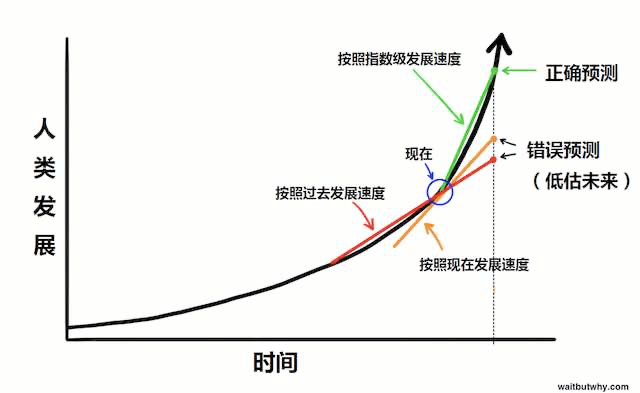

本文未经许可禁止转载，如有需求请与我微信联系：ifookit

## 1\. 至暗时刻

### 1.1 互联网是一种集权的技术吗？

2019年4月，纽约时报发布的一篇名为《减少互联网是唯一的答案》（_The Only Answer Is Less Internet_）将西方主流媒体对互联网行业的批判推到了一个新的高峰。

在此之前，仅2019年4月一个月，西方主流媒体就出现了 20 篇左右泛互联网行业负面评论（非新闻）。撰文媒体覆盖纽约时报、华盛顿邮报、VICE、Buzzfeednews、NBC、哈佛商业评论、《财富》、The Verge 等不同类型媒体。

而事实上，这种舆论批判的议程设置自 Facebook 剑桥咨询事件后已经持续一年左右。

与大多数并不直接阅读外文媒体的人群中的认知相反，互联网行业本身，早已不再是早年西方话语体系下自由与民主的象征，而成为了某种抽象的万恶之源。

在纽时的文章中谈到，互联网的发展模式往往被认为有两种，一种是完全由无形之手也即自由市场所主导的西方模式，另一种则是由强监管、强准入、强管理主导的东方模式。

文章认为从现在来看，这种对立分野似乎是错误的。因为无论是西方互联网还是东方互联网，最终殊途同归的走到了集权、矮化公民为消费者、侵犯隐私与操控舆论的这一终点。

在原文作者看来，西式的互联网在没有一个单一政权、单一企业或单一个人的情况下，自主的演进到这一步是一件比东方互联网更可怕的事情。因为这意味着，这些“恶行”是互联网的“必然”，是选择了互联网这条科技树的人类社会所经历的必然。

这似乎与我们在过去对互联网这一技术形态所赋予的平等、自由与民主大相径庭。更退一步说，在中文语境下，我们一般更认同的口径是“技术中立”，即技术本身不应携带任何价值观或意识形态。

我并不完全认可《减少互联网是唯一的答案》这一文章中所描述的全部逻辑，但我们不妨从这种惊世骇俗观点的解释来引入本文的叙事。

首先，从一个直观的例子开始说——互联网与隐私。

2018 年百度 CEO 李彦宏在中国发展高层论坛上无意中说出的“隐私换便利”，时至今日，这几乎成为一个无法解决的问题。与之相反，技术乐观主义者所描述的“技术是好技术，被商业公司用坏了”的说法反而愈发站不住脚。

当下，互联网产品及企业对用户隐私的侵犯深入至商业模式和产品体验两部分。这也使得民众对隐私的诉求在两条路径上成为不合理与不可能。

一、商业上的不合理（不可能）

从诞生以来，互联网在大多数情况下就以免费的姿态示人，互联网用户在使用大多数互联网产品时并不需要向服务提供方缴纳任何费用，但免费并不是一种商业模式，广告才是。

近年来，无论中外都有一些欠缺商业逻辑的普通用户会认为：

**我使用了某个公司的产品，为其带来热度这本身就是我给予商业公司的价值，因此不应该再拿我的数据去做广告。**

但“热度”的主要商业价值就是广告，而互联网广告的竞争优势就是利用用户的隐私。

尽管互联网广告在大数据技术成熟之前就存在，但事实是直到互联网广告开始“侵犯”用户的隐私，主流互联网公司才开始盈利。在此之前，没有用户画像、没有个性化推荐、没有精准投放的互联网广告对于广告主来说就像是投石入海，价值极低。

因此在这里只有一个清晰的选择：用户付出隐私成本获得服务，用户不付出隐私成本公司倒闭服务关闭。

其中一个理想化的第三条路是，将那些依赖于用户数据投放广告的产品，转换为直接付费的产品。简单来说，根据企业运营网站和App的成本，以及发展需求，拟定一个价格直接向用户收费，比如网盘现在就是这个模式。

但这种模式并不适用于所有业务，比如搜索引擎。而且在部分业务上，这会使得用户付出高昂的直接成本。

有一个简单的算法来计算这一方案的不可执行性，以百度为例，其 2018 年第四财季“网络营销营收”也既广告收入为 212 亿元。另据第三方统计，同期的百度 App 月活用户大约为 3 亿。

这意味着，如果百度向用户提供一个完全无广告、不搜集用户数据版本的百度App版本。百度需要向用户每季度至少收费 70 元才能与现在的营收水平打平。

这还仅仅是BAT一家公司中的一款产品所需支付的费用，如果你真的是一个隐私洁癖者，希望使用一个完全“干净”的互联网，那么你大概率根本付不起维持产品所需的费用。

更有可能的就是，用户根本不会用这些需要付费的产品。

因为互联网永远有竞争者，只要市场上还有一家产品在用投资人的钱补贴用户的同时，还不加入广告，那么其它已经开始收费的产品就不可能留住用户。

**二、产品上的不合理**

商业上的不合理暂且有看似可行的解决方案，而技术上更难实现不侵犯隐私这一目标。

自2015年，Google DeepMind 旗下人工智能 AlphaGo 击败人类围棋手以来，第三次人工智能浪潮正式浮上水面。但事实上，此次人工智能浪潮的起点应为 2006 年深度学习网络的概念被提出。

AlphaGo 的出现，其实已是第三次人工智能浪潮的尾声。自AlphaGo之后，我们开始看到基于深度学习网络的大量人工智能被投入到各类产品中应用。

到 2019 年末，我们已经摸清了这一次人工智能浪潮的两个关键点：

其一，是天花板——我们不可能指望这一次人工智能浪潮中涌现出科幻作品里那种强 AI 了。

其二，则是代价——想要便利，交出数据。

自 2015 年以后，尽管由于移动互联网的充分普及，互联网上所承载的信息进一步爆炸。但我们却很少再听到那个在互联网早期我们经常听到的词——“信息大爆炸”。

人工智能算法深入到了我们几乎所使用的每一款产品中，替我们筛选和过滤海量的内容、服务、商品甚至是好友。为我们节省了大量的时间和金钱，明显提升了互联网的使用效率。

可以说，在今天想要从互联网产品中彻底根除人工智能算法已经是一件不可能的事情，它会导致我们的许多产品功能从基础层面瓦解：

想象一个人工排版、搜索按上架先后顺序排列的淘宝；

想象一个按你所在位置半径 1 公里，只按距离顺序展示的美团外卖；

想象一个完全由人工编辑排版一天只定时更新几次的新闻 App；

想象一个不管你喜不喜欢，只是从内容池里随机丢给你一条视频的抖音；

想象一个只能靠搜索检索内容的知乎（这也太难了）；

即便是这些互联网公司愿意做出这样的选择，市场或用户的集体选择也会告诉他们此路不通。

至此，监管机构和民众对互联网行业“既要隐私、又要安全、还要高效”的需求是可以理解，但并不合理的。这一问题就像移动运营商所经常面对的“我不要建基站，但一定要有信号”一样，在技术和商业上是不可实现，至少现阶段看不到实现路径。

隐私与算法的对立，只是互联网所面临的宏观命题中的一例。我们将维度上升一层：“技术中立”是个伪命题吗？

是的，以现在的互联网技术来说，确实是不存在的。

首先需要说明的一点是，在中文语境下的“技术中立”与英文语境下的“网络中立”以及1984年“环球影业起诉索尼录影机”一案所确定的“技术中立原则”都不太一样。

更多的近似于美国 1998 年制定的《数字千年版权法案》（DMCA法案）中避风港原则所描述的内容，其大致为：互联网服务的提供者如不知晓用户的行为侵权，则在侵权案件中可以免责。

这一描述在后续扩展到不止于版权领域，网络爬虫、大数据、金融等行业先后使用“技术中立”甩锅，成为了“无知者无罪”的代名词。

但与大众所熟知的“避风港原则”不同的是，在现实执行中同样来自《数字千年版权法案》（DMCA法案）的“红旗原则”才更有实际意义。

红旗原则是指：只有在互联网络服务提供者不明知或者不应知晓自己所传播的信息属于侵权信息或者链接的作品、表演、录音录像制品是侵权作品的情况下，才能适用避风港原则免于处罚。

用一个现实的例子来说，**对 Bittorrent 这项技术来说，只有发明 Bittorrent 协议的公司是真正属于“技术中立”的范畴。**因为它真的仅发明了一项技术，其公司无法知晓其它第三方公司或用户使用这项协议传递了什么东西。

而与之对应的是，BitTorrent 协议中，需要搭建Tracker服务器，Tracker本身并不承载任何内容，但它是用户与用户之间建立传输通道的必要环节，这使得它有能力获得用户之间传输内容的能力。

尽管 Tracker 服务器上没有盗版内容、用户之间传递的盗版内容页不由 Tracker 服务器持有者提供。但由于 Tracker 服务器持有者“可以知晓”用户之间传输所存在的盗版行为，在这种条件下 Tracker 服务器持有者不主动对其上传播的内容进行规制，就不受到避风港原则保护，好莱坞可以起诉Tracker服务器的持有者并得到支持。

也即 Bittorrent 这项技术的技术中立性仅存在于真空之中，一旦使用便不再具有中立性。这事实上符合索尼录像机案所确立的“技术中立原则”，因为“盗版录影带”之所以与索尼无关是因为“索尼没有控制盗版录影带的能力”。

一个技术如果可以实现某种社会影响（无论是好还是不好），而技术的发明方、使用方没有能力控制这种社会影响，它才享有“技术中立”的豁免权。

接下来，我们将讨论再上升一层：如果技术不是中立的，那么技术带有意识形态么？

是的，照此推论，技术应当是具有意识形态的。

即一种技术无论其可以用来做好事，还是做坏事，且无论该技术的发明者是怎么想的，一项技术总有适合做某种事和不适合做某种事。延续上面的案例来说，就是在客观实践中，Bittorrent 协议用于传播盗版远比其在企业服务中的实用度高，应用范围广。

而技术本身带有意识形态并非是一种全新的分析框架，早在 1964 年麦克·卢汉就已经在其最重要的著作《理解媒介》中描述过“媒介即信息”——媒体天然具有意识形态。

而对于当下的互联网产品来说，一切产品皆为媒介。

用最简单的话来概括，媒介即信息指的是媒介本身并非是一种纯粹中立的介质。一种思想或一种表述，以什么样的媒介传递，决定了其与最终受众的互动方式。而这种互动方式本身，便是一种内容。

我们用更偏向媒介的媒体行业来举例，“互联网媒体”与“传统媒体”便是两种带有截然不同意识形态的技术形式。后者受技术所限只能单向传递，而前者由于实现了信息的双向传递，则必然鼓励原本信息接受者向信息主体生产者的转变。

在具体执行层面，两者最大的区别在于，**互联网新闻的正文并不总是代表着一次传播的全部思想表达，其评论区走向、甚至是否允许评论，都会被理解为所传递思想的一部分。**

如果承认“互联网存在意识形态”，我们就会意识到互联网的精神标签可能并不像我们最初所想象的那么美好。

李彦宏所提到的效率与隐私矛盾，只是互联网诸多不可调和矛盾的体现之一。

如果我们将目光主要集中在互联网所带来的弊病上，我们会发现，虽然我们不能将互联网的一切问题都归咎于互联网公司的主观邪恶。但更糟，因为这意味着互联网的恶行某种程度上就是互联网技术发展的客观必然。

这亦是马克思在生产力与生产关系相互掣肘在微观上的体现，即青铜器和铁器的使用促使奴隶制让位与封建制，印刷业的诞生必然引发启蒙运动并构成了资产阶级革命的基础。

一个技术无论其被发明的初心如何及使用者想要其如何运作，其运作方式自身便带有某种对社会的影响而非仅仅是推动生产效率的提升。

理解这一点，是我们理解当前互联网所面临处境以及理解本文剩余内容的一个大前提。

### 1.2 为什么当下开始批判互联网的“原罪”？

显然，互联网绝非一种带有集权主义意识形态的技术，互联网企业也绝非一群驱使着技术的邪恶魔王。

但这并不意味着万事 OK，天下太平。

《减少互联网是唯一的答案》一文存在的价值，并不在于真的呼吁从现在起整个人类社会应当减少互联网的使用，而在于启发我们在当下应该开始思考这一问题。

“这一问题”是哪个问题？我们要把时间稍微往回调一点，从 iPhone 的发布开始说起。

2007 年 1 月，乔布斯在旧金山马士孔尼会展中心的舞台上发布苹果公司第一代智能手机 iPhone 时，虽然行业、媒体与消费者的“沸腾”程度远超于之后的任何一次消费电子领域的发布会。

但没有人意识到，**苹果公司开启的是自苏联解体以来，人类消费科技的最后一个技术奇点。在 iPhone 面世的 10 年里，再没有一款产品，像智能手机那样彻底改变我们的生活、工作甚至是社会运作方式。**

移动互联网是互联网的二次爆发，也是互联网这一次技术革命的尾声，它将互联网给人类社会带来的变革推向了最大化。随着移动互联网的全面普及，在这之后的每一天，互联网能给整个社会带来的收益都是更少而不是更多。

因此，上文中提到的需要思考的“这一问题”，也即当下互联网唯一的问题是：这一轮技术革命，结束了，我们怎么办。

以移动互联网为范例，每一次技术变革为经济增长或社会变革所带来的影响基本来自于两个维度：

其一，技术裂变的能力，用人话说就是有多少后续技术会被该技术引爆。比如移动互联网带来了通信技术，显示技术，云计算技术，大数据技术，区块链技术，人工智能技术等相关技术的发展。每新引爆一个次生技术点，就会让技术革命的火焰变得更强一些。

其二，技术普及的能力，用人话说就是有多少人可以被卷入技术革命。技术的应用门槛越低，可能被卷入的人就会越多，技术革命的延续时间就会更长。比如移动互联网诞生前（2008年），网民数是不到8亿。移动互联网诞生10年后的2019年，网民数是 43.88 亿。

而回归到“互联网-移动互联网”这一技术变革，这两条链式反应已在2018-2019年左右到达了顶点——所有能用互联网的人都用上了互联网，所有能接入互联网的业务都接入了互联网。

在整个技术变革燃烧的过程中，技术所做的一切都是正确的，因为它能够肉眼可见的提升整个社会的福祉。

尽管今日头条创立早期一直被诟病为“由算法驱动的垃圾堆”，但不容忽视的事实是在今日头条之前从未有一个新闻App能够获得上亿的日活，它所带来的信息平民化是不可忽视的。

尽管抖音和手游被认为“祸害了下一代”，但事实上是在此之前人类从未创造出如此唾手可得且成本低廉的娱乐方式，它们所带来的娱乐（快乐）平民化也是不可忽视的。

这就好像在转基因问题上，一些反转基因的观点认为在进行长达数十年的超长周期研究验证转基因是绝对安全之前绝对不允许给人类食用。而现实是，转基因食品为全球许多贫困地区的贫困人口提供了在当下活下去的可能性，停止对转基因食物的投产无异于大规模屠杀。

在进步的绝对性上，我们总归需要先解决“有没有”的基础性问题，才能有讨论“怎样让它变好”的正当性。

正如当人类能够生产出498大卡/ 17元的食物（一个标准巨无霸），我们才会开始关注糖油盐的负面效应，对互联网所带来的数字“糖油盐”也是同样。

随着技术裂变程度和技术普及程度双双到达天花板，“有没有”这一基础性问题已经被解决。于是，我们会开始潜移默化的开始关注它的正当性问题。

2018 年开始，全球互联网行业出现非常明显的道德性危机，从Facebook到Google，从滴滴到百度，从今日头条到携程出行，以至于2018年被戏称为“互联网公司道歉年”。

这种道德性危机遍布于不同国家与地区，互联网的不同细分领域，不同年龄层面的公司，他们唯一的共同点就是他们都是互联网公司。

这种危机爆发的深层次原因是来自于上述两个链条的熄火，整个互联网行业能给社会带来的刚性福祉增长放缓。

用更简单地话来说，如果所有人都习惯性地享受到了互联网所带来的便利时，就到了该开始关注互联网负面影响的时候。

事实上，从宏观层面上传统意义上的政府和学术机构比公众更早的意识到了互联网福祉见顶后的系统性风险。

各国政府（无论原本处于哪个阵营）均开始加紧研究和制定对互联网及数据隐私的监管政策：如欧盟的《通用数据保护条例（GDPR）》（2018年生效）和《数字化单一市场版权指令》（2018年通）、美国的《澄清域外合法使用数据法（2018年生效）、中国的《网络安全法》（2017年生效）、英国的《在线危害》白皮书（将推进立法议程）、俄罗斯的《主权互联网法案》（2019年通过）等。

民主国家觉得互联网破坏了民主，独裁国家觉得互联网破坏了独裁。那么唯一的可能，就是互联网在更务实、更微观的层面开始展现其负面作用，以至于任何形态的上层建筑都开始对其产生敌意。

以上所列文件的立法动机虽各不相同，但其在实操层面均通过“使互联网不再像过去那么互联”来的减少互联网的负面。

而更可怕的是，这类法律无论在传统意义的民主国家还是威权国家，都得到了从统治机构到民众的主流赞成，并且即便是在最自由的国家也没有受到太大的阻碍。

值得一提的是，以 GDPR 为代表的监管政策显然并不能达成良好的效果。

根据美国经济研究局（NBER）在2019年3月发布的报告《GDPR对科技创业投资的短期影响》，GDPR使新兴、年轻和成长阶段欧盟企业每笔交易融资额分别缩水27.1%、31.4%和77.3%，新企业每周减损90万美元投资，使成熟企业每周减损710万美元投资。

类似 GDPR 这类法规，对于 Facebook、Google 等跨国巨头来说，只是一个可被量化的合规成本，而对于尚且弱不禁风的欧盟本土互联网企业来说这些合规政策就被视为不可逾越的高门槛。

本文无意为上述任何一种管理方法摇旗呐喊，亦不去探讨如何建立一个有效的互联网管理制度，我们只解释为什么互联网会从一个几年前万众仰慕的行业变成一个“过街老鼠”。

因为只有清晰的定位互联网自身的问题是什么，才能有可能找到真真正的解决办法。而显然，无论是媒体、公众、学术圈和各国政府都尚未给互联网发展带来的问题进行一个合理的解释。

## 2\. 未被兑现的承诺

### 2.1 社会决定论与技术决定论之争

1996 年 2 月 8 日，作为对美国 1996 年电信法案的回应，数字前哨基金的创始人约翰·佩里·巴洛发布了《赛博空间独立宣言》。这篇在早期互联网上获得了4万次转载的文章第一段如此写到：

> 工业世界的政府们，你们这些令人生厌的铁血巨人们，我来自网络世界——一个崭新的心灵家园。作为未来的代言人，我代表未来，要求过去的你们别管我们。在我们这里，你们并不受欢迎。在我们聚集的地方，你们没有主权。
> 
> [A Declaration of the Independence of Cyberspace](https://www.eff.org/cyberspace-independence)

这是一个典型的技术决定论的宣言，它代表了早期互联网从业者对整个互联网技术乌托邦式的美好幻想。它将赛博空间与现实空间分割开来看成两个互相不应干涉的主体。

这违背了任何新技术必将作用于社会并被社会反作用的客观规律，站在当下来看，只要接入赛博空间的电脑、手机和支撑起赛博空间的服务器、路由器和实体光缆仍然是由工业大机器生产的，任何一个赛博空间都不可能逃脱“工业政府”的管理，这个逻辑在中文语境下有个更简短但被滥用的表述“网络并非法外之地”。

虽然赛博空间的独立并没有成为真正的现实，但不可否认的是这种技术决定论所带来的乐观主义一直主导着互联网的发展。

在过去的 20 年里，互联网行业领袖和从业者都沉浸在自身事业为社会带来福祉的荣誉感中无法自拔。正如之前所说，在两条链式反应纷纷断裂之前，技术乐观主义某种程度是正确的——福祉只要跑的比问题快，问题就不是问题。

但当客观上的两个增长引擎的熄火，技术乐观主义和技术决定论就会成为阻碍互联网行业自我修复与疗愈的力量。

就像只有承认贫困，才有机会解决贫困一样，互联网当下所面临的问题是，它自诞生以来便是由一群技术决定论+技术乐观主义者主导的，而这部分领导者并不愿意承认互联网存在它的技术灰暗面。

用更简单的话来说，就是如果你甚至不承认互联网的负面问题与影响，就更无从去解决它。

以科技向善为例，大部分人对科技向善的理解是“科技本来向善”，即科技的发展天然具有推动人类社会走向更美好的未来的趋势。但如果你只理解到这个层面，那么你可能就是一个典型的技术乐观主义者，同时还带有技术决定论倾向。

因为如果只理解到这里，则暗含着科技天然不会作恶，且科技的向善必然导致社会的向善这两个潜台词。

而现实是，科技是可以作恶的，而且即便是对于那些本意不想作恶的技术也有可能客观上推动恶劣的社会影响，比如核能。

因此，我们应该推动的不只是科技发展具有天然推动社会福祉的作用，还应防止科技被应用到社会福祉的削减，即减少科技发展所可能带来的负面影响。

技术乐观主义者会认为，即便技术带来了问题，技术自身的发展也会进一步解决这些问题。

从某种意义上，这是对的。技术确实总是会推动人类社会的进步，但那往往指的是突破性的技术革命。而突破性的科技革命并不总是覆盖我们社会发展的全过程，在一个现实世界里，我们要习惯于两次突破性技术革命之间漫长的滞涨。

在过去几年，我们看了太多的文章将人类三次技术革命的时间点画在一条轴线上，并依据第三次与第二次技术革命之间的间隔远小于第二次与第一次之间的间隔，来推断出“这是个越来越快的等比数列”或“指数曲线”。

这似乎明显乐观过头了。

在复杂经济学创始人布莱恩·阿瑟所著的《技术的本质》一书中，将技术定义为“有目的捕获并利用现象的方法”。并因此，组合被视为技术进步的重要来源之一，它就像是我们用乐高搭建一个物品——我们需要有轮子、传动装置，才能构建车。

技术乐观主义者认为，手中所拥有的积木越多，我们就越有可能组合出新的物品，而这些物品则能成为更新物品的组成部分。

但我们可以很轻易的提出一个与该理论二律背反的解释方向：我们手头的积木半成品越多，我们将它们组装成一个有意义物体的几率就越小。因此，我们为了组成一个新的有意义物体所要付出的成本就越高。

这个与技术乐观主义者相悖的推理，反而更符合我们日常生活中的直观认知——一个差生想从 1 分做到 60 分很容易，但想从 0 到 1 分和从 99 分涨到 100 分都难之又难。

如果我们采信后面这种对下一个技术革命相对悲观的预测方式，这就使我们不得不采用技术乐观主义者所不齿的传统手段——诸如法律、文化、道德、经济等——来解决技术所带来的问题。

但首先，解决问题的前提是定义问题。

在对互联网技术进行盖棺定论式的分析之前，我们必须理解互联网在哪些领域的尝试是失败的——亦或是说互联网没有完成它的哪些承诺。

互联网早期承诺为整个社会带来的福祉，它确实做到了不少，但也有一些是无法实现甚至起到了反作用的。这很大程度上是由于技术乐观主义者错误估计了技术在社会变革中的主导地位，低估了社会因素对技术的影响力。

即，我们接下来的第二章会从互联网没有实现的承诺角度，梳理互联网与社会互动的过程中，哪部分是由技术决定的，哪部分是由社会决定的互联网。

由此才能摸清技术因素与社会因素在最终对社会造成影像中的平衡点。

### 2.2 未能缩小社会格差

2005 年 4 月 5 日，《世界是平的》一书在美国出版，两年之后这本书铺满了中国每一家书店和天桥上的盗版书摊。

一个由贸易网、金融网和信息网紧密交织的平坦世界徐徐展开，互联网被认为是使这一平坦世界成为现实的最后一块拼图，再也没有什么能因素可以阻止人类在广阔的地标上连为一体。

互联网会让世界变平这一承诺也深深地印刻在许多人的脑海之中。

这种承诺基于一种很天然的假设：**如果你可以通过金融网获得美元、你可以通过贸易网购买美国的商品、为美国公司工作、你可以通过互联网浏览美国的信息、获得美国的教育，在某种程度上你就是美国人，反之亦然。**

然而这种天然的假设并不正确，它完全忽视了区域间成百上千年的文化差异与经济基础差异。

作为信息连接器的互联网与全球金融和贸易网一样，它仅仅意味着将网络的两端连接在一起并不意味着会使得两端得到平衡。

正如全球贸易网打通，在历史上酿造了欧美对印度、中国等亚洲国家的殖民，金融网打通构成了全球经济危机的前提条件一样。

互联网连接一切之后，信息差并不会自动抹平，但确实会创造更多利用信息差的商业机会，而其中的一部分甚至会演变为基于信息的新型剥削。

在这里，我们从三个不同层面解释上述内容。

第一个层次十分浅显：即在微观层面面临的“奶头乐”问题。

关于奶头乐理论本身，在这里不再赘述，我并不同意奶头乐理论的全部观点，这里只是借用奶头乐指代“免费、易得、娱乐性高的娱乐方式”。

“奶头乐”引发全民沦丧是一个伪命题，但“奶头乐”确实会引发信息格差问题。

在移动互联网时代，唾手可得的娱乐产品平等的降临每个人的指尖，但只有那些数字素养较差的群体才会深陷其中。互联网在这些沉迷“奶头乐”的人中，起到的是增加信息格差的作用。

免费易得的娱乐产品会占用更多他们原本有机会获得学习和晋升的时间。

而对比之下，对于数字素养较高的人来说，这些娱乐产品仅仅是他们网络生活的一部分，他们更加懂得如何管理自己的时间、管理自己的互联网行为，利用互联网获取更多的信息、知识与机会实现个人生涯的进步。

用更简单的话说，就是城市里的年轻人可以利用网络学编程、求职、拍Vlog、学外语、结交贵人。而对乡镇青年、厂哥厂妹、进城务工人员来说，网络只是洗脑神曲、擦边球直播、劣质游戏、境外非法赌博网站与现金贷。

“奶头乐”并非全民问题，它只是网络带来的信息格差问题的子问题，**最大的问题在于，此前从来没有人意识到互联网有可能增加信息格差而不是减少。**

无论在西方还是东方，“网络普及使信息格差增加”都是一件不曾预料的事情，到今天为止许多观点依然认为“是否能连接互联网本身”是影响信息格差与数字鸿沟的最重要因素。为此，世界各国政府、慈善机构、商业组织扶持了海量的互联网基础设施建设以及终端发放福利（免费的手机与电脑）。

在 2018 年皮尤针对美国人的一项调研中显示，白人、黑人和西班牙裔美国青少年中智能手机的普及率都接近 100% <a href="https://1q43.blog/post/673#cite1" data-type="internal" data-id="#cite1">[1]</a>，但这并没有对他们的学业或就业产生促进作用。不仅仅是智能手机，即便拓展到当今已彻底“沦为”生产力工具的 PC，使用率对就业与学业也无直观影响<a href="https://1q43.blog/post/673#cite2">[2]</a>。

除皮尤的这份调研外，杨百翰大学选举和民主研究中心（2019）[3]，离异或单亲家庭中31.9%的青少年每天在屏幕上花费的时间超过3个小时，而这一数据在双亲和睦的家庭中为15.1%。在已婚的白人家庭中，54.7％的青少年每天花在屏幕上的时间不到一小时，在同一类别的黑人家庭中，这个数字是28.4％。白人双亲家庭中，每日使用社交媒体1.5小时以上的青少年占17.2%；而黑人双亲家庭中，这一数字上升到32.1%。

这些结果与 Common Sense Media 在 2019 年<a href="https://1q43.blog/post/673#cite4">[4]</a>、美国西北大学在 2011 年的近似研究<a href="http://cite5/">[5]</a>相互验证。

也即，互联网对于原本就处于经济弱势的人群来说，正面作用远没有负面作用来的显著。

另一个更直观的感受是，在中国，对于一个身边没有父辈直接管教的留守儿童来说，再严格的防沉迷系统也是失效的。因为这本质上陷入了一种对抗思维，而一家企业、一个平台、乃至一个政府是不可能与千千万万个儿童的“战斗”中取得胜利的，只有他们的家长可以。

这种对同一媒介不同使用方式的鸿沟，被称为“三级数字鸿沟”，这一概念最早被荷兰特温特大学著名社会学教授Jan van Dijk在2002年提出。该概念关注在可以同样流畅熟练使用互联网的情况下（已越过前两道数字鸿沟），不同社会群体的不同网络习惯所导致的自我构建。在这一方向上，有许多论文验证了在相对富裕的人群中互联网的作用更积极，而在相对贫穷的（但可使用互联网）人群中互联网的作用更负面。在此不做更多引用。

中观层面，互联网对全球的链接构成利用信息格差进行剥削的基础条件，这一现象在美国与欧洲之间十分明显。

我们都知道，互联网服务与商品具有地域上的无边界性，世界上的大多数国家在过去30年中并不存在“互联网海关”。

而这导致了一种现象，即一个地区的互联网公司，可以绕过税收、法律、经济政策等一切构建现代社会的元素，在另一个地区经营。

用一个不严谨的例子来说，在过去任何企业如想面向欧洲用户做广告，其广告交易行为必定发生在欧盟境内，因为广告公司必须在欧洲诸国境内持有广告媒介资产（如日报社、电视台、广告牌等）。随着广告交易的发生，广告公司必定按各国法规规定缴纳对应数额的税金。

而在互联网时代，任何企业可以在任何地点通过 Facebook 和 Google 向欧洲用户投放广告，广告的实际交易地可能是广告主自身所在地（通过所在地的 Google 代理），亦有可能是 Google 或 Facebook 的默认属地美国。

也即是说，一家中国公司向欧洲投放广告，广告交易所产生的 GDP 及相关税利归属于中国或美国。

这比实体贸易中的任何一种避税模式都要精妙，因为它实质上让一次关于欧洲民众的销售行为，在物理空间上与欧洲完全不发生关系。

虽然税收在大众语境来说并不是一个十分讨喜的词语，但不得不重申的一点是：目前这个地球上的大多数国家，依然需要依靠税收来维持其对国民的安全保障、福利供给和基础设施供给。

Facebook 和 Google 可以轻易的收割欧洲用户的注意力，并产生经济价值，而这些价值最终却主要流向其它地区不是在欧洲本土。无论这是否是互联网公司的原意，但这客观上构成了数字时代的新型经济殖民，削减欧盟诸国社会福利的资金来源，而欧盟境内的国民却很难注意到这一点。

这一现象的本质，是由于互联网服务与互联网商品背后，大多依然由一个实体企业来进行运作。

而诞生于资本主义革命早期的“现代企业制度”其实已不再现代，其局限于看得见摸得着的原子经济，具有很强的贸易网属性。基于对现代企业制定的现代经济与税收制度同样过时，使得互联网的经济效益并不会随其商品和服务的穿透而穿透。

这与几个世纪以前全球贸易网出现端倪时所发生的的现象有极高的相似性，第一次及第二次工业革命后，资本主义国家对世界上其他国家做的每一件事情在微观层面上都是有益的。

站在“政治不正确”的立场上，殖民主义打开了落后国家的市场，让这些国家的消费者得以购买到更为优质、廉价的商品，随着贸易网也使得先进思想流入这些国家继而在全球引发了资本主义革命推翻了大多数的封建王朝。

但这并不能抵消在这一历史进程中，无数的“落后国家”及其民众在鸦片贸易、奴隶买卖、侵略战争、内乱中所受到的巨大苦难。

尽管从整体人类历史的视角，资本的原始积累被视为必要的，在其特定的历史阶段有时代的“正当性”。但这并不意味着我们应当为了发展在二十一世纪再重来一次。

欧盟近年来一直致力于解决这一问题，并推出了《通用数据保护条例》（GDPR）和《数字化单一市场版权指令》（COD）等法规，但截至目前为止这些尝试都没有很好地效果。由以GDPR为甚，其生效后对欧盟本土互联网企业的打击比跨国巨头更加显著，已成为搬起石头砸自己的脚。如何在贸易保护主义和被经济殖民之间寻找到合适的平衡点，暂时还没有答案。

宏观层面，风险顺互联网蔓延的速度远超于经济利益和福祉，这会长久的影响人类的社会治理形态，乃至最终可能使我们的历史走向发生变化。关于这一问题，我们会在第四章“风险社会的最后一根稻草”中详细论述。

### 2.3 未能打破一切藩篱

1992 年，美国政治学家弗朗西斯·福山发布著作《历史的终结及最后之人》。

为了防止有读者没有直接或间接的了解过《历史的终结》，在这里我们简单的描述一下它：在这本书中，福山所提出的历史终结论，是指当的苏联解体、中国开始实行改革开放后，人类社会之间的本质冲突已经消失——人类文明在经历了漫长且痛苦的演进之后，终于迎来了一个终局模式（书中认为是美国模式）。

也既因为找到了这一最优模式，人类社会会停止演化，各国家、地区、种族之间基于社会范式之争所引发的冲突与战争也将全面消失。

历史终结论之后的近 30 年中一直在西方的主流话语体系中占据很重要的位置，同时亦被以中国为代表的东亚国家所批判，因此反复被人所提及。但其作为学术作品的预测性与归纳性却不及其论敌塞缪尔·P·亨廷顿在之后一年所发表的《文明的冲突与世界秩序的重建》。

在《文明的冲突》中亨廷顿否定了冲突的消失与历史的终结，并预测随着政治性斗争结束，文明、文化层面的斗争将会开始。文明的冲突比过去的任何竞争都更为复杂与隐性，但其最终依然会以我们所熟悉的经济、金融、实体战争的方式表现出来。

文明是一种难以被精确定义的东西，但它又客观的影响着每一个人对自己的定义和行为。“人们用祖先、宗教、语言、历史、价值观、习俗和体制来界定自己”。使得我们无法像经济学中假定的理性经济人那样，在每个决定上做出帕累托最优解。

这种影响深入人心，从微观到宏观，从而导致不同的国家即便在拥有相同的政治经济体制、共同的利益下，依然做出截然相反的顶级决策。

文明的冲突在于，其存在自反性使得其竞争最后不像社会形态竞争那样会产生出“最优解”——这里需要特殊解释一下，多元文化与文化多元的区别。

以美国为例，美国被公认为世界上最大的多文化融合国家，其多元文化的包容性远超其他国家，使得来自任何文明，持有任何文化的成员、商品或文化符合都能在美国社会存活并得到一定程度的成长。

但其结果是，美国只有一种文化即一种多元的美国文化，其它文化在美国文化之下只是多声部叙事中的一个片段，并不影响美国文化的主旋律叙事。

也就是说，多元文化是指一个文化可以包容许多来自不同文化的成员与要素，本质上多元文化是一种文化。而文化多元则正相反，它就是指多个文化，它不要求每一种文化都包容其它文化并最终趋同成为一种文化。

回到我们刚才提到的自反性：如果你倡导文化多元，你就要容忍一些不与你兼容极端文化；如果你倡导多元文化，那么你实质上是在消解其它文化的完整性与独立性。

那么，这个自反性对互联网产生了什么影响呢？

从直观上看，互联网似乎是支撑福山“历史终结论”的论据，当政治与经济制度逐渐趋同的时候，互联网促进交流可以促进全球文化的融合，并形成统一的多元文化叙事。

而事实上却更相反，由于个体交流的本质是低效且无序的，反而加剧了各文明圈之间对彼此的刻板印象与歧视——不同群体之间将彼此的文化符号作为文化本身，这使得讨论更容易非此即彼。

用一个去政治化的例子来解释这一问题，为什么群聊、BBS 会比微博和 Twitter 类的广场类社交更有趣、更和善产生的内容价值也更高？<a href="http://cite6/">[6]</a>

原因是群聊、BBS 往往拥有特定的主题与话语体系，其可以针对某一议题展开更顺畅和深度的对话。而每一个话题中素质或层次较低的发言，会在圈子内部就被首先干掉，没有继续进行下去。

而在微博等广场式社交上，话语体系的交叉使得可以进行共性对话的内容其实很少，尤其一旦开始论战，F-Word 往往比摆事实讲道理有用的多——也即在中文互联网圈被称之为“被傻X拉到和他一个层次，并被他丰富的傻X经验战胜”。

这是一种逆向筛选，既在相对狭小的舆论环境中，更有理的人更容易“声量大”；而在绝对开放环境中，则是谁的声量大谁“更有理”。

这最终会导致无论任何一个文化，都是由最不能代表其优越性的那一拨人来代表形成他人对这一圈层的印象。

同时，互联网在交流的呈现形式上也存在一定问题。碎片化、图形化和随机化的信息传播无助于我们对彼此构建理性的认知。

无论我们是支持福山的历史终结还是亨廷顿的文明的冲突，我们显然不想看到的是这种层级的吵架。文明与文明之间的竞争，最终的结果是融合趋同还是花开各表，都应该更优雅而非相互倒垃圾。

此刻，我们几乎应该庆幸 AI 翻译尚未发展到，让地球上每个人无论说什么语言都可以顺畅对话的阶段。否则，我们地球上任何人一上线都将面临 70 亿杠精。

这一现象会深远地影响我们社会的方方面面，尤其是互联网产品实质上将公民注意力证券化并实现交易之后，理性讨论的商业价值远低于流量骂战。

互联网的商业属性加剧了这一趋势，互联网虽不能很好的传递文化本身，却是传递商品化文化符号的极好通道。任何一个人都可以在网上购买到和服、黑人音乐和中国结，于是这些抽象化的文化符号商品被越来越代表其孕育这些商品的文化本身。

但文化符号是具象的，局限的，静态的，它容易被滥用，被误解和被攻击。

这种以符号指代群体的现象，甚至可能会将言论自由逼上死角。

2019 年，NBA 火箭队总经理莫雷辱华事件，是这一问题的集中体现。

在此之前，NBA 曾经有过至少 4 次辱华事件，造成 2 次官方停播。但从没有任何一次像莫雷那样在中美两国同时引发如此大范围的影响。

一方面，这是因为中国的集体荣誉感上升。但另一方面，是因为前 4 次对于大多数中国人来说根本不知情。

侮辱这一动词，是需要有一个承接动作的客体的，在互联网之前，侮辱一个国家往往是一个较为模糊的行为。一次“私密”的辱华，只要足够私密，可能根本不构成辱华。

这并非是鸵鸟政策，因为即便在日常生活中，也存在不同圈子内部对另一个圈子的鄙夷或嘲讽。它近似于“有人背后在小圈子里骂人”，虽然不道德，但不造成重大影响，被“侮辱”的人实际上因为根本没有感受到侮辱，而导致侮辱并不成立。

但在互联网之后，广场式社交媒体第一次赋予了个体侮辱一整个群体中每个个体的能力。

这便是莫雷事件的标志性意义，他的言论使得几乎每一个看到了这一言论的中国人个体感受到了侮辱，进而使得后续的和解也变得极为困难。

互联网的群体符号抽象化为个人攻击群体提供了靶子，互联网的信息传播速度和方式为个人攻击群体提供了工具。去政治化的日常讨论中，饭圈之间的相互攻击与拉踩也是通过这一过程实现的。

回归源头，言论自由是否代表可以发表不专业、不理性甚至不准确的内容呢？在“言论自由”一词诞生的年代，是这样的。因为在复杂的现代社会下，如果要求每个人都处于信息充分了解，拥有专业知识和绝对理性下才能发言，无异于让所有人都闭嘴。

但在言论自由这一概念被提出的时代，人类个体并没有被赋予简单无门槛的向70亿人发声的能力。

或者退一步说，“保证任何言论不入罪”是否和“向 70 亿人发声的能力”是否是一个互斥要件？

### 2.4 未能呈现真实的世界

无论从任何角度来看，2006 年上线的 Twitter 都是一个值得被载入传媒史的产品。

与Facebook不同，它开创的“广场式社交网络”品类在之后的十年中革命性地影响着全球每一个国家和地区的传媒生态。

无论是 Twitter 还是微博，广场式社交网络首次赋予个体人类不通过任何中介机构向大众发声的权利，由此所诞生的自媒体这一概念一度成为全球传统媒体的威胁。

Twitter 在其发布框中嵌入的文案“What’s happenning ?”有着极强的隐喻，而事实上，最初的大多数推文也确实都包含 What Where When Who Why How 的新闻六元素。

由此带来的，一个朴素的幻象是：任何记者都不可能比事件当事人更快、更准确、更真实的描述事件的发生。

它在后续演变成了一种新媒体与自媒体对大众的承诺，并以此作为武器与全球不同地区的传统媒体展开竞争。在一段时间里（约 2015 年前），大众眼中“自媒体”成为比“传统机构媒体”更具权威性的信源。

这种朴素幻想的来源，是广场式社交对传统媒体的冲击会来自于对一手信源的把控。

传统媒体在过去的几百年间，为了能在第一时间拿到事发当地最准确的报道在全球建立了上万家记者站，并为此支付了巨大的人力成本。而对于 Twitter 来说，每一个用户就是它的记者站，并且它无需向用户支付任何费用。

尽管，目前无论是中国还是西方的传统媒体依然没有从信任危机中走出来，但不得不说的是即便是那些经常被网友斥责为“假新闻”的媒体，也有着比社交媒体好的多的事实核查机制。

举一个最简单的例子，目前网络上一些失信的自媒体经常被嗤为网络《故事会》或网络《知音》。但事实上，《知音》杂志一直设有事实核查员岗位，独立于编辑部对采访素材中的关键细节对受访者进行回访确认。而《故事会》一直是一本定位于原创虚构小说的文学性刊物。

而更关键的问题在于，对于广场式社交的每一个用户来说，事实上没有责任保证自己说的话是正确或准确的，因为这对于一个自然人来说是一个不可能的事情。

尤其是对于一些重大事件来说，广场式社交所推崇的事件当事人自我发声可能会陷入一种更不理性的状态——这在心理学上很容易找到支撑，比如一些人在目睹枪击案后会将凶手与一个完全无关的人联系起来，或凶手在现场所说话产生臆想。

而另外一些遭遇天灾（比如地震）的人可能由于多年非理性的不满，将天灾造成的损失投射到某种人祸之上。

如果我们把社交媒体看做一个整体，再把中国网民仅1成拥有本科以上学历<a href="https://1q43.blog/post/673#cite7">[7]</a>和中国全民精神障碍疾病患病率可能超过17%[[8]](https://1q43.blog/post/673#cite8)两个数据作为背景参考，那么全球的社交媒体有可能是人类历史可信度最低的媒体形态没有之一。

另一方面，由于每个事件的当事人几乎都是不同的人，个体用户无需为自己的长期新闻信誉负责，这使得故意造谣者也变得有机可乘。在当下的实践中，我们现在已经陷入了无法分辨一个新闻当事人爆红的背后究竟是新闻当事人个体还是议程设置团队的局面。

我曾在《为什么，我们觉得越来越多的媒体没有良心？》中解释过，从微观层面来看具体的某一个传统媒体不一定要报道真相，对于媒体来说真实感往往比真实性更为重要。

但与传统媒体相比，广场式社交上的个人媒体往往带来的是十倍的真实感和十分之一的真实性，这对社会来说无疑是有害无益的。

本质上说，广场式社交网络赋予了每个人以媒体属性，这种属性既伤害了媒体又伤害了社交。它让我们原本无需为公众负责的正常地社交行为不得不变得小心翼翼，但同时又让严肃新闻传播的公信力变得千疮百孔。

换句话说，严肃媒体因无法与个体发声者比拼“真实感”和“速度”，而个体却因为带有了媒体属性而被迫要求任何发言都要有“真实度”和“专业性”。

广场式社交并非是惟一一个对媒体行业带来伤害的产品形态，另一个则是推荐算法。

在传统媒体或者是 1.0 时代的网媒，编辑的作用不只是审核稿件，更重要的是将恰当的内容放在恰当的位置以引起读者的注意。在某种程度上，这也是编辑对稿件拥有增删改权利的基础。

因为整体版面有限，编辑才得以拥有权利砍掉那些质量不够的稿件；因为版面尺寸有限，编辑才得以拥有权利砍掉稿件中的冗余信息；因为版面的位置有优劣之分，编辑才得以有权利将稿件及新闻事件本身三六九等。

但在千人千面的算法时代，版面不再掌握在编辑的手中。这使得无论是传统媒体还是新媒体，编辑只在行使其审阅稿件的底线权利，机械的以一些编辑规范来保障出稿的安全性。这使得编辑在媒体行业中的地位处于长期稳定下行周期，某种程度上也是目前媒体行业文章质量长期稳定下滑的一个重要原因。

“人民群众喜欢的，你算老几。”，是反驳编辑理应拥有议程设置权限的主流观点之一。但事实正如前文中数字鸿沟部分所谈及的那样，当数字素养低于某一个临界点的时候，人们会主动筛选出更为低质量的内容以满足短期的多巴胺刺激。这是非人类 AI 编辑所无法抗衡的。

从另一个角度说，千人千面的算法使得针锋相对的观点统一在了一个虚无缥缈的统一舆论场之下，长期来看会加剧人们的偏见与固有印象。

用美国的媒体生态来举例，在过去美国传统媒体呈现出典型的左右分野，以华尔街日报、CBS、纽约时报为代表的左派媒体与华盛顿邮报、FOX为代表的右派媒体会基于各自的立场对同一事件给出不同的解读，这使得两种立场长期处于一种慢性交锋竞争的状态。

而在新媒体环境下，你很难说清楚 Google News、Apple News 或者 Youtube 的政治立场是怎样的。事实上，他们会完全依照读者的喜好为其呈现出最符合读者调性的报道。

在 2019 年的香港风波中，有香港家长发现使用自己的帐号登录Youtube和用自己孩子登录的 Youtube 所看到的内容是完全不同的。我们善意的猜测 Google 对此完全没有干预，因为事实上这正是一个“中立”的推荐算法所追求的——为读者呈现它想看到的东西，并告诉他这就是全世界。

在过去，即便是一个常年订阅纽约时报的人，也有可能在一些重大事件上去主动打开 FOX 新闻听听“对面”的说法。

但在算法驱动的舆论场下，虽然立场两端的观点依然存在，但实际上失去了交战的场所。不同的新闻被完全分发给完全不同的人，形成相互隔离且愈发极端的舆论场。

这种隔阂几乎出现在每一个由算法驱动的互联网产品，而非仅仅局限于媒体类App中。在抖音、快手、微视中，我们看到大量彼此完全没有交集的群体，并且每一个群体都能找到极为广大的受众。比如大多数人提起直播带货，想到的都是李佳琪。但与李佳琪主打一线城市市场不同的，快手的带货网红辛有志凭借亲民的调性将一个又一个城里人完全没听说过的品牌与产品卖出远超李佳琪的成绩。

这种人以群分的现象并非互联网诞生之后才产生的，但互联网尤其是推荐算法确实促进了这种现象。

老图重温

在前互联网时代，媒体的议程设置（Agenda Setting）已经是一个公开的秘密。我们几乎都知道，每个媒体会根据自己所处的立场去进行带有倾向性的素材剪辑。但这同样意味着，我们可以轻易的找到反向议程设置的媒体去了解“另一面”的声音。

互联网剥夺了（新老）媒体议程设置的能力，但并没有消解议程设置，它通过信息茧房将议程设置固化在我们每个人自己的世界中。

与传统的人与群分不同的是，算法驱动的人以群分很容易让人忽视“群”以外的世界，在信息和社交层面上的茧房会让身处其中的人更容易误解自己所看到的就是整个世界。

搜索引擎是我们突破信息茧房最后的出口，但随着搜索引擎这一产品类目在世界范围内使用率的下滑，谁知道距离推荐算法入住搜索引擎排序还有多少天呢？

当人们获取资讯的方式从主动订阅、搜索，变为被动的“下拉刷新”的时候，互联网便不再是一扇通向世界的窗口，而只是一个善于美颜的镜子。

用最直观的说法来说，如果一个人每天阅读的文章都是10万+，那他一定会认为自己所阅读的这些内容就代表主流舆论的声音。但事实上，机器只是将符合它胃口的文章推送给了它。而对于超过8亿的中国网民来说，即便是一个篇篇10万+的公号来说可能也只是找到了整个舆论场中很小的一个缺口，并不代表着主流观点。

对于每个舆论场中的发声者和受众来说，都更加认为“自己所写的/看的代表了大多数人的看法”，最终导致我们距离真实的世界渐行渐远。

如果我们甚至无法认识到真实的彼此，就更不要说我们能够相互理解了。

## 3\. “元叙事”的倒掉

### 3.1 过去一个世纪最重要的元叙事：全球化

无论《历史的终结》还是《文明的冲突》都是一种元叙事，那么元叙事是什么？

元叙事一套叙事结构（亦或话语体系），试图对人类过去、现在及未来的全部社会活动给出正确答案。

其显著的特征是，一个元叙事能够回答远超于其诞生时代的社会问题，并给出一个看似合理的解释。举三个更直观的例子来说：基督教、民主制度和康米主义，分别为三个诞生于人类不同历史时期的元叙事。<a href="https://1q43.blog/post/673#cite9">[9]</a>

你想想，这三个是不是符合上面的红字定义。

但元叙事是坏的，是虚假的，是不必要的么？并非如此。

尤瓦尔·赫拉利在其畅销书《今日简史》中，将人类最伟大的能力归结为“创造和相信虚构故事”的能力，它甚至比人类运用工具的能力更为重要。

一个可信的、美好的元叙事在某种程度上会成为自实现预言，尽管其背后的实现方式可能是虚假的，最初的目的也与其表面所述的大相径庭。

直接切入全球化的实例可能更有助于理解元叙事的作用。大规模的全球化行为起源于 19 世纪末 20 世纪初，而“全球化”概念（叙事）在 20 世纪 60 年代才在学术圈被制造出来[[10]](https://1q43.blog/post/673#cite10)。

“全球化”元叙事的最初主导者毫无疑问是美国，支撑是美国在一、二战期间所积累的财富与之后的军事力量，叙事的最初目的除了团结非康米主义阵营所有国家，也是为了构建一种“后殖民时代的全球霸权”。

这一叙事最终达到了它的讲述者最初想要实现的效果：二战后的美国实现了一种不生产一针一线亦能控制全球经济的能力，新型的以美元为工具的剪刀差，使得跨区域的剥削与经济殖民不再变得血腥，并在很长一段时间内让美国处于无人能够挑战的位置。

但值得注意的是，全球化不止实现了其讲述者自身的隐秘诉求，也确确实实带来了它在字面上所承诺的好处：我们开始互通有无、相互理解、互利互惠、减少战争。

你可以说在全球化自我实现的过程中，利益分配并不均匀，部分经济劣势地区与优势地区的差异变得更大。但不能否认的是，哪怕是在全球化中担任“被剥削者”角色的地区和国家，也在全球化过程中对比自身大幅发展。

从某种程度上来说，核武器所带来的核威慑是全球化的根基，但如果没有全球化这个“故事”，核弹是实现不了全球化为所有人所带来的福祉——“真理只存在于大炮的射程范围内”，但你不能用枪代替支付宝来促成世界上的每一笔交易。

这便是元叙事存在的意义，一个虚构的美好故事，让我们能够跨越时间空间为之努力，并使得彼此陌生甚至有一定利益冲突的群体之间形成合作。尽管我们可能永远达不到童话故事中所描述的 Happy After Ever，但这并不妨碍所有人都在这一过程中收获一些好处。

互联网毫无疑问是全球化元叙事中的一部分，它起源于冷战时代人们渴望将世界联合起来的冲动（苏联也有一个针对康米主义阵营的计算机网络计划）。

互联网实现了全球化，但最终却成为了全球化的自反性。

正如我们之前所讲到的，互联网在几个关键的领域出现了与最初承诺的反向效果，让我们意识到了“全球化”故事背后的真实。

在物流网络、金融网络之后，信息网络的补全让我们已经达成了此前全球化描述的链接一切的场景，但我们并没有获得全球化故事中所许诺的完美世界。也由于我们已经连接了一切，“连接一切”的故事便不再具有感召力。

在更务实的角度上，如果本文 [1.2](https://1q43.blog/post/673#s12) 所描述的互联网技术革命的结束是正确的，那么它还将直接作用于宏观经济周期，而经济下行周期总是在历史尺度上为人类带来灰暗的色彩。

而当下这个时代的灰暗色彩，就是民族主义、民粹主义、保守主义和数字集权主义等一系列势力的抬头。

互联网技术自身是全球化的一环，全球化的瓦解亦会对互联网自身的发展造成阻碍（如前所述各国阻断连接、征收税费、限制内容传播的法律尝试）。互联网所陷入的困境，像是一条衔尾蛇，它咬住了自身的尾巴绝无可能依靠自身解决。

但互联网事实上不止破坏了“全球化”这一元叙事，它对元叙事这种社会构建工具的破坏才是长期内最为难以修复的，本文的 [2.3](https://1q43.blog/post/673#s23) 主要论述的就是这一点。

值得注意的是，尽管元叙事是一种可以对人类全部社会活动给出答案的结构，但它绝不是用来指导我们一切社会活动的准则。如果你不能理解这一点，就想一下当人类历史中教条的执行基督教、民主制度和康米主义叙事文本的时期都发生了些什么。

本文亦是一种元叙事，因为本体的初衷是为了给互联网行业一个盖棺定论式的分析，用以解释一些在传统科技媒体、商业评论的微观分析中所不能给到的答案。

因此，本文并不具备任何微观层面的指导意义，只是描述了互联网行业及其影响的当下社会的一种可能趋势。

任何一家互联网公司，无论是大公司还是小公司，都应该更关注其自身业务所面临的微观问题，任何微观层面的决策工具都比本文所带给读者的叙事结构更有实践上的意义。

如果你是为了寻求下一个季度的增长点才阅读本文，本文几乎不会给出任何帮助。抱歉耽误你这么多时间，不过还好，只剩一半了。

### 3.2 当爱，不再是爱

2016 年，麻省理工大学开发出一款名为“道德机器”（Moral Machine）的调研产品，其通过向全球网民展示一系列图片来进行一场社会实验。

项目组通过现代化产品将“电车试验”做成了调研，网页程序会不断地像受试者展示一个紧急判断情景，要求受试者假定自己是“一台自动驾驶汽车”，并在 A\\B 两种行车路线中作出选择。

在问卷中，有许多的控制变量，比如你需要判断在必须二选一的情况下，是选择撞男人还是女人、人类还是宠物、白人还是有色人种、年长者还是年轻者、有钱人还是穷人等等……最终搜集到了来自 233 个国家接近4000万的选择样本。

这一研究的完整成果发表在 2018 年 10 月的《Nature》上，感兴趣的人可以自己去检索，在此我们只选取与本文相关的一些结论。

在这一实验中，与我们认知比较符合的结论是人们明显会选择拯救更多的行人。

但如排除两种选择造成伤亡人数上的差异，受试者的选择呈现“明显偏见”并与我们所倡导且试图想强加于 AI 的道德背道而驰。

比如人们更倾向于避让有钱人（相比穷人），避让瘦子（相比胖子）以及避让女性（相比男性），避让年轻人（相比老人）。但在老年领域，又倾向与避让老年男性而不是老年女性。

这从某种形式上证明了大众在道德问题上的“口是心非”，而这种口是心非会瓦解公众要求算法拥有道德的合理性——如果人类自身都无法定义何为紧急情况下的“正确判断”，你又如何要求机器按确定的道德标准行事呢？

这一实验所展现的仅仅是算法对人类道德瓦解的一个很小侧面，整个互联网文化对精确的追求在更大的层面瓦解着更多的叙事元素，而这使得我们在上一节中谈论的元叙事危机与过去的每一次元叙事替代都有所不同。

一个大的元叙事，往往由许多碎片化的叙事元素构成。

当一个大的元叙事倒塌的时候，我们会看到一个新的元叙事崛起，而新的元叙事往往由旧元叙事中脱颖而出的某些元素再加上新的排布逻辑构成。

而互联网为元叙事带来的危机远非终结了某一种特定的元叙事，数字化技术带来的模糊界限的消失，会让所有碎片化的元叙事要素也溃不成军，它从根本上破坏了我们对任何一种叙事元素的信赖。

以爱为例，爱作为最重要的叙事元素，几乎参与了人类历史上每一段元叙事的构建。

自盘古开天，上帝“要有光”开始，人类的元叙事就开始讲述关于爱的故事，神对人之慈爱，君对臣之严爱，民对君之敬爱，家长对子女之爱，男女之爱凡此种种……连人权宣言的开篇名义，都是从统治阶层手中重新夺回天对大众的普爱。

这是因为爱是一种最广泛的共感，它能唤醒人类作为一种动物最原始的情绪，形成最大的共识。

以一个极端的情景来描述，一个战胜国的士兵在扫荡战场时对伤病或非军事人员抬高一寸枪口，往往是基于当时的情景下，对方伤员凄惨的呻吟、痛楚的表情、空气中血腥与硝烟的味道、残破的战场与灰暗的天空所引发的脑内化学结果。

任何抽象化、文字化、信息化后的人道主义，事实上都不足以决定性的驱动这样的感性决策。

反过来说，如果所有的士兵都采用远程武器操控机器人在战场上厮杀，或者甚至他只需要在几千里之外的指挥室里按下一个“清缴残余”的按钮，那么仁道之爱在这里就不会起任何作用。

任何抽象化后用文字表达的爱，都不是那个能引起我们最广大共识的爱。而遗憾的是，互联网本质上是一种信息网，我们在互联网上以任何形式讨论的爱，都是爱的其中一种抽象形式。

正如上一节所述，在过去两个不同文明之间的个体往往没有大规模的对话渠道，因此两个持有不同文化的个体客观上无法对彼此爱的定义展开论战。在大多数情况下，那时的人们比现在的人容易达成这样的共识：对方是有爱之人，尽管我们有一些利益与观念上的冲突，但仍认同彼此心中爱的那一部分。

我们会看到越来越多对爱持有不同定义的人，在网上吵来吵去、互相攻击最终甚至演变成极端主义。在互联网里，爱神从英灵座跌回凡间，被解构成了每一种世俗利益冲突中的牺牲者，失去了其本身的号召力与同一性，最典型的比如宗教之爱与同性之爱的冲突。

这种解构一方面是由此前 [2.3](https://1q43.blog/post/673#s23) 所描述的过度且简单的连接一切所造成，另一方面是由互联网的精确定义与精确记忆所构成。用更简单的话说，有了互联网我们不止对公众人物“挖坟”和“污名化”，还会对每一个叙事元素如此操作。

根据大西洋杂志的一项调研显示[[11]](https://1q43.blog/post/673#cite11)，2019 年 35% 的共和党人和 45% 的民主党人反对自己的孩子嫁给或迎娶持有不同政治、宗教或种族立场的人，而这一比例在1960年时只有5%。

虽然互联网并非造成这种分裂的根本原因，但却是这种分裂的加速器与固化剂。时至今日，我们依然可能够看到 2016 年美国大选前，美国网民围绕特朗普的相互骂战中最恶毒的推文被转发并用于相互攻击。

我们会记得我们最初是如何支持慈善组织但后来发现他们只是一场骗局，我们也会记得我们最初如何支持环保但后来环保机构把它做成了一门生意，我们还会记得动物保护是如何从正确走向激进的。

人类个体会遗忘，群体也会遗忘，但到目前为止互联网却几乎从不遗忘。多年以后，当你决定重新开始慈善事业的时候，搜索引擎、社交媒体依然会孜孜不倦的提醒你 10 年前的郭美美是如何让你做出“不再参与慈善”这个决定。

你会反刍你当时做出决策的过程，并惊讶于互联网不止精确的保留了你决策的结果还保留了你那次决策的所有素材，以“确保”你不会给对方提供第二次机会。

每一个旧的叙事元素，皆因历史上的污点而无法翻身。每一个新的叙事元素，在其受到公众认可的上升期都会引发大规模无建设性的讨论。

最终，我们会迎来一个没有叙事的时代。

### 3.3 国家、企业和组织为何失去信用？

我们从此不再相信任何一种元叙事，似乎看起来会让我们进入一个纯粹理性时代，那么这会是一件好事么？

首先，这会是一个非常非常长期的问题，因为人类文明自诞生以来就在不停的相信不同的元叙事，任何短时间内给出的结论都是不可靠的。

但缺乏元叙事对现有社会形态的短期影响必然是负面的，因为正如上面提到的，我们现有的人类社会的很大一部分是一直依靠元叙事来运转的。

早在 1970 年，法国学者弗朗索瓦·利奥塔德《后现代状况：关于的知识的报告》中就将“元叙事”定义为“现代性的标志”，而元叙事的瓦解则意味着后现代的开始。这一波后现代主义思潮所对应的是美国“垮掉的一代”与“嬉皮士文化”，而中国预计要到 00 后或 10 后才会面临这样“富足的烦恼”。

元叙事的存在对人类社会的客观好处并非是给我们一本说明书，使之可以用于指导我们生活中的每一个细节。而是为了让我们相信未来、相信彼此、相信共性，以实现更大规模的社会协作。

举一个更简单的例子，对于大多数哪怕受过高等教育的现代公民来说，往往也并不能理解诸如现代交通系统、现代金融系统、现代医疗系统是如何运转的，对这些系统抱持打破砂锅问到底的科学态度会显著降低现代性所带来的便利。

一名患者敢于让一个陌生的医生向它的静脉中注射药物，并不源自于这名患者充分理解药物的分子式以及药代动力学原理，而是基于它相信这些静脉注射剂在上市之前有一整套科学的安全与效用的检验机制，同时眼前的医生之所以开出这样的药方，也是因为他经过了专业教育的系统训练与考核。

更多的情况下，我们的无知是二阶导数：大多数的患者也并不了解或详尽的了解那些“科学的药品审核”和“科学的医师训练”指的是什么，只是迷信这一治疗的科学性（尽管这些治疗可能确实是科学的）。

这种“迷信”是有益的，因为现代社会的复杂性，导致了它的运作方式远远超出个体乃至小型、中型组织的理解能力。而我们一旦参与到现代社会的运转当中，又不可避免的牵扯到那些我们所不知道的领域（即便你不是医生，也要接受治疗）。因此，我们必须在自己所熟识的领域之外，信任那些在该领域专精的人或机构或系统，整个现代社会才得以运转。

这就产生了一个非常可怕的现象，即由科技生产力驱动的现代社会，本身是基于大多数人足够“迷信”才得以运转的。而显然，狭义信用制度（包括政府公信力、企业信用、社会组织信用、人际信用）这一古早概念已无法跟上互联网时代的节奏。同时，互联网又赋予了我们无与伦比的质疑能力。一个现代阴谋论者通过互联网广搜资料所生产的文章，可能比一个世纪前的正经科学论文更具“可信度”。

这一模型最好的验是 2019 年获得普利策奖的纪实文学《坏血：一家硅谷初创公司的惊天谎言》中所描述的故事。故事描述了一个几乎毫无医学背景的创业者，在被誉为全球医疗监管最为严格的国家，展开的一场长达 12 年的大型医疗设备骗局。

从其主人公自斯坦福辍学开始创业的 2003 年，到《华尔街日报》首次系统性报道其骗局的2015年，其骗局维持超过 10 年，涉及数十万人。且没有受到美国任何监管机构的阻挠——尽管有至少 5 个部门应该为此事叫停。

网络的精确记忆和广泛传播，使得信用受损的影响与速度远远超过以往时代。由在政府公信领域，这一问题表现的尤为突出。

举一个抽象化的政治例子：

-   设 A 国拥有 3000 万人口，B 国拥有 15 亿人口，即 50 倍人口。
-   设 B 国的国土面积也是 A 国的 50 倍。
-   设两国犯罪率相等。

在非互联网时代，我们会得出这样的结论：

-   由于犯罪率相等，因此 B 国的净犯罪数量应当是 A 国的 50 倍。
-   由于 B 国的国土面积是 A 国的 50 倍，消息传播速度与地缘相关那么 B 国每一个个体每日在本地媒体上目睹凶杀案的可能性与 A 国相等。
-   **A 国和 B 国的国民会认为两国拥有相同水平的治安。**

在互联网时代，会变成这样：

-   由于犯罪率相等，因此 B 国的净犯罪数量应当是 A 国的 50 倍。
-   由于网络媒体往往以语言为边界，且媒体每日可推送的消息大幅上升，B 国任意地区凶杀案均会在全国性网络媒体上传播。
-   B 国每一个个体会看到 A 国 50 倍的犯罪报道。
-   **B 国人觉得自己的国家治安烂透了。**

在过去，治安事件按照概率均等的分布于 B 国 50 倍大的国土上，并以地方报纸、广播、电视等渠道传播，依照治安事件的等级只影响那些与事件相关或地理位置相近的公民。只在一个治安事件演变为地区无法解决的问题（极恶性治安事件）时，才被其它区域公民注意。

在网络环境下，由于传播速度的提升与门槛的降低，B国内任何一地发生治安事件均会被视为全国新闻受到全体 B 国公民注意。由于人们往往在治安问题上带有强烈的共情能力，大众会将每一个发生在其它地区的治安问题当成是与自己相关的问题，从而忽略了 B 国的犯罪率可能一直很低且与 A 国水平相当，这会使得 B 国在治安领域的公信力以 50倍于 A 国的速度流失。

如果你觉得这个例子并不存在于现实，那么不巧，这里刚好有一个现实中的例子：

2018 年是滴滴的“灾年”，连续几起涉及滴滴网约车的恶性治安事件将这个每年承运 200 亿人次的出行公司推到风口浪尖。

这里特意说出滴滴的承运数字，并不是为了夸滴滴。而是因为，200 亿这个数字刚好与上文的“人口 50 倍”概念相符，滴滴在 2018 年的全国承运量以数十倍于全国所有传统出租车公司的总和。

如果从冷冰冰的数字角度来讲，在滴滴深陷舆论风波的那段日子里最高法就曾计算过[[12]](https://1q43.blog/post/673#cite12)，网约车司机每万人案发率为 0.048，传统出租车司机每万人案发率为 0.627。因此，从科学的角度来说，乘坐网约车的人身安全性比出租车高出一个数量级。

要知道，对于任何可能的风险来说，只要拥有无限次重试的机会，风险就一定会暴雷。

比起传统出租车，滴滴更接近“无限次重试的机会”。传统出租车不仅总运量在 2015 年后远小于网约车总运量之外，“传统出租车”这五个字并不是一个能够被公众聚焦关注的统一品牌。

用更白话的方式来说，每个城市都有几家相互独立的出租车公司，甲城市出租车公司发生了恶性事件，根本不会在舆论上引发乙城市民众的共情。但全国无论哪个城市的滴滴出现一起恶性事件，都会引起全国滴滴潜在用户的关注。

可以预见的是，如果我们无法让大众意识到绝对安全是绝对不可能的事情，滴滴就永远无法从这种指责中被释放出来。这种指责在很多时候会凝结成一种力量（往往以过度监管的形式出现），形成阻碍技术进一步发展的枷锁，也让技术本身失去了自我修复的能力。

至此，我们便不再相信“网约车”是一个“好故事”了。

而这正让我们回到了本节的开头——元叙事的倒掉是现代性自反性的开始。尽管我们之前已经说过了，元叙事的目的并非是让我们依照元叙事所讲的一五一十的走下去，但元叙事是我们凝聚共识并形成迈向美好未来行动力的重要线索。

因为相信所以看见，因为不相信所以无法实现。

### 3.4 走上歧路

在前文中，我们论述了互联网对元叙事的解构，并简要地说明了由此可能带来的危机。但在互联网解构元叙事的过程中，亦有另外一种趋势抬头，即道德的代码化。

由于我们不安于越来越无法令人信服的元叙事，技术乐观主义者与保守主义者妥协出的一个结果，是用技术本身来固化与强调我们已有的某些叙事——比如道德。

但这没有解决任何问题，并且会让我们陷入更被动的境地。

一个清晰定义且具有强大控制力的道德标准（或其他元叙事）是可怕的，因为它往往会会在各种维度上阻碍人类社会的进步。

用更通俗的话来说，2019 可以说是人工智能的凶年。AI 这一词汇在大众心目中的形象与一年前相比急转直下。我们开始讨论推荐算法带来的信息茧房、无处不在的摄像头、换脸 App 的滥用、智能推荐广告对我们隐私的剥削、智能课堂对小学生的控制、脑波监测让心理罪成为潜在的可能。

如果我们用 AI 反过来来规制人类道德，你应该能够想到会发生什么。

我们已经在过去几年里享受了第三次人工智能浪潮给我们带来的便利，虽然不乏少部分现代卢德分子在看到科技企业推出的一个又一个默认勾选的“霸王条款”时，干脆放弃了这种便利，但这毕竟是少数人的选择。

为了应对公众的舆论与政策的监管，大多数科技公司都正在寻找“既能维持好处又能减少害处的”的 AI 之道。能找到隐私与效率之外的中间道路自然是好的，但如果这条路在技术上是真的不存在之路，我们是否能退还 AI 在过去 5 年中给我们社会带来的效率提升？从结论来说，这几乎不可能。

此时就会发生一件奇怪的事情：就是我们会逐渐习惯科技所给我们带来的“负面”影响，尤其是那些仅与道德所冲突的“负面”。我们的孩子可能不再认信息茧房有什么问题、可能觉得摄像头是安全的象征、可能会觉得智能广告是天经地义甚至理应如此。

马克思称这一现象为“人的异化”，孔子则称之为“礼崩乐坏”。

但孔子所谈之“礼”为周礼，是指西周时期等级森严的分邦建国制度以及其附属的一系列繁文缛节，在我们当下看来是十足的“糟粕”。正因为 2700 年前礼崩的发生，中华文明才得以有发展至今的机会。在“人的异化”中也提到，这一现象随阶级诞生而诞生，直到私有制、阶级与国家的完全消失才会消失，这意味着我们在历史的漫长时期中除了习惯异化别无他法。

拜道德的模糊性所赐，我们可以将一些美德传颂千年而不去理会其背后所蕴含的实际标准完全不同。尽管从每个前朝人来看，下一个朝代都发生了“礼崩乐坏”，但中国从未丢掉“礼仪之邦”的帽子。

某些模糊的、深刻的、民族性的道德被深深地刻在我们的文化传承中，而绝非那些落在白纸黑字上的繁文缛节。比如，元代的孝与当今的孝就有着完全不同的意义。

即便在元代，也并不是每个人都会去精确的执行《二十四孝》，但如果你将《二十四孝》写进 AI 的代码里，它就会被精确执行。

而且当今 AI 所能影响与控制的人类数量可能比地球诞生以来读过《二十四孝》的总人口数都要多。

这意味着，一个被精确写入某种价值观或道德的 AI，会成为一个自实现的“道德机器”。像一颗大头钉，将我们社会的道德进化树永恒的钉在当下。

这或许是可能的，但却是可怕的，比向技术归还它们赠予我们的便利更为可怕。

随着城市摄像头的增多，个人征信系统被滥用，我们似乎正在走向一个道德固化的时代。但如前面 [3.2](https://1q43.blog/post/673#s32) 所述，人类的道德本身亦是一种叙事，它的作用在于驱使我们自发的向好的方向发展。

也正是因为我们永远无法做到道德上的完人，道德才得以成为我们不断改善自身的动力。

而外化的、强制的、精准的道德会使得人失去自发向善的能力，消解道德作为法律补充的社会力量，使得更多的人在潜意识中加入“钻道德空子”的阵营。

如库克所说，“我并不担心机器像人类一样思考，我担心的是人像机器一样思考”。利用技术手段精确执行某种当下的道德，即是让人像机器一样思考。

在《技术的本质》中曾描述“时代创造技术，技术也创造着时代”，当你走进一个技术博物馆的时候，不可避免的看到的是技术对于当时人类社会、文化和道德的改造（或进化）。比如“化学用的曲颈瓶、计算尺、曼哈顿计划的身份证、身着宪兵警察制服的假人、汽油配给的卡片、旧汽车和吉普车等等”，所有塑造过去社会形态的元素都与当时完成任务的典型手段，也就是技术有关。

在学术场中，社会学家往往更反对人的异化，而人类学家对人的异化并不恐惧，因为前者以人类的集体行为为主要研究目标，人类个体行为的异化是社会变化的结果个体无从选择。因此，人的异化是一种不好的结果。而后者以人类个体为研究目标，异化是其动因，社会整体发生的转变才是结果。

追求被精确执行的道德，在某种程度上是“代码即法律”这一理念所带来的妄念。在理论上，“代码即法律”是可行且诱人的，它向我们描绘了一个所有的正义既不缺席也不迟到的美好场景。

不谈道德，仅从法律角度讲，“代码即法律”也不一定是正确趋势。立法本身是一种大型社会契约的运作，这导致各国即便是在互联网的加持下，想要建立或修改一部法律可能也要以 5-10 年的周期。

在直觉上，法律不应该有模糊地带，但实际上法律的模糊地带存在于两次修法之间或新法诞生之前。比如如果各国的交通运输业法律从 30 年前开始就被机器一般的精确执行，那么 uber 和滴滴就不会被诞生，取而代之的将是长达数十年的传统出租车公司向互联网行业的转型（参考日本）。

技术需要有价值观，指的应当是编写技术的人、运用技术的人、使用技术的人拥有价值观，而绝非技术本身拥有价值观。

## 4\. 迈入风险社会的最后一步

### 4.1 风险的分散化大生产

在前文中，我们谈论了一些互联网未被兑现的承诺以及互联网可能带来的负面效应。

但比起任何已知或已经实现的负面影响，互联网的紧密结构所导致的潜在未知负面影响亦或称“风险”，才是互联网自身发展以及我们当下社会进步的最大障碍。

稍不注意，我们将有可能被带入到风险社会的历史困境之中。

风险社会与阶级社会一样，是一种描述社会形态的工具，它由德国著名社会学家乌尔里希·贝克提出，并在 1986 年首次出版。

乌尔里希·贝克预言，风险社会将取代阶级社会成为接下来社会的主流形态，我们的主要矛盾将从阶级矛盾转向风险矛盾，即风险成为全球人类之公敌，而国家与国家之间的竞争也将以转嫁风险和防御风险为主要模式。

在该理论中，风险是不分国家与阶级的，它会随着全球自然环境、贸易网、金融网和信息网流窜，并最终在防御洼地爆发引起全球性危机。

用书中更通俗的例子来讲，环境污染和核能的安全问题是两个典型的可流动风险。

欧洲工厂向空气中排放的废气有可能漂洋过海在美国形成酸雨，或向东毒害中亚的儿童。欧洲企业事实上既无力，也无意愿承担自己在非本地区所引发的环境危机。而对于受害地区来说，由于不直接参与欧洲的工业规划，他们也无从预防甚至治理这一问题。

如果环境污染问题还是一个长期且不够显性的问题，那么核危机则更加急迫和致命。尽管在将核应用于武器层面，人类文明之间已经达成了一个看起来运作良好的核相互威慑体系。但在核能的正面利用方面，却反而更加危险。

世界各个拥有核电的国家经济发展水平不同、技术实力相差也较远、同时可能有着完全不同的政治经济体制，这导致各个核电站所应用的安保标准与措施不尽相同。

而核泄漏的全球风险却并不取决于其中安保最好的那个核电站，而是安保最差的那个。也即全球任何一个核电站发生事故泄露，都有可能通过空气和水引发全球的灭绝事件。

切尔诺贝利核电站事故可能是人类全球文明史上第一个由极小群体所引发的全球性危机。

而在之后的日子里，这种由单一或极小群体引发全球性危机的可能性越来越高，频度也越来越高，同时也不再局限于环境领域。

这是由于随着“全球化”这一概念逐渐成为现实，在海洋、土地、天空三个自然相连的媒介之上，人类又搭建了贸易、金融与信息三个互联互通的网络。

与三网在经济领域协同带来的正面效应相同，全球贸易网，全球金融网和全球信息网在风险领域也存在协同与放大性。正如仅仅联通贸易网也有可能为美洲土著带来种族灭绝一样，信息网的诞生本身就意味着一些风险的从无到有。

其中互联网使得风险生产分的散化和个体化达到一个新的高峰，这是贸易网和金融网都不曾做到的。

在贸易网被打通的时候，为一个国家带来风险的往往是另一个国家，比如典型的鸦片贸易；在金融网被打通的时候，企业将可以对一个行业或一个国家造成风险，比如广场协定和 1997 年 IMF 协定后华尔街投资银行们对日本和韩国进行的操作；而到了互联网时代，个人仅仅通过发言或黑客行为即可影响企业、行业甚至一个国家。

风险生产者的门槛在降低，而风险受害者的规模和频次在上升。

仍以核泄漏为例，在互联网时代一次核泄漏危机很有可能是由某个单个个体所引发的，你所需要的只是开发一款足够感染核设施的病毒，而事实上已经有人这么干过了。

当然，除了这种“高级威胁”之外，信息网的打通也让我们无时无刻不面临那些有关于信息本身的风险。

比如一个内心扭曲的人所发明的蓝鲸游戏（未成年人自杀游戏）在全球造成近千名儿童死亡，中国某大型旅游网站被拖库后引发大规模不相关行业的隐私泄露，漫画村一个盗版网站对整个日本漫画行业造成收入重创等等。

信息的风险除了会对个体和产业产生作用之外，亦会对国家这个层级的事务引发意想不到的影响。谣言、假新闻也无时无刻不作用于各国的政治生态，并引发一系列无法控制的后果，连最初将社交网络视为民主之光并鼓励其在社会变革中起到关键作用的美国，也在 2016 年大选期间被互联网上的一系列假新闻事件所反噬。

互联网在客观上像一个分散化的风险制造机，让每一个风险都成为全世界的风险。

2012 年起，FBI 开始通过“钓鱼执法”的形式，调查互联网儿童色情问题。在 2012 年至 2016 年期间，FBI 通过控辩交易和黑客入侵等方式，控制了至少 21 个儿童色情领域的知名网站，并摸清了这些色情网站的整个链条。

令人惊讶的是，这些网站不止拥有来自世界各地的浏览者，同时拥有来自世界各地的贡献者。FBI 自 2012 年起，不得不向全球各国公安机关（包括中国）共享其所获得的犯罪线索，因为这一问题已经远超其可以处理的范围。

在儿童色情的黑色市场中，犯罪分子通过赠送零食玩具的手段，在经济落后地区引诱或强迫儿童做出不恰当的行为，并将这些行为拍摄或录制成素材再在全球性的儿童色情网站上售卖，通过数字加密货币等手段逃避管制。

正如互联网可以撮合那些正当的交易一样，互联网在这里也充当了非法交易的中介。甚至可以说，在没有互联网的情况下，这类系统化、专业化的犯罪产业链是不可能存在的，互联网使得这一风险从无到有。

是互联网，将散落在全球不同地区的比例极低的性变态者需求聚集起来，传导至经济落后地区的留守儿童身上。

除了这些直接由互联网所带来的各类风险之外，信息网与贸易和金融网的结合，还能引发更大影响更为深远的危机。不难发现，在信息网加入进来之后，风险的传导速度以几何倍数增长，远远超过了经济利益的传导，使得传统的风险防范与救济措施显得十分无助。

接下来，我们将看一看“三网融合”为何使得风险社会从理论走向现实。

### 4.2 习惯性的风险错配

由于互联网赋予了我们每个人远超过去的能力，因此在很多时候也让我们误以为自己能够承担远超于自身所能承担的责任，于是习惯性的风险错配已经成为了互联网时代放大风险的一种主要模式。

以最近几年较为流行的“电商扶贫”来解释，信息网络与金融和贸易网络如何协同工作并放大风险。

一般意义上，偏远山区的农户的资金流动性其实较差、资产水平较低，其日常的经济状况几乎与经济大盘并不怎么挂钩。

尽管山区农户与城市居民共同使用一种货币，但实际上农户的吃穿用度大多在村内或县城解决。其与整个宏观经济的最主要连接点，在于定期向前来收购的经销商出售农产品。而由于传统农产品售卖链条较长，农产品在农户端的收购价格有可能是其最终在城市销售的 1/5、1/10。

这在长期看来对农户是一件不公平的事情，但这个链条创造了将近 5 倍到 10 倍的弹性，用于吸收风险。这具体来说，意味着无论是 2008 年的金融危机，还是 2019 年的中美贸易摩擦都几乎不会影响到一个依靠售卖农产品为生的典型农民的收入。

但当电商出现，这一状况就发生了改变。

电商扶贫本质上与一切网购一样，是通过削减中间环节实现的。它通过让农户直接在农产品原产地，以电商的形式向城市消费者直接售卖自己的产品，来增加农户的收入。这在短期来看可以成倍的增加农户收入，这也是其“扶贫”属性的体现之一。

但潜在的危机是，“没有中间商赚差价”意味着“没有中间商分风险”。

仍未摆脱“小农经济”生产方式的许多农户，会直接与宏观经济周期相连。当宏观经济周期上行时，带来的经济好处是巨大的。但当宏观经济周期下行时，“小农经济体”是否能够安全落地却是个问号。

为了更好地理解，我们再详细的假设一个情景来描述其中可能存在的问题：

假设有这样一个果农，全家的收入来源是种好果树并收获水果卖给前来收购的经销商（传统模式）。果农一旦将货物交给前来收购的经销商，所有的劳动收入便“落袋为安”。

现在，电商扶贫出现了，果农决定加入某个电商平台的扶贫计划，获得更好的收益。

在电商平台的扶持下，经销商这一角色被削减了，但经销商所承担的功能并不会消失。水果要被运输、稍微好一点的水果要被包装或半加工、电商平台上要制作水果的宣传页等等。

在这一过程中，原本由经销商承担的运输、包装、加工、营销等步骤，一部分被电商平台所承担，更多的则是落在果农自身。

比如在运输的环节，过去由经销商定期上门收购，现在变成了农户聘请物流公司来自己的果园拉货，后续的几个环节亦是如此。这意味着，这部分成本就从中间商转移给了农户，果农可能要为此对物流、包装厂、加工厂支付费用，租用一线城市的物流仓等等。

而既然谈到的是扶贫，我们自然可以假定这个农户有在水果真正被消费者购买之前，并没有足够的现金支付这些中间成本。

此时，各大电商平台的“商户贷”可能是他们最好的选择。农户可以在水果收获期向各类普惠金融机构借款（利息很低），支撑整个销售季的成本，待销售额回流后还掉商户贷存下剩下的钱。

在宏观经济上行周期，水果顺利销售，这一切看起来都没有问题。但如果经济周期进入下行，这个果农会遇到什么呢？我们继续推演一下：

1.  由于没有中间商，除非果农已经在电商平台上开卖，否则不会意识到“今年经济形势不好，会影响到城里人买我的水果”。
2.  果农意识到“今年销售不好”的唯一可能是已经支付了一部分中间成本，此时农产品已经完成了商品化转化，这部分成本如上所述是来自于杠杆。
3.  水果最终没有销售出去，果农没有收到应有的收益，但前期的借款却依然实打实的偿还。
4.  更进一步，果农无法偿还贷款，无数的小缺口在金融机构处汇集，与“经济下行周期”形成恶性反馈。

除此之外，果农“把货卖给收购商”和“直接在电商平台卖货”之间还有一个隐秘的差别，就是前者是现金现付而后者有账期存在。

宏观经济周期的下行，还可能影响到这一果农所入驻电商平台的账期，电商平台可能由于自身运转的原因拖延货款支付或干脆倒闭不再偿还货款。无论是哪一种，对于果农这样一个原本就脆弱的经济体来说都是致命打击。

这种致命打击中的“致命”是字面上的致命，因为在经济学的观点来看，小农经济其实并没有大众所想像中的那么不堪，和现代经济相比小农经济的系统性风险几乎只来自于天灾。

换句话说，只要农民依然拥有农耕地和最简单的农业生产工具，无论其遭受什么样的打击都可以从零开始重新生活。而现代金融工具的引入，尤其是不同层级的借贷，有可能会使得农民失去耕地、宅基地和最简生产工具，没有任何翻身机会。

这种错配不同风险承担能力的主体的操作其实有一个我们很熟悉的名字叫生态化反。对，就是乐视的生态化反。

乐视系最早开始投入汽车和手机产业是在 2015 年，对于积淀全无的乐视超级汽车和乐视手机来说，几乎就是两个需要“电商扶贫”的果农，而乐视网则是“电商扶贫”中的“电商”。

2015年移动互联网行业仍在上升周期的尾端，用互联网业务带来的巨大现金牛扶持跨界业务是当时的主流做法。但乐视系的问题在于，它错判了互联网行业上升周期的剩余时间与扶持一个新业务完成“原始积累”所需要的时间，并且通过过于紧密的构架使得风险可以在乐视系各公司之间无缝传导（没有中间商）。

事实上，2014、15、16 年成立的那一波“互联网”汽车公司中，只有法拉第未来的现状是最糟糕的。同时，那些互联网汽车公司虽然同样处于较为尴尬的境地，但并没有因为自身的危机为其关联的互联网公司带来危机，法拉第未来却几乎拖垮了乐视网。

原因就在于，其它的互联网汽车公司与其搭配的互联网公司之间采用了更为传统的隔离手段，不追求在业务与财务上的“没有中间商”。这种隔离确保了其中任意业务中产生的风险不至于向其他相关业务无限传导（并层层放大）。

### 4.3 新冷战

尽管看起来毫无成效甚至饮鸩止渴，但当下世界主要国家都在过去的几年建立起更为保守的市场监管和对外政策，以至于在一些人的口中我们已经迎来了冷战 2.0 的时代。

但新冷战其实是一场关于个人的战争，战争的一端是生活在现代社会中的每一个人，另一端是这个社会中的所有人。

正如之前 [3.3](https://1q43.blog/post/673#s33) 中所描述的滴滴所面临的困境那样，一旦我们陷入到对风险的绝对防范就会导致我们陷入无限的焦虑。

一方面，我们活在一个充满意外的现实世界，人类与生命的诞生本身就是宇宙间一系列精妙的意外。这意味着我们永远无法在这样一个世界里找到一种方法防范所有的风险。

另一方面，互联网又激活了我们的风险意识，时刻提醒我们网络所连接的另一端的每一个个体、组织和国家都可能是风险的制造者或是转嫁者。

这使得我们的社会从个体到政权都进入了一种紧张且敏感的状态，对一些正常的负面影响传到过度反应、提前反应乃至于过度解读。

由于我们实际上完全无法预测下一次风险从何而来，所以我们只能将一切潜在的“敌人”当成真正的敌人来对待。

我们会因为中美的国家立场而对立，我们会因为竞争对手的公司而对立，甚至我们甚至会因为偶像不同而对立。虽然这些对立在过去都存在，但不同的是我们彼此都被科技赋予了打击对方的致命武器。

这在某种程度上与《三体》中所描述的黑暗森林相似。

在个体层面上，传统意义上的邻里、社区信任瓦解，“扶老年人”成为炫富的标志、我们担心与朋友的谈话因为被截图传播而受到起诉、担心被供职的公司送进监狱或被自己雇佣的保姆烧死、担心几年前在网络上的幼稚发言会成为今天社会性死亡的判决书；

在行业层面，龙头企业和创业公司均因为担心所谓的“降维打击”和“跨界碾压”而采取更为暴戾的竞争手段，频繁的举报、构陷与黑公关，以及因为生存焦虑而推迟企业社会责任的履行；

在国家层面，由于国际贸易从大航海时代以来就从来没有达成过平衡，因此当各国均开始对这一问题锱铢必较的时候也就意味着国际贸易崩溃的开始，而这也将成为现代国际社会之间基础信任瓦解的开始。

因此，互联网的敌人是其自身，是强调平等导致的鸿沟，是信任泛滥导致了猜忌，是过度连接导致了隔阂。互联网成为我们这个时代的呑身之蛇与巴别塔，是现代社会的自反性。

事实上，时至今日我们对风险的焦虑和所采取的反制措施还远没有到达高峰。因为大多数人甚至还没有理解风险分散化和个体化生产的实质。

2003 年，人类基因组完成图首次发布，这项计划集合了美国、英国、法兰西共和国、德意志联邦共和国、日本和中国六个国家中的顶尖科学家，历时 13 年耗资超过 30 亿美元。

2019 年，中国学者贺建奎发表的人体基因编辑论文，由于其医学伦理道德存在问题而引发了世界范围内的恐慌，贺建奎自身也受到了应有的惩罚。

但大多数人没有意识到的是，早在 2015 年，你就能在众筹网站Kickstarter上购买仅售 160 美元的 CRISPR 基因编辑工具套装。进行哺乳动物胚胎基因编辑的其它所需工具，你也几乎能在毫无管制的情况下买到。

根据俄罗斯一个从事人体基因编辑研究的机构介绍<a href="https://1q43.blog/post/673#cite13">[13]</a>，目前“正经”的进行一次人类基因编辑仅需 15500 美元，而这其中大部分的成本则是耗费在必要的监测和观察上。对于一个想要制造弗兰肯斯坦的疯子来说，抛去安全与合规后成本会大幅下降。

类似的案例还出现在换脸应用 ZAO 上，在几天的火爆之后，用户“迅速”质疑 ZAO 换脸的应用，是否会导致自己的面部被滥用，如将面部内容替换到某些非法视频上。

但实际上，大众对 ZAO 的焦虑与担心不仅是迟到的而且是无效的。

ZAO 所使用的 Deepfake 早在 2017 年就已经相当平民化，任何一个想“作恶”的人就可以在 Github 上找到一份简单可用的代码。相比之下，ZAO 被滥用的可能性远没有已开源的 Deepfake 原始技术作恶的可能性更大，毕竟这是一家由商业公司所运作的商业化项目，它的驱动力是赚钱而不是犯罪。

事实上，Google 等大公司早已开始针对伪造视频的对抗识别技术，并在 ZAO 引发公众恐慌之前（2个月）就已经有了初步可用的识别方案。

上面的例子很好的说明了一点：风险所带来的焦虑除了阻碍技术的进步和自我修复之外，毫无益处。

技术普及看似正在以恐怖小说中的方式降临人间，但对此产生恐惧似乎并没有用处。因为除非我们每天走进邻居家，检查每个衣橱和角落，否则我们永远不能确信邻居是不是一个正在制造僵尸的怪医。

在《风险社会》中，乌尔里希·贝克曾提出一个比较浅显的方式用于解决技术进步所带来的风险社会。即我们应当将共识聚焦与进步性而非技术性，即我们总要承认技术进步在人类历史中一直总是推进我们的社会肉眼可见的进步。

但这种共识过于模糊，在《风险社会》写作的年代尚且可行，但在当下风险或风险性的传播速度远大于这一这一共识传播的速度。

在领英创始人里德·霍夫曼的《闪电式扩张》中，试图为正在快速扩张中的企业寻找到一个应对风险的合理框架。

它并未超出我们之前所谈到的“扩大风险防范”的范式，但为这一范式寻找到一种合理的、有效的路径，而不是疯狂夸大风险及风险防范的意义以至于扼杀企业的竞争力。

《闪电式扩张》中，将风险按照所需采取的行动分成四类：

1.  立即采取果断行动；
2.  现在采取短期行动，但以后再采取永久行动；
3.  现在注意到问题，并承诺以后再采取行动；
4.  放任自流；

其做出判断的主要依据，是问题当下所处的阶段，以及问题本身是否为系统性全局问题。问题的暴露阶段决定现在或以后处理行动，是否为全局问题则决定采取什么样的行动。

而对于一些无法解决，且利大于弊的问题，任其燃烧使其逐渐自我解决（就像人的异化那样）。

抛开企业主体，这一框架对个人和国家也存在一定参考。但问题在于，我们是一种多愁善感的动物，我们总会被恐慌、焦虑、抑郁和愤怒等情感控制，无论是个人、企业和国家都不一定能成为理性决策的主体。

本文不可能给你一个解决新冷战或风险社会的可行路径（否则我也不需要在此写稿了），但确实可以提供一个不那么焦虑的思考方式：

尽管我们可能最终不得不进入一段新冷战的时光，但从更长的角度来说（人的一生）这可能并非一件坏事。

在上一次冷战中，人类的航空航天技术、农业技术、医疗技术和能源技术等都有着飞跃式的进步，就连我当下为之苦恼的互联网技术也诞生于冷战时期。那些在冷战时期承受了不公的一代，都将在他们的晚年获得历史的补偿。

就像没有人能阻止历史的上升一样，也没有人能阻止历史的摇摆。因此，我们无需为自己不可能解决的问题烦恼。

坐和放宽，我们来进入尾声。

## 5\. 尾声：相信希望，而不是幻想

至此，本文的基调过于悲观。

但我希望你不要误以为我只是想传达这种悲观的情绪，并且我也并不是想要否定互联网及其技术革命在过去 20 年中为全球带来的巨大福祉。

没有任何一项新技术会是弯路，阶段性的阵痛永远只是技术与社会自我修复，并孕育下一次革命的前提。

事实上，正是因为互联网技术的普及堪比第一次与第二次工业革命，我们才会经历此刻的痛苦。

1878 年，31 岁的爱迪生带着当时世界上仅有的几只白炽灯炮参加了巴黎的第三届世界博览会。在之后的将近 150 年里，电灯仿佛普罗米修斯之火，点亮了人类文明的每一个角落。但事实上，电灯、电线、电力传输系统在早期都曾遭受过大量的社会质疑——这很容易理解，毕竟时至今日电依然是与火一样危险的事物，而早期的电力行业显然没有如今那么多安全措施对其应用进行保障。

与历史中的绝大多数趋势一样，科技的普及和利用也有其摇摆性，每一次伟大的技术变革之后往往都紧随一轮关于技术的反思。而最终，新技术会在进步与反思的博弈中达到对人类社会最有利的平衡。

这一过程对于技术先导者（比如这一轮技术革命中的互联网公司和从业者）的痛苦是不言而喻的，他们的“特权”会被收回。

这种特权的具体表现形式之一是，当一种技术创新应用于市的时候，监管与法律往往落后于其发展速度，使之能够有机会在超出自己能力范围外的地方引发一些变革（大部分为模式创新）。

一些典型的案例比如网约车之于出租车、短租民宿之于传统酒店、互联网金融之于传统金融业等。

技术的进步在这些领域只是变革的一个契机，网约车、民宿、互联网金融早期能引发如此巨大变化的基础是其可以不用遵守传统出租车行业、酒店业、金融行业的监管框架，制造一些更为激进的产品。

这种突破现有框架的特权在初期是利大于弊的，凭借新技术的引入和适当宽松的环境，行业可以摸清新技术究竟在哪些领域可以为整个行业带来新的增长或为用户带来新的福利。

但随着技术红利见顶，这种突破监管框架的权利会逐渐弊大于利，并最终导致这一特权被收回。

最明显的是在金融领域，没有余额宝突破监管的惊艳面世，中国不会进入到普惠金融的时代，不会有那么多的用户开始理财，不会有那么多的中小商贩得以借助金融工具让自己的生意变的更好。但到了后期，校园贷、消费贷、P2P 的持续性负面，让互联网在这一领域的特权逐渐被收回。

无论是早期的突破，还是后期的奉还，均是对整体用户有益处的。

当然，对于互联网从业者来说，这种“特权”的回收会以 KPI 下滑、业务关停、收入下降等更直观的痛苦体现。

事实上，在特权回收期内，这种痛苦是对每个个体而不止局限于行业从业者。

因为从最基本的经济学逻辑来讲，当企业开始受到监管与法律约束，并履行其应承担的责任时，其营业成本必将上升并转嫁至消费者承担，毕竟我们所谈论的是现代企业而非慈善机构。

以网约车为例，我们可以看到当公众对其安全要求提升时，它的价格也发生了明显的提升。

这种提价是不应该被诟病的，因为显然为了达到更安全的运营标准，网约车公司不得不增加对司机和汽车的筛选、对司机的定期培训、为营运车辆缴纳高额的强制保险、升级 App 的安全功能、为车辆配置监控等等措施，所有这些措施都需要公司支出真金白银。

到最后，我们会发现进入良性经营的网约车行业，其单价并没有比出租车便宜多少，而这也是网约车本应有的姿态，或者说我们更应该反思的是——在同样使用一辆车、一个司机的情况下，凭什么之前我们会认为通过手机呼叫出租车就应该比扬招出租车更便宜？

然而，网约车并不是人类出行史上的“一条弯路”，它显著降低了出租车的空驶现象，同时让我们可以在几乎任何时段和任何地点叫到出租车而不用担心过于偏僻，它提升了运力的大盘让更多人加入到运输行业，并创造了一些非职业化的运力（拼车、顺风车）以实现在同等运力下更加顺畅的城市交通，只是这些好处并不总是以个体消费者可见的形式呈现。

其它领域亦是如此，几乎所有此前享受过技术特权服务的消费者，都会经历这种特权回收带来的痛苦。比如我们不再能用支付宝或微信免费的还信用卡、我们不能再在搜索引擎上下载到免费的歌曲、我们从电商和外卖薅到的优惠券越来越少等等……

于是，在技术特权的回收期（一个较短的时间段），我们会发现这样一种现象：即从个体而言每个人的个体福祉都在下降，而社会整体福祉却在上升。因为原本那些用于让利于个体福祉的成本，被转移用作了整体福祉的保障。

综合上述两点，对于互联网公司和行业从业者来说这无疑是极端痛苦的，一方面特权的收回会直接影响其业绩，另一方面由于其用户直观个体福祉的下降其短期口碑也会大幅下降，一时间“里外不是人”。

1878 年的“电工”是爱迪生，是特斯拉，是贝尔，是当时世界上最酷的人。但现在你绝对不会对电工这一职业有什么幻想。数十年后，当互联网完全祛魅，如今的“极客”也不过是我们习以为常的数千种平凡职业之一。

这是不可避免的，无可逃脱的。因此，我们要相信希望，而不要相信幻觉。

那么，希望是什么？幻想是什么？

基于本文对自身“元叙事”的定义，我不会给出任何明确的指导答案，以免误导读者去做一些可能徒劳的尝试，但在这里确实可以驳斥一些幻想。

在当今的互联网行业，区块链与去中心就是一次典型的幻觉。

互联网行业一些前沿领袖，尤其是技术前沿者对区块链与去中心化的描绘，恰如阶级斗争时期我们对天下大同的憧憬与对资产阶级的痛恨。

但事实是，我们从历史中得到的教训是，我们知道在两百年前（乃至现在）资本主义都导致了许多社会问题，但这并不意味着我们要将与资本主义有关的一切从地球表面上铲除。而且，试图将资本主义有关的一切从地表铲除的运动为整体人类社会带来了巨大的灾难。

在过去的半个世纪中，随着现代文明走向理智与成熟，无论是信仰康米主义还是信仰资本主义，我们都意识到没必要按照这些主义最初诞生时所写下的文本，去精确的指导我们社会活动的每个步骤。

因此，社会主义国家逐渐承认市场在生产资料分配中有其独特且不可替代的作用，私有制作为激励分配机制也能够在当前环境下高质量的完成目的，而资本主义国家也不再将劳动力视为纯粹的商品，通过全员持股、高社会福利等方式一定程度上实现了劳动者对生产资料的掌握。

除极少数地区之外全球人类普遍放弃了在实操层面二元对立的叙事结构。

元叙事作为信仰继续发挥其凝聚群体的作用，比如说我们仍然信奉勤劳致富，要在舆论和道德上谴责不劳而获者，要在社会福利上向劳动者倾斜，并在大方向上施行以按劳分配为主体的资源配置制度，但我们不应该在具体的微观层面实行全民计件工资制度和工分制度。

在互联网行业遵循同样的道理，当我们对 Google、Facebook、阿里、腾讯、今日头条等中心化互联网成功者进行批判，并不意味着我们要在微观层面上进行彻底的变革，并由此构建一个全新的去中心化的网络——因为这彻底否定中心化互联网已经为我们所带来的福祉。

更进一步说，去中心化不是解决当下互联网问题的良药。“赛博空间宣言”永远不可能实现，除非你能凭空变出互联网基础设施。

用例子来说，“拆分 Facebook”（及类似平台）就是个既坏且蠢的议题。

任何大脑清醒的人都会意识到，只要我们的需求是一个“在一个地点找到所有的好友”，那么最高效同时也是最安全的方式一定是中心化处理。

分布式系统不仅会使得用户体验的下滑，而且会导致隐私问题的进一步严重化。

因为中心化的安全就像一个城堡（Facebook），我们只需要盯住城墙、城堡和看门的士兵（扎克伯格）即可。而分散化管理却要求我们对整个分散化机构中盯紧每个节点，因为任何一个节点都有可能成为隐私泄露的源头。

在已知去中心互联网在技术层面上达不到对现有中心化互联网应用替代的程度下，如通过舆论压力迫使转变发生，只会重蹈人类在历史上反复犯下的错误。

一个合理的路径，是在现有的互联网发展模式下不断的通过技术与模式的微调，解决其所带来的实际问题而不是盲目的热衷于构建一个新的互联网来推翻旧的。

在这里，一个合适的例子是 Facebook 的 Libra——这并不是说 Libra 本身是个好项目。

Libra 的真正意义不在于它是否采用了去中心化技术，而在于 Facebook 正在尝试一种新的去中心化的企业治理结构，这可以有效解决 Facebook 自身集权所带来的很多问题。

在经典模式下，Facebook 以其在社交领域堪比微信+微博+抖音的地位，可以推出完全由 Facebook 一方建设的金融支付系统，其它参与方在这种模式下仅为使用者角色。在这种模式中，支付系统中的一切责任均由 Facebook 承担，尽管有时问题甚至不由 Facebook 引起而是由参与者引发。

在 Libra 模式下，Libra 会员单位对整个支付系统实现共同治理，利益共享风险共担。成员单位共同决定什么样的数据可以被应用于金融领域，什么样的不可以。每一个成员单位都有一套独立的风险评估体系，并在 Libra 体系内实现交叉检查。

在这种模式下，显然不会发生一个产品经理拍脑袋决定的功能导致几百万用户数据授权给一个大洋彼岸根本未曾谋面的实体，以至于在两年后引发公司 CEO 不得不去为自己根本没有做出过的决定在国会道歉的蠢事。

Libra 是不是去中心化的？

在原教旨去中心化支持者眼中显然不是，甚至在技术形态上 Libra 可能更像是一个中心化的产品。但它显然利用了去中心化理论中的一些要素，并以更高效的方式解决此前中心化所带来的问题，甚至比重构一个去中心化的支付系统更为有效。

我们应该庆幸，没有一个真正符合原教旨去中心化支持者的数字货币取得了真正的成功。否则我们将迎来的是经济危机不断，且各国全部货币手段失效的动荡时代。

Facebook 30 亿用户数据的使用权与处理权最终可能会从马克·扎克伯格一人或 Facebook 一家公司的手中被释放，但它绝非以马克·扎克伯格辞职或 Facebook 被反垄断拆分来实现。事实上，无论是逼迫扎克伯格辞职或是拆分 Facebook 都只可能引发更严重的数据泄露和隐私侵犯，这刚好违背大众呼声背后的真实诉求。

尽管 Libra 在当下看来大概率失败，但它确实是一种有益的尝试，这种尝试应该更多且被鼓励。

回归到引发这一长篇思考的两个熄火：技术裂变熄火与技术普及熄火。

这里有两个方向，是各国互联网巨头在前两年已经意识到的：

面对技术裂变熄火，巨头拿出的思路是“产业互联网”（微软、亚马逊、Google、BAT），向着互联网过去没有触及的领域，去尝试与一些过去未曾组合过的技术，看看能不能把这个引擎重新点燃。

面对技术普及熄火，巨头拿出的思路是“科技向善”（微软、Google、IBM、BAT）。

科技向善并不是一种社会责任，而是下一轮消费互联网中的竞争方法。因为当所有人都能做出差不多的搜索引擎、即时通信、社交网站、视频工具的时候，谁能解决这些便利所带来的“负面问题”，谁就可以在下一轮商业竞争中掌握优势。

这并不简单的让科技公司或它的领导人“做个好人”，而是需要在实践中的精准的平衡社会利益与商业利益，这一难度不亚于某些精妙的产品创新。

以数据过度搜集为例，目前公共舆论场上的讨论其实存在明显失焦。

许多大公司 App 在获取用户数据和权限上倾向于超量获取，一个非常直接的动力其实来自于反黑产。也即在推出促销、拉新类活动时，避免被黑色产业链采用批量注册的方式薅羊毛。

瑞幸咖啡在去年回应工信部对它的点名批评时，解释就是为了防止黑产刷咖啡券。

在技术层面，反黑产的策略其实很简单，就是向用户搜集足够多的数据，通过社会工程学和机器学习寻找两个用户有可能是同一个人的可能，并提高黑产创造一个虚拟用户的可能——而这正是被普通用户所厌弃的。

用户有可能会说“我不需要那些促销和羊毛，那能不能不搜集我的数据”，这看似是一个很合理的诉求。但实际上是，即便是到了 2019，各类营销活动对互联网企业收入的促进作用依然是最大的，如果一个企业采用一刀切的方法“向善”，则可能导致其在商业竞争中输给那些继续“作恶”的公司。

想要得到一个正确的结果，首先需要一个清晰的问题。在此前关于数据隐私问题的讨论中，并未能将企业所面临的黑产问题摆到明面上，这很难让我们得出真正的答案。

因此，当互联网这一技术革命的顶峰刚过，更有效的方式并非鲁莽的解决问题，而是更清晰的定义问题。对这些问题的清晰定位，有助于提升企业产品的竞争力——比如没有医疗广告的搜索引擎，没有信息噪音的社交网络，不会侵犯隐私的推荐算法。

但无论是产业互联网还是科技向善，都不一定能解决互联网行业所面临的本质问题。

因为一场技术革命一旦进入到真正的下半场，我们所能做的就不再是防止曲线向下，而是如何让曲线变平滑。这也是以计算机和互联网见长的硅谷，早在几年前便开始将重心移向新能源与生物基因等全新领域的原因。

如果说，幻想是指「一家公司、一个产品、一种全新的技术可以解决我们目前所面临的全部问题」。那么，什么是希望？

希望是：我们当下所面临的一切“问题”，都会成为不久之后的“需求”，然后在下一个时代成为产品、解决方案与推动社会发展的新增长点。

因为人类的进步，一直如此。

___

参考来源：

\[1\]Internet/Broadband Fact Sheet, Pew Resarch Center, 2018

\[2\]Teens, Social Media & Technology, Pew Resarch Center, 2018

\[3\]American Family Survey, CSED@BYU & Desert News, 2018

\[4\]Media Use by Tweens and Teens,The Common Sense Census, 2019

\[5\]Study: Stark differences in media use between minority and white Youth, Northwestern University, 2011

\[6\]Group Chats Are Making the Internet Fun Again, NYK, 2019

\[7\]《中国互联网络发展状况统计报告》,CNNIC , 2019年6月

\[8\]《2.5亿精神病患的生存现状:离不开的医院，回不去的家！》, 人民网-健康时报, 2018年7月

\[9\]《中国崛起与“元叙事”的终结》, TED, 李世默, 2013

\[10\] A Genealogy of ‘Globalization’: The Career of a Concept, Paul James & Manfred B. Steger, 2014

\[11\] How America Ends, The Atlantic, 2019

\[12\]《最高法数据显示：传统出租车万人案发率高于网约车》, 北京青年报, 2018年9月

\[13\]《“俄版贺建奎”在行动：将编辑人卵子中致聋基因，已有一对夫妇愿意参与》, MIT科技评论, 2019年10月
