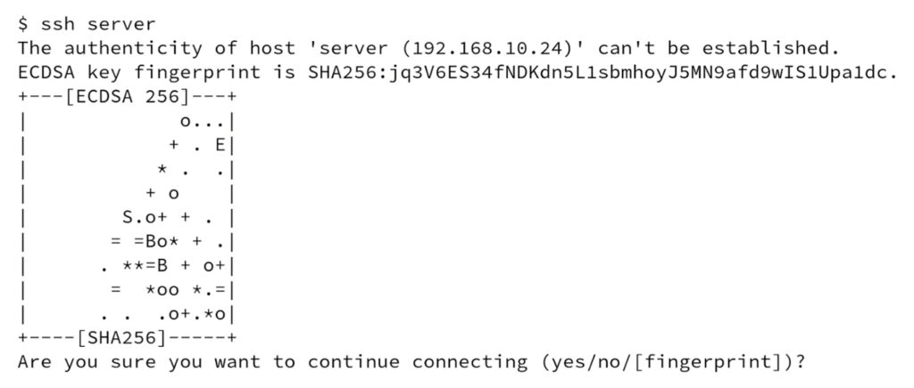

Secure Shell (SSH) is a popular network protocol for accessing a shell on (remote) systems. Users might not pay enough attention to detail when asked to verify the system’s authenticity on the first connection to a system, thereby risking a network-level security breach.  

Secure Shell (SSH) 是一种流行的网络协议，用于访问（远程）系统上的 shell。当用户在第一次连接到系统时被要求验证系统的真实性时，可能不会对细节给予足够的关注，从而面临网络级安全漏洞的风险。

In this article, I will explain how SSHFP DNS records can help mitigate such risks and share the results of our large-scale analysis. At the time of measurement, only 1 in 10,000 domains used SSHFP records and less than 50% used a correct configuration.  

在本文中，我将解释 SSHFP DNS 记录如何帮助减轻此类风险并分享我们大规模分析的结果。在测量时，只有万分之一的域使用了 SSHFP 记录，并且不到 50% 使用了正确的配置。

My colleague and I from Technische Universität Berlin conducted some research on the SSHFP record type and its usage and security in early 2022. The resulting paper was presented at [CANS 2022](https://www.cans2022.com/accepted-paper.php) and published soon after. I also provided a little sneak-peak at [DNS-OARC 39](https://indico.dns-oarc.net/event/44/contributions/speakers). All code and data are already [public](https://github.com/gehaxelt/sshfp-dns-measurement) to allow for further research.   

我和柏林工业大学的同事在 2022 年初对 SSHFP 记录类型及其使用和安全性进行了一些研究。最终的论文在 CANS 2022 上发表，并很快发表。我还在 DNS-OARC 39 上提供了一些先睹为快的信息。所有代码和数据都已公开，以便进行进一步研究。

## SSH host key verification  

SSH 主机密钥验证

Before we dive into our analysis and results, we need to understand what host key verification is and why it is important. When connecting to an SSH for the very first time, the OpenSSH client will ask the user to verify the authenticity of the server as seen in Figure 1.   

在深入分析和结果之前，我们需要了解什么是主机密钥验证及其重要性。第一次连接到 SSH 时，OpenSSH 客户端将要求用户验证服务器的真实性，如图 1 所示。

There exists anecdotal evidence that many users just blindly answer ‘Yes’ without considering potential security risks. A network-based attacker might be able to perform malice-in-the-middle (MITM) attacks leading to credentials leaks or session-hijacking.  

有证据表明，许多用户只是盲目地回答“是”，而不考虑潜在的安全风险。基于网络的攻击者可能能够执行中间恶意 (MITM) 攻击，从而导致凭据泄露或会话劫持。

[](https://blog.apnic.net/wp-content/uploads/2022/11/Figure-1-%E2%80%94-SSH-asks-the-user-to-verify-the-authenticity-of-a-server-by-comparing-the-host-key-fingerprint-on-the-first-connection..jpg)

Figure 1 — SSH asks the user to verify the authenticity of a server by comparing the host key fingerprint on the first connection.  

图 1 — SSH 要求用户通过比较第一次连接上的主机密钥指纹来验证服务器的真实性。

There are multiple methods for the host key fingerprint verification according to the SSH standard ([RFC 4251](https://www.rfc-editor.org/rfc/rfc4251.html)):  

根据 SSH 标准（RFC 4251），有多种主机密钥指纹验证方法：

-   Manually, by the user  
    
    由用户手动
-   Automated, via DNS 自动，通过 DNS
-   Automated, via CA  自动化，通过 CA

### Manual process  手动流程

With the manual process, the user needs to compare the server’s host key fingerprint (such as SHA256:jq3V6…1dc in Figure 1) against an out-of-band obtained fingerprint. This usually requires contacting the administrator responsible for the server.   

在手动过程中，用户需要将服务器的主机密钥指纹（如图 1 中的 SHA256:jq3V6…1dc）与带外获取的指纹进行比较。这通常需要联系负责服务器的管理员。

Furthermore, this approach entails the risk of human error when comparing fingerprints.   

此外，这种方法在比较指纹时存在人为错误的风险。

### Automated, via CA 自动化，通过 CA

RFC 4251 also touches on the possibility of using a certificate authority to verify host key fingerprints. However, this approach requires the deployment of a root-CA key to all user devices and signing all host keys with them. The former might not be achievable or suitable in certain scenarios and we, therefore, disregard this method in our research.  

RFC 4251 还涉及使用证书颁发机构验证主机密钥指纹的可能性。但是，此方法需要将根 CA 密钥部署到所有用户设备并使用它们对所有主机密钥进行签名。前者在某些情况下可能无法实现或不适合，因此，我们在研究中忽略了这种方法。

### Automated, via DNS 自动，通过 DNS

Another approach that we analysed in more detail is the distribution of the host key fingerprints via a special resource record. This removes any user interaction, potential human error, or presumed configuration of a user’s device because OpenSSH-client can query the DNS and do the comparison. It only requires the administrator to publish a host’s fingerprints as a set of SSHFP records, which can be securely obtained (DNSSEC). If the latter holds, MITM attacks are mitigated, and overall security is improved.  

我们更详细分析的另一种方法是通过特殊资源记录分配主机密钥指纹。这消除了任何用户交互、潜在的人为错误或用户设备的假定配置，因为 OpenSSH 客户端可以查询 DNS 并进行比较。它只需要管理员将主机的指纹作为一组 SSHFP 记录发布，就可以安全地获取（DNSSEC）。如果后者成立，中间人攻击就会减轻，整体安全性也会提高。

### SSHFP DNS records SSHFP DNS 记录

[RFC 4255](https://www.rfc-editor.org/rfc/rfc4255.html) defines the SSHFP’s resource record schema. In representation format it looks like this:  

RFC 4255 定义了 SSHFP 的资源记录模式。在表示格式中，它看起来像这样：

```
SSHFP <KEY-ALGO> <HASH-TYPE> <FINGERPRINT>
```

The KEY-ALGO is a numeral representing the key’s algorithm (Table 1), whereas HASH-TYPE defines the used hash algorithm (Table 2). The fingerprint is the hash’s hexadecimal digest.  

KEY-ALGO 是代表密钥算法的数字（表 1），而 HASH-TYPE 定义使用的哈希算法（表 2）。指纹是哈希值的十六进制摘要。

<table data-immersive-translate-effect="1" data-immersive_translate_walked="d2317553-202d-4559-a822-2fa581284291"><tbody data-immersive-translate-effect="1" data-immersive_translate_walked="d2317553-202d-4559-a822-2fa581284291"><tr data-immersive-translate-effect="1" data-immersive_translate_walked="d2317553-202d-4559-a822-2fa581284291"><td data-immersive-translate-effect="1" data-immersive_translate_walked="d2317553-202d-4559-a822-2fa581284291"><strong data-immersive-translate-effect="1" data-immersive_translate_walked="d2317553-202d-4559-a822-2fa581284291">KEY-ALGO<span lang="zh-CN" data-immersive-translate-translation-element-mark="1"><span data-immersive-translate-translation-element-mark="1">&nbsp;</span><span data-immersive-translate-translation-element-mark="1"><span data-immersive-translate-translation-element-mark="1">关键算法</span></span></span></strong></td><td data-immersive-translate-effect="1" data-immersive_translate_walked="d2317553-202d-4559-a822-2fa581284291"><strong data-immersive-translate-effect="1" data-immersive_translate_walked="d2317553-202d-4559-a822-2fa581284291">Algorithm<span lang="zh-CN" data-immersive-translate-translation-element-mark="1"><span data-immersive-translate-translation-element-mark="1">&nbsp;</span><span data-immersive-translate-translation-element-mark="1"><span data-immersive-translate-translation-element-mark="1">算法</span></span></span></strong></td></tr><tr data-immersive-translate-effect="1" data-immersive_translate_walked="d2317553-202d-4559-a822-2fa581284291"><td data-immersive-translate-effect="1" data-immersive_translate_walked="d2317553-202d-4559-a822-2fa581284291">0</td><td data-immersive-translate-effect="1" data-immersive_translate_walked="d2317553-202d-4559-a822-2fa581284291">reserved<span lang="zh-CN" data-immersive-translate-translation-element-mark="1"><span data-immersive-translate-translation-element-mark="1">&nbsp;</span><span data-immersive-translate-translation-element-mark="1"><span data-immersive-translate-translation-element-mark="1">预订的</span></span></span></td></tr><tr data-immersive-translate-effect="1" data-immersive_translate_walked="d2317553-202d-4559-a822-2fa581284291"><td data-immersive-translate-effect="1" data-immersive_translate_walked="d2317553-202d-4559-a822-2fa581284291">1</td><td data-immersive-translate-effect="1" data-immersive_translate_walked="d2317553-202d-4559-a822-2fa581284291">RSA</td></tr><tr data-immersive-translate-effect="1" data-immersive_translate_walked="d2317553-202d-4559-a822-2fa581284291"><td data-immersive-translate-effect="1" data-immersive_translate_walked="d2317553-202d-4559-a822-2fa581284291">2</td><td data-immersive-translate-effect="1" data-immersive_translate_walked="d2317553-202d-4559-a822-2fa581284291">DSA</td></tr><tr data-immersive-translate-effect="1" data-immersive_translate_walked="d2317553-202d-4559-a822-2fa581284291"><td data-immersive-translate-effect="1" data-immersive_translate_walked="d2317553-202d-4559-a822-2fa581284291">3</td><td data-immersive-translate-effect="1" data-immersive_translate_walked="d2317553-202d-4559-a822-2fa581284291">ECDSA<span lang="zh-CN" data-immersive-translate-translation-element-mark="1"><span data-immersive-translate-translation-element-mark="1">&nbsp;</span><span data-immersive-translate-translation-element-mark="1"><span data-immersive-translate-translation-element-mark="1">电子CDSA</span></span></span></td></tr><tr data-immersive-translate-effect="1" data-immersive_translate_walked="d2317553-202d-4559-a822-2fa581284291"><td data-immersive-translate-effect="1" data-immersive_translate_walked="d2317553-202d-4559-a822-2fa581284291">4</td><td data-immersive-translate-effect="1" data-immersive_translate_walked="d2317553-202d-4559-a822-2fa581284291">ED25519</td></tr><tr data-immersive-translate-effect="1" data-immersive_translate_walked="d2317553-202d-4559-a822-2fa581284291"><td data-immersive-translate-effect="1" data-immersive_translate_walked="d2317553-202d-4559-a822-2fa581284291">5</td><td data-immersive-translate-effect="1" data-immersive_translate_walked="d2317553-202d-4559-a822-2fa581284291">unassigned<span lang="zh-CN" data-immersive-translate-translation-element-mark="1"><span data-immersive-translate-translation-element-mark="1">&nbsp;</span><span data-immersive-translate-translation-element-mark="1"><span data-immersive-translate-translation-element-mark="1">未分配的</span></span></span></td></tr><tr data-immersive-translate-effect="1" data-immersive_translate_walked="d2317553-202d-4559-a822-2fa581284291"><td data-immersive-translate-effect="1" data-immersive_translate_walked="d2317553-202d-4559-a822-2fa581284291">6</td><td data-immersive-translate-effect="1" data-immersive_translate_walked="d2317553-202d-4559-a822-2fa581284291">ED448</td></tr></tbody></table>

Table 1 — Values for the SSHFP KEY-ALGO field.  

表 1 — SSHFP KEY-ALGO 字段的值。

| **HASH-TYPE 哈希类型** | **Algorithm 算法** |
| --- | --- |
| 0 | reserved 预订的 |
| 1 | SHA1 |
| 2 | SHA256 |

Table 2 — Values for the SSHFP HASH-TYPE field.  

表 2 — SSHFP HASH-TYPE 字段的值。

In the real world, the records will look like this:  

在现实世界中，记录将如下所示：

```
$ dig SSHFP someserver.tld +noall +answer

; <<>> DiG 9.11.4-P2-RedHat-9.11.4-26.P2.el7_9.10 <<>> SSHFP someserver.tld +noall +answer
;; global options: +cmd
someserver.tld.    3600    IN    SSHFP    1 1 09F6A01D2175742B257C6B98B7C72C44C4040683
someserver.tld.    3600    IN    SSHFP    1 2 4158F281921260B0205508121C6F5CEE879E15F22BDBC319EF2AE9FD 308DB3BE
someserver.tld.    3600    IN    SSHFP    3 1 91CAC088707D2C61D2F0FDA132D6F13CAE57BCD3
someserver.tld.    3600    IN    SSHFP    3 2 65564C015FCA69E82E9B9CEF35380955720C2345E660C39176782E67 06E7FDD0
someserver.tld.    3600    IN    SSHFP    4 1 F416A804701190D53B31C5A1EFC2F09104C6391B
someserver.tld.    3600    IN    SSHFP    4 2 C6DE2110F23A123691D49E94EA71DC18BD6F7277D7A7F9FC2E76F423 89DCAB70
```

As can be seen in the listing, someserver.tld has three different keys (RSA, ECDSA, ED25519) and a SHA1/SHA256 fingerprint for each of them. These records can also easily be generated using OpenSSH’s built-in tools:  

从清单中可以看出， someserver.tld 具有三个不同的密钥（RSA、ECDSA、ED25519）以及每个密钥的 SHA1/SHA256 指纹。这些记录也可以使用 OpenSSH 的内置工具轻松生成：

```
$ ssh-keyscan -D someserver.tld
; someserver.tld:22 SSH-2.0-OpenSSH_8.9p1 Ubuntu-3
someserver.tld IN SSHFP 1 1 09f6a01d2175742b257c6b98b7c72c44c4040683
someserver.tld IN SSHFP 1 2 4158f281921260b0205508121c6f5cee879e15f22bdbc319ef2ae9fd308db3be
; someserver.tld:22 SSH-2.0-OpenSSH_8.9p1 Ubuntu-3
someserver.tld IN SSHFP 3 1 91cac088707d2c61d2f0fda132d6f13cae57bcd3
someserver.tld IN SSHFP 3 2 65564c015fca69e82e9b9cef35380955720c2345e660c39176782e6706e7fdd0
; someserver.tld:22 SSH-2.0-OpenSSH_8.9p1 Ubuntu-3
someserver.tld IN SSHFP 4 1 f416a804701190d53b31c5a1efc2f09104c6391b
someserver.tld IN SSHFP 4 2 c6de2110f23a123691d49e94ea71dc18bd6f7277d7a7f9fc2e76f42389dcab70
; someserver.tld:22 SSH-2.0-OpenSSH_8.9p1 Ubuntu-3
; someserver.tld:22 SSH-2.0-OpenSSH_8.9p1 Ubuntu-3
```

So, we believe that deploying host key verification fingerprints in the DNS is almost trivial. Also, an update is only required should the host keys change. However, the SSHFP records must reach the client in a secure fashion, otherwise, the MITM could happen on the DNS instead of the SSH layer.  

因此，我们认为在 DNS 中部署主机密钥验证指纹几乎是微不足道的。此外，仅当主机密钥发生更改时才需要更新。但是，SSHFP 记录必须以安全的方式到达客户端，否则 MITM 可能会发生在 DNS 而不是 SSH 层。

Finally, OpenSSH-client needs to be told to use DNS for fingerprint verification using the \-o VerifyHostKeyDNS=yes option. Although this feature has been implemented in OpenSSH for many years, it is unfortunately still not enabled by default. The debug output tells us what will happen in the background:  

最后，需要使用 \-o VerifyHostKeyDNS=yes 选项告诉 OpenSSH 客户端使用 DNS 进行指纹验证。尽管该功能已在 OpenSSH 中实现多年，但遗憾的是默认情况下仍未启用。调试输出告诉我们后台会发生什么：

```
$ ssh -o UserKnownHostsFile=/dev/null -o VerifyHostKeyDNS=yes -v someserver.tld g 2>&1
[...]
debug1: Connecting to someserver.tld [IP.IP.IP.IP] port 22.
debug1: Connection established.
[...]
debug1: Server host key: ssh-ed25519 SHA256:xt4hEPI6EjaR1J6U6nHcGL1vcnfXp/n8Lnb0I4ncq3A
debug1: found 6 secure fingerprints in DNS
debug1: verify_host_key_dns: matched SSHFP type 4 fptype 1
debug1: verify_host_key_dns: matched SSHFP type 4 fptype 2
debug1: matching host key fingerprint found in DNS
[...]
```

As can be seen, OpenSSH establishes a connection to the server, obtains the server-side host key fingerprint, then queries the domain for SSHFP records and compares them. It confirms that the fingerprints are secure and matching, thus continuing with the connection.  

可以看到，OpenSSH建立与服务器的连接，获取服务器端主机密钥指纹，然后查询域中的SSHFP记录并进行比较。它确认指纹安全且匹配，从而继续连接。

## Large-scale analysis 大规模分析

In order to measure the prevalence of SSHFP records on the Internet, we first built a measurement system that works as follows:  

为了测量 SSHFP 记录在互联网上的流行程度，我们首先构建了一个测量系统，其工作原理如下：

1.  Query a domain for SSHFP records.  
    
    查询域中的 SSHFP 记录。
2.  If SSHFP records exist, query the domain for their A records.  
    
    如果存在 SSHFP 记录，请在域中查询其 A 记录。
3.  If A records exist, try to obtain the server-side host key fingerprints using ssh-keyscan.  
    
    如果存在A记录，尝试使用ssh-keyscan获取服务器端主机密钥指纹。
4.  Compare SSHFP fingerprints and server-side fingerprints to find (mis)matches.  
    
    比较 SSHFP 指纹和服务器端指纹以查找（错误）匹配。
5.  If matches exist, repeat the SSHFP query, but with a DNSSEC-validating resolver.  
    
    如果存在匹配，则重复 SSHFP 查询，但使用 DNSSEC 验证解析器。

We ran this analysis on two different sets of domains:  

我们对两组不同的域进行了此分析：

-   Tranco 1M domain list  
    
    Tranco 1M域名列表
-   \>515M domains from certificate transparency logs over the course of 26 days.  
    
    26 天内来自证书透明度日志的 >515M 域名。

Our [paper](https://link.springer.com/chapter/10.1007/978-3-031-20974-1_4) dives deep into the details of the results, but the most interesting parts in my opinion are:  

我们的论文深入探讨了结果的细节，但我认为最有趣的部分是：

-   Only 1 in 10,000 domains have an SSHFP record set.  
    
    只有万分之一的域拥有 SSHFP 记录集。
-   Less than 50% of the records are secured with DNSSEC.  
    
    不到 50% 的记录受到 DNSSEC 的保护。
-   In many cases not all KEY-ALGO and HASH-TYPE combinations exist as SSHFP records (or are outdated), thus leaving it to chance whether a DNS-based verification is successful or a fallback to other methods (that is, manual verification) is done.   
    
    在许多情况下，并非所有 KEY-ALGO 和 HASH-TYPE 组合都以 SSHFP 记录形式存在（或已过时），因此，基于 DNS 的验证是否成功或回退到其他方法取决于机会（即手动验证）完成。

Although there is room for improvement when looking at the adoption of SSHFP records, a 50% mark of secured records is unfortunate, because in such setups there is no security benefit, as the MITM-attack shifts from the SSH layer to the DNS layer.  

尽管在考虑 SSHFP 记录的采用时还有改进的空间，但 50% 的安全记录标记是不幸的，因为在这种设置中，没有安全优势，因为 MITM 攻击从 SSH 层转移到 DNS 层。

There might be a ‘chicken-and-egg’ situation between SSHFP and DNSSEC here — one requires the other, but the other is not as widely adopted as it could be. However, internal usage of SSHFP records is not measurable from the outside, so the actual number might be somewhat larger.  

SSHFP 和 DNSSEC 之间可能存在“先有鸡还是先有蛋”的情况——一个需要另一个，但另一个没有得到广泛采用。但是，SSHFP 记录的内部使用情况无法从外部测量，因此实际数量可能会稍大一些。

Nonetheless, we believe that proper deployment and usage of SSHFP records could provide security benefits at little cost in many situations.    

尽管如此，我们相信，在许多情况下，正确部署和使用 SSHFP 记录可以以很少的成本提供安全优势。

Here’s a three-point action plan if you want to start using SSHFP records:  

如果您想开始使用 SSHFP 记录，这里有一个三点行动计划：

1.  Enable DNSSEC for your domain(s).  
    
    为您的域启用 DNSSEC。
2.  Collect and deploy the SSHFP records for all your SSH-accessible systems using ssh-keyscan.  
    
    使用 ssh-keyscan 收集并部署所有可通过 SSH 访问的系统的 SSHFP 记录。
3.  Add VerifyHostKeyDNS=yes to your ~/.ssh/config.  
    
    将 VerifyHostKeyDNS=yes 添加到您的 ~/.ssh/config 中。

If you are interested in more details and in-depth analysis, have a look at our [paper](https://link.springer.com/chapter/10.1007/978-3-031-20974-1_4).  

如果您对更多细节和深入分析感兴趣，请查看我们的论文。

_[Sebastian Neef](https://neef.it/) is a PhD candidate and Research Assistant at the Technische Universität Berlin’s ‘Chair for Security in Telecommunications’, with a focus on network and web security.  

Sebastian Neef 是柏林工业大学“电信安全主席”的博士研究生和研究助理，主要研究网络和网络安全。_

_This post is based on the accepted and soon-to-be-published paper “[Oh SSH-it, what’s my fingerprint? A Large-Scale Analysis of SSH Host Key Fingerprint Verification Records in the DNS](https://link.springer.com/chapter/10.1007/978-3-031-20974-1_4)” (Sebastian Neef and [Nils Wisiol](https://blog.apnic.net/author/nils-wisiol/), [preprint](https://arxiv.org/pdf/2208.08846.pdf)).   

这篇文章基于已被接受且即将发表的论文“哦 SSH-it，我的指纹是什么？ DNS 中 SSH 主机密钥指纹验证记录的大规模分析”（Sebastian Neef 和 Nils Wisiol，预印本）。_

Continue the conversation on this topic at [Orbit](https://orbit.apnic.net/hyperkitty/list/measurement@apnic.net/thread/M7SCFUUVNR7P4DONKAGEOHTXXZANAPTT/).  

在 Orbit 继续有关此主题的对话。

<table data-immersive-translate-effect="1" data-immersive_translate_walked="d2317553-202d-4559-a822-2fa581284291"><tbody data-immersive-translate-effect="1" data-immersive_translate_walked="d2317553-202d-4559-a822-2fa581284291"><tr data-immersive-translate-effect="1" data-immersive_translate_walked="d2317553-202d-4559-a822-2fa581284291"><td data-immersive-translate-effect="1" data-immersive_translate_walked="d2317553-202d-4559-a822-2fa581284291"><nobr data-immersive-translate-effect="1" data-immersive_translate_walked="d2317553-202d-4559-a822-2fa581284291">Rate this article<span lang="zh-CN" data-immersive-translate-translation-element-mark="1"><span data-immersive-translate-translation-element-mark="1">&nbsp;</span><span data-immersive-translate-translation-element-mark="1"><span data-immersive-translate-translation-element-mark="1">评价这篇文章</span></span></span></nobr></td><td data-immersive-translate-effect="1" data-immersive_translate_walked="d2317553-202d-4559-a822-2fa581284291"><div data-img="https://blog.apnic.net/wp-content/uploads/2022/11/SSH_Fingerprint_Scan_FT.png" data-urid="659000" data-immersive-translate-effect="1" data-immersive_translate_walked="d2317553-202d-4559-a822-2fa581284291"><p><span data-immersive-translate-effect="1" data-immersive_translate_walked="d2317553-202d-4559-a822-2fa581284291"><span data-immersive-translate-effect="1" data-immersive_translate_walked="d2317553-202d-4559-a822-2fa581284291"><span data-immersive-translate-effect="1" data-immersive_translate_walked="d2317553-202d-4559-a822-2fa581284291">Rate this (4 Votes)<span lang="zh-CN" data-immersive-translate-translation-element-mark="1"><span data-immersive-translate-translation-element-mark="1">&nbsp;</span><span data-immersive-translate-translation-element-mark="1"><span data-immersive-translate-translation-element-mark="1">评价此（4 票）</span></span></span></span></span></span></p></div></td></tr></tbody></table>

___

The views expressed by the authors of this blog are their own and do not necessarily reflect the views of APNIC. Please note a [Code of Conduct](https://blog.apnic.net/?p=395) applies to this blog.  

本博客作者表达的观点仅代表他们自己的观点，并不一定反映 APNIC 的观点。请注意，行为准则适用于本博客。
