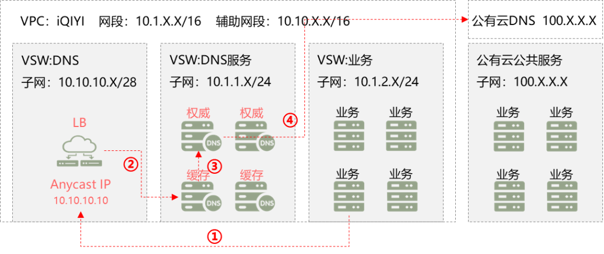

爱奇艺早期业务多数以私有云方式部署，随时间推移，私有云模式在成本、弹性及区域覆盖等方面开始显现不足，而公有云在近年的发展中成熟度不断提高，逐步满足爱奇艺业务需求，爱奇艺开始有计划的使用公有云资源，逐渐形成私有云与多家公有云结合的业务部署模式，即混合云模式。混合云模式下，私有云和公有云分属不同的DNS体系，如何实现域名统一管理，高效、安全地完成云间通信，成为一个巨大的挑战，本文即介绍爱奇艺内网DNS架构的演进以及混合云场景下的内网DNS实践。

**01 爱奇艺内网DNS演进**

DNS作为网络基础服务，不仅在公网环境中体现至关重要的价值，在内网环境中也具有重要的服务与资源定位作用。在爱奇艺生产环境中，服务多样、复杂，通信效率要求高，各业务普遍使用内网DNS进行服务定位，故对内网DNS提出高性能、高稳定、低延迟等要求。为满足业务需求，爱奇艺DNS架构不断演进，形成了融合Anycast的多层DNS架构，下文将详细介绍。

**1.1  私有云环境下内网DNS架构** 

爱奇艺内网DNS采用分层架构，支持多级缓存、容错、均衡负载、就近访问等，该架构依据分层原则主要分为四层：主机DNS、缓存DNS、权威DNS 及递归DNS。

简要介绍各层DNS的角色及作用：

○**主机DNS**：主机DNS主要部署在主机上，为物理机、虚拟机和容器等提供高效DNS服务，具备 90% 以上的DNS缓存能力；当域名信息未命中主机DNS缓存时，主机DNS会转发该DNS查询请求至后端的缓存DNS。

○**缓存DNS**：接收并响应来自主机DNS转发的域名解析请求，若未命中本地缓存，则将带有主机DNS子网信息的DNS请求转发至后端的权威DNS，接收到权威DNS返回结果后将其回传给请求者，同时在本地进行缓存；因主机 DNS部署在业务主机上，数量庞大，为增强内网配置可管理性，爱奇艺采用Anycast方案使每组缓存DNS都绑定相同Anycast IP，所有的主机DNS配置统一，大幅提升维护效率。

○**权威DNS**：权威DNS存放所有内网权威域名的地址信息，当缓存DNS转发的请求域名为内网权威域名时，会根据主机DNS子网信息优先返回其所属区域的地址信息，如果请求域名为非内网权威域名，则会将该DNS请求进一步转发至递归DNS处理。

○**递归DNS**：递归DNS主要用来对非内网权威域名进行递归解析，将解析结果返回给权威DNS、缓存DNS直至主机DNS。

上述内网DNS分层架构具备以下优点：

○多级分层DNS缓存架构，使访问压力层层递减，大幅提升内网DNS域名解析能力，并降低响应延迟；

○主机DNS直接部署在主机上，本地缓存命中率超过 90%，极大降低对后端DNS的访问压力，降低主机DNS 访问的延迟，减小网络故障对主机DNS影响；

○基于网络Anycast 架构的缓存DNS，使全网主机 DNS地址配置保持一致，降低主机侧维护成本，可弹性扩容，节点故障及上下线对主机解析无影响，提供高效、安全、就近的DNS服务；

○权威DNS统一管理DNS数据及业务策略，提供最佳的业务调度能力。

**1.2  爱奇艺内网DNS架构演化**  

上述爱奇艺内网 DNS 架构并非一蹴而就，是在实践中逐步演化而来，下图展示了该演进过程：

**一代 DNS 架构：**早期内网 DNS 架构相对简单，只有权威 DNS，采用 master/slave 模式；随业务发展，内网 DNS 访问压力与日俱增，单层 DNS 架构已无法满足业务访问要求，所以衍生二代 DNS 架构；

**二代 DNS 架构：**主机上增加主机 DNS 承载大部分访问压力，中间层增加缓存 DNS，进一步降低权威 DNS 负载；随主机规模不断增大，中间层缓存 DNS 的节点数量不断扩增，而每次 DNS 节点扩增或调整，都需要修改主机 DNS 上的配置项，维护复杂，DNS 服务高可靠性缺乏保障，因此爱奇艺内网 DNS 架构再次升级，演进为第三代 DNS 架构；

**三代 DNS 架构：**借助于 Anycast 的网络架构，使 DNS 架构具备了弹性伸缩的能力，同时统一并简化了主机 DNS 配置，降低了故障率与维护成本。

**1.3  融合 Anycast 的内网 DNS 架构**  

爱奇艺 DNS 架构经过迭代，发展为高效稳定的 Anycast 架构，下图以 Anycast IP 10.10.10.10 为例，介绍爱奇艺融合 Anycast 技术的内网 DNS 架构：

Anycast 技术，将一个单播地址分配到网络中多个不同物理位置的主机上，发送到这个地址的报文被网络转发到“最近”的目标主机，从而达到负载均衡及就近访问的目的。爱奇艺 DNS Anycast 将路由协议部署到 DNS 主机上，和网络设备进行联动，通过动态路由控制 Anycast IP 浮动，出现故障时，将 Anycast IP 在故障主机上摘除，业务请求即可自动转发到其他 Anycast 主机。

为了提高 Anycast 快速部署以及故障快速切换能力，爱奇艺将DNS进行平台化管理，平台具备以下功能：

●平台管理所有DNS主机，通过平台快速进行主机 DNS服务部署、路由模块部署等；

●平台提供一键上下线的功能，可通过平台直接操作或者接口调用；

●故障自主检测，一旦检测到故障即触发故障主机摘除，其他DNS主机自动接管服务。

**小结** 

融合 Anycast 的 DNS 架构，实现了 DNS 服务地址的统一,全网主机都可配置同一个 DNS 地址，大大降低了维护成本；平台化管理，实现 DNS 配置标准化，支持故障主机自动摘除切换，用户端无感知。新的架构和管理模式充分保障了 DNS 服务持续稳定、安全、可靠、高效地运行。

**02 混合云时代的爱奇艺内网DNS架构**

为实现业务高效灵活部署，爱奇艺与国内外多家主流云厂商进行合作，将部分业务部署到公有云，同时保留核心的私有云基础设施，形成自建私有云和公有云结合的混合云模式。混合云模式要求爱奇艺基础服务平台在公有云环境下提供和私有云一致的底层技术支撑，而 DNS 作为一项重要的基础服务，在混合云场景下如何为业务提供统一、稳定、高效、安全的域名解析成为一个棘手问题，为此爱奇艺技术团队经过总结实践，在原DNS架构上进一步设计了混合云的DNS架构，实现标准化配置，统一化管理，全局化服务的混合云DNS服务的目标。  

○**标准化配置：**所有业务主机使用统一的 Anycast IP 作为唯一服务地址；

○**统一化管理：**所有DNS服务器均平台化管理、自动化配置，做到DNS服务一键部署、一键上下线；

○**全局化服务：**私有云和公有云使用统一的 DNS 服务地址，既能解析私有云域名，又可解析公有云域名，同时可实现跨公有云解析。

**2.1 混合云场景下的 DNS 问题**  

混合云场景下，不同的云厂商都有独立的 DNS 服务，并且只能解析自己相关的域名，无法解析私有云域名，更无法跨公有云进行域名解析。为实现混合云时代 DNS 服务可标准化配置、统一化管理、全局化服务的目标，爱奇艺技术团队选择 Anycast DNS+ 定向转发的方案思路，同时将公有云 DNS 纳入原 DNS 管理平台实现统一化管理。

明确目标及解决方案后，爱奇艺开始在公有云环境下进行测试，因为公有云特殊的架构以及云厂商之间的差异，需要公有云上解决以下问题：

●公有云 VPC 内地址统一规划，如何将 Anycast IP 部署到云上实现DNS地址统一；

●公有云底层网络对爱奇艺不可见，Anycast 和网络深度绑定，如何实现DNS Anycast 在公有云上的部署；

●不同公有云DNS地址可能独立规划，如何实现爱奇艺权威DNS和公有云DNS互通；

●公有云厂商有独立的地址规划，如何实现DNS的正确解析以及云上云下服务互通；

●特殊场景下如何实现公有云DNS对爱奇艺内网域名的解析。

针对上述问题，爱奇艺结合私有云DNS部署经验以及各公有云网络实际情况，逐一解决并完成混合云 DNS 架构设计。

**2.2 混合云场景下的内网DNS架构** 

**网络架构：**爱奇艺DNS和网络团队设计的混合云内网DNS架构如下图所示，原私有云通过专线连接多个 IDC，公有云节点类似于爱奇艺自有 IDC，通过专线连接到爱奇艺核心 PoP 点，公有云节点可以横向扩展，云下 IDC 仍采用物理机和网络设备实现 DNS Anycast，云上采用 LB+ 虚机的部署方式。混合云内网 DNS 充分考虑各云厂商的网络状况，解决上一章节提出的问题。

○针对 Anycast IP 部署，目前主流公有云均支持 VPC 内的辅助地址，可通过辅助地址将 Anycast IP 部署到云上；

○针对云上 DNS Anycast，通过公有云 LB 实现，在 LB 后端挂载 DNS 服务器实现负载均衡；

○针对不同云厂商 DNS 地址互通问题，目前多家公有云均支持 VPC 内地址作为 DNS 地址，不支持的厂商将介绍其他替代方案；

○针对公有云业务地址和云下互通以及 DNS 解析问题，目前多数厂商均支持 VPC 内网段作为业务地址，不支持的厂商将介绍其他替代方案；

○特殊场景下公有云 DNS 可通过 DNS 转发器将爱奇艺内网域名解析请求转发到爱奇艺 DNS 进行解析，目前主流公有云均支持，并配合爱奇艺技术团队持续完善中。

**DNS 架构**：为了更清晰地展示各级 DNS 之间逻辑关系，可参考以下 DNS 服务逻辑架构图，主机 DNS、缓存 DNS、权威 DNS、递归 DNS，云下通过传统网络实现 Anycast，云上通过 LB 实现，云下权威服务器和云上权威服务器网络互通，并通过统一平台进行管理。

**2.3 混合云场景下的 DNS 实践及分析**  

前文提出了混合云环境下实现 DNS 统一部署的问题，并且结合网络环境给出了解决问题思路，下文详细介绍爱奇艺内网 DNS 在公有云的部署实践。

**2.3.1 Anycast 地址下沉部署**

在公有云环境要实现 Anycast 地址发布，首先 VPC 内需存在该地址段，但是 VPC 在创建时便对各公有云网络进行了规划，并确定了地址段，因此需要在现有 VPC 内新增加辅助地址段，如下图标识1，并且创建 Anycast 地址专用的子网如下图标识②，即可实现 Anycast IP 在公有云的部署。

**2.3.2 DNS服务下沉到公有云**

私有云环境中，DNS以物理机方式部署在IDC内部，并和交换机联动通过路由协议实现 DNS Anycast，公有云环境中，物理网络对云上不可见，要实现 DNS 服务下沉并部署Anycast 需要通过 LB+ 虚拟机，虚拟机部署DNS缓存服务，LB 绑定Anycast IP，实现DNS服务的 Anycast 化。

在 DNS 服务下沉方案中，可以根据业务需求及公有云规模等情况，选择只下沉 DNS 缓存或者下沉缓存及权威，下图中选择了下沉缓存和权威，图中标识步骤为业务服务器 DNS 解析过程，业务主机配置 DNS 的 Anycast IP，解析请求通过 LB 转发到后端缓存 DNS 并向权威 DNS 请求解析，爱奇艺域名直接给出解析结果，云上域名则转发到公有云DNS进行解析。

在DNS服务下沉中，LB服务承担重要角色，转发过程如下：

1、业务主机DNS请求LB上的Anycast IP，经三层转发到 LB；

2、LB 接受请求后做DNAT，保持原地址不变，更改目的地址为 LB 后端挂载的DNS缓存服务器的真实地址，根据 hash 算法转发到相应的DNS缓存服务器；

3、DNS缓存服务器接受请求后，根据业务主机地址判断所属区域，如命中缓存直接返回解析结果，如未命中则请求权威进行解析后返回结果；

4、DNS缓存服务器回包到VSW根据转发表项到LB，LB更改源地址为Anycast地址后三层转发到业务服务器。

LB转发有两个特殊场景：

○场景一：DNS缓存服务器和业务服务器在同一网段。

传统网络在二层环境下根据mac地址进行转发，当DNS缓存服务器和业务服务器在同一网段时，直接二层互通就绕过了LB，无法实现设计要求，但在云网络环境下，同一网段服务器 arp 请求均采用网关代答，网关响应 arp 请求，如下图，可以看到主机上同网段地址解析为同一 mac 地址，将二层转发变为三层转发，再根据转发表项到 LB，解决DNS缓存服务器和业务主机在同一网络的解析问题。

○场景二：下沉DNS缓存服务配置 Anycast IP。

下沉的 DNS 缓存服务器其DNS地址不能配置成 Anycast IP，因为存在 LB 转发的 RS 为自己、无法回包给 LB 的情况，此场景还在寻找更好的解决方案。

**2.3.3  私有云服务器解析公有云域名**

私有云服务器解析公有云域名的本质是云下权威服务器能正常转发到公有云 DNS 服务器进行公有云域名解析。爱奇艺混合云场景下要求所有主机均配置统一 DNS  地址，当私有云主机需要解析公有云域名时，请求转发到云下的权威服务器，权威服务器转发到相应的公有云 DNS，解析过程如图所示。当前公有云上 DNS 服务地址主要有两种情况，主流公有云厂商支持自动使用 VPC 内网段 IP 地址作为 DNS 地址，如新建交换机时所关联的网段第一个和第二个为 DNS 地址，部分公有云厂商采用自定义的固定DNS地址，比如使用 100.x.x.x 段做 DNS 地址。前者使用 VPC 内地址保证和云下 DNS 权威互通，后者因使用独立地址因此无法和云下直接互通，当解析云上域名时，权威 DNS 无法转发请求到云上，因此需要解决云上 DNS 地址和云下互通的问题，针对此种情况有三种解决方案，参考下图步骤 4/5：

○方案一：直接将云上DNS地址段路由发布到云下，此方案可能存在地址冲突问题；

○方案二：通过云上配置NAT网关，经NAT转换实现云下DNS权威服务器和云上DNS服务器互通，此方案需额外增加 NAT 服务器，增加维护成本；

○方案三：公有云上部署代理打通云上云下DNS服务，此方案同样增加了资源和维护成本。

上述三种方案均为临时性方案，都存在相应的弊端，目前爱奇艺主要采用第二种方案，并且持续推动所有公有云厂商都支持 VPC 内网段 IP 地址作为 DNS 服务地址。

**2.3.4  私有云服务和公有云服务互通问题**

公有云和私有云服务互通，必须保障DNS域名正常解析和云上云下业务地址互通。目前公有云 VPC 均实现和私有云互通，且大部分服务都可使用 VPC 规划的地址，保证和云下网络互通，但是部分公共服务一些云厂商仍独立规划地址段，如使用 100.x.x.x 段地址，导致云下用户无法访问云上相应资源。此问题主要有三个解决方案，如下图的步骤 5/6，需要根据公有云实际情况进行选择：

○方案一：直接将公有云地址段路由发布到云下，云上DNS正常进行地址解析，云下服务器也能访问云上资源，此方案可能存在地址冲突问题；

○方案二：在公有云服务前部署 LB，LB 后挂载公有云服务，并且调整DNS解析到LB，此方案增加了 LB 资源和维护成本；

○方案三：在公有云服务前部署代理，通过代理连通公有云和私有云，并且调整 DNS 解析到代理服务器，此方案增加了代理服务器资源和维护成本。

上述三个互通方案同样均存在弊端，目前爱奇艺主要采用方案三解决此问题，同时持续推动公有云厂商配合标准化服务，实现基于 VPC 内 IP 地址提供所有服务。

**2.3.5  公有云服务解析私有云域名**

公有云厂商提供的部分服务为公共服务，默认使用公有云 DNS，如果这些服务需要和私有云部署的业务互通，公有云 DNS 是无法解析私有云域名的，此种场景下需要将私有云域名转发到权威 DNS 进行解析，如下图步骤，通过在公有云上配置 DNS 转发，将私有云域名转发到私有云权威 DNS，如果权威 DNS 服务器部署在云下，则保障公有云 DNS 和云下权威 DNS 互通，互通方案可参考前述章节。

**小结**  

当业务不断发展壮大，需要越来越多的服务资源时，对私有云数据中心进行扩容往往需要历经选址、布线、设备上架、调试等诸多环节，而公有云在成本、区域覆盖、响应时间上提供了更高效的方式，因此爱奇艺开始接触多家公有云并了解其网络架构，形成了统一的公有云网络接入方案，并结合自有 IDC 形成多 Region、多 AZ 的业务部署模式，实现业务快速部署上线。在此背景下，爱奇艺技术团队希望公有云和私有云架构统一，实现全球一网的基础网络服务，因此设计了新的 DNS 架构，在混合云场景下实现了 DNS 标准化配置、统一化管理、全局化服务三大目标。如前文所述在部署实践中因不同厂商存在差异，当前采取了一些替代方案，并持续与各公有云厂商共同完善网络架构，满足不同场景的需求。

**03 总结**

爱奇艺内网 DNS 的发展历程：从早期的双主多从模式，到多层 DNS 集群，再到融合 Anycast 的多层 DNS，最后到混合云环境 DNS 架构，每个阶段都是基于当时网络状况，在总结上一阶段架构经验的基础上，不断迭代演化而成。当前的混合云内网 DNS 方案（爱奇艺第四代内网 DNS 方案），是基于第三代 DNS 技术方案，在充分理解爱奇艺业务需求及公有云网络架构的基础上，快速创新、持续演进、充分验证后最终形成的，在全球范围内为爱奇艺各类业务提供透明、安全、稳定、高效且弹性的域名解析服务，为爱奇艺全面适配混合云架构打下坚实的基础。

**本文转载自“爱奇艺技术产品团队”微信公众号，文章版权归原作者及其单位所有。**  