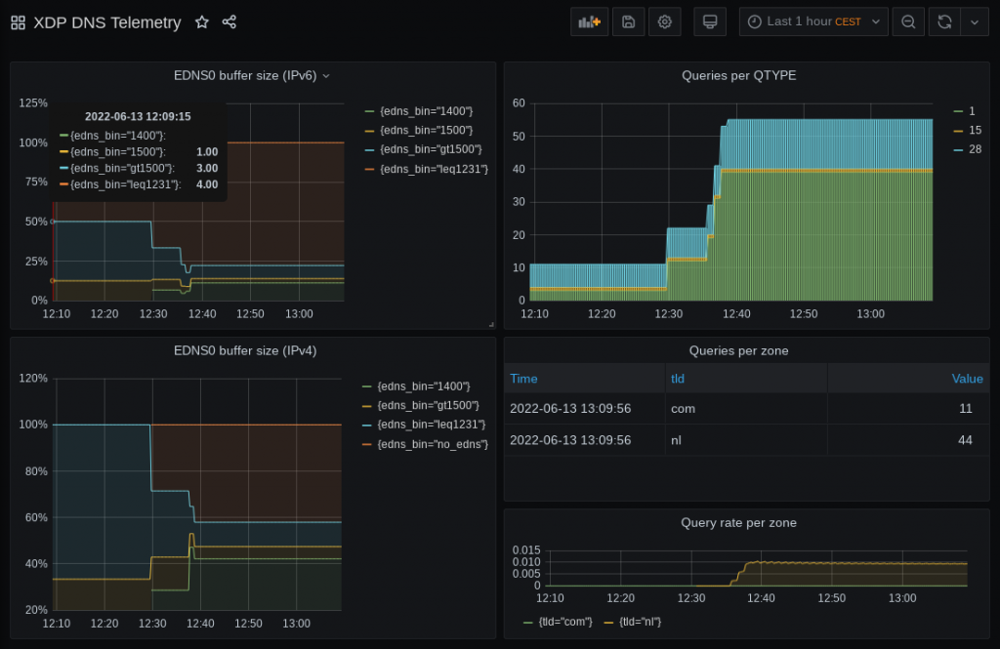

The XDP programs we’ve so far described in this [series](https://blog.apnic.net/tag/xdp/) have been actively modifying DNS packets to perform functions such as Response Rate Limiting (RRL), cookies, and padding. This time, we’ll investigate a passive BPF program, which enables us to plot graphs of DNS metrics without altering the DNS packets or touching the DNS software itself.  

到目前为止，我们在本系列中描述的 XDP 程序一直在主动修改 DNS 数据包以执行响应速率限制 (RRL)、cookie 和填充等功能。这次，我们将研究一个被动 BPF 程序，它使我们能够绘制 DNS 指标图表，而无需更改 DNS 数据包或接触 DNS 软件本身。

We’ll discuss why we do this on the Express Data Path (XDP) layer (as opposed to the Traffic Control (TC) layer), and what design choices we make to get from raw packets to, eventually, a Prometheus + Grafana dashboard.  

我们将讨论为什么我们在快速数据路径 (XDP) 层（而不是流量控制 (TC) 层）上执行此操作，以及我们做出哪些设计选择来从原始数据包获取最终的 Prometheus + Grafana 仪表板。

## When, where, and what to measure?  

何时、何地、测量什么？

Our main aim for this work is to get insight into what a nameserver is doing. If we have to choose between collecting statistics on queries or statistics on answers, the latter will provide a better view of what the nameserver actually spends resources on. Consequently, as we are dealing with egress packets, we have to use the TC layer to deploy our BPF program.  

我们这项工作的主要目的是深入了解名称服务器正在做什么。如果我们必须在收集查询统计信息还是收集答案统计信息之间进行选择，后者将提供更好的视图来了解名称服务器实际花费的资源。因此，当我们处理出口数据包时，我们必须使用 TC 层来部署 BPF 程序。

However, that means we assess a packet that has gone through userspace already. Moreover, the nameserver could do all the statistics gathering and telemetry without the limitations we would face in doing the same in BPF/XDP. So instead, we will look at the queries coming in, and do our statistics gathering in XDP.  

然而，这意味着我们评估已经通过用户空间的数据包。此外，名称服务器可以完成所有统计数据收集和遥测，而不会受到我们在 BPF/XDP 中执行相同操作时面临的限制。因此，我们将查看传入的查询，并在 XDP 中收集统计数据。

The benefit of assessing the queries instead of the answers provided by the nameserver software is that we can now get insight into queries that might be dropped early on by that nameserver software — perhaps because they are malformed, or because the query is for a different zone than the ones served by this nameserver. And because these queries will never be answered, the nameserver might not give any useful statistics on them. So, focusing on incoming queries in XDP seems to provide more value than looking into outgoing answers at the TC layer.  

评估查询而不是名称服务器软件提供的答案的好处是，我们现在可以深入了解名称服务器软件可能会提前删除的查询 - 可能是因为它们格式错误，或者因为查询是针对不同区域的比该名称服务器提供的服务。由于这些查询永远不会得到答复，因此名称服务器可能不会提供任何有用的统计信息。因此，关注 XDP 中的传入查询似乎比在 TC 层查看传出答案更有价值。

Code-wise, there are a handful of differences between writing a BPF-TC program compared to XDP. Creating maps, altering the packet headers and payload (which we do not need for this telemetry program) and tail calls are done in slightly different ways, but none of these are showstoppers. During this experiment, we tried this in both the TC and XDP layers, and both are perfectly feasible and viable ways of getting numbers on your DNS packets.  

从代码角度来看，编写 BPF-TC 程序与 XDP 程序之间存在一些差异。创建地图、更改数据包标头和有效负载（此遥测程序不需要这些）和尾部调用的完成方式略有不同，但这些都不是令人惊叹的。在这个实验中，我们在 TC 和 XDP 层都尝试了这一点，这两种方法都是在 DNS 数据包上获取数字的完全可行且可行的方法。

For our example, we will measure DNS queries, on the XDP layer.  

对于我们的示例，我们将在 XDP 层上测量 DNS 查询。

Using DNS-OARC’s [DSC](https://www.dns-oarc.net/tools/dsc) for inspiration, we will distil the main metric, which must be the query count and/or rate, parameterized by typical DNS information such as QTYPE and the QR-bit. Furthermore, we want to distinguish whether queries come in over IPv6 or IPv4, and gather some insights on the EDNS0 buffer sizes. In other words, we are dealing with many dimensions here.  

使用 DNS-OARC 的 DSC 获得灵感，我们将提取主要指标，该指标必须是查询计数和/或速率，由典型的 DNS 信息（例如 QTYPE 和 QR 位）参数化。此外，我们希望区分查询是通过 IPv6 还是 IPv4 传入，并收集有关 EDNS0 缓冲区大小的一些见解。换句话说，我们在这里处理的是多个维度。

Before we decide on how many parameters/dimensions we can handle, let’s have a look at how we can keep track of such data in BPF.  

在我们决定可以处理多少个参数/维度之前，让我们看看如何在 BPF 中跟踪这些数据。

## Storing multi-dimensional data  

存储多维数据

We have plenty of BPF map types at our disposal to keep track of anything in-between packets in BPF. But which of these fit our ‘multi-dimensional’ requirements?   

我们有大量的 BPF 映射类型可供使用，可以跟踪 BPF 中数据包之间的任何内容。但其中哪些符合我们的“多维度”要求呢？

We could use a bunch of simple MAP\_TYPE\_ARRAY\-based counters for every possible parameter: A counter for A-record queries, a counter for AAAA-queries, a counter for queries coming in over IPv6, and so on. However, by using that we immediately lose information on any possible correlations between these numbers. There is no way to say afterwards whether the A-record queries came in over IPv6 or IPv4, for example, or which EDNS0 size they carried.  

我们可以为每个可能的参数使用一堆简单的基于 MAP\_TYPE\_ARRAY 的计数器：A 记录查询的计数器、AAAA 查询的计数器、通过 IPv6 传入的查询的计数器等等。然而，通过使用它，我们立即失去了这些数字之间任何可能的相关性的信息。例如，事后无法确定 A 记录查询是通过 IPv6 还是 IPv4 传入，或者它们携带的 EDNS0 大小。

Looking at man bpf, two of the available map types have a name that sounds promising for our use case:  

查看 man bpf ，两种可用的地图类型的名称听起来对我们的用例很有希望：

```
MAP_TYPE_HASH_OF_MAPS

MAP_TYPE_ARRAY_OF_MAPS
```

Their names suggest they carry multi-dimensional data, and indeed they can. Unfortunately, it seems that these map types are limited to only one level of nesting, and the ‘parent’ level has to be occupied at compile time. All in all, it’s not the flexibility we had hoped for but to be fair, the intended use case for these map types is perhaps not what we are trying to squeeze out of them.  

它们的名字表明它们携带多维数据，而且确实可以。不幸的是，这些映射类型似乎仅限于一层嵌套，并且必须在编译时占用“父”层。总而言之，这不是我们所希望的灵活性，但公平地说，这些地图类型的预期用例可能不是我们试图从中挤出的。

This is one of these cases where the solution turns out simpler than whatever direction we were thinking in. We can do this in a rather straightforward way by using nothing but a hashmap (MAP\_TYPE\_HASH). The implementation of the hashmap in BPF allows not only simple values to represent the key to be hashed, but also lets us define our own structs to be keyed on. Perhaps even more important, those keys themselves are stored in the map, so we can retrieve them later on.  

这是其中一种情况，解决方案比我们思考的任何方向都简单。我们可以通过一种相当简单的方式来做到这一点，只使用哈希图（ MAP\_TYPE\_HASH ）。 BPF 中 hashmap 的实现不仅允许用简单的值来表示要散列的键，还允许我们定义自己的要键控的结构。也许更重要的是，这些密钥本身存储在地图中，因此我们可以稍后检索它们。

Let’s compare this to writing P4 code, another programmable data plane paradigm. P4 offers constructs to hash one or more values (for example, DNS features) into an offset so we can read/write a value in a register at that offset. However, the values used as input for the hash function are not stored. Only if we process another packet with the same features going into the hashing function, we know what the value at the offset in the register represents, but only as long as we are processing that specific packet.  

让我们将其与编写 P4 代码（另一种可编程数据平面范例）进行比较。 P4 提供了将一个或多个值（例如 DNS 特征）散列到一个偏移量中的结构，以便我们可以在该偏移量处的寄存器中读/写一个值。但是，用作哈希函数输入的值不会被存储。仅当我们处理进入散列函数的具有相同特征的另一个数据包时，我们才知道寄存器中偏移量处的值代表什么，但前提是我们正在处理该特定数据包。

From a (higher level) application programming perspective, this might not sound like a big deal (_I always iterate over the keys of my hashmap, what’s the fuss about?_). However, keeping those keys around really makes certain tasks a lot easier in this data plane programming context.  

从（更高级别）应用程序编程的角度来看，这可能听起来没什么大不了的（我总是迭代哈希图的键，有什么大惊小怪的？）。然而，保留这些键确实可以使数据平面编程环境中的某些任务变得更加容易。

Before we go into the actual C struct for keying our map, let’s look at the consuming side of the metrics we will store in that map, and why we need to take this into account.

## Cardinality

For this setup, we used the well-known combination of Prometheus and Grafana to ingest and store the metrics and plot them, respectively. This means that the contents of our BPF hashmap need to be output in a specific Prometheus format, which is human readable and straightforward. For example, reporting that the number of queries for AAAA records (qtype=28) that came in over IPv4 (af=0) with the DO-bit set (do=1), is of value 1234, looks like:

```
queries_total{af=0, qtype=28, do=1} 1234
```

Dissecting this line gives us the metric ‘queries\_total‘, parameterized by three features we can extract from the DNS query packet. Another line in the same output could represent the queries with the same DNS features but IPv6 (af=1) for transport:

```
queries_total{af=1, qtype=28, do=1} 2345
```

Every combination of these parameter values results in a separate time series in Prometheus. Therefore, every parameter adds a dimension of a certain size based on its different values. Storing the address family, for example, doubles the number of time series as we expect two values (IPv4 and IPv6). In other words, the cardinality (the number of elements in the set) doubles.

For Prometheus, it is advised to not create metrics with cardinality greater than 100k. Calculating the cardinality for our examples here, where |X| means ‘the number of different values for X’, shows we are still good:

```
|af| * |do-bit| * |qtype| =
  2  *     2    *    60   = 240
```

Note, we used a rather large number for qtype. On many networks, the number of different qtypes might be far less, but let’s be conservative with our estimations for now.

If we now also track EDNS0 sizes in, say, 20 buckets, and also track the AD-bit (0 or 1), and maybe track whether the incoming packets correctly have the query bit set (0 or 1), the cardinality increases to ~20k. Not quite yet the 100k limit (which is not a hard limit, only a recommendation) for Prometheus, but this shows how quickly things add up. On the BPF side though, we can represent most of these options in just a two or three-byte map key.

Clearly, this time it is not (only) BPF itself that is making us think twice about our design decisions in terms of resources and complexity.

## The key is key

Table 1 lists the features we use in our key, and the C struct they constitute:

<table data-immersive-translate-effect="1" data-immersive_translate_walked="05c785b6-1b39-4aaf-8507-8d6f732890dd"><tbody data-immersive-translate-effect="1" data-immersive_translate_walked="05c785b6-1b39-4aaf-8507-8d6f732890dd"><tr data-immersive-translate-effect="1" data-immersive_translate_walked="05c785b6-1b39-4aaf-8507-8d6f732890dd"><td data-immersive-translate-effect="1" data-immersive_translate_walked="05c785b6-1b39-4aaf-8507-8d6f732890dd"></td><td data-align="right" data-immersive-translate-effect="1" data-immersive_translate_walked="05c785b6-1b39-4aaf-8507-8d6f732890dd">Cardinality</td></tr><tr data-immersive-translate-effect="1" data-immersive_translate_walked="05c785b6-1b39-4aaf-8507-8d6f732890dd"><td data-immersive-translate-effect="1" data-immersive_translate_walked="05c785b6-1b39-4aaf-8507-8d6f732890dd">AddressFamily</td><td data-align="right" data-immersive-translate-effect="1" data-immersive_translate_walked="05c785b6-1b39-4aaf-8507-8d6f732890dd">2</td></tr><tr data-immersive-translate-effect="1" data-immersive_translate_walked="05c785b6-1b39-4aaf-8507-8d6f732890dd"><td data-immersive-translate-effect="1" data-immersive_translate_walked="05c785b6-1b39-4aaf-8507-8d6f732890dd">qr-bit</td><td data-align="right" data-immersive-translate-effect="1" data-immersive_translate_walked="05c785b6-1b39-4aaf-8507-8d6f732890dd">2</td></tr><tr data-immersive-translate-effect="1" data-immersive_translate_walked="05c785b6-1b39-4aaf-8507-8d6f732890dd"><td data-immersive-translate-effect="1" data-immersive_translate_walked="05c785b6-1b39-4aaf-8507-8d6f732890dd">do-bit</td><td data-align="right" data-immersive-translate-effect="1" data-immersive_translate_walked="05c785b6-1b39-4aaf-8507-8d6f732890dd">2</td></tr><tr data-immersive-translate-effect="1" data-immersive_translate_walked="05c785b6-1b39-4aaf-8507-8d6f732890dd"><td data-immersive-translate-effect="1" data-immersive_translate_walked="05c785b6-1b39-4aaf-8507-8d6f732890dd">ad-bit</td><td data-align="right" data-immersive-translate-effect="1" data-immersive_translate_walked="05c785b6-1b39-4aaf-8507-8d6f732890dd">2</td></tr><tr data-immersive-translate-effect="1" data-immersive_translate_walked="05c785b6-1b39-4aaf-8507-8d6f732890dd"><td data-immersive-translate-effect="1" data-immersive_translate_walked="05c785b6-1b39-4aaf-8507-8d6f732890dd">EDNS0 size buckets</td><td data-align="right" data-immersive-translate-effect="1" data-immersive_translate_walked="05c785b6-1b39-4aaf-8507-8d6f732890dd">8</td></tr><tr data-immersive-translate-effect="1" data-immersive_translate_walked="05c785b6-1b39-4aaf-8507-8d6f732890dd"><td data-immersive-translate-effect="1" data-immersive_translate_walked="05c785b6-1b39-4aaf-8507-8d6f732890dd">qtype</td><td data-align="right" data-immersive-translate-effect="1" data-immersive_translate_walked="05c785b6-1b39-4aaf-8507-8d6f732890dd">10</td></tr><tr data-immersive-translate-effect="1" data-immersive_translate_walked="05c785b6-1b39-4aaf-8507-8d6f732890dd"><td data-immersive-translate-effect="1" data-immersive_translate_walked="05c785b6-1b39-4aaf-8507-8d6f732890dd">TLD</td><td data-align="right" data-immersive-translate-effect="1" data-immersive_translate_walked="05c785b6-1b39-4aaf-8507-8d6f732890dd">75</td></tr><tr data-immersive-translate-effect="1" data-immersive_translate_walked="05c785b6-1b39-4aaf-8507-8d6f732890dd"><td data-immersive-translate-effect="1" data-immersive_translate_walked="05c785b6-1b39-4aaf-8507-8d6f732890dd"><strong data-immersive-translate-effect="1" data-immersive_translate_walked="05c785b6-1b39-4aaf-8507-8d6f732890dd">Total cardinality</strong></td><td data-align="right" data-immersive-translate-effect="1" data-immersive_translate_walked="05c785b6-1b39-4aaf-8507-8d6f732890dd"><strong data-immersive-translate-effect="1" data-immersive_translate_walked="05c785b6-1b39-4aaf-8507-8d6f732890dd">96,000</strong></td></tr></tbody></table>

Table 1 — List of features we use in our key and their cardinality.

Translated into the struct:

```
struct stats_key {
uint8_t af:1;
uint8_t qr_bit:1;
uint8_t do_bit:1;
uint8_t ad_bit:1;

uint8_t no_edns:1;
uint8_t edns_size_leq1231:1;
uint8_t edns_size_1232:1;
uint8_t edns_size_leq1399:1;
uint8_t edns_size_1400:1;
uint8_t edns_size_leq1499:1;
uint8_t edns_size_1500:1;
uint8_t edns_size_gt1500:1;

uint8_t qtype;
char tld[10];
};
```

This time, we calculate the cardinality based on different values that we hope are more representable for most networks (that is, in practice we expect 10 different qtypes to be more realistic than 60 different ones), but as always, your networks may vary.

Another takeaway from this table is how we choose to do an aggregation step in BPF to reduce the cardinality by grouping EDNS0 sizes in bins. This reduces the cardinality of that single feature by three orders of magnitude.

Lastly, there is the Top-Level Domain (TLD) feature. For operators hosting zones for multiple TLDs, being able to distinguish one from the other is useful when interpreting the numbers. In Table 1, we listed the expected different values for the TLD to be 75, which might be an order of magnitude greater than most operators need. The number is chosen to max out the cardinality. 

Perhaps your nameserver serves only two TLDs but you want more insights into the EDNS0 sizes. Making the EDNS0 size feature produce 250 different bins and limiting TLD to 2, while keeping the other numbers as shown in the table, gives 80k cardinality, so perfectly fine!

While tinkering on this program we quickly learned that trying to keep track of the entire domain name turned out to be infeasible, and not just because of the cardinality. But that’s something for another blog post.

In a similar vein, we can see how features like Layer 4 source ports or client subnets make the cardinality explode and are therefore left out of our key.

### So, what does the actual code look like?

In BPF, we constructed our stats\_key sk, and used it to do a lookup in the map. If there was already something for that key, increment the value. If not, add a new entry for that key with value 1. That’s it!

Because the key contains all the features we want to track metrics for, we can deal with only this single map, with just one lookup and one update.

```
uint64_t * cnt;
uint64_t one = 1;
cnt = bpf_map_lookup_elem(&stats, &sk);
if (cnt) {
bpf_printk("got existing stats\n");
*cnt += 1;
bpf_printk("cnt is now %i\n", *cnt);
} else {
bpf_map_update_elem(&stats, &sk, &one, BPF_ANY);
}
```

With the statistics being collected in kernel space, we could now (from userspace) read them from the map and print them in the Prometheus format. We iterated over all the keys and extracted the features from each key to create the specific parameterized answers\_total line.

```
int print_stats(int map_fd)
{
struct stats_key sk = { 0 };
void *keyp = &sk, *prev_keyp = NULL;

    // Specify the prometheus metric types
    printf("# TYPE queries_total counter\n");

    uint64_t cnt = 0;
while (!bpf_map_get_next_key(map_fd, prev_keyp, keyp)) {

bpf_map_lookup_elem(map_fd, &sk, &cnt);
    char* edns_bin = "undefined";
    if (sk.no_edns == 1)
        edns_bin = "no_edns";
    else if (sk.edns_size_leq1231 == 1) 
        edns_bin = "leq1231";
    else if (sk.edns_size_1232 == 1) 
        edns_bin = "1232";
    else if (sk.edns_size_leq1399 == 1) 
        edns_bin = "leq1399";
    else if (sk.edns_size_1400 == 1) 
        edns_bin = "1400";
    else if (sk.edns_size_leq1499 == 1) 
        edns_bin = "leq1499";
    else if (sk.edns_size_1500 == 1) 
        edns_bin = "1500";
    else if (sk.edns_size_gt1500 == 1) 
        edns_bin = "gt1500";

    printf("queries_total{af=\"%i\", qtype=\"%i\", qr_bit=\"%i\", "
            "do_bit=\"%i\", ad_bit=\"%i\", edns_bin=\"%s\", "
            "tld=\"%s\"} %ld\n",
            sk.af,
            sk.qtype,
            sk.qr_bit,
            sk.do_bit,
            sk.ad_bit,
            edns_bin,
            sk.tld,
            cnt);

prev_keyp = keyp;
}

    return 0;
}
```

## Visualizing

Finally, we turned the printed statistics into some eye candy. Even without any significant Grafana-fu (like yours truly), it’s easy to create a simple but useful dashboard like the example below (Figure 1). And there you have it; from incoming DNS queries to visualized telemetry.

[](https://blog.apnic.net/wp-content/uploads/2022/06/XDP-Telemetry_Fig1.png)

Figure 1 — It’s easy to create a simple but useful dashboard in Grafana.

## Gathering DNS statistics for telemetry purposes using XDP is easy

In the end, we found the gathering of DNS statistics for telemetry purposes as described to be relatively easy. And most if not all the benefits we enjoyed in previous XDP programs also apply here: A performant, drop-in solution, without the need to reconfigure or reboot an already running system. The code is available on [GitHub](https://github.com/NLnetLabs/XDPeriments).

Our lessons learned and final recommendations are:

-   Picking the right map is key.
-   Don’t try to do everything in BPF; find balance. Calculating rates from the answer counts is something Prometheus is designed to do anyway, so we didn’t bother. Doing some preparation by binning the response sizes isn’t too complicated and reduces processing further down the pipeline.
-   Use maps as an interface. If you run something other than Prometheus, simply modify the userspace tool to print out the lines in a different format. Communication with kernel space via the map is no different.

In our next blog post, we’ll look at how we can implement a seemingly simple request we got from operators trying out our RRL program: _Can we block queries based on the qname?_

Acknowledgements: A big thank you to Ronald van der Pol and SURF for supporting us in doing these experiments.

Contributors: [Willem](https://blog.apnic.net/author/willem-toorop/) [T](https://blog.apnic.net/author/willem-toorop/)[oorop](https://blog.apnic.net/author/willem-toorop/), [Tom Carpay](https://blog.apnic.net/author/tom-carpay/).

_Luuk is a research engineer at NLnet Labs, focusing on measurements and analyses of core Internet protocols._

<table data-immersive-translate-effect="1" data-immersive_translate_walked="05c785b6-1b39-4aaf-8507-8d6f732890dd"><tbody data-immersive-translate-effect="1" data-immersive_translate_walked="05c785b6-1b39-4aaf-8507-8d6f732890dd"><tr data-immersive-translate-effect="1" data-immersive_translate_walked="05c785b6-1b39-4aaf-8507-8d6f732890dd"><td data-immersive-translate-effect="1" data-immersive_translate_walked="05c785b6-1b39-4aaf-8507-8d6f732890dd"><nobr data-immersive-translate-effect="1" data-immersive_translate_walked="05c785b6-1b39-4aaf-8507-8d6f732890dd">Rate this article</nobr></td><td data-immersive-translate-effect="1" data-immersive_translate_walked="05c785b6-1b39-4aaf-8507-8d6f732890dd"></td></tr></tbody></table>

___

The views expressed by the authors of this blog are their own and do not necessarily reflect the views of APNIC. Please note a [Code of Conduct](https://blog.apnic.net/?p=395) applies to this blog.
