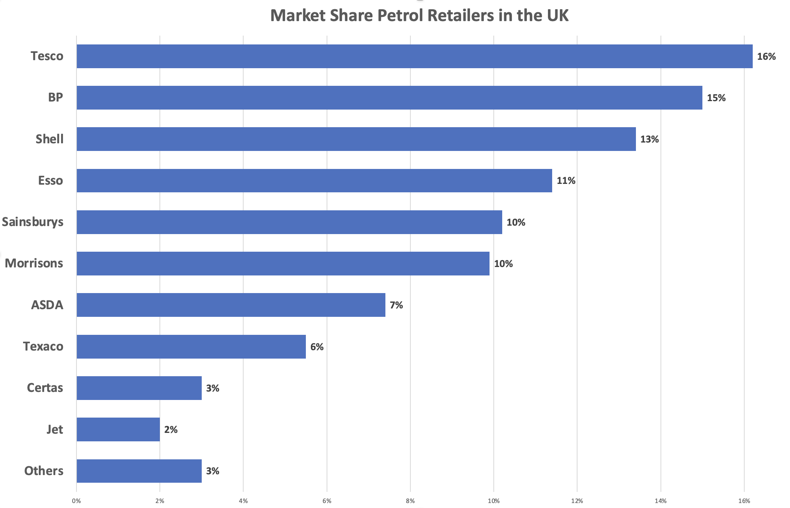
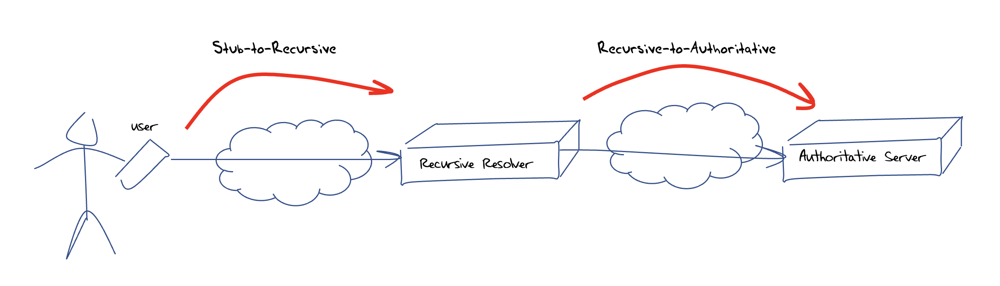
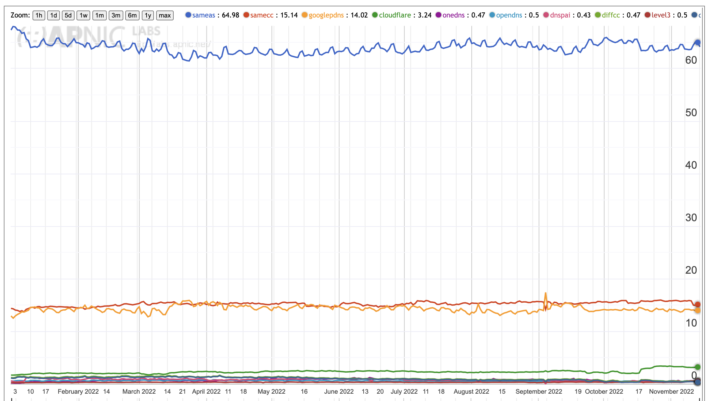
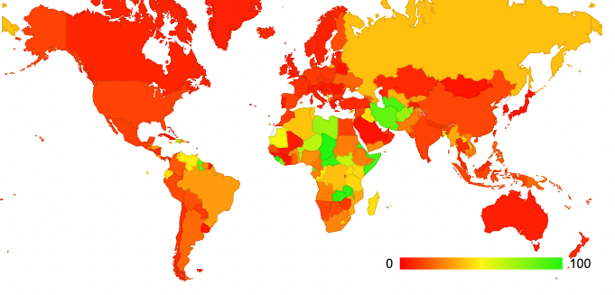
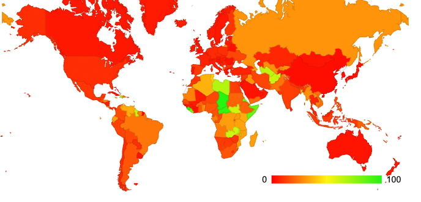
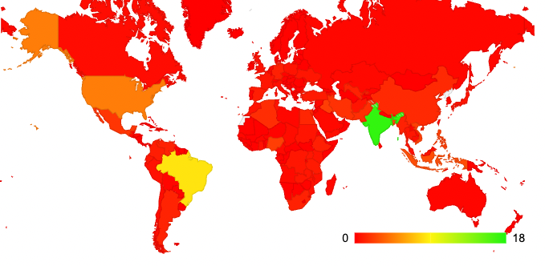
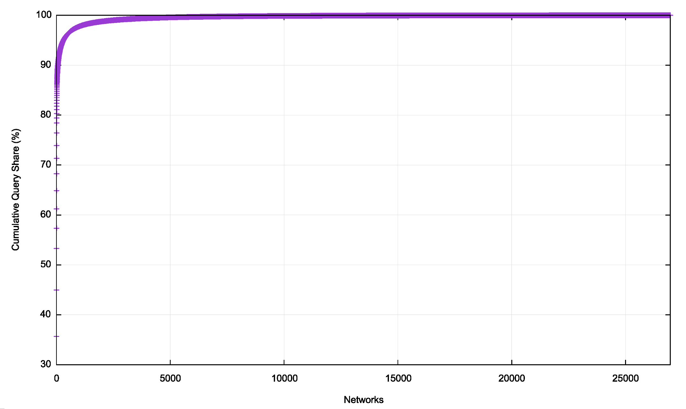

The Internet’s Domain Name System undertakes a vitally important role in today’s Internet. Originally conceived as a human-friendly way of specifying the location of the _other end_ of an Internet transaction, it became the name of a service point during the transition to a client/server architecture. A domain name was still associated with an IP address, but that 1:1 association was weakened when we started adjusting to IPv4 address exhaustion. The address space is now highly fragmented while it’s the name space that provides the essential common referential framework that defines the Internet itself.  

互联网域名系统在当今的互联网中发挥着至关重要的作用。最初被认为是一种指定互联网交易另一端位置的人性化方式，在向客户端/服务器架构过渡期间，它成为服务点的名称。域名仍然与 IP 地址关联，但当我们开始适应 IPv4 地址耗尽时，这种 1:1 关联被削弱。地址空间现在高度分散，而名称空间提供了定义互联网本身的基本通用参考框架。

The question here is: Is the DNS centralised?  

这里的问题是：DNS 是中心化的吗？

A reason why this is a vitally important question might lie in aspects of DNS history.  

这是一个极其重要的问题，原因可能在于 DNS 历史的各个方面。

The early days of the DNS started with a name system that had a small collection of top-level domains, namely .com, .net, .org, .gov, .edu and .mil. The first wave of expansion of this name system was through the adoption of the two-letter country codes as top-level domains. The IANA (which at the time was synonymous with Jon Postel) would delegate the country code to an entity from the country in question who applied. If all this sounds a little informal, then you need to bear in mind that we were still telling ourselves that the Internet was just an experiment and sooner or later some adults would come along and replace all these ad hoc arrangements with adult stuff.  

DNS 的早期始于一个名称系统，该系统包含一小部分顶级域，即 .com 、 .net 、 .org 、 .gov、 .edu 和 .mil 。该名称系统的第一波扩展是通过采用两个字母的国家/地区代码作为顶级域。 IANA（当时是 Jon Postel 的同义词）会将国家/地区代码委托给相关国家/地区提出申请的实体。如果这一切听起来有点非正式，那么你需要记住，我们仍然告诉自己，互联网只是一个实验，迟早会有一些成年人出现，用成人的东西取代所有这些临时安排。

But the adults never came, and the Internet continued to gather momentum, and this momentum created more work for the folk running the common infrastructure, including the names registry. While diversifying across other countries alleviated some of the pressure on the name registry, other problems were created. The US Department of Defence was unwilling to continue to fund Internet infrastructure support, and the role was passed over to other US Federal agencies. The National Science Foundation created the Internet Network Information Center, known as the InterNIC, to extend and coordinate directory and database services and information services and provide registration services for non-military Internet participants. NSF awarded the contract to manage the InterNIC to three organisations and Network Solutions provided domain name registration services.  

但成年人从未出现，互联网继续积聚动力，这种势头为运行公共基础设施（包括姓名登记处）的人们创造了更多的工作。虽然其他国家的多元化减轻了域名注册机构的一些压力，但也产生了其他问题。美国国防部不愿继续为互联网基础设施支持提供资金，这一角色被转交给了其他美国联邦机构。美国国家科学基金会创建了互联网网络信息中心（InterNIC），以扩展和协调目录和数据库服务以及信息服务，并为非军事互联网参与者提供注册服务。 NSF 将管理 InterNIC 的合同授予三个组织，而 Network Solutions 则提供域名注册服务。

The services quickly scaled beyond the NSF funding levels and Network Solutions sought clearance from the NSF to charge a fee for the service, which was levied (as I recall) to $75 per name per year. This was intended to create a fund to support the operation of common infrastructure services, but it was established that this represented a form of unofficial taxation that was not permissible. The resolution of this was to allow Network Solutions to retain the revenue from these name registration fees. This windfall revenue was not without its aspects of controversy and much effort was put into the effort to dilute the defacto monopoly of the .com, .net and .org name registration service.  

这些服务的规模很快就超出了 NSF 的资助水平，Network Solutions 向 NSF 寻求许可，收取服务费用（据我记得），收费为每年每个名字 75 美元。其目的是建立一个基金来支持公共基础设施服务的运营，但事实证明，这是一种不允许的非官方税收形式。解决方案是允许 Network Solutions 保留这些域名注册费的收入。这笔意外收入并非没有争议，人们投入了大量精力来削弱 .com 、 .net 和 .org 名称注册的事实上的垄断。服务。

The chosen approach was to create competition in the space. Firstly, by creating new generic top-level domains to open up choices for name applicants, and secondly, by breaking up the name management infrastructure by allow multiple registrars to act on behalf of end customers and place names into top level domain registries.  

所选择的方法是在该领域创造竞争。首先，通过创建新的通用顶级域名为域名申请人提供选择，其次，通过允许多个注册商代表最终客户并将名称放入顶级域名注册管理机构，从而打破域名管理基础设施。

The intent was largely a statement of faith in basic economic theory that effective competition in a commodity market cures many ills! And when competition fails, including the emergence of scenarios of consolidation and centrality, then we all have a problem.  

其意图主要是表达对基本经济理论的信念，即商品市场的有效竞争可以治愈许多弊病！当竞争失败时，包括出现整合和中心化的情况，那么我们都会遇到问题。

For this reason, the question of centrality in the DNS remains a critical question.  

因此，DNS 的中心性问题仍然是一个关键问题。

Now there are many ways to answer such a question, and here I would like to look at one particular aspect of the DNS, namely the operation of the resolution of DNS names. So, the question here is the resolution of names in the DNS centralised?  

现在有很多方法可以回答这样的问题，这里我想看一下DNS的一个特定方面，即DNS名称解析的操作。那么，这里的问题是 DNS 中的名称解析是集中的吗？

This might seem an odd question, in that by design the DNS is a highly decentralised database that has distributed its contents over much of the Internet already. The DNS information model includes replication of information (in the form of secondary authoritative services) that are intended to address resiliency and scalability issues by removing critical single points of vulnerability within the distributed information structure. The DNS query protocol also allows various forms of query fallback to increase the robustness of name resolution. And finally recursive name resolvers include caching to maintain a store of cached information close to the client-edge. All of this sounds like a highly diverse distributed model of information management that would appear to resist any form of consolidation or centralisation.  

这似乎是一个奇怪的问题，因为从设计上来说，DNS 是一个高度分散的数据库，它的内容已经分布在互联网的大部分地区。 DNS 信息模型包括信息复制（以二级权威服务的形式），旨在通过消除分布式信息结构中的关键单点漏洞来解决弹性和可扩展性问题。 DNS 查询协议还允许各种形式的查询回退，以提高名称解析的稳健性。最后，递归名称解析器包括缓存以维护靠近客户端边缘的缓存信息存储。所有这一切听起来像是一种高度多样化的分布式信息管理模型，似乎抵制任何形式的整合或集中化。

But is this really the case?  

但事实真的是这样吗？

Let’s look at what we can measure in DNS resolution to try and provide some data to answer this question.  

让我们看看我们可以在 DNS 解析中测量什么，并尝试提供一些数据来回答这个问题。

### Market Centrality Metrics  

市场中心度指标

Firstly, let’s look for metrics that can be used to describe market centrality and the related topic of market dominance.  

首先，让我们寻找可用于描述市场中心性和市场主导地位相关主题的指标。

-   The Australian Consumer and Competition Commission (ACCC) uses a metric of a single entity holding more than 70% of a market as an indicator of market dominance (and is used as a threshold for intervention by the ACCC where it believes that abuse of market power is taking place). In the UK, the legal definition of a monopoly is a firm with more than 25% market share.  
    
    澳大利亚消费者和竞争委员会 (ACCC) 使用持有 70% 以上市场份额的单一实体作为市场支配地位的指标（并用作 ACCC 干预的门槛，因为它认为滥用市场支配力正在发生）。在英国，垄断的法律定义是市场份额超过 25% 的公司。  
    
     
-   A slightly different metric is the _four firm concentration ratio_, where the metric is the combined market share of the four largest suppliers in the market. It could easily be the top three or the top five, but the behaviour that is identified is an incumbent clique. If this measure rises above 50%, then there is some justification for concern about market distortion.  
    
    一个略有不同的指标是四家公司集中度，该指标是市场上四大供应商的市场份额之和。它很可能是前三名或前五名，但所识别的行为是一个现任集团。如果这一指标上升到 50% 以上，那么就有理由担心市场扭曲。  
    
     
-   The _Hirfindahl-Hirschman Index_ is used in market analysis to indicate the level of competition between market entities. It is the average market share of the market, weighted by market share, and is the sum of the square of the market share (expressed as a percentage) of the top 50 entities. An HHI value above 25% is often taken as an indicator of market skew, and a value above 10% would be considered as a market showing “moderate concentration”.  
    
    赫芬达尔-赫希曼指数用于市场分析，以表明市场主体之间的竞争程度。它是市场的平均市场份额，按市场份额加权，是前 50 个实体的市场份额（以百分比表示）的平方和。 HHI值高于25%通常被视为市场倾斜的指标，而高于10%的值将被视为市场表现出“中等集中度”。

**Aside – An example of Market Concentration Indicators  

旁白——市场集中度指标的一个例子**

Let’s have a look at an example market and apply these metrics. In this case I’ll use the retail market share for petrol in the UK. The market share of the 10 largest retailers in shown in Figure 1.  

让我们看一个示例市场并应用这些指标。在本例中，我将使用英国汽油零售市场份额。 10家最大零售商的市场份额如图1所示。

  

Figure 1 – Market share of Petrol Retailers in the UK  

图 1 – 英国汽油零售商的市场份额

No single retailer dominates the UK market according to these figures, either using the UK threshold of 25% or the Australian threshold of 70%.  

根据这些数据，无论使用英国 25% 的门槛还是澳大利亚 70% 的门槛，没有任何一家零售商在英国市场占据主导地位。

The 3, 4 and 5 firm concentration numbers are 45%, 56% and 66% respectively. This would point to some grounds for concern, but the market does not appear to be overly centralised by this metric.  

第 3、4 和 5 号企业集中度分别为 45%、56% 和 66%。这可能会引起一些担忧，但从这个指标来看，市场似乎并没有过度集中。

The _HHI index_ is 11%, which would indicate the onset of concentration, which is not inconsistent with the market concentration values.  

HHI指数为11%，表明集中度已经开始，与市场集中度值并不矛盾。

### The DNS Resolution Market  

DNS解析市场

I’d like to move on to a very specific part of the DNS environment and ask the question about centrality as it specifically relates to the resolution of DNS names. There are a number of related questions concerning the registry market, although the 1:1 association of registries and top-level domain names tends to equate the market share of a TLD name registry to the relative popularity of the TLD as a name space. Similarly, there is the question of centrality in the market for name registrars, but here the centrality issues are somewhat less obvious. It is challenging to compare the relative _market weight_ of a registrar that holds the registration of a million obscure names that are never used with a registrar that holds the records of a very small set of the most highly used DNS names.  

我想继续讨论 DNS 环境的一个非常具体的部分，并询问有关中心性的问题，因为它特别与 DNS 名称的解析相关。尽管注册管理机构和顶级域名的 1:1 关联往往将 TLD 名称注册管理机构的市场份额与 TLD 作为名称空间的相对受欢迎程度等同起来，但注册管理机构市场仍存在许多相关问题。同样，域名注册商的市场也存在中心性问题，但这里的中心性问题不太明显。将持有一百万个从未使用过的晦涩名称的注册商与持有极小组最常使用的 DNS 名称记录的注册商的相对市场权重进行比较是具有挑战性的。

With these caveats in mind, look at DNS resolution as a market and use these measurements to assess the degree of concentration in the supply of DNS name resolution services.  

考虑到这些注意事项，将 DNS 解析视为一个市场，并使用这些衡量标准来评估 DNS 名称解析服务供应的集中程度。

Firstly, we need to look at the nature of name resolution. When a user’s application wishes to resolve a DNS name the local DNS agent (the _stub resolver_) will pass the query to a pre-configured recursive resolver. The recursive resolver will then perform a series of queries to various authoritative servers to discover the appropriate server that is authoritative for the DNS name that is being resolver, followed by the actual query for domain name. When it has assembled the DNS response, it will pass it back to the stub resolver. So, in general there are two distinct steps in DNS name resolution, _stub-to-recursive_ and _recursive-to-authoritative_ (Figure 2).  

首先，我们需要了解名称解析的本质。当用户的应用程序希望解析 DNS 名称时，本地 DNS 代理（存根解析器）会将查询传递给预先配置的递归解析器。然后，递归解析器将对各个权威服务器执行一系列查询，以发现对正在解析器的 DNS 名称具有权威的适当服务器，然后进行实际的域名查询。当它组装好 DNS 响应后，会将其传递回存根解析器。因此，一般来说，DNS 名称解析有两个不同的步骤：存根到递归和递归到权威（图 2）。

  

Figure 2 – DNS Query Handling  

图 2 – DNS 查询处理

How should we look at market share (and potential market concentration) of these two steps in DNS name resolution?  

我们应该如何看待DNS域名解析这两个步骤的市场份额（以及潜在的市场集中度）？

For the stub-to-recursive analysis it’s not the name itself that matters, as recursive resolvers are meant to provide resolution for all names. So, we need to look at a metric of use or dependency. This could be the query counts being presented to each recursive resolver, or even the number of distinct users (or distinct stub resolvers) that use the services of each recursive resolver.  

对于存根到递归分析，名称本身并不重要，因为递归解析器旨在为所有名称提供解析。因此，我们需要查看使用或依赖性的指标。这可能是呈现给每个递归解析器的查询计数，甚至是使用每个递归解析器的服务的不同用户（或不同存根解析器）的数量。

This comparative metric of a resolver’s client population does not apply to authoritative servers, as, in theory, every authoritative server could be queried by any recursive resolver on behalf of any user. Perhaps a query count per authoritative server would make more sense, in that a highly popular name would be equivalent in many ways to a large count of seldomly used names. If we are looking at the market concentration of authoritative server providers, then the names themselves are not as important as the server operator, so we probably need a way to associate an authoritative server with a provider and look at the query counts for each provider.  

这种解析器客户端数量的比较指标不适用于权威服务器，因为理论上，每个权威服务器都可以由代表任何用户的任何递归解析器进行查询。也许每个权威服务器的查询计数更有意义，因为一个非常流行的名称在很多方面相当于大量很少使用的名称。如果我们查看权威服务器提供商的市场集中度，那么名称本身并不像服务器运营商那么重要，因此我们可能需要一种方法将权威服务器与提供商关联起来，并查看每个提供商的查询计数。

## A. Concentration in the Recursive Resolver Market  

A. 递归解析器市场的集中度

For this part of the study, we would like to understand the distribution of users per recursive resolver. This is of course a challenging question and the approach we’ve used to answer this question is to use a sampling technique. At APNIC Labs we’ve used online ads to distribute a measurement script to millions of distinct users per day. Each invocation of the script generates a unique DNS name to resolve, and the name is uniquely served by our name servers. By looking at the logs from the authoritative server we can associate a recursive resolver with each user that ran the test and aggregate the data to generate the relative user population served by each recursive resolver (Figure 3).  

对于这部分研究，我们希望了解每个递归解析器的用户分布。这当然是一个具有挑战性的问题，我们用来回答这个问题的方法是使用抽样技术。在 APNIC 实验室，我们每天使用在线广告向数百万不同用户分发测量脚本。每次调用脚本都会生成一个唯一的 DNS 名称进行解析，并且该名称由我们的名称服务器唯一提供服务。通过查看来自权威服务器的日志，我们可以将递归解析器与运行测试的每个用户相关联，并聚合数据以生成每个递归解析器所服务的相对用户群体（图 3）。

  

Figure 3 – Mapping users to recursive resolvers  

图 3 – 将用户映射到递归解析器

We need to map the resolver’s _helper_ IP addresses seen by our authoritative server to a resolver service, and to do this we need to map the various back-end DNS engine IP addresses to the front side recursive resolver service. RIPE Atlas helped here for those cases where the open resolver operator does not publish this information.  

我们需要将权威服务器看到的解析器的帮助程序 IP 地址映射到解析器服务，为此，我们需要将各种后端 DNS 引擎 IP 地址映射到前端递归解析器服务。 RIPE Atlas 在开放解析器运营商不发布此信息的情况下提供了帮助。

We then map resolvers into a number of categories based on the resolver’s IP address. The categories we use are:  

然后，我们根据解析器的 IP 地址将解析器映射到多个类别。我们使用的类别是：

-   Resolver is in the same AS as the end user (ISP’s recursive resolver) (**_sameas_**)  
    
    解析器与最终用户位于同一AS（ISP的递归解析器）（sameas）
-   \>It’s a known Open DNS resolver (**_open_**)  
    
    \>这是一个已知的开放 DNS 解析器（开放）
-   Resolver address is geo-located to the same CC as the end user (_**samecc**_)  
    
    解析器地址与最终用户位于同一 CC (samecc)
-   \>Resolver address is geo-located to a different CC from the end user (_**diffcc**_)  
    
    \>解析器地址被地理定位到与最终用户不同的 CC (diffcc)

The results of this measurement are shown in Figure 4.  

测量结果如图 4 所示。

  

Figure 4 – Recursive Resolver shares  

图 4 – 递归解析器份额

The current resolver use profile is shown in Table 1. Some two-thirds of users direct their queries to the recursive resolver that is operated by their ISP, and 15% of users direct their queries to a recursive resolver that is geolocated to the same country as they are, which is likely to be their ISP using a recursive resolver in a different AS. A total of 14.0% of users have their queries resolved by Google’s Public DNS resolver, 3.2% of users use Cloudflare’s DNS resolution service, and no other open DNS provider has more a share of more than 0.5% of users.  

当前的解析器使用概况如表 1 所示。大约三分之二的用户将其查询定向到由其 ISP 运营的递归解析器，15% 的用户将其查询定向到位于同一国家/地区的递归解析器事实上，这很可能是他们的 ISP 在不同的 AS 中使用递归解析器。共有 14.0% 的用户通过 Google 的公共 DNS 解析器解决查询，3.2% 的用户使用 Cloudflare 的 DNS 解析服务，没有其他开放 DNS 提供商的用户份额超过 0.5%。

| Resolver 旋转变压器 | User Share 用户分享 |
| --- | --- |
| _sameas 与...一样_ | 65.0% |
| _samecc 萨姆CC_ | 15.1% |
| _diffcc 差异_ | 0.5% |
| _open_ (All Open Resolvers)  
open（所有开放解析器） | 20.0% |
| Google Public DNS 谷歌公共 DNS | 14.0% |
| Cloudflare 1.1.1.1 云flare 1.1.1.1 | 3.2% |
| OneDNS (China) OneDNS（中国） | 0.5% |
| OpenDNS 开放DNS | 0.5% |
| DNSPAI (China) DNSPAI（中国） | 0.4% |
| Level3 3级 | 0.5% |
| 114DNS (China) 114DNS（中国） | 0.2% |
| Green Team (Israel) 绿队（以色列） | 0.05% |
| Quad9 四方9 | 0.05% |
| Neustar 诺伊斯塔 | 0.02% |

Table 1 – Recursive Resolver Market Share  

表 1 – 递归解析器市场份额

All of the open resolvers collectively have 20% of the market share of DNS resolution. We can map this data into a relative market share in each national economy, looking at the relative importance of open DNS resolver services per economy. This distribution is shown in Figure 5.  

所有开放解析器总共占有 DNS 解析市场 20% 的份额。我们可以将这些数据映射到每个国家经济体的相对市场份额，查看每个经济体开放 DNS 解析器服务的相对重要性。该分布如图 5 所示。

  

Figure 5 – Distribution of the use of Open Resolvers per economy  

图 5 – 每个经济体开放解析器的使用分布

This per-economy data indicates that open DNS recursive resolvers are used as the dominant form of DNS resolution in some African economies, Guyana, Iran, Afghanistan and Turkmenistan. We can observe that open recursive resolvers are not the dominant provider in most economies other than in Africa and a small collection of Central Asian economies.  

每个经济体的数据表明，在一些非洲经济体（圭亚那、伊朗、阿富汗和土库曼斯坦），开放 DNS 递归解析器被用作 DNS 解析的主要形式。我们可以观察到，除了非洲和一小部分中亚经济体之外，开放式递归解析器并不是大多数经济体的主要提供者。

However, we also observe from Table 1 that the use of Google’s service is more than four times larger in terms of market share than the next-largest open DNS recursive resolver provider, so it is useful to take the same per-economy perspective and apply it to the use of Google’s Public DNS service. This distribution is show in Figure 6.  

然而，我们还从表 1 中观察到，就市场份额而言，谷歌服务的使用量是第二大开放 DNS 递归解析器提供商的四倍多，因此采用相同的每个经济体视角并应用该服务是有用的。它可以使用 Google 的公共 DNS 服务。该分布如图 6 所示。

  

Figure 6 – Distribution of the use of Google’s Public DNS per economy  

图 6 – 每个经济体 Google 公共 DNS 的使用分布

The two distributions are somewhat similar, with the dominant use of Google’s service in parts of central and eastern Africa, Iran and Afghanistan. We can invert the question and look at this from the perspective of Google’s PDNS service by looking at the distribution of users who use this service (Figure 7).  

这两个分布有些相似，谷歌服务的主要使用地区是中非和东非、伊朗和阿富汗的部分地区。我们可以把问题倒过来，从 Google 的 PDNS 服务的角度来看待这个问题，看看使用该服务的用户分布情况（图 7）。

  

Figure 7 – Distribution of the users of Google’s Public DNS Service  

图 7 – Google 公共 DNS 服务的用户分布

Here the large user populations of India and Brazil come into play. 17% of all Google PDNS users are located in India, 8% in Brazil, 5% in the US.  

印度和巴西的庞大用户群体在这里发挥了作用。 17% 的 Google PDNS 用户位于印度，8% 位于巴西，5% 位于美国。

Given that the use of ISP-provided recursive resolution occurs for between 65%to 80% of users (depending on the attribution of the _samecc_ resolver category, which is same country but different AS) resolution, and the known open resolvers have a 20% market share, then Google is not the dominant recursive resolver service provider in most national markets (Figure 6). The _HHI Index_ of the open resolvers as a subset of the DNS recursive resolution market is 4%, and Google’s HHI position is 2%.  

鉴于 65% 到 80% 的用户使用 ISP 提供的递归解析（取决于 Samecc 解析器类别的归属，即同一国家/地区但不同 AS）解析，并且已知的开放解析器有 20%市场份额，那么 Google 并不是大多数国家市场中占主导地位的递归解析器服务提供商（图 6）。作为 DNS 递归解析市场子集的开放解析器的 HHI 指数为 4%，谷歌的 HHI 排名为 2%。

**Is this recursive resolver market centralized?  

这个递归解析器市场是中心化的吗？**

**No.**

What if we constrain our view to look only at the open DNS resolvers, and omit the DNS services operated by an ISP for their user base?  

如果我们将视野限制为仅关注开放的 DNS 解析器，而忽略 ISP 为其用户群运营的 DNS 服务，会怎么样？

The Open Resolver Market space:  

开放式解析器市场空间：

-   Single Entity Dominance: Google has 68.7% of the open DNS resolver market  
    
    单一实体主导：Google 拥有开放 DNS 解析器市场 68.7% 的份额  
    
     
-   Four-Firm Concentration: Google, Cloudflare, 114DNS and OpenDNS have 91.6% market share  
    
    四家公司集中：Google、Cloudflare、114DNS 和 OpenDNS 占据 91.6% 的市场份额  
    
     
-   HHI Index: 49% HHI指数：49%

**If we constrain our view to just the open resolver market sector we observe a highly centralized environment, with Google having a controlling (or dominant) position.  

如果我们将视野仅限于开放解析器市场领域，我们会观察到一个高度集中的环境，谷歌拥有控制（或主导）地位。**

#### Caveats and Comments 注意事项和评论

There are a number of caveats to these results based on the nature of the DNS and the nature of the users that are being measured.  

根据 DNS 的性质和所测量的用户的性质，这些结果有许多注意事项。

**What is being measured here?  

这里测量的是什么？**  

When a stub resolver generates a query into the DNS it is common for two or more recursive resolvers to be passed the query. In our measurements the client stub resolver passes the original query to two or more recursive resolvers some 60% of the time.  

当存根解析器生成对 DNS 的查询时，通常会向两个或多个递归解析器传递该查询。在我们的测量中，客户端存根解析器大约 60% 的时间将原始查询传递给两个或多个递归解析器。

There is a difference between using the identity of the first resolver to ask the query, which is the resolver that presumably is the first to provide a response to the user, and is therefore the resolver that the user “believes”, and the collection of resolvers that “see” the query from the user, which can be considered as the set of resolvers that are able to observe the user’s DNS activity. **The figures presented here relate to the set of recursive resolvers that “see” the original query**.  

使用第一个解析器的身份来询问查询之间存在差异，该解析器可能是第一个向用户提供响应的解析器，因此是用户“相信”的解析器，与“查看”来自用户的查询的解析器，可以将其视为能够观察用户的 DNS 活动的解析器集合。这里展示的数字与“查看”原始查询的递归解析器集相关。

When we look at the first resolver to ask the DNS query (which recursive resolver does the user “believe”) Google’s market share jumps from 14% to 17%, most likely due to Google’s superior speed, which is probably related to the relative density of Google’s cloud platform.  

当我们查看第一个提出 DNS 查询的解析器（用户“相信”哪个递归解析器）时，Google 的市场份额从 14% 跃升至 17%，这很可能是由于 Google 卓越的速度，这可能与相对密度有关谷歌的云平台。

There is a second effect that we cannot readily measure in this form of experiment. In the DNS resolution environment caching matters, and a DNS recursive resolver with a large user base will tend to out-perform a resolver with a smaller user base, assuming that the cache is enough to hold the data for the TTL in all cases. However, this observation is qualified by the way in which very large anycast-based DNS recursive resolvers are constructed. If the service is built upon a set of largely independent small DNS resolution engines, then there is no benefit to be derived from the large user population for the compound service. If a compound service uses a common front end with a cache, then caching does have a positive effect on the service.  

我们无法通过这种形式的实验轻易测量第二种效应。在 DNS 解析环境中，缓存很重要，假设缓存在所有情况下都足以保存 TTL 的数据，则具有较大用户群的 DNS 递归解析器往往会胜过具有较小用户群的解析器。然而，这一观察结果是通过构造非常大的基于任播的 DNS 递归解析器的方式来限定的。如果该服务建立在一组基本上独立的小型 DNS 解析引擎之上，那么复合服务的大量用户群不会带来任何好处。如果复合服务使用带有缓存的公共前端，那么缓存确实会对服务产生积极的影响。

**Who are we measuring? 我们在测量谁？**  

In a broad-based sampling experiment that we operate in APNIC we have a relatively broad collection of end user points. These include both end users in retail ISPs, enterprise networks, and other networks that are not so readily classified. A look at the day-by-day detail in Figure 5 show pronounced peaks in relative usage levels on weekends, while the opposite profile applies for Google’s service, which shows weekday peaks.  

在我们在 APNIC 进行的基础广泛的抽样实验中，我们收集了相对广泛的最终用户点。其中包括零售 ISP、企业网络和其他不易分类的网络中的最终用户。从图 5 中的每日详细信息来看，周末的相对使用水平出现了明显的峰值，而 Google 的服务则相反，显示了工作日的峰值。  

It brings into question the intent of this measurement. If the intent of the measurement is a consumer measurement, then we will need to filter the results to look only at consumer networks. It is evident that use of third party open recursive resolvers is far higher in enterprise-service networks, while mass market consumer networks tend to rely heavily in the ISP-provided infrastructure. So, the measurements related to centrality provided above relate to industry-wide measurements, and do not reflect the consumer market sector, the enterprise sector, or any other specialised service sector.  

它让人对这种测量的意图产生疑问。如果测量的目的是消费者测量，那么我们需要过滤结果以仅查看消费者网络。很明显，在企业服务网络中第三方开放递归解析器的使用率要高得多，而大众市场消费者网络往往严重依赖 ISP 提供的基础设施。因此，上面提供的与中心性相关的衡量标准涉及全行业的衡量标准，并不反映消费者市场部门、企业部门或任何其他专业服务部门。

In addition, we see the increasing use of user privacy measures, such as Apple’s private relay data service, which are intended to obscure the identity and location of the user.  

此外，我们还看到越来越多的用户隐私措施被使用，例如苹果的私人中继数据服务，其目的是掩盖用户的身份和位置。

## B. Authoritative Servers  

B. 权威服务器

Now let’s turn our attention to the authoritative server side of DNS name resolution, looking for data that provides some indication of the level of concentration in the market to provide authoritative servers for DNS names.  

现在，让我们将注意力转向 DNS 名称解析的权威服务器端，寻找能够提供 DNS 名称权威服务器市场集中程度的一些指示的数据。

This is a very different environment from the stub-to-recursive environment. Here, we cannot see users or are we able to derive general recursive-to-authoritative queries profiles from the query data from individual authoritative servers. What we would like to measure is the relative query load presented to each authoritative service provider and assess market centrality based on these query proportions. The best please to obtain recursive-to-authoritative query profile data is form the recursive resolvers. But this is easier said than done. The issue with these measurements is that data about the recursive-to-authoritative query set is extremely hard to obtain. Recursive resolvers sit in a privileged position in the DNS, as they are exposed to both the identity of the stub resolver (the ‘user’) and the DNS names that they are querying, so it is perfectly reasonable that access to such recursive resolver data is extremely uncommon and typically comes with many caveats and limitations.  

这是一个与存根到递归环境非常不同的环境。在这里，我们看不到用户，或者我们是否能够从各个权威服务器的查询数据中导出一般的递归到权威查询配置文件。我们想要衡量的是每个权威服务提供商所呈现的相对查询负载，并根据这些查询比例评估市场中心性。获得递归到权威查询配置文件数据的最佳方式是从递归解析器中获取。但这说起来容易做起来难。这些测量的问题在于，有关递归到权威查询集的数据极难获得。递归解析器在 DNS 中处于特权地位，因为它们暴露于存根解析器（“用户”）的身份和它们正在查询的 DNS 名称，因此访问此类递归解析器数据是完全合理的这是极其罕见的，并且通常带有许多警告和限制。

At APNIC we have limited access to the data relating to the use of the 1.1.1.1 recursive resolver under the terms of a collaborative research agreement with Cloudflare. In this case we do not necessarily know who is querying, but we are given the query name that is being presented to the Cloudflare resolver system. This is pre-cache query data, in that it’s not the queries that the recursive resolver makes to authoritative servers, which is essentially a record of local cache misses, but a record of the queries being passed to the recursive resolver for resolution. The market share of Cloudflare’s open resolver service is around 3% of users (Figure 4) which is a non-trivial resolver in the open resolver set (ranked #2 in terms of market share of open resolvers, as already noted).  

根据与 Cloudflare 的合作研究协议条款，在 APNIC，我们对与 1.1.1.1 递归解析器的使用相关的数据的访问权限有限。在这种情况下，我们不一定知道谁在查询，但我们会获得呈现给 Cloudflare 解析器系统的查询名称。这是预缓存查询数据，因为它不是递归解析器对权威服务器进行的查询，本质上是本地缓存未命中的记录，而是传递给递归解析器进行解析的查询记录。 Cloudflare 的开放解析器服务的市场份额约为 3% 的用户（图 4），这是开放解析器集中的一个不平凡的解析器（如前所述，在开放解析器的市场份额方面排名第二）。

The analysis we use here to parse the query data is to find the _closest_ name server for each query name. We are looking for the name server that will be used to provide the response to the query. This means resolving the NS records to follow the delegation chain and resolving CNAME and DNAME alias records on the way. We take the IP address of this name server and using the routing table to map this address into an origin AS, essentially locating the network operator of the server in question. If there are multiple name servers for a domain, then we just use the first name server from the server list. We then resolve this name server name and take the first IP address for the name server. We then use the current routing table to map this IP address into an Autonomous System number of the network that advertises this prefix.  

我们在这里用来解析查询数据的分析是为每个查询名称找到最接近的名称服务器。我们正在寻找将用于提供查询响应的名称服务器。这意味着解析 NS 记录以遵循委托链并解析 CNAME 和 DNAME 别名记录。我们获取该名称服务器的 IP 地址，并使用路由表将该地址映射到原始 AS，本质上是找到相关服务器的网络运营商。如果一个域有多个名称服务器，那么我们只使用服务器列表中的第一个名称服务器。然后，我们解析该名称服务器名称并获取该名称服务器的第一个 IP 地址。然后，我们使用当前的路由表将此 IP 地址映射到通告此前缀的网络的自治系统编号。

In this measurement exercise we intentionally discount the effects of local caching in the resolver. It’s not the actual query rate of the authoritative server that we are using for this metric, but the rate at which users are using responses from this server, whether or not they were generated from the resolver’s cached entry.  

在此测量练习中，我们有意降低解析器中本地缓存的影响。这不是我们用于此指标的权威服务器的实际查询速率，而是用户使用来自该服务器的响应的速率，无论它们是否是从解析器的缓存条目生成的。

  

Figure 8 – Incoming queries at the recursive resolver  

图 8 – 递归解析器处的传入查询

We are looking at the query-count weighted ranking of the DNS authoritative server providers. If an authoritative name server hosts a very popular domain name, then it’s likely that the query count will be high. If a service operator hosts a very large number of domains on its authoritative server infrastructure, then it’s possible that the query count will be high. In some ways these two situations, a large volume of served names and serving a highly popular name are routing equivalent in terms of ‘share’ of the authoritative server market. So, we will characterise the authoritative service hosting market by their query-based ‘market share’.  

我们正在查看 DNS 权威服务器提供商的查询计数加权排名。如果权威名称服务器托管非常受欢迎的域名，那么查询计数可能会很高。如果服务运营商在其权威服务器基础设施上托管大量域，则查询计数可能会很高。在某些方面，这两种情况，大量提供的名称和提供高度流行的名称在权威服务器市场的“份额”方面是等效的。因此，我们将通过基于查询的“市场份额”来描述权威服务托管市场的特征。

The measurement approach we used in this experiment was to take a 24-hour snapshot of queries that were presented to the Cloudflare resolver. We grouped the query names and then performed our own resolution of these names to find the ‘closest’ authoritative name server for the query name using a local resolution environment. Arbitrarily, we take the first name server name in the name server list. At this point we discard the query names and concentrate on the name servers. We then resolve the name server names to IP address and discard the name server names. Then we map the IP addresses to AS numbers, and discard the IP addresses, and group the query counts into AS numbers and rank by query share.  

我们在本实验中使用的测量方法是拍摄提交给 Cloudflare 解析器的查询的 24 小时快照。我们对查询名称进行分组，然后对这些名称执行我们自己的解析，以使用本地解析环境找到查询名称的“最近”权威名称服务器。我们任意地取名称服务器列表中的第一个名称服务器名称。此时，我们放弃查询名称并专注于名称服务器。然后，我们将名称服务器名称解析为 IP 地址并丢弃名称服务器名称。然后，我们将 IP 地址映射到 AS 编号，并丢弃 IP 地址，并将查询计数分组到 AS 编号中，并按查询份额进行排名。

Mapping Query names to Authoritative Service Providers  

将查询名称映射到权威服务提供商

Let’s take the query name www.apnic.net. The first step is to find the _closest_ name server:  

让我们采用查询名称 www.apnic.net 。第一步是找到最近的名称服务器：

$ dig +short NS www.apnic.net  

www.apnic.net.cdn.cloudflare.net.

This is a mapped domain name that points to a cloud service provided by Cloudflare. We query the cloud prefix to see if it a delegated domain:  

这是一个映射域名，指向 Cloudflare 提供的云服务。我们查询云前缀以查看它是否是委托域：

$ dig +short NS cdn cloudflare.net.

This is not a delegated domain, so we move up a domain to find the name servers for the next level up:  

这不是委托域，因此我们向上移动一个域来查找下一个级别的名称服务器：

$ dig +short NS cloudflare.net.  

ns3.cloudflare.net.  

ns4.cloudflare.net.  

ns5.cloudflare.net.  

ns1.cloudflare.net.  

ns2.cloudflare.net.

Let’s take the first nameserver name and resolve it to an IP address:  

让我们获取第一个名称服务器名称并将其解析为 IP 地址：

$ dig +short A ns3.cloudflare.net  

198.41.222.31

Now let’s find the network AS number and AS name of the network that originates a routed to this address prefix:  

现在让我们查找发起路由到此地址前缀的网络的网络 AS 编号和 AS 名称：

$ originas 198.41.222.31  

198.41.222.31 AS13335, CLOUDFLARENET, US

In this case the query name www.apnic.net maps to a name that is served by Cloudflare.  

在本例中，查询名称 www.apnic.net 映射到由 Cloudflare 提供服务的名称。

The 24-hour data capture in September 2022 identified 26,971 unique AS numbers (out of a total of 75,000 unique AS numbers in the routing table). While approximately one third of networks host at least one queried authoritative name server the top 50 ASNs have 89.2% of the query share, a figure that appears to point to some level of consolidation in the name server domain.  

2022 年 9 月的 24 小时数据捕获确定了 26,971 个唯一 AS 编号（路由表中总共 75,000 个唯一 AS 编号）。虽然大约三分之一的网络托管至少一个查询的权威名称服务器，但前 50 个 ASN 拥有 89.2% 的查询份额，这一数字似乎表明名称服务器域中存在某种程度的整合。

A cumulative distribution plot bears out this indication of a high degree of centrality in this space (Figure 9).  

累积分布图证实了该空间的高度中心性（图 9）。

  

Figure 9 – Cumulative Distribution of Authoritative Servers  

图 9 – 权威服务器累计分布

The largest 10 authoritative name server providers are listed in Table 2, ranked by Cloudflare’s relative query count  

表 2 列出了最大的 10 个权威名称服务器提供商，按 Cloudflare 的相对查询数排名

| Rank 秩 | AS | Auth Srv Query Share  
Auth Srv 查询 分享 | Cumulative 累计 | Name 姓名 |
| --- | --- | --- | --- | --- |
| 1 | AS16509 | 35.7% | 35.7% | Amazon-O2, US 亚马逊-O2，美国 |
| 2 | AS13335 | 9.3% | 45.0% | Cloudflare, US Cloudflare，美国 |
| 3 | AS15169 | 8.3% | 33.3% | Google, US 谷歌，美国 |
| 4 | AS21342 | 4.0% | 57.3% | Akamai, US 美国阿卡迈 |
| 5 | AS8068 | 3.9% | 61.2% | Microsoft, US 微软，美国 |
| 6 | AS397239 | 3.7% | 64.9% | UltraDNS (Neustar), US UltraDNS（Neustar），美国 |
| 7 | AS714 | 3.4% | 68.3% | Apple, US 苹果，美国 |
| 8 | AS31898 | 3.1% | 71.4% | Oracle, US 甲骨文，美国 |
| 9 | \* | 2.5% | 73.9% | NXDOMAIN (Root Servers) NXDOMAIN（根服务器） |
| 10 | AS62597 | 2.5% | 76.4% | NSone, US 美国 NSone |

Table 2 – Authoritative Server Service Providers, Ranked by Query Volume  

表 2 – 权威服务器服务提供商，按查询量排名

Let’s look at the “market” of DNS authoritative server providers using this query-weighted ranking.  

让我们用这个查询加权排名来看看 DNS 权威服务器提供商的“市场”。

-   Single Entity Dominance: Amazon has 35.7% of the Authoritative Server market.  
    
    单一实体主导：亚马逊拥有权威服务器市场 35.7% 的份额。  
    
     
-   Four-Firm Concentration: Amazon, Cloudflare, Google, and Akamai have 57.3% market share.  
    
    四家公司集中：亚马逊、Cloudflare、谷歌和 Akamai 占据 57.3% 的市场份额。  
    
     
-   HHI Index: 15%. HHI 指数：15%。

**The DNS Authoritative Server market appears to be a “moderately concentrated” market.  

DNS 权威服务器市场似乎是一个“适度集中”的市场。**

#### Caveats and Comments 注意事项和评论

**Geopolitical Centrality 地缘政治中心性**  

There are 10 network entities who host the authoritative name servers that have a query share of three quarters of the recursive-to-authoritative DNS query volume. Nine out of these ten networks are operated by US entities. The other entity is the Root Server System, which is operated by a larger set of root service operators, who all serve the DNS root zone file.  

有 10 个网络实体托管权威名称服务器，其查询份额占递归到权威 DNS 查询量的四分之三。这十个网络中有九个由美国实体运营。另一个实体是根服务器系统，它由更多的根服务运营商运营，这些运营商都为 DNS 根区域文件提供服务。

**The Root Question 根本问题**  

Some 2.5% of queries result in NXDOMAIN responses from the root zone. Yet the reports from the root server operators indicate that around 70% of queries seen at the root servers elicit NXDOMAIN responses.  

大约 2.5% 的查询会导致来自根区域的 NXDOMAIN 响应。然而，根服务器运营商的报告表明，在根服务器上看到的大约 70% 的查询都会引发 NXDOMAIN 响应。

This seems to be somewhat contradictory, but there are some additional considerations that may explain this. DNS queries that are seen at the root servers can be assumed to be queries from recursive resolvers and are the result of cache misses or cache expiration. It may be that the query volume seen by recursive resolvers is considerably greater than the query volume seen by the root servers, and the 2% of queries seen at recursive resolvers corresponds to some 70% of the root server query volume. It also might be the case that the query profile seen at the Cloudflare resolver is anomalous in having a low NXDOMAIN query volume as compared with recursive resolvers located within USP networks.  

这似乎有些矛盾，但还有一些额外的考虑因素可以解释这一点。在根服务器上看到的 DNS 查询可以假定为来自递归解析器的查询，并且是缓存未命中或缓存过期的结果。递归解析器看到的查询量可能比根服务器看到的查询量大得多，并且递归解析器看到的查询的 2% 对应于根服务器查询量的大约 70%。也可能出现这样的情况：与位于 USP 网络内的递归解析器相比，Cloudflare 解析器中看到的查询配置文件存在异常，因为 NXDOMAIN 查询量较低。

**Amazon and Route 53 亚马逊和 53 号公路**  

The Amazon-O2 number, corresponding to servers in AS16509 is actually two sets of authoritative servers. Amazon have their own authoritative server service, Route 53, and in addition many users use Amazon’s virtual servers to run their own authoritative servers. In this exercise we’ve joined to two together, which is perhaps misleading.  

Amazon-O2编号，对应AS16509中的服务器，实际上是两组权威服务器。亚马逊有自己的权威服务器服务Route 53，此外还有很多用户使用亚马逊的虚拟服务器来运行自己的权威服务器。在这个练习中，我们将两个连接在一起，这可能会产生误导。

**Limitations 局限性**  

This analysis is based on a single 24-hour data set from a single open recursive resolver service. The query sample set is not completely uniform and there is a potential bias to enterprise use and some browser use (such as Firefox and its TRR program).  

此分析基于来自单个开放递归解析器服务的单个 24 小时数据集。查询样本集并不完全统一，对企业使用和某些浏览器使用（例如Firefox及其TRR程序）存在潜在偏差。

Also, using query volumes as a proxy for some form of market share is not a universally accepted analytic metric.  

此外，使用查询量作为某种形式的市场份额的代理并不是普遍接受的分析指标。

So, while we might suspect that there is some skew in the data, there is no alternative source of information that would allow us to work on this suspected skew and compensate for it in some way.  

因此，虽然我们可能怀疑数据存在一些偏差，但没有其他信息来源可以让我们处理这种可疑的偏差并以某种方式对其进行补偿。

## Conclusions 结论

Is the DNS resolution market centralized? Are most DNS queries being handled by a small set of operators in the recursive resolver space? And what about authoritative servers? Is the market for these services highly centralised?  

DNS解析市场是否集中？大多数 DNS 查询是否由递归解析器空间中的一小部分运算符处理？那么权威服务器呢？这些服务的市场是否高度集中？

For the recursive resolver market, it appears that the majority use of the ISP-provided recursive resolver offsets the high degree of centralisation in the open recursive resolver market, and the global market appears to be appropriately balanced in terms of diversity of providers. The same does not apply when we constrain the scope of this examination to just the open recursive resolvers, or look at certain national economies, where there is a high degree of centrality.  

对于递归解析器市场，似乎大多数使用ISP提供的递归解析器抵消了开放递归解析器市场的高度中心化，并且全球市场在提供商的多样性方面似乎是适当平衡的。当我们将检查范围限制为开放式递归解析器，或着眼于某些具有高度中心性的国家经济时，情况就不一样了。

We have also looked at the market for authoritative servers, and here there is a somewhat different picture. Using a query-weighted metric to calculate market share, the largest four service providers account for 57% of queries, and the market for authoritative servers appears to be moderately centralised.  

我们还研究了权威服务器的市场，这里的情况有些不同。使用查询加权指标来计算市场份额，最大的四家服务提供商占查询的 57%，权威服务器的市场似乎适度集中。

There are several concerns that are associated with a highly centralised market, particularly as it relates to the provision of common infrastructure services., such as the DNS. One is the emergence of critical vulnerabilities where the entirety of the activity, and to be clear, here we are talking about the digital economy, is reliant on the services undertaken by a small clique of providers, or even a single provider. While this is a valid concern in the case of the provision of authoritative servers in the DNS, it is not a concern in the provision of recursive resolution services where ISP-provided services provide a necessary balance to the position of Google’s Public DNS offering.  

高度集中的市场存在一些问题，特别是因为它涉及公共基础设施服务的提供，例如 DNS。一是严重漏洞的出现，其中整个活动（并且需要明确的是，我们在这里谈论的是数字经济）都依赖于一小群提供商甚至单个提供商提供的服务。虽然在 DNS 中提供权威服务器的情况下这是一个合理的问题，但在提供递归解析服务时这不是一个问题，其中 ISP 提供的服务为 Google 公共 DNS 产品的地位提供了必要的平衡。

Another concern is that centralisation can lead to monopoly or cartel-like behaviour resulting in price gouging and other forms of market abuse. Here the issue is one of consumer protection, where price escalation in the provision of essential infrastructure services can cause inefficiencies throughout the entire digital economy. Here a somewhat anomalous aspect of recursive resolution is able to allay this concern for consumers. The market for DNS recursive resolution looks like a complete economic failure! None of the service’s clients pay for the service! Users do not, in general, directly pay to have their queries answered, and users do not pay to have their potential future responses held in the cached of recursive resolvers for faster service when needed. From the consumer perspective this has the superficial appearance of a free service! Name operators also do not pay recursive resolvers to resolve their names on their behalf. So, nobody pays. The concern that centralisation would lead to the emergence of price escalation in this market through the imposition of monopoly rentals seems like a very distant prospect right now. (Yes, there are some specialised DNS resolution services where the client does pay, including so-called “scrubbing” DNS services which pre-emptively removes the resolution of certain DNS names, but these tend to have a specialised client base and do not seem to have an impact on the larger DNS resolution market, at least so far.)  

另一个担忧是，中心化可能导致垄断或卡特尔行为，从而导致价格欺诈和其他形式的市场滥用。这里的问题之一是消费者保护，提供基本基础设施服务的价格上涨可能会导致整个数字经济效率低下。递归解析的一个有点反常的方面能够减轻消费者的这种担忧。 DNS 递归解析市场看起来完全是经济失败！该服务的客户都不支付服务费用！一般来说，用户不会直接付费让他们的查询得到解答，并且用户也不会付费将他们未来潜在的响应保存在递归解析器的缓存中，以便在需要时提供更快的服务。从消费者的角度来看，这表面上是免费服务！名称运营商也不向递归解析器付费来代表他们解析其名称。所以，没有人付钱。担心集中化会通过征收垄断租金而导致该市场价格上涨，目前看来是一个非常遥远的前景。 （是的，有一些专门的 DNS 解析服务，客户需要付费，包括所谓的“清理”DNS 服务，它会先发制人地删除某些 DNS 名称的解析，但这些服务往往有专门的客户群，并且似乎并不对更大的 DNS 解析市场产生影响，至少到目前为止。）

Is there a potential user impact contained in the emerging centralisation of the Authoritative Nameserver service? To some extent yes, this is a distinct possibility, but for me this topic is bound up in the larger topic of the nature of monopoly and competition in digital markets. The economic environment of the digital world is far removed from that of the physical industrial world of the 1890’s where the concept of regulatory responses to monopolistic behaviours was crystallised in the Sherman Act in the US. Its sufficiently different that is merits some consideration as a topic on its own in a future article.  

权威域名服务器服务的新兴集中化是否会对用户产生潜在的影响？在某种程度上，是的，这是一种明显的可能性，但对我来说，这个话题与数字市场垄断和竞争的本质这一更大的话题密切相关。数字世界的经济环境与 1890 年代的实体工业世界相去甚远，当时美国《谢尔曼法案》中具体体现了针对垄断行为的监管反应概念。它有足够的不同，值得在未来的文章中作为一个主题单独考虑。
