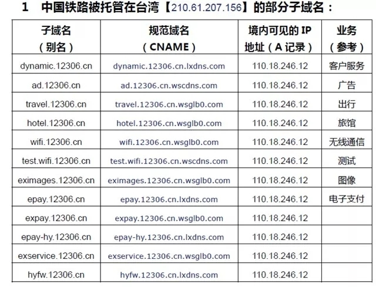
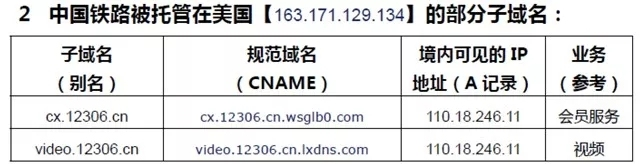
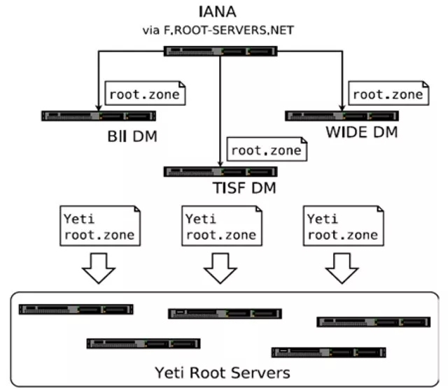
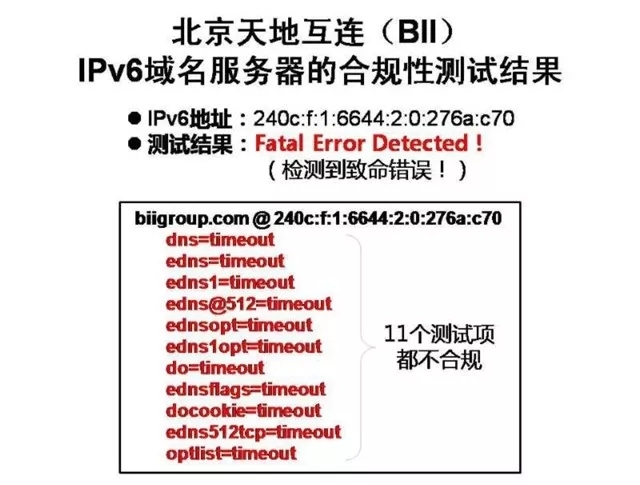
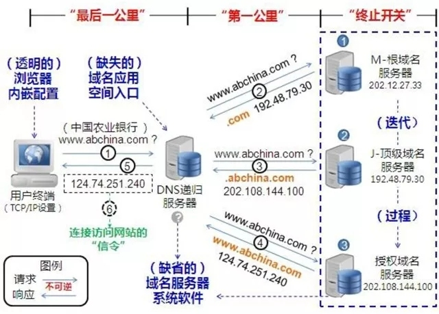
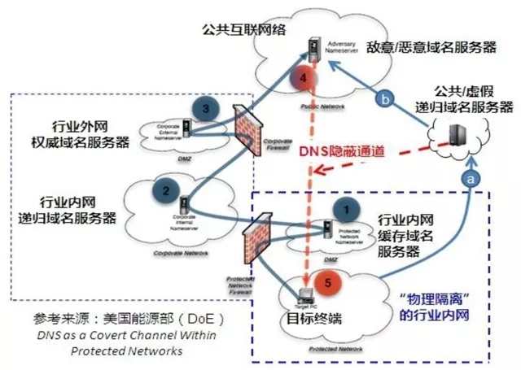

牟承晋：全球因特网进入新的DNS时代 ——再论重新认知和深化治理因特网

　　【提要】数据主权（Data Sovereignty）已成为美国、欧盟、以及多国的共识和行动（包括立法和治理），尤其是在“棱镜门”之后成为“重中之重”的聚焦点（Spotlight）。不实施数据主权原则，不仅数据安全和隐私处于危险之中，而且国家数据资产也无可避免地受到威胁。建议国家制定和启动借鉴“爱因斯坦-3”（E3A）的我国网络主权和安全战略计划，利用现有网络基础设施构建自主可控的DNS态势感知系统，打造我国数据主权、数据安全、数据利用的新的网络空间长城。 一、 因特网进入DNS新时代的  

　　重要标志性事件 1、 DNS“执行日”  

 　　DNS是英文Domain Name System的简称，中文称（网络）域名系统，是将网络域名转换成为网络可以识别的IP地址的解析中枢系统，不仅具备网络通信中指挥和控制（C2）的内在特性，而且具有集权的固有政治（Inherently Polical）属性。 　　既往的DNS协议不同于其他因特网协议，不仅“绝无仅有”地贯穿了网络通信的应用层、网络层和传输层，而且为DNS提供支持的和定制化的底层软件（从权威域名解析服务器到递归域名解析服务器）也越来越复杂。例如，只要是基于域名系统的内容分发网络（DN-CDN），无论内网、外网、专网、公众网，都依赖于域名系统（DNS）的服务，包括在DNS扩展机制（EDNS）中增加用户端的地址信息（Client Subnet）以有助于DN-CDN对内容推送定位的精准“匹配”。 　　当需要对DNS软件更新及编程时，必须了解包含陈旧、错误或不相适应的所有软件变通方法。基于“美国利益至上”、“一网天下”的网络战略和立场，DNS 软件存在的一些变通方法（“旁门左道”），使美国方面控制指挥DNS的实施面临着更加深化与细化的复杂性且无可避免地出现功能性衰退，增加了难以预料的错误和安全漏洞的风险。“加固”DNS成为必然。 　　1999年，美国因特网工程任务组（IETF）就建议实施DNS域名系统的扩展机制（EDNS）。 　　2016年3月，美国商务部的国家通信与信息管理局（NTIA）、因特网域名与数字地址分配机构（ICANN）和全球提供智能信息基础设施服务的企业威尔森（Verisign，设立于美国），作为域名根区管理者，牵头完成了“域名根区密钥（KSK，密钥签名密钥）更换计划”。 　　2018年10月12日，ICANN主导实施了因特网历史上第一次全球性的域名根区密钥（KSK）翻转，并宣布以后每年都要进行翻转。专业人士称，KSK是统一“重新配钥匙”，其后的“DNS执行日”则是统一“更新锁头”和“更新铰链”，环环相扣，步步为营，层层加码。 　　2018年5月，因特网（Internet）的全球各区域管理机构（RIR）官方宣布，2019年2月1日是“DNS执行日”（DNS Flag Day）。按因特网区域管理机构的官方通报以及因特网社区的联合警报，自“执行日”（及之后），不合规的域名解析服务器将被作为“死机”（Dead），必然影响相关网站的访问（互访）。 　　域名解析服务器主要针对的是权威域名服务器和递归域名服务器。“合规性”是通过（指定的）DNS软件版本升级，废弃或删除DNS软件存在的“变通方法”，以软件定义互连互通（SDN）识别或支持“DNS扩展机制”（EDNS）。EDNS执行的是美国因特网工程任务组（IETF）在2013年发布的标准（RFC 6891）。 　　DNS协议在因特网上的应用已经持续了30多年，在全球范围“统一”维护DNS协议和更新DNS软件行动的“执行日”，是因特网历史上的第一次，标志DNS进入了控制指挥的新开端、新阶段、新一代。亚太地区网络信息中心（APNIC）明白无误地声明：“总之，我们希望所有DNSSEC（DNS安全扩展）权威服务器的运营商能够顺利地更新其DNS系统软件，并无缝过渡到下一个30年的DNS时代。” 　　伦敦经济和政治科学研究院（简称LSE）2009年3月发表题为《中国和域名系统》文章，明确提出：“就信息通信技术（ICT）而言, DNS是一种‘固有政治’的技术。由于其分配、储存和解析因特网地址的功能, 使其无疑是政治权力的重要来源；而DNS旨在确保技术标准化和系统之间互通的最大潜力, 以及避免使相同网络地址重复分配，‘固有政治’的特点也正是基于DNS技术本身的高度集中化。因此, 谁控制了DNS的集中式技术, 谁就拥有了在网络空间的权力和主导权。” 2、 废弃“下一代互联网IPng”  

 　　美国为实施和实现引领与主导“下一个30年的DNS时代”，早就启动了一系列有计划的准备和铺垫，包括为因特网的发展部署“正名”。 　　1）废弃持续近20年的IPv6作为“下一代因特网协议” 　　2017年7月14日，美国因特网工程任务组（IETF）发布RFC 8200号文件，宣布了因特网协议第六版（IPv6）的最新正式标准（标准号STD 86），同时废弃1998年12月提出的RFC 2460 号文件（即IPv6规范草案），并删除了向IPv6过渡的“下一代互联网（Internet）协议IPng”。　　美国因特网区域工作组（IntArea）指出：“在过去几年中，全球范围广泛开始实施新的数据保护法规正在对世界各地的技术公司和消费者产生巨大影响，导致IETF程序和监管要求中的某些先前建立的最佳实践成为不良做法。”也就是说，全球网络应用的生态环境巨变，引起了网络技术架构和用户需求的巨变，“导致IETF程序和监管要求中的某些先前建立的最佳实践成为不良做法”，因而废除既往以IPv6作为“下一代互联网（Internet）”的草案（协议）和过渡措施（计划）成为必然、必须和必要的步骤。这表明，RFC 8200号文件的决定，不是仅仅基于长期实践检验和应用的结果而对因特网发展历史和现状的客观总结与一般性归纳，更是坚持“美国优先”原则、维护“美国利益至上”网络空间战略、策略及安全的底线和目的。 　　美国当年以“IPv4地址数量不足”提出向IPv6过渡升级是基于以上原则和底线的使然，如今废弃“IPv6规范草案”和“下一代互联网IPng”过渡计划还是因为上述原则和底线的必然。这不单纯是网络技术架构的设计问题，也不只是网络部署发展的策略问题，是深化与细化美国网络霸权统治的全新重大部署，是重申因特网“固有政治”目的的根本性决策。 　　与之相呼应，掌控DNS域名系统安全扩展（DNSSEC）的KSK和DNS域名系统扩展机制（EDNS）的SDN，是确立和巩固DNS在“下一代互联网（Internet）”中的指挥控制核心作用和地位的前提及基础。 　　2）IETF知识产权主张三个基本原则出台 2017 年5 月，美国因特网工程任务组（IETF）发布正式文件RFC 8179（BCP 79），即“IETF技术中的知识产权问题”（Intellectual Property Rights in IETF Technology），给出关于IETF处理因特网知识产权主张的三个基本原则，同时废弃RFC 3979和RFC 4879文件。RFC 8179文件明确规定：  

 　　⑴ 将不会确定任何具体知识产权主张的有效性。 　　⑵ 在遵循正常的流程中，如果必要，可以决定使用已经被公开知识产权的技术。 　　⑶ 所有参与IETF工作组讨论的人员，必须披露已知的知识产权或任何涵盖及可能将涵盖正在讨论技术的任何知识产权及其推荐者。该要求适用于所有知识产权的主张者、知识产权主张者的雇主、赞助商或知识产权主张者的代理人，而不需要进行专利搜索。 　　这就是说，“因特网是我的，规矩由我定。”IETF有权选择尚未声明知识产权的技术，或者免费授权的知识产权技术；IETF可以采用任何技术，却不承诺任何技术的授权许可。说白了，就是IETF在因特网工程应用中采用任何技术都不接受知识产权及其所有权属主的约束；因特网采用的技术是否“合规”，只能是IETF说了算；未经IETF同意，任何技术、任谁的知识产权应用于因特网均属无效、不合规，IETF“孰不认账”。IETF在其技术规范中强制实施安全技术已经是司空见惯。其知识产权三原则的出台，不过是公开宣布“釜底抽薪”、“唯我独尊”、“我行我素”。 　　截至2018年11月，美国专利局（USPTO）授予IPv6相关技术的专利19,296件，欧盟专利局（EPO）授予IPv6相关技术的专利2,180件。IETF废弃IPv6作为“下一代互联网（Internet）协议”，决定实施全球性的“DNS执行日”，乃至任意关闭其他国家（如伊拉克、利比亚）的顶级域名服务器、断网断服等，无论多少知识产权，无论谁授予的知识产权，无论授予谁的知识产权，美国民间组织IETF的知识产权三原则都“理直气壮”、“名正言顺”地被置于政府保护知识产权的法令和管理机构的权威之上，是因特网唯一“合规”的“金口玉言”、绝对主张。 　　“美国优先”、“美国利益至上”的原则和底线始终高于一切，维护因特网“一网天下”的网络空间霸权始终高于一切。 3、 数据主权的法律争夺  

 　　构成网络空间的三个基本维度，即以基础设施为中心的物理维度、以数据为中心的信息维度、以人的行为为中心的认知维度。半个多世纪以来，已经发生了不可逆转的从产业化到社会化、从商业化到定制化、从技术引领到数据驱动的由量到质、由质到量的演变，尤其是，地缘政治的主导和影响日益凸显。 　　联合国“互联网治理”组织（IGF）批准“全球互联网与管辖权政策网络”（简称I&J）作为“开放论坛”，目前已有200多个来自世界各地不同利益相关方的关键实体，包括政府、网络企业、技术团体、民间组织、学术单位和国际机构等（不知为什么，没有中国的机构组织）参加。连续三届I&J年会（包括2019年6月即将召开的年会）研究和讨论的重点都是“数据的管辖权”。 　　2015年10月，欧盟法院（ECJ）做出里程碑式的裁决，推翻了欧盟委员会在本世纪初提出、已经被包括IBM、谷歌和爱立信等在内的4000多家公司所利用的“安全港”（Safe Harbour）机制。欧盟法院称，“安全港”机制没有充分保护欧盟公民的个人资料，因为美国经常以国家安全、公共利益和执法需要等名义，违反该机制所确定的隐私保护措施。 　　英国是G20国家中互联网经济（Internet Economy）渗透率最高的国家，英国政府的目标是要将英国打造成最安全的开展在线商业活动的国家，认为数字经济的发展推动个人数据不断增长，对个人数据保护的水平也应该同步提高。2017年8月7日，英国数字、文化媒体和体育部发布了一份名为《新的数据保护法案：我们的改革》的报告，将通过一部新的数据保护法案（New Data Protection Law）以更新和强化数字经济时代的个人数据保护，以取代实施了二十年的《1998年数据保护法》。 　　欧洲议会通过的《通用数据保护条例》（GDPR），已于2018年5月25日正式生效。该条例将数据保护从属地扩展到属人，细化了个人隐私数据的分类，明确了数据主体的“同意”要件，保障个人对其数据的访问权、限制处理权和拒绝权，并拥有“可携权”（取得个人数据处理副本）、“擦除权”（又称被遗忘权）等。对违反数据管理者和数据处理者的义务等，违反数据属主权利、限制数据处理、中断数据传输或禁止数据访问等，都制定了严厉的高额处罚条款。 　　特朗普针锋相对，抢在2018年3月23日提前欧盟两个月签署生效了《澄清境外合法应用数据法案》（CLOUD），规定美国联邦调查局（FBI）等执法部门，可以从因特网所及世界各地调取数据。该法案认为，及时获取通信服务提供者持有的电子数据，是美国政府为保护公共安全和打击包括恐怖主义在内的重大犯罪的关键；监管、控制或拥有这些数据的通信服务提供者本身，受到美国法律的管辖。该法案还允许其他国家将非美国公民的个人数据存储在美国。专业人士称，无论数据的存储位置和创建地点在哪里，对服务提供商控制的任何数据，该法案赋予美国执法机构无限的优先管辖权。 　　也就是说，《澄清境外合法应用数据法案》认定美国政府和美国的企业、机构获取世界上任何数据都是合法的、正当的，以对抗依据欧盟的《通用数据保护条例》被追诉和被处罚。 　　2018年被称为世界“数据保护元年”。 　　无疑，数据主权和安全的保护已经上升为国家主权和安全之争。我们看到的，仍然是“美国优先”、“美国利益至上”左右和支配着孰不讲理、咄咄逼人的网络空间数据争夺战。“DNS执行日”表明，网络空间数据争夺战，已经全方位毋庸置疑地渗透到因特网的控制指挥系统。 　　全球三大网络信息中心之一的Nomine，是全球首批专业ccTLD（国家/地区顶级域名）运营商之一，英国的.UK域名管理及注册机构，创建于1996年5月。Nomine认为，DNS在每个网络中都发挥着至关重要的作用——它制定了将人类可理解的域名转换为机器可识别的因特网协议（IP）地址的技术标准。 　　换言之，DNS是网络数据化运行、应用、服务和安全保护的基础中枢平台。数据主权和安全之争，必然首先涉及DNS的管控权、指挥权、标准权、主动权、话语权之争。 　　“DNS执行日”是数据主权争夺的必然结果。美国在网络空间数据领域寸步不让，寸权必争，寸利必夺，不仅体现在技术上，也充分表现和落实在法律层面。 二、 我国的网络数据存在  

　　重大安全隐患 1、 服务器普遍被托管在境外  

 　　逆向观察，中国在维护数据主权和安全、保护数据，关注和利用数据方面，明显滞后，甚至流于形式，对数据的属地、属主管理和治理重视不够、执法不力。不少依赖数据、成天接触数据的单位和官员，对数据保护的原则、底线、重点、方法、途径等，思想上懵懵懂懂，政治上糊里糊涂，行动上流于形式，技术浮夸，管理懒散，执法松懈。 　　据国家信息中心等基于DNS开源信息的持续实时监测（态势感知），我国由上而下，党政机关、央企国企、知名网站（服务商）等的服务器被间接或直接托管在境外的情况普遍存在。近些年来大量公民个人数据、企业数据、国家数据以及涉及我国经济、政治、社会、文化、军事等重要敏感行业的数据泄露，与此关系甚大。有企业专门提供国内服务器托管到境外、国外信息内容分发推送到国内的（CDN）服务，毫无顾忌，毫不避讳。 　　2017年，全球泄露数据量的国家排名前10名，中国名列榜首。主要泄露数据单位，包括百度20亿条用户电话号码、姓名、地址；网易12.22亿条邮件地址和用户密码，并被在网络售出；上海春雨2.68亿条邮件地址和电话号码；腾讯1.3亿条邮件地址和用户密码，并被在网络售出等。迄今，泄露、买卖数据的单位是如何反省、整改的？政府监管部门是如何调查、处理的？均不得而知。而当时披露泄露数据真相的上网文章，却被迅速删帖，发表文章的网站承受很大的压力。不仅被泄露数据的个人和单位起码的知情权都得不到尊重和保护，而且国家数据安全问题竟然是由境外发现和警报后的“转内销”，岂非咄咄怪事？！ 　　2018年10月11日，维基解密公布了亚马逊的“高度机密”内部文件“Amazon Atlas”。文件列出了遍布9个国家（包括中国）15个城市的100多个亚马逊数据中心的地址和运营细节，其中设在中国的9个数据中心，6个集中在北京。2013年，亚马逊与美国中央情报局（CIA）签订构建专供情报机构使用的“云”的合同，整合、提供归类为“最高机密”的信息。亚马逊还为美国政府运营一个特殊的Gov Cloud区域（政务云）。亚马逊在中国的政务云中心设在宁夏。许多地方的开发区、高新区竟然麻木地争相邀请亚马逊等落地本区域设立数据中心，公开宣传提供免费托管服务器的“业务”和培训。 　　2017年11月20日，亚马逊公开宣布向中央情报局及其情报体系（IC）成员提供“云”服务，称为“亚马逊云服务平台秘密管区”（AWS Secret Region）。亚马逊称此项服务是“第一个也是唯一的商业云提供商向政府提供全面的数据分类服务，包括非涉密、敏感、涉密、绝密的数据。”亚马逊是唯一拥有在“云”中托管机密数据所需认证的公司。网易邮件服务器就托管在亚马逊的AWS服务平台上。 　　服务器托管在境外，托管在亚马逊等，意味着所依赖的DNS域名地址转换和解析的路径和系统，一可以穿透（跃过）我国的“防火墙”，二可以不需要经过我国境内的“镜像”（不留痕迹），三可以避（绕）开我国的各种监控和监管，四是被托管代管的大数据可以经过有选择性的过滤后再“推送”回到设在我国境内（运营）的“云”。 2、 “旋转门”比比皆是  

 　　早些年，美国一些高校精英转换身份成为国家政要，一些高级将领退役成为跨国企业家或科研翘楚，被认为是身份转换的“旋转门”，为美国梦的实现提供了可能。 　　这些年，“旋转门”的理念和操控，被深入应用到因特网。基于DNS实时监测的态势感知发现，公众知名网站的服务器、“云”中心都存在“旋转门”问题。 　　由境内公司主导和联手产生引导数据流到境外的“马甲”效应，称之为“内旋转门”，反之，则称之为“外旋转门”。一般来说，我国被导向境外的是原始来源数据，境外托管；国外推送境内的是筛选（备份）之后的数据，境内缓存。数据泄露或被恶意利用都只在“旋转门”的一瞬间，而我们往往却在为数据是否泄露、泄露了多少数据、是“拖库”还是“撞库”….. 而站台背书，争论不休，纠缠不清。 　　请注意，近年来，美国司法部、联邦调查局等多起刑事起诉我国公民（包括我国家安全官员、留学生、科研人员、企业家等）的公开证据，主要都是通过“旋转门”获取的开源数据、信息、情报。 　　CDN 缓存服务器是支撑“旋转门”的重要技术模式，既是向境内提供服务数据（内容）的根源，也是从境外接收数据（内容）的节点，其开放的自定义端口潜在地与境内外互动。网络入侵和攻击往往利用自定义端口渗透。 　　腾讯的16台邮件服务器（IPv4地址），12台属地美国洛杉矶，自治系统AS 6939，属主为Hurricane Electric（HE，飓风电子公司）；4台属地深圳，自治系统AS 132203/132591，属主为腾讯。所有服务器都具有“旋转门”功能。 　　美国苹果公司（Apple）在中国有四个主要域名，其中“云上贵州”的页面是www.colasoft.com.cnicloud.com.cn，其它3个地址显示为苹果官方网站。“云上贵州”的别名（Canonical Name）是www.icloud.com.cn.edgekey.net，中国境内网址47.96.193.19（www.icloud.com.cn），属主是AS 37963（阿里云），其中的IPv4地址104.100.56.123映射到（别名）IPv4地址23.38.201.117，属主是美国的Akamai公司（拥有全球三分之一以上CDN市场的服务商）。“云上贵州”的“旋转门”功能十分明显、典型，并可能牵连出更深层次、更大范围的网络空间主权和安全问题。 　　中国铁路12306主网站的别名是www.12306.cn.lxdns.com，中国境内网址58.216.109.187，属主是AS 4134（中国电信），而该别名所绑定的5个DNS全部都在美国（AS 54994），属于典型的基于DNS的内容推送网络（DN-CDN）；客服中心的域名dynamic.12306.cn被托管主机的IP地址210.61.207.156（AS 3462），属地竟然是台湾（台北），属主竟然是台湾的官方网络运营商中华电信数据业务集团（Data Communication Business Group）。 

  

 　　中国铁路会员服务的域名cx.12306.cn被托管主机的IP地址163.171.129.134（AS 54994），属地美国（加州），属主是网宿科技（QUANTIL NETWORKS）。 

  

 　　上述托管服务器竟然开放和使用了因特网号码分配机构（IANA）规范定义的“洋葱路由”（Tor the onion router）81端口。“洋葱路由”是以匿名为目的，自成体系的域名系统和代理机制，多被用于“暗网”和黑客。使用“洋葱路由”端口凸显被托管主机存在明确无误严重的数据泄露风险。据1月25日我国公安部新闻发布，2019年全国铁路春运发送旅客4.06亿人次，远超过美国人口（3.26亿），数据量、信息量巨大，开源情报价值难以评估。如果美国、台湾等借此路径发动网络攻击或黑客侵入，将能够精准定位和跟踪任意目标，后果不堪设想。 　　重要说明：IANA原属美国商务部国家电信和信息管理局（NTIA），建立ICANN就是为了履行IANA的职责，两者职能各自不一、相辅相成，都要按照与商务部签署的无成本协议执行及履行职责。IANA的职能是作为美国国防部高等研究计划署的阿帕网（ARPANET）的一部分制定的，包括：1）协调因特网协议技术参数的分配；2）履行与因特网DNS根区域管理相关的职责；3）分配因特网IP地址。 三、 “DNS执行日”的重要启迪  

 1、 “雪人计划”的谎言破产  

 　　ICANN于2015年提出和公布的“雪人计划”，英文是Yeti DNS Project，即“雪人DNS计划”。 　　ICANN最广为人知的职责和使命，就是作为因特网域名系统（DNS）的技术协调机构，对全球因特网的唯一标识符系统进行协调，确保唯一标识符系统能够稳定且安全地运营。 　　ICANN主持的“雪人DNS计划”网站清楚地说明：“雪人DNS”系统是用于根域名服务的测试平台以及一些实验，不会添加/删除在IANA根域区中的委派记录（Delegations），并以“雪人”（Yeti）安全扩展（DNSSEC）密钥标识所有资源记录（RRset），不提供替代的域名空间。 　　“雪人DNS计划”的发起人之一、自诩的“域名之父”保罗•维克西（Paul Vixie）2016年就强调并警告，如果认为“雪人计划”是域名空间扩张，除IANA之外的其他人可以有效地编辑顶级域名空间，例如添加新的顶级域名（TLD）或更改现有顶级域名（TLD）的所有权，答案绝对不是；如果你触摸它（替代根域名服务），你就会死亡；如果某个国家想创建自己的因特网DNS系统，独立将是不健康的、粗俗的和短暂的。 　　保罗的“雪人DNS”工作模式: 

  

 　　一直以来，以北京天地互连信息技术有限公司（BII Group）为代表，我国一些专业人士、政府官员竭力鼓吹“雪人计划”是中国主导的，“构建全球IPv6根服务器网络，展示新型的IPv6根服务器的应用能力”，“中国部署了其中4台基于IPv6的根服务器，打破了中国过去没有根服务器的困境”云云。 　　无情的是，“DNS执行日”将“雪人计划”打回了原形。DNS的合规性结果，宣告了“雪人计划”从因特网“下一个30年DNS时代”的开端就被“弹劾”出局；或就是一出被人利用炮制的“闹剧”，不仅使“替代根域名”难以为继，3年多来对“雪人”（造假性的宣传）打造和（欺骗性的巨额）投入，倾刻间就被“融化”（土崩瓦解）了。 

  

 　　值得玩味的是，DNS扩展机制（EDNS）正是由保罗在1999年提出（RFC 2671），2013年形成标准（RFC 6891）。然而，保罗却坐视“雪人”在技术上的旁门左道，在应用上的不合规，在互联网社区中的自取其辱（即与所宣称的“一个世界、一个互联网、一个域名系统”的阴阳变通）。究竟是为什么？是保罗糊弄了天地互连的专家们，还是天地互联的专家们耍了保罗？或是双方互有默契？ 　　以上事实真相还清楚地揭示，基于IPv4技术的因特网生命力依然强盛，对于美国来说，“下一个30年的DNS时代”仍然是IPV4时代。 　　据美国国家标准与技术研究院（NIST）截至2018年12月22日的“USG v6状态统计”，经过美国政府长达近20年的IPv6过渡计划推动，美国支持IPv6的产业只有2%在运营中，过渡和没有进展的占98%；美国高校采用IPv6域名运营的仅3%，过渡与没进展的占97%，这是不能不关注的反常动态。据APNIC统计，截至2018年10月31日，美国的IPv6用户率已经从世界排名第一降到了第三，中国排名第71位。据谷歌的监测认为，美国IPv6采用率实际只有36.31%。 　　亚太地区网络信息中心（APNIC）的报告指出，2017年下半年至2018年8月，IPv6部署状态出现回落。受到IPv4地址短缺压力较高的运营商，IPv6部署率较低，确实意味着在因特网的许多领域尚没有客户端/服务器（C/S）环境中部署IPv6的迫切性。也就是说，地址短缺的压力，不是规模部署IPv6的充分必要条件。 　　受因特网域名与数字地址分配机构（ICANN）首席技术官   办公室（OCTO）委托，美国佐治亚理工学院公共政策研究院的因特网治理项目组（简称IGP）发布了一份题为“隐藏的标准之战争”的调查报告（2019年2月），研究分析认定：IPv4与IPv6不是“过渡”问题，而是在技术进化中的两条路线之间的经济之争；而且目前IPv6的部署率不均衡，相关的数据违背了简单的或可预测的模式。 　　根据我国“国家下一代互联网产业技术创新战略联盟”2018年11月1日发布的《支撑中国IPv6规模部署—中国IPv6业务端到端贯通用户体验监测报告》，我国IPv6活跃用户数（已分配IPv6地址且一年内有IPv6上网记录的用户）移动宽带718万户，固定宽带233万户，共计951万户，按照“推进规模部署IPv6”要求2018年底达到2亿的指标，实在是差得太远。　　IPv6颠覆IPv4网络应用架构的态势，难以解决的大量已知和未知的安全陷阱和安全壁垒，十分巨大的投资和运维成本，遥遥无期的经济回报，是无论市场经济、计划经济都不能不避讳、权衡的掣肘。实事求是地重新调整规模部署IPv6的战略和策略，势在必行，迫在眉睫。我国须尽早抉择。 　　面对众所周知且无可辩驳的事实，天地互连的专家和支持者将情何以堪？又将作何自辩或解释？国家和各级政府的行政主管、执法、审计、监察部门，是不是该认真履行职责了？ 2、 BIND是关键、要害  

 　　美国国防部国防高级研究计划局（DARPA）1980年资助开发、1984年后由美国因特网系统联盟（ISC）接管的BIND，是因特网最重要的核心步骤和战略部署。既是为了“绑架”DNS枢纽平台，也是为了从“软、硬”两个方面紧密融合，牢牢掌握和控制住DNS的所有权、指挥权、控制权、决策权。BIND早已经植入于DNS，成为DNS捆绑应用的“事实标准”（de facto Standard），主导着DNS应用的全球软件市场，不仅是指引因特网数据流走向的“红绿灯”规则，也是强制性服从的“指挥棒”，违逆即陷入迷失、彷徨、混乱或撞壁。 

  

 　　以上图示显示，在BIND的作用（软件互连互通的控制指挥）下，DNS应用驱动递归服务器，由递归域名服务器与域名解析系统按“从右到左”交互完成三次不可逆的域名解析迭代的过程。但其中任何一个环节都可能被窃听、窃取、篡改或转移，还可能被分级服务商“合法镜像”后作为相互的“安全信息交换”，是为专业人士不可不知的“筛子型”漏洞。 　　美国国防部以域名体系设置网际逻辑边界，美国国防部网络信息中心（DoD Network Information Center）运营管理军方专用网络NIPRnet。固化于DNS的BIND（美国国防部自主开发），有目标、有针对性地将各国的数据流第一指向美国国防部网络信息中心，再转向情报部门等其他网络信息中心节点。 　　请注意，DNS请求数据（和信息）在解析的交互过程中完全相同。某些专家在科普中的解释：“根服务器中存储的内容很少，平时普通用户上网时也基本不会访问根服务器”，如果不是无知的错误，就是故意的误导。 　　联系到2017年5月12日，全球150多个国家和地区快速蔓延“想哭”（WannaCry）勒索病毒事件。一位英国工程师偶然发现“想哭”病毒通过域名进行指挥和控制（C&C），遂利用“终止开关”（Kill Switch）方法，有效遏制了“想哭”病毒的肆虐，被业内及媒体誉为“意外英雄”（Accidental Hero）。同时，全世界都体会到了BIND固化于DNS的“终止开关”功能。 　　“终止开关”是因特网的一个新兴术语或网络热词，涉及到数据主权、网络安全及因特网的治理。准确诠释“终止开关”的定义是：因特网终止开关（Internet Kill Switch），是旨在作为一项反制措施而启动的一种控制机制，以能够关闭全部或局部的因特网数据流。 　　美国参议员乔•利伯曼（Joe Lieberman）等2010年6月19日在第111届国会上提交的立法提案（S.3480）《将网信空间作为国家资产保护法》（Protecting Cyberspace as a National Asset Act of 2010），被媒体称之为《因特网终止开关法案》。 　　美国民间人权组织（电子隐私信息中心，简称EPIC）2011年开始追踪美国政府的“标准操作程序303”（Standard Operating Procedure 303）秘密计划文件。这份由美国国家电信协调中心（NCC）起草、国家通信系统（NCS）批准的30页“应急无线网络协议”（Emergency Wireless Protocols），提出“当国家处于危机时，关闭及恢复商业和私人无线网络的过程”，代表了美国政府的政策，也被业内和媒体称为“因特网终止开关”（Internet Kill Switch）。 　　ICANN官网在2016年7月22日发表《何谓因特网终止开关？谁有钥匙？》博文，表明因特网“终止开关”在域名根区，ICANN持有钥匙。俄罗斯专家称之为“因特网的红色按钮”。 　　欧洲、俄罗斯等都对美国控制与指挥固化了BIND的DNS高度警惕。荷兰NLnet Lab研发的NSD，以BIND为标准（兼容），虽然技术研发和支持相对独立，尚未形成主流。但至少，从DNS应用角度，可以避免“鸡蛋放在一个篮子里”，降低风险；从开放合作角度，研发可控技术和产品可以博众家之长，寻求制衡；从长远角度，有利于在因特网领域“构建”DNS控制的平衡，共享共治。俄罗斯宣布近期（4月1日）将测试脱离全球因特网，重点和目的是检查流量屏蔽禁止的内容，确保俄罗斯用户之间的流量（90%以上）留在本国境内，也只能是围绕研发可控并行DNS采取必要的应对措施。 　　我国应迎头赶上。可以在借鉴、利用美国的BIND和欧洲的NSD的同时，鼓励借鉴“爱因斯坦3”计划的边界和前沿的安全防御措施，切入基于DNS开源数据信息情报实时监测的态势感知，积累集聚经验教训和重新认识、探索因特网的治理与控制本源，努力开发自主可控、为我所用的兼容（制衡）BIND和NSD的DNS系统软件。 3、 数据主权和安全是重点  

 　　综上，数据主权（Data Sovereignty）已成为美国、欧盟、以及多国的共识和行动（包括立法和治理），尤其是在“棱镜门”之后成为“重中之重”的聚焦点（Spotlight）。不实施数据主权原则，不仅数据安全和隐私处于危险之中，而且国家数据资产也无可避免地受到威胁。尤其需要指出的是：当今因特网的“互连互通”已是有条件和有边界的！ 例如，中国的IP地址被境外某些专业性网站作为“黑名单”，禁止访问（404，没有访问授权）。 　　对数据主权的一般描述是：政府对在本国内收集数据的控制，包括数据属地（data residency，即强制数据存储的地点）、数据保全（data retention，即强制保留数据交易的记录）。 　　美国是因特网的鼻祖。一开始从军用阿帕网引向欧洲因特网，就是为了传输开源数据（信息、情报）。半个多世纪以来，美国围绕因特网的建设发展、技术革新万变不离数据，不离数据主权，不离数据安全，不离数据利用（获取情报），一切为了数据。即便是从这一方面来看，我们对美国与因特网、世界与因特网、中国与因特网，也必须重新认识、加深认识、与时俱进地再认识。继续追随美国二三十年前对因特网的认识、理解和思想，显然严重滞后了，乃至越来越严重、无情地桎梏和羁绊我们在网络空间的创新、创业，令我们一次又一次地束手待毙，被完全地边缘化，距离未来网络的科学进步渐行渐远。 　　今天，任何网络技术所承载的都是数据。网络应用所产生的是数据；互连互通交换的是数据；网络服务所面对的是数据；网络创新发展（如人工智能）所依托的是数据；网络安全（国家安全）所保护的还是数据，……。数据已经融合成为人类社会发展的动力，构建人类命运共同体的资产、文化和语言。数据无论属地还是属主，已经在不同维度、不同层面被不同程度地“转基因”衍伸演变应用，数据“变脸”成为常态，成为维护或动摇网络空间主权和安全根本的颠覆性要素。 　　中国公民和官员对网络数据大多还不够敏感。什么云计算、大数据、小概率事件、开源信息，总认为对自己和本单位没什么直接联系。更谈不上对数据的充分利用、对建设发展数据中心的迫切需要、高度重视。新加坡发展银行集团（DBS Group）研究认为，中国数据中心的总体利用率小于50%，数据中心下线城市的利用率甚至只有20%。未来 3-5 年, 对数据中心的需求不会大规模转移到下线城市的数据中心。正因为此，亚马逊、苹果、微软、IBM等这几年纷纷来中国建设数据中心，名为中国服务，实为美国服务。腾讯、网易、百度、360、铁路12306甚至党政机关等也纷纷“被”向境外托管服务器，以在中国不怎么受待见的数据换取“免费的”先进技术服务和个体商业利益。基于DNS的CDN（和SDN）技术，已经形成因特网今后一段时间的应用主流和技术趋势。 　　在国家关键信息基础设施的大多数网络环境中，通常都会配置网闸、防火墙、入侵检测系统、防病毒软件等，以控制TCP/IP 和其他网络协议的数据流量，实现内部网络（专网）不得直接或间接地连接公共互联网，即“物理隔离”（PNI）。 　　但是，这个较为普遍的规定与现象偏离了事实。 网络安全威胁行为利用这一认知误区以及监管盲区，以 DNS 为载体，绕过网络安全防护机制，将敏感数据从企业内部传输到企业外部。即使是“物理隔离”的内网，仍然依赖于DNS请求和响应，形成内外网的应用贯通（事实连接）。通常是“畅通无阻”（如防火墙的53端口）和普遍驻留的盲区（如DNS的滥用、误用），以至于内网DNS应用的异常行为和通过DNS的信息泄露处于基本失控状态。 

  

 　　以上美国能源部（DoE）的图示中，（1）-（2）-（3）的“通道”是行业内网与行业外网所固有的，即是网络系统的组成部分；（a）-（b）的“通道”是DNS滥用或目标终端存在漏洞所导致，即是失察失控的应用乱象（如随意使用谷歌公共DNS服务，8.8.8.8等）；（4）-（5）形成了DNS的隐蔽通道，不仅可以成为泄露数据的传输载体，而且被作为指挥和控制（C2）的手段（如APT）。 　　美国国土安全部长约翰逊在2016年1月报告，作为美国国家网络安全防护系统（NCPS）的爱因斯坦计划，起始于2010年，2013年4月进入第三阶段（称为E3A），对潜在的网络攻击不仅监测，而且具有主动拦截能力，能够处理涉密信息，能够有效保护政府网络安全、应对最先进的网络攻击对手。同时，E3A为新技术研发提供一个平台，协同政府部门和民营行业的先进技术和专业知识，以发现未知的网络攻击。美国国会已经强制性要求所有联邦政务部门在2016年底之前加入E3A计划。 　　“爱因斯坦-3”（E3A）主要提供4项功能：1）防御——实时缓解已知或疑似网络安全威胁；2）甄别——确定被入侵的信息系统、系统组件或主机终端，作为对安全事件的即时响应；3）感知——针对联邦政府信息系统的网络安全状态，定制开发、维护和服务，以“安全即是常态监控”（简称Saa CM）为基准。4）发现——监测和识别针对以联邦政府信息系统为目标的新的或涌现的网络安全威胁，提升网络安全防御能力。 　　建议国家制定和启动借鉴“爱因斯坦-3”（E3A）的我国网络主权和安全战略计划，利用现有网络基础设施构建自主可控的DNS态势感知系统，打造我国数据主权、数据安全、数据利用的新的网络空间长城。 　　长风破浪会有时，直挂云帆济沧海。 　　多少事，从来急；天地转，光阴迫；一万年太久，只争朝夕。 　　（作者系中国移动通信联合会国际战略研究中心主任，南京华氘网络科技有限公司总裁，本文完成于2019年2月22日；来源：昆仑策网【原创】）