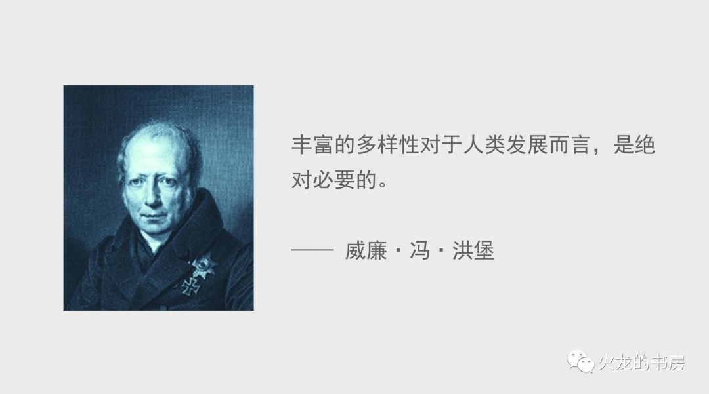

## 《论自由》缩译版

密尔 火龙随笔 _2022-04-16 00:18_

这是约翰·密尔所著的《论自由》的缩译版本，之前的译本接近10万字，我缩译到了约1.8万字，差不多40分钟能读完。

这本书探讨了自由的边界和意义，是政治哲学的经典读物，是人类思想史里的明珠。尤其第二章，论证了我们对于“异议“应该采取的宽容态度。

[第一章：引论](http://mp.weixin.qq.com/s?__biz=MzA5MTkzODM3OQ==&mid=2652418481&idx=2&sn=2b2ee8f7b6147c891ec01573cf39df46&chksm=8b98da95bcef538365a536009fe4fd6e2502d2edecd1e64cfdbefa07fb569993f9103852852f&scene=21#wechat_redirect)

[第二章：论思想言论自由](http://mp.weixin.qq.com/s?__biz=MzA5MTkzODM3OQ==&mid=2652418481&idx=3&sn=a47900aeaeedc0d1a7a591d233974b59&chksm=8b98da95bcef5383b33a26906dca85a9d60257af9a32917090fa0b02d824160bd9d76e40387f&scene=21#wechat_redirect)

[第三章：论个性自由](http://mp.weixin.qq.com/s?__biz=MzA5MTkzODM3OQ==&mid=2652418481&idx=4&sn=ae1b424f840a47e3e23657f04ce9ba55&chksm=8b98da95bcef5383d7fa4d33ddaaff6d1b59a4e110c3db5c4e21d5e27c4d22c737b3fb3cd09c&scene=21#wechat_redirect)

[第四章：论社会权力的边界](http://mp.weixin.qq.com/s?__biz=MzA5MTkzODM3OQ==&mid=2652418481&idx=5&sn=1775a89aca24a9e8c7a24d933d5c2691&chksm=8b98da95bcef538314d1307676227bac731546f9d9a4643c61679c719a44feaf12adafbb85db&scene=21#wechat_redirect)

[第五章：自由原则的应用](http://mp.weixin.qq.com/s?__biz=MzA5MTkzODM3OQ==&mid=2652418481&idx=6&sn=51fd310dde435396185a2ab9cbbe5b82&chksm=8b98da95bcef53835aefae39131e220b641b7bb1cd1a897e99c140325facd3a5d2029ce63b9f&scene=21#wechat_redirect)

Modified on 2022-04-17