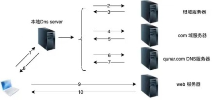
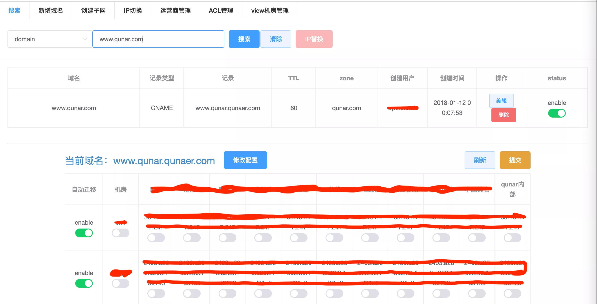
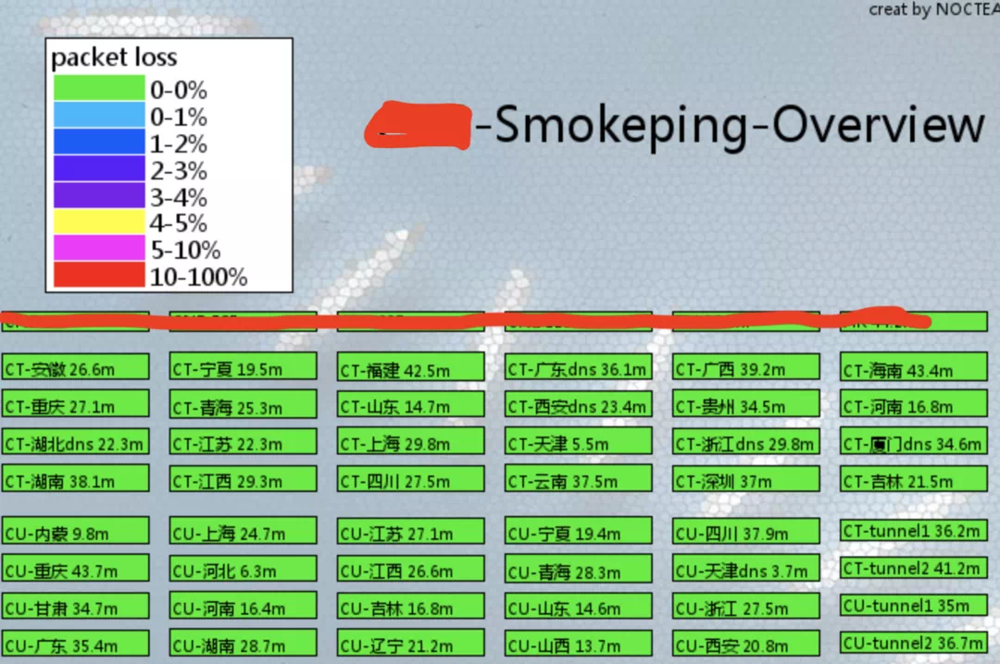
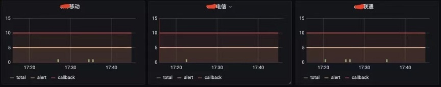

> 作者简介：苗宏涛，2010 年加入去哪儿，主要负责去哪儿网站运营-技术保障部相关工作。将运维自动化，智能化一直是我秉持的理念。

## DNS 定义

DNS 是域名系统 ( Domain Name System ) 的缩写，是因特网的一项核心服务，它作为可以将域名和 IP 地址相互映射的一个分布式数据库，能够使人更方便的访问互联网，而不用去记住能够被机器直接读取的 IP 数字串。互联网能够互联互通，能够方便人们方便访问，DNS 起到了很大的作用。DNS 查询过程要维护好 DNS 系统，首先要理解 DNS 的原理和查询过程。这里给大家介绍下一般 DNS 查询过程。

1.  用户（通过 PC/手机）向本地 DNS 服务器发起请求：“你知道 [www.qunar.com](https://xie.infoq.cn/link?target=http%3A%2F%2Fwww.qunar.com%2F) 的 IP 吗？”如果首选 DNS 服务器知道，那么本地 DNS 服务器就会直接给用户返回域名的 IP 地址
    
2.  若本地 DNS 服务器上没有相关信息，就不能直接返回域名的 IP 地址，这时候，本地 DNS 服务器就会去询问根 DNS 服务器（全球有 13 台 DNS 根服务器，所有的 DNS 服务器都知道这些根服务器的地址），根服务器可能不知道这个具体的 [www.qunar.com](https://xie.infoq.cn/link?target=http%3A%2F%2Fwww.qunar.com%2F) 的 IP 地址，但是它知道一级域 com 的 IP
    
3.  根服务器将 com 的 IP 地址返回给 本地 DNS 服务器
    
4.  本地 DNS 服务器再去请求 “com” DNS 服务器：“你知道 [www.qunar.com](https://xie.infoq.cn/link?target=http%3A%2F%2Fwww.qunar.com%2F) 的 IP 吗”，但是 com DNS 服务器也不知道 [www.qunar.com](https://xie.infoq.cn/link?target=http%3A%2F%2Fwww.qunar.com%2F) 的 IP ，但是 com DNS 服务器知道 qunar.com 的 IP
    
5.  “com” DNS 服务器将这个信息返回给本地 DNS 服务器
    
6.  本地 DNS 服务器再去请求 “qunar.com” DNS 服务器，这时候 qunar.com 服务器当然就会知道 [www.qunar.com](https://xie.infoq.cn/link?target=http%3A%2F%2Fwww.qunar.com%2F) 的 IP 地址
    
7.  “qunar.com” DNS 服务器将这个信息返回给本地 DNS 服务器
    
8.  本地 DNS 服务器将获取到的 [www.qunar.com的](https://xie.infoq.cn/link?target=http%3A%2F%2Fwww.qunar.xn--com-5w2h%2F) IP 返回给用户
    
9.  用户根据获取到的 [www.qunar.com](https://xie.infoq.cn/link?target=http%3A%2F%2Fwww.qunar.com%2F) 的 IP 地址来访问 WEB 服务器
    
10.  WEB 服务器返回相关的数据
    

## Qunar DNS 系统

Qunar 的 DNS 系统经历了 几次技术和架构的变更，逐渐演变成现在的智能 DNS 系统。

### 初期系统

Qunar 的初期 DNS 管理和大部分的 DNS 管理模式一样。通过 DNS Master 更新记录，测试成功后，DNS master 向 slave 发起更新通知，salve 接收到通知后，更新数据。由于我们有多台授权域服务器。采用这种模式，可以大大降低我们出错的几率。并且生效快。

### DNSDB 管理系统

Qunar 可以说是 DNS 系统的重度用户。我们所有的服务器设备，虚拟机和网络设备的访问都是通过域名访问的。随着业务的不断增多，需要的建立的域名和服务器数量也成几何级增长。纯手工配置模式已经达不到我们运维的要求。因此，我们建立了我们的 dnsdb 管理系统。随着业务的发展要求，需要不断建立一系列域名，提供各种服务。dnsdb 也随之进行了一系列改造，支持各种服务需求。

1.  通过 API 接口方式为虚机建立自动分配建立域名。
    
2.  负载均衡与 DNSDB 联动自动建立域名。通过我们的 portal 平台，可以直接申请域名和转发方式。后台自动建立域名和负载均衡配置。
    
3.  建立 Web 域名管理平台。为了保证 Qunar 的持续稳定服务，我们建立了多流量出口，进行流量分担和互备冗余。当出现一个流量出口有问题，我们需要能够快速地将流量切到其他出口。但是我们对外服务的域名众多，现在已经超过了 1000 个。要实现快速切换，我们就需要做到一键切换和恢复的能力。因此，我们建立了 DNSDB Web 管理界面，方便操作和管理。
    

### DNS view

解释下什么是 DNS view 功能。从 bind9 开始，bind 支持了视图功能。什么是视图功能呢？简单来说，就是不同的用户在解析域名的时候，DNS view 可以根据用户的源 IP ，解析出不同的域名 IP 。DNS view 给我们带来的好处：

1.  可以根据不同的运营商进行流量分担。原来我们的多流量出口都是对所有运营商同时服务的。但增加 view 功能后，我们可以实现不同的运营商访问不同的流量出口，实现流量调节的功能。
    
2.  优化用户延迟。我们提供的服务是服务全球用户的。这里就有海外用户访问国内出口延迟大的问题，所以我们可以利用 view 将海外用户切到我们的海外出口。同时，还可以进一步利用海外 CDN ，降低用户访问延迟。
    

### EDNS

虽然 DNS view 功能帮我们解决了流量分布问题。但是，我们发现有些用户还是会出现解析的地址和我们分配的不符问题。通过调查和研究发现，有用户会修改自己的 DNS server 配置，经常发现用户会把自己的 DNS server 设置为 8.8.8.8 。由于用户使用了不是自己运营商的 DNS server，所以造成 DNS view 识别用户区域时错误。EDNS 正好可以帮助我们解决这个问题。为强化 DNS 服务的验证，ICANN 不断推广 DNS Security Extensions（DNSSEC），目标是提升网络的使用安全，要确保 DNS 的内容，不会在源头被修改，以及阻止黑客恶意移转 DNS 用户的流量，同时也让 DNS 的查询将更加安全。而在 DNSSEC 中，包含了两个重要关键技术，分别是数字签名与 EDNS 。EDNS 技术中，DNS server 在向我们的授权域服务器发起请求的时候，会携带真实用户的 IP 。我们的 DNS server 在版本升级后，也支持了 EDNS 的解析。这样，我们就解决用户流量分配错误的问题。

### HTTPDNS

回顾文章开始的部分，一个用户在访问一个网站的时候，首先都是通过自己本地的 DNS 服务器 去获得网站的解析，然后完成访问。但是，出于一些不可预知的原因，有些 DNS 域名服务提供商会修改域名解析的正常结果，导致解析错误。这就叫域名劫持。在 PC 端可以提供的解决办法确实不多，但是随着移动互联网的应用越来越普及。我们也有了更多客户端应用控制的能力。HTTPDNS 就是在这个场景下诞生的。HTTPDNS 就是通过 HTTP 协议实现的 DNS 解析服务。用户通过 HTTP/HTTPS 访问一个固定地址，获取一个的解析，巧妙的解决了域名劫持问题。Qunar 自己实现了一套 HTTPDNS 服务系统，并且支持了 DNS view，EDNS 功能。

### DNS 智能切换

虽然我们的 DNSDB 系统的功能已经逐步完善，但在遇到 IDC 网络故障， IDC 上级运营商网络故障或者 IDC 受到攻击无法自动感知，自动切换。因此，增加了每个机房增加对不同运营商的实时监控。

通过上述不同运营商级别的数据再加工，设置报警和 callback 阈值。当出现运营商级别或者 IDC 网络的故障时，DNSDB 可以自动将流量切换到其他流量出口。当监控恢复后，流量自动切回来。整个运维过程，完全是自动化，智能化。通过这套系统，我们可以实现分钟级别的故障自愈能力。

## 结语

通过对 DNS 系统的不断改造和功能完善，Qunar 终于建造了一套自己的 DNS 智能管理系统，并且提供了一系列功能，满足业务的各种需求。上面用到的技术也是这几年业界都比较热门的技术。也希望通过这次分享，能给同事做运维的同学带来启发，也希望能够和同行业多多交流。
