对于四层负载均衡，我一直只是作为一个使用者，把它当作一个简单 TCP 层的反向代理来使用。但是随着在项目中使用的越来越多，我发现我对这个技术存在很多误解！

比如，我一直以为这是一个它是一个完整的 TCP 实现，和外部的客户端建立一个 TCP 连接，然后和后面的 Real Server 建立一个 TCP 连接，在两个 TCP 连接之间复制数据。实际上发现不是的！有一天我的同事告诉我，它只看 TCP header 中的端口，flags，找到应该去往的转发地址，然后就丢给后端，并不维护完整的 TCP 实现，比如滑动窗口等等。

客户端发送给它一个 IP Packet，它看一下 IP port 五元组和 TCP flags，就直接转发给后端了，像是 cwnd, rwnd, 这些它自己都不计算，转发给后端让后端去自己计算。Real Server 发送回来的包也是，基本上就是看下 TCP 的 flags 然后改下 IP 直接转发给 Client。这种 LB 更像是在转发 IP 包，而不是 TCP 代理。

仔细想一下，这样很合理，因为作为一个四层负载均衡，它本身并不处理 TCP 的内容，只是转发，所以只看需要的字段就好了，即使维护了 TCP 的滑动窗口也没有意义，因为计算的瓶颈不会在 LB 这里，反而降低了转发的速度。

所以虽说是四层负载均衡，但其实它并不完全是一个四层实现。正因为这样，它的转发效率非常高。

除此之外，四层负载均衡还有很多有意思的做法。这篇文章就来写一下四层负载均衡用到的一些技术。文中尽量不假设读者有很强的网络二层（本文指的都是 OSI 七层模型），三层的知识，我们平时接触的都是四层以及七层（应用层）的网络接口，所以文中用到的时候，我会稍作解释，这样，大家都可以理解这些设计的妙处。

我隐约感觉这篇文章会写的很长，所以建议读者去冲一杯咖啡，找一个温暖的午后，慢慢在 TCP 协议中畅游。

我们先从“负载均衡”开始说起。

## 什么是负载均衡？

大部分面向用户提供的应用都是客户端-服务器模式。如果客户端变得很多（即负载变大了），那么提供服务的一台服务器不够用了，需要扩容到多台上去，怎么将“负载”，“均衡”到所有服务器上去呢？

我觉得有两种思路。

### 依赖服务发现的客户端侧做负载均衡

第一种是客户端需要知道有多个服务器存在，然后访问的时候，不同的客户端尝试访问不同的服务器。如果有 3 台服务器，1/3 的客户端请求到 A，1/3 到 B，1/3 到 C。这样，所有的服务器都派上用场了！

使用这种办法做负载均衡的有很多例子，比如，在 DNS 中回复多个 IP 地址。

用我的笔记本查询一下 `google.com` 的 IP 地址，会发现有很多个 IP。

dig google IP address

这样，当不同的用户在访问 google.com 的时候，拿到不同的 IP 地址，负载就被“均衡”了。

但是这样也有一些问题：

1.  [DNS Answer 是有限制的](https://www.kawabangga.com/posts/5160)，这意味着，我们不能无限地向 DNS 中添加 IP 地址；
2.  有一些 DNS 查询的实现，不是从结果里面随机选择一个，而是总是用第一个；
3.  DNS 经过了层层缓存，当我们扩容或者所容服务器 IP 的时候，很可能客户端要过好久才会意识到更新。

对于 (1)，解决办法是，假设 IP 超过了 DNS 响应最大的大小，就每次返回不同的 IP。对于 (2) 的解决办法是，DNS 每次返回的 IP 列表都乱序一下。

所以，我们在多次 dig google.com 这个域名的时候，会发现每次拿到的 IP 列表和顺序都是不一样的。

[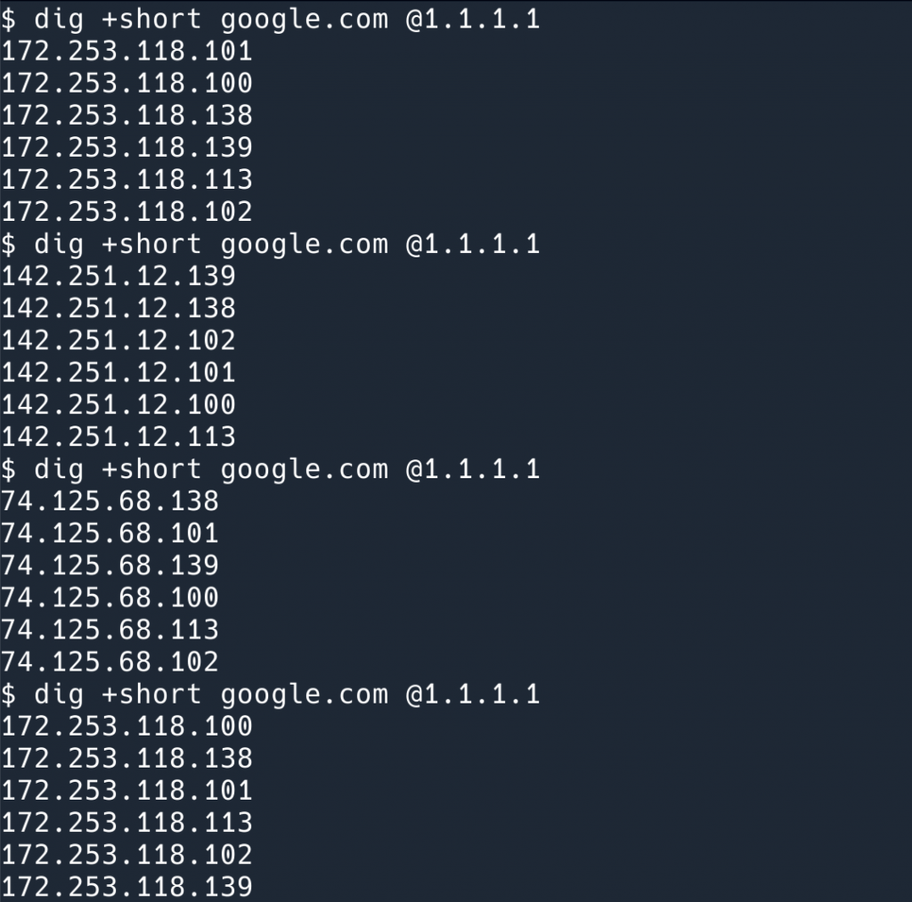](https://www.kawabangga.com/wp-content/uploads/2023/08/dig-google-more.png)

多次 dig google.com 的结果

但是 (3) 的问题，就不是很好解决了。浏览器可能会缓存，操作系统会缓存，路由器，ISP 都会缓存 DNS 结果，这很多是作为服务提供方的我们是不能控制的。

在现代的很多商业 App 中，为了能够让自己开发的 App 完全控制访问的目标地址，而不被系统等其他服务缓存，很多 App 会使用 HTTP-DNS（正确的称呼应该是 DNS over HTTPS）。即发送 HTTPS 请求到自己的 DNS 服务器，来获取服务的地址。这样，在操作系统等看来，这不是一个 DNS 请求，而是一个 HTTPS 请求，就不会对其内容进行缓存了。如此就可以绕过操作系统、ISP 等的 DNS 服务器，每一次 DNS 请求都是真正从自己的 DNS 服务器获取的结果，就可以实时、精准控制客户端访问的目标地址了。

DNS 的本质，是告诉客户端，去找服务器的时候，应该去哪里找，是一种服务发现。类似的，微服务中，服务之间互相调用，会有一个注册中心的组件，在调用的时候，告诉调用方有哪一些服务可以被调用，调用方从列表中选择其中一个来使用。

这种在服务发现的时候就将目标进行均衡的方式，好处是不需要一个中心架构，所谓的注册中心本质上是一个控制面，不承载数据，所以流量比较小。所以扩展性很好，没有瓶颈。

而这种方式的问题就是——其实可以从缺点 (3) 看出来——客户端的行为是不受我们控制的。所以另一种负载均衡就是不依赖客户端的行为：DNS 只返回固定的 IP。其他的诸如 HA 等内容，都基于这一个 IP 来实现。

这就有了第一个问题，一个服务器有一个 IP，如果固定了 IP，还怎么做扩容呢？

### 反向代理模式的负载均衡

答案是通过 ECMP（下文会详细介绍）技术，可以让多个服务器都来通过同一个 IP 提供服务 (Virutal IP, VIP)。

在介绍 ECMP 之前，我们先讨论一下“反向代理模式”的负载均衡技术。

这也是一种负载均衡的模式，简单来说，为了让我的服务实例（比如业务的 App server）能够随时扩容，缩容，就是在 Real Server 前面放一些负载均衡器，将流量”均衡“地转发给后端的 Real Server。扩容的时候，就将一部分流量分给新扩容出来的实例，缩容的时候，就提前不会再将流量调度到即将缩容的实例上去，非常完美。

负载均衡器

但是很显然，只是加了一层，并没有解决原先存在的问题：负载均衡器自身的扩容和缩容如何解决呢？

### 负载均衡器

对于负载均衡器，它要解决这几个问题：

1.  能够发现后端的 Real Server，比如有新的实例上线之后，新实例要开始从负载均衡器那里收到流量；
2.  需要解决自身的服务发现问题。因为负载均衡相当于在客户端和 Real Server 之间加了一层，要通过某种方式，告诉客户端负载均衡的地址。解决 Load Balancer 本身，扩容和缩容的问题（当然了，可以通过在负载均衡器前面再加负载均衡器来解决，后面会举这样的例子）；
3.  性能一般比 Real Server 要高，这样，才能用更少的机器去承担和后面 Real Server 一样的流量。当然了，因为负载均衡器的逻辑一般比 Real Server 要少，所以这一点现实里不算难；

具一例子，Nginx 是一个七层的反向代理，可以认为是一个七层的负载均衡器。它解决以上三个问题：

1.  通过 Nginx 配置文件中的 `upsteam` 可以配置后端的 Real Server 的地址，也可以通过 openresty 自制其他服务发现的机制；
2.  自身服务发现可以通过在上述，在 Nginx 前面添加**四层负载均衡器**来解决。这样，对于四层负载均衡来说，Nginx 就相当于是一个 “Real Server” 了；也可以通过将 Nginx 的 IP 配置在 DNS 域名 A 记录上，这样，相当于让客户端通过 DNS 能够发现 7 层代理的地址；
3.  Nginx 的性能比后端的真实处理 HTTP 请求的服务肯定是要高的，因为 Nginx 只解析 HTTP Header 就可以处理请求进行转发，而后端服务需要处理业务逻辑，比如用户登陆，生成网页，等等。所以 Nginx 一般比后端的性能要高的多。

对于本文主要讲的四层负载均衡，问题 (1) 可以轻松实现，用 Etcd 实现一种服务发现就可以，也可以监听后端 Real Server 的上线和下线事件，每次当事件发生的时候，更新自己的转发表。这个问题不算难，所以本文不会过多深入了。下文会注重 (2) 和 (3).

### 七层负载均衡和四层负载均衡技术

大型的网站服务一般会用这样的架构，在业务应用前面加七层负载均衡，然后在七层负载均衡前面加四层负载均衡。当用户发送 HTTP 请求的时候，请求会（经过机房内的路由器，交换机等设备）首先到达四层负载均衡，四层转发给七层，七层转发给应用。

四层和七层的区别是什么？为什么要四层、七层两套呢？只有一套行不行？

根本区别的话，其实就一句话：

-   四层负载均衡只解析网络包到第四层，根据四层的内容（比如 TCP port，IP 等）就能确定转发给谁；
-   七层负载均衡解析网络包到第七层，要根据七层的内容（比如 HTTP URL path，HTTP header 等）才能确定转发给谁；

考试：

1.  [redis-cluster-proxy](https://github.com/RedisLabs/redis-cluster-proxy) 可以根据请求 Redis 的 key 转发到正确的 Redis 实例上去，那么这是一个几层负载均衡？
2.  Nginx stream 模式可以给数据库，比如 Mysql 的 3306 端口做一个反向代理，在这个场景下，所有发给 Nginx 的流量都会**透明地**转发给 Mysql，此场景下，Nginx 是一个几层负载均衡？
3.  [Coredns](https://coredns.io/) 可以按照如下方式工作：如果我知道一个 DNS 的结果，我直接返回，如果不知道，我发给 1.1.1.1 来查询。如果我们将其看作一个代理的话，它是几层？

答案：1\. 七层； 2. 四层； 3. 七层；

当然了，网络包一层一层的就是套娃，要解析七层首先要解析四层，要解析四层首先要解析三层。

经典四层和七层架构和解析包的关系 （图是我画的，牛逼吧？）

四层负载均衡只解析包到四层就可以处理了，所以比七层要快很多。因为七层即应用层，我要解析 HTTP 内容（不仅仅是 HTTP，其他应用层协议的负载均衡，比如一些数据库 proxy，gRPC 代理，等等，都是类似的，都需要解析完成应用层才能确定转发目标），首先要将 Header 全部读完，读完之后要看下 Content Length 是有多长，然后知道 Body 要读到哪里。根据不同的 URL Path，还要确定路由到哪一个 upstream，听起来就很头疼。

回到第三个问题：只有一个七层负载均衡行不行？

答案是可以。四层的优势在于，它的工作更少（此外，下文还会介绍一些性能更高的方案），所以速度更快。

一般一些小型网站，就直接一个 Nginx listen 一个公网 IP，对外提供服务。四层负载均衡不就是快么，小网站要那么快干嘛？用户没那么多，能跑就行。

那不如再退一步，七层负载也不要了，行不行？我直接把应用 listen 的端口放在公网上。

额……也不是不行。

能跑是能跑，但是一般像 [uWSGI](https://www.kawabangga.com/posts/2941), [gunicorn](https://docs.gunicorn.org/en/latest/deploy.html) 这些软件，都会建议你在前面挡一个专业的反向代理（负载均衡器），即使你只有一个后端实例，一对一转发（可以参考之前写的这篇：[部署 Django 项目背后的原理：为什么需要 Nginx 和 Gunicron这些东西？](https://www.kawabangga.com/posts/2941)）。因为 Nginx 这样的专业七层代理，可以以专业的角度做很多事情，比如 buffer，连接保持，压缩，负载均衡，缓存等等功能。简单来说，它的性能更高，没有它的话，你的应用更可能被客户端拖垮。举例，假设一个客户端（浏览器）给你发送的 HTTP 请求很慢，需要一分钟才会发完。如果有 Nginx 的话，Nginx 会帮后端应用将整个 HTTP 请求收完整（缓存），然后一次性发给后端应用。这里有[一个测试](https://serverfault.com/questions/1125298/disabling-nginxs-proxy-buffering-doesnt-synchronize-the-response)，如果没有 buffer 的话，HTTP 服务的连接会被慢的 client 都占满。

可以换一个角度想：四层，七层，应用，这里面：

1.  应用是最慢的，因为它要处理业务逻辑，比如磁盘读写，数据库读写等；
2.  七层要快一些，因为七层只负责组装 HTTP 请求就可以了；
3.  四层就更快了，因为它不处理七层包，处理到四层就结束了，任务非常单一；

那么只有四层负载均衡行不行？

可以是可以，但是从没见过有人这么干。

原因很简单，四层负载均衡能做的事情，七层负载均衡都能做（因为七层的包它都解开了，四层的信息当然都可以拿到）。七层技术一般来讲更加上层，比四层要简单一些。问题一定是先尝试用七层负载均衡去解决，解决不了（一般是性能原因），才考虑将一些东西放到四层上去做。反过来，七层能做的功能很多四层都做不了，比如根据 HTT header 跳转。

实际上，很多公司起步的时候，就是一个 Nginx 放到公网上就上线了。后面业务做大了，遇到性能瓶颈，或者对高可用要求高了，再考虑加上四层均衡的。

除了在前面加，在后面也可以加。业务做大了，Nginx 和后端应用之间，可能再加一个 应用 API Gateway，可以看作是“应用层的负载均衡”，可以用 Golang，Java，Python 等来实现，可以读写数据库等，做一些特殊的逻辑。因为可以编程了，所以就支持了比 Nginx 更加复杂的特性。比如根据 user id，用户特征等进行 AB 测试。其实 Nginx 也可以做这些事情，Nginx 可以用 Lua 编程扩展。说开去就跑题更远了。

下来就进入主题，我们来讨论下四层负载均衡的高可用和高性能是怎么实现的。

### 对于四层负载均衡的要求

我们先从最简单的架构讲起，不如就用 Nginx 来作为一个四层负载均衡的转发器。哦对了，既然下文我们主要开始讨论四层负载均衡了，那么经常放在四层负载均衡后面的七层负载均衡，我们就认为它是 Real Server 了。

[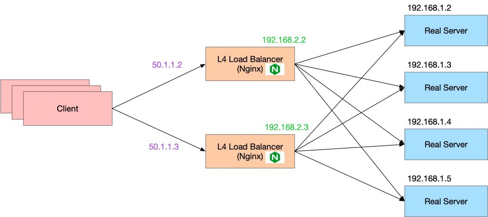](https://www.kawabangga.com/wp-content/uploads/2023/12/nginx-l4lb-scaled.jpg)

Nginx 作为四层负载均衡使用

这个简单的架构有一些问题：比如，每一个 LB 都有一个独立的 WAN（即公网的意思）IP，那就回到上文部分提到的 DNS 做负载均衡的问题了。

四层负载均衡的后端对象不一定是七层负载均衡，甚至不一定是 HTTP 服务，像数据库服务（需要内网四层负载均衡），Git 服务器，缓存，都可能需要 TCP 层面的负载均衡。有一些服务的入口只能用一个 IP，但是，我们又不希望这个 IP 是一个单点。另外，有很多业务场景需要 TCP 长连接，不能短时间就断开了。

总结一下，我们对四层负载均衡的期望是什么：

1.  IP 是高可用的，而不是单点的，理想情况下，我们想暴露仅一个高可用 IP 在 WAN 上面；
2.  另外，当 LB 本身有操作的时候，希望不要影响已有的连接，即可以让长连接不中断地运行较长的时间，比如 24 小时；

第二点连接迁移是一个很复杂的问题，有多种实现，也取决于架构的设计，我们放到后面再说。但是“一个高可用的 IP”这个技术几乎有一个事实标准，就是 ECMP.

## ECMP 技术

### 路由选路原理

这里补充一个三层网络的知识点：我们知道 TCP 是基于 IP 的，意味着 TCP 要靠 IP 协议，经过一系列的路由，将 TCP 数据从源 IP 送到正确的目标 IP 上。路由器之间，一般用动态路由协议来交换彼此之间的路由信息，而可达路径往往不止一条。这时，路由器**只会选择一条最优路径来使用**，而且是永远只用这一个路径，而不会用其他的路径，其他路径是空闲的。

比如下图：

[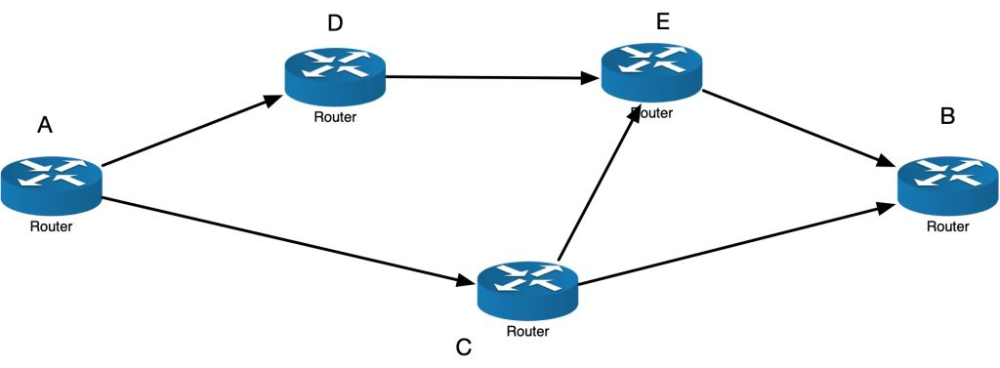](https://www.kawabangga.com/wp-content/uploads/2023/12/router-routing-multiple-path.jpg)

存在多条可达路径的情况

数据从 A 发往 B（假设用的 BGP 路由协议），所有的数据都会通过 `A -> C -> B` 发过去，没有数据会走到 D 和 E 上。因为 `A -> C -> B` 跳数最少，是最优路径。

那 D 和 E 不是就浪费掉了吗？确实是的，有一些违反直觉。这样做一个很大的原因是保证包到达的顺序和发送出去的顺序一致，所以使用单一最优线路发送。

等下，TCP 不是可以给我们保证顺序吗？为什么三层要关心顺序？

是的，TCP 可以将乱序的包重新排好顺序，可以保证应用程序从 TCP socket 读到的内容，一定是按照发送顺序的。但是乱序会导致 TCP 性能严重下降：

1.  一个原因是，TCP 接收端收到包之后，要重新在 buffer 中排序，会浪费内存和计算；
2.  另一个原因是，接收端发送了 3 个 SACK 触发快速重传，发送端可能会认为发生了拥塞，从而[降低 cwnd](https://www.kawabangga.com/posts/5181)，影响长肥管道的性能；

所以，三层是会尽力保证发送的顺序的。

补充一点，不是所有的协议都用条数来选择最优路径的，比如 OSPF 主要参考的是带宽，EIGRP 主要参考的是 5 个 K 值：

1.  K1(bandwidth)
2.  K2(load)
3.  K3(delay)
4.  K4(reliability)
5.  K5(MTU)

但是，他们都是选出一条最优路径来用的。跳数也好，带宽也好，最终，路由协议会对所有的可用线路计算出一个 metric 值，然后选择一个 metric 最低（越低越好）的来用。

有一种方法可以干扰路由表，叫做 Policy-based Routing (PBR)，通过添加策略来在选路之前就做出决定。比如一家企业有两条线路，一条 1G 一条 200M，可以配置视频会议走 1G，其余的走 200M，这样视频拥挤不会造成办公网异常。

现在考虑一种特殊情况，假设下图：

[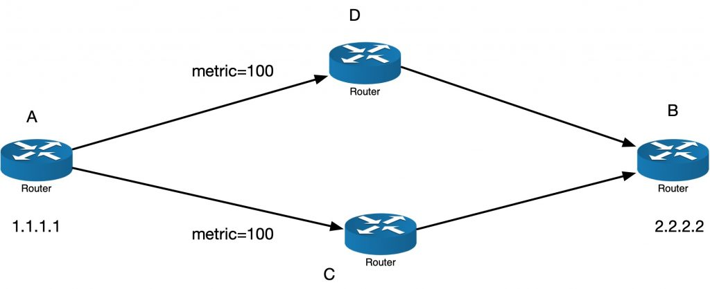](https://www.kawabangga.com/wp-content/uploads/2023/12/ecmp.jpg)

存在两条 metric 相同的路径

A(`1.1.1.1`) 要发往 B(`2.2.2.2`) 数据包，可达路径有两条，C 和 D，使用的路由交换协议并不重要，重要的是，他们的 metric 都是 100，如此的话，A 的路由会如何决定呢？

在这种情况下，流量会均匀地发给两条路径。

但是前面强调的“顺序”怎么保证呢？

在 A 使用两条路径发送给 B 的时候，对于 `hash(src_ip, src_port, dst_ip, dst_port)` （hash可以配置），A 会始终选择同一条路径，这样就保证了 order，也用上了两条路径。

### ECMP

这就是 ECMP(Equal-cost multipath) 了。由上面可以见，ECMP 其实并不是一个实体，不需要一个叫做“ECMP”的软件来运行。它只是路由协议——或者说是路由器的实现——所带来的一个 feature（一个副作用？）。

现在我们将上面这个拓扑图扩展一下，如下图：

区别是，原来要将数据从 `1.1.1.1` 发给 `2.2.2.2` 有两条路，可以走 C 也可以走 D。但是现在，C 上面直接就有 2.2.2.2，D 上面也有 2.2.2.2. 对于发送者 A 来说，前后两种拓扑图有什么区别吗？没有区别。因为在 A 看来，将数据发给 2.2.2.2，还是：要么走 C，要么走 D，有两条 Path, 它们是 Equal-cost. 所以，在这种情况下，A 依然会将流量经过 hash，然后在两条线路上发送。

如果目标不是一个路由器，而是一个 Server 的话呢？

[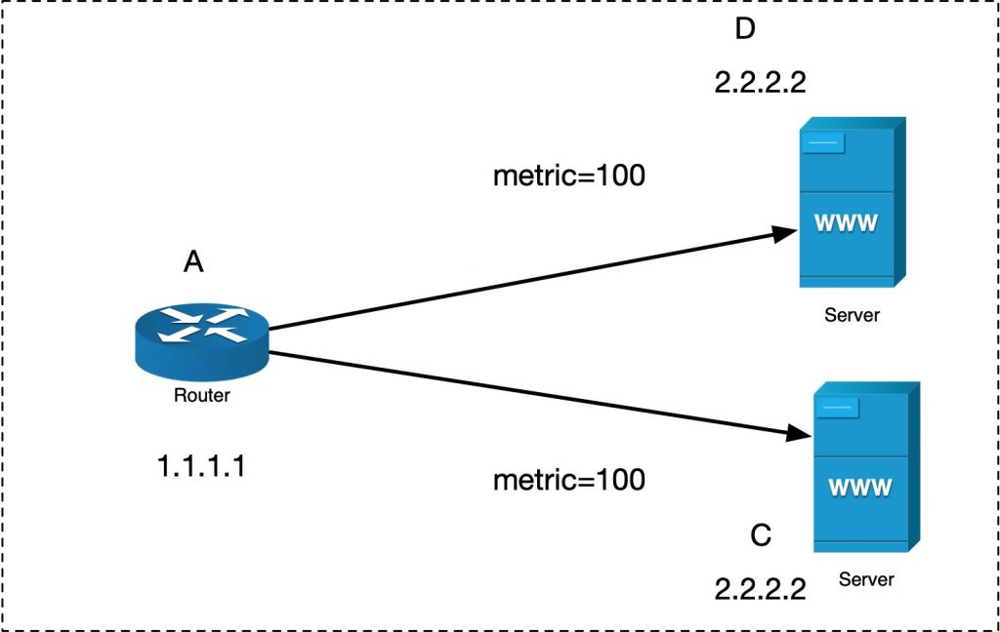](https://www.kawabangga.com/wp-content/uploads/2023/12/ecmp-server.jpg)

对于 A 来说，假设我们的 Server 运行了路由协议（Linux 是可以运行路由协议的，比如 [ospfd](https://linux.die.net/man/8/ospfd)），那么 A，并不知道线路的另一端是一个路由器，还是一个 Server，还是其他的硬件，还是一只狗（假设这只狗可以发送数字信号并且通晓路由协议的话）。那么，对于 A 来说，这个图和上面图是一模一样的。

到这里，我们意识到：我们有两个服务器，这两个服务器的 IP 都是 2.2.2.2，都可以提供服务，对于客户端来说，它不知道这个 IP 背后是一个服务器还是多个服务器，它只知道自己访问的是这个 IP。这个 IP 就叫做 VIP（虚拟IP，Virtual IP），不是具体的某一个实例的 IP。所以，我们的需求（1）已经实现了：IP 是高可用的，而不是单点的，理想情况下，我们想暴露仅一个高可用 IP 在 WAN 上面。

可能有的读者会有疑问：两台机器有相同的 IP 地址，我如果要 ssh 到某一个机器上做操作，怎么确保 ssh 到的机器就是我要的那台呢？

用 2.2.2.2 肯定是不行了，但是我们的机器不是只能有一个 IP：一个机器可以有多个物理网卡，每一个卡都可以配置一个 IP；即使只有一个物理网卡，在操作系统上也可以配置多个 interface，然后每一个 interface 上配置一个 IP。总之，这种架构下，我们登陆的 IP 一般不是 VIP，而是用其他的 IP 登陆。

ECMP 也有一些问题：首先它给架构带来一些复杂性，我们不能随便找几台服务器做出一个 VIP 来，需要三层设备的配合。其次，ECMP 是逐跳判断的，只发生在路由器选择下一跳的时候。

考虑下面这个拓扑图：

ECMP metric 相同，但是实际处理能力不同

A 会均等地将流量发送给 B1 和 B2，因为 B1 和 B2 metric 值是相等的，A 不可能知道 B1 和 B2 后面是什么样子，对它来说，只参考 metric。然后会将流量 1:1 发送给 B1 和 B2，B1 和 B2 收到流量转发给自己的后端，互相也不可能知道其他路由器收到了多少流量。如此，流量到服务器的时候，收到的请求量 E:C:D 实际上是 2:1:1.

现实里，这些也不难，难的是二三层设备的维护和软件 四层LB 的维护往往是不同的团队，团队之间的协作可能造成困难甚至事故。

总结一下：现在作为四层负载均衡，大问题已经解决了——我们已经可以完成负载均衡本身的服务发现了——通过三层设备 ECMP 来让所有的四层负载均衡实例均等收到流量。负载均衡转发流量到后端 Real Server 也比较好解决，可以和任意的服务发现技术组合实现，最简单的，比如直接写在配置文件里面。

[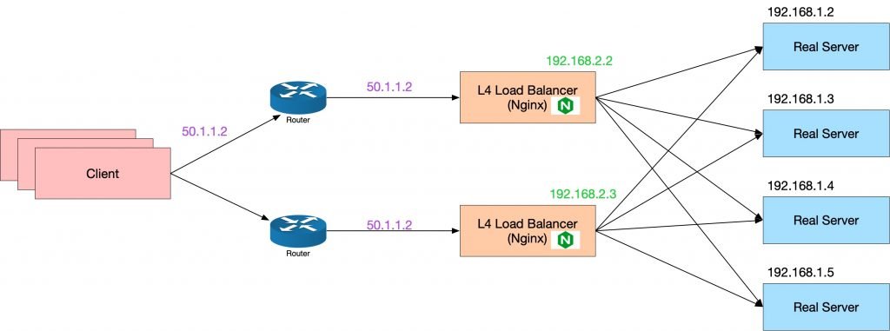](https://www.kawabangga.com/wp-content/uploads/2023/12/nginx-l4lb-vip-scaled.jpg)

使用 VIP 的方式部署 Nginx

如果永远不做其他变更了，似乎需求就完成了。但是如果需要变更，比如机器硬件坏了，或需要升级软件，或需要扩容，就会发现问题了。

如上所说，四层负载均衡一个重要的职责是，要保持住长连接。我们做运维操作是不能破坏这些已经存在的连接的。我们先拿扩容场景来说：假设我们现在新增一个四层负载均衡实例，会发现原来路由器的 hash 结果全都变了，可能一个 TCP 连接经过原来的 hash 走到了服务器 A 上面，加了一台实例，就 hash 到了服务器 C 上面。客户端的 TCP 连接还能正常工作吗？这里存在两个 TCP 连接，我们可以分别分析。

[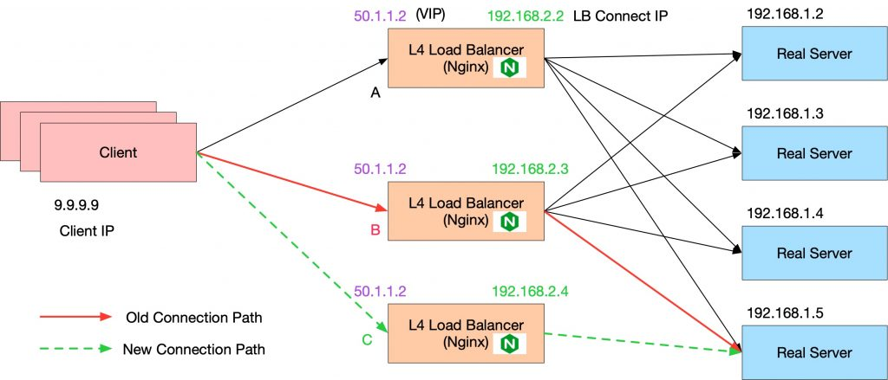](https://www.kawabangga.com/wp-content/uploads/2023/12/4-scaled.jpg)

添加了一个 LB 实例

我们先理一下问题：

1.  客户端角度，连接了 VIP，创建 TCP 连接之后在这个 TCP 连接上传输数据，但是它并不知道这是一个 VIP；
2.  LB （下文会用 LB 代表 第四层 Load Balancer）角度，B server 将这个 TCP 连接代理到 RS (Real Server) 192.168.1.5；
3.  现在由于新增了一个 LB，导致路由器将 Client IP 发给 VIP 的包转发到了 LB C 上（原来是在 LB B 上）；
4.  要求客户端 TCP 连接继续工作，服务不能中断；

## 长连接保持技术

这里，加机器导致长连接会断开的核心原因，我认为是：TCP 是有状态的。B 知道有这么一个 TCP 的连接存在，因为 B 经过了和客户端之间的 TCP 握手，所以 B 可以正确处理这个 TCP 连接的数据。标志一个 TCP 连接的是四元组（有些地方会说五元组，多出来一个是“协议类型”，但是我们讨论 TCP，就不多说协议类型了）：来源 IP，来源端口，目的 IP，目的端口。这个四元组在 B 的内存中，B 就“认识”这个 TCP 连接。如果数据经过路由器发给了新机器 C，C 不认识这个 TCP 连接，收到数据的时候只能回应 RST：“你是谁呀，没经过 TCP 握手就给我发送数据，我跟你很熟吗？”

要让原来的连接不断，我们这里有两种思路，第一种是，因为只有 B 认识这个 TCP 连接，所以我们想办法，让在添加新机器的情况下，数据始终是发送给 B 的，而不是发送给 C，这样，数据一直发给 B，也就没有问题了；另一个思路是，让 C 也认识这个 TCP 连接，这样，数据无论是发送给 B 还是发送给 C，都可以被正确处理。

我们先看最简单直白的解决方案：添加机器不改变原有连接的方法。

### Sticky ECMP

将问题简化一下：由于添加机器，路由器将本来发给 B 的数据发给了 C，那么解决方法自然就是：希望路由器将原来发给 B 的数据一直发给 B，只有新建连接的时候，才使用 C 新建连接。即，新机器上线，只有新 TCP 连接才发过来，已经存在的 TCP 连接的数据不受添加节点的影响。

#### 一致性 Hash？

有的读者可能想到了一致性 Hash (Consistent Hash)，需要说明的是，一致性 Hash 并不能解决这个问题。

一致性 Hash 能够解决的问题是：假设现在有 3 个机器，A，B，C，每一个机器上有 100 个连接，当新添加一个机器 D 的时候，由于 Hash 算法改变，情况变成了：

-   A 上面的 50 个连接现在 Hash 到了 B 身上，10 个到了 C, 20 个到了 D
-   B 的 60 个 到了 A 身上，20 个到了 C 身上，20 个到了 D 上
-   C 的 10 个到了 A 上……

最终结果虽然还是平衡的，但是所有的连接都经过了洗牌，可能所有的连接都必须断开，重建一次。

如果有了一致性 Hash，上面的情况就会变成：

-   A B 不会变
-   C 的 50 个连接会 Hash 到 D 上

这样虽然最终结果虽然有一些不均衡，但是可以让需要变化的连接最少。

一致性 Hash 一般用在数据库存储分片上比较多。在我们的场景下，我们希望解决的问题是，原本在 A 处理的连接，即使新添加了机器，也必须继续交给 A 处理。新的连接可以给新机器处理。

因为 LB 无法控制前面的设备发给 LB 的哪一个实例，所以这个功能需要前面的设备（有可能是二层设备，也有可能是三层设备）来实现。网络设备上有个类似的功能就叫 Sticky ECMP。意思是网络设备在 ECMP 情况下选择转发下一跳的时候，不仅仅会使用 hash 算法，还会记住 hash 过的值，比如 src IP 和 dest IP，一旦经过 hash 了，后续节点数变多了，也是会得到一样的 hash 值。

Sticky ECMP 效果就是，（取决于实际的 hash 方法，这里假设就用 IP 来 hash），即使增加 LB 实例，旧的客户端（即使是新建连接）流量只会到旧的 LB 实例。这里要注意的是，这个效果和我们期望的效果还是有一点小小的不同：

-   我们希望的是：旧的 TCP 连接去到旧的 LB 实例上去，新的 TCP 连接有一部分去到新实例上去；
-   而 Sticky ECMP 的效果是：旧的客户端一直去旧的 LB 实例，即使新建连接，只要是 IP 不变，取得 LB 实例就不会变。新的客户端（新的 IP）进来，根据 hash 算法，才有可能到新的实例上去；

这就会导致，新添加的实例可能接收的 QPS 比其他实例要少，并且这种不均衡会存在相当一段时间。

除了这个问题，另一个问题是，我们很多情况下，并不能控制二层和三层设备，有可能这些设备本身就不支持 ECMP 的 feature。

### Extra Proxy

另一种思路是，我们可以添加一层额外的 Proxy，这一层 Proxy 可以跟踪并记录连接的状态，知道旧的 TCP 连接应该发送到哪一个正确的 LB 实例上去。

添加的新的一层 Proxy 我们叫它 Director，Director 之间同步连接的状态，所有的 Director 都有两个信息：

1.  TCP 连接的状态；
2.  如果是已经存在的 TCP 连接，知道这个连接应该被哪一个 LB 来处理；

这时候，当我们添加一个新的 Director + LB 实例的时候（其实可以只添加 LB 实例不添加 Director，效果一样）。上面长连接的情况，无论哪一个 Director 收到了旧的 TCP 连接上发来的数据，都会发送给正确的 LB 实例 B。如下图所示。

这种方式依然有两个缺点：

1.  State 的同步可能延迟。比如一个 Director 知道了一个新的 TCP 状态，它还没来得及告诉其他的 Director，这时候 LB 扩容了，那么这个 TCP 数据流就可能发送一个不知道它的状态的 Director 上；
2.  所有的 Director 都存储了重复的数据（如上介绍的），这个数据量也是不小的。

[Github 的 GLB](https://github.blog/2018-08-08-glb-director-open-source-load-balancer/) 有一种很创新的方法来解决这个问题：

之前每一个连接 hash 到一个 LB 实例上去，这个实例可能是错误的。现在这么做：

1.  每一个连接经过 hash 得到两个 LB 实例，一个叫做 Primary，一个叫做 Secondary。所有的 LB 实例，无论是旧的，还是新添加的，都使用一样的 Hash 方法，对每一个连接 Hash 的到两个 LB 实例；
2.  连接会转发到 Primary 上去，但是这个实例可能是错误的。
3.  Primary 如果发现自己并不能处理这个连接，就转发到 Secondary 上去。

[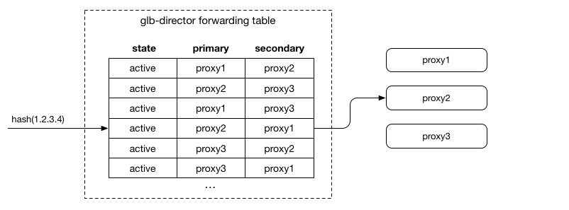](https://www.kawabangga.com/wp-content/uploads/2023/12/forwarding-table-active.webp)

Hash 表会得到两个结果，图来自 [Github](https://github.blog/2018-08-08-glb-director-open-source-load-balancer/)

如果 Primary Proxy 无法处理连接，会尝试二次转发，图来自 [Github](https://github.blog/2018-08-08-glb-director-open-source-load-balancer/)

这样做有几个好处：

1.  LB 之间并没有数据的共享，只要在代码层面让所有的实例使用一致的 hash 算法就可以了；
2.  不需要同步数据，也就没有延迟了。

缺点嘛，就是多转发了一次。但是考虑到 LB 的性能，以及这种情况应该只发生在有运维操作的时候，添加节点在一段时间之后，所有的连接理论上应该都能在第一次转发完成。所以是可以接受的。

另一个缺点是，因为 Hash 值只有两次，如果第二次转发到的机器依然是错误的，那么就只能 drop 掉连接了。为了避免在第二次 hash 还是找不到正确实例的情况，我们要保证连接的 rehash 迁移不能同时发生超过一次，即，我们添加机器的时候，只能添加一台，等所有的旧连接都结束掉，再添加第二台。

为什么不能一次添加多台？比如我们一下子加上三台机器，XYZ，有一个连接原来在 A，现在 rehash 的结果是 Primary 是 X，Secondary 是 Y，那么 X 转发给了 Y，依然是错误的。同理，也不能在连接没 drain 干净的情况下就继续添加机器。

以上方法还有一个相同的缺点：只能处理添加机器的情况，无法处理减少机器的情况。

减少机器分成两种情况，计划下线和故障下线（比如机器挂了）。

计划下线的情况很简单，和扩容差不多：我们只要让要下线的 LB 实例标记为不再接收新的连接，但是已有的连接继续处理，等所有的连接都正常结束了，机器就可以正常下线了。

但是故障下线的情况，上面的方案几乎都处理不了。因为只有这一个 LB 实例能够处理这个 TCP 连接，如果实例没了，那么也就没人能处理了。所以这种连接只能 Drop 掉。

如果要处理这种情况，就必须让多个 LB 实例能够处理相同的 TCP 连接。这就要在 LB 之间同步连接的状态。

### LB 之间的状态同步

在上图中，数据转发的任务，由于扩容，从 B 转移到了 C 上。要让 C 能处理这个转发，我们要先看原来的 B 上面有什么：

1.  有 Client 到 VIP 的 TCP 连接；
2.  有 LB 到 Real Server 的 TCP 连接；

假设所有的 LB 如果能同步这些状态，那么所有的实例，其实可以看作是一个巨大的虚拟实例，因为所有的实例知道的信息都是一样的。这样，我们就可以随时添加节点了，甚至也可以随时减少节点。因为无论数据发送到哪一个 LB 实例上，都可以被正确处理。

如下图所示：

[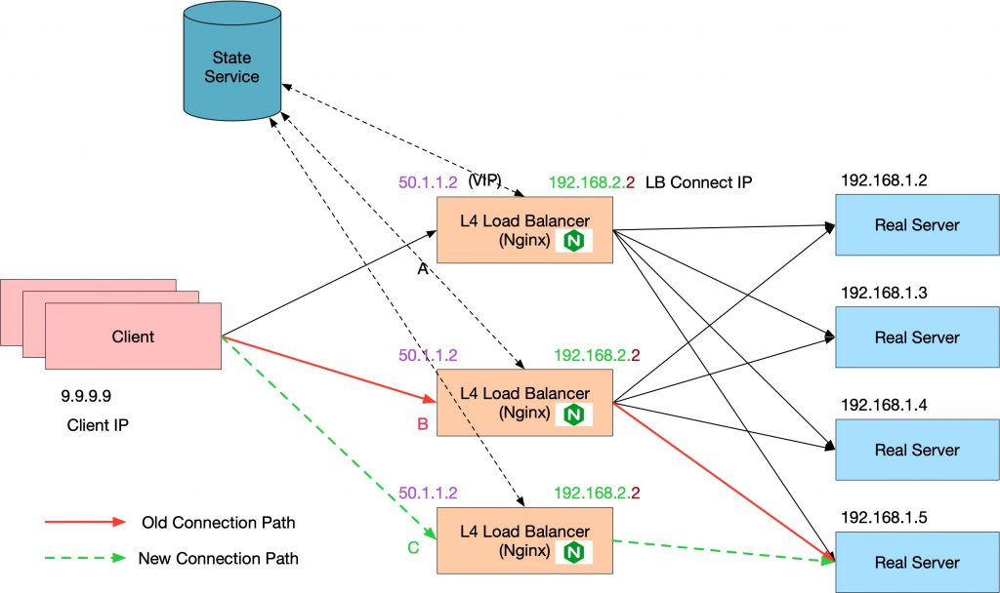](https://www.kawabangga.com/wp-content/uploads/2023/12/connection-syncing-scaled.jpg)

我们需要一个外部的 State Service 来存放连接的状态，当 LB 每次跟 client 以及 Real Server 建立起连接的时候，就将 State 写入这个 Service。这个 Service 要负责以某种机制将连接的状态同步给其他的 LB，虽然有一些延迟，但是这样，当新连接建立之后不久（ms级别的时间），所有的 LB 实例都知道这个新连接的存在了。

这样，当发生 rehash 的时候，也没有关系，因为所有的 LB 都可以处理所有的连接。只有一点小问题，就是连接刚建立，还没来得及同步状态，马上就发生了 rehash，这种情况连接还是会被 drop 掉。

这里有一个小细节，就是（重申一次）TCP 连接是按照四元组的形势存储的，LB 连接 Real Server 也是四元组。所以，LB 现在连接 Real Server 也必须用 VIP 才行，换句话说，LB 实例连接 Real Server 的 IP 必须是一样的 IP。如果不一样的话，Real Server 对于陌生的 IP 就又会有那样的疑惑，我没跟你握手呀，于是 Drop 连接。（前文中二次转发就不会有这个问题，因为始终是同一个 LB 连接了 Real Server）。

当然了，这种方式依然是有状态延迟问题，以及状态同步带来的 Overhead。一个可能的解决方案是，假设大部分连接都很快结束了（对 HTTP 来说假设是成立的），所以，只有连接存在了 3s 以上我才同步他们的状态，低于 3s 不同步，在发生 rehash 的时候舍弃部分连接好了。

话说回来，其实很多方案都是允许长连接断开的，然后客户端负责处理好异常：如果出现了连接重制，就重新建立连接，然后恢复之前的通讯。这种方式显然更鲁棒！

这就是连接同步的一些技术，下面是更精彩的部分，我们开始讨论如何设计网络架构。

## 转发架构

在开始讨论之前，我们要复习一下几个（看起来是废话但是很重要的）原则：

1.  LB 的一个重要作用就是保护 Real Server，客户端始终只能看到 LB 的 VIP 地址，不能看到 Real Server 的地址；
2.  一个设备发送给另一个设备 TCP 数据的时候，实际发送的是 IP 包，因为 TCP 是基于 IP 的。IP 包又是基于二层以太网的。所以，可以理解为，每次发送数据都是发送的二层以太网包。
3.  发送二层包的过程可以简化如下：
    -   查看目的 IP 和我是否是在同一个子网，如果是，那么将目的 MAC 地址直接设置为目的 IP 所在的 MAC 地址（如果不知道，就发送 ARP 询问）；
    -   如果不在同一个子网，那么将目的 MAC 地址设置为网关 IP 的 MAC 地址；
4.  可以看到，网络数据发送的过程，其实就是网络设备两两之间发送的过程，交互的是以太网二层的包，每次都需要解开再重新封装。
5.  一个设备在收到数据进行回应的时候，回复给谁呢？它会将 IP 的来源作为回应的目的 IP，将 IP 包的目的 IP（就是自己）作为来源 IP，即发给我的 IP 包，我把它的来源 IP 和目的 IP 调换，然后填充响应发送回去。

在以下的讨论中，可能会回来引用这些原则。

### Full NAT 模式

目前我们讨论的转发模式，可以叫做是 Full NAT 模式。NAT 是地址转换的意思，Full NAT 可以之于 SNAT 来理解，我们家庭上网都经过路由器给我们做 SNAT，Source Network Address Translation, 路由器将内网的地址转换成 ISP 分配的公网地址，Source IP 被转换了，但是 Destination IP 没有变，所以叫 SNAT。那么 Full NAT 就是都变了。

Full NAT 模式，IP 的变化

如上图，Real Server 看到的 IP 包，来源 IP 和 目的 IP 都变了，所以这个就叫 Full NAT。

一个小细节是 LB 为什么用一个新的 _LB Local IP_ 来连接 Real Server 而不是使用 VIP 来连接？假设所有的 LB 实例有实现上问所说的连接状态同步，那么是没问题的，因为每一个 LB 都可以处理连接。但是如果是不共享状态的模式，只有特定的 LB 才能处理特定的连接，使用同一个 VIP 就会有问题了：Client -> LB VIP 和回包路径 Real Server -> LB VIP 不一定会经过 ECMP 去往同一个 LB 实例上去，这样就处理不了了。下文将 One-Arm 和 Two-Arm 会再讨论。但是无论用什么 IP，都是 Full NAT 模式。

Full NAT 有一个显而易见的问题：现在 Server 看不到 Client IP 了，它只能看到 LB 的 IP。很多场景下我们都是需要 Client IP 做一些事情的，怎么办呢？

有一种方案是叫做 TCP Option Address (TOA)，相关 [RFC 7974](https://datatracker.ietf.org/doc/html/rfc7974)。原理是：在 LB 和 Real Server 握手阶段，LB 将客户端真实的 IP 写到 TCP Option 字段中。Real Server 读取这个字段来获取客户端的真实地址。

这样做很巧妙：只有在握手阶段有额外的数据，数据传输的时候没有带来额外的开销；握手阶段（没有用 [TCP Fast Open](https://en.wikipedia.org/wiki/TCP_Fast_Open)）不会携带数据，加入额外的 Option 也[不会超过 MTU](https://www.kawabangga.com/posts/4983)。

缺点是 Real Server 侧需要加载一个内核模块（因为 TCP 的处理在内核），从 TCP Option 里面拿到 Client IP 而不是使用 TCP 连接的 IP 地址。然后将这个 IP 放到 Socket Option 里面，最后 Real Server 上的 App 再从 Socket 的 API 中获取地址。

另外一种解决方案，是不隐藏客户端地址，即只转换目的地址。就是 DNAT 模式。

### DNAT 模式

DNAT 顾名思义，就是 Destination 地址转换。DNAT 完美地解决了原则1：隐藏 Real Server 的地址。但是有没有隐藏客户端的地址，很巧妙。

它的原理如下图

DNAT 转发模式

LB 发给 Real Server 的时候，只修改了目的地址，为 Real Server 的地址。这样 Real Server 就可以认为来源 IP 就是客户端的真实 IP 了。

但是这里显然有两个问题，Real Server 在回复的时候，根据原则5，将目的 IP （自己的 IP）作为来源 IP，一旦发出去这样的 IP 包，网络设备就会直接路由给 Client，这样，一来暴露了 Real Server 真实的地址，而来 Client 根本就不认识这个 IP：我发给了 LB VIP 请求，怎么轮到你来回复给我东西？于是直接会 Reset 掉这个连接。

问题就出在，Real Server 是不能直接发送给客户端的，而是必须回复给 LB，让 LB 回复给客户端。

那么目的 IP 都已经是客户端 IP 了，怎么将这个包发送给 LB 呢？

答案就是只走二层。根据原则2，如果我们的包经过二层可以到达目的地，那么三层写的什么都无所谓，交换机不回去看三层内容。如下图所示：

DNAT 要经过 LB

Real Server 在回复的时候，虽然 DIP 还是客户端 IP，但是目的 MAC 写的确是 LB 的 MAC 地址。交换机一看，在同一个 LAN 下，直接将这个包交给了 LB 实例。这时候，LB 就可以修改来源 IP 为自己的 VIP，转发给客户端了。

这么做有一个架构依赖：Real Server 和 LB 必须在同一个子网下，不能走三层路由。因为 Real Server 想把这个包发送给 LB，包的 MAC 地址是对的，是 LB 的地址，但是三层的目的地址是错误的，不是 LB 的地址，而是 Real Server 的地址。一旦走三层路由，就露馅了，路由器会将这个包转发给客户端，不经过 LB。

因为这种架构依赖，以及实际部署比较复杂（需要修改路由，走 LB 回包）我见过用 DNAT 的场景很少。

**Chrysan** 补充：DNAT 模式在公有云 LB 底层使用很多，因为可以让 Real Server(公有云的用户) 透明的获取 client IP。实现上不需要放在一个二层，而是依赖了公有云底层 VPC overlay 网络。简单的说，宿主机上的 vswitch 是自己写的，可以强行让 RS->client 的报文转发到对应的 LB 设备。（和后面要讲到的能够跨越二层的 DSR 有些异曲同工之妙！）

无论是 Full NAT 和 DNAT，其实都有一个潜在的瓶颈存在：LB 本身。

互联网的现实是：用户上行流量很小，下行流量很大。比如浏览网页，看视频，看直播，下载软件，等等，场景都是用户发送很小的请求出去，服务器发送很多内容回来。ISP 也知道这个事实，所以在办宽带的时候，ISP 很鸡贼得给你搞上下行不对等的带宽，上行只有5M，下行有100M，把它当成 100M 宽带卖给你，体验也没有特别糟糕，因为大部分场景是在下载。

话说回到 LB，对于 LB 来说，那就是入带宽很少，出带宽很大，消耗资源的地方几乎都在 Real Server 回复包给 LB，LB 转发给客户端上。但是 LB 本身是用来干嘛的来着？高可用，安全，防 DDOS，这些都是针对入流量做的。所以现在出现了一个很奇怪的现象：我一个本身是主要针对入流量做的软件，现在大部分时间都花在处理出流量上，这不是本末倒置嘛？其实，我们就遇到过很多 LB 被出流量打挂的情况。

出流量是我们自己的 Real Server 回复的，基本不存在安全问题，也不需要过滤。那能不能让 Real Server 直接回复给 Client，完全绕过 LB 呢？当然了，之前的条件还是要满足，即，不能暴露 Real Server 的 IP，还得让 Client 正确处理 TCP 请求。

如何做到这两点呢？只能让 Real Server 通过：SIP: LB VIP, DIP: Client IP 来回包了。

### DSR 模式

这种模式就叫做 DSR 模式，Direct Server Return。Real Server 直接将请求回复给客户端。

我们按照上面的知识来推理一下：

1.  Client 要能正确处理连接，那么它收到的包必定是：SIP: LB VIP, DIP: Client IP
2.  那代表 Server 发出来的 IP 包必定是：SIP: LB VIP, DIP: Client IP
3.  根据原则5，那么 Server 收到的包必定是：SIP: Client IP, DIP: LB VIP

所以，完整的图如下：

这个架构看起来很奇怪，Is it even possible?

让我们来一个一个地这里面的问题，看看能否将这些问题都解决掉：

1.  LB 到 Real Server 这里，怎么能把 DIP: LB VIP 这个包正确发给 Server 呢？显然 Server 上要配置这个 VIP，即，LB 上面有这个 VIP，Server 上也有这个 VIP，这样，Server 收到这个包才不会丢弃，有这个 VIP 才能处理 Dest IP 是 VIP 的包；
2.  Server 有了 VIP，LB 也有这个 VIP，怎么确定这个包发出去之后，收到包的是 Server，而不是另一个 LB 呢？经过上面 DNAT 的讨论，我们已经可以熟练地使用二层转发了，LB 转发给后端的时候，直接指定 Server 的 MAC 地址即可。即 LB 对 Server 的服务发现要使用 MAC 地址而不是 IP 地址；二层转发就带来一个缺点：LB 和 Sever 必须部署在同一个 LAN。
3.  客户端请求进入到 IDC 的时候，LB 和 Server 都有相同的 VIP，怎么保证一定是 LB 先收到这个请求处理，而不是 Server 收到这个请求处理？（如果是 Server 收到的话，那 LB 相当于不存在了）。让 Server 完全忽略 ARP 请求即可，即其他的机器都不知道 Server 上这个 VIP 存在，甚至 LB 也不知道，只有 Server 自己知道它有这个 VIP。

这样，看起来就能实现这种路由方式了：客户端请求发送给 VIP，实际上是 LB 收到处理，LB 经过二层同 LAN 路由发送给 Server，Server 处理之后将响应以 VIP 的身份发送给客户端。客户端收到相应很开心，它并不知道是谁处理的，也不需要知道。

这个转发模式最大的限制，就是 LB 和 Server 必须部署在同一个 LAN 下。这个限制的原因是因为 LB 要通过二层 MAC 寻址来发送给 Real Server 数据。我们有没有其他的方法来实现 LB 和 Server 之间的转发，并且能够支持走三层路由呢？

### 支持跨 LAN 的 DSR 模式

现在我们要满足的需求是：

-   SIP 和 DIP 都不能变，因为 Server 直接回复给 Client IP 需要这些信息；
-   LB 要发送数据给 Real Server，如果要跨越三层，那么就必须使用 Real Server 的 IP；

看起来我们这里需要两层 IP。于是就有了一种方案：把原来的 IP 包封装一下，放到一个 UDP 包里面。LB 发送一个 UDP 包给 Real Server，Real Server 收到之后打开这个 UDP 包，看到的是一个 IP 包，后面就当作普通的 IP 来处理。

这种技术有很多，比如 [GRE](https://www.cloudflare.com/zh-cn/learning/network-layer/what-is-gre-tunneling/) 就是其中的一种。

这样，LB 和 Server 之间的通讯也能跨越三层了，因为对于路由设备来说，LB 在给 Server 发送一个 UDP 包。（有一些地方说 DSR 模式必须在同 LAN 下部署，实际上是不对的，此方案就可以跨 LAN）

DSR 模式有一个很大的弊端（感谢 Chrysan 补充）： 因为回包流量不经过 LB，LB 只有单边流量，导致无法获得 TCP 完整状态机。举个例子，Real Server 突然发送 RST 给 Client，发送到 client 的 RST 不经过 LB，LB 无法感知这个状态变化，会继续保持这个连接为 established（如果是正常结束的话，Client 发回来的 FIN 倒是会被 LB 感知到）。期间如果 client 复用了 src port（短链接场景复用 src port 概率很高），会无法建连接。

主要的转发架构到这里就说完了，下面我们聚焦于单个 LB 内部发生的事情，看一下如何才能让 LB 达到最大吞吐。

## 转发实现

### 应用程序 syscall 调用转发，Nginx Stream

上述应 Nginx 来做转发的方式，无疑是最慢的。因为它经过了整个 Kernel 网络栈的处理。

[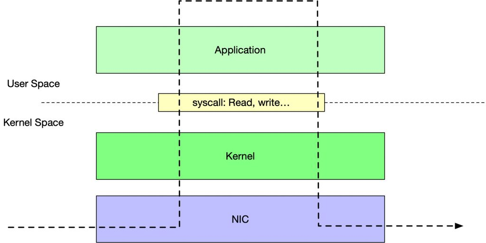](https://www.kawabangga.com/wp-content/uploads/2023/12/nginx-stream.jpg)

Nginx stream 经过了完整的 kernel network stack

我们说 Nginx 是一个**高性能**的反向代理，是说作为应用层的程序，它有多路复用，它的模型已经很快了。作为 7 层负载均衡来说，性能足够了。但是作为四层负载均衡来说，就差很多。

核心问题是，它的网络处理都是用了 Linux 的 syscall，意味着对于每一个 TCP 连接的转发，它都要对 Client 维护一个完整的 TCP 连接，包括滑动窗口，buffer，等等，对于 Real Server 一侧，也要维护一个 TCP 连接；依赖syscall 的另一个问题是，从 Kernel Space 向 User Space 传递数据要 copy 内存，也是一个瓶颈。

那么有没有办法不使用 Kernel 的 TCP 实现呢？

### Kernel Module 转发，LVS

LVS 的思路是，将转发逻辑直接做到 Kernel 中，用 Kernel Module 的形式。

[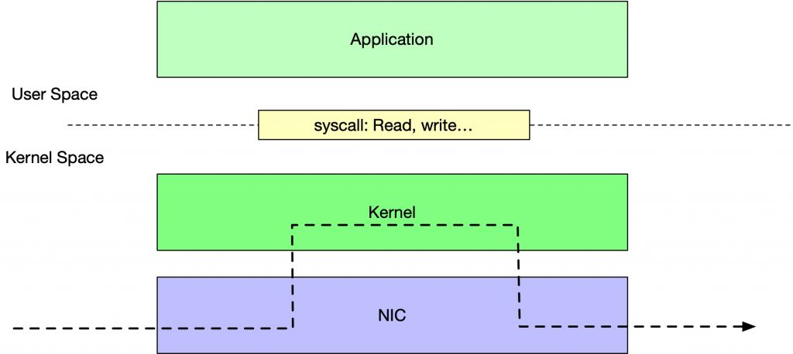](https://www.kawabangga.com/wp-content/uploads/2023/12/lvs.jpg)

这样，就不需要向 User Space 来拷贝数据了。另外 LB 也不需要对客户端，和 Real server 维护两个完整的 TCP 实现，它只要将所有客户端发给 LB 的包，一模一样地转发给 Real Server；再将所有 Real Server 发给 LB 的包，一模一样地转发给客户端，就可以了。不需要处理 buffer，也不需要 ACK，不需要处理滑动窗口。

LVS 虽说是在 Kernel 里面，但是依然经过了网络栈，会损失部分性能。那有没有办法在更前面处理包的转发呢？

### Kernel eBPF 转发，XDP

[XDP](https://en.wikipedia.org/wiki/Express_Data_Path) 全称是 Express Data Path, 光听名字就很快。它比 LVS 先进的地方在于，包在进入到 NIC 的时候，就可以执行 eBPF 程序进行转发了。也就是说，执行的位置更靠前，bypass Kernel nework stack 的更多，所以也就更快。当然，也有一些弊端，Kernel network stack 提供的一些功能就不能用了。（废话，为了速度让你给跳过了）。

XDP 相比于 LVS 的另外一个好处，是更加安全和方便测试一些。Kernel Module 无论是开发还是测试，门槛都比较高。XDP 是基于 eBPF 的，eBPF 虚拟机自带验证，帮助你避免写出一些危险的代码。

上面都是一些直接在 Kernel 处理的技术，那么反正都是减少 kernel space 和 user space 的拷贝，那能不能 bypass kernel，直接在 User Space 实现呢？听起来很疯狂，但其实是可以的，效果也很好。

### User Space 转发，DPVS

[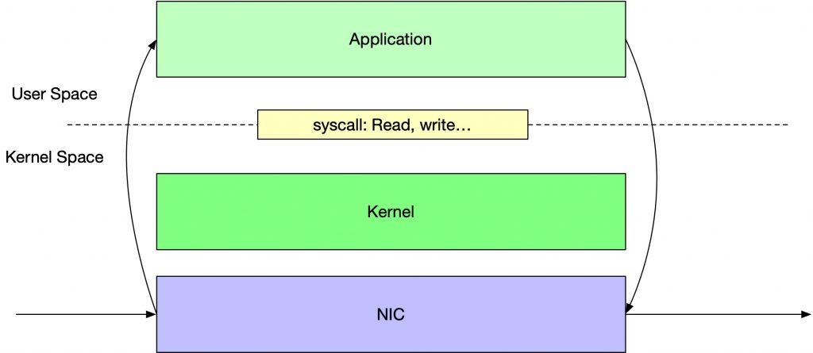](https://www.kawabangga.com/wp-content/uploads/2023/12/xdp.jpg)

DPDK 全称是 _Data Plane Development Kit_。是英特尔的一个技术，能够让应用程序通过这个库来直接从 User Space 读取网卡数据的程序。[DPVS](https://github.com/iqiyi/dpvs) 是爱奇艺使用 DPDK 改写了 LVS，是一个 LB 软件。

本来的路径是，NIC 收到网络包，发出中断，CPU 再来处理，kernel 将内容复制到 user space，程序就可以处理网络内容了。

现在是应用程序直接去 NIC 读写内容，没 Kernel 什么事了，甚至连中断也没了。

啥？中断都没了，怎么知道有内容需要处理？实际上是通过轮询实现的，即 CPU 一直在 NIC 读内容，如果没有内容要处理就再读一次，一直读 (Busy Polling)。所以……使用 DPDK 可以发现即使没有数据，CPU 使用率也是 100%，有数据也是 100%。

跳过了 Kernel Network Stack，甚至跳过了中断，DPDK 的性能自然很高。

一个副作用是，因为我们完全用网卡驱动去读内容，这意味着，使用 syscall 的读写网络的程序无法正常工作了，因为 NIC 已经被应用程序接管而不是 Kernel，Kernel 甚至都不知道这个 NIC 的存在。所以，像 curl，nginx，dnsloopup 等这种软件都无法工作了，甚至 sshd 都无法工作了。那不是给我们的维护带来很大负担嘛？难道要重写这些所有的软件？

使用 dpdk 重写是一种思路，另一种思路是，可以用 dpdk 虚拟出一个网卡，应用程序如果对流量不感兴趣，比如是 ssh 流量，就交给这个虚拟网卡，传统程序都跑在虚拟网卡上。

另一个思路是……再插一张网卡，用于管理程序。

Nginx stream 这种模式目前基本不用了，这篇文章放在这里只是和后面的方式作比较方便读者理解。**Grey** 告诉我一个 Kernel 角度来看的，这些转发方式的区别：Nginx 转发的模式是对客户端建立 TCP 连接，对 Real Server 建立 TCP 连接，收到一个 SKB （可以简单理解成 IP 包），处理一下，然后创建一个新的 SKB，发给 Real Server。但是 LVS, DPVS, XDP 这些不会创建新的 SKB，它直接修改客户端收到的 SKB 然后转发给后端 Real Server。另外，Nginx Strem 依赖 syscall，原生的情况只能通过 syscall 提供的能力处理 TCP 请求，像是 DNAT，DSR 这些“特殊的”转发模式，涉及到三层包，需要更多的魔法（比如 iptables）配合才行。

下图是 Linux, DPDK, XDP 三种方式的性能比较：

图片来自 [Andree Toonk 的一个视频](https://www.youtube.com/watch?v=hO2tlxURXJ0&t=371s)

## One Arm 和 Two Arm

到这里，其实大部分的概念都已经讲完了。最后再来说一下 one-arm 和 two-arm。

这个概念是有一些混乱的，混乱的原因是，大家在讨论的时候，经常忽略声明讨论的前提，是在说物理网卡还是逻辑网卡。

我最先听说这个词是在跨 vLAN 通讯上：假设不同子网的两个设备要通讯，应该怎么做？不同 LAN 那就是二层不通了，显然只能走三层。假设不同 vlan 的两个设备要通讯，这么做？答案还是走三层。

但是这里有一个奇怪的地方出现了，因为是 vlan，所以其实所有的设备都连在一个交换机上，即两个 vlan 在同一个交换机上。路由器如果要连接两个 vlan，其实只用一根线，连接一个交换机，然后在路由器的接口上虚拟出来两个子接口，每一个子接口连接一个 vlan，就可以了。

架构图如下：

[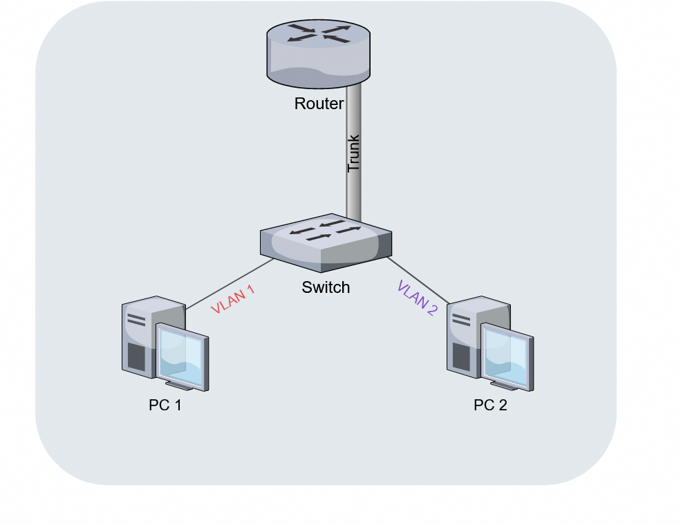](https://www.kawabangga.com/wp-content/uploads/2023/12/Router_on_a_stick_concept.png)

图片来自[维基百科](https://en.wikipedia.org/wiki/Router_on_a_stick)

这个路由器设备上只有一根线，给它起个名字就叫做 Router-on-a-stick. 也叫做 one-arm。

在这个场景下，one-arm 指的是物理线路只有一条。

换到 LB 场景上来说，如果你看到一个地方提到 one-arm 或者 two-arm，只能根据上下文推测一下它说的物理网卡还是逻辑网卡。其实我发现，大多数情况下，人们都是想说逻辑网卡。

比如，跑在 WAN 上的 LB，经典配置就是有两个 interface，一个配置 WAN VIP，一个配置 LAN IP 用于连接 Real Server。我们一般叫这种配置是 two-arm。

但是这两个 interface 其实可以在同一张物理网卡上。

对于 LAN 上的 Lb，可以使用同一个内网 VIP 同时用于对 Client 的连接和对 Server 的连接。逻辑上是一个 Interface，可以称作是 one-arm。但是物理网卡可以有两个甚至两个以上做 bonding。

[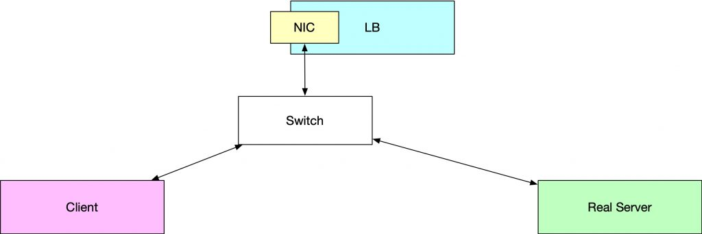](https://www.kawabangga.com/wp-content/uploads/2023/12/one-arm-lb.jpg)

## 总结

这个比较大的话题总算是讲完了，LB 笔者在工作中使用过比较多，但是实际设计的经验不多，难免存在错误。如果读者发现，欢迎不吝赐教。

实际在技术选型的时候，一般先从软件开始，软件决定了，再看软件支持的转发架构。然后再实现长连接保持技术。不是所有的软件都支持长连接保持，有一些可能要定制化，二次开发才能实现。

L4LB 技术需要考虑的一些内容

后面有时间了，打算根据这个框架在博客中分析一下一些经典的四层 LB 实现。

一些 L4LB 软件：

-   [Katran](https://github.com/facebookincubator/katran) by Facebook: XDP
-   [DPVS](https://github.com/iqiyi/dpvs) by iqiyi: DPVS
-   [LVS](https://en.wikipedia.org/wiki/Linux_Virtual_Server)
-   [Unimog](https://blog.cloudflare.com/unimog-cloudflares-edge-load-balancer/) by Cloudflare (not open source): XDP
-   [GLB](https://github.com/github/glb-director) by Github: [GLB: GitHub’s open source load balancer](https://github.blog/2018-08-08-glb-director-open-source-load-balancer/)
-   [Maglev](https://blog.cloudflare.com/high-availability-load-balancers-with-maglev/) by Google
-   [Cilium](https://cilium.io/blog/2022/04/12/cilium-standalone-L4LB-XDP/)
