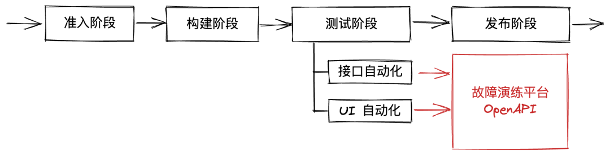

**本期作者**

黄焱 哔哩哔哩资深测试开发工程师

王旭 哔哩哔哩资深开发工程师

**背景**

在云原生的架构下，微服务的数量呈现爆炸式增长，服务间的调用关系错综复杂，对系统可靠性也提出了更高的要求。在这样的背景之下，混沌工程的关注度也不断提升。

事实上，混沌工程早就不是什么新鲜的概念，早在2008年开始，混沌工程的思想就已经始萌芽，彼时，网飞公司由于数据库发生故障，导致了三天时间的停机，使得 DVD 在线租赁业务中断，造成了巨大的经济损失，正是这次线上事故推动了后续的 ChaosMonkeyV1 项目的诞生。在那之后，类似于 SimianArmy、ChaosKong、Gremlin、ChaosMonkeyV2、ChaosBlade、ChaosMesh、ChaosMeta 等混沌工程相关产品在各个大公司的实践中走入公众视野。

**B站混沌工程之路**

相比于业界其他公司如火如荼的混沌工程实践，B站的混沌工程之路起步较晚，期间的资源投入也略显不足。在2019年时，基于开源的 ChaosBlade工具，开始尝试在线下环境进行故障注入，做一些简单的混沌工程实验；在2021年时，增加了一些周边平台打通、实验场景管理之类的功能。总体来说，工具层面的投入断断续续，能力丰富程度不足；业务接入方面也参差不齐，积极度不高。

然而，多次的线上问题，让稳定性问题越来越受到各方的重视。例如年初的一次：一个新业务的支撑服务因为有代码问题，压垮了其依赖的某核心服务；而错综复杂的依赖关系，造成了大量其他核心业务不可用；在此过程中，降级措施的历史问题也被触发，本该止损的容灾机制也无法正常工作。

在之后的事故总结中，两个与稳定性相关的要点被提了出来：容灾失效、依赖混乱。痛定思痛，基于事故总结的要点，B 站的混沌工程之路分两个方向开始推进：

-   容灾演练：针对容灾失效问题，主要针对基础设施层面的容灾演练，如多活架构的验证。
    
-   故障演练：针对业务层面的依赖关系混乱问题，展开强弱依赖梳理、故障演练。
    

本文主要从业务层面的故障演练展开，介绍 B 站故障演练平台的实践。

也许有人会有疑问，不是一直在说混沌工程，怎么突然又转到了故障演练的概念。事实上，这两个名词总是经常被一起谈论，也确实不容易分清。一些浅薄的理解，这是两个道和术之间的概念问题。

混沌工程提出的是系统稳定性之道，是方法论，典型的如网飞公司总结的混沌工程五大原则（建立稳定状态的假设、用多样化的现实世界事件做验证、在生产环境中进行实验、持续自动化运行实验、最小化爆炸半径）；故障演练则是在混沌工程理论指导下的具体实践方法，不同的公司结合自身的实际，有特定的演练的目标和手段。当然也有公司会逐步将通用能力抽象出来，开源甚至产品化相应的能力。

B站故障演练平台的定位，在于结合公司的实际情况，贴近实际的业务进行强弱依赖关系的治理；并尽可能在线上真实环境，执行核心业务链路的故障演练。

明确了这样的定位之后，进一步进行问题拆解，主要包括以下几个方面：

-   故障注入：怎么创建故障，要演练哪些类型的故障？
    
-   爆炸半径控制：在线上环境做演练，如何保障安全性？
    
-   依赖采集：不同的业务场景，相应的依赖项都有哪些？
    
-   演练的自动化：故障演练的执行成本如何降低？
    

以下就四个方面逐一展开。

**如何实现故障注入**

业务层面故障注入的基本原理，是在某个处理流程中嵌入故障相关的逻辑，也就是AOP（ Aspect Oriented Programming 面向切面编程）的思想。不同于 JAVA 有字节码增强、动态代理，Go 没有虚拟机，怎么实现 AOP 呢？几个备选方案是：

动态法：

-   通过反射找到运行方法的指针，然后动态插入代码。但这种方法目前主要用于测试工具相关的场景下，存在诸多限制，官方也不推荐用于生产环境；
    

静态法：

-   代码插入法：基于抽象语法树（AST）做代码生成。但是这种方案需要每次都重新生成一次新的代码，附加成本比较高；
    
-   代码模式法：通过一定的设计模式，在代码层面实现 AOP 的思想。
    

结合公司的实际，B 站大部分的微服务都是基于同一套 Golang 微服务框架（Kratos）实现的，因此这种方法的可控程度最强、透明度最高，最终也成为了我们的选择。

中间件模式简单来说就是对某种过程的拦截，多个中间件可以叠加使用。

以Server类型的故障注入为例，如下图所示：在 DefaultServer 内创建 Engine 实例后，可以应用一个 \_globalServerHandlers 的中间件数组。该数组可以通过 RegisterServerHandler 方法进行注册。

具体到故障演练中间件，可以看到下图的 HttpServerHandler，实现了在Server 处理请求时的拦截，内部可以判断当前请求是否命中故障演练实验、故障元信息注入、Server 类型故障注入等多种能力。

其中的故障注入实现 bmServerAction 中，可以看到主要支持了超时、业务错误码、HTTP 返回码等多种不同的故障形式。

再看  HTTP Client 类型的故障注入，也是类似的方式。如下图，可以看到 Client 实例会用到 \_globalClientOpts 的中间件选项数组，该数组可以通过 RegisterClientOpt 进行注册。

在相应的中间件内部，可以看到内部可以基于上下文 ctx 信息获取匹配的实验、实现爆炸半径的控制、进行Client类型的靶点注入等等。

而具体的故障类型，可以包含超时、业务错误码、HTTP 返回码等等。

也许有人会疑惑，为什么既有 Server 类型的故障，又有 Client 类型的故障呢？对于一次调用过程来说，在这个过程的一端进行故障注入不就可以了吗，为什么要两端都实现呢？

事实上，在使用时确实一般不需要两端都注入。但是选择在哪一端进行注入，对于实际的使用来说还是有一定差异的。简单来说，在 Client 端进行注入，是站在调用方的视角，可以避免缺少对被依赖应用的权限问题（对特定应用进行故障注入是需要权限的），且可以减小影响的范围；在 Server 端进行注入，是站在服务提供方的视角，更贴近线上真实业务出现故障的情景，且一次可以演练多个下游受影响的情况。

除了以上的 Server 类、Client 类的基础组件，Kratos 框架中的其他组件也都进行了相应的改造和故障演练能力的支持。大致如下：

-   Server 类：HTTP Server、gRPC Server （报错、超时、特殊错误码等）
    
-   Client 类：HTTP Client、gRPC Client （报错、超时、特殊错误码等）
    
-   数据库类：MYSQL、TIDB、TAISHAN （报错、超时等）
    
-   缓存类：REDIS 、MC 等 （报错、超时等）
    
-   消息队列类：DATABUS 等 （发送报错、发送超时、接收报错等）
    
-   其他特殊类：一些公司内部特有的基础组件，如内存聚合工具等（内部容量满等）
    

了解具体的基础组件的故障注入能力之后，再来看整体的故障注入流程。

基本流程：

-   业务应用 1 行代码接入 SDK， fault.Init()
    
-   SDK 注册各类组件的故障演练中间件
    
-   SDK 初始化，负责与Fault-Service信息交互，gRPC 长连接
    
-   用户通过 Fault-Console创建场景、编辑靶点、启动实验
    
-   Fault-Admin 将实验信息写入 Fault-DB、Fault-KV
    
-   Fault-Service 从DB/KV 获取实验，下发给 SDK
    
-   SDK 拦截相关流程，实现故障点注入，信息上报
    

在业务接入过程中，也遇到一些波折，比如业务反馈在接入SDK 之后，故障注入不生效，最终排查发现业务使用了非常底层的代码，绕过了故障演练中间件的逻辑；再比如，还有业务反馈故障注入只有部分生效，最终排查发现业务在上下文 ctx 传递中出现了问题等等。为了方便用户的排查，我们提供了诸如实时反馈的演练日志、特定的故障演练调试请求和响应 Header 信息等等。

此外，还有业务在接入过程中对故障演练功能是否会导致性能问题有诸多的担忧。对此，故障演练平台通过多种方式来保障性能影响几乎可忽略不计，比如：在无演练实验的情况下快速退出中间件、内部实现避免耗时操作、实验有强制超时机制等等，不展开详述。

**如何实现爆炸半径控制**

有了各类基础组件的故障注入能力之后，若要业务能够安全地进行故障演练实验，就必须解决故障的爆炸半径控制问题。

如下图所示，首先我们支持了常规的爆炸控制方式，主要包括：

-   实例粒度  (位置 A)：Fault-Service 只向圈定的实例推送实验；
    
-   请求粒度  (位置 B)：拦截器识别请求信息，决定是否注入故障fault-ctx; 例如：请求入口 Path 信息；
    
-   靶点粒度  (位置 C)：根据靶点配置的详细匹配规则决定是否注入；例如：请求 Path、缓存 Keys、操作类型、实例地址等；
    

除此之外，在业务使用过程中，新的需求被提了出来，业务期望能够圈定特定的用户账号（通常此类账号为内部可控的一些账号，更方便构造相应的数据和后期清理）来进行演练。考虑到此类需求，结合公司内部的账号体系，故障演练平台提供了基于用户的账号的爆炸半径控制方式，主要是两种方式：

-   基于账号的精确匹配：只会对圈定的精确账号相关的流量进行故障注入；
    
-   基于账号尾号的群体划分：根据账号的尾号信息，将流量可以进一步划分成多份，只有满足特定尾号的账号流量进行故障注入。
    

当然，这种基于账号的爆炸半径控制方式，同样要求用户正确使用上下文传递用户的账号信息，这也是业务的基本要求。

至此，常规的服务器类型业务的故障演练爆炸半径控制通过以上四种方式可以基本满足要求了。然而，在推进的过程中，又有新的业务遇到了麻烦。除了服务器类型业务，公司内部还有很多消费场景的业务，比如稿件的审核任务、点赞数的异步统计任务等等，这些任务都不是传统的一个 Server，而是一种 Job 的形式，根本没有接口的概念。

比如，如下图所示，有一个消费场景的任务 A，它消费两个 topic，并且对外有三个依赖服务。假设当前故障演练的期望是：演练任务 A 在消费 topic\_1 时，依赖1 出现故障的表现，并且演练过程在线上执行，只希望影响其中的部分特定的消息，不能影响线上正常的消息处理流程。

针对这样的需求，我们对公司的消费场景进行了调研。好消息是，B站自研了基于 CQRS 架构的异步事件治理框架（Railgun），公司的消费场景任务广泛基于该框架实现。

于是，我们基于 Railgun框架，插入故障中间件，基于 Topic、消息内容判断是否注入 Fault-ctx，以此来实现爆炸半径控制。例如：可以对特定的稿件进行线上故障演练，比如指定内部用户创建的演练稿件。

如下图所示，我们在框架从 Topic 接收消息的位置插入故障处理中间件（ Fault-Msg-Handler），根据 Topic 的形式（严格匹配或者前缀匹配等）、以及消息内容条件（具体的消息字段或者特定的 meta 信息等）判断是否需要注入故障演练上下文（Fault-ctx），这个上下文信息随着消息不断向下传递，对于下游依赖的调用，可以从该上下文中解析条件判断是否注入故障，基本流程与 Server 类型的故障注入和爆炸半径控制一致。

**如何进行依赖采集**

故障注入能力、爆炸半径控制能力就位之后，用户就已经可以开始在平台执行故障演练的实验了。常规的操作是，用户可以创建一个应用场景，然后在该应用场景下根据需要演练的依赖项，依次创建需要注入故障的靶点，圈定需要进行故障注入的范围之后（实例、目标流量、目标用户等）就可以开始实验了。然而，真实的业务场景下，依赖关系十分复杂，如果全部需要研发人员根据代码人工去梳理采集，效率低下且容易有错漏的情况发生。如何简化依赖信息的采集流程呢？有几种备选方案：

-   根据公司内部的平台信息导入：然而很多平台只是维护了应用粒度的依赖信息，比如某应用 A 依赖了某数据库 D，而无法细化到接口粒度，不满足要求；
    
-   根据 Trace 信息进行导入：这是一种不错的方案，但是彼时的问题在于公司内部 Trace 的接入程度可能不足，且存在采样率的问题，线上采集的时候容易遗漏；
    
-   根据故障演练 SDK 在调用依赖的时候进行依赖上报。这种方法的优势是：依赖采集和故障演练完全匹配，可控程度非常高，因此这成为了我们选择的方案；
    

依赖采集的基本流程如下图所示：

以 HTTP Client 类型依赖采集为例，在故障演练 SDK 中依赖采集的位置如下。其中关键点主要是两方面：

-   依赖采集配置下发：和故障演练实验类似，依赖采集的信息也会根据匹配情况，被注入到 ctx 中，然后传递到各个后续的基础组件位置；
    
-   依赖信息上报：在各个基础组件内部，如果判断满足依赖采集的条件，则会拼装相应的信息，然后上报返回给故障演练平台；
    

在代码层面上，可以看到在原始的注入 HTTP Client 类型故障的中间件内部，执行了 bmClientCollect 逻辑，其中就是根据当前入口接口的信息、目标请求的依赖接口的信息等，构造的一个依赖上报项。

需要说明的是，我们希望采集到的依赖信息是细化到各个接口粒度的，因此依赖的信息存在多样性，体现在：

-   同一个应用，不同的对外入口维度下（接口或Topic），依赖项可能不同；
    
-   即使同一个应用的同一个对外入口，参数不同时，依赖项也可能不同；
    

因此，在执行依赖采集的时候，平台支持用户圈定采集的范围，比如只针对特定的接口或者 Topic 进行依赖采集。用户可以自行控制依赖采集时的输入流量，比如只构造一类参数条件下的流量进行采集。在采集完成之后，用户可以将本次采集到的结果按需导出为特定的故障场景进行固化，方便后续的靶点构造。

**关于演练的自动化**

演练自动化的问题背景，来源于故障演练执行过程中的人力成本高昂问题。理论上，单个应用的故障演练组合数 = 接口数 \* 依赖数 \* 故障类型种类 \* 故障参数种类。虽然在实际执行过程中一般不会穷举所有可能性，但是重复、繁琐的操作还是让业务方深感疲惫。因此平台希望能够提供一些能力减轻用户的人力投入。

一方面，平台提供了强弱依赖自动判定的能力。其基本流程如下所示：

其中的关键点，主要在于：

-   将各个依赖项拆分为单个靶点的演练 task，并且限定该 task 的停止条件，在触发了特定的演练次数之后（一般设置1次），可以自动实现 task 之间的切换；
    
-   根据返回结果是否包含错误等，自动判定强弱依赖关系。这一点上，需要用户规范地构造返回内容，比如强依赖失败时返回错误码，弱依赖失败时无明显报错等，否则可能导致误判；
    

另一方面，平台也提供了开放接口用于对接接口自动化、UI 自动化等流程，这些流程中可以加入一些业务信息的断言，并集成到 CI 流程，确保强弱依赖关系不被意外破坏。

其基本流程如下：

-   故障演练平台提供 OpenAPI 操作故障演练实验。
    
-   业务 QA 设计测试用例，编排故障场景。
    
-   在自动化脚本中开启、关闭对应演练实验。
    
-   执行特定的测试逻辑。
    
-   对返回结果进行处理（接口断言、图片 DIFF、视频录制、BUG单创建等）
    

其中有一些需要关注的要点：  

-   故障生效的时效性问题（从SDK拉故障改成 Fault-Service推送故障的模式，提高故障生效时效性）
    
-   演练实例的选择问题 （支持基于染色的自动圈定，与 CI 流程自动发布染色实例打通）
    
-   问题：业务需要人为创建大量的故障演练场景，且维护好故障场景与 CASE 的对应关系；
    

再一方面，平台也提供了基于多应用场景的自动演练能力。该问题的背景来源于：一个实际的业务场景，通常会同时涉及多个应用，如何管理多应用场景下的演练？相应的解决方案是：

-   设计多应用的『业务场景』的概念。一个业务场景对应多个『应用场景』，一个应用场景下可以有多个故障靶点。
    
-   平台支持多应用故障点应用不同组合策略，自动进行组合和故障注入。支持一键启动。
    
-   支持绑定业务场景级弱依赖 CASE 集、单依赖级测试 CASE 集，强弱依赖执行不同的靶点组合策略；
    

**总结及未来展望**

最后，再来看一下故障演练平台的全景。故障演练SDK主要包括通用能力和各类基础组件故障演练中间件两部分；故障演练平台主要包含依赖、场景、靶点、爆炸半径等各方面的管理能力，以及对外的接口。对于业务应用来说，接入成本低，透明度高，但是必要时需要一定的改造；业务可以选择手动触发故障演练实验，也可以在自动化流程中集成故障演练的能力等。目前，B站故障演练平台已经在推荐、播放、动态、话题、弹幕、评论、直播、TV、车载等众多业务线落地，协助业务梳理、发现、改进大量的强弱依赖相关问题，从而提升业务的稳定性，详情不在此列举。

未来展望方面，一方面我们会继续丰富微服务框架内的基础组件的故障注入的丰富度；另一方面，我们会考虑将故障演练的过程更多向闭环方向建设，集成监控、日志等信息，让演练更加安全，逐步可以实现常态化和自动化。
