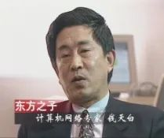
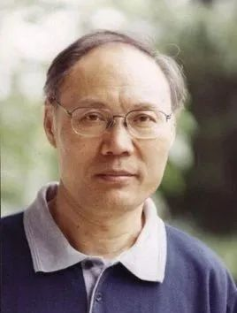
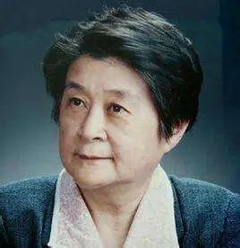
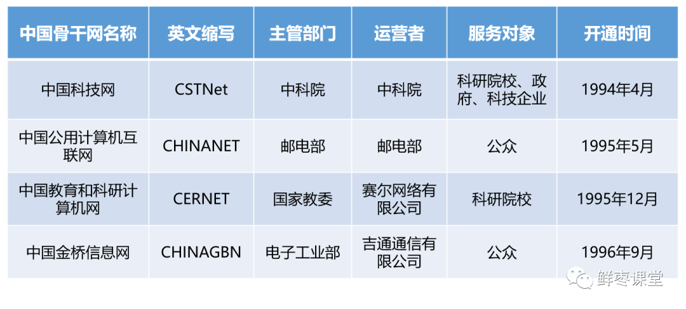

本文转载自：鲜枣课堂

1987年9月20日，北京中国兵器工业计算机应用研究所的**钱天白**教授，发出了我国第一封电子邮件，内容是：

“Across the Great Wall we can reach every corner in the world. ”

（“越过长城，我们能到达世界的每个角落。” ）

这封邮件当时具有极为深远的意义，它被视为中国与互联网的第一次“亲密接触”。而钱天白教授，也被世人称为“中国互联网之父”。

其实，当时钱天白所使用的网络，并不是我国自主建设的Internet骨干网，而是1986年计算机应用技术研究所与德国卡尔斯鲁厄大学合作建设的一个国际联网项目——中国学术网（Chinese Academic Network，简称CANET）。

这封邮件的传输路径，也颇为曲折。邮件发出之后，首先通过意大利公用分组网ITAPAC设在北京侧的PAD机，跨过半个地球，进入意大利本土的ITAPAC主网。然后，再进入德国的DATEX―P分组网。最终，到达卡尔斯鲁厄大学。当时，这条线路的速率，仅仅只有300bps。

不管怎么说，这封邮件还是拉开了中国互联网时代的序幕。此后，越来越多的国内高校和科研院所，开始加入到互联网的研究中，并尝试组建更大规模的计算机网络。

技术探索

1988年初，中国邮电部正式建成了国内第一个X.25分组交换网——CNPAC，覆盖了北京、上海、广州、沈阳、西安、武汉、成都、南京、深圳等城市。

同年，中科院高能物理研究所采用X.25协议，将该单位的DECnet（DEC公司推出的一种小型机网络）与西欧中心的DECnet进行连接，实现了计算机国际远程连网，还实现了与欧洲和北美地区的电子邮件通信。

12月，清华大学校园网采用胡道元教授从加拿大UBC大学引进的电子邮件软件包（采用X.400协议），通过X.25网与加拿大UBC大学相连，开通了电子邮件应用。

1989年5月，中国研究网（CRN）通过当时邮电部的CNPAC，实现了与德国研究网（DFN）的互连。借助DFN的网关，CRN可以与Internet沟通。

1991年，中科院高能物理研究所采用DECNET协议，以X. 25方式连入美国斯坦福线性加速器中心（SLAC）的LIVEMORE实验室，开通了电子邮件应用。

一个又一个连接的建立，振奋了国人。然而，这些连接都只能算是“Internet间接连接”或者“单功能（邮件）连接”，并不是真正的“完整Internet直接连接”。后来，学术界和政府层面很快开始了建立完整直接连接的尝试。

1989年10月，中关村地区教育与科研示范网络项目正式启动。该项目由世界银行提供贷款，国家计委（国家计划委员会）、国家教委（国家教育委员会）、中国科学院、国家自然科学基金会共同参与投资和支持。世界银行将其命名为“National Computing and Networking Facility of China”，也就是NCFC。

1992年底，NCFC完成了三个院校网（中科院院网CASNET、清华大学校园网TUNET、北京大学校园网PUNET）的建设。一年后，NCFC主干网工程完工，采用高速光缆和路由器实现了三个院校网相互联通。

接下来，NCFC的目标，就是直接连入Internet。

阻力重重

众所周知，Internet源于美国，虽然叫做国际互联网，但实际上当时处于美国的控制之下。中国想要真正连入Internet，必须得到美国方面的同意。

中美双方的学术界人士，对于中国连入Internet这件事是非常积极的。

1991年10月，在中美高能物理年会上，美方发言人怀特·托基提出，中国应该尽快接入Internet。

1992年6月，在日本神户举行的INET'92年会上，中国科学院钱华林研究员约见美国国家科学基金会国际联网部负责人，第一次正式提出，希望能够连入Internet。

钱华林

结果，中方提出的请求，遭到来自美国政界的反对。之所以反对，是因为他们认为，来自社会主义阵营的中国，会利用Internet偷取美国的信息和技术研究成果。

经过反复的谈判和沟通，美方勉强同意，可以先建立一根专线连接。美国对这根专线提出了苛刻的要求：1、只能连入能源科学网（ESNET）；2、不得散布病毒；3、不得用于军事和商业领域。

为了长远考虑，中方接受了这些条件。1993年3月2日，中科院高能物理研究所接入美国斯坦福线性加速器中心（SLAC）的64K专线正式开通，成为中国“部分连入Internet”的第一根专线。

1993年6月，NCFC专家们在INET'93年会上，利用各种机会重申了中国“全功能连入Internet”的要求，获得大部分到会人员的支持，极大地推动了项目的进展。

1994年4月初，中美科技合作联委会在美国华盛顿举行。会前，中科院副院长胡启恒代表中方向美国国家科学基金会（NSF）重申连入Internet的要求，得到美方的认可。至此，所有的阻碍都被消除。

胡启恒

1994年4月20日，NCFC接入Internet的64K国际卫星专线正式开通（通过美国Sprint公司），实现了与Internet的全功能连接。

从这一天起，中国正式迈入互联网世界的大门，被国际上承认为真正拥有全功能Internet的第77个国家。

一个月后，5月21日，中科院计算机网络信息中心完成了中国国家顶级域名（CN）服务器的设置，改变了中国的CN顶级域名服务器一直放在国外的历史。（中国顶级域名CN由钱天白教授于1990年11月28日代表中国正式在SRI-NIC正式注册登记。）

NCFC连入Internet之后，中科院对它进行了进一步的扩建。

1995年4月，中科院启动京外单位联网工程（简称“百所联网”工程），目标是在北京地区已经入网的30多个研究所的基础上把网络扩展到全国24个城市，实现国内各学术机构的计算机互联，并与Internet互联。

1996年2月，中科院做出决定，将以NCFC为基础发展起来的这个互联网络，正式改名为“中国科技网（CSTNet）”。

四大IP骨干网

1994年9月，就在中国迈入互联网世界后不久，邮电部电信总局与美国商务部签订协议，正式启动中国公用计算机互联网的建设。这个网，就是现在大名鼎鼎的中国第一骨干网——ChinaNet。

1995年1月，根据协议约定，邮电部电信总局分别在北京、上海开通了接入美国Internet的64K专线（同样是通过美国Sprint公司）。北京和上海这两个节点之间，采用2M带宽相连。

1996年1月，电信总局正式开始向全社会提供Internet接入服务（通过电话网、DDN专线以及X.25网等方式）。这一举动，宣告了中国互联网民用化时代的开始。

由于窄带拨号接入的入网领示号为163，因此ChinaNet也被称为163网络（和网易的163没有关系）。

除了中国科技网（CSTNet）和中国公用计算机互联网（ChinaNet）之外，国内当时还同步建设了中国教育和科研计算机网（CERNET）和中国金桥信息网（CHINAGBN）：

**中国教育和科研计算机网（CERNET）**

1994年7月初，由清华大学等六所高校建设的“中国教育和科研计算机网”试验网开通，并通过NCFC的国际出口与Internet互联。

1994年8月，由国家计委投资，国家教委主持的中国教育和科研计算机网（CERNET）正式立项。

1995年12月，“中国教育和科研计算机网（CERNET）示范工程”建设完成。这张网，就是我们现在常说的“教育网”（大学生读者应该比较熟悉）。

**中国金桥信息网（CHINAGBN）**

1993年3月12日，朱镕基副总理主持会议，提出和部署建设国家公用经济信息通信网（简称金桥工程）。

1993年8月27日，李鹏总理批准使用300万美元总理预备费，支持启动金桥前期工程建设。

1994年6月8日，金桥前期工程建设全面展开。1995年8月，金桥工程初步建成，在24省市开通联网（卫星网），并与国际网络实现互联。

1996年9月6日，中国金桥信息网（CHINAGBN）连入美国的256K专线正式开通。中国金桥信息网宣布开始提供Internet服务，主要提供专线集团用户的接入和个人用户的单点上网服务。

最终，国内形成了四大骨干网的格局。正是这些网络，支撑起了中国互联网的起步。

1997年12月，四大骨干网实现互联互通。此后，中国的互联网，进入了崭新的时代！
