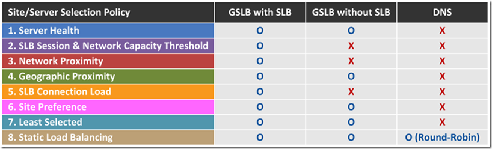
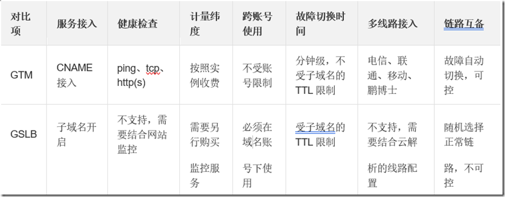

Post Views: 8,529

前段时间和立项小组讨论了DNS、GSLB和GTM的区别，才注意到在GSLB之后，又出来一个GTM，研究了一下也不算什么新概念。估计最早是设备厂商提出，CDN和云厂商开始提供在线业务后加大了宣传，_**把DNS功能增强提升到产品升级换代的境界**_。

（1）**DNS**（云厂叫云解析）：简单一些的做域名到IP地址转换，高级一些的DNS支持设置多个IP地址并配置权重轮询，但是不能主动检测、也不支持高级调度。

（2）**GSLB**（云厂不直接提供，升格到GTM）：相比高级DNS，可以提供启停、负载、距离、时延等检测能力，从而提供更智能的服务。可以把GSLB看做DNS代理。

（3）**GTM**（云厂叫云调度）：和GSLB仅是概念方面的口径不同（有些文章混淆了SLB和GSLB来比较）。

**一、DNS和GSLB的区别（参考引文1，作者当来自网宿）**

GSLB具体实现原理不复杂，如下图。详情阅读引文1。

**二、GTM和GSLB的区别**

下面的分析没有显示GTM和GSLB的本质差别，而是介绍了阿里云对GTM的实现方式（参考引文6，作者来自阿里云）。

网宿没有做太多比较，但是明确了GTM主要功能就是GSLB（参考引文3）

Akamai的GTM工作原理和上面GSLB的原理并无二致（参考引文13）。

F5 BIG-IP GTM的主要功能，其中GTM对应了GSLB，而LTM对应了SLB，这样就比较清晰地明确了GTM和GSLB的关系。（参考引文11和12）。由于BIG-IP GTM是设备，因此F5认为可以通过合理配置GTM功能，可以实现GSLB。这样也就知道了为什么云厂商没有提供GSLB业务，而是提供了GTM业务：因为他们本来就是一种业务。

**移动云在合云提供云解析DNS业务，近期会上线自营云的云解析DNS业务和云GTM业务**。（[https://ecloud.10086.cn/home/product-introduction/dns](https://ecloud.10086.cn/home/product-introduction/dns "https://ecloud.10086.cn/home/product-introduction/dns")）

**结论：GSLB/SLB是一种能力，而GTM/LTM是实现这种能力的产品。DNS既是一种能力、也是一种产品**。

**三、Edge DNS和ALB（Akamai提供）**

边缘DNS是Akamai提出的一种为了提高DNS安全性的架构：DNS被分布到CDN服务器上，这样可以大幅度降低因为DNS被攻击而造成的可用性和安全问题。

Edge DNS is an authoritative DNS service that moves your DNS resolution from your premises or data centers to the Akamai Intelligent Edge. Edge DNS is architected for nonstop DNS availability and high performance, even through the largest DDoS attacks. Edge DNS can be deployed as a primary or secondary solution with optional DNSSEC support to protect against DNS forgery and manipulation.

为了解决7层负载均衡，Akamai还提供了ALB，可以做7层LB，这个看上去也不是什么新功能，但是如果可以在广域网实现，还是管用的。

The Application Load Balancer Cloudlet enables you to define several data center configuration scenarios to balance traffic among combinations of cloud and physical data sources, and quickly switch among them with the click of an activation button or API call. Requests for particular content can be directed to various data sources, by IP and geography or several http header attributes including: URL path, device characteristics, request method, and many more. Traditional methods of load balancing that focus solely on DNS (layer 3) requests lack the flexibility and control to provide seamless load balancing for more modern application architectures that require HTTP layer (Layer 7) controls. Hardware-based load balancers not only require maintenance, are limited in their ability to scale, but can also introduce inefficient management processes and delay time to market. Existing cloud-based approaches are often useful only for the IaaS services on which they are built and sometimes lack reliability that could take your app offline completely.

相关信息：

1.  网宿软文：[https://blog.csdn.net/zzhongcy/article/details/103974685](https://blog.csdn.net/zzhongcy/article/details/103974685 "https://blog.csdn.net/zzhongcy/article/details/103974685")
2.  网宿DNS：[https://www.wangsu.com/product/88](https://www.wangsu.com/product/88 "https://www.wangsu.com/product/88")
3.  网宿GTM：[https://www.wangsu.com/product/89](https://www.wangsu.com/product/89 "https://www.wangsu.com/product/89")
4.  阿里软文1：[https://zhuanlan.zhihu.com/p/128039572](https://zhuanlan.zhihu.com/p/128039572 "https://zhuanlan.zhihu.com/p/128039572")
5.  阿里软文2：[https://www.jianshu.com/p/a5904d0260e5](https://www.jianshu.com/p/a5904d0260e5 "https://www.jianshu.com/p/a5904d0260e5")
6.  阿里云文档：[https://developer.aliyun.com/ask/277885](https://developer.aliyun.com/ask/277885 "https://developer.aliyun.com/ask/277885")
7.  阿里云产品页：[https://help.aliyun.com/document\_detail/102232.html?spm=a2c4g.11186623.6.544.3b9569a0QLfPwj](https://help.aliyun.com/document_detail/102232.html?spm=a2c4g.11186623.6.544.3b9569a0QLfPwj "https://help.aliyun.com/document_detail/102232.html?spm=a2c4g.11186623.6.544.3b9569a0QLfPwj")
8.  阿里云产品总览：[https://www.aliyun.com/product/dns?spm=5176.12825654.eofdhaal5.d169.e9392c4ajs8XyO&scm=20140722.1021.1.1056](https://www.aliyun.com/product/dns?spm=5176.12825654.eofdhaal5.d169.e9392c4ajs8XyO&scm=20140722.1021.1.1056 "https://www.aliyun.com/product/dns?spm=5176.12825654.eofdhaal5.d169.e9392c4ajs8XyO&scm=20140722.1021.1.1056")
9.  Wikipedia-F5：[https://en.wikipedia.org/wiki/F5\_Networks](https://en.wikipedia.org/wiki/F5_Networks "https://en.wikipedia.org/wiki/F5_Networks")
10.  Wikipedia-LB：[https://en.wikipedia.org/wiki/Load\_balancing\_(computing)](https://en.wikipedia.org/wiki/Load_balancing_(computing) "https://en.wikipedia.org/wiki/Load_balancing_(computing)")
11.  F5 BIG-IP GTM-overview：[https://www.f5.com/pdf/products/big-ip-global-traffic-manager-overview.pdf](https://www.f5.com/pdf/products/big-ip-global-traffic-manager-overview.pdf "https://www.f5.com/pdf/products/big-ip-global-traffic-manager-overview.pdf")
12.  F5 BIG-IP GTM-DS：[https://www.f5.com/pdf/products/big-ip-global-traffic-manager-ds.pdf](https://www.f5.com/pdf/products/big-ip-global-traffic-manager-ds.pdf "https://www.f5.com/pdf/products/big-ip-global-traffic-manager-ds.pdf")
13.  Akamai GTM：[https://www.akamai.com/uk/en/multimedia/documents/product-brief/global-traffic-management-product-brief.pdf](https://www.akamai.com/uk/en/multimedia/documents/product-brief/global-traffic-management-product-brief.pdf "https://www.akamai.com/uk/en/multimedia/documents/product-brief/global-traffic-management-product-brief.pdf")
14.  移动云云解析业务：[https://ecloud.10086.cn/home/product-introduction/dns](https://ecloud.10086.cn/home/product-introduction/dns "https://ecloud.10086.cn/home/product-introduction/dns")
15.  Akamai GTM Blog：[https://blogs.akamai.com/2019/07/akamai-load-balancing-to-lock-in-quality.html](https://blogs.akamai.com/2019/07/akamai-load-balancing-to-lock-in-quality.html "https://blogs.akamai.com/2019/07/akamai-load-balancing-to-lock-in-quality.html")
16.  Akamai Application Load Balancer（ALB）：[https://www.akamai.com/us/en/products/performance/cloudlets/application-load-balancer.jsp](https://www.akamai.com/us/en/products/performance/cloudlets/application-load-balancer.jsp "https://www.akamai.com/us/en/products/performance/cloudlets/application-load-balancer.jsp")
