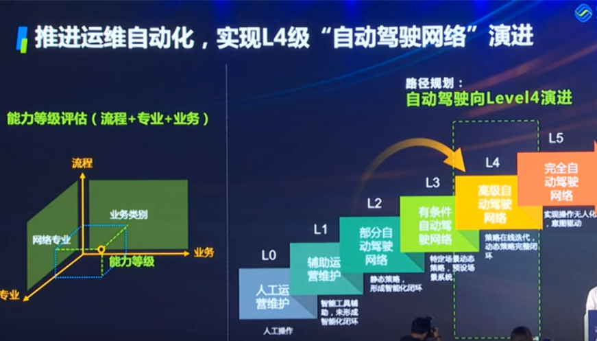

**通信世界网消息**（CWW）近日，在2021年世界人工智能大会上，中国移动网络事业部副总经理顾宁伦表示：“目前中国移动正在以网络运维工作实线上化、自动化、重点领域AI数字化为目标，推进2025年实现L4级别的自动驾驶网络。”  

**中国移动率先提出****自动驾驶****网络**

当前，新一轮科技革命和产业变革正处于重大的突破和历史关口，经济社会的数字化转型正在加速，据信通院预计到2025年数字经济规模将达到65万亿，信息服务业规模将超过20万亿。数字经济的持续增长，面向新的产业机遇，顾宁伦表示，中国移动提出五个数智化转型关键行动，一是创新数字化的产品，二是夯实数字化网络，三是打造数字化的中台产品，四是构建数字化组织，五是构筑数字化生态。

他指出，作为全球网络规模最大，用户数最多，结构最复杂，设备厂家最多的运营商，中国移动正努力通过结构性的调整，构建云网一体、高度自动化、智能化体系，通过数字化运营，中国移动精品网络成为各行各业数字化转型基石，2019年，中国移动联合产业界合作伙伴率先提出了自动驾驶网络，面向垂直行业和消费者客户提供“全自动、零等待、零接触、零故障”的网络服务；面向5G、云网融合，推进网管架构演进，推进AI注智，构建网络全生命周期的自动化、智能化运维能力；打造“自服务、自愈合、自优少”的通信网络。

**提出****网络运维智能化****的“341”举措**

自动驾驶网络的自动化能力分为L0至L5，共六级，表示对生产工作支撑能力的逐步提升，从辅助运营维护逐步提升至完全自动驾驶网络，顾宁伦指出，目前中国移动正在以网络运维工作实现线上化、自动化、重点领域AI数字化为目标，推进2025年实现L4级别的自动驾驶网络。

中国移动充分认识到网络全生命周期计划建设、维护、优化、运营和资源管理六大应用，在构筑大量的自动化运维能力的基础上，加上AI人工智能的创新应用，是实现自动驾驶网络能力越强的快捷途径，智慧运维系统是中国移动智慧中台能力的构建者，贡献者和应用者。在AI领域，共享集中化AI平台能力，且同时基于AI平台实现各类AI应用，提出了网络运维智能化的一系列举措，又称“341”举措，即“三”大运维应用场景：现场作业图像识别、网络策略复杂计算、网络大数据分析；“四”项智能运维能力：感知智能、诊断智能、预测智能、控制智能；“一”个Al共享平台：通用算力、程序框架、算法、模型、数据。

**在****业务敏捷开通****、****设备智能节电****等方面****取得****重大成果**

2020年开始，中国移动已经进入到自动化，智能化的能力规划模型阶段，基于大数据，人工智能等技术，持续构建了关于业务敏捷开通、设备智能节电、网络智能控制等方面取得重大成果，顾宁伦介绍了三个实践案例。

实践一是实现ToB客户端到端互联分钟级开通。传统网络涉及数十个流程节点，人工效率低，开通周期长，难以满足政企业务发展需求，中国移动基于一键式自动调度、动态计算最优路径、实时感知网络状态等功能，实现业务开通时间由“周”缩短至“分钟”级。

实践二是面向双碳目标“一站一案”5G智能节电。5G的总体能耗不降反升，给运营商带来巨大的成本压力，面对流量潮汐效应实际能耗高，休眠不彻底造成硬件无法实现深度休眠的问题。中国移动智能节能技术由传统的静态分析升级为动态分析，人工经验转为AI算法，实现了网络级节能。在设备级节能方面，实现浅度休胆向深度休眠的转变。AI节能10％，比传统节能6％增加了4%，除此之外，单站每年节电300度，实现了低碳创新，降本增效的效果。

实践三是支撑5G精品网络智能优化无线。5G的高带宽与其采用的多波束天线密度不可分，但带来了更大的复杂性，为了打造5G精品网络，提升至4G、5G的网络协同，需要对多波束天线设置超过一万多种参数组合，在9.41亿用户动态分布的情况下，据传统专家经验的IT固化，难以快速找出最佳的参数方案，中国移动采用AI算法，根据基站覆盖的特点和业务量的历史趋势，主动预测用户分布，快速选出参数组合，并自动下发参数配置，同时自动感知基站的故障，快速配置应急补偿多数参数，在现网应用后，室外下载速率提升13% ，室内下载速率提升30%，显著的提升了5G的下载速率和客户感知。

最后，顾宁伦表示，面对数字经济的迅猛发展，面对信息行业通信的新趋势、新变化，为把握好数字经济机遇，助力经济社会发展中发挥更大的作用，中国移动将继续推动网络运维智能化转型，面向2025年达到L4自动驾驶网络，支撑好移动家庭政企业务的融合发展，支持好社会数字化转型。

来源：通信世界网
