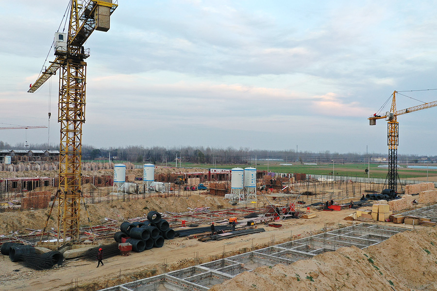

随着“汉服热”、“古风审美”等潮流兴起，汉服爱好者基数不断扩大，汉服产业快速兴起。在产业发展初期，杭州、广州、深圳占据着主要市场，就在三大产业集群争抢汉服市场版图之际，山东菏泽曹县以黑马之势，迅速抢占汉服市场。**曹县，一夜之间成了顶流。**

“汉服帝国”曹县，折射出整个菏泽的发展境遇。从菏泽在电商领域取得的成就来看，恰恰是交通区位和产业结构相对落后的制约因素，倒逼菏泽叩开了一条全新的脱贫之路。

文丨白羽

编辑丨崔赫翾 瞭望智库

本文为瞭望智库原创文章，如需转载请在文前注明来源瞭望智库（zhczyj）及作者信息，否则将严格追究法律责任。

**1**

**三道思考题**

___

近现代以来的很长时间，这里一直无法摆脱经济欠发达的帽子。

1855年，肆虐的河水遗弃原本穿苏北汇入黄海的河道，在铜瓦厢先奔向西北，再折转东北，夺大清河从山东东营流入渤海，所经之处泛滥成灾。

2020年10月7日，山东菏泽鄄城县董口的黄河大堤，夕照余晖。图｜IC photo

铜瓦厢决口后的20多年间，河道在河南铜瓦厢和山东阳谷张秋镇之间不断南北摆动，而菏泽正处于这片区域的核心。每每都是黄河主河道进入菏泽东明县地域后，河道突变宽，两岸无山，广袤平原，一望无际，土质松软，**是洪水最易冲刷、最易决口、最易改道泛滥成灾的危险河段。**

河道改变不但给菏泽带来了洪涝灾害，更破坏了原有生态平衡。水系被破坏，排水不畅，土壤盐碱化不断加剧，久负盛名的菏泽牡丹也因水土状况改变而黯然失色。此时，内忧外患的清王朝根本无力履行治水、治安、救灾的职能。**蝗虫灾害频发，几乎年年颗粒无收，无法填饱肚子的百姓纷纷外逃，人口锐减。**

之后连年战争让菏泽这片土地饱受摧残。1947年，蒋介石下令在黄河花园口堵口，使黄河水全部流入黄河故道，企图利用滔滔黄河水阻止人民解放军南下。然而黄河水并没有阻挡住解放军，反而让国民党的重载武器深陷其中，战斗力大减。

6月30日晚，刘邓大军4个纵队从菏泽临濮集至张秋镇150公里的地段上强渡黄河，发起鲁西南战役，人民解放军由战略防御转入战略进攻，为夺取全国胜利创造了有利条件。对国民党统治绝望的菏泽老百姓纷纷推着小车支援前线。

1948年9月，菏泽全境解放。

次年，临河、鲁西南、运西专区的部分县合并为菏泽专区，划归新成立的平原省，两年后，平原省撤销，菏泽、湖西专区归属山东省。

新中国成立之初，菏泽全市工业部门仅有棉纺织和金属制品制造两个行业，仅有手工制作烟草、火柴、铸锅等企业12家，工业总产值只有219万元。

虽然上世纪60年代初，为了响应国家“小三线”建设，一批国有企业从济南、青岛、烟台等地迁来菏泽，**但由于各种因素限制，菏泽工业生产仍长期处于后进状态。**

经济上的长期匮乏也使不少菏泽百姓逐渐形成了“不敢积累、不愿意积累、无意识积累”的生活习惯。**直到改革开放前，菏泽基本处于吃粮靠统销、生产靠贷款、生活靠救济的“三靠”状态。**

以东明县为例，从1958年到1978年，东明县连续21年吃国家统销粮共计6.9亿斤，向国家贷款共计3400万元，生产队已经名存实亡，土地荒芜现象严重。1978年，东明县农民人均纯收入只有28元，位列山东省倒数第一。

1977年腊八这天，刚刚主持菏泽地委工作的周振兴，第一次来到东明县小井村调研。此时的小井村土地盐碱化，笼罩在这片土地上的，除了风沙还有饥饿。周振兴走进村民张殿兴家，看到了这样一幕：“原本三间瓦房，却已拆掉了两间，木材和砖石拿去换了粮食，一家人只有一床薄棉被，在天寒地冻的腊八天却睡在麦秸上。”

这一幕刺痛了周振兴，离开时，他给小井村党支部留下三道“思考题”：

马上要过年了，能不能让社员吃上一顿饺子？

别管想什么办法，能不能让社员吃上饭、填饱肚子？

过一段时间，他还要来，看看群众生活有什么改善？

小井村的村干部发了愁。但他们没有想到，正是这三道“思考题”吹响了向饥饿宣战的冲锋号，掀起了一场史无前例的土地改革，席卷菏泽乃至整个山东。

**2**

**土地破局**

___

离开小井村返回东明县委后，周振兴连夜组织开会讨论。他问在场的干部：**我们的穷根在哪里？**  

有位同志愤愤地发言道：“东明县土地最多，可是群众守着土地挨饿，心里想不通，希望地委能给我们开个口子。”

2019年11月28日，建设中的山东菏泽市东明县黄河滩区脱贫迁建工程。图｜视觉中国

土地近在咫尺却又遥不可及。周振兴陷入了沉思，他意识到土地是破局的关键。当晚，周振兴做出一个大胆的决定，将全县盐碱地借给群众自种自食。只是想让老百姓吃饱肚子的周振兴并不知道，此举开启了山东土地改革的闸门。

1978年大年初三，周振兴召开菏泽地委常委扩大会议。会后整理出八条会议纪要，简称“菏泽八条”。

“八条我记不很全了。还记得是农村开‘四放’，开放集市贸易，允许走向船户，允许社员饲养大牲畜......”如今已耄耋之年的周振兴如是说。

这八条虽然看起来简单，但实际上架空了生产队，包产到组。而**从包产到组到包产到户，只有一步之遥。**此时距离党的十一届三中全会召开还有半年多的时间，可想而知要承受多少压力。

不少兄弟市的同志以“刮妖风”来挖苦讽刺，也有很多不理解的干部。面对这些周振兴说，“不要怕，如果这件事情我们搞错了，上级追查下来，我周振兴一个人承担责任。如果有人告状告到北京打官司，我陪着去。”

在周振兴的力推下，**东明县家庭联产承包责任制快速推广开来**，随着土地改革的稳步推进，菏泽一举由粮食净调入地区变成了净调出地区。

到20世纪80年代中期，占山东人口不足十分之一的菏泽，输出了山东六分之一的商品粮。

**土地问题破局后，菏泽又迎来了新的挑战。**  

中原油田发现之后，1988年，中原油田生产原油722万吨、天然气12.88亿立方米，成为全国第四大油田，第二大气田，菏泽东明是中原油田的重要产区。

在中原油田快速上产之际，1986年，东明县抓住机会在县城东北角的一片林地建立了一座炼油厂，一年后改名山东省东明县石油化工厂。1987年，山东煤田地质公司在巨野、郓城、菏泽、成武4县(市)发现一储量约50亿吨、面积1500平方公里的优质煤田，该储区为巨野煤田。

石油和煤炭的开发，奠定了后来菏泽工业基础。但可惜的是，就在上世纪八九十年代全国乡镇企业开始百花齐放时，**率先进行土地改革的菏泽却没有抓住工业发展的机会**，很快再次成为了山东省的“吊船尾”。

1997年，菏泽GDP在山东省排名从1978年的第10名下滑至第15名，全省倒数第三，人均GDP更是位列末位。

肥沃的土地，丰富的资源，庞大的人口规模，三省接壤的地理位置，菏泽具备经济发展的关键要素，但是菏泽为什么又再次被困住？

**3**

**“突破菏泽”战略**

___

1997年6月，在诸城推行国企改革获得认可的陈光调任菏泽地委副书记、常务副专员。陈光回忆报到那天的场景——  

“我驱车来到黄河大堤，一口气跑到河边，双膝跪地，连磕了三个头，捧起一捧泥土，使劲地看啊！嗅啊！然后对着黄河大声说：‘黄河！母亲！儿子来到你的身边啦！’”

“改革者”的性情展露无疑，此时意气风发的陈光豪情满怀。

山东菏泽站是京九铁路和新兖铁路的交会站。图｜图虫创意

但此时的菏泽，县以上工商企业总资产93亿元，企业总负债114亿元，负债率高达122%，银行不良贷款达80%，平均资产收益率-37％，90%企业亏损，其中70％资不抵债。2/3的企业已经停产，24万人的县属国有、集体企业中，有9.2万名职工赋闲待业。9个县区的主导产业几乎全是纺纱、造纸、酿酒，产业高度雷同。

面对这样的场景，陈光还是“出手”了。

上任两个月后，他进驻菏泽原第二制药厂，经过资产评估后，以84万元卖给民营企业康得斯生物化工技术有限公司。康得斯入主后先期注入资金600万元，不到半个月企业便起死回生，据当地政府统计，截至1999年该企业向地方政府缴纳税金227万元，还解决了400多人就业。

年底，菏泽市政府又将山东达驰公司整体划给山东省企业托管经营股份公司，达驰公司被注入资金2500万元，当年实现扭亏为盈。

1999年，东明制药厂资不抵债、濒临倒闭，厂内1000名工人面临下岗。在建筑行业已小有名气的余庆明出资对东明制药厂进行了整体收购。2002年东明县化肥厂和天源化工公司破产，余庆明又开始涉足化工产业，成立了山东洪业化工集团股份有限公司。

从1998年到2000年，菏泽市委、市政府连续3年发出1号文件，对企业产权制度改革、转换经营机制进行全面部署。

到2002年，菏泽全市企业亏损面由90％降到了12％，亏损企业亏损额由18亿元下降到4473万元，当年国家锁定的19个大中型亏损企业已经全部扭亏为盈。这一年，国家扭亏脱困办公室总结推广了菏泽企业改革脱困的经验。

到2006年，已进行改制企业293家，改制面达到98％。全市行政和事业单位人员，第一次领到了全额工资。

**菏泽的发展除自身努力外，与全省的支持也是分不开的。**

从1998年开始，山东省就掀起了一场声势浩大的**“突破菏泽”战略**。全省帮扶菏泽，从省财政拿出部分资金用于转移支付；采取东西联动，引导东部企业到菏泽开工办厂；在基础设施建设等方面给予菏泽一定倾斜。

菏泽国有企业改革与山东省主要领导以及全省兄弟地市的帮扶，给菏泽带来一些发展的希望。2003年至2005年，菏泽GDP增长速度分别为13.2%、17.1%和17.2%。与此同时，经济结构也得到显著调整，2004年菏泽工业占GDP的比重首次超过了农业。

对于工业基础极度薄弱的菏泽来说，总体上贫困的菏泽依然没有改观，菏泽经济的各项指标依然徘徊在山东的谷底。

**4**

**曹县一夜成顶流**

___

2009年春节，曹县大集镇丁楼村的任庆生听朋友说开网店赚了不少钱，年底夫妻俩花了1400元买回一台电脑，也试着开了第一个网店卖服装。不过网店开得并不顺利，他们直到2010年才接到第一单，卖了16件衣服，一共挣了200块钱。  

意外的收入让任庆生面前的路一下子开阔起来，“任庆生开网店挣了钱”的消息很快传遍了丁楼村。一时间，**“开网店挣大钱”成为村里人争相谈论的事情。**

山东曹县大集镇丁楼村，从事表演服饰生产加工的农户。图｜视觉中国

2010年，丁楼村经营演出服装的网店只有14家，2011年迅速发展到100余家。

到了2016年年底，丁楼村300户农户中有280多户开有网店，注册表演服饰公司40家，年销售收入过100万元的服饰加工户40多家、过500万元的10家，吸引周边村庄及乡镇近万名村民从事服饰加工行业。

**2021年，曹县一夜之间成了顶流，正是因为有电商平台全覆盖的底子在。**

在山东省曹县职业教育中等专业学校实训基地，一位学生在直播销售汉服。图 | 新华社

曹县西北角的庄寨镇，是中国最大的桐木加工生产基地，木制品加工产业可追溯到明代末年，更被业界称为木艺之都，尤其擅木雕。

据日媒数据，曹县垄断了日本近九成的棺材。在日本的丧葬习俗中，棺材会与遗体一同火化，而曹县生长的泡桐木由于生长快、木质更轻且易燃，成为了绝佳材料。

此外，据统计，这里是全国最大的演出服和汉服生产基地，镇里有80%的村民从事演出服饰加工的上下游产业，全县2000多家汉服产业商家，构成了曹县庞大的“汉服帝国”。

2020年曹县实现地区生产总值463.82亿元、全市第一，同比增长4.1%。但是如果放眼全省乃至全国，曹县还只是一个很普通，甚至有些落后的县城。无论是曹县的人均生产总值还是城乡居民收入都不足全国平均水平的一半，曹县，折射出整个菏泽的发展境遇。不过，从菏泽在电商领域取得的成就来看，**恰恰是交通区位和产业结构相对落后的制约因素，倒逼菏泽叩开了一条全新的脱贫之路。**

**5**

**突而未破，何解？**

___

2020年菏泽GDP上升到3483亿元，10年内增长123.16%，增速全省第一，省内城市排名也飙升到第八位，是山东省上升幅度最大的城市。  

**这样的成绩对于菏泽来说实属不易，是几十年持续努力的结果。**然而，不得不承认的是，落后依然是菏泽最大的现实。

对于878万人口的菏泽来说，人均GDP39663元，与全省72619元相比，几乎低了一半。

突而未破，何解？

首先，长期艰苦的环境影响了菏泽人的观念，限制了人们改革探索的勇气，制约了当地经济开放搞活的活力。

菏泽人要树立起强烈的危机意识，特别是菏泽的干部更要有危机感和紧迫感，慢不得、停不得，要树立起**“只为发展想办法，不为落后找理由”**的发展观。

其实，菏泽并不缺少勇于改革的精气神，比如周振兴带领下的土地改革，陈光推动的国企改革，以苏永忠为代表基层干部因势利导的菏泽电商，无一不充满着**菏泽人敢为人先的精神。**

对一些不适应当前菏泽经济社会发展的陈规旧制和思维、组织、行为方式，必须勇于变革。这是一个极其漫长复杂的过程。

其次，自立更生是根本。

“突破菏泽”战略实施了20多年，取得了巨大成就，但是也进一步滋长了一些“等靠要”的思想。

2019年，张新文从省发改委主任调任菏泽市委书记，他在讲话中说：放眼全国，没有哪个发达地区是靠扶持发展起来的，过去省里大力度支持菏泽的时期已经过去了，今后支持政策和方式也会发生明显变化，菏泽要快速成长，**“必须靠自己的骨头长自己的肉”**。

这样的认知既中肯又客观。正所谓“救急不救穷”，对于一个地区帮扶也是如此，只能帮一时，而不能帮一世。事实也证明，给再多的优惠政策，也没法让一个欠发达地区实现腾飞。

菏泽发展最终还是要靠800万菏泽人自力更生。用心把握菏泽作为人口大市、农业大市的优势，发挥和弥补区位交通、市场空间、创业氛围等条件，找到制约发展的堵点、痛点，努力变优势为强势，只有靠自己。

第三，营商环境是抓手。

在市场经济下，营商环境的好坏取决于企业和资本用脚投票。企业是否愿意去菏泽投资办厂，关键取决于企业自身发展的需要和菏泽当地的投资环境状况。

然而，有的项目盲目大干快上，论证不严谨，协议不规范、不对等，为后续矛盾埋下了隐患；有的项目前期靠口头约定“随意运作”，后期出现纠纷找不到依据“骑虎难下”；还有“重承诺、轻兑现”，说违约就违约，严重影响了企业家对菏泽营商环境的认知。所以，**政府要****在企业家心目中建立起长期稳定预期。**

最后，职能转变是重点。

同山东省其他地市尤其是东部地区相比，菏泽地区在所有制结构、现代企业制度、要素市场等方面还保留着较多的传统计划经济体制的痕迹，有的方面还相当严重。  

菏泽的市场化程序与东部差距较大的方面，主要是非国有经济的发展和要素市场的发育程度，在政府与市场的关系、产品市场发育、市场中介组织和法律制度环境等方面也都存在明显差距。

**如何把握好政府与市场的关系**，考验着菏泽政府官员的智慧，也关系到菏泽的未来。

菏泽牡丹“性宜寒畏热，喜燥惧湿，生于高敞向阳而性舒”。800多万菏泽人只要经受住寒冷，经得起吹捧，耐得住寂寞，摒弃掉浮躁，向下深扎根向上吸收阳光，一定能够盛开出更为灿烂的花朵！