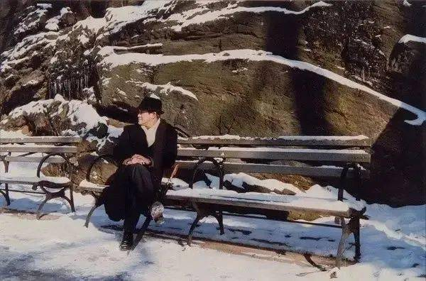
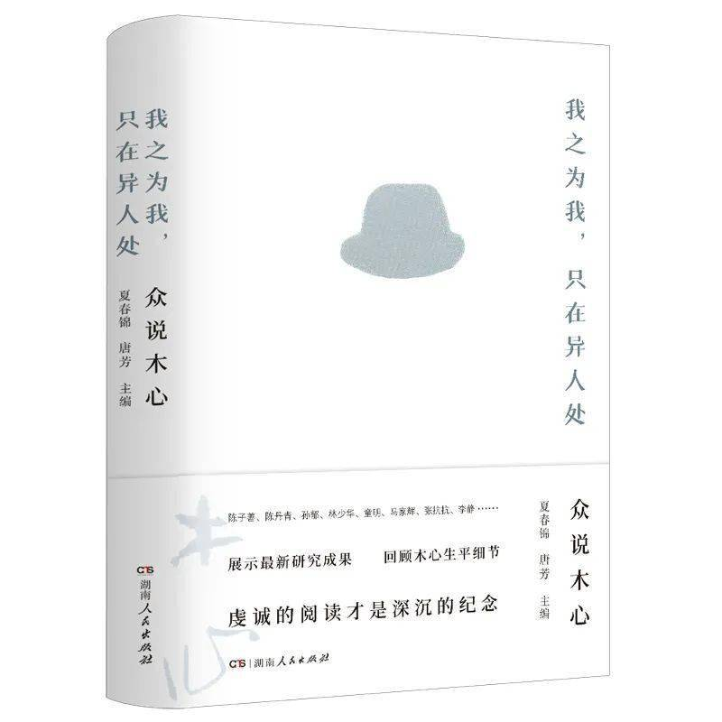

题图：木心

对于木心与中国现代文学，特别是与“五四”文学传统的关系，不同的接受者有着不同的看法。陈丹青曾称木心是“五四”文化的“遗腹子”，这个看法获得了不少读者的认同。但另一位木心的推崇者，加州大学洛杉矶分校的童明教授对此则有不同看法。他认为“五四”文学“反映现实的主张、政治化的倾向，至少是淡化了美学思维”，特别是二分法的逻辑，将传统与现代、“民族化”与“西化”对立，这显然与木心风格截然不同。

在木心这里，传统与现代、民族与西方是可以对话、相互翻译的关系。因此，童明将木心看成是世界性的作家，是以“世界性美学思维振复汉语文学”，“使自己的民族文化获得飞散式繁衍和拓展”的飞散作家。

通过阅读木心的作品，我们确实可以鲜明地感受到木心风格中的某些“五四”遗风，可以说那个时代的思想意趣已经深深地在木心身上打下了烙印。但木心的价值不在于他继承了这一时代的特征，而恰恰在于他最终跳出了这一时代的限制，从而实现了中国传统文化和西方文化的沟通。

对于“五四”知识分子而言，传统和现代之间始终存在着巨大的鸿沟，以至于如何实现中国传统文化的现代性转化成为“五四”知识分子的普遍性焦虑。也曾有知识分子提出“以审美代宗教”这样的主张，试图以美学来整合西方和传统两种文化资源，但最终被证明这只是理想化的口号。

但木心以天赋的艺术感悟力在其个人身上完成了两种文化资源的整合，以其独特的艺术创作，将传统与现代、中国与西方进行了文化焊接。

在木心所有的创作中，诗歌大概是最引人关注的文体，木心诗歌中有一大部分是通过互文性写作完成的。木心诗歌的前文本涉及面甚广，包罗古今中外许多知名或不甚知名的作品，其中周作人的散文是木心诗歌创作的一个非常重要的文本资源。

在此我们通过对木心诗歌和周作人散文的互文性解读，来探讨木心的创作与“五四”文学传统的联系与区别。

木心生前很在乎读者对自己作品的反应，他看重读者，也对他们寄予厚望。木心以卓尔不群的才识与风度被广大读者注目。这里所汇集的主要是一批专业的读者，如陈子善、孙郁、童明等，他们从各自的角度谈了对木心其人其作的看法，其中多有可观者。此外，还有在木心晚年的艺术生涯中扮演过重要角色的三位当事人陈英德、陈丹青、陈向宏的文章，读者借此可以看到久违的相遇与相知。

本书辑收入对木心生平往事的回忆与解说，第二辑收入孙郁、李静等人对木心的综合性评述，第三、四辑收入对木心具体作品的学术性评论，第五辑收入对其画作与音乐作品的解析，第六辑收入关于木心纪念馆与美术馆的篇什，对于读者理解木心不无裨补。

点击文末“阅读原文”亦可购买

▽

木心诗歌与周作人散文的互文性解读

文 | 甘宇慧

来源 | 领读

**01**

**周作人散文对木心诗歌创作的影响**

任何一位熟悉周作人的读者，在阅读木心的诗歌时必然会迅速辨别出，其中有许多作品源于对周作人散文的改写。

目前广西师范大学出版社一共出版了木心的六部诗集，其中《云雀叫了一整天》这部诗集比较集中地出现了木心对周作人散文的改写作品。另外在诗集《巴珑》中也有部分作品改写自周作人散文。

《云雀叫了一整天》甲辑共一百零三首诗，其中至少有二十三首可以在周作人的散文中找到出处。《巴珑》共三十五首诗，其中有六首与周作人的散文相关。这个比例不可谓不高。

另有研究者指出木心的一些散文及俳句的创作也与周作人散文有相当密切的关系，由此可见，周作人的散文作品对木心创作的深刻影响。

在“五四”以来的中国现代作家中，能如此清晰地在木心的创作中留下深刻痕迹的只此一人。尽管木心在被要求“讲讲对你有影响的作家”时，他表示喜欢鲁迅和张爱玲，但木心本人的创作风格与这两位都相去甚远，反而是被他认为“没有创作性，只是闲谈”的周作人与木心本人的创作密切相关，这其中的意味很是值得探究。

木心对周作人的接受和拒斥在某种程度上体现出木心对文艺创作的独特理解，通过对木心诗歌和周作人散文的互文性解读，我们大概可以了解木心接受了什么，又在拒斥什么。

也许正是在这种接受和拒斥之间，木心呈现出其“世界性的美学思维”，并以此克服了中国与西方、传统与现代的鸿沟。

互文性是在西方结构主义和后结构主义思潮中诞生的一种文本理论。20世纪70年代，美国批评家哈罗德·布鲁姆把互文性理论运用在诗歌领域中并由此发展了互文性理论的内涵和外延。

在《影响的焦虑》（1973年）中布鲁姆提出“对抗式诗学”影响理论，他提出诗歌文本之间存在相互影响的关系，后起诗歌文本的生成与其前驱的文本形成一种对抗关系，而非单一的继承关系。

布鲁姆的互文性理论意味着每个诗人的成就都是在与前驱者的斗争中获得的，后来的作者正是在这种对抗中建立起自己的诗歌领地。木心的诗歌文本对前文本的改动或者修正，恰恰呈现出作者强烈的自我意识。他对周作人的否定意见体现出了在这种继承与对抗关系中的微妙心理。

**02**

**木心对周作人散文的文本选择**

木心擅长在散文语言中捕捉有诗意的片段加以裁剪、拼贴或增补，以此形成符合自己趣味的新的诗歌文本。他在选择周作人的散文文本进行自己的诗歌创作时，对作品的选择显然有着他自己的美学判断，从中我们也大概可以看到木心的文学倾向。以诗集《云雀叫了一整天》为例，其中与周作人相关的诗歌大致可以分为以下两种类型：

第一类为呈现个人的日常生活细节。

这一类作品原文本多出自《知堂回想录》，如《道路的记忆》《知堂诗素录》《路菜》《好吃》《辛亥革命》《北京秋》《城和桥》《1901》等，诗中透出木心对日常生活细节兴致盎然的关注。在车上吃了一路的炒面和汆鸡子，买英文报、日本点心和法国酒，惠民桥下的船，鼓楼的油鸡卤鸭，扬州茶馆的素包子，杭沪道上的糕团，香菇虾米笋干制成的路菜，校门口的侉饼，这些是周作人的深刻记忆，也是木心阅读周作人的重要节点。

在木心眼里，这个周作人不是文学史中的著名作家，也不是民族史中的历史罪人，而只是一个纯粹的在感受、品味和记录个体生活的人。即使是辛亥革命、“三一八”惨案这样的重大历史事件，木心关注到的，依然是其对个人日常生活的影响。

且看《北京秋》的最后一节：

海淀的莲花酒颇有名

买了，不佳，我喜欢白兰地、苦艾酒

近来有机制酒税，价大涨，买不起

那时候正是“三一八”之年

冯玉祥的国民军退守南口

张作霖的奉军和鲁军进占北京

也就是所谓“履霜 坚冰至”的时期了

《北京秋》的原文本是周作人于1926年10月30日写给“怀光”的信，木心将之删改成诗，诗的最后一句则是用了《知堂回想录》一五三“坚冰至”一节的首句。

在《知堂回想录》“坚冰至”一节中周作人回忆了李大钊的一些往事及其被捕就义前后的情形，并借由《周易》的“履霜 坚冰至”来形容当时整个政治局势的日趋恶化。

然而在木心的《北京秋》中，将这个句子与周作人在写给“怀光”的信中所述的个人日常生活细节相连，使“坚冰至”一语呈现出了另一种个体意义上的解读。

第二类多为呈现文人的生活情趣和艺术见解。

这一类作品有描写山居清苦闲趣的《白香日注》《甲行日注》，有表现日常审美意趣的《谑庵片简》《天慵生语》《京师五月》《清嘉录（其二）》，有描写风景胜地的《西湖》《清嘉录（其一）》《浣花溪归》，有记录闲文轶事的《哈里逊的回忆》《香奁新咏》《明季乡试》，有反映艺术见解的《永井荷风的日本国》《古希腊》《浮世绘》等。

值得注意的是，这一类作品的原文本并不都出自周作人，除《古希腊》一诗原文为《知堂回想录》所有外，其余各篇都是出自周作人文中引用的或周作人曾经推荐赞赏过的前人文本。

如《天慵生语》出自李渔的《闲情偶寄》，《浣花溪归》出自钟惺的《浣花溪记》，此二者都是周作人推崇的明人小品之代表作。而另一些作品则可以在周作人的文中找到其摘录引用的片段，列举如下：

<table><tbody><tr><td>
<strong>木心诗歌</strong>
</td><td>
<strong>周作人散文</strong>
</td><td>
<strong>周作人文中摘录的文本</strong>
</td></tr><tr><td>
《哈里逊的回忆》
</td><td>
《希腊神话一》

（《夜读抄》）
</td><td>
哈里逊《学者生活之回忆》
</td></tr><tr><td>
《永井荷风的日本国》
</td><td>
《日本管窥之四》（《知堂乙酉文编》）及《知堂回想录》中皆有引用
</td><td>
永井荷风《江户艺术论》
</td></tr><tr><td>
《白香日注》
</td><td>
《游山日记》（《风雨谈》）
</td><td>
舒白香《游山日记》
</td></tr><tr><td>
《香奁新咏》
</td><td>
《洗斋病学草》（《苦茶随笔》）
</td><td>
胡寿颐《洗斋病学草》
</td></tr><tr><td>
《京师五月》
</td><td>
《燕京岁时记》（《风雨谈》）
</td><td>
富察敦崇《燕京岁时记》
</td></tr><tr><td>
《杨子九记》
</td><td>
《杨大瓢日记》（《立春以前》）
</td><td>
杨大瓢《杨子日记》
</td></tr><tr><td>
《西湖》
</td><td>
《文饭小品》（《夜读抄》）
</td><td>
王思任《文饭小品》之《游杭州诸胜记》
</td></tr><tr><td>
《甲行日注》

《甲行日注又》
</td><td>
《甲行日注》（《夜读抄》）
</td><td>
叶绍袁《甲行日注》
</td></tr><tr><td>
《明季乡试》
</td><td>
《如梦录》（《苦竹杂记》）
</td><td>
无名氏《如梦录》之《试院纪》
</td></tr><tr><td>
《谑庵片简》
</td><td>
《关于〈谑庵悔谑〉》（《瓜豆集》）
</td><td>
王思任《文饭小品》中一则尺牍
</td></tr><tr><td>
《浮世绘》
</td><td>
《关于命运》（《苦茶随笔》）以及《知堂回想录》中皆有引用
</td><td>
永井荷风《江户艺术论》
</td></tr><tr><td>
《清嘉录（其一）》
</td><td>
《清嘉录》（《夜读抄》）
</td><td>
顾禄《颐素堂丛书》之《省闱日纪》
</td></tr><tr><td>
《清嘉录（其二）》
</td><td>
《清嘉录》（《夜读抄》）
</td><td>
顾禄《清嘉录》卷五
</td></tr></tbody></table>

从以上文本可以看到，木心在利用周作人的散文进行诗歌再创作时，他对原文本的选择有着明显的个人审美偏好。他所选的这些文本基本上是周作人在20世纪30年代以后的创作，这一时期的周作人已经完全改变了早期散文“浮躁凌厉”的战斗文风，开始了一种非常纯粹的小品文写作。

有研究者认为，周氏兄弟的文学实践发展到20世纪30年代就形成了新文学传统的两大流脉，鲁迅是从褒扬古希腊的斯巴达精神出发而形成的激进的战斗传统，周作人则是从雅典精神出发而形成的“爱智”传统。

用周作人自己的话来讲，这是个“文士早已歇业”的时代，知识分子“仿佛可以称作爱智者，此只是说对于天地万物尚有些兴趣，想要知道他的一点情形而已”。相比于“五四”时期，20世纪30年代的周作人更多地退回到书斋，以闭门读书来实践自己的价值取向。这一时期，周作人的散文一方面开始着眼于书写“草木虫鱼”，捕捉日常生活细节的审美意趣，倡导生活的艺术；另一方面，他开始在文中大量摘录晚明文人的散文小品，并将“五四”新文学看成是晚明“独抒性灵”的文学主张的复活。

木心虽然推崇鲁迅，但从他对周作人散文文本的选择来看，显然其文学审美更倾向于周作人的“爱智”传统，而周作人在晚明小品文中发掘的个性主义精神也获得了作为个人主义者的木心的深刻共鸣。个人化的文学视角、对文学趣味的关注、对生活的艺术之重视，这是木心诗歌和周作人散文呈现出的共同的文学倾向。

**03**

**木心诗歌对周作人散文的删改与重构**

从互文性的角度来看，木心的诗歌创作与周作人的散文创作方法如出一辙。1930年，周作人写过一篇文章《论剽窃》，文中引用英国乔治·隆（George Loane）的一段文字：

剽窃，即是抄袭移用别个作家的文句与意思。弥耳登说，“文人间的借用，如借用者不能运用得更好，是即为剽窃”。

现在来讨论这件事的是非，系属无用。作家向来常互相抄袭，无论是意识地或非意识地，而且将来也总常要如此……汤姆生说，“在文学上，斯巴达的法律一样有效，在这里偷窃是体面的事情，只要做得巧妙好看，因此麦加利是偷儿和诗人两者的祖师”。

……有人或者觉得受了欺骗，看出创作的诗是这样构成的，但也有人看见旧识的珍宝装在新的座盘上的时候，感到一种特别的愉快。真诗人的借用并不是为省麻烦。假如有人以为用了别人的文句做成好诗是很容易的事，那么让他去试试看。

周作人对此发感慨说：“什么事都可以做，只要做得巧妙好看便都是对的，不过有些事总不能巧妙好看地做，那么这些事还是不做好，即使未必就是不对。”木心显然对此观点深以为然，他说：“所以天才者，就是有资格挪用别人的东西。拿了你的东西，叫你拜倒。世上只有这种强盗是高贵的、光荣的。”

周作人后期的散文以“文抄公”体而著称，其化前人文章为己用的本领在现代文学史上无出其右者。周作人抄前人文章以寄寓自己的观点和情感，形成了其苦涩而丰腴的独特文风。木心在挪用周作人的文章时通过对原文本的删改和重构表达了自身的审美经验和个体情感，同样形成了木心式的独特风格。

木心对周作人散文文本的删改和重构，除了淬炼文字使其更符合诗歌的表达之外，还表现出以下两个方面的特征：

第一，摒弃原文本中的议论成分，只保留纯粹的描写和叙述。周作人的散文或其散文中摘录的文章，其内容或多或少都带有议论的成分，作者往往借着这一点议论或鲜明或婉转地来传递心曲、表达观点。

到了木心这里，这一点议论大多是删去了的，于是诗歌就变得更纯粹和唯美，散文中的批判意味却消散了。此类例子很多，取《香奁新咏》为例，这首诗描写叙述“俏三寸”“玉搔头”“侧托”“齐眉”等妇人妆奁之物，写其形态、颜色、质地，别无一语议论。

这首诗原文出自周作人抄录的其同乡胡寿颐的诗文《洗斋病学草》，比较周作人的散文文本可以看到，周作人在抄录原文后有这样一段议论：“我不知道何以大家多不喜欢记录关于社会生活自然名物的事，总是念念不忘名教，虽短书小册亦复如是，正如种树卖柑之中亦寄托治道，这岂非古文的流毒直渗进小说杂家里去了么。”这一段议论鲜明地表达了作者对“文以载道”观念的批评，周作人的文章虽关注生活琐事，却也有借此进行文化批判的用意。而从木心的诗歌中我们只能看到其对日常生活审美的玩味，除了个人趣味以外，看不到任何的批判意味。

这样的特点在《东京淫祠》《永井荷风的日本国》《浮世绘》等诗歌中也都很明显地体现出来。这几首诗的文字分别出自永井荷风的《东京散策记》和《江户艺术论》中的一些片段。

20世纪30年代以后，永井荷风成为周作人文章中提到最多的日本作家之一，这两篇文章也被周作人在自己的散文中反复引用。周作人在提及永井荷风时，强调了荷风对日本政治与文化的消极态度：“几乎表示极端的憎恶。”为此他在介绍《东京散策记》时特地引用《江户艺术论》中有关浮世绘鉴赏的话来说明这一点：

假如在木版画的瞌睡似的色彩里也有制作者的精神，那么这只是专制时代萎靡的人心之反映而已。这暗示出那样黑暗时代的恐怖与悲哀与疲劳，在这一点上我觉得正如闻娼妇啜泣的微声，深不能忘记那悲苦无告的色调。

永井荷风在书写花鸟风月的背后所隐藏的痛苦使周作人将之视作自己的知己，在他的多篇散文中几乎完整地引用了《江户艺术论》里关于浮世绘的鉴赏的内容，从而呈现出一个敏感细腻又充满痛苦的唯美主义作家的灵魂。

与之相比，木心的诗歌更关注的是永井荷风散文中更富有艺术性的一面，所有关于现实政治的思考议论都被去除了，留在木心诗中的只有唯美细腻的文字、人情风物的描写和惆怅微渺的抒情。

借由永井荷风的文字，周作人呈现了他苦涩丰腴的文风，木心却去除了其中的苦涩味，呈现出纯粹的清雅唯美的艺术追求。

第二，忽略原文本的背景因素，使文本脱离原有的解读空间。

木心在运用原文本进行诗歌创作时，常常对原文本不加说明，这使得诗歌完全脱离了原作者在创作时的背景因素，一定程度上削弱了文本的现实意义和丰富内涵，但另一方面也更凸显了文字本身的艺术魅力。以《甲行日注又》为例，木心的诗如下：

十日丁巳 晴

初闻黄鹂声

犹忆离家日听雁也

十七日丙辰 晴风

中夜偶起 白月挂天

洑流薄岸 村犬遥吠

读木心此诗，只觉言辞清丽，情思怅然，寂寥山景与思乡之意浑然一体。但除此之外，读者无法从诗歌中获得更多的信息。

木心此诗为删改明末遗民叶绍袁《甲行日注》中丙戌二月初十日和丁亥七月十七日的二则日记并重构而成。若读周作人《夜读抄》中《甲行日注》一文，读者即可知叶绍袁写此日记的背景。

周作人在介绍了叶绍袁的生平情况后进一步说明道：“《甲行日注》里所记的是明遗民的生活，所以第一显著的当然是黍离麦秀的感慨，而这里又特别加上种族问题，更觉得痛切了。”

在抄录了以上二则日记后，周作人更是评点道：“文词华丽，意思亦不外流连景光，但出在遗民口中，我们也就觉得他别有一种感慨，不能与寻常等视。”

此番评点将叶绍袁的日记置于更大的解读空间中，使其拥有了更为丰富的意义。周作人抄录叶绍袁的日记，既取其黍离麦秀之慨，也取其困穷与闲适之趣，其中借他人文字抒自己之情的意思是很明显的。

而木心的诗只取其困穷中的闲适心态，未见其痛切孤愤之情；只取其个人之思，未见其家国之痛。两相比较，木心与周作人的文艺观念和文学倾向的差别亦可见端倪。

木心的诗歌轻灵而唯美，以个体的艺术飞翔避开时代的沉重问题，为自己构建了一个艺术的乌托邦；与之相比，周作人虽也躲在书斋里希望以生活的艺术为自己建造一个避难所，但曾经的“流氓鬼”气息使他终究不能完全放弃对现实问题的关注，彻底投入艺术的审美世界中去。这也正是木心对周作人否定的部分。

**04**

**结语**

“五四”文学传统中包含着“启蒙”的文学和“个性”的文学两个方面，在20世纪20年代中期以后，周作人逐渐对文学的启蒙作用产生了怀疑，并进一步发展了其“个性的文学”的主张。

他认为“个性是个人唯一的所有，而又与人类有根本上的共通点”，对于中国文学中“言志”传统的发扬正是其个性主义文学思想的表现，也是其试图打通传统与现代的一种努力。

如果说木心身上呈现了“五四”文学的影响，那么毫无疑问，他继承的正是“五四”传统中“个性”的文学的一面。但作为一个个人主义者的木心，他与“五四”一代文人最大的区别在于，他身上没有“五四”文人所普遍背负的时代的重任。

面对沉重的时代，周作人身上还有着中国传统知识分子“以天下为己任”的使命感，而木心却拒绝这种承担。

所以当启蒙的理想褪色，文学艺术只能退回到书斋中拯救个体的灵魂时，周作人饱含苦涩，木心却视为理所应当。周作人的散文貌似闲适却仍在大地上跋涉，木心的诗歌早已轻灵地在天空中飞翔。

木心卸去了文学背负的责任，还原文学作为艺术的本相，以艺术的翅膀飞出时代的迷楼，或许，这也正是其得以沟通传统与现代的秘诀。

THE END
