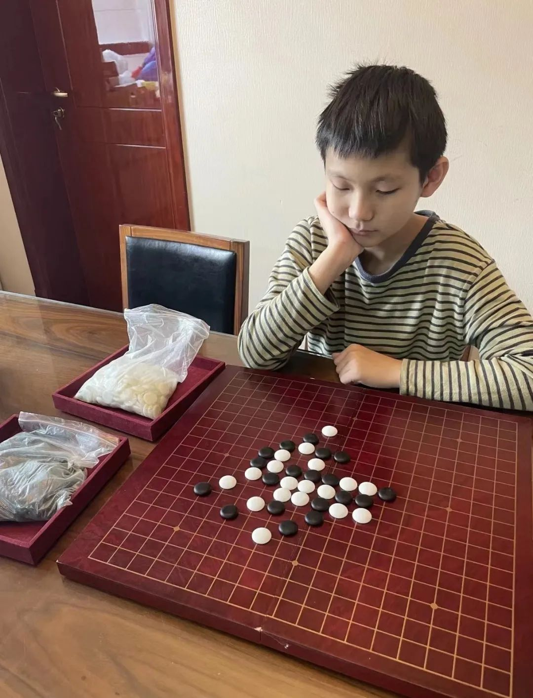

不久前，四年一届的全国智力运动会落幕，上海代表团以13金9银9铜的优异成绩取得金牌数、奖牌数、总分三项第一，连续第五届领跑金牌榜。

在上海代表团中有一位个性安静腼腆却又坚韧的十四岁少年，他和队友一起过关斩将夺得五子棋少年男子团体第一。这个少年就是上海市静安区风华初级中学西校初二学生**朱泓铭**。

**\-壹\-**

**意外踏入“五子连珠”的世界**

沉浸在“五子连珠”的黑白世界里已有六年的朱泓铭说：“接触五子棋纯属意外。”

小学二年级时，朱泓铭所在的学校有门拓展课——五子棋。五子棋怎么下？好玩吗？一个个小问号驱使朱泓铭选择了这门课。从此他走进了一个225个棋子纵横的世界，也结识了他的启蒙老师时任静安区五子棋队教练的吴杰老师。

五子棋上手简单。一开始，朱泓铭和拓展课上的同学都觉得这就是一项普通的棋类游戏，没什么特别。但随着课程的深入，**朱泓铭发现五子棋是一项非常费脑子的智力运动，下五子棋充满了刺激，高手过招每一步都要经过长时间的计算和思考**。黑白双方的紧张博弈和瞬息翻转的乐趣让朱泓铭体会到五子棋的魅力。

在学习过程中，吴杰教练也慧眼识珠发现了朱泓铭的天赋，吸收他进入上海市静安区青少年五子棋区队。进入初中后，朱泓铭被评为上海市二线运动员，并成功入选上海市队。

**\-贰\-**

**失利也是动力**

**“五子棋可以让我更专注于棋盘。”**在学习五子棋的这段时间里，朱泓铭不仅学习到了下棋的技术，还锻炼了计算能力、抗压抗挫能力和时间管理能力。加入市队后，朱泓铭花费在五子棋上的时间更多了，周五半天加周日全天他都要参加训练。每天他还要花半小时到一小时拆棋、研究棋谱。**“****这也让我提高了学习的效率。”**虽然初中的作业量翻番，但因为要参加训练朱泓铭总会在周日前就把作业完成。

今年10月，第五届全国智力运动会在安徽合肥举行，比赛设围棋、象棋、国际象棋、桥牌、五子棋、国际跳棋六个大项。此前四届智运会，上海代表队都领跑金牌榜。能入选本届智运会上海代表队，朱泓铭既紧张又兴奋。比赛前他和8位队友一起集训时，就感受到了大赛将至的备战气氛，“这是我从未感受过的”。

个人赛中，朱泓铭前9轮后处于不错的位置，最后两轮不出意外他有很大的机会能争夺前三。然而第10轮进行到后半盘时,朱泓铭一不留神被对手杀成功。这一轮的失利对他的打击很大。没能调整好心态的朱泓铭最后一轮败下阵来。虽然个人赛没有取得前三，但朱泓铭遇强则强的斗志却在一点一点被激发起来，他对自己说：**“既然个人赛跌入谷底，那就在团体赛再站起来。”**

朱泓铭及时调整心态，让自己保持既兴奋又冷静的状态。在团体赛中朱泓铭发挥亮眼，多次在关键战中获胜，尤其是倒数第二轮对阵浙江的关键战。上海队必须赢下这轮才能重回领头羊的位置。朱泓铭的两位队友一位获胜、一位失手，所以他只能获胜。这一次压力没有把朱泓铭压倒，他漂亮地战胜了对手，帮助上海队站上了冠军领奖台。

编　　辑丨苏　洋（中国传媒大学站）

校　　对丨魏金宇

校　　审丨雷智颖

值班编委丨曾　锐  张巧云

