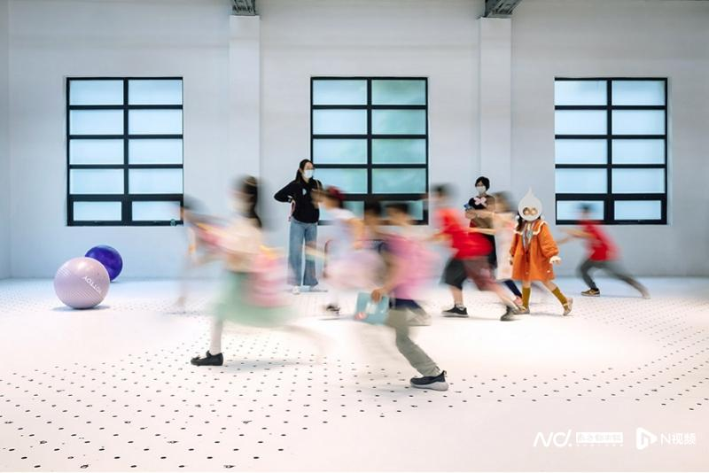

在上海，有一家特别的博物馆，展示着玻璃的过去、现在和未来。

上海玻璃博物馆位于宝山区长江西路685号，在上海玻璃仪器一厂的原址上改造建成，于2011年开馆，被美国CNN旗下网站评选为中国最不容错过的三个博物馆之一。

馆长张琳和玻璃的故事始于偶然，学习无机材料的他，无可救药地爱上了玻璃这种材料。他对玻璃的认识，从物性，发展到美；从器具，生成艺术。在他看来，上海玻璃博物馆的一种使命，就是分享玻璃的无限可能。

2022年是联合国国际玻璃年，在上海玻璃博物馆成立十一周年前夕，南都记者对话馆长张琳。他的讲述闪烁着玻璃的盈盈光彩，也让记者意识到，只有走出玻璃的日常，才能发现玻璃的非常之处。

上海玻璃博物馆。受访者供图

**玻璃是上帝带给人类的礼物**

**南都：请先分享一下您个人和玻璃的故事，对玻璃这种材料的认识经历了什么变化？**

**张琳**：我跟玻璃接触将近四十年。我是60后，（上个世纪）80年代读的大学，那个时候还没有感性认识，只是因为我念理工科，比较喜欢化学，老师给我提了建议，然后糊里糊涂填了志愿，去当时还叫华东化工学院的华东理工大学念的无机材料专业。一打听才知道其实是学玻璃的，就这样和玻璃结缘。

我毕业后分配到玻璃工厂。职业生涯的第一个十年，是和玻璃的制造业发生关系。后来因为玻璃制造能耗高、附加值比较低，第二个十年我就转型做玻璃的进出口贸易。第三个十年，我创办了玻璃博物馆，跟玻璃的艺术和文化产生了关联。我这辈子都跟玻璃有缘，只不过是从玻璃日常的物性的材料，慢慢变成了艺术上、精神方面的理解。

**南都：如果用一个特性来区分玻璃和其它材料，您觉得是什么？**

**张琳：**是透明。我一直说玻璃是上帝带给人类的礼物，人类利用玻璃透明的特性解决了很多问题。比如说新冠疫情，我们为什么能够知道是什么病毒？靠的就是显微镜，可以看到非常细小的东西，区分出奥密克戎和德尔塔。通过玻璃还可以仰望星空。人类还发明了望远镜，知道地球原来是圆的，是太阳系里的一颗行星。

我相信联合国把今年命名为国际玻璃年，是因为大家都知道玻璃确实为人类提供了非常大的益处。人类发现玻璃已经有四千多年的历史，仍然在不断地探索玻璃的各种特性。但我认为最重要的就是透明，人类通过透明的玻璃去看世界，不管是缩小还是放大，都拓展了认知的边界。

上海玻璃博物馆馆长张琳。受访者供图

**玻璃艺术化是一条漫长的路**

**南都：玻璃艺术能否理解为玻璃工业的产物？**

**张琳：**你的这个猜测还是非常有道理的。玻璃创作对技术的依赖很高，只有掌握了玻璃的材料特性，才有可能利用玻璃进行艺术创作。

在做上海玻璃博物馆之前，我去考察了世界上跟玻璃艺术有关的很多国家。比如美国，是最早把玻璃工业转移到其它国家的国家，它也是玻璃工业最成熟的国家。六十几年前，美国人发现玻璃这种材料是可以用来做艺术创作的。当时美国兴起了玻璃工作室运动，一些大学开设了玻璃艺术相关的课程，代表人物是戴尔·奇胡利(Dale Chihuly)，在西雅图就有一个以他名字命名的玻璃博物馆，展出很多很炫的玻璃艺术作品。现在光西雅图这一个城市，大概就有七八十个玻璃窑炉，为艺术家提供创作的平台。

其它国家走的也是这条路，把玻璃制造业转移出去之后，从玻璃工业朝玻璃艺术方向转化。大概十年前，我去德国，在靠近捷克的地方有一家玻璃博物馆，它和美国玻璃艺术有合作，那个区域过去也是德国玻璃工业重要的生产基地，慢慢地也转化成为玻璃艺术和玻璃文化的平台。

**南都：国内玻璃艺术的发展情况怎么样？**

**张琳：**目前国内更多的是在大专院校的美术学院，大概有二十几所大学有玻璃艺术的专业和玻璃工作室。上海大学大概是国内第一个引进玻璃工作室的大学，到现在正好发展了二十年的时间。

跟陶瓷一样，玻璃工艺品和艺术品的范畴界定也很模糊。因为要让日常的物质材料艺术化、精神化，我认为是不容易的。这个难题不单是国内，国际上也存在。举个例子，捷克是玻璃的制造大国，每年会举行一些重大的跟玻璃有关的活动，但是很多作品其实还是在工艺品的范畴里，还是在跟日常的物性相联系，和艺术的精神性的可能还有一定距离。

我认为，艺术化是一条漫长的路，不可能把本来做玻璃瓶的工厂转化为做艺术品的工厂，因为艺术是更个体的创作，工厂是集体化、讲究协作的生产模式，这两者很难划等号。

**南都：我注意到上海玻璃博物馆保留了原生态工厂，这是出于什么考虑？**

**张琳：**今年是我做上海玻璃博物馆的第十一年，我本人对博物馆的理解也经历了一个过程。我们的原址是以前的上海玻璃仪器一厂。一开始做玻璃博物馆项目的时候需要空间，他们就搬到别的地方。后来我感觉还是更需要留下一些原来的东西，所以五年前又把他们请回来，变成作坊型的玻璃仪器加工点。我们跟他们有一个协议，就是可以让我们上海玻璃博物馆的观众去参观工厂的制作过程。相对的，我们会收取比较便宜的租金。

非常多的参观者，特别是艺术家，都非常喜欢原生态工厂。因为那里代表了上海的过去，代表了上海玻璃博物馆的过去。

**庆祝玻璃的过去、现在和未来  

**

**南都：您怎么理解今年国际玻璃年“庆祝玻璃的过去、现在和未来，共创可持续、公平和更美好的明天”的主题？**

**张琳：**国际博物馆协会（ICOM）下面专门有一个玻璃的专业委员会，我们上海玻璃博物馆既是ICOM的成员，也是玻璃专业委员会的成员。今年国际玻璃年的名称其实是ICOM在2021年5月18日，即去年世界博物馆日当天公布的。玻璃这种材料为什么能够得到联合国这样的认可？其实和西方人对玻璃的热爱有关，像我们对陶瓷的感情类似，他们对玻璃有文化上的情节。当然玻璃确实是从西方流传到东方来的。

我认为玻璃的过去、现在和未来，是和人类使用玻璃的历史密切结合在一起的。从人类发现玻璃这种材料，一开始可能就是装饰品，然后是工艺品，再变成日用品，现在是在朝艺术和科学这两个领域去发展。上海玻璃博物馆有一个展厅，专门讲从日常生活到科学前沿，人类和玻璃是如何密切相关的。

**南都：上海玻璃博物馆有准备哪些和国际玻璃年主题相关的展览？**

**张琳：**我们有准备一些活动来配合，第一个是“玻璃百分百”展览。玻璃其实是一种可以100%被回收的材料，我们把回收玻璃的内容数据化、事实化，把展览做成一个和环保、低碳相结合的有教育意义的事情，让参观者了解到如果自己能够去做一些玻璃回收，对人类的环境会带来非常多的益处。这个展览用的砖，也是我们去和景德镇的陶瓷工作室合作，把我们的碎玻璃和他们的碎陶瓷合在一起做成的，这种砖将来在建筑上也可以使用。

第二个就是我们会做一个关于原来工厂是怎么一回事的展览。因为大家可能只知道博物馆原址是生产玻璃仪器的工厂，其它的就不太清楚。我们找到过去在上海玻璃仪器一厂工作的，像厂长、技术员等各种类型的人，现在基本上也七、八十岁了，用他们讲的故事，配上找到的老照片，做一个口述史类型的展览。通过这样的展览，让大家了解工厂的原住民，是怎么看待玻璃工厂变成玻璃博物馆，以及上海从工业城市演进成后工业城市。

这两个展览本来打算五月份开展，现在因为疫情的关系，时间可能会延后，但是都会在今年推出来。

**玻璃艺术面向未来，分享可能**

**南都：您之前在文章中提到“玻璃博物馆的一种使命，就是说分享玻璃的无限可能”，能否展开谈谈这样浪漫抽象的说法。**

**张琳：**在一开始做博物馆的时候，我们就在讨论愿景、使命、价值观，能够给大家带来什么？我认为博物馆最重要的一个功能就是分享。这个观念源自于我去大英博物馆的经历，碰到一个能讲中文的志愿者带我参观，还对我讲了大英博物馆成立的故事。1753年有位英国医生，在离开人世前写下遗嘱，把一生收藏的7000箱宝物捐给了英国政府，接下来在市民同意加税盖楼的情况下，两年后有了大英博物馆，大家都可以看宝物。听了这个故事以后我很感动，博物馆通过分享给大家带来的利益远远大于其它功能。

上海玻璃博物馆可以分享什么给大家呢？以我对玻璃的理解，我把它分为科学和艺术两个层面。从科学层面来讲，现在已经有了很多高科技的玻璃，像可以用作激光武器的激光玻璃，还有化学稳定性好、硬度高的玻璃牙齿，博物馆应该把玻璃在科学探索方面的无限可能分享给大众。六年前，我们做了“退火”项目，跟当代艺术家有了一些紧密接触。我认为让艺术家参与项目，等于是探索了玻璃在创造力方面的无限可能。博物馆有这个责任，我们也实实在在地在履行分享的义务。

**南都：“退火”项目的哪个作品给您留下了比较深刻的印象？**

**张琳：**来自北京的艺术家林天苗，她的作品《暖流》被我放在了博物馆的主要位置展示。这件作品有三个层面的含义，第一是所有的玻璃是原生态工厂制作的，它的在地性特别好；第二是这位女艺术家很让我尊重，她为了做“退火”项目，一年中超过一百天待在玻璃博物馆，她从了解玻璃的工艺，到如何把玻璃材料和她的艺术创作做一个结合，花了大量的时间和精力；第三是这个作品的社会性，它把人的个体、群体、社会之间的关系描述得非常好。

林天苗的作品《暖流》。

我对当代艺术家很尊重，也很欣赏。因为他们对一些社会敏感问题，包括人与人之间的关系，他们理解得非常透彻，通过作品也有非常好的表达。

**南都：艺术家对玻璃工业界有什么建议吗？**

**张琳：**至于这个，我觉得艺术家更多的是个体思考，但是他们的创作也能让玻璃工业界去理解什么是玻璃的无限可能。其实做“退火”项目的出发点，没有那么现实。我们资助艺术家，让他们发挥个性去创作，是希望艺术家的创造力能带动玻璃行业，甚至是整个社会，让大家更多地去思考，去做属于自己的东西，而不是抄其他人的作业。

复旦大学艺术哲学系的系主任沈语冰老师来参观以后跟我讲，有一点他非常欣赏，是什么呢？就是玻璃这种古老的材料，我们用来和当代艺术发生关系，而不是去和非遗发生关系。我是怎么回答他的呢，就是作为博物馆，如果做太多总结过去的事情，就不太会面向未来。其实对人类来讲，更重要的是去面向未来。

**疫情下非国有博物馆的生存经验**

**南都：上海玻璃博物馆自2011年建成开馆，到现在成长为国内非国有博物馆的翘楚，您作为创始人可以分享一下经验吗？**

**张琳：**其实我觉得很多事情带有一定的偶然性，但是非要让我分享经验的话，我认为最核心的就是热情。去年底，我接待了中欧工商管理学院的欧方院长，他是市场学的专家，连他都很惊讶我们既不在上海的市中心，也没有政府的资助，作为一个非国有博物馆是怎么生存的？我就和他讲，最重要的就是伟大的热情。因为有了热情，就不会去计较、去考虑各种各样负面的东西，而是会非常积极地去面对碰到的一切困难和问题，想办法达到目标。

上海玻璃博物馆作为一家非国有博物馆，跟有政府拨款的公立博物馆、有集团做财主的私立博物馆都不一样，没有那么多资源，这也逼迫我动脑筋如何走市场化的路。其实上海玻璃博物馆一直在平衡市场化和公益化。从这个角度，如果说我不是全身心投入，不是有这么一股热情，是没法完成这样的任务的。做一件事情需要有热情，能耐得住寂寞，认准一个方向，不断努力，才会成功。

上海玻璃博物馆热力剧场。

**南都：我看完2021年“疫情影响下的博物馆运营和生存”年报发现，在受疫情影响的情况下参观人数比2020年增长了19%，但更惊人的是门票收入增长了80%，上海玻璃博物馆是如何做到的？**

**张琳：**我们地方非常大，是上海玻璃博物馆园区的概念。因为我认为对每个人来讲，时间成本占比很重。从市区开车来宝山，花在路上的时间比较多，那么如果参观时间只有一个多小时，对大家来讲是不划算的。所以我们采取的方法是让参观者在园区待更长的时间。现在的数据是，观众的平均参观时间已经超过四个小时，最多的观众会待上八个小时。让人能待这么长时间，很重要的就是我们需要有足够多足够好的内容去吸引他。

2021年门票收入大幅增长的原因不是因为门票涨价，只是在票务设计上做了结构调整。我们的单馆票是80元，如果买三馆联票是120元，摊下来每个馆40元就比单买划算很多。去年我们就通过票价优惠政策、小程序便捷购票的方式鼓励观众参观更多的馆，门票收入也随之增加。

我们在内容上也继续下功夫，去年升级了园区里的儿童玻璃博物馆。作为国内首创的单独为儿童设计的儿童玻璃博物馆从2015年开始运营，当年我们的儿童观众就仅次于上海自然博物馆。我们希望孩子通过玩，而不是被教育着去认识什么是玻璃。在六年经验的基础上，去年做了提升，可以说把儿童玻璃博物馆打造成为中国最酷的儿童博物馆。除了展陈设计和视觉效果，在内容体验上也希望给观众带来“哇，这个地方好酷”的感觉。内容是非常重要的吸引观众的工具。我可以很自豪地告诉你，今年的虎年春节，上海玻璃博物馆每天参观的人数比上海博物馆多。

儿童玻璃博物馆。

我们还组织了非常多针对孩子的活动。举个例子，去年的暑假可以夜宿博物馆，小朋友在博物馆里搭帐篷过夜。另外我们博物馆的吉祥物玻玻和璃璃，会带着小朋友“环球游”，比如说美国游、日本游，最近在开发西班牙游。虽然现在因为疫情不方便出国，但是可以来博物馆领略不同国家的文化和艺术。

总结来说去年收入增加有三方面的原因，一是票价政策调整，让观众觉得买三馆或者三馆以上的票更优惠；二是在内容方面，把场馆升级成2.0版；三是通过各种各样的公教活动吸引公众。

采写：南都见习记者 赵唯佳 发自上海

编辑：梁建忠
