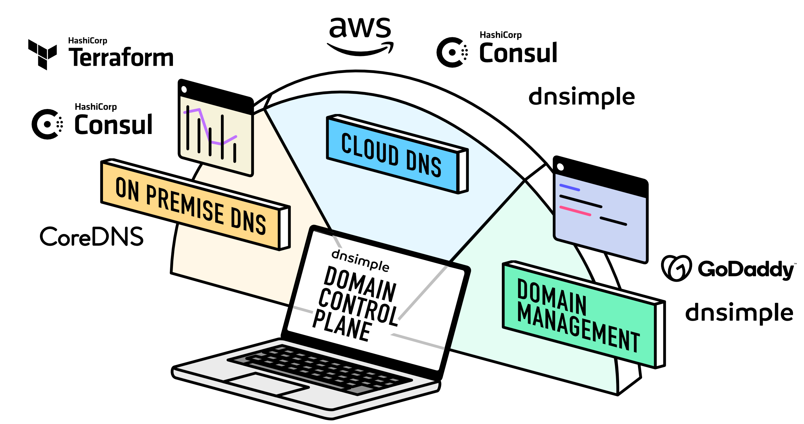

Throughout 2023, the team at DNSimple has been working hard to deliver [new features](https://blog.dnsimple.com/category/features/) that help you manage your domains and DNS inside and outside our infrastructure. Those releases have culminated in the biggest change we've made in the last ten years, and we can't wait to share it with you.  

整个 2023 年，DNSimple 团队一直在努力提供新功能，帮助您管理我们基础设施内部和外部的域和 DNS。这些版本最终带来了我们在过去十年中所做的最大改变，我们迫不及待地想与您分享。

The complexity of managing zones in multiple clouds and on-premise inspired us to create what we're calling the [Domain Control Plane](https://dnsimple.com/products/domain-control-plane), a single pane of glass where you can see and manage all your domains, DNS, and certificates - wherever they live.  

在多个云和本地管理区域的复杂性促使我们创建了所谓的域控制平面，这是一个单一的管理平台，您可以在其中查看和管理所有域、DNS 和证书 - 无论它们位于何处。

The Domain Control Plane gives developers and system admin unprecedented visibility and control into even the most complex domain portfolios — including resources hosted outside DNSimple's infrastructure. No upselling. No convoluted DNS management across multiple providers. Just a simple, clean interface you'll actually enjoy using. Available now on [all plans](https://dnsimple.com/pricing).  

域控制平面为开发人员和系统管理员提供了前所未有的可见性和控制力，甚至可以控制最复杂的域组合——包括托管在 DNSimple 基础设施之外的资源。没有追加销售。无需跨多个提供商进行复杂的 DNS 管理。只是一个简单、干净的界面，您会真正喜欢使用它。现已适用于所有计划。

[RSVP now](https://live.zoho.com/2hsaDeFSDE) for our town hall January 16 at 11AM EST to get an in-depth look at the Domain Control Plane  

现在请于美国东部时间 1 月 16 日上午 11 点向我们的市政厅回复，以深入了解域控制平面

Let's talk more about how we developed the Domain Control Plane, how you can get set up (like everything DNSimple, it's easy), and the two types of Integrated Providers.  

让我们更多地讨论一下我们如何开发域控制平面、如何进行设置（就像 DNSimple 的所有内容一样，这很简单）以及两种类型的集成提供商。

## Manage zones on-premise & in the cloud  

管理本地和云中的区域

We've spoken to hundreds of site reliability engineers and application developers about the challenge of managing zones both on-premise and in the cloud. Cloud providers optimize for their cloud, and on-premise servers often are hard to configure and update, lacking user-friendly tools to manage zones.  

我们与数百名站点可靠性工程师和应用程序开发人员讨论了管理本地和云区域的挑战。云提供商针对其云进行优化，而本地服务器通常难以配置和更新，缺乏用户友好的工具来管理区域。

The Domain Control Plane works by connecting DNSimple via secure APIs to services where your domains and DNS are, then displaying your domains at other providers alongside your DNSimple domains inside DNSimple. Each integration must be connected using service credentials. Once connected, your domains will automatically begin appearing in DNSimple.  

域控制平面的工作原理是通过安全 API 将 DNSimple 连接到您的域和 DNS 所在的服务，然后在其他提供商处显示您的域以及 DNSimple 内的 DNSimple 域。每个集成都必须使用服务凭据进行连接。连接后，您的域将自动开始出现在 DNSimple 中。

It even extends to our API, making it easy to automate your DNS management across multiple providers with the tools you already use with DNSimple — including Terraform, Chef, Kubernetes, and many more.  

它甚至扩展到我们的 API，让您可以使用您已在 DNSimple 中使用的工具（包括 Terraform、Chef、Kubernetes 等）轻松跨多个提供商自动执行 DNS 管理。

The Domain Control Plane comprises Integrated Domain Providers and Integrated DNS Providers. You can register, transfer, renew, and manage domains at [GoDaddy](https://support.dnsimple.com/articles/integrated-domain-provider-godaddy/), an Integrated Domain Provider, directly from your DNSimple account. For authoritative DNS through Integrated DNS Providers, you can manage zones in [AWS Route53](https://support.dnsimple.com/articles/integrated-dns-provider-amazon-route53/) and on-premise [CoreDNS](https://support.dnsimple.com/articles/integrated-dns-provider-coredns/) systems, all alongside your DNSimple zones. Let's take a closer look at these.  

域控制平面由集成域提供商和集成 DNS 提供商组成。您可以直接从您的 DNSimple 帐户在集成域名提供商 GoDaddy 注册、转移、续订和管理域名。对于通过集成 DNS 提供商的权威 DNS，您可以管理 AWS Route53 和本地 CoreDNS 系统中的区域以及 DNSimple 区域。让我们仔细看看这些。

### Integrated Domain Providers  

综合域名提供商

[Integrated Domain Providers](https://support.dnsimple.com/articles/integrated-domain-providers/) lets you use the Domain Control Plane to manage domains registered with domain providers external to DNSimple.  

集成域提供商允许您使用域控制平面来管理向 DNSimple 外部的域提供商注册的域。

Available actions for Integrated Domain Providers include:  

集成域名提供商可以采取的行动包括：

-   **Importing integrated domains**: Link an Integrated Domain Provider to your DNSimple account, and domains registered with that provider will be imported into DNSimple and listed on the Domains page.  
    
    导入集成域：将集成域提供商链接到您的 DNSimple 帐户，向该提供商注册的域将导入到 DNSimple 并在“域”页面上列出。
-   **Viewing and managing integrated domains**: View the expiry date, delegation name servers, domain registration contact, and DNSSEC information of your integrated domains in DNSimple. Manage WHOIS Privacy, renewal, and name servers from the DNSimple dashboard.  
    
    查看和管理集成域：在 DNSimple 中查看集成域的到期日期、委托名称服务器、域注册联系人和 DNSSEC 信息。从 DNSimple 仪表板管理 WHOIS 隐私、续订和名称服务器。
-   **Registering domains**: Learn how to [register a domain](https://support.dnsimple.com/articles/registering-domain) on your Integrated Provider through DNSimple.  
    
    注册域名：了解如何通过 DNSimple 在集成提供商上注册域名。
-   **Transferring your domain to DNSimple**: Read more about [transferring your domains](https://support.dnsimple.com/articles/integrated-domain-provider-transfer-domain).  
    
    将您的域转移到 DNSimple：了解有关转移域的更多信息。
-   **Domain expiration notices**: Get email notifications when your integrated domains are about to expire.  
    
    域名过期通知：当您的集成域名即将过期时收到电子邮件通知。

### Integrated DNS Providers  

集成 DNS 提供商

With [Integrated DNS Providers](https://support.dnsimple.com/articles/integrated-dns-providers/), you can synchronize, manage, and view zones that are deployed in DNS providers external to DNSimple. We call the zones in this case [integrated zones](https://support.dnsimple.com/articles/managing-integrated-zones).  

通过集成 DNS 提供商，您可以同步、管理和查看部署在 DNSimple 外部的 DNS 提供商中的区域。我们将这种情况下的区域称为集成区域。

Available actions for Integrated DNS Providers include:  

集成 DNS 提供商可以采取的行动包括：

-   **Importing integrated zones**: When you link an Integrated DNS Provider to your DNSimple account, zones hosted on that Integrated DNS Provider will be imported into DNSimple and listed on the Zones page.  
    
    导入集成区域：当您将集成 DNS 提供商链接到您的 DNSimple 帐户时，该集成 DNS 提供商上托管的区域将导入到 DNSimple 中并在区域页面上列出。
-   **Managing integrated zone records**: List, create, update, and delete integrated zone records from DNSimple using the [Deployment Editor](https://support.dnsimple.com/articles/deployment-editor).  
    
    管理集成区域记录：使用部署编辑器从 DNSimple 列出、创建、更新和删除集成区域记录。
-   **Syncing integrated zone records**: Sync your zone records from the integrated zone to DNSimple, or from DNSimple to the integrated zone, with the Deployment Editor.  
    
    同步集成区域记录：使用部署编辑器将区域记录从集成区域同步到 DNSimple，或从 DNSimple 同步到集成区域。

The list of supported features and record types differs for each Integrated Provider. Take a look at the provider pages for more information:  

每个集成提供商支持的功能和记录类型列表有所不同。查看提供商页面以获取更多信息：

-   [AWS Route53  AWS 路由53](https://support.dnsimple.com/articles/integrated-dns-provider-amazon-route53/)
-   [CoreDNS  核心DNS](https://support.dnsimple.com/articles/integrated-dns-provider-coredns/)

Your domains, DNS, and certificates will remain with their respective provider. Manage them inside DNSimple with the option to disconnect them at any time.  

您的域名、DNS 和证书将保留在其各自的提供商处。在 DNSimple 内管理它们，并可以随时断开它们的连接。

## Unify your DNS management  

统一您的 DNS 管理

The DNSimple Domain Control Plane unifies your domain, DNS, and certificate management in a single dashboard, even if these resources aren't hosted by DNSimple. You'll be able to see where each domain is with easy to understand metadata in your domain list, clarifying the entirety of your domain and DNS portfolio, and making it all manageable through a single unified API and UI. We'll be adding more providers in the future, and we'd love to hear which ones you'd like included — [let us know](https://dnsimple.com/feedback).  

DNSimple 域控制平面将您的域、DNS 和证书管理统一在一个仪表板中，即使这些资源不是由 DNSimple 托管也是如此。您将能够通过域列表中易于理解的元数据查看每个域的位置，阐明整个域和 DNS 组合，并使其可以通过单个统一的 API 和 UI 进行管理。将来我们将添加更多提供商，我们很想听听您想要包含哪些提供商 - 请告诉我们。

Save the date for our town hall with Anthony, our CEO, on January 16, 2024 at 11am EST. He'll give you a detailed look at the Domain Control Plane, and you'll get the opportunity to have an open discussion about it. We'll have more details soon, but in the meantime, you can register to attend [here](https://live.zoho.com/2hsaDeFSDE).  

与我们的首席执行官安东尼一起预订市政厅的日期是美国东部时间 2024 年 1 月 16 日上午 11 点。他将为您详细介绍域控制平面，并且您将有机会对其进行公开讨论。我们很快就会提供更多详细信息，但与此同时，您可以在此处注册参加。

The DNSimple team is always innovating to offer exciting new solutions to complex DNS management, whether you're working on a single passion project or managing thousands of domains. If you have any questions or want to talk more about your DNS management or the Domain Control Plane, [get in touch](https://dnsimple.com/feedback) — we're always happy to chat.  

DNSimple 团队始终不断创新，为复杂的 DNS 管理提供令人兴奋的新解决方案，无论您是从事单个热情项目还是管理数千个域。如果您有任何疑问或想更多地了解您的 DNS 管理或域控制平面，请联系我们 — 我们总是很乐意与您聊天。

Not using DNSimple yet? Get a firsthand look at the Domain Control Plane, and experience our incredibly simple, streamlined domain management for yourself, [free for 30 days](https://dnsimple.com/signup).  

还没有使用 DNSimpl？亲自了解域控制平面，并亲自体验我们极其简单、简化的域管理，免费 30 天。

Share on [Twitter](http://twitter.com/share?text=Introducing%20the%20DNSimple%20Domain%20Control%20Plane&url=https://blog.dnsimple.com/2023/12/introducing-domain-control-plane/ "Tweet this post") and [Facebook](https://www.facebook.com/sharer/sharer.php?u=https://blog.dnsimple.com/2023/12/introducing-domain-control-plane/ "Share on Facebook")  

在 Twitter 和 Facebook 上分享

#### Anthony Eden 安东尼·艾登

I break things so Simone continues to have plenty to do. I occasionally have useful ideas, like building a domain and DNS provider that doesn't suck.  

我打破了一切，所以西蒙娜仍然有很多事情要做。我偶尔会有一些有用的想法，比如构建一个不错的域名和 DNS 提供商。
