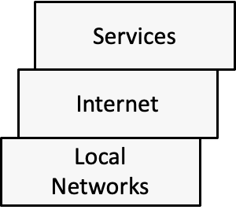
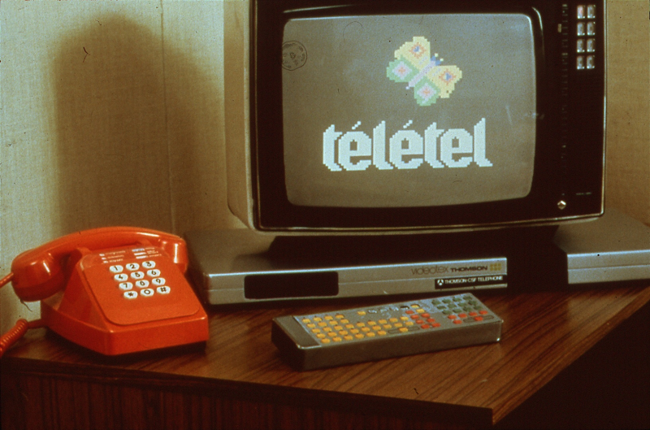

OSI Deprogrammer OSI 解程序器  

Re-conceptualizing cyberspace  

重新定义网络空间

\_\_\_

By Robert Graham 2023-10-01  

作者：罗伯特·格雷厄姆 2023-10-01  

([@erratarob](https://www.google.com/url?q=https://www.google.com/url?q%3Dhttps://twitter.com/ErrataRob%26amp;sa%3DD%26amp;source%3Deditors%26amp;ust%3D1702355435539253%26amp;usg%3DAOvVaw3te0hrcT-CW7ba78JtSQCA&sa=D&source=docs&ust=1702355436125432&usg=AOvVaw0zz99vBvkp7FntfeYS0Rep), @erratarob@infosec.exchange)  

（@erratarob，@erratarob@infosec.exchange）

Original doc [here](https://www.google.com/url?q=https://www.google.com/url?q%3Dhttps://docs.google.com/document/d/1iL0fYmMmariFoSvLd9U5nPVH1uFKC7bvVasUcYq78So/edit?usp%253Dsharing%26amp;sa%3DD%26amp;source%3Deditors%26amp;ust%3D1702355435539905%26amp;usg%3DAOvVaw22RFpYCdlEMyO10ryzqDQ2&sa=D&source=docs&ust=1702355436125605&usg=AOvVaw1sOuCa28KS_FDL-4ghX0xZ). 原始文档在这里。

 

[1\. Abstract        8  1. 摘要        8](https://docs.google.com/document/d/1iL0fYmMmariFoSvLd9U5nPVH1uFKC7bvVasUcYq78So/mobilebasic#h.uwhd2fma7ekp)

[2\. Introduction        9  

2\. 简介        9](https://docs.google.com/document/d/1iL0fYmMmariFoSvLd9U5nPVH1uFKC7bvVasUcYq78So/mobilebasic#h.ezioxomjx0vv)

[2.1. Reader requirements        16  

2.1.读者要求        16](https://docs.google.com/document/d/1iL0fYmMmariFoSvLd9U5nPVH1uFKC7bvVasUcYq78So/mobilebasic#h.67i3ch960aal)

[2.2. Organization of this document        17  

2.2.本文档的结构        17](https://docs.google.com/document/d/1iL0fYmMmariFoSvLd9U5nPVH1uFKC7bvVasUcYq78So/mobilebasic#h.48zm7j2wz366)

[2.3. About the author        18  

2.3.关于作者        18](https://docs.google.com/document/d/1iL0fYmMmariFoSvLd9U5nPVH1uFKC7bvVasUcYq78So/mobilebasic#h.dqaodzkc3pai)

[3\. The OSI Model        20  

3\. OSI 模型        20](https://docs.google.com/document/d/1iL0fYmMmariFoSvLd9U5nPVH1uFKC7bvVasUcYq78So/mobilebasic#h.v0mn9vv05pf8)

[3.1. The basic 7 layers        20  

3.1.基本 7 层        20](https://docs.google.com/document/d/1iL0fYmMmariFoSvLd9U5nPVH1uFKC7bvVasUcYq78So/mobilebasic#h.tujzedtv4asr)

[3.2. Protocols        21  

3.2.协议        21](https://docs.google.com/document/d/1iL0fYmMmariFoSvLd9U5nPVH1uFKC7bvVasUcYq78So/mobilebasic#h.ohg3c5lpfv2p)

[3.3. Where it started        22  

3.3.从哪里开始        22](https://docs.google.com/document/d/1iL0fYmMmariFoSvLd9U5nPVH1uFKC7bvVasUcYq78So/mobilebasic#h.lxusb6n5muzc)

[3.4. The Network Stack        23  

3.4.网络堆栈        23](https://docs.google.com/document/d/1iL0fYmMmariFoSvLd9U5nPVH1uFKC7bvVasUcYq78So/mobilebasic#h.3uuslxqzgdjx)

[3.5. Use as a framework        24  

3.5.用作框架        24](https://docs.google.com/document/d/1iL0fYmMmariFoSvLd9U5nPVH1uFKC7bvVasUcYq78So/mobilebasic#h.dcchd6madj6r)

[3.6. Multi-protocol stack comparison        26  

3.6.多协议栈比较       26](https://docs.google.com/document/d/1iL0fYmMmariFoSvLd9U5nPVH1uFKC7bvVasUcYq78So/mobilebasic#h.4cpvrs9mb6nk)

[3.7. Consensus definition of the 7 layers        27  

3.7. 7 层的共识定义        27](https://docs.google.com/document/d/1iL0fYmMmariFoSvLd9U5nPVH1uFKC7bvVasUcYq78So/mobilebasic#h.y0cw8ekf8g46)

[3.7.1. Application Layer #7        28  

3.7.1.应用层#7        28](https://docs.google.com/document/d/1iL0fYmMmariFoSvLd9U5nPVH1uFKC7bvVasUcYq78So/mobilebasic#h.i6fgqcb7c92p)

[3.7.2. Presentation Layer #6        29  

3.7.2.表示层#6        29](https://docs.google.com/document/d/1iL0fYmMmariFoSvLd9U5nPVH1uFKC7bvVasUcYq78So/mobilebasic#h.ds8mgvnk7x7i)

[3.7.3. Session Layer #5        30  

3.7.3.会话层#5        30](https://docs.google.com/document/d/1iL0fYmMmariFoSvLd9U5nPVH1uFKC7bvVasUcYq78So/mobilebasic#h.llovwdug4u91)

[3.7.4. Transport Layer #4        31  

3.7.4.传输层#4        31](https://docs.google.com/document/d/1iL0fYmMmariFoSvLd9U5nPVH1uFKC7bvVasUcYq78So/mobilebasic#h.lugroz611esi)

[3.7.5. Network Layer #3        33  

3.7.5。网络层#3        33](https://docs.google.com/document/d/1iL0fYmMmariFoSvLd9U5nPVH1uFKC7bvVasUcYq78So/mobilebasic#h.oddx3p7f7q0p)

[3.7.6. Data Link Layer #2        34  

3.7.6。数据链路层#2        34](https://docs.google.com/document/d/1iL0fYmMmariFoSvLd9U5nPVH1uFKC7bvVasUcYq78So/mobilebasic#h.1w11sh44bzqe)

[3.7.7. Physical Layer #1        35  

3.7.7.物理层#1        35](https://docs.google.com/document/d/1iL0fYmMmariFoSvLd9U5nPVH1uFKC7bvVasUcYq78So/mobilebasic#h.or26o3afrjyk)

[3.8. Non-consensus views of OSI        36  

3.8. OSI 36 的非共识观点](https://docs.google.com/document/d/1iL0fYmMmariFoSvLd9U5nPVH1uFKC7bvVasUcYq78So/mobilebasic#h.5vwirhi8r75z)

[3.9. Modern networks        38  

3.9.现代网络        38](https://docs.google.com/document/d/1iL0fYmMmariFoSvLd9U5nPVH1uFKC7bvVasUcYq78So/mobilebasic#h.ipwd4wgyf6aq)

[4\. (simple)  4.（简单）  

Alternative network stack        39  

替代网络堆栈 39](https://docs.google.com/document/d/1iL0fYmMmariFoSvLd9U5nPVH1uFKC7bvVasUcYq78So/mobilebasic#h.4ytcxxls4y27)

[4.1. Network-on-network        39  

4.1.网络对网络        39](https://docs.google.com/document/d/1iL0fYmMmariFoSvLd9U5nPVH1uFKC7bvVasUcYq78So/mobilebasic#h.lzdj5ejf685z)

[4.2. Protocols or sublayers        42  

4.2.协议或子层        42](https://docs.google.com/document/d/1iL0fYmMmariFoSvLd9U5nPVH1uFKC7bvVasUcYq78So/mobilebasic#h.8elhv7ssctey)

[4.3. Upper OSI layer alternative        44  

4.3.上层 OSI 层替代方案        44](https://docs.google.com/document/d/1iL0fYmMmariFoSvLd9U5nPVH1uFKC7bvVasUcYq78So/mobilebasic#h.8679o0tk0zd3)

[4.4. A Packet Network        45  

4.4.数据包网络        45](https://docs.google.com/document/d/1iL0fYmMmariFoSvLd9U5nPVH1uFKC7bvVasUcYq78So/mobilebasic#h.2k0ta9t1tz81)

[4.4.1. A network        45  

4.4.1.网络        45](https://docs.google.com/document/d/1iL0fYmMmariFoSvLd9U5nPVH1uFKC7bvVasUcYq78So/mobilebasic#h.1p55q5gkkjtr)

[4.4.2. A packet        46  

4.4.2.一包        46](https://docs.google.com/document/d/1iL0fYmMmariFoSvLd9U5nPVH1uFKC7bvVasUcYq78So/mobilebasic#h.fgsrcjp0y1zq)

[4.4.3. An address        47  

4.4.3.地址        47](https://docs.google.com/document/d/1iL0fYmMmariFoSvLd9U5nPVH1uFKC7bvVasUcYq78So/mobilebasic#h.aj3xgdfisy09)

[4.4.4. A route or path        48  

4.4.4.路线或路径        48](https://docs.google.com/document/d/1iL0fYmMmariFoSvLd9U5nPVH1uFKC7bvVasUcYq78So/mobilebasic#h.s1mbs0ttcdf)

[4.5. Differences between Ethernet and Internet        50  

4.5.以太网和互联网的区别        50](https://docs.google.com/document/d/1iL0fYmMmariFoSvLd9U5nPVH1uFKC7bvVasUcYq78So/mobilebasic#h.ouhqnnesn7ql)

[4.5.1. What runs underneath        50  

4.5.1.下面是什么内容        50](https://docs.google.com/document/d/1iL0fYmMmariFoSvLd9U5nPVH1uFKC7bvVasUcYq78So/mobilebasic#h.1k7zwqq5yrb)

[4.5.2. Forwarding by address        51  

4.5.2.按地址转发        51](https://docs.google.com/document/d/1iL0fYmMmariFoSvLd9U5nPVH1uFKC7bvVasUcYq78So/mobilebasic#h.78v6h0j1a8u)

[4.5.3. Hop limit        52  

4.5.3.跃点限制        52](https://docs.google.com/document/d/1iL0fYmMmariFoSvLd9U5nPVH1uFKC7bvVasUcYq78So/mobilebasic#h.8jxbxsgxjorf)

[4.5.4. Routing protocols        53  

4.5.4.路由协议        53](https://docs.google.com/document/d/1iL0fYmMmariFoSvLd9U5nPVH1uFKC7bvVasUcYq78So/mobilebasic#h.tpnnm1xo6b7v)

[4.5.5. Transport (simple)        54  

4.5.5。交通（简单）        54](https://docs.google.com/document/d/1iL0fYmMmariFoSvLd9U5nPVH1uFKC7bvVasUcYq78So/mobilebasic#h.1161vysr3exl)

[4.5.6. Naming        55  4.5.6。命名        55](https://docs.google.com/document/d/1iL0fYmMmariFoSvLd9U5nPVH1uFKC7bvVasUcYq78So/mobilebasic#h.qf352cy3p1t2)

[4.5.7. Configuration        55  

4.5.7.配置        55](https://docs.google.com/document/d/1iL0fYmMmariFoSvLd9U5nPVH1uFKC7bvVasUcYq78So/mobilebasic#h.5osoz2r3lz7t)

[4.6. RFC 791        56](https://docs.google.com/document/d/1iL0fYmMmariFoSvLd9U5nPVH1uFKC7bvVasUcYq78So/mobilebasic#h.7ot92z14c1wa)

[5\. (complex)  5.（复杂）  

Alternative network stack        58  

替代网络堆栈 58](https://docs.google.com/document/d/1iL0fYmMmariFoSvLd9U5nPVH1uFKC7bvVasUcYq78So/mobilebasic#h.1wl2taz1msns)

[5.1. My Network Stack        58  

5.1.我的网络堆栈        58](https://docs.google.com/document/d/1iL0fYmMmariFoSvLd9U5nPVH1uFKC7bvVasUcYq78So/mobilebasic#h.a4jgsd9prttr)

[5.2. Sublayers and Protocols        60  

5.2.子层和协议        60](https://docs.google.com/document/d/1iL0fYmMmariFoSvLd9U5nPVH1uFKC7bvVasUcYq78So/mobilebasic#h.sylo0u3nh62t)

[5.3. Payload        62  5.3.有效负载        62](https://docs.google.com/document/d/1iL0fYmMmariFoSvLd9U5nPVH1uFKC7bvVasUcYq78So/mobilebasic#h.xaaeio1n6hl5)

[5.3.1. Data        63  5.3.1.数据        63](https://docs.google.com/document/d/1iL0fYmMmariFoSvLd9U5nPVH1uFKC7bvVasUcYq78So/mobilebasic#h.2off0jodqn91)

[5.3.2. Requirements        64  

5.3.2.要求        64](https://docs.google.com/document/d/1iL0fYmMmariFoSvLd9U5nPVH1uFKC7bvVasUcYq78So/mobilebasic#h.desd2n1oqnse)

[5.3.3. Payload Protocols        65  

5.3.3.有效负载协议        65](https://docs.google.com/document/d/1iL0fYmMmariFoSvLd9U5nPVH1uFKC7bvVasUcYq78So/mobilebasic#h.79bxn9yqsjnn)

[5.3.4. Interfaces        66  

5.3.4.接口        66](https://docs.google.com/document/d/1iL0fYmMmariFoSvLd9U5nPVH1uFKC7bvVasUcYq78So/mobilebasic#h.ydmmgirnoo0d)

[5.4. Physical Transmission        67  

5.4.物理传输        67](https://docs.google.com/document/d/1iL0fYmMmariFoSvLd9U5nPVH1uFKC7bvVasUcYq78So/mobilebasic#h.ogirk7qf3q2x)

[5.4.1. Signaling        67  

5.4.1.信令        67](https://docs.google.com/document/d/1iL0fYmMmariFoSvLd9U5nPVH1uFKC7bvVasUcYq78So/mobilebasic#h.l0uefb7nzd2m)

[5.4.2. But sometimes inside the stack        68  

5.4.2.但有时在堆栈内        68](https://docs.google.com/document/d/1iL0fYmMmariFoSvLd9U5nPVH1uFKC7bvVasUcYq78So/mobilebasic#h.c6inb35m725o)

[5.5. Local Networks and Links        68  

5.5.本地网络和链接        68](https://docs.google.com/document/d/1iL0fYmMmariFoSvLd9U5nPVH1uFKC7bvVasUcYq78So/mobilebasic#h.vdyyqszbr07e)

[5.5.1. Link vs. network        69  

5.5.1.链接与网络        69](https://docs.google.com/document/d/1iL0fYmMmariFoSvLd9U5nPVH1uFKC7bvVasUcYq78So/mobilebasic#h.nrcfmlac1jvh)

[5.5.2. Network vs. Internetwork        69  

5.5.2.网络与互联网        69](https://docs.google.com/document/d/1iL0fYmMmariFoSvLd9U5nPVH1uFKC7bvVasUcYq78So/mobilebasic#h.2i2jwbqoxke3)

[5.5.3. LLC and local “transport”        70  

5.5.3.有限责任公司和当地“交通”        70](https://docs.google.com/document/d/1iL0fYmMmariFoSvLd9U5nPVH1uFKC7bvVasUcYq78So/mobilebasic#h.p0uulha62idm)

[5.5.4. Beyond Ethernet+WiFi        72  

5.5.4.超越以太网+WiFi        72](https://docs.google.com/document/d/1iL0fYmMmariFoSvLd9U5nPVH1uFKC7bvVasUcYq78So/mobilebasic#h.gnzz3egz1c2i)

[5.6. Services        74  5.6.服务        74](https://docs.google.com/document/d/1iL0fYmMmariFoSvLd9U5nPVH1uFKC7bvVasUcYq78So/mobilebasic#h.lejf1l67jj7w)

[5.6.1. Service vs application        75  

5.6.1.服务与应用程序        75](https://docs.google.com/document/d/1iL0fYmMmariFoSvLd9U5nPVH1uFKC7bvVasUcYq78So/mobilebasic#h.bqfv0xb25toz)

[5.6.2. Other services than the web        75  

5.6.2.网络以外的其他服务        75](https://docs.google.com/document/d/1iL0fYmMmariFoSvLd9U5nPVH1uFKC7bvVasUcYq78So/mobilebasic#h.wo1xotiq8igd)

[5.6.3. Common features of services        77  

5.6.3.服务的共同特征        77](https://docs.google.com/document/d/1iL0fYmMmariFoSvLd9U5nPVH1uFKC7bvVasUcYq78So/mobilebasic#h.grknnyws2u2s)

[5.6.4. Web        79  5.6.4.网络        79](https://docs.google.com/document/d/1iL0fYmMmariFoSvLd9U5nPVH1uFKC7bvVasUcYq78So/mobilebasic#h.7ib2g5k0g2fp)

[5.7. Control plane vs. data plane        80  

5.7.控制平面与数据平面        80](https://docs.google.com/document/d/1iL0fYmMmariFoSvLd9U5nPVH1uFKC7bvVasUcYq78So/mobilebasic#h.74icqj68xpyi)

[5.7.1. Data plane software        81  

5.7.1.数据平面软件        81](https://docs.google.com/document/d/1iL0fYmMmariFoSvLd9U5nPVH1uFKC7bvVasUcYq78So/mobilebasic#h.5pmi84z9jgga)

[5.7.2. Example: masscan        82  

5.7.2.示例：masscan        82](https://docs.google.com/document/d/1iL0fYmMmariFoSvLd9U5nPVH1uFKC7bvVasUcYq78So/mobilebasic#h.o8s0a727kc5i)

[6\. Alternative framework        84  

6\. 替代框架        84](https://docs.google.com/document/d/1iL0fYmMmariFoSvLd9U5nPVH1uFKC7bvVasUcYq78So/mobilebasic#h.11w6icdoa1w7)

[6.1. What is an ontology?        84  

6.1.什么是本体论？ 84](https://docs.google.com/document/d/1iL0fYmMmariFoSvLd9U5nPVH1uFKC7bvVasUcYq78So/mobilebasic#h.h6gta3lwo83g)

[6.2. It’s not theory so much as engineering        85  

6.2.与其说它是理论，不如说是工程        85](https://docs.google.com/document/d/1iL0fYmMmariFoSvLd9U5nPVH1uFKC7bvVasUcYq78So/mobilebasic#h.1qlaim6pjxdi)

[6.3. Physical transmission        86  

6.3.物理传输        86](https://docs.google.com/document/d/1iL0fYmMmariFoSvLd9U5nPVH1uFKC7bvVasUcYq78So/mobilebasic#h.s7ojbil16qtb)

[6.3.1. History        86  

6.3.1.历史        86](https://docs.google.com/document/d/1iL0fYmMmariFoSvLd9U5nPVH1uFKC7bvVasUcYq78So/mobilebasic#h.uymd58xc4bb6)

[6.3.2. Digital signaling        87  

6.3.2.数字信号        87](https://docs.google.com/document/d/1iL0fYmMmariFoSvLd9U5nPVH1uFKC7bvVasUcYq78So/mobilebasic#h.rrtx4qfq6j5n)

[6.3.3. Analog Modulation        87  

6.3.3.模拟调制        87](https://docs.google.com/document/d/1iL0fYmMmariFoSvLd9U5nPVH1uFKC7bvVasUcYq78So/mobilebasic#h.yho0g7s44k70)

[6.3.4. Radio        88  6.3.4.电台        88](https://docs.google.com/document/d/1iL0fYmMmariFoSvLd9U5nPVH1uFKC7bvVasUcYq78So/mobilebasic#h.nmpde73gl4n0)

[6.3.5. Forward error correction        88  

6.3.5.前向纠错88](https://docs.google.com/document/d/1iL0fYmMmariFoSvLd9U5nPVH1uFKC7bvVasUcYq78So/mobilebasic#h.6l6gai8teu2r)

[6.4. Payload        89 6.4.有效负载        89](https://docs.google.com/document/d/1iL0fYmMmariFoSvLd9U5nPVH1uFKC7bvVasUcYq78So/mobilebasic#h.ipf9ete9lqh1)

[6.4.1. User sessions        89  

6.4.1.用户会话        89](https://docs.google.com/document/d/1iL0fYmMmariFoSvLd9U5nPVH1uFKC7bvVasUcYq78So/mobilebasic#h.w2emc3g10vtm)

[6.4.2. Data Encoding and Representation        90  

6.4.2.数据编码和表示        90](https://docs.google.com/document/d/1iL0fYmMmariFoSvLd9U5nPVH1uFKC7bvVasUcYq78So/mobilebasic#h.eazicao18ida)

[6.5. A network        91  

6.5.网络        91](https://docs.google.com/document/d/1iL0fYmMmariFoSvLd9U5nPVH1uFKC7bvVasUcYq78So/mobilebasic#h.e8dl38stabz4)

[6.5.1. Links vs. network        91  

6.5.1.链接与网络        91](https://docs.google.com/document/d/1iL0fYmMmariFoSvLd9U5nPVH1uFKC7bvVasUcYq78So/mobilebasic#h.ydtmgs9v6dwn)

[6.5.2. Many to many        91  

6.5.2.多对多        91](https://docs.google.com/document/d/1iL0fYmMmariFoSvLd9U5nPVH1uFKC7bvVasUcYq78So/mobilebasic#h.w98vfmdv1mk8)

[6.5.3. Path        92  6.5.3.路径        92](https://docs.google.com/document/d/1iL0fYmMmariFoSvLd9U5nPVH1uFKC7bvVasUcYq78So/mobilebasic#h.3ax4reoniiti)

[6.5.4. Other concepts        93  

6.5.4.其他概念        93](https://docs.google.com/document/d/1iL0fYmMmariFoSvLd9U5nPVH1uFKC7bvVasUcYq78So/mobilebasic#h.rejbw0ev3ea0)

[6.5.5. Other networks        93  

6.5.5。其他网络        93](https://docs.google.com/document/d/1iL0fYmMmariFoSvLd9U5nPVH1uFKC7bvVasUcYq78So/mobilebasic#h.hjy3hrj8iaqc)

[6.6. Bulk transport        94  

6.6.散装运输        94](https://docs.google.com/document/d/1iL0fYmMmariFoSvLd9U5nPVH1uFKC7bvVasUcYq78So/mobilebasic#h.tmolplcdmd87)

[6.6.1. Top of the network        94  

6.6.1.网络之巅        94](https://docs.google.com/document/d/1iL0fYmMmariFoSvLd9U5nPVH1uFKC7bvVasUcYq78So/mobilebasic#h.d59y7hducgj7)

[6.6.2. Transport addresses        94  

6.6.2.交通地址        94](https://docs.google.com/document/d/1iL0fYmMmariFoSvLd9U5nPVH1uFKC7bvVasUcYq78So/mobilebasic#h.rabh0wunp7rw)

[6.6.3. Ends        95  6.6.3.结束        95](https://docs.google.com/document/d/1iL0fYmMmariFoSvLd9U5nPVH1uFKC7bvVasUcYq78So/mobilebasic#h.10xxfmqv9zgi)

[6.6.4. Congestion-control        95  

6.6.4.拥塞控制        95](https://docs.google.com/document/d/1iL0fYmMmariFoSvLd9U5nPVH1uFKC7bvVasUcYq78So/mobilebasic#h.29de34v9v4gd)

[6.6.5. Fragmentation and reassembly        96  

6.6.5。碎片与重组        96](https://docs.google.com/document/d/1iL0fYmMmariFoSvLd9U5nPVH1uFKC7bvVasUcYq78So/mobilebasic#h.a0l5ug6lbfw1)

[6.6.6. Payload congestion        96  

6.6.6。有效负载拥塞        96](https://docs.google.com/document/d/1iL0fYmMmariFoSvLd9U5nPVH1uFKC7bvVasUcYq78So/mobilebasic#h.hsq1fj2impzk)

[6.6.7. Retransmission and reliability        96  

6.6.7。重传和可靠性        96](https://docs.google.com/document/d/1iL0fYmMmariFoSvLd9U5nPVH1uFKC7bvVasUcYq78So/mobilebasic#h.6raeht8r0xo8)

[6.6.8. Establishing connections        97  

6.6.8。建立联系        97](https://docs.google.com/document/d/1iL0fYmMmariFoSvLd9U5nPVH1uFKC7bvVasUcYq78So/mobilebasic#h.cn3eg4yui1r4)

[6.6.9. Summary of transport        97  

6.6.9。交通概要        97](https://docs.google.com/document/d/1iL0fYmMmariFoSvLd9U5nPVH1uFKC7bvVasUcYq78So/mobilebasic#h.6bckjz7bvosc)

[6.7. Security        98  6.7.安全        98](https://docs.google.com/document/d/1iL0fYmMmariFoSvLd9U5nPVH1uFKC7bvVasUcYq78So/mobilebasic#h.wzb7alc9z7wr)

[6.7.1. Security is adversarial        98  

6.7.1.安全是对抗性的        98](https://docs.google.com/document/d/1iL0fYmMmariFoSvLd9U5nPVH1uFKC7bvVasUcYq78So/mobilebasic#h.gvusfp1ukbtv)

[6.7.2. Not just crypto        98  

6.7.2.不仅仅是加密货币        98](https://docs.google.com/document/d/1iL0fYmMmariFoSvLd9U5nPVH1uFKC7bvVasUcYq78So/mobilebasic#h.glbj3o6jd9a0)

[6.7.3. Encryption        98  

6.7.3。加密        98](https://docs.google.com/document/d/1iL0fYmMmariFoSvLd9U5nPVH1uFKC7bvVasUcYq78So/mobilebasic#h.5xjk6h266lc3)

[6.7.4. User authentication        99  

6.7.4。用户身份验证        99](https://docs.google.com/document/d/1iL0fYmMmariFoSvLd9U5nPVH1uFKC7bvVasUcYq78So/mobilebasic#h.ueenmjdhszd3)

[6.7.5. Authorization        100  

6.7.5。授权        100](https://docs.google.com/document/d/1iL0fYmMmariFoSvLd9U5nPVH1uFKC7bvVasUcYq78So/mobilebasic#h.sbzf8yf8km85)

[6.7.6. Auditing, logging, and instrumentation        101  

6.7.6。审计、日志记录和检测        101](https://docs.google.com/document/d/1iL0fYmMmariFoSvLd9U5nPVH1uFKC7bvVasUcYq78So/mobilebasic#h.bl87lyvdc7c)

[6.8. Naming and directories        101  

6.8。命名和目录        101](https://docs.google.com/document/d/1iL0fYmMmariFoSvLd9U5nPVH1uFKC7bvVasUcYq78So/mobilebasic#h.xweni7paey8d)

[6.8.1. Address lookup        101  

6.8.1.地址查找        101](https://docs.google.com/document/d/1iL0fYmMmariFoSvLd9U5nPVH1uFKC7bvVasUcYq78So/mobilebasic#h.dg19zryf45os)

[6.8.2. Identity        102  

6.8.2.身份        102](https://docs.google.com/document/d/1iL0fYmMmariFoSvLd9U5nPVH1uFKC7bvVasUcYq78So/mobilebasic#h.xcmz6i706r51)

[6.8.3. Resources        102  

6.8.3。资源        102](https://docs.google.com/document/d/1iL0fYmMmariFoSvLd9U5nPVH1uFKC7bvVasUcYq78So/mobilebasic#h.uwgj26lxiv44)

[6.8.4. Directory services        103  

6.8.4.目录服务        103](https://docs.google.com/document/d/1iL0fYmMmariFoSvLd9U5nPVH1uFKC7bvVasUcYq78So/mobilebasic#h.972s40hl553m)

[6.9. Parsing and formatting        103  

6.9。解析和格式化        103](https://docs.google.com/document/d/1iL0fYmMmariFoSvLd9U5nPVH1uFKC7bvVasUcYq78So/mobilebasic#h.uzeqqdti30qm)

[6.10. Network management        104  

6.10。网络管理        104](https://docs.google.com/document/d/1iL0fYmMmariFoSvLd9U5nPVH1uFKC7bvVasUcYq78So/mobilebasic#h.atgmq7cqmxmy)

[6.11. Governance of public networking        105  

6.11.公共网络治理        105](https://docs.google.com/document/d/1iL0fYmMmariFoSvLd9U5nPVH1uFKC7bvVasUcYq78So/mobilebasic#h.xp9tkj8137c)

[6.12. Content delivery        105  

6.12.内容交付        105](https://docs.google.com/document/d/1iL0fYmMmariFoSvLd9U5nPVH1uFKC7bvVasUcYq78So/mobilebasic#h.1wgjusm11el7)

[7\. Misconceptions        107  

7\. 误解        107](https://docs.google.com/document/d/1iL0fYmMmariFoSvLd9U5nPVH1uFKC7bvVasUcYq78So/mobilebasic#h.ac7k0jthj4o)

[7.1. It’s not theory        108  

7.1.这不是理论        108](https://docs.google.com/document/d/1iL0fYmMmariFoSvLd9U5nPVH1uFKC7bvVasUcYq78So/mobilebasic#h.m7cstkkb9ywj)

[7.1.1. What they teach you        108  

7.1.1.他们教给你什么        108](https://docs.google.com/document/d/1iL0fYmMmariFoSvLd9U5nPVH1uFKC7bvVasUcYq78So/mobilebasic#h.lq2ojnqwvad0)

[7.1.2. Poorly understood terminology        109  

7.1.2.不太理解的术语 109](https://docs.google.com/document/d/1iL0fYmMmariFoSvLd9U5nPVH1uFKC7bvVasUcYq78So/mobilebasic#h.xwc5ytp4zm87)

[7.1.3. Theory by command        110  

7.1.3.命令理论        110](https://docs.google.com/document/d/1iL0fYmMmariFoSvLd9U5nPVH1uFKC7bvVasUcYq78So/mobilebasic#h.3f9xcjs4s08e)

[7.1.4. Generalizations        110  

7.1.4.概括        110](https://docs.google.com/document/d/1iL0fYmMmariFoSvLd9U5nPVH1uFKC7bvVasUcYq78So/mobilebasic#h.pobxrqihih9a)

[7.1.5. Duplicate terminology        111  

7.1.5。重复术语        111](https://docs.google.com/document/d/1iL0fYmMmariFoSvLd9U5nPVH1uFKC7bvVasUcYq78So/mobilebasic#h.ucnb2epb7mej)

[7.1.6. Buzzwords        111  

7.1.6。流行语        111](https://docs.google.com/document/d/1iL0fYmMmariFoSvLd9U5nPVH1uFKC7bvVasUcYq78So/mobilebasic#h.d4hqwcug3vxy)

[7.1.7. Outdated        112  

7.1.7。已过时        112](https://docs.google.com/document/d/1iL0fYmMmariFoSvLd9U5nPVH1uFKC7bvVasUcYq78So/mobilebasic#h.p4zm64d6lfge)

[7.1.8. History        113  

7.1.8。历史        113](https://docs.google.com/document/d/1iL0fYmMmariFoSvLd9U5nPVH1uFKC7bvVasUcYq78So/mobilebasic#h.gbw8y1dy9hj6)

[7.2. It’s not a framework        113  

7.2.这不是一个框架        113](https://docs.google.com/document/d/1iL0fYmMmariFoSvLd9U5nPVH1uFKC7bvVasUcYq78So/mobilebasic#h.kpifvtcw9kld)

[7.2.1. What they teach you        114  

7.2.1.他们教给你什么        114](https://docs.google.com/document/d/1iL0fYmMmariFoSvLd9U5nPVH1uFKC7bvVasUcYq78So/mobilebasic#h.829c26m6k39z)

[7.2.2. Assigning functions to layers        115  

7.2.2.将功能分配给图层        115](https://docs.google.com/document/d/1iL0fYmMmariFoSvLd9U5nPVH1uFKC7bvVasUcYq78So/mobilebasic#h.ylzc204pzztf)

[7.2.3. Assigning protocols to layers        117  

7.2.3.将协议分配给层        117](https://docs.google.com/document/d/1iL0fYmMmariFoSvLd9U5nPVH1uFKC7bvVasUcYq78So/mobilebasic#h.zdigadenmhl8)

[7.3. Top 3 layers are fiction        117  

7.3.前 3 层是虚构的        117](https://docs.google.com/document/d/1iL0fYmMmariFoSvLd9U5nPVH1uFKC7bvVasUcYq78So/mobilebasic#h.t0wpv7xt0mlx)

[7.3.1. What they taught you        118  

7.3.1.他们教给你的东西        118](https://docs.google.com/document/d/1iL0fYmMmariFoSvLd9U5nPVH1uFKC7bvVasUcYq78So/mobilebasic#h.jgqkol17dln2)

[7.3.2. Wrong anyway        118  

7.3.2.无论如何都是错的        118](https://docs.google.com/document/d/1iL0fYmMmariFoSvLd9U5nPVH1uFKC7bvVasUcYq78So/mobilebasic#h.o6ey2b9wi5t7)

[7.4. Lower 4 layers are inaccurate        119  

7.4.下面 4 层不准确        119](https://docs.google.com/document/d/1iL0fYmMmariFoSvLd9U5nPVH1uFKC7bvVasUcYq78So/mobilebasic#h.j5vaphy8sb9l)

[7.4.1. What they teach you        119  

7.4.1.他们教给你什么        119](https://docs.google.com/document/d/1iL0fYmMmariFoSvLd9U5nPVH1uFKC7bvVasUcYq78So/mobilebasic#h.5qpc4zyefg6z)

[7.4.2. It still doesn’t match Ethernet/Internet        120  

7.4.2.它仍然与以太网/互联网不匹配        120](https://docs.google.com/document/d/1iL0fYmMmariFoSvLd9U5nPVH1uFKC7bvVasUcYq78So/mobilebasic#h.k4l9tmz3kb26)

[7.4.3. Entanglement vs independence        121  

7.4.3.纠缠与独立        121](https://docs.google.com/document/d/1iL0fYmMmariFoSvLd9U5nPVH1uFKC7bvVasUcYq78So/mobilebasic#h.ls58qv2p9mb5)

[7.4.4. Rigidity        122  

7.4.4.刚性        122](https://docs.google.com/document/d/1iL0fYmMmariFoSvLd9U5nPVH1uFKC7bvVasUcYq78So/mobilebasic#h.rzmf5wp4ef4k)

[7.5. Layering        123  

7.5。分层        123](https://docs.google.com/document/d/1iL0fYmMmariFoSvLd9U5nPVH1uFKC7bvVasUcYq78So/mobilebasic#h.92yuqx7clcjf)

[7.5.1. What they teach you        123  

7.5.1.他们教给你什么        123](https://docs.google.com/document/d/1iL0fYmMmariFoSvLd9U5nPVH1uFKC7bvVasUcYq78So/mobilebasic#h.748z7xdxwyfy)

[7.5.2. Things are layered, but there are no layers        124  

7.5.2.事物是有层次的，但又没有层次        124](https://docs.google.com/document/d/1iL0fYmMmariFoSvLd9U5nPVH1uFKC7bvVasUcYq78So/mobilebasic#h.3xldjsmk6i02)

[7.5.3. Layer independence        125  

7.5.3.层独立性        125](https://docs.google.com/document/d/1iL0fYmMmariFoSvLd9U5nPVH1uFKC7bvVasUcYq78So/mobilebasic#h.4l6qa3e53q7v)

[7.5.4. Too many layers        126  

7.5.4.层数太多        126](https://docs.google.com/document/d/1iL0fYmMmariFoSvLd9U5nPVH1uFKC7bvVasUcYq78So/mobilebasic#h.g5yj7a8njozu)

[7.5.5. Fixed layers        127  

7.5.5。固定层        127](https://docs.google.com/document/d/1iL0fYmMmariFoSvLd9U5nPVH1uFKC7bvVasUcYq78So/mobilebasic#h.3ck7ecbd2tjd)

[7.6. Packet headers        128  

7.6。数据包标头        128](https://docs.google.com/document/d/1iL0fYmMmariFoSvLd9U5nPVH1uFKC7bvVasUcYq78So/mobilebasic#h.9pyqmm8kmvbv)

[7.7. Local-only visibility        134  

7.7.仅本地可见性        134](https://docs.google.com/document/d/1iL0fYmMmariFoSvLd9U5nPVH1uFKC7bvVasUcYq78So/mobilebasic#h.xp37ndww0yrh)

[7.8. Control protocols        136  

7.8。控制协议        136](https://docs.google.com/document/d/1iL0fYmMmariFoSvLd9U5nPVH1uFKC7bvVasUcYq78So/mobilebasic#h.1k0w9lq4020j)

[7.9. Ours is not the original OSI Model        136  

7.9。我们的不是最初的 OSI 模型        136](https://docs.google.com/document/d/1iL0fYmMmariFoSvLd9U5nPVH1uFKC7bvVasUcYq78So/mobilebasic#h.fokilx6liwuq)

[7.10. It’s not a standard        138  

7.10。这不是标准        138](https://docs.google.com/document/d/1iL0fYmMmariFoSvLd9U5nPVH1uFKC7bvVasUcYq78So/mobilebasic#h.2s0yrze1kjmv)

[7.11. The Application Layer #7        140  

7.11。应用层#7        140](https://docs.google.com/document/d/1iL0fYmMmariFoSvLd9U5nPVH1uFKC7bvVasUcYq78So/mobilebasic#h.utz6fy2iizck)

[7.11.1. Service Elements        141  

7.11.1.服务要素        141](https://docs.google.com/document/d/1iL0fYmMmariFoSvLd9U5nPVH1uFKC7bvVasUcYq78So/mobilebasic#h.h7v1hjtras81)

[7.12. The Presentation Layer #6        142  

7.12.表示层#6        142](https://docs.google.com/document/d/1iL0fYmMmariFoSvLd9U5nPVH1uFKC7bvVasUcYq78So/mobilebasic#h.7q85b4vgiga1)

[7.13. The Session Layer #5        145  

7.13。会话层#5        145](https://docs.google.com/document/d/1iL0fYmMmariFoSvLd9U5nPVH1uFKC7bvVasUcYq78So/mobilebasic#h.erkfgp9l3tmt)

[7.14. The Transport Layer #4        148  

7.14。传输层#4        148](https://docs.google.com/document/d/1iL0fYmMmariFoSvLd9U5nPVH1uFKC7bvVasUcYq78So/mobilebasic#h.nugh8553s4tf)

[7.14.1. End-to-end        148  

7.14.1.端到端        148](https://docs.google.com/document/d/1iL0fYmMmariFoSvLd9U5nPVH1uFKC7bvVasUcYq78So/mobilebasic#h.defcwq84n62x)

[7.14.2. Internet Protocol is connectionless        148  

7.14.2.互联网协议是无连接的        148](https://docs.google.com/document/d/1iL0fYmMmariFoSvLd9U5nPVH1uFKC7bvVasUcYq78So/mobilebasic#h.r14tmrz0u011)

[7.14.3. Transport belongs on top        149  

7.14.3。交通优先        149](https://docs.google.com/document/d/1iL0fYmMmariFoSvLd9U5nPVH1uFKC7bvVasUcYq78So/mobilebasic#h.s8ww8yy6zn0v)

[7.14.4. The endpoint        150  

7.14.4。端点        150](https://docs.google.com/document/d/1iL0fYmMmariFoSvLd9U5nPVH1uFKC7bvVasUcYq78So/mobilebasic#h.r6i3ymt71qug)

[7.15. The Network Layer #3        150  

7.15。网络层#3        150](https://docs.google.com/document/d/1iL0fYmMmariFoSvLd9U5nPVH1uFKC7bvVasUcYq78So/mobilebasic#h.9zfoe53geyvk)

[7.15.1. There are multiple networks in the stack        151  

7.15.1.堆栈中有多个网络        151](https://docs.google.com/document/d/1iL0fYmMmariFoSvLd9U5nPVH1uFKC7bvVasUcYq78So/mobilebasic#h.1g8ghspvq6vh)

[7.15.2. The original Network was connection-oriented        151  

7.15.2.最初的网络是面向连接的        151](https://docs.google.com/document/d/1iL0fYmMmariFoSvLd9U5nPVH1uFKC7bvVasUcYq78So/mobilebasic#h.xhzzcqwny1jr)

[7.16. The Data Link Layer #2        153  

7.16。数据链路层#2        153](https://docs.google.com/document/d/1iL0fYmMmariFoSvLd9U5nPVH1uFKC7bvVasUcYq78So/mobilebasic#h.431daixm969d)

[7.17. The Physical Layer #1        154  

7.17。物理层#1        154](https://docs.google.com/document/d/1iL0fYmMmariFoSvLd9U5nPVH1uFKC7bvVasUcYq78So/mobilebasic#h.j7ichlrfyob7)

[7.18. Exchangeable components        155  

7.18。可更换组件        155](https://docs.google.com/document/d/1iL0fYmMmariFoSvLd9U5nPVH1uFKC7bvVasUcYq78So/mobilebasic#h.9j83uun5i64b)

[7.19. Later misconceptions        156  

7.19。后来的误解        156](https://docs.google.com/document/d/1iL0fYmMmariFoSvLd9U5nPVH1uFKC7bvVasUcYq78So/mobilebasic#h.dsfd1emxtnqr)

[7.20. It was never useful        157  

7.20。它从来没有用过        157](https://docs.google.com/document/d/1iL0fYmMmariFoSvLd9U5nPVH1uFKC7bvVasUcYq78So/mobilebasic#h.c9fygdx9iyxz)

[7.21. Truth        158  7.21。真相        158](https://docs.google.com/document/d/1iL0fYmMmariFoSvLd9U5nPVH1uFKC7bvVasUcYq78So/mobilebasic#h.5ssehpmn4z9a)

[8\. History of the Mainframe/Telecom Network        159  

8\. 大型机/电信网络的历史        159](https://docs.google.com/document/d/1iL0fYmMmariFoSvLd9U5nPVH1uFKC7bvVasUcYq78So/mobilebasic#h.o6gbjhg8m9hf)

[8.1. Steampunk circa 1880        160  

8.1.大约 1880 年的蒸汽朋克        160](https://docs.google.com/document/d/1iL0fYmMmariFoSvLd9U5nPVH1uFKC7bvVasUcYq78So/mobilebasic#h.v6n2us705rwq)

[8.2. Non-interactive batch jobs circa 1960        162  

8.2.大约 1960 年的非交互式批处理作业        162](https://docs.google.com/document/d/1iL0fYmMmariFoSvLd9U5nPVH1uFKC7bvVasUcYq78So/mobilebasic#h.8vj6omsdzp1)

[8.3. Non-interactive control systems circa 1960        163  

8.3.大约 1960 年的非交互式控制系统 163](https://docs.google.com/document/d/1iL0fYmMmariFoSvLd9U5nPVH1uFKC7bvVasUcYq78So/mobilebasic#h.3dxi721qby4p)

[8.4. Interactive terminals circa 1970        163  

8.4. 1970 年左右的交互式终端 163](https://docs.google.com/document/d/1iL0fYmMmariFoSvLd9U5nPVH1uFKC7bvVasUcYq78So/mobilebasic#h.ebc3zduolm2u)

[8.5. IBM SNA        166 8.5。 IBM SNA        166](https://docs.google.com/document/d/1iL0fYmMmariFoSvLd9U5nPVH1uFKC7bvVasUcYq78So/mobilebasic#h.2ih8tmdalzl5)

[8.6. Telecom X.25        168  

8.6。电信 X.25        168](https://docs.google.com/document/d/1iL0fYmMmariFoSvLd9U5nPVH1uFKC7bvVasUcYq78So/mobilebasic#h.ib8zy4rzfihx)

[8.7. Xerox PUP and XNS        172  

8.7.施乐 PUP 和 XNS        172](https://docs.google.com/document/d/1iL0fYmMmariFoSvLd9U5nPVH1uFKC7bvVasUcYq78So/mobilebasic#h.2a6s3hbl8zui)

[8.8. ARPAnet and the TCP        173  

8.8.阿帕网和 TCP        173](https://docs.google.com/document/d/1iL0fYmMmariFoSvLd9U5nPVH1uFKC7bvVasUcYq78So/mobilebasic#h.ylugknkv2ox2)

[8.9. Ethernet circa 1974        174  

8.9。大约 1974 年的以太网        174](https://docs.google.com/document/d/1iL0fYmMmariFoSvLd9U5nPVH1uFKC7bvVasUcYq78So/mobilebasic#h.8qmra6z313b7)

[8.10. History of the physical layer        177  

8.10。物理层的历史        177](https://docs.google.com/document/d/1iL0fYmMmariFoSvLd9U5nPVH1uFKC7bvVasUcYq78So/mobilebasic#h.yezw33yawvpx)

[8.10.1. Baudot 5-bit digital telegraph        178  

8.10.1.博多 5 位数字电报机        178](https://docs.google.com/document/d/1iL0fYmMmariFoSvLd9U5nPVH1uFKC7bvVasUcYq78So/mobilebasic#h.kc3w2pe1woya)

[8.10.2. RS-232 serial link        178  

8.10.2. RS-232 串行链路        178](https://docs.google.com/document/d/1iL0fYmMmariFoSvLd9U5nPVH1uFKC7bvVasUcYq78So/mobilebasic#h.aa869zwhk4tk)

[8.10.3. Simplex, half-duplex, and full-duplex links        180  

8.10.3.单工、半双工和全双工链路 180](https://docs.google.com/document/d/1iL0fYmMmariFoSvLd9U5nPVH1uFKC7bvVasUcYq78So/mobilebasic#h.rjviyumcu50q)

[8.10.4. RS-422 and RS-485        181  

8.10.4. RS-422 和 RS-485        181](https://docs.google.com/document/d/1iL0fYmMmariFoSvLd9U5nPVH1uFKC7bvVasUcYq78So/mobilebasic#h.d50fudew24yt)

[8.10.5. USB – the universal serial bus        182  

8.10.5。 USB – 通用串行总线        182](https://docs.google.com/document/d/1iL0fYmMmariFoSvLd9U5nPVH1uFKC7bvVasUcYq78So/mobilebasic#h.4qivtqetx69m)

[8.10.6. TTL, GPIO, I²C, SPI        183  

8.10.6。 TTL、GPIO、I²C、SPI        183](https://docs.google.com/document/d/1iL0fYmMmariFoSvLd9U5nPVH1uFKC7bvVasUcYq78So/mobilebasic#h.45jr43axqccr)

[8.10.7. UART - universal asynchronous receiver/transmitter        184  

8.10.7。 UART - 通用异步接收器/发送器        184](https://docs.google.com/document/d/1iL0fYmMmariFoSvLd9U5nPVH1uFKC7bvVasUcYq78So/mobilebasic#h.c8d3ciyulfeu)

[8.10.8. AppleTalk        185  

8.10.8。 AppleTalk        185](https://docs.google.com/document/d/1iL0fYmMmariFoSvLd9U5nPVH1uFKC7bvVasUcYq78So/mobilebasic#h.eeeprc362k7s)

[8.10.9. History of the word protocol        186  

8.10.9。协议一词的历史        186](https://docs.google.com/document/d/1iL0fYmMmariFoSvLd9U5nPVH1uFKC7bvVasUcYq78So/mobilebasic#h.8cgxg0iim4gt)

[8.11. OSI – Open Systems Interconnect        188  

8.11。 OSI – 开放系统互连        188](https://docs.google.com/document/d/1iL0fYmMmariFoSvLd9U5nPVH1uFKC7bvVasUcYq78So/mobilebasic#h.dzh5l71nba96)

[8.12. The original 7 layers        190  

8.12.原7层        190](https://docs.google.com/document/d/1iL0fYmMmariFoSvLd9U5nPVH1uFKC7bvVasUcYq78So/mobilebasic#h.ysgkggs91jc6)

[8.12.1. #7 - Application        190  

8.12.1. #7 - 应用        190](https://docs.google.com/document/d/1iL0fYmMmariFoSvLd9U5nPVH1uFKC7bvVasUcYq78So/mobilebasic#h.4kvtnunmmlk4)

[8.12.2. #6 - Presentation        191  

8.12.2. #6 - 演示文稿        191](https://docs.google.com/document/d/1iL0fYmMmariFoSvLd9U5nPVH1uFKC7bvVasUcYq78So/mobilebasic#h.kvf6d2eh8kce)

[8.12.3. #5 - Session        191  

8.12.3. #5 - 会议        191](https://docs.google.com/document/d/1iL0fYmMmariFoSvLd9U5nPVH1uFKC7bvVasUcYq78So/mobilebasic#h.e1ra4gqnhue4)

[8.12.4. #4 - Transport        192  

8.12.4. #4 - 交通        192](https://docs.google.com/document/d/1iL0fYmMmariFoSvLd9U5nPVH1uFKC7bvVasUcYq78So/mobilebasic#h.m6xsrmj8ruoh)

[8.12.5. #3 - Network        192  

8.12.5。 #3 - 网络        192](https://docs.google.com/document/d/1iL0fYmMmariFoSvLd9U5nPVH1uFKC7bvVasUcYq78So/mobilebasic#h.r5orj64djo1r)

[8.12.6. #2 - Data Link        193  

8.12.6。 #2 - 数据链        193](https://docs.google.com/document/d/1iL0fYmMmariFoSvLd9U5nPVH1uFKC7bvVasUcYq78So/mobilebasic#h.pzp1e1pvzbza)

[8.12.7. #1 - Physical        194  

8.12.7。 #1 - 物理        194](https://docs.google.com/document/d/1iL0fYmMmariFoSvLd9U5nPVH1uFKC7bvVasUcYq78So/mobilebasic#h.yx7bekhgr2gc)

[8.13. Andrew Tanenbaum “Computer Networks” (1981)        194  

8.13。安德鲁·塔南鲍姆“计算机网络”（1981）        194](https://docs.google.com/document/d/1iL0fYmMmariFoSvLd9U5nPVH1uFKC7bvVasUcYq78So/mobilebasic#h.qvubc4roca7n)

[8.14. C, Unix, and 32-bit microprocessors        195  

8.14。 C、Unix 和 32 位微处理器        195](https://docs.google.com/document/d/1iL0fYmMmariFoSvLd9U5nPVH1uFKC7bvVasUcYq78So/mobilebasic#h.i4bytet4ypqy)

[8.15. Multiprotocol office networks in the 1980s        196  

8.15。 20 世纪 80 年代的多协议办公网络        196](https://docs.google.com/document/d/1iL0fYmMmariFoSvLd9U5nPVH1uFKC7bvVasUcYq78So/mobilebasic#h.2ny7nxv9exy)

[8.16. Interoperability and open systems        199  

8.16。互操作性和开放系统        199](https://docs.google.com/document/d/1iL0fYmMmariFoSvLd9U5nPVH1uFKC7bvVasUcYq78So/mobilebasic#h.tbq8hnpmb2nd)

[9\. Proposals        200  9. 提案        200](https://docs.google.com/document/d/1iL0fYmMmariFoSvLd9U5nPVH1uFKC7bvVasUcYq78So/mobilebasic#h.evlsyveglizm)

[9.1. Terminology        200  

9.1.术语        200](https://docs.google.com/document/d/1iL0fYmMmariFoSvLd9U5nPVH1uFKC7bvVasUcYq78So/mobilebasic#h.cfpbozvv4bme)

[9.2. Teaching and textbooks        201  

9.2.教学与教材        201](https://docs.google.com/document/d/1iL0fYmMmariFoSvLd9U5nPVH1uFKC7bvVasUcYq78So/mobilebasic#h.ilzqri8qv61x)

[9.3. Professional certification        203  

9.3.专业认证        203](https://docs.google.com/document/d/1iL0fYmMmariFoSvLd9U5nPVH1uFKC7bvVasUcYq78So/mobilebasic#h.3lu6gncqe7ru)

[9.4. Wikipedia        204  

9.4.维基百科        204](https://docs.google.com/document/d/1iL0fYmMmariFoSvLd9U5nPVH1uFKC7bvVasUcYq78So/mobilebasic#h.s98xwsjklsia)

[9.5. Standards        206  

9.5。标准        206](https://docs.google.com/document/d/1iL0fYmMmariFoSvLd9U5nPVH1uFKC7bvVasUcYq78So/mobilebasic#h.ft5pwrspjmuy)

[10\. Glossary        208  10. 词汇表        208](https://docs.google.com/document/d/1iL0fYmMmariFoSvLd9U5nPVH1uFKC7bvVasUcYq78So/mobilebasic#h.gux8bfki5lgx)

[11\. Some References        241  

11\. 一些参考文献        241](https://docs.google.com/document/d/1iL0fYmMmariFoSvLd9U5nPVH1uFKC7bvVasUcYq78So/mobilebasic#h.xidiypoqckw0)

## 1\. Abstract 1\. 摘要

This document argues that the “OSI 7 Layer Model”, the common way of describing the Internet, needs to be abandoned. It’s not just a lie, but unhelpful. It needs to be removed everywhere, except as a historic footnote about 1970s mainframes.  

该文件认为，描述互联网的常用方式“OSI 7 层模型”需要被放弃。这不仅是谎言，而且毫无帮助。除了作为 20 世纪 70 年代大型机的历史脚注之外，它在所有地方都需要删除。

We’ve reached an absurd state of affairs where everybody knows the OSI Model is false, where everyone is confused by most of it. Yet, people still defend it, claiming some of it is helpful. Many remember some epiphany, where OSI helped them “get” a difficult concept. The problem is that these cases are almost always misconceptions, such as “layers”.  

我们已经达到了一种荒谬的状态，每个人都知道 OSI 模型是错误的，每个人都对它的大部分内容感到困惑。然而，人们仍然捍卫它，声称其中一些是有帮助的。许多人都记得一些顿悟，OSI 帮助他们“理解”了一个困难的概念。问题是这些案例几乎都是误解，比如“层”。

Its negatives far outweigh its positives. OSI is not theory, it’s not a framework, it’s not helpful, it’s not a standard, it’s not anything those who use it claim it to be. Anything you teach with the OSI Model can better be taught without it.  

它的负面影响远远超过其正面影响。 OSI 不是理论，不是框架，没有帮助，不是标准，也不是使用它的人声称的任何东西。使用 OSI 模型教授的任何内容都可以在没有 OSI 模型的情况下更好地教授。

This document explains why everything they teach you about OSI is a lie.  

本文档解释了为什么他们教给您的有关 OSI 的所有内容都是谎言。

This document is a dense read<a href="https://docs.google.com/document/d/1iL0fYmMmariFoSvLd9U5nPVH1uFKC7bvVasUcYq78So/mobilebasic#ftnt1" id="ftnt_ref1">[1]</a>, containing hundreds of unfamiliar terms, many historical. I don’t intend for anybody to read it from beginning to end. Instead, I intend this to be a reference that thoroughly supports its claims. When university professors come up with arguments justifying OSI, I have a long chain of citations showing them wrong<a href="https://docs.google.com/document/d/1iL0fYmMmariFoSvLd9U5nPVH1uFKC7bvVasUcYq78So/mobilebasic#ftnt2" id="ftnt_ref2">[2]</a>.  

这篇文档读起来很密集 <a href="https://docs.google.com/document/d/1iL0fYmMmariFoSvLd9U5nPVH1uFKC7bvVasUcYq78So/mobilebasic#ftnt1" id="ftnt_ref1">[1]</a> ，包含数百个不熟悉的术语，其中许多是历史术语。我不打算让任何人从头到尾阅读它。相反，我希望这是一个完全支持其主张的参考文献。当大学教授提出支持 OSI 的论点时，我有一长串的引文表明他们是错误的 <a href="https://docs.google.com/document/d/1iL0fYmMmariFoSvLd9U5nPVH1uFKC7bvVasUcYq78So/mobilebasic#ftnt2" id="ftnt_ref2">[2]</a> 。

You can read the chapters in any order, but the most important is the [Misconceptions](https://docs.google.com/document/d/1iL0fYmMmariFoSvLd9U5nPVH1uFKC7bvVasUcYq78So/mobilebasic#h.ac7k0jthj4o) chapter in the middle. That chapter debunks common beliefs, like “[layering](https://docs.google.com/document/d/1iL0fYmMmariFoSvLd9U5nPVH1uFKC7bvVasUcYq78So/mobilebasic#h.92yuqx7clcjf)”.  

您可以按任何顺序阅读各章，但最重要的是中间的“误解”一章。这一章揭穿了一些常见的信念，比如“分层”。

## 2\. Introduction 2\. 简介

University professors have been using the [OSI Model](https://docs.google.com/document/d/1iL0fYmMmariFoSvLd9U5nPVH1uFKC7bvVasUcYq78So/mobilebasic#h.v0mn9vv05pf8) to teach computer networks for over 40 years, since even before the Internet was created. They know it’s not true<a href="https://docs.google.com/document/d/1iL0fYmMmariFoSvLd9U5nPVH1uFKC7bvVasUcYq78So/mobilebasic#ftnt3" id="ftnt_ref3">[3]</a>, but wrongly think it’s helpful<a href="https://docs.google.com/document/d/1iL0fYmMmariFoSvLd9U5nPVH1uFKC7bvVasUcYq78So/mobilebasic#ftnt4" id="ftnt_ref4">[4]</a>. They wrongly think it’s some theoretical<a href="https://docs.google.com/document/d/1iL0fYmMmariFoSvLd9U5nPVH1uFKC7bvVasUcYq78So/mobilebasic#ftnt5" id="ftnt_ref5">[5]</a> basis or framework<a href="https://docs.google.com/document/d/1iL0fYmMmariFoSvLd9U5nPVH1uFKC7bvVasUcYq78So/mobilebasic#ftnt6" id="ftnt_ref6">[6]</a> for networking. They think it helps conceptualize<a href="https://docs.google.com/document/d/1iL0fYmMmariFoSvLd9U5nPVH1uFKC7bvVasUcYq78So/mobilebasic#ftnt7" id="ftnt_ref7">[7]</a> and explain the subject. They believe it’s a standard<a href="https://docs.google.com/document/d/1iL0fYmMmariFoSvLd9U5nPVH1uFKC7bvVasUcYq78So/mobilebasic#ftnt8" id="ftnt_ref8">[8]</a> for how networks are supposed to work.  

40 多年来，大学教授一直在使用 OSI 模型来教授计算机网络，甚至早于互联网创建之前。他们知道这不是真的 <a href="https://docs.google.com/document/d/1iL0fYmMmariFoSvLd9U5nPVH1uFKC7bvVasUcYq78So/mobilebasic#ftnt3" id="ftnt_ref3">[3]</a> ，但错误地认为这有帮助 <a href="https://docs.google.com/document/d/1iL0fYmMmariFoSvLd9U5nPVH1uFKC7bvVasUcYq78So/mobilebasic#ftnt4" id="ftnt_ref4">[4]</a> 。他们错误地认为这是网络的某种理论 <a href="https://docs.google.com/document/d/1iL0fYmMmariFoSvLd9U5nPVH1uFKC7bvVasUcYq78So/mobilebasic#ftnt5" id="ftnt_ref5">[5]</a> 基础或框架 <a href="https://docs.google.com/document/d/1iL0fYmMmariFoSvLd9U5nPVH1uFKC7bvVasUcYq78So/mobilebasic#ftnt6" id="ftnt_ref6">[6]</a> 。他们认为这有助于概念化 <a href="https://docs.google.com/document/d/1iL0fYmMmariFoSvLd9U5nPVH1uFKC7bvVasUcYq78So/mobilebasic#ftnt7" id="ftnt_ref7">[7]</a> 并解释主题。他们相信这是网络运作方式的标准 <a href="https://docs.google.com/document/d/1iL0fYmMmariFoSvLd9U5nPVH1uFKC7bvVasUcYq78So/mobilebasic#ftnt8" id="ftnt_ref8">[8]</a> 。

They are addicted to it. Most professors can’t conceptualize the Internet without the model. It’s the classic problem with any advancement that breaks the old model, it takes a while for oldtimers to die off before the new concepts to take hold.  

他们对此上瘾了。如果没有模型，大多数教授就无法概念化互联网。这是任何打破旧模式的进步都会遇到的典型问题，在新概念占据主导地位之前，老前辈们需要一段时间才能消亡。

To start with, the [OSI Model](https://docs.google.com/document/d/1iL0fYmMmariFoSvLd9U5nPVH1uFKC7bvVasUcYq78So/mobilebasic#h.v0mn9vv05pf8) is outdated. It described the mainframe and telecom networks of the 1970s. The office networks and Internet of the 1980s worked on different principles and made OSI obsolete.  

首先，OSI 模型已经过时了。它描述了 20 世纪 70 年代的大型机和电信网络。 20 世纪 80 年代的办公网络和互联网按照不同的原理工作，使得 OSI 过时了。

Figure: [IBM mainframe](https://www.google.com/url?q=https://www.google.com/url?q%3Dhttps://www.ibm.com/ibm/history/ibm100/us/en/icons/system360/impacts/%26amp;sa%3DD%26amp;source%3Deditors%26amp;ust%3D1702355435560179%26amp;usg%3DAOvVaw01MimqVwNpkBCWF1ocWiGr&sa=D&source=docs&ust=1702355436132821&usg=AOvVaw3zhyNr72MhOm_ZLdzicqOo), late 1960s  

图：IBM 大型机，20 世纪 60 年代末

The OSI Model was designed according to the [IBM](https://docs.google.com/document/d/1iL0fYmMmariFoSvLd9U5nPVH1uFKC7bvVasUcYq78So/mobilebasic#id.od11vk12ijzm) [mainframe](https://docs.google.com/document/d/1iL0fYmMmariFoSvLd9U5nPVH1uFKC7bvVasUcYq78So/mobilebasic#id.i6szc377o45k)<a href="https://docs.google.com/document/d/1iL0fYmMmariFoSvLd9U5nPVH1uFKC7bvVasUcYq78So/mobilebasic#ftnt9" id="ftnt_ref9">[9]</a> and [telecom](https://docs.google.com/document/d/1iL0fYmMmariFoSvLd9U5nPVH1uFKC7bvVasUcYq78So/mobilebasic#id.h162ipy4n6x1) [X.25](https://docs.google.com/document/d/1iL0fYmMmariFoSvLd9U5nPVH1uFKC7bvVasUcYq78So/mobilebasic#h.ib8zy4rzfihx) networks that had appeared in the mid-1970s. Its design was political, not technical. IBM owned office networks. The state-run telecoms around the world owned the long distance infrastructure. These powerful entities had to be appeased, so the model described what they did.  

OSI模型是根据20世纪70年代中期出现的IBM大型机 <a href="https://docs.google.com/document/d/1iL0fYmMmariFoSvLd9U5nPVH1uFKC7bvVasUcYq78So/mobilebasic#ftnt9" id="ftnt_ref9">[9]</a> 和电信X.25网络设计的。它的设计是政治性的，而不是技术性的。 IBM 拥有办公网络。世界各地的国营电信公司拥有长途基础设施。这些强大的实体必须得到安抚，因此模型描述了他们的所作所为。

OSI was designed primarily around the dumb [terminal](https://docs.google.com/document/d/1iL0fYmMmariFoSvLd9U5nPVH1uFKC7bvVasUcYq78So/mobilebasic#h.ebc3zduolm2u) connected to a [mainframe](https://docs.google.com/document/d/1iL0fYmMmariFoSvLd9U5nPVH1uFKC7bvVasUcYq78So/mobilebasic#id.i6szc377o45k).  

OSI 主要是围绕连接到大型机的哑终端而设计的。

People today can’t comprehend the original model because they have no experience<a href="https://docs.google.com/document/d/1iL0fYmMmariFoSvLd9U5nPVH1uFKC7bvVasUcYq78So/mobilebasic#ftnt10" id="ftnt_ref10">[10]</a> with terminals and mainframes. This makes them treat OSI as a deep mystery. They don’t understand what OSI meant specifically, so they assume it meant generalities. They re-interpret the terminology as theory, as timeless concepts<a href="https://docs.google.com/document/d/1iL0fYmMmariFoSvLd9U5nPVH1uFKC7bvVasUcYq78So/mobilebasic#ftnt11" id="ftnt_ref11">[11]</a>, when all it really meant was some narrow, specific item.  

今天的人们无法理解原始模型，因为他们没有终端和大型机的经验 <a href="https://docs.google.com/document/d/1iL0fYmMmariFoSvLd9U5nPVH1uFKC7bvVasUcYq78So/mobilebasic#ftnt10" id="ftnt_ref10">[10]</a> 。这使得他们将 OSI 视为一个深奥的谜团。他们不明白 OSI 的具体含义，因此他们认为它意味着笼统。他们将术语重新解释为理论、永恒的概念 <a href="https://docs.google.com/document/d/1iL0fYmMmariFoSvLd9U5nPVH1uFKC7bvVasUcYq78So/mobilebasic#ftnt11" id="ftnt_ref11">[11]</a> ，而它真正的含义只是一些狭隘的、具体的项目。

For example, “[session](https://docs.google.com/document/d/1iL0fYmMmariFoSvLd9U5nPVH1uFKC7bvVasUcYq78So/mobilebasic#id.7vyvve9gn21o)” meant something related to attaching [videotex](https://docs.google.com/document/d/1iL0fYmMmariFoSvLd9U5nPVH1uFKC7bvVasUcYq78So/mobilebasic#id.hp3p8iekut8a)<a href="https://docs.google.com/document/d/1iL0fYmMmariFoSvLd9U5nPVH1uFKC7bvVasUcYq78So/mobilebasic#ftnt12" id="ftnt_ref12">[12]</a> terminals to mainframes. It’s an issue so out-of-date that it can’t be explained to the modern audience. Back then, point-to-point links could be [simplex](https://docs.google.com/document/d/1iL0fYmMmariFoSvLd9U5nPVH1uFKC7bvVasUcYq78So/mobilebasic#id.5lelazcnc0), allowing only one side at a time to communicate. Thus, designers inserted a protocol layer to handle this. They could’ve used any term to describe this issue: dialog, interaction, ping-pong, chat, interlocution, intercourse – anything. But they chose “session”.  

例如，“会话”表示与将可视图文 <a href="https://docs.google.com/document/d/1iL0fYmMmariFoSvLd9U5nPVH1uFKC7bvVasUcYq78So/mobilebasic#ftnt12" id="ftnt_ref12">[12]</a> 终端连接到大型机相关的事物。这是一个过时的问题，无法向现代观众解释。那时，点对点链路可能是单工的，一次只允许一侧进行通信。因此，设计者插入了一个协议层来处理这个问题。他们可以使用任何术语来描述这个问题：对话、互动、乒乓球、聊天、对话、交流——任何东西。但他们选择了“会议”。

Since that thing disappeared 40 years ago, their “sessions” no longer exist. So nowadays, we imagine the term means something else. We imagine it’s some sort of timeless theoretical framework category that encompasses anything we might describe with the word “session”. We drop into this bucket anything other people have named “session”, like [HTTP](https://docs.google.com/document/d/1iL0fYmMmariFoSvLd9U5nPVH1uFKC7bvVasUcYq78So/mobilebasic#id.onzmy76v0z2k) session cookies.  

自从四十年前那个东西消失后，他们的“会话”就不再存在了。所以现在，我们认为这个词有其他含义。我们想象它是某种永恒的理论框架类别，包含我们可能用“会话”一词描述的任何内容。我们将其他人命名为“会话”的任何内容放入此存储桶中，例如 HTTP 会话 cookie。

Everyone has a slightly different conception of what “session” actually means, because nobody is talking about what it originally meant. Every textbook or class notes describes it differently. There is no “standard” for what it actually means applied to the Internet, because it never meant anything that applies to the Internet. By the time the Internet appeared, links were always full duplex, so there was no need for the type of dialog control that OSI intended.  

每个人对“会话”实际含义的理解都略有不同，因为没有人谈论它最初的含义。每本教科书或课堂笔记都有不同的描述。对于它在互联网上的实际含义，没有“标准”，因为它从来没有任何适用于互联网的含义。当 Internet 出现时，链接始终是全双工的，因此不需要 OSI 预期的对话控制类型。

In short, OSI “session” meant something concrete that no longer exists on modern networks. So we instead pretend it means theory.  

简而言之，OSI“会话”意味着现代网络中不再存在的具体事物。所以我们假装它意味着理论。

It’s like reading the confused writing of Nostradamus<a href="https://docs.google.com/document/d/1iL0fYmMmariFoSvLd9U5nPVH1uFKC7bvVasUcYq78So/mobilebasic#ftnt13" id="ftnt_ref13">[13]</a> and believing he’s actually making predictions of the future. We keep re-interpreting ambiguous phrases written back then to correspond to what’s going on now. We likewise stand in awe of the wisdom and prescience of the OSI Forefathers, pretending they anticipated modern networking, when they actually meant something completely different.  

这就像阅读诺查丹玛斯 <a href="https://docs.google.com/document/d/1iL0fYmMmariFoSvLd9U5nPVH1uFKC7bvVasUcYq78So/mobilebasic#ftnt13" id="ftnt_ref13">[13]</a> 的混乱文字，并相信他实际上是在对未来做出预测。我们不断地重新解释当时写下的模棱两可的短语，以适应现在正在发生的事情。我们同样对 OSI 先驱的智慧和先见之明感到敬畏，假装他们预见到了现代网络，但实际上他们的意思完全不同。

In 1981, when people started using OSI in college textbooks, it was at least plausibly useful. OSI was an international standard, and every computer vendor promised their network stacks would be changed to conform to the standard in the future. Academic papers often referred to the standard, declaring the layer where their future innovation would eventually fit.  

1981 年，当人们开始在大学教科书中使用 OSI 时，它至少看起来很有用。 OSI 是一个国际标准，每个计算机供应商都承诺他们的网络堆栈将在未来进行更改以符合该标准。学术论文经常引用该标准，声明他们未来的创新最终将适合哪个层次。

But that never happened. Ethernet and Internet, the two major technologies we use today, violated the standard from the beginning. Ethernet was a full local network<a href="https://docs.google.com/document/d/1iL0fYmMmariFoSvLd9U5nPVH1uFKC7bvVasUcYq78So/mobilebasic#ftnt14" id="ftnt_ref14">[14]</a>, not just a link, and thus didn’t fit in the OSI’s notion of a Data Link Layer #2. The Internet was “connectionless”, not “connection-oriented” as envisioned for Network Layer #3. Most importantly, it was an internetwork above OSI’s network layer, a conceptual layer that simply didn’t exist<a href="https://docs.google.com/document/d/1iL0fYmMmariFoSvLd9U5nPVH1uFKC7bvVasUcYq78So/mobilebasic#ftnt15" id="ftnt_ref15">[15]</a>.  

但那从未发生过。以太网和互联网，我们今天使用的两种主要技术，从一开始就违反了标准。以太网是一个完整的本地网络 <a href="https://docs.google.com/document/d/1iL0fYmMmariFoSvLd9U5nPVH1uFKC7bvVasUcYq78So/mobilebasic#ftnt14" id="ftnt_ref14">[14]</a> ，而不仅仅是一条链路，因此不符合 OSI 的数据链路层 #2 概念。互联网是“无连接”的，而不是网络层#3 所设想的“面向连接”。最重要的是，它是 OSI 网络层之上的互联网络，这是一个根本不存在的概念层 <a href="https://docs.google.com/document/d/1iL0fYmMmariFoSvLd9U5nPVH1uFKC7bvVasUcYq78So/mobilebasic#ftnt15" id="ftnt_ref15">[15]</a> 。

OSI was [retconned](https://docs.google.com/document/d/1iL0fYmMmariFoSvLd9U5nPVH1uFKC7bvVasUcYq78So/mobilebasic#id.426fnsh6dwuj) to fix these problems. It’s like how the Star Wars movies change the relationship between Luke Skywalker and Darth Vader. In the first movie, Vader killed Luke’s father. In the second movie they decide that Darth Vader was Luke’s father. They claimed that since the identity of “Darth Vader” replaced “Anakin Skywalker”, from a certain point of view, it was true that “Vader killed Anakin”.  

OSI 被重新控制以解决这些问题。就像星球大战电影如何改变卢克·天行者和达斯·维德之间的关系一样。在第一部电影中，维德杀死了卢克的父亲。在第二部电影中，他们认定达斯·维德是卢克的父亲。他们声称，既然“达斯·维德”的身份取代了“阿纳金·天行者”，从某种角度来说，“维德杀死了阿纳金”是真的。

Much the same happened with OSI. Those who learned the model around 1980 went on to become professors teaching their own classes and writing their own textbooks. The model was increasingly inaccurate, so they kept [retconning](https://docs.google.com/document/d/1iL0fYmMmariFoSvLd9U5nPVH1uFKC7bvVasUcYq78So/mobilebasic#id.426fnsh6dwuj) it, pretending it said something it really didn’t. Your teacher of networking is as much a liar as Obi-Wan Kenobi.  

OSI 也发生了同样的情况。 1980 年左右学习这种模式的人后来成为教授，自己授课、编写教科书。该模型越来越不准确，因此他们不断重新调整它，假装它说了一些实际上没有说的话。你的网络老师和欧比旺·克诺比一样都是骗子。

That’s why the bottom 4 layers of the model are so popular.  We  can discard the original model and pretend that they now describe Ethernet and the Internet.  

这就是该模型的底部 4 层如此受欢迎的原因。我们可以放弃原来的模型，并假装它们现在描述的是以太网和互联网。

Ethernet has two layers, “[MAC](https://docs.google.com/document/d/1iL0fYmMmariFoSvLd9U5nPVH1uFKC7bvVasUcYq78So/mobilebasic#id.5vrjkli37xqu)” and “[PHY](https://docs.google.com/document/d/1iL0fYmMmariFoSvLd9U5nPVH1uFKC7bvVasUcYq78So/mobilebasic#id.sgqhmo78gp50)”. The Internet has two layers (more precisely, protocols), “[TCP](https://docs.google.com/document/d/1iL0fYmMmariFoSvLd9U5nPVH1uFKC7bvVasUcYq78So/mobilebasic#id.i8wedwlanpfq)”, and “[IP](https://docs.google.com/document/d/1iL0fYmMmariFoSvLd9U5nPVH1uFKC7bvVasUcYq78So/mobilebasic#id.lxqonb8lnjhq)”.  

以太网有两层：“MAC”和“PHY”。互联网有两层（更准确地说是协议）：“TCP”和“IP”。

Thus, there’s a rough consensus view of the lower 4 layers based upon \[TCP, IP, MAC, PHY\] that’s roughly the same from one textbook to the next. It’s not the original, de jure standard, reading the actual OSI Model isn’t going to help you pass a college exam, but at least the [retconned](https://docs.google.com/document/d/1iL0fYmMmariFoSvLd9U5nPVH1uFKC7bvVasUcYq78So/mobilebasic#id.426fnsh6dwuj) layers are a de facto standard that’s the same from one college to the next.  

因此，基于 \[TCP、IP、MAC、PHY\] 的较低 4 层有一个粗略的共识视图，从一本教科书到下一本教科书都大致相同。这不是最初的、法律上的标准，阅读实际的 OSI 模型不会帮助您通过大学考试，但至少重新调整的层是事实上的标准，从一所大学到另一所大学都是相同的。

The situation is quite the opposite for the upper 3 layers. There’s no match in modern networks, so nobody can agree on how to [retcon](https://docs.google.com/document/d/1iL0fYmMmariFoSvLd9U5nPVH1uFKC7bvVasUcYq78So/mobilebasic#id.426fnsh6dwuj) those layers. But despite this, every textbook, every professor, every class teaches these layers. What they teach is different.  

对于上面 3 层来说，情况恰恰相反。现代网络中没有匹配的东西，因此没有人能够就如何重新控制这些层达成一致。但尽管如此，每本教科书、每一位教授、每堂课都教授这些层面。他们所教的内容不同。

The only commonality is that while they recognize that the layers themselves don’t exist, that they represent categories in a framework for theoretical concepts. Everyone defines these categories differently.  

唯一的共同点是，虽然他们认识到层本身并不存在，但它们代表了理论概念框架中的类别。每个人对这些类别的定义都不同。

In short, there is no real modern standard. Nobody uses the written OSI standard (ITU-T [X.200](https://docs.google.com/document/d/1iL0fYmMmariFoSvLd9U5nPVH1uFKC7bvVasUcYq78So/mobilebasic#id.ljowf14ushtq)<a href="https://docs.google.com/document/d/1iL0fYmMmariFoSvLd9U5nPVH1uFKC7bvVasUcYq78So/mobilebasic#ftnt16" id="ftnt_ref16">[16]</a> aka. [ISO/IEC 7498](https://docs.google.com/document/d/1iL0fYmMmariFoSvLd9U5nPVH1uFKC7bvVasUcYq78So/mobilebasic#id.nnxnvf5we6bw)) as it was originally intended. They all have a non-standard [retconned](https://docs.google.com/document/d/1iL0fYmMmariFoSvLd9U5nPVH1uFKC7bvVasUcYq78So/mobilebasic#id.426fnsh6dwuj) version of OSI. So long as they define the [retconned](https://docs.google.com/document/d/1iL0fYmMmariFoSvLd9U5nPVH1uFKC7bvVasUcYq78So/mobilebasic#id.426fnsh6dwuj) version to match Ethernet and the Internet, there’s some agreement. But for the most part, each textbook, class, or professor differs significantly from each other.  

简而言之，没有真正的现代标准。没有人按照最初的意图使用书面 OSI 标准（ITU-T X.200 <a href="https://docs.google.com/document/d/1iL0fYmMmariFoSvLd9U5nPVH1uFKC7bvVasUcYq78So/mobilebasic#ftnt16" id="ftnt_ref16">[16]</a> 又名 ISO/IEC 7498）。它们都有非标准的 OSI 重新控制版本。只要他们定义了重新连接的版本来匹配以太网和互联网，就会达成一些协议。但在大多数情况下，每本教科书、每门课程或每一位教授都存在显着差异。

You see this in the texts for the [CISSP](https://docs.google.com/document/d/1iL0fYmMmariFoSvLd9U5nPVH1uFKC7bvVasUcYq78So/mobilebasic#id.lbs5t3fyx44n), the most common professional certification in the cybersecurity industry. The study guide<a href="https://docs.google.com/document/d/1iL0fYmMmariFoSvLd9U5nPVH1uFKC7bvVasUcYq78So/mobilebasic#ftnt17" id="ftnt_ref17">[17]</a> writes a bunch of fictional things about the OSI model that don’t agree with other sources. Somebody who doesn’t really understand these terminologies did their best to describe it anyway. It’s not real, it doesn’t match the original OSI, it doesn’t match what other people claim about OSI, it doesn’t match the Internet as it exists today. It is pure invention of whoever wrote the guide. Yet, in order to pass the class/certification, the student has to regurgitate this special description on the test. Learning about OSI from other sources, especially this book, means you’ll have less chance of getting the right answer on the test. (To be fair, the entire CISSP certification is bad, written by those who aren’t experts in the subject matter; this situation isn’t unique to OSI or networking.)  

您可以在 CISSP（网络安全行业最常见的专业认证）的文本中看到这一点。学习指南 <a href="https://docs.google.com/document/d/1iL0fYmMmariFoSvLd9U5nPVH1uFKC7bvVasUcYq78So/mobilebasic#ftnt17" id="ftnt_ref17">[17]</a> 写了一堆关于 OSI 模型的虚构内容，这些内容与其他来源不一致。那些并不真正理解这些术语的人无论如何都会尽力描述它。它不是真实的，它与原始的 OSI 不符，与其他人对 OSI 的说法不符，与当今存在的互联网不符。这纯粹是编写该指南的人的发明。然而，为了通过课程/认证，学生必须在测试中重复这一特殊描述。从其他来源（尤其是这本书）了解 OSI 意味着您在测试中获得正确答案的机会较小。 （公平地说，整个 CISSP 认证都很糟糕，由那些不是该主题专家的人编写；这种情况并非 OSI 或网络所独有。）

OSI has passionate defenders, in particular, the teachers who have been teaching these lies for so long. But even average people defend it because they remember a couple of concepts that OSI helped teach. Students fondly remember that one thing that was an epiphany, that brought everything into focus<a href="https://docs.google.com/document/d/1iL0fYmMmariFoSvLd9U5nPVH1uFKC7bvVasUcYq78So/mobilebasic#ftnt18" id="ftnt_ref18">[18]</a>.  

OSI 有热情的捍卫者，特别是长期教导这些谎言的老师。但即使是普通人也会捍卫它，因为他们记得 OSI 帮助教授的几个概念。学生们深情地记得那一件事是一种顿悟，它让一切都变得清晰起来 <a href="https://docs.google.com/document/d/1iL0fYmMmariFoSvLd9U5nPVH1uFKC7bvVasUcYq78So/mobilebasic#ftnt18" id="ftnt_ref18">[18]</a> 。

They declare it doesn’t have to be perfect to be helpful.  

他们宣称，不一定要完美才能提供帮助。

This is wrong because it’s not actually helpful.  

这是错误的，因为它实际上没有帮助。

For one thing, they are ignoring all the confusion. This text is 200 pages long primarily because so few people know more than a few things about OSI. I have to explain what it’s supposed to mean, what they should’ve learned, before I can debunk it. Trying to use OSI instead of the \[TCP, IP, MAC, PHY\] models creates a huge cognitive load for the student, and no student ever really learns it. That’s why I’m writing this text, because I talk to teachers and find they’ve never really learned all the things they are teaching  

一方面，他们忽视了所有的混乱。这篇文章有 200 页长，主要是因为很少有人对 OSI 了解更多。在我揭穿它之前，我必须解释它的含义，他们应该学到什么。尝试使用 OSI 而不是 \[TCP、IP、MAC、PHY\] 模型会给学生带来巨大的认知负担，而且没有学生真正学会它。这就是我写这篇文章的原因，因为我与老师交谈，发现他们从未真正学会了他们所教的所有内容

The second reason the above notion is wrong is that the most “helpful” bits teach misconceptions. In particular, OSI gets its eponymous concept, layering, wrong. Yes, things are layered in the network stack, which is why this misconception persists. But no, layering doesn’t work as OSI says. The [Misconceptions](https://docs.google.com/document/d/1iL0fYmMmariFoSvLd9U5nPVH1uFKC7bvVasUcYq78So/mobilebasic#h.ac7k0jthj4o) [chapter](https://docs.google.com/document/d/1iL0fYmMmariFoSvLd9U5nPVH1uFKC7bvVasUcYq78So/mobilebasic#h.ac7k0jthj4o) lists a ton of things that people believed were helpful – but are wrong.  

上述概念错误的第二个原因是，最“有用”的部分会教导误解。特别是，OSI 错误地理解了它的同名概念“分层”。是的，事物在网络堆栈中是分层的，这就是这种误解持续存在的原因。但事实并非如此，分层并不像 OSI 所说的那样起作用。误解一章列出了大量人们认为有用但实际上是错误的事情。

For example, OSI teaches that all the layers are part of a single network stack, with each performing a different function. It teaches that Layer #2 (like Ethernet MAC) and Layer #3 (Internet IP) perform different functions in this stack.  

例如，OSI 教导所有层都是单个网络堆栈的一部分，每个层执行不同的功能。它教导了第 2 层（如以太网 MAC）和第 3 层（互联网 IP）在此堆栈中执行不同的功能。

But the truth is that the Internet and Ethernet are independent networks. They are both networks, meaning that Ethernet [MAC](https://docs.google.com/document/d/1iL0fYmMmariFoSvLd9U5nPVH1uFKC7bvVasUcYq78So/mobilebasic#id.5vrjkli37xqu) and Internet [IP](https://docs.google.com/document/d/1iL0fYmMmariFoSvLd9U5nPVH1uFKC7bvVasUcYq78So/mobilebasic#id.lxqonb8lnjhq) perform roughly the same functionality (forward packets in a path through their respective networks). Yes, they have differences, Ethernet is primarily local while the Internet is primarily global. Yes, they are layered, the Internet is an internetwork that’s layered on local networks, including Ethernet sometimes. But they are still independent networks, not parts of the same network. Ethernet carries plenty of traffic that isn’t Internet. The Internet runs over many local links and networks that aren’t Ethernet.  

但事实是，互联网和以太网是独立的网络。它们都是网络，这意味着以太网 MAC 和 Internet IP 执行大致相同的功能（在通过各自网络的路径中转发数据包）。是的，它们有区别，以太网主要是本地的，而互联网主要是全球的。是的，它们是分层的，互联网是分层在本地网络（有时包括以太网）上的互联网络。但它们仍然是独立的网络，而不是同一网络的一部分。以太网承载大量非互联网流量。互联网在许多非以太网的本地链路和网络上运行。

OSI teaches Layers #2 and #3 perform different functions in the same network. The real world equivalents perform the same functions in different networks.  

OSI 教导第 2 层和第 3 层在同一网络中执行不同的功能。现实世界中的等价物在不同的网络中执行相同的功能。

Every time OSI is used to teach students, it teaches the lie.  

每次使用 OSI 来教导学生时，它都在教导谎言。

Luckily, not everyone is confused. After all, regardless of what teachers attempt to teach, a lot of students simply roll up their sleeves and learn from practice, working first hand with networks. People can learn the real-world reality of Internet [TCP/IP](https://docs.google.com/document/d/1iL0fYmMmariFoSvLd9U5nPVH1uFKC7bvVasUcYq78So/mobilebasic#id.ugtmw7xgv8dx) and Ethernet [MAC+PHY](https://docs.google.com/document/d/1iL0fYmMmariFoSvLd9U5nPVH1uFKC7bvVasUcYq78So/mobilebasic#id.mzz4p4ofbtzb) if they just ignore this nonsense teachers try to explain using OSI.  

幸运的是，并不是每个人都感到困惑。毕竟，无论老师试图教什么，很多学生只是卷起袖子，从实践中学习，直接利用网络。如果人们忽略老师试图使用 OSI 解释的这些废话，他们就可以了解互联网 TCP/IP 和以太网 MAC+PHY 的现实世界。

But enough do believe the lie. It’s a constant confusion among professionals who are supposed to be the experts, who can’t explain things, or are unable to do their jobs correctly, because their conceptualization is based on what OSI taught them and not how things really are.  

但相信这个谎言的人已经足够多了。对于那些被认为是专家的专业人士来说，这是一个持续的困惑，他们无法解释事物，或者无法正确地完成工作，因为他们的概念化是基于 OSI 教给他们的内容，而不是事物的真实情况。

We are in a situation like the Emperor’s New Clothes. It’s crazy how vast this lie has become. The upper 3 layers are when the teacher makes up their own lies, the bottom 4 layers are when they repeat the rough consensus lies. It shouldn’t be this hard to stand up and point out these things aren’t true, and laugh at the Emperor for being naked.  

我们现在的处境就像皇帝的新装。这个谎言已经变得多么巨大，真是太疯狂了。上面3层是老师编造自己的谎言，下面4层是他们重复粗略一致的谎言。站起来指出这些事情不是真的，并嘲笑皇帝赤身裸体，应该不是什么难事。

One reason OSI endures is that people don’t have an alternative. It’s easy to say their conceptualization is wrong, but that doesn’t help them re-conceptualize things the right way. Therefore, this document is overly thick, full of different ways of tackling this problem.  

OSI 持续存在的原因之一是人们别无选择。很容易说他们的概念化是错误的，但这并不能帮助他们以正确的方式重新概念化事物。因此，这份文档过于厚重，充满了解决这个问题的不同方法。

Layering doesn’t work as OSI suggests, but things are layered in the network stack. For those who want to visualize these layers, I present this simple model in a [chapter](https://docs.google.com/document/d/1iL0fYmMmariFoSvLd9U5nPVH1uFKC7bvVasUcYq78So/mobilebasic#h.4ytcxxls4y27):  

分层并不像 OSI 建议的那样工作，但事物在网络堆栈中是分层的。对于那些想要可视化这些层的人，我在一章中介绍了这个简单的模型：

For those who want to discuss complicated theory instead of simple practice, I present another [chapter](https://docs.google.com/document/d/1iL0fYmMmariFoSvLd9U5nPVH1uFKC7bvVasUcYq78So/mobilebasic#h.1wl2taz1msns) describing the theoretical complexity.  

对于那些想要讨论复杂理论而不是简单实践的人，我提供了另一章来描述理论的复杂性。

This text argues that there has been a paradigm shift<a href="https://docs.google.com/document/d/1iL0fYmMmariFoSvLd9U5nPVH1uFKC7bvVasUcYq78So/mobilebasic#ftnt19" id="ftnt_ref19">[19]</a>. The OSI Model was created in the 1970s to describe networks of their time. This consisted mostly of [terminals](https://docs.google.com/document/d/1iL0fYmMmariFoSvLd9U5nPVH1uFKC7bvVasUcYq78So/mobilebasic#id.3ikp50nkeqm3) talking to [mainframes](https://docs.google.com/document/d/1iL0fYmMmariFoSvLd9U5nPVH1uFKC7bvVasUcYq78So/mobilebasic#id.i6szc377o45k) and [circuit-switching](https://docs.google.com/document/d/1iL0fYmMmariFoSvLd9U5nPVH1uFKC7bvVasUcYq78So/mobilebasic#id.9dkovs8394hv) networks of [telephone monopolies](https://docs.google.com/document/d/1iL0fYmMmariFoSvLd9U5nPVH1uFKC7bvVasUcYq78So/mobilebasic#id.h162ipy4n6x1). In much the same way the personal computer made mainframes obsolete, the peer-to-peer networking of the Internet made OSI obsolete.  

本文认为范式发生了转变 <a href="https://docs.google.com/document/d/1iL0fYmMmariFoSvLd9U5nPVH1uFKC7bvVasUcYq78So/mobilebasic#ftnt19" id="ftnt_ref19">[19]</a> 。 OSI 模型创建于 20 世纪 70 年代，用于描述当时的网络。这主要包括与大型机通信的终端和电话垄断的电路交换网络。就像个人计算机使大型机变得过时一样，互联网的点对点网络使 OSI 过时。

The debate is similar to the famous paradigm shifts in science:  

这场争论类似于科学界著名的范式转变：

-   Aristotelian science compared to Galilean science  
    
    亚里士多德科学与伽利略科学的比较
-   Ptolemaic model of the solar system compared to the Copernican heliocentric model  
    
    太阳系托勒密模型与哥白尼日心模型的比较
-   Miasma theory of disease compared to the germ theory of disease  
    
    瘴气疾病理论与细菌疾病理论的比较
-   Lamarck evolution compared to Darwin’s theories of mutation and natural selection  
    
    拉马克进化论与达尔文突变和自然选择理论的比较
-   Newtonian mechanics compared to Einsteinian quantum mechanics  
    
    牛顿力学与爱因斯坦量子力学的比较

The field of computer science has had many such paradigm shifts as Moore’s Law has repeatedly transformed the field. In some cases, the situation is like Newtonian mechanics – the old model continues to be useful despite being technically wrong. Other cases are like the Ptolemaic earth-centric model – technically could still be used, but so grossly wrong that it needs to be replaced.  

正如摩尔定律一再改变该领域一样，计算机科学领域已经发生了许多这样的范式转变。在某些情况下，情况就像牛顿力学——旧模型尽管在技术上是错误的，但仍然有用。其他情况就像托勒密的地心模型——技术上仍然可以使用，但严重错误，需要更换。

Defenders of OSI want us to believe it’s more Newtonian (helpful though wrong), but this document argues OSI is more Ptolemaic (not even helpful).  

OSI 的捍卫者希望我们相信它更符合牛顿学派（虽然错误但有帮助），但本文档认为 OSI 更倾向于托勒密学派（甚至没有帮助）。

College professors who learned the old paradigm aren’t aware how obsolete it has become. They learned to conceptualize the Internet according to this model, so naturally, OSI still conforms to how they think about the world. They acknowledge the model is flawed, because it sometimes conflicts with reality, but they are mostly blinded by their misconceptions. They think the network works differently than it actually works.  

学习了旧范式的大学教授并没有意识到它已经变得多么过时。他们学会了按照这个模型来概念化互联网，所以自然地，OSI仍然符合他们对世界的看法。他们承认这个模型是有缺陷的，因为它有时与现实相冲突，但他们大多被自己的误解蒙蔽了双眼。他们认为网络的工作方式与实际工作方式不同。

Professors are also blinded by the fact that it’s an international standard. This gives it an air of legitimacy. But this is nonsense. Standards are political documents. It’s like writing a law defining pi (𝜋). The [TCP/IP](https://docs.google.com/document/d/1iL0fYmMmariFoSvLd9U5nPVH1uFKC7bvVasUcYq78So/mobilebasic#id.ugtmw7xgv8dx) protocols that form today’s Internet violated the model when they were created, and everything on top of those protocols conforms even less. At most, only layers #1 and #2 have any legitimacy, and even then, these layers teach misconceptions.  

教授们也被它是国际标准的事实蒙蔽了双眼。这赋予它一种合法性。但这是无稽之谈。标准是政治文件。这就像写一条定义 pi (𝜋) 的定律。构成当今互联网的 TCP/IP 协议在创建时就违反了模型，而这些协议之上的所有内容都更加不符合模型。至多，只有第 1 层和第 2 层具有合法性，即使如此，这些层也会教导误解。

## 2.1. Reader requirements 2.1.读者要求

The intended readers of this document are university professors and technology professionals – people who believe themselves to already be experts on this subject. Students with only a little experience with networking will find much of this content overwhelming.  

本文档的目标读者是大学教授和技术专业人士，他们相信自己已经是该主题的专家。只有一点网络经验的学生会发现其中的大部分内容令人不知所措。

At least in theory. In practice, my college professor friends tell me this document is overwhelming for them as well. The problem is that they are more knowledgeable with how the Internet really works rather than how older networks worked.  

至少在理论上是这样。实际上，我的大学教授朋友告诉我，这份文件对他们来说也是难以承受的。问题在于，他们更了解互联网的真正运作方式，而不是旧网络的运作方式。

I expect you to recognize [TCP/IP](https://docs.google.com/document/d/1iL0fYmMmariFoSvLd9U5nPVH1uFKC7bvVasUcYq78So/mobilebasic#id.ugtmw7xgv8dx) as the name for the primary protocols of the Internet. I expect you to recognize [IBM](https://docs.google.com/document/d/1iL0fYmMmariFoSvLd9U5nPVH1uFKC7bvVasUcYq78So/mobilebasic#id.od11vk12ijzm) [SNA](https://docs.google.com/document/d/1iL0fYmMmariFoSvLd9U5nPVH1uFKC7bvVasUcYq78So/mobilebasic#id.ub2siaupzgh) and [telecom](https://docs.google.com/document/d/1iL0fYmMmariFoSvLd9U5nPVH1uFKC7bvVasUcYq78So/mobilebasic#id.h162ipy4n6x1) [X.25](https://docs.google.com/document/d/1iL0fYmMmariFoSvLd9U5nPVH1uFKC7bvVasUcYq78So/mobilebasic#id.go3pcc853qoy) as the standard protocols that existed in the 1970s before OSI and TCP/IP. I do have a [History](https://docs.google.com/document/d/1iL0fYmMmariFoSvLd9U5nPVH1uFKC7bvVasUcYq78So/mobilebasic#h.o6gbjhg8m9hf) [chapter](https://docs.google.com/document/d/1iL0fYmMmariFoSvLd9U5nPVH1uFKC7bvVasUcYq78So/mobilebasic#h.o6gbjhg8m9hf) that describes these in more detail.  

我希望您能够认识到 TCP/IP 是 Internet 主要协议的名称。我希望您能认识到 IBM SNA 和电信 X.25 是 20 世纪 70 年代 OSI 和 TCP/IP 之前就已存在的标准协议。我确实有一个历史章节更详细地描述了这些内容。

I expect you to have used [Wireshark](https://docs.google.com/document/d/1iL0fYmMmariFoSvLd9U5nPVH1uFKC7bvVasUcYq78So/mobilebasic#id.rpwl84ix7wn7) to look at packets, so that when I show screenshots, you won’t be too discombobulated by them.  

我希望您已经使用 Wireshark 查看数据包，这样当我显示屏幕截图时，您就不会被它们弄得太混乱。

I expect some knowledge of OSI. However, everyone teaches OSI differently, so you should probably check the [OSI chapter](https://docs.google.com/document/d/1iL0fYmMmariFoSvLd9U5nPVH1uFKC7bvVasUcYq78So/mobilebasic#h.v0mn9vv05pf8) first, to see how others use the model.  

我希望对 OSI 有一些了解。然而，每个人教授 OSI 的方式都不同，因此您可能应该首先查看 OSI 章节，看看其他人如何使用该模型。

## 2.2. Organization of this document  

2.2.本文件的组织

This document is organized into eight chapters. They can be read in any order – I’m not sure of the best order. Maybe History should go first? Maybe the list of Misconceptions first?  

本文档分为八章。它们可以按任何顺序阅读——我不确定最好的顺序。也许历史应该先行？也许首先列出的是误解？

[Introduction](https://docs.google.com/document/d/1iL0fYmMmariFoSvLd9U5nPVH1uFKC7bvVasUcYq78So/mobilebasic#h.ezioxomjx0vv): This is a short summary of the major points. You should probably read this first.  

简介：这是要点的简短摘要。您可能应该先阅读此内容。

[The OSI Model](https://docs.google.com/document/d/1iL0fYmMmariFoSvLd9U5nPVH1uFKC7bvVasUcYq78So/mobilebasic#h.v0mn9vv05pf8): This document assumes the reader has heard of the OSI Model. But everyone’s knowledge is incomplete and different. This chapter attempts to present the consensus view – not the original model from the 1970s but the model that you are likely to find described in modern textbooks.  

OSI 模型：本文档假定读者已经听说过 OSI 模型。但每个人的知识都是不完整且不同的。本章试图提出共识观点——不是 20 世纪 70 年代的原始模型，而是你可能会在现代教科书中找到的模型。

Alternative network stack: People ask “If not OSI, then what?”. There are two chapters, one with a [simple](https://docs.google.com/document/d/1iL0fYmMmariFoSvLd9U5nPVH1uFKC7bvVasUcYq78So/mobilebasic#h.4ytcxxls4y27) [alternative](https://docs.google.com/document/d/1iL0fYmMmariFoSvLd9U5nPVH1uFKC7bvVasUcYq78So/mobilebasic#h.4ytcxxls4y27), and one with a [complex](https://docs.google.com/document/d/1iL0fYmMmariFoSvLd9U5nPVH1uFKC7bvVasUcYq78So/mobilebasic#h.1wl2taz1msns) [alternative](https://docs.google.com/document/d/1iL0fYmMmariFoSvLd9U5nPVH1uFKC7bvVasUcYq78So/mobilebasic#h.1wl2taz1msns). It’s based upon the reality of the [TCP/IP](https://docs.google.com/document/d/1iL0fYmMmariFoSvLd9U5nPVH1uFKC7bvVasUcYq78So/mobilebasic#id.ugtmw7xgv8dx) Internet that is layered on top of, and runs independently of, local networks like [MAC/PHY](https://docs.google.com/document/d/1iL0fYmMmariFoSvLd9U5nPVH1uFKC7bvVasUcYq78So/mobilebasic#id.mzz4p4ofbtzb) Ethernet.  

替代网络堆栈：人们会问“如果不是 OSI，那又怎样？”。有两章，一章是简单的替代方案，一章是复杂的替代方案。它基于 TCP/IP 互联网的实际情况，该互联网位于 MAC/PHY 以太网等本地网络之上并独立运行。

[Alternative framework](https://docs.google.com/document/d/1iL0fYmMmariFoSvLd9U5nPVH1uFKC7bvVasUcYq78So/mobilebasic#h.11w6icdoa1w7): OSI is falsely and grossly used as a theoretical framework (not just a network stack). This chapter presents alternative categories. Of particular interest is discussing how “transport” is a category that tends to be at the top of any network stack.  

替代框架：OSI 被错误且粗暴地用作理论框架（而不仅仅是网络堆栈）。本章介绍了替代类别。特别有趣的是讨论“传输”如何成为一个往往位于任何网络堆栈顶部的类别。

[Misconceptions](https://docs.google.com/document/d/1iL0fYmMmariFoSvLd9U5nPVH1uFKC7bvVasUcYq78So/mobilebasic#h.ac7k0jthj4o): This is the meat of this document. It’s a long list. Most come from some discussion I’ve had with a networking “expert” and why the thing they just said is wrong. Textbook writers and university professors should study this. It’s very dense – you are expected to think long about each one, not read them quickly.  

误解：这是本文档的重点。这是一个很长的清单。大多数来自我与网络“专家”进行的一些讨论以及为什么他们刚才所说的事情是错误的。教科书作者和大学教授应该研究这一点。它非常密集——你需要对每一本书进行长时间的思考，而不是快速阅读。

[History](https://docs.google.com/document/d/1iL0fYmMmariFoSvLd9U5nPVH1uFKC7bvVasUcYq78So/mobilebasic#h.o6gbjhg8m9hf) of Mainframes and Telecoms: This describes the original model, what it meant when drafted in the 1970s. It’s incomprehensible without understanding the history of mainframes/telecom up to that point.  

大型机和电信的历史：这描述了原始模型，以及 20 世纪 70 年代起草时的含义。如果不了解大型机/电信的历史，这是无法理解的。

[Proposals](https://docs.google.com/document/d/1iL0fYmMmariFoSvLd9U5nPVH1uFKC7bvVasUcYq78So/mobilebasic#h.evlsyveglizm): Here is what I say needs to be done. We need to remove OSI from our teaching materials (other than as history). It needs to be expunged from Wikipedia as a theory or a framework. Professional certifications need to stop rote memorization of the model. New standards need to stop pretending the OSI Model is still a standard.  

建议：这就是我所说的需要做的事情。我们需要从我们的教材中删除 OSI（除了历史）。它需要作为理论或框架从维基百科中删除。专业认证需要停止死记硬背模型。新标准需要停止假装 OSI 模型仍然是一个标准。

## 2.3. About the author 2.3.关于作者

I was chief architect at Network General in the late 1990s, where I wrote code for all the popular alternatives<a href="https://docs.google.com/document/d/1iL0fYmMmariFoSvLd9U5nPVH1uFKC7bvVasUcYq78So/mobilebasic#ftnt20" id="ftnt_ref20">[20]</a> to OSI and [TCP/IP](https://docs.google.com/document/d/1iL0fYmMmariFoSvLd9U5nPVH1uFKC7bvVasUcYq78So/mobilebasic#id.ugtmw7xgv8dx). A large part of this text comes from my experience in seeing networks from different perspectives, not simply how OSI or TCP/IP sees them.  

20 世纪 90 年代末，我担任 Network General 的首席架构师，为 OSI 和 TCP/IP 的所有流行替代方案 <a href="https://docs.google.com/document/d/1iL0fYmMmariFoSvLd9U5nPVH1uFKC7bvVasUcYq78So/mobilebasic#ftnt20" id="ftnt_ref20">[20]</a> 编写代码。本文的很大一部分内容来自我从不同角度看待网络的经验，而不仅仅是 OSI 或 TCP/IP 如何看待它们。

Since then, I’ve written code for multiple network stacks, kernel code, user mode applications and so forth. I’ve spent years in data centers solving core problems of the Internet. As a hacker, I’ve written code that causes problems for network operators. For example, my masscan tool can scan the entire IPv4 Internet for a port in under 5 minutes.  

从那时起，我为多个网络堆栈、内核代码、用户模式应用程序等编写了代码。我在数据中心工作了多年，解决互联网的核心问题。作为一名黑客，我编写的代码会给网络运营商带来问题。例如，我的 Masscan 工具可以在 5 分钟内扫描整个 IPv4 互联网以查找端口。

It’s not just practical experience but I’ve also read a ton of academic papers over the years. I’m not an academic, so I just release code and blogposts, so you won’t see my names on many academic papers.  

这不仅仅是实践经验，这些年来我还阅读了大量的学术论文。我不是学者，所以我只是发布代码和博文，所以你不会在很多学术论文上看到我的名字。

## 3\. The OSI Model 3.OSI模型

This document isn’t an introduction to networks. It assumes the reader has at least heard of  “OSI” and can name a few of the layers.  

本文档不是对网络的介绍。它假设读者至少听说过“OSI”并且可以说出其中一些层的名称。

However, different people have different conceptions of the model. Even if all colleges taught the same model (they don’t), a few years after college, each person remembers something slightly different anyway.  

然而，不同的人对模型有不同的理解。即使所有大学都教授相同的模型（他们没有），大学毕业几年后，每个人都会记住一些略有不同的东西。

This chapter attempts to review the topic, so that all readers have the same idea what this book is talking about.  

本章试图回顾这个主题，以便所有读者对本书所讨论的内容有相同的了解。

The goal of this chapter is to reflect what everybody knows about the OSI Model, the sort of thing you’ll get from querying ChatGPT. This sets the stage for the rest of the book, which teaches that what everybody knows is wrong. Thus, the descriptions in this chapter don’t reflect what I believe, but what everyone else generally believes.  

本章的目标是反映每个人对 OSI 模型的了解，即通过查询 ChatGPT 可以获得的信息。这为本书的其余部分奠定了基础，本书告诉我们每个人都知道的事情是错误的。因此，本章中的描述并不反映我的看法，而是反映其他人普遍的看法。

## 3.1. The basic 7 layers  

3.1.基本7层

We are talking about the OSI 7 Layer Model<a href="https://docs.google.com/document/d/1iL0fYmMmariFoSvLd9U5nPVH1uFKC7bvVasUcYq78So/mobilebasic#ftnt21" id="ftnt_ref21">[21]</a> that looks like this:  

我们正在讨论 OSI 7 层模型 <a href="https://docs.google.com/document/d/1iL0fYmMmariFoSvLd9U5nPVH1uFKC7bvVasUcYq78So/mobilebasic#ftnt21" id="ftnt_ref21">[21]</a> ，如下所示：

<table data-immersive-translate-effect="1" data-immersive_translate_walked="5d4439e3-0113-46fe-8497-3597e1eee775"><tbody data-immersive-translate-effect="1" data-immersive_translate_walked="5d4439e3-0113-46fe-8497-3597e1eee775"><tr data-immersive-translate-effect="1" data-immersive_translate_walked="5d4439e3-0113-46fe-8497-3597e1eee775"><td colspan="1" rowspan="1" data-immersive-translate-effect="1" data-immersive_translate_walked="5d4439e3-0113-46fe-8497-3597e1eee775">
7
</td><td colspan="1" rowspan="1" data-immersive-translate-effect="1" data-immersive_translate_walked="5d4439e3-0113-46fe-8497-3597e1eee775">
Application Layer&nbsp;应用层
</td></tr><tr data-immersive-translate-effect="1" data-immersive_translate_walked="5d4439e3-0113-46fe-8497-3597e1eee775"><td colspan="1" rowspan="1" data-immersive-translate-effect="1" data-immersive_translate_walked="5d4439e3-0113-46fe-8497-3597e1eee775">
6
</td><td colspan="1" rowspan="1" data-immersive-translate-effect="1" data-immersive_translate_walked="5d4439e3-0113-46fe-8497-3597e1eee775">
Presentation Layer&nbsp;表示层
</td></tr><tr data-immersive-translate-effect="1" data-immersive_translate_walked="5d4439e3-0113-46fe-8497-3597e1eee775"><td colspan="1" rowspan="1" data-immersive-translate-effect="1" data-immersive_translate_walked="5d4439e3-0113-46fe-8497-3597e1eee775">
5
</td><td colspan="1" rowspan="1" data-immersive-translate-effect="1" data-immersive_translate_walked="5d4439e3-0113-46fe-8497-3597e1eee775">
Session Layer&nbsp;会话层
</td></tr><tr data-immersive-translate-effect="1" data-immersive_translate_walked="5d4439e3-0113-46fe-8497-3597e1eee775"><td colspan="1" rowspan="1" data-immersive-translate-effect="1" data-immersive_translate_walked="5d4439e3-0113-46fe-8497-3597e1eee775">
4
</td><td colspan="1" rowspan="1" data-immersive-translate-effect="1" data-immersive_translate_walked="5d4439e3-0113-46fe-8497-3597e1eee775">
Transport Layer&nbsp;传输层
</td></tr><tr data-immersive-translate-effect="1" data-immersive_translate_walked="5d4439e3-0113-46fe-8497-3597e1eee775"><td colspan="1" rowspan="1" data-immersive-translate-effect="1" data-immersive_translate_walked="5d4439e3-0113-46fe-8497-3597e1eee775">
3
</td><td colspan="1" rowspan="1" data-immersive-translate-effect="1" data-immersive_translate_walked="5d4439e3-0113-46fe-8497-3597e1eee775">
Network Layer&nbsp;网络层
</td></tr><tr data-immersive-translate-effect="1" data-immersive_translate_walked="5d4439e3-0113-46fe-8497-3597e1eee775"><td colspan="1" rowspan="1" data-immersive-translate-effect="1" data-immersive_translate_walked="5d4439e3-0113-46fe-8497-3597e1eee775">
2
</td><td colspan="1" rowspan="1" data-immersive-translate-effect="1" data-immersive_translate_walked="5d4439e3-0113-46fe-8497-3597e1eee775">
Data Link Layer&nbsp;数据链路层
</td></tr><tr data-immersive-translate-effect="1" data-immersive_translate_walked="5d4439e3-0113-46fe-8497-3597e1eee775"><td colspan="1" rowspan="1" data-immersive-translate-effect="1" data-immersive_translate_walked="5d4439e3-0113-46fe-8497-3597e1eee775">
1
</td><td colspan="1" rowspan="1" data-immersive-translate-effect="1" data-immersive_translate_walked="5d4439e3-0113-46fe-8497-3597e1eee775">
Physical Layer&nbsp;物理层
</td></tr></tbody></table>

It comes from an international standard (ITU [X.200](https://docs.google.com/document/d/1iL0fYmMmariFoSvLd9U5nPVH1uFKC7bvVasUcYq78So/mobilebasic#id.ljowf14ushtq) aka. [ISO/IEC 7498](https://docs.google.com/document/d/1iL0fYmMmariFoSvLd9U5nPVH1uFKC7bvVasUcYq78So/mobilebasic#id.nnxnvf5we6bw)) first drafted around 1977<a href="https://docs.google.com/document/d/1iL0fYmMmariFoSvLd9U5nPVH1uFKC7bvVasUcYq78So/mobilebasic#ftnt22" id="ftnt_ref22">[22]</a>. This was written 6 years before the Internet was turned on in 1983, 4 years before [TCP](https://docs.google.com/document/d/1iL0fYmMmariFoSvLd9U5nPVH1uFKC7bvVasUcYq78So/mobilebasic#id.i8wedwlanpfq) and [IP](https://docs.google.com/document/d/1iL0fYmMmariFoSvLd9U5nPVH1uFKC7bvVasUcYq78So/mobilebasic#id.lxqonb8lnjhq) were written up in [RFCs](https://docs.google.com/document/d/1iL0fYmMmariFoSvLd9U5nPVH1uFKC7bvVasUcYq78So/mobilebasic#id.2505l0lrbjgh), and 2 years before TCP and IP<a href="https://docs.google.com/document/d/1iL0fYmMmariFoSvLd9U5nPVH1uFKC7bvVasUcYq78So/mobilebasic#ftnt23" id="ftnt_ref23">[23]</a> were first imagined as protocols.  

它来自于 1977 年左右首次起草的国际标准（ITU X.200 又名 ISO/IEC 7498） <a href="https://docs.google.com/document/d/1iL0fYmMmariFoSvLd9U5nPVH1uFKC7bvVasUcYq78So/mobilebasic#ftnt22" id="ftnt_ref22">[22]</a> 。这篇文章是在 1983 年互联网开启之前 6 年编写的，比 TCP 和 IP 被写入 RFC 早 4 年，比 TCP 和 IP <a href="https://docs.google.com/document/d/1iL0fYmMmariFoSvLd9U5nPVH1uFKC7bvVasUcYq78So/mobilebasic#ftnt23" id="ftnt_ref23">[23]</a> 第一次被想象为协议早 2 年。

## 3.2. Protocols 3.2.协议

The model identifies all the components of the network and how they interact with each other. These interactions are known as protocols.  

该模型识别网络的所有组件以及它们如何相互作用。这些交互称为协议。

This term has become overloaded. We mean not only the interaction itself, but also the packet headers used to transmit the interactions, and the name of the entire subsystem that implements it. Thus, TCP refers simultaneously to the code in the network stack, the headers on the wire, and the interactions (like the handshake at the start of a connection).  

这个词已经变得超载了。我们不仅指交互本身，还指用于传输交互的数据包标头以及实现它的整个子系统的名称。因此，TCP 同时指的是网络堆栈中的代码、线路上的标头以及交互（如连接开始时的握手）。

The two primary protocols of the Internet are [TCP](https://docs.google.com/document/d/1iL0fYmMmariFoSvLd9U5nPVH1uFKC7bvVasUcYq78So/mobilebasic#id.i8wedwlanpfq) and [IP](https://docs.google.com/document/d/1iL0fYmMmariFoSvLd9U5nPVH1uFKC7bvVasUcYq78So/mobilebasic#id.lxqonb8lnjhq) – referred to as [TCP/IP](https://docs.google.com/document/d/1iL0fYmMmariFoSvLd9U5nPVH1uFKC7bvVasUcYq78So/mobilebasic#id.ugtmw7xgv8dx). These are synonymous, so that in technical discussions we might use “TCP/IP” and “Internet” interchangeably.  

互联网的两个主要协议是 TCP 和 IP——简称 TCP/IP。它们是同义词，因此在技术讨论中我们可以互换使用“TCP/IP”和“Internet”。

In the 1980s, standards bodies defined specific protocols that corresponded to the OSI stack, like [CLNP](https://docs.google.com/document/d/1iL0fYmMmariFoSvLd9U5nPVH1uFKC7bvVasUcYq78So/mobilebasic#id.umbjd4xqnot2)<a href="https://docs.google.com/document/d/1iL0fYmMmariFoSvLd9U5nPVH1uFKC7bvVasUcYq78So/mobilebasic#ftnt24" id="ftnt_ref24">[24]</a> as a [network](https://docs.google.com/document/d/1iL0fYmMmariFoSvLd9U5nPVH1uFKC7bvVasUcYq78So/mobilebasic#h.oddx3p7f7q0p) protocol and ISO/IEC 8073 as a [transport](https://docs.google.com/document/d/1iL0fYmMmariFoSvLd9U5nPVH1uFKC7bvVasUcYq78So/mobilebasic#h.lugroz611esi) protocol, but they were never fully implemented<a href="https://docs.google.com/document/d/1iL0fYmMmariFoSvLd9U5nPVH1uFKC7bvVasUcYq78So/mobilebasic#ftnt25" id="ftnt_ref25">[25]</a>.  

在 20 世纪 80 年代，标准机构定义了与 OSI 堆栈相对应的特定协议，例如作为网络协议的 CLNP <a href="https://docs.google.com/document/d/1iL0fYmMmariFoSvLd9U5nPVH1uFKC7bvVasUcYq78So/mobilebasic#ftnt24" id="ftnt_ref24">[24]</a> 和作为传输协议的 ISO/IEC 8073，但它们从未完全实施 <a href="https://docs.google.com/document/d/1iL0fYmMmariFoSvLd9U5nPVH1uFKC7bvVasUcYq78So/mobilebasic#ftnt25" id="ftnt_ref25">[25]</a>

It’s one of the things that confuses people. OSI was intended as practice, a blueprint for future protocols. Since those protocols don’t really exist in the modern world, people assume it was always meant as theory instead.  

这是令人困惑的事情之一。 OSI 的目的是作为实践，是未来协议的蓝图。由于这些协议在现代世界中并不真正存在，人们认为它始终只是理论。

## 3.3. Where it started 3.3.从哪里开始

By 1981, books on networking appeared using the model, such as Andrew S. Tanenbaum’s “Computer Networking” university textbook showing the model on the cover. Academics want to teach theory first and practice second. The OSI Model deceptively looked like such a theory. Early academic papers often referenced this theory. This started the chain of events, where each new textbook/course is based upon the teachings of a previous textbook/course. Teachers pass on the knowledge they were taught. OSI became a meme.  

到 1981 年，出现了使用该模型的网络书籍，例如 Andrew S. Tanenbaum 的《计算机网络》大学教科书在封面上展示了该模型。学者们希望首先教授理论，然后再讲授实践。 OSI 模型看上去很像这样一个理论。早期的学术论文经常引用这一理论。这开始了一系列事件，每本新教科书/课程都是基于以前的教科书/课程的教学。教师传授他们所教授的知识。 OSI 成为了一个模因。

This textbook deserves a lot of the blame. It was less about how networks worked and more about how people described such networks. Reading the book in hindsight reveals how little the author really understood networks. It regurgitates buzzwords from vendors or academic papers, but doesn’t really explain them.  

这本教科书应该受到很多指责。与其说是关于网络如何运作，不如说是关于人们如何描述此类网络。事后阅读这本书会发现作者对网络的了解是多么的少。它重复了供应商或学术论文中的流行语，但并没有真正解释它们。

But to be fair, it reflected the academic thinking of the time. Many papers erroneously assumed the model was going to be the blueprint of the future, so to understand such papers, this textbook would’ve been helpful.  

但平心而论，它反映了当时的学术思想。许多论文错误地认为该模型将成为未来的蓝图，因此要理解这些论文，这本教科书会很有帮助。

## 3.4. The Network Stack 3.4.网络堆栈

One use of this model is to describe the network stack. Data sent by an application goes down the stack, with each layer doing its own thing, often adding metadata or [headers](https://docs.google.com/document/d/1iL0fYmMmariFoSvLd9U5nPVH1uFKC7bvVasUcYq78So/mobilebasic#id.viw7ytf2zkfv). On the receiving end, the process is reversed, with each layer processing incoming packet headers until only the final data reaches the application on the receiving end.  

该模型的用途之一是描述网络堆栈。应用程序发送的数据沿着堆栈向下传输，每一层都做自己的事情，通常添加元数据或标头。在接收端，该过程相反，每一层处理传入的数据包标头，直到只有最终数据到达接收端的应用程序。

According to the way it’s taught, each layer is responsible for something different. The “[Networking Layer](https://docs.google.com/document/d/1iL0fYmMmariFoSvLd9U5nPVH1uFKC7bvVasUcYq78So/mobilebasic#h.oddx3p7f7q0p)” is responsible for routing packets through the network, while the “[Transport Layer](https://docs.google.com/document/d/1iL0fYmMmariFoSvLd9U5nPVH1uFKC7bvVasUcYq78So/mobilebasic#h.lugroz611esi)” is responsible for detecting packets that have been lost and retransmitting them (among other things).  

根据其教学方式，每一层负责不同的事情。 “网络层”负责通过网络路由数据包，而“传输层”负责检测已丢失的数据包并重新传输它们（除其他外）。

The model teaches how each layer communicates with its peer layer on the other end. In order to detect lost packets and retransmit them, the “Transport Layer” is communicating with the peer “Transport Layer” on the other end of the connection. In between, various devices operating at different layers can forward data. An Internet router only needs to process things up to layer 3, and can ignore any layers above that, which aren’t used in routing decisions.  

该模型讲述了每一层如何与另一端的对等层进行通信。为了检测丢失的数据包并重新传输它们，“传输层”正在与连接另一端的对等“传输层”进行通信。其间，运行在不同层的各种设备可以转发数据。互联网路由器只需要处理第 3 层之前的事务，并且可以忽略该层之上的任何层，这些层不用于路由决策。

This is shown in the following diagram (their Figure 12) from the [X.200](https://docs.google.com/document/d/1iL0fYmMmariFoSvLd9U5nPVH1uFKC7bvVasUcYq78So/mobilebasic#id.ljowf14ushtq) standard. This is also the diagram on the cover of [Tanenbaum’s 1981 textbook](https://docs.google.com/document/d/1iL0fYmMmariFoSvLd9U5nPVH1uFKC7bvVasUcYq78So/mobilebasic#h.lxusb6n5muzc).  

下图（图 12）显示了这一点（来自 X.200 标准）。这也是 Tanenbaum 1981 年教科书封面上的图表。

## 3.5. Use as a framework  

3.5.用作框架

The OSI Model is also used as a framework or ontology. Networking concepts are assigned to various layers in the model. A good example is this chart from Wikipedia.  

OSI 模型也用作框架或本体。网络概念被分配给模型中的各个层。维基百科上的这张图表就是一个很好的例子。

This framework promises that it’s describing networking in general, but for the most part it’s only describing the Internet today. Alternatives to Ethernet and the Internet, both today and in history, don’t really follow this framework.  

该框架承诺它描述了一般的网络，但在很大程度上它只描述了当今的互联网。无论是在今天还是在历史上，以太网和互联网的替代方案都没有真正遵循这个框架。

Most de-emphasize or ignore layers [#5](https://docs.google.com/document/d/1iL0fYmMmariFoSvLd9U5nPVH1uFKC7bvVasUcYq78So/mobilebasic#h.llovwdug4u91) and [#6](https://docs.google.com/document/d/1iL0fYmMmariFoSvLd9U5nPVH1uFKC7bvVasUcYq78So/mobilebasic#h.ds8mgvnk7x7i) since nothing plausibly similar to them exists on the Internet today.  

大多数人不再强调或忽略第 5 层和第 6 层，因为当今互联网上不存在与它们类似的东西。

For example, Douglas Comer’s popular textbook<a href="https://docs.google.com/document/d/1iL0fYmMmariFoSvLd9U5nPVH1uFKC7bvVasUcYq78So/mobilebasic#ftnt26" id="ftnt_ref26">[26]</a> still teaches what’s essentially the remaining layers, just [retconned](https://docs.google.com/document/d/1iL0fYmMmariFoSvLd9U5nPVH1uFKC7bvVasUcYq78So/mobilebasic#id.426fnsh6dwuj) a little bit to conform to TCP/IP. It shares some of the same flaws<a href="https://docs.google.com/document/d/1iL0fYmMmariFoSvLd9U5nPVH1uFKC7bvVasUcYq78So/mobilebasic#ftnt27" id="ftnt_ref27">[27]</a> with the OSI Model.  

例如，Douglas Comer 的流行教科书 <a href="https://docs.google.com/document/d/1iL0fYmMmariFoSvLd9U5nPVH1uFKC7bvVasUcYq78So/mobilebasic#ftnt26" id="ftnt_ref26">[26]</a> 仍然教授剩余层的本质内容，只是进行了一些重新配置以符合 TCP/IP。它与 OSI 模型有一些相同的缺陷 <a href="https://docs.google.com/document/d/1iL0fYmMmariFoSvLd9U5nPVH1uFKC7bvVasUcYq78So/mobilebasic#ftnt27" id="ftnt_ref27">[27]</a> 。

We are also talking about the TCP/IP suite of protocols that runs the current Internet. You’ll often see them categorized into which layer they “belong”.  

我们还讨论运行当前互联网的 TCP/IP 协议套件。您经常会看到它们被分类到“属于”哪一层。

<table data-immersive-translate-effect="1" data-immersive_translate_walked="5d4439e3-0113-46fe-8497-3597e1eee775"><tbody data-immersive-translate-effect="1" data-immersive_translate_walked="5d4439e3-0113-46fe-8497-3597e1eee775"><tr data-immersive-translate-effect="1" data-immersive_translate_walked="5d4439e3-0113-46fe-8497-3597e1eee775"><td colspan="1" rowspan="1" data-immersive-translate-effect="1" data-immersive_translate_walked="5d4439e3-0113-46fe-8497-3597e1eee775">
7
</td><td colspan="1" rowspan="1" data-immersive-translate-effect="1" data-immersive_translate_walked="5d4439e3-0113-46fe-8497-3597e1eee775">
Application Layer&nbsp;应用层
</td><td colspan="1" rowspan="1" data-immersive-translate-effect="1" data-immersive_translate_walked="5d4439e3-0113-46fe-8497-3597e1eee775">
HTTP, SMTP, FTP&nbsp;HTTP、SMTP、FTP
</td></tr><tr data-immersive-translate-effect="1" data-immersive_translate_walked="5d4439e3-0113-46fe-8497-3597e1eee775"><td colspan="1" rowspan="1" data-immersive-translate-effect="1" data-immersive_translate_walked="5d4439e3-0113-46fe-8497-3597e1eee775">
6
</td><td colspan="1" rowspan="1" data-immersive-translate-effect="1" data-immersive_translate_walked="5d4439e3-0113-46fe-8497-3597e1eee775">
Presentation Layer&nbsp;表示层
</td><td colspan="1" rowspan="1" data-immersive-translate-effect="1" data-immersive_translate_walked="5d4439e3-0113-46fe-8497-3597e1eee775">
SSL, XDR&nbsp;SSL、XDR
</td></tr><tr data-immersive-translate-effect="1" data-immersive_translate_walked="5d4439e3-0113-46fe-8497-3597e1eee775"><td colspan="1" rowspan="1" data-immersive-translate-effect="1" data-immersive_translate_walked="5d4439e3-0113-46fe-8497-3597e1eee775">
5
</td><td colspan="1" rowspan="1" data-immersive-translate-effect="1" data-immersive_translate_walked="5d4439e3-0113-46fe-8497-3597e1eee775">
Session Layer&nbsp;会话层
</td><td colspan="1" rowspan="1" data-immersive-translate-effect="1" data-immersive_translate_walked="5d4439e3-0113-46fe-8497-3597e1eee775">
NetBIOS&nbsp;网络BIOS
</td></tr><tr data-immersive-translate-effect="1" data-immersive_translate_walked="5d4439e3-0113-46fe-8497-3597e1eee775"><td colspan="1" rowspan="1" data-immersive-translate-effect="1" data-immersive_translate_walked="5d4439e3-0113-46fe-8497-3597e1eee775">
4
</td><td colspan="1" rowspan="1" data-immersive-translate-effect="1" data-immersive_translate_walked="5d4439e3-0113-46fe-8497-3597e1eee775">
Transport Layer&nbsp;传输层
</td><td colspan="1" rowspan="1" data-immersive-translate-effect="1" data-immersive_translate_walked="5d4439e3-0113-46fe-8497-3597e1eee775">
TCP, UDP, SCTP&nbsp;TCP、UDP、SCTP
</td></tr><tr data-immersive-translate-effect="1" data-immersive_translate_walked="5d4439e3-0113-46fe-8497-3597e1eee775"><td colspan="1" rowspan="1" data-immersive-translate-effect="1" data-immersive_translate_walked="5d4439e3-0113-46fe-8497-3597e1eee775">
3
</td><td colspan="1" rowspan="1" data-immersive-translate-effect="1" data-immersive_translate_walked="5d4439e3-0113-46fe-8497-3597e1eee775">
Network Layer&nbsp;网络层
</td><td colspan="1" rowspan="1" data-immersive-translate-effect="1" data-immersive_translate_walked="5d4439e3-0113-46fe-8497-3597e1eee775">
IPv4, IPv6&nbsp;IPv4、IPv6
</td></tr><tr data-immersive-translate-effect="1" data-immersive_translate_walked="5d4439e3-0113-46fe-8497-3597e1eee775"><td colspan="1" rowspan="1" data-immersive-translate-effect="1" data-immersive_translate_walked="5d4439e3-0113-46fe-8497-3597e1eee775">
2
</td><td colspan="1" rowspan="1" data-immersive-translate-effect="1" data-immersive_translate_walked="5d4439e3-0113-46fe-8497-3597e1eee775">
Data Link Layer&nbsp;数据链路层
</td><td colspan="1" rowspan="1" data-immersive-translate-effect="1" data-immersive_translate_walked="5d4439e3-0113-46fe-8497-3597e1eee775">
Ethernet, PPP, SLIP&nbsp;以太网、PPP、SLIP
</td></tr><tr data-immersive-translate-effect="1" data-immersive_translate_walked="5d4439e3-0113-46fe-8497-3597e1eee775"><td colspan="1" rowspan="1" data-immersive-translate-effect="1" data-immersive_translate_walked="5d4439e3-0113-46fe-8497-3597e1eee775">
1
</td><td colspan="1" rowspan="1" data-immersive-translate-effect="1" data-immersive_translate_walked="5d4439e3-0113-46fe-8497-3597e1eee775">
Physical Layer&nbsp;物理层
</td><td colspan="1" rowspan="1" data-immersive-translate-effect="1" data-immersive_translate_walked="5d4439e3-0113-46fe-8497-3597e1eee775"></td></tr></tbody></table>

## 3.6. Multi-protocol stack comparison  

3.6.多协议栈比较

See also the History chapter on [1980s office networks](https://docs.google.com/document/d/1iL0fYmMmariFoSvLd9U5nPVH1uFKC7bvVasUcYq78So/mobilebasic#h.2ny7nxv9exy).  

另请参阅有关 20 世纪 80 年代办公网络的历史章节。

In the 1980s, office networks had many alternatives to the Internet protocol suite of [TCP/IP](https://docs.google.com/document/d/1iL0fYmMmariFoSvLd9U5nPVH1uFKC7bvVasUcYq78So/mobilebasic#id.ugtmw7xgv8dx). TCP/IP wasn’t very popular, because it was a university research effort, not a real product. Customers preferred products supported by vendors.  

在 20 世纪 80 年代，办公网络有许多 TCP/IP 互联网协议套件的替代方案。 TCP/IP 并不是很流行，因为它是大学的研究成果，而不是真正的产品。客户更喜欢供应商支持的产品。

Even though the OSI Model was supposed to be only on specific network stack, people distorted it as an attempt to describe all the network stacks of the time.  

尽管 OSI 模型应该只适用于特定的网络堆栈，但人们歪曲了它，试图描述当时所有的网络堆栈。

A specific example is this poster from Network General. They made the popular Sniffer™ Network Analyzer of the time, the product that predates the now popular Wireshark [packet-sniffer](https://docs.google.com/document/d/1iL0fYmMmariFoSvLd9U5nPVH1uFKC7bvVasUcYq78So/mobilebasic#id.723907gmm63r). This poster, or one like it, was found on the walls of many IT departments in big corporations.  

一个具体的例子是 Network General 的这张海报。他们制造了当时流行的 Sniffer™ 网络分析仪，该产品早于现在流行的 Wireshark 数据包嗅探器。在大公司的许多 IT 部门的墙上都可以找到这张海报或类似的海报。

This poster is nonsense<a href="https://docs.google.com/document/d/1iL0fYmMmariFoSvLd9U5nPVH1uFKC7bvVasUcYq78So/mobilebasic#ftnt28" id="ftnt_ref28">[28]</a> trying to fit new technology into the obsolete OSI Model. The relative placement of protocols, showing protocols layered on each other is useful, but it would’ve been improved by removing the OSI parts, removing the upper three layers, and just putting the rest as generically above the network stack.  

这张海报是胡说八道 <a href="https://docs.google.com/document/d/1iL0fYmMmariFoSvLd9U5nPVH1uFKC7bvVasUcYq78So/mobilebasic#ftnt28" id="ftnt_ref28">[28]</a> 试图将新技术融入过时的 OSI 模型。协议的相对位置（显示协议彼此分层）很有用，但可以通过删除 OSI 部分、删除上面三层并将其余部分一般放置在网络堆栈之上来改进。

## 3.7. Consensus definition of the 7 layers  

3.7. 7层的共识定义

This section describes the consensus view of each of the layers. It’s not my view, but a rough consensus of how other people describe these layers, which is largely wrong.  

本节描述每一层的共识视图。这不是我的观点，而是其他人如何描述这些层的粗略共识，这在很大程度上是错误的。

A machine learning tool like ChatGPT is excellent for this purpose. It reads everything written on a topic and averages them out. In other words, while individual teachers/textbooks describe these layers differently, the following ChatGPT descriptions (in italics) will be the nearest thing to a consensus.  

像 ChatGPT 这样的机器学习工具非常适合此目的。它会读取有关某个主题的所有内容，然后对它们进行平均。换句话说，虽然个别教师/教科书对这些层的描述不同，但以下 ChatGPT 描述（斜体）将是最接近共识的。

The rest of this book criticizes the consensus. When you need a refresher to  understand what this book criticizes, come back to this section. Just don’t believe that this section is truth.  

本书的其余部分批评了这种共识。当您需要复习一下以了解本书的批评内容时，请返回到本部分。只是不要相信这部分是事实。

The upper 3 layers are fictional, with no match in the real world. But the lower 4 layers have some match to today’s real world. You can use the following summary:  

上面 3 层是虚构的，在现实世界中没有匹配的。但下面 4 层与当今的现实世界有些匹配。您可以使用以下摘要：

| 
OSI Layer OSI层

 | 

Real world 真实世界

 | 

What 什么

 | 

Between 之间

 |
| --- | --- | --- | --- |
| 

Transport #4 交通#4

 | 

[TCP](https://docs.google.com/document/d/1iL0fYmMmariFoSvLd9U5nPVH1uFKC7bvVasUcYq78So/mobilebasic#id.i8wedwlanpfq), [UDP](https://docs.google.com/document/d/1iL0fYmMmariFoSvLd9U5nPVH1uFKC7bvVasUcYq78So/mobilebasic#id.6p6z4ympc6b4)  TCP、UDP

 | 

[connections  连接](https://docs.google.com/document/d/1iL0fYmMmariFoSvLd9U5nPVH1uFKC7bvVasUcYq78So/mobilebasic#id.oeuhvofsaqdz)

 | 

processes 流程

 |
| 

Network #3 网络#3

 | 

[IPv4](https://docs.google.com/document/d/1iL0fYmMmariFoSvLd9U5nPVH1uFKC7bvVasUcYq78So/mobilebasic#id.xcum8vdg9u5z), [IPv6](https://docs.google.com/document/d/1iL0fYmMmariFoSvLd9U5nPVH1uFKC7bvVasUcYq78So/mobilebasic#id.qe3gdl4wtfxq)  IPv4、IPv6

 | 

[packets  数据包](https://docs.google.com/document/d/1iL0fYmMmariFoSvLd9U5nPVH1uFKC7bvVasUcYq78So/mobilebasic#h.fgsrcjp0y1zq)

 | 

remote devices 远程设备

 |
| 

Data Link #2 数据链路#2

 | 

[MAC](https://docs.google.com/document/d/1iL0fYmMmariFoSvLd9U5nPVH1uFKC7bvVasUcYq78So/mobilebasic#id.5vrjkli37xqu), [LLC](https://docs.google.com/document/d/1iL0fYmMmariFoSvLd9U5nPVH1uFKC7bvVasUcYq78So/mobilebasic#id.ajbrq0cjjc1y)  马克有限责任公司

 | 

[frames  框架](https://docs.google.com/document/d/1iL0fYmMmariFoSvLd9U5nPVH1uFKC7bvVasUcYq78So/mobilebasic#id.8vs4c9aixjj1)

 | 

local devices 本地设备

 |
| 

Physical #1 物理#1

 | 

[PHY](https://docs.google.com/document/d/1iL0fYmMmariFoSvLd9U5nPVH1uFKC7bvVasUcYq78So/mobilebasic#id.sgqhmo78gp50)

 | 

[bits  位](https://docs.google.com/document/d/1iL0fYmMmariFoSvLd9U5nPVH1uFKC7bvVasUcYq78So/mobilebasic#id.ac8sk0e4rte8)

 | 

wires 电线

 |

### 3.7.1. Application Layer #7  

3.7.1.应用层#7

Basics: This is a catch-all for everything not in another layer, or everything at the top of the stack. You are supposed to be able to identify [HTTP](https://docs.google.com/document/d/1iL0fYmMmariFoSvLd9U5nPVH1uFKC7bvVasUcYq78So/mobilebasic#id.onzmy76v0z2k) as an Application Layer protocol, along with other things like [SMTP](https://docs.google.com/document/d/1iL0fYmMmariFoSvLd9U5nPVH1uFKC7bvVasUcYq78So/mobilebasic#id.ywky3zv7749z) (email), [FTP](https://docs.google.com/document/d/1iL0fYmMmariFoSvLd9U5nPVH1uFKC7bvVasUcYq78So/mobilebasic#id.toyxpnutl7vp) (file transfer), and [Telnet](https://docs.google.com/document/d/1iL0fYmMmariFoSvLd9U5nPVH1uFKC7bvVasUcYq78So/mobilebasic#id.ey5q7foaosw9) (remote terminal). Even things that are arguably part of other layers, like [BGP](https://docs.google.com/document/d/1iL0fYmMmariFoSvLd9U5nPVH1uFKC7bvVasUcYq78So/mobilebasic#id.lu6iw6hdg180) or [DNS](https://docs.google.com/document/d/1iL0fYmMmariFoSvLd9U5nPVH1uFKC7bvVasUcYq78So/mobilebasic#id.qggxsvmchfv0), are placed here because they still run on top of [TCP/IP](https://docs.google.com/document/d/1iL0fYmMmariFoSvLd9U5nPVH1uFKC7bvVasUcYq78So/mobilebasic#id.ugtmw7xgv8dx)  

基础知识：这是对不在另一层中的所有内容或堆栈顶部的所有内容的包罗万象。您应该能够将 HTTP 以及 SMTP（电子邮件）、FTP（文件传输）和 Telnet（远程终端）等其他协议识别为应用程序层协议。即使是可以说是其他层一部分的东西，如 BGP 或 DNS，也被放置在这里，因为它们仍然运行在 TCP/IP 之上.

From ChatGPT: 来自 ChatGPT：

The Application Layer is the top layer in this model and is responsible for providing services and protocols that enable applications to communicate with each other over the network.  

应用层是该模型中的顶层，负责提供使应用程序能够通过网络相互通信的服务和协议。

The Application Layer performs three main functions:  

应用层执行三个主要功能：

-   Network Process to Application Data Exchange: The Application Layer provides services that enable applications to access the network and exchange data with other applications. This includes protocols such as [HTTP](https://docs.google.com/document/d/1iL0fYmMmariFoSvLd9U5nPVH1uFKC7bvVasUcYq78So/mobilebasic#id.onzmy76v0z2k) (HyperText Transfer Protocol), [SMTP](https://docs.google.com/document/d/1iL0fYmMmariFoSvLd9U5nPVH1uFKC7bvVasUcYq78So/mobilebasic#id.ywky3zv7749z) (Simple Mail Transfer Protocol), and [FTP](https://docs.google.com/document/d/1iL0fYmMmariFoSvLd9U5nPVH1uFKC7bvVasUcYq78So/mobilebasic#id.toyxpnutl7vp) (File Transfer Protocol).  
    
    网络进程到应用程序数据交换：应用程序层提供使应用程序能够访问网络并与其他应用程序交换数据的服务。这包括 HTTP（超文本传输协议）、SMTP（简单邮件传输协议）和 FTP（文件传输协议）等协议。
-   Application Service Access: The Application Layer provides access to network services that can be used by applications, such as directory services, email services, and database services.  
    
    应用服务访问：应用层提供对应用程序可以使用的网络服务的访问，例如目录服务、电子邮件服务和数据库服务。
-   Application-to-Application Communication: The Application Layer provides protocols that enable communication between applications running on different computers. This can include protocols such as Remote Procedure Call ([RPC](https://docs.google.com/document/d/1iL0fYmMmariFoSvLd9U5nPVH1uFKC7bvVasUcYq78So/mobilebasic#id.uxyigbeipeqv)), which allows applications to call functions on remote computers as if they were local.  
    
    应用程序到应用程序的通信：应用程序层提供了允许在不同计算机上运行的应用程序之间进行通信的协议。这可以包括远程过程调用 (RPC) 等协议，该协议允许应用程序像调用本地计算机一样调用远程计算机上的功能。

Overall, the Application Layer provides the services and protocols that enable applications to communicate with each other over the network, making it the topmost layer in the OSI model.  

总体而言，应用程序层提供了使应用程序能够通过网络相互通信的服务和协议，使其成为 OSI 模型中的最顶层。

See also [Chapter 7](https://docs.google.com/document/d/1iL0fYmMmariFoSvLd9U5nPVH1uFKC7bvVasUcYq78So/mobilebasic#h.utz6fy2iizck) for misconceptions about this layer, and [Chapter 8](https://docs.google.com/document/d/1iL0fYmMmariFoSvLd9U5nPVH1uFKC7bvVasUcYq78So/mobilebasic#h.4kvtnunmmlk4) for the original OSI definition of this layer.  

另请参见第 7 章了解有关该层的误解，并参见第 8 章了解该层的原始 OSI 定义。

### 3.7.2. Presentation Layer #6  

3.7.2.表示层#6

Basics: No such layer exists, but as a category, this is supposed to represent data representation or data encoding. One example is simple issues like [ASCII](https://docs.google.com/document/d/1iL0fYmMmariFoSvLd9U5nPVH1uFKC7bvVasUcYq78So/mobilebasic#id.sdkbs26lbf4z) vs. [UTF-8](https://docs.google.com/document/d/1iL0fYmMmariFoSvLd9U5nPVH1uFKC7bvVasUcYq78So/mobilebasic#id.fik81cf9kd7h). Some consider any encoding issue to be part of this layer, such as JPEG (pictures) or MPEG (video).  

基础知识：不存在这样的层，但作为一个类别，它应该表示数据表示或数据编码。一个例子是简单的问题，例如 ASCII 与 UTF-8。有些人认为任何编码问题都是该层的一部分，例如 JPEG（图片）或 MPEG（视频）。

ChatGPT says the following:  

ChatGPT 表示以下内容：

The Presentation Layer is the sixth layer in this model and is responsible for ensuring that the data sent by the application layer is properly formatted for transmission over the network.  

表示层是该模型中的第六层，负责确保应用程序层发送的数据格式正确，以便通过网络传输。

The Presentation Layer performs three main functions:  

表示层执行三个主要功能：

-   Data Formatting: The Presentation Layer translates data from the application layer into a format that can be understood by the network. This can include encoding data into a standard format, such as [ASCII](https://docs.google.com/document/d/1iL0fYmMmariFoSvLd9U5nPVH1uFKC7bvVasUcYq78So/mobilebasic#id.sdkbs26lbf4z) or [Unicode](https://docs.google.com/document/d/1iL0fYmMmariFoSvLd9U5nPVH1uFKC7bvVasUcYq78So/mobilebasic#id.3b1l45e625nd), or compressing data to reduce its size.  
    
    数据格式化：表示层将来自应用层的数据转换为网络可以理解的格式。这可以包括将数据编码为标准格式，例如 ASCII 或 Unicode，或者压缩数据以减小其大小。
-   Encryption and Decryption: The Presentation Layer can also provide encryption and decryption services to ensure the security of the data being transmitted. This can include using encryption algorithms to scramble the data and decryption algorithms to unscramble it at the receiving end.  
    
    加密和解密：表示层还可以提供加密和解密服务，以保证传输数据的安全。这可以包括使用加密算法对数据进行加扰，并使用解密算法在接收端对其进行解密。
-   Compression and Decompression: The Presentation Layer can also compress data to reduce its size for more efficient transmission over the network. This can include techniques such as Huffman coding or Lempel-Ziv-Welch (LZW) compression.  
    
    压缩和解压缩：表示层还可以压缩数据以减小其大小，以便更有效地通过网络传输。这可以包括 Huffman 编码或 Lempel-Ziv-Welch (LZW) 压缩等技术。

Overall, the Presentation Layer ensures that the data sent by the application layer is properly formatted and secure, and can be efficiently transmitted over the network to the receiving end.  

总体而言，表示层确保应用层发送的数据格式正确且安全，并且可以通过网络高效地传输到接收端。

Note that the Presentation Layer #6 was never defined to provide encryption or compression. It’s just that some people wrongly assume that they are also a data representation issue (they aren’t).  

请注意，表示层 #6 从未被定义为提供加密或压缩。只是有些人错误地认为它们也是数据表示问题（事实并非如此）。

Here are some tweets that express a definition reflecting the consensus view:  

以下是一些表达了反映共识观点的定义的推文：

See also [Chapter 7](https://docs.google.com/document/d/1iL0fYmMmariFoSvLd9U5nPVH1uFKC7bvVasUcYq78So/mobilebasic#h.7q85b4vgiga1) for misconceptions about this layer, and [Chapter 8](https://docs.google.com/document/d/1iL0fYmMmariFoSvLd9U5nPVH1uFKC7bvVasUcYq78So/mobilebasic#h.kvf6d2eh8kce) for the original OSI definition of this layer.  

另请参见第 7 章了解有关该层的误解，并参见第 8 章了解该层的原始 OSI 定义。

### 3.7.3. Session Layer #5 3.7.3.会话层#5

Basics: No such layer exists, but many consider this a category for anything related to sessions. This is a circular definition, as people don’t really define what a session is, other than something handled by by the Session Layer #5.  

基础知识：不存在这样的层，但许多人认为这是与会话相关的任何内容的类别。这是一个循环定义，因为除了由会话层 #5 处理的内容之外，人们并没有真正定义会话是什么。

There is a lot of confusion here. In recent years, the definition of this layer has crept up to overlap with the Transport Layer. A lot of people now describe this as doing something with “connections” that should actually be at the layer below.  

这里有很多混乱。近年来，该层的定义逐渐与传输层重叠。现在很多人将其描述为用“连接”做一些实际上应该在下面的层。

This is the layer where your professor will become the most vague, waving hands, using confusing theoretical terms, and avoids answering any question about this layer because really they don’t know. Nobody knows. This text mentions this layer a lot because nobody ever knew what it meant, not really even the authors of OSI.  

在这一层，你的教授会变得最模糊，挥手，使用令人困惑的理论术语，并避免回答有关这一层的任何问题，因为他们真的不知道。没人知道。本文多次提到这一层，因为没有人知道它的含义，甚至 OSI 的作者也不知道。

ChatGPT describes this layer as:  

ChatGPT 将这一层描述为：

The Session Layer is the fifth layer in this model and is responsible for managing and maintaining connections between applications running on different computers.  

会话层是该模型中的第五层，负责管理和维护不同计算机上运行的应用程序之间的连接。

The Session Layer performs three main functions:  

会话层执行三个主要功能：

-   Establishment, Maintenance, and Termination of Sessions<a href="https://docs.google.com/document/d/1iL0fYmMmariFoSvLd9U5nPVH1uFKC7bvVasUcYq78So/mobilebasic#ftnt29" id="ftnt_ref29">[29]</a>: The Session Layer is responsible for establishing, maintaining, and terminating sessions between applications on different computers. This can include setting up a connection<a href="https://docs.google.com/document/d/1iL0fYmMmariFoSvLd9U5nPVH1uFKC7bvVasUcYq78So/mobilebasic#ftnt30" id="ftnt_ref30">[30]</a>, managing data transfer, and ending the session when the transfer is complete.  
    
    会话的建立、维护和终止 <a href="https://docs.google.com/document/d/1iL0fYmMmariFoSvLd9U5nPVH1uFKC7bvVasUcYq78So/mobilebasic#ftnt29" id="ftnt_ref29">[29]</a> ：会话层负责在不同计算机上的应用程序之间建立、维护和终止会话。这可以包括设置连接 <a href="https://docs.google.com/document/d/1iL0fYmMmariFoSvLd9U5nPVH1uFKC7bvVasUcYq78So/mobilebasic#ftnt30" id="ftnt_ref30">[30]</a> 、管理数据传输以及传输完成时结束会话。
-   Synchronization: The Session Layer can also synchronize data transmission between applications, ensuring that data is sent in the correct order and at the appropriate pace.  
    
    同步：会话层还可以同步应用程序之间的数据传输，确保数据以正确的顺序和适当的速度发送。
-   Recovery and Error Handling: The Session Layer can also recover from errors that occur during data transmission and provide error handling mechanisms to ensure the integrity of the data being transmitted.  
    
    恢复和错误处理：会话层还可以从数据传输过程中发生的错误中恢复，并提供错误处理机制以确保传输数据的完整性。

Overall, the Session Layer is responsible for managing and maintaining the connection between applications running on different computers, ensuring that data is transmitted efficiently and reliably.  

总体而言，会话层负责管理和维护不同计算机上运行的应用程序之间的连接，确保数据高效可靠地传输。

See also [Chapter 7](https://docs.google.com/document/d/1iL0fYmMmariFoSvLd9U5nPVH1uFKC7bvVasUcYq78So/mobilebasic#h.erkfgp9l3tmt) for misconceptions about this layer, and [Chapter 8](https://docs.google.com/document/d/1iL0fYmMmariFoSvLd9U5nPVH1uFKC7bvVasUcYq78So/mobilebasic#h.e1ra4gqnhue4) for the original OSI definition of this layer.  

另请参见第 7 章了解有关该层的误解，并参见第 8 章了解该层的原始 OSI 定义。

### 3.7.4. Transport Layer #4  

3.7.4.传输层 #4

Basics: You are expected to know that [TCP](https://docs.google.com/document/d/1iL0fYmMmariFoSvLd9U5nPVH1uFKC7bvVasUcYq78So/mobilebasic#id.i8wedwlanpfq) and [UDP](https://docs.google.com/document/d/1iL0fYmMmariFoSvLd9U5nPVH1uFKC7bvVasUcYq78So/mobilebasic#id.6p6z4ympc6b4) are transport protocols. You are expected to define the layer in terms of TCP, naming that it creates connections, segments data, and retransmits lost packets. You are supposed to identify the Sockets API as the way that most people write code to interact with the network – it’s a transport layer API.  

基础知识：您应该知道 TCP 和 UDP 是传输协议。您需要根据 TCP 定义该层，命名它创建连接、分段数据和重新传输丢失的数据包。您应该将 Sockets API 视为大多数人编写与网络交互的代码的方式 - 它是一个传输层 API。

The most important principle you should really know is that Transport is end-to-end. This is the most important point when trying to decipher what the original model intended, but for somewhat different reasons, it’s the most important point when describing how the modern TCP/IP Internet works.  

您应该真正了解的最重要原则是传输是端到端的。当试图破译原始模型的意图时，这是最重要的一点，但由于有些不同的原因，这是描述现代 TCP/IP 互联网如何工作时最重要的一点。

By end-to-end we mean that the ends of communication are processes running on the computers at each end. In other words, the ends of communication aren’t the computers themselves, but software running on those computers. A process on one end establishes a connection to a process on the other end.  

所谓端到端，我们的意思是通信的两端是在每一端的计算机上运行的进程。换句话说，通信的终点不是计算机本身，而是在这些计算机上运行的软件。一端的进程与另一端的进程建立连接。

ChatGPT describes this layer as:  

ChatGPT 将这一层描述为：

The Transport Layer is the fourth layer in this model and is responsible for providing end-to-end communication services between applications running on different computers.  

传输层是该模型中的第四层，负责在不同计算机上运行的应用程序之间提供端到端的通信服务。

The Transport Layer performs two main functions:  

传输层执行两个主要功能：

-   Segmentation and Reassembly: The Transport Layer breaks down data from the Session Layer into smaller segments for transmission over the network, and reassembles the segments at the receiving end to recreate the original data.  
    
    分段和重组：传输层将来自会话层的数据分解为更小的段以便通过网络传输，并在接收端重新组合这些段以重新创建原始数据。
-   End-to-End Connection: The Transport Layer provides end-to-end communication services between applications running on different computers, ensuring that data is transmitted reliably and efficiently. This includes providing flow control mechanisms to manage the rate at which data is transmitted, and error control mechanisms to ensure the integrity of the data being transmitted.  
    
    端到端连接：传输层为运行在不同计算机上的应用程序之间提供端到端的通信服务，确保数据可靠、高效地传输。这包括提供流量控制机制来管理数据传输的速率，以及提供错误控制机制来确保所传输数据的完整性。
-   The Transport Layer also provides two main protocols: TCP (Transmission Control Protocol) and UDP (User Datagram Protocol). TCP is a connection-oriented protocol that provides reliable, ordered, and error-checked delivery of data, while UDP is a connectionless protocol that provides fast, unreliable, and unordered delivery of data.  
    
    传输层还提供两个主要协议：TCP（传输控制协议）和UDP（用户数据报协议）。 TCP 是面向连接的协议，提供可靠、有序且经过错误检查的数据传输，而 UDP 是无连接协议，提供快速、不可靠且无序的数据传输。

Overall, the Transport Layer provides end-to-end communication services between applications running on different computers, ensuring that data is transmitted reliably and efficiently.  

总体而言，传输层在不同计算机上运行的应用程序之间提供端到端的通信服务，确保数据可靠、高效地传输。

See also [Chapter 7](https://docs.google.com/document/d/1iL0fYmMmariFoSvLd9U5nPVH1uFKC7bvVasUcYq78So/mobilebasic#h.nugh8553s4tf) for misconceptions about this layer, and [Chapter 8](https://docs.google.com/document/d/1iL0fYmMmariFoSvLd9U5nPVH1uFKC7bvVasUcYq78So/mobilebasic#h.m6xsrmj8ruoh) for the original OSI definition of this layer.  

另请参见第 7 章了解有关该层的误解，并参见第 8 章了解该层的原始 OSI 定义。

### 3.7.5. Network Layer #3 3.7.5。网络层#3

Basics: You are supposed to identify IPv4 and IPv6 as the protocols for this layer. You are supposed to know these are packets that are routed through the network. This is the layer that defines the “Internet”, this is the most essential layer of the entire model.  

基础知识：您应该将 IPv4 和 IPv6 识别为该层的协议。您应该知道这些是通过网络路由的数据包。这是定义“互联网”的层，这是整个模型最本质的层。

ChatGPT describes this layer as:  

ChatGPT 将这一层描述为：

The Network Layer is the third layer in this model and is responsible for providing logical addressing and routing services to enable data to be transmitted between networks.  

网络层是该模型中的第三层，负责提供逻辑寻址和路由服务，使数据能够在网络之间传输。

The Network Layer performs two main functions:  

网络层执行两个主要功能：

-   Logical Addressing: The Network Layer assigns logical addresses, also known as IP (Internet Protocol) addresses, to devices on a network to uniquely identify them. IP addresses are hierarchical and consist of a network ID and a host ID.  
    
    逻辑寻址：网络层为网络上的设备分配逻辑地址（也称为 IP（互联网协议）地址）以唯一地标识它们。 IP 地址是分层的，由网络 ID 和主机 ID 组成。
-   Routing: The Network Layer is responsible for routing data from the source device to the destination device using the most efficient path. This involves determining the best route for data transmission based on factors such as network congestion, bandwidth, and reliability.  
    
    路由：网络层负责使用最有效的路径将数据从源设备路由到目标设备。这涉及根据网络拥塞、带宽和可靠性等因素确定数据传输的最佳路由。
-   The Network Layer also provides two main protocols: IP (Internet Protocol) and ICMP (Internet Control Message Protocol). IP is responsible for logical addressing and routing, while ICMP is used for error reporting and diagnostic purposes.  
    
    网络层还提供两个主要协议：IP（互联网协议）和ICMP（互联网控制消息协议）。 IP 负责逻辑寻址和路由，而 ICMP 用于错误报告和诊断目的。

Overall, the Network Layer provides logical addressing and routing services to enable data to be transmitted between networks, making it a critical layer in the OSI model.  

总体而言，网络层提供逻辑寻址和路由服务，使数据能够在网络之间传输，使其成为 OSI 模型中的关键层。

See also [Chapter 7](https://docs.google.com/document/d/1iL0fYmMmariFoSvLd9U5nPVH1uFKC7bvVasUcYq78So/mobilebasic#h.9zfoe53geyvk) for misconceptions about this layer, and [Chapter 8](https://docs.google.com/document/d/1iL0fYmMmariFoSvLd9U5nPVH1uFKC7bvVasUcYq78So/mobilebasic#h.r5orj64djo1r) for the original OSI definition of this layer.  

另请参见第 7 章了解有关该层的误解，并参见第 8 章了解该层的原始 OSI 定义。

### 3.7.6. Data Link Layer #2  

3.7.6。数据链路层 #2

Basics: This defines a local connection, a link between two neighboring devices within the network, or a local network<a href="https://docs.google.com/document/d/1iL0fYmMmariFoSvLd9U5nPVH1uFKC7bvVasUcYq78So/mobilebasic#ftnt31" id="ftnt_ref31">[31]</a>, like Ethernet.  

基础知识：这定义了本地连接，网络内两个相邻设备之间的链接，或本地网络 <a href="https://docs.google.com/document/d/1iL0fYmMmariFoSvLd9U5nPVH1uFKC7bvVasUcYq78So/mobilebasic#ftnt31" id="ftnt_ref31">[31]</a> ，例如以太网。

We call packets “frames” at this layer, for two reasons. One reason is that it encapsulates the contents of the upper layer, like a picture frame around a picture. Another reason is that it constructs the packets out of bits from the lower layer, like the frame of a bicycle or the frame of a house.  

我们在这一层将数据包称为“帧”，有两个原因。原因之一是它封装了上层的内容，就像一个相框围绕着一张图片。另一个原因是它用来自下层的位构建数据包，例如自行车的框架或房屋的框架。

In the real world, you are supposed to associate this with the MAC layer of Ethernet. This is where Ethernet [MAC addresses](https://docs.google.com/document/d/1iL0fYmMmariFoSvLd9U5nPVH1uFKC7bvVasUcYq78So/mobilebasic#id.xxmne17vgauh) come from.  

在现实世界中，您应该将其与以太网的 MAC 层相关联。这就是以太网 MAC 地址的来源。

ChatGPT describes this layer as:  

ChatGPT 将这一层描述为：

The Data Link Layer is the second layer in this model and is responsible for providing reliable and efficient communication between nodes on the same network segment.  

数据链路层是该模型中的第二层，负责在同一网段上的节点之间提供可靠且高效的通信。

The Data Link Layer performs two main functions:  

数据链路层执行两个主要功能：

-   Framing: The Data Link Layer encapsulates data from the Network Layer into frames for transmission over the physical medium. This involves adding a header and a trailer to the data to form a frame, which includes information such as source and destination MAC (Media Access Control) addresses.  
    
    成帧：数据链路层将来自网络层的数据封装成帧，以便通过物理介质传输。这涉及到向数据添加标头和标尾以形成帧，其中包括源和目标 MAC（媒体访问控制）地址等信息。
-   Media Access Control: The Data Link Layer is responsible for controlling access to the physical medium to prevent collisions and ensure that only one node is transmitting at a time. This is done using a protocol such as CSMA/CD (Carrier Sense Multiple Access with Collision Detection) for wired networks or CSMA/CA (Carrier Sense Multiple Access with Collision Avoidance) for wireless networks.  
    
    媒体访问控制：数据链路层负责控制对物理媒体的访问，以防止冲突并确保一次只有一个节点在传输。这是通过使用诸如用于有线网络的 CSMA/CD（具有冲突检测的载波侦听多路访问）或用于无线网络的 CSMA/CA（具有冲突避免的载波侦听多路访问）之类的协议来完成的。

The Data Link Layer also provides two main sublayers: the Logical Link Control (LLC) sublayer and the Media Access Control (MAC) sublayer. The LLC sublayer is responsible for identifying different Network Layer protocols and providing flow control and error handling mechanisms. The MAC sublayer is responsible for addressing and accessing the physical medium, as well as error detection and correction.  

数据链路层还提供两个主要子层：逻辑链路控制（LLC）子层和媒体访问控制（MAC）子层。 LLC子层负责识别不同的网络层协议并提供流量控制和错误处理机制。 MAC子层负责寻址和访问物理介质，以及错误检测和纠正。

Overall, the Data Link Layer provides reliable and efficient communication between nodes on the same network segment, making it a critical layer in the OSI model.  

总体而言，数据链路层在同一网段上的节点之间提供可靠且高效的通信，使其成为 OSI 模型中的关键层。

See also [Chapter 7](https://docs.google.com/document/d/1iL0fYmMmariFoSvLd9U5nPVH1uFKC7bvVasUcYq78So/mobilebasic#h.431daixm969d) for misconceptions about this layer, and [Chapter 8](https://docs.google.com/document/d/1iL0fYmMmariFoSvLd9U5nPVH1uFKC7bvVasUcYq78So/mobilebasic#h.pzp1e1pvzbza) for the original OSI definition of this layer.  

另请参见第 7 章了解有关该层的误解，并参见第 8 章了解该层的原始 OSI 定义。

### 3.7.7. Physical Layer #1 3.7.7.物理层#1

Basics: This is where a stream of bits is transmitted onto the physical wire<a href="https://docs.google.com/document/d/1iL0fYmMmariFoSvLd9U5nPVH1uFKC7bvVasUcYq78So/mobilebasic#ftnt32" id="ftnt_ref32">[32]</a>.  

基础知识：这是将比特流传输到物理线路 <a href="https://docs.google.com/document/d/1iL0fYmMmariFoSvLd9U5nPVH1uFKC7bvVasUcYq78So/mobilebasic#ftnt32" id="ftnt_ref32">[32]</a> 上的地方。

You are supposed to associate this with the Ethernet PHY layer.  

您应该将其与以太网 PHY 层关联起来。

ChatGPT describes this layer as:  

ChatGPT 将这一层描述为：

The Physical Layer is the first layer in this model and is responsible for transmitting raw data over the physical medium.  

物理层是该模型中的第一层，负责通过物理介质传输原始数据。

The Physical Layer performs three main functions:  

物理层执行三个主要功能：

-   Physical Characteristics of the Transmission Medium: The Physical Layer defines the physical characteristics of the transmission medium, such as the voltage levels, the physical connectors, and the cable types used to connect devices.  
    
    传输介质的物理特性：物理层定义了传输介质的物理特性，例如电压等级、物理连接器以及用于连接设备的电缆类型。
-   Data Encoding and Signaling: The Physical Layer is responsible for encoding data into signals that can be transmitted over the physical medium. This involves converting digital data into analog signals for transmission over analog media, or using digital signaling techniques such as Manchester encoding for digital media.  
    
    数据编码和信令：物理层负责将数据编码成可以通过物理介质传输的信号。这涉及将数字数据转换为模拟信号以通过模拟媒体传输，或使用数字信号技术，例如数字媒体的曼彻斯特编码。
-   Transmission and Reception of Data: The Physical Layer is responsible for transmitting data from the sender to the receiver and for receiving data from the receiver. This involves ensuring that the data is transmitted at the appropriate speed and in the correct sequence.  
    
    数据的传输和接收：物理层负责将数据从发送方传输到接收方以及从接收方接收数据。这涉及确保数据以适当的速度和正确的顺序传输。

The Physical Layer also provides various specifications and standards for different types of transmission media, including wired media such as twisted pair cables, coaxial cables, and fiber optic cables, as well as wireless media such as radio waves and infrared.  

物理层还为不同类型的传输介质提供了各种规范和标准，包括双绞线、同轴电缆、光纤电缆等有线介质，以及无线电波、红外线等无线介质。

Overall, the Physical Layer is responsible for transmitting raw data over the physical medium, making it a critical layer in the OSI model.  

总体而言，物理层负责通过物理介质传输原始数据，使其成为 OSI 模型中的关键层。

See also [Chapter 7](https://docs.google.com/document/d/1iL0fYmMmariFoSvLd9U5nPVH1uFKC7bvVasUcYq78So/mobilebasic#h.j7ichlrfyob7) for misconceptions about this layer, and [Chapter 8](https://docs.google.com/document/d/1iL0fYmMmariFoSvLd9U5nPVH1uFKC7bvVasUcYq78So/mobilebasic#h.yx7bekhgr2gc) for the original OSI definition of this layer.  

另请参见第 7 章了解有关该层的误解，并参见第 8 章了解该层的原始 OSI 定义。

## 3.8. Non-consensus views of OSI  

3.8. OSI 的非共识观点

Since there is no written OSI standard<a href="https://docs.google.com/document/d/1iL0fYmMmariFoSvLd9U5nPVH1uFKC7bvVasUcYq78So/mobilebasic#ftnt33" id="ftnt_ref33">[33]</a>, everyone is free to make up their own. This document debunks the consensus view of OSI as used today, as well as the original view defined in the 1970s. But there’s a lot of individual non-consensus views that just appear on the Internet that need to be debunked as well.  

由于没有书面的 OSI 标准 <a href="https://docs.google.com/document/d/1iL0fYmMmariFoSvLd9U5nPVH1uFKC7bvVasUcYq78So/mobilebasic#ftnt33" id="ftnt_ref33">[33]</a> ，每个人都可以自由地制定自己的标准。本文件揭穿了当今使用的 OSI 共识观点以及 20 世纪 70 年代定义的原始观点。但互联网上出现的许多个人非共识观点也需要予以揭穿。

A good example is a document<a href="https://docs.google.com/document/d/1iL0fYmMmariFoSvLd9U5nPVH1uFKC7bvVasUcYq78So/mobilebasic#ftnt34" id="ftnt_ref34">[34]</a> from CloudFlare, one of the most respected Internet infrastructure companies. Judged in terms of how well it matches the consensus descriptions (shown above), it’s nonsense. It’s descriptions of layers #1 and #3 are plausibly correct, but the rest is silly. You can see this in it’s diagram below:  

CloudFlare（最受尊敬的互联网基础设施公司之一）的文档 <a href="https://docs.google.com/document/d/1iL0fYmMmariFoSvLd9U5nPVH1uFKC7bvVasUcYq78So/mobilebasic#ftnt34" id="ftnt_ref34">[34]</a> 就是一个很好的例子。从它与共识描述（如上所示）的匹配程度来判断，这是无稽之谈。它对第 1 层和第 3 层的描述似乎是正确的，但其余部分是愚蠢的。您可以在下图中看到这一点：

Figure: Version of the OSI Model from [https://www.cloudflare.com/learning/ddos/glossary/open-systems-interconnection-model-osi/](https://www.google.com/url?q=https://www.google.com/url?q%3Dhttps://www.cloudflare.com/learning/ddos/glossary/open-systems-interconnection-model-osi/%26amp;sa%3DD%26amp;source%3Deditors%26amp;ust%3D1702355435594613%26amp;usg%3DAOvVaw1so01gISg4zbK3sgzuBv9g&sa=D&source=docs&ust=1702355436146899&usg=AOvVaw2k-ZoySiDXVEHczJmNW68n) 

For example, [Data Link Layer #2](https://docs.google.com/document/d/1iL0fYmMmariFoSvLd9U5nPVH1uFKC7bvVasUcYq78So/mobilebasic#h.1w11sh44bzqe) is defined in this chart as “defines the [format](https://docs.google.com/document/d/1iL0fYmMmariFoSvLd9U5nPVH1uFKC7bvVasUcYq78So/mobilebasic#id.etmvv1cpq86) of data on the network”. It’s true from one point of view. We talk about the “format” of Ethernet packets. But by that definition, every layer “formats” data, as every layer has a format. It’s untrue to say that Layer #2 is specifically responsible for the “format” function.  

例如，数据链路层 #2 在此图表中定义为“定义网络上数据的格式”。从某个角度来看这是真的。我们谈论以太网数据包的“格式”。但根据这个定义，每一层都会“格式化”数据，因为每一层都有一种格式。说第 2 层专门负责“格式化”功能是不正确的。

When you read deeper into the CloudFlare document, you get such statements as the following “If the two devices communicating are on the same network, then the network layer is unnecessary”. It’s technically true from one sense, in that two local devices can communicate directly over Ethernet without the Internet [TCP/IP](https://docs.google.com/document/d/1iL0fYmMmariFoSvLd9U5nPVH1uFKC7bvVasUcYq78So/mobilebasic#id.ugtmw7xgv8dx) protocols. But they usually don’t – almost all communication in office networks goes across TCP/IP, with no knowledge on either end that the other side of communications is local rather than going around the world.. Whether the company printer is on the same local Ethernet or located elsewhere, you still need TCP/IP to talk to it.  

当你深入阅读CloudFlare文档时，你会得到这样的说法：“如果通信的两个设备在同一个网络上，那么网络层是不必要的”。从某种意义上说，这在技术上是正确的，因为两个本地设备可以直接通过以太网进行通信，而无需互联网 TCP/IP 协议。但他们通常不会——办公室网络中的几乎所有通信都通过 TCP/IP 进行，两端都不知道通信的另一端是本地的而不是环游世界。公司打印机是否位于同一个本地以太网或位于其他地方，您仍然需要 TCP/IP 与其通信。

In short, this is a document that changes the consensus definition, describing things in a way that confuses people about the consensus.  

简而言之，这是一份改变共识定义的文件，以一种让人们对共识感到困惑的方式描述事物。

## 3.9. Modern networks 3.9.现代网络

You are expected to know that the first 4 layers of the OSI Model refer to Ethernet [MAC/PHY](https://docs.google.com/document/d/1iL0fYmMmariFoSvLd9U5nPVH1uFKC7bvVasUcYq78So/mobilebasic#id.mzz4p4ofbtzb) and Internet [TCP/IP](https://docs.google.com/document/d/1iL0fYmMmariFoSvLd9U5nPVH1uFKC7bvVasUcYq78So/mobilebasic#id.ugtmw7xgv8dx)  

您应该知道 OSI 模型的前 4 层是指以太网 MAC/PHY 和互联网 TCP/IP.

You are expected to know that the Internet consists primarily of the TCP/IP protocols. You are expected to know that [UDP](https://docs.google.com/document/d/1iL0fYmMmariFoSvLd9U5nPVH1uFKC7bvVasUcYq78So/mobilebasic#id.6p6z4ympc6b4) is a simpler [transport](https://docs.google.com/document/d/1iL0fYmMmariFoSvLd9U5nPVH1uFKC7bvVasUcYq78So/mobilebasic#h.tmolplcdmd87) protocol than [TCP](https://docs.google.com/document/d/1iL0fYmMmariFoSvLd9U5nPVH1uFKC7bvVasUcYq78So/mobilebasic#id.i8wedwlanpfq). You are supposed to recognize other common Internet protocols, like [DNS](https://docs.google.com/document/d/1iL0fYmMmariFoSvLd9U5nPVH1uFKC7bvVasUcYq78So/mobilebasic#id.qggxsvmchfv0) and [HTTP](https://docs.google.com/document/d/1iL0fYmMmariFoSvLd9U5nPVH1uFKC7bvVasUcYq78So/mobilebasic#id.onzmy76v0z2k)  

您应该知道 Internet 主要由 TCP/IP 协议组成。您应该知道 UDP 是比 TCP 更简单的传输协议。您应该认识其他常见的互联网协议，例如 DNS 和 HTTP.

You are expected to have experience with Ethernet \+ WIFI as the local network in the home and office with the MAC and PHY sublayers. You are expected to know that while this is overwhelmingly how we build local networks on edges of the network, that it doesn’t extend past the router into the public Internet.  

您应该拥有使用以太网 + WIFI 作为家庭和办公室本地网络以及 MAC 和 PHY 子层的经验。您应该知道，虽然这绝大多数是我们在网络边缘构建本地网络的方式，但它不会通过路由器延伸到公共互联网。

You are expected to know that there are a lot of other local networks and links, such as USB for computer peripherals, HDMI for video, or [CANbus](https://docs.google.com/document/d/1iL0fYmMmariFoSvLd9U5nPVH1uFKC7bvVasUcYq78So/mobilebasic#id.riet53p64dv9) within automobiles.  

您应该知道还有许多其他本地网络和链路，例如用于计算机外围设备的 USB、用于视频的 HDMI 或汽车内的 CANbus。

## 4\. (simple)  

Alternative network stack  

4.（简单）替代网络堆栈

The simplest alternative to teaching OSI is nothing – simply remove any mention of OSI without replacing it with anything. OSI isn’t theory, it’s not a framework, and it’s not modern practice, so there’s really no point in keeping it for any of these purposes. There’s no concept that isn’t better taught by not referencing OSI<a href="https://docs.google.com/document/d/1iL0fYmMmariFoSvLd9U5nPVH1uFKC7bvVasUcYq78So/mobilebasic#ftnt35" id="ftnt_ref35">[35]</a>.  

教授 OSI 的最简单替代方案就是什么都不做——只需删除任何提及 OSI 的内容，而不用任何内容替换它。 OSI 不是理论，不是框架，也不是现代实践，因此保留它用于任何这些目的确实没有意义。没有引用 OSI <a href="https://docs.google.com/document/d/1iL0fYmMmariFoSvLd9U5nPVH1uFKC7bvVasUcYq78So/mobilebasic#ftnt35" id="ftnt_ref35">[35]</a> 可以更好地教授任何概念。

But still, some demand a theory framework. This textbook therefore presents two alternatives. This chapter shows a simple alternative, the next chapter shows a much more complicated and theoretical alternative.  

但仍然有些人需要一个理论框架。因此，本教科书提出了两种选择。本章展示了一个简单的替代方案，下一章展示了一个更加复杂和理论上的替代方案。

## 4.1. Network-on-network 4.1.网络对网络

OSI teaches that everything is part of a single integrated network stack. This was true for IBM [mainframes](https://docs.google.com/document/d/1iL0fYmMmariFoSvLd9U5nPVH1uFKC7bvVasUcYq78So/mobilebasic#id.i6szc377o45k) and telecom [X.25](https://docs.google.com/document/d/1iL0fYmMmariFoSvLd9U5nPVH1uFKC7bvVasUcYq78So/mobilebasic#h.ib8zy4rzfihx), but is not true for modern cyberspace. Instead, we have multiple networks, most often the Internet and local networks. They are not integrated together but independent from each other. Instead of the single network, we have multiple independent networks.  

OSI 告诉我们，一切都是单个集成网络堆栈的一部分。对于 IBM 大型机和电信 X.25 来说确实如此，但对于现代网络空间却并非如此。相反，我们拥有多个网络，最常见的是互联网和本地网络。它们不是集成在一起的，而是相互独立的。我们拥有多个独立的网络，而不是单个网络。

In your home/office, you are typically running two separate networks: a local network that spans the home/office, and part of the Internet that spans the world.  

在您的家庭/办公室中，您通常运行两个独立的网络：跨越家庭/办公室的本地网络和跨越世界的互联网的一部分。

The modern Internet is an “internetwork” – it interconnects local networks. It does this by being built on top of local networks.  

现代互联网是一个“互联网络”——它将本地网络互连起来。它通过构建在本地网络之上来实现这一点。

This might be shown with the following diagram. These aren’t two layers of the same network, but different networks that are layered on each other. I draw the boxes staggered because they aren’t integrated. Local networks carry traffic other than just Internet traffic, and the Internet allows routers to be connected using things that look nothing like local networks, such as carrier pigeons.  

这可能如下图所示。这些不是同一网络的两层，而是彼此分层的不同网络。我交错地绘制了盒子，因为它们没有整合在一起。本地网络承载的流量不仅仅是互联网流量，而且互联网允许使用看起来与本地网络完全不同的东西（例如信鸽）来连接路由器。

Instead of showing these together (which implies they are designed to work together), maybe it’s better to show them separately, as in the following diagram.  

与其将它们一起显示（这意味着它们被设计为一起工作），也许最好单独显示它们，如下图所示。

The Internet is a complete network. It can carry any sort of payload, either more complex network services (like the web) or simple data. It doesn’t run over wires directly, but uses some sort of underlying network technology to connect [routers](https://docs.google.com/document/d/1iL0fYmMmariFoSvLd9U5nPVH1uFKC7bvVasUcYq78So/mobilebasic#id.ylhtesjmj5li). [Packets](https://docs.google.com/document/d/1iL0fYmMmariFoSvLd9U5nPVH1uFKC7bvVasUcYq78So/mobilebasic#h.fgsrcjp0y1zq) go across the Internet from router-to-router. In between each pair of routers will be some local network or local links. On the edges, Ethernet+WiFi is popular. In the center of the network, across the backbones, other technologies are popular, like [MPLS](https://docs.google.com/document/d/1iL0fYmMmariFoSvLd9U5nPVH1uFKC7bvVasUcYq78So/mobilebasic#id.sjg3vol7yegi). This may be point-to-point wires, satellite transmissions, undersea cables, or even carrier pigeons. The Internet just doesn’t care.  

互联网是一个完整的网络。它可以承载任何类型的有效负载，无论是更复杂的网络服务（如网络）还是简单的数据。它不直接通过电线运行，而是使用某种底层网络技术来连接路由器。数据包在互联网上从一个路由器传送到另一个路由器。每对路由器之间都有一些本地网络或本地链路。在边缘，以太网+WiFi很流行。在网络中心，跨主干网，其他技术也很流行，例如 MPLS。这可能是点对点线路、卫星传输、海底电缆，甚至是信鸽。互联网根本不在乎。

Ethernet+WiFi is a complete network (wired and wireless technologies are integrated together to form a single local network). From their point of view, everything is just [payload](https://docs.google.com/document/d/1iL0fYmMmariFoSvLd9U5nPVH1uFKC7bvVasUcYq78So/mobilebasic#id.55lzilldhhm9). Sure, this payload often consists of remote Internet traffic, but they can carry other local payloads at the same time, too. Historically, Ethernet carried alternatives to the Internet, such as [AppleTalk](https://docs.google.com/document/d/1iL0fYmMmariFoSvLd9U5nPVH1uFKC7bvVasUcYq78So/mobilebasic#h.eeeprc362k7s), [IBM](https://docs.google.com/document/d/1iL0fYmMmariFoSvLd9U5nPVH1uFKC7bvVasUcYq78So/mobilebasic#id.od11vk12ijzm) [SNA](https://docs.google.com/document/d/1iL0fYmMmariFoSvLd9U5nPVH1uFKC7bvVasUcYq78So/mobilebasic#h.2ih8tmdalzl5), [Novell](https://docs.google.com/document/d/1iL0fYmMmariFoSvLd9U5nPVH1uFKC7bvVasUcYq78So/mobilebasic#id.filo2omibrx6) [IPX](https://docs.google.com/document/d/1iL0fYmMmariFoSvLd9U5nPVH1uFKC7bvVasUcYq78So/mobilebasic#id.c1gdbvwtcnhm), and others – all simultaneously. When [IPv6](https://docs.google.com/document/d/1iL0fYmMmariFoSvLd9U5nPVH1uFKC7bvVasUcYq78So/mobilebasic#id.qe3gdl4wtfxq) came along to replace<a href="https://docs.google.com/document/d/1iL0fYmMmariFoSvLd9U5nPVH1uFKC7bvVasUcYq78So/mobilebasic#ftnt36" id="ftnt_ref36">[36]</a> [IPv4](https://docs.google.com/document/d/1iL0fYmMmariFoSvLd9U5nPVH1uFKC7bvVasUcYq78So/mobilebasic#id.xcum8vdg9u5z), Ethernet and WiFi equipment remained unchanged<a href="https://docs.google.com/document/d/1iL0fYmMmariFoSvLd9U5nPVH1uFKC7bvVasUcYq78So/mobilebasic#ftnt37" id="ftnt_ref37">[37]</a>. When some new internetworking technology appears 20 years from now to replace the Internet, your existing home/office infrastructure will not need to change.  

以太网+WiFi是一个完整的网络（有线和无线技术集成在一起形成一个本地网络）。在他们看来，一切都只是有效载荷。当然，此有效负载通常由远程互联网流量组成，但它们也可以同时携带其他本地有效负载。从历史上看，以太网同时承载着互联网的替代品，例如 AppleTalk、IBM SNA、Novell IPX 等。当 IPv6 取代 <a href="https://docs.google.com/document/d/1iL0fYmMmariFoSvLd9U5nPVH1uFKC7bvVasUcYq78So/mobilebasic#ftnt36" id="ftnt_ref36">[36]</a> IPv4 时，以太网和 WiFi 设备保持不变 <a href="https://docs.google.com/document/d/1iL0fYmMmariFoSvLd9U5nPVH1uFKC7bvVasUcYq78So/mobilebasic#ftnt37" id="ftnt_ref37">[37]</a> 。当 20 年后出现一些新的网络技术来取代互联网时，您现有的家庭/办公室基础设施将不需要改变。

  

Figure - [tp-link switch](https://www.google.com/url?q=https://www.google.com/url?q%3Dhttps://www.amazon.com/dp/B08JB1C41Y%26amp;sa%3DD%26amp;source%3Deditors%26amp;ust%3D1702355435598630%26amp;usg%3DAOvVaw38J6ARORxZSZeLp88Sj7Rf&sa=D&source=docs&ust=1702355436148691&usg=AOvVaw1LoBzA-TjbKKtADzLArpDG) 图-tp-link交换机

Ethernet+WiFi includes physical transmission, either the wire connecting you to the switch, or radio waves connecting you to an [access-point](https://docs.google.com/document/d/1iL0fYmMmariFoSvLd9U5nPVH1uFKC7bvVasUcYq78So/mobilebasic#id.o4keodea5ncs). This physical transmission is independent from the forwarding of Ethernet packets. Your Ethernet cable connects you to the local [switch](https://docs.google.com/document/d/1iL0fYmMmariFoSvLd9U5nPVH1uFKC7bvVasUcYq78So/mobilebasic#id.o7i7r0iwm03s), which forwards your packet out to a different port. After that point, your Ethernet packets are sent over physical links that often look nothing like your own Ethernet cable (maybe fiber optics, maybe different speed).  

以太网+WiFi 包括物理传输，将您连接到交换机的电线，或者将您连接到接入点的无线电波。这种物理传输独立于以太网数据包的转发。您的以太网电缆将您连接到本地交换机，该交换机将您的数据包转发到不同的端口。之后，您的以太网数据包将通过物理链路发送，这些物理链路通常看起来与您自己的以太网电缆（可能是光纤，可能是不同的速度）完全不同。

The two-layer diagram above staggers the two networks to reinforce this point that they are not exclusive. The Internet usually runs over recognizable local networks, but can run over anything<a href="https://docs.google.com/document/d/1iL0fYmMmariFoSvLd9U5nPVH1uFKC7bvVasUcYq78So/mobilebasic#ftnt38" id="ftnt_ref38">[38]</a>. Likewise, local networks like Ethernet usually carry Internet traffic, but can carry other things as well. The two layers don’t line up neatly, they aren’t parts of a unified whole.  

上面的两层图将两个网络交错排列，以强调它们并不排斥。互联网通常在可识别的本地网络上运行，但也可以在任何 <a href="https://docs.google.com/document/d/1iL0fYmMmariFoSvLd9U5nPVH1uFKC7bvVasUcYq78So/mobilebasic#ftnt38" id="ftnt_ref38">[38]</a> 上运行。同样，以太网等本地网络通常承载互联网流量，但也可以承载其他东西。这两层并没有整齐地排列，它们不是一个统一整体的一部分。

With telecom and [mainframe](https://docs.google.com/document/d/1iL0fYmMmariFoSvLd9U5nPVH1uFKC7bvVasUcYq78So/mobilebasic#id.i6szc377o45k) networks of the mid-1970s, there were no “Local Networks”. Instead, there were simple “links”. Ethernet had not yet been developed. OSI was correct for its time, labeling such links “Data Link Layer” and the “Network Layer”. But the Internet made that concept obsolete – what connected neighboring divides didn’t have to be a “link”.  

在 20 世纪 70 年代中期的电信和大型机网络中，还没有“本地网络”。相反，有简单的“链接”。那时以太网还没有开发出来。 OSI 在当时是正确的，将此类链接标记为“数据链路层”和“网络层”。但互联网让这个概念变得过时——连接相邻分歧的不一定是“链接”。

## 4.2. Protocols or sublayers  

4.2.协议或子层

The two abstract networks described above, the Internet and local networks, can themselves be split into protocols or sublayers.  

上述两个抽象网络，即互联网和本地网络，本身可以分为协议或子层。

The Internet uses the term protocol for these subdivisions, such as how TCP runs on IP, where the “P” in both acronyms stands for “protocol”. There are many other “protocols” like [UDP](https://docs.google.com/document/d/1iL0fYmMmariFoSvLd9U5nPVH1uFKC7bvVasUcYq78So/mobilebasic#id.6p6z4ympc6b4), [ICMP](https://docs.google.com/document/d/1iL0fYmMmariFoSvLd9U5nPVH1uFKC7bvVasUcYq78So/mobilebasic#id.dpd2ql8mgzkf), [DHCP](https://docs.google.com/document/d/1iL0fYmMmariFoSvLd9U5nPVH1uFKC7bvVasUcYq78So/mobilebasic#id.5wa3ip5qbmjf), and so on. The term [DNS](https://docs.google.com/document/d/1iL0fYmMmariFoSvLd9U5nPVH1uFKC7bvVasUcYq78So/mobilebasic#id.qggxsvmchfv0) has an “S” meaning “system”, but is implemented as yet another “protocol”.  

互联网使用术语“协议”来表示这些细分，例如 TCP 如何在 IP 上运行，其中两个缩写词中的“P”代表“协议”。还有许多其他“协议”，例如 UDP、ICMP、DHCP 等。 DNS 一词有一个“S”，意思是“系统”，但它是作为另一个“协议”实现的。

The Internet doesn’t really have layers (or sublayers), just protocols. We layer protocols on top of each other in an ad hoc manner. Sometimes there are a lot of extra layered protocols, such as when we use [VPNs](https://docs.google.com/document/d/1iL0fYmMmariFoSvLd9U5nPVH1uFKC7bvVasUcYq78So/mobilebasic#id.9a31w1mfgwnc), and sometimes there are fewer.  

互联网实际上并没有层（或子层），只有协议。我们以一种特殊的方式将协议分层。有时会有很多额外的分层协议，例如当我们使用VPN时，有时会更少。

The one place where the idea of layers exists is at the bottom of the network stack. We often call the components of Ethernet sublayers instead of protocols. The modern Ethernet [PHY](https://docs.google.com/document/d/1iL0fYmMmariFoSvLd9U5nPVH1uFKC7bvVasUcYq78So/mobilebasic#id.sgqhmo78gp50) sublayer is as complex as the rest of the network stack combined even before signals<a href="https://docs.google.com/document/d/1iL0fYmMmariFoSvLd9U5nPVH1uFKC7bvVasUcYq78So/mobilebasic#ftnt39" id="ftnt_ref39">[39]</a> are transmitted onto the wire.  

存在层概念的地方是网络堆栈的底部。我们通常将以太网子层的组件称为以太网子层的组件，而不是协议。现代以太网 PHY 子层与网络堆栈的其余部分一样复杂，甚至在信号 <a href="https://docs.google.com/document/d/1iL0fYmMmariFoSvLd9U5nPVH1uFKC7bvVasUcYq78So/mobilebasic#ftnt39" id="ftnt_ref39">[39]</a> 传输到线路之前也是如此。

Whereas networks are layered on each other independently, the protocols/sublayers within a network will be dependent on each other. [TCP](https://docs.google.com/document/d/1iL0fYmMmariFoSvLd9U5nPVH1uFKC7bvVasUcYq78So/mobilebasic#id.i8wedwlanpfq) depends on [IP](https://docs.google.com/document/d/1iL0fYmMmariFoSvLd9U5nPVH1uFKC7bvVasUcYq78So/mobilebasic#id.lxqonb8lnjhq)<a href="https://docs.google.com/document/d/1iL0fYmMmariFoSvLd9U5nPVH1uFKC7bvVasUcYq78So/mobilebasic#ftnt40" id="ftnt_ref40">[40]</a>. The [MAC](https://docs.google.com/document/d/1iL0fYmMmariFoSvLd9U5nPVH1uFKC7bvVasUcYq78So/mobilebasic#id.5vrjkli37xqu) and [PHY](https://docs.google.com/document/d/1iL0fYmMmariFoSvLd9U5nPVH1uFKC7bvVasUcYq78So/mobilebasic#id.sgqhmo78gp50) (and [LLC](https://docs.google.com/document/d/1iL0fYmMmariFoSvLd9U5nPVH1uFKC7bvVasUcYq78So/mobilebasic#id.ajbrq0cjjc1y)<a href="https://docs.google.com/document/d/1iL0fYmMmariFoSvLd9U5nPVH1uFKC7bvVasUcYq78So/mobilebasic#ftnt41" id="ftnt_ref41">[41]</a>) of Ethernet are partly dependent upon each other.  

尽管网络是相互独立分层的，但网络内的协议/子层将相互依赖。 TCP 依赖于 IP <a href="https://docs.google.com/document/d/1iL0fYmMmariFoSvLd9U5nPVH1uFKC7bvVasUcYq78So/mobilebasic#ftnt40" id="ftnt_ref40">[40]</a> 。以太网的 MAC 和 PHY（以及 LLC <a href="https://docs.google.com/document/d/1iL0fYmMmariFoSvLd9U5nPVH1uFKC7bvVasUcYq78So/mobilebasic#ftnt41" id="ftnt_ref41">[41]</a> ）部分相互依赖。

We might show this with a diagram like the one below. The point is that the sublayers/protocols of one network are independent of the sublayers/protocols of the other network.  

我们可以用如下图所示的图表来展示这一点。要点是一个网络的子层/协议独立于另一网络的子层/协议。

The problem with the OSI Model, the one that needs to be expurgated from texts, is combining the above two concepts into a common model. The protocols/sublayers of the Internet should not be combined with the protocols/sublayers of the local network. They are useful concepts when used apart, but confusing when combined together.  The following sort of diagram is very bad.  

OSI 模型的问题，即需要从文本中删除的问题，是将上述两个概念组合成一个通用模型。互联网的协议/子层不应与本地网络的协议/子层组合。它们分开使用时是有用的概念，但组合在一起时却令人困惑。下面的图表非常糟糕。

<table data-immersive-translate-effect="1" data-immersive_translate_walked="5d4439e3-0113-46fe-8497-3597e1eee775"><tbody data-immersive-translate-effect="1" data-immersive_translate_walked="5d4439e3-0113-46fe-8497-3597e1eee775"><tr data-immersive-translate-effect="1" data-immersive_translate_walked="5d4439e3-0113-46fe-8497-3597e1eee775"><td colspan="1" rowspan="1" data-immersive-translate-effect="1" data-immersive_translate_walked="5d4439e3-0113-46fe-8497-3597e1eee775">
#4 Transport&nbsp;#4 交通
</td><td colspan="1" rowspan="1" data-immersive-translate-effect="1" data-immersive_translate_walked="5d4439e3-0113-46fe-8497-3597e1eee775">
TCP
</td><td colspan="1" rowspan="2" data-immersive-translate-effect="1" data-immersive_translate_walked="5d4439e3-0113-46fe-8497-3597e1eee775">
Internetwork&nbsp;互联网络
</td></tr><tr data-immersive-translate-effect="1" data-immersive_translate_walked="5d4439e3-0113-46fe-8497-3597e1eee775"><td colspan="1" rowspan="1" data-immersive-translate-effect="1" data-immersive_translate_walked="5d4439e3-0113-46fe-8497-3597e1eee775">
#3 Network&nbsp;#3 网络
</td><td colspan="1" rowspan="1" data-immersive-translate-effect="1" data-immersive_translate_walked="5d4439e3-0113-46fe-8497-3597e1eee775">
IP
</td></tr><tr data-immersive-translate-effect="1" data-immersive_translate_walked="5d4439e3-0113-46fe-8497-3597e1eee775"><td colspan="1" rowspan="1" data-immersive-translate-effect="1" data-immersive_translate_walked="5d4439e3-0113-46fe-8497-3597e1eee775">
#2 Data Link&nbsp;#2 数据链路
</td><td colspan="1" rowspan="1" data-immersive-translate-effect="1" data-immersive_translate_walked="5d4439e3-0113-46fe-8497-3597e1eee775">
MAC/LLC&nbsp;麦克/有限责任公司
</td><td colspan="1" rowspan="2" data-immersive-translate-effect="1" data-immersive_translate_walked="5d4439e3-0113-46fe-8497-3597e1eee775">
Local Networks&nbsp;本地网络
</td></tr><tr data-immersive-translate-effect="1" data-immersive_translate_walked="5d4439e3-0113-46fe-8497-3597e1eee775"><td colspan="1" rowspan="1" data-immersive-translate-effect="1" data-immersive_translate_walked="5d4439e3-0113-46fe-8497-3597e1eee775">
#1 Physical&nbsp;#1 身体素质
</td><td colspan="1" rowspan="1" data-immersive-translate-effect="1" data-immersive_translate_walked="5d4439e3-0113-46fe-8497-3597e1eee775">
PHY
</td></tr></tbody></table>

This is one of the biggest misconceptions people have today. Academics and professionals alike keep making the mistake of treating Ethernet and Internet as part of the same network rather than as independent networks. This is where they most often cite the OSI Model as helpful in their understanding of networks – but it’s a misunderstanding.  

这是当今人们最大的误解之一。学者和专业人士不断犯这样的错误：将以太网和互联网视为同一网络的一部分，而不是独立的网络。这是他们最常引用 OSI 模型有助于他们理解网络的地方 - 但这是一种误解。

In summary, the alternative to the OSI Model is either one of the two:  

总之，OSI 模型的替代方案是以下两者之一：

-   Nothing – remove any mention of it<a href="https://docs.google.com/document/d/1iL0fYmMmariFoSvLd9U5nPVH1uFKC7bvVasUcYq78So/mobilebasic#ftnt42" id="ftnt_ref42">[42]</a>.  
    
    什么都没有——删除任何提及它的内容 <a href="https://docs.google.com/document/d/1iL0fYmMmariFoSvLd9U5nPVH1uFKC7bvVasUcYq78So/mobilebasic#ftnt42" id="ftnt_ref42">[42]</a> 。
-   Don’t combine the protocols/details of the TCP/IP Internet with the details/sublayers of local links like Ethernet – these are independent of each other, not integrated together.  
    
    不要将 TCP/IP 互联网的协议/细节与以太网等本地链路的细节/子层结合起来 – 这些是彼此独立的，而不是集成在一起。

Note that within a network, the individual protocols/sublayers are still accurate. There are numerous international standards for local links in industrial environments, cell phone networks, the power grid, and so on that use the “lower 2 layers of OSI”. This all still works – the LLC, MAC, PHY sublayers exist in these standards. The only thing that needs to be discarded is the pretense that these integrate with any more layers.  

请注意，在网络内，各个协议/子层仍然是准确的。工业环境、手机网络、电网等中的本地链路有许多使用“OSI 较低 2 层”的国际标准。这一切仍然有效 - LLC、MAC、PHY 子层存在于这些标准中。唯一需要丢弃的是它们与更多层集成的假象。

## 4.3. Upper OSI layer alternative  

4.3.上层 OSI 层替代方案

The subsection above describes a simple alternative to the lower 4 layers of the OSI Model. This subsection describes an alternative for the upper 3 layers.  

上面的小节描述了 OSI 模型较低 4 层的简单替代方案。本小节描述了上 3 层的替代方案。

There is none. People try to convert these three layers into three categories of a framework, but that’s lies.  

空无一人。人们试图将这三层转换为框架的三类，但那是谎言。

The upper 3 layers of the OSI Model simply don’t exist. It’s not simply that the layers don’t exist but that the corresponding functionality or theory doesn’t exist either. There are no sessions that people try to associate with the [Session Layer #5](https://docs.google.com/document/d/1iL0fYmMmariFoSvLd9U5nPVH1uFKC7bvVasUcYq78So/mobilebasic#h.erkfgp9l3tmt)<a href="https://docs.google.com/document/d/1iL0fYmMmariFoSvLd9U5nPVH1uFKC7bvVasUcYq78So/mobilebasic#ftnt43" id="ftnt_ref43">[43]</a>, and there is no network encoding/representation as described by [Presentation Layer #6](https://docs.google.com/document/d/1iL0fYmMmariFoSvLd9U5nPVH1uFKC7bvVasUcYq78So/mobilebasic#h.7q85b4vgiga1)<a href="https://docs.google.com/document/d/1iL0fYmMmariFoSvLd9U5nPVH1uFKC7bvVasUcYq78So/mobilebasic#ftnt44" id="ftnt_ref44">[44]</a>. Applications exist, but nothing like what was original envisioned by the [Application Layer #7](https://docs.google.com/document/d/1iL0fYmMmariFoSvLd9U5nPVH1uFKC7bvVasUcYq78So/mobilebasic#h.utz6fy2iizck) of things running on a mainframe.  

OSI 模型的上 3 层根本不存在。不仅仅是层不存在，而且相应的功能或理论也不存在。不存在人们尝试与会话层 #5 <a href="https://docs.google.com/document/d/1iL0fYmMmariFoSvLd9U5nPVH1uFKC7bvVasUcYq78So/mobilebasic#ftnt43" id="ftnt_ref43">[43]</a> 关联的会话，并且不存在表示层 #6 <a href="https://docs.google.com/document/d/1iL0fYmMmariFoSvLd9U5nPVH1uFKC7bvVasUcYq78So/mobilebasic#ftnt44" id="ftnt_ref44">[44]</a> 所描述的网络编码/表示。应用程序是存在的，但与在大型机上运行的应用程序层#7 最初设想的情况完全不同。

These layers were intended to describe the [terminals](https://docs.google.com/document/d/1iL0fYmMmariFoSvLd9U5nPVH1uFKC7bvVasUcYq78So/mobilebasic#id.3ikp50nkeqm3) connected to [mainframes](https://docs.google.com/document/d/1iL0fYmMmariFoSvLd9U5nPVH1uFKC7bvVasUcYq78So/mobilebasic#id.i6szc377o45k) in the 1970s. For example, terminals had to negotiate which [command codes](https://docs.google.com/document/d/1iL0fYmMmariFoSvLd9U5nPVH1uFKC7bvVasUcYq78So/mobilebasic#id.1rc3b5evl730) were used to draw things on their screens. Terminals from different vendors had wildly different command codes, and different products from the same vendor had different capabilities. Therefore, such control codes needed to be negotiated.  

这些层旨在描述 20 世纪 70 年代连接到大型机的终端。例如，终端必须协商使用哪些命令代码在屏幕上绘制内容。不同供应商的终端具有截然不同的命令代码，同一供应商的不同产品具有不同的功能。因此，需要协商此类控制代码。

Such terminals no longer exist, not even in the modern remote terminal protocols like [Telnet](https://docs.google.com/document/d/1iL0fYmMmariFoSvLd9U5nPVH1uFKC7bvVasUcYq78So/mobilebasic#id.ey5q7foaosw9) and [SSH](https://docs.google.com/document/d/1iL0fYmMmariFoSvLd9U5nPVH1uFKC7bvVasUcYq78So/mobilebasic#id.86l5exaen9xu)<a href="https://docs.google.com/document/d/1iL0fYmMmariFoSvLd9U5nPVH1uFKC7bvVasUcYq78So/mobilebasic#ftnt45" id="ftnt_ref45">[45]</a>. Hence there’s no alternative model for these things.  

此类终端已不复存在，甚至在 Telnet 和 SSH <a href="https://docs.google.com/document/d/1iL0fYmMmariFoSvLd9U5nPVH1uFKC7bvVasUcYq78So/mobilebasic#ftnt45" id="ftnt_ref45">[45]</a> 等现代远程终端协议中也不存在。因此，这些东西没有替代模型。

## 4.4. A Packet Network 4.4.分组网络

Both the Internet and Ethernet are packet networks. There are other such networks, like [MPLS](https://docs.google.com/document/d/1iL0fYmMmariFoSvLd9U5nPVH1uFKC7bvVasUcYq78So/mobilebasic#id.sjg3vol7yegi) and SDN. A theoretical model needs to define what a “network” is.  

互联网和以太网都是分组网络。还有其他此类网络，例如 MPLS 和 SDN。理论模型需要定义什么是“网络”。

### 4.4.1. A network 4.4.1.一个网络

A network is a mesh with nodes connected by links, such as the following diagram. It connects many things to many other things – a many-to-many network.  

网络是一个网格，其中的节点通过链路连接，如下图所示。它将许多事物连接到许多其他事物——一个多对多网络。

Figure: “[On Distributed Communications Networks](https://www.google.com/url?q=https://www.google.com/url?q%3Dhttps://www.rand.org/content/dam/rand/pubs/papers/2005/P2626.pdf%26amp;sa%3DD%26amp;source%3Deditors%26amp;ust%3D1702355435605695%26amp;usg%3DAOvVaw11QkBnhkZiz5KuyFP_Zs8X&sa=D&source=docs&ust=1702355436151041&usg=AOvVaw0ZyjssbXT_8yeOM7CpJrdu)”, Paul Baran, 1962  

图：“论分布式通信网络”，Paul Baran，1962 年

The reason it’s called a network is to contrast it to a link<a href="https://docs.google.com/document/d/1iL0fYmMmariFoSvLd9U5nPVH1uFKC7bvVasUcYq78So/mobilebasic#ftnt46" id="ftnt_ref46">[46]</a> between only two devices. As soon as we introduce a third device, as soon as traffic forks going in one direction or another, as soon as it goes through a device onto another, then we have a network.  

之所以将其称为网络，是为了将其与仅两个设备之间的链接 <a href="https://docs.google.com/document/d/1iL0fYmMmariFoSvLd9U5nPVH1uFKC7bvVasUcYq78So/mobilebasic#ftnt46" id="ftnt_ref46">[46]</a> 进行对比。一旦我们引入第三个设备，一旦流量朝一个方向或另一个方向分叉，一旦它通过一个设备到达另一个设备，那么我们就拥有了一个网络。

The original Ethernet cable was a network because many devices connected to the same Ethernet cable. The modern Ethernet cable is different, it just connects you to the switch, which then forwards packets. Your Ethernet wire is a link, the switch creates a network – a local network.  

最初的以太网电缆是一个网络，因为许多设备连接到同一条以太网电缆。现代以太网电缆不同，它只是将您连接到交换机，然后交换机转发数据包。您的以太网线是一条链路，交换机创建一个网络 - 本地网络。

### 4.4.2. A packet 4.4.2.一包

A packet is a sequence of bytes containing both a header with control information (like addresses) and data containing the payload. In other words, modern networking aren’t streams<a href="https://docs.google.com/document/d/1iL0fYmMmariFoSvLd9U5nPVH1uFKC7bvVasUcYq78So/mobilebasic#ftnt47" id="ftnt_ref47">[47]</a> of bytes with no clear beginning or end, but a package of limited size (usually less than 2 kilobytes).  

数据包是一个字节序列，包含带有控制信息（如地址）的标头和包含有效负载的数据。换句话说，现代网络不是没有明确开始或结束的字节流 <a href="https://docs.google.com/document/d/1iL0fYmMmariFoSvLd9U5nPVH1uFKC7bvVasUcYq78So/mobilebasic#ftnt47" id="ftnt_ref47">[47]</a> ，而是一个大小有限的包（通常小于 2 KB）。

Conceptually a packet looks like a [telegram](https://docs.google.com/document/d/1iL0fYmMmariFoSvLd9U5nPVH1uFKC7bvVasUcYq78So/mobilebasic#h.kc3w2pe1woya) message:  

从概念上讲，数据包看起来像电报消息：

<table data-immersive-translate-effect="1" data-immersive_translate_walked="5d4439e3-0113-46fe-8497-3597e1eee775"><tbody data-immersive-translate-effect="1" data-immersive_translate_walked="5d4439e3-0113-46fe-8497-3597e1eee775"><tr data-immersive-translate-effect="1" data-immersive_translate_walked="5d4439e3-0113-46fe-8497-3597e1eee775"><td colspan="1" rowspan="1" data-immersive-translate-effect="1" data-immersive_translate_walked="5d4439e3-0113-46fe-8497-3597e1eee775">
Header&nbsp;标头
</td><td colspan="1" rowspan="1" data-immersive-translate-effect="1" data-immersive_translate_walked="5d4439e3-0113-46fe-8497-3597e1eee775">
From: 172.16.101.65&nbsp;来自：172.16.101.65 To: &nbsp;142.250.217.238&nbsp;至：142.250.217.238
</td></tr><tr data-immersive-translate-effect="1" data-immersive_translate_walked="5d4439e3-0113-46fe-8497-3597e1eee775"><td colspan="1" rowspan="1" data-immersive-translate-effect="1" data-immersive_translate_walked="5d4439e3-0113-46fe-8497-3597e1eee775">
Payload&nbsp;有效载荷
</td><td colspan="1" rowspan="1" data-immersive-translate-effect="1" data-immersive_translate_walked="5d4439e3-0113-46fe-8497-3597e1eee775">
Lorem ipsum dolor sit amet, consectetur adipiscing elit, sed do eiusmod tempor incididunt ut labore et dolore magna aliqua. Ut enim ad minim veniam, quis nostrud exercitation ullamco laboris nisi ut aliquip ex ea commodo consequat. Duis aute irure dolor in reprehenderit in voluptate velit esse cillum dolore eu fugiat nulla pariatur. Excepteur sint occaecat cupidatat non proident, sunt in culpa qui officia deserunt mollit anim id est laborum. 照顾病人、跟随病人很重要，但会发生在这样的时候，有很多工作和痛苦。细究起来，任何人都不应该从事任何一种工作，除非他能从中得到一些好处。不要在痛中怒，在训斥中在快感中，他要从痛中做一根毛，希望没有滋生。除非他们被欲望蒙蔽了双眼，否则他们就不会出来；那些放弃自己的职责、软化自己的心，即他们的劳动的人，都是有过错的。
</td></tr></tbody></table>

You can [eavesdrop](https://docs.google.com/document/d/1iL0fYmMmariFoSvLd9U5nPVH1uFKC7bvVasUcYq78So/mobilebasic#id.s4c3djb9ej30) on your own packets entering/leaving your computer with a tool like [Wireshark](https://docs.google.com/document/d/1iL0fYmMmariFoSvLd9U5nPVH1uFKC7bvVasUcYq78So/mobilebasic#id.rpwl84ix7wn7). What a packet actually looks like is the following picture (captured from a local network):  

您可以使用 Wireshark 等工具窃听进入/离开计算机的自己的数据包。数据包的实际情况如下图（从本地网络捕获）：

This picture above shows a standard hexdump. You aren’t expected to read hex, but what you should see here is that there’s a header at the beginning of the packet followed by the payload. The highlighted 4 bytes are the destination address.  

上图显示了一个标准的十六进制转储。您不需要读取十六进制，但您应该在这里看到的是数据包开头有一个标头，后面跟着有效负载。突出显示的 4 个字节是目标地址。

### 4.4.3. An address 4.4.3.一个地址

The most important part of a header is the destination address. This specifies where the packet is going. It’s a binary number that we humans typically ignore – you are expected to recognize that a thing is an address more than you are expected to read them. Some typical examples of an address are:  

标头最重要的部分是目标地址。这指定了数据包的去向。这是一个我们人类通常会忽略的二进制数字——你应该认识到一个东西是一个地址，而不是你期望阅读它们。地址的一些典型示例是：

142.250.217.238  

2607:f8b0:4002:817::200e  

02-60-8c-de-ad-bf

Note that these are the human readable forms of the addresses. They are just a 32-bit number, a 128-bit number, or 48-bit number respectively.  

请注意，这些是人类可读的地址形式。它们分别只是 32 位数字、128 位数字或 48 位数字。

### 4.4.4. A route or path  

4.4.4.路线或路径

A packet is sent by passing it to the nearest router or switch. It then gets passed from hop to hop through the network until it reaches its destination. This looks something like the following:  

数据包通过将其传递到最近的路由器或交换机来发送。然后，它通过网络从一跳传递到另一跳，直到到达目的地。这看起来像下面这样：

The path<a href="https://docs.google.com/document/d/1iL0fYmMmariFoSvLd9U5nPVH1uFKC7bvVasUcYq78So/mobilebasic#ftnt48" id="ftnt_ref48">[48]</a> is not fixed. Different packets may follow different routes through the network. Network conditions change, such as links failing, in which case the next packet between these two points will find a different path through the network.  

路径 <a href="https://docs.google.com/document/d/1iL0fYmMmariFoSvLd9U5nPVH1uFKC7bvVasUcYq78So/mobilebasic#ftnt48" id="ftnt_ref48">[48]</a> 不固定。不同的数据包在网络中可能遵循不同的路由。网络条件发生变化，例如链路发生故障，在这种情况下，这两点之间的下一个数据包将找到通过网络的不同路径。

The tricky part is discovering the route/path. There is no centralized map of the Internet. Instead, each router figures out themselves the parts that are important to them. Routers frequently disagree. Changes are constantly happening, and it takes a while for knowledge of changes to propagate to all parts of the network.  

棘手的部分是发现路线/路径。互联网上没有集中式地图。相反，每个路由器都会自行找出对自己重要的部分。路由器经常不同意。变化不断发生，变化的知识需要一段时间才能传播到网络的所有部分。

The following uses the traceroute program to trace the route between my laptop and Google’s DNS server. It traces the route 3 times. Because of load balancing, packets can follow different routes through the network.  

下面使用traceroute程序来跟踪我的笔记本电脑和Google的DNS服务器之间的路由。它追踪路线 3 次。由于负载平衡，数据包可以遵循不同的路由通过网络。

When transmitting an Internet packet across a local network, we’ll see two headers: one for the local network (like Ethernet) and one for the Internet. Logically, it will look like the following, with one packet nested in another. In practice, the end result is just a bunch of bytes. While conceptually headers encapsulate inner data, in practice they almost just prefix the rest of the packet.  

当通过本地网络传输互联网数据包时，我们会看到两个标头：一个用于本地网络（如以太网），另一个用于互联网。从逻辑上讲，它将如下所示，一个数据包嵌套在另一个数据包中。实际上，最终结果只是一堆字节。虽然从概念上来说，标头封装了内部数据，但实际上它们几乎只是为数据包的其余部分添加前缀。

<table data-immersive-translate-effect="1" data-immersive_translate_walked="5d4439e3-0113-46fe-8497-3597e1eee775"><tbody data-immersive-translate-effect="1" data-immersive_translate_walked="5d4439e3-0113-46fe-8497-3597e1eee775"><tr data-immersive-translate-effect="1" data-immersive_translate_walked="5d4439e3-0113-46fe-8497-3597e1eee775"><td colspan="1" rowspan="1" data-immersive-translate-effect="1" data-immersive_translate_walked="5d4439e3-0113-46fe-8497-3597e1eee775">
Header&nbsp;标头
</td><td colspan="1" rowspan="1" data-immersive-translate-effect="1" data-immersive_translate_walked="5d4439e3-0113-46fe-8497-3597e1eee775">
From: 3c-22-fb-55-7b-6a&nbsp;来自：3c-22-fb-55-7b-6a To: 02-60-8c-de-ad-bf&nbsp;至：02-60-8c-de-ad-bf
</td></tr><tr data-immersive-translate-effect="1" data-immersive_translate_walked="5d4439e3-0113-46fe-8497-3597e1eee775"><td colspan="1" rowspan="1" data-immersive-translate-effect="1" data-immersive_translate_walked="5d4439e3-0113-46fe-8497-3597e1eee775">
Payload&nbsp;有效载荷
</td><td colspan="1" rowspan="1" data-immersive-translate-effect="1" data-immersive_translate_walked="5d4439e3-0113-46fe-8497-3597e1eee775"><table data-immersive-translate-effect="1" data-immersive_translate_walked="5d4439e3-0113-46fe-8497-3597e1eee775"><tbody data-immersive-translate-effect="1" data-immersive_translate_walked="5d4439e3-0113-46fe-8497-3597e1eee775"><tr data-immersive-translate-effect="1" data-immersive_translate_walked="5d4439e3-0113-46fe-8497-3597e1eee775"><td colspan="1" rowspan="1" data-immersive-translate-effect="1" data-immersive_translate_walked="5d4439e3-0113-46fe-8497-3597e1eee775">
Internet&nbsp;互联网 Header&nbsp;标头
</td><td colspan="1" rowspan="1" data-immersive-translate-effect="1" data-immersive_translate_walked="5d4439e3-0113-46fe-8497-3597e1eee775">
From: 172.16.101.65&nbsp;来自：172.16.101.65 To: &nbsp;142.250.217.238&nbsp;至：142.250.217.238
</td></tr><tr data-immersive-translate-effect="1" data-immersive_translate_walked="5d4439e3-0113-46fe-8497-3597e1eee775"><td colspan="1" rowspan="1" data-immersive-translate-effect="1" data-immersive_translate_walked="5d4439e3-0113-46fe-8497-3597e1eee775">
Payload&nbsp;有效载荷
</td><td colspan="1" rowspan="1" data-immersive-translate-effect="1" data-immersive_translate_walked="5d4439e3-0113-46fe-8497-3597e1eee775">
Lorem ipsum dolor sit amet, consectetur adipiscing elit, sed do eiusmod tempor incididunt ut labore et dolore magna aliqua. Ut enim ad minim veniam, quis nostrud exercitation ullamco laboris nisi ut aliquip ex ea commodo consequat. Duis aute irure dolor in reprehenderit in voluptate velit esse cillum dolore eu fugiat nulla pariatur. Excepteur sint occaecat cupidatat non proident, sunt in culpa qui officia deserunt mollit anim id est laborum. 照顾病人、跟随病人很重要，但会发生在这样的时候，有很多工作和痛苦。细究起来，任何人都不应该从事任何一种工作，除非他能从中得到一些好处。不要在痛中怒，在训斥中在快感中，他要从痛中做一根毛，希望没有滋生。除非他们被欲望蒙蔽了双眼，否则他们就不会出来；那些放弃自己的职责、软化自己的心，即他们的劳动的人，都是有过错的。
</td></tr></tbody></table></td></tr></tbody></table>

When the local packet reaches the Internet router, all the local information will be stripped off – de-encapsulated. Only the encapsulated packet travels all the way through the Internet.  

当本地数据包到达互联网路由器时，所有本地信息将被剥离——解封装。只有封装的数据包才能通过互联网传输。

## 4.5. Differences between Ethernet and Internet  

4.5.以太网和互联网的区别

An important principle of this document is that the Internet and Ethernet are different networks, rather than parts of the same network. The section above describes them together, how they implement the same theoretical principles. In this section, we describe how they are different.  

本文档的一个重要原则是，互联网和以太网是不同的网络，而不是同一网络的一部分。上面的部分将它们一起描述，以及它们如何实现相同的理论原理。在本节中，我们将描述它们的不同之处。

### 4.5.1. What runs underneath  

4.5.1.下面运行的是什么

The biggest difference is what runs underneath. The Internet is defined to run over other networks. Ethernet is defined to run over physical wires.  

最大的区别在于下面运行的内容。互联网被定义为在其他网络上运行。以太网被定义为通过物理线路运行。

This is shown in the diagram below.  

如下图所示。

As everyone knows, there’s an “Ethernet cable” that connects their desktop/laptops to a switch. There is no “Internet cable”.  

众所周知，有一条“以太网电缆”将台式机/笔记本电脑连接到交换机。没有“互联网电缆”。

We split Ethernet into two sublayers: MAC and PHY. The [MAC](https://docs.google.com/document/d/1iL0fYmMmariFoSvLd9U5nPVH1uFKC7bvVasUcYq78So/mobilebasic#id.5vrjkli37xqu) layer specifies the frame/packet that is forwarded between switches. The [PHY](https://docs.google.com/document/d/1iL0fYmMmariFoSvLd9U5nPVH1uFKC7bvVasUcYq78So/mobilebasic#id.sgqhmo78gp50) specifies the physical cable that connects us to a switch. That cable only reaches as far as the local [switch](https://docs.google.com/document/d/1iL0fYmMmariFoSvLd9U5nPVH1uFKC7bvVasUcYq78So/mobilebasic#id.o7i7r0iwm03s).  

我们将以太网分为两个子层：MAC 和 PHY。 MAC 层指定在交换机之间转发的帧/数据包。 PHY 指定将我们连接到交换机的物理电缆。该电缆仅到达本地交换机。

After the switch, there may be very different [PHYs](https://docs.google.com/document/d/1iL0fYmMmariFoSvLd9U5nPVH1uFKC7bvVasUcYq78So/mobilebasic#id.sgqhmo78gp50), such as a fiber-optic cable running at 10gbps instead of a 1gbps copper wire. More importantly, there may be a vastly different technology. [DOCSIS](https://docs.google.com/document/d/1iL0fYmMmariFoSvLd9U5nPVH1uFKC7bvVasUcYq78So/mobilebasic#id.i68zh2dneotc) cable-modems, those that don’t integrate their own Internet router, bridge local Ethernet to some technology that uses Ethernet [MAC](https://docs.google.com/document/d/1iL0fYmMmariFoSvLd9U5nPVH1uFKC7bvVasUcYq78So/mobilebasic#id.5vrjkli37xqu) frames encapsulated inside a vastly different technology.  

切换后，可能会有非常不同的 PHY，例如以 10gbps 速度运行的光缆而不是 1gbps 铜线。更重要的是，可能存在一种截然不同的技术。 DOCSIS 电缆调制解调器，即那些没有集成自己的互联网路由器的电缆调制解调器，将本地以太网桥接至某些使用封装在截然不同的技术中的以太网 MAC 帧的技术。

Likewise, while Internet traffic is intended to run on top of local networks, it can run raw over point-to-point links, such as with [SLIP](https://docs.google.com/document/d/1iL0fYmMmariFoSvLd9U5nPVH1uFKC7bvVasUcYq78So/mobilebasic#id.b8o2t8m6fabs)<a href="https://docs.google.com/document/d/1iL0fYmMmariFoSvLd9U5nPVH1uFKC7bvVasUcYq78So/mobilebasic#ftnt49" id="ftnt_ref49">[49]</a>.  

同样，虽然互联网流量旨在在本地网络之上运行，但它也可以在点对点链路上运行，例如使用 SLIP <a href="https://docs.google.com/document/d/1iL0fYmMmariFoSvLd9U5nPVH1uFKC7bvVasUcYq78So/mobilebasic#ftnt49" id="ftnt_ref49">[49]</a> 。

Thus, while Ethernet and Internet are defined differently in theory, in practice, they have roughly the same concerns.  

因此，虽然以太网和互联网在理论上的定义不同，但在实践中，它们的关注点大致相同。

### 4.5.2. Forwarding by address  

4.5.2.按地址转发

An Ethernet network contains only a few thousand devices. Every node in the network (switches and bridges) knows about all devices. The table stores the entire 48-bit address for every device, using the entire address when making forwarding decisions.  

以太网仅包含几千个设备。网络中的每个节点（交换机和网桥）都了解所有设备。该表存储每个设备的整个 48 位地址，在做出转发决策时使用整个地址。

An Internet contains billions of devices. It’s not feasible for every node (routers) to know about the location of every device. Instead, it only uses the first ~20 bits<a href="https://docs.google.com/document/d/1iL0fYmMmariFoSvLd9U5nPVH1uFKC7bvVasUcYq78So/mobilebasic#ftnt50" id="ftnt_ref50">[50]</a> of an address to forward packets – the subnet prefix. This limits routing tables to fewer than 1 million entries. Only when a packet reaches the target subnet does the last router use all the bits in the address.  

互联网包含数十亿台设备。每个节点（路由器）都不可能知道每个设备的位置。相反，它仅使用地址的前 20 位 <a href="https://docs.google.com/document/d/1iL0fYmMmariFoSvLd9U5nPVH1uFKC7bvVasUcYq78So/mobilebasic#ftnt50" id="ftnt_ref50">[50]</a> 来转发数据包 - 子网前缀。这将路由表限制为少于 100 万个条目。仅当数据包到达目标子网时，最后一个路由器才会使用地址中的所有位。

Thus, the Internet forwards packets using only part of the IP address, while Ethernet forwards packets using the entire [MAC address](https://docs.google.com/document/d/1iL0fYmMmariFoSvLd9U5nPVH1uFKC7bvVasUcYq78So/mobilebasic#id.xxmne17vgauh).  

因此，互联网仅使用部分IP地址转发数据包，而以太网使用整个MAC地址转发数据包。

This has a number of implications. For example, moving an Ethernet device between ports on Ethernet switches doesn’t change the address. Conversely, when moving an Internet device to a different location, such as connecting to a random Starbucks WiFi network, an address change is needed. The subnet prefix defines a location, so changing locations needs a different subnet prefix.  

这有很多含义。例如，在以太网交换机上的端口之间移动以太网设备不会更改地址。相反，当将互联网设备移动到不同位置时，例如连接到随机的星巴克 WiFi 网络，则需要更改地址。子网前缀定义位置，因此更改位置需要不同的子网前缀。

That’s why Ethernet [MAC addresses](https://docs.google.com/document/d/1iL0fYmMmariFoSvLd9U5nPVH1uFKC7bvVasUcYq78So/mobilebasic#id.xxmne17vgauh) are hardware addresses. They can be assigned once when the hardware is manufactured. In contrast, Internet addresses are assigned dynamically every time the device is connected.  

这就是以太网 MAC 地址是硬件地址的原因。它们可以在硬件制造时分配一次。相比之下，每次连接设备时都会动态分配互联网地址。

### 4.5.3. Hop limit 4.5.3.跳数限制

The Ethernet header and IPv4/IPv6 headers are mostly the same. The major difference is a hop count or [time-to-live](https://docs.google.com/document/d/1iL0fYmMmariFoSvLd9U5nPVH1uFKC7bvVasUcYq78So/mobilebasic#id.hlqpmlfm8khu) field that prevents routing loops. If Ethernet switches are arranged in a loop, then packets can be forwarded round and around forever. Thus, loops are allowed on the Internet, but not on Ethernet.  

以太网标头和 IPv4/IPv6 标头大部分相同。主要区别在于防止路由循环的跳数或生存时间字段。如果以太网交换机布置在环路中，则数据包可以永远转发。因此，Internet 上允许环路，但以太网上不允许环路。

The Ethernet MAC packet format is shown below.  

以太网MAC数据包格式如下所示。

The [IPv6](https://docs.google.com/document/d/1iL0fYmMmariFoSvLd9U5nPVH1uFKC7bvVasUcYq78So/mobilebasic#id.qe3gdl4wtfxq) packet format is shown below. The [traffic class](https://docs.google.com/document/d/1iL0fYmMmariFoSvLd9U5nPVH1uFKC7bvVasUcYq78So/mobilebasic#id.s66k9rdv1oun) and [flow label](https://docs.google.com/document/d/1iL0fYmMmariFoSvLd9U5nPVH1uFKC7bvVasUcYq78So/mobilebasic#id.lxl8zzv9kqce) aren’t really used, so the only real difference is the [hop count](https://docs.google.com/document/d/1iL0fYmMmariFoSvLd9U5nPVH1uFKC7bvVasUcYq78So/mobilebasic#id.3a0gm5l3wew).  

IPv6数据包格式如下所示。流量类别和流标签并未真正使用，因此唯一真正的区别是跳数。

The [IPv4](https://docs.google.com/document/d/1iL0fYmMmariFoSvLd9U5nPVH1uFKC7bvVasUcYq78So/mobilebasic#id.xcum8vdg9u5z) header is more complex, but for the most part, people realized this added complexity wasn’t needed, so those features were removed for [IPv6](https://docs.google.com/document/d/1iL0fYmMmariFoSvLd9U5nPVH1uFKC7bvVasUcYq78So/mobilebasic#id.qe3gdl4wtfxq).  

IPv4 标头更加复杂，但在大多数情况下，人们意识到不需要增加这种复杂性，因此 IPv6 中删除了这些功能。

### 4.5.4. Routing protocols 4.5.4.路由协议

Ethernet switches have a basic algorithm for [forwarding](https://docs.google.com/document/d/1iL0fYmMmariFoSvLd9U5nPVH1uFKC7bvVasUcYq78So/mobilebasic#id.rimuqjz0ru19) packets along a path. A switch looks at the source [MAC address](https://docs.google.com/document/d/1iL0fYmMmariFoSvLd9U5nPVH1uFKC7bvVasUcYq78So/mobilebasic#id.xxmne17vgauh) of packets arriving on a port. When it sees that destination in a packet, it knows which port to use when forwarding.  

以太网交换机具有沿路径转发数据包的基本算法。交换机查看到达端口的数据包的源 MAC 地址。当它看到数据包中的目的地时，它就知道转发时使用哪个端口。

If it sees a destination without having first seen the source, and hence it doesn’t know which port to use, then it sends it to all ports (“floods”). Even for large Ethernet networks with thousands of devices, such flooding events are rare, as communication is almost always two way.  

如果它在没有首先看到源的情况下就看到了目的地，因此它不知道要使用哪个端口，那么它会将其发送到所有端口（“洪水”）。即使对于拥有数千台设备的大型以太网来说，此类泛洪事件也很少见，因为通信几乎总是双向的。

It’s recursive. Each switch discovers the direction of a destination without ever knowing the entire map of the network.  

这是递归的。每个交换机都可以在不知道整个网络地图的情况下发现目的地的方向。

This would not be practical on the Internet, with its billions of devices. For one thing, Internet addresses have prefixes. Routers use something called routing protocols (like BGP or OSPF) to communicate with each other where those prefixes are located.  

这在拥有数十亿设备的互联网上是不切实际的。一方面，互联网地址有前缀。路由器使用路由协议（如 BGP 或 OSPF）在这些前缀所在的位置相互通信。

These routing protocols use clever tricks to communicate as much information they can with the least amount of overhead.  

这些路由协议使用巧妙的技巧以最少的开销传达尽可能多的信息。

Whereas Ethernet switches must never have a loop or redundant paths, the feature rich Internet routing protocols allow this to happen. When errors happen in routing protocols, a routing loop can form – which is why Internet protocols have a guard against it with the hop-count aka time-to-live field.  

虽然以太网交换机绝不能有环路或冗余路径，但功能丰富的互联网路由协议允许这种情况发生。当路由协议中发生错误时，就会形成路由循环——这就是为什么互联网协议通过跳数（又名生存时间字段）来防范它。

### 4.5.5. Transport (simple)  

4.5.5。交通（简单）

This textbook re-defines the word transport to mean the protocol on top of the network. The word is used heavily in networking, so it can’t be avoided. The major change is that this  book defines transport to be the top of a network.  

这本教科书重新定义了“传输”一词，以表示网络顶部的协议。这个词在网络中被大量使用，所以它是不可避免的。主要的变化是本书将传输定义为网络的顶层。

The top of the Internet protocols are [TCP](https://docs.google.com/document/d/1iL0fYmMmariFoSvLd9U5nPVH1uFKC7bvVasUcYq78So/mobilebasic#id.i8wedwlanpfq) and [UDP](https://docs.google.com/document/d/1iL0fYmMmariFoSvLd9U5nPVH1uFKC7bvVasUcYq78So/mobilebasic#id.6p6z4ympc6b4). This book calls them transport protocols rather than Transport Layer protocols.  

互联网协议的顶层是 TCP 和 UDP。本书将它们称为传输协议而不是传输层协议。

The top of Ethernet we find the optional [LLC](https://docs.google.com/document/d/1iL0fYmMmariFoSvLd9U5nPVH1uFKC7bvVasUcYq78So/mobilebasic#h.p0uulha62idm) protocol. It provides much the same features as TCP, but only across the local link. Since TCP does a better job [end-to-end](https://docs.google.com/document/d/1iL0fYmMmariFoSvLd9U5nPVH1uFKC7bvVasUcYq78So/mobilebasic#h.defcwq84n62x), we don’t see it in most<a href="https://docs.google.com/document/d/1iL0fYmMmariFoSvLd9U5nPVH1uFKC7bvVasUcYq78So/mobilebasic#ftnt51" id="ftnt_ref51">[51]</a> local traffic.  

在以太网的顶部我们找到了可选的 LLC 协议。它提供与 TCP 大致相同的功能，但仅限于本地链路。由于 TCP 在端到端方面做得更好，因此我们在大多数 <a href="https://docs.google.com/document/d/1iL0fYmMmariFoSvLd9U5nPVH1uFKC7bvVasUcYq78So/mobilebasic#ftnt51" id="ftnt_ref51">[51]</a> 本地流量中看不到它。

Since transport is at the top of the network, this is where you find the interface or [APIs](https://docs.google.com/document/d/1iL0fYmMmariFoSvLd9U5nPVH1uFKC7bvVasUcYq78So/mobilebasic#id.dzsqxrayswse).  

由于传输位于网络的顶部，因此您可以在此处找到接口或 API。

Transport protocols have some extra identifier, added to the network address, used to identify which of many processes/apps on the machine the traffic is associated with. For example, HTTP traffic is usually found on TCP port 80.  

传输协议有一些额外的标识符，添加到网络地址中，用于识别流量与计算机上的许多进程/应用程序中的哪些进程/应用程序相关联。例如，HTTP 流量通常位于 TCP 端口 80 上。

Transport protocols can either send individual packers alone, or set up a [connection](https://docs.google.com/document/d/1iL0fYmMmariFoSvLd9U5nPVH1uFKC7bvVasUcYq78So/mobilebasic#id.oeuhvofsaqdz) that tracks packets, resending them as needed.  

传输协议可以单独发送单独的打包程序，也可以建立一个跟踪数据包的连接，并根据需要重新发送它们。

The complex alternative chapter has a more sophisticated discussion of [bulk transport](https://docs.google.com/document/d/1iL0fYmMmariFoSvLd9U5nPVH1uFKC7bvVasUcYq78So/mobilebasic#h.tmolplcdmd87).  

复杂的替代章节对散装运输进行了更复杂的讨论。

### 4.5.6. Naming 4.5.6。命名

Humans don’t like numeric addresses. We prefer human readable names. Therefore, networks provide some sort of translation between names and addresses.  

人类不喜欢数字地址。我们更喜欢人类可读的名称。因此，网络提供了名称和地址之间的某种转换。

On Ethernet, this is done with [broadcasts](https://docs.google.com/document/d/1iL0fYmMmariFoSvLd9U5nPVH1uFKC7bvVasUcYq78So/mobilebasic#id.5wcpdmnsjzhn). Local machines transmit packets to a special address called a broadcast or [multicast](https://docs.google.com/document/d/1iL0fYmMmariFoSvLd9U5nPVH1uFKC7bvVasUcYq78So/mobilebasic#id.hdhftqnde6av) address. These packets are seen by every machine on the local network – they flood the network. This works well because local networks have only a few thousand machines, and broadcasts aren’t that often. When you look for computers nearby (such as [file server](https://docs.google.com/document/d/1iL0fYmMmariFoSvLd9U5nPVH1uFKC7bvVasUcYq78So/mobilebasic#id.tda6ptectxa8)s) on macOS or Windows, what you are seeing is the local computer keeping track of the broadcasts by those servers.  

在以太网上，这是通过广播完成的。本地机器将数据包发送到称为广播或多播地址的特殊地址。这些数据包可以被本地网络上的每台机器看到——它们淹没了网络。这种方法效果很好，因为本地网络只有几千台机器，而且广播并不频繁。当您在 macOS 或 Windows 上查找附近的计算机（例如文件服务器）时，您看到的是本地计算机正在跟踪这些服务器的广播。

On the Internet, broadcasts aren’t possible, otherwise your incoming network connection would be flooded with packets coming from 20 billion computers. Instead, there are separate servers that keep track of name-to-address mappings. This is called [DNS](https://docs.google.com/document/d/1iL0fYmMmariFoSvLd9U5nPVH1uFKC7bvVasUcYq78So/mobilebasic#id.qggxsvmchfv0) or the Domain Name System. Each organization uses their own DNS server, so that Apple is in charge of every name ending in .apple.com (for example). Your local network provides a [resolver](https://docs.google.com/document/d/1iL0fYmMmariFoSvLd9U5nPVH1uFKC7bvVasUcYq78So/mobilebasic#id.jmjh8g1d5ze1) that will translate names back into numeric addresses. Thus, when you go to [www.google.com](https://www.google.com/url?q=https://www.google.com/url?q%3Dhttp://www.google.com%26amp;sa%3DD%26amp;source%3Deditors%26amp;ust%3D1702355435617600%26amp;usg%3DAOvVaw1tqXN0nufnHKLU_olszHXc&sa=D&source=docs&ust=1702355436156110&usg=AOvVaw0r9icstrhCRKHkhi6T98a1), your computer will ask the resolve to first get the numeric address, then will continue communication to that numeric address.  

在互联网上，广播是不可能的，否则您的传入网络连接将被来自 200 亿台计算机的数据包淹没。相反，有单独的服务器来跟踪名称到地址的映射。这称为 DNS 或域名系统。每个组织都使用自己的 DNS 服务器，因此 Apple 负责每个以 .apple.com 结尾的名称（例如）。您的本地网络提供了一个解析器，可以将名称转换回数字地址。因此，当您访问 www.google.com 时，您的计算机将要求解析器首先获取数字地址，然后继续与该数字地址通信。

Note that while naming features are implemented as protocols, they don’t belong to any particular sublayer. Protocols are layered on top of each other, but they really don’t exist as layers.  

请注意，虽然命名功能是作为协议实现的，但它们不属于任何特定的子层。协议彼此分层，但它们实际上并不作为层存在。

People have a confusing time trying to place [DNS](https://docs.google.com/document/d/1iL0fYmMmariFoSvLd9U5nPVH1uFKC7bvVasUcYq78So/mobilebasic#id.qggxsvmchfv0) into an OSI layer. The reality is that it doesn’t belong to any OSI layer. It’s usually placed in the Application Layer #7, but it’s best described in no layer at all, such as in [section 6.8](https://docs.google.com/document/d/1iL0fYmMmariFoSvLd9U5nPVH1uFKC7bvVasUcYq78So/mobilebasic#h.xweni7paey8d).  

人们在尝试将 DNS 放入 OSI 层时遇到了困惑。事实上，它不属于任何 OSI 层。它通常放置在应用程序层 #7 中，但最好不要在任何层中进行描述，例如第 6.8 节。

### 4.5.7. Configuration 4.5.7.配置

Ethernet is designed such that hardware is plug-and-play, that no special configuration is needed. You simply plug in a device to the switch and immediately start communicating.  

以太网的设计使得硬件是即插即用的，无需特殊配置。您只需将设备插入交换机即可立即开始通信。

In contrast, the Internet needs configuration. Before it starts communicating, it needs an IP [address](https://docs.google.com/document/d/1iL0fYmMmariFoSvLd9U5nPVH1uFKC7bvVasUcYq78So/mobilebasic#h.aj3xgdfisy09) to be assigned, needs to find its local router, and needs to find a [DNS](https://docs.google.com/document/d/1iL0fYmMmariFoSvLd9U5nPVH1uFKC7bvVasUcYq78So/mobilebasic#id.qggxsvmchfv0) [resolver](https://docs.google.com/document/d/1iL0fYmMmariFoSvLd9U5nPVH1uFKC7bvVasUcYq78So/mobilebasic#id.jmjh8g1d5ze1).  

相比之下，互联网需要配置。在开始通信之前，它需要分配一个 IP 地址，需要找到其本地路由器，并且需要找到 DNS 解析器。

Ethernet only needs addresses to be locally unique. But strangely, it does this by assigning every device a globally unique [MAC address](https://docs.google.com/document/d/1iL0fYmMmariFoSvLd9U5nPVH1uFKC7bvVasUcYq78So/mobilebasic#id.xxmne17vgauh).  

以太网只需要地址在本地是唯一的。但奇怪的是，它通过为每个设备分配一个全球唯一的 MAC 地址来实现这一点。

The Internet needs a globally unique address on the public Internet. But strangely, it does this most of the time using a locally unique address (like 192.168.1.2) that’s then translated by the nearest router (a [NAT](https://docs.google.com/document/d/1iL0fYmMmariFoSvLd9U5nPVH1uFKC7bvVasUcYq78So/mobilebasic#id.qv69e41nwtfa) or network address translator).  

互联网需要公共互联网上的全球唯一地址。但奇怪的是，它大多数时候使用本地唯一的地址（如 192.168.1.2）来执行此操作，然后由最近的路由器（NAT 或网络地址转换器）进行转换。

Ethernet resolves its configuration by talking over the local wire to the switch or by broadcasts on the local network.  

以太网通过本地线路与交换机对话或通过本地网络上的广播来解析其配置。

Internet [IPv4](https://docs.google.com/document/d/1iL0fYmMmariFoSvLd9U5nPVH1uFKC7bvVasUcYq78So/mobilebasic#id.xcum8vdg9u5z) and [IPv6](https://docs.google.com/document/d/1iL0fYmMmariFoSvLd9U5nPVH1uFKC7bvVasUcYq78So/mobilebasic#id.qe3gdl4wtfxq) usually use [DHCP](https://docs.google.com/document/d/1iL0fYmMmariFoSvLd9U5nPVH1uFKC7bvVasUcYq78So/mobilebasic#id.5wa3ip5qbmjf) to handle their configuration issues. They may also use local broadcast packets.  

Internet IPv4 和 IPv6 通常使用 DHCP 来处理其配置问题。他们还可以使用本地广播数据包。

## 4.6. RFC 791

This simplified model matches the Internet Model specified in RFC 791<a href="https://docs.google.com/document/d/1iL0fYmMmariFoSvLd9U5nPVH1uFKC7bvVasUcYq78So/mobilebasic#ftnt52" id="ftnt_ref52">[52]</a>. Specifically, the Internet is an internetwork running on local networks. The details of local networks are irrelevant. The local network and internetwork are independent, their details not part of the same model.  

此简化模型与 RFC 791 <a href="https://docs.google.com/document/d/1iL0fYmMmariFoSvLd9U5nPVH1uFKC7bvVasUcYq78So/mobilebasic#ftnt52" id="ftnt_ref52">[52]</a> 中指定的互联网模型相匹配。具体来说，互联网是在本地网络上运行的互联网络。本地网络的详细信息无关紧要。本地网络和互联网络是独立的，它们的细节不属于同一模型。

This model is every much as rigorous as the OSI Model. Many texts claim this Internet model is somehow deficient, simplified, or incomplete because it leaves local networks undefined. It’s not true, it’s a better model because it leaves them undefined.  

该模型与 OSI 模型一样严格。许多文本声称这种互联网模型在某种程度上有缺陷、简化或不完整，因为它使本地网络未定义。这不是真的，这是一个更好的模型，因为它使它们未定义。

OSI defined a single network that was mostly local. RFC 791 defined an internetwork. These are two different things.  

OSI 定义了一个主要是本地的单一网络。 RFC 791 定义了互联网络。这是两件不同的事情。

One important concept here is protocols instead of layers. There’s some understanding here that [TCP](https://docs.google.com/document/d/1iL0fYmMmariFoSvLd9U5nPVH1uFKC7bvVasUcYq78So/mobilebasic#id.i8wedwlanpfq) and [UDP](https://docs.google.com/document/d/1iL0fYmMmariFoSvLd9U5nPVH1uFKC7bvVasUcYq78So/mobilebasic#id.6p6z4ympc6b4) are alternatives for each other. There’s some understanding that [ICMP](https://docs.google.com/document/d/1iL0fYmMmariFoSvLd9U5nPVH1uFKC7bvVasUcYq78So/mobilebasic#id.dpd2ql8mgzkf) is an integral part of [IP](https://docs.google.com/document/d/1iL0fYmMmariFoSvLd9U5nPVH1uFKC7bvVasUcYq78So/mobilebasic#id.lxqonb8lnjhq), rather than layered on top. But while protocol layering happens, abstract layers don’t. There’s an Internet Protocol, not an Internet Layer.  

这里的一个重要概念是协议而不是层。这里有一些理解，TCP 和 UDP 是相互替代的。有人认为 ICMP 是 IP 的一个组成部分，而不是位于其之上。但是，虽然协议分层发生了，但抽象层却没有。有一个互联网协议，而不是互联网层。

The Local Network Protocol is a “network” not just a “link” as in OSI’s Data Link Layer #2. OSI was originally designed anticipating only [point-to-point](https://docs.google.com/document/d/1iL0fYmMmariFoSvLd9U5nPVH1uFKC7bvVasUcYq78So/mobilebasic#id.tqfo934v03lf) links between devices. Ethernet broke this model, creating a local network instead of a local link. But even without this, the Internet was designed to be an internetwork. OSI was originally designed to be a local private network, with each company having their own network not interconnected to others. The Internet was designed to internetwork those disparate networks, to be a public network.  

本地网络协议是一个“网络”，而不仅仅是 OSI 数据链路层 #2 中的“链路”。 OSI 最初设计时只考虑设备之间的点对点链路。以太网打破了这种模式，创建了本地网络而不是本地链路。但即使没有这个，互联网也被设计成一个互联网络。 OSI 最初被设计为本地专用网络，每个公司都有自己的网络，不与其他公司互连。互联网的设计目的是将这些不同的网络互连起来，成为一个公共网络。

In other words, the above diagram isn’t something that you compare side-by-side with OSI. Instead, it runs on top, with all of OSI merely the local network.  

换句话说，上图不能与 OSI 并列比较。相反，它在顶层运行，所有 OSI 只是本地网络。

## 5\. (complex)  

Alternative network stack  

5.（复杂）替代网络堆栈

The above chapter presents the simple model of how the Internet is layered on local networks. This should be what everyone uses to replace the OSI Model.  

上面的章节介绍了互联网如何在本地网络上分层的简单模型。这应该是大家用来替代OSI Model的。

However, university classes want more theory. In this chapter, I present a more complex theory.  

然而，大学课程需要更多的理论。在本章中，我提出了一个更复杂的理论。

## 5.1. My Network Stack 5.1.我的网络堆栈

The previous chapter presents a simple model, this chapter extends it with the following theoretical concerns:  

上一章介绍了一个简单的模型，本章通过以下理论问题对其进行了扩展：

-   We need to think in terms of what goes on top of the network, the payload.  
    
    我们需要考虑网络顶部的内容，即有效负载。
-   The web, email, and a bunch of other technologies form their own independent network on top of the Internet.  
    
    网络、电子邮件和许多其他技术在互联网之上形成了自己独立的网络。
-   We need to think more deeply about physical links as something separate from the network.  
    
    我们需要更深入地思考物理链路与网络的分离。
-   We need proper abstraction levels.  
    
    我们需要适当的抽象级别。

I present the following as a general description of the modern network stack.  

我将以下内容作为现代网络堆栈的一般描述。

What this model shows is three levels of abstraction.  

该模型显示的是三个抽象级别。

-   At the highest abstraction, we see the network stack relative to things that are outside the network stack. Above the stack, users send payload using the network stack. Below the stack, we have transmission over physical wires.  
    
    在最高的抽象中，我们看到网络堆栈与网络堆栈之外的事物相关。在堆栈之上，用户使用网络堆栈发送有效负载。在堆栈下方，我们通过物理线路进行传输。
-   The network stack itself is composed of layered networks. This shows a typical \[web/Internet/Ethernet\] as an example because it’s extremely common, but there are other combinations.  
    
    网络堆栈本身由分层网络组成。这里以典型的\[网络/互联网/以太网\]为例，因为它非常常见，但还有其他组合。
-   Each network has its own sublayers or protocols. For example, the Internet is often referred to by the two most popular protocols of TCP and IP. Ethernet has LLC, MAC, and PHY sublayers. The web has HTTP and SSL protocols.  
    
    每个网络都有自己的子层或协议。例如，互联网经常被称为 TCP 和 IP 两种最流行的协议。以太网具有 LLC、MAC 和 PHY 子层。 Web 有 HTTP 和 SSL 协议。

The OSI Model has the wrong abstraction level, combining the detailed with the general. Our model has three abstraction levels, from the very general to the very detailed.  

OSI 模型的抽象级别错误，将细节与一般结合在一起。我们的模型具有三个抽象级别，从非常一般到非常详细。

At the most general point of view, we model how we use the network. The network carries payloads. A payload is independent from any network. For example, MPEG video streams are carried in local radio broadcasts, satellite, and across the Internet. It’s the same payload regardless of the underlying transport.  

从最一般的角度来看，我们对如何使用网络进行建模。网络承载有效负载。有效负载独立于任何网络。例如，MPEG 视频流在本地无线电广播、卫星和互联网上传输。无论底层传输如何，它的有效负载都是相同的。

In much the same way, the physical transmission of bits is roughly the same regardless of how those bits are interpreted. The technology is constantly evolving bringing faster speeds at lower prices.  

以大致相同的方式，无论如何解释这些位，位的物理传输都大致相同。该技术不断发展，以更低的价格提供更快的速度。

Both of these, the payload on top and the physical transmission underneath, are fundamentally outside the network stack. This is difficult because both also overlap with the network. For example, VoIP is a payload that needs a low-latency network, and physical standards are often in the context of a specific local network. Nonetheless, I think it’s better to model them outside the network stack.  

这两者（顶部的有效负载和下面的物理传输）基本上都位于网络堆栈之外。这很困难，因为两者也与网络重叠。例如，VoIP 是需要低延迟网络的有效负载，而物理标准通常是在特定本地网络的背景下进行的。尽管如此，我认为最好在网络堆栈之外对它们进行建模。

Our middle level of abstraction is the network stack. The typical stack that we see personally is the \[web/Internet/Ethernet\] that you are likely using right now to read this document online. Each of these, the web, the internet, and local network like Ethernet are each a network. At this level of abstraction, networks are layered rather than having layers.  

我们的中间抽象层是网络堆栈。我们个人看到的典型堆栈是 \[web/Internet/Ethernet\]，您现在可能正在使用它来在线阅读本文档。 Web、互联网和以太网等本地网络都是一个网络。在这个抽象层次上，网络是分层的而不是有层的。

It’s not the only way of stacking things. Consider VPNs and Tor, they add another network to the stack. Another example is ISP backbones, which have their own internal network (like MPLS) that’s layered on top of things like Ethernet and below the Internet. Major services like Twitter or WhatsApp create their own network on top of the web.  

这不是堆叠物品的唯一方法。考虑一下 VPN 和 Tor，它们向堆栈中添加了另一个网络。另一个例子是 ISP 主干网，它们有自己的内部网络（如 MPLS），该网络位于以太网等网络之上、互联网之下。 Twitter 或 WhatsApp 等主要服务在网络之上创建自己的网络。

Adjacent layers are opaque, distant layers even more so. Internet apps have no clue about Ethernet, for example. You don’t specify the  MAC addresses in the Sockets API, just the IP addresses of the destination. The fact that on your local network you’ll be using Ethernet is some distant and unknowable fact to the application.  

相邻的层是不透明的，远处的层更是如此。例如，互联网应用程序对以太网一无所知。您无需在 Sockets API 中指定 MAC 地址，只需指定目标的 IP 地址。事实上，在您的本地网络上您将使用以太网对于应用程序来说是一些遥远且不可知的事实。

The layers \[web/Internet/local\] don’t have a theoretical purpose. We don’t assign functionality to one layer rather than another layer. The layers aren’t part of a single network, but their own distinct networks. Sometimes there’s overlap in functionality.  

\[网络/互联网/本地\] 层没有理论目的。我们不会将功能分配给某一层而不是另一层。这些层不是单个网络的一部分，而是它们自己独特的网络。有时功能上会有重叠。

The left-hand side is as much theory as we can have. As we move rightwards in the above diagram, things become more practical. The Internet has details like TCP and IP. Ethernet has details like MAC and PHY. These are very practical, specific to their context, and not at all generalizable.  

左边是我们能拥有的尽可能多的理论。当我们在上图中向右移动时，事情变得更加实际。互联网有 TCP 和 IP 等详细信息。以太网具有 MAC 和 PHY 等详细信息。这些都是非常实用的，针对其具体情况，根本不能概括。

## 5.2. Sublayers and Protocols  

5.2.子层和协议

This document doesn’t teach layers. Things are certainly layered on top of each other, but that doesn’t mean that things belong to the same layer. For example, both TCP and ICMP are layered on IP, but they aren’t part of the same layer.  

本文档不教授图层。事物当然是分层的，但这并不意味着事物属于同一层。例如，TCP 和 ICMP 都位于 IP 之上，但它们不属于同一层。

The major things that are layered are the networks themselves. The web runs on top of the Internet, which in turn runs on top of local networks like Ethernet and WiFi.  

These are  

分层的主要内容是网络本身。 Web 运行在互联网之上，而互联网又运行在以太网和 WiFi 等本地网络之上。independent networks, not part of the same network.  

这些是独立的网络，而不是同一网络的一部分。

Within a network, there may be dependent parts. Sometimes they are best described as sublayers. Sometimes they are best described as protocols. While they are modularized, they are intended to work together.  

在网络内，可能存在依赖部分。有时，最好将它们描述为子层。有时，最好将它们描述为协议。虽然它们是模块化的，但它们旨在协同工作。

-   The web has such things as SSL and HTTP has somewhat independent protocols, but HTTP/3 QUIC has integrated them into a single protocol.  
    
    Web 中的 SSL 和 HTTP 等协议在某种程度上是独立的，但 HTTP/3 QUIC 将它们集成为一个协议。
-   The Internet has the TCP and IP protocols.  
    
    互联网有 TCP 和 IP 协议。
-   Ethernet has the PHY, MAC, and LLC sublayers as we describe below.  
    
    以太网具有 PHY、MAC 和 LLC 子层，如下所述。

In our thinking, OSI is a seven sublayer model. It’s not defining layers so much as sublayers. All seven of the sublayers are designed to work together as part of a single network.  

在我们看来，OSI 是一个七子层模型。它不是定义层而是定义子层。所有七个子层都设计为作为单个网络的一部分协同工作。

OSI is often used to teach how layers are supposed to be modularized and independent from each other, but then implicitly says they are all dependent and coupled with each other. In this alternative, the networks themselves are independent from each other, but the components of a network are dependent on each other.  

OSI 通常用于教导各层如何模块化并相互独立，但随后又隐含地表示它们都是相互依赖且相互耦合的。在这种替代方案中，网络本身彼此独立，但网络的组件彼此依赖。

It’s sublayers all the way down. Parts often have smaller parts. For example, the PHY sublayer of Ethernet is split into further sub-sublayers. These layers in turn are split into their own sublayers. High-speed Ethernet looks something like:  

一直往下都是子层。零件通常有更小的零件。例如，以太网的 PHY 子层被分为更多的子子层。这些层又被分成它们自己的子层。高速以太网看起来像：

The thing to note here is the level of abstraction. The OSI Model has a single level. These improperly combine the internal details of one network with the internal details of another. In our model, we have several levels of abstractions, from the generic to the specific. For any level of abstraction, sometimes you step out and describe things with less detail, and sometimes step in with more detail.  

这里需要注意的是抽象级别。 OSI 模型只有一个级别。这些错误地将一个网络的内部细节与另一个网络的内部细节结合起来。在我们的模型中，我们有几个抽象级别，从通用到具体。对于任何级别的抽象，有时您会用较少的细节来描述事物，有时会用更多的细节来描述事物。

## 5.3. Payload 5.3.有效载荷

The payload is everything above the network, outside the network, on top of the network stack. We use the term in several places. In each case, it means the thing that’s largely unrelated to the thing below it.  

有效负载是网络之上、网络之外、网络堆栈之上的所有内容。我们在几个地方使用这个术语。在每种情况下，它都意味着与其下面的事物很大程度上无关的事物。

For example, when looking at just Ethernet, we define it as carrying a payload. This payload could be a local video stream, but it can also be the Internet. The Internet itself carries just payload, but that payload is usually the web. In all these examples, the payload is the thing outside of whatever the network is below it.  

例如，当仅考虑以太网时，我们将其定义为承载有效负载。该有效负载可以是本地视频流，但也可以是互联网。互联网本身只承载有效负载，但该有效负载通常是网络。在所有这些示例中，有效负载是其下方网络之外的东西。

The key concept is that the network is bounded by both a top and bottom. The payload represents the top of anything as much as the physical transmission of signals represents the bottom.  

关键概念是网络受到顶部和底部的限制。有效负载代表任何事物的顶部，就像信号的物理传输代表底部一样。

The lack of a top boundary is missing from the OSI Model. People imagine that we’ll keep adding new layers on top, like layer #8, layer #9, and so on. In reality, as we add new layers in the stack, we stick them in the middle and underneath. A lot of technologies, from SSL to MPLS, involve lifting everything up and shoving something else underneath.  

OSI 模型缺少顶部边界。人们想象我们会不断在顶部添加新层，例如第 8 层、第 9 层等。实际上，当我们在堆栈中添加新层时，我们会将它们粘贴在中间和下面。从 SSL 到 MPLS，许多技术都涉及提升所有内容并在下面塞入其他内容。

In the diagram below, the left-hand side shows how the OSI Model draws the stack, with no upper boundary. To the right is now we should imagine the stack, with boundaries on both ends.  

在下图中，左侧显示了 OSI 模型如何绘制堆栈，没有上边界。右边是现在我们应该想象的堆栈，两端都有边界。

There are the main things within this payload category:  

此有效负载类别中有以下主要内容：

-   Data 数据
-   Requirements 要求
-   Protocols 协议

The basic point is that a stack has a top. Any model without a top is missing something important.  

基本点是堆栈有一个顶部。任何没有上衣的模型都会缺少一些重要的东西。

### 5.3.1. Data 5.3.1.数据

First and foremost, the payload of a network largely consists of just the data being carried. This is independent of the network. Data is data even when there is no network. For example, a PDF file is payload. We pass this file around via email, file copies, the web, text messages, and so on. But we also pass it around on USB thumbdrives, independent of anything that looks vaguely like a network. We also print them out and give paper copies to people.  

首先也是最重要的，网络的有效负载主要由所承载的数据组成。这与网络无关。即使没有网络，数据也是数据。例如，PDF 文件就是有效负载。我们通过电子邮件、文件副本、网络、短信等方式传递此文件。但我们也通过 USB 拇指驱动器传递它，独立于任何看起来模糊像网络的东西。我们还将它们打印出来并发送给人们纸质副本。

Payloads can be more than simple files. For example, industrial control systems need to transfer large amounts of measurements of temperature, pressure, flow rate through pipes, radiation, and so forth. Likewise, they need to transfer commands in the reverse direction, to close valves, flip switches, and so forth. These aren’t files, but they are payload.  

有效负载可以不仅仅是简单的文件。例如，工业控制系统需要传输大量的温度、压力、管道流量、辐射等测量数据。同样，它们需要反向传输命令，以关闭阀门、翻转开关等。这些不是文件，但它们是有效负载。

Fundamentally, data is something carried by the network, but is not part of the network.  

从根本上说，数据是网络承载的东西，但不是网络的一部分。

A key theoretical principle of data is encoding or representation, how binary data represents things. One typical example is character sets, such as ASCII, EBCDIC, and UTF-8. Another is byte-order of integers, such as hi-lo (big-endian) or lo-hi (little-endian).  

数据的一个关键理论原理是编码或表示，即二进制数据如何表示事物。一个典型的例子是字符集，例如 ASCII、EBCDIC 和 UTF-8。另一种是整数的字节顺序，例如 hi-lo (big-endian) 或 lo-hi (little-endian)。

OSI teaches that such data representation is a function of the network. That’s because in the mainframe era, it was. Each type of computer represented data differently internally and a transformation was needed for two computers to talk. It was assumed that the network would be responsible for solving this problem.  

OSI 教导说，这种数据表示是网络的功能。那是因为在大型机时代，确实如此。每种类型的计算机在内部以不同的方式表示数据，两台计算机之间的通信需要进行转换。人们认为网络将负责解决这个问题。

In modern cyberspace, this is no longer true. Data is no longer tied to a single computer. Data has a universal form. Sure, sometimes legacy translation issues exist, but it’s not the network’s job to fix these issues.  

在现代网络空间中，这已不再正确。数据不再依赖于一台计算机。数据具有通用形式。当然，有时会存在遗留翻译问题，但解决这些问题不是网络的工作。

Data representation is a property of the data, not of the network.  

数据表示是数据的属性，而不是网络的属性。

### 5.3.2. Requirements 5.3.2.要求

The payload imposes requirements on the network, such as throughput, latency, and reliability.  

有效负载对网络提出了要求，例如吞吐量、延迟和可靠性。

One of the most important requirements is latency or ping delay. This measures the time for a packet to go across the network in one direction and the time it takes for a response to be received. Networks must have low latency for phone calls. When delay becomes too great, both sides start talking over each other. Each side perceives the other side as rudely interrupting them.  

最重要的要求之一是延迟或 ping 延迟。它测量数据包沿一个方向穿过网络的时间以及收到响应所需的时间。网络必须具有低电话呼叫延迟。当延迟变得太大时，双方就会开始互相争论。双方都认为对方粗鲁地打断了他们的谈话。

Traditional geostationary satellites have a ping time of around 600 milliseconds. That’s because their orbits must be 36,000 km (22,000 miles) high. It takes the speed of light a long time to travel that far and back.  

传统的地球静止卫星的 ping 时间约为 600 毫秒。这是因为它们的轨道高度必须为 36,000 公里（22,000 英里）。以光速传播那么远和回来需要很长时间。

SpaceX’s Starlink Internet instead works by putting thousands of satellites in low earth orbit only 500 km (300 miles) high. These reduce the latency down to around 30 milliseconds – which is roughly the same latency experienced by wired users. It’s 4000 km between LA and NYC, for example. In theory, an Internet phone call between LA and NYC can experience less latency going through Starlink because the route is straighter.  

相反，SpaceX 的星链互联网的工作原理是将数千颗卫星置于仅 500 公里（300 英里）高的近地轨道上。这些将延迟降低至 30 毫秒左右，这与有线用户经历的延迟大致相同。例如，洛杉矶和纽约之间的距离为 4000 公里。理论上，洛杉矶和纽约之间的网络电话通过星链进行的网络电话可以体验到更少的延迟，因为路线更直。

The key theoretical concept here is that while latency may be a property of the network, it’s a requirement of the payload.  

这里的关键理论概念是，虽然延迟可能是网络的属性，但它是有效负载的要求。

A similar sort of discussion can be applied to congestion control. This is typically thought of as a purely network issue. However, as we see with services like Netflix, congestion is also part of the payload. As the network becomes more congested, Netflix has to transcode videos at a lower quality and lower bitrate. Netflix’s largest network costs are the transcoding of video to handle congestion.  

类似的讨论可以应用于拥塞控制。这通常被认为是纯粹的网络问题。然而，正如我们在 Netflix 等服务中看到的那样，拥塞也是有效负载的一部分。随着网络变得更加拥堵，Netflix 必须以较低的质量和较低的比特率对视频进行转码。 Netflix 最大的网络成本是视频转码以应对拥塞。

### 5.3.3. Payload Protocols 5.3.3.有效负载协议

Payload isn’t simply data but can also be protocols. At least, this is often the best way to model what’s going on.  

有效负载不仅仅是数据，也可以是协议。至少，这通常是对正在发生的事情进行建模的最佳方法。

Consider fragments of JSON exchanged via the web. Sometimes what the user intends is that these are files, copying them from one computer to the next. Sometimes the user intends these to be protocols, that the recipient performs some action based upon the contents.  

考虑通过网络交换的 JSON 片段。有时，用户的目的是将这些文件从一台计算机复制到另一台计算机。有时，用户希望这些协议成为接收者根据内容执行某些操作的协议。

Abstractly, all files are ultimately protocols. At some point, software will read and interpret the data in a file using techniques indistinguishable from network software. Even the simplest text file (with a .txt extension) may be parsed looking for URLs embedded in the text, or dealing with Unicode tricks.  

抽象地说，所有文件最终都是协议。在某些时候，软件将使用与网络软件无法区分的技术来读取和解释文件中的数据。即使是最简单的文本文件（带有 .txt 扩展名）也可以进行解析，查找文本中嵌入的 URL，或者处理 Unicode 技巧。

What’s weird about this is that URLs are a protocol even when you open a document created 20 years ago and click on the link expecting it to work today. Similarly, XML and JSON files created 20 years ago are expected to work on the network today.  

奇怪的是，即使您打开 20 年前创建的文档并单击链接并期望它今天可以工作，URL 也是一种协议。同样，20 年前创建的 XML 和 JSON 文件预计可以在今天的网络上运行。

Sometimes, the distinction between data vs. protocol changes over time. The web started out as a simple protocol that used the network stack, largely outside the network stack. But then it became a complex network in its own right, clearly part of the network stack.  

有时，数据与协议之间的区别会随着时间而改变。 Web 最初是一个使用网络堆栈的简单协议，大部分位于网络堆栈之外。但随后它本身就变成了一个复杂的网络，显然是网络堆栈的一部分。

The best way to distinguish something as outside-the-stack or part-of-the-stack is whether it offers an API, or the complexity of that API. Once an API becomes complex enough, it’s probably better to model it as part of the network stack.  

区分堆栈外或堆栈一部分的最佳方法是它是否提供 API，或者该 API 的复杂性。一旦 API 变得足够复杂，最好将其建模为网络堆栈的一部分。

The question here isn’t what something is, but the best way to describe it. Sometimes it’s best to describe something as a user of the network stack, as payload. Sometimes it’s best to describe the thing as part of the network stack. The same thing can be described as both at the same time, whichever is helpful.  

这里的问题不是某物是什么，而是描述它的最佳方式。有时最好将某些东西描述为网络堆栈的用户，即有效负载。有时最好将事物描述为网络堆栈的一部分。同一件事可以描述为同时进行，以有帮助者为准。

### 5.3.4. Interfaces 5.3.4.接口

The word interface refers to where any two things interact. If something uses interfaces from something else, but doesn’t provide interfaces for others, then it’s probably payload.  

接口这个词是指任何两个事物相互作用的地方。如果某个东西使用了其他东西的接口，但不为其他东西提供接口，那么它可能是有效负载。

One of the reasons we know the upper 3 layers of the OSI Model aren’t real is that while there is an interface at the top of the Transport Layer #4, there aren’t any other interfaces in the layers above. We have the Sockets API here, a Transport Layer interface, but no Session Layer interface or Presentation Layer interface.  

我们知道 OSI 模型的上 3 层并不真实的原因之一是，虽然传输层 #4 的顶部有一个接口，但上面的层中没有任何其他接口。我们这里有 Sockets API，一个传输层接口，但没有会话层接口或表示层接口。

Such interfaces could be to the operating system (like Sockets) or could be libraries (like OpenSSL).  

此类接口可以是操作系统（如套接字），也可以是库（如 OpenSSL）。

When you write your own Sockets application, your code is probably payload. When you start offering its own interface, then it’s probably part of the network stack.  

当您编写自己的套接字应用程序时，您的代码可能是有效负载。当您开始提供自己的接口时，它可能是网络堆栈的一部分。

## 5.4. Physical Transmission  

5.4.物理传输

A network stack has an unambiguous bottom where the bits are finally transmitted onto a wire using a transceiver.  

网络堆栈具有明确的底部，最终使用收发器将位传输到线路上。

In many ways, this is outside the network stack. The term network stack usually refers to the software running inside the operating system (macOS, Linux, Windows, etc.) inside the computers on either end of the network. The transmitted signals are outside the computer. Even OSI diagrams often show the Physical Layer this way, one part being the (largely software) layer, and the other part being the “physical media” outside the stack.  

从很多方面来说，这都在网络堆栈之外。网络堆栈一词通常指网络两端计算机内操作系统（macOS、Linux、Windows 等）内运行的软件。传输的信号在计算机外部。即使 OSI 图也经常以这种方式显示物理层，一部分是（主要是软件）层，另一部分是堆栈外部的“物理介质”。

### 5.4.1. Signaling 5.4.1.信令

The biggest reason for treating physical transmission as outside-the-stack is the fact that signaling is a bigger field than the rest of networking combined. Ethernet (MAC) and TCP/IP and the web all combined are far simpler than the science and physical engineering needed to build a transceiver to send bits down a wire. Networks get faster year by year due to a vast array of scientific discoveries – nothing in the software stack was discovered by scientists but just put there arbitrarily by engineers.  

将物理传输视为堆栈外部的最大原因是信令领域比其他网络领域的总和还要大。以太网 (MAC) 和 TCP/IP 以及网络的结合远比构建收发器以通过线路发送比特所需的科学和物理工程简单得多。由于大量的科学发现，网络逐年变得更快——软件堆栈中的任何内容都不是科学家发现的，而是工程师随意放置的。

This text doesn’t discuss signaling.  

本文不讨论信令。

### 5.4.2. But sometimes inside the stack  

5.4.2.但有时在堆栈内部

There are a lot of standards for local wires, like RS-232, Ethernet, CAN bus, USB, USB 3.0, HDMI, DisplayPort, ThunderBolt, and so on. They all combine physical transmission standards with higher layer protocols. Thus, physical transmission has always been considered inside-the-stack.  

本地线缆有很多标准，例如 RS-232、以太网、CAN 总线、USB、USB 3.0、HDMI、DisplayPort、ThunderBolt 等。它们都将物理传输标准与更高层协议相结合。因此，物理传输始终被视为堆栈内部。

But at the same time, all of these evolve over time with different physical transmission standards underneath with the same protocols on top.  

但与此同时，所有这些都随着时间的推移而发展，底层有不同的物理传输标准，顶层有相同的协议。

A good example is the radical transition of PCI to ThunderBolt. PCI was defined in the 1990s for adding hardware inside the computer. Then, in the 2010s, it was extended outside the computer and merged with USB (USB 4.0).  

PCI 到 ThunderBolt 的彻底转变就是一个很好的例子。 PCI 是在 20 世纪 90 年代定义的，用于在计算机内部添加硬件。然后，在2010年代，它扩展到计算机之外并与USB（USB 4.0）合并。

Even Ethernet is a great example. The Ethernet MAC frame format has become the lingua franca of local connections used in devices that have no relationship with Ethernet physical transmission standards. A good example are [DOCSIS](https://docs.google.com/document/d/1iL0fYmMmariFoSvLd9U5nPVH1uFKC7bvVasUcYq78So/mobilebasic#id.i68zh2dneotc) cable modems – the fundamental modem (one not including an Internet router or WiFi) is just a local bridge, with traditional Ethernet signaling on one side and cable signaling on the other.  

甚至以太网也是一个很好的例子。以太网MAC帧格式已成为与以太网物理传输标准无关的设备中使用的本地连接的通用语言。 DOCSIS 电缆调制解调器就是一个很好的例子 - 基本调制解调器（不包括互联网路由器或 WiFi）只是一个本地网桥，一侧具有传统以太网信号，另一侧具有电缆信号。

The point is that many local links start with the physical link being integrated with a network protocol, and then the network protocol continues to be used with radically different signaling technologies.  

关键是，许多本地链路都是从物理链路与网络协议集成开始的，然后网络协议继续与完全不同的信令技术一起使用。

Thus, sometimes we model a technology like Ethernet or USB or CAN bus with network protocols integrated with low-level signaling, and sometimes we model them separately.  

因此，有时我们对以太网、USB 或 CAN 总线等技术进行建模，其中网络协议与低级信令集成，有时我们对它们分别进行建模。

## 5.5. Local Networks and Links  

5.5.本地网络和链接

This text often uses Ethernet as the prototypical example for all local networks and links, but there are a lot of other technologies.  

本文经常使用以太网作为所有本地网络和链路的原型示例，但还有许多其他技术。

The key points: 要点：

-   OSI defined layer #2 as links not networks, hence calling it “Data Link Layer”. TCP/IP, in contrast, defines the equivalent as “Local Networks”, not merely links. The latter is correct – what OSI defines as layer #2 is best thought of as a complete network.  
    
    OSI 将第 2 层定义为链路而不是网络，因此将其称为“数据链路层”。相比之下，TCP/IP 将其定义为“本地网络”，而不仅仅是链接。后者是正确的——OSI 定义的第 2 层最好被视为一个完整的网络。
-   This means OSI Data Link Layer #2 incorporates layers #3 and #4. It has a “network” component and a “transport” component. The only difference is that they are done locally across the wire whereas the official layers #3/#4 do it remotely or end-to-end across an internetwork.  
    
    这意味着 OSI 数据链路层 #2 包含层 #3 和 #4。它有一个“网络”组件和一个“传输”组件。唯一的区别是它们是通过网络在本地完成的，而官方层 #3/#4 是通过互联网远程或端到端完成的。
-   Ethernet has three sublayers: PHY, MAC, and LLC. It’s a good model for most local networks even though it’s technically just the IEEE<a href="https://docs.google.com/document/d/1iL0fYmMmariFoSvLd9U5nPVH1uFKC7bvVasUcYq78So/mobilebasic#ftnt53" id="ftnt_ref53">[53]</a> Ethernet model.  
    
    以太网具有三个子层：PHY、MAC 和 LLC。对于大多数本地网络来说，这是一个很好的模型，尽管它在技术上只是 IEEE <a href="https://docs.google.com/document/d/1iL0fYmMmariFoSvLd9U5nPVH1uFKC7bvVasUcYq78So/mobilebasic#ftnt53" id="ftnt_ref53">[53]</a> 以太网模型。
-   There exists an LLC sublayer in OSI. It isn’t used for the TCP/IP Internet, so you’ve never really heard of it, but it becomes important for understanding history or networks that aren’t TCP/IP Internet.  
    
    OSI 中存在 LLC 子层。它不用于 TCP/IP 互联网，因此您从未真正听说过它，但它对于了解非 TCP/IP 互联网的历史或网络变得很重要。
-   Not all local networks look like Ethernet.  
    
    并非所有本地网络都像以太网。

We discuss Etherent specifically in the simple section above. Here we discuss a bit more about theory of local networks.  

我们在上面的简单部分专门讨论了 Etherent。这里我们更多地讨论本地网络的理论。

### 5.5.1. Link vs. network 5.5.1.链路与网络

When OSI says Data Link Layer #2, they really do mean a link. They did not anticipate local area networks like Ethernet.  

当 OSI 提到数据链路层 #2 时，它们确实意味着链路。他们没有预见到像以太网这样的局域网。

This comes from the mainframe and telecom networks prior to OSI which only had such links. They were either point-to-point (one device on each end), or in some cases, point-to-multipoint, controlled by a single primary device and many secondaries. A local area network like Ethernet wasn’t conceived of – the first Ethernet products didn’t appear until a couple years after the first OSI draft.  

这来自 OSI 之前的大型机和电信网络，它们仅具有此类链接。它们要么是点对点（每端一个设备），要么在某些情况下是点对多点，由单个主设备和许多辅助设备控制。像以太网这样的局域网还没有被设想出来——第一个以太网产品直到第一个 OSI 草案几年后才出现。

### 5.5.2. Network vs. Internetwork  

5.5.2.网络与互联网络

When OSI said Network Layer #3, they really meant a local network, not an internetwork. One of the ways OSI was [retconned](https://docs.google.com/document/d/1iL0fYmMmariFoSvLd9U5nPVH1uFKC7bvVasUcYq78So/mobilebasic#id.426fnsh6dwuj) to change the definition, to pretend that now network and internetwork meant the same thing.  

当 OSI 提到网络层 #3 时，他们实际上指的是本地网络，而不是互联网络。 OSI 重新调整定义的方法之一是假装现在的网络和互联网络意味着同一件事。

This local network was local to an organization – an organization network. Such networks could be very large, such as the world’s largest banks, car makers, manufacturers, oil extraction, steel refiners, and so on. Such networks could also be the basis for national telecom monopolies.  

该本地网络是组织的本地网络——组织网络。这样的网络可能非常庞大，例如世界上最大的银行、汽车制造商、制造商、石油开采、炼钢厂等。此类网络也可能成为国家电信垄断的基础。

But OSI did not anticipate an internetwork, where a packet from deep inside one organization could be sent around the world, deep into another organization. Instead, it was envisioned that there would be gateways between organizations.  

但 OSI 并没有预见到互联网的存在，来自一个组织内部的数据包可以发送到世界各地，深入到另一个组织。相反，人们设想组织之间会存在网关。

Email is a good example. If organizations wanted to send email to different organizations, they would pass through gateways. In the 1980s, before the Internet became the standard for cyberspace, there were a lot of such email gateway technologies. A lot of them consisted of modems that would dial-up other gateways to exchange messages (since they were short and didn’t contain the multimedia attachments they now have).  

电子邮件就是一个很好的例子。如果组织想要向不同的组织发送电子邮件，他们将通过网关。在 20 世纪 80 年代，在互联网成为网络空间标准之前，存在大量此类电子邮件网关技术。其中许多都包含调制解调器，可以拨号其他网关来交换消息（因为它们很短并且不包含现在拥有的多媒体附件）。

A popular pre-Internet design was [BITNET](https://www.google.com/url?q=https://www.google.com/url?q%3Dhttps://en.wikipedia.org/wiki/BITNET%26amp;sa%3DD%26amp;source%3Deditors%26amp;ust%3D1702355435635065%26amp;usg%3DAOvVaw2MoLsmxWYmwlgSJR_7qLf4&sa=D&source=docs&ust=1702355436162401&usg=AOvVaw1UFm2sgJVkK1oSM0YiXIp6) for exchanging mostly email.  

一个流行的前互联网设计是 BITNET，主要用于交换电子邮件。

Even today, there exist things that are quasi-internetworks. A good example is the SWIFT payments system among the main banks. These interconnect organizations with gateways to exchange payments.  

即使在今天，仍然存在准互联网的事物。一个很好的例子是各大银行之间的 SWIFT 支付系统。这些组织通过网关互连以进行支付交换。

This is partly why in Internet terminology, routers are called gateways, because they’d interconnect different organizations.  

这就是为什么在互联网术语中路由器被称为网关的部分原因，因为它们可以互连不同的组织。

### 5.5.3. LLC and local “transport”  

5.5.3.有限责任公司和当地“运输”

Today, we define Data Link Layer #2 to fit Ethernet’s simple frame format. But the original definition was much more complex, encompassing full transport functionality: establishing connections, sequencing fragments, retransmitting lost packets, flow control, and so on.  

今天，我们定义数据链路层 #2 以适应以太网的简单帧格式。但最初的定义要复杂得多，包含完整的传输功能：建立连接、对片段进行排序、重传丢失的数据包、流量控制等。

The difference between Data Link Layer #2 and Transport Layer #4 isn’t this functionality, but that one does it across the local link and the other does it end-to-end.  

数据链路层 #2 和传输层 #4 之间的区别不在于此功能，而在于一个通过本地链路实现此功能，另一个实现端到端的功能。

The design for layer #2 comes from IBM’s SDLC. Back in the 1970s with the invention of the 8-bit microcontroller, both sides of a point-to-point link could be smart devices. Their previous point-to-point links transmitted streams of characters, which special character code triggering actions, like “carriage-return” or “start-of-header”. The new SDLC transmitted packets instead, with the sort of binary formats we know today. These protocols supported fragmentation of data, sending data in sequence, acknowledgements, and so on.  

第 2 层的设计来自 IBM 的 SDLC。早在 20 世纪 70 年代，随着 8 位微控制器的发明，点对点链路的双方都可以是智能设备。他们之前的点对点链路传输字符流，这些字符流的特殊字符代码触发操作，例如“回车”或“标头开始”。新的 SDLC 采用我们今天所知的二进制格式传输数据包。这些协议支持数据分段、按顺序发送数据、确认等。

This was later standardized as HDLC, and many organizations created slight variants for their own purposes. When telecoms created X.25, they used a variant they called LAPB.  

后来这被标准化为 HDLC，许多组织为了自己的目的创建了一些细微的变体。当电信公司创建 X.25 时，他们使用了一种称为 LAPB 的变体。

When Ethernet was created, it didn’t have these features. For one thing, it was much more reliable than traditional point-to-point links – it was rare that a packet would be lost. For another thing, Ethernet was developed alongside other Xerox protocols like PUP and XNS, which did end-to-end retransmission of lost packets.  

当以太网创建时，它不具备这些功能。一方面，它比传统的点对点链路可靠得多——数据包丢失的情况很少见。另一方面，以太网是与 PUP 和 XNS 等其他 Xerox 协议一起开发的，这些协议对丢失的数据包进行端到端重传。

But without a protocol similar to SDLC, Ethernet couldn’t carry IBM and telecom protocols. Therefore, they added something similar to SDLC called LLC or Logical Link Control.  

但如果没有类似于 SDLC 的协议，以太网就无法承载 IBM 和电信协议。因此，他们添加了类似于SDLC的东西，称为LLC或逻辑链路控制。

A decade after Xerox created Ethernet it was officially standardized by the IEEE. They officially declared that OSI’s Data Link Layer #2 was divided into two sublayers, LLC and MAC.  

Xerox 创建以太网十年后，IEEE 正式对其进行了标准化。他们正式宣布 OSI 的数据链路层 #2 分为两个子层：LLC 和 MAC。

You rarely see LLC today in packets because it’s optional. You don’t see it when looking at Internet packets, because such transport functionality is done end-to-end instead of locally.  

如今，您很少在数据包中看到 LLC，因为它是可选的。在查看互联网数据包时您看不到它，因为这种传输功能是端到端完成的，而不是本地完成的。

But LLC still exists here and there. Standards bodies are still trying to make it happen. It exists in every WiFi packet, for example. The following is a screenshot of a raw WiFi packet as captured from the air. You see the raw WiFi headers followed by LLC, followed by the IPv4 header.  

但有限责任公司仍然到处存在。标准机构仍在努力实现这一目标。例如，它存在于每个 WiFi 数据包中。以下是从空中捕获的原始 WiFi 数据包的屏幕截图。您会看到原始 WiFi 标头，后跟 LLC，然后是 IPv4 标头。

LLC is confusing to students because except for raw WiFi packets, they’ll never see it in the real world. However, in order to appreciate history, it’s very important.  

LLC 让学生感到困惑，因为除了原始 WiFi 数据包之外，他们在现实世界中永远不会看到它。然而，为了欣赏历史，这是非常重要的。

There is a whole lot of local networking in the world, from USB peripherals attached to your computer, to CANbus inside your car, to industrial control systems, where reliable connections across local links are important. So such features are still found in local network links, even if it’s never used to carry Internet traffic.  

世界上有很多本地网络，从连接到计算机的 USB 外围设备，到汽车内的 CANbus，再到工业控制系统，在这些系统中，跨本地链路的可靠连接非常重要。因此，即使本地网络链接从未用于承载互联网流量，此类功能仍然存在。

### 5.5.4. Beyond Ethernet+WiFi  

5.5.4.超越以太网+WiFi

This document describes Ethernet+WiFi because that’s what most people have easy access to such technologies in their home and office. But it’s important to note that these are the things that exist on the edges of the Internet and are often quite different from how things work inside backbones.  

本文档描述了以太网+WiFi，因为大多数人可以在家里和办公室轻松访问此类技术。但值得注意的是，这些东西存在于互联网边缘，通常与骨干网内部的工作方式有很大不同。

Consider cable Internet. Cable TV was created as a vastly different sort of network. In the beginning, it had to take many analog TV streams, send them to various neighborhood distribution points throughout the city, which in turn forwarded them through a cable shared by hundreds of homes.  

考虑有线互联网。有线电视是作为一种截然不同的网络而创建的。一开始，它必须接收许多模拟电视流，将它们发送到整个城市的各个社区分发点，这些分发点又通过数百个家庭共享的电缆转发它们。

Today’s standard still sends downstream data in the 6 MHz (8 MHz in Europe) channels originally designed for analog TV, though now those channels support higher bit-rates and are bonded together to deliver up to 10 gbps to customers.  

今天的标准仍然在最初为模拟电视设计的 6 MHz（欧洲为 8 MHz）通道中发送下行数据，尽管现在这些通道支持更高的比特率，并且结合在一起可以向客户提供高达 10 Gbps 的速率。

Curiously, cable TV continues to use the Ethernet frame/packet format, even though the physical transmission looks nothing like Ethernet. This makes it easy to integrate things on both ends, whether a cable modem can be a simple Ethernet bridge without being a complicated Internet router.  

奇怪的是，有线电视继续使用以太网帧/数据包格式，尽管物理传输看起来一点也不像以太网。这使得两端的集成变得很容易，无论电缆调制解调器可以是一个简单的以太网桥，而不是一个复杂的互联网路由器。

Thus, the cable Internet service looks something like the following stack:  

因此，有线互联网服务看起来类似于以下堆栈：

Again, the stair-step is used to indicate that such things aren’t exclusive. The [DOCSIS](https://docs.google.com/document/d/1iL0fYmMmariFoSvLd9U5nPVH1uFKC7bvVasUcYq78So/mobilebasic#id.i68zh2dneotc) cables also carry raw MPEG video streams, for example.  

同样，阶梯用于表明此类事物不是排他性的。例如，DOCSIS 电缆还传输原始 MPEG 视频流。

Another common local network technology is the CAN bus, the network internal to cars. Cars have had dozens of microprocessors for decades, a fact highlighted during the pandemic when car shipments stopped due to the lack of chips. Notably, there may be multiple such buses in a car, rather than a single bus connecting all the components.  

另一种常见的本地网络技术是 CAN 总线，即汽车内部网络。几十年来，汽车已经配备了数十个微处理器，这一事实在疫情期间凸显，当时汽车运输因缺乏芯片而停止。值得注意的是，一辆汽车中可能有多个这样的总线，而不是连接所有组件的单个总线。

A quickly growing standard is LoRa<a href="https://docs.google.com/document/d/1iL0fYmMmariFoSvLd9U5nPVH1uFKC7bvVasUcYq78So/mobilebasic#ftnt54" id="ftnt_ref54">[54]</a> for low-speed, long-distance radio communications. Amazon.com<a href="https://docs.google.com/document/d/1iL0fYmMmariFoSvLd9U5nPVH1uFKC7bvVasUcYq78So/mobilebasic#ftnt55" id="ftnt_ref55">[55]</a> is integrating it into all its Alexa/Echo devices so that they can communicate things (like emergency alerts) even when the Internet is down.  

LoRa <a href="https://docs.google.com/document/d/1iL0fYmMmariFoSvLd9U5nPVH1uFKC7bvVasUcYq78So/mobilebasic#ftnt54" id="ftnt_ref54">[54]</a> 是一个快速发展的标准，用于低速、长距离无线电通信。 Amazon.com <a href="https://docs.google.com/document/d/1iL0fYmMmariFoSvLd9U5nPVH1uFKC7bvVasUcYq78So/mobilebasic#ftnt55" id="ftnt_ref55">[55]</a> 正在将其集成到其所有 Alexa/Echo 设备中，以便即使在互联网中断时它们也可以进行交流（例如紧急警报）。

Every cable you have in your home, like USB, HDMI, DisplayPort, and SPDIF, are potentially local networks. Each makes a different set of tradeoffs. For example, HDMI transmits video as a stream, whereas DisplayPort transmits video as a series of packets. HDMI uses additional wires for out-of-band communication (such as remotely turning on/off the TV), whereas DisplayPort sends such information in-band along with the video packets.  

您家中的每根电缆（例如 USB、HDMI、DisplayPort 和 SPDIF）都可能是本地网络。每个人都会做出不同的权衡。例如，HDMI 将视频作为流传输，而 DisplayPort 将视频作为一系列数据包传输。 HDMI 使用额外的电线进行带外通信（例如远程打开/关闭电视），而 DisplayPort 将此类信息与视频数据包一起在带内发送。

There are dozens more local network standards, such as for power plants, factory automation, satellite Internet, or Internet backbone traffic. They all have important differences, and reasons why they don’t look like Ethernet. They often follow the model of a MAC and PHY, but just as often, this is a poor description. Even on very high-speed Ethernet, the PHY sublayer is so complex that it’s best understood as further sublayers.  

还有数十种本地网络标准，例如针对发电厂、工厂自动化、卫星互联网或互联网骨干流量的标准。它们都有重要的区别，以及它们看起来不像以太网的原因。它们通常遵循 MAC 和 PHY 模型，但同样，这种描述也很糟糕。即使在非常高速的以太网上，PHY 子层也非常复杂，最好将其理解为进一步的子层。

## 5.6. Services 5.6.服务

Over 90% of traffic across the Internet’s backbones consists of the web. No model of cyberspace would be complete without describing it. We can generalize this a bit, as there are other services that run on top of the Internet.  

互联网主干线上超过 90% 的流量来自网络。如果没有描述的话，任何网络空间模型都是不完整的。我们可以对此进行概括，因为还有其他服务运行在互联网之上。

What we define as a “service” is something that appears as a “network” to whoever uses it. In other words, the email system is layered on top of the Internet, but forms its own network that often<a href="https://docs.google.com/document/d/1iL0fYmMmariFoSvLd9U5nPVH1uFKC7bvVasUcYq78So/mobilebasic#ftnt56" id="ftnt_ref56">[56]</a> uses transport other than the Internet.  

我们定义的“服务”是对使用它的人来说表现为“网络”的东西。换句话说，电子邮件系统位于互联网之上，但形成了自己的网络，通常 <a href="https://docs.google.com/document/d/1iL0fYmMmariFoSvLd9U5nPVH1uFKC7bvVasUcYq78So/mobilebasic#ftnt56" id="ftnt_ref56">[56]</a> 使用互联网以外的传输方式。

The web is a good example. A web address contains more than just a DNS name, and can work offline, such as linking files on a hard drive. There are more examples than just the web, such as RPC, file-systems, remote terminals, and email.  

网络就是一个很好的例子。网址不仅仅包含 DNS 名称，还可以离线工作，例如链接硬盘驱动器上的文件。除了 Web 之外，还有更多示例，例如 RPC、文件系统、远程终端和电子邮件。

Our model includes services specific layer on top of the Internet (which in turn runs over local networks):  

我们的模型包括互联网之上的服务特定层（反过来在本地网络上运行）：

But it should be stressed that, unlike the OSI Model, all these layers are optional, opaque, and there’s no reason to believe there’s exactly 3 layers at those positions. They are not part of the same network stack, but largely independent systems that don’t necessarily run in this configuration. Moreover, there’s no specific definition of a service, other than it looks like a network from the payload’s point of view – no two services implement any of the same functionality.  

但应该强调的是，与 OSI 模型不同，所有这些层都是可选的、不透明的，并且没有理由相信这些位置恰好有 3 层。它们不是同一网络堆栈的一部分，而是很大程度上独立的系统，不一定在此配置中运行。此外，服务没有具体的定义，除了从有效负载的角度来看它看起来像一个网络之外——没有两个服务实现任何相同的功能。

### 5.6.1. Service vs application  

5.6.1.服务与应用程序

The first question we need to deal with is our conception of service compared to OSI’s application. They both run on top of the Internet. The simple difference is that this concept of service is still that of a network, upon which applications and payloads might run.  

我们需要处理的第一个问题是我们的服务概念与 OSI 的应用程序相比。它们都运行在互联网之上。简单的区别在于，这种服务的概念仍然是网络的概念，应用程序和有效负载可以在网络上运行。

Today version of Application Layer #7 is a catchall, anything that doesn’t fit in other layers. It really has no specific definition. Is it part of the stack (inside-the-stack) or the part above the stack (outside-the-stack)?  

今天版本的应用程序层#7 是一个包罗万象的东西，任何不适合其他层的东西。它确实没有具体的定义。它是堆栈的一部分（堆栈内）还是堆栈上方的部分（堆栈外）？

In our alternative to the OSI model, we make the distinction that payload is outside-the-stack, and services are inside-the-stack. A service carries payload.  

在 OSI 模型的替代方案中，我们区分有效负载位于堆栈外部，而服务位于堆栈内部。服务承载有效负载。

In terms of history, the mainframe view of an application has little relationship to the modern view. In the old days, the application ran on a centralized computer, with only a dumb terminal in front of the user. Today, the user has a super computer in their hand-held phone that does most of the processing of an application. The phone in your pocket has more raw compute power<a href="https://docs.google.com/document/d/1iL0fYmMmariFoSvLd9U5nPVH1uFKC7bvVasUcYq78So/mobilebasic#ftnt57" id="ftnt_ref57">[57]</a> than most of the servers it talks to on the other side of the Internet.  

从历史来看，应用程序的大型机视图与现代视图关系不大。过去，应用程序在集中式计算机上运行，用户面前只有一个哑终端。如今，用户的手持电话中拥有一台超级计算机，可以完成应用程序的大部分处理。您口袋里的手机比互联网另一端与之通信的大多数服务器拥有更多的原始计算能力 <a href="https://docs.google.com/document/d/1iL0fYmMmariFoSvLd9U5nPVH1uFKC7bvVasUcYq78So/mobilebasic#ftnt57" id="ftnt_ref57">[57]</a> 。

### 5.6.2. Other services than the web  

5.6.2.网络以外的其他服务

While the bulk of Internet backbone traffic consists of the web, the bulk of corporate internal networks consists of file system and RPC traffic. Microsoft’s versions of these are as important as web traffic inside corporate, government, and military networks.  

虽然大部分 Internet 主干流量由 Web 组成，但大部分公司内部网络由文件系统和 RPC 流量组成。微软的这些版本与企业、政府和军事网络内部的网络流量一样重要。

A file system connects a remote file server as a local drive. It’s the bulk of all network traffic, though most of it happens between devices located near each other (like on the same Ethernet switch). The two most popular file-systems are Microsoft’s SMB and Unix NFS, though occasionally you still find Apple’s AFS.  

文件系统将远程文件服务器作为本地驱动器连接。它是所有网络流量的大部分，尽管其中大部分发生在彼此靠近的设备之间（例如在同一以太网交换机上）。两种最流行的文件系统是 Microsoft 的 SMB 和 Unix NFS，尽管偶尔您仍然会发现 Apple 的 AFS。

From a certain perspective, the file system was the first network. A single computer can run multiple apps at the same time that can communicate with either other by reading/writing files. File systems allow apps to lock files, or even just a section of a file, as a form of synchronization. Such applications then work seamlessly when split among many computers, all of which connect the same remote drive. In the 1980s, the most popular corporate email program was cc:Mail which worked on this principle – it worked over many file systems<a href="https://docs.google.com/document/d/1iL0fYmMmariFoSvLd9U5nPVH1uFKC7bvVasUcYq78So/mobilebasic#ftnt58" id="ftnt_ref58">[58]</a> of the time.  

从某种角度来说，文件系统就是第一个网络。一台计算机可以同时运行多个应用程序，这些应用程序可以通过读/写文件来相互通信。文件系统允许应用程序锁定文件，甚至只是文件的一部分，作为一种同步形式。当这些应用程序分布在多台计算机上时，这些应用程序可以无缝工作，所有计算机都连接同一个远程驱动器。在 20 世纪 80 年代，最流行的企业电子邮件程序是 cc:Mail，它就遵循了这一原则 - 它适用于当时的许多文件系统 <a href="https://docs.google.com/document/d/1iL0fYmMmariFoSvLd9U5nPVH1uFKC7bvVasUcYq78So/mobilebasic#ftnt58" id="ftnt_ref58">[58]</a> 。

At one time, people hoped to build network software without worrying about network details. This technique was known as remote procedure call or RPC. Software is built from (local) procedure calls. The idea here is that some could be declared to be remote, so that when software calls a procedure, the request is transferred over a network.  

曾经，人们希望构建网络软件而不必担心网络细节。这种技术被称为远程过程调用或 RPC。软件是通过（本地）过程调用构建的。这里的想法是，有些可以声明为远程的，以便当软件调用过程时，请求通过网络传输。

This was never really successful as a generic mechanism. As it turns out, the details are important and you don’t want to hide them. But before people realized this, RPC was integrated into Unix and Windows. A lot of operating-system features use them. Most of Microsoft’s system software is written on their RPC mechanism.  

作为一种通用机制，这从未真正成功。事实证明，细节很重要，你不想隐藏它们。但在人们意识到这一点之前，RPC 就被集成到了 Unix 和 Windows 中。许多操作系统功能都使用它们。微软的大部分系统软件都是基于他们的RPC机制编写的。

There are many versions of RPC. The earliest successful version was Sun RPC. Then came Microsoft’s version. When Java was invented, its own native RPC mechanism (JNI) was created. There are also object-oriented RPC mechanisms, like CORBA and Microsoft’s DCOM.  

RPC 有很多版本。最早成功的版本是Sun RPC。然后是微软的版本。当Java被发明时，就创建了它自己的原生RPC机制（JNI）。还有面向对象的 RPC 机制，例如 CORBA 和 Microsoft 的 DCOM。

Email is its own network. It’s not an application running on the Internet so much as it’s own network that sometimes uses the Internet to transport email messages and sometimes uses other means. Large parts of email transmission happen in ways that are independent of TCP/IP Internet links  

电子邮件是它自己的网络。它不是在互联网上运行的应用程序，而是它自己的网络，有时使用互联网传输电子邮件，有时使用其他方式。大部分电子邮件传输以独立于 TCP/IP Internet 链接的方式进行

In the 1980s, you’d sometimes see email addresses like “gandalf!milliways”. This specified a route of non-Internet computers to move mail between before finally reaching the Internet. This is a technique called source routing, where the ends of the network know the route rather than the forwarders in between.  

在 20 世纪 80 年代，您有时会看到类似“gandalf!milliways!”的电子邮件地址。 rob@example.com”。这指定了非 Internet 计算机在最终到达 Internet 之前在其之间移动邮件的路由。这是一种称为源路由的技术，其中网络的末端而不是中间的转发器知道路由。

Today, we have huge email services like Google’s GMail.com or Microsoft Outlook.com. Their architectures pass email around an opaque internal network that doesn’t necessarily use any Internet technologies. Of course, they probably do, but it’s something largely opaque to outsiders.  

如今，我们拥有庞大的电子邮件服务，例如 Google 的 GMail.com 或 Microsoft Outlook.com。他们的架构在不透明的内部网络中传递电子邮件，该网络不一定使用任何互联网技术。当然，他们可能会这样做，但这对外人来说基本上是不透明的。

Remote terminals form their own network. They were an early form of the web before there was the web. In corporations, terminals would allow users to switch sessions with much the same ease that people have multiple web browser tabs open. Corporate apps would consist of forms to fill out in the same way as web forms. Indeed, today’s standards for forms from those terminal apps, such as using \[tab\] to move between fields, and the \[enter\]/\[return\] key to submit a form.  

远程终端形成自己的网络。它们是网络出现之前的网络的早期形式。在公司中，终端将允许用户轻松地切换会话，就像人们打开多个网络浏览器选项卡一样轻松。企业应用程序将包含表单，填写方式与网络表单相同。事实上，当今这些终端应用程序的表单标准，例如使用 \[tab\] 在字段之间移动，以及使用 \[enter\]/\[return\] 键提交表单。

Most important were the teletex/videotex services like France Minitel. Users were able to access a wide variety of services, including porn, from dumb terminals and a dialup modem.  

最重要的是电传/可视电话服务，例如 France Minitel。用户能够从哑终端和拨号调制解调器访问各种服务，包括色情内容。

The upper three layers of the OSI Model were originally designed around terminals. For example, the Session Layer #5 was intended to deal with the limitations of terminals of the time, such as the fact that the dumbest terminals only had simplex links.  

OSI 模型的上三层最初是围绕终端设计的。例如，会话层#5旨在解决当时终端的限制，例如最笨的终端仅具有单工链路。

Today’s command-line apps are best modeled as running over this remote terminal layer.  

当今的命令行应用程序最好建模为在该远程终端层上运行。

### 5.6.3. Common features of services  

5.6.3.服务的共同特点

The most important concept of the services layer in this model is that there is almost no commonality, that each needs to be understood in terms of itself rather than as fulfilling the needs of a common layer.  

该模型中服务层最重要的概念是几乎没有通用性，每个服务都需要根据其本身来理解，而不是满足公共层的需求。

With that said, they do have a few commonalities.  

话虽如此，它们确实有一些共同点。

The defining aspect of these is that they hide the underlying network. The service presents its own version of a network, with its own addresses and its own directory services.  

这些的定义方面是它们隐藏了底层网络。该服务提供了自己的网络版本，具有自己的地址和目录服务。

A good example of this is how email uses DNS MX records. Email sent to an address like “[something@gmail.com](mailto:something@gmail.com)” doesn’t go to the machine named “gmail.com”. Instead, it goes to a server that handles email for that domain. In the screenshot below, we see that while “gmail.com” has IP addresses, email isn’t sent to those addresses. Instead, it’s sent to servers with names like “gmail-smtp-in.l.google.com”.  

电子邮件如何使用 DNS MX 记录就是一个很好的例子。发送到“something@gmail.com”等地址的电子邮件不会发送到名为“gmail.com”的计算机。相反，它会转到处理该域的电子邮件的服务器。在下面的屏幕截图中，我们看到虽然“gmail.com”有 IP 地址，但电子邮件不会发送到这些地址。相反，它会发送到名称类似于“gmail-smtp-in.l.google.com”的服务器。

Figure: Email servers for gmail.com different than web servers for gmail.com  

图：gmail.com 的电子邮件服务器与 gmail.com 的 Web 服务器不同

Another common aspect is users, with accounts, passwords, and sessions. The underlying Internet (or local network) is essentially anonymous, but these services generally require a username. Even if they allow some anonymous interaction (like much of the web), user identification is still an important aspect of the system.  

另一个常见方面是用户，具有帐户、密码和会话。底层互联网（或本地网络）本质上是匿名的，但这些服务通常需要用户名。即使它们允许一些匿名交互（就像大多数网络一样），用户识别仍然是系统的一个重要方面。

With users comes security<a href="https://docs.google.com/document/d/1iL0fYmMmariFoSvLd9U5nPVH1uFKC7bvVasUcYq78So/mobilebasic#ftnt59" id="ftnt_ref59">[59]</a>. It’s something we are still trying to figure out. The latest version of SSL (TLS/1.3) was only standardized in 2018, and contains important improvements over the previous model for security. It’s something that probably shouldn’t be modeled – any understanding of the current state-of-the-art of cryptography will change in a few years as hackers break the old model.  

用户带来安全 <a href="https://docs.google.com/document/d/1iL0fYmMmariFoSvLd9U5nPVH1uFKC7bvVasUcYq78So/mobilebasic#ftnt59" id="ftnt_ref59">[59]</a> 。这是我们仍在努力弄清楚的事情。 SSL 的最新版本 (TLS/1.3) 于 2018 年才实现标准化，与之前的安全模型相比包含了重要改进。这可能不应该被建模——随着黑客打破旧模型，对当前最先进的密码学的任何理解都将在几年内发生变化。

An important component of these services are transactions and synchronization. The underlying networks are defined simply to get data from a source to a destination (packets and streams). For services, we care about request/response pairs. The simplest protocols simply match requests with responses, but there are a lot of more complex topics. Web stacks are constantly debating this, such as RESTful APIs vs. things like GraphQL or SOAP.  

这些服务的一个重要组成部分是事务和同步。底层网络的定义只是为了将数据从源获取到目的地（数据包和流）。对于服务，我们关心请求/响应对。最简单的协议只是将请求与响应进行匹配，但还有许多更复杂的主题。 Web 堆栈一直在争论这一点，例如 RESTful API 与 GraphQL 或 SOAP 之类的东西。

In truth, an entire textbook could be written on this subject. The success of big companies like Google largely comes from being able to synchronize transactions at scale.  

事实上，关于这个主题可以写一本完整的教科书。像谷歌这样的大公司的成功很大程度上来自于能够大规模同步交易。

### 5.6.4. Web 5.6.4.网络

The justification for adding a third layer to our two-layer model (Internet-over-local) comes from the web. It’s a complex subject, for which entire textbooks have been written.  

在我们的两层模型（Internet-over-local）中添加第三层的理由来自于网络。这是一个复杂的主题，整本教科书都是针对这个主题编写的。

There are two major portions of the web:  

网络有两个主要部分：

-   The HTTP protocol itself (including things like SSL and QUIC)  
    
    HTTP 协议本身（包括 SSL 和 QUIC 等）
-   The “stack” above HTTP, like JavaScript and PHP  
    
    HTTP 之上的“堆栈”，如 JavaScript 和 PHP

There are three versions of the web protocol, HTTP/1, HTTP/2 (SPDY), HTTP/3 (QUIC). For apps/services written on top of this, all these protocols behave the same. Underneath, they look quite different.  

Web 协议共有三个版本：HTTP/1、HTTP/2 (SPDY)、HTTP/3 (QUIC)。对于在此之上编写的应用程序/服务，所有这些协议的行为都是相同的。在下面，它们看起来完全不同。

The reason for these changes has been transport issues. Web apps make multiple outstanding requests/downloads at the same time. In the early days, this was managed by creating several TCP connections at once. An important principle is to reduce latency, the time it takes to setup a connection before data is transferred. Now that we recognize SSL as an essential feature of the network, SSL setup is integrated with connection setup in QUIC. Doing both together reduces latency.  

这些变化的原因是交通问题。 Web 应用程序同时发出多个未完成的请求/下载。早期，这是通过一次创建多个 TCP 连接来管理的。一个重要的原则是减少延迟，即数据传输之前建立连接所需的时间。现在我们认识到 SSL 是网络的基本功能，SSL 设置已与 QUIC 中的连接设置集成。两者结合起来可以减少延迟。

On top of HTTP is a completely different stack. When we say full stack developer we aren’t referring to people who understand the core HTTP protocol and below. We are instead referring to developers who can do front-end development with toolkits using JavaScript and CSS, as well as backend services with PHP, NodeJS, and SQL.  

HTTP 之上是一个完全不同的堆栈。当我们说全栈开发人员时，我们并不是指了解核心 HTTP 协议及以下协议的人。相反，我们指的是能够使用 JavaScript 和 CSS 使用工具包进行前端开发，以及使用 PHP、NodeJS 和 SQL 进行后端服务的开发人员。

The fascinating thing is that there are two stacks above HTTP: the stack that happens on the client, and the stack that happens on the server. In the history of networking, both sides have been roughly symmetric. With the web, they are asymmetric. What happens on the client-side is almost an entirely different industry from what happens on the server side.  

令人着迷的是，HTTP 之上有两个堆栈：发生在客户端的堆栈和发生在服务器上的堆栈。在网络的历史上，双方大致是对称的。对于网络来说，它们是不对称的。客户端发生的事情与服务器端发生的事情几乎是完全不同的行业。

Consider CDNs aka Content Delivery Networks. Major websites, especially the video streaming companies, maintain servers in most major cities. Most Internet traffic travels less than 200 km<a href="https://docs.google.com/document/d/1iL0fYmMmariFoSvLd9U5nPVH1uFKC7bvVasUcYq78So/mobilebasic#ftnt60" id="ftnt_ref60">[60]</a> (100 miles) to the nearest large city. It’s a billion dollar industry that is separate from both the client/server stacks, as well as being independent of the underlying Internet transport. My model imagines there’s a web layer on top of the Internet, but there are entire layers on top of the web (or maybe underneath the web).  

考虑 CDN 又名内容交付网络。主要网站，尤其是视频流媒体公司，在大多数主要城市都有服务器。大多数互联网流量到达最近的大城市的距离不到 200 公里 <a href="https://docs.google.com/document/d/1iL0fYmMmariFoSvLd9U5nPVH1uFKC7bvVasUcYq78So/mobilebasic#ftnt60" id="ftnt_ref60">[60]</a> （100 英里）。这是一个价值十亿美元的行业，既独立于客户端/服务器堆栈，也独立于底层互联网传输。我的模型假设互联网之上有一个网络层，但网络之上（或者可能在网络之下）还有整个层。

## 5.7. Control plane vs. data plane  

5.7.控制平面与数据平面

This section presents a very different model of the network, unrelated to the picture we display above.  

本节介绍了一个非常不同的网络模型，与我们上面显示的图片无关。

Our model of the network comes from what we see on the ends, the network stack in a Windows, Linux, or macOS device. An alternate model comes from looking at things in between, the routers and switches that forward traffic.  

我们的网络模型来自于我们在两端看到的情况，即 Windows、Linux 或 macOS 设备中的网络堆栈。另一种模型来自于查看转发流量的路由器和交换机之间的事物。

In this model we see a control plane and a data plane.  

在这个模型中，我们看到一个控制平面和一个数据平面。

-   The data plane is the part that forwards traffic, often implemented in the simplest hardware possible, with logic gates rather than software. The simpler it’s done, the fast it can operate.  
    
    数据平面是转发流量的部分，通常以最简单的硬件实现，使用逻辑门而不是软件。做得越简单，运行起来就越快。
-   The control plane is the part that manages this, such as managing the routing tables, or in the case of the telephone company, establishing circuits (phone calls).  
    
    控制平面是管理此操作的部分，例如管理路由表，或者在电话公司的情况下，建立电路（电话呼叫）。

These described the phone company and the invention of the transistor. In the 1960s, the telephone system digitized itself, creating the T-carrier system that forwarded streams of bits through the system consisting of 56-kbps or 64-kbps “circuits”. That was the data plane, using the simplest logic possible to forward streams of bits. Computers were the control plane, configuring those circuits.  

这些描述了电话公司和晶体管的发明。 20 世纪 60 年代，电话系统实现了自身数字化，创建了 T 载波系统，通过由 56 kbps 或 64 kbps“电路”组成的系统转发比特流。这就是数据平面，使用尽可能简单的逻辑来转发比特流。计算机是控制平面，配置这些电路。

Unix was developed as a control plane operating system. The intent was that a Unix computer would be combined with a dumb switch, controlling how the switch operated.  

Unix 是作为控制平面操作系统而开发的。其目的是将 Unix 计算机与哑交换机结合起来，控制交换机的运行方式。

The historic oddity here is that TCP/IP Internet confused the two concepts. The first Internet routers didn’t use hardware to forward packets. Instead, they were software running on a Unix machine. A packet would be received, and software would process it, looking up the addresses in the routing table, then sending it out the matching port.  

历史上的奇怪之处在于 TCP/IP 互联网混淆了这两个概念。第一个互联网路由器不使用硬件来转发数据包。相反，它们是在 Unix 机器上运行的软件。收到数据包后，软件会对其进行处理，在路由表中查找地址，然后将其发送到匹配的端口。

In this new world, Unix was used for both the data plane (forwarding packets) and control plane (building routing tables).  

在这个新世界中，Unix 被用于数据平面（转发数据包）和控制平面（构建路由表）。

Modern routers, like Cisco or Juniper, have reversed this. They now do forwarding in hardware at very high-speeds, while using CPUs/software for control plane activities like managing routing tables.  

现代路由器，如思科或瞻博网络，已经扭转了这一局面。他们现在在硬件中以非常高的速度进行转发，同时使用 CPU/软件进行控制平面活动，例如管理路由表。

### 5.7.1. Data plane software  

5.7.1.数据平面软件

Normally, “data plane software” would be a contradiction, as historically data plane always meant hardware.  

通常，“数据平面软件”是一个矛盾，因为历史上数据平面总是意味着硬件。

But in practice, the line has been blurred.  

但在实践中，界限已经模糊。

For one thing, a lot of packet handling is done by specialized CPUs running very tight programs, only a few instructions per packet. It’s really specialized hardware doing the heavy work, but still with a few software instructions being executed.  

一方面，许多数据包处理是由运行非常紧凑的程序的专用 CPU 完成的，每个数据包只有几条指令。它确实是专门的硬件来完成繁重的工作，但仍然执行一些软件指令。

For another thing, there’s the Data Plane Development Kit or DPDK, a software package that turns any average PC into something that can reach data plane speeds.  

另一方面，还有数据平面开发套件（DPDK），这是一个软件包，可以将任何普通 PC 变成可以达到数据平面速度的设备。

Historically, an operating-system like Windows or Linux didn’t handle high-speed I/O. There was a big overhead for processing each packet added by the operating-system, regardless of how efficient the software was.  

从历史上看，Windows 或 Linux 等操作系统无法处理高速 I/O。无论软件的效率如何，处理操作系统添加的每个数据包都会产生很大的开销。

A solution to this is to run software that bypasses the operating-system. Such software would have its own driver for the network card that passed packets directly to the application, rather than to the operating system. The application could then be optimized to process the packets.  

解决方案是运行绕过操作系统的软件。此类软件将拥有自己的网卡驱动程序，将数据包直接传递到应用程序，而不是操作系统。然后可以优化应用程序来处理数据包。

### 5.7.2. Example: masscan 5.7.2.示例：质量扫描

A good example of the data plane software is masscan, a high-speed port scanner that can transmit millions of packets-per-second. It can either run through the operating-system as normal, or bypass the operating system completely.  

数据平面软件的一个很好的例子是masscan，它是一种高速端口扫描器，每秒可以传输数百万个数据包。它可以正常地通过操作系统运行，也可以完全绕过操作系统。

When it goes through the operating system, you can see in the chart below that most CPU time is taken up inside the operating-system handling packets, and very little is left for masscan. This makes masscan run slowly.  

当它通过操作系统时，您可以在下面的图表中看到，大部分 CPU 时间都被操作系统处理数据包占用，剩下很少的时间用于 Massscan。这使得 Masscan 运行缓慢。

From [https://www.alchemistowl.org/pocorgtfo/pocorgtfo15.pdf](https://www.google.com/url?q=https://www.google.com/url?q%3Dhttps://www.alchemistowl.org/pocorgtfo/pocorgtfo15.pdf%26amp;sa%3DD%26amp;source%3Deditors%26amp;ust%3D1702355435645428%26amp;usg%3DAOvVaw1zeT0uQnbNMeWkfojspdl1&sa=D&source=docs&ust=1702355436167041&usg=AOvVaw22NdvwHWIX8m4RerJgj-Uw)  

来自 https://www.alchemistowl.org/pocorgtfo/pocorgtfo15.pdf 

When bypassing the operating system, all the processing done by the operating system disappears, with a small amount for the user mode driver being added.  

当绕过操作系统时，操作系统完成的所有处理都会消失，只添加少量用户模式驱动程序。

The point here is that it converts the application into two parts, the data plane portion tightly optimized for 400 cycles-per-packet transmitted, and a control plane part of everything else running on the computer.  

这里的要点是，它将应用程序转换为两个部分：针对每个数据包传输 400 个周期进行严格优化的数据平面部分，以及计算机上运行的其他所有内容的控制平面部分。

## 6\. Alternative framework 6.替代框架

The chapters above describe an alternative model for the network stack. But the OSI model is also used as a framework. For example, there are no Session or Presentation layers in the network stack, but they are still used as categories in a framework.  

上面的章节描述了网络堆栈的替代模型。但OSI模型也被用作框架。例如，网络堆栈中没有会话层或表示层，但它们仍然用作框架中的类别。

A network stack shouldn’t be used as a categorization framework. It’s false to assign theoretical functionality to a layer.  

网络堆栈不应用作分类框架。将理论功能分配给层是错误的。

But we want frameworks. We use frameworks to teach every subject. What’s an alternative framework? This section attempts to provide such an alternative.  

但我们需要框架。我们使用框架来教授每一门学科。什么是替代框架？本节试图提供这样的替代方案。

This isn’t a very good alternative – it’s just that it’s better than OSI.  

这不是一个很好的选择——只是它比 OSI 更好。

## 6.1. What is an ontology?  

6.1.什么是本体论？

We humans like to organize knowledge. The Wikipedia is a good demonstration of this. Every article describes related topics, how everything is put together. Articles are fit into a hierarchy or taxonomy or timeline or framework. At one time, this caused 97%<a href="https://docs.google.com/document/d/1iL0fYmMmariFoSvLd9U5nPVH1uFKC7bvVasUcYq78So/mobilebasic#ftnt61" id="ftnt_ref61">[61]</a> of Wikipedia articles leading to philosophy<a href="https://docs.google.com/document/d/1iL0fYmMmariFoSvLd9U5nPVH1uFKC7bvVasUcYq78So/mobilebasic#ftnt62" id="ftnt_ref62">[62]</a> if you clicked on the first link in the article. You’d follow the hierarchy up and up until you hit “philosophy” at the root.  

我们人类喜欢组织知识。维基百科很好地证明了这一点。每篇文章都描述相关主题，以及如何将所有内容组合在一起。文章适合层次结构、分类法、时间线或框架。曾经，如果您点击文章中的第一个链接，这会导致 97% <a href="https://docs.google.com/document/d/1iL0fYmMmariFoSvLd9U5nPVH1uFKC7bvVasUcYq78So/mobilebasic#ftnt61" id="ftnt_ref61">[61]</a> 的维基百科文章通向哲学 <a href="https://docs.google.com/document/d/1iL0fYmMmariFoSvLd9U5nPVH1uFKC7bvVasUcYq78So/mobilebasic#ftnt62" id="ftnt_ref62">[62]</a> 。你会沿着这个层次结构往上走，直到你触及根源的“哲学”。

The academic word for this is ontology, putting everything in categories and describing relationships.  

学术术语是本体论，将所有事物分类并描述关系。

The OSI Model looked like such a thing. Some of the layers were close to categories. Therefore, the first computer networking books used it as such. They assigned all networking concepts to one of seven boxes.  

OSI 模型看起来就是这样的东西。有些层接近类别。因此，第一本计算机网络书籍就这样使用了它。他们将所有网络概念分配给七个盒子之一。

The reality is that none of the layers were intended as categories. More to the point, when you read the fine print of the OSI Model, it doesn’t actually assign much to any particular layer. For example, the [Transport Layer #4](https://docs.google.com/document/d/1iL0fYmMmariFoSvLd9U5nPVH1uFKC7bvVasUcYq78So/mobilebasic#h.m6xsrmj8ruoh) is only defined to be [end-to-end](https://docs.google.com/document/d/1iL0fYmMmariFoSvLd9U5nPVH1uFKC7bvVasUcYq78So/mobilebasic#id.j1lze2govdk0). The functionality listed must be done somewhere in the stack by that point, though not necessarily within that layer, but could also be done by lower layers.  

现实情况是，没有任何层被设计为类别。更重要的是，当您阅读 OSI 模型的细则时，它实际上并没有为任何特定层分配太多内容。例如，传输层#4仅被定义为端到端的。到那时，列出的功能必须在堆栈中的某个位置完成，尽管不一定在该层内，但也可以由较低层完成。

## 6.2. It’s not theory so much as engineering  

6.2.与其说它是理论，不如说它是工程

The goal of these Wikipedia-style ontological frameworks is to describe theory, like science. But for the most part, networking is practice. It reflects engineering choices rather than scientific principles. It’s less like a biological taxonomy and more like a military hierarchy: we humans chose to put things there.  

这些维基百科风格的本体论框架的目标是描述理论，就像科学一样。但在大多数情况下，网络只是练习。它反映了工程选择而不是科学原理。它不太像生物分类学，而更像军事等级制度：我们人类选择将东西放在那里。

It’s a struggle choosing pure theory vs. practice. Are we describing the TCP/IP Internet that we are all using today? Or are we trying to describe theory, how networks have existed in the past and how they might exist in the future?  

选择纯理论与实践是一场斗争。我们正在描述我们今天所使用的 TCP/IP 互联网吗？或者我们是否试图描述理论，网络过去如何存在以及未来如何存在？

The OSI Model pretends its theory because it’s the standard. The idea is that there would be 7 fixed layers and that over time, new standards would be invented that would upgrade a layer. All networks of the future would follow this blueprint, so it described all future networks.  

OSI 模型假装其理论，因为它是标准。这个想法是会有 7 个固定层，随着时间的推移，将会发明新的标准来升级层。未来所有的网络都会遵循这个蓝图，所以它描述了所有未来的网络。

But the OSI Model was broken. It described the networks of the 1970s. No future network would ever work as the OSI Model described. We’d never have interoperable OSI network stacks, and we’d never get real Session #5 or Presentation #6 layers.  

但 OSI 模型被打破了。它描述了 20 世纪 70 年代的网络。未来的网络不会像 OSI 模型所描述的那样工作。我们永远不会有可互操作的 OSI 网络堆栈，我们永远不会获得真正的会话 #5 或演示 #6 层。

This alternative should be thought of mostly how networks have worked up to the point. It shouldn’t constrain new innovations that either reinvent the things we have today, or create entirely new layers on top of what we have today.  

这种替代方案应该主要考虑网络到目前为止是如何运作的。它不应该限制新的创新，要么重新发明我们今天拥有的东西，要么在我们今天拥有的东西之上创造全新的层次。

## 6.3. Physical transmission  

6.3.物理传输

While most categories don’t correspond to layers, we can make an exception for the physical transmission of bits on the wire. As discussed in the chapter on the Alternative Network Stack, the physical transmission of bits on the wire is really outside-the-stack, below it.  

虽然大多数类别与层不对应，但我们可以为线路上的物理传输设置一个例外。正如替代网络堆栈一章中所讨论的，线路上位的物理传输实际上是在堆栈外部、在其下方。

This is a larger category than the rest of “networking” put together. It’s largely science, the physical properties of materials and signals, rather than merely engineering, arbitrary decisions made by humans.  

这是一个比其他“网络”总和更大的类别。这在很大程度上是科学、材料和信号的物理特性，而不仅仅是工程、人类做出的任意决定。

### 6.3.1. History 6.3.1.历史

It has a rich history. Telecommunications goes back to prehistoric times. At some point, humans figured out how to transmit information over long distance, if only human messengers running long distance on foot or riding horses.  

它有着丰富的历史。电信可以追溯到史前时代。在某种程度上，人类找到了如何长距离传输信息的方法，只要人类信使步行或骑马长距离行走即可。

The Indo-European language family likely comes from the domestication of the horse of the Pontic Steppe, allowing the transmission of culture, trade and armies over large distances. Early empires like the Babylonians or the Romans relied upon road networks to maintain communications with far flung provinces. Other early empires used the ocean to transmit information with ships.  

印欧语系很可能源自对东欧草原马的驯化，从而实现了文化、贸易和军队的远距离传播。巴比伦或罗马等早期帝国依靠公路网络来维持与遥远省份的通讯。其他早期帝国利用海洋通过船只传输信息。

In the 1800s we saw the development of semaphore networks and Morse code. Around 1880 we saw the invention of both the digital telegraph and the analog telephone. The Internet as we know it didn’t appear until Jan 1 1983.  

在 1800 年代，我们看到了信号量网络和摩尔斯电码的发展。 1880 年左右，我们见证了数字电报和模拟电话的发明。我们所知道的互联网直到 1983 年 1 月 1 日才出现。

### 6.3.2. Digital signaling 6.3.2.数字信号

One type of signal is just the positive/negative or high/low voltage that directly triggers transistors. These are the signals across the fiberglass circuit board between devices that are within centimeters of each other.  

一种信号是直接触发晶体管的正/负或高/低电压。这些信号通过玻璃纤维电路板在彼此相隔几厘米的设备之间传输。

These sorts of signals were then exported from local ships to go across long distance wires. The famous RS-232 point-to-point serial link is a good example, using positive/negative voltages to transmit bits. The GPIO pins on a Raspberry Pi are another good example, using high/low voltages. These only work over short distances, a few meters.  

然后，这些类型的信号从当地船只输出，通过长距离电线。著名的 RS-232 点对点串行链路就是一个很好的例子，它使用正/负电压来传输位。 Raspberry Pi 上的 GPIO 引脚是另一个很好的例子，使用高/低电压。这些只能在短距离（几米）内工作。

The original Ethernet used digital signaling over several kilometers, but still needed a transceiver, an interface between the long-distance digital signal and the local digital signal.  

最初的以太网使用了长达数公里的数字信号，但仍然需要收发器，即远程数字信号和本地数字信号之间的接口。

### 6.3.3. Analog Modulation 6.3.3.模拟调制

Local signaling is digital, long distance signaling is analog. We modulate<a href="https://docs.google.com/document/d/1iL0fYmMmariFoSvLd9U5nPVH1uFKC7bvVasUcYq78So/mobilebasic#ftnt63" id="ftnt_ref63">[63]</a> the digital data onto an analog medium. A transceiver takes a digital stream on one end and converts it to analog signals, doing the reverse on the other end. It can become a hugely complicated process with multiple carrier waves, conversion of a symbol at a time instead of individual bits, where speed of light delays over short distances becoming problematic.  

本地信号是数字信号，长途信号是模拟信号。我们将 <a href="https://docs.google.com/document/d/1iL0fYmMmariFoSvLd9U5nPVH1uFKC7bvVasUcYq78So/mobilebasic#ftnt63" id="ftnt_ref63">[63]</a> 数字数据调制到模拟介质上。收发器在一端接收数字流并将其转换为模拟信号，在另一端执行相反的操作。它可能会成为一个非常复杂的过程，具有多个载波，一次转换一个符号而不是单个比特，其中短距离内的光速延迟会成为问题。

One of the key theoretical issues is understanding the Fourier transform, how any signal can be described in terms of analog sine waves. It’s the basis for SDR or software defined radio that uses math in software to modulate/demodulate a signal.  

关键的理论问题之一是理解傅里叶变换，即如何用模拟正弦波来描述任何信号。它是 SDR 或软件定义无线电的基础，它使用软件中的数学来调制/解调信号。

Another key theoretical issue is understanding spectrum and the Shannon limit. The speed of data (bits-per-second) is limited by the width of spectrum (in Hz) multiplied by the strength of the signal above the noise (signal-to-noise ratio). That’s why we keep needing to upgrade cables (like to Cat6) every time we increase the speed of Ethernet, to both increase the spectrum of electric signals the cable can carry as well as reduce the noise from the environment.  

另一个关键的理论问题是理解频谱和香农极限。数据速度（每秒位数）受到频谱宽度（以 Hz 为单位）乘以噪声之上的信号强度（信噪比）的限制。这就是为什么每次提高以太网速度时我们都需要升级电缆（例如 Cat6），以增加电缆可承载的电信号频谱并减少环境噪音。

Basic physical properties of cables make a difference. They laid the first transatlantic undersea cables in the 1850s but found they couldn’t transmit information very fast due to such issues as capacitance and inductance of the electric wires. Over thousands of kilometers, these things mattered for speeds as low as 1 bits-per-second. Telegraphs developed complex equations<a href="https://docs.google.com/document/d/1iL0fYmMmariFoSvLd9U5nPVH1uFKC7bvVasUcYq78So/mobilebasic#ftnt64" id="ftnt_ref64">[64]</a> for figuring out how to deal with these physical limits to improve speed. What mattered sending 1 bits-per-second across 4,000 kilometers of cable back then continue to matter when sending 10gbps across 100 meters of copper cable.  

电缆的基本物理特性会产生影响。他们在 1850 年代铺设了第一条跨大西洋海底电缆，但发现由于电线的电容和电感等问题，无法快速传输信息。在数千公里的范围内，这些因素对于低至每秒 1 位的速度至关重要。 Telegraphs 开发了复杂的方程 <a href="https://docs.google.com/document/d/1iL0fYmMmariFoSvLd9U5nPVH1uFKC7bvVasUcYq78So/mobilebasic#ftnt64" id="ftnt_ref64">[64]</a> 来弄清楚如何处理这些物理限制以提高速度。过去，在 4,000 公里的电缆上以每秒 1 位的速度发送数据，在 100 米的铜缆上以 10Gbps 的速度发送数据时，仍然很重要。

10gbps is probably the limit for copper cables in office environments. NBASE-T working at 2.5gbps or 5gbps over copper seems to be the limit for the home. Strangely, it’s looking like homes will have faster WiFi speeds than Ethernet.  

10Gbps 可能是办公环境中铜缆的极限。 NBASE-T 通过铜线以 2.5gbps 或 5gbps 的速度工作似乎是家庭的极限。奇怪的是，家庭的 WiFi 速度似乎比以太网更快。

### 6.3.4. Radio 6.3.4.收音机

Radio communications (like WiFi or mobile phones) have their own categories. There is a lot of overlap since copper wires simply carry radio waves. But there are a number of issues unique to them. Multiple antennas (MIMO) and phased-arrays that can steer beams are one example.  

无线电通信（如 WiFi 或移动电话）有其自己的类别。由于铜线仅传输无线电波，因此存在很多重叠。但有一些问题是他们特有的。可以控制波束的多天线 (MIMO) 和相控阵就是一个例子。

### 6.3.5. Forward error correction  

6.3.5.前向纠错

The original Ethernet was designed with a simple checksum/CRC on each packet to detect whether it was corrupted. If corruption happens, a higher layer protocol<a href="https://docs.google.com/document/d/1iL0fYmMmariFoSvLd9U5nPVH1uFKC7bvVasUcYq78So/mobilebasic#ftnt65" id="ftnt_ref65">[65]</a> would eventually retransmit it.  

最初的以太网在每个数据包上设计了一个简单的校验和/CRC，以检测它是否被损坏。如果发生损坏，更高层协议 <a href="https://docs.google.com/document/d/1iL0fYmMmariFoSvLd9U5nPVH1uFKC7bvVasUcYq78So/mobilebasic#ftnt65" id="ftnt_ref65">[65]</a> 最终将重新传输它。

This works because there was always quite a bit of headroom between the speed of the network and the maximum possible speed. The chance of bits being corrupted was very low.  

这是可行的，因为网络速度和最大可能速度之间总是存在相当大的空间。位被损坏的可能性非常低。

As we’ve pushed toward ever higher speeds, we’ve removed most of the headroom. Today’s links, like 10gbps, are roughly at the limits of what the wires will allow. That means bits regularly get corrupted at unacceptably high rates.  

随着我们不断追求更高的速度，我们已经消除了大部分的净空。如今的链路（如 10Gbps）大致已达到线路允许的极限。这意味着位经常会以令人无法接受的高速率被损坏。

The solution to this is forward error correction. It means using a few extra bits that can be used to both detect and correct any errors. It’s often a tradeoff, such that adding 10% overhead for error correction means we can now transmit at many times faster speed.  

解决这个问题的方法是前向纠错。这意味着使用一些额外的位来检测和纠正任何错误。这通常是一种权衡，增加 10% 的纠错开销意味着我们现在可以以更快的速度进行传输。

Such error correction is everywhere. Memory (DRAM) in servers usually contains error correction, so that cosmic rays can flip a few bits without causing problems. Rotating-disk hard-drives have become crazy to the degree upon which they rely upon error correction.  

这种纠错无处不在。服务器中的内存（DRAM）通常包含纠错功能，因此宇宙射线可以翻转一些位而不会引起问题。旋转磁盘硬盘驱动器已经变得疯狂到依赖纠错的程度。

Ethernet has a crazy number of sublayers, with multiple sublayers concerned with error rates.  

以太网有大量的子层，多个子层都与错误率有关。

## 6.4. Payload 6.4.有效载荷

While most categories don’t correspond to layers, we can make an exception for the payload. As discussed in the chapter on the Alternative Network Stack, the physical transmission of bits on the wire is really outside-the-stack, above it.  

虽然大多数类别与层不对应，但我们可以对有效负载进行例外处理。正如替代网络堆栈一章中所讨论的，线路上比特的物理传输实际上是在堆栈之外、在堆栈之上。

### 6.4.1. User sessions 6.4.1.用户会话

One important part of the payload is user sessions. Users are outside the network, They login to use the network.  

有效负载的一个重要部分是用户会话。用户在网络之外，他们登录使用网络。

Consider the act of creating a new user account with a website. This creates some sort of relationship or association with the website, even though communication hasn’t happened yet. This is some sort of “session”, though largely inactive.  

考虑在网站上创建新用户帐户的行为。这会与网站建立某种关系或关联，即使尚未发生沟通。这是某种“会话”，尽管基本上不活跃。

Now consider the act of logging into that account. Now things are more active, though in many cases, still not every active.  

现在考虑登录该帐户的行为。现在事情变得更加活跃，尽管在很多情况下，仍然不是每一个都活跃。

Consider how HTTP cookies work. When you log into a website (like Google.com), it stores a token on your hard-drive. That token represents an active connection even when you turn your computer off.  

考虑一下 HTTP cookie 的工作原理。当您登录网站（例如 Google.com）时，它会在您的硬盘驱动器上存储一个令牌。即使您关闭计算机，该令牌也代表活动连接。

Indeed, you can backup your computer, destroy it in a fire, buy a new (and completely different) computer, restore from the backup, and then continue using this token/cookie as a logged in session.  

事实上，您可以备份您的计算机，将其烧毁，购买一台新的（完全不同的）计算机，从备份中恢复，然后继续使用此令牌/cookie 作为登录会话。

Such tokens/cookies can last for decades. At one time, Yahoo’s login cookies were cryptographic information that never expired, usable years later.  

此类令牌/cookie 可以持续数十年。曾经，雅虎的登录cookie是永不过期的加密信息，多年后仍可使用。

Another example is how a user can be logged into multiple devices, but still be part of the same session. You do a search on Google.com on one machine, and then when you go to a different machine, that’s listed as one of your recent searches. I’m usually logged into Twitter simultaneously on my laptop, desktop, and mobile.  

另一个例子是用户如何登录多个设备，但仍然是同一会话的一部分。您在一台计算机上在 Google.com 上进行搜索，然后当您转到另一台计算机时，该计算机会被列为您最近的搜索之一。我通常会在笔记本电脑、台式机和手机上同时登录 Twitter。

The point is that I’m a user of the network, not part of the network. Thus, all these user activities are placed in the payload category.  

关键是我是网络的用户，而不是网络的一部分。因此，所有这些用户活动都被放置在有效负载类别中。

### 6.4.2. Data Encoding and Representation  

6.4.2.数据编码和表示

This issue is discussed in its own subsection below in this chapter. In many ways, it’s its own category. In other respects, it belongs in the payload category.  

这个问题将在本章下面的小节中讨论。在很多方面，它都有自己的类别。在其他方面，它属于有效负载类别。

The point to make here is that traditionally, the Presentation Layer #6 taught that these issues were to be handled by the network stack. Back in the 1970s, with the proliferation of terminals and character-sets, this made sense. Today, it doesn’t.  

这里要说明的一点是，传统上，表示层 #6 教导这些问题应由网络堆栈处理。早在 20 世纪 70 年代，随着终端和字符集的激增，这是有道理的。今天，情况并非如此。

It’s more profound that just that. Take video streaming, for example. There are some misguided folks who assume that we’ll need to encode video differently for terrestrial broadcast, cable, satellite, or streaming over the Internet – meaning that encoding was network dependent.  

其意义远不止于此。以视频流为例。有些人被误导，认为我们需要对地面广播、有线、卫星或互联网流媒体的视频进行不同的编码，这意味着编码依赖于网络。

But the correct way of approaching the problem is that digital video is encoded the same (like MPEG) and that network-specific issues are exceptions to this rule.  

但解决该问题的正确方法是数字视频采用相同的编码（如 MPEG），并且特定于网络的问题是该规则的例外。

My father who worked for the Associated Press<a href="https://docs.google.com/document/d/1iL0fYmMmariFoSvLd9U5nPVH1uFKC7bvVasUcYq78So/mobilebasic#ftnt66" id="ftnt_ref66">[66]</a> tells the same sort of story. There were those who envisioned different payloads for different networks, compared to those who saw payload as independent of the network that transmitted it.  

我在美联社工作的父亲 <a href="https://docs.google.com/document/d/1iL0fYmMmariFoSvLd9U5nPVH1uFKC7bvVasUcYq78So/mobilebasic#ftnt66" id="ftnt_ref66">[66]</a> 也讲述了同样的故事。有些人为不同的网络设想了不同的有效负载，而有些人则认为有效负载独立于传输它的网络。

HTTP’s Content-Type struggles with this issue. On one hand, it’s useful metadata to attach to a document, noting that it’s an HTML document even if there’s no other indication of this. On the other hand, it still implies there’s a network function involved that negotiates content-types. This is what the Accept header does. It’s broken thinking coming from OSI’s Presentation Layer. In practice, almost everything ignores the Accept header.  

HTTP 的 Content-Type 正在努力解决这个问题。一方面，附加到文档中的元数据非常有用，指出它是 HTML 文档，即使没有其他指示。另一方面，它仍然意味着涉及协商内容类型的网络功能。这就是 Accept 标头的作用。这是来自 OSI 表示层的错误思维。实际上，几乎所有内容都会忽略 Accept 标头。

## 6.5. A network 6.5.一个网络

OSI’s Network Layer #3 is broken ontologically. It excludes Ethernet, which really is a network. It includes the Internet, which really is more of an internetwork rather than a network.  

OSI 的网络层 #3 在本体论上被破坏了。它排除了以太网，而以太网确实是一个网络。它包括互联网，它实际上更像是一个互联网络而不是一个网络。

### 6.5.1. Links vs. network 6.5.1.链接与网络

The original idea that there was a distinction between links and a system whereby devices would forward packets from one link to another, forming a network.  

最初的想法是，链路和系统之间存在区别，设备可以通过系统将数据包从一个链路转发到另一个链路，从而形成一个网络。

In other words, if you have 2 devices, you probably don’t have a network, but once you have 3 devices, you probably do. I say probably here because the boundaries are still blurred.  

换句话说，如果您有 2 台设备，您可能没有网络，但一旦您有 3 台设备，您可能就有网络。我在这里说可能是因为界限仍然模糊。

### 6.5.2. Many to many 6.5.2.多对多

Another way of looking at it is that whenever there are many things talking to many other things, then it’s a network.  

另一种看待它的方式是，只要有许多事物与许多其他事物进行通信，那么它就是一个网络。

That’s why we classify the web as a network. There are no links. The entities on either end aren’t even peers, a web browser is very different than a server.  

这就是为什么我们将网络归类为网络。没有链接。两端的实体甚至不是对等体，网络浏览器与服务器有很大不同。

But there is still a many-to-many relationship.  

但仍然存在多对多的关系。

### 6.5.3. Path 6.5.3.小路

If a packet follows a path or route, from hop-to-hop, across links, then it’s probably a network. The logic that figures out that proper path is networking logic.  

如果数据包遵循一条路径或路由，从一跳到一跳，跨越链路，那么它可能是一个网络。找出正确路径的逻辑是网络逻辑。

Networks may be layered on each other. The Internet is a network. But the links underneath the Internet may themselves be a network, such as Ethernet.  

网络可以彼此分层。互联网是一个网络。但互联网下面的链接本身可能就是一个网络，例如以太网。

In addition, complex services that don’t route packets may still be networks. A TV broadcast system is rightly called a network, for example.  

此外，不路由数据包的复杂服务可能仍然是网络。例如，电视广播系统正确地称为网络。

In terms of the web, the concept of a path is weird. A lot of servers we interact with are just front-ends that route our requests to various backends, such as databases or caches. There’s also the complicated DNS infrastructure that routes requests to the near content-delivery-network. Most Internet traffic travels only 100km/50miles to a data center in the nearest city where our Facebook, Apple, Google, and Netflix requests are handled.  

就网络而言，路径的概念很奇怪。我们与之交互的许多服务器只是前端，它们将我们的请求路由到各种后端，例如数据库或缓存。还有复杂的 DNS 基础设施，用于将请求路由到附近的内容交付网络。大多数互联网流量仅传输 100 公里/50 英里，即可到达处理 Facebook、Apple、Google 和 Netflix 请求的最近城市的数据中心。

In short, while the web appears to have no path, it’s got something along these lines that’s complicated.  

简而言之，虽然网络似乎没有路径，但它的内部结构却很复杂。

### 6.5.4. Other concepts 6.5.4.其他概念

The discussion above lists the items that clearly distinguish the network category, compared to things that aren’t networks. There are many topics we’d place in this category, such as the following:  

上面的讨论列出了与非网络事物相比清楚地区分网络类别的项目。我们将许多主题归入此类别，例如：

-   Addressing: how the things communicating will identify each other.  
    
    寻址：通信的事物如何相互识别。
-   That we want to transmit single messages or continuous streams between things.  
    
    我们希望在事物之间传输单个消息或连续流。
-   Forwarding: how we decide which direction to forward things.  
    
    转发：我们如何决定将事物转发到哪个方向。
-   Circuit-switching vs. packet-switching, as well as other alternatives like “cell switching”.  
    
    电路交换与分组交换，以及“单元交换”等其他替代方案。
-   Directory-services: how we find a thing’s address.  
    
    目录服务：我们如何找到事物的地址。
-   Bulk transport: this is also its own category.  
    
    散装运输：这也是它自己的类别。

-   Multicasting and broadcasting, sending one thing to many recipients.  
    
    多播和广播，将一件事发送给多个收件人。
-   Mobile, a special infrastructure needed for devices that are traveling around the world, whose route is constantly changing.  
    
    移动设备是在世界各地旅行的设备所需的特殊基础设施，其路线不断变化。

Most of these topics are discussed elsewhere in this text. The point is simply to list the sorts of things that belong in this category.  

其中大多数主题将在本文的其他地方讨论。重点只是列出属于该类别的事物种类。

Some are their own categories, in particular, Bulk Transport is a large category itself, even though it’s also a subcategory.  

有些是自己的类别，特别是散装运输本身就是一个大类别，尽管它也是一个子类别。

### 6.5.5. Other networks 6.5.5。其他网络

The flaw with OSI was defining a network to be only a specific thing that happened at layer #3. In our alternative model, networks are more general, and there can be many different networks layered on each other in a stack.  

OSI 的缺陷是将网络定义为仅发生在第 3 层的特定事物。在我们的替代模型中，网络更加通用，并且可以有许多不同的网络在堆栈中相互分层。

Some common networks you use every day would including:  

您每天使用的一些常见网络包括：

-   Ethernet 以太网
-   MPLS 多协议标签交换
-   Internet 互联网
-   the web 网络
-   Twitter 推特
-   Netflix
-   CBS, NBC, and ABC (“broadcast” networks)  
    
    CBS、NBC 和 ABC（“广播”网络）

## 6.6. Bulk transport 6.6.散货运输

A big part of this book is redefining the word transport.  

本书的一个重要部分是重新定义“运输”这个词。

### 6.6.1. Top of the network  

6.6.1.网络顶部

OSI places the [Transport Layer #3](https://docs.google.com/document/d/1iL0fYmMmariFoSvLd9U5nPVH1uFKC7bvVasUcYq78So/mobilebasic#h.lugroz611esi) somewhere in the middle of the stack. This book places transport at the top of a network. Each layered network has its own transport, while the most important is whichever network is at the top.  

OSI 将传输层 #3 放置在堆栈中间的某个位置。本书将传输置于网络的顶部。每个分层网络都有自己的传输，而最重要的是位于顶部的网络。

In other words, at the top of Ethernet is the transport [LLC](https://docs.google.com/document/d/1iL0fYmMmariFoSvLd9U5nPVH1uFKC7bvVasUcYq78So/mobilebasic#h.p0uulha62idm). At the top of the Internet is the transport [TCP](https://docs.google.com/document/d/1iL0fYmMmariFoSvLd9U5nPVH1uFKC7bvVasUcYq78So/mobilebasic#id.i8wedwlanpfq). When the web is implemented with [QUIC](https://docs.google.com/document/d/1iL0fYmMmariFoSvLd9U5nPVH1uFKC7bvVasUcYq78So/mobilebasic#id.7g8ujm5zi44s), that becomes the transport. Transport percolates up to the top of any stack.  

换句话说，以太网的顶层是传输LLC。互联网的顶层是传输TCP。当网络使用 QUIC 实现时，它就成为了传输。传输渗透到任何堆栈的顶部。

Another way of saying this is that transport is the last layer of the network stack before there is [payload](https://docs.google.com/document/d/1iL0fYmMmariFoSvLd9U5nPVH1uFKC7bvVasUcYq78So/mobilebasic#h.ipf9ete9lqh1).  

另一种说法是，传输是有效负载之前网络堆栈的最后一层。

Being at the top means this is where the API resides. The API is how software interfaces with the network. The API for the TCP/IP network is known as [Sockets](https://docs.google.com/document/d/1iL0fYmMmariFoSvLd9U5nPVH1uFKC7bvVasUcYq78So/mobilebasic#id.kvs8hphls1vu), whereby programmers create end-points for TCP and UDP connections.  

位于顶部意味着这是 API 所在的位置。 API 是软件与网络交互的方式。 TCP/IP 网络的 API 称为套接字，程序员可以通过套接字创建 TCP 和 UDP 连接的端点。

### 6.6.2. Transport addresses  

6.6.2.交通地址

The end-points of network communications aren’t the machines/computers themselves, with their network address. Instead, it’s software (processes, apps, services) running on those computers. They have an additional transport address along with their network address.  

网络通信的端点不是机器/计算机本身及其网络地址。相反，它是在这些计算机上运行的软件（进程、应用程序、服务）。它们有一个附加的传输地址及其网络地址。

This can be seen with URLs. A URL might look like [https://www.google.com:443/](https://www.google.com/url?q=https://www.google.com/url?q%3Dhttps://www.google.com:443/%26amp;sa%3DD%26amp;source%3Deditors%26amp;ust%3D1702355435656998%26amp;usg%3DAOvVaw00RHmaOb1ZdteV_xMG5Wm7&sa=D&source=docs&ust=1702355436171636&usg=AOvVaw3NXB3Lq-pGVxMU9fh8fjLV). This is because port 443 is the default transport address identifying the web server running on the machine. Every URL includes a port number, but defaults are used, port 80 for HTTP and port 443 for HTTPS.  

这可以通过 URL 看出。 URL 可能类似于 https://www.google.com:443/。这是因为端口 443 是标识计算机上运行的 Web 服务器的默认传输地址。每个 URL 都包含一个端口号，但使用默认值：HTTP 为端口 80，HTTPS 为端口 443。

The client apps also have transport addresses (TCP port number) from which they send data. Responses are sent back to that port, to the client app. This port is randomly chosen for each connection, rather than a fixed number.  

客户端应用程序还具有发送数据的传输地址（TCP 端口号）。响应被发送回该端口、客户端应用程序。该端口是为每个连接随机选择的，而不是固定数量。

### 6.6.3. Ends 6.6.3.结束

Transport is inherently [end-to-end](https://docs.google.com/document/d/1iL0fYmMmariFoSvLd9U5nPVH1uFKC7bvVasUcYq78So/mobilebasic#h.defcwq84n62x).  

传输本质上是端到端的。

This is the one place where the original definition of OSI [Transport Layer #4](https://docs.google.com/document/d/1iL0fYmMmariFoSvLd9U5nPVH1uFKC7bvVasUcYq78So/mobilebasic#h.m6xsrmj8ruoh) is actually correct: whatever transport does, it does it end-to-end.  

这是 OSI 传输层 #4 的原始定义实际上是正确的地方：无论传输做什么，它都是端到端的。

### 6.6.4. Congestion-control  

6.6.4.拥塞控制

It is here that we become really theoretical about networking.  

正是在这里，我们才真正了解了网络的理论。

The most important property of any network is congestion. Without handling it, the network becomes overloaded and fails.  

任何网络最重要的特性就是拥塞。如果不处理它，网络就会过载并发生故障。

Throughout the early history of networking, it was assumed that congestion would be handled by the network itself. When [routers](https://docs.google.com/document/d/1iL0fYmMmariFoSvLd9U5nPVH1uFKC7bvVasUcYq78So/mobilebasic#id.ylhtesjmj5li) encounter congestion, it means they have a packet destined for an outgoing link, but the link is full of other packets. Therefore, logically the right place to handle congestion is within the router.  

纵观网络的早期历史，人们都认为拥塞将由网络本身来处理。当路由器遇到拥塞时，这意味着它们有一个数据包发往传出链路，但该链路上充满了其他数据包。因此，从逻辑上讲，处理拥塞的正确位置是在路由器内。

The inspired thinking of the Internet was that this couldn’t possibly work. The only way to deal with congestion is on the ends. They have to slow down transmission of packets, or congestion will continue.  

互联网的启发性想法是这不可能行得通。解决拥堵的唯一方法是在末端。他们必须减慢数据包的传输速度，否则拥塞将继续。

Therefore, the Internet is designed so that routers ignore congestion. When they can’t forward a packet, they silently drop it, telling nobody.  

因此，互联网的设计使路由器忽略拥塞。当他们无法转发数据包时，他们会默默地丢弃它，不告诉任何人。

With the [TCP](https://docs.google.com/document/d/1iL0fYmMmariFoSvLd9U5nPVH1uFKC7bvVasUcYq78So/mobilebasic#id.i8wedwlanpfq) protocol on the ends, the fact that the packet didn’t arrive at its destination (or the [ACK](https://docs.google.com/document/d/1iL0fYmMmariFoSvLd9U5nPVH1uFKC7bvVasUcYq78So/mobilebasic#id.t2b2yta3mqml) didn’t arrive back) means that there was congestion somewhere in the path between the sender and receiver. TCP then slows down until packets are no longer dropped.  

对于两端的 TCP 协议，数据包未到达目的地（或 ACK 未返回）这一事实意味着发送方和接收方之间的路径中的某处存在拥塞。 TCP 然后减慢速度，直到数据包不再丢失。

It’s a complicated dance. The way TCP works is that it’s constantly probing the maximum limit of speed until a packet is lost, then dropping back underneath the max limit. That way, when conditions improve, it can speed back up again.  

这是一个复杂的舞蹈。 TCP 的工作方式是不断探测最大速度限制，直到数据包丢失，然后回落到最大限制以下。这样，当情况改善时，它可以再次加速。

### 6.6.5. Fragmentation and reassembly  

6.6.5。碎片与重组

Internet packets are limited to around 1500 bytes in size. Larger chunks of data, like files, need to be fragmented on one end and reassembled on the other. There may be other reasons for fragmenting data. For example, with phone calls over the Internet, not much data is transmitted, but packets are still fragmented. For example, every tenth of a second worth of sound may be its own packet.  

Internet 数据包的大小限制在 1500 字节左右。较大的数据块（例如文件）需要在一端进行分段并在另一端重新组装。数据碎片化可能还有其他原因。例如，通过互联网拨打电话时，传输的数据并不多，但数据包仍然是碎片化的。例如，十分之一秒的声音可能是它自己的数据包。

The deep theory is that fragmentation and congestion-control are intimately related, that you need one when you have the other.  

深层理论是，碎片和拥塞控制密切相关，当你有另一个时，你就需要一个。

Implicit to reassembly is that packets will be [sequenced](https://docs.google.com/document/d/1iL0fYmMmariFoSvLd9U5nPVH1uFKC7bvVasUcYq78So/mobilebasic#id.bkhmaujjm25q). Packets can arrive at a destination out of order. They can’t be correctly put back together unless the destination knows the original order.  

重组隐含的是数据包将被排序。数据包可能会无序到达目的地。除非目的地知道原始顺序，否则它们无法正确地重新组合在一起。

This is combined with congestion control in something called windowing. It takes a while before an [ACK](https://docs.google.com/document/d/1iL0fYmMmariFoSvLd9U5nPVH1uFKC7bvVasUcYq78So/mobilebasic#id.t2b2yta3mqml) arrives back from the destination. The sender can’t wait for an ACK before sending the next packet,, so sends many at once. It keeps track of how many were sent. This is easiest done with sequence numbers.  

这与称为窗口的拥塞控制相结合。 ACK 从目的地返回之前需要一段时间。发送方在发送下一个数据包之前无法等待 ACK，因此一次发送多个数据包。它会记录发送的数量。使用序列号最容易做到这一点。

### 6.6.6. Payload congestion  

6.6.6。有效载荷拥塞

The promise of transport is that it handles things invisibly, that the [payload](https://docs.google.com/document/d/1iL0fYmMmariFoSvLd9U5nPVH1uFKC7bvVasUcYq78So/mobilebasic#h.ipf9ete9lqh1) doesn’t need to worry about the details of the network.  

传输的承诺是它以无形的方式处理事物，有效负载不需要担心网络的细节。

But the payload does need to know. Take Netflix as the prime example. It wants to transmit video streams as fast as possible. When there is congestion, it needs to transcode the video, producing a lower quality video at a lower bit rate. Congestion is something that it intimately needs to deal with.  

但有效负载确实需要知道。以 Netflix 为例。它希望尽可能快地传输视频流。当出现拥塞时，需要对视频进行转码，以较低的比特率生成较低质量的视频。拥堵是它迫切需要解决的问题。

### 6.6.7. Retransmission and reliability  

6.6.7。重传和可靠性

A common description of transport is that it guarantees that packets will arrive reliably, meaning, that it will retransmit lost packets.  

对传输的常见描述是它保证数据包可靠到达，这意味着它将重新传输丢失的数据包。

This is part of congestion-control. Almost the only reason networks lose packets is due to congestion.  

这是拥塞控制的一部分。网络丢失数据包的唯一原因几乎是由于拥塞。

### 6.6.8. Establishing connections  

6.6.8。建立连接

To make congestion-control and fragmentation work, the network stack has to track packets in flight. To do that, they must be associated with a [connection](https://docs.google.com/document/d/1iL0fYmMmariFoSvLd9U5nPVH1uFKC7bvVasUcYq78So/mobilebasic#id.oeuhvofsaqdz).  

为了使拥塞控制和分段发挥作用，网络堆栈必须跟踪传输中的数据包。为此，它们必须与连接相关联。

To do this, a transport protocol creates a handshake, sending control packets (meaning, packets without data) back and forth.  

为此，传输协议创建握手，来回发送控制数据包（即没有数据的数据包）。

### 6.6.9. Summary of transport  

6.6.9。交通概要

To summarize, all the ideas of transport are interrelated, particularly with congestion-control.  

总而言之，所有运输理念都是相互关联的，尤其是拥塞控制。

-   Establishing connections.  
    
    建立联系。
-   Fragmentation and reassembly.  
    
    分裂和重组。
-   Congestion control and flow control.  
    
    拥塞控制和流量控制。
-   Sequencing of data. 数据排序。
-   Reliability. 可靠性。
-   End-to-end. 端到端。
-   Buffering. 缓冲。
-   API access. API 访问。

These things all relate to bulk data, so this section refers to bulk transport rather than transport.  

这些东西都和批量数据有关，所以本节指的是批量传输而不是传输。

Historically, there have been two uses of the network. One was short commands/responses that would normally fit within individual packets. The other use sends large chunks of data that could never fit within a packet. A third item is streaming, which is sometimes modeled as many short transmission, or one large transmission, depending.  

从历史上看，网络有两种用途。一种是通常适合单个数据包的简短命令/响应。另一种用途是发送大块数据，而这些数据永远无法容纳在一个数据包中。第三项是流式传输，有时将其建模为许多短传输或一次大传输，具体取决于。

Thus, this category of bulk transport can also be considered a subcategory of the network, as described above. Even if the network has sublayers/subprotocols, such as IP vs TCP, bulk transport is a necessary feature of the combination.  

因此，如上所述，此类散装运输也可以被视为网络的子类别。即使网络具有子层/子协议（例如 IP 与 TCP），批量传输也是该组合的必要功能。

## 6.7. Security 6.7.安全

This is a difficult category because it includes a ton of otherwise unrelated subjects.  

这是一个困难的类别，因为它包含大量其他不相关的主题。

### 6.7.1. Security is adversarial  

6.7.1.安全是对抗性的

A key concept of security is that it’s solving the problem of other people.  

安全的一个关键概念是它解决其他人的问题。

Take error correction and checksums as an example. They prevent accidental corruption of data, but provide no protection against deliberate corruption. An adversary can flip bits in a way that passes the checks, or modify the check as well to make it seem no corruption has happened.  

以纠错和校验和为例。它们可以防止数据意外损坏，但无法防止故意损坏。对手可以以通过检查的方式翻转位，或者也可以修改检查以使其看起来没有发生损坏。

### 6.7.2. Not just crypto 6.7.2.不仅仅是加密货币

Security is not just cryptography and encryption. One huge network problem is distributed denial of service or DDoS. Some of the original ideas of the Internet stem from defending the network from nuclear attack, whereby packet-switching would automatically route around cities being destroyed by the bomb. But while the Internet is resilient when attacked from the outside, it’s less resilient when attacked from the inside. And everyone is now on the inside.  

安全不仅仅是密码学和加密。分布式拒绝服务（DDoS）是一个巨大的网络问题。互联网的一些原始想法源于保护网络免受核攻击，即数据包交换将自动绕过被炸弹摧毁的城市。但是，虽然互联网在受到外部攻击时具有弹性，但在受到内部攻击时弹性较差。现在每个人都在里面。

Engineers who focus on website reliability spend a lot of time coping with the accidental failures but also with DDoS. Server load has to be planned not just according to the load users are expected to place on the systems, but what will happen when hackers cause a DDoS.  

关注网站可靠性的工程师花费大量时间应对意外故障以及 DDoS。服务器负载不仅要根据用户预期在系统上施加的负载来规划，还要根据黑客引发 DDoS 时会发生什么来规划。

### 6.7.3. Encryption 6.7.3。加密

Encryption is a difficult problem because, for one thing, it’s impossible in the way people naively think. The naive notion was that we’d just have encrypted links between routers by hardcoding the same key at each end. This proved impossible, because we can’t really distribute keys widely among routers in a secure fashion. Adversaries can always intercept such keys, so can always eavesdrop on encrypted data.  

加密是一个难题，因为一方面，它不可能以人们天真的想法的方式实现。天真的想法是，我们只需通过在两端硬编码相同的密钥来加密路由器之间的链接。事实证明这是不可能的，因为我们无法真正以安全的方式在路由器之间广泛分发密钥。对手始终可以拦截此类密钥，因此始终可以窃听加密数据。

Instead, we use public-key cryptography. This allows us to exchange keys even in the presence of an eavesdropper. The spy can see everything we do as we work together to create a key, and still not be able to discover the key themselves.  

相反，我们使用公钥加密技术。这使得我们即使在窃听者在场的情况下也可以交换密钥。当我们共同创建密钥时，间谍可以看到我们所做的一切，但仍然无法自己发现密钥。

This is the fundamental property of SSL, the standard encryption technique. At the start of the connection, both sides generate a key that will then be used for encrypting the connection.  

这是标准加密技术 SSL 的基本属性。在连接开始时，双方都会生成一个密钥，然后用于加密连接。

This defeats any passive eavesdropper, but not an active one that performs a man-in-the-middle or MitM attack. This attack pretends to be the counterparty to each side, and exchanges keys with both sides. It decrypts incoming packets and re-encrypts them (with the other key) for the outgoing side.  

这可以击败任何被动窃听者，但无法击败执行中间人或 MitM 攻击的主动窃听者。这种攻击假装是双方的交易对手，并与双方交换密钥。它解密传入的数据包并为传出端重新加密它们（使用另一个密钥）。

To fix this, we use another variation of public-keys and certificates. A certificate is used to sign the keys that are exchanged, so that when you interact with Google.com, you know it’s actually the real Google.com and not some fake trying a MitM attack. Google’s certificate is likewise signed by a certificate-authority. The list of valid authorities are included within every browser and operating-system.  

为了解决这个问题，我们使用公钥和证书的另一种变体。证书用于对交换的密钥进行签名，这样当您与 Google.com 交互时，您就知道它实际上是真正的 Google.com，而不是试图进行 MitM 攻击的假冒产品。谷歌的证书同样由证书颁发机构签名。每个浏览器和操作系统中都包含有效权限列表。

In other words, you trust Microsoft to validate the trustworthiness of a number of certificate-authorities, and that these authorities can be trusted to know the difference between Google and an imposter trying to eavesdrop on the network.  

换句话说，您信任 Microsoft 来验证许多证书颁发机构的可信度，并且可以信任这些颁发机构知道 Google 和试图窃听网络的冒名顶替者之间的区别。

The point of this section is that things are more complicated than just encryption. Instead, to keep things secret, we need an entire cryptographic infrastructure.  

本节的要点是事情比加密更复杂。相反，为了保密，我们需要一个完整的加密基础设施。

### 6.7.4. User authentication  

6.7.4。用户认证

User-authentication is a complicated topic we still can’t figure out. We fumble around with passwords being stolen, broken multi-factor authentication, and things like OAUTH.  

用户身份验证是一个我们仍然无法弄清楚的复杂主题。我们摸索着密码被盗、多因素身份验证被破坏以及 OAUTH 等问题。

The most common attack on the Internet comes from the fact that humans choose the same password for most websites. When a less secure website gets hacked, the passwords will get stolen, and the hacker will try them on the most secure website. User-accounts therefore get hacked on the most secure websites due to no fault of that website, but due to the user using the same password everywhere.  

互联网上最常见的攻击来自于人类为大多数网站选择相同的密码。当安全性较低的网站被黑客攻击时，密码就会被盗，黑客会在最安全的网站上尝试密码。因此，用户帐户在最安全的网站上遭到黑客攻击并不是因为该网站的过错，而是因为用户在任何地方都使用相同的密码。

The fix for this is something called multi-factor authentication or dual-factor authentication. One such additional factor is sending an SMS message to your phone to verify that you are legitimately logging in.  

解决此问题的方法称为多因素身份验证或双因素身份验证。其中一个附加因素是向您的手机发送短信以验证您是否合法登录。

### 6.7.5. Authorization 6.7.5。授权

One of the fascinating things is that we still don’t know what authorization means.  

令人着迷的事情之一是我们仍然不知道授权意味着什么。

The US anti-hacking law is known as the CFAA. It forbids intentionally accessing a computer without authorization. It seems clear what this means, but it’s not.  

美国反黑客法被称为 CFAA。它禁止未经授权故意访问计算机。这意味着什么似乎很清楚，但事实并非如此。

People keep posting things accidentally to public websites, things they don’t want public. Hackers often find such things accidentally, or deliberately search<a href="https://docs.google.com/document/d/1iL0fYmMmariFoSvLd9U5nPVH1uFKC7bvVasUcYq78So/mobilebasic#ftnt67" id="ftnt_ref67">[67]</a> for them. On one hand, the information is public, and people regularly access it without knowing it was accidentally posted. On the other hand, the hackers know it’s an accident, and that while technically public, they know the owner doesn’t want people accessing it. Are they authorized to intentionally access it? The courts aren’t sure.  

人们总是不小心将一些他们不想公开的东西发布到公共网站上。黑客经常会无意中发现此类内容，或者故意搜索 <a href="https://docs.google.com/document/d/1iL0fYmMmariFoSvLd9U5nPVH1uFKC7bvVasUcYq78So/mobilebasic#ftnt67" id="ftnt_ref67">[67]</a> 来查找它们。一方面，这些信息是公开的，人们经常访问它而不知道它是意外发布的。另一方面，黑客知道这是一次意外，虽然技术上是公开的，但他们知道所有者不希望人们访问它。他们是否被授权有意访问它？法院并不确定。

A typical example is when you see something like articleID=167 on the end of a URL. Hackers will commonly simply increment the ID to 168 and see what’s there. Sometimes they find things they shouldn’t access. You see, it’s not public until there’s a link pointing to article 168. Naive companies might post article 168 announcing their quarterly earnings hours before they officially announce it, where their official announcement includes the link to that page. Smart hackers might access it early, and trade the company’s stock for vast profits before the public market knows the information.  

一个典型的例子是当您在 URL 末尾看到类似articleID=167 的内容时。黑客通常会简单地将 ID 增加到 168，然后看看里面有什么。有时他们会发现不应该访问的东西。你看，直到有一个指向第 168 条的链接才公开。天真的公司可能会在正式宣布之前发布第 168 条，宣布其季度收益时间，他们的官方公告中包含该页面的链接。聪明的黑客可能会尽早获取这些信息，并在公开市场知道这些信息之前就交易该公司的股票以获取巨额利润。

Nobody knows whether this is legal or not. The entire reason the URL is editable is so that users can do precisely this sort of thing, to access website content in ways other than simply following links.  

没有人知道这是否合法。 URL 可编辑的全部原因是为了让用户可以精确地执行此类操作，以除了简单地跟随链接之外的方式访问网站内容。

The point of this section is that authorization is a key part of the security category, but nobody is clear what this really means.  

本节的重点是授权是安全类别的关键部分，但没有人清楚这真正意味着什么。

### 6.7.6. Auditing, logging, and instrumentation  

6.7.6。审计、日志记录和检测

The traditional cybersecurity model of the 1980s focused on internal threats, making sure that the employee isn’t secretly a spy. The model was to have an extensive auditing infrastructure that eavesdropped on all their activities that was separate from the normal system. In other words, even administrators of the system should not be able to evade the auditing features.  

20 世纪 80 年代的传统网络安全模型侧重于内部威胁，确保员工不是秘密间谍。该模型旨在拥有一个广泛的审计基础设施，可以窃听与正常系统分离的所有活动。换句话说，即使是系统管理员也不应该能够逃避审核功能。

Today, the default is that administrators have full control. It’s a struggle to layer a separate auditing system on top. The reason ransomware spreads is the difficulty corporations have separating duties, from those who merely administer the technical aspects of Windows computers and those who monitor the security aspects.  

如今，默认情况下管理员拥有完全控制权。在上面建立一个单独的审计系统是很困难的。勒索软件传播的原因是企业很难将职责与仅管理 Windows 计算机技术方面的人员和监视安全方面的人员分开。

Since the 1980s we’ve had an enhanced view of what we audit. We log a lot of things whether not because they control spies, but to detect anomalies that happen when hackers break into. We have a vast logging infrastructure that’s far different from the original ideas of mere auditing.  

自 20 世纪 80 年代以来，我们对审计内容有了更深入的了解。我们记录很多东西，不是因为它们控制间谍，而是为了检测黑客闯入时发生的异常情况。我们拥有庞大的日志记录基础设施，这与单纯审计的最初想法有很大不同。

This includes now an instrumentation framework, whereby third parties can get in on the action, looking at events that happen in the system for correlation, intrusion detection, and enhanced logging.  

这现在包括一个检测框架，第三方可以通过该框架参与操作，查看系统中发生的事件以进行关联、入侵检测和增强的日志记录。

## 6.8. Naming and directories  

6.8。命名和目录

This category covers DNS, but it’s vastly more complex.  

此类别涵盖 DNS，但它要复杂得多。

### 6.8.1. Address lookup 6.8.1.地址查询

The Internet famously has DNS that translates names into addresses. When you access google.com, your browser first needs to translate that into an IP address like 172.253.63.101.  

众所周知，互联网上的 DNS 可以将名称转换为地址。当您访问 google.com 时，您的浏览器首先需要将其转换为 IP 地址，例如 172.253.63.101。

### 6.8.2. Identity 6.8.2.身份

There is a difficult question about identity that has confused people since the birth of the Internet. Which is the true identity of the machine, the address or the name?  

自互联网诞生以来，关于身份的一个难题就一直困扰着人们。机器的真实身份是地址还是名称？

In the beginning, the Internet was designed with fixed addresses. A computer would be configured with an IPv4 address that would be its identity on the network.  

最初，互联网是采用固定地址设计的。计算机将配置有 IPv4 地址，该地址将作为其在网络上的身份。

When DHCP<a href="https://docs.google.com/document/d/1iL0fYmMmariFoSvLd9U5nPVH1uFKC7bvVasUcYq78So/mobilebasic#ftnt68" id="ftnt_ref68">[68]</a> was invented in the early 1990s, a decade after the Internet was created, DHCP was bitterly opposed by purists, because dynamic addresses were no longer the identity. Every time the computer was turned on, it might have a different address. The address was just a temporary token rather than an address.  

当 DHCP <a href="https://docs.google.com/document/d/1iL0fYmMmariFoSvLd9U5nPVH1uFKC7bvVasUcYq78So/mobilebasic#ftnt68" id="ftnt_ref68">[68]</a> 于 20 世纪 90 年代初发明时，即互联网创建十年后，DHCP 遭到了纯粹主义者的强烈反对，因为动态地址不再是身份。每次打开计算机时，它都可能有不同的地址。该地址只是一个临时令牌而不是地址。

The same is true for names like google.com. Every time you connect to that name, you’ll likely connect to a different address. Google’s DNS servers are constantly giving different results, directing you to the nearest server close to your physical location, and load balancing among many servers, directing you to the one with the least load.  

对于 google.com 这样的名称也是如此。每次连接到该名称时，您可能会连接到不同的地址。 Google 的 DNS 服务器不断给出不同的结果，将您引导到距离您的物理位置最近的服务器，并在许多服务器之间进行负载平衡，将您引导到负载最小的服务器。

Thus, neither side of the connection has a fixed address that is the identity of the computer.  

因此，连接的任何一方都没有作为计算机身份的固定地址。

There’s another problem with multihomed computers, those with multiple connections. Which of their addresses are the identity? When routers send back ICMP error messages, which should they use as the source IP address?  

多宿主计算机还有另一个问题，即具有多个连接的计算机。他们的哪些地址是身份？当路由器发回ICMP错误消息时，应该使用哪个作为源IP地址？

### 6.8.3. Resources 6.8.3。资源

DNS is more than just a translation between names and addresses.  

DNS 不仅仅是名称和地址之间的转换。

Consider email. When you send email to a domain like gmail.com, you don’t send to a server with that name. Instead, you send email to a server that handles email on behalf of that domain.  

考虑电子邮件。当您将电子邮件发送到 gmail.com 等域时，您不会发送到具有该名称的服务器。相反，您将电子邮件发送到代表该域处理电子邮件的服务器。

In DNS, this is known as an MX record. An MX lookup for gmail.com returns something like gmail-smtp-in.l.google.com.  

在 DNS 中，这称为 MX 记录。 gmail.com 的 MX 查找会返回类似 gmail-smtp-in.l.google.com 的内容。

Most of the email on the Internet these days is handled by services like gmail.com or outlook.com. Thus, if you do an MX lookup for twitter.com, you get a Gmail server like alt2.aspmx.l.google.com as the response.  

如今，互联网上的大部分电子邮件都是由 gmail.com 或 Outlook.com 等服务处理的。因此，如果您对 twitter.com 进行 MX 查找，您会得到一个 Gmail 服务器（如 alt2.aspmx.l.google.com）作为响应。

### 6.8.4. Directory services  

6.8.4.目录服务

The idea of resources mentioned above can be arbitrarily extended to anything on the network or network adjacent. Users are a resource, as are individual files. Each object may have unique rolls and unique security requirements.  

上面提到的资源的概念可以任意扩展到网络上或网络相邻的任何东西。用户是一种资源，单个文件也是一种资源。每个对象可能具有独特的卷和独特的安全要求。

Managing Microsoft’s Directory Services for a network is more difficult than managing the underlying physical infrastructure.  

管理 Microsoft 的网络目录服务比管理底层物理基础设施更困难。

## 6.9. Parsing and formatting  

6.9。解析和格式化

Elsewhere in this document, we discuss how encoding and representation of data is not a function of the network, that the Presentation Layer #6 teaches the wrong lesson here. For network payloads, data representation is a function of the payload itself. The payload like a PDF document determines for itself how it is represented by bytes, not the network. It’s a bad idea for the network to get involved in transforming data.  

在本文档的其他地方，我们讨论了数据的编码和表示如何不是网络的功能，表示层#6 在这里教导了错误的教训。对于网络有效负载，数据表示是有效负载本身的函数。 PDF 文档等有效负载自行决定如何用字节表示，而不是由网络决定。对于网络来说参与数据转换是一个坏主意。

With that said, there is a network-adjacent category here. Traditionally, the concept has focused on how data is represented, how we take abstract concepts and represent them concretely with bits. Today, the focus is more the other direction, how we take a concrete set of bits and parse them to discover the abstract ideas.  

话虽如此，这里有一个网络相邻类别。传统上，该概念侧重于如何表示数据，如何采用抽象概念并用位具体表示它们。今天，焦点更多地转向另一个方向，即我们如何获取一组具体的位并解析它们以发现抽象的想法。

The reason it’s so important is that it’s the primary way that hackers exploit computers. The bugs in code that they are exploit are usually part of this parsing process.  

它之所以如此重要，是因为它是黑客利用计算机的主要方式。它们所利用的代码中的错误通常是此解析过程的一部分。

A full discussion of this is beyond this text. The point is that data encoding/representation is a subset of the parsing problem, rather than the other way around. It’s mostly a security issue, but it’s also a payload issue, and can be considered a sub-category in either of those categories.  

对此的完整讨论超出了本文的范围。关键是数据编码/表示是解析问题的子集，而不是相反。这主要是一个安全问题，但它也是一个有效负载问题，可以被视为这些类别中的一个子类别。

## 6.10. Network management 6.10。网络管理

Back in history, when they first defined the OSI Model and the protocols to fit within each layer, they were also terribly concerned with something called “Network Management”. It was a concern then. But somehow, it’s never been elevated to an academic discipline. For the most part, students learn from the point of view of writing software applications to use the network, but not how to keep the network running.  

回顾历史，当他们第一次定义 OSI 模型和适合每一层的协议时，他们也非常关心所谓的“网络管理”。当时这是一个担忧。但不知何故，它从未被提升为一门学科。大多数情况下，学生从编写软件应用程序的角度来学习如何使用网络，而不是如何保持网络运行。

Take for example making a call from Europe to Japan. If done through the telephone system, then it’ll incur a fee from the telephone company, just for audio. If done with a mobile app like Facetime or LINE, then it’s free – even though it comes with 1080p video.  

以从欧洲打电话到日本为例。如果通过电话系统完成，则需要向电话公司收取费用（仅针对音频）。如果使用 Facetime 或 LINE 等移动应用程序完成，那么它是免费的 - 即使它附带 1080p 视频。

Our packets go through many companies between our computer and the destination on the other side. How does the money we pay our ISP get divided to pay all the intervening transit companies? The financial aspects of this are at least as important as the technical details how packets are routed.  

我们的数据包在我们的计算机和另一边的目的地之间经过许多公司。我们支付给 ISP 的钱如何分配给所有介入的运输公司？其中的财务方面至少与数据包路由的技术细节一样重要。

One of the problems with the “NetNeutrality” debate is the degree to which it sidestepped network management issues. The original paper that coined the term focused on this as the core principle it was debating, but then politics hijacked the term to describe anything but this.  

“网络中立性”辩论的问题之一是它在多大程度上回避了网络管理问题。创造该术语的原始论文将其作为其正在争论的核心原则，但随后政治劫持了该术语来描述除此之外的任何内容。

The point of this section isn’t so much to describe “network management” as a separate category, only to point out that there exist categories that don’t align with the original 7 – that even the original OSI documents had separate categories.  

本节的重点并不是将“网络管理”描述为一个单独的类别，而是指出存在与原始 7 个类别不一致的类别 - 即使原始 OSI 文档也有单独的类别。

## 6.11. Governance of public networking  

6.11.公共网络的治理

This is really an extension of the “Network Management” category above. There is a difference between managing a public network than a private networking.  

这实际上是上面“网络管理”类别的扩展。管理公共网络与管理专用网络之间存在差异。

From the beginning, “computer networks” always meant “private networks”, like for a corporation or university. That’s the big underlying assumption of OSI: they weren’t designing a network to be the cyberspace we have today with the Internet, but just another corporate network. The only difference was they’d have “open systems”, computers from different vendors that could talk to each other, which wasn’t possible with the “closed systems” vendors were selling at the time.  

从一开始，“计算机网络”总是意味着“专用网络”，就像公司或大学一样。这是 OSI 的一个重要的基本假设：他们设计的网络并不是我们今天拥有的互联网网络空间，而只是另一个企业网络。唯一的区别是他们拥有“开放系统”，来自不同供应商的计算机可以相互通信，而这对于当时销售的“封闭系统”供应商来说是不可能的。

Even the TCP/IP Internet was designed this way. It was a private US DoD research network who let more and more people connect until everyone was connected.  

甚至 TCP/IP 互联网也是这样设计的。这是美国国防部的一个私人研究网络，让越来越多的人连接起来，直到每个人都连接起来。

“How the Internet works” is often about these high-level governance issues than the low-level technology.  

“互联网如何运作”通常涉及这些高层治理问题，而不是低层技术。

Note that while the Internet accidentally became the public Internet, the backbone for cyberspace, the global telephone network was designed from scratch for that purpose. An interesting discussion here would be why the telephone network failed to become cyberspace, and this Internet thing succeeded instead.  

请注意，虽然互联网意外地成为公共互联网、网络空间的支柱，但全球电话网络就是为此目的从头开始设计的。这里一个有趣的讨论是为什么电话网络未能成为网络空间，而互联网却成功了。

## 6.12. Content delivery 6.12.内容交付

By volume, most Internet traffic is now video content. This should therefore be a category in networking.  

从数量来看，现在大多数互联网流量都是视频内容。因此，这应该是网络中的一个类别。

This is one of the justifications of the network-on-network architecture described elsewhere in this document. Netflix is a “network” built on top of both the web and Internet for streaming video to you. It needs to be understood as the entire network, such as with servers that transcode video to lower quality for lower bandwidth, rather than as a simple “application”.  

这是本文档其他地方描述的网络对网络架构的理由之一。 Netflix 是一个建立在网络和互联网之上的“网络”，用于向您传输视频。它需要被理解为整个网络，例如将视频转码为较低质量以降低带宽的服务器，而不是简单的“应用程序”。

## 7\. Misconceptions 7\. 误解

The thesis of this paper is that the OSI Model teaches misconceptions. This chapter lists the important ones.  

本文的论点是 OSI 模型教导了错误的概念。本章列出了重要的内容。

When I talk to university professors, IT professionals, and hackers, they defend the OSI Model by explaining some difficult concepts the OSI model has taught them. When I discuss further what they learned, it soon appears they’ve learned a misconception<a href="https://docs.google.com/document/d/1iL0fYmMmariFoSvLd9U5nPVH1uFKC7bvVasUcYq78So/mobilebasic#ftnt69" id="ftnt_ref69">[69]</a>. The OSI doesn’t seem useful in teaching how the network works, but seems instead to mislead people.  

当我与大学教授、IT 专业人员和黑客交谈时，他们通过解释 OSI 模型教给他们的一些困难概念来捍卫 OSI 模型。当我进一步讨论他们学到的东西时，很快他们就发现他们学到了一个误解 <a href="https://docs.google.com/document/d/1iL0fYmMmariFoSvLd9U5nPVH1uFKC7bvVasUcYq78So/mobilebasic#ftnt69" id="ftnt_ref69">[69]</a> 。 OSI 在教授网络如何工作方面似乎没有什么用处，反而似乎会误导人们。

Many things taught by OSI are partially true because we’ve [retconned](https://docs.google.com/document/d/1iL0fYmMmariFoSvLd9U5nPVH1uFKC7bvVasUcYq78So/mobilebasic#id.426fnsh6dwuj) the model to fit reality. But this brings baggage.  

OSI 教授的许多内容都部分正确，因为我们重新调整了模型以适应现实。但这带来了包袱。

Layering is a good example. You can use the lower 4 layers to describe the sublayers in Internet and Ethernet (TCP+IP, MAC+PHY respectively). But this teaches a large number of misconceptions, starting with OSI’s claim that these are layers part of the same network, rather than the reality, that the Internet and Ethernet are independent networks.  

分层就是一个很好的例子。您可以使用较低的 4 层来描述 Internet 和以太网中的子层（分别为 TCP+IP、MAC+PHY）。但这教导了许多误解，首先是 OSI 声称这些是同一网络的各层部分，而不是事实，即互联网和以太网是独立的网络。

This section lists the major misconceptions. The sorts of things in this list are something that professors/teachers/textbooks insist are where the OSI is helpful in understanding the network, showing how they are actually misconceptions.  

本节列出了主要的误解。教授/老师/教科书坚持认为，此列表中的内容是 OSI 有助于理解网络的内容，表明它们实际上是误解。

## 7.1. It’s not theory 7.1.这不是理论

Summary: The OSI Model is widely used as the theoretical basis for networking, compared to the practice of the TCP/IP Internet. It’s not theory. It’s simply another practice, moreover, outdated practice from 1970s [mainframes](https://docs.google.com/document/d/1iL0fYmMmariFoSvLd9U5nPVH1uFKC7bvVasUcYq78So/mobilebasic#id.i6szc377o45k) that few understand.  

简介： 与 TCP/IP 互联网的实践相比，OSI 模型被广泛用作网络的理论基础。这不是理论。这只是另一种做法，而且是 20 世纪 70 年代大型机的过时做法，很少有人理解。

.

### 7.1.1. What they teach you  

7.1.1.他们教你什么

Here is a typical description taken from the CISSP Guide<a href="https://docs.google.com/document/d/1iL0fYmMmariFoSvLd9U5nPVH1uFKC7bvVasUcYq78So/mobilebasic#ftnt70" id="ftnt_ref70">[70]</a> claiming that this is theory:  

以下是 CISSP 指南 <a href="https://docs.google.com/document/d/1iL0fYmMmariFoSvLd9U5nPVH1uFKC7bvVasUcYq78So/mobilebasic#ftnt70" id="ftnt_ref70">[70]</a> 中的典型描述，声称这是理论：

The actual OSI protocol was never widely adopted, but the theory behind the OSI protocol, the OSI model, was readily accepted. The OSI model serves as an abstract framework, or theoretical model, for how protocols should function in an ideal world on ideal hardware. Thus, the OSI model has become a common reference point against which all protocols can be compared and contrasted.  

实际的 OSI 协议从未被广泛采用，但 OSI 协议背后的理论，即 OSI 模型，很容易被接受。 OSI 模型作为一个抽象框架或理论模型，用于说明协议如何在理想硬件上的理想世界中运行。因此，OSI 模型已成为可以对所有协议进行比较和对比的通用参考点。

The Wikipedia<a href="https://docs.google.com/document/d/1iL0fYmMmariFoSvLd9U5nPVH1uFKC7bvVasUcYq78So/mobilebasic#ftnt71" id="ftnt_ref71">[71]</a> article describes it as:  

维基百科 <a href="https://docs.google.com/document/d/1iL0fYmMmariFoSvLd9U5nPVH1uFKC7bvVasUcYq78So/mobilebasic#ftnt71" id="ftnt_ref71">[71]</a> 文章将其描述为：

The Open Systems Interconnection model (OSI model) is a conceptual model…  

开放系统互连模型（OSI 模型）是一个概念模型……

These statements are false. The OSI Model never attempted to define abstract concepts. It defined a concrete blueprint.  

这些说法都是错误的。 OSI 模型从未尝试定义抽象概念。它定义了一个具体的蓝图。

### 7.1.2. Poorly understood terminology  

7.1.2.术语理解不深

The main reason OSI is treated as theory is because people don’t know what it means. The model contains terminology that specifically applies to [mainframe](https://docs.google.com/document/d/1iL0fYmMmariFoSvLd9U5nPVH1uFKC7bvVasUcYq78So/mobilebasic#id.i6szc377o45k) networks. People don’t understand mainframes, so when they encounter a term that was supposed to be specific to mainframes, they instead re-interpret it as meaning something generic to all networks.  

OSI 被视为理论的主要原因是人们不知道它的含义。该模型包含专门适用于大型机网络的术语。人们不了解大型机，因此当他们遇到一个本应特定于大型机的术语时，他们会将其重新解释为所有网络通用的含义。

This is what happened with “[session](https://docs.google.com/document/d/1iL0fYmMmariFoSvLd9U5nPVH1uFKC7bvVasUcYq78So/mobilebasic#h.llovwdug4u91)”. When OSI named this layer, it had nothing to do with sessions in general, but with very specific issues connecting a [terminal](https://docs.google.com/document/d/1iL0fYmMmariFoSvLd9U5nPVH1uFKC7bvVasUcYq78So/mobilebasic#h.ebc3zduolm2u) to a [mainframe](https://docs.google.com/document/d/1iL0fYmMmariFoSvLd9U5nPVH1uFKC7bvVasUcYq78So/mobilebasic#id.i6szc377o45k). They could’ve called this specific thing by any of a number of synonyms: Connection Layer, Channel Layer, Discussion Layer, Dialog Layer, Interaction Layer, Association Layer. Had we been a bit more lucky, they’d’ve called it Intercourse Layer #5, and this dreary topic would’ve been more enjoyable for decades of students.  

这就是“会话”所发生的情况。当 OSI 命名这一层时，它与一般会话无关，而是与将终端连接到大型机的非常具体的问题有关。他们可以用许多同义词中的任何一个来称呼这个特定的东西：连接层、通道层、讨论层、对话层、交互层、关联层。如果我们更幸运一点，他们会把它称为“交互层#5”，这个沉闷的话题对几十年来的学生来说会更有趣。

What we think of as sessions (as in [HTTP](https://docs.google.com/document/d/1iL0fYmMmariFoSvLd9U5nPVH1uFKC7bvVasUcYq78So/mobilebasic#id.onzmy76v0z2k)) are actually called associations in OSI, and is assigned to the [Application Layer #7](https://docs.google.com/document/d/1iL0fYmMmariFoSvLd9U5nPVH1uFKC7bvVasUcYq78So/mobilebasic#h.utz6fy2iizck).  

我们所认为的会话（如 HTTP 中的会话）实际上在 OSI 中称为关联，并分配给应用程序层 #7。

This session never meant the abstract, theoretical concepts we now pretend it meant. It never encompassed things like [HTTP](https://docs.google.com/document/d/1iL0fYmMmariFoSvLd9U5nPVH1uFKC7bvVasUcYq78So/mobilebasic#id.onzmy76v0z2k) [session](https://docs.google.com/document/d/1iL0fYmMmariFoSvLd9U5nPVH1uFKC7bvVasUcYq78So/mobilebasic#id.43mdumdi6z2e) [cookies](https://docs.google.com/document/d/1iL0fYmMmariFoSvLd9U5nPVH1uFKC7bvVasUcYq78So/mobilebasic#id.43mdumdi6z2e), nor [SSL](https://docs.google.com/document/d/1iL0fYmMmariFoSvLd9U5nPVH1uFKC7bvVasUcYq78So/mobilebasic#id.tk71oa6lr8en)’s session handshakes, nor [NetBIOS](https://docs.google.com/document/d/1iL0fYmMmariFoSvLd9U5nPVH1uFKC7bvVasUcYq78So/mobilebasic#id.xwtjhtmphrlt)’s session service. We just pretend OSI anticipated all things that we call session, and that they intended this to be theory.  

这次会议从来没有意味着我们现在假装它意味着抽象的理论概念。它从未包含 HTTP 会话 cookie、SSL 会话握手或 NetBIOS 会话服务等内容。我们只是假装 OSI 预见了我们称之为会话的所有事情，并且他们希望这只是理论。

It’s much the same way we reinterpret the Bible or the Constitution or Nostradamus. In the United States, we are trying to figure out what “regulated militia” or “right to bear arms” means<a href="https://docs.google.com/document/d/1iL0fYmMmariFoSvLd9U5nPVH1uFKC7bvVasUcYq78So/mobilebasic#ftnt72" id="ftnt_ref72">[72]</a>, imposing our modern interpretation of what we want those words to have meant in the past.  

这与我们重新解释《圣经》、《宪法》或诺查丹玛斯的方式大致相同。在美国，我们正试图弄清楚“受管制的民兵”或“携带武器的权利”的含义 <a href="https://docs.google.com/document/d/1iL0fYmMmariFoSvLd9U5nPVH1uFKC7bvVasUcYq78So/mobilebasic#ftnt72" id="ftnt_ref72">[72]</a> ，并将我们对这些词过去含义的现代解释强加于人。

People are seduced by their own ignorance. They don’t know what OSI originally meant by session, so believe it can mean anything. This leads to the problem of everybody interpreting it differently. Pick up varying texts, flip to where they describe the Session Layer #5, and you’ll see everybody pretends something different.  

人们被自己的无知所诱惑。他们不知道 OSI 最初所说的会话是什么意思，所以相信它可以意味着任何东西。这导致了每个人对它的解释不同的问题。拿起不同的文本，翻到它们描述会话层#5的地方，你会发现每个人都假装不同的东西。

The same applies to pretty much every other OSI term. They all meant something specific – to mainframes. It’s unclear what any of them actually mean in other contexts, so everybody, every teacher, every textbook writer, makes up their own interpretation of what they might mean.  

这同样适用于几乎所有其他 OSI 术语。它们对于大型机都有特定的意义。目前尚不清楚它们在其他情况下的实际含义，因此每个人、每个老师、每个教科书作者都会对它们的含义做出自己的解释。

### 7.1.3. Theory by command 7.1.3.命令理论

The OSI Model was not created by academics trying to understand natural processes, but by bureaucrats making political compromises. It was driven by standards organizations ([ISO](https://docs.google.com/document/d/1iL0fYmMmariFoSvLd9U5nPVH1uFKC7bvVasUcYq78So/mobilebasic#id.9cdam5q8qntd) and [ITU](https://docs.google.com/document/d/1iL0fYmMmariFoSvLd9U5nPVH1uFKC7bvVasUcYq78So/mobilebasic#id.uziojpb95nqc)) that promoted the interests of then-monopoly [IBM](https://docs.google.com/document/d/1iL0fYmMmariFoSvLd9U5nPVH1uFKC7bvVasUcYq78So/mobilebasic#id.od11vk12ijzm) and the big national [telecom](https://docs.google.com/document/d/1iL0fYmMmariFoSvLd9U5nPVH1uFKC7bvVasUcYq78So/mobilebasic#id.h162ipy4n6x1) monopolies.  

OSI模型不是由试图理解自然过程的学者创建的，而是由官僚们做出政治妥协创建的。它是由标准组织（ISO 和 ITU）推动的，这些组织促进了当时的垄断企业 IBM 和大型国家电信垄断企业的利益。

It’s similar to how the Soviet Union decreed Lamarckism as the correct version of evolution (instead of Darwin’s natural selection). It’s also similar to how the Catholic Church decreed the Ptolemaic earth-centric model instead of Copernicus’s heliocentrism. In all these cases, the experts of the time decided upon a group consensus which then became official doctrine.  

这类似于苏联将拉马克主义视为进化论的正确版本（而不是达尔文的自然选择）。这也类似于天主教会颁布托勒密地心说而不是哥白尼日心说的方式。在所有这些情况下，当时的专家们达成了集体共识，随后成为官方原则。

It’s not that the academics meekly submitted to government edicts. Instead, the topic was too new at the time for them to challenge it. While today we have decades of knowledge to show conclusively that OSI’s mainframe model is wrong, back then OSI was as good as any other description.  

这并不是说学者们温顺地服从政府的命令。相反，这个话题在当时太新了，他们无法挑战它。虽然今天我们拥有数十年的知识来最终证明 OSI 的大型机模型是错误的，但当时 OSI 与任何其他描述一样好。

In any case, it wasn’t initially theory. Networking isn’t science but engineering. Things aren’t discovered but designed. OSI was one design, the Internet another. We’ve discovered a few bits of theory, like end-to-end principles, but such theory is rare.  

无论如何，这最初并不是理论。网络不是科学，而是工程。事物不是被发现的，而是被设计的。 OSI 是一种设计，互联网是另一种设计。我们已经发现了一些理论，比如端到端原理，但这样的理论很少见。

### 7.1.4. Generalizations 7.1.4.概括

OSI looks like theory because the model tries to generalize things.  

OSI 看起来像理论，因为该模型试图概括事物。

Many standards are defined in multiple parts, with high-level documents about design goals and low-level documents detailing implementation. For example, [DNS](https://docs.google.com/document/d/1iL0fYmMmariFoSvLd9U5nPVH1uFKC7bvVasUcYq78So/mobilebasic#id.qggxsvmchfv0) was first specified in two documents. RFC 1034<a href="https://docs.google.com/document/d/1iL0fYmMmariFoSvLd9U5nPVH1uFKC7bvVasUcYq78So/mobilebasic#ftnt73" id="ftnt_ref73">[73]</a> specified the concepts while RFC 1035<a href="https://docs.google.com/document/d/1iL0fYmMmariFoSvLd9U5nPVH1uFKC7bvVasUcYq78So/mobilebasic#ftnt74" id="ftnt_ref74">[74]</a> specified the implementation.  

许多标准由多个部分定义，其中包含有关设计目标的高级文档和详细说明实施的低级文档。例如，DNS首先是在两个文档中指定的。 RFC 1034 <a href="https://docs.google.com/document/d/1iL0fYmMmariFoSvLd9U5nPVH1uFKC7bvVasUcYq78So/mobilebasic#ftnt73" id="ftnt_ref73">[73]</a> 指定了概念，而 RFC 1035 <a href="https://docs.google.com/document/d/1iL0fYmMmariFoSvLd9U5nPVH1uFKC7bvVasUcYq78So/mobilebasic#ftnt74" id="ftnt_ref74">[74]</a> 指定了实现。

The goal of this generalization wasn’t theory, but practice. It set forth the requirements that needed to be fulfilled. Nobody considers RFC 1034 a theoretical approach to all naming services.  

这种概括的目标不是理论，而是实践。它提出了需要满足的要求。没有人认为 RFC 1034 是所有命名服务的理论方法。

In much the same way, the OSI model specifies a set of requirements for each layer. They are specified generally enough that multiple protocols can satisfy the requirements, but it’s still not theory.  

以大致相同的方式，OSI 模型为每一层指定了一组要求。它们被指定得足够普遍，多个协议都可以满足要求，但这仍然不是理论。

### 7.1.5. Duplicate terminology  

7.1.5。重复的术语

We’ve [retconned](https://docs.google.com/document/d/1iL0fYmMmariFoSvLd9U5nPVH1uFKC7bvVasUcYq78So/mobilebasic#id.426fnsh6dwuj) OSI to fit the Internet, pretending they say the same things. This isn’t helpful, because it’s just forcing the student to learn two different sets of terminology to refer to the same thing.  

我们重新调整了 OSI 以适应互联网，假装它们说的是同样的事情。这没有帮助，因为它只是迫使学生学习两套不同的术语来指代同一事物。

An example is the [Network Layer #3](https://docs.google.com/document/d/1iL0fYmMmariFoSvLd9U5nPVH1uFKC7bvVasUcYq78So/mobilebasic#h.oddx3p7f7q0p). We now teach students this refers to the same thing as the Internet protocol ([IP](https://docs.google.com/document/d/1iL0fYmMmariFoSvLd9U5nPVH1uFKC7bvVasUcYq78So/mobilebasic#id.lxqonb8lnjhq)). We don’t teach what it [originally meant](https://docs.google.com/document/d/1iL0fYmMmariFoSvLd9U5nPVH1uFKC7bvVasUcYq78So/mobilebasic#h.r5orj64djo1r), such as [connection-oriented](https://docs.google.com/document/d/1iL0fYmMmariFoSvLd9U5nPVH1uFKC7bvVasUcYq78So/mobilebasic#id.ajts5fs4gqe9) network service. We teach instead that it pretty much exactly matches how the Internet works.  

一个例子是网络层#3。我们现在教学生这与互联网协议（IP）是同一件事。我们不教它最初的含义，比如面向连接的网络服务。相反，我们教导说它几乎完全符合互联网的运作方式。

It becomes a circular definition. The Network Layer is defined in terms “whatever the Internet Protocol does”. At the same time, Internet Protocol is defined as providing the services of the Network Layer #3.  

它变成了一个循环定义。网络层的定义是“无论互联网协议做什么”。同时，Internet 协议被定义为提供网络层#3 的服务。

If the student can’t express the difference between the OSI description and the Internet description, then it’s pointless having both. It just imposes a needless cognitive load on the student.  

如果学生无法表达 OSI 描述和 Internet 描述之间的差异，那么两者都没有意义。它只会给学生带来不必要的认知负担。

### 7.1.6. Buzzwords 7.1.6。流行语

The theory ends up being little more than unexplained buzzwords. For example, the [CISSP](https://docs.google.com/document/d/1iL0fYmMmariFoSvLd9U5nPVH1uFKC7bvVasUcYq78So/mobilebasic#id.lbs5t3fyx44n) Guide<a href="https://docs.google.com/document/d/1iL0fYmMmariFoSvLd9U5nPVH1uFKC7bvVasUcYq78So/mobilebasic#ftnt75" id="ftnt_ref75">[75]</a> describes the [Transport Layer #4](https://docs.google.com/document/d/1iL0fYmMmariFoSvLd9U5nPVH1uFKC7bvVasUcYq78So/mobilebasic#h.lugroz611esi) functionality as:  

该理论最终只不过是无法解释的流行语。例如，CISSP 指南 <a href="https://docs.google.com/document/d/1iL0fYmMmariFoSvLd9U5nPVH1uFKC7bvVasUcYq78So/mobilebasic#ftnt75" id="ftnt_ref75">[75]</a> 将传输层 #4 功能描述为：

This layer includes mechanisms for [segmentation](https://docs.google.com/document/d/1iL0fYmMmariFoSvLd9U5nPVH1uFKC7bvVasUcYq78So/mobilebasic#id.1sb7ipj5z7ow), [sequencing](https://docs.google.com/document/d/1iL0fYmMmariFoSvLd9U5nPVH1uFKC7bvVasUcYq78So/mobilebasic#id.bkhmaujjm25q), [error checking](https://docs.google.com/document/d/1iL0fYmMmariFoSvLd9U5nPVH1uFKC7bvVasUcYq78So/mobilebasic#id.m56emrhgnt6i), [controlling the flow of data](https://docs.google.com/document/d/1iL0fYmMmariFoSvLd9U5nPVH1uFKC7bvVasUcYq78So/mobilebasic#id.k8audfz833xx), [error correction](https://docs.google.com/document/d/1iL0fYmMmariFoSvLd9U5nPVH1uFKC7bvVasUcYq78So/mobilebasic#id.ijd8xly85dfg), [multiplexing](https://docs.google.com/document/d/1iL0fYmMmariFoSvLd9U5nPVH1uFKC7bvVasUcYq78So/mobilebasic#id.qedzjp16srq), and network service optimization.  

该层包括分段、排序、错误检查、控制数据流、纠错、复用和网络服务优化的机制。

It appears to pull these buzzwords from the official X.200 standard. But it doesn’t explain these terms. They are just random words copied without understanding their meaning. They sound plausibly like they should just be English terms, but they were originally defined to have specific meaning in the context of the OSI standard.  

它似乎从官方 X.200 标准中提取了这些流行语。但它没有解释这些术语。它们只是在不理解其含义的情况下随意复制的单词。它们听起来似乎应该只是英语术语，但它们最初被定义为在 OSI 标准上下文中具有特定含义。

For example, network service optimization means nothing like what you’d assume from knowing the English words. Instead, OSI uses this to describe the fact that in the original networks<a href="https://docs.google.com/document/d/1iL0fYmMmariFoSvLd9U5nPVH1uFKC7bvVasUcYq78So/mobilebasic#ftnt76" id="ftnt_ref76">[76]</a>, two computers would first establish a connection at the [Network Layer #3](https://docs.google.com/document/d/1iL0fYmMmariFoSvLd9U5nPVH1uFKC7bvVasUcYq78So/mobilebasic#h.9zfoe53geyvk), which the [Transport Layer #4](https://docs.google.com/document/d/1iL0fYmMmariFoSvLd9U5nPVH1uFKC7bvVasUcYq78So/mobilebasic#h.nugh8553s4tf) would then subdivide. Today’s TCP/IP works differently, a [connectionless](https://docs.google.com/document/d/1iL0fYmMmariFoSvLd9U5nPVH1uFKC7bvVasUcYq78So/mobilebasic#id.ajts5fs4gqe9) network, and hence, the phrase is meaningless.  

例如，网络服务优化的含义与您通过了解英语单词所假设的完全不同。相反，OSI 用它来描述这样一个事实：在原始网络 <a href="https://docs.google.com/document/d/1iL0fYmMmariFoSvLd9U5nPVH1uFKC7bvVasUcYq78So/mobilebasic#ftnt76" id="ftnt_ref76">[76]</a> 中，两台计算机首先在网络层#3 建立连接，然后由传输层#4 细分。今天的 TCP/IP 的工作方式有所不同，它是一个无连接的网络，因此，这个短语毫无意义。

Professors present these terms to students, but can’t actually explain them. If students go visit the professor’s office after class asking for clarification, they’ll use just even more abstract and theoretical, even more confusing<a href="https://docs.google.com/document/d/1iL0fYmMmariFoSvLd9U5nPVH1uFKC7bvVasUcYq78So/mobilebasic#ftnt77" id="ftnt_ref77">[77]</a>. It’s like when the family dog brings you a ball when you don’t want to play, so you throw it as far away as possible. Asking professors to explain the above text just leads to extreme vagueness in an attempt to get you to leave, not in an attempt to get you to understand.  

教授向学生展示这些术语，但无法真正解释它们。如果学生下课后去教授办公室要求澄清，他们会使用更加抽象和理论化、更加令人困惑的 <a href="https://docs.google.com/document/d/1iL0fYmMmariFoSvLd9U5nPVH1uFKC7bvVasUcYq78So/mobilebasic#ftnt77" id="ftnt_ref77">[77]</a> 。这就像当你不想玩的时候，家里的狗给你带来了一个球，所以你把它扔得尽可能远。请教授解释上面的文字只会导致极度含糊，试图让你离开，而不是试图让你理解。

### 7.1.7. Outdated 7.1.7。过时的

Whether OSI is theory or just practice, it’s still out-of-date. It described the networks of the 1970s, IBM’s [mainframe networks](https://docs.google.com/document/d/1iL0fYmMmariFoSvLd9U5nPVH1uFKC7bvVasUcYq78So/mobilebasic#h.2ih8tmdalzl5) and the [X.25](https://docs.google.com/document/d/1iL0fYmMmariFoSvLd9U5nPVH1uFKC7bvVasUcYq78So/mobilebasic#h.ib8zy4rzfihx) networks of [telecom](https://docs.google.com/document/d/1iL0fYmMmariFoSvLd9U5nPVH1uFKC7bvVasUcYq78So/mobilebasic#id.h162ipy4n6x1) monopolies.  

无论 OSI 是理论还是实践，它仍然过时。它描述了 20 世纪 70 年代的网络、IBM 的大型机网络和电信垄断的 X.25 网络。

The Internet was a paradigm shift that OSI failed to describe. People have since tried [fixing](https://docs.google.com/document/d/1iL0fYmMmariFoSvLd9U5nPVH1uFKC7bvVasUcYq78So/mobilebasic#id.426fnsh6dwuj) the model, to make it look more like the Internet, but its fundamental concepts still don’t match.  

互联网是 OSI 未能描述的范式转变。此后，人们尝试修复该模型，使其看起来更像互联网，但其基本概念仍然不匹配。

In the future, when something comes along that’ll replace the Internet, OSI will fall even further behind.  

将来，当出现取代互联网的东西时，OSI 将进一步落后。

The situation is like the Ptolemaic model (earth at center of universe) compared with the Copernican model (sun at center). Both predict the motions of the planets. Those who learned the old model see no reason to change, believing it to be the most useful way to explain the subject. It’s useful to them because that’s how they learned things. It’s not useful to students who are learning one model to explain a different reality.  

这种情况就像托勒密模型（地球位于宇宙中心）与哥白尼模型（太阳位于中心）相比。两者都预测行星的运动。那些学习旧模型的人认为没有理由改变，认为这是解释该主题的最有用的方式。这对他们很有用，因为这就是他们学习东西的方式。对于正在学习一种模型来解释不同现实的学生来说，这没有用。

### 7.1.8. History 7.1.8。历史

After the major standards bodies ([ISO](https://docs.google.com/document/d/1iL0fYmMmariFoSvLd9U5nPVH1uFKC7bvVasUcYq78So/mobilebasic#id.9cdam5q8qntd) and [CCITT](https://docs.google.com/document/d/1iL0fYmMmariFoSvLd9U5nPVH1uFKC7bvVasUcYq78So/mobilebasic#id.uziojpb95nqc)) published the first drafts in 1977, academics started referencing the model in their papers. Partly because they (falsely) believed it was theory, but mostly because they believed this is how future networks would work anyway. Even if you didn’t agree with the design, you’d end up having to work within the framework anyway. It was official.  

主要标准机构（ISO 和 CCITT）于 1977 年发布初稿后，学者们开始在论文中引用该模型。部分是因为他们（错误地）相信这是理论，但主要是因为他们相信这就是未来网络的工作方式。即使你不同意这个设计，你最终也不得不在框架内工作。这是官方的。

When Andrew S. Tanenbaum wrote his [“Computer Networks” textbook](https://docs.google.com/document/d/1iL0fYmMmariFoSvLd9U5nPVH1uFKC7bvVasUcYq78So/mobilebasic#h.lxusb6n5muzc) in 1981, he based the entire thing on the OSI Model, with chapters lining up neatly with each layer. He chose OSI for the reasons stated above, it looked like theory, and academics were using it as theory anyway. The various papers cited by the book all cited OSI.  

1981 年，安德鲁·S·塔南鲍姆 (Andrew S. Tanenbaum) 撰写《计算机网络》教科书时，他将整个内容建立在 OSI 模型的基础上，章节与每一层都整齐地排列在一起。他选择 OSI 的原因如上所述，它看起来像理论，而且学术界无论如何都将它用作理论。书中引用的各种论文均引用了OSI。

Whatever OSI authors themselves intended (a practical blueprint) it became treated as theory.  

无论 OSI 作者自己的意图是什么（实用的蓝图），它都被视为理论。

But while academics cited it, and pretended it was theory, they didn’t much use it. The Internet went in a fundamentally different direction. They were following the same pattern as they do today: cite OSI as the theoretical framework for things, then completely ignore it thereafter while violating that theory.  

但是，尽管学者们引用了它，并假装它是理论，但他们并没有太多使用它。互联网朝着一个根本不同的方向发展。他们遵循与今天相同的模式：引用 OSI 作为事物的理论框架，然后在违反该理论的同时完全忽略它。

## 7.2. It’s not a framework  

7.2.这不是一个框架

Summary: The seven layers are used as an ontological framework, with seven boxes to assign network concepts and protocols. Even though the top 3 layers don’t exist as layers on the network, they are still used as categories to stick things into. It was never intended to work this way, and really doesn’t, with things unhelpfully stuffed into arbitrary boxes for no reason.  

摘要：这七层用作本体框架，用七个框来分配网络概念和协议。尽管前 3 层并不作为网络中的层存在，但它们仍然用作将事物放入其中的类别。它从来没有打算以这种方式工作，而且确实没有这样做，无缘无故地把东西毫无帮助地塞进任意盒子里。

### 7.2.1. What they teach you  

7.2.1.他们教你什么

The layers in the OSI Model serve two purposes. The first is as a specific design for protocols. The second is as a some sort of taxonomy, hierarchy, classification system, category, framework, timeline, geographic location, or ontology. Concepts are assigned to layers even if there’s no intent for that protocol to handle them.  

OSI 模型中的层有两个用途。第一个是协议的具体设计。第二个是某种分类法、层次结构、分类系统、类别、框架、时间线、地理位置或本体论。即使该协议无意处理概念，也会将概念分配给层。

For example, there is no [Presentation Layer #6](https://docs.google.com/document/d/1iL0fYmMmariFoSvLd9U5nPVH1uFKC7bvVasUcYq78So/mobilebasic#h.ds8mgvnk7x7i) protocol, but nonetheless, people assign functionality to that layer, like encryption or compression. It’s a category.  

例如，没有表示层 #6 协议，但尽管如此，人们还是将功能分配给该层，例如加密或压缩。这是一个类别。

A typical example of using it as a categorization system is the Wikipedia article on [BGP](https://docs.google.com/document/d/1iL0fYmMmariFoSvLd9U5nPVH1uFKC7bvVasUcYq78So/mobilebasic#id.lu6iw6hdg180) that places it in the Application Layer #7.  

将其用作分类系统的一个典型示例是有关 BGP 的维基百科文章，该文章将其置于应用程序层 #7。

Wikipedia is based heavily on such classification systems. Back around 2008, it was observed that if you clicked on the first link of an English-language Wikipedia page, you’d climb these hierarchies/frameworks until you got to the top, the article for Philosophy. This was called [Getting To Philosophy](https://www.google.com/url?q=https://www.google.com/url?q%3Dhttps://en.wikipedia.org/wiki/Wikipedia:Getting_to_Philosophy%26amp;sa%3DD%26amp;source%3Deditors%26amp;ust%3D1702355435680134%26amp;usg%3DAOvVaw2sk2ZEEgUGUVAJz6B2GB9r&sa=D&source=docs&ust=1702355436180296&usg=AOvVaw3AZEBtG1KiQV7RhHGiZUPK)<a href="https://docs.google.com/document/d/1iL0fYmMmariFoSvLd9U5nPVH1uFKC7bvVasUcYq78So/mobilebasic#ftnt78" id="ftnt_ref78">[78]</a>. It reflects this desire to assign everything to a hierarchy of knowledge.  

维基百科很大程度上基于这样的分类系统。早在 2008 年左右，人们就观察到，如果你点击英文维基百科页面的第一个链接，你就会爬上这些层次结构/框架，直到到达顶部，即哲学文章。这被称为“哲学入门” <a href="https://docs.google.com/document/d/1iL0fYmMmariFoSvLd9U5nPVH1uFKC7bvVasUcYq78So/mobilebasic#ftnt78" id="ftnt_ref78">[78]</a> 。它反映了将一切都分配给知识层次结构的愿望。

The 7 layer model looks very much like such a system, but it really isn’t. For one thing, the real model assigns very little functionality to any layer. Most of how we now assign functionality to layers is actually just using [TCP/IP](https://docs.google.com/document/d/1iL0fYmMmariFoSvLd9U5nPVH1uFKC7bvVasUcYq78So/mobilebasic#id.ugtmw7xgv8dx) as the model. Today’s Transport Layer #5 is almost never defined as OSI defines it, but how TCP defines itself.  

7 层模型看起来很像这样一个系统，但事实并非如此。一方面，真实模型为任何层分配的功能非常少。我们现在将功能分配给层的大多数方式实际上只是使用 TCP/IP 作为模型。今天的传输层 #5 几乎从未像 OSI 那样定义，而是 TCP 如何定义自身。

Another example is how Wikipedia assigns functionality to layers.  

另一个例子是维基百科如何将功能分配给图层。

For every function performed by the network, people try to assign it to the nearest possible layer – even if there’s no protocol or service at that layer which handles it.  

对于网络执行的每项功能，人们都会尝试将其分配到最近的可能层 - 即使该层没有处理它的协议或服务。

.

### 7.2.2. Assigning functions to layers  

7.2.2.将功能分配给层

The truth of networks is that most any function can happen at any layer.  

网络的真相是，大多数功能都可以发生在任何层。

Most of the functions we assign to Transport Layer #4, such as [connections](https://docs.google.com/document/d/1iL0fYmMmariFoSvLd9U5nPVH1uFKC7bvVasUcYq78So/mobilebasic#id.oeuhvofsaqdz), [fragmentation](https://docs.google.com/document/d/1iL0fYmMmariFoSvLd9U5nPVH1uFKC7bvVasUcYq78So/mobilebasic#id.anhb03679c15), [flow-control](https://docs.google.com/document/d/1iL0fYmMmariFoSvLd9U5nPVH1uFKC7bvVasUcYq78So/mobilebasic#id.k8audfz833xx), and [retransmission](https://docs.google.com/document/d/1iL0fYmMmariFoSvLd9U5nPVH1uFKC7bvVasUcYq78So/mobilebasic#id.6ca1wq7trgnx) are actually defined by OSI to happen at any layer. What makes this layer unique is that these are done [end-to-end](https://docs.google.com/document/d/1iL0fYmMmariFoSvLd9U5nPVH1uFKC7bvVasUcYq78So/mobilebasic#h.defcwq84n62x), not what these things are.  

我们分配给传输层 #4 的大多数功能，例如连接、分段、流量控制和重传，实际上都是由 OSI 定义的，可以在任何层发生。这一层的独特之处在于它们是端到端完成的，而不是这些东西是什么。

What we see as functions assigned to layers comes from reinterpretation. Functions of the Ethernet and TCP/IP protocols are assigned to the nearest OSI layers, and then the OSI layers are defined according to the functions of Ethernet and TCP/IP. Since [TCP](https://docs.google.com/document/d/1iL0fYmMmariFoSvLd9U5nPVH1uFKC7bvVasUcYq78So/mobilebasic#id.i8wedwlanpfq) supports those features (connections, fragmentation, flow-control, retransmission), and we assign TCP to be Transport, we therefore claim those are the functions of the Transport Layer #4.  

我们所看到的分配给层的功能来自于重新解释。将以太网和TCP/IP协议的功能分配给最近的OSI层，然后根据以太网和TCP/IP的功能定义OSI层。由于 TCP 支持这些功能（连接、分段、流量控制、重传），并且我们将 TCP 指定为传输层，因此我们声称这些是传输层 #4 的功能。

The real functions defined in layers are actually very small. For example, the OSI’s real definition of Transport Layer #4 is that it’s [end-to-end](https://docs.google.com/document/d/1iL0fYmMmariFoSvLd9U5nPVH1uFKC7bvVasUcYq78So/mobilebasic#id.j1lze2govdk0), where the ends are defined as processes running on the two computers. That’s it, there’s nothing more.  

层中定义的真正函数实际上很小。例如，OSI 对传输层 #4 的真正定义是它是端到端的，其中端点被定义为在两台计算机上运行的进程。就是这样，没有更多了。

The same is true of any layer. OSI assigns almost nothing to any particular layer, most of the functions modern texts assign to specific layers were handled by many OSI layers.  

任何层都是如此。 OSI 几乎没有为任何特定层分配任何内容，现代文本分配给特定层的大多数功能都是由许多 OSI 层处理的。

The minimal functionality of OSI is:  

OSI 的最小功能是：

<table data-immersive-translate-effect="1" data-immersive_translate_walked="5d4439e3-0113-46fe-8497-3597e1eee775"><tbody data-immersive-translate-effect="1" data-immersive_translate_walked="5d4439e3-0113-46fe-8497-3597e1eee775"><tr data-immersive-translate-effect="1" data-immersive_translate_walked="5d4439e3-0113-46fe-8497-3597e1eee775"><td colspan="1" rowspan="1" data-immersive-translate-effect="1" data-immersive_translate_walked="5d4439e3-0113-46fe-8497-3597e1eee775">
Application Layer #7&nbsp;应用层#7
</td><td colspan="1" rowspan="1" data-immersive-translate-effect="1" data-immersive_translate_walked="5d4439e3-0113-46fe-8497-3597e1eee775">
nothing&nbsp;没有什么
</td></tr><tr data-immersive-translate-effect="1" data-immersive_translate_walked="5d4439e3-0113-46fe-8497-3597e1eee775"><td colspan="1" rowspan="1" data-immersive-translate-effect="1" data-immersive_translate_walked="5d4439e3-0113-46fe-8497-3597e1eee775">
Presentation Layer #6&nbsp;表示层#6
</td><td colspan="1" rowspan="1" data-immersive-translate-effect="1" data-immersive_translate_walked="5d4439e3-0113-46fe-8497-3597e1eee775">
Negotiate a common way of formatting things (not actually doing any formatting) 协商一种通用的格式化方式（实际上并不进行任何格式化）
</td></tr><tr data-immersive-translate-effect="1" data-immersive_translate_walked="5d4439e3-0113-46fe-8497-3597e1eee775"><td colspan="1" rowspan="1" data-immersive-translate-effect="1" data-immersive_translate_walked="5d4439e3-0113-46fe-8497-3597e1eee775">
Session Layer #5&nbsp;会话层#5
</td><td colspan="1" rowspan="1" data-immersive-translate-effect="1" data-immersive_translate_walked="5d4439e3-0113-46fe-8497-3597e1eee775">
Handle simplex or other constrained links for dumb terminals 处理哑终端的单工或其他约束链接
</td></tr><tr data-immersive-translate-effect="1" data-immersive_translate_walked="5d4439e3-0113-46fe-8497-3597e1eee775"><td colspan="1" rowspan="1" data-immersive-translate-effect="1" data-immersive_translate_walked="5d4439e3-0113-46fe-8497-3597e1eee775">
Transport Layer #4&nbsp;传输层 #4
</td><td colspan="1" rowspan="1" data-immersive-translate-effect="1" data-immersive_translate_walked="5d4439e3-0113-46fe-8497-3597e1eee775">
End-to-end between processes 进程之间的端到端
</td></tr><tr data-immersive-translate-effect="1" data-immersive_translate_walked="5d4439e3-0113-46fe-8497-3597e1eee775"><td colspan="1" rowspan="1" data-immersive-translate-effect="1" data-immersive_translate_walked="5d4439e3-0113-46fe-8497-3597e1eee775">
Network Layer #3&nbsp;网络层#3
</td><td colspan="1" rowspan="1" data-immersive-translate-effect="1" data-immersive_translate_walked="5d4439e3-0113-46fe-8497-3597e1eee775">
Packets from computer-to-computer through many hops, along a path 数据包沿着一条路径从计算机到计算机经过许多跃点
</td></tr><tr data-immersive-translate-effect="1" data-immersive_translate_walked="5d4439e3-0113-46fe-8497-3597e1eee775"><td colspan="1" rowspan="1" data-immersive-translate-effect="1" data-immersive_translate_walked="5d4439e3-0113-46fe-8497-3597e1eee775">
Data Link Layer #2&nbsp;数据链路层 #2
</td><td colspan="1" rowspan="1" data-immersive-translate-effect="1" data-immersive_translate_walked="5d4439e3-0113-46fe-8497-3597e1eee775">
Packets across a local link, between two hops 跨本地链路、两跳之间的数据包
</td></tr><tr data-immersive-translate-effect="1" data-immersive_translate_walked="5d4439e3-0113-46fe-8497-3597e1eee775"><td colspan="1" rowspan="1" data-immersive-translate-effect="1" data-immersive_translate_walked="5d4439e3-0113-46fe-8497-3597e1eee775">
Physical Layer #1&nbsp;物理层#1
</td><td colspan="1" rowspan="1" data-immersive-translate-effect="1" data-immersive_translate_walked="5d4439e3-0113-46fe-8497-3597e1eee775">
Transmission of bits aka signaling 位传输又称为信令
</td></tr></tbody></table>

That’s it. That’s the framework, only a few pieces of functionality. The other 99% of functionality in the stack doesn’t belong to a layer.  

就是这样。这就是框架，只有一些功能。堆栈中其他 99% 的功能不属于某个层。

Using these 7 layers as a framework means functions are arbitrarily assigned to boxes. This is not an aid to learning, but an impediment, because it relies upon rote memorization rather than reason. In other fields, such frameworks have reasons for assigning things to boxes. If you didn’t know which box where something belongs you could reason it out if you understand the concepts. With the networking stack, you can only rely upon rote memorization.  

使用这 7 层作为框架意味着功能可以任意分配给框。这不是对学习的帮助，而是一种障碍，因为它依赖于死记硬背而不是推理。在其他领域，此类框架有将事物分配给盒子的原因。如果你不知道某个东西属于哪个盒子，如果你理解这些概念，你就可以推理出来。对于网络堆栈，您只能依靠死记硬背。

Test givers love rote memorization because it’s easy to test<a href="https://docs.google.com/document/d/1iL0fYmMmariFoSvLd9U5nPVH1uFKC7bvVasUcYq78So/mobilebasic#ftnt79" id="ftnt_ref79">[79]</a>. But it doesn’t help the student.  

测试者喜欢死记硬背，因为它很容易测试 <a href="https://docs.google.com/document/d/1iL0fYmMmariFoSvLd9U5nPVH1uFKC7bvVasUcYq78So/mobilebasic#ftnt79" id="ftnt_ref79">[79]</a> 。但这对学生没有帮助。

Much of this assignment isn’t functions so much as words. The function relaying happens at any layer. We just call it routing at #3, bridging at #2, repeating at #1, and gatewaying at other layers. We pretend these are different functions, in order to justify different categories, but they aren’t.  

这项作业的大部分内容与其说是功能，不如说是文字。功能中继发生在任何层。我们称其为#3 的路由、#2 的桥接、#1 的重复以及其他层的网关。我们假装这些是不同的功能，以便证明不同的类别是合理的，但事实并非如此。

In our chapters on the [Alternatives](https://docs.google.com/document/d/1iL0fYmMmariFoSvLd9U5nPVH1uFKC7bvVasUcYq78So/mobilebasic#h.4ytcxxls4y27) of the OSI model, we show network layers, but in a way that’s impossible to assign specific functionality to them. There’s some things you could assign to the bottom of a network, and some things at the top, but there’s no functional layers.  

在关于 OSI 模型替代方案的章节中，我们展示了网络层，但以一种不可能为它们分配特定功能的方式。有些东西可以分配给网络的底部，有些东西可以分配给顶部，但没有功能层。

### 7.2.3. Assigning protocols to layers  

7.2.3.将协议分配给层

In much the same way that functions are assigned to layers, so are protocols. That’s shown at the top of this section where [BGP](https://docs.google.com/document/d/1iL0fYmMmariFoSvLd9U5nPVH1uFKC7bvVasUcYq78So/mobilebasic#id.lu6iw6hdg180) is assigned to the Application Layer #7.  

与将功能分配给层的方式大致相同，协议也是如此。如本节顶部所示，BGP 被分配给应用程序层 #7。

The problem is that things like BGP are assigned to different layers, depending upon whether you use their protocol layer or function layer.  

问题在于，像 BGP 这样的东西被分配到不同的层，具体取决于您使用的是它们的协议层还是功能层。

[BGP](https://docs.google.com/document/d/1iL0fYmMmariFoSvLd9U5nPVH1uFKC7bvVasUcYq78So/mobilebasic#id.lu6iw6hdg180) transfers the network map between routers so they know which direction to relay packets. Thus, by function it belongs to the Network Layer #3. However, BGP runs over [TCP](https://docs.google.com/document/d/1iL0fYmMmariFoSvLd9U5nPVH1uFKC7bvVasUcYq78So/mobilebasic#id.i8wedwlanpfq). Traditionally, protocols above TCP are assigned to the Application Layer #7. There is confusion which layer to assign it to and nobody really agrees.  

BGP 在路由器之间传输网络映射，以便它们知道转发数据包的方向。因此，从功能上来说，它属于网络层#3。但是，BGP 在 TCP 上运行。传统上，TCP 之上的协议被分配给应用层#7。将其分配到哪一层存在混乱，并且没有人真正同意。

We see the same problem with [DHCPv6](https://docs.google.com/document/d/1iL0fYmMmariFoSvLd9U5nPVH1uFKC7bvVasUcYq78So/mobilebasic#id.5wa3ip5qbmjf) vs. NDP. They have the same function, configuring the Network Layer #3 [router](https://docs.google.com/document/d/1iL0fYmMmariFoSvLd9U5nPVH1uFKC7bvVasUcYq78So/mobilebasic#id.ylhtesjmj5li) address (and other details). But DHCPv6 runs over [UDP](https://docs.google.com/document/d/1iL0fYmMmariFoSvLd9U5nPVH1uFKC7bvVasUcYq78So/mobilebasic#id.6p6z4ympc6b4), which classifies it as an Application Layer #7 protocol. In contrast, NDP runs inside of [ICMP](https://docs.google.com/document/d/1iL0fYmMmariFoSvLd9U5nPVH1uFKC7bvVasUcYq78So/mobilebasic#id.dpd2ql8mgzkf), which is traditionally Network Layer #3 protocol. So even though they provide the same functionality, they are assigned to different layers.  

我们在 DHCPv6 与 NDP 上看到了同样的问题。它们具有相同的功能，配置网络第 3 层路由器地址（和其他详细信息）。但 DHCPv6 运行在 UDP 之上，UDP 将其归类为应用程序层 #7 协议。相比之下，NDP 在 ICMP 内部运行，ICMP 是传统的网络第 3 层协议。因此，即使它们提供相同的功能，它们也会被分配到不同的层。

Thus, framework categories don’t match real-world protocol stacks.  

因此，框架类别与现实世界的协议栈不匹配。

## 7.3. Top 3 layers are fiction  

7.3.前 3 层是虚构的

Summary: Many courses/textbooks ignore the upper 3 layers, acknowledging they are fiction, but others still pretend they exist.  

摘要：许多课程/教科书忽略了上面的三层，承认它们是虚构的，但其他人仍然假装它们存在。

### 7.3.1. What they taught you  

7.3.1.他们教给你什么

The OSI Model has 7 layers. However, only the bottom 4 exist in any reasonable form on today’s Internet. This poses a problem for teachers. They choose one of two strategies:  

OSI 模型有 7 层。然而，在当今的互联网上，只有最后 4 个以任何合理的形式存在。这给老师们带来了难题。他们选择以下两种策略之一：

-   Ignore the upper 3 layers and focus on the bottom 4.  
    
    忽略上面 3 层，重点关注下面 4 层。
-   Make something up to fill the upper 3 layers.  
    
    制作一些东西来填充上面 3 层。

Responsible teachers choose the first. This figure shows what’s in two popular college textbooks, how they focus on the bottom 4 layers.  

负责任的老师选择第一个。该图显示了两本流行大学教科书的内容，以及它们如何关注底部 4 层。

Other texts just make up fiction to fill these layers. A good example is the [CISSP](https://docs.google.com/document/d/1iL0fYmMmariFoSvLd9U5nPVH1uFKC7bvVasUcYq78So/mobilebasic#id.lbs5t3fyx44n) Guide<a href="https://docs.google.com/document/d/1iL0fYmMmariFoSvLd9U5nPVH1uFKC7bvVasUcYq78So/mobilebasic#ftnt80" id="ftnt_ref80">[80]</a>, which teaches the full model.  

其他文本只是编造小说来填充这些层次。 CISSP 指南 <a href="https://docs.google.com/document/d/1iL0fYmMmariFoSvLd9U5nPVH1uFKC7bvVasUcYq78So/mobilebasic#ftnt80" id="ftnt_ref80">[80]</a> 就是一个很好的例子，它教授了完整的模型。

Since they are not following any standard, what texts manufacture for the upper three layers is inconsistent. One text teaches one thing, another teaches a different thing.  

由于它们不遵循任何标准，因此上三层的文本制作不一致。一篇课文教导一件事，另一篇课文教导另一件事。

### 7.3.2. Wrong anyway 7.3.2.无论如何都是错的

It’s not simply that the upper 3 layers are fiction, it’s also that they teach the wrong concepts.  

不仅仅是上面三层是虚构的，而且它们教导了错误的概念。

For example, while they acknowledge that the [Presentation Layer #6](https://docs.google.com/document/d/1iL0fYmMmariFoSvLd9U5nPVH1uFKC7bvVasUcYq78So/mobilebasic#h.7q85b4vgiga1) doesn’t exist as a distinct protocol or layer, teachers nonetheless claim the functionality exists, that this category handles encoding/representation. As we explain [below](https://docs.google.com/document/d/1iL0fYmMmariFoSvLd9U5nPVH1uFKC7bvVasUcYq78So/mobilebasic#h.7q85b4vgiga1), even replacing this layer with a category still doesn’t make it true. The network stack doesn’t handle encoding/representation – it’s not a function of the network.  

例如，虽然他们承认表示层 #6 并不作为独特的协议或层存在，但教师仍然声称该功能存在，该类别处理编码/表示。正如我们下面所解释的，即使用类别替换该层仍然不能实现这一点。网络堆栈不处理编码/表示——它不是网络的功能。

## 7.4. Lower 4 layers are inaccurate  

7.4.下4层不准确

<table data-immersive-translate-effect="1" data-immersive_translate_walked="5d4439e3-0113-46fe-8497-3597e1eee775"><tbody data-immersive-translate-effect="1" data-immersive_translate_walked="5d4439e3-0113-46fe-8497-3597e1eee775"><tr data-immersive-translate-effect="1" data-immersive_translate_walked="5d4439e3-0113-46fe-8497-3597e1eee775"><td colspan="1" rowspan="1" data-immersive-translate-effect="1" data-immersive_translate_walked="5d4439e3-0113-46fe-8497-3597e1eee775">
Summary:&nbsp;What OSI teaches is close, but not accurate. For example, today’s layer #2 is a local network&nbsp;and not a local link. 总结：OSI 的教学内容很接近，但并不准确。例如，今天的第 2 层是本地网络，而不是本地链路。
</td></tr><tr data-immersive-translate-effect="1" data-immersive_translate_walked="5d4439e3-0113-46fe-8497-3597e1eee775"><td colspan="1" rowspan="1" data-immersive-translate-effect="1" data-immersive_translate_walked="5d4439e3-0113-46fe-8497-3597e1eee775">
Summary: They teach that the bottom 4 layers are part of a single network, each performing a different function. This is how mainframes worked. This isn’t how the Internet works. 摘要：他们认为底部 4 层是单个网络的一部分，每一层执行不同的功能。这就是大型机的工作原理。这不是互联网的运作方式。
</td></tr></tbody></table>

### 7.4.1. What they teach you  

7.4.1.他们教你什么

While the upper 3 layers of the OSI Model are fiction, the bottom 4 layers roughly map to Ethernet MAC+PHY and Internet TCP/IP.  

虽然 OSI 模型的上面 3 层是虚构的，但下面 4 层大致映射到以太网 MAC+PHY 和互联网 TCP/IP。

<table data-immersive-translate-effect="1" data-immersive_translate_walked="5d4439e3-0113-46fe-8497-3597e1eee775"><tbody data-immersive-translate-effect="1" data-immersive_translate_walked="5d4439e3-0113-46fe-8497-3597e1eee775"><tr data-immersive-translate-effect="1" data-immersive_translate_walked="5d4439e3-0113-46fe-8497-3597e1eee775"><td colspan="1" rowspan="1" data-immersive-translate-effect="1" data-immersive_translate_walked="5d4439e3-0113-46fe-8497-3597e1eee775">
OSI
</td><td colspan="1" rowspan="1" data-immersive-translate-effect="1" data-immersive_translate_walked="5d4439e3-0113-46fe-8497-3597e1eee775">
Reality&nbsp;现实
</td><td colspan="1" rowspan="1" data-immersive-translate-effect="1" data-immersive_translate_walked="5d4439e3-0113-46fe-8497-3597e1eee775">
My Model&nbsp;我的模特
</td></tr><tr data-immersive-translate-effect="1" data-immersive_translate_walked="5d4439e3-0113-46fe-8497-3597e1eee775"><td colspan="1" rowspan="1" data-immersive-translate-effect="1" data-immersive_translate_walked="5d4439e3-0113-46fe-8497-3597e1eee775">
#4 Transport&nbsp;#4 交通
</td><td colspan="1" rowspan="1" data-immersive-translate-effect="1" data-immersive_translate_walked="5d4439e3-0113-46fe-8497-3597e1eee775">
TCP
</td><td colspan="1" rowspan="2" data-immersive-translate-effect="1" data-immersive_translate_walked="5d4439e3-0113-46fe-8497-3597e1eee775">
Internet&nbsp;互联网
</td></tr><tr data-immersive-translate-effect="1" data-immersive_translate_walked="5d4439e3-0113-46fe-8497-3597e1eee775"><td colspan="1" rowspan="1" data-immersive-translate-effect="1" data-immersive_translate_walked="5d4439e3-0113-46fe-8497-3597e1eee775">
#3 Network&nbsp;#3 网络
</td><td colspan="1" rowspan="1" data-immersive-translate-effect="1" data-immersive_translate_walked="5d4439e3-0113-46fe-8497-3597e1eee775">
IP
</td></tr><tr data-immersive-translate-effect="1" data-immersive_translate_walked="5d4439e3-0113-46fe-8497-3597e1eee775"><td colspan="1" rowspan="1" data-immersive-translate-effect="1" data-immersive_translate_walked="5d4439e3-0113-46fe-8497-3597e1eee775">
#2 Data Link&nbsp;#2 数据链路
</td><td colspan="1" rowspan="1" data-immersive-translate-effect="1" data-immersive_translate_walked="5d4439e3-0113-46fe-8497-3597e1eee775">
MAC
</td><td colspan="1" rowspan="2" data-immersive-translate-effect="1" data-immersive_translate_walked="5d4439e3-0113-46fe-8497-3597e1eee775">
Local Networks&nbsp;本地网络
</td></tr><tr data-immersive-translate-effect="1" data-immersive_translate_walked="5d4439e3-0113-46fe-8497-3597e1eee775"><td colspan="1" rowspan="1" data-immersive-translate-effect="1" data-immersive_translate_walked="5d4439e3-0113-46fe-8497-3597e1eee775">
#1 Physical&nbsp;#1 身体素质
</td><td colspan="1" rowspan="1" data-immersive-translate-effect="1" data-immersive_translate_walked="5d4439e3-0113-46fe-8497-3597e1eee775">
PHY
</td></tr></tbody></table>

Sometimes teachers get weird and try to describe originalist OSI terminology (which is bad<a href="https://docs.google.com/document/d/1iL0fYmMmariFoSvLd9U5nPVH1uFKC7bvVasUcYq78So/mobilebasic#ftnt81" id="ftnt_ref81">[81]</a>), but most of the time, they just use Ethernet/Internet terminology (which is better).  

有时老师会感到奇怪，并尝试描述原始 OSI 术语（这很糟糕 <a href="https://docs.google.com/document/d/1iL0fYmMmariFoSvLd9U5nPVH1uFKC7bvVasUcYq78So/mobilebasic#ftnt81" id="ftnt_ref81">[81]</a> ），但大多数时候，他们只是使用以太网/互联网术语（这更好）。

### 7.4.2. It still doesn’t match Ethernet/Internet  

7.4.2.它仍然不匹配以太网/互联网

One problem here is that Ethernet and Internet don’t actually match the original definitions of these 4 layers, the one created back in the 1970s. To make things fit, they lie about what OSI says, and lie about how Ethernet and the Internet work. They have to fudge both sides to meet in the middle.  

这里的一个问题是，以太网和互联网实际上并不符合这 4 层的原始定义，即 20 世纪 70 年代创建的定义。为了让事情变得合适，他们对 OSI 的说法以及以太网和互联网的工作原理撒了谎。他们必须捏造双方才能在中间相遇。

The biggest lie is pretending that Ethernet isn’t a network. Ethernet is a full-fledged network that forwards packets hop-to-hop based upon the destination address. That’s what happens inside an Ethernet switch. It’s what happens immediately on the other side of that Ethernet cable you plug into your desktop.  

最大的谎言是假装以太网不是网络。以太网是一个成熟的网络，它根据目标地址逐跳转发数据包。这就是以太网交换机内部发生的情况。这就是您插入桌面的以太网电缆另一端立即发生的情况。

They create a language to promote this untruth, such as calling relaying “bridging” when Ethernet does it and “routing” when the Internet does it. The truth is that it’s the same functionality with only minor differences<a href="https://docs.google.com/document/d/1iL0fYmMmariFoSvLd9U5nPVH1uFKC7bvVasUcYq78So/mobilebasic#ftnt82" id="ftnt_ref82">[82]</a>. What you call it doesn’t change what it is.  

他们创造了一种语言来宣扬这种不实之词，例如，当以太网执行中继时，将中继称为“桥接”；当互联网执行中继时，将中继称为“路由”。事实上，它们的功能相同，只有细微的差别 <a href="https://docs.google.com/document/d/1iL0fYmMmariFoSvLd9U5nPVH1uFKC7bvVasUcYq78So/mobilebasic#ftnt82" id="ftnt_ref82">[82]</a> 。你所说的并不会改变它的本质。

Likewise, the [TCP/IP](https://docs.google.com/document/d/1iL0fYmMmariFoSvLd9U5nPVH1uFKC7bvVasUcYq78So/mobilebasic#id.ugtmw7xgv8dx) Internet is an internetwork and not a network envisioned by the OSI Network Layer #3. Again, you have to lie about what they originally meant in order to expand this to include the Internet.  

同样，TCP/IP 互联网是一个互联网络，而不是 OSI 网络层 #3 设想的网络。同样，您必须对它们最初的含义撒谎，以便将其扩展到包括互联网。

It’s certainly true the Internet runs on Ethernet, but showing the details together in one model is the wrong level of abstraction.  

互联网确实在以太网上运行，但在一个模型中一起显示细节是错误的抽象级别。

The correct layer of abstraction is to define the Internet on Local Networks (like Ethernet). We can then expand the sublayers, showing how each has sublayers performing the same function.  

正确的抽象层是在本地网络（如以太网）上定义互联网。然后我们可以展开子层，显示每个子层如何执行相同的功能。

In this way, the upper 2 layers are not entangled with the lower 2 layers.  

这样，上2层就不会与下2层纠缠在一起。

### 7.4.3. Entanglement vs independence  

7.4.3.纠缠与独立

This problem of entanglement is the biggest misconception I see in the professional community (IT workers, cybersecurity researchers, hackers). While they acknowledge that there’s independence between the Internet and local network, when they try to reason about things at the limits of their knowledge, they make the assumption that there’s dependency.  

这种纠缠问题是我在专业社区（IT 工作者、网络安全研究人员、黑客）中看到的最大的误解。虽然他们承认互联网和本地网络之间存在独立性，但当他们试图在自己知识的限度内推理事物时，他们会假设存在依赖性。

For example, somebody recently posted a video about how the IEEE 802 committee and IETF collaborate to define cyberspace, paraphrasing RFC 7241<a href="https://docs.google.com/document/d/1iL0fYmMmariFoSvLd9U5nPVH1uFKC7bvVasUcYq78So/mobilebasic#ftnt83" id="ftnt_ref83">[83]</a>. They missed the most important point, that they don’t collaborate, but work independently from each other. They are best seen more as competitors. The IEEE 802 committee standardizes local networks like Etherent and WiFi, while the IETF creates Internet standards.  

例如，有人最近发布了一段关于 IEEE 802 委员会和 IETF 如何合作定义网络空间的视频，解释了 RFC 7241 <a href="https://docs.google.com/document/d/1iL0fYmMmariFoSvLd9U5nPVH1uFKC7bvVasUcYq78So/mobilebasic#ftnt83" id="ftnt_ref83">[83]</a> 。他们忽略了最重要的一点，即他们不合作，而是彼此独立工作。他们最好更多地被视为竞争对手。 IEEE 802 委员会对以太网和 WiFi 等本地网络进行标准化，而 IETF 则创建互联网标准。

It’s not an accident that OSI created this misconception, that was its purpose. Their original intent was that these should work together as part of a single network blueprint.  

OSI 制造这种误解并非偶然，这就是它的目的。他们的初衷是这些应该作为单一网络蓝图的一部分一起工作。

That’s why the Internet model<a href="https://docs.google.com/document/d/1iL0fYmMmariFoSvLd9U5nPVH1uFKC7bvVasUcYq78So/mobilebasic#ftnt84" id="ftnt_ref84">[84]</a> was fundamentally better. It correctly teaches that the Internet is independent of any local network.  

这就是为什么互联网模型 <a href="https://docs.google.com/document/d/1iL0fYmMmariFoSvLd9U5nPVH1uFKC7bvVasUcYq78So/mobilebasic#ftnt84" id="ftnt_ref84">[84]</a> 从根本上来说更好。它正确地教导了互联网独立于任何本地网络。

                      +--------------------------+----+  

                     |    Internet Protocol & ICMP   |  

|互联网协议和 ICMP |  

                     +--------------------------+----+  

                                    |  

                       +---------------------------+  

                       |   Local Network Protocol  |  

|本地网络协议|  

                       +---------------------------+

That why in my Alternatives chapters I propose a simple two-layer replacement:  

这就是为什么在我的替代方案章节中，我提出了一个简单的两层替换：

Yes, each has sublayers. But the sublayers of one are unrelated to the sublayers of the other. They should not be entangled by combining the sublayers of each into a single model.  

是的，每个都有子层。但其中一个的子层与另一个的子层无关。它们不应该通过将每个子层组合成一个模型而相互纠缠。

The diagram is staggered to show that they are independent, that the Internet can run over any links, even those that aren’t well behaved, like homing pigeons<a href="https://docs.google.com/document/d/1iL0fYmMmariFoSvLd9U5nPVH1uFKC7bvVasUcYq78So/mobilebasic#ftnt85" id="ftnt_ref85">[85]</a>.  

该图交错显示它们是独立的，互联网可以在任何链接上运行，甚至是那些表现不佳的链接，例如信鸽 <a href="https://docs.google.com/document/d/1iL0fYmMmariFoSvLd9U5nPVH1uFKC7bvVasUcYq78So/mobilebasic#ftnt85" id="ftnt_ref85">[85]</a> 。

### 7.4.4. Rigidity 7.4.4.刚性

In the OSI model, there are only these 4 lower layers. They are highly rigid. This was the original design, because they were supposed to be 4 layers of the same network.  

在OSI模型中，只有这4个较低层。它们非常刚性。这是最初的设计，因为它们应该是同一网络的 4 层。

But the reality is that it rarely happens this way. On Internet backbones, there’s often another layer (like [MPLS](https://docs.google.com/document/d/1iL0fYmMmariFoSvLd9U5nPVH1uFKC7bvVasUcYq78So/mobilebasic#id.sjg3vol7yegi)) between the local links and the Internet.  

但现实情况是这种情况很少发生。在互联网主干上，本地链路和互联网之间通常还有另一层（例如 MPLS）。

Teachers are constantly making excuses for OSI, that it’s just a way of conceptualizing things even though the real-world doesn’t work that way. But if we use the right level of abstraction, theory now matches the real world. We should teach using a model that we can defend as “the real-world really does work this way”.  

老师们不断地为 OSI 找借口，说这只是一种概念化事物的方式，尽管现实世界并非如此。但如果我们使用正确的抽象级别，理论现在就会与现实世界相匹配。我们应该使用一个我们可以捍卫的模型进行教学，因为“现实世界确实是这样运作的”。

An example is [MPLS](https://docs.google.com/document/d/1iL0fYmMmariFoSvLd9U5nPVH1uFKC7bvVasUcYq78So/mobilebasic#id.sjg3vol7yegi)<a href="https://docs.google.com/document/d/1iL0fYmMmariFoSvLd9U5nPVH1uFKC7bvVasUcYq78So/mobilebasic#ftnt86" id="ftnt_ref86">[86]</a> used by ISPs to define their own network, underneath the Internet, but on top of local links. It might be modeled like the following. We now have three networks on top of each other, where addressing and relaying can happen in all three layers.  

一个例子是 ISP 使用 MPLS <a href="https://docs.google.com/document/d/1iL0fYmMmariFoSvLd9U5nPVH1uFKC7bvVasUcYq78So/mobilebasic#ftnt86" id="ftnt_ref86">[86]</a> 来定义自己的网络，该网络位于互联网下方，但位于本地链路之上。它可能被建模如下。我们现在拥有三个相互叠加的网络，寻址和中继可以在所有三层中进行。

The same is true of [VPNs](https://docs.google.com/document/d/1iL0fYmMmariFoSvLd9U5nPVH1uFKC7bvVasUcYq78So/mobilebasic#id.9a31w1mfgwnc). Conceptually, a VPN is just another “local network”.  

VPN 也是如此。从概念上讲，VPN 只是另一个“本地网络”。

My [alternative](https://docs.google.com/document/d/1iL0fYmMmariFoSvLd9U5nPVH1uFKC7bvVasUcYq78So/mobilebasic#h.4ytcxxls4y27) model anticipates this. There aren’t 4 rigid layers of the same network, but a flexible system of heaping more and more networks on top of each other.  

我的替代模型预见到了这一点。同一网络并不存在 4 个刚性层，而是一个灵活的系统，可以将越来越多的网络堆叠在一起。

OSI is this way not because it was a useful abstraction, but because it was the original concrete intent. It wanted these bottom 4 layers to be exactly as stated, four parts of a single network, with no deviation. Reality diverged from this model almost immediately.  

OSI 之所以如此，并不是因为它是一个有用的抽象，而是因为它是最初的具体意图。它希望这些底部 4 层与所述完全相同，是单个网络的四个部分，没有任何偏差。现实几乎立刻就与这个模型背道而驰。

## 7.5. Layering 7.5。分层

Summary: Things are layered in network stacks, but OSI’s conception of “layers” doesn’t exist.  

简介： 事物在网络堆栈中分层，但 OSI 的“层”概念并不存在。

### 7.5.1. What they teach you  

7.5.1.他们教你什么

Beyond enumerating the concrete layers, OSI teaches layering as an abstract concept.  

除了列举具体的层之外，OSI 还将分层作为一个抽象概念进行教授。

For example, it teaches the following abstraction, where each layer is defined in terms of how it interacts with adjacent layers on this end, while at the same time talking to peer layers on the remote end.  

例如，它教导了以下抽象，其中每一层都是根据它如何与这一端的相邻层交互来定义的，同时与远程端的对等层进行通信。

This is fair description, but no layer actually works this way purely.  

这是公平的描述，但实际上没有任何层纯粹以这种方式工作。

### 7.5.2. Things are layered, but there are no layers  

7.5.2.事物是有层次的，但又没有层次

The most important principle of network stacks is that things are layered on top of each other. But this doesn’t mean there are inherent layers, that something belongs to a certain layer.  

网络堆栈最重要的原则是事物是分层的。但这并不意味着存在固有的层次，即某些东西属于某个特定的层次。

One thing we like to layer is entire networks. The Internet is an entire network. In an [ISP](https://docs.google.com/document/d/1iL0fYmMmariFoSvLd9U5nPVH1uFKC7bvVasUcYq78So/mobilebasic#id.drdj0dlwiama), it might be layered on top of [MPLS](https://docs.google.com/document/d/1iL0fYmMmariFoSvLd9U5nPVH1uFKC7bvVasUcYq78So/mobilebasic#id.sjg3vol7yegi), which is also an entire network. [MPLS](https://docs.google.com/document/d/1iL0fYmMmariFoSvLd9U5nPVH1uFKC7bvVasUcYq78So/mobilebasic#id.sjg3vol7yegi) itself may be layered on local links, including Ethernet, which is an entire network.  

我们喜欢分层的一件事是整个网络。互联网是一个完整的网络。在 ISP 中，它可能位于 MPLS 之上，MPLS 也是整个网络。 MPLS 本身可以在本地链路上分层，包括以太网，这是一个完整的网络。

Another thing that it layered are protocols. They certainly run on top of each other, but that doesn’t mean they belong to a certain place in a stack.  

它分层的另一件事是协议。它们当然是在彼此之上运行的，但这并不意味着它们属于堆栈中的某个位置。

Consider the diagram of how [MS-RPC](https://docs.google.com/document/d/1iL0fYmMmariFoSvLd9U5nPVH1uFKC7bvVasUcYq78So/mobilebasic#id.7kopnbow7v2o)<a href="https://docs.google.com/document/d/1iL0fYmMmariFoSvLd9U5nPVH1uFKC7bvVasUcYq78So/mobilebasic#ftnt87" id="ftnt_ref87">[87]</a>, an important Microsoft protocol. It’s layered on a variety of protocols, which are in turn layered on top of each other.  

考虑一下 MS-RPC <a href="https://docs.google.com/document/d/1iL0fYmMmariFoSvLd9U5nPVH1uFKC7bvVasUcYq78So/mobilebasic#ftnt87" id="ftnt_ref87">[87]</a> （一个重要的 Microsoft 协议）的原理图。它基于各种协议，而这些协议又相互叠加。

There’s no consistent framework here. “Things” are simply layered on top of other “things”.  

这里没有一致的框架。 “事物”只是分层在其他“事物”之上。

Some might claim that IPv4 and IPv6 are alternative “protocols” for the same “layer”, but that’s not really true. They are really two versions of the same protocol. They are too highly integrated with the rest of the Internet stack, like [TCP](https://docs.google.com/document/d/1iL0fYmMmariFoSvLd9U5nPVH1uFKC7bvVasUcYq78So/mobilebasic#id.i8wedwlanpfq), [UDP](https://docs.google.com/document/d/1iL0fYmMmariFoSvLd9U5nPVH1uFKC7bvVasUcYq78So/mobilebasic#id.6p6z4ympc6b4), [ICMP](https://docs.google.com/document/d/1iL0fYmMmariFoSvLd9U5nPVH1uFKC7bvVasUcYq78So/mobilebasic#id.dpd2ql8mgzkf), [DHCP](https://docs.google.com/document/d/1iL0fYmMmariFoSvLd9U5nPVH1uFKC7bvVasUcYq78So/mobilebasic#id.5wa3ip5qbmjf), [DNS](https://docs.google.com/document/d/1iL0fYmMmariFoSvLd9U5nPVH1uFKC7bvVasUcYq78So/mobilebasic#id.qggxsvmchfv0), and so on.  

有些人可能会声称 IPv4 和 IPv6 是同一“层”的替代“协议”，但事实并非如此。它们实际上是同一协议的两个版本。它们与互联网堆栈的其余部分（例如 TCP、UDP、ICMP、DHCP、DNS 等）集成度太高。

The only places where you can actually declare a layer is at the abstraction level of an entire network, like the Internet layer or the Ethernet layer.  

唯一可以实际声明层的地方是整个网络的抽象级别，例如互联网层或以太网层。

The upshot is that we don’t have generic ontological categories layered on each other. What we have is very practical protocols layered on each other, or whole networks layered on networks.  

结果是我们没有相互分层的通用本体类别。我们拥有的是非常实用的相互分层的协议，或者整个网络分层的网络。

### 7.5.3. Layer independence  

7.5.3.层独立性

An important concept of layers is that they are independent from each other.  

层的一个重要概念是它们彼此独立。

This is supposed to be OSI’s most important lesson, yet it fails to teach this because all its layers are part of the same integrated stack. While you are using OSI to pretend the layers are independent, the student is still hearing the truth that they are dependent. Every time you say a layer is responsible for functionality, you are declaring dependency among the layers, that one layer depends upon another layer fulfilling that duty.  

这应该是 OSI 最重要的一课，但它未能教授这一点，因为它的所有层都是同一集成堆栈的一部分。当您使用 OSI 假装各层是独立的时，学生仍然听到它们相互依赖的事实。每当您说某个层负责功能时，您就在声明各层之间的依赖关系，即一个层依赖于另一层来履行该职责。

Students usually learn this (wrong) lesson, and believe that everything in the stack is interrelated and coupled with each other.  

学生通常会学到这个（错误的）教训，并相信堆栈中的所有内容都是相互关联且相互耦合的。

That’s why this document’s alternative is better. The Internet and local networks really are completely independent from each other. The Internet doesn’t expect anything from the local network, other than packets going from one hop to the next. The local network technology, like Ethernet, doesn’t expect anything from protocols running on top.  

这就是为什么本文档的替代方案更好。互联网和本地网络确实是完全独立的。除了从一跳到下一跳的数据包之外，互联网不期望来自本地网络的任何内容。本地网络技术（例如以太网）不期望从运行在顶部的协议中得到任何东西。

But at the same time, the sublayers aren’t independent, within a network. [TCP](https://docs.google.com/document/d/1iL0fYmMmariFoSvLd9U5nPVH1uFKC7bvVasUcYq78So/mobilebasic#id.i8wedwlanpfq) is highly dependent on [IP](https://docs.google.com/document/d/1iL0fYmMmariFoSvLd9U5nPVH1uFKC7bvVasUcYq78So/mobilebasic#id.lxqonb8lnjhq), for example. This document is not going to attempt to teach independence here that doesn’t exist – while it’s very useful to sometimes think of these things alone, especially how IP datagrams are routed independently, at the same time, we have to acknowledge the dependencies.  

但与此同时，子层在网络内并不是独立的。例如，TCP 高度依赖于 IP。本文档不会尝试在这里教导不存在的独立性——虽然有时单独考虑这些事情非常有用，特别是 IP 数据报如何独立路由，但同时，我们必须承认依赖性。

That’s why the model of this paper proposes drawing boundaries around lines of independence, namely the Internet layered on top of local networks. Then, within each of these “layers”, explain the sublayers that are much more tightly bound to each other.  

这就是为什么本文的模型建议围绕独立线划定边界，即在本地网络之上分层的互联网。然后，在每个“层”中，解释彼此联系更紧密的子层。

This high degree of coupling, this interdependence, isn’t an accidental flaw of the OSI model, but what it’s intended to teach all along. The original mainframe networks of the 1970s had layers that were all tightly coupled to each other. With mainframes, a single entity would control the entire unified network, whereas with the Internet, no such central control exists.  

这种高度的耦合、这种相互依赖，并不是 OSI 模型的偶然缺陷，而是它一直以来想要教导的内容。 20 世纪 70 年代的原始大型机网络具有彼此紧密耦合的层。对于大型机，单个实体将控制整个统一网络，而对于互联网，则不存在这样的中央控制。

### 7.5.4. Too many layers 7.5.4.层数过多

A popular defense for the OSI Model is that it doesn’t have to be flawless as long as it’s useful. But it’s clearly not as useful as people think. Students struggle to learn even the names of all 7 layers, much less whatever lessons are supposed to be taught with each layer.  

对 OSI 模型的一个流行辩护是，只要有用，它就不必完美无缺。但它显然没有人们想象的那么有用。学生们甚至很难学习所有 7 层的名称，更不用说每层应该教授的课程了。

A popular solution is to use mnemonics repeating the first letter of each name, like “Please Do Not Throw Sausage Pizza Away” or “Please Do Not Tell Salespeople Anything”. These match the letters PDNTSA, the first letter of each of the 7 layers of OSI.  

一种流行的解决方案是使用助记符重复每个名称的第一个字母，例如“请不要扔掉香肠披萨”或“请不要告诉销售人员任何事情”。它们与字母 PDNTSA 匹配，即 OSI 7 层中每一层的第一个字母。

The fact that students resort to such mnemonics demonstrates that OSI adds an unnecessary cognitive burden on the student.  

学生诉诸此类助记符的事实表明，OSI 给学生增加了不必要的认知负担。

Compare this to my simplified 2 layer model (Internet on local networks). The advantage is that every student can memorize it: it’s just the Internet layered on local networks. It’s not merely true, but also helpful.  

将此与我的简化 2 层模型（本地网络上的互联网）进行比较。优点是每个学生都可以记住它：它只是本地网络上的互联网。这不仅是正确的，而且也是有帮助的。

### 7.5.5. Fixed layers 7.5.5。固定图层

OSI pretends there are exactly 7 layers, like pretending that every building has exactly 7 floors, and that each floor has a purpose.  

OSI 假装正好有 7 层，就像假装每栋建筑都正好有 7 层一样，并且每一层都有一个用途。

There are indeed floors with purpose. For example, buildings typically have one or more mechanical floors<a href="https://docs.google.com/document/d/1iL0fYmMmariFoSvLd9U5nPVH1uFKC7bvVasUcYq78So/mobilebasic#ftnt88" id="ftnt_ref88">[88]</a>. A lot of buildings place this on the 13th floor, because of superstition. There are likewise penthouses and basements, with obvious locations near the top or bottom of the building.  

确实有一些楼层是有目的的。例如，建筑物通常具有一层或多层机械楼层 <a href="https://docs.google.com/document/d/1iL0fYmMmariFoSvLd9U5nPVH1uFKC7bvVasUcYq78So/mobilebasic#ftnt88" id="ftnt_ref88">[88]</a> 。由于迷信，许多建筑物将其放置在 13 层。同样还有顶层公寓和地下室，在建筑物的顶部或底部附近有明显的位置。

But there’s really no definition of exactly where such floors must be. A building may have a basement, then a sub-basement. Or, there may be floors above the penthouse.  

但对于这些楼层的具体位置并没有明确的定义。建筑物可能有一个地下室，然后是一个地下地下室。或者，顶层公寓上方可能还有楼层。

The Internet doesn’t have a fixed number of layers. As your packets travel through the Internet, the number of layers below them changes dramatically. Likewise, the number of layers on top changes depending upon application. Then there are things like VPNs that layer the Internet on top of itself.  

互联网没有固定的层数。当您的数据包通过互联网传输时，它们下面的层数会发生巨大变化。同样，顶部的层数根据应用而变化。然后还有诸如 VPN 之类的东西，它们将互联网置于自身之上。

A building’s floors are stacked on each other, and network protocols are stacked on protocols. But there’s no class of floors or class of protocols that are stacked on other classes.  

建筑物的楼层相互堆叠，网络协议堆叠在协议之上。但是没有任何楼层类别或协议类别堆叠在其他类别之上。

## 7.6. Packet headers 7.6。数据包标头

Summary: They teach that packets descend layers, with each layer adding a header. It sometimes looks that way in a packet-sniffer, but is not the correct abstraction. Instead, a protocol encapsulates something else inside its payload.  

摘要：他们教导数据包沿层传递，每层添加一个标头。有时在数据包嗅探器中看起来是这样，但这不是正确的抽象。相反，协议在其有效负载中封装了其他内容。

Many students have an epiphany when they see a [packet-sniffer](https://docs.google.com/document/d/1iL0fYmMmariFoSvLd9U5nPVH1uFKC7bvVasUcYq78So/mobilebasic#id.723907gmm63r) for the first time. Using such a tool they can see the packet [headers](https://docs.google.com/document/d/1iL0fYmMmariFoSvLd9U5nPVH1uFKC7bvVasUcYq78So/mobilebasic#id.viw7ytf2zkfv) that match layers.  

许多学生在第一次看到数据包嗅探器时都会顿悟。使用这样的工具，他们可以看到与层匹配的数据包标头。

The following is a picture from [Wireshark](https://docs.google.com/document/d/1iL0fYmMmariFoSvLd9U5nPVH1uFKC7bvVasUcYq78So/mobilebasic#id.rpwl84ix7wn7), a packet-sniffer that captures packets from the local network. There are three panes to this display.  

下面是 Wireshark 的图片，Wireshark 是一个数据包嗅探器，可以从本地网络捕获数据包。该显示共有三个窗格。

-   The top pane shows a list of [packets](https://docs.google.com/document/d/1iL0fYmMmariFoSvLd9U5nPVH1uFKC7bvVasUcYq78So/mobilebasic#h.fgsrcjp0y1zq) that have been captured.  
    
    顶部窗格显示已捕获的数据包列表。
-   The bottom pane shows the raw [hexdump](https://docs.google.com/document/d/1iL0fYmMmariFoSvLd9U5nPVH1uFKC7bvVasUcYq78So/mobilebasic#id.2wliqlk2pnlf) of the packet.  
    
    底部窗格显示数据包的原始十六进制转储。
-   The middle pane “decodes” the hexdump, showing what the raw bytes mean, such as which correspond to the [IP](https://docs.google.com/document/d/1iL0fYmMmariFoSvLd9U5nPVH1uFKC7bvVasUcYq78So/mobilebasic#id.lxqonb8lnjhq) header.  
    
    中间窗格“解码”十六进制转储，显示原始字节的含义，例如对应于 IP 标头的字节。

The following is a hexdump of the same packet as above, but I’ve colored each of the headers: Ethernet, IPv4, TCP, and then the SSL (TLS) Record header.  

以下是与上面相同的数据包的十六进制转储，但我对每个标头进行了着色：以太网、IPv4、TCP，然后是 SSL (TLS) 记录标头。

OSI describes this in terms of the packet descending the network stack on one end, with each layer adding its own header. The process is reversed on reception, with each layer stripping off its own header before passing onto the next layer above.  

OSI 通过数据包在一端沿网络堆栈下行来描述这一点，每一层都添加自己的标头。该过程在接收时相反，每一层在传递到上面的下一层之前剥离自己的标头。

Figure from CISSP Guide 图来自 CISSP 指南

This is a bad way to conceptualize what’s going on. This isn’t what’s happening in theory, and only occasionally works this cleanly in practice.  

这是一种不好的方式来概念化正在发生的事情。这并不是理论上所发生的情况，只有在实践中偶尔才能顺利地发挥作用。

In particular, [TCP’s](https://docs.google.com/document/d/1iL0fYmMmariFoSvLd9U5nPVH1uFKC7bvVasUcYq78So/mobilebasic#id.i8wedwlanpfq) payload is a stream of bytes, not packets. When a TCP payload is small and fits into a single segment, it appears to fit the above figure. Both other times, a single TCP segment may carry multiple payloads, or a payload may span multiple TCP segments.  

特别是，TCP 的有效负载是字节流，而不是数据包。当 TCP 有效负载较小且适合单个段时，它看起来符合上图。在其他情况下，单个 TCP 分段可能携带多个有效负载，或者有效负载可能跨越多个 TCP 分段。

We see both happening in the [Wireshark](https://docs.google.com/document/d/1iL0fYmMmariFoSvLd9U5nPVH1uFKC7bvVasUcYq78So/mobilebasic#id.rpwl84ix7wn7) capture below. [SSL](https://docs.google.com/document/d/1iL0fYmMmariFoSvLd9U5nPVH1uFKC7bvVasUcYq78So/mobilebasic#id.tk71oa6lr8en) (TLS) transmits data as a series of records. We see that a single TCP segment can contain several SSL records, and an SSL record can span multiple TCP segments.  

我们在下面的 Wireshark 捕获中看到这两种情况都发生了。 SSL (TLS) 将数据作为一系列记录进行传输。我们看到单个 TCP 段可以包含多个 SSL 记录，并且一个 SSL 记录可以跨越多个 TCP 段。

In the packet below, we see five SSL records in a single TCP/IP packet. Four of these records are wholly contained within the packet, while the fifth spans the end of this packet and the start of the next.  

在下面的数据包中，我们在单个 TCP/IP 数据包中看到五个 SSL 记录。其中四个记录完全包含在数据包中，而第五个记录跨越该数据包的末尾和下一个数据包的开头。

To draw this with the above diagram, things look like the following:  

用上面的图来画这个，事情看起来像下面这样：

This misconception has real-world importance. Take the Snort IDS<a href="https://docs.google.com/document/d/1iL0fYmMmariFoSvLd9U5nPVH1uFKC7bvVasUcYq78So/mobilebasic#ftnt89" id="ftnt_ref89">[89]</a> as an example. It tries to detect hacker activity by searching packets for signatures – a pattern of bytes unique to a specific attack. It treats each [TCP](https://docs.google.com/document/d/1iL0fYmMmariFoSvLd9U5nPVH1uFKC7bvVasUcYq78So/mobilebasic#id.i8wedwlanpfq) segment as containing only one [SSL](https://docs.google.com/document/d/1iL0fYmMmariFoSvLd9U5nPVH1uFKC7bvVasUcYq78So/mobilebasic#id.tk71oa6lr8en) record, and can’t detect attacks where this isn’t true.  

这种误解在现实世界中具有重要意义。以Snort IDS <a href="https://docs.google.com/document/d/1iL0fYmMmariFoSvLd9U5nPVH1uFKC7bvVasUcYq78So/mobilebasic#ftnt89" id="ftnt_ref89">[89]</a> 为例。它尝试通过搜索数据包中的签名（特定攻击特有的字节模式）来检测黑客活动。它将每个 TCP 段视为仅包含一个 SSL 记录，并且无法检测到不符合此条件的攻击。

The keyword “depth” is measured from the start of a packet payload rather than the start of the stream. For example, the following is a signature for the famous OpenSSL Heartbleed attack, matching an SSL Record header of |18 03 03 00 40| in the first five bytes of the packet (depth:5 keyword).  

关键字“深度”是从数据包有效负载的开头而不是流的开头开始测量的。例如，以下是著名的 OpenSSL Heartbleed 攻击的签名，与 |18 03 03 00 40| 的 SSL 记录标头匹配。在数据包的前五个字节中（深度：5 关键字）。

alert tcp $EXTERNAL\_NET any -> $HOME\_NET \[21,25,443,465,636,992,993,995,2484\] (msg:"SERVER-OTHER OpenSSL TLSv1.2 heartbeat read overrun attempt"; flow:to\_server,established; isdataat:68; isdataat:!69; content:"|18 03 03 00 40|"; depth:5; metadata:policy balanced-ips drop, policy max-detect-ips drop, policy security-ips drop, ruleset community, service ssl; reference:cve,2014-0160; classtype:attempted-recon; sid:30525; rev:4;)  

警报 tcp $EXTERNAL\_NET 任何 -> $HOME\_NET \[21,25,443,465,636,992,993,995,2484\] (msg:"SERVER-OTHER OpenSSL TLSv1.2 心跳读取溢出尝试"; flow:to\_server,builted; isdataat:68; isdataat:!69; 内容: “|18 03 03 00 40|”；深度：5；元数据：策略平衡 ips 丢弃、策略最大检测 ips 丢弃、策略安全 ips 丢弃、规则集社区、服务 ssl；参考：cve，2014-0160；类类型：尝试侦察；sid：30525；rev：4；）

But, as we saw above, an SSL Record header can appear anywhere in the TCP payload, no merely packet boundaries. TCP does have a concept of packet boundaries, it’s something only we humans see. The following is a packet exploiting Heartbleed that doesn’t trigger the above signature, because it inserts a 7-byte TLS record in front, pushing the second record containing the attack deeper into the packet, beyond the depth:5 limit.  

但是，正如我们在上面看到的，SSL 记录标头可以出现在 TCP 有效负载中的任何位置，而不仅仅是数据包边界。 TCP 确实有数据包边界的概念，这是只有我们人类才能看到的东西。下面是一个利用 Heartbleed 的数据包，它不会触发上述签名，因为它在前面插入了一个 7 字节的 TLS 记录，将包含攻击的第二条记录推入数据包的更深处，超出了深度：5 的限制。

In today’s network stack, this model of adding headers to packets really occurs only in two spots. One is where the kernel adds a combined TCP/IP header, and the other wear it adds an Ethernet header.:  

在当今的网络堆栈中，这种向数据包添加标头的模型实际上只出现在两个地方。一个是内核添加组合的 TCP/IP 标头，另一个是添加以太网标头：

This is consistent with the alternative two-layer model, that the Internet runs over local networks like Ethernet.  

这与替代的两层模型一致，即互联网在以太网等本地网络上运行。

Even though we see a succession of headers in a packet, the actual layer boundaries don’t quite fall on the lines that we appear to see. They are an accidental artifact rather than designed to work like this.  

尽管我们在数据包中看到一系列标头，但实际的层边界并不完全落在我们看到的线上。它们是一个偶然的产物，而不是被设计成这样工作的。

## 7.7. Local-only visibility  

7.7.仅本地可见性

Summary: The OSI model pretends all the layers work together as a single network, that everything conforms to the same model. In truth, the local network only extends as far as the local Internet router. After that point, anything about the local network is stripped off, and we have no visibility into how the rest of the network is constructed.  

摘要：OSI 模型假设所有层作为单个网络一起工作，所有内容都遵循相同的模型。事实上，本地网络仅延伸至本地互联网路由器。在那之后，有关本地网络的任何内容都被剥离，我们无法了解网络的其余部分是如何构建的。

The OSI standard includes the following diagram. Versions of this are used nearly everywhere, such as the cover of Tanenbaum’s 1981 textbook. This misconception teaches that the layers are the same throughout the network. This was the original intention. Firstly, OSI was designed for private networks, within an organization, where both ends were controlled by the same entity. Secondly, OSI really intended that every stage of the network would conform to OSI.  

OSI 标准包括下图。这种版本几乎随处可见，例如 Tanenbaum 1981 年教科书的封面。这种误解告诉我们，整个网络中的层是相同的。这就是初衷。首先，OSI 是为组织内的专用网络设计的，其中两端都由同一实体控制。其次，OSI 确实希望网络的每个阶段都符合 OSI。

The truth is that we only have visibility into our local network, or what happens on top of the Internet. The details of what exactly happens to our packet are opaque to us. I redraw the above model where the left-hand side conforms to our network, but how the rest of the network is unknown, sometimes with fewer layers, sometimes with more layers.  

事实是，我们只能了解本地网络或互联网上发生的情况。我们的数据包到底发生了什么细节对我们来说是不透明的。我重新绘制了上面的模型，其中左侧符合我们的网络，但网络的其余部分如何未知，有时层数较少，有时层数较多。

Figure: diagram from original OSI standard changed to highlight independencies  

图：原始 OSI 标准的图表已更改以突出独立性

I encounter this misconception a lot. For example, one text describes a packet passing through a router as “changing the Ethernet addresses”. They used a [packet-sniffer](https://docs.google.com/document/d/1iL0fYmMmariFoSvLd9U5nPVH1uFKC7bvVasUcYq78So/mobilebasic#id.723907gmm63r) on both sides of a router and saw the same packet, just with different Ethernet addresses. But in fact, the two Ethernet’s were unrelated – the headers were stripped from the incoming packet then added to outgoing packet. That they looked similar was just coincidence, had different sides used different local network technologies they wouldn’t look the same.  

我经常遇到这种误解。例如，一篇文章将通过路由器的数据包描述为“更改以太网地址”。他们在路由器的两侧使用数据包嗅探器，发现了相同的数据包，只是具有不同的以太网地址。但事实上，这两个以太网是不相关的——报头被从传入数据包中剥离，然后添加到传出数据包中。它们看起来相似只是巧合，如果不同的一方使用不同的本地网络技术，它们看起来就不会一样。

This reflects the fundamental issue of the OSI Model making too much transparent. We are not supposed to know what happens on the other side of a router, yet it shows us. This leads to misconceptions.  

这反映了 OSI 模型过于透明的根本问题。我们不应该知道路由器另一端发生了什么，但它向我们展示了。这会导致误解。

## 7.8. Control protocols 7.8。控制协议

People learn layers in terms of how data is transmitted, but there’s a lot of confusion about how control information is transmitted.  

人们根据数据传输的方式来学习分层，但对于控制信息的传输方式却存在很多困惑。

-   We need [DHCP](https://docs.google.com/document/d/1iL0fYmMmariFoSvLd9U5nPVH1uFKC7bvVasUcYq78So/mobilebasic#id.5wa3ip5qbmjf) to configure [IP](https://docs.google.com/document/d/1iL0fYmMmariFoSvLd9U5nPVH1uFKC7bvVasUcYq78So/mobilebasic#id.lxqonb8lnjhq) [addresses](https://docs.google.com/document/d/1iL0fYmMmariFoSvLd9U5nPVH1uFKC7bvVasUcYq78So/mobilebasic#h.aj3xgdfisy09).  
    
    我们需要 DHCP 来配置 IP 地址。
-   We need [ICMP](https://docs.google.com/document/d/1iL0fYmMmariFoSvLd9U5nPVH1uFKC7bvVasUcYq78So/mobilebasic#id.dpd2ql8mgzkf) for control messages.  
    
    我们需要 ICMP 来控制消息。
-   We need ARP and [NDP](https://docs.google.com/document/d/1iL0fYmMmariFoSvLd9U5nPVH1uFKC7bvVasUcYq78So/mobilebasic#id.cl5s7aklz1vz) to find [MAC addresses](https://docs.google.com/document/d/1iL0fYmMmariFoSvLd9U5nPVH1uFKC7bvVasUcYq78So/mobilebasic#id.xxmne17vgauh) on Ethernet.  
    
    我们需要 ARP 和 NDP 来查找以太网上的 MAC 地址。
-   We need [DNS](https://docs.google.com/document/d/1iL0fYmMmariFoSvLd9U5nPVH1uFKC7bvVasUcYq78So/mobilebasic#id.qggxsvmchfv0) to translate names to addresses.  
    
    我们需要 DNS 将名称转换为地址。
-   We need a sublayer in Ethernet to auto-negotiate the speed of the link.  
    
    我们需要以太网中的一个子层来自动协商链路速度。
-   We need SYN and FIN packets in [TCP](https://docs.google.com/document/d/1iL0fYmMmariFoSvLd9U5nPVH1uFKC7bvVasUcYq78So/mobilebasic#id.i8wedwlanpfq) to create and destroy the connection.  
    
    我们需要TCP中的SYN和FIN数据包来创建和销毁连接。
-   We need [certificate](https://docs.google.com/document/d/1iL0fYmMmariFoSvLd9U5nPVH1uFKC7bvVasUcYq78So/mobilebasic#id.nzypyzvdtxc7) management in [SSL](https://docs.google.com/document/d/1iL0fYmMmariFoSvLd9U5nPVH1uFKC7bvVasUcYq78So/mobilebasic#id.tk71oa6lr8en) that goes completely outside the network stack.  
    
    我们需要完全脱离网络堆栈的 SSL 证书管理。
-   WiFi needs to associate with access points.  
    
    WiFi 需要与接入点关联。
-   At all layers, sometimes we also need authentication for security.  
    
    在所有层，有时我们还需要身份验证以确保安全。
-   At all layers, there’s a lot of network management going on, tracking usage for such things as billing and monitoring.  
    
    在所有层上，都有大量的网络管理正在进行，跟踪计费和监控等使用情况。

How data is transmitted is the easy part, control is the hard part.  

数据如何传输是容易的部分，控制是困难的部分。

It’s thoroughly misrepresented when trying to apply the OSI model to [TCP/IP](https://docs.google.com/document/d/1iL0fYmMmariFoSvLd9U5nPVH1uFKC7bvVasUcYq78So/mobilebasic#id.ugtmw7xgv8dx). Even though things like [DHCP](https://docs.google.com/document/d/1iL0fYmMmariFoSvLd9U5nPVH1uFKC7bvVasUcYq78So/mobilebasic#id.5wa3ip5qbmjf) run on top of [UDP](https://docs.google.com/document/d/1iL0fYmMmariFoSvLd9U5nPVH1uFKC7bvVasUcYq78So/mobilebasic#id.6p6z4ympc6b4), they aren’t part of the “application layer”. The function of [DHCP](https://docs.google.com/document/d/1iL0fYmMmariFoSvLd9U5nPVH1uFKC7bvVasUcYq78So/mobilebasic#id.5wa3ip5qbmjf) is solidly part of the IP protocol function. The same applies to [BGP](https://docs.google.com/document/d/1iL0fYmMmariFoSvLd9U5nPVH1uFKC7bvVasUcYq78So/mobilebasic#id.lu6iw6hdg180), even though it runs across TCP connections between routers, it’s solidly part of the IP “layer”.  

当试图将 OSI 模型应用于 TCP/IP 时，它被彻底歪曲了。尽管 DHCP 之类的东西运行在 UDP 之上，但它们并不是“应用程序层”的一部分。 DHCP 的功能是IP 协议功能的重要组成部分。这同样适用于 BGP，尽管它运行在路由器之间的 TCP 连接上，但它确实是 IP“层”的一部分。

## 7.9. Ours is not the original OSI Model  

7.9。我们的模型不是原始的 OSI 模型

Summary: The original model referred to IBM [SNA](https://docs.google.com/document/d/1iL0fYmMmariFoSvLd9U5nPVH1uFKC7bvVasUcYq78So/mobilebasic#h.2ih8tmdalzl5) mainframes and telecom [X.25,](https://docs.google.com/document/d/1iL0fYmMmariFoSvLd9U5nPVH1uFKC7bvVasUcYq78So/mobilebasic#h.ib8zy4rzfihx) whose concepts don’t apply to modern networks like the Internet and Ethernet. What they are teaching you is a [retconned](https://docs.google.com/document/d/1iL0fYmMmariFoSvLd9U5nPVH1uFKC7bvVasUcYq78So/mobilebasic#id.426fnsh6dwuj) version of OSI.  

简介： 原始模型引用了 IBM SNA 大型机和电信 X.25，其概念不适用于 Internet 和以太网等现代网络。他们教给你的是 OSI 的重新控制版本。

The OSI Model is officially described in either ITU X.200<a href="https://docs.google.com/document/d/1iL0fYmMmariFoSvLd9U5nPVH1uFKC7bvVasUcYq78So/mobilebasic#ftnt90" id="ftnt_ref90">[90]</a> or ISO/IEC 7498<a href="https://docs.google.com/document/d/1iL0fYmMmariFoSvLd9U5nPVH1uFKC7bvVasUcYq78So/mobilebasic#ftnt91" id="ftnt_ref91">[91]</a>. It’s the same standard, published by different organizations. ISO focused on standards for computers, while ITU focused on standards for telecommunications. Since this is “computer telecommunications”, they worked together on a common standard.  

OSI 模型在 ITU X.200 <a href="https://docs.google.com/document/d/1iL0fYmMmariFoSvLd9U5nPVH1uFKC7bvVasUcYq78So/mobilebasic#ftnt90" id="ftnt_ref90">[90]</a> 或 ISO/IEC 7498 <a href="https://docs.google.com/document/d/1iL0fYmMmariFoSvLd9U5nPVH1uFKC7bvVasUcYq78So/mobilebasic#ftnt91" id="ftnt_ref91">[91]</a> 中正式描述。这是相同的标准，由不同的组织发布。 ISO 专注于计算机标准，而 ITU 则专注于电信标准。由于这是“计算机电信”，因此他们共同制定了一个共同标准。

When your professor gives you reading materials, they don’t suggest you actually read these documents. They are largely incomprehensible. The problem is that modern students don’t have the historical context to understand any of this. Techies still use serial links and terminal-like command-lines, but these have none of the issues that plagued early networks.  

当你的教授给你阅读材料时，他们并不建议你真正阅读这些文件。他们在很大程度上是不可理解的。问题是现代学生没有历史背景来理解这些。技术人员仍然使用串行链路和类似终端的命令行，但这些都没有困扰早期网络的问题。

Instead of using the original, professors use a [retconned](https://docs.google.com/document/d/1iL0fYmMmariFoSvLd9U5nPVH1uFKC7bvVasUcYq78So/mobilebasic#id.426fnsh6dwuj) version of the model.  

教授们没有使用原始模型，而是使用了该模型的重新设计版本。

As repeated elsewhere, “[retcon](https://docs.google.com/document/d/1iL0fYmMmariFoSvLd9U5nPVH1uFKC7bvVasUcYq78So/mobilebasic#id.426fnsh6dwuj)” means “retroactive continuity”. It’s like how in the second Star Wars movie, Darth Vader was changed to now be Luke’s father, despite the original movie saying Vader killed Luke’s father.  

正如其他地方重复的那样，“retcon”的意思是“追溯连续性”。就像在第二部星球大战电影中，达斯·维德现在被改为卢克的父亲，尽管最初的电影说维德杀死了卢克的父亲。

There is no standardization among the retconned versions. Every professor and textbook makes up their own version of what they think the OSI Model should’ve said.  

重新控制的版本之间没有标准化。每个教授和教科书都会对他们认为 OSI 模型应该表达的内容提出自己的版本。

There’s some consistency among the lower four layers. They pretend the lower four layers match the two layers of Ethernet (MAC+PHY) and the two protocols of the Internet (TCP+IP).  

下面四层之间存在一定的一致性。他们假装较低的四层与以太网的两层（MAC+PHY）和互联网的两个协议（TCP+IP）相匹配。

There’s no consistency among the next two layers, Session #5 and Presentation #6. Good textbooks ignore these, but most textbooks make up crazy things that don’t match anybody else’s description.  

接下来的两层（会话#5 和演示#6）之间没有一致性。好的教科书会忽略这些，但大多数教科书都会编造一些与其他人的描述不符的疯狂内容。

The top layer, #7, is sort of a catchall. Even though it’s described in wildly different ways, nobody really cares, because it’s simply “everything else”.  

顶层，#7，有点包罗万象。尽管它的描述方式截然不同，但没有人真正关心，因为它只是“其他一切”。

This text has a chapter on the History of networking that tries to give a background for understanding the original OSI in its original context. The more you learn about what OSI really meant, the more you realize it doesn’t actually describe today’s networks.  

本文有一章介绍网络的历史，试图为在原始上下文中理解原始 OSI 提供背景知识。您对 OSI 的真正含义了解得越多，您就越意识到它实际上并不能描述当今的网络。

## 7.10. It’s not a standard  

7.10。这不是一个标准

Summary: They aren’t teaching the original OSI standard, but their own non-standard interpretation. In any case, it’s not a standard that people should follow.  

摘要：他们教授的不是原始的 OSI 标准，而是他们自己的非标准解释。无论如何，这不是人们应该遵循的标准。

As mentioned above, the OSI you learn in class is not the actual standard, but your professor’s or textbook’s interpretation of what they think the standard should say.  

如上所述，您在课堂上学到的 OSI 并不是实际的标准，而是您的教授或教科书对他们认为标准应该说的内容的解释。

The consequence is that nobody is following the original standard. It’s like how nobody is building horse buggies that conform to official standards for horse drawn carriages, either.  

结果是没有人遵循原来的标准。这就像没有人制造符合马车官方标准的马车一样。

But the real misconception here is that people feel that we should follow official standards, that even if current networks don’t comply with the standard, that we should change them so they should.  

但这里真正的误解是，人们认为我们应该遵循官方标准，即使当前的网络不符合该标准，我们也应该改变它们，以便他们应该这样做。

In other words, it’s not the OSI standard that’s wrong, but the real world of the Internet and Ethernet.  

换句话说，错误的不是 OSI 标准，而是互联网和以太网的现实世界。

We are experiencing that with Tesla’s NACS or North America Charging Standard. It wasn’t the official standard, but simply Tesla’s custom connector. But since most electric cars in North America are Tesla’s, as well as most charging ports, it’s still the de facto standard. In summer of 2023, car companies and charging networks started announcing a switch to Tesla’s de facto standard, switching away from the official de jure CCS1 standard backed by the Biden administration. Only after all this did the official SAE standards organization start crafting an official standard around NACS.  

我们正在通过 Tesla 的 NACS 或北美充电标准来体验这一点。这不是官方标准，只是特斯拉的定制连接器。但由于北美的大多数电动汽车以及大多数充电端口都是特斯拉的，因此它仍然是事实上的标准。 2023 年夏天，汽车公司和充电网络开始宣布转向特斯拉事实上的标准，放弃拜登政府支持的官方法律上的 CCS1 标准。直到这一切之后，官方 SAE 标准组织才开始围绕 NACS 制定官方标准。

When SSL was first developed in the 1990s, there was a lot of debate from people rejecting it because it didn’t fit the model. It wasn’t just that it was in the wrong layer, but it didn’t conform to the X.800<a href="https://docs.google.com/document/d/1iL0fYmMmariFoSvLd9U5nPVH1uFKC7bvVasUcYq78So/mobilebasic#ftnt92" id="ftnt_ref92">[92]</a> Security Architecture either.  

当 SSL 在 20 世纪 90 年代首次开发时，人们因它不符合模型而拒绝接受它，引起了很多争论。这不仅是因为它位于错误的层，而且也不符合 X.800 <a href="https://docs.google.com/document/d/1iL0fYmMmariFoSvLd9U5nPVH1uFKC7bvVasUcYq78So/mobilebasic#ftnt92" id="ftnt_ref92">[92]</a> 安全架构。

It wasn’t a rational debate, there’s no reason why SSL should conform to any OSI standards.  

这不是一场理性的争论，SSL 没有理由应该遵守任何 OSI 标准。

In the end, it did adopt the X.500 standard for certificates. Though, this is pretty much nominal, as X.500 has been changed to fulfill the needs of SSL primarily with everything else a secondary consideration.  

最终，它确实采用了X.500证书标准。不过，这几乎是名义上的，因为 X.500 已被更改，主要是为了满足 SSL 的需求，而其他一切都是次要考虑。

It’s hard to argue that something is false when a standard says that everyone has agreed it’s true. But it’s like standards claiming the value of π (pi) is 22/7<a href="https://docs.google.com/document/d/1iL0fYmMmariFoSvLd9U5nPVH1uFKC7bvVasUcYq78So/mobilebasic#ftnt93" id="ftnt_ref93">[93]</a>. Such standards argue that this approximation is good enough (3.1428) vs. (3.1415), and thus it’s “truth”. But sometimes it’s not enough. NASA’s standard for π is how it’s represented in a 64-bit floating point number, or 3.141592653589793<a href="https://docs.google.com/document/d/1iL0fYmMmariFoSvLd9U5nPVH1uFKC7bvVasUcYq78So/mobilebasic#ftnt94" id="ftnt_ref94">[94]</a>, precise enough that the error for the most distance objects in our solar system will be off by less than a centimeter. But for other needs, even that’s not precise enough, and you shouldn’t use it just because it’s the official “standard”.  

当一个标准表明每个人都同意某件事是真的时，很难说它是假的。但这就像标准声称 π (pi) 的值为 22/7 <a href="https://docs.google.com/document/d/1iL0fYmMmariFoSvLd9U5nPVH1uFKC7bvVasUcYq78So/mobilebasic#ftnt93" id="ftnt_ref93">[93]</a> 。这些标准认为，这个近似值（3.1428）与（3.1415）相比已经足够好了，因此它是“真理”。但有时这还不够。 NASA 的 π 标准是用 64 位浮点数表示，即 3.141592653589793 <a href="https://docs.google.com/document/d/1iL0fYmMmariFoSvLd9U5nPVH1uFKC7bvVasUcYq78So/mobilebasic#ftnt94" id="ftnt_ref94">[94]</a> ，其精度足够高，以至于太阳系中最远距离物体的误差将小于一厘米。但对于其他需求，即使这样也不够精确，你不应该仅仅因为它是官方“标准”就使用它。

This discussion is just not political but technical. There’s a widespread misconception that packets can’t appear on the network because that would violate the standard.  

这个讨论不是政治性的，而是技术性的。人们普遍存在一种误解，认为数据包不能出现在网络上，因为这会违反标准。

What happens when you put a SYN and FIN flag in the same TCP packet? In some people’s minds, that can’t happen, because that would violate the standard<a href="https://docs.google.com/document/d/1iL0fYmMmariFoSvLd9U5nPVH1uFKC7bvVasUcYq78So/mobilebasic#ftnt95" id="ftnt_ref95">[95]</a>. But of course it can happen, you can craft the packet yourself, send it to a target, and see what happens. Port scanners do this because different targets respond differently, so you can fingerprint them based upon how they respond.  

当您将 SYN 和 FIN 标志放在同一个 TCP 数据包中时会发生什么？在一些人看来，这是不可能发生的，因为那会违反标准 <a href="https://docs.google.com/document/d/1iL0fYmMmariFoSvLd9U5nPVH1uFKC7bvVasUcYq78So/mobilebasic#ftnt95" id="ftnt_ref95">[95]</a> 。但它当然有可能发生，您可以自己制作数据包，将其发送到目标，然后看看会发生什么。端口扫描器这样做是因为不同的目标响应不同，因此您可以根据它们的响应方式对它们进行指纹识别。

OSI was never a theory or a correct framework. Part of the reason people treated it as such is because it was the standard. In other words, if everyone adopted the standard, then it would become the theory and framework. The academic papers and early textbooks around 1980 are wrong, because nobody actually adopted that framework, but would’ve been right if they had.  

OSI 从来就不是一种理论或正确的框架。人们如此对待它的部分原因是因为它是标准。换句话说，如果大家都采用了这个标准，那么它就成为了理论和框架。 1980 年左右的学术论文和早期教科书是错误的，因为没有人真正采用该框架，但如果他们采用了，那就是对的。

But OSI was a failure. The original plan was never finished, having been made obsolete by the Internet. Despite the fact that the official standards documents exist, it’s a defunct standard. It’s a lie, not truth. No matter how many standards organizations insist it’s the truth, it’s still a lie.  

但 OSI 失败了。最初的计划从未完成，已被互联网淘汰。尽管官方标准文件存在，但它是一个已失效的标准。这是谎言，不是真理。无论有多少标准组织坚称这是事实，它仍然是一个谎言。

## 7.11. The Application Layer #7  

7.11。应用层#7

This layer is also described in [Chapter 3](https://docs.google.com/document/d/1iL0fYmMmariFoSvLd9U5nPVH1uFKC7bvVasUcYq78So/mobilebasic#h.i6fgqcb7c92p) (consensus description) and [Chapter 8](https://docs.google.com/document/d/1iL0fYmMmariFoSvLd9U5nPVH1uFKC7bvVasUcYq78So/mobilebasic#h.4kvtnunmmlk4) (historical description).  

这一层在第3章（共识描述）和第8章（历史描述）中也有描述。

Summary: It was never clearly specified whether layer #7 was inside the stack or outside the stack, where human users fit into this, and so on. It ends up being all of this and none of this.  

摘要：从来没有明确指定第 7 层是在堆栈内部还是堆栈外部，人类用户适合其中，等等。最终它既是这一切，又不是这一切。

OSI never figured out what the Application Layer #7 was supposed to mean, and we still live with this confusion. It was there because IBM’s SNA (and competitors) put something there. It’s largely a catchall, where you put things you can’t assign to any other layer, but there’s no theoretical description of this layer.  

OSI 从未弄清楚应用程序层 #7 的含义，而我们仍然生活在这种混乱之中。它在那里是因为 IBM 的 SNA（和竞争对手）在那里放了一些东西。它很大程度上是一个包罗万象的东西，你可以把不能分配给任何其他层的东西放在其中，但没有对该层的理论描述。

The question is whether applications live inside the Application Layer, as part of the network stack, or whether applications live on top of the network stack, outside it.  

问题是应用程序是否位于应用程序层内部（作为网络堆栈的一部分），或者应用程序是否位于网络堆栈的顶部（位于网络堆栈外部）。

In other words, are programmers expected to learn how to implement network concepts when building applications? or are they expected to learn how to use underlying service/library APIs that already implement the concepts?  

换句话说，程序员在构建应用程序时是否需要学习如何实现网络概念？或者他们是否期望学习如何使用已经实现这些概念的底层服务/库 API？

Take SMTP (email) and HTTP (web) as an example.  

以 SMTP（电子邮件）和 HTTP（网络）为例。

When writing email software, programmers typically implement SMTP themselves. SMTP largely lives on top of, outside the network stack.  

在编写电子邮件软件时，程序员通常自己实现 SMTP。 SMTP 主要位于网络堆栈之外。

When writing web software, programmers typically use libraries (or services), like OpenSSL, NodeJS, nginx, and so on. HTTP and SSL thus live as part of the network stack, inside it.  

在编写 Web 软件时，程序员通常会使用库（或服务），例如 OpenSSL、NodeJS、nginx 等。因此，HTTP 和 SSL 作为网络堆栈的一部分存在于其中。

A completely different way of looking at the problem is how the lower 6 layers of OSI intend for interchangeable protocols. It’s like how you can exchange TCP for UDP, or exchange IPv4 for IPv6. That’s a fundamental principle behind an OSI layer, not a place to assign concepts, but a place to assign alternate standard protocols.  

看待问题的一种完全不同的方式是 OSI 的较低 6 层如何实现可互换协议。这就像如何将 TCP 换成 UDP，或者将 IPv4 换成 IPv6。这是 OSI 层背后的基本原则，不是分配概念的地方，而是分配替代标准协议的地方。

You can’t really exchange “application” protocols for each other. You can’t exchange SMTP for HTTP, for example. You want either an email application or a web application, and can’t implement a web browser using SMTP.  

您无法真正相互交换“应用程序”协议。例如，您无法将 SMTP 交换为 HTTP。您需要电子邮件应用程序或 Web 应用程序，但无法使用 SMTP 实现 Web 浏览器。

All Network Layer #3 protocols should do roughly the same sort of thing, while Application Layer #7 protocols should do completely different things.  

所有网络层 #3 协议应该做大致相同的事情，而应用层 #7 协议应该做完全不同的事情。

The Application Layer has become the Miscellaneous Layer, the box where everything is assigned that doesn’t fit within the network proper. This is just confusing and weird.  

应用层已经变成了杂项层，所有不适合网络的东西都被分配到了这个盒子里。这真是令人困惑和奇怪。

In our “Alternatives…” chapters, we make this distinction clear, differentiating between things that use the network stack (payload) vs. things that are part of a network stack (services or networks).  

在我们的“替代方案……”章节中，我们明确了这种区别，区分使用网络堆栈（有效负载）的事物与属于网络堆栈一部分的事物（服务或网络）。

### 7.11.1. Service Elements 7.11.1.服务要素

To some extent, OSI did eventually intend that this would be inside the stack, defining things that would be used by apps running on top of the stack.  

在某种程度上，OSI 最终确实打算将其放在堆栈内部，定义在堆栈顶部运行的应用程序将使用的内容。

For example, the Association Service Control Element or ACSE was designed to handle user logins for all the applications. (What most people call sessions OSI actually called associations.  

例如，关联服务控制元素或 ACSE 旨在处理所有应用程序的用户登录。 （大多数人所说的会话 OSI 实际上称为关联。

In addition, if your app needed to transfer files, it was supposed to use a standard protocol like FTAM or File Transfer Access and Management.  

此外，如果您的应用程序需要传输文件，则应该使用标准协议，例如 FTAM 或文件传输访问和管理。

But as noted above, this is just a catchall. The 6 layers below this had a set of otherwise equivalent/analogous protocols. But in layer #7, there’s a whole suite of unrelated things.  

但如上所述，这只是一个笼统的说法。下面的 6 层有一组其他等效/类似的协议。但在第七层，有一整套不相关的东西。

On the Internet, this sort of thing never appeared. Each protocol like SMTP or HTTP handles everything itself. There’s no suite of layer #7 from which you build a single app, you build the app based on one protocol.  

在互联网上，从来没有出现过这样的事情。每个协议（例如 SMTP 或 HTTP）都会自行处理所有事情。没有任何第 7 层套件可供您构建单个应用程序，而是基于一个协议构建应用程序。

## 7.12. The Presentation Layer #6  

7.12.表示层#6

This layer is also described in [Chapter 3](https://docs.google.com/document/d/1iL0fYmMmariFoSvLd9U5nPVH1uFKC7bvVasUcYq78So/mobilebasic#h.ds8mgvnk7x7i) (consensus description) and [Chapter 8](https://docs.google.com/document/d/1iL0fYmMmariFoSvLd9U5nPVH1uFKC7bvVasUcYq78So/mobilebasic#h.kvf6d2eh8kce) (historical description).  

这一层在第3章（共识描述）和第8章（历史描述）中也有描述。

<table data-immersive-translate-effect="1" data-immersive_translate_walked="5d4439e3-0113-46fe-8497-3597e1eee775"><tbody data-immersive-translate-effect="1" data-immersive_translate_walked="5d4439e3-0113-46fe-8497-3597e1eee775"><tr data-immersive-translate-effect="1" data-immersive_translate_walked="5d4439e3-0113-46fe-8497-3597e1eee775"><td colspan="1" rowspan="1" data-immersive-translate-effect="1" data-immersive_translate_walked="5d4439e3-0113-46fe-8497-3597e1eee775">
Summary:&nbsp;This layer&nbsp;doesn’t exist. There is no protocol that implements this, other than a defunct official standard that was only ever used in a functionless mode. 摘要：该层不存在。除了仅在无功能模式下使用的已失效的官方标准之外，没有任何协议可以实现这一点。
</td></tr><tr data-immersive-translate-effect="1" data-immersive_translate_walked="5d4439e3-0113-46fe-8497-3597e1eee775"><td colspan="1" rowspan="1" data-immersive-translate-effect="1" data-immersive_translate_walked="5d4439e3-0113-46fe-8497-3597e1eee775">
Summary:&nbsp;This category&nbsp;doesn’t really exist, either. Representation/encoding is not a property of the network&nbsp;as envisioned in the 1970s, but a property of the data. 摘要：这个类别实际上也不存在。表示/编码不是 20 世纪 70 年代设想的网络属性，而是数据的属性。
</td></tr></tbody></table>

Back in 1977 when the OSI model was first conceived, computing was dominated by remote terminals connected to mainframes. There were many different types of terminals, with different capabilities and different manufacturers. They had different control codes<a href="https://docs.google.com/document/d/1iL0fYmMmariFoSvLd9U5nPVH1uFKC7bvVasUcYq78So/mobilebasic#ftnt96" id="ftnt_ref96">[96]</a> for doing things like placing the cursor at a location on the screen. They had different character-sets, mostly famously IBM’s EBCDIC vs. the standard ASCII, but also different 8-bit extensions to the 7-bit ASCII. Even 5-bit Baudot was still in use.  

早在 1977 年 OSI 模型首次构思时，计算主要由连接到大型机的远程终端主导。终端有许多不同类型，具有不同的功能和不同的制造商。他们有不同的控制代码 <a href="https://docs.google.com/document/d/1iL0fYmMmariFoSvLd9U5nPVH1uFKC7bvVasUcYq78So/mobilebasic#ftnt96" id="ftnt_ref96">[96]</a> 来执行诸如将光标放置在屏幕上的某个位置之类的操作。它们具有不同的字符集，最著名的是 IBM 的 EBCDIC 与标准 ASCII，但也有对 7 位 ASCII 的不同 8 位扩展。甚至 5 位 Baudot 仍在使用。

Before networks, networks didn’t exist (sic)<a href="https://docs.google.com/document/d/1iL0fYmMmariFoSvLd9U5nPVH1uFKC7bvVasUcYq78So/mobilebasic#ftnt97" id="ftnt_ref97">[97]</a>. These days, people assume that everything will be in a standard format, like JPEG or PDF. But why would they? Data wasn’t transferred between computers. The entire lifetime of data would be on that one computer, from creation, use over many years, and eventual destruction. The only software that would read the data would be the same software that wrote the data. The only exceptions are the aforementioned text, when a computer would send data to a teletype to be printed out.  

在网络出现之前，网络并不存在（原文如此） <a href="https://docs.google.com/document/d/1iL0fYmMmariFoSvLd9U5nPVH1uFKC7bvVasUcYq78So/mobilebasic#ftnt97" id="ftnt_ref97">[97]</a> 。如今，人们假设所有内容都采用标准格式，例如 JPEG 或 PDF。但他们为什么要这么做呢？数据不在计算机之间传输。数据的整个生命周期都将在一台计算机上，从创建、多年使用到最终销毁。唯一可以读取数据的软件与写入数据的软件是相同的。唯一的例外是前面提到的文本，计算机会将数据发送到电传打字机进行打印。

Thus, computers were free to represent data any way they wanted. Every computer represented data differently internally – because there would never be a need for external representation. Some computers didn’t even have 8-bit bytes but had things like 18-bit words.  

因此，计算机可以自由地以任何它们想要的方式表示数据。每台计算机在内部以不同的方式表示数据——因为永远不需要外部表示。有些计算机甚至没有 8 位字节，但有 18 位字之类的东西。

To network different computers together would thus require translation of one format to another. This would include something with 36-bit words using EBCDIC for text to a device with 8-bit bytes using ASCII. This was naturally seen as the role of the network, an inherent feature of networking. And this is what teachers teach is the function of the Presentation Layer #6.  

因此，将不同的计算机联网需要将一种格式转换为另一种格式。这包括使用 EBCDIC 将 36 位字的内容发送到使用 ASCII 的 8 位字节的设备。这自然被视为网络的作用，是网络的固有特征。这就是老师所教授的表示层#6 的功能。

But today, data never lives on just one computer, it lives on the network, and is passed from computer to computer, often radically different computers. I’m drafting this on a macOS laptop, but you are probably reading it on a Windows desktop or an Android phone.  

但如今，数据不再只存在于一台计算机上，而是存在于网络上，并从一台计算机传递到另一台计算机，而且通常是完全不同的计算机。我是在 macOS 笔记本电脑上起草这篇文章的，但您可能是在 Windows 桌面或 Android 手机上阅读的。

Except for some legacy “internal representation” concerns (like “locale”), data has a consistent external representation. A PDF file has the same format regardless of machine. IBM mainframes have a radically weird character-set called EBCDIC and Windows machines have internal character-sets called codepages (along with 16-bit Unicode). But none of this changes how PDF files are formatted, it’s the same file regardless of platform.  

除了一些遗留的“内部表示”问题（例如“区域设置”）之外，数据具有一致的外部表示。无论机器如何，PDF 文件都具有相同的格式。 IBM 大型机有一个非常奇怪的字符集，称为 EBCDIC，而 Windows 机器有一个称为代码页的内部字符集（以及 16 位 Unicode）。但这都不会改变 PDF 文件的格式，无论平台如何，它都是相同的文件。

The key lesson is this: data representation is a feature of the data and not the machine or the network. It’s not a layer in the network stack, but it’s not even a category in an ontological framework. Everything you learn about data encoding in your network class is based upon an outdated 1970s thinking.  

关键的教训是：数据表示是数据的特征，而不是机器或网络的特征。它不是网络堆栈中的层，但它甚至不是本体框架中的类别。您在网络课程中学到的有关数据编码的所有知识都基于 20 世纪 70 年代过时的思维。

This broken thinking is still with us. For example, Apple created their own programming language called “Swift”. It’s very good. Somebody decided to port this language to IBM mainframes. So of course they included charset translations, such that source files would be translated to EBCDIC automatically. This is nonsense. Swift uses the UTF-8 character-set, it’s a property of the source file, and not of whatever platform is being used to compile it.  

这种破碎的思想仍然伴随着我们。例如，苹果公司创建了自己的编程语言“Swift”。这很好。有人决定将这种语言移植到 IBM 大型机上。因此，它们当然包括字符集转换，这样源文件就会自动转换为 EBCDIC。这是无稽之谈。 Swift 使用 UTF-8 字符集，它是源文件的属性，而不是用于编译它的任何平台的属性。

Terminals and character-sets were the original Presentation Layer issues, but people soon tacked on compression and encryption. These are humorously not even the same thing. This is the flawed thinking that starts with a very specific goal, and then people unreasonably tacking on everything else that sounds even similar to that goal.  

终端和字符集是最初的表示层问题，但人们很快就解决了压缩和加密问题。有趣的是，这些甚至不是同一件事。这是一种有缺陷的思维，从一个非常具体的目标开始，然后人们不合理地附加任何听起来与该目标相似的其他东西。

In the original mainframe networks, you needed to negotiate terminal codes and character-sets. It was a hard requirement that affected almost all communications at the time. It was reasonable for them to stick this into a layer.  

在原来的大型机网络中，需要协商终端代码和字符集。这是一项硬性要求，影响了当时几乎所有的通信。他们将其粘在一层中是合理的。

But none of this thinking applies to either compression or encryption. Indeed, the X.800 Security Architecture standard points out that these sorts of things can be done in any layer.  

但这些想法都不适用于压缩或加密。事实上，X.800 安全架构标准指出此类事情可以在任何层中完成。

Originally, the Presentation Layer didn’t even do the translation itself. Its purpose was simply to negotiate a representation acceptable to both parties. It was the the responsibility of the application to actually do the translation. The correct answer to “which layer encodes data” is “Application Layer #7” not “Presentation Layer #6”. But to pass the test, you’ll have to give the wrong answer.  

最初，表示层本身甚至没有进行翻译。其目的只是通过谈判达成双方都能接受的陈述。实际进行翻译是应用程序的责任。 “哪一层对数据进行编码”的正确答案是“应用层#7”而不是“表示层#6”。但要通过测试，你就必须给出错误的答案。

They did get around to defining an official Presentation Layer protocol (X.216<a href="https://docs.google.com/document/d/1iL0fYmMmariFoSvLd9U5nPVH1uFKC7bvVasUcYq78So/mobilebasic#ftnt98" id="ftnt_ref98">[98]</a> and X.226<a href="https://docs.google.com/document/d/1iL0fYmMmariFoSvLd9U5nPVH1uFKC7bvVasUcYq78So/mobilebasic#ftnt99" id="ftnt_ref99">[99]</a>), but they were never used as such. The protocol was complex, because any feature from layers #2 through #5 had to be controllable in the interface to layer #7. But what this protocol adds to all the rest is simply negotiating an acceptable transfer syntax.  

他们确实定义了一个官方的表示层协议（X.216 <a href="https://docs.google.com/document/d/1iL0fYmMmariFoSvLd9U5nPVH1uFKC7bvVasUcYq78So/mobilebasic#ftnt98" id="ftnt_ref98">[98]</a> 和 X.226 <a href="https://docs.google.com/document/d/1iL0fYmMmariFoSvLd9U5nPVH1uFKC7bvVasUcYq78So/mobilebasic#ftnt99" id="ftnt_ref99">[99]</a> ），但它们从未被这样使用过。该协议很复杂，因为从第 2 层到第 5 层的任何功能都必须在第 7 层的接口中可控。但是这个协议添加到所有其他协议中的只是协商一个可接受的传输语法。

In practice, either it negotiated something predetermined (like ASN.1) or didn’t negotiate anything specific at all. I spent a lot of time with protocol analyzers in government-regulated industries (like the power-grid) and I never found any practical negotiation.  

在实践中，它要么协商一些预先确定的内容（例如 ASN.1），要么根本不协商任何具体内容。我花了很多时间研究政府监管行业（如电网）的协议分析仪，但从未发现任何实际的谈判。

In particular, the protocols they eventually standardized in the 1980s didn’t even do what they were originally intended to do in the 1970s, which was to negotiate character-sets and terminal-codes. The FTAM and VT protocols negotiated the use of ASN.1 to represent their protocols, and then did their own things to deal with character-set encodings and terminal control codes.  

特别是，他们最终在 20 世纪 80 年代标准化的协议甚至没有完成他们在 1970 年代最初打算做的事情，即协商字符集和终端代码。 FTAM 和 VT 协议协商使用 ASN.1 来表示它们的协议，然后做自己的事情来处理字符集编码和终端控制代码。

The upshot is this: every time they mention the Presentation Layer #6, it’s a lie. Even when teaching the original intent, it never actually turned out that way with official OSI protocols. In the modern world, the concept doesn’t even work, because data encoding is not a function of the network.  

结果是这样的：每次他们提到第六层表现层时，都是在撒谎。即使在教授最初的意图时，官方 OSI 协议也从未真正实现过这样的结果。在现代世界，这个概念甚至行不通，因为数据编码不是网络的功能。

## 7.13. The Session Layer #5  

7.13。会话层#5

This layer is also described in [Chapter 3](https://docs.google.com/document/d/1iL0fYmMmariFoSvLd9U5nPVH1uFKC7bvVasUcYq78So/mobilebasic#h.llovwdug4u91) (consensus description) and [Chapter 8](https://docs.google.com/document/d/1iL0fYmMmariFoSvLd9U5nPVH1uFKC7bvVasUcYq78So/mobilebasic#h.e1ra4gqnhue4) (historical description).  

这一层在第3章（共识描述）和第8章（历史描述）中也有描述。

<table data-immersive-translate-effect="1" data-immersive_translate_walked="5d4439e3-0113-46fe-8497-3597e1eee775"><tbody data-immersive-translate-effect="1" data-immersive_translate_walked="5d4439e3-0113-46fe-8497-3597e1eee775"><tr data-immersive-translate-effect="1" data-immersive_translate_walked="5d4439e3-0113-46fe-8497-3597e1eee775"><td colspan="1" rowspan="1" data-immersive-translate-effect="1" data-immersive_translate_walked="5d4439e3-0113-46fe-8497-3597e1eee775">
Summary:&nbsp;The Session Layer was never defined to manage sessions. 摘要： 会话层从未被定义为管理会话。
</td></tr><tr data-immersive-translate-effect="1" data-immersive_translate_walked="5d4439e3-0113-46fe-8497-3597e1eee775"><td colspan="1" rowspan="1" data-immersive-translate-effect="1" data-immersive_translate_walked="5d4439e3-0113-46fe-8497-3597e1eee775">
Summary:&nbsp;What we call “sessions” today is what the OSI model called “associations”. 简介： 我们今天所说的“会话”就是 OSI 模型所说的“关联”。
</td></tr><tr data-immersive-translate-effect="1" data-immersive_translate_walked="5d4439e3-0113-46fe-8497-3597e1eee775"><td colspan="1" rowspan="1" data-immersive-translate-effect="1" data-immersive_translate_walked="5d4439e3-0113-46fe-8497-3597e1eee775">
Summary:&nbsp;Some recent texts have started confusing the Session Layer&nbsp;with the Transport Layer. 摘要：最近的一些文章开始混淆会话层和传输层。
</td></tr></tbody></table>

A surprisingly large number of tests ask students to answer that “the Session Layer handles sessions”. It’s surprising firstly because this is so obviously true<a href="https://docs.google.com/document/d/1iL0fYmMmariFoSvLd9U5nPVH1uFKC7bvVasUcYq78So/mobilebasic#ftnt100" id="ftnt_ref100">[100]</a>, just look at the terminology. Why ask such obvious questions? Has any student ever gotten this wrong?  

数量惊人的测试要求学生回答“会话层处理会话”。首先，这令人惊讶，因为这显然是正确的 <a href="https://docs.google.com/document/d/1iL0fYmMmariFoSvLd9U5nPVH1uFKC7bvVasUcYq78So/mobilebasic#ftnt100" id="ftnt_ref100">[100]</a> ，只需看看术语即可。为什么要问这么明显的问题？有同学犯过这样的错误吗？

It’s surprising secondly because it’s actually false: according to the original OSI documents, the Session Layer didn’t manage sessions. Still, the right answer for the test is to say this layer handles sessions, but it’s just the wrong answer in reality. It’s the application that manages the session, according to OSI.  

其次，这令人惊讶，因为它实际上是错误的：根据原始 OSI 文档，会话层不管理会话。尽管如此，测试的正确答案是该层处理会话，但实际上这只是错误的答案。根据 OSI 的说法，它是管理会话的应用程序。

Nobody really knows what the Session Layer #5 actually does. Your teacher likely didn’t know. When you pass on your knowledge to students, you won’t know. When students come to you with questions, you’ll become vague and handwavey, describing things in even less defined terms, admitting things don’t work precisely this way. It’s like a dog who comes to you with a tennis ball when you don’t want to play, so you throw it as far away as possible to frustrate the dog. The further away you throw the ball, the more peace you’ll have. In much the same way, instead of straight answers to students asking “what is the Session Layer”, you try to answer in a way that sends the student away so confused they can’t think of another question to ask.  

没有人真正知道会话层 #5 到底做了什么。你的老师可能不知道。当你将知识传授给学生时，你不会知道。当学生向你提出问题时，你会变得含糊其词、手足无措，用更不明确的术语描述事物，承认事情并不完全是这样的。这就像当你不想玩的时候，一只狗拿着网球来找你，所以你把它扔得尽可能远，让狗感到沮丧。你把球扔得越远，你就会越平静。以大致相同的方式，您不是直接回答学生询问“什么是会话层”，而是尝试以一种让学生感到困惑的方式回答，他们无法想到要问的其他问题。

The reason for the confusion is that none of these words have any specific meaning. When OSI named this layer, it had nothing to do with sessions in general, but with very specific issues connecting a terminal to a mainframe. They could’ve called this specific thing by any of a number of synonyms: Connection Layer, Channel Layer, Discussion Layer, Dialog Layer, Interaction Layer, Association Layer, Intercourse<a href="https://docs.google.com/document/d/1iL0fYmMmariFoSvLd9U5nPVH1uFKC7bvVasUcYq78So/mobilebasic#ftnt101" id="ftnt_ref101">[101]</a> Layer, Relations Layer, and so on. All of these words would’ve sufficed for their purpose, Session is an arbitrary choice.  

造成混乱的原因是这些词都没有任何特定含义。当 OSI 命名这一层时，它与一般会话无关，而是与将终端连接到大型机的非常具体的问题有关。他们可以用许多同义词中的任何一个来称呼这个特定的东西：连接层、通道层、讨论层、对话层、交互层、关联层、交互 <a href="https://docs.google.com/document/d/1iL0fYmMmariFoSvLd9U5nPVH1uFKC7bvVasUcYq78So/mobilebasic#ftnt101" id="ftnt_ref101">[101]</a> 层、关系层等等。所有这些词都足以达到他们的目的，会话是一个任意的选择。

The functionality of the Session Layer was a political compromise. By 1977 when the OSI Model was drafted, telcom X.25 was up and running with teletex/videotex services. These were extremely dumb terminals, often with a [CRT](https://docs.google.com/document/d/1iL0fYmMmariFoSvLd9U5nPVH1uFKC7bvVasUcYq78So/mobilebasic#id.mcoeit3p9qf9) little different than a television set (meaning 40 columns by 20 lines). They had severe limitations.  

会话层的功能是一种政治妥协。到 1977 年起草 OSI 模型时，电信 X.25 已启动并运行图文电视/可视图文服务。这些是极其愚蠢的终端，通常带有与电视机几乎没有什么不同的 CRT（即 40 列 x 20 行）。他们有严重的局限性。

For example, these extremely dumb terminals were often connected with half-duplex lines, meaning they could either send or receive, but not both simultaneously (which would be duplex). Therefore, the Session Layer would allow both sides to negotiate the fact that a half-duplex line was being used, then provide synchronization primitives so that each side knew which mode they were in, whether they were currently receive-only or send-only<a href="https://docs.google.com/document/d/1iL0fYmMmariFoSvLd9U5nPVH1uFKC7bvVasUcYq78So/mobilebasic#ftnt102" id="ftnt_ref102">[102]</a>.  

例如，这些极其愚蠢的终端通常与半双工线路连接，这意味着它们可以发送或接收，但不能同时发送或接收（这将是双工的）。因此，会话层将允许双方协商正在使用半双工线路的事实，然后提供同步原语，以便双方都知道他们处于哪种模式，无论他们当前是只接收还是只发送< b0> 。

The official documents call this dialog management. That’s what the original [Session Layer #5](https://docs.google.com/document/d/1iL0fYmMmariFoSvLd9U5nPVH1uFKC7bvVasUcYq78So/mobilebasic#h.llovwdug4u91) actually does, manages dialog, where “dialog” doesn’t mean any generic dialog, but this specific limitation of network links and terminals of the 1970s.  

官方文档称之为对话管理。这就是最初的会话层 #5 的实际用途，管理对话，其中“对话”并不意味着任何通用对话，而是 20 世纪 70 年代网络链接和终端的这种特定限制。

The OSI wanted to make the existing telecom X.25 network an acceptable part of their future standards, so they included this as a layer.  

OSI 希望使现有的电信 X.25 网络成为其未来标准可接受的一部分，因此他们将其包含为一个层。

Of course, it was obsolete almost immediately. The 8-bit microprocessors were plummeting in price, such that by the time OSI was officially standardized, nobody wanted half-duplex communication anymore. The biggest teletext/videotext network would be France’s Minitel in the 1980s, and they never really needed the features of the Session Layer. And of course, nobody else did, either.  

当然，它几乎立刻就过时了。 8 位微处理器的价格直线下降，以至于当 OSI 正式标准化时，没有人再想要半双工通信了。最大的图文电视/视频文本网络是 20 世纪 80 年代法国的 Minitel，他们从未真正需要会话层的功能。当然，其他人也没有这么做。

It would exist as a protocol in the official OSI stacks, but it was a protocol that neatly removed itself. In practical use, where government regulators have forced industries (like the power grid) to  use OSI protocols, the features of the Session Layer (like synchronization, checkpointing, simplex operation) aren’t used. It’s technically true that it exists, every connection includes a Session Layer negotiation  at the start, but it’s not used after that. It’s a vestigial protocol.  

它会作为官方 OSI 堆栈中的协议存在，但它是一个巧妙地自行删除的协议。在实际使用中，政府监管机构强制行业（如电网）使用 OSI 协议，但不会使用会话层的功能（如同步、检查点、单工操作）。从技术上讲，它确实存在，每个连接在开始时都包含会话层协商，但此后就不再使用。这是一个残留的协议。

So we are forced into this weird situation where we have a Session Layer #5 in the official OSI 7 Layer Model diagrams that does not now exist, never existed, and nobody can explain what it’s doing there.  

因此，我们被迫陷入这种奇怪的情况，在官方 OSI 7 层模型图中，我们有一个会话层 #5，但它现在不存在，从未存在过，而且没有人能解释它在那里做什么。

But this hasn’t stopped people redefining it. They now imagine anything plausibly called a “session” now belongs to this layer. Even “connections” that should just be a feature of the lower Transport Layer #4 are now sometimes claimed to be managed by this layer.  

但这并没有阻止人们重新定义它。他们现在想象任何看似合理的所谓“会话”现在都属于这一层。即使是应该只是较低传输层#4 的一个功能的“连接”，现在有时也声称由该层管理。

NetBIOS exists on Windows networks. It has a feature it calls “session”. Therefore, many people put it in the Session Layer #5. But by “session” it really just means “connection”. It’s more correct location should be the Transport Layer #4.  

NetBIOS 存在于 Windows 网络上。它有一个称为“会话”的功能。因此，很多人把它放在会话层#5中。但“会话”实际上只是意味着“连接”。更正确的位置应该是传输层 #4。

Likewise, HTTP has “session” cookies and SSL has “session” tokens. Even though they use the word, neither are related in any fashion to the Session Layer #5.  

同样，HTTP 具有“会话”cookie，SSL 具有“会话”令牌。尽管他们使用这个词，但两者都与会话层 #5 没有任何关系。

This shows the problem that people use “session” to describe a lot of things, many of them conflicting. By “session” we don’t mean anything in particular.  

这说明了人们用“会话”来描述很多事物的问题，其中很多事物是相互矛盾的。我们所说的“会话”并没有什么特别的含义。

We did have a sort of session back in 1977 with terminals connected to mainframes. A user could log onto an application on the mainframe, such as “payroll”, establishing a session. They could then leave that session active while switching to another session on a different mainframe for “accounts billable”. In OSI terminology, these are called associations, and they happen in the application.  

早在 1977 年，我们就曾进行过一次终端与大型机连接的会议。用户可以登录大型机上的应用程序（例如“工资单”），建立会话。然后，他们可以保持该会话处于活动状态，同时切换到不同主机上的另一个会话以实现“帐户计费”。在 OSI 术语中，这些称为关联，它们发生在应用程序中。

The reality with “session” is that it’s not really a thing, that whenever you see it, it means something radically different. NetBIOS sessions, SSL sessions, and HTTP sessions all mean completely different things to each other. You can’t put them into the same category in your ontological framework. You certainly can’t put them into a single layer.  

“会话”的现实是，它并不是一个真正的东西，无论何时你看到它，它都意味着完全不同的东西。 NetBIOS 会话、SSL 会话和 HTTP 会话彼此的含义完全不同。你不能将它们归入本体论框架中的同一类别。你当然不能把它们放在一个层中。

As a wholly separate discussion, it should be pointed out that some people have begun confusing the Session Layer #5 with Transport Layer #4. Since there is no real-world Session Layer protocol, and no real-world functionality that comes close to what was intended by OSI, people’s description of this layer mutates more than the other layers.  

作为一个完全独立的讨论，应该指出的是，有些人已经开始混淆会话层 #5 和传输层 #4。由于不存在真实世界的会话层协议，并且不存在接近 OSI 预期的真实功能，因此人们对该层的描述比其他层变化更多。

## 7.14. The Transport Layer #4  

7.14。传输层#4

This layer is also described in [Chapter 3](https://docs.google.com/document/d/1iL0fYmMmariFoSvLd9U5nPVH1uFKC7bvVasUcYq78So/mobilebasic#h.lugroz611esi) (consensus description) and [Chapter 8](https://docs.google.com/document/d/1iL0fYmMmariFoSvLd9U5nPVH1uFKC7bvVasUcYq78So/mobilebasic#h.m6xsrmj8ruoh) (historical description).  

这一层在第3章（共识描述）和第8章（历史描述）中也有描述。

Summary: The general idea of transport is something that belongs on the top of the stack, not the middle. TCP and UDP are the top of the Internet network, and LLC is the top of the Ethernet network.  

总结： 传输的总体思路是属于堆栈顶部的东西，而不是中间的东西。 TCP和UDP是Internet网络的顶层，LLC是以太网网络的顶层。

### 7.14.1. End-to-end 7.14.1.端到端

In the original definition of OSI, the only definition of the Transport Layer #4 is that whatever it did, it did it end-to-end.  

在 OSI 的原始定义中，传输层 #4 的唯一定义是，无论它做什么，它都是端到端的。

People today associate this layer with the Internet’s TCP protocol, which creates a connection, segments data, sequences segments, retransmits lost data, handles flow control, and so on. So they define the Transport Layer #4 as the place where such functions are handled.  

今天，人们将这一层与互联网的 TCP 协议联系起来，该协议创建连接、分段数据、对分段进行排序、重新传输丢失的数据、处理流量控制等。因此他们将传输层 #4 定义为处理此类功能的地方。

But in truth, OSI defines these as things that can be handled at any layer. Instead, what’s unique to this layer is that whatever is done, it’s done end-to-end.  

但事实上，OSI 将这些定义为可以在任何层处理的事物。相反，这一层的独特之处在于，无论做什么，都是端到端完成的。

This doesn’t even map to the Internet’s idea of end-to-end. In OSI, the lower Network Layer #3 establishes a connection between machines, whereas Transport Layer #4 creates connections between processes running on those machines.  

这甚至不符合互联网的端到端理念。在 OSI 中，较低的网络层 #3 在计算机之间建立连接，而传输层 #4 在这些计算机上运行的进程之间创建连接。

### 7.14.2. Internet Protocol is connectionless  

7.14.2.互联网协议是无连接的

OSI was based upon IBM mainframe and telecom X.25 networks, both of which had a connection-oriented Network Layer #3. This means that the computers on either end create a connection between them. No matter how many different apps, or how many browser windows, only a single computer-to-computer connect would exist at Layer #3.  

OSI 基于 IBM 大型机和电信 X.25 网络，两者都有面向连接的网络层 #3。这意味着任一端的计算机都会在它们之间创建连接。无论有多少个不同的应用程序，或者有多少个浏览器窗口，第 3 层都只会存在一个计算机到计算机的连接。

The purpose of Layer #4 would be then to subdivided that computer-to-computer connection into multiple endpoint-to-endpoint connections.  

第 4 层的目的是将计算机到计算机的连接细分为多个端点到端点的连接。

This is why OSI uses the word “multiplexing”, because it split the Network connection into multiple Transport connections. That’s also why it uses the word “optimization”, because this layer has to prevent one of those Transport connections from hogging all the bandwidth available to the Network connection.  

这就是 OSI 使用“多路复用”一词的原因，因为它将网络连接拆分为多个传输连接。这也是它使用“优化”一词的原因，因为这一层必须防止其中一个传输连接占用网络连接可用的所有带宽。

The Internet Protocols IPv4 and IPv6 are connectionless. There is no established connection. Routers simply forward packets based upon the destination address, without any concept of packets being related to each other.  

互联网协议 IPv4 和 IPv6 是无连接的。没有建立连接。路由器只是根据目的地址转发数据包，没有任何数据包相互关联的概念。

It’s only TCP that understands the concept of a connection. Each connection is independent. Each tries to hog all the available bandwidth, which is just congestion handled by any other. In other words, whether there’s one computer in your home watching two streams of Netflix, or two computers each watching a different stream, either way, they are constrained by the same amount of bandwidth.  

只有 TCP 理解连接的概念。每个连接都是独立的。每个都试图霸占所有可用带宽，这只是其他任何一个处理的拥塞。换句话说，无论您家里有一台计算机观看两个 Netflix 流媒体，还是两台计算机分别观看不同的流媒体，无论哪种方式，它们都受到相同带宽量的限制。

It’s always tedious when textbooks mention multiplexing and optimization as part of the Transport Layer. They don’t exist in the modern network.  

当教科书提到复用和优化作为传输层的一部分时，总是很乏味。它们在现代网络中不存在。

### 7.14.3. Transport belongs on top  

7.14.3。交通是最重要的

OSI puts transport somewhere in the middle of the stack (layer #4). The reality is that it describes things that belong at the top of the network.  

OSI 将传输放在堆栈中间的某个位置（第 4 层）。事实上，它描述了属于网络顶部的事物。

Layer #2 provides transport services in something called LLC. But when we the Internet on Ethernet, those services move up to TCP at layer #4 (no longer using LLC).  

第 2 层通过称为 LLC 的方式提供传输服务。但是，当我们在以太网上连接互联网时，这些服务将上升到 TCP 第 4 层（不再使用 LLC）。

Likewise, when we use HTTPv3/QUIC, transport features move upward in the stack (layer #7) and we no longer use TCP.  

同样，当我们使用 HTTPv3/QUIC 时，传输功能在堆栈中向上移动（第 7 层），并且我们不再使用 TCP。

The lesson is that as we add more layers to a network stack, transport functionality keeps moving upward.  

教训是，随着我们向网络堆栈添加更多层，传输功能不断向上发展。

We also saw this historically.  ARPANET, from the early 1970s, was designed around the TCP, a transport protocol at the top. The Internet Protocol (IPv4) as added underneath TCP. The network has a natural bottom (physical transmission) and a natural top (transport). As networks evolve, more and more stuff gets put into the middle.  

我们在历史上也看到了这一点。从 20 世纪 70 年代初开始，阿帕网 (ARPANET) 就围绕 TCP（一种顶层传输协议）进行设计。在 TCP 下添加的互联网协议 (IPv4)。网络有一个自然的底部（物理传输）和一个自然的顶部（传输）。随着网络的发展，越来越多的东西被放入中间。

### 7.14.4. The endpoint 7.14.4。终点

Transport is end-ot-end, but what precisely defines an “end”?  

运输是端对端的，但“端”的精确定义是什么？

A lot of documents claim the ends are devices on the edges of an internetwork. For example, the CISSP Guide claims:  

许多文件声称终端是互联网边缘的设备。例如，CISSP 指南声称：

\[Transport\] establishes communication connections between nodes (also known as devices)  

【传输】在节点（也称为设备）之间建立通信连接

This is false. It’s not the device, but a process on the device. The word process means something like an app or a service.  

这是错误的。它不是设备，而是设备上的进程。流程一词的意思是应用程序或服务之类的东西。

Outside the computer, connection is identified with a socket, consisting of the IP address and port numbers.  

在计算机外部，连接由套接字标识，由 IP 地址和端口号组成。

Inside the computer, the socket is represented as a resource handle or file descriptor. Inside the operating-system (Windows, Linux, macOS) is a big table that matches sockets to processes.  

在计算机内部，套接字表示为资源句柄或文件描述符。操作系统（Windows、Linux、macOS）内部有一个大表，用于将套接字与进程进行匹配。

In short, transport is between endpoints within devices, not the devices themselves.  

简而言之，传输是在设备内的端点之间进行的，而不是设备本身之间的传输。

## 7.15. The Network Layer #3  

7.15。网络层#3

<table data-immersive-translate-effect="1" data-immersive_translate_walked="5d4439e3-0113-46fe-8497-3597e1eee775"><tbody data-immersive-translate-effect="1" data-immersive_translate_walked="5d4439e3-0113-46fe-8497-3597e1eee775"><tr data-immersive-translate-effect="1" data-immersive_translate_walked="5d4439e3-0113-46fe-8497-3597e1eee775"><td colspan="1" rowspan="1" data-immersive-translate-effect="1" data-immersive_translate_walked="5d4439e3-0113-46fe-8497-3597e1eee775">
Summary:&nbsp;OSI teaches that the network happens only in one place in the network stack. In fact, it happens in multiple places. The web is a network running on top of the Internet. Local networks like Ethernet are networks that run underneath the Internet. 简介： OSI 教导网络仅发生在网络堆栈中的一个位置。事实上，这种情况在多个地方都发生过。 Web 是运行在 Internet 之上的网络。以太网等本地网络是在互联网下运行的网络。
</td></tr><tr data-immersive-translate-effect="1" data-immersive_translate_walked="5d4439e3-0113-46fe-8497-3597e1eee775"><td colspan="1" rowspan="1" data-immersive-translate-effect="1" data-immersive_translate_walked="5d4439e3-0113-46fe-8497-3597e1eee775">
Summary:&nbsp;The original OSI defined the Network Layer #3&nbsp;as being connection-oriented. The Internet broke that model, using connectionless datagrams&nbsp;instead. 简介： 最初的 OSI 将网络层 #3 定义为面向连接的。互联网打破了这种模式，而是使用无连接数据报。
</td></tr></tbody></table>

### 7.15.1. There are multiple networks in the stack  

7.15.1.堆栈中有多个网络

OSI teaches that the “network” happens only at one layer in the 7 layer stack. As our alternative model above shows, it’s a lie. There are many networks<a href="https://docs.google.com/document/d/1iL0fYmMmariFoSvLd9U5nPVH1uFKC7bvVasUcYq78So/mobilebasic#ftnt103" id="ftnt_ref103">[103]</a> stacked on each other.  

OSI 教导“网络”仅发生在 7 层堆栈中的一层。正如我们上面的替代模型所示，这是一个谎言。有许多网络 <a href="https://docs.google.com/document/d/1iL0fYmMmariFoSvLd9U5nPVH1uFKC7bvVasUcYq78So/mobilebasic#ftnt103" id="ftnt_ref103">[103]</a> 相互堆叠。

Teaching OSI therefore demands teaching the lie that the other things are not networks. Every network class starts with pretending Ethernet is not a network, that the Internet is the only network.  

因此，教授 OSI 需要讲授“其他事物不是网络”这一谎言。每个网络类都从假装以太网不是网络开始，互联网是唯一的网络。

### 7.15.2. The original Network was connection-oriented  

7.15.2.最初的网络是面向连接的

This is described in the section above under the Transport Layer #4, as that layer was designed assuming this layer was connection-oriented.  

这在上面的传输层 #4 部分中进行了描述，因为该层的设计假设该层是面向连接的。

This connection-oriented means that a connection must be established between the computers on either end plus all the routers/switches/relays in between. The route/path a packet will take is negotiated ahead of time. Every packet between those two computers will then follow the same route.  

这种面向连接意味着必须在两端的计算机以及其间的所有路由器/交换机/中继之间建立连接。数据包将采用的路由/路径是提前协商好的。这两台计算机之间的每个数据包都将遵循相同的路线。

Back in the 1970s, both IBM’s mainframe and telecom X.25 networks were connection-oriented. Even the original ARPANET TCP was designed this way.  

早在 20 世纪 70 年代，IBM 的大型机和电信 X.25 网络都是面向连接的。甚至最初的 ARPANET TCP 也是这样设计的。

The major issue was congestion. Establishing a connection first allowed bandwidth to be allocated ahead of time so that it could be guaranteed. For example, if you needed a guaranteed 64-kbps for a voice phone call, this could be allocated at the start of the connection. If the bandwidth isn’t available, then the connection fails at the start rather than halfway through, which was considered superior. If the connection succeeds, then it’s guaranteed not to be congested afterwards.  

主要问题是拥堵。首先建立连接可以提前分配带宽，从而保证带宽。例如，如果您需要保证 64 kbps 的语音电话通话速度，则可以在连接开始时进行分配。如果带宽不可用，那么连接会在开始时失败，而不是中途失败，这被认为是优越的。如果连接成功，那么保证之后不会拥塞。

The alternative is a connectionless network, which simply forwards packets individually, with reference to a connection. Routers were therefore much simpler. They didn’t need to keep track of connections. They just had a routing table. Whenever a packet arrived, the router would relay the packet in the correct direction.  

另一种选择是无连接网络，它只是参考连接单独转发数据包。因此路由器要简单得多。他们不需要跟踪连接。他们只有一个路由表。每当数据包到达时，路由器都会将数据包转发到正确的方向。

Connection-oriented requirements, such as retransmitting packets due to congestion, would have to happen at a higher layer.  

面向连接的要求，例如由于拥塞而重新传输数据包，必须发生在更高层。

While ARPANET, IBM mainframes, and telecom X.25 all used a connection-oriented network, other groups built connectionless networks, namely Xerox with its XNS/PUP network, and French researchers with their CYCLADES network.  

虽然 ARPANET、IBM 大型机和电信 X.25 都使用面向连接的网络，但其他组织构建了无连接网络，即 Xerox 的 XNS/PUP 网络，以及法国研究人员的 CYCLADES 网络。

The ARPANET researchers were so inspired by this that around 1978 they changed their architecture, transforming the ARPANET into the Internet.  

阿帕网研究人员受到此启发，于 1978 年左右改变了架构，将阿帕网转变为互联网。

The consequence is that things like congestion are now handled in different layers than anticipated by OSI. In the OSI model (including IBM SNA, telecom X.25), congestion was handled at layer #3, but in the new Internet, congestion was handled end-to-end with TCP – or even higher, in apps.  

结果是像拥塞这样的事情现在在不同的层中处理，而不是 OSI 预期的。在 OSI 模型（包括 IBM SNA、电信 X.25）中，拥塞是在第 3 层处理的，但在新的互联网中，拥塞是通过 TCP 进行端到端处理的，甚至在应用程序中采用更高级别的处理。

It was a radical Network design, and really, it never really worked right until almost a decade later, in the late 1980s. This is rather amazing – we look at this as some sublime, almost magical insight into an alternate network design. In truth, it took a lot of refining to make it work. If they couldn’t have come up with solutions in the late 1980s, then it’s likely we’d have the OSI Connection-Oriented Network Protocol as the basis of the modern Internet.  

这是一种激进的网络设计，实际上，直到近十年后，即 20 世纪 80 年代末，它才真正发挥作用。这是相当惊人的——我们认为这是对替代网络设计的一些崇高的、近乎神奇的洞察。事实上，需要进行大量的改进才能使其发挥作用。如果他们在 20 世纪 80 年代末无法提出解决方案，那么我们很可能会将 OSI 面向连接的网络协议作为现代互联网的基础。

The OSI Model standards we have today have been updated, allowing for a connectionless Network. It’s part of the [retconned](https://docs.google.com/document/d/1iL0fYmMmariFoSvLd9U5nPVH1uFKC7bvVasUcYq78So/mobilebasic#id.426fnsh6dwuj) effort that tries to fit the model to the Internet.  

我们今天拥有的 OSI 模型标准已经更新，允许无连接网络。这是试图使该模型适应互联网的重新控制工作的一部分。

Note that the Internet still struggles dealing with congestion for phone calls, where sometimes packets are dropped and you don’t hear something from the other side. Despite such disadvantages, it’s still ultimately superior.  

请注意，互联网仍然难以应对电话呼叫的拥塞问题，有时会出现数据包丢失而您听不到对方的声音的情况。尽管有这些缺点，但它最终仍然是优越的。

A good historical note is RFC 787<a href="https://docs.google.com/document/d/1iL0fYmMmariFoSvLd9U5nPVH1uFKC7bvVasUcYq78So/mobilebasic#ftnt104" id="ftnt_ref104">[104]</a>, which details this conflict between OSI being connection-oriented and not descriptive of the Internet, which was connectionless.  

RFC 787 <a href="https://docs.google.com/document/d/1iL0fYmMmariFoSvLd9U5nPVH1uFKC7bvVasUcYq78So/mobilebasic#ftnt104" id="ftnt_ref104">[104]</a> 是一个很好的历史记录，它详细说明了面向连接的 OSI 与不描述无连接的 Internet 之间的冲突。

## 7.16. The Data Link Layer #2  

7.16。数据链路层#2

This layer is also described in [Chapter 3](https://docs.google.com/document/d/1iL0fYmMmariFoSvLd9U5nPVH1uFKC7bvVasUcYq78So/mobilebasic#h.1w11sh44bzqe) (consensus description) and [Chapter 8](https://docs.google.com/document/d/1iL0fYmMmariFoSvLd9U5nPVH1uFKC7bvVasUcYq78So/mobilebasic#h.pzp1e1pvzbza) (historical description).  

这一层在第3章（共识描述）和第8章（历史描述）中也有描述。

Summary: This was designed to match [SDLC](https://docs.google.com/document/d/1iL0fYmMmariFoSvLd9U5nPVH1uFKC7bvVasUcYq78So/mobilebasic#id.wliqn28m6ym8), it never really applied to Ethernet or anything else underpinning the Internet.  

简介： 这是为了匹配 SDLC 而设计的，它从未真正应用于以太网或任何其他支撑互联网的东西。

The OSI Model intended the Data Link Layer #2 to describe point-to-point links. In other words, when it says “links” it actually means “links”, and not something like Ethernet.  

OSI 模型希望数据链路层 #2 来描述点对点链路。换句话说，当它说“链接”时，它实际上意味着“链接”，而不是像以太网这样的东西。

In the beginning, links were dumb, with dumb devices (not computers) on either side, such as a teletype. Early cables could have as many as 25 wires for sending control signals out-of-band. The modern concepts of network protocols is about sending control information in-band, alongside the data. This needs smart computers to parse the data, separating headers from payload. But when devices are dumb, this isn’t as practical.  

一开始，链路是哑的，两边都有哑设备（不是计算机），例如电传打字机。早期的电缆可能有多达 25 根电线，用于在带外发送控制信号。网络协议的现代概念是与数据一起在带内发送控制信息。这需要智能计算机来解析数据，将标头与有效负载分开。但当设备很笨时，这就不那么实用了。

Take flow-control as an example, where the receiver tells the sender to slow down. Today, this is done in-band, inside network packets that are parsed on the other end. Back in the old days, this needed to be a separate wire, communicating this state out-of-band (meaning, not on the data wires). A dumb device could then automatically slow down. Thus, a paper-tape reader could feed data to a printer – paper tape readers work faster than printers can print, so this control wire would signal frequently telling the paper tape reader to slow down.  

以流量控制为例，接收方告诉发送方放慢速度。如今，这是在带内、内部网络数据包中完成的，并在另一端进行解析。回到过去，这需要是一条单独的线路，在带外通信此状态（也就是说，不在数据线上）。一个愚蠢的设备可能会自动减慢速度。因此，纸带阅读器可以向打印机提供数据——纸带阅读器的工作速度比打印机的打印速度快，因此该控制线会频繁发出信号，告诉纸带阅读器放慢速度。

With computers on either end of a link, this complexity of extra wires isn’t needed. You can just send such control information as part of the data stream.  

由于计算机位于链路的两端，因此不需要额外的复杂电线。您可以将此类控制信息作为数据流的一部分发送。

IBM created a protocol called SDLC<a href="https://docs.google.com/document/d/1iL0fYmMmariFoSvLd9U5nPVH1uFKC7bvVasUcYq78So/mobilebasic#ftnt105" id="ftnt_ref105">[105]</a> to do this. With the invention of 8-bit microprocessors, devices that were previously dumb now became smart, so there was probably a smart device on either end of a link.  

IBM 创建了一个名为 SDLC <a href="https://docs.google.com/document/d/1iL0fYmMmariFoSvLd9U5nPVH1uFKC7bvVasUcYq78So/mobilebasic#ftnt105" id="ftnt_ref105">[105]</a> 的协议来执行此操作。随着 8 位微处理器的发明，以前愚蠢的设备现在变得智能，因此链路的两端可能都有一个智能设备。

Ethernet never fit this model. It wasn’t point-to-point, and was instead more complex supporting hundreds of devices connected to a wire. Teaching OSI means lying about the truth, denying that Ethernet is a network and insisting it is instead just a link.  

以太网永远不适合这种模式。它不是点对点的，而是更复杂，支持连接到一条电线的数百个设备。教授 OSI 意味着撒谎，否认以太网是一个网络，并坚持认为它只是一个链路。

## 7.17. The Physical Layer #1  

7.17。物理层#1

This layer is also described in [Chapter 3](https://docs.google.com/document/d/1iL0fYmMmariFoSvLd9U5nPVH1uFKC7bvVasUcYq78So/mobilebasic#h.or26o3afrjyk) (consensus description) and [Chapter 8](https://docs.google.com/document/d/1iL0fYmMmariFoSvLd9U5nPVH1uFKC7bvVasUcYq78So/mobilebasic#h.yx7bekhgr2gc) (historical description).  

这一层在第3章（共识描述）和第8章（历史描述）中也有描述。

Summary: it’s not really a layer in the stack, but something that exists beneath the stack.  

摘要：它实际上并不是堆栈中的一层，而是存在于堆栈下方的东西。

This is perhaps the only accurate layer, because it’s hardware. Hardware makers are much more concerned with following standards.  

这可能是唯一准确的层，因为它是硬件。硬件制造商更关心遵循标准。

The only thing I think is wrong is the degree to which people underestimate the complexity here, that it’s much greater than all the rest of networking put together. Also, it’s not really a layer in the stack so much as the layer underneath the stack.  

我认为唯一错误的是人们低估了这里的复杂性，它比所有其他网络的总和要大得多。此外，它实际上并不是堆栈中的层，而是堆栈下方的层。

## 7.18. Exchangeable components  

7.18。可更换组件

OSI was a standards group. The purpose of a layer was to define the boundaries of a replaceable component. The purpose wasn’t to provide a theoretical basis where functionality was supposed to be implemented.  

OSI 是一个标准组织。层的目的是定义可替换组件的边界。目的不是提供应该实现功能的理论基础。

In other words, the purpose of the Transport Layer #4 was to define the point at which end-to-end reliability happened. By this it means that users of the Transport Layer would see such reliability. It doesn’t mean that the Transport Layer handles reliability – it may be handled elsewhere in the stack.  

换句话说，传输层 #4 的目的是定义端到端可靠性发生的点。这意味着传输层的用户将看到这种可靠性。这并不意味着传输层处理可靠性——它可以在堆栈中的其他地方处理。

This is what happened with telecom X.25. They handled connections and reliability in the lower layers. Therefore, it wasn’t handled in the Transport Layer protocol used with X.25.  

这就是电信 X.25 所发生的情况。他们处理较低层的连接和可靠性。因此，X.25 使用的传输层协议中没有对其进行处理。

It’s also what happens with ISOTP, which implements a shim between what applications expect with a transport protocol and Internet TCP. You don’t find the complete OSI stack anywhere today, but ISOTP over Internet is common in highly regulated industries (like the electric power industry).  

ISOTP 也是如此，它在应用程序期望的传输协议和 Internet TCP 之间实现了一个垫片。如今，您在任何地方都找不到完整的 OSI 堆栈，但互联网上的 ISOTP 在高度监管的行业（如电力行业）中很常见。

This idea of exchangeable protocols has a mixed history. It’s mostly false, because when you change protocols you almost always have to change everything on top. Using IPv6 instead of IPv4 requires that applications be rewritten to handle it.  

可交换协议的想法有着复杂的历史。这大多是错误的，因为当你改变协议时，你几乎总是必须改变上面的所有内容。使用 IPv6 代替 IPv4 需要重写应用程序来处理它。

On the other hand, there are some successes. When you do that rewrite, you can do so in a way that makes code agnostic to whether IPv4 or IPv6 or IPfuture is being used. Instead of adding IPv6-specific features to the Sockets API, they added IPgeneric features. I do this with my networking tools, they support IPv6, but there’s nothing in the code that mentions IPv6.  

另一方面，也取得了一些成功。当您进行重写时，您可以采用一种使代码与正在使用的是 IPv4、IPv6 还是 IPfuture 无关的方式。他们没有向套接字 API 添加特定于 IPv6 的功能，而是添加了 IP 通用功能。我使用网络工具执行此操作，它们支持 IPv6，但代码中没有提及 IPv6。

A good analogy for this is how paper sizes are standardized. When printing a document, you can choose whichever size best fits your purpose.  

一个很好的类比是纸张尺寸的标准化。打印文档时，您可以选择最适合您用途的尺寸。

They wanted to build the same thing with OSI. That you can arbitrarily mix/match things according to what’s your best interest. In practice, it couldn’t work this way. What people wanted was a completely different stack, or added layers (like MPLS or HTTP/3 QUIC).  

他们想用 OSI 构建同样的东西。您可以根据您的最大兴趣任意混合/匹配事物。实际上，这是行不通的。人们想要的是完全不同的堆栈或添加的层（如 MPLS 或 HTTP/3 QUIC）。

## 7.19. Later misconceptions  

7.19。后来的误解

A lot of misconceptions are taught early, but some are developed years later.  

许多误解是在早期就被灌输的，但有些是在多年后才形成的。

For example, a lot of people think TCP is part of the Session Layer. Nobody taught them this, but it pieces together the bits they remember. The differences between “connection” and “connection” have blurred, primarily because there aren’t any differences except for the arbitrary made-up ones professors teach. Thus, “Session” sounds like the thing that TCP does.  

例如，很多人认为 TCP 是会话层的一部分。没有人教过他们这一点，但这将他们记住的碎片拼凑起来。 “联系”和“联系”之间的区别已经模糊，主要是因为除了教授教授的任意虚构的内容之外，没有任何区别。因此，“会话”听起来就像 TCP 所做的事情。

This is the consequence of teaching them a lot of arbitrary things that aren’t true. It becomes jumbled in their minds. They have a hard enough time remembering the things that are true without getting overloaded by things that aren’t.  

这是教给他们许多不真实的任意事物的结果。他们的头脑变得混乱。他们很难记住真实的事情，却又不会被不真实的事情压垮。

## 7.20. It was never useful  

7.20。从来没有用过

People defend their education by claiming OSI was once useful.  

人们为自己的教育辩护，声称 OSI 曾经有用。

It was never useful. It was obsolete the moment it was written. The problems described in this document have been there from the very start. The OSI model was written to describe the mainframe and telecom networks that existed at the time, and did not anticipate the Ethernet and Internet networks that were released shortly after.  

它从来没有用过。它一写出来就已经过时了。本文档中描述的问题从一开始就存在。 OSI 模型是为了描述当时存在的大型机和电信网络而编写的，并没有预见到不久之后发布的以太网和互联网。

OSI was written by people who didn’t understand networking. They focused on terminals talking to mainframes because that was the bulk of their own personal experience. That’s how OSI was designed.  

OSI 是由不懂网络的人编写的。他们专注于终端与大型机的对话，因为这是他们自己的大部分个人经验。 OSI 就是这样设计的。

In 1981 when Tanenbaum created the first college textbook on Computer Networks, TCP/IP hadn’t even been released yet. It was somewhat correct, in that most academic papers of the time referenced the OSI Model in some fashion. Tanenbaum’s book would’ve been a useful introduction to help you read the academic papers of the time.  

1981 年，当 Tanenbaum 创建第一本计算机网络大学教科书时，TCP/IP 尚未发布。这在某种程度上是正确的，因为当时大多数学术论文都以某种方式引用了 OSI 模型。塔南鲍姆的书将是一本有用的介绍，可以帮助您阅读当时的学术论文。

But those papers were trying to extend the mainframe model of networking. The early TCP/IP documents didn’t mention OSI. Ethernet partially did, but was already [retconning](https://docs.google.com/document/d/1iL0fYmMmariFoSvLd9U5nPVH1uFKC7bvVasUcYq78So/mobilebasic#id.426fnsh6dwuj) it, pretending OSI said something different in order to make it fit.  

但这些论文试图扩展网络的大型机模型。早期的 TCP/IP 文档没有提到 OSI。以太网部分做到了，但已经在重新连接它，假装 OSI 说了一些不同的事情以使其适应。

The Internet is something that evolved despite OSI, not because of it.  

互联网是在 OSI 的影响下发展起来的，而不是因为它而发展的。

## 7.21. Truth 7.21。真相

You know something is deeply wrong here by the fact that no networking class expects the student to read the original OSI standard (ITU X.200<a href="https://docs.google.com/document/d/1iL0fYmMmariFoSvLd9U5nPVH1uFKC7bvVasUcYq78So/mobilebasic#ftnt106" id="ftnt_ref106">[106]</a> or ISO/IEC 7498<a href="https://docs.google.com/document/d/1iL0fYmMmariFoSvLd9U5nPVH1uFKC7bvVasUcYq78So/mobilebasic#ftnt107" id="ftnt_ref107">[107]</a>). Indeed, reading and understanding these documents is counterproductive – you’ll no longer get the right answer on the tests.  

您知道这里存在严重错误，因为没有网络课程希望学生阅读原始 OSI 标准（ITU X.200 <a href="https://docs.google.com/document/d/1iL0fYmMmariFoSvLd9U5nPVH1uFKC7bvVasUcYq78So/mobilebasic#ftnt106" id="ftnt_ref106">[106]</a> 或 ISO/IEC 7498 <a href="https://docs.google.com/document/d/1iL0fYmMmariFoSvLd9U5nPVH1uFKC7bvVasUcYq78So/mobilebasic#ftnt107" id="ftnt_ref107">[107]</a> ）。事实上，阅读和理解这些文档会适得其反——你将不再在测试中得到正确的答案。

What teachers use is their own modern interpretation. It’s like teaching students Romeo and Juliet by using West Side Story.  

教师使用的是他们自己的现代解释。这就像用《西区故事》教学生罗密欧与朱丽叶。

Everybody has a slightly different modern version. There’s a rough “consensus OSI” among textbooks and teachers where the main things are the same, but there’s variation on the smaller details. What they are often actually teaching is simply the TCP/IP Model, but using the nearest OSI terms.  

每个人的现代版本都略有不同。教科书和教师之间有一个粗略的“共识OSI”，其中主要内容是相同的，但在较小的细节上存在差异。他们实际上经常教授的只是 TCP/IP 模型，但使用最接近的 OSI 术语。

Teachers hide the lies. They don’t warn students that reading the actual OSI will hinder rather than help them on the test. They don’t warn students that this isn’t how the modern TCP/IP Internet works.  

老师隐藏谎言。他们没有警告学生阅读实际的 OSI 会阻碍而不是帮助他们参加考试。他们没有警告学生这不是现代 TCP/IP 互联网的工作原理。

It’s weird that we are even having this conversation, that deliberate lies can ever be justified.  

奇怪的是我们竟然进行这样的对话，故意的谎言是合理的。

## 8\. History of the Mainframe/Telecom Network  

8\. 大型机/电信网络的历史

People don’t appreciate how grossly out-of-date the OSI Model is because they don’t understand the historical networks. They see something like sessions and think it describes some transcendental, eternal principle about networks. The reality is that it was coined to refer to how terminals talked to mainframes, and that what we think of as sessions are actually described by OSI using other terms, like associations, and that everything OSI teaches about sessions is grossly out-of-date.  

人们不了解 OSI 模型有多么过时，因为他们不了解历史网络。他们看到像会话这样的东西，并认为它描述了一些关于网络的先验的、永恒的原则。事实是，它被创造出来是指终端如何与大型机对话，而我们所认为的会话实际上是由 OSI 使用其他术语（例如关联）来描述的，并且 OSI 教授的有关会话的所有内容都已经严重过时了。

OSI was already obsolete the moment it was written in 1977. It was true that it described the important networks that existed at the time, mainframes in data centers and remote X.25 connections. But technology had already moved on, making those old networks increasingly obsolete.  

OSI 在 1977 年编写时就已经过时了。它确实描述了当时存在的重要网络、数据中心的大型机和远程 X.25 连接。但技术已经进步，使得这些旧网络越来越过时。

From the beginning, people have been busy [retconning](https://docs.google.com/document/d/1iL0fYmMmariFoSvLd9U5nPVH1uFKC7bvVasUcYq78So/mobilebasic#id.426fnsh6dwuj) OSI. The word retcon means retroactive continuity. It’s a term that refers to long series of fiction, like comics, novels, movies, or TV series. It describes a process where later authors reinvent what the early works actually said. For example, in the first Star Wars movie, Luke is told Darth Vader killed his father Anikin. But in the second movie, it turns out Darth Vader is Luke’s father, and Obi-Wan explains why from a certain point of view it could be said Vader killed Aniken.  

从一开始，人们就一直忙于重新监测 OSI。 retcon 这个词的意思是追溯连续性。这个术语指的是长篇小说，如漫画、小说、电影或电视剧。它描述了后来的作者重新发明早期作品的实际内容的过程。例如，在第一部星球大战电影中，卢克被告知达斯·维德杀死了他的父亲阿尼金。但在第二部电影中，事实证明达斯·维德是卢克的父亲，欧比旺解释了为什么从某种角度可以说维德杀死了阿尼肯。

The OSI Model works much the same way. What it actually says has been changed to conform (as much as possible) to the modern TCP/IP Internet. People pretend that was said back then was intended all along to apply to the Internet. It’s not true – what was originally intended was something very different than the modern Internet. Even with retconning, it still does a poor job of describing the Internet.  

OSI 模型的工作原理大致相同。它实际上所说的内容已被更改以符合（尽可能）现代 TCP/IP 互联网。人们假装当时所说的话一直是为了应用于互联网。这不是真的——最初的目的与现代互联网非常不同。即使进行了重新侦察，它在描述互联网方面仍然做得很差。

This is how technical details evolved into theory. People ignored what OSI actually intended and reinterpreted it mean something abstract and theoretical. This is easy to do when you don’t understand what was originally intended. It’s like how OSI Session Layer #5 came to encompass a lot of things. Nobody knew what it meant, so were free to assign anything to that layer.  

这就是技术细节演变为理论的过程。人们忽视了 OSI 的真正意图，并重新解释了它的抽象和理论意义。当你不明白最初的意图时，这很容易做到。这就像 OSI 会话层 #5 如何包含很多东西一样。没有人知道这意味着什么，因此可以自由地将任何内容分配给该层。

## 8.1. Steampunk circa 1880  

8.1.大约 1880 年的蒸汽朋克

Our history starts around 1880 with the inventions of the telephone and digital telegraph, as well as electromechanical tabulating machines.  

我们的历史始于 1880 年左右，当时电话和数字电报以及机电制表机的发明。

Telegraphs based upon analog signaling existed before this, such as the famous Morse Code. It sounds almost digital, but it’s not, as the lengths of dots and dashes are variable.  

在此之前就存在基于模拟信号的电报，例如著名的莫尔斯电码。这听起来几乎是数字化的，但事实并非如此，因为点和破折号的长度是可变的。

But by the 1880s, electromechanical teleprinters and teletypewriters were invented that could handle binary data. Electromechanical means motors, gears, switches, solenoids, etc. The binary logic of today’s computers could be implemented using coils of wire wrapped around moving iron rods to open and close switches.  

但到了 1880 年代，发明了可以处理二进制数据的机电电传打印机和电传打字机。机电意味着电机、齿轮、开关、螺线管等。当今计算机的二进制逻辑可以使用缠绕在移动铁杆上的线圈来打开和关闭开关来实现。

These devices could print incoming messages to paper without a human operator. They encoded text with a 5-bit “Baudot” character-set. This later evolved into 7-bit ASCII, which in turn evolved into variable-bit UTF-8 encodings.  

这些设备可以将收到的消息打印到纸上，无需人工操作。他们使用 5 位“Baudot”字符集对文本进行编码。后来演变成 7 位 ASCII，而 ASCII 又演变成可变位 UTF-8 编码。

Electromechanical devices were the basis of “computing” in the steampunk era before WW I. This was before transistors, before vacuum tubes. There was a century of electromechanical computers and calculators from Babbage’s early Difference Engine in the 1820s, to tabulating machines of the early 1900s, through WW II fire control computers (like the [Mark 1](https://www.google.com/url?q=https://www.google.com/url?q%3Dhttps://en.wikipedia.org/wiki/Mark_I_Fire_Control_Computer%26amp;sa%3DD%26amp;source%3Deditors%26amp;ust%3D1702355435732891%26amp;usg%3DAOvVaw15RlUT1xiQpRLSNjay8Qn_&sa=D&source=docs&ust=1702355436205398&usg=AOvVaw23Z8NeUJJ4FYjzFX-WspXl)) and encryption machines (like [Enigma](https://www.google.com/url?q=https://www.google.com/url?q%3Dhttps://en.wikipedia.org/wiki/Enigma_machine%26amp;sa%3DD%26amp;source%3Deditors%26amp;ust%3D1702355435733187%26amp;usg%3DAOvVaw30A-jnQjLPPi2nfDyvIWZ6&sa=D&source=docs&ust=1702355436205597&usg=AOvVaw1osv0HZwWghH6nPoWhASg2)).  

机电设备是第一次世界大战之前蒸汽朋克时代“计算”的基础。那是在晶体管、真空管之前。从 1820 年代巴贝奇早期的差分机到 1900 年代初的制表机，再到二战火控计算机（如 Mark 1）和加密机（如 Enigma），机电计算机和计算器已经存在了一个世纪。

Data could be carried by voice wires, but the reverse wasn’t true: digital lines could not carry analog voice traffic<a href="https://docs.google.com/document/d/1iL0fYmMmariFoSvLd9U5nPVH1uFKC7bvVasUcYq78So/mobilebasic#ftnt108" id="ftnt_ref108">[108]</a>. Therefore, it was voice networks that became the basis for something we called telecommunications. Telecommunications meant transmitting anything over long distance, including radio signals, submarine cables, and so on.  

数据可以通过语音线路传输，但反之则不然：数字线路无法传输模拟语音流量 <a href="https://docs.google.com/document/d/1iL0fYmMmariFoSvLd9U5nPVH1uFKC7bvVasUcYq78So/mobilebasic#ftnt108" id="ftnt_ref108">[108]</a> 。因此，语音网络成为我们所谓的电信的基础。电信意味着长距离传输任何东西，包括无线电信号、海底电缆等。

In the beginning, telegraph companies and telephone companies each had their own networks, string their own copper wires in cities, and long distance between cities. Eventually these companies merged. In most countries, they also merged with the postal system, so were known as PTTs or “post, telegraph, and telephone” companies. In this text, I call them telecoms<a href="https://docs.google.com/document/d/1iL0fYmMmariFoSvLd9U5nPVH1uFKC7bvVasUcYq78So/mobilebasic#ftnt109" id="ftnt_ref109">[109]</a>, which is short for telecommunications companies. Some independent telegraph companies still existed, but they largely leased their wires from the telephone companies rather than stringing their own wires.  

最初，电报公司和电话公司各自拥有自己的网络，在城市中铺设自己的铜线，并且城市之间的距离很长。最终这些公司合并了。在大多数国家，它们还与邮政系统合并，因此被称为 PTT 或“邮政、电报和电话”公司。在本文中，我将它们称为电信 <a href="https://docs.google.com/document/d/1iL0fYmMmariFoSvLd9U5nPVH1uFKC7bvVasUcYq78So/mobilebasic#ftnt109" id="ftnt_ref109">[109]</a> ，这是电信公司的缩写。一些独立的电报公司仍然存在，但他们大部分是从电话公司租用电线，而不是自己铺设电线。

But the difference between data and voice remained.  

但数据和语音之间的差异仍然存在。

In 1964, Paul Baran published his famous report “On Distributed Communications”<a href="https://docs.google.com/document/d/1iL0fYmMmariFoSvLd9U5nPVH1uFKC7bvVasUcYq78So/mobilebasic#ftnt110" id="ftnt_ref110">[110]</a>. It’s widely hailed for seeing into the future, seeing the packet-switched Internet as it appeared 20 years later. But in reality, it was rooted in the past telegraph networks. It envisioned a network forwarding what would essentially be telegraph messages. His network could’ve been created purely from electromechanical computers.  

1964年，Paul Baran发表了他著名的报告《论分布式通信》 <a href="https://docs.google.com/document/d/1iL0fYmMmariFoSvLd9U5nPVH1uFKC7bvVasUcYq78So/mobilebasic#ftnt110" id="ftnt_ref110">[110]</a> 。它因洞察未来、看到 20 年后出现的分组交换互联网而受到广泛赞誉。但实际上，它植根于过去的电报网络。它设想了一个转发电报消息的网络。他的网络可以纯粹由机电计算机创建。

Not only telecommunications but also computing comes from the late 1800s. The 1890 census was counted (tabulated) using punch counters and an electromechanical “computer”. These were certainly nothing like the computers we imagine today. They weren’t programmable, for one thing. But they still “computed”.  

不仅是电信，计算机也起源于 1800 年代末。 1890 年的人口普查是使用打孔计数器和机电“计算机”进行计数（制成表格）的。这些肯定与我们今天想象的计算机完全不同。一方面，它们不可编程。但他们仍然“计算”。

## 8.2. Non-interactive batch jobs circa 1960  

8.2. 1960 年左右的非交互式批处理作业

Early computers didn’t have screens or keyboards. They had panels with blinking lights and switches. For computation, people submitted batch jobs, usually punched cards, paper tape, and/or magnetic tape. A “job” contained both the data and the code that was to run. The results of the computation would be returned on new punched cards, paper tape, magnetic tape, printed paper that humans could read, like payroll slips or invoices.  

早期的计算机没有屏幕或键盘。他们的面板上有闪烁的灯光和开关。为了进行计算，人们提交批处理作业，通常是穿孔卡、纸带和/或磁带。 “作业”包含要运行的数据和代码。计算结果将返回到新的打孔卡、纸带、磁带、人类可以阅读的印刷纸上，例如工资单或发票。

Early pictures will sometimes show teletypes. These usually weren’t connected directly to the computer. Instead, they were connected to punch tape or punch cards machines. A user might type on the keyboard to punch a tape, then feed that punch tape into the computer’s reader. Early computers were fundamentally non-interactive.  

早期的图片有时会显示电传打字机。这些通常不直接连接到计算机。相反，它们连接到打孔带或打孔卡机。用户可以在键盘上打字以打孔带，然后将打孔带送入计算机的读取器。早期的计算机基本上是非交互式的。

One of the most important early applications of networking was “remote job entry”, the ability to submit such batch jobs remotely, getting the results back remotely. Even through the 1980s, many computers didn’t have the interactivity that we associate with all computers today – not even terminals.  

网络最重要的早期应用之一是“远程作业输入”，即远程提交此类批处理作业并远程返回结果的能力。即使到了 20 世纪 80 年代，许多计算机也不具备我们今天所有计算机所具有的交互性——甚至终端也不具备。

## 8.3. Non-interactive control systems circa 1960  

8.3. 1960 年左右的非交互式控制系统

As described above, “computation” was done as batch jobs. But a different class of computer would be always running, always running software. These were control systems, attached to external devices, like a factory. They would collect input from various places, crunch numbers, send commands back out to control physical actuators and valves. They would also blink warning lights if necessary.  

如上所述，“计算”是作为批处理作业完成的。但不同类别的计算机将始终运行，始终运行软件。这些是控制系统，连接到外部设备，就像工厂一样。他们会收集来自不同地方的输入，处理数字，发送回命令以控制物理执行器和阀门。如有必要，他们还会闪烁警告灯。

Even today, you can buy new “current loop” convertors from Amazon.com. These are devices that convert ancient 1880s telegraph signals to modern 1960s serial lines.  

即使在今天，您也可以从 Amazon.com 购买新的“电流环路”转换器。这些设备可将古老的 1880 年代电报信号转换为现代 1960 年代串行线路。

This is the source of the “blinking light” control panels from early movies featuring computers. You see the computers sitting in the background doing work. But what you don’t see is a terminal attached to them.  

这就是早期计算机电影中“闪烁的灯光”控制面板的来源。您会看到计算机坐在后台工作。但你看不到的是连接到它们的终端。

Some did have a [CRT](https://docs.google.com/document/d/1iL0fYmMmariFoSvLd9U5nPVH1uFKC7bvVasUcYq78So/mobilebasic#id.mcoeit3p9qf9) display, but it was a non-interactive display rather than an interactive terminal. It’s like the movie Wargames with those huge displays showing incoming Russian missiles. Even though WOPR in the movie did allow for interactivity (that’s the plot after all, guessing the password JOSHUA), the bulk of the computer’s work wasn’t interactive.  

有些确实有 CRT 显示器，但它是非交互式显示器而不是交互式终端。这就像电影《战争游戏》中巨大的显示屏显示来袭的俄罗斯导弹。尽管电影中的 WOPR 确实允许交互（这毕竟是情节，猜测密码 JOSHUA），但计算机的大部分工作都不是交互的。

## 8.4. Interactive terminals circa 1970  

8.4. 1970 年左右的交互式终端

Eventually, people figured out that they could connect teletypes directly to the computer, instead of simply using them to punch tape. They would type on the keyboard sending characters directly into the computer, which would respond by sending characters back to be printed on paper.  

最终，人们发现他们可以将电传打字机直接连接到计算机，而不是简单地用它们来打孔。他们会在键盘上打字，将字符直接发送到计算机中，计算机会通过将字符发送回打印在纸上来进行响应。

This started with the earliest computer in the 1940s, but was too expensive for most tasks. It takes a lot of computer power (relative to computers of the time) to process a single keystroke. It was cheaper to use a terminal to punch cards or tape, then feed the cards/tape into the machine all at once. By the late 1960s, we saw interactive terminals appearing in office environments, first as consoles inside the computer room, then moving out into offices on average worker desktops.  

这始于 20 世纪 40 年代最早的计算机，但对于大多数任务而言过于昂贵。处理一次击键需要大量的计算机能力（相对于当时的计算机）。使用终端打孔卡片或胶带，然后将卡片/胶带一次性送入机器会更便宜。到 20 世纪 60 年代末，我们看到交互式终端出现在办公环境中，首先是作为计算机房内的控制台，然后转移到办公室普通员工的桌面上。

This was the first command-line, which we still have on modern computers today. Even if most users don’t use the command-line, it’s still the basis for how techies manage and hack computers.  

这是第一个命令行，今天我们仍然在现代计算机上使用它。即使大多数用户不使用命令行，它仍然是技术人员管理和破解计算机的基础。

Printing to a scroll of paper is inefficient. For one thing, the paper eventually gets expensive. For another thing, it means interacting only one line at a time – there’s no moving the cursor up and down lines.  

打印到卷轴上的效率很低。一方面，纸张最终会变得昂贵。另一方面，这意味着一次只能交互一行——不能上下移动光标。

At some point, terminals were invented using a [CRT](https://docs.google.com/document/d/1iL0fYmMmariFoSvLd9U5nPVH1uFKC7bvVasUcYq78So/mobilebasic#id.mcoeit3p9qf9) screen. The CRT or cathode ray tube was the technology televisions used for a century before everyone switched to the LCD/LED screens.  

在某个时候，终端是使用 CRT 屏幕发明的。在每个人都转向 LCD/LED 屏幕之前，CRT 或阴极射线管是电视使用的技术一个世纪了。

I think of 1968 as the year of the interactive terminal. It’s when Dough Englebert did his “mother of all demos” using a mini-computer as a (correct) futuristic prediction of what computers would look like. But it’s also the year of the movie Hot Millions, the first time in entertainment we see the hacker sit down in front of an interactive terminal and type things.  

我认为 1968 年是交互式终端的一年。当时 Dough Englebert 使用迷你计算机进行了他的“所有演示之母”，作为对计算机外观的（正确）未来预测。但这也是电影《Hot Millions》上映的一年，这是我们第一次在娱乐领域看到黑客坐在交互式终端前打字。

Hot Millions (1968) where the hacker tells the computer to print checks he cashes.  

《热百万》（1968）中，黑客告诉计算机打印他兑现的支票。

Terminals were limited by the technology at the time. Consider a screen of 80x25 characters. This requires 2-kilobytes of memory. That was extraordinarily expensive at the time, costing as much as $100,000 in today’s money. Instead, you’d have oddities like the “acoustic delay line” whereby the characters were encoded as vibrations traveling down a wire. The system was constantly reading pulse out one end to draw on the [CRT](https://docs.google.com/document/d/1iL0fYmMmariFoSvLd9U5nPVH1uFKC7bvVasUcYq78So/mobilebasic#id.mcoeit3p9qf9) screen and re-introducing them onto the other end. Walking on shaking floors or kicking the cabinet caused the screen to become corrupted.  

终端受到当时技术的限制。考虑一个 80x25 字符的屏幕。这需要 2 KB 内存。这在当时是非常昂贵的，以今天的价格计算，其成本高达 10 万美元。相反，你会遇到像“声学延迟线”这样的奇怪现象，其中字符被编码为沿着电线传播的振动。该系统不断地从一端读取脉冲以在 CRT 屏幕上绘制，并将它们重新引入到另一端。在摇晃的地板上行走或踢柜子会导致屏幕损坏。

But by the early 1970s, Intel and other companies were shipping cheap RAM chips and 8-bit microprocessors. This quickly transformed computing to the standard where office workers would spend their time at a screen and keyboard. Still, no mouse, it was just a screen of text, but it was what we modern people would recognize.  

但到了 20 世纪 70 年代初，英特尔和其他公司开始销售廉价的 RAM 芯片和 8 位微处理器。这很快将计算转变为办公室工作人员将时间花在屏幕和键盘上的标准。尽管如此，没有鼠标，它只是一个文本屏幕，但它是我们现代人能够识别的。

This interactive terminal is the reason for the upper three layers of the OSI Model. The Session Layer was primarily about the primitive states of terminals at the time. The Presentation Layer was about the fact that different terminals supported different command-codes and text encodings. The Application Layer was focused on how applications ran on mainframes, but used on terminals.  

这种交互式终端是 OSI 模型上三层的原因。会话层主要是关于当时终端的原始状态。表示层是关于不同终端支持不同命令代码和文本编码的事实。应用程序层专注于应用程序如何在大型机上运行，但在终端上使用。

The primary applications during this time, the late 1970s, were:  

20 世纪 70 年代末期的主要应用是：

-   remote job entry 远程作业录入
-   virtual terminals 虚拟终端
-   file transfer 文件传输
-   email 电子邮件
-   filling out forms 填写表格
-   text editing 文本编辑

Since the upper three layers of the OSI Model were designed for layers in terminal communication, we don’t have them in modern networks. Most educators ignore them. But others try to stick things in these layers. If you don’t know how such terminals worked, the layers seem to describe mystical and eternal properties of networks. So some educators try to make something of them – claiming that while the layers technically don’t exist, the concepts still do. The concepts really don’t, as described in the Misconceptions chapter.  

由于 OSI 模型的上三层是为终端通信层设计的，因此现代网络中没有它们。大多数教育工作者忽视了它们。但其他人试图将东西粘在这些层中。如果你不知道这些终端是如何工作的，这些层似乎描述了网络神秘而永恒的属性。因此，一些教育工作者试图利用它们——声称虽然这些层次在技术上不存在，但概念仍然存在。正如“误解”一章中所述，这些概念实际上并非如此。

## 8.5. IBM SNA 8.5。 IBM SNA

The first draft of the OSI Model was inspired by IBM’s SNA<a href="https://docs.google.com/document/d/1iL0fYmMmariFoSvLd9U5nPVH1uFKC7bvVasUcYq78So/mobilebasic#ftnt111" id="ftnt_ref111">[111]</a><a href="https://docs.google.com/document/d/1iL0fYmMmariFoSvLd9U5nPVH1uFKC7bvVasUcYq78So/mobilebasic#ftnt112" id="ftnt_ref112">[112]</a>.  

OSI 模型的初稿受到 IBM 的 SNA <a href="https://docs.google.com/document/d/1iL0fYmMmariFoSvLd9U5nPVH1uFKC7bvVasUcYq78So/mobilebasic#ftnt111" id="ftnt_ref111">[111]</a> <a href="https://docs.google.com/document/d/1iL0fYmMmariFoSvLd9U5nPVH1uFKC7bvVasUcYq78So/mobilebasic#ftnt112" id="ftnt_ref112">[112]</a> 的启发。

Back in the 1970s, IBM nearly monopolized the computer industry, with over half of the industry’s total revenue. Whatever IBM did was the standard – everyone else tried to emulate that standard, to be compatible with it. Many computing innovations of the era came from IBM labs<a href="https://docs.google.com/document/d/1iL0fYmMmariFoSvLd9U5nPVH1uFKC7bvVasUcYq78So/mobilebasic#ftnt113" id="ftnt_ref113">[113]</a>. It wouldn’t have made sense to create a network standard that wasn’t compatible with IBM’s standard<a href="https://docs.google.com/document/d/1iL0fYmMmariFoSvLd9U5nPVH1uFKC7bvVasUcYq78So/mobilebasic#ftnt114" id="ftnt_ref114">[114]</a>.  

早在 20 世纪 70 年代，IBM 几乎垄断了计算机行业，其收入占该行业总收入的一半以上。 IBM 所做的一切都是标准——其他人都试图模仿该标准，以与其兼容。那个时代的许多计算创新都来自IBM实验室 <a href="https://docs.google.com/document/d/1iL0fYmMmariFoSvLd9U5nPVH1uFKC7bvVasUcYq78So/mobilebasic#ftnt113" id="ftnt_ref113">[113]</a> 。创建与 IBM 标准 <a href="https://docs.google.com/document/d/1iL0fYmMmariFoSvLd9U5nPVH1uFKC7bvVasUcYq78So/mobilebasic#ftnt114" id="ftnt_ref114">[114]</a> 不兼容的网络标准是没有意义的。

IBM sold powerful mainframes. These were famously huge, taking entire rooms for a single computer. As less powerful mini\-computers appeared on the market, IBM adopted them to offload tasks from the central mainframe. Their purpose was to act as peripheral controllers, controlling things like disk drives and printers.  

IBM 出售功能强大的大型机。这些计算机的体积是出了名的大，一台计算机就占据了整个房间。随着市场上出现功能较弱的小型计算机，IBM 采用它们来卸载中央大型机的任务。它们的目的是充当外围控制器，控制磁盘驱动器和打印机等设备。

In addition, this time saw the birth of the smart terminal. Prior to 1970, computers either were not interactive at all, or used a teletype terminal and a command-line. By the late 1960s, devices appeared with full screens, where text could be placed at any location on the screen. This saw complex applications, usually based around human employees filling out forms on the screen. Today’s web forms are descended from these applications, such as using the <tab> key to move between fields and the <return> key to submit the form.  

此外，这一次还见证了智能终端的诞生。 1970 年之前，计算机要么根本不具有交互性，要么使用电传打字机终端和命令行。到 20 世纪 60 年代末，出现了全屏设备，文本可以放置在屏幕上的任何位置。这就出现了复杂的应用程序，通常基于人类员工在屏幕上填写表格。今天的 Web 表单源自这些应用程序，例如使用 键在字段之间移动，使用 键提交表单。

The first struggle was getting two devices to talk locally. The second struggle was then to get packets hop-to-hop through a remote network.  

第一个难题是让两个设备在本地进行通话。第二个难题是如何通过远程网络逐跳获取数据包。

The local problem was complicated by the fact that there were hundreds of ways to connect two devices locally. It was a hard problem due to the simple technology of the time. As technology progressed, people kept inventing new ways to string a wire between two devices. Many of these devices didn’t even have a CPU or software, and were controlled by the signals on wires. The full RS-232 cable has 25 wires even though it strictly needs only 4 (one pair to send, one pair to receive). Today’s computers send control information in-band, along with the stream of bits, which software reads on the other end. Devices in the 1970s needed separate control wires.  

由于有数百种本地连接两个设备的方法，本地问题变得更加复杂。由于当时的技术简单，这是一个难题。随着技术的进步，人们不断发明在两个设备之间连接电线的新方法。其中许多设备甚至没有 CPU 或软件，而是由电线上的信号控制。完整的 RS-232 电缆有 25 根电线，尽管严格来说只需要 4 根电线（一对用于发送，一对用于接收）。今天的计算机在带内发送控制信息以及位流，软件在另一端读取这些信息。 20 世纪 70 年代的设备需要单独的控制线。

IBM eventually invented a protocol called SDLC<a href="https://docs.google.com/document/d/1iL0fYmMmariFoSvLd9U5nPVH1uFKC7bvVasUcYq78So/mobilebasic#ftnt115" id="ftnt_ref115">[115]</a> as a layer on top of physical links. Whatever the actual physical differences, they all appeared the same at the SDLC layer. Variants of this were then standardized, such as HDLC, LAPB (for X.25), and LLC (for Ethernet).  

IBM 最终发明了一种称为 SDLC <a href="https://docs.google.com/document/d/1iL0fYmMmariFoSvLd9U5nPVH1uFKC7bvVasUcYq78So/mobilebasic#ftnt115" id="ftnt_ref115">[115]</a> 的协议，作为物理链路之上的一层。无论实际的物理差异如何，它们在 SDLC 层上看起来都是一样的。随后其变体被标准化，例如 HDLC、LAPB（针对 X.25）和 LLC（针对以太网）。

SDLC was a local transport layer. It has packets, can resend lost packets for reliability, can fragment packets, uses flow-control, can interleave multiple packet streams, and so on.  

SDLC 是本地传输层。它具有数据包，可以重新发送丢失的数据包以确保可靠性，可以对数据包进行分段，使用流量控制，可以交织多个数据包流，等等。

It is what the OSI designers intended by Data Link Layer #2. But it’s largely unused today. Today, OSI Data Link Layer #2 is taught to refer to only Ethernet’s MAC sublayer, ignoring LLC and this rich history of SDLC.  

这正是 OSI 设计者对数据链路层 #2 的初衷。但今天它基本上没有被使用。如今，OSI 数据链路层 #2 被教导仅指以太网的 MAC 子层，而忽略 LLC 和 SDLC 的丰富历史。

Today’s Ethernet preserves SDLC as a sublayer called LLC. Formally, it looks like the following.  

今天的以太网保留了 SDLC 作为一个名为 LLC 的子层。形式上，它看起来如下所示。

<table data-immersive-translate-effect="1" data-immersive_translate_walked="5d4439e3-0113-46fe-8497-3597e1eee775"><tbody data-immersive-translate-effect="1" data-immersive_translate_walked="5d4439e3-0113-46fe-8497-3597e1eee775"><tr data-immersive-translate-effect="1" data-immersive_translate_walked="5d4439e3-0113-46fe-8497-3597e1eee775"><td colspan="1" rowspan="3" data-immersive-translate-effect="1" data-immersive_translate_walked="5d4439e3-0113-46fe-8497-3597e1eee775">
Ethernet&nbsp;以太网
</td><td colspan="1" rowspan="2" data-immersive-translate-effect="1" data-immersive_translate_walked="5d4439e3-0113-46fe-8497-3597e1eee775">
#2 Data Link Layer&nbsp;#2 数据链路层
</td><td colspan="1" rowspan="1" data-immersive-translate-effect="1" data-immersive_translate_walked="5d4439e3-0113-46fe-8497-3597e1eee775">
LLC
</td></tr><tr data-immersive-translate-effect="1" data-immersive_translate_walked="5d4439e3-0113-46fe-8497-3597e1eee775"><td colspan="1" rowspan="1" data-immersive-translate-effect="1" data-immersive_translate_walked="5d4439e3-0113-46fe-8497-3597e1eee775">
MAC
</td></tr><tr data-immersive-translate-effect="1" data-immersive_translate_walked="5d4439e3-0113-46fe-8497-3597e1eee775"><td colspan="1" rowspan="1" data-immersive-translate-effect="1" data-immersive_translate_walked="5d4439e3-0113-46fe-8497-3597e1eee775">
#1 Physical Layer&nbsp;#1 物理层
</td><td colspan="1" rowspan="1" data-immersive-translate-effect="1" data-immersive_translate_walked="5d4439e3-0113-46fe-8497-3597e1eee775">
PHY
</td></tr></tbody></table>

In today’s networks, you’ll still see LLC headers occasionally, such as when you sniff raw WiFi packets. It’s largely just a vestigial header, adding 8 bytes of useless data to frames. It’s used in simplest mode, meaning, one that doesn’t handle fragmentation, flow control, or the other features it was designed for.  

在当今的网络中，您偶尔仍会看到 LLC 标头，例如当您嗅探原始 WiFi 数据包时。它很大程度上只是一个残留的标头，向帧中添加了 8 个字节的无用数据。它以最简单的模式使用，即不处理碎片、流量控制或其他设计功能的模式。

It’s hard to express how important this was. In 1977 when OSI was drafted, they had only progressed through layers #1 and #2. That’s the part they understood. The layers after that point were largely speculative.  

很难表达这有多重要。 1977 年起草 OSI 时，他们只通过了第 1 层和第 2 层。这是他们理解的部分。此后的各层在很大程度上是推测性的。

The rest of IBM’s SNA protocol suite depended upon SDLC. You couldn’t run it without SDLC, or something that looked the same (such as LLC on Ethernet).  

IBM SNA 协议套件的其余部分依赖于 SDLC。如果没有 SDLC 或看起来相同的东西（例如以太网上的 LLC），您就无法运行它。

OSI adopted this flawed thinking. Their design for the first 4 layers integrated them together, all parts of a common network stack, with the upper layers dependent on the lower layers. The design of Ethernet and TCP/IP took the opposite approach. Ethernet was designed to be independent of anything layered on top, and TCP/IP Internet was independent of any links/local-networks running below.  

OSI 采用了这种有缺陷的想法。他们的前 4 层设计将它们集成在一起，构成一个公共网络堆栈的所有部分，上层依赖于下层。以太网和TCP/IP的设计采取了相反的方法。以太网被设计为独立于顶层的任何层，而 TCP/IP 互联网独立于底层运行的任何链路/本地网络。

The rest of SNA’s protocol stack was based largely upon terminals (and other peripherals, like disk drives and printers).  

SNA 协议栈的其余部分主要基于终端（以及其他外围设备，如磁盘驱动器和打印机）。

One of the confusions about the modern OSI Application Layer #7 is whether it’s part of the network stack, or the thing that runs on top of the network stack. In IBM SNA, it was part of the network stack. The “VTAM” service provided APIs for application writers that took care of all the basic features of applications on behalf of programmers. A lot of user interaction was done on “communications controllers”, 16-bit minicomputers attached to the mainframe, with the mainframe itself only handling the backend “transactions”.  

关于现代 OSI 应用层 #7 的困惑之一是它是网络堆栈的一部分，还是运行在网络堆栈之上的东西。在 IBM SNA 中，它是网络堆栈的一部分。 “VTAM”服务为应用程序编写者提供 API，代表程序员处理应用程序的所有基本功能。许多用户交互是在“通信控制器”上完成的，即连接到大型机的 16 位小型计算机，大型机本身仅处理后端“事务”。

This document tries to splits this Application Layer #7 into two things, either a payload outside the network stack, or a service layer inside the stack.  

本文档尝试将应用程序层 #7 分为两部分，要么是网络堆栈外部的有效负载，要么是堆栈内部的服务层。

As a final note, SNA could never have evolved into an “Internet”. It was designed for building networking within an organization, not for building a network that spanned organizations. It’s closer to USB, connecting peripherals to a central computer, than it is to TCP/IP.  

最后一点，国民账户体系永远不可能演变成“互联网”。它旨在构建组织内部的网络，而不是构建跨组织的网络。它更接近 USB，将外围设备连接到中央计算机，而不是 TCP/IP。

## 8.6. Telecom X.25 8.6。电信 X.25

The telephone system was the first cyberspace.  

电话系统是第一个网络空间。

It was based upon “circuits”. In the beginning, these meant copper wires, electrical circuits where a voltage at one end would go out the other end. Switchboard operators used patch cables to connect one electrical circuit to another.  

它基于“电路”。一开始，这些意味着铜线，一端的电压会从另一端传出的电路。交换机操作员使用跳线将一个电路连接到另一个电路。

Wikipedia: [https://en.wikipedia.org/wiki/Telephone\_switchboard](https://www.google.com/url?q=https://www.google.com/url?q%3Dhttps://en.wikipedia.org/wiki/Telephone_switchboard%2523/media/File:Photograph_of_Women_Working_at_a_Bell_System_Telephone_Switchboard_(3660047829).jpg%26amp;sa%3DD%26amp;source%3Deditors%26amp;ust%3D1702355435741065%26amp;usg%3DAOvVaw1vYFmJHwy8dxP5mTYIN2l5&sa=D&source=docs&ust=1702355436210129&usg=AOvVaw15c2esTXaspkj5sK6LLHJB)

With the invention of the transistor, during the 1960s the telephone network upgraded to digital network, using the “T carrier system”. Instead of copper wires carrying analog voice signals, wires now carried streams of bits. Instead of switchboards, we now had digital “switches” that would forward streams of bits. Copper wires could support multiple streams of bits, such as a T1 line that would carry 24 simultaneous streams of 64-kbps each.  

随着晶体管的发明，20世纪60年代电话网络升级为数字网络，使用“T载波系统”。现在，电线不再承载模拟语音信号，而是承载比特流。我们现在不再使用交换机，而是使用可以转发比特流的数字“交换机”。铜线可以支持多个比特流，例如 T1 线路可以同时承载 24 个 64 kbps 的数据流。

Computers were far too primitive to route packets like today’s Internet. All they were capable of doing was redirecting streams of bits.  

计算机还太原始，无法像今天的互联网那样路由数据包。他们所能做的就是重定向比特流。

It was a good model for voice, because a phone call meant a constant stream of analog voice encoded into a digital stream. But it was bad for computer data, which tended to be silent most of the time, sending data in bursts. A customer still paid for the digital circuit even when they had nothing to send.  

这是一个很好的语音模型，因为电话呼叫意味着持续不断的模拟语音流被编码成数字流。但这对于计算机数据来说是不利的，因为计算机数据在大多数时间里往往是静默的，会突发地发送数据。即使客户没有什么可发送的，他们仍然需要为数字电路付费。

This is especially a problem with terminals. They want a connection, but spend most of that time not transmitting data. It became habitual to dialup a connection, use the terminal for a brief time, then shutdown the connection. Terminal applications were optimized for this, to maintain a “session”<a href="https://docs.google.com/document/d/1iL0fYmMmariFoSvLd9U5nPVH1uFKC7bvVasUcYq78So/mobilebasic#ftnt116" id="ftnt_ref116">[116]</a> even when the network connection was temporarily shutdown.  

这对于终端来说尤其是一个问题。他们想要连接，但大部分时间都不传输数据。人们习惯性地拨号连接，短暂使用终端，然后关闭连接。终端应用程序为此进行了优化，即使网络连接暂时关闭也能维持“会话” <a href="https://docs.google.com/document/d/1iL0fYmMmariFoSvLd9U5nPVH1uFKC7bvVasUcYq78So/mobilebasic#ftnt116" id="ftnt_ref116">[116]</a> 。

Packets instead of streams are inherently better for computer data. Telecoms developed X.25 as a tradeoff, still using virtual circuits, but allowing packets to be sent instead of streams of bits. Customers could now be charged only for the data<a href="https://docs.google.com/document/d/1iL0fYmMmariFoSvLd9U5nPVH1uFKC7bvVasUcYq78So/mobilebasic#ftnt117" id="ftnt_ref117">[117]</a> sent.  

对于计算机数据来说，数据包而不是流本质上更好。电信公司开发了 X.25 作为权衡，仍然使用虚拟电路，但允许发送数据包而不是比特流。现在，客户只需为发送的数据 <a href="https://docs.google.com/document/d/1iL0fYmMmariFoSvLd9U5nPVH1uFKC7bvVasUcYq78So/mobilebasic#ftnt117" id="ftnt_ref117">[117]</a> 付费。

The key thing about a circuit is that every switch between the source and destination (caller and callee) had to reserve resources for the circuit. They all how to know the existence of such a thing.  

电路的关键在于源和目的地（调用者和被调用者）之间的每次切换都必须为电路保留资源。他们怎么知道有这种东西的存在。

The Internet doesn’t work that way. Instead, the sender just sends packets. Routers in between process packet individually, as if this were the only packet they’d ever see between the source and destination. If the packet were part of some sort of “connection”, then that was something the ends knew (“end-to-end”), not something routers knew.  

互联网不是这样运作的。相反，发送者只发送数据包。中间的路由器单独处理数据包，就好像这是它们在源和目的地之间看到的唯一数据包一样。如果数据包是某种“连接”的一部分，那么这是两端知道的东西（“端到端”），而不是路由器知道的东西。

This was a big debate in the 1970s. The telephone company believed the Internet “packet-switching” wouldn’t scale to the future, while the people building the Internet believed the “circuit-switching” wouldn’t work.  

这是 20 世纪 70 年代的一场大争论。电话公司认为互联网“分组交换”无法适应未来，而构建互联网的人们则认为“电路交换”行不通。

In terms of OSI, the Internet’s layer #3 is a”connectionless”, while the X.25 layer #3 is “connection-oriented”. In fact, what we now consider Layer #4 was handled by Layer #3 in X.25.  

就 OSI 而言，互联网的第 3 层是“无连接”，而 X.25 第 3 层是“面向连接”。事实上，我们现在认为的第 4 层是由 X.25 中的第 3 层处理的。

The OSI Transport Layer #4 was intended to not handle transport connections itself so much that it guaranteed such things were handled by the network stack at that point.  

OSI 传输层 #4 的目的是不过多处理传输连接本身，以保证此类事情由网络堆栈当时处理。

This mostly worked. There are a lot of regulated environments (like the power industry) that are forced to use OSI Transport Layer #4. They successfully deploy these apps either on X.25 or on top of TCP (using something called ISOTP, a layer on top of TCP that emulates the OSI Transport Layer #4).  

这基本上奏效了。许多受监管的环境（例如电力行业）被迫使用 OSI 传输层 #4。他们成功地将这些应用程序部署在 X.25 上或 TCP 之上（使用称为 ISOTP 的东西，TCP 之上的一个层，模拟 OSI 传输层 #4）。

Like with IBM SNA, the telecom X.25 stack was monolithic. All the parts depended upon each other. They had their own physical connections, their own datalink (LAPB, which was similar to IBM’s SDLC), and so on. It’s only after the OSI Transport Layer #4 can you consider things to be independent (people run other networks, including TCP/IP Internet, over X.25 links). Even then, they still offered applications that were tied to their stack.  

与 IBM SNA 一样，电信 X.25 堆栈也是整体的。所有部分都相互依赖。他们有自己的物理连接、自己的数据链路（LAPB，类似于 IBM 的 SDLC）等等。只有在 OSI 传输层 #4 之后，您才能认为事物是独立的（人们通过 X.25 链路运行其他网络，包括 TCP/IP 互联网）。即便如此，他们仍然提供与其堆栈相关的应用程序。

The telephone companies had their own applications based on the X.25 backbone,  teletext services. These consisted of terminals using a TV, an  8-bit microcomputer, and a telephone modem. The most famous were the Minitel services, sponsored by the French government to put one in every home.  

电话公司拥有自己的基于 X.25 主干网的应用程序、图文电视服务。这些设备包括使用电视、8 位微型计算机和电话调制解调器的终端。最著名的是小型电信服务，由法国政府资助，每个家庭都配备了一台。

By “teletext” we mean special fonts with graphical characters from which rudimentary pictures could be drawn.  

我们所说的“图文电视”是指带有图形字符的特殊字体，可以从中绘制基本图片。

The OSI Session Layer was modeled after teletext terminals. Special flow control issues necessary for such simple terminals and connections. Some where simplex, able to communicate only in one direction at a time.  

OSI 会话层是根据图文电视终端建模的。这种简单的终端和连接需要特殊的流量控制问题。有些是单一的，一次只能在一个方向上进行通信。

That’s why the Session Layer doesn’t exist. The world quickly moved to personal computers and much smarter terminals, and the needs of the Session Layer disappeared. It was never really implemented for actual shipping teletext terminals, and it was never used as intended for real-world systems that attempted to use the OSI protocol suite.  

这就是会话层不存在的原因。世界迅速转向个人计算机和更智能的终端，会话层的需求消失了。它从未真正应用于实际的运输图文电视终端，也从未按预期用于尝试使用 OSI 协议套件的现实系统。

Thus, even though the OSI Model was created with X.25 specifically in mind, it’s not comprehensible.  

因此，尽管 OSI 模型是专门针对 X.25 创建的，但它仍然难以理解。

-   The Physical Layer #1 are serial protocols that look nothing like Ethernet. It’s not even much like the clean RS-232 serial protocol that we have today.  
    
    物理层 #1 是串行协议，与以太网完全不同。它甚至与我们今天拥有的干净的 RS-232 串行协议不太相似。
-   The Data Link Layer used the LLC sublayer (implemented as SDLC), which isn’t used for modern protocol stacks.  
    
    数据链路层使用 LLC 子层（实现为 SDLC），该子层不用于现代协议栈。
-   Its Network Layer was connection-oriented with virtual circuits.  
    
    它的网络层是面向连接的虚拟电路。
-   There’s no Transport Layer.  
    
    没有传输层。
-   The Session Layer was sorta modeled after its needs, but nobody ever really used it.  
    
    会话层是根据其需求进行建模的，但没有人真正使用过它。

## 8.7. Xerox PUP and XNS  

8.7.施乐 PUP 和 XNS

The Internet as we know it was inspired by work at Xerox.  

我们所知道的互联网的灵感来自于施乐公司的工作。

In 1968 they demonstrated the computer of today, a workstation with a graphical screen and mouse. This was known as the Mother of All Demos. It required a minicomputer costing hundreds of thousand of dollars, and was impractical at the time. It wasn’t until the Macintosh shipped in 1984 would it become practical.  

1968 年，他们展示了当今的计算机，即带有图形屏幕和鼠标的工作站。这被称为所有演示之母。它需要一台价值数十万美元的小型计算机，在当时是不切实际的。直到 1984 年 Macintosh 上市后，它才变得实用。

Figure: The Mother of All Demos<a href="https://docs.google.com/document/d/1iL0fYmMmariFoSvLd9U5nPVH1uFKC7bvVasUcYq78So/mobilebasic#ftnt118" id="ftnt_ref118">[118]</a>  

图：所有演示之母 <a href="https://docs.google.com/document/d/1iL0fYmMmariFoSvLd9U5nPVH1uFKC7bvVasUcYq78So/mobilebasic#ftnt118" id="ftnt_ref118">[118]</a>

Xerox also developed Ethernet to work with this workstation. They not only developed Ethernet as a local network, but also their own internetworking protocol called PUP or PARC<a href="https://docs.google.com/document/d/1iL0fYmMmariFoSvLd9U5nPVH1uFKC7bvVasUcYq78So/mobilebasic#ftnt119" id="ftnt_ref119">[119]</a> Universal Packet that was essentially complete in 1974. PUP had limited addresses, an 8-bit subnet number and 8-bit host number. This limited the network to 64k devices.  

施乐还开发了以太网来与该工作站配合使用。他们不仅开发了以太网作为本地网络，而且还开发了自己的网际协议，称为 PUP 或 PARC <a href="https://docs.google.com/document/d/1iL0fYmMmariFoSvLd9U5nPVH1uFKC7bvVasUcYq78So/mobilebasic#ftnt119" id="ftnt_ref119">[119]</a> 通用数据包，该协议于 1974 年基本完成。PUP 的地址有限，有 8 位子网号和 8 位子网号。位主机号。这将网络限制为 64k 设备。

Later in the 1970s, Xerox upgradde this to XNS IDP/SDP which had a 4-byte network number and 6-byte host number – where the host number was the same as the Ethernet MAC address. XNS was far ahead of its time, having in the 1970s features that wouldn’t become standard for another decade on personal computers. A good example is how it built applications on top of its own RPC protocol named Courier.  

在 20 世纪 70 年代后期，Xerox 将其升级为 XNS IDP/SDP，它具有 4 字节网络号和 6 字节主机号，其中主机号与以太网 MAC 地址相同。 XNS 远远领先于时代，在 20 世纪 70 年代拥有的功能在接下来的十年里都不会成为个人电脑的标准。一个很好的例子是它如何在自己的名为 Courier 的 RPC 协议之上构建应用程序。

The Internet’s TCP/IP copied a lot of ideas from PUP and XNS.  

互联网的 TCP/IP 复制了 PUP 和 XNS 的很多想法。

In 1981, the DoD paid consultants to add both the Internet TCP/IP protocols and XNS IDP/SDP protocols to BSD Unix. Either could’ve become the basis for the world-wide cyberspace that we see today. However, the DoD only funded routers that would forward IP packets instead of also IDP packets.  

1981 年，DoD 聘请顾问将 Internet TCP/IP 协议和 XNS IDP/SDP 协议添加到 BSD Unix 中。两者都可能成为我们今天看到的全球网络空间的基础。然而，DoD 仅资助转发 IP 数据包而不是 IDP 数据包的路由器。

While not used on the DoD backbone, XNS would dominate office networks of the 1980s. Microsoft’s LAN Manager system often used XNS (as well as other protocols). Novell used a minor variation of XNS, which they called IPX/SPX, as the basis for their wildly successful office network system.  

虽然 XNS 并未用于国防部主干网，但它在 20 世纪 80 年代的办公网络中占据主导地位。 Microsoft 的 LAN Manager 系统经常使用 XNS（以及其他协议）。 Novell 使用了 XNS 的一个小变体，他们称之为 IPX/SPX，作为其非常成功的办公网络系统的基础。

The remarkable feature of XNS is that it was truly a peer-to-peer protocol, envisioning an office environment with powerful computers on people’s desktops. The rest of the network designs of the 1970s focused instead on connecting terminals to mainframe-style computers. Even TCP/IP was initially afflicted with this narrow view – they tried to imagine more, but it was terminal access and file transfer that drove their thinking.  

XNS 的显着特点是它是真正的点对点协议，设想了一个在人们的桌面上拥有功能强大的计算机的办公环境。 20 世纪 70 年代的其余网络设计侧重于将终端连接到大型机式计算机。甚至 TCP/IP 最初也受到这种狭隘观点的困扰——他们试图想象更多，但推动他们思考的是终端访问和文件传输。

## 8.8. ARPAnet and the TCP  

8.8.阿帕网和 TCP

ARPAnet was created in 1969 as part of a DoD funded research effort. The goal was to create something that interconnected DoD research sites around the country.  

ARPAnet 于 1969 年创建，是国防部资助的研究工作的一部分。目标是创建一个将全国国防部研究站点互连起来的系统。

In the beginning, the protocol was known only as the TCP<a href="https://docs.google.com/document/d/1iL0fYmMmariFoSvLd9U5nPVH1uFKC7bvVasUcYq78So/mobilebasic#ftnt120" id="ftnt_ref120">[120]</a>. Only around 1979 did the TCP split into the TCP/IP protocols we know today. TCP’s original design to create a stream of bytes like a like a local point-to-point cable, but remotely over a complex network. The details of that complex network changed over time while the byte stream model remained roughly the same. That’s why services defined for the old TCP Arpanet could work with only minor changes on the new TCP/IP Internet.  

最初，该协议仅被称为 TCP <a href="https://docs.google.com/document/d/1iL0fYmMmariFoSvLd9U5nPVH1uFKC7bvVasUcYq78So/mobilebasic#ftnt120" id="ftnt_ref120">[120]</a> 。直到 1979 年左右，TCP 才分裂为我们今天所知的 TCP/IP 协议。 TCP 的原始设计是像本地点对点电缆一样创建字节流，但通过复杂的网络进行远程传输。该复杂网络的细节随着时间的推移而变化，而字节流模型大致保持不变。这就是为什么为旧的 TCP Arpanet 定义的服务只需进行很小的更改就可以在新的 TCP/IP 互联网上运行。

They didn’t know what they wanted to do with the protocol. The early applications were:  

他们不知道自己想用该协议做什么。早期的应用是：

-   Telnet (remote terminal) Telnet（远程终端）
-   FTP (file transfer protocol, using Telnet as the control channel)  
    
    FTP（文件传输协议，使用Telnet作为控制通道）
-   RJE (remote job entry) RJE（远程作业输入）
-   SMTP (simple mail transfer protocol)  
    
    SMTP（简单邮件传输协议）

And that’s pretty much it.  

就这样了。

The driving factor in its success was the inclusion with Unix in 1983. The DoD paid a consulting firm to add a TCP/IP stack to BSD 4.4 Unix. When the Internet was turned on, it already had many vendors providing compatible equipment. Universities already had computers compatible with the new network and were eager to connect.  

其成功的驱动因素是 1983 年纳入 Unix。DoD 付费给一家咨询公司在 BSD 4.4 Unix 中添加 TCP/IP 堆栈。当互联网开启时，已经有许多供应商提供兼容设备。大学已经拥有与新网络兼容的计算机，并且渴望连接。

## 8.9. Ethernet circa 1974 8.9。 1974 年左右的以太网

Around 1970, devices were connected with point-to-point cables like RS-232. Interconnecting many devices meant stringing a cable directly between them. Wiring up 10 devices would require 50 point-to-point cables.  

1970 年左右，设备通过 RS-232 等点对点电缆连接。互连许多设备意味着在它们之间直接连接电缆。连接 10 个设备需要 50 根点对点电缆。

12 devices with a point-to-point link between each device  

12 个设备，每个设备之间有点对点链路

Another way to interconnect those 10 devices would be to buy an 11th computer, then simply wire the other 10 computers with point-to-point links to the central computer, then have it forward traffic as necessary. This would be a “router” or “bridge” or “switch”. It’s what we do today with the Ethernet switches in our homes, but back then, it was both unreasonably expensive and unreasonably slow.  

互连这 10 台设备的另一种方法是购买第 11 台计算机，然后只需将其他 10 台计算机通过点对点链路连接到中央计算机，然后让它根据需要转发流量。这可以是“路由器”、“网桥”或“交换机”。这就是我们今天在家里使用以太网交换机所做的事情，但在当时，它既昂贵又缓慢。

Figure: 12 devices connected through a 13th device, how Ethernet works today but too expensive in 1970s  

图：12 台设备通过第 13 台设备连接，以太网如今的工作原理，但在 20 世纪 70 年代过于昂贵

A third option would be to string a single cable among all 10 computers. It was vastly cheaper than all the options, but suffered the problem of contention. It wasn’t normally done because there was no way to stop one transmitter’s signals overlapping with another, corrupting the data.  

第三种选择是在所有 10 台计算机之间连接一根电缆。它比所有选项便宜得多，但遇到了争用问题。通常不会这样做，因为无法阻止一个发射器的信号与另一个发射器的信号重叠，从而破坏数据。

Figure: 12 devices that all connect to a common wire  

图：12 个设备全部连接到一根共用电线

Ethernet invented a solution to this problem of collisions, called CSMA/CD - carrier-sense multiple-access with collision-detection. “Carrier-sense” means a station listens until the wire is free before transmitting, and “collision-detection” means continuing to listen in case another station starts transmitting. In that case, the station would backoff and try again a random amount of time later.  

以太网发明了一种解决冲突问题的方法，称为 CSMA/CD - 带冲突检测的载波侦听多路访问。 “载波侦听”是指一个站点在传输之前进行侦听，直到线路空闲为止，而“冲突检测”是指在另一个站点开始传输时继续侦听。在这种情况下，该站将后退并在随机的时间后重试。

Part of the problem here is that the connection to this cable had to be cheap. What costs pennies today cost more than $1000 in 1970s dollars. They weren’t designing the optimal solution to this problem so much as a cost acceptable solution. The ability to sense signals correctly was difficult.  

这里的部分问题是与该电缆的连接必须便宜。今天花费几分钱的东西，按照 20 世纪 70 年代的美元计算，价格却要超过 1000 美元。他们并不是在设计这个问题的最佳解决方案，而是在设计成本可接受的解决方案。正确感知信号的能力很困难。

In 1974, DEC, Intel, and Xerox created Ethernet to fit within these constraints. It used a single thick coaxial cable that could stretch for a couple kilometers (about a mile). Every computer had a transceiver that connected to the cable. A transceiver not only translated the internal bits from the computer into signals for the wire, but could detect such things as signals colliding.  

1974 年，DEC、Intel 和 Xerox 创建了以太网来适应这些限制。它使用一根可以延伸几公里（大约一英里）的粗同轴电缆。每台计算机都有一个连接到电缆的收发器。收发器不仅可以将计算机的内部位转换为线路信号，还可以检测信号冲突等情况。

Around 1980, the IEEE created their [802](https://www.google.com/url?q=https://www.google.com/url?q%3Dhttps://en.wikipedia.org/wiki/IEEE_802%26amp;sa%3DD%26amp;source%3Deditors%26amp;ust%3D1702355435745747%26amp;usg%3DAOvVaw30t8TCMMUCnikvGbUjeVqW&sa=D&source=docs&ust=1702355436212718&usg=AOvVaw0qqA00GRRVcuJ2-0rqr4t7) group for standardizing local area networks. The IEEE 802.3 standardized a version of Ethernet compatible with the DIX (DEC-Intel-Xerox) standard.  

1980 年左右，IEEE 创建了 802 小组来标准化局域网。 IEEE 802.3 标准化了与 DIX (DEC-Intel-Xerox) 标准兼容的以太网版本。

Around the same time 3Com started selling Ethernet hardware. When the IBM PC became popular, 3Com Ethernet adapters for the computer became very popular.  

大约在同一时间，3Com 开始销售以太网硬件。当 IBM PC 开始流行时，3Com 计算机以太网适配器也变得非常流行。

What’s important about this is that in many ways the OSI model predates Ethernet.  

重要的是，在许多方面，OSI 模型早于以太网。

Ethernet is a network that only tries to interconnect offices, buildings, and campuses. It’s a local area network. It can be used to carry more advanced network stacks like TCP/IP, and a bunch of other stacks like XNS, Vines, AppleTalk, DECnet, IBM SNA, and telecom X.25.  

以太网是一种仅尝试互连办公室、建筑物和校园的网络。这是一个局域网。它可用于承载更先进的网络堆栈（如 TCP/IP）以及许多其他堆栈（如 XNS、Vines、AppleTalk、DECnet、IBM SNA 和电信 X.25）。

But this was foreign to the OSI concept. OSI envisioned a network stack whereby the local connections (like the Data Link Layer #2) were more integral with and dependent upon the remote internetworking features (the Network Layer #3). It doesn’t actually envision something like Ethernet being totally independent of anything else, or an internetworking standard like TCP/IP that’s independent of the links below it.  

但这对于 OSI 概念来说是陌生的。 OSI 设想了一个网络堆栈，其中本地连接（如数据链路层#2）与远程互联功能（网络层#3）更加集成并依赖于远程网络功能。它实际上并没有设想像以太网这样的东西完全独立于其他任何东西，或者像 TCP/IP 这样的网络标准独立于其下面的链接。

## 8.10. History of the physical layer  

8.10。物理层的历史

This document mentions serial links like RS-232 many times. They are still used today, but they are also an important part of history.  

本文档多次提到 RS-232 等串行链路。它们至今仍在使用，但它们也是历史的重要组成部分。

Most of the network stack is notional, written in software. It’s at the PHY or physical layer that networking becomes real, where bits<a href="https://docs.google.com/document/d/1iL0fYmMmariFoSvLd9U5nPVH1uFKC7bvVasUcYq78So/mobilebasic#ftnt121" id="ftnt_ref121">[121]</a> are transmitted over wires<a href="https://docs.google.com/document/d/1iL0fYmMmariFoSvLd9U5nPVH1uFKC7bvVasUcYq78So/mobilebasic#ftnt122" id="ftnt_ref122">[122]</a>.  

大多数网络堆栈都是概念性的，用软件编写的。在 PHY 或物理层，网络变得真实，其中位 <a href="https://docs.google.com/document/d/1iL0fYmMmariFoSvLd9U5nPVH1uFKC7bvVasUcYq78So/mobilebasic#ftnt121" id="ftnt_ref121">[121]</a> 通过电线 <a href="https://docs.google.com/document/d/1iL0fYmMmariFoSvLd9U5nPVH1uFKC7bvVasUcYq78So/mobilebasic#ftnt122" id="ftnt_ref122">[122]</a> 传输。

It’s unclear where the history of the PHY layer starts. We could choose slaves carrying cuneiform tablets along established roadways in ancient Sumeria (3500 BC). Another good choice would be the optical telegraph network in France around 1800, which featured encryption, side-channel attacks, and man-in-the-middle attacks.  

目前尚不清楚 PHY 层的历史从哪里开始。我们可以选择沿着古代苏美尔（公元前 3500 年）的既定道路携带楔形文字板的奴隶。另一个不错的选择是 1800 年左右法国的光电报网络，其特点是加密、旁道攻击和中间人攻击。

### 8.10.1. Baudot 5-bit digital telegraph  

8.10.1. Baudot 5 位数字电报机

But for the purpose of this text, we are choosing the Baudot telegraphs from around 1880. They used electromechanical devices with gears, solenoids, and switches.  

但出于本文的目的，我们选择 1880 年左右的 Baudot 电报机。它们使用带有齿轮、螺线管和开关的机电设备。

Morse Code (from the 1840s) was analog. While the dots/dashes could be written to paper, a human operator was still needed to read them. A mechanical device couldn’t convert them directly to text.  

莫尔斯电码（来自 1840 年代）是模拟电码。虽然点/划可以写在纸上，但仍然需要人工操作员来读取它们。机械设备无法将它们直接转换为文本。

In 1880, a digital system was invented, using 5 bits per character (upper-case only). A mechanical system would print incoming messages directly to text that any human could read, with no training.  

1880 年，发明了数字系统，每个字符使用 5 位（仅限大写字母）。机械系统可以将收到的消息直接打印成任何人都可以阅读的文本，无需任何培训。

Better yet, signals could be amplified. The longer the wires, the more a signal degrades. The benefit of a digital system over analog is that amplifiers can regenerate a perfect digital stream of bits.  

更好的是，信号可以被放大。电线越长，信号衰减越多。数字系统相对于模拟系统的优势在于放大器可以重新生成完美的数字比特流。

The problem with the Baudot telegraph is that in order to move electromechanical equipment on the other end, it needed to transmit power, which is voltage times current. Today, we call them current loop systems, and they still exist.  

博多电报的问题在于，为了移动另一端的机电设备，它需要传输功率，即电压乘以电流。今天，我们称它们为电流环系统，它们仍然存在。

### 8.10.2. RS-232 serial link  

8.10.2. RS-232串行链路

The RS-232 serial link is still important in modern times. It’s not something the average user sees on their desktop (having been supplanted by USB), but is widely used in industrial and office environments.  

RS-232 串行链路在现代仍然很重要。它不是普通用户在桌面上看到的东西（已被 USB 取代），但广泛应用于工业和办公环境。

Around the 1950s we saw the invention of the transistor. We call them solid-state, meaning no moving parts (like electromechanical devices, with moving gears and solenoids) and no vacuum tubes. They can be triggered simply by changing voltage – without transmitting power/current.  

20 世纪 50 年代左右，我们见证了晶体管的发明。我们称它们为固态，意味着没有移动部件（如机电设备，带有移动齿轮和螺线管），也没有真空管。它们只需改变电压即可触发，无需传输功率/电流。

The RS-232 standard was introduced in 1960 to take advantage of solid-state data transmission. You can still buy new devices on Amazon.com that convert between the older Baudot signals to “modern” RS-232 signals.  

RS-232 标准于 1960 年推出，旨在利用固态数据传输。您仍然可以在 Amazon.com 上购买新设备，将旧的 Baudot 信号转换为“现代”RS-232 信号。

You can likewise buy new from Amazon.com an RS-232 to USB converter.  

您还可以从 Amazon.com 购买新的 RS-232 至 USB 转换器。

In short, you can (in theory) connect a Baudot teletype from the 1880s to the latest modern computer and make it work. Moreover, so much of this older equipment exists in the world that they still sell new converters to make it work.  

简而言之，您可以（理论上）将 1880 年代的博多电传打字机连接到最新的现代计算机并使其工作。此外，世界上存在如此多的旧设备，以至于他们仍然销售新的转换器以使其正常工作。

The thing to notice about RS-232 is that technically, it needs only 3 wires, but the original standard specified 25 wires. The extra wires/pins are used for control or signaling.  

RS-232 需要注意的是，从技术上讲，它只需要 3 根线，但原始标准指定为 25 根线。额外的电线/引脚用于控制或发信号。

The bare minimum is a transmit wire, a receive wire, and ground. Data is transmitted by relative voltage to the ground wire.  

最少的是一根发射线、一根接收线和地线。数据通过相对电压传输到地线。

The extra wires were for out-of-band signaling. For example, the other end of the wire might not be ready to receive data. Therefore, two wires were needed for one side to express the desire to send data, and the other end to signal readiness to receive data. Since communication was bi-directional, four wires were needed for this purpose, two in each direction.  

额外的电线用于带外信号传输。例如，线路的另一端可能尚未准备好接收数据。因此，需要两条线，一侧表示发送数据的愿望，另一端表示准备好接收数据。由于通信是双向的，因此为此需要四根电线，每个方向两根。

We call this a handshake or protocol. Additional wires to signal such conditions were needed because the devices were built from simple transistors.  

我们称之为握手或协议。由于这些设备是由简单的晶体管构建的，因此需要额外的电线来发出此类情况的信号。

RS-232 was called a serial cable, because only one wire carried a stream of bits in one direction. There were also such things as parallel cables that used many wires to send data, such as 8 wires, one for each bit in a byte. An example was the Centronics port which had the same number of wires as the full RS-232 spec (25 pins). Since it transmitted data in only one direction to a printer, it could get rid of most of the control pins and use them to send data instead. It was approximately 8 times faster than using RS-232 for the same level of technology.  

RS-232 被称为串行电缆，因为只有一根电线在一个方向上传输比特流。还有诸如并行电缆之类的东西，它使用许多线来发送数据，例如 8 根线，每一个字节中的一位。一个例子是 Centronics 端口，它的电线数量与完整的 RS-232 规格（25 针）相同。由于它仅沿一个方向向打印机传输数据，因此它可以摆脱大部分控制引脚并使用它们来发送数据。对于相同技术水平，它比使用 RS-232 快大约 8 倍。

But in general, parallel cables never became popular. It’s just easier sending data at higher speed across a single wire than trying to work with 8 parallel wires at the same time. All links are essentially serial links.  

但总的来说，并行电缆从未流行起来。通过单根线以更高的速度发送数据比尝试同时使用 8 根并行线更容易。所有链接本质上都是串行链接。

Today, most signaling is sent as in-band protocols, carried as data that software handles. Thus, most of the pins aren’t used, so the typical RS-232 connector is only 9-pins. Even then, it’s possible to connect things using only the bare minimum 3 pins.  

如今，大多数信令都是作为带内协议发送的，并作为软件处理的数据进行携带。因此，大多数引脚都没有被使用，因此典型的 RS-232 连接器只有 9 引脚。即便如此，也可以仅使用最少的 3 个引脚来连接事物。

### 8.10.3. Simplex, half-duplex, and full-duplex links  

8.10.3.单工、半双工和全双工链路

Today, it’s taken for granted that links will be bidirectional. Back in the early days, this was expensive and therefore optional.  

如今，人们理所当然地认为链接是双向的。在早期，这是昂贵的，因此是可选的。

One solution was simplex links that transmitted data only in a single direction, such as to a printer. This cut the needed number of wires in half, cutting the price in half.  

一种解决方案是单工链路，仅在单个方向上传输数据，例如向打印机传输数据。这将所需的电线数量减少了一半，从而将价格降低了一半。

Another solution was a half-duplex link which was also only in a single direction at a time, but where the sides could change places. One side would transmit for a while, then send a signal switching sides, and then receive.  

另一种解决方案是半双工链路，它一次也只能在一个方向上，但双方可以改变位置。一侧会传输一段时间，然后切换两侧发送信号，然后接收。

Today’s links are almost always full-duplex, sending and receiving at the same time. This is usually done with one set of wires for transmit and a different set for receive. In some cases, like WiFi, advanced electronic allow sending and receiving at the same time on the same wires.  

如今的链路几乎都是全双工的，同时发送和接收。这通常是通过一组用于发送的电线和另一组用于接收的电线来完成的。在某些情况下，例如 WiFi，先进的电子技术允许在同一条电线上同时发送和接收。

Today, everyone is full-duplex, so we don’t care about this distinction. But in terms of OSI, the Session Layer was intended to solve this. It was designed for terminals that needed simplex or half-duplex operation.  

今天，每个人都是全双工的，所以我们不关心这种区别。但就 OSI 而言，会话层旨在解决这个问题。它专为需要单工或半双工操作的终端而设计。

### 8.10.4. RS-422 and RS-485  

8.10.4. RS-422 和 RS-485

The original RS-232 transmitted signals relative to the ground wire. This limits speed and cable length because the ground wire fluctuates. All the other pins are also relative to ground, disturbing things.  

原来的RS-232是相对于地线传输信号的。由于地线波动，这限制了速度和电缆长度。所有其他引脚也都相对于地面，干扰事物。

To fix data is transmitted as a pair of wires, as the difference in voltage between the two wires. We need one pair to transmit and another pair to receive. This dramatically increases the speed, from 115.2-kbps over short cables to 10-mbps over long cables.  

固定数据作为一对电线传输，因为两根电线之间的电压差。我们需要一对来发送，另一对来接收。这极大地提高了速度，从短电缆上的 115.2 kbps 到长电缆上的 10 mbps。

This was standardized as RS-422 in 1975. It uses a basic 9-pin connector. Two pairs are used to transmit and receive data. Another two pairs are used to indicate readiness to the other side. The ninth pin is the ground. Otherwise, data was transmitted like RS-232. Thus, a single device could support both at the same time, with a simple connector change. RS-232 could be extended for long distances with a simple connector that changed it to RS-422.  

1975 年标准化为 RS-422。它使用基本的 9 针连接器。两对用于传输和接收数据。另外两对用于向另一方表示准备就绪。第九个引脚是地。否则，数据将像 RS-232 一样传输。因此，只需更换简单的连接器，单个设备就可以同时支持这两种功能。 RS-232 可以通过一个简单的连接器将其更改为 RS-422 进行长距离扩展。

RS-422 isn’t really used today, but is the stepping stone to AppleTalk (below) and RS-485.  

RS-422 目前尚未真正使用，但它是 AppleTalk（如下）和 RS-485 的垫脚石。

RS-422 is primarily a point-to-point standard like RS-232. But a lot of uses of such systems is point-to-multipoint, where a single primary devices needs to control many secondary devices. (USB is defined to be point-to-multipoint).  

RS-422 主要是像 RS-232 一样的点对点标准。但此类系统的许多用途是点对多点，其中单个主设备需要控制许多辅助设备。 （USB 被定义为点对多点）。

RS-485 is just a multipoint version of RS-422. It has a slightly different electrical specification to allow for the fact that multiple devices have the ability to transmit at the same time. If they did so, it would corrupt data, so some software is needed to prevent this, to direct which device can transmit when.  

RS-485 只是 RS-422 的多点版本。它的电气规格略有不同，以允许多个设备同时传输数据。如果他们这样做，就会损坏数据，因此需要一些软件来防止这种情况，以指示哪个设备何时可以传输。

RS-485 is important today because it’s still incredibly popular in industrial equipment.  

RS-485 如今很重要，因为它在工业设备中仍然非常受欢迎。

Today it’s common to see devices that handle RS-232, RS-422, and RS-485 all at the same time.  

如今，同时处理 RS-232、RS-422 和 RS-485 的设备很常见。

### 8.10.5. USB – the universal serial bus  

8.10.5。 USB——通用串行总线

In the 1990s, we saw a proliferation of connectors on the back of a computer. There were already multiple ports for keyboard, mouse, RS-232, and Centronics. New devices, from light-pens to game controllers, needed their own expansion card. Apple had its own separate standard connectors.  

在 20 世纪 90 年代，我们看到计算机背面的连接器激增。已经有多个用于键盘、鼠标、RS-232 和 Centronics 的端口。从光笔到游戏控制器的新设备都需要自己的扩展卡。苹果有自己独立的标准连接器。

The industry worked together to unify these – to make a universal port. This would, of course, be a serial port. It would allow multiple devices to be connected to the same port at once, and thus would be a bus (point-to-multipoint) rather than a point-to-point link.  

整个行业共同努力将这些统一起来——打造一个通用端口。当然，这将是一个串行端口。它将允许多个设备同时连接到同一端口，因此将是总线（点对多点）而不是点对点链路。

Hence, the Universal Serial Bus or USB was born, shipping in around 1998. The early standard allowed for 1.5 mbps as the minimum speed for things like keyboards and mice. Today’s USB 4 goes up to 80 gbps in theory, though in practice most things don’t go faster than 5 gbps.  

因此，通用串行总线（USB）诞生了，并于 1998 年左右上市。早期标准允许 1.5 mbps 作为键盘和鼠标等设备的最低速度。今天的 USB 4 理论上可以达到 80 Gbps，但实际上大多数东西的速度不会超过 5 Gbps。

There were several major innovations over things like RS-232.  

RS-232 等技术有多项重大创新。

The first is the assumption that microcontrollers would exist on both ends. Even the simplest mouse or keyboard needs an 8-bit CPU to conform to USB. This was a major change in thinking, as the original standards like RS-232 allowed for dumb devices on both ends. You could connect two teletypes together with no microprocessor involved. But by this point in history, everything had microcontrollers anyway, so nobody cared.  

第一个假设是两端都存在微控制器。即使是最简单的鼠标或键盘也需要 8 位 CPU 才能符合 USB 标准。这是思想上的重大变化，因为 RS-232 等原始标准允许两端使用哑设备。您可以将两台电传打字机连接在一起，而不涉及微处理器。但到了历史的这个阶段，无论如何，一切都有微控制器，所以没人关心。

The second was that the port would often need to power attached devices. The early standard allowed just enough power for keyboards and mice (0.75 watts), then 2.5 watts, and today, 240 watts<a href="https://docs.google.com/document/d/1iL0fYmMmariFoSvLd9U5nPVH1uFKC7bvVasUcYq78So/mobilebasic#ftnt123" id="ftnt_ref123">[123]</a>.  

第二个是端口经常需要为连接的设备供电。早期标准仅允许键盘和鼠标使用足够的功率（0.75 瓦），然后是 2.5 瓦，现在是 240 瓦 <a href="https://docs.google.com/document/d/1iL0fYmMmariFoSvLd9U5nPVH1uFKC7bvVasUcYq78So/mobilebasic#ftnt123" id="ftnt_ref123">[123]</a> 。

The third innovation was the connector. Typical connectors assumed that you’d screw in the connection. Obviously, you don’t want a mission critical cable to fall out. But with USB, the connector is designed to be reinserted many times with nothing holding it in but friction.  

第三个创新是连接器。典型的连接器假设您用螺钉拧紧连接。显然，您不希望关键任务电缆掉落。但对于 USB，连接器设计为可以多次重新插入，除了摩擦力之外没有其他任何东西将其固定。

The interesting aspect of this is in thinking of the layered model and connecting a USB Ethernet port. There is a complex network between the computer and the Ethernet device layered underneath all these communications. It just doesn’t fit the OSI Model, and nor should it. When things are layered, they should be opaque to each other, and they shouldn’t conform to a preconceived list of which layers should exist.  

有趣的方面在于考虑分层模型和连接 USB 以太网端口。计算机和以太网设备之间有一个复杂的网络，位于所有这些通信的下面。它只是不符合 OSI 模型，也不应该符合。当事物分层时，它们应该彼此不透明，并且它们不应该符合应存在的层的先入为主的列表。

### 8.10.6. TTL, GPIO, I²C, SPI  

8.10.6。 TTL、GPIO、I²C、SPI

The discussion so far has been about long-distance serial communications, sometimes as far as kilometers/miles.  

到目前为止的讨论都是关于长距离串行通信，有时远至公里/英里。

But these days, networks have shrunk to the size of a single computer. Your laptop contains a small integrated network interconnecting smart devices, like the camera, keyboard, trackpad, battery, moisture sensor, boot ROM, and so on. A simple computer like a laptop can easily have 30 microcontrollers.  

但如今，网络已经缩小到一台计算机的大小。您的笔记本电脑包含一个小型集成网络互连智能设备，如摄像头、键盘、触控板、电池、湿度传感器、启动 ROM 等。像笔记本电脑这样的简单计算机可以轻松拥有 30 个微控制器。

There are a number of standards for this.  

为此有许多标准。

The reason we discuss them is because of the Raspberry Pi. It has a row of pins that can be used for such communications. These pins can be configured in different ways.  

我们讨论它们的原因是因为 Raspberry Pi。它有一排引脚可用于此类通信。这些引脚可以通过不同的方式进行配置。

By Evan-Amos - Own work, Public Domain, [https://commons.wikimedia.org/w/index.php?curid=49898536](https://www.google.com/url?q=https://www.google.com/url?q%3Dhttps://commons.wikimedia.org/w/index.php?curid%253D49898536%26amp;sa%3DD%26amp;source%3Deditors%26amp;ust%3D1702355435751434%26amp;usg%3DAOvVaw2kaN5P1kc45rD_DaRRbvmH&sa=D&source=docs&ust=1702355436215547&usg=AOvVaw2r_gK-ZGrVswoipT6MDaon)  

作者：Evan-Amos - 自己的作品，公共领域，https://commons.wikimedia.org/w/index.php?curid=49898536

The way of connecting things was called TTL for transistor-to-transistor logic. This isn’t a serial communication standard, just a way of connecting transistors together. Depending upon technology, a transistor expects voltage in a certain range, +5 volts for older transistors and +3.3 volts for new CMOS transistors. It’s defined for use by dumb transistors on either end.  

这种连接方式被称为晶体管到晶体管逻辑的 TTL。这不是串行通信标准，只是将晶体管连接在一起的一种方式。根据技术的不同，晶体管期望电压在一定范围内，旧晶体管为 +5 伏，新 CMOS 晶体管为 +3.3 伏。它被定义为供两端的哑晶体管使用。

But we can also use it for communication between relatively smart devices, between pins on microcontrollers. It’s pretty ad hoc and non-standard.  

但我们也可以将它用于相对智能的设备之间、微控制器上的引脚之间的通信。这是非常临时的和非标准的。

Raspberry Pi pins can be configured as GPIO or general purpose I/O. They work by software simply turning them on or off. For example, they might be use to turn on an LED. The idea is that software should only turn them on/off infrequently, like less than 100 times a second. But this can be done so fast, millions of times a second, that they can also be used for communication. This is called bit-banging, reflecting the fact that it’s inelegant and using things in ways other than originally intended.  

Raspberry Pi 引脚可配置为 GPIO 或通用 I/O。它们通过软件工作，只需打开或关闭它们即可。例如，它们可能用于打开 LED。我们的想法是，软件应该不频繁地打开/关闭它们，比如每秒少于 100 次。但这可以如此快地完成，每秒数百万次，因此它们也可以用于通信。这称为位碰撞，反映了这样一个事实：它不优雅，并且以与最初预期不同的方式使用事物。

A better standard is I²C or inter-integrated circuit protocol. There are usually microcontrollers on either end, but it can also be used to talk to relatively dumb devices. With a small number of gates, a simple device like an EPROM can receive a packet, extract an address, and then return the requested data. It can be implemented using only 2 wires for bidirectional communications. It’s usually less than 1-mbps.  

更好的标准是 I²C 或集成电路间协议。两端通常都有微控制器，但它也可用于与相对愚蠢的设备进行通信。使用少量的门，像 EPROM 这样的简单设备就可以接收数据包，提取地址，然后返回所请求的数据。只需使用 2 根线即可实现双向通信。通常低于 1 mbps。

You’ll find this all over circuit boards, on the Raspberry Pi pins, and even video cables. It’s over I²C that your computer discovers the resolution of your monitor, whether older VGA or modern HDMI.  

您会在电路板、Raspberry Pi 引脚甚至视频电缆上发现这一点。您的计算机通过 I²C 发现显示器的分辨率，无论是旧式 VGA 还是现代 HDMI。

SPI or serial peripheral bus is even faster, but uses 4 wires instead of 2. It’s used internally for things like SD cards. When you connect a “HAT” onto a Raspberry Pi, it’ll often configure the pins to use SPI running at ~10-mbps.  

SPI 或串行外设总线速度更快，但使用 4 条线而不是 2 条线。它在内部用于 SD 卡等设备。当您将“HAT”连接到 Raspberry Pi 时，它通常会将引脚配置为使用以约 10 mbps 运行的 SPI。

### 8.10.7. UART - universal asynchronous receiver/transmitter  

8.10.7。 UART——通用异步接收器/发送器

In the history of computer networking, there is an invention called the UART, especially when combined with a microcontroller to create a smart UART.  

在计算机网络的历史上，有一项名为 UART 的发明，特别是与微控制器结合创建智能 UART 时。

To start with, there’s synchronous communications, consisting of a constant stream of bits. A good example is the output from a video card sending data to a monitor.  

首先，有同步通信，由恒定的比特流组成。一个很好的例子是视频卡的输出将数据发送到监视器。

Asynchronous communications is when the line is silent. Incoming data needs to announce itself, a short sequence of bits are received, then communication ends.  

异步通信是指线路静默时的通信。传入数据需要自行宣告，接收到短位序列，然后通信结束。

In the original wire services sending news in the 1930s, the incoming signal needed to give the receiving teletype time to start its motors and gears before it was then capable of printing to paper. When stories arrived, you’d hear the chug-chug-chug of the startup process, followed by the sound of printing to paper.  

在 20 世纪 30 年代最初发送新闻的通讯社中，传入信号需要给接收电传打字机足够的时间来启动其电机和齿轮，然后才能将其打印到纸张上。当故事到达时，您会听到启动过程的“突突突”声，然后是打印到纸张上的声音。

Modern networks are always asynchronous, of course, sending packets at random times. But that’s a different sort of asynchronous than meant here.  

当然，现代网络总是异步的，随机发送数据包。但这是一种与此处含义不同的异步。

Before there were network packets there were just teletypes. One end might be a human typing on a keyboard. Each character (byte) would be asynchronous. Each character would start with 1 bit, followed by the character (which could be only 7 bits for ASCII), followed by a parity bit, followed by a number of stop bits. Today’s RS-232 links are almost always 8-N-1, meaning 1 start bit, 8-bit characters, no parity, and 1 stop bit.  

在出现网络数据包之前，只有电传打字机。一端可能是一个人在键盘上打字。每个字符（字节）都是异步的。每个字符以 1 位开始，然后是字符（对于 ASCII 来说只能是 7 位），然后是奇偶校验位，最后是许多停止位。如今的 RS-232 链路几乎都是 8-N-1，即 1 个起始位、8 位字符、无奇偶校验和 1 个停止位。

You need a circuit that’ll receive the incoming stream of bits and stick them in a buffer. Likewise, you need a circuit that’ll format outgoing bits.  

您需要一个电路来接收传入的比特流并将它们保存在缓冲区中。同样，您需要一个可以格式化传出位的电路。

A typical UART receives the incoming stream, converts them to characters, stores them in a small buffer, then generates an interrupt. By the time the CPU gets interrupted, there are probably multiple characters in the buffer. The CPU then does the work needed to pull the bytes out and process them.  

典型的 UART 接收传入流，将其转换为字符，将它们存储在小缓冲区中，然后生成中断。当 CPU 被中断时，缓冲区中可能有多个字符。然后，CPU 执行将字节拉出并处理它们所需的工作。

In the 1970s, UARTs started to come with microcontrollers, often a Z-80 microprocessor. This upgraded the device to a serial controller. They not only had the power to receive incoming characters, but also the incoming packets.  

在 20 世纪 70 年代，UART 开始配备微控制器，通常是 Z-80 微处理器。这将设备升级为串行控制器。它们不仅有能力接收传入的字符，还有传入的数据包。

With IBM’s Bisync and SDLC link protocols, it was usually the smart UART that would handle that part of the stack, freeing the main CPU.  

对于 IBM 的 Bisync 和 SDLC 链路协议，通常由智能 UART 来处理堆栈的该部分，从而释放主 CPU。

When Apple put an RS-422 port in its original Macintosh, it used one of the smart UART chips, using upgradeable firmware. This port could then be used for a wide variety of purposes, from connecting to an IBM mainframe or using its own AppleTalk local area network. This cost an extra $5 per Macintosh.  

当 Apple 将 RS-422 端口放入其原始 Macintosh 中时，它使用了智能 UART 芯片之一，并使用可升级的固件。该端口可用于多种用途，从连接到 IBM 大型机或使用其自己的 AppleTalk 局域网。每台 Macintosh 需要额外花费 5 美元。

These days, when we talk about UARTs, such as in the context of Raspberry Pi’s, we are probably talking about slow byte-by-byte communication rather than high-speed packet networking.  

如今，当我们谈论 UART 时，例如在 Raspberry Pi 的背景下，我们可能谈论的是缓慢的逐字节通信，而不是高速数据包网络。

### 8.10.8. AppleTalk 8.10.8。苹果谈话

When Apple shipped its first Macintosh, it included an RS-422 port. Instead of a simple UART, it used a smart serial controller (discussed above).  

当 Apple 推出第一台 Macintosh 时，它包含一个 RS-422 端口。它使用智能串行控制器（如上所述），而不是简单的 UART。

At the time, local networking cards would cost $1000, like Ethernet. Apple avoided this high-cost by creating a network using the RS-422 port. A simple $50 connector and cheap telephone wire could be used to network many local Macintoshes together, including a laser printer. It was slow, 230.4 kbps, but it just worked, and was extremely cheap.  

当时，本地网卡的价格为 1000 美元，就像以太网一样。 Apple 通过使用 RS-422 端口创建网络来避免这种高成本。一个简单的 50 美元连接器和便宜的电话线就可以将许多本地 Macintosh 电脑（包括激光打印机）联网。虽然速度很慢，只有 230.4 kbps，但它确实有效，而且非常便宜。

Apple was criticized at the time for not having real business computer with Ethernet or Token Ring network connections, but in practice, it had the best network of the 1980s. It just worked, cheaply, in an environment where everything else was expensive and difficult to keep running.  

苹果公司当时因没有具有以太网或令牌环网络连接的真正商用计算机而受到批评，但实际上，它拥有 20 世纪 80 年代最好的网络。它只是在其他一切都昂贵且难以维持运行的环境中以低廉的成本发挥作用。

Things like DHCP, mDNS, and UPnP protocols are designed to make things just work, but in many ways, they are still inferior to AppleTalk’s original protocols.  

DHCP、mDNS 和 UPnP 等协议的设计初衷就是为了让事情正常工作，但在很多方面，它们仍然不如 AppleTalk 的原始协议。

### 8.10.9. History of the word protocol  

8.10.9。协议一词的历史

To understand the [Data Link Layer #2](https://docs.google.com/document/d/1iL0fYmMmariFoSvLd9U5nPVH1uFKC7bvVasUcYq78So/mobilebasic#h.pzp1e1pvzbza), we first need to understand the word “protocol”.  

要理解数据链路层#2，我们首先需要理解“协议”这个词。

Obviously, the technical term is somehow derived from diplomatic protocols of the 1800s, the formal specifications of when to bow to a monarch, salute a military officer, roll out the red carpet, who sits at the head of the table, where your salad fork is placed next to the plate, and when to shake hands.  

显然，这个技术术语不知何故源自 1800 年代的外交协议，即何时向君主鞠躬、向军官致敬、铺开红地毯、谁坐在桌子的一头、你的沙拉叉子放在哪里的正式规范。放在盘子旁边，什么时候握手。

In the early 1960s we had serial links, meaning a cable that would transmit a stream of bits between two computers. The subsection above discusses [RS-232](https://docs.google.com/document/d/1iL0fYmMmariFoSvLd9U5nPVH1uFKC7bvVasUcYq78So/mobilebasic#h.aa869zwhk4tk), which we’ll use as the model for all such links.  

在 20 世纪 60 年代初期，我们有了串行链路，这意味着可以在两台计算机之间传输比特流的电缆。上面小节讨论了 RS-232，我们将使用它作为所有此类链路的模型。

The full standard RS-232 cable had 25 wires. Only 2 carried the transmit/receive signals. The others carried control information.  

完整的标准 RS-232 电缆有 25 根电线。只有 2 个携带发射/接收信号。其他的则携带控制信息。

For example, when connecting a [teletype](https://docs.google.com/document/d/1iL0fYmMmariFoSvLd9U5nPVH1uFKC7bvVasUcYq78So/mobilebasic#id.nt4n9i1f9lk2) to a [mainframe](https://docs.google.com/document/d/1iL0fYmMmariFoSvLd9U5nPVH1uFKC7bvVasUcYq78So/mobilebasic#id.i6szc377o45k), it would raise the voltage of pin 20. This would tell the mainframe that the teletype (or teleprinter) was now ready to receive data to print to the paper.  

例如，当将电传打字机连接到主机时，它会升高引脚 20 的电压。这将告诉主机电传打字机（或电传打字机）现在已准备好接收数据以打印到纸张上。

This is a handshake or protocol. It required just a few transistors in order to handle it. Each control wire meant a different thing.  

这是握手或协议。它只需要几个晶体管就可以处理它。每根控制线都有不同的含义。

You could (and often did) connect two dumb devices with an RS-232 cable, neither of which had a CPU or ran software. It was all implemented using a few transistors, which were expensive at the time.  

您可以（并且经常这样做）使用 RS-232 电缆连接两个哑设备，这两个设备都没有 CPU 或运行软件。这一切都是使用几个晶体管来实现的，这在当时是昂贵的。

Another way of sending control information is in-band signaling. This means that signals are sent on the data wires instead of separate control wires, which would be out-of-band signaling.  

发送控制信息的另一种方式是带内信令。这意味着信号在数据线上发送，而不是在单独的控制线上发送，这将是带外信令。

Specifically, this was done by sending bytes/characters with special meaning. In ASCII, the first 32 values (0 through 31) had special meanings.  

具体来说，这是通过发送具有特殊含义的字节/字符来完成的。在 ASCII 中，前 32 个值（0 到 31）具有特殊含义。

For example, sending the value 13 to the teletype would cause a “carriage return”, causing the print head to move back to the start of the line. Sending a value of 10 would cause the printer to scroll to the next line. Thus, when printing text, every line would end in a CR-LF pair.  

例如，将值 13 发送到电传打字机将导致“回车”，导致打印头移回行首。发送值 10 将导致打印机滚动到下一行。因此，在打印文本时，每一行都会以 CR-LF 对结束。

These in-band control values could still be handled by simple transistor logic rather than a CPU and software.  

这些带内控制值仍然可以通过简单的晶体管逻辑而不是 CPU 和软件来处理。

Thus, ASCII was not just a [character-set](https://docs.google.com/document/d/1iL0fYmMmariFoSvLd9U5nPVH1uFKC7bvVasUcYq78So/mobilebasic#id.b7sef48htjkv), it was also a protocol.  

因此，ASCII 不仅仅是一种字符集，它也是一种协议。

By1967, IBM was definitely using the word protocol to refer to its Bisync protocol that likewise used similar special characters. There were two versions, one that used EBCDIC and one that used ASCII. A protocol converter could be used to convert one to the other, so that a carriage-return in EBCDIC would be converted to a carriage-return in ASCII.  

到 1967 年，IBM 明确使用“协议”一词来指代其 Bisync 协议，该协议同样使用类似的特殊字符。有两个版本，一种使用 EBCDIC，一种使用 ASCII。可以使用协议转换器将其中之一转换为另一种，以便 EBCDIC 中的回车符将转换为 ASCII 中的回车符。

The first devices labeled protocol analyzers seemed to pull out all 25 pins of RS-232 connections, showing which pins were active. Later protocol analyzers pulled apart messages from links like Bisync.  

第一个标记为协议分析器的设备似乎拉出了 RS-232 连接的所有 25 个引脚，显示哪些引脚处于活动状态。后来的协议分析器从 Bisync 等链接中分离出消息。

Note that during this time, such links were character oriented. Each character would start with 1 or 2 “start bits”, followed by 5 to 8 bits to encode a character (Baudot, ASCII, extended-ASCII), followed by a parity bit, followed by a stop bit. Thus, such protocols were character-oriented rather than bit/byte oriented.  

请注意，在此期间，此类链接是面向字符的。每个字符以 1 或 2 个“起始位”开始，然后是 5 到 8 位来编码字符（Baudot、ASCII、扩展 ASCII），接着是奇偶校验位，最后是停止位。因此，此类协议是面向字符的而不是面向位/字节的。

There was some notion of text headers. The first 4 character codes in ASCII:  

有一些文本标题的概念。 ASCII 中的前 4 个字符代码：

1.  Start of header (which contains To:, From:, etc. text fields)  
    
    标题开始（包含“收件人：”、“发件人：”等文本字段）
2.  Start of text (the message)  
    
    文本开始（消息）
3.  End of text 正文结束
4.  End of transmission 传输结束

Thus, with this early notion of protocols, we already had the notion of headers and payload.  

因此，通过早期的协议概念，我们已经有了标头和有效负载的概念。

The thing to notice here is that these protocols were dumb (no CPU or software involved) and character oriented (part of the [character-set](https://docs.google.com/document/d/1iL0fYmMmariFoSvLd9U5nPVH1uFKC7bvVasUcYq78So/mobilebasic#id.b7sef48htjkv) definition). This principle goes back to the 1880s with the invention of the teletype, the Baudot code/protocol, using electromechanical logic instead of vacuum tubes or transistors.  

这里需要注意的是，这些协议是愚蠢的（不涉及 CPU 或软件）并且是面向字符的（字符集定义的一部分）。这一原理可以追溯到 1880 年代，当时电传打字机、Baudot 代码/协议的发明，使用机电逻辑代替真空管或晶体管。

With the creation of cheap memory and the 8-bit microprocessor, suddenly the devices on either ends of a link were both intelligent rather than dumb.  

随着廉价内存和 8 位微处理器的出现，链路两端的设备突然变得智能而不是愚蠢。

It’s at this point thing were upgraded to the notion of protocols that we have today, with the expectation that they would be handled by software, and they would be bit/byte oriented instead of character oriented.  

正是在这一点上，事情被升级为我们今天所拥有的协议概念，期望它们将由软件处理，并且它们将是面向位/字节而不是面向字符的。

Instead of text-oriented messages, we now had [packets](https://docs.google.com/document/d/1iL0fYmMmariFoSvLd9U5nPVH1uFKC7bvVasUcYq78So/mobilebasic#h.fgsrcjp0y1zq).  

我们现在不再是面向文本的消息，而是数据包。

One of the first protocols was IBM’s [SDLC](https://docs.google.com/document/d/1iL0fYmMmariFoSvLd9U5nPVH1uFKC7bvVasUcYq78So/mobilebasic#id.wliqn28m6ym8), upon which the [Data Link Layer #2](https://docs.google.com/document/d/1iL0fYmMmariFoSvLd9U5nPVH1uFKC7bvVasUcYq78So/mobilebasic#h.pzp1e1pvzbza) is based. Other early protocols include ARPANET and the early TCP. Xeros developed a suite of protocols called PUP that later became [XNS](https://docs.google.com/document/d/1iL0fYmMmariFoSvLd9U5nPVH1uFKC7bvVasUcYq78So/mobilebasic#h.2a6s3hbl8zui).  

第一个协议是 IBM 的 SDLC，数据链路层 #2 就是基于该协议。其他早期协议包括 ARPANET 和早期 TCP。 Xeros 开发了一套名为 PUP 的协议，后来成为 XNS。

It’s at this point that we get the modern usage of the word, where “protocol” refers primarily to the header bytes at the front of a packet.  

正是在这一点上，我们得到了这个词的现代用法，其中“协议”主要指数据包前面的标头字节。

## 8.11. OSI – Open Systems Interconnect  

8.11。 OSI – 开放系统互连

In 1974, [IBM](https://docs.google.com/document/d/1iL0fYmMmariFoSvLd9U5nPVH1uFKC7bvVasUcYq78So/mobilebasic#id.od11vk12ijzm) was selling its “[SNA](https://docs.google.com/document/d/1iL0fYmMmariFoSvLd9U5nPVH1uFKC7bvVasUcYq78So/mobilebasic#h.2ih8tmdalzl5)” networking products. By 1976, [telecoms](https://docs.google.com/document/d/1iL0fYmMmariFoSvLd9U5nPVH1uFKC7bvVasUcYq78So/mobilebasic#id.h162ipy4n6x1) began offering [X.25](https://docs.google.com/document/d/1iL0fYmMmariFoSvLd9U5nPVH1uFKC7bvVasUcYq78So/mobilebasic#h.ib8zy4rzfihx) service. By this time, [Xerox](https://docs.google.com/document/d/1iL0fYmMmariFoSvLd9U5nPVH1uFKC7bvVasUcYq78So/mobilebasic#id.z1loaf2fsmp8) had developed its [PUP](https://docs.google.com/document/d/1iL0fYmMmariFoSvLd9U5nPVH1uFKC7bvVasUcYq78So/mobilebasic#h.2a6s3hbl8zui) network stack, and many universities had experimental networks like ARPAnet [TCP](https://docs.google.com/document/d/1iL0fYmMmariFoSvLd9U5nPVH1uFKC7bvVasUcYq78So/mobilebasic#h.ylugknkv2ox2) and CYCLADES.  

1974 年，IBM 销售其“SNA”网络产品。到 1976 年，电信公司开始提供 X.25 服务。此时，Xerox 已经开发出了 PUP 网络堆栈，许多大学也拥有了 ARPAnet TCP 和 CYCLADES 等实验网络。

This spawned political battles.  

这引发了政治斗争。

-   There was a fight for the computer “packet-switched” model against the telephone “circuit-switched” model of the telephone companies.  
    
    计算机“分组交换”模型与电话公司的电话“电路交换”模型之间存在着一场斗争。
-   All the other computer maker’s fought against [IBM](https://docs.google.com/document/d/1iL0fYmMmariFoSvLd9U5nPVH1uFKC7bvVasUcYq78So/mobilebasic#h.2ih8tmdalzl5) domination of the market.  
    
    所有其他计算机制造商都在与 IBM 的市场统治地位进行斗争。
-   Everyone not funded by the US DoD wanted something other than [ARPAnet TCP](https://docs.google.com/document/d/1iL0fYmMmariFoSvLd9U5nPVH1uFKC7bvVasUcYq78So/mobilebasic#h.ylugknkv2ox2)<a href="https://docs.google.com/document/d/1iL0fYmMmariFoSvLd9U5nPVH1uFKC7bvVasUcYq78So/mobilebasic#ftnt124" id="ftnt_ref124">[124]</a>.  
    
    每个没有得到美国国防部资助的人都想要除 ARPAnet TCP <a href="https://docs.google.com/document/d/1iL0fYmMmariFoSvLd9U5nPVH1uFKC7bvVasUcYq78So/mobilebasic#ftnt124" id="ftnt_ref124">[124]</a> 之外的东西。

Various standards groups and subcommittees under the aegis of the ISO and CCITT/ITU-T were started. ISO wanted to standardize “computer” networks while ITU-T wanted to standardize “telecom” networks.  

在 ISO 和 CCITT/ITU-T 的支持下成立了各种标准组和小组委员会。 ISO 希望标准化“计算机”网络，而 ITU-T 希望标准化“电信”网络。

In 1977, Charles Bachman created the first simple proposal of 7 layers based upon Honeywell’s version of IBM SNA. In 1978, Hubert Zimmerman fleshed this out into a complete draft. It is in 1978 that we see others referencing this OSI Model, such as in academic papers. It’s roughly what was later standardized in 1984.  

1977 年，Charles Bachman 基于 Honeywell 版本的 IBM SNA 创建了第一个简单的 7 层提案。 1978 年，休伯特·齐默尔曼 (Hubert Zimmerman) 将其充实为完整的草案。 1978 年，我们看到其他人引用此 OSI 模型，例如在学术论文中。这大致就是后来 1984 年标准化的内容。

When the model was drafted, they could only imagine the way that mainframes and telecoms worked. They heeded some of the work on TCP and XNS, but ultimately, it didn’t make much impact.  

当模型起草时，他们只能想象大型机和电信的工作方式。他们关注了 TCP 和 XNS 上的一些工作，但最终并没有产生太大影响。

The first 4 layers are designed as an integrated stack, because that’s how IBM SNA and telecom X.25 were defined.  

前 4 层被设计为集成堆栈，因为这就是 IBM SNA 和电信 X.25 的定义方式。

The upper 3 layers were ill defined, even then. We see the influence of IBM SNA and telecom X.25 in the upper part of the stack. They were focused on remote terminal access to mainframes, so that’s what the upper three layers of the OSI model are based on.  

即使在那时，上面 3 层的界限也很模糊。我们在堆栈的上部看到了 IBM SNA 和电信 X.25 的影响。他们专注于对大型机的远程终端访问，这就是 OSI 模型的上三层的基础。

The reason OSI went nowhere is that by 1983, we had personal computers running full TCP/IP and XNS stacks talking peer-to-peer – without terminals or mainframes. We saw an explosion of office environments running IBM PCs and university environments running Unix workstations. We saw an explosion of application-layer protocols that looked nothing like the remote-terminal and file-transfer of OSI.  

OSI 毫无进展的原因是，到 1983 年，我们已经有了运行完整 TCP/IP 和 XNS 堆栈的个人计算机，可以进行点对点通信，无需终端或大型机。我们看到运行 IBM PC 的办公环境和运行 Unix 工作站的大学环境呈爆炸式增长。我们看到了应用层协议的爆炸式增长，它们与 OSI 的远程终端和文件传输完全不同。

Over the years, OSI has been “[retconned](https://docs.google.com/document/d/1iL0fYmMmariFoSvLd9U5nPVH1uFKC7bvVasUcYq78So/mobilebasic#id.426fnsh6dwuj)”. People liberally reinterpretted what was written, to the point that modern OSI frequently disagrees with original X.200 OSI. While schools teach OSI everywhere, nowhere is the actual original X.200 standard taught. The language is incomprehensible, because it’s talking about the networks of the 1970s, which nobody has any experience with.  

多年来，OSI 一直在“重新审视”。人们随意地重新解释了所写的内容，以至于现代 OSI 经常与原始的 X.200 OSI 不一致。虽然学校到处都教授 OSI，但没有任何地方教授实际的原始 X.200 标准。这种语言难以理解，因为它谈论的是 20 世纪 70 年代的网络，而没有人有过任何经验。

## 8.12. The original 7 layers  

8.12.原来的7层

Here is the definition of the original 7 layers, as they intended back then.  

这是最初 7 层的定义，正如他们当时的意图。

### 8.12.1. #7 - Application 8.12.1. #7 - 应用

Contrast with current consensus definition of [Application Layer #7](https://docs.google.com/document/d/1iL0fYmMmariFoSvLd9U5nPVH1uFKC7bvVasUcYq78So/mobilebasic#h.i6fgqcb7c92p) described in Chapter 3, and the [misconceptions](https://docs.google.com/document/d/1iL0fYmMmariFoSvLd9U5nPVH1uFKC7bvVasUcYq78So/mobilebasic#h.utz6fy2iizck) about this layer in Chapter 7.  

与第 3 章中描述的应用程序层 #7 的当前共识定义以及第 7 章中关于该层的误解进行对比。

An application was something that ran on the [mainframe](https://docs.google.com/document/d/1iL0fYmMmariFoSvLd9U5nPVH1uFKC7bvVasUcYq78So/mobilebasic#id.i6szc377o45k). Users would access it via [terminals](https://docs.google.com/document/d/1iL0fYmMmariFoSvLd9U5nPVH1uFKC7bvVasUcYq78So/mobilebasic#id.3ikp50nkeqm3). The application then would control [peripherals](https://docs.google.com/document/d/1iL0fYmMmariFoSvLd9U5nPVH1uFKC7bvVasUcYq78So/mobilebasic#id.gjacjxgechcg), like printers, tape drivers, databases, and so forth.  

应用程序是在大型机上运行的东西。用户将通过终端访问它。然后，应用程序将控制外围设备，如打印机、磁带驱动器、数据库等。

As defined by IBM [SNA](https://docs.google.com/document/d/1iL0fYmMmariFoSvLd9U5nPVH1uFKC7bvVasUcYq78So/mobilebasic#id.ub2siaupzgh), the mainframe was an asymmetric relationship, with the application running on the mainframe the master and everything else subservient. IBM called the other side of a connection a Logical Unit.  

根据 IBM SNA 的定义，大型机是一种不对称关系，大型机上运行的应用程序是主设备，其他一切都是从属设备。 IBM 将连接的另一端称为逻辑单元。

It wasn’t until the Internet model became successful that IBM added peer-to-peer connections, with two equal applications on either side of a connection instead of a primary/secondary. This was known as APPN or Advanced Peer-to-Peer Networking, using Logical Unit 6.2.  

直到互联网模型取得成功，IBM 才添加了点对点连接，连接两侧都有两个相同的应用程序，而不是主/辅助连接。这被称为 APPN 或高级点对点网络，使用逻辑单元 6.2。

A mainframe was at the center of the network running many applications. The rest of the network usually consisted of minicomputers and microcomputers, each usually dedicated to a single task.  

大型机位于运行许多应用程序的网络中心。网络的其余部分通常由小型计算机和微型计算机组成，每个计算机通常专用于一项任务。

Nowadays things are quite different. When you interact with an app on your phone, that’s backed up with services on the Internet, most of the computations are actually done on the phone, with very small transactions going across the network.  

如今情况已大不相同。当您与手机上的应用程序交互时（该应用程序由互联网上的服务支持），大部分计算实际上是在手机上完成的，只有非常少量的事务通过网络进行。

In other words, in the old days if you were using something like Twitter, the application would be on the mainframe. Nowadays, the application is on the phone.  

换句话说，在过去，如果您使用 Twitter 之类的东西，应用程序将位于大型机上。如今，该应用程序可以在手机上使用。

### 8.12.2. #6 - Presentation  

8.12.2. #6 - 演示

Contrast with the modern consensus of [Presentation Layer #6](https://docs.google.com/document/d/1iL0fYmMmariFoSvLd9U5nPVH1uFKC7bvVasUcYq78So/mobilebasic#h.ds8mgvnk7x7i) in Chapter 3. Also look at the [misconceptions](https://docs.google.com/document/d/1iL0fYmMmariFoSvLd9U5nPVH1uFKC7bvVasUcYq78So/mobilebasic#h.7q85b4vgiga1) about this layer in Chapter 7.  

与第 3 章中表示层 #6 的现代共识进行对比。另请参阅第 7 章中关于此层的误解。

This layer meant two things in the original OSI definition: translating [terminal](https://docs.google.com/document/d/1iL0fYmMmariFoSvLd9U5nPVH1uFKC7bvVasUcYq78So/mobilebasic#id.3ikp50nkeqm3) codes, and translating file formats (usually character-sets).  

该层在原始 OSI 定义中意味着两件事：翻译终端代码和翻译文件格式（通常是字符集）。

The 1970s saw an explosion of the [terminal](https://docs.google.com/document/d/1iL0fYmMmariFoSvLd9U5nPVH1uFKC7bvVasUcYq78So/mobilebasic#id.3ikp50nkeqm3), a device that could display a screenful of text (often 80x25 characters). Different terminals supported different control codes. A control code told the terminal how to display a character, such as writing it in bold or giving \[x,y\] coordinates where to display on the screen (rather than the default, one the bottom of the screen).  

20 世纪 70 年代，终端出现了爆炸式增长，这种设备可以显示一屏文本（通常为 80x25 个字符）。不同的终端支持不同的控制码。控制代码告诉终端如何显示字符，例如以粗体书写或给出 \[x,y\] 坐标在屏幕上显示的位置（而不是默认的屏幕底部）。

On modern Linux/Unix, negotiating terminal control codes is done with a package like curses or ncurses. Back in the 1970s, this was done with elements in the network stack. Thus, the Presentation Layer #6 was specified to handle this.  

在现代 Linux/Unix 上，协商终端控制代码是通过像curses或ncurses这样的包完成的。早在 20 世纪 70 年代，这是通过网络堆栈中的元素完成的。因此，指定表示层 #6 来处理此问题。

Another transformation was character-sets. Back in the old days, every computer had a different character-set. A common problem was converting between IBM’s EBCDIC character-set and the standard ASCII. Another common problem was non-English languages, which used variations of EBCDIC or ASCII.  

另一个转变是字符集。回到过去，每台计算机都有不同的字符集。一个常见问题是 IBM 的 EBCDIC 字符集和标准 ASCII 之间的转换。另一个常见问题是非英语语言，它使用 EBCDIC 或 ASCII 的变体。

Text files needed to be converted when transferred between computers.  

在计算机之间传输时需要转换文本文件。

This turned out to be anachronistic. Modern terminals support the standard ANSI codes, so nobody negotiates control codes. File formats and character-sets (UTF-8) are universal rather than tied to a machine.  

事实证明这是不合时宜的。现代终端支持标准 ANSI 代码，因此没有人协商控制代码。文件格式和字符集 (UTF-8) 是通用的，而不是与机器绑定。

It was always a wrong idea to assume the network would handle translation.  

假设网络能够处理翻译始终是一个错误的想法。

### 8.12.3. #5 - Session 8.12.3. #5 - 会议

Contrast this with the modern consensus description of the [Session Layer](https://docs.google.com/document/d/1iL0fYmMmariFoSvLd9U5nPVH1uFKC7bvVasUcYq78So/mobilebasic#h.llovwdug4u91) in Chapter 3 and [misconceptions](https://docs.google.com/document/d/1iL0fYmMmariFoSvLd9U5nPVH1uFKC7bvVasUcYq78So/mobilebasic#h.erkfgp9l3tmt) in Chapter 7.  

将此与第 3 章中会话层的现代共识描述和第 7 章中的误解进行对比。

This was created purely to deal with older terminals used in [teletex](https://docs.google.com/document/d/1iL0fYmMmariFoSvLd9U5nPVH1uFKC7bvVasUcYq78So/mobilebasic#id.tmvo45t3qz44)/[videotext](https://docs.google.com/document/d/1iL0fYmMmariFoSvLd9U5nPVH1uFKC7bvVasUcYq78So/mobilebasic#id.hp3p8iekut8a) applications in Europe, like France’s [Minitel](https://docs.google.com/document/d/1iL0fYmMmariFoSvLd9U5nPVH1uFKC7bvVasUcYq78So/mobilebasic#id.izq0rmreo4uq). It has no other meaning. “Sessions” as envisioned by OSI just don’t exist anymore.  

这纯粹是为了处理欧洲图文电视/视频文本应用程序中使用的旧终端而创建的，例如法国的 Minitel。它没有其他意义。 OSI 设想的“会话”已不复存在。

### 8.12.4. #4 - Transport 8.12.4. #4 - 交通

Contrast this with the modern consensus description of the [Transport Layer](https://docs.google.com/document/d/1iL0fYmMmariFoSvLd9U5nPVH1uFKC7bvVasUcYq78So/mobilebasic#h.lugroz611esi) in Chapter 3 and the [misconceptions](https://docs.google.com/document/d/1iL0fYmMmariFoSvLd9U5nPVH1uFKC7bvVasUcYq78So/mobilebasic#h.nugh8553s4tf) in Chapter 7. Also look at this book’s definition of [transport](https://docs.google.com/document/d/1iL0fYmMmariFoSvLd9U5nPVH1uFKC7bvVasUcYq78So/mobilebasic#h.tmolplcdmd87) in Chapter 6.  

将其与第 3 章中对传输层的现代共识描述以及第 7 章中的误解进行对比。另请参阅本书第 6 章中对传输的定义。

Both IBM [SNA](https://docs.google.com/document/d/1iL0fYmMmariFoSvLd9U5nPVH1uFKC7bvVasUcYq78So/mobilebasic#h.2ih8tmdalzl5) and telecom [X.25](https://docs.google.com/document/d/1iL0fYmMmariFoSvLd9U5nPVH1uFKC7bvVasUcYq78So/mobilebasic#h.ib8zy4rzfihx) were designed with a “[connection-oriented](https://docs.google.com/document/d/1iL0fYmMmariFoSvLd9U5nPVH1uFKC7bvVasUcYq78So/mobilebasic#id.hz0e28oibq0z) network layer”, meaning computers first established a connection between themselves, and then apps would create multiple transport connections on top of that one network layer connection.  

IBM SNA 和电信 X.25 均采用“面向连接的网络层”设计，这意味着计算机首先在它们之间建立连接，然后应用程序将在该一个网络层连接之上创建多个传输连接。

In other words, for a pair of computers, there would be a computer-to-computer connection underneath, then multiple app-to-app connections on top.  

换句话说，对于一对计算机，下面会有一个计算机到计算机的连接，然后顶部有多个应用程序到应用程序的连接。

The Internet doesn’t work like that. There is no computer-to-computer connection (using [IP](https://docs.google.com/document/d/1iL0fYmMmariFoSvLd9U5nPVH1uFKC7bvVasUcYq78So/mobilebasic#id.lxqonb8lnjhq)), only the app-to-app connection (using [TCP](https://docs.google.com/document/d/1iL0fYmMmariFoSvLd9U5nPVH1uFKC7bvVasUcYq78So/mobilebasic#id.i8wedwlanpfq)).  

互联网不是这样运作的。没有计算机到计算机的连接（使用 IP），只有应用程序到应用程序的连接（使用 TCP）。

The original OSI specification for the Transport Layer #4 lists a bunch of functionality, but none of it was unique to that layer. Instead, the only truly unique item of the transport layer was that all of this was done [end-to-end](https://docs.google.com/document/d/1iL0fYmMmariFoSvLd9U5nPVH1uFKC7bvVasUcYq78So/mobilebasic#id.j1lze2govdk0).  

传输层 #4 的原始 OSI 规范列出了一系列功能，但没有一个功能是该层所独有的。相反，传输层唯一真正独特的项目是所有这些都是端到端完成的。

### 8.12.5. #3 - Network 8.12.5。 #3 - 网络

Contrast this with the modern consensus description of the [Network Layer](https://docs.google.com/document/d/1iL0fYmMmariFoSvLd9U5nPVH1uFKC7bvVasUcYq78So/mobilebasic#h.oddx3p7f7q0p) in Chapter 3, and the [misconceptions](https://docs.google.com/document/d/1iL0fYmMmariFoSvLd9U5nPVH1uFKC7bvVasUcYq78So/mobilebasic#h.9zfoe53geyvk) in Chapter 7.  

将此与第 3 章中网络层的现代共识描述以及第 7 章中的误解进行对比。

Both IBM [SNA](https://docs.google.com/document/d/1iL0fYmMmariFoSvLd9U5nPVH1uFKC7bvVasUcYq78So/mobilebasic#h.2ih8tmdalzl5) and telecom [X.25](https://docs.google.com/document/d/1iL0fYmMmariFoSvLd9U5nPVH1uFKC7bvVasUcYq78So/mobilebasic#h.ib8zy4rzfihx) were designed with a “connection-oriented network layer”.  

IBM SNA 和电信 X.25 都设计有“面向连接的网络层”。

That means when two computers wanted to talk, they did the equivalent of creating a phone call. Every router, switch, or relay in between needed to reserve resources. If resources weren’t available (due to congestion), the connection would fail.  

这意味着当两台计算机想要通话时，它们所做的相当于拨打电话。每个路由器、交换机或中间的中继都需要预留资源。如果资源不可用（由于拥塞），连接就会失败。

The Internet works nothing like that. Each packet between two computers is sent individually. Routers handle each packet alone. We call them [datagrams](https://docs.google.com/document/d/1iL0fYmMmariFoSvLd9U5nPVH1uFKC7bvVasUcYq78So/mobilebasic#id.d0ejllc97dpg), because from the router’s point of view when processing the packet, everything is contained  in just that one packet. If there is some requirement that several packets be associated with each other, like data spread across multiple packets, that’s not the concern of the modern network layer.  

互联网的运作方式并非如此。两台计算机之间的每个数据包都是单独发送的。路由器单独处理每个数据包。我们称它们为数据报，因为从路由器处理数据包的角度来看，所有内容都包含在该数据包中。如果需要多个数据包相互关联，例如数据分布在多个数据包中，那么这不是现代网络层所关心的。

When the OSI Model was revised in 1994, the network layer was [retconned](https://docs.google.com/document/d/1iL0fYmMmariFoSvLd9U5nPVH1uFKC7bvVasUcYq78So/mobilebasic#id.426fnsh6dwuj) to also allow the Internet method of [connectionless](https://docs.google.com/document/d/1iL0fYmMmariFoSvLd9U5nPVH1uFKC7bvVasUcYq78So/mobilebasic#id.ajts5fs4gqe9) network layer.  

1994年修订OSI模型时，对网络层进行了重新设计，也允许无连接网络层的Internet方法。

### 8.12.6. #2 - Data Link  

8.12.6。 #2 - 数据链路

Contrast this with the modern consensus definition of [Data Link Layer](https://docs.google.com/document/d/1iL0fYmMmariFoSvLd9U5nPVH1uFKC7bvVasUcYq78So/mobilebasic#h.1w11sh44bzqe) in Chapter 3 and the [misconceptions](https://docs.google.com/document/d/1iL0fYmMmariFoSvLd9U5nPVH1uFKC7bvVasUcYq78So/mobilebasic#h.431daixm969d) in Chapter 7.  

将此与第 3 章中数据链路层的现代共识定义以及第 7 章中的误解进行对比。

The original Data Link Layer #2 was modeled almost entirely after [IBM](https://docs.google.com/document/d/1iL0fYmMmariFoSvLd9U5nPVH1uFKC7bvVasUcYq78So/mobilebasic#id.od11vk12ijzm)’s [SDLC](https://docs.google.com/document/d/1iL0fYmMmariFoSvLd9U5nPVH1uFKC7bvVasUcYq78So/mobilebasic#id.wliqn28m6ym8), and not the Ethernet [MAC](https://docs.google.com/document/d/1iL0fYmMmariFoSvLd9U5nPVH1uFKC7bvVasUcYq78So/mobilebasic#id.5vrjkli37xqu).  

最初的数据链路层 #2 几乎完全按照 IBM 的 SDLC 建模，而不是以太网 MAC。

In the beginning, there were dumb links between devices. For example, you could connect two teletypes directly together, typing on one to print out on the other. When links were dumb, you need extra wires to communicate connection information, such as the slower device telling the faster device to slow down.  

一开始，设备之间存在哑链接。例如，您可以将两台电传打字机直接连接在一起，在一台电传打字机上打字，然后在另一台电传打字机上打印。当链路不可用时，您需要额外的电线来传达连接信息，例如较慢的设备告诉较快的设备放慢速度。

That’s why the RS-232<a href="https://docs.google.com/document/d/1iL0fYmMmariFoSvLd9U5nPVH1uFKC7bvVasUcYq78So/mobilebasic#ftnt125" id="ftnt_ref125">[125]</a> standard has 25 pins, even though strictly only 3 are needed (signal wires for each direction, plus ground).  

这就是为什么 RS-232 <a href="https://docs.google.com/document/d/1iL0fYmMmariFoSvLd9U5nPVH1uFKC7bvVasUcYq78So/mobilebasic#ftnt125" id="ftnt_ref125">[125]</a> 标准有 25 个引脚，尽管严格来说只需要 3 个（每个方向的信号线，加上接地线）。

When both sides of the link are smart, such as using 8-bit microcontrollers, then the extra pins are no longer necessary. Instead of out-of-band signaling using wires, in-band signaling can be used, with packets. For example, the slower side of a link can send a packet telling the faster side to slow down.  

当链路双方都是智能的时，例如使用 8 位微控制器，则不再需要额外的引脚。可以使用带有数据包的带内信令，而不是使用电线的带外信令。例如，链路较慢的一侧可以发送一个数据包，告诉较快的一侧放慢速度。

As part of its SNA network stack, IBM defined SDLC or synchronous data link control for this purpose. Telecoms then integrated a version of this for X.25.  

作为其 SNA 网络堆栈的一部分，IBM 为此定义了 SDLC 或同步数据链路控制。电信公司随后为 X.25 集成了该版本。

SDLC had roughly the same function as TCP does today: establishes connections, fragments/reassembles large chunks, does flow control, resends lost packets, and so on. But it only did this on the local link.  

SDLC 的功能与今天的 TCP 大致相同：建立连接、分段/重组大块、进行流量控制、重新发送丢失的数据包等。但它只在本地链接上执行此操作。

But none of this is used on modern networks. Instead of doing it locally, we just rely upon it being done remotely, end-to-end across the network.  

但这些都没有在现代网络中使用。我们不是在本地进行，而是依赖于通过网络端到端地远程完成。

For the most part, today’s networks don’t have what was originally intended as the Data Link Layer. It really doesn’t exist. We now stick Ethernet’s MAC layer there, but it’s really not an equivalent.  

在大多数情况下，当今的网络不具备最初设计的数据链路层。它确实不存在。我们现在将以太网的 MAC 层保留在那里，但它实际上并不是等效的。

### 8.12.7. #1 - Physical  8.12.7。 #1 - 身体

Contrast this with the modern consensus definition of the [Physical Layer](https://docs.google.com/document/d/1iL0fYmMmariFoSvLd9U5nPVH1uFKC7bvVasUcYq78So/mobilebasic#h.or26o3afrjyk) in Chapter 3, and the [misconceptions](https://docs.google.com/document/d/1iL0fYmMmariFoSvLd9U5nPVH1uFKC7bvVasUcYq78So/mobilebasic#h.j7ichlrfyob7) in Chapter 7.  

将此与第 3 章中物理层的现代共识定义以及第 7 章中的误解进行对比。

As mentioned elsewhere in this textbook, the physical layer (where digital  bits are translated to analog signals) has always been the biggest component of networking. Rather than a quick summary here, there’s an entire subsection on the [history of this layer](https://docs.google.com/document/d/1iL0fYmMmariFoSvLd9U5nPVH1uFKC7bvVasUcYq78So/mobilebasic#h.yezw33yawvpx) earlier in this chapter.  

正如本教科书其他部分提到的，物理层（数字位转换为模拟信号）一直是网络的最大组成部分。本章前面有一个完整的小节介绍了这一层的历史，而不是在这里进行快速总结。

## 8.13. Andrew Tanenbaum “Computer Networks” (1981)  

8.13。安德鲁·塔南鲍姆《计算机网络》(1981)

In 1981, a university professor named Andrew Tanenbaum published a textbook called “Computer Networks”. He used the OSI Model as a blueprint, dedicating a chapter to each layer.  

1981年，一位名叫安德鲁·塔南鲍姆（Andrew Tanenbaum）的大学教授出版了一本名为《计算机网络》的教科书。他使用 OSI 模型作为蓝图，为每一层专门设计了一章。

It’s here that we see the creation of the OSI ontological framework, of assigning everything to a layer where it “belongs”. It looks like theory. Academics love to teach theory. So OSI became that theory, even though it was never intended as anything more than a practical blueprint for a specific design.  

正是在这里，我们看到了 OSI 本体框架的创建，将所有事物分配到它“所属”的层。看起来像理论。学者喜欢教授理论。因此，OSI 成为了这一理论，尽管它的目的只是作为特定设计的实用蓝图。

Since OSI is outdated, the textbook is already “retconning” things, changing the interpretation to fit the real-world. It was liberally interpreted to apply to anything in networking.  

由于 OSI 已经过时，教科书已经在“重新构造”事物，改变解释以适应现实世界。它被广泛地解释为适用于网络中的任何事物。

Later textbooks from Douglas Comer and Richard Stevens followed this format. OSI became entrenched – all future textbooks were written by people who learned themselves from these textbooks. OSI became a meme. Even though modern university textbooks try to remove the more obviously false stuff, they are still copying the implicit model.  

后来道格拉斯·科默和理查德·史蒂文斯的教科书都遵循这种格式。 OSI 变得根深蒂固——未来所有的教科书都是由那些从这些教科书中自学的人编写的。 OSI 成为了一个模因。尽管现代大学教科书试图删除更明显错误的内容，但它们仍然在复制隐含的模型。

  

Figure: “Computer Networks, 1st Ed. (1981)” front cover  

图：“计算机网络，第一版。 (1981)》封面

## 8.14. C, Unix, and 32-bit microprocessors  

8.14。 C、Unix 和 32 位微处理器

Today, we live in a homogenous environment where all operating-systems look like Unix (even Windows), are written in C, and run on 32-bit (or 64-bit) microprocessors with memory protection.  

今天，我们生活在一个同质的环境中，所有操作系统看起来都像 Unix（甚至 Windows），都是用 C 语言编写的，并在具有内存保护的 32 位（或 64 位）微处理器上运行。

In 1980, this wasn’t the case. There were a lot of 8-bit or 16-bit processors. Even high-end systems looked odd, like 36-bit CPUs. Each vendor of hardware wrote their own custom operating-system in assembly language.  

1980 年，情况并非如此。有很多 8 位或 16 位处理器。即使是高端系统看起来也很奇怪，比如 36 位 CPU。每个硬件供应商都用汇编语言编写自己的定制操作系统。

Unix was written in C. For the first time, we had an operating-system that could be compiled for any CPU. It was popular on the 32-bit VAX supercomputer, but at the very low end we saw the use of the Motorola 68000 (68k).  

Unix 是用 C 语言编写的。我们第一次拥有了可以为任何 CPU 编译的操作系统。它在 32 位 VAX 超级计算机上很流行，但在极低端我们看到了 Motorola 68000 (68k) 的使用。

The 68k was really a 16-bit processor internally. To add 32-bit numbers, numbers were divided in half and passed twice through the ALU. But it had 32-bit registers, and a 24-bit address bus (capable of addressing 16-megabytes of physical memory). It didn’t have memory protection needed for Unix, but that could be provided by an additional chip.  

68k 内部实际上是一个 16 位处理器。为了添加 32 位数字，数字被分成两半并通过 ALU 两次。但它有 32 位寄存器和 24 位地址总线（能够寻址 16 MB 物理内存）。它没有 Unix 所需的内存保护，但可以通过额外的芯片来提供。

The early 1980s saw an explosion of high-end workstations and micro-minicomputers based upon the 68k running Unix, such as the fabled Sun Microsystems.  

20 世纪 80 年代初期，基于 68k 运行 Unix 的高端工作站和微型计算机出现爆炸式增长，例如著名的 Sun Microsystems。

This set the stage for the late 1980s explosion of RISC chips. Now that hardware makers didn’t need to write their own operating systems or software, they were free to explore radical designs in CPUs.  

这为 20 世纪 80 年代末 RISC 芯片的爆发奠定了基础。现在，硬件制造商不需要编写自己的操作系统或软件，他们可以自由地探索 CPU 的激进设计。

What’s important about this history is that OSI was originally envisioned as each hardware making their own stack that needed to communicate with the same protocols. What really happened with TCP/IP is that many vendors adopted some version of the BSD network stack. The TCP/IP Internet became popular not because many people followed the standard, but because they all shared the same implementation.  

这段历史的重要之处在于，OSI 最初被设想为每个硬件都创建自己的堆栈，需要使用相同的协议进行通信。 TCP/IP 真正发生的事情是许多供应商采用了某些版本的 BSD 网络堆栈。 TCP/IP 互联网之所以流行，并不是因为很多人遵循该标准，而是因为他们都共享相同的实现。

## 8.15. Multiprotocol office networks in the 1980s  

8.15。 20 世纪 80 年代的多协议办公网络

The late 1970s saw many computers based upon 8-bit microprocessors, such as the famous Apple \]\[ and TRS-80 computers released in 1977, and the IMSAI computer seen in Wargames. But despite some business features, such as the VisiCalc spreadsheet application, they weren’t used that much in office environments.  

20 世纪 70 年代末出现了许多基于 8 位微处理器的计算机，例如著名的 Apple \]\[ 和 1977 年发布的 TRS-80 计算机，以及战争游戏中出现的 IMSAI 计算机。但尽管有一些业务功能，例如 VisiCalc 电子表格应用程序，它们在办公环境中的使用并不多。

The year 1979 saw the release of the Intel 8086 and Motorola 68000 processors. These were “16/32 bit” hybrids, 16-bit processors internally but which could handle memory protection and enough memory (around a megabyte) to run full operating-systems like Unix and bigger applications for the office.  

1979 年，Intel 8086 和 Motorola 68000 处理器发布。这些是“16/32 位”混合体，内部有 16 位处理器，但可以处理内存保护和足够的内存（大约一兆字节）来运行完整的操作系统，如 Unix 和更大的办公室应用程序。

It was the IBM PC shipped in August of 1981 that began a wholesale transformation of the office environment. Worker desks were cleared of their clutter and occasional typewriter in order to make way for a desktop computer. Today, it’s inconceivable that an office desk would not have a computer, or at least, space for a laptop.  

1981 年 8 月推出的 IBM PC 开启了办公环境的全面变革。员工办公桌上杂乱的东西和偶尔的打字机都被清理干净，以便为台式电脑腾出空间。如今，办公桌上没有电脑，或者至少没有放置笔记本电脑的空间是不可想象的。

Networking soon appeared to interconnect these computers.  

网络很快就出现了，可以将这些计算机互连起来。

There was an explosion of local area networks or LAN like Ethernet. IBM made a competing LAN called Token Ring. A cheaper alternative was known as ARCnet. There were many more products from different companies – each company wanted to lock in customers to a custom design rather than compete<a href="https://docs.google.com/document/d/1iL0fYmMmariFoSvLd9U5nPVH1uFKC7bvVasUcYq78So/mobilebasic#ftnt126" id="ftnt_ref126">[126]</a> with open standards.  

局域网或 LAN（如以太网）出现了爆炸式增长。 IBM 制作了一个名为“令牌环”的竞争 LAN。一种更便宜的替代方案被称为 ARCnet。还有更多来自不同公司的产品 - 每家公司都希望将客户锁定在定制设计上，而不是与开放标准竞争 <a href="https://docs.google.com/document/d/1iL0fYmMmariFoSvLd9U5nPVH1uFKC7bvVasUcYq78So/mobilebasic#ftnt126" id="ftnt_ref126">[126]</a> 。

But for the most part, they all operated essentially like Ethernet at various price points and speeds. Differences that seemed critically important at the time have blurred in the hindsight of history. For the most part, just think of everything as Ethernet.  

但在大多数情况下，它们的运行本质上都像以太网一样，但价格和速度各不相同。当时看来至关重要的差异在历史的后见之明中已经变得模糊了。在大多数情况下，只需将一切视为以太网即可。

These office networks were multiprotocol. Ethernet wasn’t designed to carry Internet traffic, it was designed to carry any traffic. For example, the following packet shows a Novell IPX packet.  

这些办公网络是多协议的。以太网并不是为了承载互联网流量而设计的，它是为了承载任何流量而设计的。例如，以下数据包显示 Novell IPX 数据包。

Multiple protocols could coexist on Ethernet because of the EtherType field. A value of 0x8137 indicates Novell IPX, a value of 0x0800 indicates Internet traffic.  

由于 EtherType 字段，多种协议可以在以太网上共存。值 0x8137 表示 Novell IPX，值 0x0800 表示 Internet 流量。

There were a lot of stacks co-existing with each other: TCP/IP Internet, Novell IPX, Microsoft LANManager, Banyan Vines, AppleTalk, DECnet, IBM SNA, and telecom X.25.  

有许多堆栈相互共存：TCP/IP Internet、Novell IPX、Microsoft LANManager、Banyan Vines、AppleTalk、DECnet、IBM SNA 和电信 X.25。

There were even multiprotocol routers that would simultaneously route packets for more than one of these protocols across the same long-distance links. A company might lease a circuit from the telephone company to connect two offices, then route multiple protocols across the same link, like TCP/IP, Novell IPX, and AppleTalk.  

甚至还有多协议路由器，可以在相同的长距离链路上同时为多个协议路由数据包。公司可以从电话公司租用一条电路来连接两个办公室，然后通过同一链路路由多种协议，例如 TCP/IP、Novell IPX 和 AppleTalk。

All these, even TCP/IP Internet, were designed to be private networks for the organization. Every large corporation had their own Novell IPX network, but they weren’t interconnected.  

所有这些，甚至 TCP/IP Internet，都被设计为组织的专用网络。每个大公司都有自己的 Novell IPX 网络，但它们没有互连。

But even though TCP/IP was designed for private networks, people started linking them together. ARPANET was a private network using TCP/IP to connect DoD (military) research sites. The National Science Foundation (NSF) funded a similar network to interconnect university computer-science departments that didn’t have DoD funding. They connected this network to the ARPANET. Others kept doing the same, until they accidentally formed the Internet.  

但尽管 TCP/IP 是为专用网络设计的，人们还是开始将它们连接在一起。 ARPANET 是一个使用 TCP/IP 来连接 DoD（军事）研究站点的专用网络。美国国家科学基金会 (NSF) 资助了一个类似的网络，用于将没有国防部资助的大学计算机科学系互连起来。他们将该网络连接到阿帕网。其他人继续做同样的事情，直到他们意外地形成了互联网。

The most popular office product of the time was the file-server, which continues to be important today. Desktop computers would connect to those remotely over the network, so that the remote drives appeared as a local drive<a href="https://docs.google.com/document/d/1iL0fYmMmariFoSvLd9U5nPVH1uFKC7bvVasUcYq78So/mobilebasic#ftnt127" id="ftnt_ref127">[127]</a>.  

当时最流行的办公产品是文件服务器，它在今天仍然很重要。台式计算机将通过网络连接到远程驱动器，以便远程驱动器显示为本地驱动器 <a href="https://docs.google.com/document/d/1iL0fYmMmariFoSvLd9U5nPVH1uFKC7bvVasUcYq78So/mobilebasic#ftnt127" id="ftnt_ref127">[127]</a> 。

The most popular file-server was Novell NetWare (whose equivalent to TCP/IP was known as IPX/SPX). By the early 1990s, most of the world’s office traffic consisted of Novell’s.  

最流行的文件服务器是 Novell NetWare（其相当于 TCP/IP 的称为 IPX/SPX）。到 20 世纪 90 年代初，全球大部分办公室流量都来自 Novell。

Microsoft had its own file-server product called LAN Manager, using the now infamous<a href="https://docs.google.com/document/d/1iL0fYmMmariFoSvLd9U5nPVH1uFKC7bvVasUcYq78So/mobilebasic#ftnt128" id="ftnt_ref128">[128]</a> SMB or Server Message Block protocol. In the 1980s, it was sold through resellers rather than directly. Each reseller would choose a different network stack underneath the SMB file-server protocol, such as a custom protocol called NetBEUI, Xerox XNS, or even Novell’s IPX/SPX. With the release of WinNT and Win95, Microsoft just included SMB directly into the operating-system rather than as a standalone product.  

Microsoft 有自己的文件服务器产品，称为 LAN Manager，使用现在臭名昭著的 <a href="https://docs.google.com/document/d/1iL0fYmMmariFoSvLd9U5nPVH1uFKC7bvVasUcYq78So/mobilebasic#ftnt128" id="ftnt_ref128">[128]</a> SMB 或服务器消息块协议。在 20 世纪 80 年代，它是通过经销商而非直接销售。每个经销商都会选择 SMB 文件服务器协议下的不同网络堆栈，例如名为 NetBEUI、Xerox XNS 甚至 Novell 的 IPX/SPX 的自定义协议。随着 WinNT 和 Win95 的发布，Microsoft 将 SMB 直接纳入操作系统中，而不是作为独立产品。

The file-server formed its own network. Many applications were written that logically just interacted with files on the disk drive. Operating-systems supported locking features, where an application could lock a range of bytes in a file. This was used to synchronize apps on the network, so they could all read/write the same file without conflicting each other.  

文件服务器形成了自己的网络。许多应用程序在逻辑上只是与磁盘驱动器上的文件进行交互。操作系统支持锁定功能，应用程序可以锁定文件中的一定范围的字节。这用于同步网络上的应用程序，因此它们都可以读/写同一文件而不会相互冲突。

An early example of this was cc:Mail, the most popular email application around 1990. It wasn’t technically a networked application, as it interacted with a big file on the file server. It worked regardless of the underlying network protocol, whether it be Novell, Microsoft LANmanager, or Banyan Vines.  

一个早期的例子是 cc:Mail，它是 1990 年左右最流行的电子邮件应用程序。从技术上讲，它不是一个网络应用程序，因为它与文件服务器上的大文件交互。无论底层网络协议如何，无论是 Novell、Microsoft LANmanager 还是 Banyan Vines，它都可以正常工作。

The point of this lesson is that while today’s local networks carry mostly just Internet traffic, back in the day, they carried a wide variety of other traffic.  

本课的要点是，虽然今天的本地网络主要只承载互联网流量，但在过去，它们承载着各种各样的其他流量。

## 8.16. Interoperability and open systems  

8.16。互操作性和开放系统

OSI gets its name from this concept, “open systems”. It means systems from different vendors that can interoperate with each other, as opposed to closed systems from a vendor that only worked with its own products. It’s the intent of standards, that different companies would make products that conform to the standard.  

OSI 的名称源自“开放系统”这一概念。这意味着来自不同供应商的系统可以彼此互操作，而不是来自仅使用自己的产品的供应商的封闭系统。标准的目的是让不同的公司生产符合标准的产品。

Some vendors like IBM and HP eventually made OSI-compliant products, but they were closed-OSI. It was difficult getting OSI products from one vendor working with those of another vendors. Customers never wanted OSI products, but they were often mandated by government regulations (GOSIP). Thus, OSI products that didn’t actually interoperate were perfectly adequate for meeting regulatory requirements.  

IBM 和 HP 等一些供应商最终生产了符合 OSI 的产品，但它们是封闭的 OSI。将一个供应商的 OSI 产品与另一供应商的产品一起使用是很困难的。客户从不想要 OSI 产品，但它们通常是政府法规 (GOSIP) 强制要求的。因此，实际上无法互操作的 OSI 产品完全足以满足监管要求。

Interoperability was the obsession of the 1980s and early 1990s. The major trade show of the industry was known as “Interop”, which started as a small conference where people brought products together in order to test interoperability, that the TCP/IP talk on my computer could talk to the TCP/IP stack on your computer.  

互操作性是 20 世纪 80 年代和 90 年代初的痴迷。该行业的主要贸易展被称为“Interop”，它最初是一个小型会议，人们将产品聚集在一起以测试互操作性，我计算机上的 TCP/IP 对话可以与您计算机上的 TCP/IP 堆栈对话。电脑。

## 9\. Proposals 9\. 提案

Here are things I propose be done.  

以下是我建议要做的事情。

## 9.1. Terminology 9.1.术语

This book is primarily about theory and practice, which the OSI doesn’t match, and we need to stop using it.  

这本书主要是关于理论和实践的，OSI 不匹配，我们需要停止使用它。

A wholly separate idea is terminology. Words mean whatever people mean by them.  

一个完全独立的想法是术语。词语意味着人们所说的任何意思。

Take the word “hacker” as an example. There’s a community of techies who style themselves as “hackers”, who will tell you “well actually, hacker only means a gifted techie, not a criminal, use cracker for cybercriminals”.  

以“黑客”一词为例。有一个自称为“黑客”的技术人员社区，他们会告诉你“实际上，黑客只是指有天赋的技术人员，而不是罪犯，使用破解器来对付网络犯罪分子”。

The reality is that hacker means whatever NYTimes, CNN, or Associated Press mean by the word. It always has connotations of criminality or witchcraft. Nobody owns the word, nobody has the authority to define what it should mean. Dictionaries are authoritative only because they document what it does mean, how most people use it.  

事实上，“黑客”一词的含义与《纽约时报》、CNN 或美联社的含义无关。它总是带有犯罪或巫术的含义。没有人拥有这个词，没有人有权定义它的含义。字典之所以具有权威性，只是因为它们记录了它的含义以及大多数人如何使用它。

The same applies to terminology derived from OSI. What matters is what people mean by the terminologies, not wherever they came from.  

这同样适用于源自 OSI 的术语。重要的是人们对术语的理解，而不是他们来自哪里。

I’m specifically referring to the phrases layer #2, layer #3, and layer #3. People don’t really refer to OSI with these terms, many don’t really even pay attention that they come from. They use these terms to refer to local networks (usually Ethernet), Internet protocol, and end-to-end respectively.  

我特别指的是短语“layer #2”、“layer #3”和“layer #3”。人们并没有真正用这些术语来指代 OSI，许多人甚至没有真正注意它们的来源。他们使用这些术语分别指本地网络（通常是以太网）、互联网协议和端到端。

There’s no real reason to try to expunge such terminology from the language.  

没有真正的理由试图从语言中删除此类术语。

People use these terms along the lines of the table below. Note that we don’t need to include OSI names like “Data Link Layer”, which nobody really says.  

人们按照下表的思路使用这些术语。请注意，我们不需要包含“数据链路层”之类的 OSI 名称，但没人真正提到过。

<table data-immersive-translate-effect="1" data-immersive_translate_walked="5d4439e3-0113-46fe-8497-3597e1eee775"><tbody data-immersive-translate-effect="1" data-immersive_translate_walked="5d4439e3-0113-46fe-8497-3597e1eee775"><tr data-immersive-translate-effect="1" data-immersive_translate_walked="5d4439e3-0113-46fe-8497-3597e1eee775"><td colspan="1" rowspan="1" data-immersive-translate-effect="1" data-immersive_translate_walked="5d4439e3-0113-46fe-8497-3597e1eee775">
Layer #4&nbsp;第 4 层
</td><td colspan="1" rowspan="1" data-immersive-translate-effect="1" data-immersive_translate_walked="5d4439e3-0113-46fe-8497-3597e1eee775">
TCP, UDP&nbsp;TCP、UDP
</td><td colspan="1" rowspan="1" data-immersive-translate-effect="1" data-immersive_translate_walked="5d4439e3-0113-46fe-8497-3597e1eee775">
NAT
</td><td colspan="1" rowspan="2" data-immersive-translate-effect="1" data-immersive_translate_walked="5d4439e3-0113-46fe-8497-3597e1eee775">
Internetwork&nbsp;互联网络
</td></tr><tr data-immersive-translate-effect="1" data-immersive_translate_walked="5d4439e3-0113-46fe-8497-3597e1eee775"><td colspan="1" rowspan="1" data-immersive-translate-effect="1" data-immersive_translate_walked="5d4439e3-0113-46fe-8497-3597e1eee775">
Layer #3&nbsp;第 3 层
</td><td colspan="1" rowspan="1" data-immersive-translate-effect="1" data-immersive_translate_walked="5d4439e3-0113-46fe-8497-3597e1eee775">
IP
</td><td colspan="1" rowspan="1" data-immersive-translate-effect="1" data-immersive_translate_walked="5d4439e3-0113-46fe-8497-3597e1eee775">
router&nbsp;路由器
</td></tr><tr data-immersive-translate-effect="1" data-immersive_translate_walked="5d4439e3-0113-46fe-8497-3597e1eee775"><td colspan="1" rowspan="1" data-immersive-translate-effect="1" data-immersive_translate_walked="5d4439e3-0113-46fe-8497-3597e1eee775">
Layer #2&nbsp;第 2 层
</td><td colspan="1" rowspan="1" data-immersive-translate-effect="1" data-immersive_translate_walked="5d4439e3-0113-46fe-8497-3597e1eee775">
MAC
</td><td colspan="1" rowspan="1" data-immersive-translate-effect="1" data-immersive_translate_walked="5d4439e3-0113-46fe-8497-3597e1eee775">
switch&nbsp;转变
</td><td colspan="1" rowspan="2" data-immersive-translate-effect="1" data-immersive_translate_walked="5d4439e3-0113-46fe-8497-3597e1eee775">
Local Network&nbsp;本地网络
</td></tr><tr data-immersive-translate-effect="1" data-immersive_translate_walked="5d4439e3-0113-46fe-8497-3597e1eee775"><td colspan="1" rowspan="1" data-immersive-translate-effect="1" data-immersive_translate_walked="5d4439e3-0113-46fe-8497-3597e1eee775">
Layer #1&nbsp;第 1 层
</td><td colspan="1" rowspan="1" data-immersive-translate-effect="1" data-immersive_translate_walked="5d4439e3-0113-46fe-8497-3597e1eee775">
PHY
</td><td colspan="1" rowspan="1" data-immersive-translate-effect="1" data-immersive_translate_walked="5d4439e3-0113-46fe-8497-3597e1eee775">
repeater&nbsp;中继器
</td></tr></tbody></table>

Importantly, we need to keep stressing these aren’t part of one stack, but two stacks. In other words, stress that this is the foundation of the model.  

重要的是，我们需要不断强调这些不是一个堆栈的一部分，而是两个堆栈的一部分。换句话说，强调这是模型的基础。

Another common term is “transport”, as in [Transport Layer Security](https://docs.google.com/document/d/1iL0fYmMmariFoSvLd9U5nPVH1uFKC7bvVasUcYq78So/mobilebasic#id.t2qcqu791bf8). We need to stress this refers to the top of the stack rather than any particular layer. It’s generally layer #4, but not necessarily, such as when using [QUIC](https://docs.google.com/document/d/1iL0fYmMmariFoSvLd9U5nPVH1uFKC7bvVasUcYq78So/mobilebasic#id.7g8ujm5zi44s), which is a third network layered on top.  

另一个常见术语是“传输”，如传输层安全。我们需要强调这是指堆栈的顶部而不是任何特定层。它通常是第 4 层，但不一定，例如使用 QUIC 时，它是位于顶部的第三个网络。

## 9.2. Teaching and textbooks  

9.2.教学及教材

The fundamental proposal is stop lying. I read textbooks and materials and am astonished by the number of falsehoods they preach. It’s all based on the same idea that it doesn’t matter as long as it helps<a href="https://docs.google.com/document/d/1iL0fYmMmariFoSvLd9U5nPVH1uFKC7bvVasUcYq78So/mobilebasic#ftnt129" id="ftnt_ref129">[129]</a> the student learn. They have confused thinking, that as long as they are learning lies they are learning something, and that this is better than learning nothing.  

基本建议是停止撒谎。我阅读了教科书和材料，并对它们宣扬的谎言之多感到惊讶。这一切都基于同一个想法：只要能帮助 <a href="https://docs.google.com/document/d/1iL0fYmMmariFoSvLd9U5nPVH1uFKC7bvVasUcYq78So/mobilebasic#ftnt129" id="ftnt_ref129">[129]</a> 学生学习就没关系。他们的思想很混乱，认为只要他们在学习谎言，他们就在学习一些东西，这比什么都不学要好。

First, abandon the top three layers, even as categories or analogies. They are complete fiction, anybody teaching them is absolutely wrong. This is not a controversial proposal, because they are mostly abandoned or de-emphasized already.  

首先，放弃前三层，即使是类别或类比。它们完全是虚构的，任何教导它们的人都是绝对错误的。这不是一个有争议的提议，因为它们大多已被放弃或不再受到重视。

Second, I propose using the real names for what we have now. OSI isn’t theory. You aren’t teaching a principle like the “Network Layer” and an implementation like the Internet protocol (IP)<a href="https://docs.google.com/document/d/1iL0fYmMmariFoSvLd9U5nPVH1uFKC7bvVasUcYq78So/mobilebasic#ftnt130" id="ftnt_ref130">[130]</a>. They are instead just two names for the same thing – the second name is superfluous.  

其次，我建议使用我们现在拥有的实名制。 OSI 不是理论。您并不是在教授“网络层”这样的原理，也不是在教授像互联网协议 (IP) <a href="https://docs.google.com/document/d/1iL0fYmMmariFoSvLd9U5nPVH1uFKC7bvVasUcYq78So/mobilebasic#ftnt130" id="ftnt_ref130">[130]</a> 这样的实现。相反，它们只是同一事物的两个名称——第二个名称是多余的。

<table data-immersive-translate-effect="1" data-immersive_translate_walked="5d4439e3-0113-46fe-8497-3597e1eee775"><tbody data-immersive-translate-effect="1" data-immersive_translate_walked="5d4439e3-0113-46fe-8497-3597e1eee775"><tr data-immersive-translate-effect="1" data-immersive_translate_walked="5d4439e3-0113-46fe-8497-3597e1eee775"><td colspan="1" rowspan="1" data-immersive-translate-effect="1" data-immersive_translate_walked="5d4439e3-0113-46fe-8497-3597e1eee775">
#4
</td><td colspan="1" rowspan="1" data-immersive-translate-effect="1" data-immersive_translate_walked="5d4439e3-0113-46fe-8497-3597e1eee775">
Transport&nbsp;运输
</td><td colspan="1" rowspan="1" data-immersive-translate-effect="1" data-immersive_translate_walked="5d4439e3-0113-46fe-8497-3597e1eee775">
TCP
</td></tr><tr data-immersive-translate-effect="1" data-immersive_translate_walked="5d4439e3-0113-46fe-8497-3597e1eee775"><td colspan="1" rowspan="1" data-immersive-translate-effect="1" data-immersive_translate_walked="5d4439e3-0113-46fe-8497-3597e1eee775">
#3
</td><td colspan="1" rowspan="1" data-immersive-translate-effect="1" data-immersive_translate_walked="5d4439e3-0113-46fe-8497-3597e1eee775">
Network&nbsp;网络
</td><td colspan="1" rowspan="1" data-immersive-translate-effect="1" data-immersive_translate_walked="5d4439e3-0113-46fe-8497-3597e1eee775">
IP
</td></tr><tr data-immersive-translate-effect="1" data-immersive_translate_walked="5d4439e3-0113-46fe-8497-3597e1eee775"><td colspan="1" rowspan="1" data-immersive-translate-effect="1" data-immersive_translate_walked="5d4439e3-0113-46fe-8497-3597e1eee775">
#2
</td><td colspan="1" rowspan="1" data-immersive-translate-effect="1" data-immersive_translate_walked="5d4439e3-0113-46fe-8497-3597e1eee775">
Data Link&nbsp;数据链接
</td><td colspan="1" rowspan="1" data-immersive-translate-effect="1" data-immersive_translate_walked="5d4439e3-0113-46fe-8497-3597e1eee775">
MAC
</td></tr><tr data-immersive-translate-effect="1" data-immersive_translate_walked="5d4439e3-0113-46fe-8497-3597e1eee775"><td colspan="1" rowspan="1" data-immersive-translate-effect="1" data-immersive_translate_walked="5d4439e3-0113-46fe-8497-3597e1eee775">
#1
</td><td colspan="1" rowspan="1" data-immersive-translate-effect="1" data-immersive_translate_walked="5d4439e3-0113-46fe-8497-3597e1eee775">
Physical&nbsp;身体的
</td><td colspan="1" rowspan="1" data-immersive-translate-effect="1" data-immersive_translate_walked="5d4439e3-0113-46fe-8497-3597e1eee775">
PHY
</td></tr></tbody></table>

Thirdly, the most controversial of my proposals is collapsing these four layers in favor of two layers, downgrading those layers to sublayers.  

第三，我的建议中最具争议性的是将这四层折叠为两层，将这些层降级为子层。

Showing the sublayers together is the wrong abstraction. If you break apart these layers in the same diagram, then it needs to look like the following. The #1 confusion among students and professionals is assuming that Ethernet is part of the Internet instead of being a completely separate network. The independence of the Internet and Local Networks has to be stressed over and over.  

将子层放在一起是错误的抽象。如果您在同一个图中分解这些层，那么它需要如下所示。学生和专业人士的第一大困惑是假设以太网是互联网的一部分，而不是一个完全独立的网络。互联网和本地网络的独立性必须一再强调。

Elsewhere in this text, I present an even more complex network stack. This is just my model for deprogramming professionals, experts, and teachers of the OSI cult. I don’t propose this as the actual model we use for introductory textbooks. I think it’s a good model, I’ve put a lot of thought into it, and I’m an expert on this. But just because it’s accurate doesn’t mean it’s helpful. Teachers with experience teaching students would know better what’s helpful.  

在本文的其他地方，我介绍了一个更复杂的网络堆栈。这只是我对 OSI 邪教的专业人士、专家和教师进行反编程的模型。我不建议将此作为我们用于入门教科书的实际模型。我认为这是一个很好的模型，我花了很多心思，而且我是这方面的专家。但仅仅因为它准确并不意味着它有帮助。有教学经验的老师会更清楚什么是有帮助的。

There’s probably more OSI terminology worth preserving, so if you have any suggestion, leave comments on social media (e.g. @erratarob on Twitter).  

可能还有更多 OSI 术语值得保留，因此如果您有任何建议，请在社交媒体上留下评论（例如 Twitter 上的 @erratarob）。

## 9.3. Professional certification  

9.3.专业认证

Professional certification is tricky. It’s less about understanding<a href="https://docs.google.com/document/d/1iL0fYmMmariFoSvLd9U5nPVH1uFKC7bvVasUcYq78So/mobilebasic#ftnt131" id="ftnt_ref131">[131]</a> the subject and more about understanding the jargon. If a profession uses confusing language to describe networks, it’s still the correct language of the profession no matter how inaccurate in the real world.  

专业认证很棘手。与其说是理解 <a href="https://docs.google.com/document/d/1iL0fYmMmariFoSvLd9U5nPVH1uFKC7bvVasUcYq78So/mobilebasic#ftnt131" id="ftnt_ref131">[131]</a> 主题，不如说是理解行话。如果一个职业使用令人困惑的语言来描述网络，那么无论在现实世界中多么不准确，它仍然是该职业的正确语言。

In my own industry, the most popular certification is known as the CISSP<a href="https://docs.google.com/document/d/1iL0fYmMmariFoSvLd9U5nPVH1uFKC7bvVasUcYq78So/mobilebasic#ftnt132" id="ftnt_ref132">[132]</a>. Study guides using OSI are full of untrue statements. For example, the official study guide teaches students about the [Session](https://docs.google.com/document/d/1iL0fYmMmariFoSvLd9U5nPVH1uFKC7bvVasUcYq78So/mobilebasic#h.erkfgp9l3tmt) and [Presentation](https://docs.google.com/document/d/1iL0fYmMmariFoSvLd9U5nPVH1uFKC7bvVasUcYq78So/mobilebasic#h.7q85b4vgiga1) Layers – gross lies about these things.  

在我自己的行业中，最流行的认证是 CISSP <a href="https://docs.google.com/document/d/1iL0fYmMmariFoSvLd9U5nPVH1uFKC7bvVasUcYq78So/mobilebasic#ftnt132" id="ftnt_ref132">[132]</a> 。使用 OSI 的学习指南充满了不真实的陈述。例如，官方学习指南向学生讲授会话层和表示层——关于这些事情的严重谎言。

Other topics are flawed as well. I can pick on most any other subject, from cryptography to secure coding, to point out flaws. However, no other section is as flawed as the OSI chapter.  

其他主题也存在缺陷。我可以选择大多数其他主题，从密码学到安全编码，来指出缺陷。然而，没有其他章节像 OSI 章节那样有缺陷。

My proposal is the same as above: teach the reality of networks, namely that the Internet is layered on local networks. Don’t teach buzzwords that students will never understand.  

我的建议与上面相同：教授网络的现实，即互联网是分层在本地网络上的。不要教学生永远无法理解的流行语。

## 9.4. Wikipedia 9.4.维基百科

Wikipedia doesn’t represent truth so much as consensus. If everyone agrees something is true, then isn’t it true? If all the reputable authorities agree something is true, then isn’t it true?  

维基百科并不代表真理，而是代表共识。如果每个人都同意某件事是真的，那么它不是真的吗？如果所有有信誉的权威都同意某件事是真的，那么它不是真的吗？

The article on [NetBIOS](https://docs.google.com/document/d/1iL0fYmMmariFoSvLd9U5nPVH1uFKC7bvVasUcYq78So/mobilebasic#id.xwtjhtmphrlt) is a great example. All the reputable authorities agree it’s part of the “[Session Layer #5](https://docs.google.com/document/d/1iL0fYmMmariFoSvLd9U5nPVH1uFKC7bvVasUcYq78So/mobilebasic#h.erkfgp9l3tmt)”. That’s partly because the NetBIOS specification clearly says it provides “[session](https://docs.google.com/document/d/1iL0fYmMmariFoSvLd9U5nPVH1uFKC7bvVasUcYq78So/mobilebasic#id.7vyvve9gn21o)” features. And it’s partly because NetBIOS runs on top of [TCP](https://docs.google.com/document/d/1iL0fYmMmariFoSvLd9U5nPVH1uFKC7bvVasUcYq78So/mobilebasic#id.i8wedwlanpfq), which everyone agrees is “[Layer #4](https://docs.google.com/document/d/1iL0fYmMmariFoSvLd9U5nPVH1uFKC7bvVasUcYq78So/mobilebasic#h.lugroz611esi)”, so it must be “Layer #5”? You can find documents from Microsoft, Cisco, Oracle, and IBM that all agree NetBIOS is part of the Session Layer. These are the top experts in networking, and they all agree.  

关于 NetBIOS 的文章就是一个很好的例子。所有有信誉的权威机构都同意它是“会话层#5”的一部分。部分原因是 NetBIOS 规范明确表示它提供“会话”功能。部分原因是 NetBIOS 运行在 TCP 之上，每个人都认为 TCP 是“第 4 层”，所以它一定是“第 5 层”？您可以找到来自 Microsoft、Cisco、Oracle 和 IBM 的文档，它们都同意 NetBIOS 是会话层的一部分。这些都是网络领域的顶尖专家，他们都同意这一点。

They are all factually wrong, as this book explains thoroughly. OSI never meant anything in particular by “session”, and what NetBIOS actually means by “session” is “connection”. It’s clearly a Transport Layer #4 protocol, not Session Layer #5.  

正如本书彻底解释的那样，它们实际上都是错误的。 OSI 中的“会话”从来没有任何特定含义，而 NetBIOS 中“会话”的实际含义是“连接”。它显然是传输层 #4 协议，而不是会话层 #5。

Wikipedia wants frameworks, taxonomies, timelines, and other ontologies. Discussing each topic in how it relates to other topics is an essential part of Wikipedia. It demands something like the OSI Model to pigeonhole things.  

维基百科需要框架、分类法、时间线和其他本体。讨论每个主题与其他主题的关系是维基百科的重要组成部分。它需要像 OSI 模型这样的东西来对事物进行分类。

But the current use is lies. Wikipedia’s framework is both arbitrary and not really in agreement with any consensus. Sure, they cite some authority every time they assign something to a layer, but it’s still lies.  

但目前的使用是谎言。维基百科的框架既武断又不符合任何共识。当然，他们每次将某些内容分配给某个层时都会引用一些权威，但这仍然是谎言。

Take for example the following diagram that I pulled from the page on [BGP](https://docs.google.com/document/d/1iL0fYmMmariFoSvLd9U5nPVH1uFKC7bvVasUcYq78So/mobilebasic#id.lu6iw6hdg180)  

以我从 BGP 页面上提取的下图为例.

It’s functionally is that of the Network Layer #3, but it runs on top of the Transport Layer #4, implying it belongs to the Application Layer #7. Different authorities disagree.  

它的功能是网络层 #3，但它运行在传输层 #4 之上，这意味着它属于应用层 #7。不同的权威机构意见不一。

The correct answer is BGP belongs to Layer #3. However, there’s not enough authorities supporting the right answer.  

正确答案是 BGP 属于第 3 层。然而，没有足够的权威支持正确的答案。

My ontological framework is vastly superior to the one they have based on OSI.  

我的本体论框架比他们基于 OSI 的框架要优越得多。

My proposal is this. 我的建议是这样的。

First, Wikipedia needs to get a better ontological framework for classifying things. I propose one here. I’m a top expert and I’ve put a lot of thought into it. I think it’s good. But I don’t insist it’s the best one – just better than the false framework they have now.  

首先，维基百科需要获得更好的本体框架来对事物进行分类。我在这里推荐一个。我是顶级专家，我花了很多心思。我认为这很好。但我并不坚持认为这是最好的——只是比他们现在拥有的错误框架更好。

Second, it needs to get rid of those lies. [DHCP](https://docs.google.com/document/d/1iL0fYmMmariFoSvLd9U5nPVH1uFKC7bvVasUcYq78So/mobilebasic#id.5wa3ip5qbmjf) belongs in the Internet layer, for example.  

其次，它需要摆脱这些谎言。例如，DHCP 属于互联网层。

Third, it needs to expurgate 90% of mentions of the OSI model from its articles. They are repeating misconceptions and lies rather than truths. [NetBIOS](https://docs.google.com/document/d/1iL0fYmMmariFoSvLd9U5nPVH1uFKC7bvVasUcYq78So/mobilebasic#id.xwtjhtmphrlt) has nothing to do with OSI and there exists no reason to tie OSI to NetBIOS. That’s going to take experts like me writing up things that Wikipedia editors can cite as reference.  

第三，它需要从其文章中删除 90% 的 OSI 模型提及内容。他们重复的是误解和谎言，而不是真理。 NetBIOS 与 OSI 无关，也没有理由将 OSI 与 NetBIOS 联系起来。这需要像我这样的专家写出维基百科编辑可以引用作为参考的内容。

To be fair, Wikipedia does a pretty good job with this nonsense. There are examples of total lies, like assigning NetBIOS to the Session Layer. But there are also a lot of things it gets right. It’s a mish-mash, sometimes an editor with a clue writes the right thing, and sometimes one of the clueless blindly cites sources that get it wrong – reputable sources that get it wrong.  

公平地说，维基百科在处理这些废话方面做得相当不错。有一些完全是谎言的例子，比如将 NetBIOS 分配给会话层。但也有很多事情是正确的。这是一个大杂烩，有时一个有线索的编辑会写出正确的东西，有时一个无能的编辑会盲目地引用错误的来源——有信誉的来源会出错。

## 9.5. Standards 9.5。标准

Standards organizations need to recognize they aren’t going to make OSI happen. The standard needs to be officially deprecated.  It would be helpful to point out nobody is following the OSI Model, instead of the current pretense that everything is compliant.  

标准组织需要认识到他们无法实现 OSI。该标准需要正式废弃。指出没有人遵循 OSI 模型，而不是目前假装一切都合规，将会很有帮助。

The IEEE still develops new Ethernet and WiFi standards. They describe Ethernet as fitting into the right layer of the OSI model, even though no stack looks like this.  

IEEE 仍在开发新的以太网和 WiFi 标准。他们将以太网描述为适合 OSI 模型的正确层，尽管没有任何堆栈看起来像这样。

This can be removed without changing anything. If you like the Data Link and Physical Layers that’s fine. It’s just everything above that should be undefined. It should always have been left defined. Ethernet should not impose the requirement that its payload follows any sort of standard.  

无需更改任何内容即可将其删除。如果您喜欢数据链路和物理层，那没问题。只是上面的所有内容都应该是未定义的。它应该始终被定义。以太网不应强加其有效负载遵循任何类型标准的要求。

<table data-immersive-translate-effect="1" data-immersive_translate_walked="5d4439e3-0113-46fe-8497-3597e1eee775"><tbody data-immersive-translate-effect="1" data-immersive_translate_walked="5d4439e3-0113-46fe-8497-3597e1eee775"><tr data-immersive-translate-effect="1" data-immersive_translate_walked="5d4439e3-0113-46fe-8497-3597e1eee775"><td colspan="1" rowspan="1" data-immersive-translate-effect="1" data-immersive_translate_walked="5d4439e3-0113-46fe-8497-3597e1eee775">
Payload&nbsp;有效载荷
</td></tr><tr data-immersive-translate-effect="1" data-immersive_translate_walked="5d4439e3-0113-46fe-8497-3597e1eee775"><td colspan="1" rowspan="1" data-immersive-translate-effect="1" data-immersive_translate_walked="5d4439e3-0113-46fe-8497-3597e1eee775">
Data Link&nbsp;数据链接
</td></tr><tr data-immersive-translate-effect="1" data-immersive_translate_walked="5d4439e3-0113-46fe-8497-3597e1eee775"><td colspan="1" rowspan="1" data-immersive-translate-effect="1" data-immersive_translate_walked="5d4439e3-0113-46fe-8497-3597e1eee775">
Physical&nbsp;身体的
</td></tr></tbody></table>

OSI standards exist outside the 7 Layer Reference Model. The X.509 SSL certificates are driven by the ITU SG17 standard’s group, which is technically part of OSI. They are encoded in ASN.1, another OSI standard. LDAP (lightweight directory access protocol primarily used by Microsoft) comes from OSI DAP.  

OSI 标准存在于 7 层参考模型之外。 X.509 SSL 证书由 ITU SG17 标准组驱动，该标准组在技术上是 OSI 的一部分。它们采用另一个 OSI 标准 ASN.1 进行编码。 LDAP（主要由 Microsoft 使用的轻量级目录访问协议）来自 OSI DAP。

Like with Ethernet, they all pretend to fit within the OSI 7 Layer Model despite doing nothing of the sort. X.509 references the X.800 “Security Model” that tries fit things within the layer model:  

与以太网一样，它们都假装适合 OSI 7 层模型，尽管什么也没做。 X.509 引用了 X.800“安全模型”，尝试将事物适应层模型：

But while it claims conformance, it also smartly says that anybody can do these things outside the 7 layer model. Which is how it works on TCP/IP, outside OSI.  

虽然它声称符合一致性，但它也巧妙地表示任何人都可以在 7 层模型之外做这些事情。这就是它在 OSI 之外的 TCP/IP 上的工作方式。

## 10\. Glossary 10\. 术语表

This section lists some of the more common terminology in this paper, as used here in this paper. This far from comprehensive, I assume readers will simply consult Wikipedia for any term.  

本节列出了本文中使用的一些更常见的术语。这远非全面，我认为读者只会查阅维基百科来了解任何术语。

+access-point - A WiFi access-point is the device that connects to the radio waves on one side and a wired network on the other side. An access-point can be either a router itself for forwarding Internet traffic, or just a bridge to Ethernet, with routing done with other devices. \[[Wikipedia](https://www.google.com/url?q=https://www.google.com/url?q%3Dhttps://en.wikipedia.org/wiki/Wireless_access_point%26amp;sa%3DD%26amp;source%3Deditors%26amp;ust%3D1702355435778097%26amp;usg%3DAOvVaw0FK9L6ilI6VMJf5NQYqT8O&sa=D&source=docs&ust=1702355436227302&usg=AOvVaw2N2CRz7BeCIOIYl6me7Fbi)\]  

+接入点 - WiFi 接入点是一侧连接无线电波、另一侧连接有线网络的设备。接入点可以是用于转发互联网流量的路由器本身，也可以只是以太网的桥接器，通过其他设备完成路由。 \[维基百科\]

+ACK - See acknowledgement.  

+ACK - 请参阅确认。

+acknowledgement - After data is sent, some sort of signal or packet can be sent in the reverse direction as an acknowledgement that data was received. If the sender fails to get an acknowledgement in time, they will resend the data. Most network protocols implement some form of acknowledgment, but some don’t, requiring the programmer creating apps to do this themselves. \[[Wikipedia](https://www.google.com/url?q=https://www.google.com/url?q%3Dhttps://en.wikipedia.org/wiki/Acknowledgement_(data_networks)%26amp;sa%3DD%26amp;source%3Deditors%26amp;ust%3D1702355435778885%26amp;usg%3DAOvVaw0XWnvfHlPGLx63AvCZ53Oq&sa=D&source=docs&ust=1702355436227560&usg=AOvVaw3lckMUy6jBSlOrKEPFsdnW)\]  

+确认 - 发送数据后，可以反向发送某种信号或数据包，作为收到数据的确认。如果发送方未能及时得到确认，他们将重新发送数据。大多数网络协议都实现某种形式的确认，但有些则没有，要求创建应用程序的程序员自己执行此操作。 \[维基百科\]

+address - An address specifies the destination of a message or packet, where it should be forwarded to. Examples are [MAC addresses](https://docs.google.com/document/d/1iL0fYmMmariFoSvLd9U5nPVH1uFKC7bvVasUcYq78So/mobilebasic#id.xxmne17vgauh) for Ethernet, IP addresses for the Internet, and email addresses. Addresses are often mistakenly described as the “identity of a host or node on a telecommunications network” \[[Wikipedia](https://www.google.com/url?q=https://www.google.com/url?q%3Dhttps://en.wikipedia.org/wiki/Network_address%26amp;sa%3DD%26amp;source%3Deditors%26amp;ust%3D1702355435779336%26amp;usg%3DAOvVaw01g9vrcfJ8BFoPV00U5moh&sa=D&source=docs&ust=1702355436227708&usg=AOvVaw2LPnNiFAavrN7BlEy3_7uu)\]. This is false. It’s like how your phone number is not your identity, you might have multiple numbers, you might change your number, and so on. While it is sometimes useful to think of addresses as identities, in most cases, it’s harmful.  

+address - 地址指定消息或数据包应转发到的目的地。例如以太网的 MAC 地址、互联网的 IP 地址和电子邮件地址。地址经常被错误地描述为“电信网络上主机或节点的身份”\[维基百科\]。这是错误的。就像你的电话号码不是你的身份一样，你可能有多个号码，你可能会更改你的号码，等等。虽然有时将地址视为身份很有用，但在大多数情况下，这是有害的。

+API - “Application Programming Interface”. See interface. Most software is written to take advantage of pre-existing software, such as that provided by the operating-system, libraries, or web frameworks. The API is the interface to such code, with specific rules programmers follow. For networking, the most popular API is Sockets, provided as part of the operating-system. Another popular API is OpenSSL, for creating encrypted connections on top of the Sockets API. Web services are described as having APIs, where the programmer of the client accesses well-documented services on the server. For example, a Twitter API to get the tweets of “@erratarob” would consist of a web request to the URL GET [https://api.twitter.com/1.1/statuses/user\_timeline.json?user\_id=erratarob&count=10](https://www.google.com/url?q=https://www.google.com/url?q%3Dhttps://api.twitter.com/1.1/statuses/user_timeline.json?user_id%253Derratarob%2526count%253D10%26amp;sa%3DD%26amp;source%3Deditors%26amp;ust%3D1702355435779856%26amp;usg%3DAOvVaw33R1gTJY3E7wfPAt5JUXdQ&sa=D&source=docs&ust=1702355436227892&usg=AOvVaw3OncZxXZq_mvQHOSqj6vZ5), which then returns a JSON document in response.  

+API - “应用程序编程接口”。参见接口。大多数软件的编写都是为了利用预先存在的软件，例如操作系统、库或 Web 框架提供的软件。 API 是此类代码的接口，程序员遵循特定的规则。对于网络来说，最流行的 API 是套接字，它作为操作系统的一部分提供。另一个流行的 API 是 OpenSSL，用于在 Sockets API 之上创建加密连接。 Web 服务被描述为具有 API，客户端程序员可以在其中访问服务器上记录良好的服务。例如，获取“@erratarob”推文的 Twitter API 将包含对 URL GET https://api.twitter.com/1.1/statuses/user\_timeline.json?user\_id=erratarob&count=10 的 Web 请求，其中然后返回 JSON 文档作为响应。

+AppleTalk - This was developed by Apple in the early 1980s to interconnect early Macintoshes and Laserwriter printers. It was a local network technology using simple telephone cables at 260-kilobits/second, along with a simple internetworking protocol to interconnect subnets. That all computers (such as Macintoshes) should come with built-in networking was a radical idea in the early 1980s. Part of it still exists on top of Internet protocols, namely the file sharing protocol. \[[Wikipedia](https://www.google.com/url?q=https://www.google.com/url?q%3Dhttps://en.wikipedia.org/wiki/AppleTalk%26amp;sa%3DD%26amp;source%3Deditors%26amp;ust%3D1702355435780171%26amp;usg%3DAOvVaw3mWyqd46__yN1lElQ6lTtr&sa=D&source=docs&ust=1702355436228046&usg=AOvVaw0dQBnmDaF-SFgxjvL7ncDb)\]  

+AppleTalk - 这是 Apple 在 20 世纪 80 年代初开发的，用于互连早期的 Macintoshes 和 Laserwriter 打印机。它是一种本地网络技术，使用简单的电话线以 260 kb/s 的速度，以及简单的网络协议来互连子网。所有计算机（例如 Macintoshes）都应该配备内置网络，这在 20 世纪 80 年代初是一个激进的想法。它的一部分仍然存在于互联网协议之上，即文件共享协议。 \[维基百科\]

+application - This doesn’t mean anything in particular. Some people insist it refers to something concrete, even though they can’t usefully say what that is.  

+application - 这没有什么特别的意义。有些人坚持认为它指的是具体的东西，尽管他们无法有效地说出那是什么。

+ASN.1 - “Abstract Syntax Notation 1”, a method of describing complex/abstract data structures in ways that can be concretely represented with bytes to send on the wire. It’s notable because when students are taught Presentation Layer #6, ASN.1 is frequently mentioned.  

+ASN.1 - “抽象语法表示法 1”，一种描述复杂/抽象数据结构的方法，其方式可以用在线发送的字节具体表示。值得注意的是，当学生学习表示层 #6 时，ASN.1 经常被提及。

+ASCII - “American Standard Code for Information Exchange”. This was an early [character-set](https://docs.google.com/document/d/1iL0fYmMmariFoSvLd9U5nPVH1uFKC7bvVasUcYq78So/mobilebasic#id.b7sef48htjkv) for [teletypes](https://docs.google.com/document/d/1iL0fYmMmariFoSvLd9U5nPVH1uFKC7bvVasUcYq78So/mobilebasic#id.nt4n9i1f9lk2). It supports only 7-bits, meaning that it encodes only 128 characters. This is barely enough for upper-case, lower-case, numbers, punctuation, and basic [control-codes](https://docs.google.com/document/d/1iL0fYmMmariFoSvLd9U5nPVH1uFKC7bvVasUcYq78So/mobilebasic#id.1rc3b5evl730). Since bytes are 8-bit, there are a number of version that support languages with other characters, such as the LATIN-1 extension that supports most European languages. The important aspect of  ASCII is that it’s both a [character-set](https://docs.google.com/document/d/1iL0fYmMmariFoSvLd9U5nPVH1uFKC7bvVasUcYq78So/mobilebasic#id.b7sef48htjkv) and [protocol](https://docs.google.com/document/d/1iL0fYmMmariFoSvLd9U5nPVH1uFKC7bvVasUcYq78So/mobilebasic#id.1r24ejdaq2t5): the control-codes included such things as “start of text” byte that would indicate the start of a message. Such control bytes were an early text-based protocol for devices that didn’t have CPUs/software. Simple logic could process a byte with a special meaning. \[[Wikipedia](https://www.google.com/url?q=https://www.google.com/url?q%3Dhttps://en.wikipedia.org/wiki/ASCII%26amp;sa%3DD%26amp;source%3Deditors%26amp;ust%3D1702355435781145%26amp;usg%3DAOvVaw1pxC1cpb0zce0pYiUTVF9S&sa=D&source=docs&ust=1702355436228357&usg=AOvVaw0QmLSMjxRHycoCXrekf1TF)\]  

+ASCII - “美国信息交换标准代码”。这是电传打字机的早期字符集。它仅支持 7 位，这意味着它仅编码 128 个字符。这对于大写字母、小写字母、数字、标点符号和基本控制代码来说勉强够用。由于字节是8位，因此有许多版本支持其他字符的语言，例如支持大多数欧洲语言的LATIN-1扩展。 ASCII 的重要方面是它既是字符集又是协议：控制代码包括诸如“文本开始”字节之类的内容，该字节指示消息的开始。此类控制字节是一种早期的基于文本的协议，适用于没有 CPU/软件的设备。简单的逻辑可以处理具有特殊含义的字节。 \[维基百科\]

+AT&T - This is the huge US telecom monopoly of the 1970s/1980s. Today, it’s a big Internet provider and telephone company in the US. It controlled the circuits for long distance (wide-area) telecommunications in the past. The government broke it up into regional companies (“Baby Bells”) in the 1980s. Half have merged back into AT&T, while others merged with Verizon and CenturyLink/Lumen.  

+AT&T - 这是 20 世纪 70 年代/1980 年代美国巨大的电信垄断企业。如今，它是美国一家大型互联网提供商和电话公司。它过去控制着长途（广域）电信的电路。 20 世纪 80 年代，政府将其拆分为地区性公司（“Baby Bells”）。其中一半已合并回 AT&T，而其他则与 Verizon 和 CenturyLink/Lumen 合并。

+autonomous-system - On the Internet, a group of subnets and routers under a single authority is called an autonomous system. Routers exchange route information by autonomous system numbers rather than subnet IP addresses to reduce the amount of information needing to be exchanged. \[[Wikipedia](https://www.google.com/url?q=https://www.google.com/url?q%3Dhttps://en.wikipedia.org/wiki/Autonomous_system_(Internet)%26amp;sa%3DD%26amp;source%3Deditors%26amp;ust%3D1702355435781823%26amp;usg%3DAOvVaw30JrTmtZgDy_d3GudiXEt6&sa=D&source=docs&ust=1702355436228538&usg=AOvVaw0szryxw57QL39jXusnqyPl)\]  

+自治系统 - 在互联网上，单一权限下的一组子网和路由器称为自治系统。路由器通过自治系统编号而不是子网 IP 地址交换路由信息，以减少需要交换的信息量。 \[维基百科\]

+backbone - The Internet backbone consists of companies that primarily interconnect ISPs, data centers, and other backbones. Your Internet traffic primarily goes from your home/business, to your ISP, to a backbone, possibly across other backbones, then to a data center, then to website you are talking to. \[[Wikipedia](https://www.google.com/url?q=https://www.google.com/url?q%3Dhttps://en.wikipedia.org/wiki/Internet_backbone%26amp;sa%3DD%26amp;source%3Deditors%26amp;ust%3D1702355435782120%26amp;usg%3DAOvVaw2I5m9EjyGj8ZJfIVm4YeDI&sa=D&source=docs&ust=1702355436228654&usg=AOvVaw1fQMBw1C3APOv626696sz_)\]  

+骨干网 - 互联网骨干网由主要互连 ISP、数据中心和其他骨干网的公司组成。您的互联网流量主要从您的家庭/企业流向您的 ISP，到达骨干网，可能跨越其他骨干网，然后到达数据中心，最后到达您正在访问的网站。 \[维基百科\]

+bit - “binary digit”. The bit is the fundamental unit of digital information, representing one of two values, either \[0, 1\], \[on, off\], \[false, true\], \[red, blue\], and so on. All networking traffic is eventually transformed to bits and sent through wires, fiber optics, or radio waves. \[[Wikipedia](https://www.google.com/url?q=https://www.google.com/url?q%3Dhttps://en.wikipedia.org/wiki/Bit%26amp;sa%3DD%26amp;source%3Deditors%26amp;ust%3D1702355435782437%26amp;usg%3DAOvVaw2tDvzRTJ7TYE1B8tQnhmwV&sa=D&source=docs&ust=1702355436228769&usg=AOvVaw1mR-AMe1XNGgIxbaY1Z58L)\]  

+bit - “二进制数字”。位是数字信息的基本单位，表示两个值之一，\[0, 1\]、\[开、关\]、\[假、真\]、\[红、蓝\]等。所有网络流量最终都会转换为比特并通过电线、光纤或无线电波发送。 \[维基百科\]

+BITNET - In the 1980s, this was a type of internetwork. This was a service connecting corporate and university computing centers, primarily for exchange of emails. Most of the nodes on the network were big IBM computers. \[[Wikipedia](https://www.google.com/url?q=https://www.google.com/url?q%3Dhttps://en.wikipedia.org/wiki/BITNET%26amp;sa%3DD%26amp;source%3Deditors%26amp;ust%3D1702355435782762%26amp;usg%3DAOvVaw1hFP3Cowj6fJMH5DKOyztF&sa=D&source=docs&ust=1702355436228877&usg=AOvVaw2sqRENqEGO6onmmRrGaegH)\]  

+BITNET - 在 20 世纪 80 年代，这是一种互联网。这是一项连接企业和大学计算中心的服务，主要用于交换电子邮件。网络上的大多数节点都是大型 IBM 计算机。 \[维基百科\]

+BGP - “Border Gateway Protocol”. BGP is the primary way that routes are mapped on the Internet. When two organizations connect, their routers use BGP to exchange routing information. Each router creates its own map of the Internet based upon the information received via BGP. BGP is primarily used on the border of organizations, with different protocols used inside the organization’s networks. \[[Wikipedia](https://www.google.com/url?q=https://www.google.com/url?q%3Dhttps://en.wikipedia.org/wiki/Border_Gateway_Protocol%26amp;sa%3DD%26amp;source%3Deditors%26amp;ust%3D1702355435783086%26amp;usg%3DAOvVaw1HUa_1ThpRJt7pDiBe9uTb&sa=D&source=docs&ust=1702355436229014&usg=AOvVaw1Y0uHxzlXm2k6R7XrPvprS)\]  

+BGP——“边界网关协议”。 BGP 是在 Internet 上映射路由的主要方式。当两个组织连接时，它们的路由器使用 BGP 来交换路由信息。每个路由器根据通过 BGP 接收到的信息创建自己的互联网地图。 BGP 主要用于组织的边界，在组织的网络内部使用不同的协议。 \[维基百科\]

+bridge - A bridge is just another name for a device that relays packets (see relay). Most uses refer to Ethernet relays that forward packets based upon MAC address. An Ethernet switch is also called a bridge. \[[Wikipedia](https://www.google.com/url?q=https://www.google.com/url?q%3Dhttps://en.wikipedia.org/wiki/Network_bridge%26amp;sa%3DD%26amp;source%3Deditors%26amp;ust%3D1702355435783558%26amp;usg%3DAOvVaw0CuVt6CRJ-FHvdOwIag0oz&sa=D&source=docs&ust=1702355436229174&usg=AOvVaw1m6G3--AOU9Gp-nG7e_4NS)\]  

+bridge - 桥只是中继数据包的设备的另一个名称（请参阅中继）。大多数用途是指基于 MAC 地址转发数据包的以太网中继。以太网交换机也称为网桥。 \[维基百科\]

+broadcast - This refers to sending a packet to all devices on a local network. For this reason, local networks are sometimes called a “broadcast domain”. Broadcasts wouldn’t work on the Internet as a whole, because that would require flooding the Internet with billions of packets. Broadcasts are primarily used for local devices/services to find each other. \[[Wikipedia](https://www.google.com/url?q=https://www.google.com/url?q%3Dhttps://en.wikipedia.org/wiki/Broadcasting_(networking)%26amp;sa%3DD%26amp;source%3Deditors%26amp;ust%3D1702355435783833%26amp;usg%3DAOvVaw1QwBdXWB_QzSkSqyoeEXwG&sa=D&source=docs&ust=1702355436229298&usg=AOvVaw1phz9S34RYvE84KHwNnM6X)\] \[[Wikipedia](https://www.google.com/url?q=https://www.google.com/url?q%3Dhttps://en.wikipedia.org/wiki/Broadcast_domain%26amp;sa%3DD%26amp;source%3Deditors%26amp;ust%3D1702355435783985%26amp;usg%3DAOvVaw1s8BiTHa1MnQ5IN3xOSE5c&sa=D&source=docs&ust=1702355436229363&usg=AOvVaw3305_tyHar5TgfyiQjs_1T)\]  

+广播 - 这是指向本地网络上的所有设备发送数据包。因此，本地网络有时被称为“广播域”。广播在整个互联网上是行不通的，因为这需要用数十亿个数据包淹没互联网。广播主要用于本地设备/服务相互查找。 \[ 维基百科 \] \[ 维基百科 \]

+bus - The word “bus” refers to multiple things attached to the same wire. Typically, wires only interconnect two devices. When they connect more than two, problems arrive, like messages on the wire colliding when two people transmit at the same time. While today’s Ethernet is point-to-point, it was originally defined as a bus. CANbus, the network found in cars, is a bus network. \[[Wikipedia](https://www.google.com/url?q=https://www.google.com/url?q%3Dhttps://en.wikipedia.org/wiki/Bus_network%26amp;sa%3DD%26amp;source%3Deditors%26amp;ust%3D1702355435784286%26amp;usg%3DAOvVaw2W1hhhEXWv9YLAX_ic8dDm&sa=D&source=docs&ust=1702355436229499&usg=AOvVaw0RrtClzoyZADey0rU-uX_F)\]  

+bus - “总线”一词指的是连接到同一根电线上的多个物体。通常，电线仅互连两个设备。当他们连接两个以上时，就会出现问题，例如当两个人同时传输时，线路上的消息会发生冲突。虽然今天的以太网是点对点的，但它最初被定义为总线。 CANbus，汽车中的网络，是一个总线网络。 \[维基百科\]

+byte-order - A single byte can represent numbers up to 255. Larger numbers need multiple bytes. A multi-byte value can be sent left-to-right or right-to-left. In other words, consider the two-byte number 0x55AA. You can send this as 55 AA, or AA 55, depending upon which byte-order you prefer. This is also called endianness. \[[Wikipedia](https://www.google.com/url?q=https://www.google.com/url?q%3Dhttps://en.wikipedia.org/wiki/Endianness%26amp;sa%3DD%26amp;source%3Deditors%26amp;ust%3D1702355435784647%26amp;usg%3DAOvVaw0PmTJYYCafIuyc6bTyGG1x&sa=D&source=docs&ust=1702355436229623&usg=AOvVaw1cSBOWYRaXspcwWN-AvLBm)\]  

+字节顺序 - 单个字节最多可以表示 255 个数字。更大的数字需要多个字节。多字节值可以从左到右或从右到左发送。换句话说，考虑两字节数字 0x55AA。您可以将其作为 55 AA 或 AA 55 发送，具体取决于您喜欢的字节顺序。这也称为字节顺序。 \[维基百科\]

+cable Internet - There are several ways of providing Internet service to homes and small businesses, using fiber optics, telephone wires, or cable TV wires. When using cable TV wires, we call this “cable Internet”. A cable-modem is used to connect the home to the cable. The technology that encodes the signal is known as DOCIS. It uses the same technology as cable companies use to encoding digital television channels. The most popular cable Internet provider in the United States is known as Comcast. Most cable Internet is now fiber-to-the-neighborhood – fiber optics are used to carry traffic to a box in the neighborhood, with copper coax cables splitting off from there. As Internet speeds increase, the copper coax cables are getting better, but also the cable companies are putting fewer subscribers on each cable. \[[Wikipedia](https://www.google.com/url?q=https://www.google.com/url?q%3Dhttps://en.wikipedia.org/wiki/Cable_Internet_access%26amp;sa%3DD%26amp;source%3Deditors%26amp;ust%3D1702355435785067%26amp;usg%3DAOvVaw3UqW3nmW1FfsEVzxOiiY4I&sa=D&source=docs&ust=1702355436229793&usg=AOvVaw23prlIuMlFr3UhUMIFhijA)\]  

+有线互联网 - 有多种方式可以使用光纤、电话线或有线电视线向家庭和小型企业提供互联网服务。当使用有线电视线时，我们称之为“有线互联网”。电缆调制解调器用于将家庭连接到电缆。对信号进行编码的技术称为 DOCIS。它使用与有线电视公司用于编码数字电视频道的技术相同的技术。美国最受欢迎的有线互联网提供商是康卡斯特 (Comcast)。现在大多数有线互联网都是光纤到邻居的——光纤用于将流量传输到附近的盒子，铜同轴电缆从那里分出。随着互联网速度的提高，铜同轴电缆变得越来越好，但有线电视公司在每条电缆上投入的用户也越来越少。 \[维基百科\]

+cable-modem - A device for connecting a home or small-business network to the Internet. The most basic unit is an Ethernet bridge, relaying Ethernet packets onto non-Ethernet technologies of cable TV. But most customers choose more complex cable-modems that include both a router (isolating the home network) and WiFi. \[[Wikipedia](https://www.google.com/url?q=https://www.google.com/url?q%3Dhttps://en.wikipedia.org/wiki/Cable_modem%26amp;sa%3DD%26amp;source%3Deditors%26amp;ust%3D1702355435785390%26amp;usg%3DAOvVaw2cPLEOX7lCp2YixZNGhNKL&sa=D&source=docs&ust=1702355436229913&usg=AOvVaw0MdZ9H05viK1H9A7STWRik)\]  

+电缆调制解调器 - 用于将家庭或小型企业网络连接到互联网的设备。最基本的单元是以太网桥，将以太网数据包中继到有线电视的非以太网技术上。但大多数客户选择更复杂的电缆调制解调器，其中包括路由器（隔离家庭网络）和 WiFi。 \[维基百科\]

+character-set - A character-set maps numbers to characters (letters, digits, punctuation, symbols). The most common character-set, [Unicode](https://docs.google.com/document/d/1iL0fYmMmariFoSvLd9U5nPVH1uFKC7bvVasUcYq78So/mobilebasic#id.3b1l45e625nd), chooses to represent the letter ‘A’ with the number 65. The competing EBCDIC character-set chooses to represent ‘A’ with the number 193. In order to communicate text over a network, both sides have to agree upon the same character-set, otherwise things will look garbled. The Japanese, who have traditionally used very different characters, call this problem “mojibake”. These days, almost everything has converted to Unicode, so it’s not a significant problem. It’s mentioned in this text because it was once assumed that every computer would have a different character-set, and the network would be responsible for translating between them. Today, everything is Unicode, and when it isn’t, it’s somebody else’s job to translate, not the network. \[[Wikipedia](https://www.google.com/url?q=https://www.google.com/url?q%3Dhttps://en.wikipedia.org/wiki/Character_encoding%26amp;sa%3DD%26amp;source%3Deditors%26amp;ust%3D1702355435785745%26amp;usg%3DAOvVaw2mRiaNZF-YoaBJllOiA5AE&sa=D&source=docs&ust=1702355436230075&usg=AOvVaw1U3VB5lfeHsKmqyoCPEP--)\]  

+字符集 - 字符集将数字映射到字符（字母、数字、标点符号、符号）。最常见的字符集 Unicode 选择用数字 65 来表示字母“A”。竞争的 EBCDIC 字符集选择用数字 193 来表示“A”。为了通过网络通信文本，双方需要必须就相同的字符集达成一致，否则看起来会乱码。传统上使用截然不同的字符的日本人将这个问题称为“mojibake”。如今，几乎所有内容都已转换为 Unicode，因此这不是一个大问题。本文中提到这一点是因为人们曾经假设每台计算机都有不同的字符集，并且网络将负责在它们之间进行转换。今天，一切都是 Unicode，如果不是，翻译的工作就是其他人，而不是网络。 \[维基百科\]

+CAN bus - “Car Area Network bus” or formally “Controller Area Network bus”. Most every car has a CAN bus that connect various components together, such as the engine, anti-lock brakes, airbags, the transmission, the entertainment system, and so on. It’s a fairly low-speed network. Modern cars now also include high-speed Ethernet for transmitting such things as hi-def video from multiple cameras, for self-driving features. \[[Wikipedia](https://www.google.com/url?q=https://www.google.com/url?q%3Dhttps://en.wikipedia.org/wiki/CAN_bus%26amp;sa%3DD%26amp;source%3Deditors%26amp;ust%3D1702355435786141%26amp;usg%3DAOvVaw0RcJJr9nRF2arcQ0CQeQmT&sa=D&source=docs&ust=1702355436230209&usg=AOvVaw25PxxKm-yZjWsIgzv8Ec9H)\]  

+CAN 总线 - “汽车局域网总线”或正式的“控制器局域网总线”。大多数汽车都有 CAN 总线，将各种组件连接在一起，例如发动机、防抱死制动器、安全气囊、变速箱、娱乐系统等。这是一个速度相当低的网络。现代汽车现在还配备了高速以太网，用于传输来自多个摄像头的高清视频等内容，以实现自动驾驶功能。 \[维基百科\]

+CCNA - “Cisco Certified Network Administration”, a popular professional certification from Cisco, the largest vendor of networking gear. This book will not help you pass that test, but instead likely confuse you with heterodox claims. \[[Wikipedia](https://www.google.com/url?q=https://www.google.com/url?q%3Dhttps://en.wikipedia.org/wiki/CCNA%26amp;sa%3DD%26amp;source%3Deditors%26amp;ust%3D1702355435786587%26amp;usg%3DAOvVaw2lKX3EVChEe4IGablAg0uK&sa=D&source=docs&ust=1702355436230332&usg=AOvVaw3p9uRJktjunQnbSTWMchbC)\]  

+CCNA - “思科认证网络管理”，是最大的网络设备供应商思科颁发的一项流行的专业认证。这本书不会帮助你通过这个测试，反而可能会让你对非正统的主张感到困惑。 \[维基百科\]

+certificate - This verifies the identity of a website (and other network services), guaranteeing that if you visit [www.google.com](https://www.google.com/url?q=https://www.google.com/url?q%3Dhttp://www.google.com%26amp;sa%3DD%26amp;source%3Deditors%26amp;ust%3D1702355435786899%26amp;usg%3DAOvVaw0dgYTrBn0gb20S0hgXjZBi&sa=D&source=docs&ust=1702355436230431&usg=AOvVaw02PV7tYnS3HopQEzoPELXa), that it’s actually Google and not a hacker pretending to be Google. Web browsers and operating-systems include lists of trusted authorities (“certificate authorities” or “CAs”) that cryptographically sign certificates to attest to their authenticity. \[[Wikipedia](https://www.google.com/url?q=https://www.google.com/url?q%3Dhttps://en.wikipedia.org/wiki/Public_key_certificate%26amp;sa%3DD%26amp;source%3Deditors%26amp;ust%3D1702355435787158%26amp;usg%3DAOvVaw1VgdBb2cV9pQvqr5vvSoJp&sa=D&source=docs&ust=1702355436230515&usg=AOvVaw2CgwpzarE2BjbM7HxGhhEG)\]  

+证书 - 这会验证网站（和其他网络服务）的身份，保证如果您访问 www.google.com，它实际上是 Google，而不是冒充 Google 的黑客。 Web 浏览器和操作系统包含受信任的权威机构（“证书颁发机构”或“CA”）列表，它们以加密方式签署证书以证明其真实性。 \[维基百科\]

+certification - There are many “professional certifications” by various vendors and non-profit organizations that certify a professional understands networking. This may be network-specifica, such as Cisco’s CCNA (Cisco Certified Network Administrator) or as part of some other IT certification (such as the CISSP or Certified Information Systems Security Professional, focused on cybersecurity rather than just networking). Generally, certification requires a test as well as “credits” from taking educational courses. This book will not help you pass a certification exam, we describe them here only to demonstrate how even the experts are wrong about OSI.  

+认证 - 各种供应商和非营利组织提供许多“专业认证”，证明专业人员了解网络。这可能是特定于网络的，例如思科的 CCNA（思科认证网络管理员）或作为其他一些 IT 认证的一部分（例如 CISSP 或认证信息系统安全专家，专注于网络安全而不仅仅是网络）。一般来说，认证需要进行测试以及参加教育课程的“学分”。本书不会帮助您通过认证考试，我们在这里描述它们只是为了证明即使是专家对 OSI 的看法也是错误的。

+checksum - This is a technique for detecting when data has been corrupted. It simply traits data as a series of numbers and adds them altogether. The resultant value is sent along with the data. The receiver does the same algorithm. If the result doesn’t match the checksum sent with the packet, then corruption must have happened somewhere on the network. \[[Wikipedia](https://www.google.com/url?q=https://www.google.com/url?q%3Dhttps://en.wikipedia.org/wiki/Checksum%26amp;sa%3DD%26amp;source%3Deditors%26amp;ust%3D1702355435787618%26amp;usg%3DAOvVaw3chJnB5TJ9TVtfOx55UCj0&sa=D&source=docs&ust=1702355436230713&usg=AOvVaw06JxrUag6ppH5kv1_2-sU0)\]  

+checksum - 这是一种检测数据何时损坏的技术。它只是将数据表征为一系列数字并将它们相加。结果值与数据一起发送。接收器执行相同的算法。如果结果与数据包发送的校验和不匹配，则网络上的某个地方一定发生了损坏。 \[维基百科\]

+circuit - In the beginning, telephone and telegraph companies would use physical circuits, copper wires with analog repeaters. As the telephone network was digitized in the 1960s, physical circuits would become virtual circuits sending streams of bits. Establishing a circuit, or making a phone call, would consist of contacting each switch in turn and reserving resources. A circuit was constantly transmitting bits, regardless if the user had something to send.  

+电路 - 一开始，电话和电报公司将使用物理电路、带有模拟中继器的铜线。随着 20 世纪 60 年代电话网络的数字化，物理电路将变成发送比特流的虚拟电路。建立电路或拨打电话需要依次联系每个交换机并预留资源。无论用户是否有东西要发送，电路都会不断地传输比特。

+circuit-switching - As described above, early telegraph and telephone systems used circuits. Establishing a circuit meant contacting every switch along the route, reserving resources for the circuit. This was known as “circuit switching”, in contrast to the “packet switching” of the Internet. \[[Wikipedia](https://www.google.com/url?q=https://www.google.com/url?q%3Dhttps://en.wikipedia.org/wiki/Circuit_switching%26amp;sa%3DD%26amp;source%3Deditors%26amp;ust%3D1702355435788118%26amp;usg%3DAOvVaw17HvIvF7PVEXOaLk1X-ToY&sa=D&source=docs&ust=1702355436230890&usg=AOvVaw1Qvl9EDRnFBc64B2DDBVNr)\]  

+电路交换 - 如上所述，早期的电报和电话系统使用电路。建立电路意味着联系沿途的每个交换机，为电路预留资源。这被称为“电路交换”，与互联网的“分组交换”形成鲜明对比。 \[维基百科\]

+CISSP - “Certified Information Systems Security Professional”, the most popular professional certification in the cybersecurity/infosec community. It’s mentioned frequently in this document due to its grossly inaccurate descriptions of networking in general and the OSI Model in particular. Reading this book will definitely not help you pass their test, which requires you to repeat the inaccurate claims of their training materials. \[[Wikipedia](https://www.google.com/url?q=https://www.google.com/url?q%3Dhttps://en.wikipedia.org/wiki/Certified_information_systems_security_professional%26amp;sa%3DD%26amp;source%3Deditors%26amp;ust%3D1702355435788446%26amp;usg%3DAOvVaw0WsPa86uMQr53g9ucWb8rC&sa=D&source=docs&ust=1702355436231018&usg=AOvVaw10HRw6lBRROmkF1Ouig2cY)\]  

+CISSP - “信息系统安全认证专家”，网络安全/信息安全社区中最受欢迎的专业认证。由于其对一般网络（特别是 OSI 模型）的描述非常不准确，因此在本文档中经常提到它。阅读这本书绝对不会帮助你通过他们的测试，这需要你重复他们的培训材料中不准确的说法。 \[维基百科\]

+CLNP - “[Connectionless](https://docs.google.com/document/d/1iL0fYmMmariFoSvLd9U5nPVH1uFKC7bvVasUcYq78So/mobilebasic#id.ajts5fs4gqe9) Network Protocol”. This was the internetworking protocol the OSI standards groups defined as the alternative to [IP](https://docs.google.com/document/d/1iL0fYmMmariFoSvLd9U5nPVH1uFKC7bvVasUcYq78So/mobilebasic#id.lxqonb8lnjhq). The original intention of OSI was to use a [connection-oriented](https://docs.google.com/document/d/1iL0fYmMmariFoSvLd9U5nPVH1uFKC7bvVasUcYq78So/mobilebasic#id.hz0e28oibq0z) protocol similar to [X.25](https://docs.google.com/document/d/1iL0fYmMmariFoSvLd9U5nPVH1uFKC7bvVasUcYq78So/mobilebasic#h.ib8zy4rzfihx). However, the popularity of the Internet caused them to [retcon](https://docs.google.com/document/d/1iL0fYmMmariFoSvLd9U5nPVH1uFKC7bvVasUcYq78So/mobilebasic#id.426fnsh6dwuj) the OSI Model and design something that worked substantially like the Internet.  

+CLNP - “无连接网络协议”。这是 OSI 标准组定义为 IP 替代方案的网际协议。 OSI的初衷是使用类似于X.25的面向连接的协议。然而，互联网的普及促使他们重新审视 OSI 模型并设计出与互联网基本相似的东西。

+congestion-control - Like automobile traffic on roads, networks experience congestion. A router in the core of the network may receive traffic from multiple incoming links that overload an outgoing link. Controlling congestion is one of the most important issues in networking, if not the most important. The Internet controls congestion end-to-end, such as with TCP or QUIC. When a packet fails to arrive at the destination, it’s assumed that it was dropped somewhere on the network due to congestion, so the transmitter slows down until packets are no longer dropped. Routers inside the network don’t need to do anything complex when faced with congestion – they silently drop the packet and hope that the ends notice. See also \[[Chapter 6](https://docs.google.com/document/d/1iL0fYmMmariFoSvLd9U5nPVH1uFKC7bvVasUcYq78So/mobilebasic#h.29de34v9v4gd)\]. \[[Wikipedia](https://www.google.com/url?q=https://www.google.com/url?q%3Dhttps://en.wikipedia.org/wiki/Network_congestion%2523Congestion_control%26amp;sa%3DD%26amp;source%3Deditors%26amp;ust%3D1702355435789198%26amp;usg%3DAOvVaw0wxuWaX3TW_lBPIKCtwLpm&sa=D&source=docs&ust=1702355436231301&usg=AOvVaw0P7PhmUn8Qi8dNWwLHqqQG)\]    

+拥塞控制 - 就像道路上的汽车交通一样，网络也会遇到拥塞。网络核心中的路由器可能会从多个传入链路接收流量，从而使传出链路过载。控制拥塞即使不是最重要的问题，也是网络中最重要的问题之一。互联网通过 TCP 或 QUIC 等端到端地控制拥塞。当数据包未能到达目的地时，假设它由于拥塞而在网络上的某个地方被丢弃，因此发送器会减慢速度，直到数据包不再被丢弃。网络内的路由器在遇到拥塞时不需要执行任何复杂的操作 - 它们会默默地丢弃数据包并希望两端注意到。另请参阅\[第 6 章\]。 \[维基百科\]

+connection - In networking, this refers to two sides talking to each other. It’s something that can happen in many places in the networking stack, though we most often talk about it happening with TCP. There’s usually a start, middle, and end to the connection. We often call alternatives, like UDP, connectionless, but which mean just a single packet is sent without first establishing a connection, but even then, we’ll sometimes refer to the exchange of such packets back and forth as a connection.  

+连接 - 在网络中，这是指双方相互交谈。这种情况可能发生在网络堆栈的许多地方，尽管我们最常讨论的是发生在 TCP 上的情况。连接通常有开始、中间和结束。我们经常将替代方案（例如 UDP）称为无连接，但这意味着在没有首先建立连接的情况下仅发送单个数据包，但即便如此，我们有时也会将此类数据包的来回交换称为连接。

+connectionless - There are two types of network traffic, connection-oriented and connectionless. In connection-oriented traffic, packets are sent back and forth to establish the connection, after which data is sent. In connectionless traffic, packets containing the data are simply sent with no preceding setup. These are often called datagrams because they stand alone, like a telegram in the early telegraph networks. One use for datagram is broadcasts or multicasts, where data is sent to multiple recipients at once. Another use is short request/responses. A good example of this is DNS, which requires only a single packet for a request and a single packet for a response. \[[Wikipedia](https://www.google.com/url?q=https://www.google.com/url?q%3Dhttps://en.wikipedia.org/wiki/Connectionless_communication%26amp;sa%3DD%26amp;source%3Deditors%26amp;ust%3D1702355435789757%26amp;usg%3DAOvVaw3nb47-x2GYAG22hYFMZG_n&sa=D&source=docs&ust=1702355436231550&usg=AOvVaw2FZCn1ocKGTXDcwjVQEkxl)\]  

+无连接 - 有两种类型的网络流量：面向连接的和无连接的。在面向连接的流量中，来回发送数据包以建立连接，然后发送数据。在无连接流量中，包含数据的数据包只是简单发送，无需预先设置。这些通常被称为数据报，因为它们是独立的，就像早期电报网络中的电报一样。数据报的一种用途是广播或多播，其中数据一次发送到多个接收者。另一个用途是简短的请求/响应。 DNS 就是一个很好的例子，它只需要一个请求数据包和一个响应数据包。 \[维基百科\]

+connection-oriented - See [connectionless](https://docs.google.com/document/d/1iL0fYmMmariFoSvLd9U5nPVH1uFKC7bvVasUcYq78So/mobilebasic#id.ajts5fs4gqe9).  

+面向连接 - 请参阅无连接。

+control-code - Control-codes are special characters in [character-sets](https://docs.google.com/document/d/1iL0fYmMmariFoSvLd9U5nPVH1uFKC7bvVasUcYq78So/mobilebasic#id.b7sef48htjkv) like [ASCII](https://docs.google.com/document/d/1iL0fYmMmariFoSvLd9U5nPVH1uFKC7bvVasUcYq78So/mobilebasic#id.sdkbs26lbf4z) that cause events to happen, such as for [teletypes](https://docs.google.com/document/d/1iL0fYmMmariFoSvLd9U5nPVH1uFKC7bvVasUcYq78So/mobilebasic#id.nt4n9i1f9lk2) to scroll to the next line, or even just beep. For more advanced [terminals](https://docs.google.com/document/d/1iL0fYmMmariFoSvLd9U5nPVH1uFKC7bvVasUcYq78So/mobilebasic#id.3ikp50nkeqm3) with screens, more complex control-codes could do more complicated things, place text anywhere on the screen, not just the bottom line (which is what happens by default, as terminals emulated [teletypes](https://docs.google.com/document/d/1iL0fYmMmariFoSvLd9U5nPVH1uFKC7bvVasUcYq78So/mobilebasic#id.nt4n9i1f9lk2)). It was once thought that a network layer was needed to translate control-codes, the [Presentation Layer](https://docs.google.com/document/d/1iL0fYmMmariFoSvLd9U5nPVH1uFKC7bvVasUcYq78So/mobilebasic#h.ds8mgvnk7x7i).  

+control-code - 控制代码是 ASCII 等字符集中的特殊字符，它们会导致事件发生，例如电传打字机滚动到下一行，甚至只是发出蜂鸣声。对于带有屏幕的更高级终端，更复杂的控制代码可以做更复杂的事情，将文本放置在屏幕上的任何位置，而不仅仅是底线（这是默认情况下发生的情况，因为终端模拟电传打字机）。人们曾经认为需要一个网络层来翻译控制代码，即表示层。

+CRC -  “Cyclical Redundancy Check”. This is a type of checksum that uses more complex math than simply adding up all the numbers, doing a better job of detecting corruption in packets. See checksum for more information. \[[Wikipedia](https://www.google.com/url?q=https://www.google.com/url?q%3Dhttps://en.wikipedia.org/wiki/Cyclic_redundancy_check%26amp;sa%3DD%26amp;source%3Deditors%26amp;ust%3D1702355435790661%26amp;usg%3DAOvVaw1YJBinSlsrfKV25hj4Ex1r&sa=D&source=docs&ust=1702355436231879&usg=AOvVaw2jD3PdrFn5VpKg56A1cdR4)\]  

+CRC - “循环冗余检查”。这是一种校验和，它使用比简单地将所有数字相加更复杂的数学，可以更好地检测数据包中的损坏。有关详细信息，请参阅校验和。 \[维基百科\]

+CRT - “Cathode Ray Tube”. This was the technology used to build televisions from the 1930s to around 2000, after which they were replaced by LCD/OLED/plasma flat panels. They were also used to build computer screens, first for vector graphics, then for raster graphics. In the 1970s and 1980s, the word “CRT” was used synonymously for [terminal](https://docs.google.com/document/d/1iL0fYmMmariFoSvLd9U5nPVH1uFKC7bvVasUcYq78So/mobilebasic#id.3ikp50nkeqm3). \[[Wikipedia](https://www.google.com/url?q=https://www.google.com/url?q%3Dhttps://en.wikipedia.org/wiki/Cathode-ray_tube%26amp;sa%3DD%26amp;source%3Deditors%26amp;ust%3D1702355435790978%26amp;usg%3DAOvVaw2zfc5HNK0364Wb9RfLSP4i&sa=D&source=docs&ust=1702355436232011&usg=AOvVaw0G5emwpCLHmQoPtipwC8KE)\]  

+CRT - “阴极射线管”。这是从 20 世纪 30 年代到 2000 年左右制造电视所使用的技术，之后被 LCD/OLED/等离子平板显示器所取代。它们还被用来构建计算机屏幕，首先是矢量图形，然后是光栅图形。在 20 世纪 70 年代和 80 年代，“CRT”一词被用作终端的同义词。 \[维基百科\]

+cyberspace - According to William Gibson, who coined the term, cyberspace represents all the computers and the world, whether they are directly connected or not. This is larger than just the Internet, which represents only the computers connected to each other. \[[Wikipedia](https://www.google.com/url?q=https://www.google.com/url?q%3Dhttps://en.wikipedia.org/wiki/Cyberspace%26amp;sa%3DD%26amp;source%3Deditors%26amp;ust%3D1702355435791362%26amp;usg%3DAOvVaw0mPzH-1Of6-tw3D4j7JXCV&sa=D&source=docs&ust=1702355436232144&usg=AOvVaw31ckopGyMHWobKZQCtl_Q_)\] \[[Neuromancer](https://www.google.com/url?q=https://www.google.com/url?q%3Dhttps://www.amazon.com/dp/B000O76ON6%26amp;sa%3DD%26amp;source%3Deditors%26amp;ust%3D1702355435791527%26amp;usg%3DAOvVaw1Axvqxqs80qcgfBmFiuQrS&sa=D&source=docs&ust=1702355436232228&usg=AOvVaw0LXwNHYTWV0CGV5tYiTW2j)\] \[[Snow Crash](https://www.google.com/url?q=https://www.google.com/url?q%3Dhttps://www.amazon.com/dp/B000FBJCJE%26amp;sa%3DD%26amp;source%3Deditors%26amp;ust%3D1702355435791685%26amp;usg%3DAOvVaw3Pwkbm20X98Q33KY8xZP_Q&sa=D&source=docs&ust=1702355436232298&usg=AOvVaw2JrVyaAFCTySuf_OCVv2AS)\]  

+网络空间 - 根据创造该术语的 William Gibson 的说法，网络空间代表所有计算机和世界，无论它们是否直接连接。这比互联网更大，互联网仅代表相互连接的计算机。 \[ 维基百科 \] \[ 神经漫游者 \] \[ 雪崩 \]

+datagram - This is a synonym for packet, often with the connotation that it is stand-alone instead of part of a connection. An example is a DNS request, where the entire request fits inside one packet, and the entire response fits inside another. In contrast is an HTTP connection, where responses from a server must be sent in many packets. The Internet Protocol (IP) is a datagram protocol, because from the router’s perspective, it processes packets individually, one by one as they arrive, ignoring any concept of an ongoing connection. It’s the higher layer protocol TCP on the ends (see end-to-end) that is aware of an ongoing connection. If a programmer wants only simple datagrams (such as for DNS requests), they use UDP or the User Datagram Protocol instead. UDP offers some features of TCP, such as port numbers and checksums, but removes any concept of a connection. \[[Wikipedia](https://www.google.com/url?q=https://www.google.com/url?q%3Dhttps://en.wikipedia.org/wiki/Datagram%26amp;sa%3DD%26amp;source%3Deditors%26amp;ust%3D1702355435792206%26amp;usg%3DAOvVaw0s67u4j37LLUmJCWYKWeic&sa=D&source=docs&ust=1702355436232465&usg=AOvVaw05NRynSMn4yOEd6FgG-1iu)\]  

+数据报 - 这是数据包的同义词，通常意味着它是独立的而不是连接的一部分。一个例子是 DNS 请求，其中整个请求适合一个数据包，整个响应适合另一个数据包。相比之下，在 HTTP 连接中，来自服务器的响应必须以许多数据包的形式发送。互联网协议 (IP) 是一种数据报协议，因为从路由器的角度来看，它在数据包到达时逐个处理数据包，忽略任何正在进行的连接的概念。两端的高层协议 TCP（参见端到端）知道正在进行的连接。如果程序员只需要简单的数据报（例如 DNS 请求），他们会使用 UDP 或用户数据报协议。 UDP 提供了 TCP 的一些功能，例如端口号和校验和，但删除了任何连接的概念。 \[维基百科\]

+data link - This is a term coined by OSI. A traditional point-to-point link consists of a physical cable between both ends, with simply bits (or bytes) being transmitted as a stream. When those bytes are formed into packets, with protocols and headers, then it becomes a data link. The protocols LLC and SDLC are prime examples of this. Ethernet’s MAC layer has been retroactively defined to be part of the data link.  

+数据链路 - 这是 OSI 创造的术语。传统的点对点链路由两端之间的物理电缆组成，仅将位（或字节）作为流传输。当这些字节形成带有协议和标头的数据包时，它就成为数据链路。 LLC 和 SDLC 协议就是典型的例子。以太网的 MAC 层已被追溯定义为数据链路的一部分。

+defragmentation - See fragmentation.  

+碎片整理 - 请参阅碎片。

+DHCP - “Dynamic Host Configuration Protocol”. This protocol is used to assign IP addresses to computers. When you connect to a WiFi, it’ll use DHCP to assign an address appropriate for the local subnet. DHCP is the only method for doing this with IPv4, but with IPv6, DHCP is optional, with other methods also supported. \[[Wikipedia](https://www.google.com/url?q=https://www.google.com/url?q%3Dhttps://en.wikipedia.org/wiki/Dynamic_Host_Configuration_Protocol%26amp;sa%3DD%26amp;source%3Deditors%26amp;ust%3D1702355435792834%26amp;usg%3DAOvVaw22gsd39UmXXwOh8rfzWRhB&sa=D&source=docs&ust=1702355436232697&usg=AOvVaw1CIH-G8w9ZRZSgo2ZLi4DC)\]  

+DHCP - “动态主机配置协议”。该协议用于为计算机分配 IP 地址。当您连接到 WiFi 时，它将使用 DHCP 分配适合本地子网的地址。 DHCP 是在 IPv4 中执行此操作的唯一方法，但在 IPv6 中，DHCP 是可选的，还支持其他方法。 \[维基百科\]

+DNS - “Domain Name System”. The Internet uses numeric address (32-bits for IPv4 and 128-bits for IPv6) to route packets. These are too hard for humans to use, who prefer names instead, like [www.twitter.com](https://www.google.com/url?q=https://www.google.com/url?q%3Dhttp://www.twitter.com%26amp;sa%3DD%26amp;source%3Deditors%26amp;ust%3D1702355435793148%26amp;usg%3DAOvVaw2h9gh3RcOqosa1H2i6jQL7&sa=D&source=docs&ust=1702355436232821&usg=AOvVaw2YxYKyX3YFfU1jRvzWgI3k) or [www.wikipedia.org](https://www.google.com/url?q=https://www.google.com/url?q%3Dhttp://www.wikipedia.org%26amp;sa%3DD%26amp;source%3Deditors%26amp;ust%3D1702355435793290%26amp;usg%3DAOvVaw29yfqNZDGbYxVFcPnadeX1&sa=D&source=docs&ust=1702355436232882&usg=AOvVaw0Za7eCdZJ2ZAOzEhUtb2PM). DNS is the system that translates between names and addresses. When you click on a link in a browser, it’ll first resolve the name into an address, then communicate with that address. If DNS fails, then it’ll appear as if the Internet is down, when in fact, the routing of packets may still work. A lot of public Internet failures have instead been DNS failures. \[[Wikipedia](https://www.google.com/url?q=https://www.google.com/url?q%3Dhttps://en.wikipedia.org/wiki/Domain_Name_System%26amp;sa%3DD%26amp;source%3Deditors%26amp;ust%3D1702355435793503%26amp;usg%3DAOvVaw12k5xi28k43Zfr0AOYyLSq&sa=D&source=docs&ust=1702355436232968&usg=AOvVaw2bq-NyUbme3_l8Ni22VYHN)\]  

+DNS - “域名系统”。 Internet 使用数字地址（IPv4 为 32 位，IPv6 为 128 位）来路由数据包。这些对于人类来说太难使用，他们更喜欢名称，例如 www.twitter.com 或 www.wikipedia.org。 DNS 是在名称和地址之间进行转换的系统。当您单击浏览器中的链接时，它首先会将名称解析为地址，然后与该地址进行通信。如果 DNS 发生故障，则看起来好像互联网已关闭，但事实上，数据包的路由可能仍然有效。许多公共互联网故障都是 DNS 故障。 \[维基百科\]

+DOCSIS - This is the technology used by cable Internet to transfer Internet data inside technology originally designed for cable TV. Its upper layer looks like Ethernet, while its lower layer looks completely different from Ethernet. DOCSIS has many layers, one of which imbeds those Ethernet frames inside MPEG streams – the same MPEG streams that normally carry video. This text uses DOCSIS as a demonstration that in the real world there are many more sublayers than in the OSI Model, and networks are layered on networks. \[[Wikipedia](https://www.google.com/url?q=https://www.google.com/url?q%3Dhttps://en.wikipedia.org/wiki/DOCSIS%26amp;sa%3DD%26amp;source%3Deditors%26amp;ust%3D1702355435793834%26amp;usg%3DAOvVaw2ffLJt0SrthTXc9UE6ERT4&sa=D&source=docs&ust=1702355436233143&usg=AOvVaw3qEwD4bUE0d54jeQioOpi8)\]  

+DOCSIS - 这是有线互联网使用的技术，用于在最初为有线电视设计的技术内传输互联网数据。它的上层看起来像以太网，而下层看起来与以太网完全不同。 DOCSIS 有许多层，其中一层将这些以太网帧嵌入到 MPEG 流中——与通常承载视频的 MPEG 流相同。本文使用 DOCSIS 作为演示，说明现实世界中的子层比 OSI 模型中的子层多得多，并且网络是在网络上分层的。 \[维基百科\]

+endian - See byte order.  

+endian - 请参阅字节顺序。

+end-to-end - End-to-end means that things are handled on the ends of the network rather than in the middle. This can be a technical concern, such as how congestion control is handled on the ends rather than by routers in the middle. It’s also a philosophical point of view: the telephone companies imagined that services like “video phone calling” would be handled by the telephone company inside the network, but with today’s Internet, companies only route packets. It’s the device on the ends that handles video calls, like Facetime. \[[Wikipedia](https://www.google.com/url?q=https://www.google.com/url?q%3Dhttps://en.wikipedia.org/wiki/End-to-end_principle%26amp;sa%3DD%26amp;source%3Deditors%26amp;ust%3D1702355435794291%26amp;usg%3DAOvVaw07VyPTtINrODqebR1xGbMd&sa=D&source=docs&ust=1702355436233334&usg=AOvVaw2IRo1_6tboOuOdrxNBJotj)\]  

+端到端 - 端到端意味着事情在网络的两端而不是中间处理。这可能是一个技术问题，例如如何在两端而不是由中间的路由器处理拥塞控制。这也是一种哲学观点：电话公司想象“视频电话”等服务将由网络内的电话公司处理，但在当今的互联网中，公司只路由数据包。它是两端的设备，负责处理视频通话，例如 Facetime。 \[维基百科\]

+error-checking - This term doesn’t refer to anything specific. However, many textbooks insist that some layer is responsible for error-checking. They might be referring to [checksums](https://docs.google.com/document/d/1iL0fYmMmariFoSvLd9U5nPVH1uFKC7bvVasUcYq78So/mobilebasic#id.10uwqudfozse) or [CRC](https://docs.google.com/document/d/1iL0fYmMmariFoSvLd9U5nPVH1uFKC7bvVasUcYq78So/mobilebasic#id.eu44rcpdgm42) checks. They might be referring to [acknowledgements](https://docs.google.com/document/d/1iL0fYmMmariFoSvLd9U5nPVH1uFKC7bvVasUcYq78So/mobilebasic#id.t2b2yta3mqml). In cryptography, it might refer to hashes.  

+错误检查 - 该术语并不指代任何特定内容。然而，许多教科书坚持认为某个层负责错误检查。他们可能指的是校验和或 CRC 检查。他们可能指的是致谢。在密码学中，它可能指的是哈希值。

+error-correction - This doesn’t refer to anything specific. It may refer to something called “[forward error correction](https://docs.google.com/document/d/1iL0fYmMmariFoSvLd9U5nPVH1uFKC7bvVasUcYq78So/mobilebasic#h.6l6gai8teu2r)” in the Physical Layer #1 ([PHY](https://docs.google.com/document/d/1iL0fYmMmariFoSvLd9U5nPVH1uFKC7bvVasUcYq78So/mobilebasic#id.sgqhmo78gp50)) that sends enough extra bits to correct any small error. It may refer to how [transport](https://docs.google.com/document/d/1iL0fYmMmariFoSvLd9U5nPVH1uFKC7bvVasUcYq78So/mobilebasic#h.tmolplcdmd87) protocols like [TCP](https://docs.google.com/document/d/1iL0fYmMmariFoSvLd9U5nPVH1uFKC7bvVasUcYq78So/mobilebasic#id.i8wedwlanpfq) [retransmit](https://docs.google.com/document/d/1iL0fYmMmariFoSvLd9U5nPVH1uFKC7bvVasUcYq78So/mobilebasic#id.6ca1wq7trgnx) packets if they fail to arrive at their destination.  

+错误更正 - 这并不指任何具体内容。它可能指的是物理层 #1 (PHY) 中称为“前向纠错”的东西，它发送足够的额外位来纠正任何小错误。它可能指的是 TCP 等传输协议在数据包未能到达目的地时如何重新传输数据包。

+Ethernet - A technology developed in the early 1970s to interconnect multiple computers to the same wire. Since then, the technology has changed, we now connect a computer via a single wire to an Ethernet switch. Because it defined a network, it violated the OSI Model. \[[Wikipedia](https://www.google.com/url?q=https://www.google.com/url?q%3Dhttps://en.wikipedia.org/wiki/Ethernet%26amp;sa%3DD%26amp;source%3Deditors%26amp;ust%3D1702355435795327%26amp;usg%3DAOvVaw3sfu6o6eLhYgi9rYAP7mV-&sa=D&source=docs&ust=1702355436233655&usg=AOvVaw2jNVMEHIGnnECh-vdJwiJo)\]  

+以太网 - 20 世纪 70 年代初开发的一项技术，用于将多台计算机连接到同一条线路。从那时起，技术发生了变化，我们现在通过单线将计算机连接到以太网交换机。因为它定义了一个网络，所以它违反了 OSI 模型。 \[维基百科\]

+file-system - The term file-system refers to the hard drive within your computer. In this document, describe services like Unix NFS and Microsoft SMB that make a remote server look like a local drive. \[[Wikipedia](https://www.google.com/url?q=https://www.google.com/url?q%3Dhttps://en.wikipedia.org/wiki/File_system%26amp;sa%3DD%26amp;source%3Deditors%26amp;ust%3D1702355435795639%26amp;usg%3DAOvVaw1VZtY1NarGOZ1HHGC1sT_y&sa=D&source=docs&ust=1702355436233791&usg=AOvVaw3WcO4aI5p58NL1QAmOz4lE)\]  

+文件系统 - 术语文件系统是指计算机内的硬盘驱动器。在本文档中，描述 Unix NFS 和 Microsoft SMB 等使远程服务器看起来像本地驱动器的服务。 \[维基百科\]

+flow-control - This is what we call [congestion-control](https://docs.google.com/document/d/1iL0fYmMmariFoSvLd9U5nPVH1uFKC7bvVasUcYq78So/mobilebasic#id.e3ulku2girjo) across a single [data link](https://docs.google.com/document/d/1iL0fYmMmariFoSvLd9U5nPVH1uFKC7bvVasUcYq78So/mobilebasic#h.431daixm969d), or across a single [TCP](https://docs.google.com/document/d/1iL0fYmMmariFoSvLd9U5nPVH1uFKC7bvVasUcYq78So/mobilebasic#id.i8wedwlanpfq) connection. See [congestion-control](https://docs.google.com/document/d/1iL0fYmMmariFoSvLd9U5nPVH1uFKC7bvVasUcYq78So/mobilebasic#id.e3ulku2girjo).  

+流量控制 - 这就是我们所说的跨单个数据链路或单个 TCP 连接的拥塞控制。请参阅拥塞控制。

+flow-label - IPv6 was defined with an extra field in the header that could be used by apps on the ends of the network to communicate information to routers for special handling. I’ve never seen it used.  

+flow-label - IPv6 在标头中定义了一个额外字段，网络末端的应用程序可以使用该字段将信息传递给路由器以进行特殊处理。我从未见过它被使用过。

Figure: CloudFlare description of the OSI Model  

图：CloudFlare 对 OSI 模型的描述

+formatting - Formatting is one of the funniest words under discussion here, because it means different things while always meaning the same thing. Some descriptions are that Data Link Layer #2 is responsible for “format”, because it formats packers for the local wire. Others say it’s Presentation Layer #6, assigning that layer data formats like [ASN.1](https://docs.google.com/document/d/1iL0fYmMmariFoSvLd9U5nPVH1uFKC7bvVasUcYq78So/mobilebasic#id.nocb91jhny0n). Thus, you have something like the CloudFlare version of the OSI Model where they declare “format” as a feature of both Layer #2 and Layer #6. It’s all nonsense, “format” is something that happens everywhere in a network stack.  

+格式化 - 格式化是这里讨论的最有趣的词之一，因为它意味着不同的东西，但总是意味着相同的东西。有些描述是数据链路层 #2 负责“格式化”，因为它为本地线路格式化打包程序。其他人说它是表示层 #6，分配该层数据格式如 ASN.1。因此，您拥有类似于 OSI 模型的 CloudFlare 版本，其中它们将“格式”声明为第 2 层和第 6 层的功能。这都是废话，“格式”是网络堆栈中随处发生的事情。

+FTP - “File Transfer Protocol”. This is one of the original applications of the early Internet, along with Telnet, Remote Job Entry, and SMTP for email. It’s still used, but most people now transfer files via HTTP instead. \[[Wikipedia](https://www.google.com/url?q=https://www.google.com/url?q%3Dhttps://en.wikipedia.org/wiki/File_Transfer_Protocol%26amp;sa%3DD%26amp;source%3Deditors%26amp;ust%3D1702355435796617%26amp;usg%3DAOvVaw3GVx5gq7WqPkOfZ5kak-DR&sa=D&source=docs&ust=1702355436234214&usg=AOvVaw3z89YJcB2f0-p-ttA-6IaG)\]  

+FTP - “文件传输协议”。这是早期互联网的原始应用程序之一，其他应用程序还有 Telnet、远程作业输入和电子邮件 SMTP。它仍在使用，但大多数人现在通过 HTTP 传输文件。 \[维基百科\]

+fragmentation - The Internet sends data in packets up to around 1500 bytes in size. Larger, bulk data needs to be split across multiple packets, then combined back against when received. This is called “fragmentation and reassembly”. It implies a number of features, such as adding sequence numbers so fragments can be reassembled in the right order. It implies tracking which fragments have been received, retransmitting those lost in the network. It implies congestion-control, to slow the sending of fragments.  

+碎片 - 互联网以数据包形式发送数据，大小最大约为 1500 字节。较大的批量数据需要拆分为多个数据包，然后在收到时合并回来。这就是所谓的“碎片和重组”。它意味着许多功能，例如添加序列号，以便片段可以按正确的顺序重新组装。它意味着跟踪已接收到的片段，重新传输网络中丢失的片段。它意味着拥塞控制，以减慢片段的发送速度。

+frame - Another word for packet, but in the context of Ethernet. We typically say “Ethernet frame” and “Internet packets”.  

+frame - 数据包的另一个词，但在以太网的上下文中。我们通常说“以太网帧”和“互联网数据包”。

+gateway - A synonym for a relaying device, like a router. In particular, when configuring your Internet settings via the command-line, the nearest router will be labeled the “gateway”. That’s really the only modern use, though sometimes email servers will be called “email gateways”. \[[Wikipedia](https://www.google.com/url?q=https://www.google.com/url?q%3Dhttps://en.wikipedia.org/wiki/Gateway_(telecommunications)%26amp;sa%3DD%26amp;source%3Deditors%26amp;ust%3D1702355435797162%26amp;usg%3DAOvVaw376VSuuD305OyVyQ-xYXZG&sa=D&source=docs&ust=1702355436234478&usg=AOvVaw0PyHFdPX03aAu2E8H0der7)\]  

+网关 - 中继设备的同义词，例如路由器。特别是，当通过命令行配置互联网设置时，最近的路由器将被标记为“网关”。这确实是唯一的现代用途，尽管有时电子邮件服务器被称为“电子邮件网关”。 \[维基百科\]

+HDLC - This is the official ISO standard version of IBM’s SDLC. See SDLC. \[[Wikipedia](https://www.google.com/url?q=https://www.google.com/url?q%3Dhttps://en.wikipedia.org/wiki/High-Level_Data_Link_Control%26amp;sa%3DD%26amp;source%3Deditors%26amp;ust%3D1702355435797515%26amp;usg%3DAOvVaw0DkZAEI3P84z1qiQLhHzgV&sa=D&source=docs&ust=1702355436234591&usg=AOvVaw012DlhjLUdOQmOpFjETYO5)\]  

+HDLC - 这是 IBM SDLC 的官方 ISO 标准版本。参见 SDLC。 \[维基百科\]

+header - The bytes at the start of a packet containing protocol information, such as an address telling where the packet should be relayed/forwarded. \[[Wikipedia](https://www.google.com/url?q=https://www.google.com/url?q%3Dhttps://en.wikipedia.org/wiki/Header_(computing)%26amp;sa%3DD%26amp;source%3Deditors%26amp;ust%3D1702355435798000%26amp;usg%3DAOvVaw3d2mqxJvZlMXDTvX3zfYPx&sa=D&source=docs&ust=1702355436234705&usg=AOvVaw1cX6PaMm8co6am61qWE1hO)\]  

\+ header - 数据包开头的字节，包含协议信息，例如告诉数据包应中继/转发到何处的地址。 \[维基百科\]

+hexdump - This is the standard way of displaying a packet, where every 4 bits are represented by a character in the range \[0123456789ABCDEF\], and every 8-bit byte represented by two such hex digits followed by a space. \[[Wikipedia](https://www.google.com/url?q=https://www.google.com/url?q%3Dhttps://en.wikipedia.org/wiki/Hex_dump%26amp;sa%3DD%26amp;source%3Deditors%26amp;ust%3D1702355435798281%26amp;usg%3DAOvVaw1s2QTBmTNi-LC9c_WdooLN&sa=D&source=docs&ust=1702355436234813&usg=AOvVaw1QdHzfwW8KLzeTS-SYFTM0)\]  

+hexdump - 这是显示数据包的标准方式，其中每 4 位由 \[0123456789ABCDEF\] 范围内的一个字符表示，每个 8 位字节由两个这样的十六进制数字后跟一个空格表示。 \[维基百科\]

+hop-count - See TTL. +hop-count - 请参阅 TTL。

+host - A term from the early days of the Internet referring to any computer attached to the Internet. This was to contrast devices on the edges using the network with the devices inside the network like routers.  \[[Wikipedia](https://www.google.com/url?q=https://www.google.com/url?q%3Dhttps://en.wikipedia.org/wiki/Host_(network)%26amp;sa%3DD%26amp;source%3Deditors%26amp;ust%3D1702355435798680%26amp;usg%3DAOvVaw2vSzqvnbUv4yThPYcA2shQ&sa=D&source=docs&ust=1702355436234952&usg=AOvVaw2tVgk2FHq1nSESo5IpdzeL)\]  

+主机 - 互联网早期的术语，指任何连接到互联网的计算机。这是为了将使用网络的边缘设备与网络内部的设备（如路由器）进行对比。 \[维基百科\]

+HTTP - This is the protocol for the web, a type of network layered on top of the Internet. The most notable feature, from the perspective of this text, is its independence from the underlying Internet. It has several versions, most recently HTTP/3 (version 3). \[[Wikipedia](https://www.google.com/url?q=https://www.google.com/url?q%3Dhttps://en.wikipedia.org/wiki/HTTP%26amp;sa%3DD%26amp;source%3Deditors%26amp;ust%3D1702355435798991%26amp;usg%3DAOvVaw2ifzUK9XqEwswjBzc19-cF&sa=D&source=docs&ust=1702355436235063&usg=AOvVaw0e-xsxYfecK6JbcR2nl27S)\]  

+HTTP - 这是网络协议，是一种位于互联网之上的网络类型。从本文的角度来看，最显着的特点是它独立于底层互联网。它有多个版本，最新的是 HTTP/3（版本 3）。 \[维基百科\]

+IBM - “International Business Machines” Around 1980, IBM had 50% of the entire computer market. It was almost synonymous with computing. It was an early pioneer, back when computing devices were mere electromechanical tabulating machines. It was the dominant computer vendor in the industry from around 1955 to  1985. In the early 1970s, IBM had roughly 50% market share in the computer industry. It sold big computers to the government, military, and big businesses. That business largely stopped growing around 1980, with all further growth in the industry going to other companies. It’s notable because the OSI Model was designed to reflect IBM’s early networking. See also SNA. \[[Wikipedia](https://www.google.com/url?q=https://www.google.com/url?q%3Dhttps://en.wikipedia.org/wiki/IBM%26amp;sa%3DD%26amp;source%3Deditors%26amp;ust%3D1702355435799372%26amp;usg%3DAOvVaw1GTbpSBO8KlyaQuFQ6ej-4&sa=D&source=docs&ust=1702355436235202&usg=AOvVaw0aj-EijSGLDV8ptfJY8via)\]  

+IBM - “国际商业机器” 1980 年左右，IBM 占据了整个计算机市场 50% 的份额。它几乎是计算的代名词。它是早期的先驱，当时计算设备还只是机电制表机。从 1955 年左右到 1985 年，它是该行业占主导地位的计算机供应商。在 20 世纪 70 年代初，IBM 在计算机行业拥有大约 50% 的市场份额。它向政府、军队和大企业出售大型计算机。该业务在 1980 年左右基本停止增长，该行业的所有进一步增长都流向了其他公司。值得注意的是，OSI 模型旨在反映 IBM 的早期网络。另见国民账户体系。 \[维基百科\]

+ICMP - “Internet Control Message Protocol”. These are packets that contain control information instead of data. For example, when a router drops a packet because the TTL/hop-count has been exceeded, it sends back a message to the sender using ICMP. \[[Wikipedia](https://www.google.com/url?q=https://www.google.com/url?q%3Dhttps://en.wikipedia.org/wiki/Internet_Control_Message_Protocol%26amp;sa%3DD%26amp;source%3Deditors%26amp;ust%3D1702355435799686%26amp;usg%3DAOvVaw3nKgcluJ7QPzn6ETJHD4-f&sa=D&source=docs&ust=1702355436235311&usg=AOvVaw3YNlY800tzG87EyxnHT2a5)\]  

+ICMP - “互联网控制消息协议”。这些数据包包含控制信息而不是数据。例如，当路由器因超出 TTL/跳数而丢弃数据包时，它会使用 ICMP 向发送者发回一条消息。 \[维基百科\]

+IDP - “Internet Datagram Protocol”. This was part of Xerox’s competing internetwork protocol stack known as XNS. It’s similar to IPv4 and IPv6. The major difference was the style of addresses. An address was 10 bytes, consisting of a 4 byte network number and a 6 byte local address, matching the Ethernet [MAC address](https://docs.google.com/document/d/1iL0fYmMmariFoSvLd9U5nPVH1uFKC7bvVasUcYq78So/mobilebasic#id.xxmne17vgauh). Routers would only use the 4 byte network number for routing, then use the local address once the packet had reached its destination network.  

+IDP - “互联网数据报协议”。这是 Xerox 竞争性互联网协议栈 XNS 的一部分。它类似于 IPv4 和 IPv6。主要区别在于地址的风格。地址为 10 字节，由 4 字节网络号和 6 字节本地地址组成，与以太网 MAC 地址匹配。路由器只会使用 4 字节网络号进行路由，然后在数据包到达其目标网络后使用本地地址。

+internetwork - A network of networks. Traditional networks were limited by location or by organization. An internetwork layers an entirely new (and independent) network on top of local/organizational networks, using a completely different technology. In other words, a home network would  be the lower layer, constrained by the limits of the home, while the Internet is a network that spans the globe.  

+internetwork - 网络的网络。传统网络受到位置或组织的限制。互联网络使用完全不同的技术，在本地/组织网络之上构建了一个全新的（且独立的）网络。换句话说，家庭网络是较低层，受到家庭范围的限制，而互联网是一个跨越全球的网络。

+IP - “Internet Protocol”. This is the protocol that forms the modern Internet. It’s a 20 to 40 byte header that contains the destination address where the packet is being sent plus a few pieces of control information, such as the TTL/hop-count. When routers receive a packet, they look at the destination address, and relay the packet in the appropriate direction to that destination. See also IPv4 and IPv6.  

+IP - “互联网协议”。这是形成现代互联网的协议。它是一个 20 到 40 字节的标头，其中包含发送数据包的目标地址以及一些控制信息，例如 TTL/跳数。当路由器收到数据包时，它们会查看目标地址，并将数据包以适当的方向转发到该目的地。另请参见 IPv4 和 IPv6。

+IPv4 - “Version 4 of the Internet Protocol”. There are two versions of IP (Internet Protocol). The first was created in 1980 and is called IPv4, the second created in 1995 and is called IPv6. The major difference is the size of the address with IPv4 only able to address 4 billion unique devices on the public Internet. See IP.  

+IPv4 - “互联网协议第 4 版”。 IP（互联网协议）有两个版本。第一个创建于 1980 年，称为 IPv4，第二个创建于 1995 年，称为 IPv6。主要区别在于地址大小，IPv4 只能寻址公共互联网上的 40 亿个唯一设备。参见IP。

+IPv6 - “Version 6 of the Internet Protocol”. See IPv4. \[[Wikipedia](https://www.google.com/url?q=https://www.google.com/url?q%3Dhttps://en.wikipedia.org/wiki/IPv6%26amp;sa%3DD%26amp;source%3Deditors%26amp;ust%3D1702355435800654%26amp;usg%3DAOvVaw1-VYDwX1cWwPzC7dmy9rPP&sa=D&source=docs&ust=1702355436235718&usg=AOvVaw0bM4iaBl39BsbQYBPoidHx)\]  

+IPv6 - “互联网协议第 6 版”。请参阅 IPv4。 \[维基百科\]

+IPX - Novell’s “Internetwork Packet eXchange” protocol, a network stack as feature rich as Internet’s TCP/IP. Had Novell tried, it could’ve created a rival internetwork. IPX is nearly identical to the earlier XNS protocol stack from Xerox.  \[[Wikipedia](https://www.google.com/url?q=https://www.google.com/url?q%3Dhttps://en.wikipedia.org/wiki/Internetwork_Packet_Exchange%26amp;sa%3DD%26amp;source%3Deditors%26amp;ust%3D1702355435801099%26amp;usg%3DAOvVaw2pPCz9copC6dGLMlrFcXrR&sa=D&source=docs&ust=1702355436235923&usg=AOvVaw3ED8FWc-nAaXsQh-uMploh)\]  

+IPX - Novell 的“Internetwork Packet eXchange”协议，一个与 Internet TCP/IP 一样功能丰富的网络堆栈。如果 Novell 尝试过，它可能会创建一个竞争性的互联网。 IPX 与 Xerox 早期的 XNS 协议栈几乎相同。 \[维基百科\]

+ISO - The international standards organization whose members consist of national standards organizations. The United States is represented at the ISO through ANSI, the American organization for standardization. Early efforts for standardizing computer technologies were done under the auspices of the ISO. \[[Wikipedia](https://www.google.com/url?q=https://www.google.com/url?q%3Dhttps://en.wikipedia.org/wiki/International_Organization_for_Standardization%26amp;sa%3DD%26amp;source%3Deditors%26amp;ust%3D1702355435801546%26amp;usg%3DAOvVaw2Ai396PRRipK5wYd_LgPX7&sa=D&source=docs&ust=1702355436236105&usg=AOvVaw34vVHAdF5W8uXPKWbgXwLn)\]  

+ISO - 国际标准组织，其成员由国家标准组织组成。美国通过美国标准化组织 ANSI 参加 ISO。计算机技术标准化的早期工作是在 ISO 的支持下完成的。 \[维基百科\]

+ISO/IEC 7498 - This document<a href="https://docs.google.com/document/d/1iL0fYmMmariFoSvLd9U5nPVH1uFKC7bvVasUcYq78So/mobilebasic#ftnt133" id="ftnt_ref133">[133]</a> from [ISO](https://docs.google.com/document/d/1iL0fYmMmariFoSvLd9U5nPVH1uFKC7bvVasUcYq78So/mobilebasic#id.9cdam5q8qntd) specifies the [OSI Model](https://docs.google.com/document/d/1iL0fYmMmariFoSvLd9U5nPVH1uFKC7bvVasUcYq78So/mobilebasic#h.v0mn9vv05pf8). It’s the same content as the [ITU](https://docs.google.com/document/d/1iL0fYmMmariFoSvLd9U5nPVH1uFKC7bvVasUcYq78So/mobilebasic#id.uziojpb95nqc)\-T [X.200](https://docs.google.com/document/d/1iL0fYmMmariFoSvLd9U5nPVH1uFKC7bvVasUcYq78So/mobilebasic#id.ljowf14ushtq) document. The two organizations had started their own “networking” standards efforts and then merged them into one, hence the two documents. The ISO focused on “computer networking” while the ITU focused “telecommunications” networking. They realized that they are much the same thing, so merged the efforts.  

+ISO/IEC 7498 - ISO 的此文档 <a href="https://docs.google.com/document/d/1iL0fYmMmariFoSvLd9U5nPVH1uFKC7bvVasUcYq78So/mobilebasic#ftnt133" id="ftnt_ref133">[133]</a> 指定了 OSI 模型。与ITU-T X.200文件内容相同。这两个组织开始了自己的“网络”标准工作，然后将它们合并为一个，因此有了这两份文件。 ISO 专注于“计算机网络”，而 ITU 则专注于“电信”网络。他们意识到他们是同一件事，所以合并了努力。

+ISP - “Internet Service Provider”. An ISP provides services on the edge of the Internet, connecting consumers and businesses to the backbone. The largest ISPs in the United States are AT&T, Comcast, Charter, Verizon, and CenturyLink/Lumen.  

+ISP - “互联网服务提供商”。 ISP 在互联网边缘提供服务，将消费者和企业连接到主干网。美国最大的 ISP 包括 AT&T、Comcast、Charter、Verizon 和 CenturyLink/Lumen。

+ITU - This is the “International Telecommunications Union” first established in 1865 to define standards for telecommunications networks. \[[Wikipedia](https://www.google.com/url?q=https://www.google.com/url?q%3Dhttps://en.wikipedia.org/wiki/International_Telecommunication_Union%26amp;sa%3DD%26amp;source%3Deditors%26amp;ust%3D1702355435802456%26amp;usg%3DAOvVaw0CntVn812AGtR2t86S0EO2&sa=D&source=docs&ust=1702355436236507&usg=AOvVaw0KSNR8DimDPj70oyRJWF9F)\] The ITU, specifically the ITU-T subdivision, is responsible for the X.200 series of OSI standards. The ITU-T was named the CCITT during the development of the standards, but later changed its name.  

+ITU - 这是“国际电信联盟”，成立于 1865 年，旨在定义电信网络标准。 \[维基百科\] ITU，特别是 ITU-T 分支，负责 X.200 系列 OSI 标准。 ITU-T 在标准制定过程中被命名为 CCITT，但后来更名。

+job - Today’s computers are always turned on, running many programs at a time. In the early days of computers, they were usually turned off, only turned on in order to run a single set of calculations, then turned off again. The task they were to run was labeled a “job”. One of the first uses of networking was to submit jobs remotely over the network.  

+job - 如今的计算机总是处于开启状态，一次运行许多程序。在计算机的早期，它们通常是关闭的，只有在运行一组计算时才打开，然后再次关闭。他们要运行的任务被标记为“工作”。网络的最初用途之一是通过网络远程提交作业。

+LAN - “Local Area Network”. In the 1980s, there were fundamentally two types of technologies, one for an office network inside a building or campus, and long distance communications. The word LAN was used to refer to that local network, whereas WAN referred to the long distance network. Today, the technologies have merged, so there’s no real distinction. \[[Wikipedia](https://www.google.com/url?q=https://www.google.com/url?q%3Dhttps://en.wikipedia.org/wiki/Local_area_network%26amp;sa%3DD%26amp;source%3Deditors%26amp;ust%3D1702355435803058%26amp;usg%3DAOvVaw0d4KSlKjLTIKGkBpz0eAdy&sa=D&source=docs&ust=1702355436236827&usg=AOvVaw26zcjnmFBjtRjQ5sWRnL45)\]  

+LAN - “局域网”。在 20 世纪 80 年代，基本上有两种类型的技术，一种用于建筑物或校园内的办公网络，另一种用于长途通信。 LAN 这个词用来指本地网络，而 WAN 则指长途网络。如今，这些技术已经融合，因此没有真正的区别。 \[维基百科\]

+LAP-B - This is a variant of IBM’s SDLC protocol that was included with X.25.  

+LAP-B - 这是 X.25 中包含的 IBM SDLC 协议的变体。

+latency - This is the time it takes for a packet to travel from one end of the network to a target destination. The delay from San Francisco to New York is at least 30 milliseconds due to speed-of-light delay. Traditional geosynchronous satellites in high-orbit have a minimum of 600 milliseconds of delay, making gaming and voice/video phone calls impractical. Low earth orbit satellites like Starlink have around 30 milliseconds added delay. \[[Wikipedia](https://www.google.com/url?q=https://www.google.com/url?q%3Dhttps://en.wikipedia.org/wiki/Network_delay%26amp;sa%3DD%26amp;source%3Deditors%26amp;ust%3D1702355435803558%26amp;usg%3DAOvVaw1coXMUmFjkJVJYQ1ngsVL2&sa=D&source=docs&ust=1702355436237039&usg=AOvVaw3Dy9y3_xwCYWpvawH2oc_-)\]  

+延迟 - 这是数据包从网络一端传输到目标目的地所需的时间。由于光速延迟，从旧金山到纽约的延迟至少为 30 毫秒。高轨道上的传统地球同步卫星的延迟至少为 600 毫秒，这使得游戏和语音/视频电话变得不切实际。像 Starlink 这样的近地轨道卫星会增加大约 30 毫秒的延迟。 \[维基百科\]

+library \- Software is built from modules. Popular modules that are used across many different software products is called a library. A library offers a well documented interface. A typical example is OpenSSL, which is a complete implementation of the SSL standard. When creating networked applications, a programmer will typically program to the OpenSSL APIs rather than the Sockets APIs. Thus, instead of creating a TCP connection to a target, an app will create an SSL encrypted connection, with the underlying TCP connection created implicitly by the library. Libraries are one of the major forms of APIs, contrasted with operating-system APIs. Whereas operating-system APIs are considered inside the network stack (like Sockets), library APIs are usually considered to be on top of the network stack, separate.  

+库 - 软件是由模块构建的。在许多不同的软件产品中使用的流行模块称为库。库提供了记录良好的界面。一个典型的例子是OpenSSL，它是SSL标准的完整实现。创建网络应用程序时，程序员通常会针对 OpenSSL API 而不是 Sockets API 进行编程。因此，应用程序不会创建到目标的 TCP 连接，而是创建 SSL 加密连接，并由库隐式创建底层 TCP 连接。与操作系统 API 相比，库是 API 的主要形式之一。操作系统 API 被认为位于网络堆栈内部（如套接字），而库 API 通常被认为位于网络堆栈之上，是独立的。

+link - See point-to-point.  

+link - 请参阅点对点。

+LLC - “Logical Link Control”. The pre-Internet network standards of IBM SNA and telecom X.25 used a protocol across point-to-point links to improve the robustness of communications, such as re-transmitting packets lost due to corruption from electromagnetic interference. When Ethernet was invented, it had no equivalent, and thus, SNA and X.25 could not work over Ethernet. The protocol LLC was defined to handle this. This isn’t used with Internet traffic, because such retransmissions are handled end-to-end instead of locally. LLC is nonetheless an interesting vestigial feature of Ethernet. \[[Wikipedia](https://www.google.com/url?q=https://www.google.com/url?q%3Dhttps://en.wikipedia.org/wiki/Logical_link_control%26amp;sa%3DD%26amp;source%3Deditors%26amp;ust%3D1702355435804463%26amp;usg%3DAOvVaw0nZnI820USTIJcnzgczclL&sa=D&source=docs&ust=1702355436237324&usg=AOvVaw3OvUEFebqvTY-GOp07ybWB)\]  

+LLC - “逻辑链路控制”。 IBM SNA 和电信 X.25 的前互联网网络标准使用跨点对点链路的协议来提高通信的稳健性，例如重新传输由于电磁干扰损坏而丢失的数据包。当以太网发明时，它还没有等效的产品，因此，SNA 和 X.25 无法在以太网上工作。 LLC 协议被定义来处理这个问题。这不用于互联网流量，因为此类重传是端到端处理的，而不是本地处理的。尽管如此，LLC 仍然是以太网的一个有趣的残余功能。 \[维基百科\]

+load balancing - A technique that splits traffic across multiple computers. Even though it may appear you are talking to a device with a single IP address, you may in fact be talking to multiple computers, with a front-end device distributing the load. Other alternatives are using DNS for load balancing, where you appear to be talking to the same named computer, but where traffic is sent to multiple IP addresses. \[[Wikipedia](https://www.google.com/url?q=https://www.google.com/url?q%3Dhttps://en.wikipedia.org/wiki/Load_balancing_(computing)%26amp;sa%3DD%26amp;source%3Deditors%26amp;ust%3D1702355435804801%26amp;usg%3DAOvVaw0OwaqNIjwiEnqLS10rzxKz&sa=D&source=docs&ust=1702355436237471&usg=AOvVaw3aqSA07bPBoHzTxk665fOb)\]  

+负载平衡 - 一种在多台计算机之间分配流量的技术。尽管看起来您正在与具有单个 IP 地址的设备进行通信，但实际上您可能正在与多台计算机进行通信，并由前端设备分配负载。其他替代方案是使用 DNS 进行负载平衡，您似乎正在与同一台指定的计算机通信，但流量会发送到多个 IP 地址。 \[维基百科\]

+LoRa - This is a low power radio communications standard that’s becoming increasingly popular, especially for talking to smart devices in office buildings and the home. \[[Wikipedia](https://www.google.com/url?q=https://www.google.com/url?q%3Dhttps://en.wikipedia.org/wiki/LoRa%26amp;sa%3DD%26amp;source%3Deditors%26amp;ust%3D1702355435805165%26amp;usg%3DAOvVaw25vsvB7ALwwdcxiZ4XBMVi&sa=D&source=docs&ust=1702355436237582&usg=AOvVaw3rvr_ZdLRcdFdtyfXa_Wte)\]  

+LoRa - 这是一种低功耗无线电通信标准，越来越受欢迎，特别是在与办公楼和家庭中的智能设备通信时。 \[维基百科\]

+MAC  - “Media Access Control”. Ethernet has two fundamental parts, the part that sends streams of bits ([PHY](https://docs.google.com/document/d/1iL0fYmMmariFoSvLd9U5nPVH1uFKC7bvVasUcYq78So/mobilebasic#id.sgqhmo78gp50)) and the part that collects these bits into packets, and uses addresses ([MAC addresses](https://docs.google.com/document/d/1iL0fYmMmariFoSvLd9U5nPVH1uFKC7bvVasUcYq78So/mobilebasic#id.xxmne17vgauh)) in the first part of the packet in order to forward the packets toward their local destination. Most people claim this is layer #2 in the [OSI Model](https://docs.google.com/document/d/1iL0fYmMmariFoSvLd9U5nPVH1uFKC7bvVasUcYq78So/mobilebasic#h.v0mn9vv05pf8), but with Etherent switches, this book claims best thought of as Layer #3. Ethernet is a full network of its own. The Ethernet MAC layer is often paired with Ethernet PHY, but has also become a lingua fraca of local networking, used on top of other technologies, like [WiFi](https://docs.google.com/document/d/1iL0fYmMmariFoSvLd9U5nPVH1uFKC7bvVasUcYq78So/mobilebasic#id.gehpkfghus65), [DOCSIS](https://docs.google.com/document/d/1iL0fYmMmariFoSvLd9U5nPVH1uFKC7bvVasUcYq78So/mobilebasic#id.i68zh2dneotc), [MPLS](https://docs.google.com/document/d/1iL0fYmMmariFoSvLd9U5nPVH1uFKC7bvVasUcYq78So/mobilebasic#id.sjg3vol7yegi), and so on.  \[[Wikipedia](https://www.google.com/url?q=https://www.google.com/url?q%3Dhttps://en.wikipedia.org/wiki/Medium_access_control%26amp;sa%3DD%26amp;source%3Deditors%26amp;ust%3D1702355435805957%26amp;usg%3DAOvVaw1kyfNV_rx-IiFjDH2oR05j&sa=D&source=docs&ust=1702355436237816&usg=AOvVaw2lC99BU3GLwalrn-i-bY5y)\]  

+MAC - “媒体访问控制”。以太网有两个基本部分，发送比特流 (PHY) 的部分和将这些比特收集到数据包中的部分，并在数据包的第一部分中使用地址（MAC 地址），以便将数据包转发到其本地目的地。大多数人声称这是 OSI 模型中的第 2 层，但对于以太网交换机，本书声称最好将其视为第 3 层。以太网本身就是一个完整的网络。以太网 MAC 层通常与以太网 PHY 配对，但也已成为本地网络的常用语言，用于 WiFi、DOCSIS、MPLS 等其他技术之上。 \[维基百科\]

+MAC/PHY - In much the same way as [TCP/IP](https://docs.google.com/document/d/1iL0fYmMmariFoSvLd9U5nPVH1uFKC7bvVasUcYq78So/mobilebasic#id.ugtmw7xgv8dx) is synonymous with the Internet, this book frequently uses MAC/PHY as synonymous with Ethernet. The [MAC](https://docs.google.com/document/d/1iL0fYmMmariFoSvLd9U5nPVH1uFKC7bvVasUcYq78So/mobilebasic#id.5vrjkli37xqu) sublayer and [PHY](https://docs.google.com/document/d/1iL0fYmMmariFoSvLd9U5nPVH1uFKC7bvVasUcYq78So/mobilebasic#id.sgqhmo78gp50) sublayer of Ethernet are its two most important components. When using this pair, this book is reflecting the modern notion that the Ethernet MAC sublayer is equivalent to layer #2. But this book suggests things are more complicated, that the MAC layer is best thought of as layer #3 as well.  

+MAC/PHY - 就像 TCP/IP 是互联网的同义词一样，本书也经常使用 MAC/PHY 作为以太网的同义词。以太网的MAC子层和PHY子层是其最重要的两个组成部分。当使用这对时，本书反映了以太网 MAC 子层相当于第 2 层的现代概念。但这本书表明事情更复杂，最好将 MAC 层也视为第 3 层。

+MAC address - This is a 6 byte number that was originally defined for Ethernet. Devices on a network need a unique address, which is often assigned manually or automatically. Ethernet solved this by creating a globally unique address burned into the hardware chips, so that each Ethernet chip would have a unique hardware address. This solved the problem of having to configure addresses. The first three bytes, the OUI, is assigned to a vendor.. \[[Wikipedia](https://www.google.com/url?q=https://www.google.com/url?q%3Dhttps://en.wikipedia.org/wiki/MAC_address%26amp;sa%3DD%26amp;source%3Deditors%26amp;ust%3D1702355435806554%26amp;usg%3DAOvVaw03RhZ4PPMkBKSCjq5vAMP7&sa=D&source=docs&ust=1702355436238039&usg=AOvVaw13LbcCB4RoESNZQvastW47)\]  

+MAC 地址 - 这是最初为以太网定义的 6 字节数字。网络上的设备需要一个唯一的地址，该地址通常是手动或自动分配的。以太网通过在硬件芯片中创建一个全局唯一的地址来解决这个问题，这样每个以太网芯片就有一个唯一的硬件地址。这解决了必须配置地址的问题。前三个字节，OUI，被分配给供应商.. \[维基百科\]

Figure - from [https://www.faa.gov/about/history/historical\_perspective](https://www.google.com/url?q=https://www.google.com/url?q%3Dhttps://www.faa.gov/about/history/historical_perspective%26amp;sa%3DD%26amp;source%3Deditors%26amp;ust%3D1702355435806799%26amp;usg%3DAOvVaw2qTKWSipZuSaZTPG1PLant&sa=D&source=docs&ust=1702355436238138&usg=AOvVaw2uImWVrEpGKp3YJScvN-_u)  

图 - 来自 https://www.faa.gov/about/history/historical\_perspective 

+mainframe - This refers to the room-sized computers that dominated business computing from the late 1950s through the early 1980s. This business was dominated by IBM. The chapter on [History](https://docs.google.com/document/d/1iL0fYmMmariFoSvLd9U5nPVH1uFKC7bvVasUcYq78So/mobilebasic#h.o6gbjhg8m9hf) goes into a heavy discussion of mainframes. The [OSI Model](https://docs.google.com/document/d/1iL0fYmMmariFoSvLd9U5nPVH1uFKC7bvVasUcYq78So/mobilebasic#h.v0mn9vv05pf8) was designed to describe how mainframes worked, namely with a single powerful computer in the center of the network with peripherals and terminals attached to that network. The point of this entire book is that this model of mainframe networking doesn’t describe the modern Internet, that using the mainframe model to learn the Internet just confused people. \[[Wikipedia](https://www.google.com/url?q=https://www.google.com/url?q%3Dhttps://en.wikipedia.org/wiki/Mainframe_computer%26amp;sa%3DD%26amp;source%3Deditors%26amp;ust%3D1702355435807250%26amp;usg%3DAOvVaw2QStOIaw5YbjKFXk_h26M8&sa=D&source=docs&ust=1702355436238467&usg=AOvVaw1g6qWTm6NA43fV5wrSOOuU)\]  

+大型机 - 这是指从 20 世纪 50 年代末到 80 年代初主导商业计算的房间大小的计算机。该业务由IBM 主导。关于历史的章节深入讨论了大型机。 OSI 模型旨在描述大型机的工作方式，即网络中心有一台功能强大的计算机，外围设备和终端连接到该网络。整本书的要点是，这种大型机网络模型并不能描述现代互联网，使用大型机模型来学习互联网只会让人们感到困惑。 \[维基百科\]

+Minitel - This was a service provided by the French government from 1980 to 2012, where they put an 8-bit dumb terminal in most every home to supply videotex online services. In this text, it’s used to describe the history of the telecoms and the direction they were going, in contrast to the Internet that went in a very different direction. \[[Wikipedia](https://www.google.com/url?q=https://www.google.com/url?q%3Dhttps://en.wikipedia.org/wiki/Minitel%26amp;sa%3DD%26amp;source%3Deditors%26amp;ust%3D1702355435807591%26amp;usg%3DAOvVaw0yoRdPRWjnS_Su8J9QURUO&sa=D&source=docs&ust=1702355436238680&usg=AOvVaw0icINwjbkITzRowjgfA8CE)\]  

+Minitel - 这是法国政府从 1980 年到 2012 年提供的一项服务，他们在大多数家庭中放置了一个 8 位哑终端来提供可视图文在线服务。在本文中，它用于描述电信的历史及其发展方向，与互联网的发展方向截然不同。 \[维基百科\]

+MPLS - “Multi-Protocol Label Switch”. This is a type of network that’s often seen sandwiched between local networks (like Ethernet) and the Internet. A large ISP or backbone will use MPLS to simply routing across their private network. In other words, Internet routing technology is used on their borders with other Internet companies, but packets are routed using MPLS internally. This book uses MPLS to show how we don’t have a single network stack with many layers, but multiple networks layered on each other. \[[Wikipedia](https://www.google.com/url?q=https://www.google.com/url?q%3Dhttps://en.wikipedia.org/wiki/Multiprotocol_Label_Switching%26amp;sa%3DD%26amp;source%3Deditors%26amp;ust%3D1702355435807877%26amp;usg%3DAOvVaw0J6ClSzl0g8ocr6V8yahzq&sa=D&source=docs&ust=1702355436238898&usg=AOvVaw1_UZrI-vUojF6pSBZJu5j6)\]  

+MPLS - “多协议标签交换”。这是一种经常夹在本地网络（如以太网）和互联网之间的网络类型。大型 ISP 或骨干网将使用 MPLS 来简单地跨其专用网络进行路由。换句话说，在与其他互联网公司的边界上使用互联网路由技术，但内部使用 MPLS 路由数据包。本书使用 MPLS 来展示我们如何不使用具有多层的单一网络堆栈，而是使用彼此分层的多个网络。 \[维基百科\]

+MS-RPC - “Microsoft RPC”, see [RPC](https://docs.google.com/document/d/1iL0fYmMmariFoSvLd9U5nPVH1uFKC7bvVasUcYq78So/mobilebasic#id.uxyigbeipeqv). \[[Wikipedia](https://www.google.com/url?q=https://www.google.com/url?q%3Dhttps://en.wikipedia.org/wiki/Microsoft_RPC%26amp;sa%3DD%26amp;source%3Deditors%26amp;ust%3D1702355435808175%26amp;usg%3DAOvVaw2zbR3G2-BEQ2Wd0zRnVJTZ&sa=D&source=docs&ust=1702355436239072&usg=AOvVaw1hFyVBStXUthLvMS4j4LGM)\]  

+MS-RPC - “Microsoft RPC”，请参阅 RPC。 \[维基百科\]

+multicast - These are special addresses (both Ethernet and IP addresses) that when traffic is sent to them, they’ll reach multiple devices. It’s a common way to discover devices on the local network, like the “all routers” address being used to send control packets to all routers that might exist locally. A hotel network might use multicast over typical networking technology, where tuning to a channel means receiving a stream of multicast packets. A protocol (called IGMP) notifies the nearest router which “channel” the TV is tuned to, and therefore, which multicast streams need to be forwarded to it. \[[Wikipedia](https://www.google.com/url?q=https://www.google.com/url?q%3Dhttps://en.wikipedia.org/wiki/Multicast%26amp;sa%3DD%26amp;source%3Deditors%26amp;ust%3D1702355435808494%26amp;usg%3DAOvVaw2N9452Hll6QQ-zECIaKq1y&sa=D&source=docs&ust=1702355436239211&usg=AOvVaw0ZeJH2rpfpn4HcE2rXMMmd)\]  

+多播 - 这些是特殊地址（以太网和 IP 地址），当流量发送到它们时，它们将到达多个设备。这是发现本地网络上的设备的常见方法，例如使用“所有路由器”地址将控制数据包发送到本地可能存在的所有路由器。酒店网络可能会通过典型的网络技术使用多播，其中调谐到频道意味着接收多播数据包流。协议（称为 IGMP）通知最近的路由器电视调谐到哪个“频道”，因此需要将哪些多播流转发给它。 \[维基百科\]

+multiplexing - This is a funny term that wherever you see it, you need to run away. It means multiple things sharing the same connection. As networking technologies slowly evolved in the 1970s, every time you adding something on top of existing technology, you realized that multiple users of the high layer needed to share the resources of the lower layer. So each time they did this, they had to add a “multiplexing” feature to the existing lower layer to support what they were doing at the new higher layer. One such case was the original OSI idea of a [Network Layer #3](https://docs.google.com/document/d/1iL0fYmMmariFoSvLd9U5nPVH1uFKC7bvVasUcYq78So/mobilebasic#h.r5orj64djo1r). It would establish a connection between machines first, then allow multiple concurrent [Transport Layer #4](https://docs.google.com/document/d/1iL0fYmMmariFoSvLd9U5nPVH1uFKC7bvVasUcYq78So/mobilebasic#h.nugh8553s4tf) connections to share the single layer #3 connection. Thus, the OSI document says that layer #4 is responsible for multiplexing the network connection. This has been widely misinterpreted as meaning that multiplexing is a layer #4 feature. It’s not, it’s a feature of every layer  

+多路复用——这是一个有趣的术语，无论你在哪里看到它，你都需要逃跑。这意味着多个事物共享同一个连接。随着网络技术在 20 世纪 70 年代缓慢发展，每次在现有技术之上添加一些东西时，您都会意识到高层的多个用户需要共享较低层的资源。因此，每次这样做时，他们都必须向现有的较低层添加“多路复用”功能，以支持他们在新的较高层所做的事情。其中一个案例是 OSI 最初的网络层 #3 想法。它将首先在机器之间建立连接，然后允许多个并发传输层 #4 连接共享单层 #3 连接。因此，OSI 文档称第 4 层负责复用网络连接。这被广泛误解为复用是第 4 层功能。不是，这是每一层的特征

+multiprotocol network - This refers to the fact that a local network like Ethernet can simultaneously support many internetwork protocols at the same time, such as IPv4, IPv6, XNS, IPX, AppleTalk, and so on. Office networks in the 1980s were heavily multiprotocol. These days, with just the Internet, the term is no longer relevant.  

+多协议网络 - 这是指像以太网这样的本地网络可以同时支持多种互联网协议，例如 IPv4、IPv6、XNS、IPX、AppleTalk 等。 20 世纪 80 年代的办公网络高度采用多协议。如今，有了互联网，这个词就不再重要了。

+NAT - “network address translation”. The IPv4 Internet has run out of unique addresses. To compensate for this, NAT is a type of router that allows multiple computers behind the router to share one public IPv4 address. On the private network, addresses in ranges like 10.x.x.x or 192.168.x.x are used. The NAT then translates the addresses when packets flow through the router. NAT works by tracking outbound connections, but can’t accept incoming connections, because it doesn’t know which private computer should receive the connection. In this way it serves as a firewall, allowing outbound connections but blocking inbound connections. \[[Wikipedia](https://www.google.com/url?q=https://www.google.com/url?q%3Dhttps://en.wikipedia.org/wiki/Network_address_translation%26amp;sa%3DD%26amp;source%3Deditors%26amp;ust%3D1702355435809403%26amp;usg%3DAOvVaw0GCEY-OgtYNzMfaROb6Ooq&sa=D&source=docs&ust=1702355436239580&usg=AOvVaw18-wi9tIGDY-_1R2sCbvRn)\]  

+NAT - “网络地址转换”。 IPv4 互联网已耗尽唯一地址。为了弥补这一点，NAT 是一种路由器，允许路由器后面的多台计算机共享一个公共 IPv4 地址。在专用网络上，使用 10.x.x.x 或 192.168.x.x 等范围内的地址。然后，当数据包流经路由器时，NAT 会转换地址。 NAT 通过跟踪出站连接来工作，但无法接受传入连接，因为它不知道哪台私人计算机应该接收连接。通过这种方式，它充当防火墙，允许出站连接但阻止入站连接。 \[维基百科\]

+NDP - “Neighbor Discovery Protocol”. It’s a protocol in IPv6 that enables a device to discover the local router, and other information about the local network. It handles some of the same functionality as ARP and [DHCP](https://docs.google.com/document/d/1iL0fYmMmariFoSvLd9U5nPVH1uFKC7bvVasUcYq78So/mobilebasic#id.5wa3ip5qbmjf). \[[Wikipedia](https://www.google.com/url?q=https://www.google.com/url?q%3Dhttps://en.wikipedia.org/wiki/Neighbor_Discovery_Protocol%26amp;sa%3DD%26amp;source%3Deditors%26amp;ust%3D1702355435809819%26amp;usg%3DAOvVaw03D0tCzekvOkIIvfZNwk4O&sa=D&source=docs&ust=1702355436239714&usg=AOvVaw1GxkDNmE3J3ToTQ0Qp_LSK)\]  

+NDP - “邻居发现协议”。它是 IPv6 中的一种协议，使设备能够发现本地路由器以及有关本地网络的其他信息。它处理一些与 ARP 和 DHCP 相同的功能。 \[维基百科\]

+NetBIOS - Through the 1980s and 1990s, this was a base layer for Microsoft networking that ran on top of multiple networking stacks, such as raw Ethernet (local networks only), the Internet, as well as other competing network stacks of the time like Xerox XNS and Novell IPX. It was a dominant protocol in the 1980s, but almost never seen today It’s notable in this document because most educated sources falsely pigeonhole it into the OSI [Session Layer #5](https://docs.google.com/document/d/1iL0fYmMmariFoSvLd9U5nPVH1uFKC7bvVasUcYq78So/mobilebasic#h.llovwdug4u91) when the closest equivalent is [Transport Layer #4](https://docs.google.com/document/d/1iL0fYmMmariFoSvLd9U5nPVH1uFKC7bvVasUcYq78So/mobilebasic#h.lugroz611esi). \[[Wikipedia](https://www.google.com/url?q=https://www.google.com/url?q%3Dhttps://en.wikipedia.org/wiki/NetBIOS%26amp;sa%3DD%26amp;source%3Deditors%26amp;ust%3D1702355435810361%26amp;usg%3DAOvVaw3YHenZR0KtixvG-c6eFjN9&sa=D&source=docs&ust=1702355436239882&usg=AOvVaw0j2scUviGHuFDEviJEf6mq)\]  

+NetBIOS - 在 20 世纪 80 年代和 90 年代，这是 Microsoft 网络的基础层，运行在多个网络堆栈之上，例如原始以太网（仅限本地网络）、互联网以及当时其他竞争的网络堆栈，例如施乐 XNS 和 Novell IPX。它是 20 世纪 80 年代的主导协议，但如今几乎从未见过。它在本文档中值得注意，因为大多数受过教育的来源错误地将其归入 OSI 会话层 #5，而最接近的等效协议是传输层 #4。 \[维基百科\]

+network - This is something that happens when 3 or more computers try to talk to each other, as opposed to simply a link when only 2 computers are trying to communicate. \[[Wikipedia](https://www.google.com/url?q=https://www.google.com/url?q%3Dhttps://en.wikipedia.org/wiki/Computer_network%26amp;sa%3DD%26amp;source%3Deditors%26amp;ust%3D1702355435810694%26amp;usg%3DAOvVaw2qcK2d9FAPDVm7WBKzOfwt&sa=D&source=docs&ust=1702355436239991&usg=AOvVaw0fWd8shyrxT9uIpoqQ4FN3)\] \[[Wikipedia](https://www.google.com/url?q=https://www.google.com/url?q%3Dhttps://en.wikipedia.org/wiki/Telecommunications_network%26amp;sa%3DD%26amp;source%3Deditors%26amp;ust%3D1702355435810859%26amp;usg%3DAOvVaw2hOzPIUh9v5b5ibYwA_HcM&sa=D&source=docs&ust=1702355436240056&usg=AOvVaw1AY8j1JdTrQOO_ZkknFWzz)\]  

+网络 - 当 3 台或更多计算机尝试相互通信时，就会发生这种情况，而不是只有 2 台计算机尝试通信时的简单链接。 \[ 维基百科 \] \[ 维基百科 \]

+network address translation - See NAT.  

+网络地址转换 - 请参阅 NAT。

+network stack - See stack.  

+网络堆栈 - 请参阅堆栈。

+NFS - “Network File System”. This is a file server protocol used by Unix and Linux systems since the 1980s. This book describes this to point out how it should be thought of as its own network, rather than an application. It’s its own network layer on top of the Internet. It competes with Microsoft’s SMB file server protocol.  \[[Wikipedia](https://www.google.com/url?q=https://www.google.com/url?q%3Dhttps://en.wikipedia.org/wiki/Network_File_System%26amp;sa%3DD%26amp;source%3Deditors%26amp;ust%3D1702355435811433%26amp;usg%3DAOvVaw1-LSNc7EICe1iQCHwrOPxy&sa=D&source=docs&ust=1702355436240248&usg=AOvVaw1P0Gs0L2CayItG_pZ8JA8M)\]  

+NFS——“网络文件系统”。这是自 20 世纪 80 年代以来 Unix 和 Linux 系统使用的文件服务器协议。本书对此进行了描述，以指出如何将其视为自己的网络，而不是应用程序。它是位于互联网之上的自己的网络层。它与微软的 SMB 文件服务器协议竞争。 \[维基百科\]

+Novell - This was the largest vendor of products for office networks in the 1980s and early 1990s, based around its “Netware” file-service. It disappeared in the early 1990s partly because of the rise of the Internet, and partly because Microsoft started providing file-services built-into Windows. It’s notable for its IPX network stack that rivaled the Internet TCP/IP, and could easily have formed a competing internetwork had Novell tried. \[[Wikipedia](https://www.google.com/url?q=https://www.google.com/url?q%3Dhttps://en.wikipedia.org/wiki/Novell%26amp;sa%3DD%26amp;source%3Deditors%26amp;ust%3D1702355435811815%26amp;usg%3DAOvVaw39Dog-SPVJZ977pyhm6oej&sa=D&source=docs&ust=1702355436240380&usg=AOvVaw02-fBmAvZ5ZMgjVeVbIKlj)\]  

+Novell - 这是 20 世纪 80 年代和 90 年代初最大的办公网络产品供应商，基于其“Netware”文件服务。它在 20 世纪 90 年代初消失，部分原因是互联网的兴起，部分原因是微软开始提供 Windows 内置的文件服务。它以其可与互联网 TCP/IP 相媲美的 IPX 网络堆栈而闻名，并且如果 Novell 尝试过的话，它可以很容易地形成竞争性的互联网。 \[维基百科\]

+OpenSSL - This is the most popular library that implements the SSL protocol. SSL is a key component within web network stacks. It’s implemented as a library API instead of as an operating-system API. \[[Wikipedia](https://www.google.com/url?q=https://www.google.com/url?q%3Dhttps://en.wikipedia.org/wiki/OpenSSL%26amp;sa%3DD%26amp;source%3Deditors%26amp;ust%3D1702355435812158%26amp;usg%3DAOvVaw39FuWxLG_Ku4pm9N4lFL3p&sa=D&source=docs&ust=1702355436240505&usg=AOvVaw2EAm22XwpYY26XL7VzfluN)\]  

+OpenSSL - 这是实现 SSL 协议的最流行的库。 SSL 是 Web 网络堆栈中的关键组件。它作为库 API 而不是操作系统 API 来实现。 \[维基百科\]

+operating-system - Example operating-systems are Linux, Windows, macOS, and iOS. An operating-system consists of a “kernel” underneath “user-mode” apps and services. The kernel creates a virtual machine for each user-mode program, keeping them separate, partly for reliability, and mostly for security reasons. What’s interesting for this book is how the Internet TCP/IP stack is implemented in the kernel, but the web is implemented in user-mode programs like the web-browser and web-server. \[[Wikipedia](https://www.google.com/url?q=https://www.google.com/url?q%3Dhttps://en.wikipedia.org/wiki/Operating_system%26amp;sa%3DD%26amp;source%3Deditors%26amp;ust%3D1702355435812444%26amp;usg%3DAOvVaw3TcrTWyZ6IyRq6wh8RBpRN&sa=D&source=docs&ust=1702355436240660&usg=AOvVaw2Mzr-HqTUMNfbvIfDB5tMt)\]  

+操作系统 - 示例操作系统包括 Linux、Windows、macOS 和 iOS。操作系统由“用户模式”应用程序和服务下的“内核”组成。内核为每个用户模式程序创建一个虚拟机，将它们分开，部分是出于可靠性，主要是出于安全原因。本书的有趣之处在于互联网 TCP/IP 堆栈是如何在内核中实现的，而网络是在用户模式程序（如网络浏览器和网络服务器）中实现的。 \[维基百科\]

+OSI - “Open Systems Internetconnect”. A set of standards developed around 1980s defining a set of networking technologies. They were based upon how mainframe and telecom networks worked in the 1970s, which is very different than how the Internet works today. OSI was supposed to be the future of networking, but isn’t used today. By “open” it means that the specifications are available for anybody to read so that different vendors can make their own software that nonetheless follows the same standard and can interoperate. By “interconnect” it means simply “networked”.  

+OSI - “开放系统互联网连接”。 20 世纪 80 年代左右制定的一组标准，定义了一组网络技术。它们基于 20 世纪 70 年代大型机和电信网络的工作方式，这与当今互联网的工作方式有很大不同。 OSI 被认为是网络的未来，但如今并未被使用。 “开放”意味着任何人都可以阅读这些规范，以便不同的供应商可以制作自己的软件，但遵循相同的标准并且可以互操作。 “互连”的意思就是“联网”。

+OSPF - “Open Shortest Path First”. This is a routing protocol for local networks, widely used in corporations. The name means that the network can be wired up with loops, but that the protocol allows routers to still send traffic in only one direction rather than in a loop. \[[Wikipedia](https://www.google.com/url?q=https://www.google.com/url?q%3Dhttps://en.wikipedia.org/wiki/Open_Shortest_Path_First%26amp;sa%3DD%26amp;source%3Deditors%26amp;ust%3D1702355435812872%26amp;usg%3DAOvVaw0Sni-wuZo3L0jblUPWWD2n&sa=D&source=docs&ust=1702355436240911&usg=AOvVaw1yLrjdsvT4RLeoCAxusnQy)\]  

+OSPF - “开放最短路径优先”。这是一种用于本地网络的路由协议，在企业中广泛使用。该名称意味着网络可以通过环路连接，但该协议仍然允许路由器仅在一个方向而不是在环路中发送流量。 \[维基百科\]

+OUI - “Organizationally Unique Identifier”. The first 24 bits (3 bytes) of a [MAC address](https://docs.google.com/document/d/1iL0fYmMmariFoSvLd9U5nPVH1uFKC7bvVasUcYq78So/mobilebasic#id.xxmne17vgauh) that is assigned to an organization, such as A4:D2:3E being assigned to Apple. This makes [MAC addresses](https://docs.google.com/document/d/1iL0fYmMmariFoSvLd9U5nPVH1uFKC7bvVasUcYq78So/mobilebasic#id.xxmne17vgauh) globally unique: each OUI prefix is assigned to a specific vendor, who then uniquely defines the suffix to each piece of hardware they manufacture (like Ethernet chips).  \[[Wikipedia](https://www.google.com/url?q=https://www.google.com/url?q%3Dhttps://en.wikipedia.org/wiki/Organizationally_unique_identifier%26amp;sa%3DD%26amp;source%3Deditors%26amp;ust%3D1702355435813275%26amp;usg%3DAOvVaw0fpFIA_GMdzXBI1yHfuw04&sa=D&source=docs&ust=1702355436241070&usg=AOvVaw3uCFJ2y2UugOgRzuzkBfdU)\]  

+OUI - “组织唯一标识符”。分配给某个组织的 MAC 地址的前 24 位（3 个字节），例如分配给 Apple 的 A4:D2:3E。这使得 MAC 地址在全球范围内都是唯一的：每个 OUI 前缀都分配给特定的供应商，然后该供应商为其制造的每件硬件（如以太网芯片）唯一地定义后缀。 \[维基百科\]

+packet - Early computer networking transmitted streams of bits (or characters). An alternative (and the way things are done today) is to group bits/bytes into packets from around 60 byte to 1500 bytes, add additional bytes for protocol headers, then send the packets through the network. It’s similar in concept to a telegram from the 1800s that had the name of the destination at the top and the body containing the text message. Breaking data up into packets, instead of streaming bits, simplifies computer networks in many ways. \[[Wikipedia](https://www.google.com/url?q=https://www.google.com/url?q%3Dhttps://en.wikipedia.org/wiki/Network_packet%26amp;sa%3DD%26amp;source%3Deditors%26amp;ust%3D1702355435813650%26amp;usg%3DAOvVaw34TsUlccD4Lc_Lcd0Pw53f&sa=D&source=docs&ust=1702355436241211&usg=AOvVaw0B_l6u5KX4VlkGXQO60cnE)\]  

+数据包 - 早期计算机网络传输位（或字符）流。另一种方法（也是目前的做法）是将位/字节分组为大约 60 字节到 1500 字节的数据包，为协议标头添加额外的字节，然后通过网络发送数据包。它在概念上类似于 1800 年代的电报，电报顶部有目的地名称，正文包含短信。将数据分解为数据包，而不是流式传输位，可以在很多方面简化计算机网络。 \[维基百科\]

+packet-sniffer - This is a device (or software) that eavesdrops on network traffic. Since network traffic is sent in packets, and “sniffer” evokes that idea of spying on the traffic, the term “packet-sniffer” was formed. The most popular packet-sniffers are tcpdump on the command-line and Wireshark as an app. \[[Wikipedia](https://www.google.com/url?q=https://www.google.com/url?q%3Dhttps://en.wikipedia.org/wiki/Packet_analyzer%26amp;sa%3DD%26amp;source%3Deditors%26amp;ust%3D1702355435813993%26amp;usg%3DAOvVaw3BbxJ6HChErYxiEjpB3eFW&sa=D&source=docs&ust=1702355436241332&usg=AOvVaw0-nfNA8gRuHkrvNyFVTVQo)\]  

+packet-sniffer - 这是一种窃听网络流量的设备（或软件）。由于网络流量以数据包的形式发送，而“嗅探器”让人联想到监视流量的想法，因此形成了术语“数据包嗅探器”。最流行的数据包嗅探器是命令行上的 tcpdump 和应用程序 Wireshark。 \[维基百科\]

+packet-switching - Early digital networks based upon the telephone system transmitted streams of bits known as virtual circuits. The network was formed from circuit-switches that would manage these virtual circuits and forward data. The term “packet-switching” was coined as an analogy, but where packets are routed. A packet-switch is therefore just another name for router, but in the context of old time telecommunications. \[[Wikipedia](https://www.google.com/url?q=https://www.google.com/url?q%3Dhttps://en.wikipedia.org/wiki/Packet_switching%26amp;sa%3DD%26amp;source%3Deditors%26amp;ust%3D1702355435814282%26amp;usg%3DAOvVaw2c6IOCLq_6bycdUsOIJoUI&sa=D&source=docs&ust=1702355436241451&usg=AOvVaw1hv9OiQnXNNiNoInDkqYFP)\]  

+数据包交换 - 基于电话系统的早期数字网络传输称为虚拟电路的比特流。该网络由电路交换机组成，用于管理这些虚拟电路并转发数据。 “数据包交换”这个术语是作为类比而创造的，但数据包是在哪里路由的。因此，分组交换机只是路由器的另一个名称，但在旧时代电信的背景下。 \[维基百科\]

+payload - Anything carried by the network. Confusion happens because the contents of payload are often related to the network, so some people treat some payloads as part of the network stack.  

+有效负载 - 网络承载的任何内容。之所以会发生混淆，是因为有效负载的内容通常与网络相关，因此有些人将某些有效负载视为网络堆栈的一部分。

+peer-to-peer - This refers to a situation when two sides of a network connection are equal with each other. This is the natural state of the Internet today, but wasn’t the norm for [mainframe](https://docs.google.com/document/d/1iL0fYmMmariFoSvLd9U5nPVH1uFKC7bvVasUcYq78So/mobilebasic#id.i6szc377o45k) networks. The [OSI Model](https://docs.google.com/document/d/1iL0fYmMmariFoSvLd9U5nPVH1uFKC7bvVasUcYq78So/mobilebasic#h.v0mn9vv05pf8) wasn’t really defined with peer-to-peer networking in mind. Today’s use of the term peer-to-peer is different, referring to things like BitTorrent that transfer files in a network without any particular server. It’s related, but with a different emphasis. \[[Wikipedia](https://www.google.com/url?q=https://www.google.com/url?q%3Dhttps://en.wikipedia.org/wiki/Peer-to-peer%26amp;sa%3DD%26amp;source%3Deditors%26amp;ust%3D1702355435814901%26amp;usg%3DAOvVaw2qyyc8qKNhZNWlryPt3zUW&sa=D&source=docs&ust=1702355436241637&usg=AOvVaw1YYBbMD_Dea9ugshugr6lQ)\]  

+点对点 - 这是指网络连接的两侧彼此相等的情况。这是当今互联网的自然状态，但并不是大型机网络的常态。 OSI 模型的定义并没有真正考虑到对等网络。如今，“点对点”一词的使用有所不同，它指的是像 BitTorrent 这样无需任何特定服务器即可在网络中传输文件的技术。这是相关的，但侧重点不同。 \[维基百科\]

+peripheral \- A device like a printer, modem, tape deck, disk pack, or other device connected to a computer. Peripherals can be dumb, controlled by wires attached to a computer, or smart, controlled by commands sent over network links. With today’s computers, almost anything attached via USB is considered peripheral. In the early days of computers, the idea of a “network” was connecting peripherals and terminals to a [mainframe](https://docs.google.com/document/d/1iL0fYmMmariFoSvLd9U5nPVH1uFKC7bvVasUcYq78So/mobilebasic#id.i6szc377o45k).  

+外围设备 - 打印机、调制解调器、磁带机、磁盘组或其他连接到计算机的设备等设备。外设可以是哑的，由连接到计算机的电线控制，也可以是智能的，由通过网络链路发送的命令控制。对于当今的计算机，几乎所有通过 USB 连接的设备都被视为外围设备。在计算机的早期，“网络”的概念是将外围设备和终端连接到大型机。

+PHY - This abbreviation refers to the physical part of networking, the point at which a transceiver converts digital bits into analog waves on a wire. It’s paired with a MAC, the portion that separates a bit stream into packets. \[[Wikipedia](https://www.google.com/url?q=https://www.google.com/url?q%3Dhttps://en.wikipedia.org/wiki/Physical_layer%2523PHY%26amp;sa%3DD%26amp;source%3Deditors%26amp;ust%3D1702355435815377%26amp;usg%3DAOvVaw0e9ScZERNak3VKuhskmJTv&sa=D&source=docs&ust=1702355436241859&usg=AOvVaw02suPjMhWRMMBRCm5fOREL)\]  

+PHY - 此缩写是指网络的物理部分，即收发器将数字位转换为线路上的模拟波的点。它与 MAC 配对，MAC 将比特流分成数据包。 \[维基百科\]

+physical - We use this word to refer to where the signal hits the physical wire, either a copper cable, fiber optic, or antenna.  

+物理 - 我们使用这个词来指代信号到达物理线路的位置，无论是铜缆、光纤还是天线。

+ping - See also latency.  

+ping - 另请参阅延迟。

+point-to-point \- Early communications technologies consisted of a single cable with devices on either end – a point-to-point cable. This is still how most things work, such as an Ethernet cable connecting a computer to a switch. The definition of a network is where we’ve moved beyond just two devices communication.  

+点对点 - 早期的通信技术由一根两端都有设备的电缆组成 - 点对点电缆。这仍然是大多数事物的工作方式，例如将计算机连接到交换机的以太网电缆。网络的定义已经超越了两个设备的通信。

+presentation - This doesn’t mean anything in particular. Some people insist it refers to something concrete, even though they can’t usefully say what that is.  

+presentation - 这没有什么特别的意义。有些人坚持认为它指的是具体的东西，尽管他们无法有效地说出那是什么。

+protocol - This word originally comes from international relations, such as how ambassadors were to interact with host countries, governing such things as the proper handshake or bowing. For example, ambassadors do not bow to foreign monarch, as they are not one of the monarch’s subjects. When two electrical devices talked, they similarly needed rules for handshakes. This was often done with separate wires, such as signaling on one wire that a message was about to start, followed by sending the message on data wires. This was out-of-band signaling. As devices became smarter, protocols became in-band, sending special characters to do the signaling. Later, protocols referred to large structures of data (many bytes) that surrounded the data, as headers in a packet. It’s confusing because while the term originally referred to actions it now refers to contents of a packet. This is because signaling the start-of-message is the same concept regardless if it’s done as an action (signaling out-of-band on a different wire) or content (signaling in-band as a special character code).  

+protocol - 这个词最初来自国际关系，例如大使如何与东道国互动，管理诸如适当的握手或鞠躬之类的事情。例如，大使不向外国君主鞠躬，因为他们不是君主的臣民之一。当两个电子设备交谈时，它们同样需要握手规则。这通常是通过单独的线路完成的，例如在一根线路上发出消息即将开始的信号，然后在数据线上发送消息。这是带外信令。随着设备变得更加智能，协议变得带内，发送特殊字符来发出信号。后来，协议将围绕数据的大型数据结构（许多字节）称为数据包中的标头。这很令人困惑，因为虽然该术语最初指的是操作，但现在指的是数据包的内容。这是因为发送消息开始信号是相同的概念，无论它是作为动作（在不同线路上发送带外信号）还是内容（作为特殊字符代码在带内发送信号）完成的。

+PTT - “Postal, Telegraph, and Telephone”. Until the 1990s, most countries had a single government entity responsible for post (mail), telegraphs, and telephones. These were known as the PTTs. The United States was different, where government ran the post, but private companies like AT&T and Western Union handling other services. With the rise of the Internet, most countries have privatized these functions. For this book, the interesting historical fact is how the PTTs attempted to drive the adoption of OSI instead of the Internet. \[[Wikipedia](https://www.google.com/url?q=https://www.google.com/url?q%3Dhttps://en.wikipedia.org/wiki/Postal,_telegraph_and_telephone_service%26amp;sa%3DD%26amp;source%3Deditors%26amp;ust%3D1702355435816797%26amp;usg%3DAOvVaw0N7fIRBSGLymiBqzrNyoMk&sa=D&source=docs&ust=1702355436242318&usg=AOvVaw3t47D5wKa7Y1kUMrN3htnG)\]  

+PTT - “邮政、电报和电话”。直到 20 世纪 90 年代，大多数国家都有一个政府实体负责邮政（邮件）、电报和电话。这些被称为 PTT。美国则不同，政府负责该职位，但 AT&T 和西联汇款等私营公司负责其他服务。随着互联网的兴起，大多数国家已将这些功能私有化。对于本书来说，有趣的历史事实是 PTT 如何试图推动 OSI 而不是互联网的采用。 \[维基百科\]

+PUP - “PARC Universal Packet”, an early internetworking technology developed at Xerox’s PARC research center. This was highly influential on the later Internet. \[Wikipedia\]  

+PUP - “PARC Universal Packet”，施乐 PARC 研究中心开发的早期网络技术。这对后来的互联网影响很大。 \[维基百科\]

+QUIC - This is a version of HTTP, know as version three, or HTTP/3. It integrates SSL as part of the protocol. It’s based upon UDP instead of TCP, because it handles traditional transport features itself, optimized for such things as multiple concurrent connections to a webserver, and fast startup times to lower the effective latency when visiting a webserver. Google’s Chrome and webservers support QUIC, with adoption by others growing slowly. \[[Wikipedia](https://www.google.com/url?q=https://www.google.com/url?q%3Dhttps://en.wikipedia.org/wiki/QUIC%26amp;sa%3DD%26amp;source%3Deditors%26amp;ust%3D1702355435817278%26amp;usg%3DAOvVaw3X4wW6u7zj9F9t8xbssRCy&sa=D&source=docs&ust=1702355436242486&usg=AOvVaw26_Y73xAoe7UxuERzVwCj7)\]  

+QUIC - 这是 HTTP 的一个版本，称为版本三或 HTTP/3。它将 SSL 集成为协议的一部分。它基于 UDP 而不是 TCP，因为它本身处理传统的传输功能，并针对与 Web 服务器的多个并发连接以及快速启动时间等方面进行了优化，以降低访问 Web 服务器时的有效延迟。谷歌的 Chrome 和网络服务器支持 QUIC，但其他公司的采用率增长缓慢。 \[维基百科\]

+RIP - “Router Information Protocol”. The was the first routing protocol defined for the Internet, based upon Xerox’s XNS routing protocol. It’s only usable in small organizations.  

+RIP - “路由器信息协议”。这是第一个为互联网定义的路由协议，基于 Xerox 的 XNS 路由协议。它仅适用于小型组织。

+relay - This is a general term for a device that forwards traffic. It can be an Ethernet switch, a bridge, an Internet router, an email gateway. This book insists that all relaying is essentially the same, whereas other textbooks insist that things like Ethernet switching and Internet routing are fundamentally different.  

+relay - 这是转发流量的设备的总称。它可以是以太网交换机、网桥、互联网路由器、电子邮件网关。本书坚持认为所有中继本质上都是相同的，而其他教科书则坚持认为以太网交换和互联网路由之类的东西本质上是不同的。

+reliability - Networking technologies do two things to make sure that a packet arrives correctly at its destination. The first is a checksum or CRC to verify the packet hasn’t been corrupted. The second is sequence numbers and acknowledgement to verify the packet hasn’t been lost in the network. If it has been lost, then the packet will be retransmitted. Such reliability can happen on a local network, such as with SDLC or LLC, or it can happen on the Internet, with such protocols as TCP.  

+可靠性 - 网络技术做了两件事来确保数据包正确到达目的地。第一个是校验和或 CRC，用于验证数据包是否已损坏。第二个是序列号和确认，以验证数据包没有在网络中丢失。如果已经丢失，则数据包将被重传。这种可靠性可以发生在本地网络上，例如 SDLC 或 LLC，也可以发生在 Internet 上，例如 TCP 等协议。

+resolver - Packets are routed according to the numeric addresses (like 142.250.189.132), but humans refer to things on the Internet with names (like www.google.com). The process of finding the numeric address is known as resolving the name. Your computer can do its own resolving, but typically sends requests to another computer called a resolver. The resolver is part of the basic configuration information when connecting to a network. Most people accept whichever resolver is suggested by their ISPs, others use well-known Internet resolvers like 8.8.8.8 (provided by Google) or 1.1.1.1 (provided by CloudFlare) or 9.9.9.9 (provided by IBM). \[[Wikipedia](https://www.google.com/url?q=https://www.google.com/url?q%3Dhttps://en.wikipedia.org/wiki/Domain_Name_System%2523DNS_resolvers%26amp;sa%3DD%26amp;source%3Deditors%26amp;ust%3D1702355435818331%26amp;usg%3DAOvVaw14XO-nzqeKuaHBeaLvlAXw&sa=D&source=docs&ust=1702355436242799&usg=AOvVaw2imTTlAI3X5wn-LfAQ9uW5)\]  

+resolver - 数据包根据数字地址（如 142.250.189.132）进行路由，但人类用名称来引用互联网上的事物（如 www.google.com）。查找数字地址的过程称为解析名称。您的计算机可以自行解析，但通常会将请求发送到另一台称为解析器的计算机。解析器是连接到网络时基本配置信息的一部分。大多数人接受 ISP 建议的解析器，其他人则使用著名的 Internet 解析器，例如 8.8.8.8（由 Google 提供）或 1.1.1.1（由 CloudFlare 提供）或 9.9.9.9（由 IBM 提供）。 \[维基百科\]

+retcon - “retroactive continuity”. This describes where later works of fiction in a series pretend that something different happened in earlier works. An example was where the character of Sherlock Holmes was killed, and then as the author continued to write works, changed things so that he actually survived. It’s a great analogy for OSI, as the original version didn’t describe the Internet, so people now pretend it meant something different so that it can describe the Internet. \[[Wikipedia](https://www.google.com/url?q=https://www.google.com/url?q%3Dhttps://en.wikipedia.org/wiki/Retroactive_continuity%26amp;sa%3DD%26amp;source%3Deditors%26amp;ust%3D1702355435818644%26amp;usg%3DAOvVaw3_pzcwvK7RT_gM2px9bIwP&sa=D&source=docs&ust=1702355436242949&usg=AOvVaw1S86ssxw_cGSn-Gee4cxUR)\]  

+retcon - “追溯连续性”。这描述了系列小说中后来的作品假装早期作品中发生了不同的事情。一个例子是夏洛克·福尔摩斯这个角色被杀了，然后随着作者继续写作品，改变了事情，使他真正活了下来。这是 OSI 的一个很好的类比，因为原始版本没有描述互联网，所以人们现在假装它意味着不同的东西，以便它可以描述互联网。 \[维基百科\]

+retransmit - If a packet is lost on the Internet, sometimes it’ll be retransmitted. It requires that that packet can be uniquely identified (such as with sequence numbers), and that acknowledgement packets are sent in the opposite direction. This can happen with technologies for local links. It can happen as part of the Internet stack when using TCP. This can be done instead by protocols that run on top of the Internet stack, such as with QUIC aka. HTTP/3. This is considered a transport feature.  

+重传 - 如果数据包在互联网上丢失，有时会重传。它要求该数据包可以被唯一标识（例如使用序列号），并且确认数据包以相反的方向发送。本地链接技术可能会发生这种情况。当使用 TCP 时，它可以作为 Internet 堆栈的一部分发生。这可以通过在互联网堆栈之上运行的协议来完成，例如 QUIC。 HTTP/3。这被认为是一种传输功能。

+RFC - “Request For Comment”, the documents for Internet standards. The name reflects the de facto nature of the early Internet, as people simply built whatever they liked and asked others in the community to comment. This contrasts with the de jure standards of OSI, where people agreed upon official standards before building anything. \[[Wikipedia](https://www.google.com/url?q=https://www.google.com/url?q%3Dhttps://en.wikipedia.org/wiki/Request_for_Comments%26amp;sa%3DD%26amp;source%3Deditors%26amp;ust%3D1702355435819240%26amp;usg%3DAOvVaw2iWt8uumAExqT0iBevr7LK&sa=D&source=docs&ust=1702355436243140&usg=AOvVaw2Yp5s1ka7-HUgZdrBjbXzK)\]  

+RFC - “征求意见”，互联网标准文档。这个名字反映了早期互联网的事实上的性质，因为人们只是简单地构建他们喜欢的任何东西并要求社区中的其他人发表评论。这与 OSI 的法律标准形成鲜明对比，在 OSI 中，人们在构建任何东西之前都同意官方标准。 \[维基百科\]

+routing-protocol - A routing-protocol is how routers communicate the network map to each other. It builds a table which is consulted when packets arrive, so that the router knows in which direction to forward the packet. The best known protocol is BGP, which ISPs and backbones use to communicate route information between themselves. Routers within an organization typically use a different internal routing-protocol. See also route and router. \[[Wikipedia](https://www.google.com/url?q=https://www.google.com/url?q%3Dhttps://en.wikipedia.org/wiki/Routing_protocol%26amp;sa%3DD%26amp;source%3Deditors%26amp;ust%3D1702355435819755%26amp;usg%3DAOvVaw0j1PRAJ8Qzm-sKZEkmJzJi&sa=D&source=docs&ust=1702355436243277&usg=AOvVaw3UHcqmk7y2VjqHQRENhPu-)\]  

+路由协议 - 路由协议是路由器如何相互传达网络映射的方式。它建立一个数据包到达时查阅的表，以便路由器知道向哪个方向转发数据包。最著名的协议是 BGP，ISP 和骨干网使用该协议在彼此之间传递路由信息。组织内的路由器通常使用不同的内部路由协议。另请参见路由和路由器。 \[维基百科\]

+route - The path between two points that a packet will follow.  

+route - 数据包将遵循的两点之间的路径。

+router - Just another name for a relay. It’s typically used in particular to refer to an Internet Protocol relay, as opposed to an Ethernet bridge/switch. \[[Wikipedia](https://www.google.com/url?q=https://www.google.com/url?q%3Dhttps://en.wikipedia.org/wiki/Router_(computing)%26amp;sa%3DD%26amp;source%3Deditors%26amp;ust%3D1702355435820389%26amp;usg%3DAOvVaw0J04rUMmaMb1FQ9Wv7WxrE&sa=D&source=docs&ust=1702355436243415&usg=AOvVaw2syTTuhmdhw3SMC3LxsLxP)\]  

+路由器 - 只是中继的另一个名称。它通常特指互联网协议中继，而不是以太网桥/交换机。 \[维基百科\]

+RPC - “Remote Procedure Call”. This was a technology popular in the 1980s and 1990s for building networked applications that promised to make the network almost invisible to the programmer. Software is built from “procedure calls”, this technology allows some procedure calls to be made remotely. It’s mentioned in this book because RPC effectively forms a network layer on top of the Internet. \[[Wikipedia](https://www.google.com/url?q=https://www.google.com/url?q%3Dhttps://en.wikipedia.org/wiki/Remote_procedure_call%26amp;sa%3DD%26amp;source%3Deditors%26amp;ust%3D1702355435820708%26amp;usg%3DAOvVaw1bHdu3iQcZVGBv7rlYbQQ4&sa=D&source=docs&ust=1702355436243532&usg=AOvVaw240800rNHChHgr0gySd1ZS)\]  

+RPC - “远程过程调用”。这是 20 世纪 80 年代和 90 年代流行的一种用于构建网络应用程序的技术，它有望使程序员几乎看不见网络。软件是通过“过程调用”构建的，该技术允许远程进行一些过程调用。本书中提到这一点是因为 RPC 有效地在 Internet 之上形成了一个网络层。 \[维基百科\]

+RS-232 - This is the most popular standard for connecting two devices with  a cable that has been around since the 1960s.  

+RS-232 - 这是自 20 世纪 60 年代以来使用电缆连接两个设备的最流行标准。

+SDLC -  “Synchronous Data Link Protocol”. This was a protocol developed in the early 1970s by IBM for creating “smart” links between devices, when both sides contained a CPU running software. Prior to SDLC, one side of links was typically a dumb device (or or both sides without a CPU, without software), where “protocols” were either separate wires or special characters. What’s important in this book is how SDLC became Layer #2 of the OSI Model. It’s really impossible understanding the true meaning of the “Data Link Layer” without fully understanding SDLC, and it’s impossible to understand SDLC without considering history and IBM mainframes. \[[Wikipedia](https://www.google.com/url?q=https://www.google.com/url?q%3Dhttps://en.wikipedia.org/wiki/Synchronous_Data_Link_Control%26amp;sa%3DD%26amp;source%3Deditors%26amp;ust%3D1702355435821115%26amp;usg%3DAOvVaw2YWS8BDZWZKyAuOb9GQT45&sa=D&source=docs&ust=1702355436243719&usg=AOvVaw3_AqlkGTe9YVg3ozXvVqc9)\]  

+SDLC - “同步数据链路协议”。这是 IBM 在 20 世纪 70 年代初开发的协议，用于在设备之间创建“智能”链接，当时双方都包含运行软件的 CPU。在 SDLC 之前，链路的一侧通常是哑设备（或者两侧都没有 CPU、没有软件），其中“协议”要么是单独的线路，要么是特殊字符。本书的重点是 SDLC 如何成为 OSI 模型的第 2 层。如果不充分理解SDLC，就不可能理解“数据链路层”的真正含义，如果不考虑历史和IBM大型机，就不可能理解SDLC。 \[维基百科\]

+segmentation - See fragmentation.  

+分段 - 请参阅分段。

+sequencing - This is the process of adding a sequence number to packets. It serves several purposes. One purpose is that of a unique ID, whereby the recipient sends an acknowledgement packet with the same sequence number. When the recipient fails to receive the acknowledgement, it resends the packet. Packets can arrive in a different order than sent, so another purpose of sequence numbers is to put packets back into their original order, especially when reassembling fragments of data.  

+sequencing - 这是向数据包添加序列号的过程。它有几个目的。目的之一是获得唯一的 ID，接收者借此发送具有相同序列号的确认数据包。当接收方未能收到确认时，它会重新发送数据包。数据包到达的顺序可能与发送的顺序不同，因此序列号的另一个目的是将数据包放回原始顺序，尤其是在重新组装数据片段时。

+session - This book mentions the word “session” a lot because it’s a prime example of the misinterpretation of the OSI Model. It meant something specific, unique to technology of the time. But that concept was soon obsolete and nobody really understood what was originally meant. Therefore, they re-interpreted the word to mean things completely different than what was originally intended.  

+session - 本书多次提到“会话”一词，因为它是误解 OSI 模型的一个典型例子。它对于当时的技术来说意味着特定的、独特的东西。但这个概念很快就过时了，没有人真正理解最初的含义。因此，他们重新解释了这个词，使其含义与最初的含义完全不同。

+session cookie - A small bit of data sent by the web server, in a response. The web  browser then sends it back to the server on subsequent requests. A typical example is that once a user logs in, the server sends a token representing that login session. It all happens invisible to the user, though browsers do allow them to view the cookies set by servers, if the user wants. It’s mentioned in this text only to describe how these have nothing to do with what was originally intended by the [Session Layer #5](https://docs.google.com/document/d/1iL0fYmMmariFoSvLd9U5nPVH1uFKC7bvVasUcYq78So/mobilebasic#h.llovwdug4u91). \[[Wikipedia](https://www.google.com/url?q=https://www.google.com/url?q%3Dhttps://en.wikipedia.org/wiki/HTTP_cookie%26amp;sa%3DD%26amp;source%3Deditors%26amp;ust%3D1702355435821959%26amp;usg%3DAOvVaw3BXxNSPkrLYWsLuAYoJ58u&sa=D&source=docs&ust=1702355436244001&usg=AOvVaw3u6VwL56tyDMEAS3qpK235)\]  

+会话 cookie - Web 服务器在响应中发送的一小部分数据。然后，网络浏览器在后续请求时将其发送回服务器。一个典型的示例是，一旦用户登录，服务器就会发送代表该登录会话的令牌。尽管浏览器确实允许用户查看服务器设置的 cookie（如果用户愿意），但这一切对用户来说都是不可见的。本文中提到它只是为了描述这些与会话层 #5 最初的意图无关。 \[维基百科\]

+simplex or +half-duplex \- In the early days (before around 1980) many links consisted of a single wire that could only transmit in one direction at a time. It’s mentioned in this textbook because of the misconceptions about the Session Layer #5. It was intended to handle simplex links in a path, but by 1980, those sorts of links had largely disappeared from practical computer networks.  

+单工或+半双工 - 在早期（大约 1980 年之前），许多链路由单根线组成，一次只能在一个方向上传输。由于对会话层 #5 的误解，本书中提到了它。它的目的是处理路径中的单工链接，但到 1980 年，此类链接已基本上从实际计算机网络中消失。

+SLIP - “Serial Line Internet Protocol”. When connecting to devices with a serial line, SLIP just sends the raw IP datagrams back-to-back, without almost any additional information. \[[Wikipedia](https://www.google.com/url?q=https://www.google.com/url?q%3Dhttps://en.wikipedia.org/wiki/Serial_Line_Internet_Protocol%26amp;sa%3DD%26amp;source%3Deditors%26amp;ust%3D1702355435822422%26amp;usg%3DAOvVaw3HVHuf9X-DODNeN6dJTkW0&sa=D&source=docs&ust=1702355436244177&usg=AOvVaw29-SqPBdnzr0zVMg9fsyz7)\]  

+SLIP - “串行线路互联网协议”。当通过串行线路连接到设备时，SLIP 仅连续发送原始 IP 数据报，几乎没有任何附加信息。 \[维基百科\]

+SMB -  “Server Message Block” protocol. This is the protocol that forms the basis of Microsoft Windows networking, created in the early 1980s. It used in this book to show the many ways different networks can be layered on each other. SMB is best modeled as a “network” not an “application”. \[[Wikipedia](https://www.google.com/url?q=https://www.google.com/url?q%3Dhttps://en.wikipedia.org/wiki/Server_Message_Block%26amp;sa%3DD%26amp;source%3Deditors%26amp;ust%3D1702355435822847%26amp;usg%3DAOvVaw1vNCdnArzmLR41Rf7SgQbx&sa=D&source=docs&ust=1702355436244303&usg=AOvVaw3W83yute96yNhxir1-Bcb4)\]  

+SMB - “服务器消息块”协议。这是构成 Microsoft Windows 网络基础的协议，创建于 20 世纪 80 年代初期。本书中使用它来展示不同网络相互分层的多种方式。 SMB 最好被建模为“网络”而不是“应用程序”。 \[维基百科\]

+SMTP - “Simple Mail Transfer Protocol”. This is one of the first major Internet protocols from the 1970s, for the purpose of transferring email. It’s still the way email is transferred across the Internet today. One reason this book mentions it is because email forms a network that runs on top of the Internet, largely independent of the Internet. \[[Wikipedia](https://www.google.com/url?q=https://www.google.com/url?q%3Dhttps://en.wikipedia.org/wiki/Simple_Mail_Transfer_Protocol%26amp;sa%3DD%26amp;source%3Deditors%26amp;ust%3D1702355435823156%26amp;usg%3DAOvVaw0aX0_GEOxXe4Z_wqRApSu1&sa=D&source=docs&ust=1702355436244416&usg=AOvVaw1c21iVD4LXsTS05sp39yoq)\]  

+SMTP - “简单邮件传输协议”。这是 20 世纪 70 年代最早的主要互联网协议之一，用于传输电子邮件。如今，这仍然是通过互联网传输电子邮件的方式。本书提到它的原因之一是因为电子邮件形成了一个在互联网之上运行的网络，很大程度上独立于互联网。 \[维基百科\]

+SNA - “Systems Network Architecture”. This is the early network stack IBM designed for mainframe networks in the early 1970s. It works under completely different principles than today’s Internet. It’s frequently mentioned in this book because OSI was based upon SNA, which is why it’s a poor model for the Internet. \[[Wikipedia](https://www.google.com/url?q=https://www.google.com/url?q%3Dhttps://en.wikipedia.org/wiki/Systems_Network_Architecture%26amp;sa%3DD%26amp;source%3Deditors%26amp;ust%3D1702355435823459%26amp;usg%3DAOvVaw0mUL2e_MreP6DqKdPttlEK&sa=D&source=docs&ust=1702355436244576&usg=AOvVaw1tLyahNbYEV7PZtv1JBgB2)\]  

+SNA - “系统网络架构”。这是 IBM 在 20 世纪 70 年代初为大型机网络设计的早期网络堆栈。它的工作原理与当今的互联网完全不同。本书中经常提到它，因为 OSI 基于 SNA，这就是为什么它对于互联网来说是一个糟糕的模型。 \[维基百科\]

+sniffer - See packet-sniffer.  

+sniffer - 请参阅数据包嗅探器。

+socket - A socket is used in two different contexts. On the wire, it refers to the combination of source/destination addresses and source/destination ports, plus which transport protocol is being used (TCP or UDP). This “five tuple” uniquely identifies a connection or stream of packets. Another use for this word is the “descriptor” or “handle” used in code to refer to this connection, which is created with the socket() system call. \[[Wikipedia](https://www.google.com/url?q=https://www.google.com/url?q%3Dhttps://en.wikipedia.org/wiki/Network_socket%26amp;sa%3DD%26amp;source%3Deditors%26amp;ust%3D1702355435823905%26amp;usg%3DAOvVaw3HoUs_Ei4OCdQxpl7kXqsX&sa=D&source=docs&ust=1702355436244768&usg=AOvVaw2QAhckBXBhaGzYodTDHxfk)\]  

+socket - 套接字用于两个不同的上下文。在线路上，它指的是源/目标地址和源/目标端口的组合，以及正在使用的传输协议（TCP 或 UDP）。这个“五元组”唯一地标识一个连接或数据包流。该词的另一个用途是代码中用于引用此连接的“描述符”或“句柄”，该连接是通过 socket() 系统调用创建的。 \[维基百科\]

+Sockets - Aka, “Berkeley Sockets”. This is the standard transport API for writing software that uses the raw Internet One of the reasons it’s discussed in this book is the way that “transport” is really the top of the network stack where you’ll have an API . \[[Wikipedia](https://www.google.com/url?q=https://www.google.com/url?q%3Dhttps://en.wikipedia.org/wiki/Berkeley_sockets%26amp;sa%3DD%26amp;source%3Deditors%26amp;ust%3D1702355435824215%26amp;usg%3DAOvVaw2XD0pqDDX_ym-qKbSYFVWs&sa=D&source=docs&ust=1702355436244975&usg=AOvVaw0q2Vyb9ivi9-UkSKHFjrk0)\]  

+套接字 - 又名“伯克利套接字”。这是用于编写使用原始互联网的软件的标准传输 API。本书中讨论它的原因之一是“传输”实际上是网络堆栈的顶部，您将在其中拥有 API。 \[维基百科\]

+SPP - “Sequenced Packet Protocol”. This was part of Xerox’s competing XNS internetwork protocol stack, being roughly equivalent to TCP. Whereas TCP sends a sequence of individual bytes, SPP sends a sequence of packets.  

+SPP - “顺序数据包协议”。这是施乐竞争的 XNS 互联网协议栈的一部分，大致相当于 TCP。 TCP 发送一系列单独的字节，而 SPP 发送一系列数据包。

+SSH - “Secure Shell”. This is currently the most popular way for a remote terminal. It’s mentioned here because remote terminals like Telnet were one of the first major uses of telecommunications and the Internet during the 1970s. Much of the OSI Model can best be understood as providing functionality for remote terminals. More to the point, SSH shows how those ideas were wrong – remote terminals did not evolve the way OSI designers predicted. \[[Wikipedia](https://www.google.com/url?q=https://www.google.com/url?q%3Dhttps://en.wikipedia.org/wiki/Secure_Shell%26amp;sa%3DD%26amp;source%3Deditors%26amp;ust%3D1702355435824689%26amp;usg%3DAOvVaw3_bmKPNN_5VuQtzAc_aG9f&sa=D&source=docs&ust=1702355436245170&usg=AOvVaw09adqu-18tMwRcV-C0R1Bu)\]  

+SSH - “安全外壳”。这是目前远程终端最流行的方式。这里提到它是因为像 Telnet 这样的远程终端是 20 世纪 70 年代电信和互联网的最早主要用途之一。 OSI 模型的大部分内容可以最好地理解为为远程终端提供功能。更重要的是，SSH 表明这些想法是错误的——远程终端并没有按照 OSI 设计者预测的方式发展。 \[维基百科\]

+SSL - “Secure Sockets Layer”, the primary method for encrypting network traffic. SSL not only encrypts traffic to protect it from passive eavesdropping, but also protects it from active interception with a man-in-the-middle attack, whereby somebody puts a device in the middle that pretends to be the server to one end of the connection, and the client to the other end. It does this with [certificates](https://docs.google.com/document/d/1iL0fYmMmariFoSvLd9U5nPVH1uFKC7bvVasUcYq78So/mobilebasic#id.nzypyzvdtxc7) that verifies the identity of the other end. With certificates, you can be certain that [www.google.com](https://www.google.com/url?q=https://www.google.com/url?q%3Dhttp://www.google.com%26amp;sa%3DD%26amp;source%3Deditors%26amp;ust%3D1702355435825100%26amp;usg%3DAOvVaw1zFWIK-coMtoOdEIjSBP2D&sa=D&source=docs&ust=1702355436245317&usg=AOvVaw1-RP3OZ9q3xD_SdBRylhiS) is actually Google and not a hacker pretending to be Google. If a website uses SSL, it doesn’t mean it’s secure from being hacked, only that the network traffic to the server is secure from being intercepted. SSL is officially named TLS.  

+SSL - “安全套接字层”，加密网络流量的主要方法。 SSL 不仅对流量进行加密以保护其免遭被动窃听，而且还通过中间人攻击（即有人在中间放置一台设备，冒充连接一端的服务器）来保护其免受主动拦截，以及客户端到另一端。它通过验证另一端身份的证书来实现此目的。有了证书，您就可以确定 www.google.com 确实是 Google，而不是冒充 Google 的黑客。如果网站使用 SSL，并不意味着它不会被黑客攻击，只是意味着到服务器的网络流量不会被拦截。 SSL 的正式名称为 TLS。

+stack - Also “network stack”. Networks are layered on each other. Within a network layer, there may be sublayers, as more complex functionality is layered on simpler technology. For example, the Internet is defined by the simple IP protocol with more complex transport protocols like TCP layered on top. Layering implies some independence, in other words, layers are a type of modules. This text mentions the network stack in contrast to the OSI Model, where in both cases, layering happens, but in vastly different ways. For example, a typical network stack doesn’t have a fixed number of layers, and the layers you see in your own computer won’t be the same as the layers in the computer you are connecting to. \[[Wikipedia](https://www.google.com/url?q=https://www.google.com/url?q%3Dhttps://en.wikipedia.org/wiki/Protocol_stack%26amp;sa%3DD%26amp;source%3Deditors%26amp;ust%3D1702355435825496%26amp;usg%3DAOvVaw2CCgxSiCPnxzGXid0oTSB5&sa=D&source=docs&ust=1702355436245466&usg=AOvVaw1WVj2QEgad62GQj9Vz6xou)\]  

+stack - 也称为“网络堆栈”。网络是相互分层的。在网络层内，可能存在子层，因为更复杂的功能位于更简单的技术之上。例如，互联网是由简单的 IP 协议和更复杂的传输协议（如顶层的 TCP）定义的。分层意味着一定的独立性，换句话说，层是一种模块。本文提到了网络堆栈与 OSI 模型的对比，在这两种情况下，都会发生分层，但方式却截然不同。例如，典型的网络堆栈没有固定数量的层，您在自己的计算机中看到的层与您要连接的计算机中的层不同。 \[维基百科\]

+standard - A standard consists of guidelines that many different people follow. A good example is railway tracks. If they are the same width (plus other factors), then a train can travel from state-to-state, country-to-country, without having goods/passengers offloaded at each crossing. Standards can be de jure (some authority dictates) or de jure (everyone happens to be following it). OSI attempted to impose de jure standards on everyone, forcing them to build networks like mainframes. The Internet evolved from de facto standards, where everyone who wanted to connect to the Internet willingly adopted those standards. There are many official standards organizations in the world, all working under the international standards organization known as the ISO.  

+标准 - 标准由许多不同的人遵循的指南组成。一个很好的例子是铁路轨道。如果它们的宽度相同（加上其他因素），那么火车可以从一个州到另一个州，从一个国家到另一个国家，而无需在每个交叉口卸下货物/乘客。标准可以是法律上的（某些权威规定的）或法律上的（每个人碰巧都遵循它）。 OSI 试图将法律上的标准强加给每个人，迫使他们构建像大型机一样的网络。互联网是从事实上的标准发展而来的，每个想要连接到互联网的人都自愿采用这些标准。世界上有许多官方标准组织，都在国际标准组织 ISO 的领导下开展工作。

+stream - This is a descriptive word with no particular meaning, whose precise meaning depends upon context. On a local link, we might describe a stream of bits. At the TCP protocol, we often describe it as a stream of bytes. For something like Netflix, it would be a stream of video.  

+stream - 这是一个描述性词，没有特定含义，其确切含义取决于上下文。在本地链路上，我们可以描述比特流。在TCP协议中，我们经常将其描述为字节流。对于像 Netflix 这样的东西，这将是视频流。

+sublayer - This would be a layer within a layer. One of the points of this book is that layers have sublayers, a layer may itself be a sublayer of something larger. In particular, layers #1 and #2 of the OSI Model are best described as sublayers of Ethernet, and layers #3 and #4 are best described as sublayers of Internet protocols.  

+sublayer - 这将是层中的层。本书的要点之一是层有子层，层本身可能是更大层的子层。特别是，OSI 模型的#1 和#2 层最好被描述为以太网子层，而#3 和#4 层最好被描述为互联网协议子层。

+subnet - This has a couple related meanings. One meaning is any arbitrary subdivision of a network. Another refers specifically to Internet addresses, where the first bits address a subnet, and the remaining bits a specific device on the subnet. Routers only look at the subnet portion of an address when forwarding packets, except for the very last router that’s actually on the subnet. Another meaning is the local broadcast domain of the local Ethernet, which is usually congruous to the Internet’s concept of a subnet, but may not be. \[[Wikipedia](https://www.google.com/url?q=https://www.google.com/url?q%3Dhttps://en.wikipedia.org/wiki/Subnet%26amp;sa%3DD%26amp;source%3Deditors%26amp;ust%3D1702355435826287%26amp;usg%3DAOvVaw3LddjsC_nBYXYx_UsINa1t&sa=D&source=docs&ust=1702355436245783&usg=AOvVaw1rPOf9WiGcoF8BWVrQvDXE)\]  

+子网 - 这有几个相关的含义。一种含义是网络的任意细分。另一个特指互联网地址，其中前几位寻址子网，其余位寻址子网上的特定设备。路由器在转发数据包时仅查看地址的子网部分，但实际位于子网上的最后一个路由器除外。另一个含义是本地以太网的本地广播域，它通常与互联网的子网概念一致，但也可能不一致。 \[维基百科\]

+SWIFT - A network for transferring banking transactions. It’s an example of a network layered on top of other networks. \[[Wikipedia](https://www.google.com/url?q=https://www.google.com/url?q%3Dhttps://en.wikipedia.org/wiki/SWIFT%26amp;sa%3DD%26amp;source%3Deditors%26amp;ust%3D1702355435826683%26amp;usg%3DAOvVaw0KHvsQ3sOFnGeHo-1LVnBl&sa=D&source=docs&ust=1702355436245897&usg=AOvVaw0H6gxMZewOpwZNi7A_qpwb)\]  

+SWIFT - 用于传输银行交易的网络。这是一个分层在其他网络之上的网络示例。 \[维基百科\]

+switch - This has many meanings. In the history of telecommunications (circa 1900), switches were mechanical things operated by humans to connect/disconnect copper wires. Later telephone switches were electromechanical devices, controlled by pulsed from rotary telephones. With the digitalization of the telephone system in the 1960s after the invention of the transistor, telephone switches became digital devices forwarding streams of bits in virtual circuits. Since the early Internet was built on top of telephone company circuits, the word “switch” came to mean what happened beneath the Internet, while Internet relays were called “routers”. Thus, today, we have Ethernet “switches” for local networks in the home and business which forward Ethernet packets based upon MAC addresses, and Internet “routers” running at a higher layer. This book stresses how all packet relays are fundamentally the same purpose, but that individual details differ. Thus, Ethernet is a network layer that relays packets, and we prefer to call those relays “switches”. And the Internet is another network layer that relays packets, where we prefer to call relays “routers”. \[[Wikipedia](https://www.google.com/url?q=https://www.google.com/url?q%3Dhttps://en.wikipedia.org/wiki/Network_switch%26amp;sa%3DD%26amp;source%3Deditors%26amp;ust%3D1702355435827058%26amp;usg%3DAOvVaw0yPpnjJSTmBLC4ma_Qo6Qp&sa=D&source=docs&ust=1702355436246070&usg=AOvVaw0wf7y3A0R5hWSgxi_wmjj3)\]  

+switch - 这有很多含义。在电信史上（大约 1900 年），交换机是由人类操作来连接/断开铜线的机械装置。后来的电话交换机是机电设备，由旋转电话的脉冲控制。随着晶体管发明后 20 世纪 60 年代电话系统的数字化，电话交换机成为在虚拟电路中转发比特流的数字设备。由于早期的互联网是建立在电话公司电路之上的，因此“交换机”一词意味着发生在互联网之下的事情，而互联网中继则被称为“路由器”。因此，今天，我们拥有用于家庭和企业本地网络的以太网“交换机”，它们根据 MAC 地址转发以太网数据包，以及运行在更高层的互联网“路由器”。本书强调所有数据包中继的基本目的相同，但各个细节有所不同。因此，以太网是一个中继数据包的网络层，我们更喜欢将这些中继称为“交换机”。互联网是另一个中继数据包的网络层，我们更喜欢将中继称为“路由器”。 \[维基百科\]

+telegraph - The telegraph system of the 1800s formed that era’s cyberspace. People were able to send short text messages (around the size of an SMS or tweet) to people across the country, and eventually, across the ocean. They are interesting in this book because of their history with [character-sets](https://docs.google.com/document/d/1iL0fYmMmariFoSvLd9U5nPVH1uFKC7bvVasUcYq78So/mobilebasic#id.b7sef48htjkv) and control-codes, such as the eventual development of [ASCII](https://docs.google.com/document/d/1iL0fYmMmariFoSvLd9U5nPVH1uFKC7bvVasUcYq78So/mobilebasic#id.sdkbs26lbf4z).  

+电报 - 1800 年代的电报系统形成了那个时代的网络空间。人们能够向全国各地的人们发送短消息（大约是短信或推文的大小），并最终跨越大洋。本书对它们感兴趣是因为它们在字符集和控制代码方面的历史，例如 ASCII 的最终发展。

+teletype - (Also a brand, Teletype) A teletype is a combination of a teleprinter and typewriter (keyboard). It was used for sending [telegraph](https://docs.google.com/document/d/1iL0fYmMmariFoSvLd9U5nPVH1uFKC7bvVasUcYq78So/mobilebasic#id.xr9o94dvb62t) messages. Unlike previous systems that required extensive operator training, a teletype could be used by anybody, typing characters like any other typewriter. In the 1960s, with the Teletype Model 33, it became common to connect a teletype to computers, in order to interact with the computer. (Without a teletype, interaction was done with [jobs](https://docs.google.com/document/d/1iL0fYmMmariFoSvLd9U5nPVH1uFKC7bvVasUcYq78So/mobilebasic#id.tt1nwzduahmw)).  

+teletype - （也是一个品牌，Teletype）电传打字机是电传打字机和打字机（键盘）的组合。它被用来发送电报消息。与以前需要大量操作员培训的系统不同，任何人都可以使用电传打字机，像任何其他打字机一样键入字符。在 20 世纪 60 年代，随着 Teletype Model 33 的出现，将电传打字机连接到计算机以便与计算机进行交互变得很普遍。 （没有电传打字机，交互是通过作业完成的）。

+Telnet - This is a remote terminal protocol. In the early Internet of the 1970s, it was the most important protocol, citing in early documents as one of the main protocols layered on top of the Internet. Due to the lack of built-in encryption, Telnet has largely been replaced by SSH. \[[Wikipedia](https://www.google.com/url?q=https://www.google.com/url?q%3Dhttps://en.wikipedia.org/wiki/Telnet%26amp;sa%3DD%26amp;source%3Deditors%26amp;ust%3D1702355435827860%26amp;usg%3DAOvVaw1sDoClwbaiJgFUBl3hQ_o7&sa=D&source=docs&ust=1702355436246339&usg=AOvVaw2_lxmqocEC65katlDTXM2W)\]  

+Telnet - 这是一种远程终端协议。在 20 世纪 70 年代早期的互联网中，它是最重要的协议，在早期文档中被称为互联网之上的主要协议之一。由于缺乏内置加密，Telnet 已很大程度上被 SSH 取代。 \[维基百科\]

+TCP - “Transmission Control Protocol”. This is the upper portion of the Internet protocol suite, providing end-to-end connection-oriented service with congestion-control.  

+TCP - “传输控制协议”。这是互联网协议套件的上层部分，提供具有拥塞控制的端到端面向连接的服务。

+TCP/IP - This refers to the two most essential protocols of the Internet stack, the IP internet protocol and the TCP transport protocol. In many technology discussions, the name “TCP/IP” is synonymous with “the Internet”. At one time (in the early 1970s), these were combined into a single protocol, the TCP. In the late 1970s, they were split into two, the lower IP protocol for routing packets, and the upper TCP protocol for handling end-to-end connections. \[[Wikipedia](https://www.google.com/url?q=https://www.google.com/url?q%3Dhttps://en.wikipedia.org/wiki/Internet_protocol_suite%26amp;sa%3DD%26amp;source%3Deditors%26amp;ust%3D1702355435828317%26amp;usg%3DAOvVaw2Zl4AwisdW8RMlK6gJbBka&sa=D&source=docs&ust=1702355436246509&usg=AOvVaw0l9RsGGGcpGlNGBCcKgjdt)\]  

+TCP/IP - 这是指互联网堆栈中两个最基本的协议，IP 互联网协议和 TCP 传输协议。在许多技术讨论中，“TCP/IP”这个名称与“互联网”同义。曾经（20 世纪 70 年代初），这些被组合成一个协议，即 TCP。在 20 世纪 70 年代末，它们被分成两部分，底层的 IP 协议用于路由数据包，上层的 TCP 协议用于处理端到端连接。 \[维基百科\]

+telcom - See telecom. +telcom - 请参阅电信。

+telecom - A telecommunications company. Before the Internet, the world-wide cyberspace consisted of the world’s telecoms. During the height of WW II, Hitler could call Churchill on the phone. In most countries, they were state-owned monopolies known as PTTs or Post, Telegraph, and Telephone companies, with governments monopolizing all three businesses. In the United States, there were many telephone and telegraph companies, with AT&T monopolizing long-distance telecommunications.  

+telecom - 一家电信公司。在互联网出现之前，全球网络空间由世界电信组成。在第二次世界大战最激烈的时期，希特勒可以给丘吉尔打电话。在大多数国家，它们是国有垄断企业，称为 PTT 或邮政、电报和电话公司，政府垄断了这三项业务。在美国，有许多电话和电报公司，其中AT&T垄断了长途电信。

+telecommunications - Back around 1900, there were telephone and telegraph networks. These were combined into the word telecommunications. In the 1970s, telecommunications networks were distinct from computer networks. In today’s Internet, the distinction isn’t important. Sometimes traditional telephone happens over the Internet, sometimes the Internet runs over traditionally telephone-oriented circuits. A telecommunication’s company was known as a telcom or telecom. Standards were set by the ITU or International Telecommunications Union. The word typically refers to low-level physical transmission, not really including higher layer protocols like the Internet. The word typically refers to long distance communications, rather than local networks in the home/office. \[[Wikipedia](https://www.google.com/url?q=https://www.google.com/url?q%3Dhttps://en.wikipedia.org/wiki/Telecommunications%26amp;sa%3DD%26amp;source%3Deditors%26amp;ust%3D1702355435829333%26amp;usg%3DAOvVaw1QB42XASQZtBifSmMSkJ6j&sa=D&source=docs&ust=1702355436246779&usg=AOvVaw2_RU1JSK4SAU_HCtFzqoBF)\]  

+电信 - 早在 1900 年左右，就有了电话和电报网络。这些被组合成“电信”一词。在 20 世纪 70 年代，电信网络与计算机网络截然不同。在当今的互联网中，区别并不重要。有时传统电话通过互联网进行，有时互联网在传统的面向电话的电路上运行。电信公司被称为电信或电信。标准由 ITU 或国际电信联盟制定。该词通常指低层物理传输，并不真正包括互联网等高层协议。该词通常指的是长途通信，而不是家庭/办公室中的本地网络。 \[维基百科\]

+teletext - This was a service for sending text along with television signals to TVs or set-top-boxes with 8-bit processors. It’s described in this document as merely an extension to videotext services like Minitel. \[[Wikipedia](https://www.google.com/url?q=https://www.google.com/url?q%3Dhttps://en.wikipedia.org/wiki/Teletext%26amp;sa%3DD%26amp;source%3Deditors%26amp;ust%3D1702355435829681%26amp;usg%3DAOvVaw02hGe8SWCKM-P8mhwnu35C&sa=D&source=docs&ust=1702355436246893&usg=AOvVaw3v4CNYski6NtkIxbiu5zpT)\]  

+图文电视 - 这是一项将文本与电视信号一起发送到带有 8 位处理器的电视或机顶盒的服务。在本文档中，它仅被描述为 Minitel 等视频文本服务的扩展。 \[维基百科\]

Figure - from Wikipedia  

图-来自维基百科

+terminal - This word typically applies to a device containing a keyboard to send text, and something to receive text, either printing to paper (teletype) or displaying on a simple screen (historically, a CRT, a cathode ray tube, the technology used for televisions of the time). Presumably, the name comes from the fact that it is on the end (terminus) of either a computer network or telecommunications network. A remote terminal was the most common application of early networking in the 1970s, such as the Telnet protocol. Every make of terminal used different control codes, therefore, a goal of the [Presentation Layer](https://docs.google.com/document/d/1iL0fYmMmariFoSvLd9U5nPVH1uFKC7bvVasUcYq78So/mobilebasic#h.kvf6d2eh8kce) was for apps to negotiate which control codes to use for the terminal.  \[[Wikipedia](https://www.google.com/url?q=https://www.google.com/url?q%3Dhttps://en.wikipedia.org/wiki/Computer_terminal%26amp;sa%3DD%26amp;source%3Deditors%26amp;ust%3D1702355435830280%26amp;usg%3DAOvVaw1QOF5oQftoJzOc2zr9tDwm&sa=D&source=docs&ust=1702355436247111&usg=AOvVaw1bfHQV6cRAd1PU81I70Tt_)\] \[[Wikipedia](https://www.google.com/url?q=https://www.google.com/url?q%3Dhttps://en.wikipedia.org/wiki/Terminal_(telecommunication)%26amp;sa%3DD%26amp;source%3Deditors%26amp;ust%3D1702355435830447%26amp;usg%3DAOvVaw3LYgfwD2NuQ5W6JD2D3VEc&sa=D&source=docs&ust=1702355436247174&usg=AOvVaw0Ijm8fhYrCsVZPs8-Ia_UH)\]  

+terminal - 这个词通常适用于包含用于发送文本的键盘和接收文本的设备，可以打印到纸上（电传打字机）或显示在简单的屏幕上（历史上是 CRT、阴极射线管、所使用的技术）对于当时的电视来说）。据推测，该名称来自于它位于计算机网络或电信网络的末端（终点站）这一事实。远程终端是 20 世纪 70 年代早期网络最常见的应用，例如 Telnet 协议。每个品牌的终端都使用不同的控制代码，因此，表示层的目标是让应用程序协商终端使用哪些控制代码。 \[ 维基百科 \] \[ 维基百科 \]

+TFTP - “Trivial File Transfer Protocol”. This is a version of FTP (see FTP) that transfers files over UDP instead of TCP. The consequence of this is that there is no congestion control and will likely cause problems on the network if used to frequently transfer files. It’s almost entirely used for things as firmware updates to IoT devices and local routers. \[[TFTP](https://www.google.com/url?q=https://www.google.com/url?q%3Dhttps://en.wikipedia.org/wiki/Trivial_File_Transfer_Protocol%26amp;sa%3DD%26amp;source%3Deditors%26amp;ust%3D1702355435830854%26amp;usg%3DAOvVaw15B1sbY_R9Psr5Fh0b-KwT&sa=D&source=docs&ust=1702355436247294&usg=AOvVaw0Q3CC5_CYTEASUO--BxooI)\]  

+TFTP - “简单文件传输协议”。这是 FTP 的一个版本（请参阅 FTP），它通过 UDP 而不是 TCP 传输文件。这样做的后果是没有拥塞控制，如果用于频繁传输文件，可能会导致网络出现问题。它几乎完全用于物联网设备和本地路由器的固件更新。 \[TFTP\]

+TLS - “Transport Layer Security”, the official name for SSL. See SSL. \[[Wikipedia](https://www.google.com/url?q=https://www.google.com/url?q%3Dhttps://en.wikipedia.org/wiki/Transport_Layer_Security%26amp;sa%3DD%26amp;source%3Deditors%26amp;ust%3D1702355435831343%26amp;usg%3DAOvVaw2WH7lL_QSvCoMdVNWu3fDG&sa=D&source=docs&ust=1702355436247395&usg=AOvVaw1OyOluwNt7yIduTjucDBtP)\]  

+TLS - “传输层安全”，SSL 的正式名称。请参阅 SSL。 \[维基百科\]

+Token Ring - This was a local network technology designed to compete with Ethernet, developed by IBM. It has some technical differences that IBM advertised as advantages, but it really wasn’t any better. It existed purely to be a de jure standard that IBM de facto controlled. It’s interesting in this book as discussion of early office networks, how there were alternatives to Ethernet at the time. \[[Wikipedia](https://www.google.com/url?q=https://www.google.com/url?q%3Dhttps://en.wikipedia.org/wiki/Token_Ring%26amp;sa%3DD%26amp;source%3Deditors%26amp;ust%3D1702355435831736%26amp;usg%3DAOvVaw0vRi7XQuI_kFS9vXiAAfMd&sa=D&source=docs&ust=1702355436247510&usg=AOvVaw2ubz_G2IwnXDXTyBZ-5MId)\]  

+令牌环 - 这是一种由 IBM 开发的本地网络技术，旨在与以太网竞争。它有一些 IBM 宣传为优势的技术差异，但实际上并没有更好。它的存在纯粹是作为 IBM 事实上控制的法律标准。这本书很有趣，因为它讨论了早期的办公网络，以及当时以太网的替代品。 \[维基百科\]

+Tor - “The Onion Router”. This is a privacy network on top of the Internet that forwards traffic through multiple gateways to hide the origin of the traffic. At its core, it’s still establishing a TCP connection, but with a hidden address. The address appears to be of only the last “exit” node in the chain. The book mentions Tor as an example of an entire network layered on top of the Internet, how a fixed number of layers isn’t a good model. \[[Wikipedia](https://www.google.com/url?q=https://www.google.com/url?q%3Dhttps://en.wikipedia.org/wiki/Tor_(network)%26amp;sa%3DD%26amp;source%3Deditors%26amp;ust%3D1702355435832130%26amp;usg%3DAOvVaw2_fv_9kYD36Ha-30kG3oSI&sa=D&source=docs&ust=1702355436247648&usg=AOvVaw3LZNj2TG0P-gi8NZrpPvl1)\]  

+Tor - “洋葱路由器”。这是互联网之上的隐私网络，通过多个网关转发流量以隐藏流量的来源。其核心仍然是建立 TCP 连接，但具有隐藏地址。该地址似乎只是链中最后一个“退出”节点的地址。书中提到 Tor 作为一个在互联网之上分层的整个网络的例子，固定数量的层并不是一个好的模型。 \[维基百科\]

+traceroute - Internet packets have a hop-count or TTL field that is decremented every time a packet is relayed through a router. When it reaches zero, the packet is discarded, and a message (using ICMP) is sent back to the sender. When a packet is originally sent with a large TTL value, it’ll only reach 0 if there’s a loop. A clever trick is to send deliberately low values (like 1, 2, 3, 4, ..). By recording the IP addresses of the routers sending back error messages, one can “trace” the route the packets follow. \[[Wikipedia](https://www.google.com/url?q=https://www.google.com/url?q%3Dhttps://en.wikipedia.org/wiki/Traceroute%26amp;sa%3DD%26amp;source%3Deditors%26amp;ust%3D1702355435832579%26amp;usg%3DAOvVaw1k0arjI6yhez1Au6TQu-ET&sa=D&source=docs&ust=1702355436247782&usg=AOvVaw0FXkK6gO41pw9AH5yvtcfh)\]  

+traceroute - 互联网数据包具有跳数或 TTL 字段，每次数据包通过路由器中继时，该字段都会递减。当它达到零时，数据包将被丢弃，并且一条消息（使用 ICMP）被发送回发送方。当数据包最初发送时具有较大的 TTL 值，只有在出现环路时才会达到 0。一个聪明的技巧是故意发送较低的值（如 1、2、3、4、..）。通过记录发回错误消息的路由器的IP地址，人们可以“追踪”数据包所经过的路由。 \[维基百科\]

+traffic-class - This is a field in the IPv6 header that’s really uninteresting. It’s rarely used. It’s mentioned in this book only to emphasize how otherwise simple the IPv6 header is, containing addresses, the hop-count, and which protocol header follows next.  

+traffic-class - 这是 IPv6 标头中的一个非常无趣的字段。它很少被使用。本书中提到它只是为了强调 IPv6 标头在其他方面是多么简单，其中包含地址、跳数以及接下来跟随的协议标头。

+transceiver - This is the part that translates a digital stream on one end to an analog signal on the other. Most of what we think of as “networking” happens at this point. In the hierarchy of network concepts, this is at the root. The field of electronic signals describing this is greater than all the rest of the network, far greater than what’s described in this text. For Ethernet in particular, one side is the PHY and the other side the MAC.  

+收发器 - 这是将一端的数字流转换为另一端的模拟信号的部分。我们所认为的“网络”大部分都发生在此时。在网络概念的层次结构中，这是最根本的。描述这一点的电子信号领域比网络的所有其他部分都要大，远远大于本文中所描述的范围。特别是对于以太网，一侧是 PHY，另一侧是 MAC。

+transcode - This means to convert from one format to another. This happens as part of video streaming services like Netflix to adjust for bandwidth. As bandwidth decreases, the video needs to be recompressed to a larger extent, lowering its quality. It’s mentioned in this book because the normal way of describing the network stack is that congestion control is something that happens within one location in the stack. In reality, applications regularly need to deal with themselves. It’s also mentioned in this book because Netflix’s transcoding servers form an independent network on top of the Internet.  

+转码 - 这意味着从一种格式转换为另一种格式。这是 Netflix 等视频流服务调整带宽的一部分。随着带宽的减少，视频需要在更大程度上重新压缩，从而降低其质量。本书中提到这一点是因为描述网络堆栈的正常方式是拥塞控制发生在堆栈的一个位置内。实际上，应用程序经常需要自行处理。本书中也提到了这一点，因为 Netflix 的转码服务器在互联网之上形成了一个独立的网络。

+transmit  or +transmission - This simply means to send something over a link or a network. At the lowest level, it consists of converting digital bits into analog signals and boosting that signal. At the highest level, it means simply using the network. See also TCP.  

+transmit 或 +transmission - 这只是意味着通过链接或网络发送某些内容。在最低级别，它包括将数字位转换为模拟信号并增强该信号。在最高层面上，这意味着简单地使用网络。另请参见 TCP。

+transport - As this book describes it, transport is the thing at the top of a network, with end-to-end connections. As OSI describes it, the Transport Layer #4 is something in the middle of a network stack. The Sockets API using TCP and UDP is the archetype of a transport service.  

+传输 - 正如本书所描述的，传输是位于网络顶部的东西，具有端到端连接。正如 OSI 所描述的，第 4 层传输层位于网络堆栈的中间。使用 TCP 和 UDP 的套接字 API 是传输服务的原型。

+TTL or +time-to-live. Packets are transmitted with a maximum limit to the number of hops they can traverse, the maximum number of times that a packet can be relayed through a router. Each time a router relays a packet, it decreases the number by one. If it goes to zero, the router assumes there’s a routing loop, and drops the packet instead of relaying it. In such cases, the router sends a packet back to the sender (ICMP) informing them. One reason this book mentions TTL is to highlight the simplicity of the IP protocol headers. It’s the major field in the header after the addresses themselves. \[[Wikipedia](https://www.google.com/url?q=https://www.google.com/url?q%3Dhttps://en.wikipedia.org/wiki/Time_to_live%26amp;sa%3DD%26amp;source%3Deditors%26amp;ust%3D1702355435833903%26amp;usg%3DAOvVaw1dFsrZCWVpWjdYpTRceXW2&sa=D&source=docs&ust=1702355436248238&usg=AOvVaw0TGuKGgmZqj8iXDgWShyl6)\]  

+TTL 或+生存时间。数据包的传输对其可穿越的跳数有最大限制，即数据包可通过路由器中继的最大次数。路由器每次中继数据包时，都会将数字减一。如果它变为零，路由器就会认为存在路由环路，并丢弃数据包而不是中继它。在这种情况下，路由器会将数据包发送回发送者 (ICMP)，通知他们。本书提到 TTL 的原因之一是为了强调 IP 协议标头的简单性。它是标头中地址本身之后的主要字段。 \[维基百科\]

+UDP - “User Datagram Protocol” Internet routers famously treat each packet individually, as if they are the only packet ever to be sent from that source to that destination. That multiple packets may be related is only known on the ends with protocols such as TCP. TCP first sends packets back and forth to establish a connection before any data is sent. When all the data is truly contained in just one packet, we call it a datagram. Datagrams exist within the network stack, but are also visible to the user (where “user” means the programmer writing an app) in the form of the “User Datagram Protocol” or UDP. UDP has the same port numbers and checksums as TCP packets, but nothing else. It doesn’t have the sequence numbers needed to track multiple packets. Nor does it have any startup handshake for a connection, it just sends all the data in one packet. One reason for using UDP is when building DNS, which contains a single lookup packet and a single response packet. Another reason is for broadcasts on the local network, where one packet can be sent to many destinations, where the concept of a connection isn’t practical. This book (and everyone else) uses UDP to contrast with TCP, that they are both transport protocols, but with different characteristics serving different needs. \[[Wikipedia](https://www.google.com/url?q=https://www.google.com/url?q%3Dhttps://en.wikipedia.org/wiki/User_Datagram_Protocol%26amp;sa%3DD%26amp;source%3Deditors%26amp;ust%3D1702355435834362%26amp;usg%3DAOvVaw24adKW2aKUobT5nUz4kHkM&sa=D&source=docs&ust=1702355436248461&usg=AOvVaw2qPOFvCpH5YJPhLoznn_ba)\]  

+UDP - “用户数据报协议”互联网路由器单独处理每个数据包，就好像它们是从该源发送到该目的地的唯一数据包一样。多个数据包可能是相关的，只有使用 TCP 等协议的一端才知道。 TCP 在发送任何数据之前首先来回发送数据包以建立连接。当所有数据真正包含在一个数据包中时，我们将其称为数据报。数据报存在于网络堆栈中，但也以“用户数据报协议”或 UDP 的形式对用户可见（其中“用户”指编写应用程序的程序员）。 UDP 具有与 TCP 数据包相同的端口号和校验和，但除此之外别无其他。它没有跟踪多个数据包所需的序列号。它也没有任何连接的启动握手，它只是在一个数据包中发送所有数据。使用 UDP 的原因之一是在构建 DNS 时，其中包含单个查找数据包和单个响应数据包。另一个原因是本地网络上的广播，其中一个数据包可以发送到许多目的地，而连接的概念在这些目的地并不实用。本书（以及其他人）使用 UDP 与 TCP 进行对比，它们都是传输协议，但具有不同的特性来满足不同的需求。 \[维基百科\]

+Unicode - This is the universal [character-set](https://docs.google.com/document/d/1iL0fYmMmariFoSvLd9U5nPVH1uFKC7bvVasUcYq78So/mobilebasic#id.b7sef48htjkv) used by most computers and data formats these days. It has roughly 1 million code-points (aka. characters) for nearly all the languages used these days, as well as ancient languages. It’s interesting to this text because historically, different computers used different character-sets, and it was assumed that the network would need to translate. The reality is that nearly all computers now use some form of Unicode, and data uses a specific encoding, such as [UTF-8](https://docs.google.com/document/d/1iL0fYmMmariFoSvLd9U5nPVH1uFKC7bvVasUcYq78So/mobilebasic#id.fik81cf9kd7h).  

+Unicode - 这是当今大多数计算机和数据格式使用的通用字符集。它大约有 100 万个代码点（又名字符），几乎涵盖当今使用的所有语言以及古代语言。这篇文章很有趣，因为从历史上看，不同的计算机使用不同的字符集，并且假设网络需要翻译。现实情况是，现在几乎所有计算机都使用某种形式的 Unicode，并且数据使用特定的编码，例如 UTF-8。

+UTF-8 - “Unicode Transform Format - 8 bit”. This is the standard [character-set](https://docs.google.com/document/d/1iL0fYmMmariFoSvLd9U5nPVH1uFKC7bvVasUcYq78So/mobilebasic#id.b7sef48htjkv) encoding used in computers today. Because [Unicode](https://docs.google.com/document/d/1iL0fYmMmariFoSvLd9U5nPVH1uFKC7bvVasUcYq78So/mobilebasic#id.fik81cf9kd7h) has over a million characters, it takes many bytes to encode a single character. It’s interesting for this textbook because it was once thought that character-set translation should be something that the network should do, because different computers had different character-sets. It’s now assumed that every computer will use some form of Unicode, and that most data will be encoded with UTF-8. In any event, character-sets are properties of the data, not of the computer. \[[Wikipedia](https://www.google.com/url?q=https://www.google.com/url?q%3Dhttps://en.wikipedia.org/wiki/UTF-8%26amp;sa%3DD%26amp;source%3Deditors%26amp;ust%3D1702355435835074%26amp;usg%3DAOvVaw3H-rI19vmec1vQ097Dh8o_&sa=D&source=docs&ust=1702355436248704&usg=AOvVaw1364_PTkGz_2x5urrAMc_7)\]  

+UTF-8 - “Unicode 转换格式 - 8 位”。这是当今计算机中使用的标准字符集编码。由于 Unicode 有超过一百万个字符，因此需要许多字节来编码单个字符。这本教科书很有趣，因为人们曾经认为字符集翻译应该是网络应该做的事情，因为不同的计算机有不同的字符集。现在假设每台计算机都将使用某种形式的 Unicode，并且大多数数据将使用 UTF-8 进行编码。无论如何，字符集是数据的属性，而不是计算机的属性。 \[维基百科\]

+videotex - This describes a service over the dial-up phone network using 8-bit dumb terminals within homes. It displayed either text or simple text-mode graphics. It’s described in this document because the Session Layer #7 functions were largely defined to support things needed by videotex. The three major videotex products were the German BTX, French Minitel, and English Prestel. This service ran over an X.25 infrastructure. \[[Wikipedia](https://www.google.com/url?q=https://www.google.com/url?q%3Dhttps://en.wikipedia.org/wiki/Videotex%26amp;sa%3DD%26amp;source%3Deditors%26amp;ust%3D1702355435835509%26amp;usg%3DAOvVaw0jBi9Sa0mmBEBaMSPugdYp&sa=D&source=docs&ust=1702355436248896&usg=AOvVaw1D8xqJfz5J4cd582MbQ_-O)\]  

+videotex - 描述了家庭内使用 8 位哑终端通过拨号电话网络提供的服务。它显示文本或简单的文本模式图形。本文档中对此进行了描述，因为会话层 #7 函数主要是为了支持可视图文所需的功能而定义的。三种主要的可视图文产品是德国的 BTX、法国的 Minitel 和英国的 Prestel。该服务在 X.25 基础设施上运行。 \[维基百科\]

+VPN - “Virtual Private Network”. This provides a network on top of a network. It’s used in this book to point out the way networks are layered on each, that they are layered differently from each other, that there are no fixed number of layers. \[[Wikipedia](https://www.google.com/url?q=https://www.google.com/url?q%3Dhttps://en.wikipedia.org/wiki/Virtual_private_network%26amp;sa%3DD%26amp;source%3Deditors%26amp;ust%3D1702355435835787%26amp;usg%3DAOvVaw2v08pO5oPxEf8sUD-BiSID&sa=D&source=docs&ust=1702355436249074&usg=AOvVaw2rxvgJbOgGb4uaIFwBq50D)\]  

+VPN - “虚拟专用网络”。这提供了网络之上的网络。本书中使用它来指出网络的分层方式，它们的分层方式彼此不同，并且没有固定的层数。 \[维基百科\]

+WAN - “Wide Area Network”. This is an obsolete term which people need to stop using in the present. In the 1980s, there were fundamentally two types of technologies, one for an office network inside a building or campus, and long distance communications. The word LAN was used to refer to that local network, whereas WAN referred to the long distance network. The long-distance network was still private to the organization and not something like the Internet. Today, the technologies have merged, so there’s no real distinction. Today’s descriptions of WANs, like on Wikipedia, fail to reflect what originally meant. In many cases, it referred to things like X.25 circuits for connecting a terminal to a remote mainframe. In other cases, it represented just long distance links between routers, on top of which the Internet worked. It was never a technology like LANs where you simply connected a bunch of computers together.  \[[Wikipedia](https://www.google.com/url?q=https://www.google.com/url?q%3Dhttps://en.wikipedia.org/wiki/Wide_area_network%26amp;sa%3DD%26amp;source%3Deditors%26amp;ust%3D1702355435836131%26amp;usg%3DAOvVaw3xTbtQyp7wzhMnkjvzY_Ia&sa=D&source=docs&ust=1702355436249301&usg=AOvVaw3ceUJrCcFmvSyQHGiVo2g2)\]  

+WAN - “广域网”。这是一个过时的术语，人们现在需要停止使用。在 20 世纪 80 年代，基本上有两种类型的技术，一种用于建筑物或校园内的办公网络，另一种用于长途通信。 LAN 这个词用来指本地网络，而 WAN 则指长途网络。长途网络仍然是组织专用的，而不是像互联网那样的东西。如今，这些技术已经融合，因此没有真正的区别。今天对 WAN 的描述（如维基百科上的描述）未能反映最初的含义。在许多情况下，它指的是用于将终端连接到远程主机的 X.25 电路之类的东西。在其他情况下，它仅代表路由器之间的长距离链路，互联网在其上运行。它从来都不是像局域网那样简单地将一堆计算机连接在一起的技术。 \[维基百科\]

+web - Also known as the “World Wide Web” or “WWW”. As this text describes it, the web is essentially its own network layered on top of the Internet. \[[Wikipedia](https://www.google.com/url?q=https://www.google.com/url?q%3Dhttps://en.wikipedia.org/wiki/World_Wide_Web%26amp;sa%3DD%26amp;source%3Deditors%26amp;ust%3D1702355435836405%26amp;usg%3DAOvVaw2nw-HcqMgw1aifTzjJhqaL&sa=D&source=docs&ust=1702355436249414&usg=AOvVaw2i7_RIIvDwAFPk7tcYhIjI)\]  

+web - 也称为“万维网”或“WWW”。正如本文所描述的，网络本质上是位于互联网之上的自己的网络。 \[维基百科\]

+WiFi - The thing to know about WiFi is that it’s a local network technology compatible with Ethernet. People mix and match WiFi devices with Ethernet devices, “bridging” them together in one local network. It’s a completely independent technology from the Internet, which is why older WiFi devices that don’t support IPv6 can still be used with IPv6 in bridge mode. Typically, though, most WiFi access-points are used in router mode, where they route IPv4 and IPv6 packets instead of bridging. \[[Wikipedia](https://www.google.com/url?q=https://www.google.com/url?q%3Dhttps://en.wikipedia.org/wiki/Wi-Fi%26amp;sa%3DD%26amp;source%3Deditors%26amp;ust%3D1702355435836673%26amp;usg%3DAOvVaw3sPsDgyr796ebFVm9BrX_F&sa=D&source=docs&ust=1702355436249605&usg=AOvVaw0_tC52WuM1OpTxmuo8Bm19)\]  

+WiFi - 关于 WiFi，需要了解的是它是一种与以太网兼容的本地网络技术。人们将 WiFi 设备与以太网设备混合搭配，将它们“桥接”到一个本地网络中。它是一项完全独立于互联网的技术，这就是为什么不支持 IPv6 的旧 WiFi 设备仍然可以在桥接模式下与 IPv6 一起使用。不过，通常情况下，大多数 WiFi 接入点都在路由器模式下使用，它们路由 IPv4 和 IPv6 数据包而不是桥接。 \[维基百科\]

Figure: Wireshark packet-sniffer and protocol-analyzer.  

图：Wireshark 数据包嗅探器和协议分析器。

+Wireshark - The most popular packet-sniffer. With this tool, we can see the structure of packets, such as [protocol](https://docs.google.com/document/d/1iL0fYmMmariFoSvLd9U5nPVH1uFKC7bvVasUcYq78So/mobilebasic#id.1r24ejdaq2t5) [headers](https://docs.google.com/document/d/1iL0fYmMmariFoSvLd9U5nPVH1uFKC7bvVasUcYq78So/mobilebasic#id.viw7ytf2zkfv).  \[[Wikipedia](https://www.google.com/url?q=https://www.google.com/url?q%3Dhttps://en.wikipedia.org/wiki/Wireshark%26amp;sa%3DD%26amp;source%3Deditors%26amp;ust%3D1702355435837119%26amp;usg%3DAOvVaw0tNn7_pd0S-XNHAtqCkuDj&sa=D&source=docs&ust=1702355436249806&usg=AOvVaw3L2UsHjLfIsk_IqgAmcm_g)\]  

+Wireshark - 最流行的数据包嗅探器。通过这个工具，我们可以看到数据包的结构，例如协议头。 \[维基百科\]

+worm - A worm is software that infects a computer by itself, without human interaction. In contrast, computer viruses require interaction with a human, such as clicking on a program to run it. Because they are not slowed down by the human element, worms can grow exponentially fast, destabilizing the entire Internet. Worms infecting Unix operating systems were common in the 1990s, worms infecting Windows have been common since.  

+蠕虫 - 蠕虫是一种无需人工干预即可自行感染计算机的软件。相比之下，计算机病毒需要与人类交互，例如单击程序来运行它。由于蠕虫病毒不会因人为因素而减慢速度，因此它们可以呈指数级快速增长，从而破坏整个互联网的稳定。感染 Unix 操作系统的蠕虫在 20 世纪 90 年代很常见，此后感染 Windows 的蠕虫也很常见。

+X.25 - This was the early vision for cyberspace by the telecom companies, it was essentially the Internet before there was an Internet. Its design was radically different from the modern Internet, using circuits rather than packets as its fundamental unit. \[[Wikipedia](https://www.google.com/url?q=https://www.google.com/url?q%3Dhttps://en.wikipedia.org/wiki/X.25%26amp;sa%3DD%26amp;source%3Deditors%26amp;ust%3D1702355435837719%26amp;usg%3DAOvVaw3Xenidy2iravCQdb4VBrut&sa=D&source=docs&ust=1702355436249988&usg=AOvVaw26muVikFFpDY635at174Rz)\]  

+X.25 - 这是电信公司对网络空间的早期愿景，它本质上是互联网出现之前的互联网。它的设计与现代互联网截然不同，它使用电路而不是数据包作为其基本单位。 \[维基百科\]

+X.200 - Two different standards organizations documented the OSI Model. The [ITU](https://docs.google.com/document/d/1iL0fYmMmariFoSvLd9U5nPVH1uFKC7bvVasUcYq78So/mobilebasic#id.uziojpb95nqc)\-T described it in the X.200 document<a href="https://docs.google.com/document/d/1iL0fYmMmariFoSvLd9U5nPVH1uFKC7bvVasUcYq78So/mobilebasic#ftnt134" id="ftnt_ref134">[134]</a>, and the [ISO](https://docs.google.com/document/d/1iL0fYmMmariFoSvLd9U5nPVH1uFKC7bvVasUcYq78So/mobilebasic#id.9cdam5q8qntd) described it in the  [ISO/IEC 7498](https://docs.google.com/document/d/1iL0fYmMmariFoSvLd9U5nPVH1uFKC7bvVasUcYq78So/mobilebasic#id.nnxnvf5we6bw) document. The two documents specify the same standard. Individual standards related to OSI are in the X.2xx series.  

+X.200 - 两个不同的标准组织记录了 OSI 模型。 ITU-T 在 X.200 文档 <a href="https://docs.google.com/document/d/1iL0fYmMmariFoSvLd9U5nPVH1uFKC7bvVasUcYq78So/mobilebasic#ftnt134" id="ftnt_ref134">[134]</a> 中对其进行了描述，ISO 在 ISO/IEC 7498 文档中对其进行了描述。两个文件规定了相同的标准。与 OSI 相关的各个标准属于 X.2xx 系列。

+X.509 - An [ITU](https://docs.google.com/document/d/1iL0fYmMmariFoSvLd9U5nPVH1uFKC7bvVasUcYq78So/mobilebasic#id.uziojpb95nqc) standard for [certificates](https://docs.google.com/document/d/1iL0fYmMmariFoSvLd9U5nPVH1uFKC7bvVasUcYq78So/mobilebasic#id.nzypyzvdtxc7) in [SSL](https://docs.google.com/document/d/1iL0fYmMmariFoSvLd9U5nPVH1uFKC7bvVasUcYq78So/mobilebasic#id.tk71oa6lr8en). \[[Wikipedia](https://www.google.com/url?q=https://www.google.com/url?q%3Dhttps://en.wikipedia.org/wiki/X.509%26amp;sa%3DD%26amp;source%3Deditors%26amp;ust%3D1702355435838442%26amp;usg%3DAOvVaw09H3uSaYX2PheiDDaQw8sZ&sa=D&source=docs&ust=1702355436250277&usg=AOvVaw3_pMHBxGZmOcwEapnDIsbm)\]  

+X.509 - SSL 证书的 ITU 标准。 \[维基百科\]

+Xerox - This was the major innovator in networking technology around 1970, inventor of Ethernet and many internetwork technologies. It’s famous for having created the precursor to the modern desktop computer in the late 1960s, with networking, a mouse, and a windowing system. This was the inspiration for the Apple Macintosh, and later Microsoft Windows. \[Wikipedia\]  

+Xerox - 这是 1970 年左右网络技术的主要创新者，以太网和许多互联网技术的发明者。它因在 20 世纪 60 年代末创造了现代台式计算机的先驱而闻名，该计算机具有网络、鼠标和窗口系统。这是 Apple Macintosh 和后来的 Microsoft Windows 的灵感来源。 \[维基百科\]

+XNS - “Xerox Network System”. Xerox invented the local area network with Ethernet, and also invented their own internetwork technology known as XNS. It worked similarly to the Internet’s TCP/IP network stack, with a basic datagram protocol on the bottom (IDP) and a transport protocol on the top (SPP). Had things gone slightly different, today’s cyberspace might’ve been based upon SPP/IDP instead of TCP/IP. \[[Wikipedia](https://www.google.com/url?q=https://www.google.com/url?q%3Dhttps://en.wikipedia.org/wiki/Xerox_Network_Systems%26amp;sa%3DD%26amp;source%3Deditors%26amp;ust%3D1702355435839071%26amp;usg%3DAOvVaw2kNXt7u3IH3Bv0EwE3JUsP&sa=D&source=docs&ust=1702355436250471&usg=AOvVaw37WlegASFzqBb4wn2oTiZP)\]  

+XNS - “施乐网络系统”。 Xerox 发明了以太网局域网，还发明了自己的互联网技术 XNS。它的工作原理类似于互联网的 TCP/IP 网络堆栈，底层有基本数据报协议 (IDP)，顶层有传输协议 (SPP)。如果情况稍有不同，今天的网络空间可能会基于 SPP/IDP 而不是 TCP/IP。 \[维基百科\]

## 11\. Some References 11\. 一些参考资料

The following is a random assortment of links, mostly dealing with the history of networking. It’s hard to appreciate what OSI means today without understanding what it meant when it was written.  

以下是随机分类的链接，主要涉及网络的历史。如果不了解 OSI 编写时的含义，就很难理解它今天的含义。

This is not an exhaustive list of references used to create this document. It’s just random notes I encountered along the way.  

这并不是用于创建本文档的详尽参考列表。这只是我一路上遇到的随机笔记。

Discussion of the Bachrach memo criticizing Ethernet.  

对批评以太网的巴克拉赫备忘录的讨论。  

[https://www.reddit.com/r/reddit.com/comments/1xz13/in\_1974\_xerox\_parc\_engineers\_invented\_ethernet/](https://www.google.com/url?q=https://www.google.com/url?q%3Dhttps://www.reddit.com/r/reddit.com/comments/1xz13/in_1974_xerox_parc_engineers_invented_ethernet/%26amp;sa%3DD%26amp;source%3Deditors%26amp;ust%3D1702355435839810%26amp;usg%3DAOvVaw3Tp-8Ams5TusfAaLKbDgh3&sa=D&source=docs&ust=1702355436250833&usg=AOvVaw1S6MQLjr4wMN8fXxVgy67q)  

[https://bachrachtechnology.com/wp/the-1974-bachrach-ethernet-memo/](https://www.google.com/url?q=https://www.google.com/url?q%3Dhttps://bachrachtechnology.com/wp/the-1974-bachrach-ethernet-memo/%26amp;sa%3DD%26amp;source%3Deditors%26amp;ust%3D1702355435839983%26amp;usg%3DAOvVaw2N04_gJeKmG-qiP91ZnCiR&sa=D&source=docs&ust=1702355436250913&usg=AOvVaw3Tszm9oTqnhtnQAsW-S7hG)

“A Protocol for Packet Network Intercommunication”, by  Vint Cerf and Bob Kahn. This paper from 1974 defines the TCP. While it embodies the same goals as the TCP/IP we have today, it’s a completely different implementation. It’s prett unrecognizable according to how we see networks today. It would later be influenced by Xerox PUP, Cyclades, and Ethernet.  

“数据包网络互通协议”，作者：Vint Cerf 和 Bob Kahn。 1974 年的这篇论文定义了 TCP。虽然它体现了与我们今天的 TCP/IP 相同的目标，但它是完全不同的实现。根据我们今天看待网络的方式，它是相当难以辨认的。后来它受到 Xerox PUP、Cyclades 和以太网的影响。[https://www.cs.princeton.edu/courses/archive/fall06/cos561/papers/cerf74.pdf](https://www.google.com/url?q=https://www.google.com/url?q%3Dhttps://www.cs.princeton.edu/courses/archive/fall06/cos561/papers/cerf74.pdf%26amp;sa%3DD%26amp;source%3Deditors%26amp;ust%3D1702355435840385%26amp;usg%3DAOvVaw2Mxi3qEeEw1HmBE1Co2pLs&sa=D&source=docs&ust=1702355436251054&usg=AOvVaw2gXUij3SaOxBOgdTpfjr0X)

“History of Computer Communications”, a history that comes from interviewing 80 techies involved in the early networks. An important note is that there’s no single history, as different people tell different stories of what happened. Each eye witness sees a different version of the events.  

《计算机通信史》，一部来自对 80 位早期网络技术人员的采访的历史。重要的一点是，没有单一的历史，因为不同的人对所发生的事情有不同的故事。每个目击者看到事件的不同版本。  

[https://historyofcomputercommunications.info/section/1.0/introduction/](https://www.google.com/url?q=https://www.google.com/url?q%3Dhttps://historyofcomputercommunications.info/section/1.0/introduction/%26amp;sa%3DD%26amp;source%3Deditors%26amp;ust%3D1702355435840741%26amp;usg%3DAOvVaw1D-E4v8UXNhoj9Pufwnlek&sa=D&source=docs&ust=1702355436251181&usg=AOvVaw3wVp5nD7hmyUX7vdQ7CsLR)

“Engineering and Technology Wiki”, another source of first-hand accounts with those involved in creating the technology.  

“工程与技术维基”是参与创建该技术的人员的第一手资料的另一个来源。  

[https://ethw.org/Main\_Page](https://www.google.com/url?q=https://www.google.com/url?q%3Dhttps://ethw.org/Main_Page%26amp;sa%3DD%26amp;source%3Deditors%26amp;ust%3D1702355435840969%26amp;usg%3DAOvVaw1uvBXDVpQD-2XSU3cfaLDG&sa=D&source=docs&ust=1702355436251269&usg=AOvVaw2l4cvJcJp7G6cOx8jAXM9t) 

This paper from 1980 is written by [Hubert Zimmerman](https://www.google.com/url?q=https://www.google.com/url?q%3Dhttps://en.wikipedia.org/wiki/Hubert_Zimmermann%26amp;sa%3DD%26amp;source%3Deditors%26amp;ust%3D1702355435841303%26amp;usg%3DAOvVaw2F_LLo_ASizlytdGh-ocBC&sa=D&source=docs&ust=1702355436251382&usg=AOvVaw06UWXpt6DDMjeWyd8yj_-t), one of the primary authors of the OSI Model. It fills in the OSI Model, describing in practical terms what the official documents only describe vaguely. If you attempt to read the actual standard and want to know what those terms were intended to mean, this document explains a lot them.  

这篇 1980 年的论文由 OSI 模型的主要作者之一 Hubert Zimmerman 撰写。它补充了 OSI 模型，以实用的术语描述了官方文档仅模糊描述的内容。如果您尝试阅读实际标准并想知道这些术语的含义，本文档对它们进行了很多解释。  

[https://cseweb.ucsd.edu/classes/wi01/cse222/papers/zimmerman-osi-itoc80.pdf](https://www.google.com/url?q=https://www.google.com/url?q%3Dhttps://cseweb.ucsd.edu/classes/wi01/cse222/papers/zimmerman-osi-itoc80.pdf%26amp;sa%3DD%26amp;source%3Deditors%26amp;ust%3D1702355435841593%26amp;usg%3DAOvVaw3ydop4atpvrPG8rCrDI6st&sa=D&source=docs&ust=1702355436251463&usg=AOvVaw1zlABtgcVzQvGp2IOSFhqM)

Computer History Museum - Interview of [Hubert Zimmerman](https://www.google.com/url?q=https://www.google.com/url?q%3Dhttps://en.wikipedia.org/wiki/Hubert_Zimmermann%26amp;sa%3DD%26amp;source%3Deditors%26amp;ust%3D1702355435841825%26amp;usg%3DAOvVaw2dcztQ7w5w4OrRinI-oUPd&sa=D&source=docs&ust=1702355436251545&usg=AOvVaw1vWkbqxaey5L-HqsR3c6r1)  

计算机历史博物馆 - 休伯特·齐默尔曼访谈  

[https://archive.computerhistory.org/resources/access/text/2018/01/102738698-05-01-acc.pdf](https://www.google.com/url?q=https://www.google.com/url?q%3Dhttps://archive.computerhistory.org/resources/access/text/2018/01/102738698-05-01-acc.pdf%26amp;sa%3DD%26amp;source%3Deditors%26amp;ust%3D1702355435842002%26amp;usg%3DAOvVaw0CCdujW_MwdgIcNwScOglt&sa=D&source=docs&ust=1702355436251628&usg=AOvVaw36jwg1Xyr4iGTgu-r_ro5D)

Interview with [Charles Bachman](https://www.google.com/url?q=https://www.google.com/url?q%3Dhttps://en.wikipedia.org/wiki/Charles_Bachman%26amp;sa%3DD%26amp;source%3Deditors%26amp;ust%3D1702355435842366%26amp;usg%3DAOvVaw2U4uqlb7z8rkmum8DWUHFp&sa=D&source=docs&ust=1702355436251742&usg=AOvVaw2dnZkz5Rx-OfGd8o14yvK5). One of the key quotes is “OSI movement was more oriented towards business transaction processing and moving files back and forth, but essentially different than the highly interactive use of the Internet today.”. It reinforces the point that OSI and the Internet are fundamentally different networks.  

  

查尔斯·巴赫曼访谈。关键引言之一是“OSI 运动更面向业务交易处理和来回移动文件，但与当今互联网的高度交互使用本质上不同。”。它强调了 OSI 和 Internet 是根本不同的网络这一点。[https://ethw.org/Oral-History:Charles\_Bachman](https://www.google.com/url?q=https://www.google.com/url?q%3Dhttps://ethw.org/Oral-History:Charles_Bachman%26amp;sa%3DD%26amp;source%3Deditors%26amp;ust%3D1702355435842591%26amp;usg%3DAOvVaw3WZXr7AegheuCg15uGR2I2&sa=D&source=docs&ust=1702355436251835&usg=AOvVaw3tOyPNDgRl5Yh9KpSvOBc5)

The 7 Layer Burrito, a humorous take on the model.  

7 层墨西哥卷饼，幽默的模型。  

[https://web.archive.org/web/19990826193318/http://www.europa.com/~dogman/osi/](https://www.google.com/url?q=https://www.google.com/url?q%3Dhttps://web.archive.org/web/19990826193318/http://www.europa.com/~dogman/osi/%26amp;sa%3DD%26amp;source%3Deditors%26amp;ust%3D1702355435842875%26amp;usg%3DAOvVaw2jHCxhVqSMQ53w8s4jh4Of&sa=D&source=docs&ust=1702355436251978&usg=AOvVaw2EYTEWZajBJqHtEX8ncxK1)

LAN Standards: A Status Report. This shows the conflicts in making Ethernet fit into a standard, as well the effort IBM spent trying to kill Ethernet in favor of it’s own LAN standard.  

  

LAN 标准：状态报告。这显示了使以太网融入标准的过程中存在的冲突，以及 IBM 试图废除以太网以支持其自己的 LAN 标准所付出的努力。[https://www.sciencedirect.com/science/article/pii/S147466701764401X](https://www.google.com/url?q=https://www.google.com/url?q%3Dhttps://www.sciencedirect.com/science/article/pii/S147466701764401X%26amp;sa%3DD%26amp;source%3Deditors%26amp;ust%3D1702355435843199%26amp;usg%3DAOvVaw3LRNSRaDh_cQz7OwzUS8Ju&sa=D&source=docs&ust=1702355436252138&usg=AOvVaw0EY8dRz3aX1ZjlNNKuyg4Z)

The ALOHA System—Another alternative for computer communications. This created a “packet radio” system in Hawaii, where many people would be attempting to transmit on the same radio channel. It had the same problems of preventing collisions when two people tried to transmit at the same time. It’s unremarkable radio problems which have always suffered from multiple people transmitting on the same channel. It enters our story because some brilliant engineers realized the simple fact that a copper wire is just a radio channel, and hence the same techniques could be applied to prevent collisions on a cable – creating Ethernet.  

  

ALOHA 系统——计算机通信的另一种选择。这在夏威夷创建了一个“分组无线电”系统，许多人会尝试在同一个无线电频道上进行传输。当两个人同时尝试传输时，它也存在防止碰撞的相同问题。这是一个不起眼的无线电问题，多人在同一频道上传输信号时总是会遇到这种问题。它进入我们的故事是因为一些杰出的工程师意识到一个简单的事实，即铜线只是一个无线电通道，因此可以应用相同的技术来防止电缆上的冲突 - 创建以太网。[https://www.clear.rice.edu/comp551/papers/Abramson-Aloha.pdf](https://www.google.com/url?q=https://www.google.com/url?q%3Dhttps://www.clear.rice.edu/comp551/papers/Abramson-Aloha.pdf%26amp;sa%3DD%26amp;source%3Deditors%26amp;ust%3D1702355435843575%26amp;usg%3DAOvVaw1ox8KtEawqD-fg2DEgS-bX&sa=D&source=docs&ust=1702355436252303&usg=AOvVaw1qpZm63sANHnHVDpsS5gnL)

IEEE interview with Bob Kahn on birth of internetworking  

IEEE 就网络互联的诞生对鲍勃·卡恩 (Bob Kahn) 进行采访  

[https://spectrum.ieee.org/bob-kahn](https://www.google.com/url?q=https://www.google.com/url?q%3Dhttps://spectrum.ieee.org/bob-kahn%26amp;sa%3DD%26amp;source%3Deditors%26amp;ust%3D1702355435843831%26amp;usg%3DAOvVaw3VxnmoeyAO8I0Kh-5qh2dh&sa=D&source=docs&ust=1702355436252419&usg=AOvVaw1UJtfer5pq7KRKrXsPJuOG) 

Cisco OSI Model Reference Chart  

思科 OSI 模型参考图  

[https://learningnetwork.cisco.com/s/article/osi-model-reference-chart](https://www.google.com/url?q=https://www.google.com/url?q%3Dhttps://learningnetwork.cisco.com/s/article/osi-model-reference-chart%26amp;sa%3DD%26amp;source%3Deditors%26amp;ust%3D1702355435844101%26amp;usg%3DAOvVaw2TyyS2C97s1z2JWS_9TEUl&sa=D&source=docs&ust=1702355436252535&usg=AOvVaw0GPWLgxyF6RfcwNVGNTXdj)  

This demonstrates all the problems described in this text.  

这演示了本文中描述的所有问题。

Elements of Networking Style by M.A. Padlipsky  

M.A. Padlipsky 的《网络风格要素》  

[https://amazon.com/dp/0132681293](https://www.google.com/url?q=https://www.google.com/url?q%3Dhttps://amazon.com/dp/0132681293%26amp;sa%3DD%26amp;source%3Deditors%26amp;ust%3D1702355435844363%26amp;usg%3DAOvVaw2cEAjA5jRCII_O5rX9qyeJ&sa=D&source=docs&ust=1702355436252656&usg=AOvVaw04i9hLoPDvY9noM4av84nV)  

Written by one of the early ARPANET engineers, contains essays about conflicts with OSI.  

由一位早期阿帕网工程师撰写，包含有关与 OSI 冲突的文章。

Patterns in Network Architecture by John Day  

John Day 的网络架构模式  

[https://amazon.com/dp/0132252422](https://www.google.com/url?q=https://www.google.com/url?q%3Dhttps://amazon.com/dp/0132252422%26amp;sa%3DD%26amp;source%3Deditors%26amp;ust%3D1702355435844652%26amp;usg%3DAOvVaw28Blf0hC4rzau4d5SCaqBd&sa=D&source=docs&ust=1702355436252784&usg=AOvVaw2alLaz3a_xOkryODOqRh_4)  

Strips away any model and looks at architectural issues for networks, going  back to the early ARPANET.  

剥离任何模型并研究网络的架构问题，回到早期的阿帕网。

The World In Which IPv6 Was A Good Design  

IPv6 是一个优秀设计的世界  

[https://apenwarr.ca/log/20170810](https://www.google.com/url?q=https://www.google.com/url?q%3Dhttps://apenwarr.ca/log/20170810%26amp;sa%3DD%26amp;source%3Deditors%26amp;ust%3D1702355435844967%26amp;usg%3DAOvVaw3kOoTfTyUZ97MK1uF49J4U&sa=D&source=docs&ust=1702355436252902&usg=AOvVaw1B9ZGj3WZf76a-KEtWvCw8)  

Some ideas about IPv4 and IPv6  

关于IPv4和IPv6的一些想法

The Actual OSI Model by J. B. Crawford  

J. B. Crawford 的实际 OSI 模型  

[https://computer.rip/2021-03-27-the-actual-osi-model.html](https://www.google.com/url?q=https://www.google.com/url?q%3Dhttps://computer.rip/2021-03-27-the-actual-osi-model.html%26amp;sa%3DD%26amp;source%3Deditors%26amp;ust%3D1702355435845242%26amp;usg%3DAOvVaw3Rc4DA1zu43UiUHRiZtDsA&sa=D&source=docs&ust=1702355436253017&usg=AOvVaw2LyRGd8Xc2G05ANRD009Yw)  

Discussion trying to look at the model in its own terms. I don’t think its helpful as this text. For example, you can’t look at the definition of the Data Link Layer and make any sense of it until you understand IBM’s SDLC.  

试图从模型本身的角度来讨论。我认为它没有这篇文章那么有帮助。例如，在了解 IBM 的 SDLC 之前，您无法查看数据链路层的定义并理解它。

End-to-End Arguments in System Design by Saltzer, Reed, and Clark  

Saltzer、Reed 和 Clark 提出的系统设计中的端到端论证  

[https://web.mit.edu/Saltzer/www/publications/endtoend/endtoend.pdf](https://www.google.com/url?q=https://www.google.com/url?q%3Dhttps://web.mit.edu/Saltzer/www/publications/endtoend/endtoend.pdf%26amp;sa%3DD%26amp;source%3Deditors%26amp;ust%3D1702355435845595%26amp;usg%3DAOvVaw10cRwi3F9e0T4fmm1-HJ72&sa=D&source=docs&ust=1702355436253158&usg=AOvVaw1wqIdBeqaWRxE98nJ2zUMo)  

An early essay about the benefits of end-to-end thinking.  

关于端到端思维的好处的早期文章。

OSI Deprogrammer chat on Hacker News  

黑客新闻上的 OSI Deprogrammer 聊天  

[https://news.ycombinator.com/item?id=38004699](https://www.google.com/url?q=https://www.google.com/url?q%3Dhttps://news.ycombinator.com/item?id%253D38004699%26amp;sa%3DD%26amp;source%3Deditors%26amp;ust%3D1702355435845865%26amp;usg%3DAOvVaw2KTEXYe_IH9KEQhmq6xe1D&sa=D&source=docs&ust=1702355436253355&usg=AOvVaw01PFHvL0kOosCnC4P69Bi9)  

Discussion of this book. You might find helpful comments or rebuttals here.  

本书的讨论。您可能会在这里找到有用的评论或反驳。

___

[\[1\]](https://docs.google.com/document/d/1iL0fYmMmariFoSvLd9U5nPVH1uFKC7bvVasUcYq78So/mobilebasic#ftnt_ref1) The main criticism from reviewers is that this document is too dense. It needs to be: it’s telling the experts in the industry that they’ve been wrong for 40 years.  

\[1\] 审稿人的主要批评是该文档过于密集。它必须是这样的：它告诉行业专家，他们 40 年来一直错了。

[\[2\]](https://docs.google.com/document/d/1iL0fYmMmariFoSvLd9U5nPVH1uFKC7bvVasUcYq78So/mobilebasic#ftnt_ref2) OSI is ultimately just a few minutes of lecture and a few pages in the textbook in a university course. This text is like using an anvil to swat a fly.  

\[2\] OSI 最终只是大学课程中几分钟的讲座和教科书中的几页内容。这段文字就像是用铁砧去打苍蝇。

[\[3\]](https://docs.google.com/document/d/1iL0fYmMmariFoSvLd9U5nPVH1uFKC7bvVasUcYq78So/mobilebasic#ftnt_ref3) It’s not simply false, but the fact that teachers know it’s false and teach it anyway. This makes it a lie  

\[3\] 这不仅仅是错误的，而是事实上老师知道它是错误的，但还是教它。这使它成为一个谎言.

[\[4\]](https://docs.google.com/document/d/1iL0fYmMmariFoSvLd9U5nPVH1uFKC7bvVasUcYq78So/mobilebasic#ftnt_ref4) They justify the lies by claiming it helps explain concepts to students – but it’s not helpful.  

\[4\] 他们通过声称谎言有助于向学生解释概念来证明谎言的合理性——但这并没有什么帮助。

[\[5\]](https://docs.google.com/document/d/1iL0fYmMmariFoSvLd9U5nPVH1uFKC7bvVasUcYq78So/mobilebasic#ftnt_ref5) Professors don’t understand what OSI meant specifically, so they assume OSI was talking about theoretical generalities.  

\[5\] 教授们不明白 OSI 的具体含义，因此他们认为 OSI 谈论的是理论普遍性。

[\[6\]](https://docs.google.com/document/d/1iL0fYmMmariFoSvLd9U5nPVH1uFKC7bvVasUcYq78So/mobilebasic#ftnt_ref6) Framework, ontology, taxonomy – any of these words would work in this context. It’s something where we can pigeonhole concepts/terminology into boxes.  

\[6\] 框架、本体论、分类学——这些词中的任何一个都可以在这种情况下使用。我们可以将概念/术语归类到盒子中。

[\[7\]](https://docs.google.com/document/d/1iL0fYmMmariFoSvLd9U5nPVH1uFKC7bvVasUcYq78So/mobilebasic#ftnt_ref7) People conceptualize, or build a model in their head, about how things work. No such model is accurate, but even inaccurate models can be helpful. The thesis of this text is that other models are more helpful that the OSI Model.  

\[7\] 人们在头脑中概念化或建立关于事物如何运作的模型。这样的模型并不准确，但即使是不准确的模型也会有所帮助。本文的主题是其他模型比 OSI 模型更有帮助。

[\[8\]](https://docs.google.com/document/d/1iL0fYmMmariFoSvLd9U5nPVH1uFKC7bvVasUcYq78So/mobilebasic#ftnt_ref8) Firstly, nobody follows the standard. But more importantly, nobody really understands what was originally meant, so their explanations of what the model says don’t agree. At least if every textbook or professor provided the same explanation, then it’d arguably be a standard, but they don’t.  

\[8\] 首先，没有人遵守标准。但更重要的是，没有人真正理解模型的最初含义，因此他们对模型内容的解释不一致。至少如果每本教科书或教授都提供相同的解释，那么它可以说是一个标准，但他们没有。

[\[9\]](https://docs.google.com/document/d/1iL0fYmMmariFoSvLd9U5nPVH1uFKC7bvVasUcYq78So/mobilebasic#ftnt_ref9) Throughout the 1960s and 1970s, IBM monopolized the computer industry with big powerful computers called “mainframes” that took up entire rooms, accessed remotely in other parts of the office with terminals.  

\[9\] 在整个 20 世纪 60 年代和 1970 年代，IBM 凭借称为“大型机”的强大计算机垄断了计算机行业，这些计算机占据了整个房间，可以通过终端在办公室的其他部分进行远程访问。

[\[10\]](https://docs.google.com/document/d/1iL0fYmMmariFoSvLd9U5nPVH1uFKC7bvVasUcYq78So/mobilebasic#ftnt_ref10) Using the command-line or ssh doesn’t count. This sort of experience only helps a little.  

\[10\] 使用命令行或 ssh 不算。这种经验只能起到一点帮助。

[\[11\]](https://docs.google.com/document/d/1iL0fYmMmariFoSvLd9U5nPVH1uFKC7bvVasUcYq78So/mobilebasic#ftnt_ref11) This is probably the biggest hurdle to overcome in this text: people assume everything they don’t understand must be some sort of theory. You can’t prove it’s not theory without first teaching them what it originally meant, which leads to this long, dense text trying to teach what’s really useless information since networks don’t work that way.  

\[11\] 这可能是本文要克服的最大障碍：人们认为他们不理解的一切一定是某种理论。如果不先教给他们最初的含义，你就无法证明这不是理论，这导致了这篇又长又密的文本试图教什么是真正无用的信息，因为网络不是这样工作的。

[\[14\]](https://docs.google.com/document/d/1iL0fYmMmariFoSvLd9U5nPVH1uFKC7bvVasUcYq78So/mobilebasic#ftnt_ref14) Today’s orthodoxy is that Ethernet matches only the first two layers, below the Network. In fact, it implements (with LLC) the first 4 layers of the OSI Model, as originally envisioned.  

\[14\] 今天的正统观念是以太网仅匹配网络下方的前两层。事实上，它（与 LLC）实现了 OSI 模型的前 4 层，正如最初设想的那样。

[\[15\]](https://docs.google.com/document/d/1iL0fYmMmariFoSvLd9U5nPVH1uFKC7bvVasUcYq78So/mobilebasic#ftnt_ref15) To repeat: the Internet isn’t the Network layer, but the Internetwork layer. Since such a layer doesn’t exist in OSI, we pretend the Internetwork and Network layers are the same.  

\[15\] 重复一遍：互联网不是网络层，而是互联网络层。由于 OSI 中不存在这样的层，因此我们假设互联层和网络层是相同的。

[\[17\]](https://docs.google.com/document/d/1iL0fYmMmariFoSvLd9U5nPVH1uFKC7bvVasUcYq78So/mobilebasic#ftnt_ref17) (ISC)² CISSP Official Study Guide, 8th Ed. - [https://www.amazon.com/dp/1119475937](https://www.google.com/url?q=https://www.google.com/url?q%3Dhttps://www.amazon.com/dp/1119475937%26amp;sa%3DD%26amp;source%3Deditors%26amp;ust%3D1702355435860624%26amp;usg%3DAOvVaw0bYISKg-b7hkyvEcOkHoA4&sa=D&source=docs&ust=1702355436254481&usg=AOvVaw0Dpl-qaQFj5vRO8RZQGJGU)  

\[17\] (ISC)² CISSP 官方学习指南，第 8 版。 - https://www.amazon.com/dp/1119475937 

[\[18\]](https://docs.google.com/document/d/1iL0fYmMmariFoSvLd9U5nPVH1uFKC7bvVasUcYq78So/mobilebasic#ftnt_ref18) An epiphany that, as we teach later in this text, is probably a misconception.  

\[18\] 正如我们在本文后面所教导的那样，顿悟可能是一种误解。

[\[19\]](https://docs.google.com/document/d/1iL0fYmMmariFoSvLd9U5nPVH1uFKC7bvVasUcYq78So/mobilebasic#ftnt_ref19) This term was coined by Thomas S Kuhn in his book The Structure of Scientific Revolutions (1962). His text applies to what’s going on here, describing how people resist changes in the prevailing paradigm.  

\[19\] 这个术语是托马斯·S·库恩在他的著作《科学革命的结构》（1962）中创造的。他的文字适用于这里正在发生的事情，描述了人们如何抵制流行范式的变化。

[\[20\]](https://docs.google.com/document/d/1iL0fYmMmariFoSvLd9U5nPVH1uFKC7bvVasUcYq78So/mobilebasic#ftnt_ref20) [SNA](https://docs.google.com/document/d/1iL0fYmMmariFoSvLd9U5nPVH1uFKC7bvVasUcYq78So/mobilebasic#h.2ih8tmdalzl5), [X.25](https://docs.google.com/document/d/1iL0fYmMmariFoSvLd9U5nPVH1uFKC7bvVasUcYq78So/mobilebasic#h.ib8zy4rzfihx), [XNS](https://docs.google.com/document/d/1iL0fYmMmariFoSvLd9U5nPVH1uFKC7bvVasUcYq78So/mobilebasic#h.2a6s3hbl8zui), [IPX](https://docs.google.com/document/d/1iL0fYmMmariFoSvLd9U5nPVH1uFKC7bvVasUcYq78So/mobilebasic#id.c1gdbvwtcnhm), Vines, [NetBIOS](https://docs.google.com/document/d/1iL0fYmMmariFoSvLd9U5nPVH1uFKC7bvVasUcYq78So/mobilebasic#id.xwtjhtmphrlt) in all its forms, [SunRPC](https://docs.google.com/document/d/1iL0fYmMmariFoSvLd9U5nPVH1uFKC7bvVasUcYq78So/mobilebasic#id.uxyigbeipeqv), DCE-RPC, all of [SMBv1](https://docs.google.com/document/d/1iL0fYmMmariFoSvLd9U5nPVH1uFKC7bvVasUcYq78So/mobilebasic#id.x91sj2la3bdq), and so on. In the section below is a post from the 1990s showing which protocols the Sniffer could handle – I wrote code for each and every one. I also drew that poster.  

\[20\] SNA、X.25、XNS、IPX、Vines、所有形式的 NetBIOS、SunRPC、DCE-RPC、所有 SMBv1 等等。下面的部分是 20 世纪 90 年代的一篇文章，展示了 Sniffer 可以处理哪些协议 - 我为每个协议编写了代码。那张海报也是我画的。

[\[22\]](https://docs.google.com/document/d/1iL0fYmMmariFoSvLd9U5nPVH1uFKC7bvVasUcYq78So/mobilebasic#ftnt_ref22) The model that we know today was largely complete by 1977, at which time it became unofficially adopted as a way of describing networks. It wouldn’t become a final, official standard until 1984. I give the number 1977 as its origin date because that’s when I find academics starting to cite it.  

\[22\] 我们今天所知的模型到 1977 年已基本完成，当时它被非正式地采用作为描述网络的一种方式。直到 1984 年，它才成为最终的官方标准。我将 1977 年作为其起源日期，因为我发现学者们就是从那时开始引用它的。

[\[23\]](https://docs.google.com/document/d/1iL0fYmMmariFoSvLd9U5nPVH1uFKC7bvVasUcYq78So/mobilebasic#ftnt_ref23) ARPANET split TCP and IP into separate protocols around 1979, based upon the ideas of Xerox protocols and Cyclades network. Before that, the design of ARPANET looked more like OSI.  

\[23\] ARPANET 在 1979 年左右将 TCP 和 IP 分成单独的协议，基于 Xerox 协议和 Cyclades 网络的思想。在此之前，阿帕网的设计看起来更像OSI。

[\[25\]](https://docs.google.com/document/d/1iL0fYmMmariFoSvLd9U5nPVH1uFKC7bvVasUcYq78So/mobilebasic#ftnt_ref25) By fully implemented I mean fully interoperable among vendors. At most, there was some compatibility with routers, like Cisco’s support of CLNP, because they had to work with end-systems. But for the upper layers, it’s hard finding any interoperable applications.  

\[25\] 完全实施是指供应商之间完全可互操作。最多与路由器有一些兼容性，比如思科对 CLNP 的支持，因为它们必须与终端系统一起工作。但对于上层来说，很难找到任何可互操作的应用程序。

[\[26\]](https://docs.google.com/document/d/1iL0fYmMmariFoSvLd9U5nPVH1uFKC7bvVasUcYq78So/mobilebasic#ftnt_ref26) Computer Networks and Internets (6th ed). - [https://amazon.com/dp/0133587932](https://www.google.com/url?q=https://www.google.com/url?q%3Dhttps://amazon.com/dp/0133587932%26amp;sa%3DD%26amp;source%3Deditors%26amp;ust%3D1702355435847698%26amp;usg%3DAOvVaw3xDZR33rvqkMEPCS__bp_E&sa=D&source=docs&ust=1702355436255169&usg=AOvVaw2KL_YjPGeRFuXEkIia-t-U)  

\[26\] 计算机网络和互联网（第六版）。 - https://amazon.com/dp/0133587932 

[\[27\]](https://docs.google.com/document/d/1iL0fYmMmariFoSvLd9U5nPVH1uFKC7bvVasUcYq78So/mobilebasic#ftnt_ref27) …namely, that these aren’t layers of a single stack working together, but that there are multiple networks independent of each other.  

\[27\] …也就是说，这些不是一起工作的单个堆栈的各层，而是存在多个彼此独立的网络。

[\[28\]](https://docs.google.com/document/d/1iL0fYmMmariFoSvLd9U5nPVH1uFKC7bvVasUcYq78So/mobilebasic#ftnt_ref28) I was “Chief Architect” for the company at the time and am the primary author for that poster.  

\[28\] 我当时是该公司的“首席架构师”，也是该海报的主要作者。

[\[29\]](https://docs.google.com/document/d/1iL0fYmMmariFoSvLd9U5nPVH1uFKC7bvVasUcYq78So/mobilebasic#ftnt_ref29) This is a rather recursive definition: the Session Layer handles sessions, and the definition of a session is something handled by the Session Layer. This is why nobody understands it, because they are left wondering what is really meant here.  

\[29\] 这是一个相当递归的定义：会话层处理会话，会话的定义是由会话层处理的。这就是为什么没有人理解它，因为他们想知道这里的真正含义是什么。

[\[30\]](https://docs.google.com/document/d/1iL0fYmMmariFoSvLd9U5nPVH1uFKC7bvVasUcYq78So/mobilebasic#ftnt_ref30) This sort of definition has left a lot of people confused, interpreting this to mean the Session Layer manages connections, where connections are actually in the lower Transport Layer.  

\[30\] 这种定义让很多人感到困惑，将其解释为会话层管理连接，而连接实际上位于较低的传输层。

[\[31\]](https://docs.google.com/document/d/1iL0fYmMmariFoSvLd9U5nPVH1uFKC7bvVasUcYq78So/mobilebasic#ftnt_ref31) That it’s been [retconned](https://docs.google.com/document/d/1iL0fYmMmariFoSvLd9U5nPVH1uFKC7bvVasUcYq78So/mobilebasic#id.426fnsh6dwuj) to mean a “local network” in addition to a “local link” is the most profound change in the model between how it was defined in the 1970s and how it’s used today. Originally, Ethernet switches/bridges were considered part of the network layer, forwarding packets along a route.  

\[31\] 除了“本地链路”之外，它被重新定义为“本地网络”，这是该模型从 20 世纪 70 年代的定义方式到今天的使用方式之间最深刻的变化。最初，以太网交换机/网桥被认为是网络层的一部分，沿着路由转发数据包。 

[\[32\]](https://docs.google.com/document/d/1iL0fYmMmariFoSvLd9U5nPVH1uFKC7bvVasUcYq78So/mobilebasic#ftnt_ref32) An antenna is a wire.  

\[32\] 天线是一根电线。

[\[33\]](https://docs.google.com/document/d/1iL0fYmMmariFoSvLd9U5nPVH1uFKC7bvVasUcYq78So/mobilebasic#ftnt_ref33) Yes, the ITU X.200 and ISO/IEC 7498 documents are a written standard for OSI, but nobody uses them. And they don’t match the consensus view anyway.  

\[33\] 是的，ITU X.200 和 ISO/IEC 7498 文档是 OSI 的书面标准，但没有人使用它们。而且它们无论如何也不符合共识观点。

[\[35\]](https://docs.google.com/document/d/1iL0fYmMmariFoSvLd9U5nPVH1uFKC7bvVasUcYq78So/mobilebasic#ftnt_ref35) Of course, many disagree, and believe it has been useful in describing some things, but this is almost always a misconception. The chapter on Misconceptions lists all the reasons why people think OSI is helpful and why they are wrong.  

\[35\] 当然，许多人不同意，并相信它在描述某些事情时很有用，但这几乎总是一个误解。误解一章列出了人们认为 OSI 有帮助以及他们错误的所有原因。

[\[36\]](https://docs.google.com/document/d/1iL0fYmMmariFoSvLd9U5nPVH1uFKC7bvVasUcYq78So/mobilebasic#ftnt_ref36) …or work alongside of …  

\[36\] …或与…并肩工作

[\[37\]](https://docs.google.com/document/d/1iL0fYmMmariFoSvLd9U5nPVH1uFKC7bvVasUcYq78So/mobilebasic#ftnt_ref37) IPv6 was created over 20 years after Ethernet was invented, but still works on the oldest Internet technologies. You didn’t need to upgrade Ethernet equipment to use IPv6.  

\[37\] IPv6 是在以太网发明 20 多年后创建的，但仍然适用于最古老的互联网技术。您无需升级以太网设备即可使用 IPv6。

[\[38\]](https://docs.google.com/document/d/1iL0fYmMmariFoSvLd9U5nPVH1uFKC7bvVasUcYq78So/mobilebasic#ftnt_ref38) [https://www.rfc-editor.org/rfc/rfc1149](https://www.google.com/url?q=https://www.google.com/url?q%3Dhttps://www.rfc-editor.org/rfc/rfc1149%26amp;sa%3DD%26amp;source%3Deditors%26amp;ust%3D1702355435857391%26amp;usg%3DAOvVaw3MnmlH0h3aQJpgGhB8_34g&sa=D&source=docs&ust=1702355436255802&usg=AOvVaw11WuxifpZsar3g_4b2Enw9) - A Standard for the Transmission of IP Datagrams on Avian Carriers  

\[38\] https://www.rfc-editor.org/rfc/rfc1149 - 在鸟类载体上传输 IP 数据报的标准

[\[39\]](https://docs.google.com/document/d/1iL0fYmMmariFoSvLd9U5nPVH1uFKC7bvVasUcYq78So/mobilebasic#ftnt_ref39) How signals are transmitted (and received) on the wire is more complex than the rest of networking put together.  

\[39\] 信号如何在线上传输（和接收）比其他网络的总和更复杂。

[\[40\]](https://docs.google.com/document/d/1iL0fYmMmariFoSvLd9U5nPVH1uFKC7bvVasUcYq78So/mobilebasic#ftnt_ref40) When IPv6 was defined, TCP had to also be redefined. The necessary change for TCPv6 was small, changing how the checksum is calculated, but still reflects that these protocols are dependent on each other rather than completely independent.  

\[40\] 当 IPv6 被定义时，TCP 也必须被重新定义。 TCPv6 的必要更改很小，改变了校验和的计算方式，但仍然反映出这些协议是相互依赖的，而不是完全独立的。

[\[41\]](https://docs.google.com/document/d/1iL0fYmMmariFoSvLd9U5nPVH1uFKC7bvVasUcYq78So/mobilebasic#ftnt_ref41) LLC is a sublayer of Ethernet that exists for other reasons, but isn’t used when carrying Internet traffic, so is often ignored.  

\[41\] LLC 是以太网的一个子层，由于其他原因而存在，但在承载互联网流量时不使用，因此经常被忽略。

[\[42\]](https://docs.google.com/document/d/1iL0fYmMmariFoSvLd9U5nPVH1uFKC7bvVasUcYq78So/mobilebasic#ftnt_ref42) Other than as either a historic footnote, or the fact that students will see it mentioned elsewhere.  

\[42\] 除了作为历史脚注，或者学生会在其他地方看到它被提及的事实之外。

[\[43\]](https://docs.google.com/document/d/1iL0fYmMmariFoSvLd9U5nPVH1uFKC7bvVasUcYq78So/mobilebasic#ftnt_ref43) As the Misconceptions chapter describes, the OSI Session Layer #5 doesn’t even handle sessions – those are handled by the Association Control Service Element or ACSE in the Application Layer #7  

\[43\] 正如“误解”一章所述，OSI 会话层 #5 甚至不处理会话 – 这些会话由应用层 #7 中的关联控制服务元素或 ACSE 处理.

[\[44\]](https://docs.google.com/document/d/1iL0fYmMmariFoSvLd9U5nPVH1uFKC7bvVasUcYq78So/mobilebasic#ftnt_ref44) As described in the Misconceptions chapter, encoding/representation is a property of the data and not of the network  

\[44\] 正如“误解”一章中所述，编码/表示是数据的属性，而不是网络的属性.

[\[45\]](https://docs.google.com/document/d/1iL0fYmMmariFoSvLd9U5nPVH1uFKC7bvVasUcYq78So/mobilebasic#ftnt_ref45) Telnet and SSH still support negotiating terminals, and support hundreds of different terminal types. In practice, everyone just uses an ANSI/VT100 terminal emulator. A lot of command-line programs assume that terminal and won’t work with any other – in theory they could be written to work with any terminal, but are’t.  

\[45\] Telnet和SSH仍然支持协商终端，并支持数百种不同的终端类型。实际上，每个人都只使用 ANSI/VT100 终端仿真器。许多命令行程序假设该终端不能与任何其他终端一起工作——理论上它们可以被编写为与任何终端一起工作，但事实并非如此。

[\[46\]](https://docs.google.com/document/d/1iL0fYmMmariFoSvLd9U5nPVH1uFKC7bvVasUcYq78So/mobilebasic#ftnt_ref46) The distinction between a network and a link is something implicit in the OSI Model, between the Network Layer #3 and Data Link Layer #2. The problem is that it fails as a model. Ethernet is simultaneously a link and a network. Links can run over a network as much as networks run over links. The distinction between networks and links is therefore very important, just not what OSI describes.  

\[46\] 网络和链路之间的区别隐含在 OSI 模型中，即网络层 #3 和数据链路层 #2 之间。问题在于它作为一个模型是失败的。以太网同时是链路和网络。链接可以在网络上运行，就像网络在链接上运行一样。因此，网络和链路之间的区别非常重要，但这不是 OSI 所描述的。

[\[47\]](https://docs.google.com/document/d/1iL0fYmMmariFoSvLd9U5nPVH1uFKC7bvVasUcYq78So/mobilebasic#ftnt_ref47) After the invention of the transistor in the 1950s, the telecoms created the T carrier system, a network that forwards traffic as a stream. A phone call starts a stream that continues until you hang-up. The HDMI standard likewise transmits data to the TV/monitor as a stream of bits. The alternative standard, DisplayPort, is packet based. Everything else is packets. The original 2G cellphone standard was a stream of bits, then updated with 2.5G GPRS packets. Every mobile network from 3G onward has used packets instead.  

\[47\] 20 世纪 50 年代晶体管发明后，电信公司创建了 T 载波系统，这是一个以流的形式转发流量的网络。电话呼叫会启动流式传输，该流式传输会一直持续到您挂断电话为止。 HDMI 标准同样以比特流的形式将数据传输到电视/显示器。替代标准 DisplayPort 是基于数据包的。其他一切都是数据包。最初的 2G 手机标准是比特流，后来更新为 2.5G GPRS 数据包。从 3G 开始，每个移动网络都使用数据包。

[\[48\]](https://docs.google.com/document/d/1iL0fYmMmariFoSvLd9U5nPVH1uFKC7bvVasUcYq78So/mobilebasic#ftnt_ref48) IBM SNA, the inspiration for OSI, called the network layer the Path Control Layer. I sometimes think that’s a better description.  

\[48\] IBM SNA（OSI 的灵感来源）将网络层称为路径控制层。我有时认为这是一个更好的描述。

[\[49\]](https://docs.google.com/document/d/1iL0fYmMmariFoSvLd9U5nPVH1uFKC7bvVasUcYq78So/mobilebasic#ftnt_ref49) RFC 1055 - SLIP  

\[49\] RFC 1055 - 滑动

[\[50\]](https://docs.google.com/document/d/1iL0fYmMmariFoSvLd9U5nPVH1uFKC7bvVasUcYq78So/mobilebasic#ftnt_ref50) This is the average size. Internet addresses have a variable prefix length, from fewer than 8 bits to more than 24 bits. It depends upon the address. Addresses are written with the length of the prefix, so we write something like 10.0.0.0/8 or 192.168.0.0/16 to indicate that the first case 8 bits are the prefix and the second case that 16 bits are teh prefix.  

\[50\] 这是平均尺寸。互联网地址具有可变的前缀长度，从少于 8 位到多于 24 位。这取决于地址。地址是用前缀的长度来写的，所以我们写像 10.0.0.0/8 或 192.168.0.0/16 来表示第一种情况 8 位是前缀，第二种情况是 16 位是前缀。

[\[51\]](https://docs.google.com/document/d/1iL0fYmMmariFoSvLd9U5nPVH1uFKC7bvVasUcYq78So/mobilebasic#ftnt_ref51) You really only see LLC in raw WiFi packets.  

\[51\] 你实际上只能在原始 WiFi 数据包中看到 LLC。

[\[53\]](https://docs.google.com/document/d/1iL0fYmMmariFoSvLd9U5nPVH1uFKC7bvVasUcYq78So/mobilebasic#ftnt_ref53) The IEEE also defined 802.4 Token Bus and 802.5 Token Ring that fit this model, but they are historical footnotes. Today, all we care about is Ethernet and WiFi.  

\[53\] IEEE还定义了适合该模型的802.4令牌总线和802.5令牌环，但它们是历史脚注。今天，我们关心的只是以太网和 WiFi。

[\[54\]](https://docs.google.com/document/d/1iL0fYmMmariFoSvLd9U5nPVH1uFKC7bvVasUcYq78So/mobilebasic#ftnt_ref54) LoRa stands for “long range”. It works in the public 900 MHz band at speeds below 0.3 mbps. [https://en.wikipedia.org/wiki/LoRa](https://www.google.com/url?q=https://www.google.com/url?q%3Dhttps://en.wikipedia.org/wiki/LoRa%26amp;sa%3DD%26amp;source%3Deditors%26amp;ust%3D1702355435861359%26amp;usg%3DAOvVaw2dVtd-k6DoDvVcevCHJIof&sa=D&source=docs&ust=1702355436256628&usg=AOvVaw3_eRXuxZgrgGhlUYJggm2I)  

\[54\] LoRa 代表“长距离”。它在公共 900 MHz 频段工作，速度低于 0.3 mbps。 https://en.wikipedia.org/wiki/LoRa 

[\[56\]](https://docs.google.com/document/d/1iL0fYmMmariFoSvLd9U5nPVH1uFKC7bvVasUcYq78So/mobilebasic#ftnt_ref56) Often historically – today’s email is now primarily Internet based, but you still can get email to non-Internet nodes.  

\[56\] 从历史上看，今天的电子邮件主要基于互联网，但您仍然可以将电子邮件发送到非互联网节点。

[\[57\]](https://docs.google.com/document/d/1iL0fYmMmariFoSvLd9U5nPVH1uFKC7bvVasUcYq78So/mobilebasic#ftnt_ref57) This is only technically true. This claim counts GPUs (graphics processors) and TPUs (tensor AI processors) in the total count of operations-per-second. But even so, it’s practically true that in almost any app, most of the computations are performed on the phone than the server.  

\[57\] 这仅在技术上是正确的。该声明将 GPU（图形处理器）和 TPU（张量 AI 处理器）计入每秒操作总数。但即便如此，事实上，在几乎所有应用程序中，大部分计算都是在手机上而不是服务器上执行的。

[\[58\]](https://docs.google.com/document/d/1iL0fYmMmariFoSvLd9U5nPVH1uFKC7bvVasUcYq78So/mobilebasic#ftnt_ref58)  like Novell NetWare, Microsoft LanMan, and Unix NFS  

\[58\] 如 Novell NetWare、Microsoft LanMan 和 Unix NFS

[\[59\]](https://docs.google.com/document/d/1iL0fYmMmariFoSvLd9U5nPVH1uFKC7bvVasUcYq78So/mobilebasic#ftnt_ref59) There are two forms of security. The first is the rules we define what people can do, like requiring passwords or encrypting data. The second is what hackers do when bypassing the rules, such as buffer-overflows. In the above text we mean only the first: authenticating users and encrypting data sent over the network. A secure website using HTTPS means people can’t eavesdrop on data sent to the website across the network, like credit card numbers. It doesn’t mean that the website itself won’t commit fraud and misused your credit card number.  

\[59\] 安全有两种形式。第一个是我们定义人们可以做什么的规则，例如要求密码或加密数据。第二个是黑客在绕过规则时所做的事情，例如缓冲区溢出。在上面的文本中，我们仅指第一个：验证用户身份并加密通过网络发送的数据。使用 HTTPS 的安全网站意味着人们无法窃听通过网络发送到网站的数据，例如信用卡号码。这并不意味着该网站本身不会进行欺诈和滥用您的信用卡号码。

[\[60\]](https://docs.google.com/document/d/1iL0fYmMmariFoSvLd9U5nPVH1uFKC7bvVasUcYq78So/mobilebasic#ftnt_ref60) I arrive at this number informally, having worked with companies around the world analyzing their traffic. I haven’t done a formal, systematic survey.  

\[60\] 我在与世界各地的公司合作分析其流量后，非正式地得出了这个数字。我还没有做过正式的、系统的调查。

[\[61\]](https://docs.google.com/document/d/1iL0fYmMmariFoSvLd9U5nPVH1uFKC7bvVasUcYq78So/mobilebasic#ftnt_ref61) They no longer do. The effect has become so famous that those editing articles now try to prevent it from happening.  

\[61\] 他们不再这样做了。这种效应已经变得如此出名，以至于那些编辑文章的人现在试图阻止它发生。

[\[65\]](https://docs.google.com/document/d/1iL0fYmMmariFoSvLd9U5nPVH1uFKC7bvVasUcYq78So/mobilebasic#ftnt_ref65) Like LLC or TCP  

\[65\] 如 LLC 或 TCP

[\[66\]](https://docs.google.com/document/d/1iL0fYmMmariFoSvLd9U5nPVH1uFKC7bvVasUcYq78So/mobilebasic#ftnt_ref66) The Associated Press is a wire service, that has been transmitting news articles since the era of telegraph technology in the 1800s.  

\[66\] 美联社是一家通讯社，自 1800 年代电报技术时代以来一直在传输新闻文章。

[\[67\]](https://docs.google.com/document/d/1iL0fYmMmariFoSvLd9U5nPVH1uFKC7bvVasUcYq78So/mobilebasic#ftnt_ref67) This process is called Google dorking – using Google features to look for things that people might not be aware they’ve made public.  

\[67\] 这个过程被称为 Google dorking——使用 Google 功能来寻找人们可能不知道自己已经公开的东西。

[\[68\]](https://docs.google.com/document/d/1iL0fYmMmariFoSvLd9U5nPVH1uFKC7bvVasUcYq78So/mobilebasic#ftnt_ref68) DHCP is the Dynamic Host Configuration Protocol, when you connect to a network, it’s the most common way your machine gets assigned an IP address.  

\[68\] DHCP 是动态主机配置协议，当您连接到网络时，这是为您的计算机分配 IP 地址的最常见方式。

[\[69\]](https://docs.google.com/document/d/1iL0fYmMmariFoSvLd9U5nPVH1uFKC7bvVasUcYq78So/mobilebasic#ftnt_ref69) To be fair, this is what happens with most subjects. Education is often incomplete, so people fill in the blanks with assumptions and reverse-engineering. At the limits of everybody’s knowledge will be misconceptions.  

\[69\] 公平地说，大多数受试者都会遇到这种情况。教育往往是不完整的，因此人们用假设和逆向工程来填补空白。在每个人的知识限度内都会有误解。

[\[70\]](https://docs.google.com/document/d/1iL0fYmMmariFoSvLd9U5nPVH1uFKC7bvVasUcYq78So/mobilebasic#ftnt_ref70) (ISC)² [CISSP](https://docs.google.com/document/d/1iL0fYmMmariFoSvLd9U5nPVH1uFKC7bvVasUcYq78So/mobilebasic#id.lbs5t3fyx44n) Official Study Guide, 8th Ed. - [https://www.amazon.com/dp/1119475937](https://www.google.com/url?q=https://www.google.com/url?q%3Dhttps://www.amazon.com/dp/1119475937%26amp;sa%3DD%26amp;source%3Deditors%26amp;ust%3D1702355435855605%26amp;usg%3DAOvVaw0gG-IvRZ59jsrG6gmcnKF2&sa=D&source=docs&ust=1702355436257535&usg=AOvVaw1W-yuIih2NaFIkIyL4PeNN)  

\[70\] (ISC)² CISSP 官方学习指南，第 8 版。 - https://www.amazon.com/dp/1119475937 

[\[72\]](https://docs.google.com/document/d/1iL0fYmMmariFoSvLd9U5nPVH1uFKC7bvVasUcYq78So/mobilebasic#ftnt_ref72) Not you, of course, I’m referring to other people who appear not to understand what these mean.  

\[72\] 当然，不是你，我指的是其他似乎不明白这些含义的人。

[\[75\]](https://docs.google.com/document/d/1iL0fYmMmariFoSvLd9U5nPVH1uFKC7bvVasUcYq78So/mobilebasic#ftnt_ref75) (ISC)² CISSP Official Study Guide, 8th Ed. - [https://www.amazon.com/dp/1119475937](https://www.google.com/url?q=https://www.google.com/url?q%3Dhttps://www.amazon.com/dp/1119475937%26amp;sa%3DD%26amp;source%3Deditors%26amp;ust%3D1702355435855163%26amp;usg%3DAOvVaw0iEQVo6mDAab6dNGTm6XUH&sa=D&source=docs&ust=1702355436257945&usg=AOvVaw3XCp4l_qkNVK9-goftUq65)  

\[75\] (ISC)² CISSP 官方学习指南，第 8 版。 - https://www.amazon.com/dp/1119475937 

[\[76\]](https://docs.google.com/document/d/1iL0fYmMmariFoSvLd9U5nPVH1uFKC7bvVasUcYq78So/mobilebasic#ftnt_ref76) IBM [mainframe](https://docs.google.com/document/d/1iL0fYmMmariFoSvLd9U5nPVH1uFKC7bvVasUcYq78So/mobilebasic#h.2ih8tmdalzl5) networks and telecom [X.25](https://docs.google.com/document/d/1iL0fYmMmariFoSvLd9U5nPVH1uFKC7bvVasUcYq78So/mobilebasic#h.ib8zy4rzfihx) telecommunications  

\[76\] IBM 大型机网络和电信 X.25 电信

[\[77\]](https://docs.google.com/document/d/1iL0fYmMmariFoSvLd9U5nPVH1uFKC7bvVasUcYq78So/mobilebasic#ftnt_ref77) You should try this. Pull out the [CISSP](https://docs.google.com/document/d/1iL0fYmMmariFoSvLd9U5nPVH1uFKC7bvVasUcYq78So/mobilebasic#id.lbs5t3fyx44n) study guide, or even the original [X.200](https://docs.google.com/document/d/1iL0fYmMmariFoSvLd9U5nPVH1uFKC7bvVasUcYq78So/mobilebasic#id.ljowf14ushtq) document, and go to your professor’s office and ask them to explain “network service optimization”. Sure, you’ll fail the course, but it’ll be fun.  

\[77\] 你应该试试这个。拿出CISSP学习指南，甚至是原始的X.200文档，去你教授的办公室，请他们解释“网络服务优化”。当然，你可能会不及格，但这会很有趣。

[\[78\]](https://docs.google.com/document/d/1iL0fYmMmariFoSvLd9U5nPVH1uFKC7bvVasUcYq78So/mobilebasic#ftnt_ref78) Getting To Philosophy no longer works, because no Wikipedia editors are aware of the phenomenon and deliberately disrupt it. But this demonstrates the principle: we like to place knowledge in categories  

\[78\] 走向哲学不再有效，因为没有维基百科编辑意识到这一现象并故意破坏它。但这说明了一个原则：我们喜欢将知识分类

[\[79\]](https://docs.google.com/document/d/1iL0fYmMmariFoSvLd9U5nPVH1uFKC7bvVasUcYq78So/mobilebasic#ftnt_ref79) A large number of tests ask students to answer that the Session Layer manages sessions. It’s firstly the easiest possible question to answer right, though ironically, it’s wrong. While it’s what the test giver believes is true, the fact is according to the original OSI it’s false, because sessions didn’t really exist back then.  

\[79\]大量测试要求学生回答会话层管理会话。首先，这是最容易回答正确的问题，尽管讽刺的是，它是错误的。虽然测试者认为这是正确的，但事实是根据原始 OSI，这是错误的，因为当时会话并不真正存在。

[\[80\]](https://docs.google.com/document/d/1iL0fYmMmariFoSvLd9U5nPVH1uFKC7bvVasUcYq78So/mobilebasic#ftnt_ref80)  (ISC)² CISSP Official Study Guide, 8th Ed. - [https://www.amazon.com/dp/1119475937](https://www.google.com/url?q=https://www.google.com/url?q%3Dhttps://www.amazon.com/dp/1119475937%26amp;sa%3DD%26amp;source%3Deditors%26amp;ust%3D1702355435857003%26amp;usg%3DAOvVaw0_DlM7UQ-L1rcNQubRTVka&sa=D&source=docs&ust=1702355436258238&usg=AOvVaw3io6nqeAnkFv7fr7_ukB-S)  

\[80\] (ISC)² CISSP 官方学习指南，第 8 版。 - https://www.amazon.com/dp/1119475937 

[\[81\]](https://docs.google.com/document/d/1iL0fYmMmariFoSvLd9U5nPVH1uFKC7bvVasUcYq78So/mobilebasic#ftnt_ref81) Layer #2 was created to describe SDLC, so you can spend an hour on this and students will still be confused, but because it doesn’t exist on the modern Internet. It’s just one example of how when you try to teach the original meaning, it’ll just confuse students.  

\[81\] Layer #2 是为了描述 SDLC 而创建的，所以你可以花一个小时在这上面，学生仍然会感到困惑，但因为它在现代互联网上不存在。这只是一个例子，说明当你试图教授原始含义时，只会让学生感到困惑。

[\[82\]](https://docs.google.com/document/d/1iL0fYmMmariFoSvLd9U5nPVH1uFKC7bvVasUcYq78So/mobilebasic#ftnt_ref82) Specifically, Ethernet forwards packets based upon the full Ethernet address, while the Internet forwards packets using only part of the IP address (the subnet prefix).  

\[82\]具体来说，以太网根据完整的以太网地址转发数据包，而互联网仅使用部分IP地址（子网前缀）转发数据包。

[\[87\]](https://docs.google.com/document/d/1iL0fYmMmariFoSvLd9U5nPVH1uFKC7bvVasUcYq78So/mobilebasic#ftnt_ref87) Microsoft’s RPC is a fundamental part of the Windows operating system, both for internal applications on a single Windows system, as well as for building applications that cross multiple systems.  

\[87\] Microsoft 的 RPC 是 Windows 操作系统的基本组成部分，既适用于单个 Windows 系统上的内部应用程序，也适用于构建跨多个系统的应用程序。

[\[89\]](https://docs.google.com/document/d/1iL0fYmMmariFoSvLd9U5nPVH1uFKC7bvVasUcYq78So/mobilebasic#ftnt_ref89) An IDS or intrusion detection system eavesdrops on a network wire, like a packet-sniffer, but searches for signs of hacker activity.  

\[89\] IDS 或入侵检测系统像数据包嗅探器一样窃听网络线路，但会搜索黑客活动的迹象。

[\[93\]](https://docs.google.com/document/d/1iL0fYmMmariFoSvLd9U5nPVH1uFKC7bvVasUcYq78So/mobilebasic#ftnt_ref93) July 22 is the official Pi Day, not March 14.  

\[93\] 7月22日是官方的圆周率日，而不是3月14日。

[\[96\]](https://docs.google.com/document/d/1iL0fYmMmariFoSvLd9U5nPVH1uFKC7bvVasUcYq78So/mobilebasic#ftnt_ref96) We all use the standard DEC VT100 control-codes on remote terminals for things like SSH today, which are now hard-coded into applications. But there are still libraries like curses and features in SSH to negotiate the use of different control-codes. If you want to connect to an IBM mainframe instead, you are likely going to use an entirely different program to emulate IBM tn3270 terminals.  

\[96\] 我们都在远程终端上使用标准的 DEC VT100 控制代码来实现当今的 SSH 之类的功能，这些代码现在已硬编码到应用程序中。但 SSH 中仍然有一些库（如curses 和功能）来协商不同控制代码的使用。如果您想连接到 IBM 大型机，您可能会使用完全不同的程序来模拟 IBM tn3270 终端。

[\[97\]](https://docs.google.com/document/d/1iL0fYmMmariFoSvLd9U5nPVH1uFKC7bvVasUcYq78So/mobilebasic#ftnt_ref97) This tautological, but I stress it because of the implications. Today, all software and hardware is designed with networking in mind. Back in 1970, it was all designed with a different assumption, that there would be no network, no transfer of the data off the computer.  

\[97\] 这是同义反复，但我强调它是因为其含义。如今，所有软件和硬件的设计都考虑到了网络。早在 1970 年，它的设计就基于一个不同的假设，即不会有网络，不会从计算机上传输数据。

[\[100\]](https://docs.google.com/document/d/1iL0fYmMmariFoSvLd9U5nPVH1uFKC7bvVasUcYq78So/mobilebasic#ftnt_ref100)  My theory is that tests contain gimme questions so students can at least get one thing right.  

\[100\] 我的理论是，测试包含一些问题，这样学生至少可以做对一件事。

[\[101\]](https://docs.google.com/document/d/1iL0fYmMmariFoSvLd9U5nPVH1uFKC7bvVasUcYq78So/mobilebasic#ftnt_ref101) So much confusion could’ve been avoided, and so much more fun could’ve been had, if only they’d named the the Intercourse Layer  

\[101\] 如果他们将“交互层”命名为“交互层”，就可以避免很多混乱，并且可以获得更多乐趣.

[\[102\]](https://docs.google.com/document/d/1iL0fYmMmariFoSvLd9U5nPVH1uFKC7bvVasUcYq78So/mobilebasic#ftnt_ref102) OSI tries to teach that layers are independent of each other, but in fact, all the layers are intertwined. Here we see layer #5 dealing with problems that should’ve been contained to layer #2.  

\[102\] OSI 试图教导各层是相互独立的，但事实上，所有层都是交织在一起的。在这里，我们看到第 5 层处理的问题本应包含在第 2 层中。

[\[103\]](https://docs.google.com/document/d/1iL0fYmMmariFoSvLd9U5nPVH1uFKC7bvVasUcYq78So/mobilebasic#ftnt_ref103) Internet, Ethernet, web, MPLS, Tor, VPN, etc.  

\[103\] 互联网、以太网、网络、MPLS、Tor、VPN 等。

[\[105\]](https://docs.google.com/document/d/1iL0fYmMmariFoSvLd9U5nPVH1uFKC7bvVasUcYq78So/mobilebasic#ftnt_ref105) SDLC stands for Synchronous Data Link Control  

\[105\] SDLC 代表同步数据链路控制

[\[108\]](https://docs.google.com/document/d/1iL0fYmMmariFoSvLd9U5nPVH1uFKC7bvVasUcYq78So/mobilebasic#ftnt_ref108) Not until the invention of the transistor and PCM encoding of voice traffic into a 64-kilobit-per-second stream did it become possible for data to carry voice, around the year 1960.  

\[108\] 直到 1960 年左右，晶体管的发明以及将语音流量编码为每秒 64 kbit 的流的 PCM 才使得数据传输语音成为可能。

[\[109\]](https://docs.google.com/document/d/1iL0fYmMmariFoSvLd9U5nPVH1uFKC7bvVasUcYq78So/mobilebasic#ftnt_ref109) Much of Europe and Asia had state-run PTTs, but the United State had AT&T, a private company, as well as many competitors to AT&T. Thus, I choose telecoms to refer to both PTTs and private companies like AT&T.  

\[109\] 欧洲和亚洲大部分地区都有国营 PTT，但美国有 AT&T，一家私营公司，以及 AT&T 的许多竞争对手。因此，我选择电信来指代 PTT 和 AT&T 等私营公司。

[\[110\]](https://docs.google.com/document/d/1iL0fYmMmariFoSvLd9U5nPVH1uFKC7bvVasUcYq78So/mobilebasic#ftnt_ref110) https://www.rand.org/content/dam/rand/pubs/research\_memoranda/2006/RM3420.pdf

[\[112\]](https://docs.google.com/document/d/1iL0fYmMmariFoSvLd9U5nPVH1uFKC7bvVasUcYq78So/mobilebasic#ftnt_ref112) Actually, it was based upon Honeywell’s competing version of SNA that they called HDNA, but this distinction isn’t terribly important.  

\[112\] 事实上，它是基于霍尼韦尔 SNA 的竞争版本，他们称之为 HDNA，但这种区别并不是非常重要。

[\[113\]](https://docs.google.com/document/d/1iL0fYmMmariFoSvLd9U5nPVH1uFKC7bvVasUcYq78So/mobilebasic#ftnt_ref113) For example, RISC processors were invented by IBM, it’s 801 processor. IBM didn’t do anything with it, it was mired in corporate politics, but it was the inspiration for both the Standard and Berkeley RISC processors.  

\[113\]例如，RISC处理器是IBM发明的，它是801处理器。 IBM 没有对此采取任何行动，它陷入了公司政治的泥潭，但它却是标准处理器和伯克利 RISC 处理器的灵感来源。

[\[114\]](https://docs.google.com/document/d/1iL0fYmMmariFoSvLd9U5nPVH1uFKC7bvVasUcYq78So/mobilebasic#ftnt_ref114) From a certain point of view, it wouldn’t make sense to make something that didn’t work with IBM’s mainframes. But from another point of view, mainframes were already obsolete. The Internet’s TCP/IP was completely incompatible with IBM and still eventually won to become the standard.  

\[114\] 从某种角度来看，制造不适用于 IBM 大型机的东西是没有意义的。但从另一个角度来看，大型机已经过时了。互联网的 TCP/IP 与 IBM 完全不兼容，但最终还是成为了标准。

[\[115\]](https://docs.google.com/document/d/1iL0fYmMmariFoSvLd9U5nPVH1uFKC7bvVasUcYq78So/mobilebasic#ftnt_ref115) SDLC stands for Synchronous Data Link Control. These words don’t really mean much.  

\[115\] SDLC 代表同步数据链路控制。这些话其实没有多大意义。

[\[116\]](https://docs.google.com/document/d/1iL0fYmMmariFoSvLd9U5nPVH1uFKC7bvVasUcYq78So/mobilebasic#ftnt_ref116) No, this isn’t the OSI Session Layer #5.  

\[116\] 不，这不是 OSI 会话层 #5。

[\[117\]](https://docs.google.com/document/d/1iL0fYmMmariFoSvLd9U5nPVH1uFKC7bvVasUcYq78So/mobilebasic#ftnt_ref117) Though many were still billed for the circuit, just a lot less, with the primary costs coming from data sent.  

\[117\] 尽管许多人仍然需要为电路付费，但费用要少得多，主要成本来自发送的数据。

[\[119\]](https://docs.google.com/document/d/1iL0fYmMmariFoSvLd9U5nPVH1uFKC7bvVasUcYq78So/mobilebasic#ftnt_ref119) PARC is Palo Alto Research Center, the Xerox offices were these technologies were being developed.  

\[119\] PARC 是帕洛阿尔托研究中心，施乐公司的办公室就是开发这些技术的地方。

[\[121\]](https://docs.google.com/document/d/1iL0fYmMmariFoSvLd9U5nPVH1uFKC7bvVasUcYq78So/mobilebasic#ftnt_ref121) Or symbols containing multiple bits.  

\[121\]或者包含多个比特的符号。

[\[122\]](https://docs.google.com/document/d/1iL0fYmMmariFoSvLd9U5nPVH1uFKC7bvVasUcYq78So/mobilebasic#ftnt_ref122) Fiber optics is a wire. An antenna is a wire.  

\[122\]光纤是一根电线。天线是一根电线。

[\[123\]](https://docs.google.com/document/d/1iL0fYmMmariFoSvLd9U5nPVH1uFKC7bvVasUcYq78So/mobilebasic#ftnt_ref123) This is insane, by the way. Go back in time and tell the original USB engineers we’d getting 240 watts across USB and they’d assumed that by 2020 we’d also have figured out how to go faster than the speed of light.  

\[123\] 顺便说一句，这太疯狂了。回到过去，告诉最初的 USB 工程师，我们的 USB 功率将达到 240 瓦，他们认为到 2020 年，我们也会找到比光速更快的方法。

[\[124\]](https://docs.google.com/document/d/1iL0fYmMmariFoSvLd9U5nPVH1uFKC7bvVasUcYq78So/mobilebasic#ftnt_ref124) TCP/IP wouldn’t appear as we know it until around 1979, but large groups opposed it nonetheless because it was sponsored by the American military.  

\[124\] TCP/IP 直到 1979 年左右才出现，但仍有很多团体反对它，因为它是由美国军方赞助的。

[\[125\]](https://docs.google.com/document/d/1iL0fYmMmariFoSvLd9U5nPVH1uFKC7bvVasUcYq78So/mobilebasic#ftnt_ref125) RS-232 - [https://en.wikipedia.org/wiki/RS-232](https://www.google.com/url?q=https://www.google.com/url?q%3Dhttps://en.wikipedia.org/wiki/RS-232%26amp;sa%3DD%26amp;source%3Deditors%26amp;ust%3D1702355435861956%26amp;usg%3DAOvVaw1FanCyKVk6k4NhEZMG9gKP&sa=D&source=docs&ust=1702355436261058&usg=AOvVaw1ZQva8gZFPk6D_JBOuxBjW), pay particular attention to “3-wire RS-232”.  

\[125\] RS-232 - https://en.wikipedia.org/wiki/RS-232，特别注意“3-wire RS-232”。

[\[126\]](https://docs.google.com/document/d/1iL0fYmMmariFoSvLd9U5nPVH1uFKC7bvVasUcYq78So/mobilebasic#ftnt_ref126) Token Ring was a trick by IBM to provide a standard that only it (primarily) supplied. Thus, the IEEE had the 802.3 standard for Ethernet and the 802.5 standard for Token Ring. There was also an 802.4 Token Bus standard, but nobody used that.  

\[126\] 令牌环是 IBM 的一个技巧，旨在提供只有它（主要）提供的标准。因此，IEEE 制定了以太网 802.3 标准和令牌环 802.5 标准。还有 802.4 令牌总线标准，但没有人使用它。

[\[127\]](https://docs.google.com/document/d/1iL0fYmMmariFoSvLd9U5nPVH1uFKC7bvVasUcYq78So/mobilebasic#ftnt_ref127) Famously, MS-DOS and Windows computers would boot from the drive labeled C:, and when they mounted a remote drive, it would appear locally with a letter like F:  

\[127\] 众所周知，MS-DOS 和 Windows 计算机会从标有 C: 的驱动器启动，当它们安装远程驱动器时，它会在本地显示一个类似 F 的字母：.

[\[128\]](https://docs.google.com/document/d/1iL0fYmMmariFoSvLd9U5nPVH1uFKC7bvVasUcYq78So/mobilebasic#ftnt_ref128) In 2017, the Internet partially failed from the Wannacry and notPetya worms that exploited a bug in SMB that goes back to the early 1990s.  

\[128\] 2017 年，互联网因 Wannacry 和 notPetya 蠕虫病毒而部分瘫痪，这些蠕虫病毒利用了 SMB 中的一个漏洞，该漏洞可以追溯到 20 世纪 90 年代初。

[\[129\]](https://docs.google.com/document/d/1iL0fYmMmariFoSvLd9U5nPVH1uFKC7bvVasUcYq78So/mobilebasic#ftnt_ref129) Made even more offensive by the fact that it doesn’t help.  

\[129\] 因为它没有帮助，所以更加令人反感。

[\[130\]](https://docs.google.com/document/d/1iL0fYmMmariFoSvLd9U5nPVH1uFKC7bvVasUcYq78So/mobilebasic#ftnt_ref130) Made especially confusing by the fake that the original IPv4 protocol violated the original OSI Network Layer.  

\[130\] 原始 IPv4 协议违反了原始 OSI 网络层这一假象尤其令人困惑。

[\[131\]](https://docs.google.com/document/d/1iL0fYmMmariFoSvLd9U5nPVH1uFKC7bvVasUcYq78So/mobilebasic#ftnt_ref131) Whereas academics focus on theory, professionals focus on practice. It’s a flaw for each that they don’t spend enough time on the other.  

\[131\] 学术界注重理论，而专业人士则注重实践。他们没有花足够的时间在对方身上，这对每个人来说都是一个缺陷。

[\[132\]](https://docs.google.com/document/d/1iL0fYmMmariFoSvLd9U5nPVH1uFKC7bvVasUcYq78So/mobilebasic#ftnt_ref132) Certified Information Systems Security Professional, sponsored by ISC².  

\[132\] 认证信息系统安全专家，由 ISC² 赞助。

[\[134\]](https://docs.google.com/document/d/1iL0fYmMmariFoSvLd9U5nPVH1uFKC7bvVasUcYq78So/mobilebasic#ftnt_ref134) OSI Model - https://www.itu.int/rec/T-REC-X.200-199407-I  

\[134\] OSI 模型 - https://www.itu.int/rec/T-REC-X.200-199407-I
