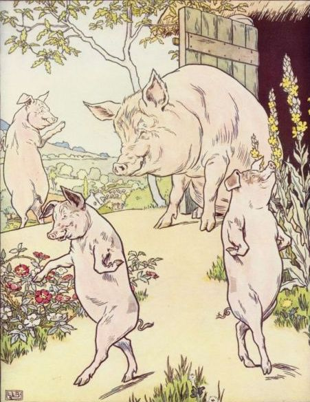
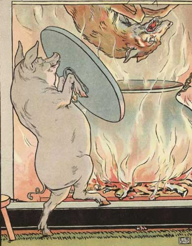

___

The story of The Three Little Pigs featured here has been adapted from different sources and from childhood memory. The primary sources are English Fairy Tales, retold by Flora Annie Steel (1922) with illustrations by L. Leslie Brooke from the 1904 version. This story is featured in our [Favorite Fairy Tales](https://americanliterature.com/fairy-tales-guide) and [Children's Stories](https://americanliterature.com/short-stories-for-children/).  

这里介绍的三只小猪的故事是根据不同的来源和童年记忆改编的。主要来源是《英国童话故事》，由 Flora Annie Steel（1922 年）重述，并由 L. Leslie Brooke 为 1904 年版本绘制插图。这个故事出现在我们最喜欢的童话故事和儿童故事中。

___

   Once upon a time there was an old mother pig who had three little pigs and not enough food to feed them. So when they were old enough, she sent them out into the world to seek their fortunes.  

从前，有一只老猪妈妈，她养了三只小猪，但没有足够的食物来喂养它们。因此，当他们足够大的时候，她就派他们到外面的世界去寻找他们的命运。

The first little pig was very lazy. He didn't want to work at all and he built his house out of straw. The second little pig worked a little bit harder but he was somewhat lazy too and he built his house out of sticks. Then, they sang and danced and played together the rest of the day.  

第一只小猪很懒。他根本不想工作，就用稻草盖了房子。第二只小猪工作稍微努力一些，但也有点懒，他用棍子盖了房子。然后，他们在这一天剩下的时间里一起唱歌、跳舞、玩耍。

The third little pig worked hard all day and built his house with bricks. It was a sturdy house complete with a fine fireplace and chimney. It looked like it could withstand the strongest winds.  

第三只小猪辛苦了一天，用砖砌起了他的房子。这是一座坚固的房子，配有精美的壁炉和烟囱。看起来它可以承受最强的风。

The next day, a wolf happened to pass by the lane where the three little pigs lived; and he saw the straw house, and he smelled the pig inside. He thought the pig would make a mighty fine meal and his mouth began to water.  

第二天，一只狼恰好路过三只小猪住的巷子。他看到了那间稻草屋，还闻到了里面猪的味道。他以为这头猪会做一顿丰盛的大餐，他开始流口水了。

So he knocked on the door and said:  

于是他敲了敲门，说道：

```
  Little pig! Little pig!
  Let me in! Let me in!

```

But the little pig saw the wolf's big paws through the keyhole, so he answered back:  

可是小猪从钥匙孔里看到了狼的大爪子，于是他回答道：

```
  No! No! No! 
  Not by the hairs on my chinny chin chin!

```

   Then the wolf showed his teeth and said:  

然后狼露出牙齿说道：

```
  Then I'll huff 
  and I'll puff 
  and I'll blow your house down.

```

So he huffed and he puffed and he blew the house down! The wolf opened his jaws very wide and bit down as hard as he could, but the first little pig escaped and ran away to hide with the second little pig.  

于是他气喘吁吁，把房子吹倒了！狼把嘴张得很大，用尽全力咬住，但第一只小猪逃脱了，跑到第二只小猪那里躲了起来。

The wolf continued down the lane and he passed by the second house made of sticks; and he saw the house, and he smelled the pigs inside, and his mouth began to water as he thought about the fine dinner they would make.  

狼继续沿着小路走，经过了第二座用木棍搭建的房子。他看到了房子，闻到了里面猪的味道，一想到他们会做的美味晚餐，他就开始流口水。

So he knocked on the door and said:  

于是他敲了敲门，说道：

```
  Little pigs! Little pigs!
  Let me in! Let me in!

```

But the little pigs saw the wolf's pointy ears through the keyhole, so they answered back:  

可是小猪们从钥匙孔里看到了大灰狼尖尖的耳朵，于是他们回答道：

```
  No! No! No!
  Not by the hairs on our chinny chin chin!

```

So the wolf showed his teeth and said:  

于是狼露出牙齿说道：

```
  Then I'll huff 
  and I'll puff 
  and I'll blow your house down!

```

So he huffed and he puffed and he blew the house down! The wolf was greedy and he tried to catch both pigs at once, but he was too greedy and got neither! His big jaws clamped down on nothing but air and the two little pigs scrambled away as fast as their little hooves would carry them.  

于是他气喘吁吁，把房子吹倒了！狼很贪心，他想同时抓住两只小猪，但他太贪心了，两样都抓不到！他的大嘴只咬住了空气，两只小猪就用小蹄子飞快地爬走了。

The wolf chased them down the lane and he almost caught them. But they made it to the brick house and slammed the door closed before the wolf could catch them. The three little pigs they were very frightened, they knew the wolf wanted to eat them. And that was very, very true. The wolf hadn't eaten all day and he had worked up a large appetite chasing the pigs around and now he could smell all three of them inside and he knew that the three little pigs would make a lovely feast.  

狼沿着小巷追赶他们，他差一点就抓住了他们。但他们还是逃到了砖房，并在狼抓住他们之前把门关上了。三只小猪他们非常害怕，他们知道狼要吃掉他们。这是非常非常正确的。大灰狼一整天没吃东西，胃口大开，追着小猪到处跑，现在他能闻到里面三只小猪的味道，他知道三只小猪会做一顿美餐。

  

So the wolf knocked on the door and said:  

于是狼敲了敲门说：

```
  Little pigs! Little pigs!
  Let me in! Let me in!

```

But the little pigs saw the wolf's narrow eyes through the keyhole, so they answered back:  

可是小猪们从钥匙孔里看到了大灰狼狭长的眼睛，于是他们回答道：

```
  No! No! No! 
  Not by the hairs on our chinny chin chin!

```

So the wolf showed his teeth and said:  

于是狼露出牙齿说道：

```
  Then I'll huff 
  and I'll puff 
  and I'll blow your house down.

```

Well! he huffed and he puffed. He puffed and he huffed. And he huffed, huffed, and he puffed, puffed; but he could not blow the house down. At last, he was so out of breath that he couldn't huff and he couldn't puff anymore. So he stopped to rest and thought a bit.  

出色地！他气喘吁吁。他气喘吁吁。他气喘吁吁，气喘吁吁；但他不能把房子吹倒。终于，他气喘吁吁，喘不过气来，再也喘不上气了。于是他停下来休息，思考了一下。

But this was too much. The wolf danced about with rage and swore he would come down the chimney and eat up the little pig for his supper. But while he was climbing on to the roof the little pig made up a blazing fire and put on a big pot full of water to boil. Then, just as the wolf was coming down the chimney, the little piggy pulled off the lid, and plop! in fell the wolf into the scalding water.  

但这太过分了。狼气得手舞足蹈，并发誓要从烟囱下来，把小猪吃掉当晚饭。但当他爬上屋顶时，小猪生起了一堆熊熊的火，并把装满水的大锅放在上面烧开。然后，正当狼从烟囱下来时，小猪拉开了盖子，扑通一声！狼掉进滚烫的水中。

So the little piggy put on the cover again, boiled the wolf up, and the three little pigs ate him for supper.  

于是，小猪又盖上盖子，把大灰狼煮了，三只小猪就把他当晚饭吃了。

  