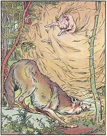
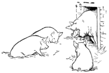

From Wikipedia, the free encyclopedia  

维基百科，自由的百科全书

| The Three Little Pigs 三只小猪 |
| --- |
| 
The wolf blows down the straw house in a 1904 adaptation of the story. Illustration by [Leonard Leslie Brooke](https://en.wikipedia.org/wiki/Leonard_Leslie_Brooke "Leonard Leslie Brooke").  

1904 年改编的故事中，狼吹倒了稻草屋。伦纳德·莱斯利·布鲁克的插图。

 |
| Folk tale 民间故事 |
| Name 姓名 | The Three Little Pigs 三只小猪 |
| [Aarne–Thompson](https://en.wikipedia.org/wiki/Aarne%E2%80%93Thompson_classification_system "Aarne–Thompson classification system") grouping  阿恩-汤普森分组 | 124 |
| Country 国家 | [England  英格兰](https://en.wikipedia.org/wiki/England "England") |

"**The Three Little Pigs**" is a [fable](https://en.wikipedia.org/wiki/Fable "Fable") about three [pigs](https://en.wikipedia.org/wiki/Domestic_pig "Domestic pig") who build their [houses](https://en.wikipedia.org/wiki/House "House") of different materials. A [Big Bad Wolf](https://en.wikipedia.org/wiki/Big_Bad_Wolf "Big Bad Wolf") blows down the first two pigs' houses which are made of [straw](https://en.wikipedia.org/wiki/Straw "Straw") and [sticks](https://en.wikipedia.org/wiki/Branch "Branch") respectively, but is unable to destroy the third pig's house that is made of [bricks](https://en.wikipedia.org/wiki/Brick "Brick"). The printed versions of this fable date back to the 1840s, but the story is thought to be much older. The earliest version takes place in [Dartmoor](https://en.wikipedia.org/wiki/Dartmoor "Dartmoor") with three [pixies](https://en.wikipedia.org/wiki/Pixie "Pixie") and a fox before its best known version appears in _English Fairy Tales_ by [Joseph Jacobs](https://en.wikipedia.org/wiki/Joseph_Jacobs "Joseph Jacobs") in 1890, with Jacobs crediting [James Halliwell-Phillipps](https://en.wikipedia.org/wiki/James_Halliwell-Phillipps "James Halliwell-Phillipps") as the source. In 1886, Halliwell-Phillipps had published his version of the story, in the fifth edition of his _Nursery Rhymes of England_, and it included, for the first time in print, the now-standard phrases "not by the hair of my chiny chin chin" and "I'll huff, and I'll puff, and I'll blow your house in".<a href="https://en.wikipedia.org/wiki/The_Three_Little_Pigs#cite_note-1">[1]</a><a href="https://en.wikipedia.org/wiki/The_Three_Little_Pigs#cite_note-2">[2]</a>  

《三只小猪》讲述了三只小猪用不同材料建造房子的寓言。大灰狼吹倒了前两只猪分别用稻草和木棍搭建的房子，但无法摧毁第三只猪用砖砌的房子。这则寓言的印刷版本可以追溯到 1840 年代，但这个故事被认为更为古老。最早的版本发生在达特穆尔，有三个小精灵和一只狐狸，后来最著名的版本出现在 1890 年约瑟夫·雅各布斯 (Joseph Jacobs) 所著的《英国童话》中，雅各布斯认为来源是詹姆斯·哈利韦尔·菲利普斯 (James Halliwell-Phillipps)。 1886 年，哈利韦尔-菲利普斯在他的《英格兰童谣》第五版中出版了他的故事版本，其中首次印刷了现在标准的短语“不是我下巴的头发”下巴”和“我会吹气，我会吹气，我会吹毁你的房子”。 <a href="https://en.wikipedia.org/wiki/The_Three_Little_Pigs#cite_note-1">[1]</a> <a href="https://en.wikipedia.org/wiki/The_Three_Little_Pigs#cite_note-2">[2]</a>

The phrases used in the story, and the various [morals](https://en.wikipedia.org/wiki/Moral "Moral") drawn from it, have become embedded in [Western culture](https://en.wikipedia.org/wiki/Western_culture "Western culture"). Many versions of _The Three Little Pigs_ have been recreated and modified over the years, sometimes making the wolf a kind character. It is a type B124<a href="https://en.wikipedia.org/wiki/The_Three_Little_Pigs#cite_note-3">[3]</a> folktale in the [Thompson Motif Index](https://en.wikipedia.org/wiki/Thompson_motif "Thompson motif").  

故事中使用的短语以及从中汲取的各种道德已经融入了西方文化。多年来，《三只小猪》的许多版本都被重新创作和修改，有时使狼成为一个善良的角色。这是 Thompson 主题索引中的 B124 <a href="https://en.wikipedia.org/wiki/The_Three_Little_Pigs#cite_note-3">[3]</a> 民间故事类型。

## Traditional versions 传统版本\[[edit](https://en.wikipedia.org/w/index.php?title=The_Three_Little_Pigs&action=edit&section=1 "Edit section: Traditional versions")\]

"The Three Little Pigs" was included in _The Nursery Rhymes of England_ (London and New York, c.1886), by [James Halliwell-Phillipps](https://en.wikipedia.org/wiki/James_Halliwell-Phillipps "James Halliwell-Phillipps").<a href="https://en.wikipedia.org/wiki/The_Three_Little_Pigs#cite_note-4">[4]</a> The story in its arguably best-known form appeared in _English Fairy Tales_ by [Joseph Jacobs](https://en.wikipedia.org/wiki/Joseph_Jacobs "Joseph Jacobs"), first published on June 19, 1890, and crediting Halliwell as his source.<a href="https://en.wikipedia.org/wiki/The_Three_Little_Pigs#cite_note-Tatar-5">[5]</a> The earliest published version of the story is from [Dartmoor](https://en.wikipedia.org/wiki/Dartmoor "Dartmoor"), [Devon](https://en.wikipedia.org/wiki/Devon "Devon"), England in 1853, and has three little [pixies](https://en.wikipedia.org/wiki/Pixie "Pixie") and a fox in place of the three pigs and a wolf. The first pixy had a wooden house:  

《三只小猪》收录在詹姆斯·哈利韦尔·菲利普斯 (James Halliwell-Phillipps) 的《英格兰童谣》（伦敦和纽约，约 1886 年）中。 <a href="https://en.wikipedia.org/wiki/The_Three_Little_Pigs#cite_note-4">[4]</a> 这个故事可以说是最著名的形式出现在约瑟夫·雅各布斯的《英国童话》中，该书于 1890 年 6 月 19 日首次出版，并注明来源为哈利韦尔。 <a href="https://en.wikipedia.org/wiki/The_Three_Little_Pigs#cite_note-Tatar-5">[5]</a> 这个故事最早出版的版本是1853年来自英国德文郡达特穆尔的故事，用三个小精灵和一只狐狸代替了三只猪和一只狼。第一个小精灵有一座木屋：

> "Let me in, let me in", said the fox.  
> 
> “让我进去，让我进去”狐狸说。  
> 
> ”I won’t”, was the pixy's answer; ”and the door is fastened.”<a href="https://en.wikipedia.org/wiki/The_Three_Little_Pigs#cite_note-6">[6]</a>  
> 
> 小精灵的回答是“我不会”。 “门是锁着的。” <a href="https://en.wikipedia.org/wiki/The_Three_Little_Pigs#cite_note-6">[6]</a>

Illustration from J. Jacobs, _English Fairy Tales_ (New York, 1895)  

插图来自 J. Jacobs，《英国童话》（纽约，1895 年）

The story begins with the title characters being sent out into the world by their mother, to "seek out their fortune". The first little pig builds a house of [straw](https://en.wikipedia.org/wiki/Straw "Straw"), but a wolf blows it down and devours him. The second little pig builds a house of [sticks](https://en.wikipedia.org/wiki/Branch "Branch"), which the wolf also blows down, though with more blows and the second little pig is also devoured. Each exchange between wolf and pig features ringing proverbial phrases, namely:  

故事开始于主角们被他们的母亲派到这个世界去“寻找他们的财富”。第一只小猪用稻草建造了一座房子，但一只狼把它吹倒了，把他吃掉了。第二只小猪用木棍搭建了一座房子，狼也把它吹倒了，尽管吹得更多，第二只小猪也被吃掉了。狼和猪之间的每一次交流都有响亮的谚语，即：

> "Little pig, little pig, let me come in."  
> 
> “小猪，小猪，让我进来吧。”  
> 
> "No, not by the hair on my chinny chin chin."  
> 
> “不，不是看我下巴下巴上的头发。”  
> 
> "Then I'll huff, and I'll puff, and I'll blow your house in."<a href="https://en.wikipedia.org/wiki/The_Three_Little_Pigs#cite_note-Jacobs-7">[7]</a>  
> 
> “然后我会吹气，我会吹气，然后我会把你的房子吹毁。” <a href="https://en.wikipedia.org/wiki/The_Three_Little_Pigs#cite_note-Jacobs-7">[7]</a>

The third little pig builds a house of [bricks](https://en.wikipedia.org/wiki/Brick "Brick"), which the wolf fails to blow down. He then attempts to trick the pig out of the house by asking to meet him at several places at specific times, but he is outwitted each time since the pig gets to those places earlier than the wolf. Finally, the infuriated wolf resolves to come down the [chimney](https://en.wikipedia.org/wiki/Chimney "Chimney"), whereupon the pig who owns the brick house lights a fire under a pot of water on the fireplace. The wolf falls in and is [fatally boiled](https://en.wikipedia.org/wiki/Death_by_boiling "Death by boiling"), avenging the death of the final pig's brothers. After cooking the wolf, the pig proceeds to eat the meat for dinner.  

第三只小猪用砖砌了一座房子，但狼没能把它吹倒。然后，他试图通过要求在特定时间在几个地方与猪见面来将猪骗出家门，但每次他都被骗了，因为猪比狼更早到达这些地方。最后，愤怒的狼决定从烟囱下来，于是砖房主人的猪在壁炉上的一壶水下点燃了火。狼掉进水里，被煮死，为最后一只猪兄弟的死报仇。煮完狼后，猪继续吃晚餐的肉。

## Other versions 其他版本\[[edit](https://en.wikipedia.org/w/index.php?title=The_Three_Little_Pigs&action=edit&section=2 "Edit section: Other versions")\]

In some versions, the first and second little pigs are not eaten by the wolf after he demolishes their homes but instead runs to their sibling's house, who originally had to take care of the two other pigs and build a brick house in a few versions. Most of these versions omit any attempts by the wolf to meet the third pig out of the house after his failed attempt to blow the house in. After the wolf goes down the chimney he either dies like in the original, runs away and never returns to eat the three little pigs or in some versions the wolf faints after trying to blow down the brick house and all three of the pigs survive in either case.  

在一些版本中，第一只和第二只小猪在狼拆掉了他们的房子后并没有被狼吃掉，而是跑到了他们兄弟姐妹的房子里，他们原本必须照顾另外两只小猪并建造一座砖房。这些版本中的大多数都忽略了狼在尝试炸毁房子失败后与第三只猪会面的尝试。狼从烟囱掉下去后，他要么像原来的那样死了，要么逃跑，再也没有回来。吃掉三只小猪，或者在某些版本中，狼在试图炸毁砖房后晕倒，而在这两种情况下，所有三只小猪都幸存下来。

The story uses the literary [rule of three](https://en.wikipedia.org/wiki/Rule_of_three_(writing) "Rule of three (writing)"), expressed in this case as a "contrasting three", as the third pig's brick house turns out to be the only one which is adequate to withstand the wolf.<a href="https://en.wikipedia.org/wiki/The_Three_Little_Pigs#cite_note-8">[8]</a> Variations of the tale appeared in _[Uncle Remus](https://en.wikipedia.org/wiki/Uncle_Remus "Uncle Remus"): His Songs and Sayings_ in 1881. The story also made an appearance in _Nights with Uncle Remus_ in 1883, both by [Joel Chandler Harris](https://en.wikipedia.org/wiki/Joel_Chandler_Harris "Joel Chandler Harris"), in which the pigs were replaced by [Brer Rabbit](https://en.wikipedia.org/wiki/Brer_Rabbit "Brer Rabbit"). [Andrew Lang](https://en.wikipedia.org/wiki/Andrew_Lang "Andrew Lang") included it in _[The Green Fairy Book](https://en.wikipedia.org/wiki/The_Green_Fairy_Book "The Green Fairy Book")_, published in 1892, but did not cite his source. In contrast to Jacobs's version, which left the pigs nameless, Lang's retelling cast the pigs as Browny, Whitey, and Blacky. It also set itself apart by exploring each pig's character and detailing the interaction between them. The antagonist of this version is a fox, not a wolf. The pigs' houses are made either of mud, cabbage, or brick. Blacky, the third pig, rescues his brother and sister from the fox's den after the fox has been defeated.  

这个故事使用了三的文学规则，在这种情况下表达为“对比三”，因为第三只猪的砖房是唯一足以抵御狼的砖房。 <a href="https://en.wikipedia.org/wiki/The_Three_Little_Pigs#cite_note-8">[8]</a> 这个故事的变体出现在 1881 年的《雷姆斯叔叔：他的歌曲和语录》中。这个故事也出现在 1883 年的《雷姆斯叔叔的夜晚》中，两本都是乔尔·钱德勒·哈里斯的作品，其中猪被替换为兔子兄弟。安德鲁·朗 (Andrew Lang) 将其收录在 1892 年出版的《绿色童话书》中，但没有引用出处。雅各布斯的版本没有给猪命名，而朗的版本则将猪分别命名为“布朗尼”、“怀特”和“黑基”。它还通过探索每只猪的性格并详细介绍它们之间的互动而使其与众不同。这个版本的对手是狐狸，而不是狼。猪的房子是用泥土、卷心菜或砖砌成的。狐狸被打败后，第三只小猪小黑从狐狸洞里救出了弟弟妹妹。

## Analysis 分析\[[edit](https://en.wikipedia.org/w/index.php?title=The_Three_Little_Pigs&action=edit&section=3 "Edit section: Analysis")\]

Writer [Bruno Bettelheim](https://en.wikipedia.org/wiki/Bruno_Bettelheim "Bruno Bettelheim"), in his book _[The Uses of Enchantment](https://en.wikipedia.org/wiki/The_Uses_of_Enchantment "The Uses of Enchantment")_, interprets the tale as a showcase of the capacity for anticipation and courage in the face of adversity, symbolized by the wolf. According to him, the individual who is content to prepare themself as the first two pigs will be destroyed by the vicissitudes of life, and only a person who builds a solid base can face such hazards. He viewed the tale as a means of telling children that one cannot always act according to the pleasure principle, and must submit to the reality principle when life demands it. He exemplified this point by observing that the first two pigs valued gratification rather than planning and foresight as the third pig had.<a href="https://en.wikipedia.org/wiki/The_Three_Little_Pigs#cite_note-9">[9]</a>  

作家布鲁诺·贝特尔海姆（Bruno Bettelheim）在他的《魔法的用途》（The Uses of Enchantment）一书中将这个故事解释为展示面对逆境（以狼为象征）时的预见能力和勇气。在他看来，满足于把自己准备成前两只猪的人将会被世事沧桑所摧毁，而只有建立了坚实基础的人才能面对这样的危险。他认为这个故事是告诉孩子们，一个人不能总是按照快乐原则行事，而在生活需要时必须服从现实原则。他通过观察前两只猪重视满足感而不是像第三只猪那样重视计划和远见来证明了这一点。 <a href="https://en.wikipedia.org/wiki/The_Three_Little_Pigs#cite_note-9">[9]</a>

## Later adaptations 后来的改编\[[edit](https://en.wikipedia.org/w/index.php?title=The_Three_Little_Pigs&action=edit&section=4 "Edit section: Later adaptations")\]

### Animated shorts 动画短片\[[edit](https://en.wikipedia.org/w/index.php?title=The_Three_Little_Pigs&action=edit&section=5 "Edit section: Animated shorts")\]

-   _[Three Little Pigs](https://en.wikipedia.org/wiki/Three_Little_Pigs_(film) "Three Little Pigs (film)")_, a 1933 _[Silly Symphony](https://en.wikipedia.org/wiki/Silly_Symphonies "Silly Symphonies")_ cartoon, was produced by [Walt Disney](https://en.wikipedia.org/wiki/Walt_Disney "Walt Disney"). The production cast the title characters as _Fifer Pig_, _Fiddler Pig_, and _Practical Pig_. The first two are depicted as both frivolous and arrogant. The story has been somewhat softened. The first two pigs still get their houses blown down, but escape from the wolf. Also, the wolf is not boiled to death but simply burns himself and runs away. Three sequels soon followed respectively as a result of the short film's popularity:  
    
    《三只小猪》是 1933 年的《愚蠢交响曲》动画片，由华特迪士尼制作。该剧的主角是“吹笛猪”、“提琴手猪”和“实用猪”。前两者被描述为既轻浮又傲慢。故事情节已经变得有些柔和了。前两只猪的房子仍然被炸毁，但逃脱了狼的追捕。而且，狼并没有被煮死，而是简单地烧伤了自己然后逃跑了。由于短片的受欢迎，很快就分别推出了三部续集：
    -   The first of them was _[The Big Bad Wolf](https://en.wikipedia.org/wiki/The_Big_Bad_Wolf_(1934_film) "The Big Bad Wolf (1934 film)")_, also directed by [Burt Gillett](https://en.wikipedia.org/wiki/Burt_Gillett "Burt Gillett") and first released on April 14, 1934.<a href="https://en.wikipedia.org/wiki/The_Three_Little_Pigs#cite_note-10">[10]</a>  
        
        其中第一部是《大灰狼》，同样由伯特·吉列执导，于 1934 年 4 月 14 日首次上映。 <a href="https://en.wikipedia.org/wiki/The_Three_Little_Pigs#cite_note-10">[10]</a>
    -   In 1936, a second cartoon starring the Three Little Pigs and the Big Bad Wolf followed, with a story based on _[The Boy Who Cried Wolf](https://en.wikipedia.org/wiki/The_Boy_Who_Cried_Wolf "The Boy Who Cried Wolf")_. This short was entitled _[Three Little Wolves](https://en.wikipedia.org/wiki/Three_Little_Wolves_(film) "Three Little Wolves (film)")_ and introduced the Big Bad Wolf's three pup sons, all of whom just as eager for a taste of the pigs as their father.<a href="https://en.wikipedia.org/wiki/The_Three_Little_Pigs#cite_note-11">[11]</a>  
        
        1936 年，第二部动画片《三只小猪和大灰狼》上映，故事改编自《狼来了》的男孩。这部短片的标题是《三只小狼》，介绍了大灰狼的三个小儿子，他们都像他们的父亲一样渴望尝尝小猪的味道。 <a href="https://en.wikipedia.org/wiki/The_Three_Little_Pigs#cite_note-11">[11]</a>
    -   A third cartoon _[The Practical Pig](https://en.wikipedia.org/wiki/The_Practical_Pig "The Practical Pig")_, was released in 1939, right at the end of the Silly Symphonies' run.<a href="https://en.wikipedia.org/wiki/The_Three_Little_Pigs#cite_note-12">[12]</a> In this, Fifer and Piper, again despite Practical's warning, go swimming but are captured by the Wolf, who then goes after Practical only to be caught in Practical's newly built Lie Detector machine.  
        
        第三部动画片《实用猪》于 1939 年发行，恰逢《愚蠢交响曲》结束时。 <a href="https://en.wikipedia.org/wiki/The_Three_Little_Pigs#cite_note-12">[12]</a> 在这部电影中，费弗和派珀再次不顾实用的警告，去游泳，但被狼抓住了，然后狼追上了实用，结果被实用新建的测谎仪抓住了。
    -   In 1941, a fourth cartoon much of the film was edited into _[The Thrifty Pig](https://en.wikipedia.org/wiki/The_Thrifty_Pig "The Thrifty Pig")_, which was distributed by the [National Film Board of Canada](https://en.wikipedia.org/wiki/National_Film_Board_of_Canada "National Film Board of Canada"). Here, Practical Pig builds his house out of Canadian [war bonds](https://en.wikipedia.org/wiki/War_bonds "War bonds"), and the Big Bad Wolf representing [Nazi Germany](https://en.wikipedia.org/wiki/Nazi_Germany "Nazi Germany") is unable to blow his house down.<a href="https://en.wikipedia.org/wiki/The_Three_Little_Pigs#cite_note-13">[13]</a>  
        
        1941 年，第四部动画片的大部分内容被剪辑成《节俭的猪》，由加拿大国家电影局发行。在这里，实用猪用加拿大战争债券建造了他的房子，而代表纳粹德国的大灰狼却无法炸毁他的房子。 <a href="https://en.wikipedia.org/wiki/The_Three_Little_Pigs#cite_note-13">[13]</a>
    -   Fiddler Pig, Fifer Pig, and Big Bad Wolf appeared in the film _[Who Framed Roger Rabbit](https://en.wikipedia.org/wiki/Who_Framed_Roger_Rabbit "Who Framed Roger Rabbit")_.  
        
        提琴手猪、吹笛猪和大灰狼出现在电影《谁陷害了兔子罗杰》中。
-   In 1942 there was a [Walter Lantz](https://en.wikipedia.org/wiki/Walter_Lantz "Walter Lantz") musical version, _The Hams That Couldn't Be Cured._<a href="https://en.wikipedia.org/wiki/The_Three_Little_Pigs#cite_note-14">[14]</a> The wolf (claiming he is a musical instructor) explains to the court how the three little pigs harassed him through their instrument playing which ends up destroying the wolf's house.  
    
    1942 年，沃尔特·兰茨 (Walter Lantz) 推出了音乐剧《无法治愈的火腿》(The Hams That Couldn't Be Cured)。 <a href="https://en.wikipedia.org/wiki/The_Three_Little_Pigs#cite_note-14">[14]</a> 狼（声称自己是音乐教练）向法庭解释了三只小猪如何通过演奏乐器骚扰他，最终摧毁了狼的房子。
-   In 1942 there was also a wartime version called _[Blitz Wolf](https://en.wikipedia.org/wiki/Blitz_Wolf "Blitz Wolf")_ with the Wolf as [Adolf Hitler](https://en.wikipedia.org/wiki/Adolf_Hitler "Adolf Hitler"). It was produced by [Metro-Goldwyn-Mayer cartoon studio](https://en.wikipedia.org/wiki/Metro-Goldwyn-Mayer_cartoon_studio "Metro-Goldwyn-Mayer cartoon studio") and directed by [Tex Avery](https://en.wikipedia.org/wiki/Tex_Avery "Tex Avery").  
    
    1942年还有一个战时版本，名为《闪电战狼》，狼扮演阿道夫·希特勒。它由米高梅卡通工作室制作，特克斯·艾弗里执导。
-   Four cartoons inspired by the Disney version were produced by [Warner Bros.](https://en.wikipedia.org/wiki/Warner_Bros. "Warner Bros.")  
    
    华纳兄弟制作了四部受迪士尼版本启发的动画片。
    -   The first was _[Pigs in a Polka](https://en.wikipedia.org/wiki/Pigs_in_a_Polka "Pigs in a Polka")_ (1943) which tells the story to the accompaniment of [Johannes Brahms](https://en.wikipedia.org/wiki/Johannes_Brahms "Johannes Brahms")' [Hungarian Dances](https://en.wikipedia.org/wiki/Hungarian_Dances "Hungarian Dances").which was a serious musical treatment, directed by [Friz Freleng](https://en.wikipedia.org/wiki/Friz_Freleng "Friz Freleng").  
        
        第一部是《波尔卡舞中的猪》（1943），在约翰内斯·勃拉姆斯的《匈牙利舞曲》的伴奏下讲述了这个故事，这是一部严肃的音乐剧，由弗里兹·弗雷伦执导。
    -   The second was _[The Windblown Hare](https://en.wikipedia.org/wiki/The_Windblown_Hare "The Windblown Hare")_ (1949), featuring [Bugs Bunny](https://en.wikipedia.org/wiki/Bugs_Bunny "Bugs Bunny"), and directed by Robert McKimson. In _Windblown_, Bugs is conned into first buying the straw house, which the wolf blows down, and then the sticks house, which the wolf also blows down. After these incidents, Bugs decides to help the wolf and get revenge on all three pigs, who are now at the brick house.  
        
        第二部是《风吹野兔》(1949)，由罗伯特·麦金森执导，兔八哥主演。在《风吹》中，巴格斯被骗先买了稻草房子，狼把它吹倒了，然后又买了木棍房子，狼也把它吹倒了。这些事件发生后，巴格斯决定帮助狼并向现在在砖房里的三只小猪报仇。
    -   The third was _[The Turn-Tale Wolf](https://en.wikipedia.org/wiki/The_Turn-Tale_Wolf "The Turn-Tale Wolf")_ (1952), directed by Robert McKimson. This cartoon tells the story from the wolf's point of view and makes the pigs out to be the villains.  
        
        第三部是罗伯特·麦克金森执导的《狼的故事》（1952）。这部漫画从狼的角度讲述了这个故事，并把猪变成了反派。
    -   The fourth was _[The Three Little Bops](https://en.wikipedia.org/wiki/Three_Little_Bops "Three Little Bops")_ (1957), featuring the pigs as a jazz band, who refused to let the inept trumpet-playing wolf join until after he died and went to [Hell](https://en.wikipedia.org/wiki/Hell "Hell"), whereupon his playing markedly improved, directed by [Friz Freleng](https://en.wikipedia.org/wiki/Friz_Freleng "Friz Freleng").  
        
        第四部是《三只小波普》（1957），以小猪为主角的爵士乐队，在弗里兹·弗雷伦的指导下，小猪拒绝让无能的吹小号的狼加入，直到他死后下地狱，从此他的演奏有了明显的进步。
-   In 1953, Tex Avery directed a [Droopy](https://en.wikipedia.org/wiki/Droopy "Droopy") cartoon, "The Three Little Pups". In it, the pigs are replaced with dogs and the wolf is a [Southern-accented](https://en.wikipedia.org/wiki/Southern_American_English "Southern American English") dog catcher trying to catch Droopy and his brothers, Snoopy and Loopy, to put in the dog pound. It was produced by [Metro-Goldwyn-Mayer cartoon studio](https://en.wikipedia.org/wiki/Metro-Goldwyn-Mayer_cartoon_studio "Metro-Goldwyn-Mayer cartoon studio").  
    
    1953年，特克斯·艾弗里执导了一部垂头丧气的动画片《三只小狗》。其中，猪被狗取代，狼是一位南方口音的捕狗者，试图抓住德鲁比和他的兄弟史努比和卢比，然后把它们放进狗收容所。它由米高梅卡通工作室制作。
-   In 1980, the book with [Erik Blegvad](https://en.wikipedia.org/wiki/Erik_Blegvad "Erik Blegvad") illustrations was made. In 1988, [Weston Woods Studios](https://en.wikipedia.org/wiki/Weston_Woods_Studios "Weston Woods Studios") created a short film based on the book.  
    
    1980 年，这本配有 Erik Blegvad 插图的书出版了。 1988年，韦斯顿伍兹工作室根据这本书制作了一部短片。

### Animated features 动画功能\[[edit](https://en.wikipedia.org/w/index.php?title=The_Three_Little_Pigs&action=edit&section=6 "Edit section: Animated features")\]

-   _[3 Pigs and a Baby](https://en.wikipedia.org/wiki/3_Pigs_and_a_Baby "3 Pigs and a Baby")_ is the first animated film in the series based on "[Three Little Pigs](https://en.wikipedia.org/wiki/Three_Little_Pigs "Three Little Pigs")". The direct-to-DVD film was released on March 4, 2008, and stars [Jon Cryer](https://en.wikipedia.org/wiki/Jon_Cryer "Jon Cryer"), [Brad Garrett](https://en.wikipedia.org/wiki/Brad_Garrett "Brad Garrett"), [Steve Zahn](https://en.wikipedia.org/wiki/Steve_Zahn "Steve Zahn") and [Jesse McCartney](https://en.wikipedia.org/wiki/Jesse_McCartney "Jesse McCartney").<a href="https://en.wikipedia.org/wiki/The_Three_Little_Pigs#cite_note-PR-011808-15">[15]</a>  
    
    《三只小猪和一个婴儿》是根据《三只小猪》改编的系列第一部动画电影。这部直接 DVD 电影于 2008 年 3 月 4 日发行，由乔恩·克莱尔、布拉德·加勒特、史蒂夫·茨恩和杰西·麦卡特尼主演。 <a href="https://en.wikipedia.org/wiki/The_Three_Little_Pigs#cite_note-PR-011808-15">[15]</a>
-   [The three pigs](https://en.wikipedia.org/wiki/List_of_Shrek_characters#Three_Little_Pigs "List of Shrek characters") and the [wolf](https://en.wikipedia.org/wiki/List_of_Shrek_characters#The_Big_Bad_Wolf "List of Shrek characters") appear in the four [_Shrek_ films](https://en.wikipedia.org/wiki/Shrek_(franchise) "Shrek (franchise)").  
    
    三只猪和狼出现在四部怪物史莱克电影中。

### Television 电视\[[edit](https://en.wikipedia.org/w/index.php?title=The_Three_Little_Pigs&action=edit&section=7 "Edit section: Television")\]

-   In 1985, the story was re-told as the first episode of Season Four of _[Shelley Duvall's Faerie Tale Theatre](https://en.wikipedia.org/wiki/Shelley_Duvall%27s_Faerie_Tale_Theatre "Shelley Duvall's Faerie Tale Theatre")_, with [Billy Crystal](https://en.wikipedia.org/wiki/Billy_Crystal "Billy Crystal") as artistic "Larry Pig" (the smart third pig), [Jeff Goldblum](https://en.wikipedia.org/wiki/Jeff_Goldblum "Jeff Goldblum") as henpecked "Buck Wolf", [Stephen Furst](https://en.wikipedia.org/wiki/Stephen_Furst "Stephen Furst") as capitalistic "Peter Pig" (the first pig), [Fred Willard](https://en.wikipedia.org/wiki/Fred_Willard "Fred Willard") as [narcissistic](https://en.wikipedia.org/wiki/Narcissism "Narcissism") "Paul Pig" (the second pig), [Doris Roberts](https://en.wikipedia.org/wiki/Doris_Roberts "Doris Roberts") as "Mother Pig" and [Valerie Perrine](https://en.wikipedia.org/wiki/Valerie_Perrine "Valerie Perrine") as love interest "Tina Pig". In this version, all three pigs buy their building materials from the same junk salesman ([Larry Hankin](https://en.wikipedia.org/wiki/Larry_Hankin "Larry Hankin")).  
    
    1985年，这个故事在雪莱·杜瓦尔的童话剧院第四季的第一集中被重新讲述，比利·克里斯托饰演艺术“拉里猪”（聪明的第三只猪），杰夫·高布伦饰演怕老婆的“巴克狼”，史蒂芬·福斯特饰演资本主义的“彼得猪”（第一只猪），弗雷德·威拉德饰演自恋的“保罗猪”（第二只猪），多丽丝·罗伯茨饰演“猪妈妈”，瓦莱丽·佩莱恩饰演爱情对象“蒂娜猪”。在这个版本中，三只猪都从同一个垃圾推销员（拉里·汉金饰）那里购买建筑材料。
-   In _[Rabbit Ears Productions](https://en.wikipedia.org/wiki/Rabbit_Ears_Productions "Rabbit Ears Productions")_'s _Storybook Classics_ adaptation, the pigs appear to be female.  
    
    在 Rabbit Ears Productions ' 的故事书经典改编作品中，猪似乎是雌性。
-   The 1992 [Green Jellö](https://en.wikipedia.org/wiki/Green_Jell%C3%B6 "Green Jellö") song, _[Three Little Pigs](https://en.wikipedia.org/wiki/Three_Little_Pigs_(song) "Three Little Pigs (song)")_ was adapted to a [claymation](https://en.wikipedia.org/wiki/Claymation "Claymation") music video.  
    
    1992 年 Green Jellö 歌曲《三只小猪》被改编成粘土动画音乐视频。
-   In the _[Shining Time Station](https://en.wikipedia.org/wiki/Shining_Time_Station "Shining Time Station")_ episode, _Schemer's Alone_, Midge Smoot reads a version of this story to Schemer who paid her an [IOU](https://en.wikipedia.org/wiki/IOU "IOU") instead of real money, despite the fact that he's tricking his friends.  
    
    在《光辉时间站》一集中，米奇·斯穆特向斯莫特读了这个故事的一个版本，斯穆特给了她一张欠条而不是真钱，尽管他在欺骗他的朋友。
-   The characters from the 1933 film adaptation of _[The Three Little Pigs](https://en.wikipedia.org/wiki/Three_Little_Pigs_(film) "Three Little Pigs (film)")_ appeared in the 2001 television series _[House of Mouse](https://en.wikipedia.org/wiki/House_of_Mouse "House of Mouse")_ in many episodes, and again in the direct-to-video film _[Mickey's Magical Christmas: Snowed in at the House of Mouse](https://en.wikipedia.org/wiki/Mickey%27s_Magical_Christmas:_Snowed_in_at_the_House_of_Mouse "Mickey's Magical Christmas: Snowed in at the House of Mouse")_.  
    
    1933 年改编电影《三只小猪》中的角色在 2001 年电视剧《老鼠之家》中出现了很多集，并再次出现在视频电影《米奇的神奇圣诞节：老鼠之家下雪了》中。
-   In 1996, from [What a Cartoon!](https://en.wikipedia.org/wiki/What_a_Cartoon! "What a Cartoon!") shorts program, in [William Hanna](https://en.wikipedia.org/wiki/William_Hanna "William Hanna")'s final cartoon short "Wind-Up Wolf", The Big Bad Wolf creates a robot minion wolf to attempt to finally get the Three Little Pigs.  
    
    1996年，出自《多么卡通！》短片节目中，威廉·汉纳的最后一部卡通短片《发条狼》中，大灰狼创造了一只机器人小狼，试图最终得到三只小猪。
-   [The three pigs](https://en.wikipedia.org/wiki/List_of_Shrek_characters#Three_Little_Pigs "List of Shrek characters") and the [wolf](https://en.wikipedia.org/wiki/List_of_Shrek_characters#The_Big_Bad_Wolf "List of Shrek characters") appear in the four [_Shrek_ films](https://en.wikipedia.org/wiki/Shrek_(franchise) "Shrek (franchise)"), and the TV specials _[Shrek the Halls](https://en.wikipedia.org/wiki/Shrek_the_Halls "Shrek the Halls")_ and _[Scared Shrekless](https://en.wikipedia.org/wiki/Scared_Shrekless "Scared Shrekless")_.  
    
    三只猪和狼出现在四部《史莱克》电影中，以及电视特别节目《史莱克大厅》和《惊恐的史莱克》中。
-   In the PBS Kids series _[Super Why](https://en.wikipedia.org/wiki/Super_Why "Super Why")_, Pig (Littlest Pig) is one of the main characters of the show. In the episode “The Three Little Pigs: Return of The Wolf,” it is revealed that he is the youngest of the three little pigs. He transforms into Alpha Pig with Alphabet Power.  
    
    在 PBS Kids 剧集《Super Why》中，猪（小猪）是该剧的主角之一。在《三只小猪：狼回来了》一集中，他是三只小猪中最小的一个。他利用字母力量变身为阿尔法猪。
-   In 2018, the story was told in the first season of _[Tell Me a Story](https://en.wikipedia.org/wiki/Tell_Me_a_Story_(TV_series) "Tell Me a Story (TV series)")_, a serialized drama that interweaves The Three Little Pigs, Little Red Riding Hood and Hansel and Gretel "into an epic and subversive tale of love, loss, greed, revenge, and murder.<a href="https://en.wikipedia.org/wiki/The_Three_Little_Pigs#cite_note-Magnussen-16">[16]</a>  
    
    2018 年，这个故事在《告诉我一个故事》第一季中讲述，这是一部连载剧，将《三只小猪》、《小红帽》和《糖果屋》交织成一个关于爱、失落、贪婪和复仇的史诗般的颠覆性故事。 ，还有谋杀。 <a href="https://en.wikipedia.org/wiki/The_Three_Little_Pigs#cite_note-Magnussen-16">[16]</a>
-   Episode 1 of _[Dino Babies](https://en.wikipedia.org/wiki/Dino_Babies "Dino Babies")_, "These Doors Are Made for Knocking", is based on this story.  
    
    《恐龙宝宝》的第一集“这些门是为敲门而生的”，就是根据这个故事改编的。

### Literature 文学\[[edit](https://en.wikipedia.org/w/index.php?title=The_Three_Little_Pigs&action=edit&section=8 "Edit section: Literature")\]

-   One of [Uncle Remus](https://en.wikipedia.org/wiki/Uncle_Remus "Uncle Remus")' stories, "The Story of the Pigs" (alt. title: "Brer Wolf and the Pigs"), found in _Nights with Uncle Remus_ (1883), is a re-telling of the story, with the following differences:  
    
    雷穆斯叔叔的故事之一“猪的故事”（替代标题：“狼兄弟和猪”）出现在《与雷穆斯叔叔的夜晚》（1883 年）中，是对这个故事的重新讲述，内容如下差异：
    -   There are five pigs in this version: Big Pig, Little Pig, Speckle Pig, Blunt and Runt.  
        
        这个版本中有五只猪：大猪、小猪、斑点猪、钝猪和小矮猪。
    -   Blunt is the only male; all the rest are females.  
        
        布朗特是唯一的雄性。其余都是女性。
    -   Big Pig builds a brush house, Little Pig builds a stick house, Speckle Pig builds a mud house, Blunt builds a plank house and Runt builds a stone house.  
        
        大猪建造了一座灌木丛房子，小猪建造了一座木棍房子，斑点猪建造了一座泥房子，布朗特建造了一座木板房子，而小猪建造了一座石头房子。
    -   The Wolf's verse goes: _"If you'll open the door and let me in, I'll warm my hands and go home again."_  
        
        狼的诗句是这样的：“如果你打开门让我进去，我会温暖我的手并再次回家。”
-   The 1989 parody _[The True Story of the 3 Little Pigs!](https://en.wikipedia.org/wiki/The_True_Story_of_the_3_Little_Pigs! "The True Story of the 3 Little Pigs!")_ is presented as a first-person narrative by the wolf (here called Alexander T. Wolf), who portrays the entire incident as a misunderstanding; he had gone to the pigs to borrow some sugar to bake a cake, had destroyed their houses in a sneezing fit, ate the first two pigs not to waste food (since they had died in the house collapse anyway), and was caught attacking the third pig's house after the pig had continually insulted him.<a href="https://en.wikipedia.org/wiki/The_Three_Little_Pigs#cite_note-Tatar-5">[5]</a>  
    
    1989 年的模仿作品《三只小猪的真实故事》！狼（此处称为亚历山大·T·沃尔夫）以第一人称叙述，将整个事件描述为一场误会；他去猪那里借了一些糖来烤蛋糕，在一个喷嚏中毁掉了他们的房子，为了不浪费食物而吃掉了前两只猪（因为无论如何它们都在房子倒塌中死了），并在攻击猪时被抓住。在猪不断地侮辱他之后，他来到了第三只猪的家。 <a href="https://en.wikipedia.org/wiki/The_Three_Little_Pigs#cite_note-Tatar-5">[5]</a>
-   The 1993 children's book _[The Three Little Wolves and the Big Bad Pig](https://en.wikipedia.org/wiki/The_Three_Little_Wolves_and_the_Big_Bad_Pig "The Three Little Wolves and the Big Bad Pig")_ inverts the cast and makes a few changes to the plot: the wolves build a brick house, then a concrete house, then a steel house, and finally a house of flowers. The pig is unable to blow the houses down, destroying them by other means, but eventually gives up his wicked ways when he smells the scent of the flower house, and becomes friends with the wolves.  
    
    1993年的儿童读物《三只小狼和大坏猪》颠倒了演员阵容，并对情节做了一些改动：狼们建造了一座砖房，然后是混凝土房子，然后是钢铁房子，最后是一座花房子。猪无法用其他方法将房屋吹倒，但最终在闻到花屋的气味后放弃了邪恶的行为，并与狼成为了朋友。
-   The 2008 children's book _[The Three Horrid Pigs and the Big Friendly Wolf](https://en.wikipedia.org/w/index.php?title=The_Three_Horrid_Pigs_and_the_Big_Friendly_Wolf&action=edit&redlink=1 "The Three Horrid Pigs and the Big Friendly Wolf (page does not exist)")_ changes the story: the pigs and the wolf are depicted as friends.  
    
    2008 年的儿童读物《三只可怕的猪和友善的大狼》改变了故事情节：猪和狼被描绘成朋友。
-   The Three Little Pigs are often parodied or referenced in [Monica and Friends](https://en.wikipedia.org/wiki/Monica_and_Friends "Monica and Friends") comics, usually in [Smudge](https://en.wikipedia.org/wiki/Smudge_(Monica_and_Friends) "Smudge (Monica and Friends)")\-related stories due to his strong interest in pigs.  
    
    由于他对猪有浓厚的兴趣，三只小猪经常在莫妮卡和朋友们的漫画中被戏仿或引用，通常在与斯马奇相关的故事中。

### Music 音乐\[[edit](https://en.wikipedia.org/w/index.php?title=The_Three_Little_Pigs&action=edit&section=9 "Edit section: Music")\]

-   In 1953, [Al "Jazzbo" Collins](https://en.wikipedia.org/wiki/Al_%22Jazzbo%22_Collins "Al \"Jazzbo\" Collins") narrated a jazz version of The Three Little Pigs on a Brunswick Records 78 r.p.m. record album titled "steve allen's grimm fairy tales for hip kids" with piano blues accompaniment by Lou Stein.  
    
    1953 年，Al "Jazzbo" Collins 在 Brunswick Records 78 r.p.m. 上为爵士乐版的《三只小猪》担任旁白。录制专辑名为“史蒂夫·艾伦为时髦的孩子们创作的格林童话”，由卢·斯坦（Lou Stein）钢琴布鲁斯伴奏。
-   The 1989 [Mucky Pup](https://en.wikipedia.org/wiki/Mucky_Pup "Mucky Pup") song "Little Pigs" from the album _[A Boy in a Man's World](https://en.wikipedia.org/wiki/A_Boy_in_a_Man%27s_World "A Boy in a Man's World")_ is a rap/metal version of the story featuring the dialogue between the wolf and pigs.  
    
    1989 年 Mucky Pup 专辑《A Boy in a Man's World》中的歌曲“Little Pigs”是这个故事的说唱/金属版本，以狼和猪之间的对话为特色。
-   The 1992 [Green Jellö](https://en.wikipedia.org/wiki/Green_Jell%C3%B6 "Green Jellö") song, "[Three Little Pigs](https://en.wikipedia.org/wiki/Three_Little_Pigs_(song) "Three Little Pigs (song)")" sets the story in [Los Angeles](https://en.wikipedia.org/wiki/Los_Angeles "Los Angeles"). The wolf drives a [Harley Davidson](https://en.wikipedia.org/wiki/Harley_Davidson "Harley Davidson") motorcycle, the first little pig is an aspiring [guitarist](https://en.wikipedia.org/wiki/Guitarist "Guitarist"), the second is a [cannabis smoking](https://en.wikipedia.org/wiki/Cannabis_smoking "Cannabis smoking"), [dumpster diving](https://en.wikipedia.org/wiki/Dumpster_diving "Dumpster diving") [evangelist](https://en.wikipedia.org/wiki/Evangelism "Evangelism") and the third holds a [Master of Architecture](https://en.wikipedia.org/wiki/Master_of_Architecture "Master of Architecture") degree from [Harvard University](https://en.wikipedia.org/wiki/Harvard_University "Harvard University"). In the end, with all three pigs barricaded in the brick house, the third pig calls [9-1-1](https://en.wikipedia.org/wiki/9-1-1 "9-1-1"). [John Rambo](https://en.wikipedia.org/wiki/John_Rambo "John Rambo") is dispatched to the scene, and kills the wolf with a [machine gun](https://en.wikipedia.org/wiki/Machine_gun "Machine gun").  
    
    1992 年 Green Jellö 的歌曲《三只小猪》以洛杉矶为背景。狼开着哈雷戴维森摩托车，第一个小猪是一位有抱负的吉他手，第二个是吸大麻、翻垃圾箱的布道者，第三个拥有哈佛大学建筑硕士学位。最后，当三只猪都被困在砖房里时，第三只猪拨打了 9-1-1。约翰·兰博被派往现场，并用机枪杀死了狼。
-   In 2003, the [Flemish](https://en.wikipedia.org/wiki/Belgium "Belgium") company [Studio 100](https://en.wikipedia.org/wiki/Studio_100 "Studio 100") created a musical called _Three Little Pigs_ ([Dutch](https://en.wikipedia.org/wiki/Dutch_language "Dutch language"): _De 3 Biggetjes_), which follows the three daughters of the pig with the house of stone with new original songs, introducing a completely new story loosely based on the original story. The musical was specially written for the band [K3](https://en.wikipedia.org/wiki/K3_(band) "K3 (band)"), who play the three little pigs, Pirky, Parky and Porky ([Dutch](https://en.wikipedia.org/wiki/Dutch_language "Dutch language"): _Knirri, Knarri and Knorri_).<a href="https://en.wikipedia.org/wiki/The_Three_Little_Pigs#cite_note-DiscogsK3-17">[17]</a><a href="https://en.wikipedia.org/wiki/The_Three_Little_Pigs#cite_note-BOLK3-18">[18]</a>  
    
    2003年，佛兰德公司Studio 100创作了一部名为《三只小猪》（荷兰语：De 3 Biggetjes）的音乐剧，以新的原创歌曲讲述了猪的三个女儿与石头屋的故事，介绍了一个大致基于《三只小猪》的全新故事。本事。这部音乐剧是专门为 K3 乐队创作的，该乐队扮演三只小猪：Pirky、Parky 和 Porky（荷兰语：Knirri、Knarri 和 Knorri）。 <a href="https://en.wikipedia.org/wiki/The_Three_Little_Pigs#cite_note-DiscogsK3-17">[17]</a> <a href="https://en.wikipedia.org/wiki/The_Three_Little_Pigs#cite_note-BOLK3-18">[18]</a>
-   [Elton John](https://en.wikipedia.org/wiki/Elton_John "Elton John")'s song "And the House Fell Down" (from _[The Captain & the Kid](https://en.wikipedia.org/wiki/The_Captain_%26_the_Kid "The Captain & the Kid")_) is based (metaphorically) on the story.<a href="https://en.wikipedia.org/wiki/The_Three_Little_Pigs#cite_note-19">[19]</a>  
    
    埃尔顿·约翰的歌曲“And the House Fell Down”（选自《船长与孩子》）就是基于（隐喻性）这个故事。 <a href="https://en.wikipedia.org/wiki/The_Three_Little_Pigs#cite_note-19">[19]</a>
-   In 2014, [Peter Lund](https://en.wikipedia.org/wiki/Peter_Lund "Peter Lund") let the three little pigs live together in a village in the musical _[Grimm](https://en.wikipedia.org/wiki/Grimm_(musical) "Grimm (musical)")_ with [Little Red Riding Hood](https://en.wikipedia.org/wiki/Little_Red_Riding_Hood "Little Red Riding Hood") and other fairy tale characters.  
    
    2014年，彼得·隆德在音乐剧《格林童话》中让三只小猪与小红帽和其他童话人物一起生活在一个村庄里。
-   The second single from metal band [In This Moment](https://en.wikipedia.org/wiki/In_This_Moment "In This Moment")'s 2014 album _Black Widow_, "Big Bad Wolf," references a little pig as well as the big bad wolf.  
    
    金属乐队 In This Moment 2014 年专辑 Black Widow 的第二首单曲“Big Bad Wolf”既提到了大灰狼，也提到了小猪。

### Other 其他\[[edit](https://en.wikipedia.org/w/index.php?title=The_Three_Little_Pigs&action=edit&section=10 "Edit section: Other")\]

-   The Disney version of the three pigs can be seen in [Walt Disney Parks and Resorts](https://en.wikipedia.org/wiki/Walt_Disney_Parks_and_Resorts "Walt Disney Parks and Resorts") as meet-and-greet characters.<a href="https://en.wikipedia.org/wiki/The_Three_Little_Pigs#cite_note-Waldman-20">[20]</a>  
    
    迪士尼版的三只猪可以在华特迪士尼乐园和度假区看到，作为见面会的角色。 <a href="https://en.wikipedia.org/wiki/The_Three_Little_Pigs#cite_note-Waldman-20">[20]</a>
-   The direct-to-video film _[Muppet Classic Theater](https://en.wikipedia.org/wiki/Muppet_Classic_Theater "Muppet Classic Theater")_ includes _The Three Little Pigs_ as one of the stories, featuring [Miss Piggy](https://en.wikipedia.org/wiki/Miss_Piggy "Miss Piggy"), [Andy and Randy Pig](https://en.wikipedia.org/wiki/Andy_and_Randy_Pig "Andy and Randy Pig") as the titular characters.  
    
    直接视频电影布偶经典剧院将《三只小猪》作为故事之一，以猪小姐、安迪和兰迪猪为主角。
-   In [The Shining](https://en.wikipedia.org/wiki/The_Shining_(film) "The Shining (film)"), [Jack Nicholson's](https://en.wikipedia.org/wiki/Jack_Nicholson "Jack Nicholson") rampaging character, Jack Torrance, recites part of the tale ("Little pigs, little pigs let me come in...") before attempting to break-in to the bathroom in which his wife, Wendy ([Shelley Duvall](https://en.wikipedia.org/wiki/Shelley_Duvall "Shelley Duvall")), is hiding.  
    
    在《闪灵》中，杰克·尼科尔森饰演的暴躁角色杰克·托伦斯在试图闯入妻子温迪（雪莱）的浴室之前，背诵了故事的一部分（“小猪们，小猪们让我进来……”）杜瓦尔）正在躲藏。

## References 参考\[[edit](https://en.wikipedia.org/w/index.php?title=The_Three_Little_Pigs&action=edit&section=11 "Edit section: References")\]

1.  **[^](https://en.wikipedia.org/wiki/The_Three_Little_Pigs#cite_ref-1 "Jump up")** Orchard Halliwell, James. ["The Nursery Rhymes of England"](https://www.gutenberg.org/files/32415/32415-h/32415-h.htm). _www.gutenberg.org_.  
    
    果园哈利韦尔，詹姆斯。 “英国童谣”。 www.gutenberg.org。
2.  **[^](https://en.wikipedia.org/wiki/The_Three_Little_Pigs#cite_ref-2 "Jump up")** Ness, Mari. ["Questionable Scholars and Rhyming Pigs: J.O. Halliwell-Phillipps' "The Three Little Pigs""](https://www.tor.com/2018/07/26/questionable-scholars-and-rhyming-pigs-j-o-halliwell-phillipps-the-three-little-pigs/). _www.tor.com_. Tor.com. Retrieved 22 November 2023.  
    
    内斯、马里. “有问题的学者和押韵的猪：J.O.哈利韦尔·菲利普斯的《三只小猪》”。 www.tor.com。 Tor.com。检索于 22 November 2023 年。
3.  **[^](https://en.wikipedia.org/wiki/The_Three_Little_Pigs#cite_ref-3 "Jump up")** ["Thompson Motif-Index listed alphabetically"](https://web.archive.org/web/20181006012046/https://sites.ualberta.ca/~urban/Projects/English/Content/Thompson_Motif-Index.pdf) (PDF). Archived from [the original](https://sites.ualberta.ca/~urban/Projects/English/Content/Thompson_Motif-Index.pdf) (PDF) on 2018-10-06. Retrieved 2018-08-16.  
    
    “按字母顺序列出的汤普森主题索引”(PDF)。原始内容 (PDF) 存档于2018-10-06。已检索 2018-08-16 。
4.  **[^](https://en.wikipedia.org/wiki/The_Three_Little_Pigs#cite_ref-4 "Jump up")** [Ashliman, Professor D. L.](https://en.wikipedia.org/wiki/D._L._Ashliman "D. L. Ashliman") ["Three Little Pigs and other folktales of Aarne-Thompson-Uther type 124"](http://www.pitt.edu/~dash/type0124.html). _Folklore and Mythology Electronic Texts_. University of Pittsburgh. Retrieved 25 July 2010.  
    
    Ashliman，D. L. 教授“三只小猪和 Aarne-Thompson-Uther 类型 124 的其他民间故事”。民间传说和神话电子文本。匹兹堡大学。检索于 2010 年 25 July 。
5.  ^ [Jump up to: <i><b>a</b></i>](https://en.wikipedia.org/wiki/The_Three_Little_Pigs#cite_ref-Tatar_5-0) [<i><b>b</b></i>](https://en.wikipedia.org/wiki/The_Three_Little_Pigs#cite_ref-Tatar_5-1) Tatar, Maria (2002). [_The Annotated Classic Fairy Tales_](https://books.google.com/books?id=ehzvhjL5_W8C&pg=PA206). W. W. Norton & Company. pp. 206–211. [ISBN](https://en.wikipedia.org/wiki/ISBN_(identifier) "ISBN (identifier)") [978-0-393-05163-6](https://en.wikipedia.org/wiki/Special:BookSources/978-0-393-05163-6 "Special:BookSources/978-0-393-05163-6").  
    
    玛丽亚鞑靼人 (2002)。经典童话注释。 W.W.诺顿公司。第 206-211 页。 ISBN 978-0-393-05163-6。
6.  **[^](https://en.wikipedia.org/wiki/The_Three_Little_Pigs#cite_ref-6 "Jump up")** _[English Forests and Forest Trees: Historical, Legendary, and Descriptive](https://archive.org/details/bub_gb_RrbpBtY-A8wC/page/n192/mode/1up)_ (London: Ingram, Cooke, and Company, 1853), pp. 189-90  
    
    英国森林和森林树木：历史、传奇和描述（伦敦：Ingram, Cooke, and Company，1853 年），第 189-90 页
7.  **[^](https://en.wikipedia.org/wiki/The_Three_Little_Pigs#cite_ref-Jacobs_7-0 "Jump up")** Jacobs, Joseph (1890). [_English Fairy Tales_](https://books.google.com/books?id=_-EOAAAAQAAJ&pg=PA69). Oxford University. p. 69.  
    
    约瑟夫·雅各布斯 (1890)。英国童话故事。牛津大学。 p。 69.
8.  **[^](https://en.wikipedia.org/wiki/The_Three_Little_Pigs#cite_ref-8 "Jump up")** Booker, Christopher (2005). ["The Rule of Three"](https://books.google.com/books?id=tujDvUEpY10C&pg=PA230). _[The Seven Basic Plots: Why We Tell Stories](https://en.wikipedia.org/wiki/The_Seven_Basic_Plots "The Seven Basic Plots")_. Continuum International Publishing Group. pp. 230–231. [ISBN](https://en.wikipedia.org/wiki/ISBN_(identifier) "ISBN (identifier)") [9780826480378](https://en.wikipedia.org/wiki/Special:BookSources/9780826480378 "Special:BookSources/9780826480378").  
    
    克里斯托弗·布克（2005）。 “三法则”。七个基本情节：我们为什么讲故事。连续国际出版集团。第 230–231 页。国际标准书号 9780826480378。
9.  **[^](https://en.wikipedia.org/wiki/The_Three_Little_Pigs#cite_ref-9 "Jump up")** Bettelheim, Bruno (1976). [_The Uses of Enchantment: The Meaning and Importance of Fairy Tales_](https://archive.org/details/usesofenchantmen0000bett_n7b6/page/40/mode/2up). [Thames & Hudson](https://en.wikipedia.org/wiki/Thames_%26_Hudson "Thames & Hudson"). pp. 41–45. [ISBN](https://en.wikipedia.org/wiki/ISBN_(identifier) "ISBN (identifier)") [978-2-266-09578-5](https://en.wikipedia.org/wiki/Special:BookSources/978-2-266-09578-5 "Special:BookSources/978-2-266-09578-5").  
    
    布鲁诺·贝特尔海姆 (1976)。魔法的用途：童话故事的意义和重要性。泰晤士河和哈德逊河。第 41-45 页。 ISBN 978-2-266-09578-5。
10.  **[^](https://en.wikipedia.org/wiki/The_Three_Little_Pigs#cite_ref-10 "Jump up")** ["Big Bad Wolf, The (film)"](https://d23.com/a-to-z/big-bad-wolf-the-film/). _D23_. Retrieved 31 January 2020.  
    
    “大灰狼（电影）”。 D23。检索于 2020 年 31 January 。
11.  **[^](https://en.wikipedia.org/wiki/The_Three_Little_Pigs#cite_ref-11 "Jump up")** ["Three Little Wolves (film)"](https://d23.com/a-to-z/three-little-wolves-film/). _D23_. Retrieved 31 January 2020.  
    
    “三只小狼（电影）”。 D23。检索于 2020 年 31 January 。
12.  **[^](https://en.wikipedia.org/wiki/The_Three_Little_Pigs#cite_ref-12 "Jump up")** ["Practical Pig, The (film)"](https://d23.com/a-to-z/practical-pig-the-film/). _D23_. Retrieved 31 January 2020.  
    
    “实用猪（电影）”。 D23。检索于 2020 年 31 January 。
13.  **[^](https://en.wikipedia.org/wiki/The_Three_Little_Pigs#cite_ref-13 "Jump up")** ["Thrifty Pig, The (film)"](https://d23.com/a-to-z/thrifty-pig-the-film/). _D23_. Retrieved 31 January 2020.  
    
    “节俭的猪（电影）”。 D23。检索于 2020 年 31 January 。
14.  **[^](https://en.wikipedia.org/wiki/The_Three_Little_Pigs#cite_ref-14 "Jump up")** ["The Hams That Couldn't be Cured"](https://www.imdb.com/title/tt0142349/). _[IMDb](https://en.wikipedia.org/wiki/IMDb "IMDb")_. 4 March 1942.  
    
    “无法治愈的火腿”。 IMDb。 1942 年 3 月 4 日。
15.  **[^](https://en.wikipedia.org/wiki/The_Three_Little_Pigs#cite_ref-PR-011808_15-0 "Jump up")** [Jim Henson Company press release](http://www.henson.com/press_releases/2008-1-18.pdf). January 18, 2008.  
    
    吉姆汉森公司新闻稿。 2008 年 1 月 18 日。
16.  **[^](https://en.wikipedia.org/wiki/The_Three_Little_Pigs#cite_ref-Magnussen_16-0 "Jump up")** Andreeva, Nellie; Petski, Denise (May 9, 2018). ["'Tell Me A Story': Billy Magnussen To Star In CBS All Access Thriller Series; Liz Friedlander To Direct"](https://deadline.com/2018/05/tell-me-a-story-billy-magnussen-cbs-all-access-thriller-series-liz-friedlander-direct-1202386627/). _[Deadline Hollywood](https://en.wikipedia.org/wiki/Deadline_Hollywood "Deadline Hollywood")_. [Archived](https://web.archive.org/web/20180510005241/http://deadline.com/2018/05/tell-me-a-story-billy-magnussen-cbs-all-access-thriller-series-liz-friedlander-direct-1202386627/) from the original on May 10, 2018. Retrieved May 10, 2018.  
    
    安德烈耶娃，内莉；丹尼斯·佩茨基（2018 年 5 月 9 日）。 “‘告诉我一个故事’：比利·马格努森主演 CBS All Access 惊悚剧集；莉兹·弗里德兰德执导”。好莱坞截止日期。原始存档于 2018 年 5 月 10 日。检索于 2018 年 May 10, 。
17.  **[^](https://en.wikipedia.org/wiki/The_Three_Little_Pigs#cite_ref-DiscogsK3_17-0 "Jump up")** ["De 3 Biggetjes\* - Studio 100 Cd-Collectie 3/10 - Het Beste Van De 3 Biggetjes !"](https://www.discogs.com/De-3-Biggetjes-Studio-100-Cd-Collectie-310-Het-Beste-Van-De-3-Biggetjes-/release/2858284). [Discogs](https://en.wikipedia.org/wiki/Discogs "Discogs"). Retrieved 2018-11-21.  
    
    “三只小猪\* - Studio 100 CD Collection 3/10 - 三只小猪中最好的！”。迪斯科。已检索 2018-11-21 。
18.  **[^](https://en.wikipedia.org/wiki/The_Three_Little_Pigs#cite_ref-BOLK3_18-0 "Jump up")** ["bol.com | De 3 Biggetjes, Various | CD (album) | Muziek"](https://www.bol.com/nl/p/de-3-biggetjes/1000004003213480/) (in Dutch). [bol.com](https://en.wikipedia.org/wiki/Bol.com "Bol.com"). Retrieved 2018-11-21.  
    
    “bol.com | De 3 Biggetjes，各种 | CD（专辑）| Muziek”（荷兰语）。 bol.com。已检索 2018-11-21 。
19.  **[^](https://en.wikipedia.org/wiki/The_Three_Little_Pigs#cite_ref-19 "Jump up")** ["And the House Fell Down"](https://www.songfacts.com/facts/elton-john/and-the-house-fell-down). _[Songfacts](https://en.wikipedia.org/wiki/Songfacts "Songfacts")_. Retrieved November 25, 2021.  
    
    “房子倒塌了”。歌曲事实。检索于 2021 年 November 25, 。
20.  **[^](https://en.wikipedia.org/wiki/The_Three_Little_Pigs#cite_ref-Waldman_20-0 "Jump up")** Waldman, Steven (November 1996). ["In search of the real three little pigs - different versions of the story 'The Three Little Pigs'"](https://archive.today/20120524134443/http://findarticles.com/p/articles/mi_m1316/is_/ai_18855823). _Washington Monthly_. Archived from [the original](http://findarticles.com/p/articles/mi_m1316/is_/ai_18855823) on 2012-05-24.  
    
    史蒂文·沃尔德曼（1996 年 11 月）。 “寻找真正的三只小猪 - 故事‘三只小猪’的不同版本”。华盛顿月刊。原文存档于2012-05-24。

## External links\[[edit](https://en.wikipedia.org/w/index.php?title=The_Three_Little_Pigs&action=edit&section=12 "Edit section: External links")\]
