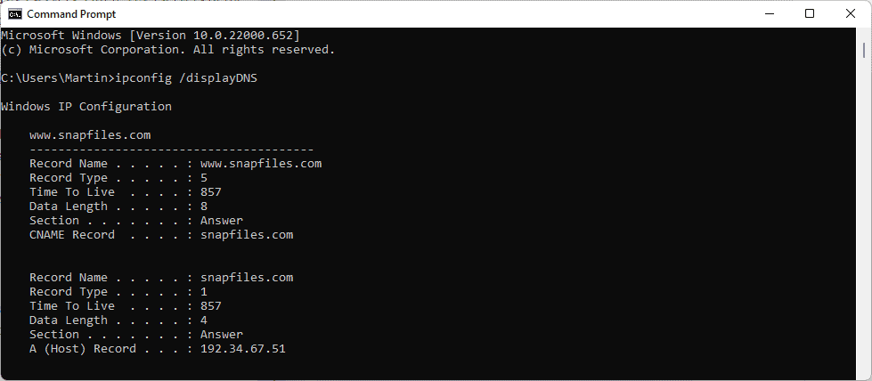

The Windows operating system uses a cache for DNS entries. DNS (Domain Name System) is a core technology of the Internet that is being used for communication. In particular, it is used to lookup IP addresses of domain names.  

Windows 操作系统使用 DNS 条目缓存。 DNS（域名系统）是用于通信的互联网的核心技术。特别是，它用于查找域名的IP地址。

When users type a domain name in the browser, one of the first tasks that is executed when the site is loaded is to look up its IP address. The process requires access to DNS servers. Often, DNS servers of the Internet Service Provider are used automatically, but administrators may switch to other DNS servers, as these may be faster or offer better privacy.  

当用户在浏览器中输入域名时，加载站点时执行的第一个任务就是查找其 IP 地址。该过程需要访问 DNS 服务器。通常，互联网服务提供商的 DNS 服务器会自动使用，但管理员可能会切换到其他 DNS 服务器，因为这些服务器可能更快或提供更好的隐私。

[Switching DNS providers may also help bypass Internet censorship](https://www.ghacks.net/2006/12/20/internet-censorship-101-dns-server-filtering/), if DNS is used to block access to certain sites.  

如果 DNS 用于阻止对某些站点的访问，则切换 DNS 提供商也可能有助于绕过互联网审查。

Windows uses the DNS resolver cache to speed up lookups. Each DNS lookup is added to the cache to speed up consecutive visits to the domains. Sometimes, entries may become old and may point to the wrong IP address. [Our guide on fixing resolving host issues](https://www.ghacks.net/2016/10/20/how-to-fix-resolving-host-issues-on-windows/) in browsers is still valid up to this day.  Flushing the cache may help with that, as it removes all cached items to start from scratch.  

Windows 使用 DNS 解析器缓存来加快查找速度。每次 DNS 查找都会添加到缓存中，以加快对域的连续访问。有时，条目可能会变旧并且可能指向错误的 IP 地址。我们关于解决浏览器中主机问题的指南至今仍然有效。刷新缓存可能会有所帮助，因为它会删除所有缓存的项目以从头开始。

Tip: you may use the [free software DNSLookupView to log all DNS activity on Windows](https://www.ghacks.net/2021/08/12/log-all-dns-activity-on-your-windows-pcs-with-dnslookupview/).  

提示：您可以使用免费软件 DNSLookupView 记录 Windows 上的所有 DNS 活动。

## Display all cached DNS entries  

显示所有缓存的 DNS 条目

The list of  cached entries can be useful for a number of purposes. Webmasters and developers may check if the correct IP address is assigned to a property, and users may be interested in seeing all entries, e.g., to find out which domains have been accessed during a session.  

缓存条目列表可用于多种用途。网站管理员和开发人员可能会检查是否为某个属性分配了正确的 IP 地址，并且用户可能有兴趣查看所有条目，例如找出在会话期间访问了哪些域。

1.  Open the run box with the shortcut Windows-R.  
    
    使用快捷方式 Windows-R 打开运行框。
2.  Type cmd.exe and hit the Enter-key.  
    
    键入 cmd.exe 并按 Enter 键。
3.  Type **ipconfig /displayDNS** to run the command.  
    
    键入 ipconfig /displayDNS 运行该命令。

Windows returns all cached DNS entries in a long list. You may also redirect the output to a plain text file by running the command **ipconfig /displayDNS > %USERPROFILE%\\Desktop\\dns.txt**. This saves the output to the file dns.txt on the desktop.  

Windows 以长列表形式返回所有缓存的 DNS 条目。您还可以通过运行命令 ipconfig /displayDNS > %USERPROFILE%\\Desktop\\dns.txt 将输出重定向到纯文本文件。这会将输出保存到桌面上的文件 dns.txt 中。

The very same command can also be run using PowerShell:  

也可以使用 PowerShell 运行相同的命令：

1.  Open Start, type PowerShell and select the result. If you have Terminal installed, type Terminal instead and select that result.  
    
    打开“开始”，键入 PowerShell 并选择结果。如果您安装了终端，请输入 Terminal 并选择该结果。
2.  Run the command **powershell "Get-DnsClientCache | Format-Table -AutoSize"**.  
    
    运行命令 powershell“Get-DnsClientCache | Format-Table -AutoSize”。

The output uses better formatting. You may redirect the output to a text file as well using the command  **powershell "Get-DnsClientCache | Format-Table -AutoSize" >%USERPROFILE%\\Desktop\\DNS.txt**.  

输出使用更好的格式。您也可以使用命令 powershell“Get-DnsClientCache | Format-Table -AutoSize”>%USERPROFILE%\\Desktop\\DNS.txt 将输出重定向到文本文件。

[To flush the DNS cache](https://www.ghacks.net/2011/03/13/how-to-flush-the-dns-cache-in-windows/), run the command **ipconfig /flushdns.** Check out this guide if you are getting the [error Could not flush the DNS Resolver](https://www.ghacks.net/2009/06/28/could-not-flush-the-dns-resolver-cache/).  

要刷新 DNS 缓存，请运行命令 ipconfig /flushdns。如果您收到错误“无法刷新 DNS 解析器”，请查看本指南。

**Now You**: which DNS provider do you use? (via [Eleven Forum](https://www.elevenforum.com/t/display-dns-resolver-cache-in-windows-11.6319/))  

现在您：您使用哪个 DNS 提供商？ （来自十一论坛）
