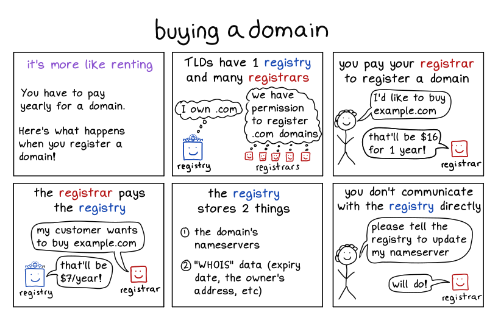
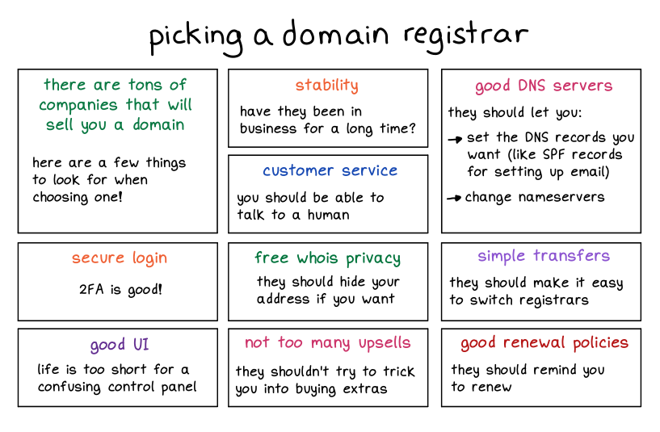
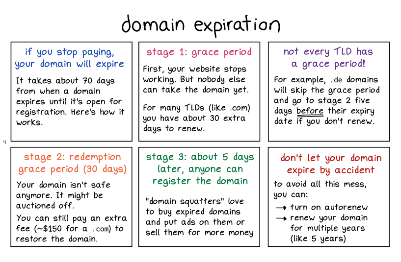
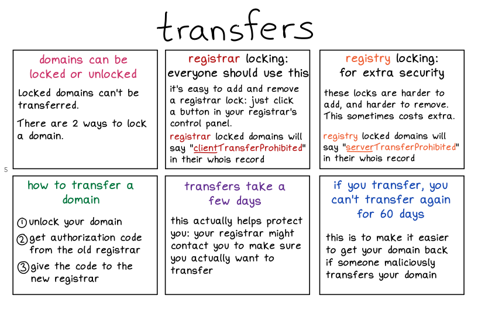
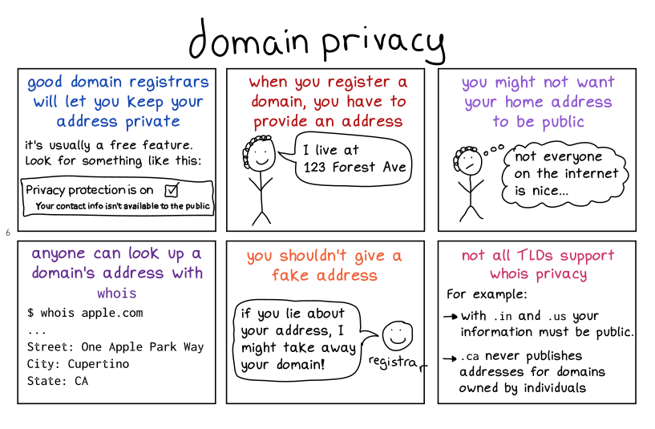
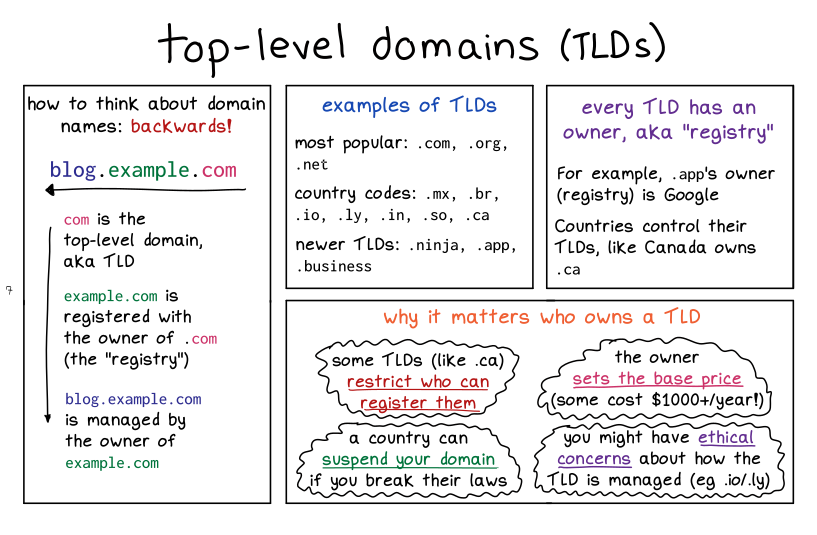
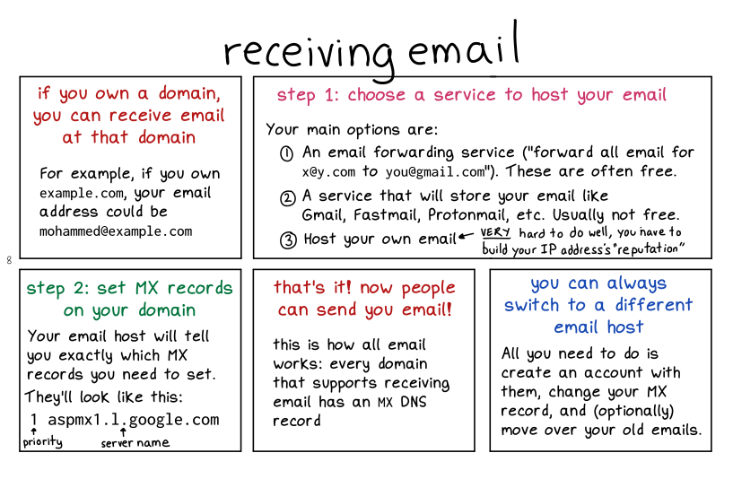
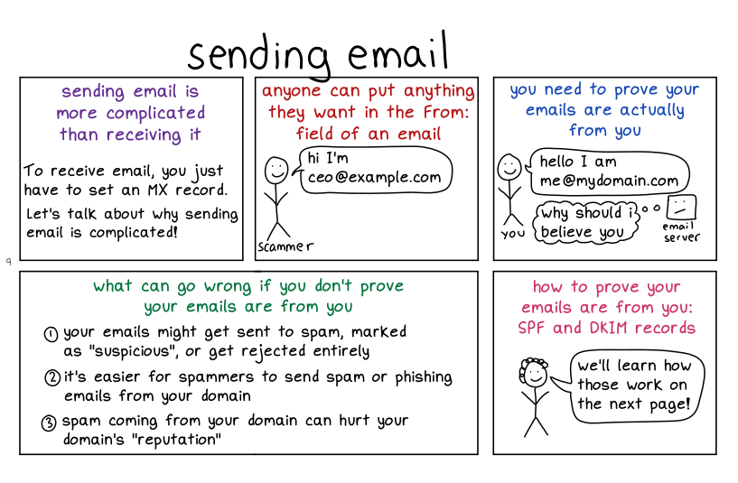
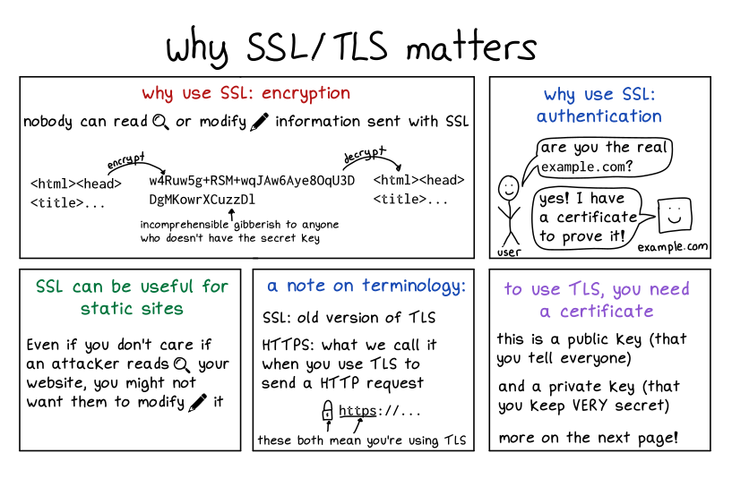
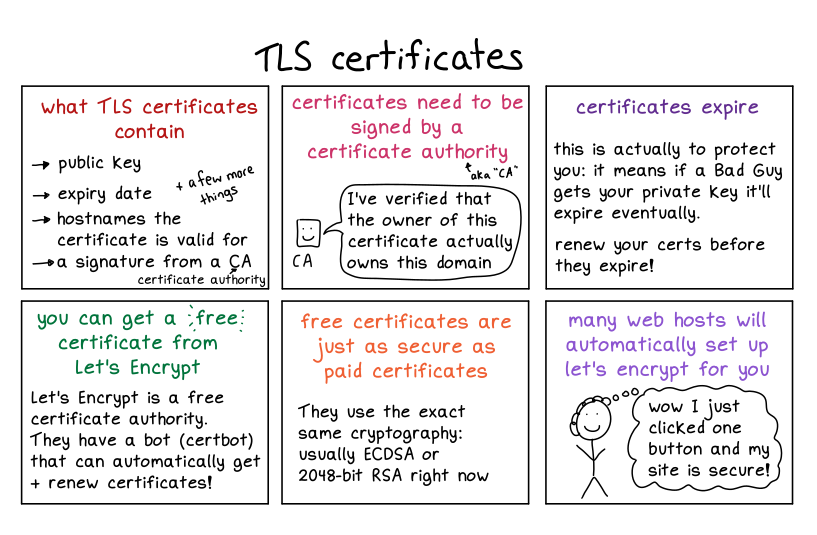

Hello! A couple weeks ago I released a new zine called [How DNS Works](https://wizardzines.com/zines/dns/).  

你好！几周前，我发布了一本新杂志，名为 How DNS Works。

When I started writing that zine (in, uh, January 2021), I originally had in mind a broader zine on “everything you need to know to own a domain”. So it had a bunch of pages on domain registration, TLS, and email.  

当我开始写那本杂志时（嗯，2021 年 1 月），我最初想到的是一本更广泛的杂志，主题是“拥有域名所需了解的一切”。所以它有很多关于域名注册、TLS 和电子邮件的页面。

At the time I thought “I can just explain DNS in like 5 pages, it’s not that complicated, there will be lots of space for other topics about domains”. I was extremely wrong about that and it turned out I needed all 28 pages to explain DNS. So I ended up deciding to just focus the zine on DNS and all those other topics didn’t make it into the final zine.  

当时我想“我可以用大约 5 页来解释 DNS，它并没有那么复杂，还有很多空间可以讨论有关域的其他主题”。我的想法大错特错，结果我需要全部 28 页来解释 DNS。因此，我最终决定将杂志的重点放在 DNS 上，所有其他主题都没有进入最终的杂志。

This morning it occurred to me that instead of letting all of the old draft pages languish in purgatory on my hard drive, I could post those extra pages here all together on my blog. So here they are!  

今天早上我突然想到，与其让所有旧的草稿页面在我的硬盘驱动器上的炼狱中萎靡不振，不如我可以将这些额外的页面一起发布在我的博客上。所以他们来了！

### disclaimer: not super cohesive  

免责声明：不是超级有凝聚力

I will say (as a disclaimer) that these pages aren’t as cohesive as I usually like my zines to be and they definitely do not tell you everything you need to need to know to own a domain.  

我会说（作为免责声明），这些页面不像我通常喜欢的杂志那样具有凝聚力，而且它们绝对不会告诉您拥有域名所需知道的一切。

### domain registration 域名注册

     

### email 电子邮件

 

I should say that these 2 pages don’t really do email justice – email security is a HUGE topic that honestly I don’t know a lot about.  

我应该说这两页并没有真正公正地对待电子邮件——电子邮件安全是一个巨大的话题，老实说我对此了解不多。

### TLS

 

These two pages also don’t remotely cover TLS, it’s possible I’ll write more in depth about TLS at some point. Who knows!  

这两页也没有远程涵盖 TLS，我可能会在某个时候更深入地写一些有关 TLS 的文章。谁知道！

### that’s all! 就这样！

though I will say: if you liked these, you might be interested in buying [How DNS Works](https://wizardzines.com/zines/dns/) :)  

不过我会说：如果您喜欢这些，您可能有兴趣购买“DNS 工作原理”:)
