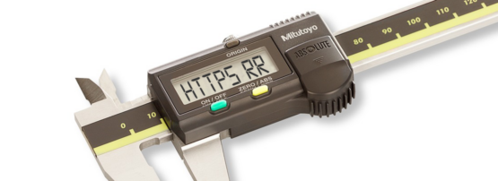
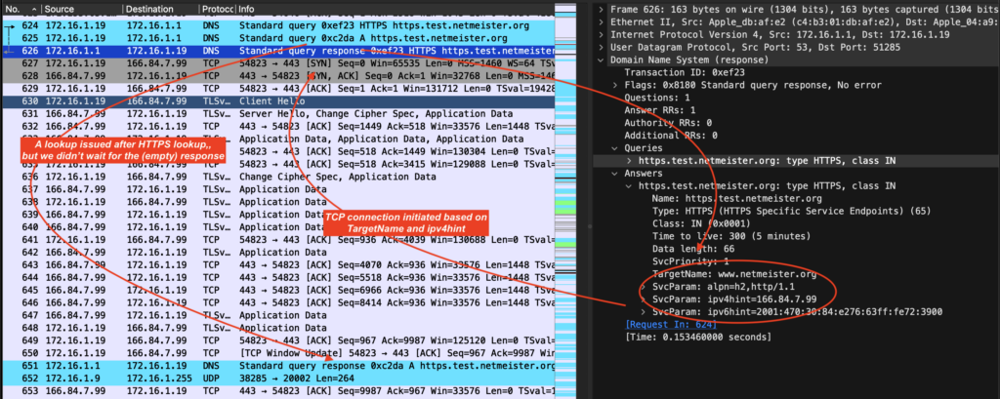
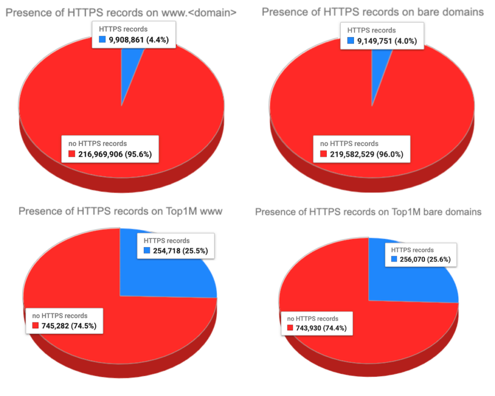

Good news, everybody — we have new [DNS resource records](https://www.netmeister.org/blog/dns-rrs.html)! Well, not _new_ new, but, you know, new_ish_. You’ve probably heard of them, or even seen them actively in use, even though they moved from Internet draft to formal [RFC 9460](https://www.rfc-editor.org/rfc/rfc9460.html) adoption literally while I was working on this blog post — the [SVCB](https://www.netmeister.org/blog/dns-rrs.html#svcb) and [HTTPS](https://www.netmeister.org/blog/dns-rrs.html#https) resource records.  

大家好消息 — 我们有了新的 DNS 资源记录！嗯，不是新的，而是，你知道，新的。您可能听说过它们，甚至看到它们在积极使用，尽管在我撰写这篇博文时它们已从互联网草案转变为正式的 RFC 9460 采用 - SVCB 和 HTTPS 资源记录。

There are a few interesting things to note about these records. They allow you to speed up your time-to-first-packet (by basically stuffing the [Alt-Svc](https://hstspreload.org/) HTTP header / [ALPN TLS extension](https://datatracker.ietf.org/doc/html/rfc7301) into the DNS), let you do redirection on the zone apex without [using CNAMEs](https://www.netmeister.org/blog/naked-domains.html#cnames), allow for simple DNS load distribution and failover, obviate [HSTS](https://hstspreload.org/) and the cumbersome [preloading](https://hstspreload.org/) process, and enable stronger privacy protections via [Encrypted Client Hello](https://datatracker.ietf.org/doc/html/draft-ietf-tls-esni-17) (ECH, previously ESNI). Pretty neat, all that.  

关于这些记录，有一些有趣的事情需要注意。它们允许您加快第一个数据包的时间（基本上通过将 Alt-Svc HTTP 标头/ALPN TLS 扩展填充到 DNS 中），让您在不使用 CNAME 的情况下在区域顶点上进行重定向，允许简单的 DNS 负载分发和故障转移，消除 HSTS 和繁琐的预加载过程，并通过加密客户端 Hello（ECH，以前的 ESNI）实现更强大的隐私保护。非常整洁，所有这些。

The record’s main drawback is basically the name. Trying to search the web for information about ‘HTTPS’ is a lot like asking your local library whether they have any books with words.  

该唱片的主要缺点基本上是名称。尝试在网络上搜索有关“HTTPS”的信息很像询问当地图书馆是否有任何带有文字的书籍。

You can find great explanations of these records elsewhere (for example, [here](https://www.isc.org/docs/2022-webinar-dns-scvb.pdf), [here](https://www.domaintools.com/resources/blog/the-use-cases-and-benefits-of-svcb-and-https-dns-record-types/), or [here](https://www.sobyte.net/post/2022-01/dns-svcb-https/)), but let’s give a quick example:  

您可以在其他地方（例如，此处、此处或此处）找到这些记录的详细解释，但让我们举一个简单的示例：

```
$ dig +short https https.test.netmeister.org
1 www.netmeister.org. alpn="h2,http/1.1" ipv4hint=166.84.7.99 ipv6hint=2001:470:30:84:e276:63ff:fe72:3900
$ host https.test.netmeister.org
$
```

With no A or AAAA records, but the above HTTPS record in place, you should still be able to connect directly to https.test.netmeister.org (Safari gets this right. Firefox only looks up HTTPS records when using DoH, but then also does the right thing. Chrome, as of October 2023 [does not support other target names nor use the IP hints](https://bugs.chromium.org/p/chromium/issues/detail?id=1494759) in the record.) On the wire, that looks like so (click the image to see the full size):  

如果没有 A 或 AAAA 记录，但上面的 HTTPS 记录已到位，您仍然应该能够直接连接到 https.test.netmeister.org （ Safari 做到了这一点。Firefox 在使用 DoH 时仅查找 HTTPS 记录，但随后也会执行正确的操作。截至 2023 年 10 月，Chrome 不支持其他目标名称，也不使用记录中的 IP 提示。 ）在电线上，看起来像这样（单击图像查看完整尺寸）：

[](https://blog.apnic.net/wp-content/uploads/2023/12/Fig1-https-lookup.png)

Figure 1 — HTTPS lookup.  

图 1 — HTTPS 查找。

In Figure 1, you’ll find our HTTPS record lookup in packet #624, followed by an A record lookup in #625, and the HTTPS result in #626. Notice that we then make a TCP connection immediately in packet #627 and begin our TLS handshake in #630, without waiting for the (empty) A record result, which finally arrives in packet #651, showing the use of the ipv4hint from the HTTPS result.  

在图 1 中，您将在数据包 #624 中找到我们的 HTTPS 记录查找，然后在 #625 中找到 A 记录查找，以及 HTTPS 结果第626章请注意，我们随后在数据包 #627 中立即建立 TCP 连接，并在 #630 中开始 TLS 握手，而无需等待（空） A 记录结果，该结果最终在数据包 #651 中到达，显示了使用情况 ipv4hint 来自 HTTPS 结果。

## HTTPS records in the wild  

野外 HTTPS 记录

Despite just emerging from draft status, we’re already seeing some notable adoption across the industry: Firefox has been making HTTPS lookups (albeit only over DoH) [since May 2020](https://bugzilla.mozilla.org/show_bug.cgi?id=1623126), Apple’s iOS and Safari / macOS [since September 2020](https://mailarchive.ietf.org/arch/msg/quic/sFgifP9vOY9xsmogVqiq-qtxPiQ/), Chrome has had partial support [since December 2020](https://groups.google.com/a/chromium.org/g/blink-dev/c/brZTXr6-2PU), and just recently [enabled ECH](https://groups.google.com/a/chromium.org/g/blink-dev/c/CmlXjQeNWDI/m/hx-_4lNBAQAJ) by default. Various [DNS](https://ns1.com/blog/ns1-announces-support-for-svcb-and-https-records) [service providers](https://community.akamai.com/customers/s/article/NetworkOperatorCommunityNewSVCBHTTPSResourceRecordsinthewild20201128135350?language=en_US) also offer support for HTTPS and SVCB records.  

尽管刚刚脱离草案状态，但我们已经看到整个行业的一些显着采用：Firefox 自 2020 年 5 月以来一直在进行 HTTPS 查找（尽管仅通过 DoH），Apple 的 iOS 和 Safari / macOS 自 2020 年 9 月以来，Chrome 自 2020 年 12 月起已提供部分支持，最近刚刚默认启用了 ECH。各种 DNS 服务提供商还提供对 HTTPS 和 SVCB 记录的支持。

So with all that, I was curious to see just what the actual adoption of these records is in the wild. I ignored the more generic SVCB record (since it requires knowledge of the scheme and possibly port) and focused only on the HTTPS record, for which I then performed DNS lookups for approximately 227M second-level domain names (for example, example.com). I then repeated the lookups, prefixing each name with www. Finally, I repeated the same exercise for the [Tranco Top1M](https://tranco-list.eu/) domains.  

因此，我很好奇这些记录的实际应用情况如何。我忽略了更通用的 SVCB 记录（因为它需要了解方案和可能的端口）并仅关注 HTTPS 记录，然后我为此执行了大约 227M 秒的 DNS 查找- 级域名（例如， example.com ）。然后，我重复查找，为每个名称添加前缀 www 。最后，我对 Tranco Top1M 域重复了相同的练习。

Logically, the Top1M domains ought to all fall into the comprehensive list of all second-level domain names, but unfortunately, not all second-level domains make available their zones, meaning my list of second-level domains does not include several of the names found in the Top1M list (the missing names generally are those found in ccTLDs that don’t publish their zones for research).  

从逻辑上讲，Top1M域名应该都属于所有二级域名的综合列表，但不幸的是，并非所有二级域名都提供其区域，这意味着我的二级域名列表不包括其中的几个名称在 Top1M 列表中找到（缺失的名称通常是在不发布其区域用于研究的 ccTLD 中找到的名称）。

I then analysed the data collected for the different features the record provides. Let’s take a look at how these are used!

### Presence of HTTPS records

Not surprisingly, the overall adoption of these records is still low. However, it is not _negligible_. As of October 2023, I found almost 10 million domains using an HTTPS record for their www service names (~4.4%), and around 9.1 million domains (~ 4.0%) using the record on their bare second-level domain name. For the Top1M domains, there were around 22.5K (25.5%) for the www service names, and almost 24K (25.6%) bare domains using HTTPS records (Figure 2).

[](https://blog.apnic.net/wp-content/uploads/2023/12/Figure-2-Presecnce-of-HTTPS-records.png)

Figure 2 — Presence of HTTPS records.

### SvcPriority

The HTTPS record has the following format:

```
SvcPriority TargetName SvcParams
```

The SvcPriority field indicates the _mode_ of the HTTPS record: 0 indicates _AliasMode_ (generally intended to allow aliasing at the zone apex), and any other value indicates _ServiceMode_.

As such, you might expect a SvcPriority of 0 to be more frequently encountered on the bare domain names, with _ServiceMode_ being indicated for the www. subdomains. However, I found that virtually _all_ existing HTTPS records are in _ServiceMode_ (Table 1):

<table id="wpdtSimpleTable-154" data-column="8" data-rows="7" data-wpid="154" data-responsive="0" data-has-header="0" data-immersive-translate-effect="1" data-immersive_translate_walked="b7ad7201-38a8-41cf-ad98-5013372fb10e"><tbody data-immersive-translate-effect="1" data-immersive_translate_walked="b7ad7201-38a8-41cf-ad98-5013372fb10e"><tr data-immersive-translate-effect="1" data-immersive_translate_walked="b7ad7201-38a8-41cf-ad98-5013372fb10e"><td colspan="2" rowspan="1" data-cell-id="A1" data-col-index="0" data-row-index="0" data-immersive-translate-effect="1" data-immersive_translate_walked="b7ad7201-38a8-41cf-ad98-5013372fb10e">All bare domains</td><td colspan="2" rowspan="1" data-cell-id="C1" data-col-index="2" data-row-index="0" data-immersive-translate-effect="1" data-immersive_translate_walked="b7ad7201-38a8-41cf-ad98-5013372fb10e">All www.</td><td colspan="2" rowspan="1" data-cell-id="E1" data-col-index="4" data-row-index="0" data-immersive-translate-effect="1" data-immersive_translate_walked="b7ad7201-38a8-41cf-ad98-5013372fb10e">Top1M bare domains</td><td colspan="2" rowspan="1" data-cell-id="G1" data-col-index="6" data-row-index="0" data-immersive-translate-effect="1" data-immersive_translate_walked="b7ad7201-38a8-41cf-ad98-5013372fb10e">Top1M www.</td></tr><tr data-immersive-translate-effect="1" data-immersive_translate_walked="b7ad7201-38a8-41cf-ad98-5013372fb10e"><td data-cell-id="A2" data-col-index="0" data-row-index="1" data-immersive-translate-effect="1" data-immersive_translate_walked="b7ad7201-38a8-41cf-ad98-5013372fb10e">Priority</td><td data-cell-id="B2" data-col-index="1" data-row-index="1" data-immersive-translate-effect="1" data-immersive_translate_walked="b7ad7201-38a8-41cf-ad98-5013372fb10e">Count</td><td data-cell-id="C2" data-col-index="2" data-row-index="1" data-immersive-translate-effect="1" data-immersive_translate_walked="b7ad7201-38a8-41cf-ad98-5013372fb10e">Priority</td><td data-cell-id="D2" data-col-index="3" data-row-index="1" data-immersive-translate-effect="1" data-immersive_translate_walked="b7ad7201-38a8-41cf-ad98-5013372fb10e">Count</td><td data-cell-id="E2" data-col-index="4" data-row-index="1" data-immersive-translate-effect="1" data-immersive_translate_walked="b7ad7201-38a8-41cf-ad98-5013372fb10e">Priority</td><td data-cell-id="F2" data-col-index="5" data-row-index="1" data-immersive-translate-effect="1" data-immersive_translate_walked="b7ad7201-38a8-41cf-ad98-5013372fb10e">Count</td><td data-cell-id="G2" data-col-index="6" data-row-index="1" data-immersive-translate-effect="1" data-immersive_translate_walked="b7ad7201-38a8-41cf-ad98-5013372fb10e">Priority</td><td data-cell-id="H2" data-col-index="7" data-row-index="1" data-immersive-translate-effect="1" data-immersive_translate_walked="b7ad7201-38a8-41cf-ad98-5013372fb10e">Count</td></tr><tr data-immersive-translate-effect="1" data-immersive_translate_walked="b7ad7201-38a8-41cf-ad98-5013372fb10e"><td data-cell-id="A3" data-col-index="0" data-row-index="2" data-immersive-translate-effect="1" data-immersive_translate_walked="b7ad7201-38a8-41cf-ad98-5013372fb10e">1</td><td data-cell-id="B3" data-col-index="1" data-row-index="2" data-immersive-translate-effect="1" data-immersive_translate_walked="b7ad7201-38a8-41cf-ad98-5013372fb10e">9,902,756</td><td data-cell-id="C3" data-col-index="2" data-row-index="2" data-immersive-translate-effect="1" data-immersive_translate_walked="b7ad7201-38a8-41cf-ad98-5013372fb10e">1</td><td data-cell-id="D3" data-col-index="3" data-row-index="2" data-immersive-translate-effect="1" data-immersive_translate_walked="b7ad7201-38a8-41cf-ad98-5013372fb10e">10,069,638</td><td data-cell-id="E3" data-col-index="4" data-row-index="2" data-immersive-translate-effect="1" data-immersive_translate_walked="b7ad7201-38a8-41cf-ad98-5013372fb10e">1</td><td data-cell-id="F3" data-col-index="5" data-row-index="2" data-immersive-translate-effect="1" data-immersive_translate_walked="b7ad7201-38a8-41cf-ad98-5013372fb10e">255,940</td><td data-cell-id="G3" data-col-index="6" data-row-index="2" data-immersive-translate-effect="1" data-immersive_translate_walked="b7ad7201-38a8-41cf-ad98-5013372fb10e">1</td><td data-cell-id="H3" data-col-index="7" data-row-index="2" data-immersive-translate-effect="1" data-immersive_translate_walked="b7ad7201-38a8-41cf-ad98-5013372fb10e">254,605</td></tr><tr data-immersive-translate-effect="1" data-immersive_translate_walked="b7ad7201-38a8-41cf-ad98-5013372fb10e"><td data-cell-id="A4" data-col-index="0" data-row-index="3" data-immersive-translate-effect="1" data-immersive_translate_walked="b7ad7201-38a8-41cf-ad98-5013372fb10e">0</td><td data-cell-id="B4" data-col-index="1" data-row-index="3" data-immersive-translate-effect="1" data-immersive_translate_walked="b7ad7201-38a8-41cf-ad98-5013372fb10e">4,905</td><td data-cell-id="C4" data-col-index="2" data-row-index="3" data-immersive-translate-effect="1" data-immersive_translate_walked="b7ad7201-38a8-41cf-ad98-5013372fb10e">0</td><td data-cell-id="D4" data-col-index="3" data-row-index="3" data-immersive-translate-effect="1" data-immersive_translate_walked="b7ad7201-38a8-41cf-ad98-5013372fb10e">5,173</td><td data-cell-id="E4" data-col-index="4" data-row-index="3" data-immersive-translate-effect="1" data-immersive_translate_walked="b7ad7201-38a8-41cf-ad98-5013372fb10e">0</td><td data-cell-id="F4" data-col-index="5" data-row-index="3" data-immersive-translate-effect="1" data-immersive_translate_walked="b7ad7201-38a8-41cf-ad98-5013372fb10e">45</td><td data-cell-id="G4" data-col-index="6" data-row-index="3" data-immersive-translate-effect="1" data-immersive_translate_walked="b7ad7201-38a8-41cf-ad98-5013372fb10e">2</td><td data-cell-id="H4" data-col-index="7" data-row-index="3" data-immersive-translate-effect="1" data-immersive_translate_walked="b7ad7201-38a8-41cf-ad98-5013372fb10e">68</td></tr><tr data-immersive-translate-effect="1" data-immersive_translate_walked="b7ad7201-38a8-41cf-ad98-5013372fb10e"><td data-cell-id="A5" data-col-index="0" data-row-index="4" data-immersive-translate-effect="1" data-immersive_translate_walked="b7ad7201-38a8-41cf-ad98-5013372fb10e">5</td><td data-cell-id="B5" data-col-index="1" data-row-index="4" data-immersive-translate-effect="1" data-immersive_translate_walked="b7ad7201-38a8-41cf-ad98-5013372fb10e">78</td><td data-cell-id="C5" data-col-index="2" data-row-index="4" data-immersive-translate-effect="1" data-immersive_translate_walked="b7ad7201-38a8-41cf-ad98-5013372fb10e">2</td><td data-cell-id="D5" data-col-index="3" data-row-index="4" data-immersive-translate-effect="1" data-immersive_translate_walked="b7ad7201-38a8-41cf-ad98-5013372fb10e">3,285</td><td data-cell-id="E5" data-col-index="4" data-row-index="4" data-immersive-translate-effect="1" data-immersive_translate_walked="b7ad7201-38a8-41cf-ad98-5013372fb10e">10</td><td data-cell-id="F5" data-col-index="5" data-row-index="4" data-immersive-translate-effect="1" data-immersive_translate_walked="b7ad7201-38a8-41cf-ad98-5013372fb10e">10</td><td data-cell-id="G5" data-col-index="6" data-row-index="4" data-immersive-translate-effect="1" data-immersive_translate_walked="b7ad7201-38a8-41cf-ad98-5013372fb10e">0</td><td data-cell-id="H5" data-col-index="7" data-row-index="4" data-immersive-translate-effect="1" data-immersive_translate_walked="b7ad7201-38a8-41cf-ad98-5013372fb10e">13</td></tr><tr data-immersive-translate-effect="1" data-immersive_translate_walked="b7ad7201-38a8-41cf-ad98-5013372fb10e"><td data-cell-id="A6" data-col-index="0" data-row-index="5" data-immersive-translate-effect="1" data-immersive_translate_walked="b7ad7201-38a8-41cf-ad98-5013372fb10e">2</td><td data-cell-id="B6" data-col-index="1" data-row-index="5" data-immersive-translate-effect="1" data-immersive_translate_walked="b7ad7201-38a8-41cf-ad98-5013372fb10e">76</td><td data-cell-id="C6" data-col-index="2" data-row-index="5" data-immersive-translate-effect="1" data-immersive_translate_walked="b7ad7201-38a8-41cf-ad98-5013372fb10e">10</td><td data-cell-id="D6" data-col-index="3" data-row-index="5" data-immersive-translate-effect="1" data-immersive_translate_walked="b7ad7201-38a8-41cf-ad98-5013372fb10e">132</td><td data-cell-id="E6" data-col-index="4" data-row-index="5" data-immersive-translate-effect="1" data-immersive_translate_walked="b7ad7201-38a8-41cf-ad98-5013372fb10e">9</td><td data-cell-id="F6" data-col-index="5" data-row-index="5" data-immersive-translate-effect="1" data-immersive_translate_walked="b7ad7201-38a8-41cf-ad98-5013372fb10e">7</td><td data-cell-id="G6" data-col-index="6" data-row-index="5" data-immersive-translate-effect="1" data-immersive_translate_walked="b7ad7201-38a8-41cf-ad98-5013372fb10e">9</td><td data-cell-id="H6" data-col-index="7" data-row-index="5" data-immersive-translate-effect="1" data-immersive_translate_walked="b7ad7201-38a8-41cf-ad98-5013372fb10e">4</td></tr><tr data-immersive-translate-effect="1" data-immersive_translate_walked="b7ad7201-38a8-41cf-ad98-5013372fb10e"><td data-cell-id="A7" data-col-index="0" data-row-index="6" data-immersive-translate-effect="1" data-immersive_translate_walked="b7ad7201-38a8-41cf-ad98-5013372fb10e">28 others</td><td data-cell-id="B7" data-col-index="1" data-row-index="6" data-immersive-translate-effect="1" data-immersive_translate_walked="b7ad7201-38a8-41cf-ad98-5013372fb10e">560</td><td data-cell-id="C7" data-col-index="2" data-row-index="6" data-immersive-translate-effect="1" data-immersive_translate_walked="b7ad7201-38a8-41cf-ad98-5013372fb10e">18 others</td><td data-cell-id="D7" data-col-index="3" data-row-index="6" data-immersive-translate-effect="1" data-immersive_translate_walked="b7ad7201-38a8-41cf-ad98-5013372fb10e">1,010</td><td data-cell-id="E7" data-col-index="4" data-row-index="6" data-immersive-translate-effect="1" data-immersive_translate_walked="b7ad7201-38a8-41cf-ad98-5013372fb10e">11 others</td><td data-cell-id="F7" data-col-index="5" data-row-index="6" data-immersive-translate-effect="1" data-immersive_translate_walked="b7ad7201-38a8-41cf-ad98-5013372fb10e">68</td><td data-cell-id="G7" data-col-index="6" data-row-index="6" data-immersive-translate-effect="1" data-immersive_translate_walked="b7ad7201-38a8-41cf-ad98-5013372fb10e">8 others</td><td data-cell-id="H7" data-col-index="7" data-row-index="6" data-immersive-translate-effect="1" data-immersive_translate_walked="b7ad7201-38a8-41cf-ad98-5013372fb10e">28</td></tr></tbody></table>

Table 1 — Nearly all existing HTTPS records are in _ServiceMode_.

There are a handful of other priorities set, as well as a number of records that have _no_ priority set (erroneous records, likely mistyped), but clearly, _ServiceMode_ is the primary use case right now. I expect this to change as support for HTTPS records increases and organizations begin to adopt them to resolve the ‘no CNAMEs at the apex’ problem. On the other hand, _AliasMode_ currently does not permit _SvcParams_ to be set, so perhaps those will ultimately cause _ServiceMode_ to remain the dominant use.

### TargetName

> In ServiceMode, the TargetName and SvcParams within each RR associate an alternative endpoint for the service with its connection parameters.
> 
> [RFC 9460](https://www.rfc-editor.org/rfc/rfc9460.html), Sec. 2.4.3

The TargetName field also shows that early adopters of these records do not use them to redirect traffic; virtually all records have the TargetName set to ., meaning the record owner’s name is used:

<table id="wpdtSimpleTable-155" data-column="4" data-rows="12" data-wpid="155" data-responsive="0" data-has-header="0" data-immersive-translate-effect="1" data-immersive_translate_walked="b7ad7201-38a8-41cf-ad98-5013372fb10e"><tbody data-immersive-translate-effect="1" data-immersive_translate_walked="b7ad7201-38a8-41cf-ad98-5013372fb10e"><tr data-immersive-translate-effect="1" data-immersive_translate_walked="b7ad7201-38a8-41cf-ad98-5013372fb10e"><td colspan="2" rowspan="1" data-cell-id="A1" data-col-index="0" data-row-index="0" data-immersive-translate-effect="1" data-immersive_translate_walked="b7ad7201-38a8-41cf-ad98-5013372fb10e">All bare domains</td><td colspan="2" rowspan="1" data-cell-id="C1" data-col-index="2" data-row-index="0" data-immersive-translate-effect="1" data-immersive_translate_walked="b7ad7201-38a8-41cf-ad98-5013372fb10e">All&nbsp;www.&nbsp;subdomains</td></tr><tr data-immersive-translate-effect="1" data-immersive_translate_walked="b7ad7201-38a8-41cf-ad98-5013372fb10e"><td data-cell-id="A2" data-col-index="0" data-row-index="1" data-immersive-translate-effect="1" data-immersive_translate_walked="b7ad7201-38a8-41cf-ad98-5013372fb10e">TargetName</td><td data-cell-id="B2" data-col-index="1" data-row-index="1" data-immersive-translate-effect="1" data-immersive_translate_walked="b7ad7201-38a8-41cf-ad98-5013372fb10e">Count</td><td data-cell-id="C2" data-col-index="2" data-row-index="1" data-immersive-translate-effect="1" data-immersive_translate_walked="b7ad7201-38a8-41cf-ad98-5013372fb10e">TargetName</td><td data-cell-id="D2" data-col-index="3" data-row-index="1" data-immersive-translate-effect="1" data-immersive_translate_walked="b7ad7201-38a8-41cf-ad98-5013372fb10e">Count</td></tr><tr data-immersive-translate-effect="1" data-immersive_translate_walked="b7ad7201-38a8-41cf-ad98-5013372fb10e"><td data-cell-id="A3" data-col-index="0" data-row-index="2" data-immersive-translate-effect="1" data-immersive_translate_walked="b7ad7201-38a8-41cf-ad98-5013372fb10e">.</td><td data-cell-id="B3" data-col-index="1" data-row-index="2" data-immersive-translate-effect="1" data-immersive_translate_walked="b7ad7201-38a8-41cf-ad98-5013372fb10e">9,899,763</td><td data-cell-id="C3" data-col-index="2" data-row-index="2" data-immersive-translate-effect="1" data-immersive_translate_walked="b7ad7201-38a8-41cf-ad98-5013372fb10e">.</td><td data-cell-id="D3" data-col-index="3" data-row-index="2" data-immersive-translate-effect="1" data-immersive_translate_walked="b7ad7201-38a8-41cf-ad98-5013372fb10e">9,142,658</td></tr><tr data-immersive-translate-effect="1" data-immersive_translate_walked="b7ad7201-38a8-41cf-ad98-5013372fb10e"><td data-cell-id="A4" data-col-index="0" data-row-index="3" data-immersive-translate-effect="1" data-immersive_translate_walked="b7ad7201-38a8-41cf-ad98-5013372fb10e">star.fallback.c10r.facebook.com.</td><td data-cell-id="B4" data-col-index="1" data-row-index="3" data-immersive-translate-effect="1" data-immersive_translate_walked="b7ad7201-38a8-41cf-ad98-5013372fb10e">3,159</td><td data-cell-id="C4" data-col-index="2" data-row-index="3" data-immersive-translate-effect="1" data-immersive_translate_walked="b7ad7201-38a8-41cf-ad98-5013372fb10e">geo-routing.nexuspipe.com.</td><td data-cell-id="D4" data-col-index="3" data-row-index="3" data-immersive-translate-effect="1" data-immersive_translate_walked="b7ad7201-38a8-41cf-ad98-5013372fb10e">768</td></tr><tr data-immersive-translate-effect="1" data-immersive_translate_walked="b7ad7201-38a8-41cf-ad98-5013372fb10e"><td data-cell-id="A5" data-col-index="0" data-row-index="4" data-immersive-translate-effect="1" data-immersive_translate_walked="b7ad7201-38a8-41cf-ad98-5013372fb10e">geo-routing.nexuspipe.com.</td><td data-cell-id="B5" data-col-index="1" data-row-index="4" data-immersive-translate-effect="1" data-immersive_translate_walked="b7ad7201-38a8-41cf-ad98-5013372fb10e">1,272</td><td data-cell-id="C5" data-col-index="2" data-row-index="4" data-immersive-translate-effect="1" data-immersive_translate_walked="b7ad7201-38a8-41cf-ad98-5013372fb10e">hmkb.mydefense.info.</td><td data-cell-id="D5" data-col-index="3" data-row-index="4" data-immersive-translate-effect="1" data-immersive_translate_walked="b7ad7201-38a8-41cf-ad98-5013372fb10e">128</td></tr><tr data-immersive-translate-effect="1" data-immersive_translate_walked="b7ad7201-38a8-41cf-ad98-5013372fb10e"><td data-cell-id="A6" data-col-index="0" data-row-index="5" data-immersive-translate-effect="1" data-immersive_translate_walked="b7ad7201-38a8-41cf-ad98-5013372fb10e">5,681 others</td><td data-cell-id="B6" data-col-index="1" data-row-index="5" data-immersive-translate-effect="1" data-immersive_translate_walked="b7ad7201-38a8-41cf-ad98-5013372fb10e">6,197</td><td data-cell-id="C6" data-col-index="2" data-row-index="5" data-immersive-translate-effect="1" data-immersive_translate_walked="b7ad7201-38a8-41cf-ad98-5013372fb10e">4,845 others</td><td data-cell-id="D6" data-col-index="3" data-row-index="5" data-immersive-translate-effect="1" data-immersive_translate_walked="b7ad7201-38a8-41cf-ad98-5013372fb10e">7,504</td></tr><tr data-immersive-translate-effect="1" data-immersive_translate_walked="b7ad7201-38a8-41cf-ad98-5013372fb10e"><td colspan="2" rowspan="1" data-cell-id="A7" data-col-index="0" data-row-index="6" data-immersive-translate-effect="1" data-immersive_translate_walked="b7ad7201-38a8-41cf-ad98-5013372fb10e">Top1M bare domains</td><td colspan="2" rowspan="1" data-cell-id="C7" data-col-index="2" data-row-index="6" data-immersive-translate-effect="1" data-immersive_translate_walked="b7ad7201-38a8-41cf-ad98-5013372fb10e">Top1M www. subdomains</td></tr><tr data-immersive-translate-effect="1" data-immersive_translate_walked="b7ad7201-38a8-41cf-ad98-5013372fb10e"><td data-cell-id="A8" data-col-index="0" data-row-index="7" data-immersive-translate-effect="1" data-immersive_translate_walked="b7ad7201-38a8-41cf-ad98-5013372fb10e">TargetName</td><td data-cell-id="B8" data-col-index="1" data-row-index="7" data-immersive-translate-effect="1" data-immersive_translate_walked="b7ad7201-38a8-41cf-ad98-5013372fb10e">Count</td><td data-cell-id="C8" data-col-index="2" data-row-index="7" data-immersive-translate-effect="1" data-immersive_translate_walked="b7ad7201-38a8-41cf-ad98-5013372fb10e">TargetName</td><td data-cell-id="D8" data-col-index="3" data-row-index="7" data-immersive-translate-effect="1" data-immersive_translate_walked="b7ad7201-38a8-41cf-ad98-5013372fb10e">Count</td></tr><tr data-immersive-translate-effect="1" data-immersive_translate_walked="b7ad7201-38a8-41cf-ad98-5013372fb10e"><td data-cell-id="A9" data-col-index="0" data-row-index="8" data-immersive-translate-effect="1" data-immersive_translate_walked="b7ad7201-38a8-41cf-ad98-5013372fb10e">.</td><td data-cell-id="B9" data-col-index="1" data-row-index="8" data-immersive-translate-effect="1" data-immersive_translate_walked="b7ad7201-38a8-41cf-ad98-5013372fb10e">254,600</td><td data-cell-id="C9" data-col-index="2" data-row-index="8" data-immersive-translate-effect="1" data-immersive_translate_walked="b7ad7201-38a8-41cf-ad98-5013372fb10e">.</td><td data-cell-id="D9" data-col-index="3" data-row-index="8" data-immersive-translate-effect="1" data-immersive_translate_walked="b7ad7201-38a8-41cf-ad98-5013372fb10e">255,926</td></tr><tr data-immersive-translate-effect="1" data-immersive_translate_walked="b7ad7201-38a8-41cf-ad98-5013372fb10e"><td data-cell-id="A10" data-col-index="0" data-row-index="9" data-immersive-translate-effect="1" data-immersive_translate_walked="b7ad7201-38a8-41cf-ad98-5013372fb10e">star.fallback.c10r.facebook.com.</td><td data-cell-id="B10" data-col-index="1" data-row-index="9" data-immersive-translate-effect="1" data-immersive_translate_walked="b7ad7201-38a8-41cf-ad98-5013372fb10e">65</td><td data-cell-id="C10" data-col-index="2" data-row-index="9" data-immersive-translate-effect="1" data-immersive_translate_walked="b7ad7201-38a8-41cf-ad98-5013372fb10e">.</td><td data-cell-id="D10" data-col-index="3" data-row-index="9" data-immersive-translate-effect="1" data-immersive_translate_walked="b7ad7201-38a8-41cf-ad98-5013372fb10e">geo-routing.nexuspipe.com.</td></tr><tr data-immersive-translate-effect="1" data-immersive_translate_walked="b7ad7201-38a8-41cf-ad98-5013372fb10e"><td data-cell-id="A11" data-col-index="0" data-row-index="10" data-immersive-translate-effect="1" data-immersive_translate_walked="b7ad7201-38a8-41cf-ad98-5013372fb10e">geo-routing.nexuspipe.com.</td><td data-cell-id="B11" data-col-index="1" data-row-index="10" data-immersive-translate-effect="1" data-immersive_translate_walked="b7ad7201-38a8-41cf-ad98-5013372fb10e">36</td><td data-cell-id="C11" data-col-index="2" data-row-index="10" data-immersive-translate-effect="1" data-immersive_translate_walked="b7ad7201-38a8-41cf-ad98-5013372fb10e">www</td><td data-cell-id="D11" data-col-index="3" data-row-index="10" data-immersive-translate-effect="1" data-immersive_translate_walked="b7ad7201-38a8-41cf-ad98-5013372fb10e">2</td></tr><tr data-immersive-translate-effect="1" data-immersive_translate_walked="b7ad7201-38a8-41cf-ad98-5013372fb10e"><td data-cell-id="A12" data-col-index="0" data-row-index="11" data-immersive-translate-effect="1" data-immersive_translate_walked="b7ad7201-38a8-41cf-ad98-5013372fb10e">16 others</td><td data-cell-id="B12" data-col-index="1" data-row-index="11" data-immersive-translate-effect="1" data-immersive_translate_walked="b7ad7201-38a8-41cf-ad98-5013372fb10e">17</td><td data-cell-id="C12" data-col-index="2" data-row-index="11" data-immersive-translate-effect="1" data-immersive_translate_walked="b7ad7201-38a8-41cf-ad98-5013372fb10e">54 others</td><td data-cell-id="D12" data-col-index="3" data-row-index="11" data-immersive-translate-effect="1" data-immersive_translate_walked="b7ad7201-38a8-41cf-ad98-5013372fb10e">56</td></tr></tbody></table>

Table 2 — Nearly all records have the TargetName set to . .

The two other records besides . that stand out here are star.fallback.c10r.facebook.com. and geo-routing.nexuspipe.com..

Facebook / Meta does not currently set HTTPS records on their primary domain names but uses the star.fallback name as a CNAME redirect for mistyped domains, which explains why this shows up a number of times for all of their various typo-squatting and brand-protection names:

```
$ dig +nocomments +nostats https www.instagra.com

; <<>> DiG 9.18.19 <<>>+nocomments +nostats https www.instagra.com
;; global options: +cmd
;www.instagra.com.              IN      HTTPS
www.instagra.com.       7140    IN      CNAME star.c10r.facebook.com.
star.c10r.facebook.com. 7140    IN      HTTPS   1 . alpn="h2,h3"
star.c10r.facebook.com. 7140    IN      HTTPS   2 star.fallback.c10r.facebook.com. alpn="h2,h3"
```

The other name (geo-routing.nexuspipe.com.) appears to be used by the ‘NexusPIPE’ cybersecurity company’s DNS services to load-balance or otherwise distribute traffic across different ports, one of the very few uses of the HTTPS record using different priorities and ports for this purpose:

```
dig +nostat +nocomment https www.fluxteam.net
; <<>> DiG 9.18.19 <<>> +nostat +nocomment https www.fluxteam.net
;; global options: +cmd
;www.fluxteam.net.INHTTPS
www.fluxteam.net.10INCNAMEgeo-routing.nexuspipe.com.
geo-routing.nexuspipe.com. 3472INHTTPS10 geo-routing.nexuspipe.com. alpn="h2" port=8080
geo-routing.nexuspipe.com. 3472INHTTPS6 geo-routing.nexuspipe.com. alpn="h2" port=2086
geo-routing.nexuspipe.com. 3472INHTTPS2 geo-routing.nexuspipe.com. alpn="h2" port=2052
geo-routing.nexuspipe.com. 3472INHTTPS1 geo-routing.nexuspipe.com. alpn="h2" port=443
geo-routing.nexuspipe.com. 3472INHTTPS4 geo-routing.nexuspipe.com. alpn="h2" port=2082
geo-routing.nexuspipe.com. 3472INHTTPS3 geo-routing.nexuspipe.com. alpn="h2" port=2053
geo-routing.nexuspipe.com. 3472INHTTPS5 geo-routing.nexuspipe.com. alpn="h2" port=2083
geo-routing.nexuspipe.com. 3472INHTTPS11 geo-routing.nexuspipe.com. alpn="h2" port=8880
geo-routing.nexuspipe.com. 3472INHTTPS7 geo-routing.nexuspipe.com. alpn="h2" port=2087
geo-routing.nexuspipe.com. 3472INHTTPS9 geo-routing.nexuspipe.com. alpn="h2" port=2098
geo-routing.nexuspipe.com. 3472INHTTPS12 geo-routing.nexuspipe.com. alpn="h2" port=8443
geo-routing.nexuspipe.com. 3472INHTTPS8 geo-routing.nexuspipe.com. alpn="h2" port=2095
```

### SvcParams

RFC 9460 defines the alpn, no-default-alpn, port, ipv4hint and ipv6hint, and mandatory _SvcParamKeys_. In addition, [this Internet draft](https://datatracker.ietf.org/doc/draft-ietf-tls-svcb-ech/) defines the ech SvcParamKey for [ECH](https://datatracker.ietf.org/doc/draft-ietf-tls-esni/).

#### mandatory and no-default-alpn

These two _SvcParamKeys_ are exceedingly rare. The only domains observed using them are:

-   lonios.com. (mandatory=ipv4hint,ipv6hint)
-   www.0834-3658888.com. (no-default-alpn=)
-   www.014.se. (no-default-alpn=)
-   014.se. (no-default-alpn=)

That’s right: 4 out of ~10 million HTTPS records. That’s it! Well, ok then, let’s look at the others.

#### alpn

The alpn _SvcParamKey_ is widely used: 99.9% of all HTTPS records observed do set this parameter key; only around 7.6K do not have it set. The breakdown by frequency is:

<table id="wpdtSimpleTable-156" data-column="8" data-rows="7" data-wpid="156" data-responsive="0" data-has-header="0" data-immersive-translate-effect="1" data-immersive_translate_walked="b7ad7201-38a8-41cf-ad98-5013372fb10e"><tbody data-immersive-translate-effect="1" data-immersive_translate_walked="b7ad7201-38a8-41cf-ad98-5013372fb10e"><tr data-immersive-translate-effect="1" data-immersive_translate_walked="b7ad7201-38a8-41cf-ad98-5013372fb10e"><td colspan="2" rowspan="1" data-cell-id="A1" data-col-index="0" data-row-index="0" data-immersive-translate-effect="1" data-immersive_translate_walked="b7ad7201-38a8-41cf-ad98-5013372fb10e">All bare domains</td><td colspan="2" rowspan="1" data-cell-id="C1" data-col-index="2" data-row-index="0" data-immersive-translate-effect="1" data-immersive_translate_walked="b7ad7201-38a8-41cf-ad98-5013372fb10e">All www. subdomains</td><td colspan="2" rowspan="1" data-cell-id="E1" data-col-index="4" data-row-index="0" data-immersive-translate-effect="1" data-immersive_translate_walked="b7ad7201-38a8-41cf-ad98-5013372fb10e">Top1M bare domains</td><td colspan="2" rowspan="1" data-cell-id="G1" data-col-index="6" data-row-index="0" data-immersive-translate-effect="1" data-immersive_translate_walked="b7ad7201-38a8-41cf-ad98-5013372fb10e">Top1M www. subdomains</td></tr><tr data-immersive-translate-effect="1" data-immersive_translate_walked="b7ad7201-38a8-41cf-ad98-5013372fb10e"><td data-cell-id="A2" data-col-index="0" data-row-index="1" data-immersive-translate-effect="1" data-immersive_translate_walked="b7ad7201-38a8-41cf-ad98-5013372fb10e">alpn</td><td data-cell-id="B2" data-col-index="1" data-row-index="1" data-immersive-translate-effect="1" data-immersive_translate_walked="b7ad7201-38a8-41cf-ad98-5013372fb10e">Count</td><td data-cell-id="C2" data-col-index="2" data-row-index="1" data-immersive-translate-effect="1" data-immersive_translate_walked="b7ad7201-38a8-41cf-ad98-5013372fb10e">alpn</td><td data-cell-id="D2" data-col-index="3" data-row-index="1" data-immersive-translate-effect="1" data-immersive_translate_walked="b7ad7201-38a8-41cf-ad98-5013372fb10e">Count</td><td data-cell-id="E2" data-col-index="4" data-row-index="1" data-immersive-translate-effect="1" data-immersive_translate_walked="b7ad7201-38a8-41cf-ad98-5013372fb10e">alpn</td><td data-cell-id="F2" data-col-index="5" data-row-index="1" data-immersive-translate-effect="1" data-immersive_translate_walked="b7ad7201-38a8-41cf-ad98-5013372fb10e">Count</td><td data-cell-id="G2" data-col-index="6" data-row-index="1" data-immersive-translate-effect="1" data-immersive_translate_walked="b7ad7201-38a8-41cf-ad98-5013372fb10e">alpn</td><td data-cell-id="H2" data-col-index="7" data-row-index="1" data-immersive-translate-effect="1" data-immersive_translate_walked="b7ad7201-38a8-41cf-ad98-5013372fb10e">Count</td></tr><tr data-immersive-translate-effect="1" data-immersive_translate_walked="b7ad7201-38a8-41cf-ad98-5013372fb10e"><td data-cell-id="A3" data-col-index="0" data-row-index="2" data-immersive-translate-effect="1" data-immersive_translate_walked="b7ad7201-38a8-41cf-ad98-5013372fb10e">h3, h2</td><td data-cell-id="B3" data-col-index="1" data-row-index="2" data-immersive-translate-effect="1" data-immersive_translate_walked="b7ad7201-38a8-41cf-ad98-5013372fb10e">8,888,454</td><td data-cell-id="C3" data-col-index="2" data-row-index="2" data-immersive-translate-effect="1" data-immersive_translate_walked="b7ad7201-38a8-41cf-ad98-5013372fb10e">h3, h2</td><td data-cell-id="D3" data-col-index="3" data-row-index="2" data-immersive-translate-effect="1" data-immersive_translate_walked="b7ad7201-38a8-41cf-ad98-5013372fb10e">8,987,592</td><td data-cell-id="E3" data-col-index="4" data-row-index="2" data-immersive-translate-effect="1" data-immersive_translate_walked="b7ad7201-38a8-41cf-ad98-5013372fb10e">h3, h2</td><td data-cell-id="F3" data-col-index="5" data-row-index="2" data-immersive-translate-effect="1" data-immersive_translate_walked="b7ad7201-38a8-41cf-ad98-5013372fb10e">217,709</td><td data-cell-id="G3" data-col-index="6" data-row-index="2" data-immersive-translate-effect="1" data-immersive_translate_walked="b7ad7201-38a8-41cf-ad98-5013372fb10e">h3, h2</td><td data-cell-id="H3" data-col-index="7" data-row-index="2" data-immersive-translate-effect="1" data-immersive_translate_walked="b7ad7201-38a8-41cf-ad98-5013372fb10e">209,767</td></tr><tr data-immersive-translate-effect="1" data-immersive_translate_walked="b7ad7201-38a8-41cf-ad98-5013372fb10e"><td data-cell-id="A4" data-col-index="0" data-row-index="3" data-immersive-translate-effect="1" data-immersive_translate_walked="b7ad7201-38a8-41cf-ad98-5013372fb10e">h2</td><td data-cell-id="B4" data-col-index="1" data-row-index="3" data-immersive-translate-effect="1" data-immersive_translate_walked="b7ad7201-38a8-41cf-ad98-5013372fb10e">252,445</td><td data-cell-id="C4" data-col-index="2" data-row-index="3" data-immersive-translate-effect="1" data-immersive_translate_walked="b7ad7201-38a8-41cf-ad98-5013372fb10e">h2</td><td data-cell-id="D4" data-col-index="3" data-row-index="3" data-immersive-translate-effect="1" data-immersive_translate_walked="b7ad7201-38a8-41cf-ad98-5013372fb10e">888,675</td><td data-cell-id="E4" data-col-index="4" data-row-index="3" data-immersive-translate-effect="1" data-immersive_translate_walked="b7ad7201-38a8-41cf-ad98-5013372fb10e">h2</td><td data-cell-id="F4" data-col-index="5" data-row-index="3" data-immersive-translate-effect="1" data-immersive_translate_walked="b7ad7201-38a8-41cf-ad98-5013372fb10e">37,585</td><td data-cell-id="G4" data-col-index="6" data-row-index="3" data-immersive-translate-effect="1" data-immersive_translate_walked="b7ad7201-38a8-41cf-ad98-5013372fb10e">h2</td><td data-cell-id="H4" data-col-index="7" data-row-index="3" data-immersive-translate-effect="1" data-immersive_translate_walked="b7ad7201-38a8-41cf-ad98-5013372fb10e">44,066</td></tr><tr data-immersive-translate-effect="1" data-immersive_translate_walked="b7ad7201-38a8-41cf-ad98-5013372fb10e"><td data-cell-id="A5" data-col-index="0" data-row-index="4" data-immersive-translate-effect="1" data-immersive_translate_walked="b7ad7201-38a8-41cf-ad98-5013372fb10e">h2, h3</td><td data-cell-id="B5" data-col-index="1" data-row-index="4" data-immersive-translate-effect="1" data-immersive_translate_walked="b7ad7201-38a8-41cf-ad98-5013372fb10e">685</td><td data-cell-id="C5" data-col-index="2" data-row-index="4" data-immersive-translate-effect="1" data-immersive_translate_walked="b7ad7201-38a8-41cf-ad98-5013372fb10e">h2, h3</td><td data-cell-id="D5" data-col-index="3" data-row-index="4" data-immersive-translate-effect="1" data-immersive_translate_walked="b7ad7201-38a8-41cf-ad98-5013372fb10e">7,669</td><td data-cell-id="E5" data-col-index="4" data-row-index="4" data-immersive-translate-effect="1" data-immersive_translate_walked="b7ad7201-38a8-41cf-ad98-5013372fb10e">h2, h3</td><td data-cell-id="F5" data-col-index="5" data-row-index="4" data-immersive-translate-effect="1" data-immersive_translate_walked="b7ad7201-38a8-41cf-ad98-5013372fb10e">145</td><td data-cell-id="G5" data-col-index="6" data-row-index="4" data-immersive-translate-effect="1" data-immersive_translate_walked="b7ad7201-38a8-41cf-ad98-5013372fb10e">h2, h3</td><td data-cell-id="H5" data-col-index="7" data-row-index="4" data-immersive-translate-effect="1" data-immersive_translate_walked="b7ad7201-38a8-41cf-ad98-5013372fb10e">157</td></tr><tr data-immersive-translate-effect="1" data-immersive_translate_walked="b7ad7201-38a8-41cf-ad98-5013372fb10e"><td data-cell-id="A6" data-col-index="0" data-row-index="5" data-immersive-translate-effect="1" data-immersive_translate_walked="b7ad7201-38a8-41cf-ad98-5013372fb10e">h3</td><td data-cell-id="B6" data-col-index="1" data-row-index="5" data-immersive-translate-effect="1" data-immersive_translate_walked="b7ad7201-38a8-41cf-ad98-5013372fb10e">537</td><td data-cell-id="C6" data-col-index="2" data-row-index="5" data-immersive-translate-effect="1" data-immersive_translate_walked="b7ad7201-38a8-41cf-ad98-5013372fb10e">h3</td><td data-cell-id="D6" data-col-index="3" data-row-index="5" data-immersive-translate-effect="1" data-immersive_translate_walked="b7ad7201-38a8-41cf-ad98-5013372fb10e">1,689</td><td data-cell-id="E6" data-col-index="4" data-row-index="5" data-immersive-translate-effect="1" data-immersive_translate_walked="b7ad7201-38a8-41cf-ad98-5013372fb10e">h3</td><td data-cell-id="F6" data-col-index="5" data-row-index="5" data-immersive-translate-effect="1" data-immersive_translate_walked="b7ad7201-38a8-41cf-ad98-5013372fb10e">99</td><td data-cell-id="G6" data-col-index="6" data-row-index="5" data-immersive-translate-effect="1" data-immersive_translate_walked="b7ad7201-38a8-41cf-ad98-5013372fb10e">h3</td><td data-cell-id="H6" data-col-index="7" data-row-index="5" data-immersive-translate-effect="1" data-immersive_translate_walked="b7ad7201-38a8-41cf-ad98-5013372fb10e">98</td></tr><tr data-immersive-translate-effect="1" data-immersive_translate_walked="b7ad7201-38a8-41cf-ad98-5013372fb10e"><td data-cell-id="A7" data-col-index="0" data-row-index="6" data-immersive-translate-effect="1" data-immersive_translate_walked="b7ad7201-38a8-41cf-ad98-5013372fb10e">15 others</td><td data-cell-id="B7" data-col-index="1" data-row-index="6" data-immersive-translate-effect="1" data-immersive_translate_walked="b7ad7201-38a8-41cf-ad98-5013372fb10e">65</td><td data-cell-id="C7" data-col-index="2" data-row-index="6" data-immersive-translate-effect="1" data-immersive_translate_walked="b7ad7201-38a8-41cf-ad98-5013372fb10e">12 others</td><td data-cell-id="D7" data-col-index="3" data-row-index="6" data-immersive-translate-effect="1" data-immersive_translate_walked="b7ad7201-38a8-41cf-ad98-5013372fb10e">60</td><td data-cell-id="E7" data-col-index="4" data-row-index="6" data-immersive-translate-effect="1" data-immersive_translate_walked="b7ad7201-38a8-41cf-ad98-5013372fb10e">2 others</td><td data-cell-id="F7" data-col-index="5" data-row-index="6" data-immersive-translate-effect="1" data-immersive_translate_walked="b7ad7201-38a8-41cf-ad98-5013372fb10e">2</td><td data-cell-id="G7" data-col-index="6" data-row-index="6" data-immersive-translate-effect="1" data-immersive_translate_walked="b7ad7201-38a8-41cf-ad98-5013372fb10e">5 others</td><td data-cell-id="H7" data-col-index="7" data-row-index="6" data-immersive-translate-effect="1" data-immersive_translate_walked="b7ad7201-38a8-41cf-ad98-5013372fb10e">9</td></tr></tbody></table>

Table 3 — 99.9% of all HTTPS records observed set the alpn _SvcParamKeyset_.

This also speaks to the increasing adoption of [HTTP/3](https://datatracker.ietf.org/doc/html/rfc9114).

#### ech

The ech _SvcParamKey_ is virtually unused — right now. When I first ran my data collection, Cloudflare had just [announced](https://blog.cloudflare.com/announcing-encrypted-client-hello/) that they had enabled ECH for all customers, and indeed millions of domains showed ech parameters in their HTTPS records using around 207 unique ECH values. However, soon after (and with decidedly less fanfare or any specific reasons given), Cloudflare [disabled ECH](https://community.cloudflare.com/t/early-hints-and-encrypted-client-hello-ech-are-currently-disabled-globally/567730) again, promising to re-enable it in ‘early 2024’.

As such, as of late October 2023, only three of the Top1M and 16 of all domains in total have ech parameters set:

<table id="wpdtSimpleTable-158" data-column="2" data-rows="8" data-wpid="158" data-responsive="0" data-has-header="0" data-immersive-translate-effect="1" data-immersive_translate_walked="b7ad7201-38a8-41cf-ad98-5013372fb10e"><tbody data-immersive-translate-effect="1" data-immersive_translate_walked="b7ad7201-38a8-41cf-ad98-5013372fb10e"><tr data-immersive-translate-effect="1" data-immersive_translate_walked="b7ad7201-38a8-41cf-ad98-5013372fb10e"><td data-cell-id="A1" data-col-index="0" data-row-index="0" data-immersive-translate-effect="1" data-immersive_translate_walked="b7ad7201-38a8-41cf-ad98-5013372fb10e">tls-ech.dev.</td><td data-cell-id="B1" data-col-index="1" data-row-index="0" data-immersive-translate-effect="1" data-immersive_translate_walked="b7ad7201-38a8-41cf-ad98-5013372fb10e">cloudflareresearch.com.</td></tr><tr data-immersive-translate-effect="1" data-immersive_translate_walked="b7ad7201-38a8-41cf-ad98-5013372fb10e"><td data-cell-id="A2" data-col-index="0" data-row-index="1" data-immersive-translate-effect="1" data-immersive_translate_walked="b7ad7201-38a8-41cf-ad98-5013372fb10e">17-mai.com.</td><td data-cell-id="B2" data-col-index="1" data-row-index="1" data-immersive-translate-effect="1" data-immersive_translate_walked="b7ad7201-38a8-41cf-ad98-5013372fb10e">dramateket.com.</td></tr><tr data-immersive-translate-effect="1" data-immersive_translate_walked="b7ad7201-38a8-41cf-ad98-5013372fb10e"><td data-cell-id="A3" data-col-index="0" data-row-index="2" data-immersive-translate-effect="1" data-immersive_translate_walked="b7ad7201-38a8-41cf-ad98-5013372fb10e">cloudflare-ech.com.</td><td data-cell-id="B3" data-col-index="1" data-row-index="2" data-immersive-translate-effect="1" data-immersive_translate_walked="b7ad7201-38a8-41cf-ad98-5013372fb10e">encryptedsni.com</td></tr><tr data-immersive-translate-effect="1" data-immersive_translate_walked="b7ad7201-38a8-41cf-ad98-5013372fb10e"><td data-cell-id="A4" data-col-index="0" data-row-index="3" data-immersive-translate-effect="1" data-immersive_translate_walked="b7ad7201-38a8-41cf-ad98-5013372fb10e">cloudflare-esni.com.</td><td data-cell-id="B4" data-col-index="1" data-row-index="3" data-immersive-translate-effect="1" data-immersive_translate_walked="b7ad7201-38a8-41cf-ad98-5013372fb10e">epochbelt.com.</td></tr><tr data-immersive-translate-effect="1" data-immersive_translate_walked="b7ad7201-38a8-41cf-ad98-5013372fb10e"><td data-cell-id="A5" data-col-index="0" data-row-index="4" data-immersive-translate-effect="1" data-immersive_translate_walked="b7ad7201-38a8-41cf-ad98-5013372fb10e">cloudflare-http1.com.</td><td data-cell-id="B5" data-col-index="1" data-row-index="4" data-immersive-translate-effect="1" data-immersive_translate_walked="b7ad7201-38a8-41cf-ad98-5013372fb10e">join21.com.</td></tr><tr data-immersive-translate-effect="1" data-immersive_translate_walked="b7ad7201-38a8-41cf-ad98-5013372fb10e"><td data-cell-id="A6" data-col-index="0" data-row-index="5" data-immersive-translate-effect="1" data-immersive_translate_walked="b7ad7201-38a8-41cf-ad98-5013372fb10e">cloudflare-http2.com.</td><td data-cell-id="B6" data-col-index="1" data-row-index="5" data-immersive-translate-effect="1" data-immersive_translate_walked="b7ad7201-38a8-41cf-ad98-5013372fb10e">parachaexperiments.com.</td></tr><tr data-immersive-translate-effect="1" data-immersive_translate_walked="b7ad7201-38a8-41cf-ad98-5013372fb10e"><td data-cell-id="A7" data-col-index="0" data-row-index="6" data-immersive-translate-effect="1" data-immersive_translate_walked="b7ad7201-38a8-41cf-ad98-5013372fb10e">cloudflare-http3.com.</td><td data-cell-id="B7" data-col-index="1" data-row-index="6" data-immersive-translate-effect="1" data-immersive_translate_walked="b7ad7201-38a8-41cf-ad98-5013372fb10e">myechtest.site.</td></tr><tr data-immersive-translate-effect="1" data-immersive_translate_walked="b7ad7201-38a8-41cf-ad98-5013372fb10e"><td data-cell-id="A8" data-col-index="0" data-row-index="7" data-immersive-translate-effect="1" data-immersive_translate_walked="b7ad7201-38a8-41cf-ad98-5013372fb10e">cloudflare-quic.com.</td><td data-cell-id="B8" data-col-index="1" data-row-index="7" data-immersive-translate-effect="1" data-immersive_translate_walked="b7ad7201-38a8-41cf-ad98-5013372fb10e">protocols.team.</td></tr></tbody></table>

Table 4 — Only three of the Top1M and 16 of all domains have ech parameters set.

#### port

The port _SvcParamKey_ is, not surprisingly, hardly used at all. For HTTPS records, port 443 is the default.

<table id="wpdtSimpleTable-157" data-column="8" data-rows="6" data-wpid="157" data-responsive="0" data-has-header="0" data-immersive-translate-effect="1" data-immersive_translate_walked="b7ad7201-38a8-41cf-ad98-5013372fb10e"><tbody data-immersive-translate-effect="1" data-immersive_translate_walked="b7ad7201-38a8-41cf-ad98-5013372fb10e"><tr data-immersive-translate-effect="1" data-immersive_translate_walked="b7ad7201-38a8-41cf-ad98-5013372fb10e"><td colspan="2" rowspan="1" data-cell-id="A1" data-col-index="0" data-row-index="0" data-immersive-translate-effect="1" data-immersive_translate_walked="b7ad7201-38a8-41cf-ad98-5013372fb10e">All bare domains</td><td colspan="2" rowspan="1" data-cell-id="C1" data-col-index="2" data-row-index="0" data-immersive-translate-effect="1" data-immersive_translate_walked="b7ad7201-38a8-41cf-ad98-5013372fb10e">All www. subdomains</td><td colspan="2" rowspan="1" data-cell-id="E1" data-col-index="4" data-row-index="0" data-immersive-translate-effect="1" data-immersive_translate_walked="b7ad7201-38a8-41cf-ad98-5013372fb10e">Top1M bare domains</td><td colspan="2" rowspan="1" data-cell-id="G1" data-col-index="6" data-row-index="0" data-immersive-translate-effect="1" data-immersive_translate_walked="b7ad7201-38a8-41cf-ad98-5013372fb10e">Top1M www. subdomains</td></tr><tr data-immersive-translate-effect="1" data-immersive_translate_walked="b7ad7201-38a8-41cf-ad98-5013372fb10e"><td data-cell-id="A2" data-col-index="0" data-row-index="1" data-immersive-translate-effect="1" data-immersive_translate_walked="b7ad7201-38a8-41cf-ad98-5013372fb10e">Port</td><td data-cell-id="B2" data-col-index="1" data-row-index="1" data-immersive-translate-effect="1" data-immersive_translate_walked="b7ad7201-38a8-41cf-ad98-5013372fb10e">Count</td><td data-cell-id="C2" data-col-index="2" data-row-index="1" data-immersive-translate-effect="1" data-immersive_translate_walked="b7ad7201-38a8-41cf-ad98-5013372fb10e">Port</td><td data-cell-id="D2" data-col-index="3" data-row-index="1" data-immersive-translate-effect="1" data-immersive_translate_walked="b7ad7201-38a8-41cf-ad98-5013372fb10e">Count</td><td data-cell-id="E2" data-col-index="4" data-row-index="1" data-immersive-translate-effect="1" data-immersive_translate_walked="b7ad7201-38a8-41cf-ad98-5013372fb10e">Port</td><td data-cell-id="F2" data-col-index="5" data-row-index="1" data-immersive-translate-effect="1" data-immersive_translate_walked="b7ad7201-38a8-41cf-ad98-5013372fb10e">Count</td><td data-cell-id="G2" data-col-index="6" data-row-index="1" data-immersive-translate-effect="1" data-immersive_translate_walked="b7ad7201-38a8-41cf-ad98-5013372fb10e">Port</td><td data-cell-id="H2" data-col-index="7" data-row-index="1" data-immersive-translate-effect="1" data-immersive_translate_walked="b7ad7201-38a8-41cf-ad98-5013372fb10e">Count</td></tr><tr data-immersive-translate-effect="1" data-immersive_translate_walked="b7ad7201-38a8-41cf-ad98-5013372fb10e"><td data-cell-id="A3" data-col-index="0" data-row-index="2" data-immersive-translate-effect="1" data-immersive_translate_walked="b7ad7201-38a8-41cf-ad98-5013372fb10e">443</td><td data-cell-id="B3" data-col-index="1" data-row-index="2" data-immersive-translate-effect="1" data-immersive_translate_walked="b7ad7201-38a8-41cf-ad98-5013372fb10e">78</td><td data-cell-id="C3" data-col-index="2" data-row-index="2" data-immersive-translate-effect="1" data-immersive_translate_walked="b7ad7201-38a8-41cf-ad98-5013372fb10e">443</td><td data-cell-id="D3" data-col-index="3" data-row-index="2" data-immersive-translate-effect="1" data-immersive_translate_walked="b7ad7201-38a8-41cf-ad98-5013372fb10e">23</td><td data-cell-id="E3" data-col-index="4" data-row-index="2" data-immersive-translate-effect="1" data-immersive_translate_walked="b7ad7201-38a8-41cf-ad98-5013372fb10e">443</td><td data-cell-id="F3" data-col-index="5" data-row-index="2" data-immersive-translate-effect="1" data-immersive_translate_walked="b7ad7201-38a8-41cf-ad98-5013372fb10e">7</td><td data-cell-id="G3" data-col-index="6" data-row-index="2" data-immersive-translate-effect="1" data-immersive_translate_walked="b7ad7201-38a8-41cf-ad98-5013372fb10e">443</td><td data-cell-id="H3" data-col-index="7" data-row-index="2" data-immersive-translate-effect="1" data-immersive_translate_walked="b7ad7201-38a8-41cf-ad98-5013372fb10e">3</td></tr><tr data-immersive-translate-effect="1" data-immersive_translate_walked="b7ad7201-38a8-41cf-ad98-5013372fb10e"><td data-cell-id="A4" data-col-index="0" data-row-index="3" data-immersive-translate-effect="1" data-immersive_translate_walked="b7ad7201-38a8-41cf-ad98-5013372fb10e">8443</td><td data-cell-id="B4" data-col-index="1" data-row-index="3" data-immersive-translate-effect="1" data-immersive_translate_walked="b7ad7201-38a8-41cf-ad98-5013372fb10e">63</td><td data-cell-id="C4" data-col-index="2" data-row-index="3" data-immersive-translate-effect="1" data-immersive_translate_walked="b7ad7201-38a8-41cf-ad98-5013372fb10e">8443</td><td data-cell-id="D4" data-col-index="3" data-row-index="3" data-immersive-translate-effect="1" data-immersive_translate_walked="b7ad7201-38a8-41cf-ad98-5013372fb10e">11</td><td data-cell-id="E4" data-col-index="4" data-row-index="3" data-immersive-translate-effect="1" data-immersive_translate_walked="b7ad7201-38a8-41cf-ad98-5013372fb10e">8443</td><td data-cell-id="F4" data-col-index="5" data-row-index="3" data-immersive-translate-effect="1" data-immersive_translate_walked="b7ad7201-38a8-41cf-ad98-5013372fb10e">7</td><td data-cell-id="G4" data-col-index="6" data-row-index="3" data-immersive-translate-effect="1" data-immersive_translate_walked="b7ad7201-38a8-41cf-ad98-5013372fb10e">8443</td><td data-cell-id="H4" data-col-index="7" data-row-index="3" data-immersive-translate-effect="1" data-immersive_translate_walked="b7ad7201-38a8-41cf-ad98-5013372fb10e">3</td></tr><tr data-immersive-translate-effect="1" data-immersive_translate_walked="b7ad7201-38a8-41cf-ad98-5013372fb10e"><td data-cell-id="A5" data-col-index="0" data-row-index="4" data-immersive-translate-effect="1" data-immersive_translate_walked="b7ad7201-38a8-41cf-ad98-5013372fb10e">8880</td><td data-cell-id="B5" data-col-index="1" data-row-index="4" data-immersive-translate-effect="1" data-immersive_translate_walked="b7ad7201-38a8-41cf-ad98-5013372fb10e">62</td><td data-cell-id="C5" data-col-index="2" data-row-index="4" data-immersive-translate-effect="1" data-immersive_translate_walked="b7ad7201-38a8-41cf-ad98-5013372fb10e">8880</td><td data-cell-id="D5" data-col-index="3" data-row-index="4" data-immersive-translate-effect="1" data-immersive_translate_walked="b7ad7201-38a8-41cf-ad98-5013372fb10e">10</td><td data-cell-id="E5" data-col-index="4" data-row-index="4" data-immersive-translate-effect="1" data-immersive_translate_walked="b7ad7201-38a8-41cf-ad98-5013372fb10e">8880</td><td data-cell-id="F5" data-col-index="5" data-row-index="4" data-immersive-translate-effect="1" data-immersive_translate_walked="b7ad7201-38a8-41cf-ad98-5013372fb10e">7</td><td data-cell-id="G5" data-col-index="6" data-row-index="4" data-immersive-translate-effect="1" data-immersive_translate_walked="b7ad7201-38a8-41cf-ad98-5013372fb10e">8880</td><td data-cell-id="H5" data-col-index="7" data-row-index="4" data-immersive-translate-effect="1" data-immersive_translate_walked="b7ad7201-38a8-41cf-ad98-5013372fb10e">3</td></tr><tr data-immersive-translate-effect="1" data-immersive_translate_walked="b7ad7201-38a8-41cf-ad98-5013372fb10e"><td data-cell-id="A6" data-col-index="0" data-row-index="5" data-immersive-translate-effect="1" data-immersive_translate_walked="b7ad7201-38a8-41cf-ad98-5013372fb10e">13 others</td><td data-cell-id="B6" data-col-index="1" data-row-index="5" data-immersive-translate-effect="1" data-immersive_translate_walked="b7ad7201-38a8-41cf-ad98-5013372fb10e">566</td><td data-cell-id="C6" data-col-index="2" data-row-index="5" data-immersive-translate-effect="1" data-immersive_translate_walked="b7ad7201-38a8-41cf-ad98-5013372fb10e">16 others</td><td data-cell-id="D6" data-col-index="3" data-row-index="5" data-immersive-translate-effect="1" data-immersive_translate_walked="b7ad7201-38a8-41cf-ad98-5013372fb10e">106</td><td data-cell-id="E6" data-col-index="4" data-row-index="5" data-immersive-translate-effect="1" data-immersive_translate_walked="b7ad7201-38a8-41cf-ad98-5013372fb10e">8 others</td><td data-cell-id="F6" data-col-index="5" data-row-index="5" data-immersive-translate-effect="1" data-immersive_translate_walked="b7ad7201-38a8-41cf-ad98-5013372fb10e">63</td><td data-cell-id="G6" data-col-index="6" data-row-index="5" data-immersive-translate-effect="1" data-immersive_translate_walked="b7ad7201-38a8-41cf-ad98-5013372fb10e">8 others</td><td data-cell-id="H6" data-col-index="7" data-row-index="5" data-immersive-translate-effect="1" data-immersive_translate_walked="b7ad7201-38a8-41cf-ad98-5013372fb10e">27</td></tr></tbody></table>

Table 5 — only three of the Top1M and 16 of all domains have ech parameters set.

#### ipv4hint and ipv6hint

IP hints are ubiquitous. Over 99.8% of HTTPS records have ipv4hints set, and over 92.5% have ipv6hints set. There are 12 domains that only use ipv6hints and around 420K that only use ipv4hints.

<table data-immersive-translate-effect="1" data-immersive_translate_walked="b7ad7201-38a8-41cf-ad98-5013372fb10e"><tbody data-immersive-translate-effect="1" data-immersive_translate_walked="b7ad7201-38a8-41cf-ad98-5013372fb10e"><tr data-immersive-translate-effect="1" data-immersive_translate_walked="b7ad7201-38a8-41cf-ad98-5013372fb10e"><td data-immersive-translate-effect="1" data-immersive_translate_walked="b7ad7201-38a8-41cf-ad98-5013372fb10e"><strong data-immersive-translate-effect="1" data-immersive_translate_walked="b7ad7201-38a8-41cf-ad98-5013372fb10e">bare domains</strong></td><td data-immersive-translate-effect="1" data-immersive_translate_walked="b7ad7201-38a8-41cf-ad98-5013372fb10e"><strong data-immersive-translate-effect="1" data-immersive_translate_walked="b7ad7201-38a8-41cf-ad98-5013372fb10e"><tt data-immersive-translate-effect="1" data-immersive_translate_walked="b7ad7201-38a8-41cf-ad98-5013372fb10e">www.</tt> subdomains</strong></td><td data-immersive-translate-effect="1" data-immersive_translate_walked="b7ad7201-38a8-41cf-ad98-5013372fb10e"><strong data-immersive-translate-effect="1" data-immersive_translate_walked="b7ad7201-38a8-41cf-ad98-5013372fb10e">Top1M bare</strong></td><td data-immersive-translate-effect="1" data-immersive_translate_walked="b7ad7201-38a8-41cf-ad98-5013372fb10e"><strong data-immersive-translate-effect="1" data-immersive_translate_walked="b7ad7201-38a8-41cf-ad98-5013372fb10e">Top1M <tt data-immersive-translate-effect="1" data-immersive_translate_walked="b7ad7201-38a8-41cf-ad98-5013372fb10e">www.</tt></strong></td></tr><tr data-immersive-translate-effect="1" data-immersive_translate_walked="b7ad7201-38a8-41cf-ad98-5013372fb10e"><td data-immersive-translate-effect="1" data-immersive_translate_walked="b7ad7201-38a8-41cf-ad98-5013372fb10e">107,131</td><td data-immersive-translate-effect="1" data-immersive_translate_walked="b7ad7201-38a8-41cf-ad98-5013372fb10e">131,271</td><td data-immersive-translate-effect="1" data-immersive_translate_walked="b7ad7201-38a8-41cf-ad98-5013372fb10e">91,446</td><td data-immersive-translate-effect="1" data-immersive_translate_walked="b7ad7201-38a8-41cf-ad98-5013372fb10e">41,623</td></tr><tr data-immersive-translate-effect="1" data-immersive_translate_walked="b7ad7201-38a8-41cf-ad98-5013372fb10e"><td data-immersive-translate-effect="1" data-immersive_translate_walked="b7ad7201-38a8-41cf-ad98-5013372fb10e">104.16.16.194</td><td data-immersive-translate-effect="1" data-immersive_translate_walked="b7ad7201-38a8-41cf-ad98-5013372fb10e">104.16.16.194</td><td data-immersive-translate-effect="1" data-immersive_translate_walked="b7ad7201-38a8-41cf-ad98-5013372fb10e">141.193.213.10</td><td data-immersive-translate-effect="1" data-immersive_translate_walked="b7ad7201-38a8-41cf-ad98-5013372fb10e">141.193.213.21</td></tr><tr data-immersive-translate-effect="1" data-immersive_translate_walked="b7ad7201-38a8-41cf-ad98-5013372fb10e"><td data-immersive-translate-effect="1" data-immersive_translate_walked="b7ad7201-38a8-41cf-ad98-5013372fb10e">102,582</td><td data-immersive-translate-effect="1" data-immersive_translate_walked="b7ad7201-38a8-41cf-ad98-5013372fb10e">105,297</td><td data-immersive-translate-effect="1" data-immersive_translate_walked="b7ad7201-38a8-41cf-ad98-5013372fb10e">79,842</td><td data-immersive-translate-effect="1" data-immersive_translate_walked="b7ad7201-38a8-41cf-ad98-5013372fb10e">83,093</td></tr><tr data-immersive-translate-effect="1" data-immersive_translate_walked="b7ad7201-38a8-41cf-ad98-5013372fb10e"><td data-immersive-translate-effect="1" data-immersive_translate_walked="b7ad7201-38a8-41cf-ad98-5013372fb10e">2606:4700:4400::ac4</td><td data-immersive-translate-effect="1" data-immersive_translate_walked="b7ad7201-38a8-41cf-ad98-5013372fb10e">2606:4700:4400::ac4</td><td data-immersive-translate-effect="1" data-immersive_translate_walked="b7ad7201-38a8-41cf-ad98-5013372fb10e">2606:4700:3037::681</td><td data-immersive-translate-effect="1" data-immersive_translate_walked="b7ad7201-38a8-41cf-ad98-5013372fb10e">2606:4700:3037::681</td></tr></tbody></table>

Table 6 — Over 99.8% of HTTPS records have ipv4hints set, and over 92.5% have ipv6hints set.

Now usually when I’ve done this sort of analysis, I’ve also reported on the distribution of IP addresses across Autonomous Systems (ASes), but this time there is hardly any use in doing so, as almost all IPs map only into Cloudflare’s networks:

<table data-immersive-translate-effect="1" data-immersive_translate_walked="b7ad7201-38a8-41cf-ad98-5013372fb10e"><tbody data-immersive-translate-effect="1" data-immersive_translate_walked="b7ad7201-38a8-41cf-ad98-5013372fb10e"><tr data-immersive-translate-effect="1" data-immersive_translate_walked="b7ad7201-38a8-41cf-ad98-5013372fb10e"><td data-align="right" data-immersive-translate-effect="1" data-immersive_translate_walked="b7ad7201-38a8-41cf-ad98-5013372fb10e"><strong data-immersive-translate-effect="1" data-immersive_translate_walked="b7ad7201-38a8-41cf-ad98-5013372fb10e">ASN</strong></td><td data-immersive-translate-effect="1" data-immersive_translate_walked="b7ad7201-38a8-41cf-ad98-5013372fb10e"><strong data-immersive-translate-effect="1" data-immersive_translate_walked="b7ad7201-38a8-41cf-ad98-5013372fb10e">Owner / name</strong></td><td data-align="right" data-immersive-translate-effect="1" data-immersive_translate_walked="b7ad7201-38a8-41cf-ad98-5013372fb10e"><strong data-immersive-translate-effect="1" data-immersive_translate_walked="b7ad7201-38a8-41cf-ad98-5013372fb10e">Count</strong></td></tr><tr data-immersive-translate-effect="1" data-immersive_translate_walked="b7ad7201-38a8-41cf-ad98-5013372fb10e"><td data-align="right" data-immersive-translate-effect="1" data-immersive_translate_walked="b7ad7201-38a8-41cf-ad98-5013372fb10e">13335</td><td data-immersive-translate-effect="1" data-immersive_translate_walked="b7ad7201-38a8-41cf-ad98-5013372fb10e">CLOUDFLARENET, US</td><td data-align="right" data-immersive-translate-effect="1" data-immersive_translate_walked="b7ad7201-38a8-41cf-ad98-5013372fb10e">9,592,729</td></tr><tr data-immersive-translate-effect="1" data-immersive_translate_walked="b7ad7201-38a8-41cf-ad98-5013372fb10e"><td data-align="right" data-immersive-translate-effect="1" data-immersive_translate_walked="b7ad7201-38a8-41cf-ad98-5013372fb10e">209242</td><td data-immersive-translate-effect="1" data-immersive_translate_walked="b7ad7201-38a8-41cf-ad98-5013372fb10e">CLOUDFLARESPECTRUM</td><td data-align="right" data-immersive-translate-effect="1" data-immersive_translate_walked="b7ad7201-38a8-41cf-ad98-5013372fb10e">228,058</td></tr><tr data-immersive-translate-effect="1" data-immersive_translate_walked="b7ad7201-38a8-41cf-ad98-5013372fb10e"><td data-align="right" data-immersive-translate-effect="1" data-immersive_translate_walked="b7ad7201-38a8-41cf-ad98-5013372fb10e">273584</td><td data-immersive-translate-effect="1" data-immersive_translate_walked="b7ad7201-38a8-41cf-ad98-5013372fb10e">LINKED STORE BRASIL […]</td><td data-align="right" data-immersive-translate-effect="1" data-immersive_translate_walked="b7ad7201-38a8-41cf-ad98-5013372fb10e">24,646</td></tr><tr data-immersive-translate-effect="1" data-immersive_translate_walked="b7ad7201-38a8-41cf-ad98-5013372fb10e"><td data-align="right" data-immersive-translate-effect="1" data-immersive_translate_walked="b7ad7201-38a8-41cf-ad98-5013372fb10e">397273</td><td data-immersive-translate-effect="1" data-immersive_translate_walked="b7ad7201-38a8-41cf-ad98-5013372fb10e">RENDER, US</td><td data-align="right" data-immersive-translate-effect="1" data-immersive_translate_walked="b7ad7201-38a8-41cf-ad98-5013372fb10e">12,497</td></tr><tr data-immersive-translate-effect="1" data-immersive_translate_walked="b7ad7201-38a8-41cf-ad98-5013372fb10e"><td data-align="right" data-immersive-translate-effect="1" data-immersive_translate_walked="b7ad7201-38a8-41cf-ad98-5013372fb10e">12996</td><td data-immersive-translate-effect="1" data-immersive_translate_walked="b7ad7201-38a8-41cf-ad98-5013372fb10e">DOMENESHOP Oslo, Norway, NO</td><td data-align="right" data-immersive-translate-effect="1" data-immersive_translate_walked="b7ad7201-38a8-41cf-ad98-5013372fb10e">11,209</td></tr><tr data-immersive-translate-effect="1" data-immersive_translate_walked="b7ad7201-38a8-41cf-ad98-5013372fb10e"><td data-align="right" data-immersive-translate-effect="1" data-immersive_translate_walked="b7ad7201-38a8-41cf-ad98-5013372fb10e">16509</td><td data-immersive-translate-effect="1" data-immersive_translate_walked="b7ad7201-38a8-41cf-ad98-5013372fb10e">AMAZON-02, US</td><td data-align="right" data-immersive-translate-effect="1" data-immersive_translate_walked="b7ad7201-38a8-41cf-ad98-5013372fb10e">2,199</td></tr><tr data-immersive-translate-effect="1" data-immersive_translate_walked="b7ad7201-38a8-41cf-ad98-5013372fb10e"><td data-align="right" data-immersive-translate-effect="1" data-immersive_translate_walked="b7ad7201-38a8-41cf-ad98-5013372fb10e">14061</td><td data-immersive-translate-effect="1" data-immersive_translate_walked="b7ad7201-38a8-41cf-ad98-5013372fb10e">DIGITALOCEAN-ASN, US</td><td data-align="right" data-immersive-translate-effect="1" data-immersive_translate_walked="b7ad7201-38a8-41cf-ad98-5013372fb10e">1,828</td></tr><tr data-immersive-translate-effect="1" data-immersive_translate_walked="b7ad7201-38a8-41cf-ad98-5013372fb10e"><td data-align="right" data-immersive-translate-effect="1" data-immersive_translate_walked="b7ad7201-38a8-41cf-ad98-5013372fb10e">24940</td><td data-immersive-translate-effect="1" data-immersive_translate_walked="b7ad7201-38a8-41cf-ad98-5013372fb10e">HETZNER-AS, DE</td><td data-align="right" data-immersive-translate-effect="1" data-immersive_translate_walked="b7ad7201-38a8-41cf-ad98-5013372fb10e">1,262</td></tr><tr data-immersive-translate-effect="1" data-immersive_translate_walked="b7ad7201-38a8-41cf-ad98-5013372fb10e"><td data-align="right" data-immersive-translate-effect="1" data-immersive_translate_walked="b7ad7201-38a8-41cf-ad98-5013372fb10e"></td><td data-immersive-translate-effect="1" data-immersive_translate_walked="b7ad7201-38a8-41cf-ad98-5013372fb10e"><em data-immersive-translate-effect="1" data-immersive_translate_walked="b7ad7201-38a8-41cf-ad98-5013372fb10e">1,805 other</em></td><td data-align="right" data-immersive-translate-effect="1" data-immersive_translate_walked="b7ad7201-38a8-41cf-ad98-5013372fb10e">20,319</td></tr></tbody></table>

Table 7 — Almost all IPs map into Cloudflare’s networks.

This suggests that the adoption of the HTTPS record is — at this time, anyway — effectively driven by Cloudflare setting the records by default on all of their domains. Since that includes many small, parked domains or domains with very little traffic, it’s difficult to judge how many organizations currently _actually_ take advantage of the record’s capabilities. I’d guess that most aren’t aware of them at all, and active use is far, far less common.

## Summary

As we have seen, despite being a just recently finalized RFC, the use of HTTPS DNS records has already grown beyond just sporadic. If you monitor your organization’s DNS logs, you will find plenty of lookups, as popular browsers have already started to, at least, partially implement support for them.

On the domain side, however, it seems that very few organizations explicitly set them. I’m curious to see how this adoption will spread, and whether we will see regular CNAME records (with time) be replaced by HTTPS records, or if we will primarily see that use at the zone apex.

Generally speaking, I expect CDNs to lead the adoption efforts here, as the benefits are most obvious in their use cases, as is evident from the above findings as well. The adoption of ECH, effectively tied to the HTTPS record, will hopefully also increase as we move forward here. I know I’ll be keeping an eye on that.

_Jan Schaumann is a [Distinguished Infrastructure Security Architect](https://www.linkedin.com/in/jschauma), and [Adjunct Professor of Computer Science](https://stevens.netmeister.org/), with an interest in information security and the overall health of the Internet, as well as the safety and privacy of its users. You can follow Jan on [Mastodon](https://mstdn.social/@jschauma)._

_This post is adapted from the original at [Jan’s Blog](https://www.netmeister.org/blog/https-rrs.html)._

<table data-immersive-translate-effect="1" data-immersive_translate_walked="b7ad7201-38a8-41cf-ad98-5013372fb10e"><tbody data-immersive-translate-effect="1" data-immersive_translate_walked="b7ad7201-38a8-41cf-ad98-5013372fb10e"><tr data-immersive-translate-effect="1" data-immersive_translate_walked="b7ad7201-38a8-41cf-ad98-5013372fb10e"><td data-immersive-translate-effect="1" data-immersive_translate_walked="b7ad7201-38a8-41cf-ad98-5013372fb10e"><nobr data-immersive-translate-effect="1" data-immersive_translate_walked="b7ad7201-38a8-41cf-ad98-5013372fb10e">Rate this article</nobr></td><td data-immersive-translate-effect="1" data-immersive_translate_walked="b7ad7201-38a8-41cf-ad98-5013372fb10e"></td></tr></tbody></table>

___

The views expressed by the authors of this blog are their own and do not necessarily reflect the views of APNIC. Please note a [Code of Conduct](https://blog.apnic.net/?p=395) applies to this blog.
