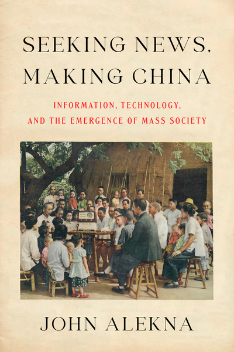

Contemporary developments in communications technologies have overturned key aspects of the global political system and transformed the media landscape. Yet interlocking technological, informational, and political revolutions have occurred many times in the past. In China, radio first arrived in the winter of 1922-23, bursting into a world where communication was slow, disjointed, or non-existent. Less than ten percent of the population ever read newspapers. Just fifty years later, at the beginning of the Cultural Revolution, news broadcasts reached hundreds of millions of people instantaneously, every day. How did Chinese citizens experience the rapid changes in information practices and political organization that occurred in this period? What was it like to live through a news revolution?  

当代通信技术的发展颠覆了全球政治体系的关键方面，并改变了媒体格局。然而，相互关联的技术、信息和政治革命在过去已经发生过很多次。在中国，无线电于 1922-23 年冬天首次出现，闯入了一个通信缓慢、脱节或根本不存在的世界。不到百分之十的人口读过报纸。仅仅五十年后，文化大革命开始时，新闻广播每天都瞬间覆盖到数亿人。中国公民如何经历这一时期信息实践和政治组织的快速变化？经历新闻革命是什么感觉？

John Alekna traces the history of news in twentieth century China to demonstrate how large structural changes in technology and politics were heard and felt. Scrutinizing the flow of news can reveal much about society and politics—illustrating who has power and why, and uncovering the connections between different regions, peoples, and social classes. Taking an innovative, holistic view of information practices, Alekna weaves together both rural and urban history to tell the story of rise of mass society through the lens of communication techniques and technology, showing how the news revolution fundamentally reordered the political geography of China.  

约翰·阿莱克纳（John Alekna）追溯了二十世纪中国的新闻史，以展示人们如何听到和感受到技术和政治的巨大结构性变化。审视新闻的流动可以揭示很多关于社会和政治的信息——说明谁拥有权力以及为什么拥有权力，并揭示不同地区、人民和社会阶层之间的联系。阿列克纳以创新、整体的视角看待信息实践，将乡村和城市历史交织在一起，通过传播技术和技术的视角讲述大众社会崛起的故事，展示新闻革命如何从根本上重新调整中国的政治地理。

About the author 关于作者

**John Alekna** is Assistant Professor of History of Science, Technology, and Medicine at Peking University.  

约翰·阿莱克纳（John Alekna）是北京大学科学技术与医学史助理教授。
