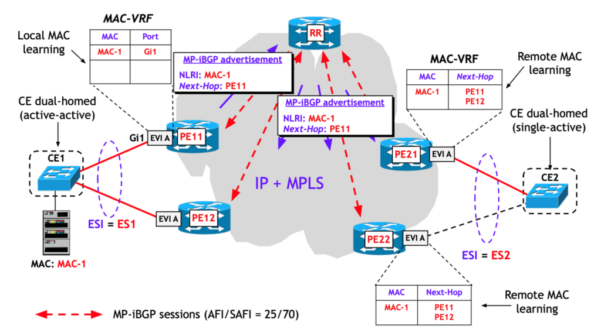

Adapted from Scott Rodgerson's original at [Unsplash](https://unsplash.com/photos/a-bunch-of-blue-wires-connected-to-each-other-PSpf_XgOM5w).  

改编自 Scott Rodgerson 在 Unsplash 上的原作。

When it comes to LAN emulation services, the Virtual Private LAN Service (VPLS) model has many defects that prevent its use in advanced scenarios of major interest, such as the interconnection of data centres (a service often called Data Centre Interconnection (DCI)). This is why a new model for LAN emulation services — known as Ethernet VPN (EVPN) has been developed, and its purpose is to make service implementation more suitable to meet the DCI’s needs.  

在 LAN 仿真服务方面，虚拟专用 LAN 服务 (VPLS) 模型存在许多缺陷，无法在重要的高级场景中使用，例如数据中心互连（通常称为数据中心互连 (DCI) 的服务） 。这就是为什么开发了一种新的 LAN 仿真服务模型——以太网 VPN (EVPN)，其目的是使服务实现更适合满足 DCI 的需求。

The EVPN model was standardized by [RFC 7432](https://www.rfc-editor.org/rfc/rfc7432.html) ‘BGP MPLS-Based Ethernet’ VPN, February 2015. The title of the RFC already indicates the main idea — using BGP to advertise MAC addresses, with the same operating model as Layer 3 VPNs (L3VPNs). In other words, MAC learning does not occur only on the data plane, as in the VPLS model, but partially on the data plane (local MAC learning) and partially on the control plane, using BGP. Do not be misled by the fact that even the VPLS model can use BGP for its operation; the EVPN model uses BGP in a very different way (similar, for the auto-discovery portion, and completely different for the signalling one).  

EVPN 模型由 2015 年 2 月的 RFC 7432“基于 BGP MPLS 的以太网”VPN 标准化。RFC 的标题已经表明了主要思想 - 使用 BGP 通告 MAC 地址，与第 3 层 VPN (L3VPN) 具有相同的操作模型。换句话说，MAC 学习并不像 VPLS 模型那样仅发生在数据平面上，而是部分发生在数据平面上（本地 MAC 学习），部分发生在使用 BGP 的控制平面上。不要被 VPLS 模型也可以使用 BGP 进行操作这一事实所误导； EVPN 模型以一种非常不同的方式使用 BGP（自动发现部分类似，信令部分完全不同）。

And this is not the only new aspect introduced by the EVPN model. The standard focuses particularly on the implementation of multihoming connections, load balancing, loop prevention and other aspects we will not cover here. All these aspects are not treated (or only marginally treated) in the VPLS model, while RFC 7432 introduced many clever solutions for them.  

这并不是 EVPN 模型引入的唯一新方面。该标准特别关注多宿主连接的实现、负载平衡、环路预防以及我们在此不讨论的其他方面。所有这些方面在 VPLS 模型中都没有得到处理（或仅得到少量处理），而 RFC 7432 为它们引入了许多巧妙的解决方案。

The importance of the EVPN model is due to two reasons. First, that it is a very well-designed standard, and second, thanks to the complete separation between the control plane and the data plane, it can be used as the control plane for several kinds of data plane. There are currently three standards with the EVPN control plane:  

EVPN 模型的重要性有两个原因。首先，它是一个设计非常好的标准，其次，由于控制平面和数据平面完全分离，它可以用作多种数据平面的控制平面。目前EVPN控制平面有3个标准：

-   RFC 7432 (mentioned above): MPLS data plane.  
    
    RFC 7432（如上所述）：MPLS 数据平面。
-   [RFC 7623](https://www.rfc-editor.org/rfc/rfc7623): ‘Provider Backbone Bridging Combined with Ethernet VPN (PBB-EVPN)’, September 2015 — MAC-in-MAC data plane, also known as PBB (Provider Backbone Bridge), defined by IEEE standard 802.1ah.  
    
    RFC 7623：“提供商骨干桥接与以太网 VPN (PBB-EVPN) 相结合”，2015 年 9 月 — MAC-in-MAC 数据平面，也称为 PBB（提供商骨干桥接），由 IEEE 标准 802.1ah 定义。
-   [RFC 8365](https://www.rfc-editor.org/rfc/rfc8365.html): ‘A Network Virtualization Overlay Solution Using Ethernet VPN (EVPN)’, March 2018 — general data plane used in the Overlay Virtual Networks in a data centre environment. In particular, the document deals with EVPN integration with the two most used standards — VXLAN and NVGRE (between the two, it is the first one that became a de facto standard in the latest-generation data centres).  
    
    RFC 8365：“使用以太网 VPN (EVPN) 的网络虚拟化覆盖解决方案”，2018 年 3 月 — 数据中心环境中覆盖虚拟网络中使用的通用数据平面。该文档特别涉及 EVPN 与两个最常用标准 — VXLAN 和 NVGRE（在这两个标准之间，它是第一个成为最新一代数据中心事实上的标准）的集成。

The EVPN control plane is based on the BGP MAC routing concept. The idea is similar to the control plane in the L3VPN service, with the difference that, instead of the IP prefixes of VPN sites, the MAC addresses learned locally by provider edges (PEs) (and, optionally, also the IP addresses of the hosts with that MAC address) are the ones advertised via MP-iBGP. Since MAC addresses, different from IP addresses, cannot be aggregated, a BGP advertisement for each MAC address is required.  

EVPN 控制平面基于 BGP MAC 路由概念。这个想法类似于 L3VPN 服务中的控制平面，不同之处在于，不是 VPN 站点的 IP 前缀，而是由提供商边缘 (PE) 本地学习的 MAC 地址（以及可选的主机的 IP 地址）与该 MAC 地址）是通过 MP-iBGP 通告的。由于 MAC 地址与 IP 地址不同，无法聚合，因此需要为每个 MAC 地址发布 BGP 通告。

Another idea similar to L3VPNs is the auto-discovery mode, which occurs through the standard route target filtering mechanism, also used in the VPLS model, with auto-discovery via BGP.  

与 L3VPN 类似的另一个想法是自动发现模式，它通过标准路由目标过滤机制发生，也用于 VPLS 模型，通过 BGP 自动发现。

What makes EVPN and VPLS models very different is the MAC learning mode. Just like in the VPLS model (and in L3VPN for IP prefixes), in EVPN, MAC learning is achieved in two steps — one local and one remote. The local phase is identical to VPLS. Through it, a PE learns about the existence of MAC addresses, and, optionally, with a few tricks (for example, GARP, Gratuitous ARP) and also about the corresponding IP addresses associated with them.  

EVPN和VPLS模型最大的不同在于MAC学习模式。就像在 VPLS 模型中（以及在用于 IP 前缀的 L3VPN 中）一样，在 EVPN 中，MAC 学习分两步实现 - 一步是本地，一步是远程。本地相位与VPLS相同。通过它，PE 可以了解 MAC 地址的存在，并且可以选择使用一些技巧（例如，GARP、免费 ARP）以及与它们关联的相应 IP 地址。

Then it creates, in its own MAC table, indicated in the EVPN model as MAC-VRF, a <MAC; local port> association. However, the remote learning phase is quite different. After learning a MAC address, it is communicated to all the other PEs within the same EVPN instance, via MP-iBGP advertisements. The process is summarized in Figure 1, where we assumed — as it almost always occurs in practical applications — to use route reflectors to minimize the number of MP-iBGP sessions.  

然后，它在自己的 MAC 表（在 EVPN 模型中指示为 MAC-VRF）中创建 关联。然而，远程学习阶段则截然不同。学习到 MAC 地址后，它会通过 MP-iBGP 通告与同一 EVPN 实例内的所有其他 PE 进行通信。图 1 总结了该过程，其中我们假设（在实际应用中几乎总是发生这种情况）使用路由反射器来最大限度地减少 MP-iBGP 会话的数量。

**NOTE**: In the EVPN standard, the set of connections between customer edges (CEs) and PEs is called an Ethernet Segment (ES). In the case of a multi-homed connection of one CE to several PEs, it represents the set of connections. In the case of a single-homed connection to a single PE, it represents the only connection. Each ES is identified by an Ethernet Segment Identifier (ESI), which, in the case of multi-homed PE-CE connections, is a non-null identifier (10 bytes long) and in the case of single-homed PE-CE connections, ESI=0.  

说明： 在EVPN标准中，客户边缘（CE）和PE之间的连接集合称为以太网段（ES）。在一个CE到多个PE的多宿主连接的情况下，它代表一组连接。在到单个 PE 的单宿主连接的情况下，它代表唯一的连接。每个 ES 由以太网段标识符 (ESI) 标识，在多宿主 PE-CE 连接的情况下，该标识符是一个非空标识符（10 字节长），在单宿主 PE-CE 连接的情况下，该标识符是一个非空标识符（10 字节长） ，ESI=0。

[](https://blog.apnic.net/wp-content/uploads/2023/12/Figure-1-%E2%80%93-Local-and-remote-MAC-learning-in-the-EVPN-model.png)

Figure 1 — Local and remote MAC learning in the EVPN model.  

图 1 — EVPN 模型中的本地和远程 MAC 学习。

What happens when BGP is used in the control plane when a MAC address learned from a PE is removed from the MAC-VRF table because the MAC aging timer has expired (or the table has been cleared)? One of the advantages of using BGP is that, through a BGP UPDATE message, the advertisement previously sent is withdrawn. This causes the cancellation of the remote PEs of the entry related to the MAC address on the MAC-VRFs, thus allowing an automatic synchronization of the MAC-VRF tables on all the PEs. The advertisement and withdrawal of a MAC address are particularly important in the case of MAC mobility, that is, when a MAC address moves from one ES to another.  

当在控制平面中使用 BGP 时，如果由于 MAC 老化计时器已过期（或表已被清除）而从 PE 学习到的 MAC 地址从 MAC-VRF 表中删除，会发生什么情况？使用 BGP 的优点之一是，通过 BGP UPDATE 消息，先前发送的广告将被撤回。这导致远程PE取消与MAC-VRF上的MAC地址相关的条目，从而允许所有PE上的MAC-VRF表自动同步。 MAC地址的通告和撤销在MAC移动性的情况下尤其重要，即当MAC地址从一个ES移动到另一个ES时。

MP-iBGP advertisements are very peculiar, and, similarly to what occurred for other services, the new BGP EVPN address family has been defined, with new Network Layer Reachability Information (NLRI) within them. Then, new BGP Extended Community attributes, specific to the EVPN model, have also been defined. For the new BGP EVPN address family, IANA defined the AFI code equal to 25 (identical to the VPLS model) — and the SAFI code equal to 70.  

MP-iBGP 通告非常特殊，并且与其他服务类似，定义了新的 BGP EVPN 地址族，其中包含新的网络层可达性信息 (NLRI)。然后，还定义了特定于 EVPN 模型的新 BGP 扩展社区属性。对于新的 BGP EVPN 地址系列，IANA 定义 AFI 代码等于 25（与 VPLS 模型相同），SAFI 代码等于 70。

The BGP EVPN address family is activated through the following configuration commands.  

BGP EVPN地址族通过以下配置命令激活。

IOS XE: IOS XE：

```
PE(config)# router bgp AS-number
PE(config-router)# address-family l2vpn evpn 
PE(config-router-af)# neighbor neighbor-IP-address activate
```

IOS XR: iOS XR：

```
RP/0/RP0/CPU0:PE(config)# router bgp AS-ISP
RP/0/RP0/CPU0:PE(config-bgp)# address-family l2vpn evpn
RP/0/RP0/CPU0:PE(config-bgp)# neighbor neighbor-IP-address
RP/0/RP0/CPU0:PE(config-bgp-nbr)# address-family l2vpn evpn
```

JUNOS: 朱诺斯：

```
[edit protocols bgp group group-name]
family evpn {
      signaling;
 }
```

The general NLRI format is the standard Type-Length-Value (TLV) type shown below, with the ‘Route Type’ field representing the type of coding in the ‘Route Type Specific’ field, the ‘Length’ field representing the length of the following field in byte, and the ‘Route Type Specific’ field the actual coding of the NLRI.  

一般的NLRI格式是如下所示的标准类型-长度-值（TLV）类型，其中“路由类型”字段表示“路由类型特定”字段中的编码类型，“长度”字段表示路由的长度以下字段以字节为单位，“路由类型特定”字段是 NLRI 的实际编码。

```
+-----------------------------------+
|       Route Type (1 octet)        |
+-----------------------------------+
|          Length (1 octet)         |
+-----------------------------------+
|   Route Type specific (variable)  |
+-----------------------------------+
```

RFC 7432 defined four different types of NLRIs (Types 1 – 4). Subsequently, Type 5 has also been defined (see: [RFC 9136](https://www.rfc-editor.org/info/rfc9136) ‘IP Prefix Advertisement in EVPN’). The following table shows the most important fields and their use. Moreover, in all NLRI types, there is a Route Distinguisher (RD) value, whose format and meaning are the same as those of the L3VPNs, that is, they are values used to distinguish any possible identical NLRIs, generated by different EVPN instances.      

RFC 7432 定义了四种不同类型的 NLRI（类型 1 – 4）。随后，类型 5 也被定义（参见：RFC 9136“EVPN 中的 IP 前缀通告”）。下表显示了最重要的字段及其用途。而且，在所有NLRI类型中，都有一个RD（Route Distinguisher）值，其格式和含义与L3VPN相同，即用于区分不同EVPN实例生成的任何可能相同的NLRI的值。

<table data-immersive-translate-effect="1" data-immersive_translate_walked="fd32dabd-040d-4de4-9df1-ad49b6af7f49"><tbody data-immersive-translate-effect="1" data-immersive_translate_walked="fd32dabd-040d-4de4-9df1-ad49b6af7f49"><tr data-immersive-translate-effect="1" data-immersive_translate_walked="fd32dabd-040d-4de4-9df1-ad49b6af7f49"><td data-immersive-translate-effect="1" data-immersive_translate_walked="fd32dabd-040d-4de4-9df1-ad49b6af7f49"><strong data-immersive-translate-effect="1" data-immersive_translate_walked="fd32dabd-040d-4de4-9df1-ad49b6af7f49">Type<span lang="zh-CN" data-immersive-translate-translation-element-mark="1"><span data-immersive-translate-translation-element-mark="1">&nbsp;</span><span data-immersive-translate-translation-element-mark="1"><span data-immersive-translate-translation-element-mark="1">类型</span></span></span></strong></td><td data-immersive-translate-effect="1" data-immersive_translate_walked="fd32dabd-040d-4de4-9df1-ad49b6af7f49"><strong data-immersive-translate-effect="1" data-immersive_translate_walked="fd32dabd-040d-4de4-9df1-ad49b6af7f49">Name<span lang="zh-CN" data-immersive-translate-translation-element-mark="1"><span data-immersive-translate-translation-element-mark="1">&nbsp;</span><span data-immersive-translate-translation-element-mark="1"><span data-immersive-translate-translation-element-mark="1">姓名</span></span></span></strong></td><td data-immersive-translate-effect="1" data-immersive_translate_walked="fd32dabd-040d-4de4-9df1-ad49b6af7f49"><strong data-immersive-translate-effect="1" data-immersive_translate_walked="fd32dabd-040d-4de4-9df1-ad49b6af7f49">Main fields<span lang="zh-CN" data-immersive-translate-translation-element-mark="1"><span data-immersive-translate-translation-element-mark="1">&nbsp;</span><span data-immersive-translate-translation-element-mark="1"><span data-immersive-translate-translation-element-mark="1">主要领域</span></span></span></strong></td><td data-immersive-translate-effect="1" data-immersive_translate_walked="fd32dabd-040d-4de4-9df1-ad49b6af7f49"><strong data-immersive-translate-effect="1" data-immersive_translate_walked="fd32dabd-040d-4de4-9df1-ad49b6af7f49">Use</strong></td></tr><tr data-immersive-translate-effect="1" data-immersive_translate_walked="fd32dabd-040d-4de4-9df1-ad49b6af7f49"><td data-immersive-translate-effect="1" data-immersive_translate_walked="fd32dabd-040d-4de4-9df1-ad49b6af7f49"><strong data-immersive-translate-effect="1" data-immersive_translate_walked="fd32dabd-040d-4de4-9df1-ad49b6af7f49">1</strong></td><td data-immersive-translate-effect="1" data-immersive_translate_walked="fd32dabd-040d-4de4-9df1-ad49b6af7f49">Ethernet Auto-Discovery (A-D) route<span lang="zh-CN" data-immersive-translate-translation-element-mark="1"><br><span data-immersive-translate-translation-element-mark="1"><span data-immersive-translate-translation-element-mark="1">以太网自动发现 (A-D) 路由</span></span></span></td><td data-immersive-translate-effect="1" data-immersive_translate_walked="fd32dabd-040d-4de4-9df1-ad49b6af7f49">– ESI<br data-immersive-translate-effect="1" data-immersive_translate_walked="fd32dabd-040d-4de4-9df1-ad49b6af7f49">– Ethernet tag<span lang="zh-CN" data-immersive-translate-translation-element-mark="1"><span data-immersive-translate-translation-element-mark="1">&nbsp;</span><span data-immersive-translate-translation-element-mark="1"><span data-immersive-translate-translation-element-mark="1">– 以太网标签</span></span></span><br data-immersive-translate-effect="1" data-immersive_translate_walked="fd32dabd-040d-4de4-9df1-ad49b6af7f49">– MPLS Label<span lang="zh-CN" data-immersive-translate-translation-element-mark="1"><span data-immersive-translate-translation-element-mark="1">&nbsp;</span><span data-immersive-translate-translation-element-mark="1"><span data-immersive-translate-translation-element-mark="1">– MPLS 标签</span></span></span></td><td data-immersive-translate-effect="1" data-immersive_translate_walked="fd32dabd-040d-4de4-9df1-ad49b6af7f49">– Fast convergence<span lang="zh-CN" data-immersive-translate-translation-element-mark="1"><span data-immersive-translate-translation-element-mark="1">&nbsp;</span><span data-immersive-translate-translation-element-mark="1"><span data-immersive-translate-translation-element-mark="1">– 快速收敛</span></span></span><br data-immersive-translate-effect="1" data-immersive_translate_walked="fd32dabd-040d-4de4-9df1-ad49b6af7f49">– Aliasing<span lang="zh-CN" data-immersive-translate-translation-element-mark="1"><span data-immersive-translate-translation-element-mark="1">&nbsp;</span><span data-immersive-translate-translation-element-mark="1"><span data-immersive-translate-translation-element-mark="1">– 别名</span></span></span><br data-immersive-translate-effect="1" data-immersive_translate_walked="fd32dabd-040d-4de4-9df1-ad49b6af7f49">– Label advertisement for Split-Horizon<span lang="zh-CN" data-immersive-translate-translation-element-mark="1"><br><span data-immersive-translate-translation-element-mark="1"><span data-immersive-translate-translation-element-mark="1">– Split-Horizon 的标签广告</span></span></span></td></tr><tr data-immersive-translate-effect="1" data-immersive_translate_walked="fd32dabd-040d-4de4-9df1-ad49b6af7f49"><td data-immersive-translate-effect="1" data-immersive_translate_walked="fd32dabd-040d-4de4-9df1-ad49b6af7f49"><strong data-immersive-translate-effect="1" data-immersive_translate_walked="fd32dabd-040d-4de4-9df1-ad49b6af7f49">2</strong></td><td data-immersive-translate-effect="1" data-immersive_translate_walked="fd32dabd-040d-4de4-9df1-ad49b6af7f49">MAC/IP Advertisement route<span lang="zh-CN" data-immersive-translate-translation-element-mark="1"><br><span data-immersive-translate-translation-element-mark="1"><span data-immersive-translate-translation-element-mark="1">MAC/IP 通告路由</span></span></span></td><td data-immersive-translate-effect="1" data-immersive_translate_walked="fd32dabd-040d-4de4-9df1-ad49b6af7f49">– ESI<br data-immersive-translate-effect="1" data-immersive_translate_walked="fd32dabd-040d-4de4-9df1-ad49b6af7f49">– Ethernet tag <span lang="zh-CN" data-immersive-translate-translation-element-mark="1"><span data-immersive-translate-translation-element-mark="1">&nbsp;</span><span data-immersive-translate-translation-element-mark="1"><span data-immersive-translate-translation-element-mark="1">– 以太网标签</span></span></span><br data-immersive-translate-effect="1" data-immersive_translate_walked="fd32dabd-040d-4de4-9df1-ad49b6af7f49">– MAC address <span lang="zh-CN" data-immersive-translate-translation-element-mark="1"><span data-immersive-translate-translation-element-mark="1">&nbsp;</span><span data-immersive-translate-translation-element-mark="1"><span data-immersive-translate-translation-element-mark="1">- MAC地址</span></span></span><br data-immersive-translate-effect="1" data-immersive_translate_walked="fd32dabd-040d-4de4-9df1-ad49b6af7f49">– IP address<span lang="zh-CN" data-immersive-translate-translation-element-mark="1"><span data-immersive-translate-translation-element-mark="1">&nbsp;</span><span data-immersive-translate-translation-element-mark="1"><span data-immersive-translate-translation-element-mark="1">- IP地址</span></span></span><br data-immersive-translate-effect="1" data-immersive_translate_walked="fd32dabd-040d-4de4-9df1-ad49b6af7f49">– MPLS Label<span lang="zh-CN" data-immersive-translate-translation-element-mark="1"><span data-immersive-translate-translation-element-mark="1">&nbsp;</span><span data-immersive-translate-translation-element-mark="1"><span data-immersive-translate-translation-element-mark="1">– MPLS 标签</span></span></span></td><td data-immersive-translate-effect="1" data-immersive_translate_walked="fd32dabd-040d-4de4-9df1-ad49b6af7f49">– MAC advertisements<span lang="zh-CN" data-immersive-translate-translation-element-mark="1"><span data-immersive-translate-translation-element-mark="1">&nbsp;</span><span data-immersive-translate-translation-element-mark="1"><span data-immersive-translate-translation-element-mark="1">– MAC广告</span></span></span><br data-immersive-translate-effect="1" data-immersive_translate_walked="fd32dabd-040d-4de4-9df1-ad49b6af7f49">– Advertisement of MAC/IP associations<span lang="zh-CN" data-immersive-translate-translation-element-mark="1"><br><span data-immersive-translate-translation-element-mark="1"><span data-immersive-translate-translation-element-mark="1">– MAC/IP 关联的通告</span></span></span></td></tr><tr data-immersive-translate-effect="1" data-immersive_translate_walked="fd32dabd-040d-4de4-9df1-ad49b6af7f49"><td data-immersive-translate-effect="1" data-immersive_translate_walked="fd32dabd-040d-4de4-9df1-ad49b6af7f49"><strong data-immersive-translate-effect="1" data-immersive_translate_walked="fd32dabd-040d-4de4-9df1-ad49b6af7f49">3</strong></td><td data-immersive-translate-effect="1" data-immersive_translate_walked="fd32dabd-040d-4de4-9df1-ad49b6af7f49">Inclusive Multicast Ethernet Tag route<span lang="zh-CN" data-immersive-translate-translation-element-mark="1"><br><span data-immersive-translate-translation-element-mark="1"><span data-immersive-translate-translation-element-mark="1">包容性组播以太网标签路由</span></span></span></td><td data-immersive-translate-effect="1" data-immersive_translate_walked="fd32dabd-040d-4de4-9df1-ad49b6af7f49">– Ethernet tag<span lang="zh-CN" data-immersive-translate-translation-element-mark="1"><span data-immersive-translate-translation-element-mark="1">&nbsp;</span><span data-immersive-translate-translation-element-mark="1"><span data-immersive-translate-translation-element-mark="1">– 以太网标签</span></span></span><br data-immersive-translate-effect="1" data-immersive_translate_walked="fd32dabd-040d-4de4-9df1-ad49b6af7f49">– IP address of the router generating the advertisement (*)<span lang="zh-CN" data-immersive-translate-translation-element-mark="1"><br><span data-immersive-translate-translation-element-mark="1"><span data-immersive-translate-translation-element-mark="1">– 生成通告的路由器的 IP 地址 (*)</span></span></span></td><td data-immersive-translate-effect="1" data-immersive_translate_walked="fd32dabd-040d-4de4-9df1-ad49b6af7f49">Auto-discovery of PEs where CEs of the same EVI are attested<span lang="zh-CN" data-immersive-translate-translation-element-mark="1"><br><span data-immersive-translate-translation-element-mark="1"><span data-immersive-translate-translation-element-mark="1">自动发现已证明相同 EVI 的 CE 的 PE</span></span></span></td></tr><tr data-immersive-translate-effect="1" data-immersive_translate_walked="fd32dabd-040d-4de4-9df1-ad49b6af7f49"><td data-immersive-translate-effect="1" data-immersive_translate_walked="fd32dabd-040d-4de4-9df1-ad49b6af7f49"><strong data-immersive-translate-effect="1" data-immersive_translate_walked="fd32dabd-040d-4de4-9df1-ad49b6af7f49">4</strong></td><td data-immersive-translate-effect="1" data-immersive_translate_walked="fd32dabd-040d-4de4-9df1-ad49b6af7f49">Ethernet Segment route<span lang="zh-CN" data-immersive-translate-translation-element-mark="1"><span data-immersive-translate-translation-element-mark="1">&nbsp;</span><span data-immersive-translate-translation-element-mark="1"><span data-immersive-translate-translation-element-mark="1">以太网段路由</span></span></span></td><td data-immersive-translate-effect="1" data-immersive_translate_walked="fd32dabd-040d-4de4-9df1-ad49b6af7f49">– ESI<br data-immersive-translate-effect="1" data-immersive_translate_walked="fd32dabd-040d-4de4-9df1-ad49b6af7f49">– IP address of the router generating the advertisement (*)<span lang="zh-CN" data-immersive-translate-translation-element-mark="1"><br><span data-immersive-translate-translation-element-mark="1"><span data-immersive-translate-translation-element-mark="1">– 生成通告的路由器的 IP 地址 (*)</span></span></span></td><td data-immersive-translate-effect="1" data-immersive_translate_walked="fd32dabd-040d-4de4-9df1-ad49b6af7f49">– Discovery of PEs multi-homed to the same ES<span lang="zh-CN" data-immersive-translate-translation-element-mark="1"><br><span data-immersive-translate-translation-element-mark="1"><span data-immersive-translate-translation-element-mark="1">– 发现多宿主到同一 ES 的 PE</span></span></span><br data-immersive-translate-effect="1" data-immersive_translate_walked="fd32dabd-040d-4de4-9df1-ad49b6af7f49">– DF election<span lang="zh-CN" data-immersive-translate-translation-element-mark="1"><span data-immersive-translate-translation-element-mark="1">&nbsp;</span><span data-immersive-translate-translation-element-mark="1"><span data-immersive-translate-translation-element-mark="1">– DF选举</span></span></span></td></tr><tr data-immersive-translate-effect="1" data-immersive_translate_walked="fd32dabd-040d-4de4-9df1-ad49b6af7f49"><td data-immersive-translate-effect="1" data-immersive_translate_walked="fd32dabd-040d-4de4-9df1-ad49b6af7f49"><strong data-immersive-translate-effect="1" data-immersive_translate_walked="fd32dabd-040d-4de4-9df1-ad49b6af7f49">5</strong></td><td data-immersive-translate-effect="1" data-immersive_translate_walked="fd32dabd-040d-4de4-9df1-ad49b6af7f49">IP Prefix route<span lang="zh-CN" data-immersive-translate-translation-element-mark="1"><span data-immersive-translate-translation-element-mark="1">&nbsp;</span><span data-immersive-translate-translation-element-mark="1"><span data-immersive-translate-translation-element-mark="1">IP前缀路由</span></span></span></td><td data-immersive-translate-effect="1" data-immersive_translate_walked="fd32dabd-040d-4de4-9df1-ad49b6af7f49">– ESI<br data-immersive-translate-effect="1" data-immersive_translate_walked="fd32dabd-040d-4de4-9df1-ad49b6af7f49">– Ethernet tag<span lang="zh-CN" data-immersive-translate-translation-element-mark="1"><span data-immersive-translate-translation-element-mark="1">&nbsp;</span><span data-immersive-translate-translation-element-mark="1"><span data-immersive-translate-translation-element-mark="1">– 以太网标签</span></span></span><br data-immersive-translate-effect="1" data-immersive_translate_walked="fd32dabd-040d-4de4-9df1-ad49b6af7f49">– IP prefix<span lang="zh-CN" data-immersive-translate-translation-element-mark="1"><span data-immersive-translate-translation-element-mark="1">&nbsp;</span><span data-immersive-translate-translation-element-mark="1"><span data-immersive-translate-translation-element-mark="1">– IP前缀</span></span></span><br data-immersive-translate-effect="1" data-immersive_translate_walked="fd32dabd-040d-4de4-9df1-ad49b6af7f49">– GW IP address<span lang="zh-CN" data-immersive-translate-translation-element-mark="1"><span data-immersive-translate-translation-element-mark="1">&nbsp;</span><span data-immersive-translate-translation-element-mark="1"><span data-immersive-translate-translation-element-mark="1">– 网关IP地址</span></span></span><br data-immersive-translate-effect="1" data-immersive_translate_walked="fd32dabd-040d-4de4-9df1-ad49b6af7f49">– MPLS Label<span lang="zh-CN" data-immersive-translate-translation-element-mark="1"><span data-immersive-translate-translation-element-mark="1">&nbsp;</span><span data-immersive-translate-translation-element-mark="1"><span data-immersive-translate-translation-element-mark="1">– MPLS 标签</span></span></span></td><td data-immersive-translate-effect="1" data-immersive_translate_walked="fd32dabd-040d-4de4-9df1-ad49b6af7f49">IP prefixes advertisement<span lang="zh-CN" data-immersive-translate-translation-element-mark="1"><br><span data-immersive-translate-translation-element-mark="1"><span data-immersive-translate-translation-element-mark="1">IP前缀通告</span></span></span></td></tr></tbody></table>

Table 1 — Five types of NLRI. (\*) Typically a loopback address.  

表 1 — NLRI 的五种类型。 (\*) 通常是环回地址。

So, we can conclude that the use of the different NLRI types depends on the type of PE-CE connections. For instance, if all connections were single-homed, we would only need types 2 and 3. Types 1 and 4 are used (along with types 2 and 3) only in multi-homed connections, while type 5 is used both within an EVPN domain and in the interconnection with external IP/MPLS networks.   

因此，我们可以得出结论，不同 NLRI 类型的使用取决于 PE-CE 连接的类型。例如，如果所有连接都是单宿主连接，我们只需要类型 2 和 3。类型 1 和 4（以及类型 2 和 3）仅在多宿主连接中使用，而类型 5 在 EVPN 中使用域以及与外部IP/MPLS网络的互连。

_Flavio Luciani is Chief Technology Officer at Namex (Roma IXP)_.  

Flavio Luciani 是 Namex (Roma IXP) 的首席技术官。

_This post was co-authored by [Antonio Prado](https://www.linkedin.com/in/antoniopradoit/) and [Tiziano Tofoni](https://www.linkedin.com/in/tiziano-tofoni-1361759/) and is an excerpt from the book ‘[BGP: from theory to practice](https://www.amazon.com/BGP-Border-Gateway-Protocol-practice/dp/B0CMV2Q2GJ/)‘, by Flavio, Antonio, and Tiziano.  

这篇文章由 Antonio Prado 和 Tiziano Tofoni 共同撰写，摘自 Flavio、Antonio 和 Tiziano 合着的《BGP：从理论到实践》一书。_

<table data-immersive-translate-effect="1" data-immersive_translate_walked="fd32dabd-040d-4de4-9df1-ad49b6af7f49"><tbody data-immersive-translate-effect="1" data-immersive_translate_walked="fd32dabd-040d-4de4-9df1-ad49b6af7f49"><tr data-immersive-translate-effect="1" data-immersive_translate_walked="fd32dabd-040d-4de4-9df1-ad49b6af7f49"><td data-immersive-translate-effect="1" data-immersive_translate_walked="fd32dabd-040d-4de4-9df1-ad49b6af7f49"><nobr data-immersive-translate-effect="1" data-immersive_translate_walked="fd32dabd-040d-4de4-9df1-ad49b6af7f49">Rate this article<span lang="zh-CN" data-immersive-translate-translation-element-mark="1"><span data-immersive-translate-translation-element-mark="1">&nbsp;</span><span data-immersive-translate-translation-element-mark="1"><span data-immersive-translate-translation-element-mark="1">评价这篇文章</span></span></span></nobr></td><td data-immersive-translate-effect="1" data-immersive_translate_walked="fd32dabd-040d-4de4-9df1-ad49b6af7f49"></td></tr></tbody></table>

___

The views expressed by the authors of this blog are their own and do not necessarily reflect the views of APNIC. Please note a [Code of Conduct](https://blog.apnic.net/?p=395) applies to this blog.  

本博客作者表达的观点仅代表他们自己的观点，并不一定反映 APNIC 的观点。请注意，行为准则适用于本博客。
