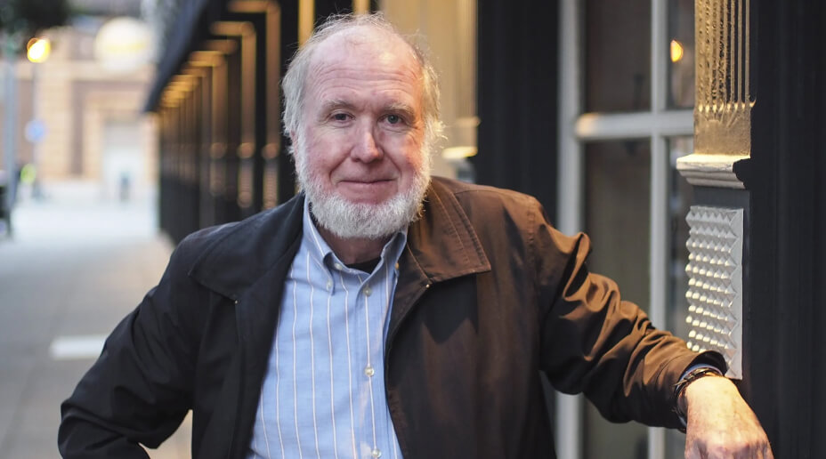

2022年4月28日，凯文·凯利（Kevin Kelly）在他的网站上发布了 70 岁生日的文章：[103 Bits of Advice I Wish I Had Known](https://kk.org/thetechnium/103-bits-of-advice-i-wish-i-had-known/)，意为：103条我希望早点知道的人生忠告。他 [69 岁](https://kk.org/thetechnium/99-additional-bits-of-unsolicited-advice/)，[68 岁](https://kk.org/thetechnium/68-bits-of-unsolicited-advice/)生日时也写了这样的文章。朋友转发给我之后，我觉得有些内容很有启发，于是在做笔记的时候想：不如直接翻译过来好了。

K.K. 写的这103句忠告既幽默又睿智，但毕竟只是短短一句话，缺乏上下文，也就不够精确。我觉得读者朋友可以不必咬文嚼字，只要这些话能引起思考就已经很不错了。以下是我在阅读过程中觉得有启发的部分，不想看我的思考的小伙伴也可以[点这里](https://justinyan.me/post/4911#full_translated)直接跳转到翻译。

___

以下是我觉得有启发的几句

___

大部分 K.K. 写的我都深表赞同，这里只选出部分我认为比较有意思的，没写在这里的不代表我不认同。比如关于密码管理器这点，我认同并且实践多年，自然无需多言。

> 1.99%的时间里，真正关键的时刻就是此刻。  
> 
> About 99% of the time, the right time is right now.

我们很常听说“我要等到某某时刻就去做某某事情”，但其实多数时候，the timing is never right。寻找合适时机往往只是我们拖延的借口罢了。

> 3.不要为你不想成为的人工作。  
> 
> Dont ever work for someone you dont want to become.  
> 
> 48.你无法让聪明的人只为了钱而特别努力地工作。  
> 
> You cannot get smart people to work extremely hard just for money.

一般来说，办公室里比你多工作三五年的人就是你未来的样子，你的老板/上级就是你未来会成为的人。一个聪明的人找工作的时候自然希望这份工作能带来正面的作用，不仅因为钱，所以会被领袖吸引进某家公司是很正常的事情。但是这种希望是会变的，当你有一天发现你根本不想成为你的老板那样的人时，就是你该离开的时候了。

> 4.好好耕耘12个爱你的人的关系，因为这12个人远比1200万人喜欢你重要得多。  
> 
> Cultivate 12 people who love you, because they are worth more than 12 million people who like you.

我认真使用个人OKR帮助我回顾与计划以来，“人际关系”一直在我其中一个O里，但是目前我做得远不够好，所以看到这句我深有感慨。

> 7.“但是”之前的话都是废话。  
> 
> Anything you say before the word “but” does not count.

就是说，我上面关于OKR那句话，在“但是”之前都是废话。

> 5.不要一直重复犯错；试着去犯新的错。  
> 
> Dont keep making the same mistakes; try to make new mistakes.  
> 
> 97.重复别人是一个很好的开始。重复你自己则是一个令人失望的终点。  
> 
> Copying others is a good way to start. Copying yourself is a disappointing way to end.

犯错需要勇气，这大概是为什么大多数人都不会主动去犯新的错误的重要原因。Tim Urban 在 [How to Pick a Career (That Actually Fits You) — Wait But Why](https://waitbutwhy.com/2018/04/picking-career.html) 这篇文章中对此有不错的分析，推荐阅读。Tim Urban也在文末说到:"My goal for the future isn’t to avoid mistakes, it’s for the mistakes I do make to be my own."

> 8.当你原谅其他人的时候，他们不一定会知道这件事，但你自己却会被治愈。原谅不是我们给予他人的东西；而是我们给自己的礼物。  
> 
> When you forgive others, they may not notice, but you will heal. Forgiveness is not something we do for others; it is a gift to ourselves.

原谅他人，其实是在治愈自己。我想起台湾的电视剧[《我们与恶的距离》](https://movie.douban.com/subject/30181230/)，其中“原谅”在几个关键角色身上都是一道极难跨越的坎。

> 10.无论什么时候，看到争论基于两个对立面进行时，要找到第三个面。  
> 
> Whenever there is an argument between two sides, find the third side.  
> 
> 16.如果在一个游戏中，获胜变得过于重要，那么我们可以修改游戏规则以便从中获得更多乐趣。而修改规则本身就可以成为一个新的游戏。  
> 
> If winning becomes too important in a game, change the rules to make it more fun. Changing rules can become the new game.  
> 
> 88.当你跟别人谈判的时候，不要把目光瞄准蛋糕中最大的一片；要瞄准如何把蛋糕做大。  
> 
> When negotiating, dont aim for a bigger piece of the pie; aim to create a bigger pie.

这几句都颇有跳出圈子的感觉，当你发现形成非黑即白的局面，深陷其中难以解脱时，试着跳脱出来。

> 18.生产力反而经常分散我们的注意力。不要试图寻找更快完成任务的方法，而是把精力放在你根本不想停下来的任务上。  
> 
> Productivity is often a distraction. Don’t aim for better ways to get through your tasks as quickly as possible, rather aim for better tasks that you never want to stop doing.

读到这句我深有同感，以前“枫影夜读”还名为“每周读书”系列的时候，为了“每周”这个看似有用的目标，我不得不放弃一些无法短时间内读完的书，反而损害了我本身“喜欢阅读”这件事的体验。还不如就继续喜欢阅读，然后顺便写点书评来得愉悦与持久。

> 14.人生的课程将以它们需要的顺序出现在你面前。任何你需要掌握的课程其实都在你身上。当你真正掌握了一节课之后，下一节课就会出现。如果你还活着，这就意味着你还有课程需要学习。  
> 
> Life lessons will presented to you in the order they are needed. Everything you need to master the lesson is within you. Once you have truly learned a lesson, you will be presented with the next one. If you are alive, that means you still have lessons to learn.  
> 
> 21.你作为一个意识生物的成长，将以你愿意接受的令人不舒服的对话的次数来衡量。  
> 
> Your growth as a conscious being is measured by the number of uncomfortable conversations you are willing to have.  
> 
> 30.请教一位你崇拜的人: 他们的幸运转折往往来自于跟主要目标无关的弯路。所以拥抱这种弯路。对任何人来说，人生都不是一条直线。  
> 
> Ask anyone you admire: Their lucky breaks happened on a detour from their main goal. So embrace detours. Life is not a straight line for anyone.  
> 
> 34.不要等着暴风雨自己过去；要在雨中跳舞。  
> 
> Don’t wait for the storm to pass; dance in the rain.  
> 
> 44.你在低谷时做的事情比在好日子时做的更重要。  
> 
> What you do on your bad days matters more than what you do on your good days.  
> 
> 85.你跟那些惹怒你的事物一样大。  
> 
> You are as big as the things that make you angry.

人的一生很奇妙，我们会在感觉很美好的同时经历许多的不愉快。而现代人“成长”的标志之一似乎就是能够适应这种复杂的痛苦。不管是面对复杂的人事也好，超出预期的事件也罢，不管是遇到跌宕起伏的股市也好，碰上别人都是傻逼的事情也罢，试着把这些都当作锻炼自己心智的课程。下一次你碰到一样的情况，如果能至少表面上镇静地应对的话，那就说明你可以学下一课了。

> 24.你的努力（锻炼、陪伴、工作）的一致性远比数量重要。没有什么可以击败每天坚持做的小事，这比偶然做的事情重要得多。  
> 
> The consistency of your endeavors (exercise, companionship, work) is more important than the quantity. Nothing beats small things done every day, which is way more important than what you do occassionally.

除了不积跬步无以至千里这样的至理名言以外，我之前[写过文章介绍的 Atomic Habits 一书](https://justinyan.me/post/4352)对此有更为细致的分析，推荐阅读。

> 27.你必须具备的三种能力: 在确认一件事情能运作之前永不言弃的能力，在确认一件事情无法工作下去时放弃他的能力，以及信任能帮助你区分二者的人。  
> 
> Three things you need: The ability to not give up something till it works, the ability to give up something that does not work, and the trust in other people to help you distinguish between the two.

通常来说，普通人往往在还没成功之前就放弃，却迟迟不愿放弃前景糟糕的事情，哪怕有人这么明确地跟他说了，他也不愿意相信。什么？你问我这个普通人是不是我？还好这里不是TVB😂

> 38.设定一个野心得荒谬的目标的好处是，上限足够高，这样即使最后失败了，以通常的标准来衡量也可以算某种程度上的成功。  
> 
> The advantage of a ridiculously ambitious goal is that it sets the bar very high so even in failure it may be a success measured by the ordinary.

此理与 OKR 相同。

> 39.了解自己的一个好办法是，仔细地分析自己做的会惹怒其他人的每一件事情。  
> 
> A great way to understand yourself is to seriously reflect on everything you find irritating in others.

以前我从 [Steve说播客](http://steveshuo.com/)学到：“最好的观察自己的时候，就是产生情绪的时候”。我记住了这点并由外向内观察了数年，而 K.K. 提到的这点则是从自己往外看时的分析，是个不错的补充。

> 50.所有东西的90%都是垃圾。如果你觉得自己不喜欢歌剧，浪漫小说，抖音，乡村音乐，素食，NFTs，那你可以试试看自己能否找出不是垃圾的10%。  
> 
> 90%of everything is crap. If you think you don’t like opera, romance novels, TikTok, country music, vegan food, NFTs, keep trying to see if you can find the 10% that is not crap.

今年（2022年）我听了大量我以前根本不会听的音乐，经常在推上以 [#今日唱片](https://twitter.com/search?q=%23%E4%BB%8A%E6%97%A5%E5%94%B1%E7%89%87&src=typed_query) 分享音乐。我开始发现诸多音乐流派、门类的奇妙之处，甚至开始[发布音乐分享 newsletter](https://replay.cafe/)。有太多的音乐在一开始听的时候都是很难接受不好入耳的，我们需要更多的训练来形成欣赏的能力。而最开始的时候，需要一点原初动力，K.K. 这个 10% 不妨成为引发好奇心的导火索。

> 51.你如何对待那些对你无能为力的人，将成为评价你的标准。  
> 
> You will be judged on how well you treat those who can do nothing for you.  
> 
> 54.你无法说服一个人接受一个他自己也无法说服他自己的理念。  
> 
> You cant reason someone out of a notion that they didn’t reason themselves into.

没有什么必要说服另一个人，毕竟这世界上还是有很多人坚信地球是平的。

> 55.最好的工作是你需要被拉伸才能合格的工作。其实最好只申请你的能力尚不合格的工作。  
> 
> Your best job will be one that you were unqualified for because it stretches you. In fact only apply to jobs you are unqualified for.  
> 
> 62.”我现在该做什么？”的唯一有效回答是，先找出“我想成为什么人？”的答案。  
> 
> The only productive way to answer “what should I do now?” is to first tackle the question of “who should I become?”

好吧，那我想成为什么人呢？

> 89.如果你重复今天你做的事情365天，那一年后你会成为你想成为的人吗？  
> 
> If you repeated what you did today 365 more times will you be where you want to be next year?

我刚刚问了这个问题，你立刻就把我否定了啊，OMG🤦♂️  

这个问题太直击灵魂了啊！

> 92.我们的后代将创造令我们惊叹的成就，但其实只要我们的足够的想象力，他们会创造的部分东西，用今天的材料和工具就已经能实现了。所以，要想得更大一点。  
> 
> Our descendants will achieve things that will amaze us, yet a portion of what they will create could have been made with today’s materials and tools if we had had the imagination. Think bigger.  
> 
> 93.为了丰厚的回报，请对你完全不感兴趣的事物保持好奇。  
> 
> For a great payoff be especially curious about the things you are not interested in.  
> 
> 95.所有的突破在一开始都是看起来很可笑和荒谬的。事实上如果它在一开始看起来不够可笑和荒谬的话，它也称不上是一种突破。  
> 
> Every breakthrough is at first laughable and ridiculous. In fact if it did not start out laughable and ridiculous, it is not a breakthrough.

看到这里，我在思考是不是我应该要试着在我完全不感兴趣的事情里，寻找那 10%？

> 99.与其让你的人生规避“出人意料”，还不如直接瞄着它们而去。  
> 
> Rather than steering your life to avoid surprises, aim directly for them.  
> 
> 103.防止变老的最佳实践是保持惊讶。  
> 
> The chief prevention against getting old is to remain astonished.

保持好奇心是一个创造者应该有的常态，而可笑的 breakthrough，需要一点想象力加持的出人意料，会不会就隐藏在我不感兴趣的 10% 里呢？

感谢 K.K. 在 70 岁生日时的真诚分享，我深受启发。

_P.S. 写完才发现原来已经有其他人翻译过了。Anyway，我有我自己的思考就足够了。_

___

以下是全文翻译

___

今天是我的生日。我今年70岁了。活到现在我也算学到了一点可能可以帮助到其他的人东西。过去几年，我每年都会写一点人生建议之类的东西（当然没人请我写这个）。出乎我意料之外的是，今年好像我想讲的话特别多。所以接下来是我给各位读者的一份小小的礼物：我希望我年轻时就知道的103条人生智慧。

（之前写的东西大家可以看[这里](https://kk.org/thetechnium/99-additional-bits-of-unsolicited-advice/)，和[这里](https://kk.org/thetechnium/68-bits-of-unsolicited-advice/)）。

1.  99%的时间里，真正关键的时刻就是此刻。
2.  除了你以外，没有人会真的记得你拥有什么东西。
3.  一定不要为你不希望成为的人工作。
4.  好好耕耘12个爱你的人的关系，因为这12个人远比1200万人喜欢你重要得多。
5.  不要一直重复犯错；试着去犯新的错。
6.  如果你在街上停下来聆听音乐人或街头艺人的表演一分钟，那么你欠他们一美元。
7.  “但是”之前的话都是废话。
8.  当你原谅其他人的时候，他们不一定会知道这件事，但你自己却会被治愈。原谅不是我们给予他人的东西；而是我们给自己的礼物。
9.  礼貌几乎没有成本。上完厕所之后，把马桶座放下。进电梯之前，让里面人先出来。把购物车推回到商场指定的位置。借了别人的东西，让它以比借到的时候更好的状态（比如把消耗了的材料装满，比如把东西清洁好）还回去。
10.  无论什么时候，看到争论基于两个对立面进行时，要找到第三个面。
11.  “效率”被过度高估；“偷懒”被过度贬低。有规律地安排休息日、休假、度假、小憩、漫无目的地散步和暂停时间对任何一种高产出状态都至关重要。最佳职业伦理需要具备一个好的休闲伦理。
12.  当你在领导时，你真正的任务是创造出更多领导者，而不是更多追随者。
13.  私下批评，公开赞扬。
14.  人生的课程将以它们需要的顺序出现在你面前。任何你需要掌握的课程其实都在你身上。当你真正掌握了一节课之后，下一节课就会出现。如果你还活着，这就意味着你还有课程需要学习。
15.  学生的责任是从老师身上学会一切，老师的责任是从学生身上学会一切。
16.  如果在一个游戏中，获胜变得过于重要，那么我们可以修改游戏规则以便从中获得更多乐趣。而修改规则本身就可以成为一个新的游戏。
17.  当你跟投资人要钱的时候，他会给你建议；而如果你跟他要建议，他会给你钱。
18.  生产力反而经常分散我们的注意力。不要试图寻找更快完成任务的方法，而是把精力放在你根本不想停下来的任务上。
19.  及时支付你的欠款给卖主，员工，承包商。下一次你他们会第一时间跑来跟你合作。
20.  我们对自己说的最大的谎言就是：“我不需要把这些写下来，我会记得的。”
21.  你作为一个意识生物的成长，将以你愿意接受的令人不舒服的对话的次数来衡量。
22.  自信地发言就像你是对的一样，仔细的聆听就像你是错的一样。
23.  方便的测量方法：双手展开与肩膀平齐，此时从左手指尖到右手指尖的长度就是你的身高。
24.  你的努力（锻炼、陪伴、工作）的一致性远比数量重要。没有什么可以击败每天坚持做的小事，这比偶然做的事情重要得多。
25.  艺术创造并不自私；它是为我们其他人而作的。如果你不好好创作，你就是在欺骗我们。
26.  永远不要问一位女士她是否怀孕了。等她自己告诉你。
27.  你必须具备的三种能力: 在确认一件事情能运作之前永不言弃的能力，在确认一件事情无法工作下去时放弃他的能力，以及信任能帮助你区分二者的人。
28.  公开演讲的时候，常作暂停。开始讲新内容的之前暂停一下，讲完你觉得重要的内容之后暂停一下，把暂停作为让听众吸收内容的缓冲。
29.  “准时”从不存在。你要嘛迟到要嘛早到。这是你的选择。
30.  请教一位你崇拜的人: 他们的幸运转折往往来自于跟主要目标无关的弯路。所以拥抱这种弯路。对任何人来说，人生都不是一条直线。
31.  在互联网上寻找正确答案的最佳实践是发布一个明显错误的答案，然后等待其他人纠正你。
32.  奖励好行为比惩罚坏行为带来的结果要好上十倍，尤其对象是小孩和动物时。
33.  要花跟写邮件正文一样的时间来雕琢邮件标题，因为很多时候邮件标题是人们唯一会读的东西。
34.  不要等着暴风雨自己过去；要在雨中跳舞。
35.  老板/雇主在查看求职者的推荐信时，一般不太愿意或者被禁止说出负面评价。这时候你可以留言说：“如果你觉得这位求职者很不错的话请通知我哦。”如果他们没有回复的话那就是负评价。
36.  使用密码管理器: 更安全，更易用，更好。
37.  教育的一半作用是学习哪些东西可以被忽略。
38.  设定一个野心得荒谬的目标的好处是，上限足够高，这样即使最后失败了，以通常的标准来衡量也可以算某种程度上的成功。
39.  了解自己的一个好办法是，仔细地分析自己做的会惹怒其他人的每一件事情。
40.  住酒店的时候记得把所有的东西都放在可以看得到的地方，不要放进抽屉里，都堆在一个地方。这样你在离店的时候永远不会忘记任何东西。如果有些东西需要放在一边的，比如充电器，那你可以放多两件大的东西在它隔壁，因为相比起一件东西，你更不可能同时忘记拿三件。
41.  拒绝或转移别人的赞美是不礼貌的。可以用感谢接受它，即使你相信你根本不值得这个赞美。
42.  纪念碑旁的那块说明，必读。
43.  当你获得某种成功的时候，你可能会有种自己的能力不配这个位置，自己是个骗子感觉。我在骗人吗？但如果你创造了某种只有你独特的天赋与经验才做得到的东西，那你就绝对不是一个骗子。你是注定要做这件事情的。做好只有你才能做的事情，这是你的责任所在。
44.  你在低谷时做的事情比在好日子时做的更重要。
45.  做对人有益的东西。
46.  当你打开一罐油漆时，无论你有多么小心，你的衣服一定会沾上一点，即便只是很小一点。所以记得穿合适的衣服。
47.  在汽车旅行的路上让小孩子乖乖听话的办法：捎一袋他们最喜欢的糖果，每次只要不乖就扔一把出去。
48.  你无法让聪明的人只为了钱而特别努力地工作。
49.  当你不知道应该为了某件工作给人支付多少费用的时候，你可以问他“你觉得给多少是合适的”，他们通常会给出合适的报价。
50.  所有东西的90%都是垃圾。如果你觉得自己不喜欢歌剧，浪漫小说，抖音，乡村音乐，素食，NFTs，那你可以试试看自己能否找出不是垃圾的10%。
51.  你如何对待那些对你无能为力的人，将成为评价你的标准。
52.  我们向来高估了一天能做的事情，也低估了十年能达成的事情。只要给十年时间，奇迹也能达成。长期坚持能累计大量小成就，攻克大问题。
53.  感谢改变了你人生的那位老师。
54.  你无法说服一个人接受一个他自己也无法说服他自己的理念。
55.  最好的工作是你需要努力跳起来都不一定够得着工作。其实最好只申请你的能力尚不匹配的工作。
56.  购买二手书。它们和新书有一样的文字。图书馆的书也是。
57.  你可以成为任何你想成为的人，所以让自己成为那个早点结束会议的人吧。
58.  一个智者曾经说过，“在你开口之前，先让你的语言经过三道门的检验。第一道门是问你自己，‘这是真话吗？’第二道门是‘这是必要的吗？’第三道门是‘这是善的吗？’”
59.  走楼梯。
60.  你支付给某样东西的钱事实上是它标价的两倍，因为你还需要付出额外的能源，时间，和金钱来安装它，学习使用它，维护它，修复它，以及最后丢掉它。不是所有的价格都打在标签上。真正的付出是标价的两倍。
61.  当你到达你酒店房间时，记得看一眼紧急出口在哪里。只需要一分钟。
62.  ”我现在该做什么？”的唯一有效回答是，先找出“我想成为什么人？”的答案。
63.  在一段超过平均水平的时间里，一直保持平均水平的回报，也会产生超凡的结果。买入并一直持有。
64.  对粗鲁的陌生人表现得特别礼貌是一件令人毛骨悚然的事情。
65.  一个不太聪明但能很好沟通的人，是可以做得比很聪明但不善沟通的人更好的。这是一个好消息，因为提高你的沟通技巧要比提高智力容易得多。
66.  偶尔被骗是信任所有人的一个很小的代价，因为当你以最大诚意信任其他人的时候，他们通常会给你最好的对待。
67.  艺术是你无论如何都能超然避世的东西。
68.  为了让你的孩子获得最好的成长，你应该只花你认为应该花的一半的钱给他们，但花两倍的时间陪他们。
69.  购买你的家乡或所在区域的最新的旅游指南。你会在每年的旅游中学会很多。
70.  不要排长队等着吃某样很有名的东西。因为几乎没有哪样出名的食物值得这份等待。
71.  想要快速了解一个刚认识的人的真实性格，让他们使用一个超级慢的网络，然后观察他们。
72.  达成世俗成功的良方：做点奇怪的事情。培养自己独特的奇怪的习惯。
73.  要成为一个专家。记得备份你的备份。至少有一份物理备份与一份云端备份。每个备份不要少于一份。当你丢失了你的数据，照片，与笔记时，你愿意花多少钱把他们找回来呢？相比于后悔，备份一定是更便宜的选项。
74.  不要相信你认为你相信的一切。
75.  发出紧急信号请使用“三次法则”: 三次大喊，三次喇叭，或三次口哨。
76.  你在一家餐馆里会点吃过的好吃的菜，还是尝试新的？你会做你知道有销路的东西，还是会尝试新的？你会一直跟新的人约会还是会尝试跟已经认识的人确立关系？最理想的探索新事物与找到了之后在其中深耕的平衡是: 1/3。用 1/3 的时间去探索，用 2/3 的时间去深耕。随着年龄的增长，花时间去探索新事物会越来越难，因为那看起来并不高效，但试着做到 1/3 吧。
77.  真正的好机会不会在额头上大书“好机会”三个字。
78.  在你被介绍给别人的时候，看着对方的眼睛，数到四。这样你们都会很好地记住对方。
79.  在你思考“我的好刀在哪里？或者我的好笔在哪里？”时，记下来。这意味着你还有坏的刀或笔。把它们都丢掉吧。
80.  当你在某件事情卡住了时候，试着给其他人描述你的问题。经常你只需要简单地把问题描述出来，答案就会自然呈现。把“描述这个问题”作为你解决问题的的一部分。
81.  在购买一根花园水管，一根延长线，或者一把梯子的时候，选那个比你认为需要长度更长的。通常那个就是正确的尺寸。
82.  不要和旧事物作斗争；直接建设新的。
83.  你只需要向大家赞扬你的团队做得很好，他们就会做出远超预期的成就。
84.  当一个人跟你提起人类历史的巅峰一年，那段时间所有的事情都极其美好，然后就开始走下坡路。这一年永远是他们10岁的时候──这也是人类个体的巅峰。
85.  你跟那些惹怒你的事物一样大。
86.  当你对着听众们演讲时，眼神注视某几个人比扫描全场更好。你的眼神会告诉在场的人，你是不是真的相信你所说的东西。
87.  习惯远比灵感来得可靠。要为培养习惯而努力。不要关注身材变好的样子，要专注成为那个永不缺席训练的人。
88.  当你跟别人谈判的时候，不要把目光瞄准蛋糕中最大的一片；要瞄准如何把蛋糕做大。
89.  如果你重复今天你做的事情365天，那一年后你会成为你想成为的人吗？
90.  你只能看到其他人的 2%，别人也只能看到你的 2%。所以调整好自己的 98%。
91.  你的时间和空间都是有限的。移除，送人，或者直接丢掉那些在你的人生中不再带来幸福的东西，把时间与空间留给那些能带来幸福的。
92.  我们的后代将创造令我们惊叹的成就，但其实只要我们有足够的想象力，他们会创造的部分东西，用今天的材料和工具就已经能实现了。所以，要想得更大一点。
93.  为了丰厚的回报，请对你完全不感兴趣的事物保持好奇。
94.  专注于方向而不是目的地。毕竟有谁能知道他的命运终点呢？但只要保持一个正确的方向，你终会到达你想到的地方。
95.  所有的突破在一开始都是看起来很可笑和荒谬的。事实上如果它在一开始看起来不够可笑和荒谬的话，它也称不上是一种突破。
96.  如果你借给别人 20 美元并且你再也见不到这个人了，因为他不想还钱，那么这 20 美元花得值。
97.  重复别人是一个很好的开始。重复你自己则是一个令人失望的终点。
98.  找工作跟别人商量薪酬的最佳时机是在他们说要请你了**之后，**而不是之前。从这时开始就变成了一场胆小鬼博弈，双方都等着对方先开口报价，但这时你的优势就是可以让对方先开出价码。
99.  与其让你的人生规避“出人意料”，还不如直接瞄着它们而去。
100.  如果你是用信用卡租的车，不要购买额外的保险。
101.  如果你关于一个主题的意见可以根据你另一个主题的意见预测得出，那你可能陷入了某种意识形态的掌控。如果你认真审视你自己的意识，你的结论其实是无法预测的。
102.  争取在死前破产。在你死掉之前，把你所有的财产交给你的受益人；这很有趣而且很有用。把所有的财产花光。你的最后一张支票应该支付给殡仪馆，它应该会被退回。
103.  防止变老的最佳实践是保持惊讶。
